# 第十三章：14 漏洞扫描与入侵检测

## 加入我们的书籍社区，加入 Discord

[`packt.link/SecNet`](https://packt.link/SecNet)


网络上有很多威胁，其中一些可能甚至会突破你的网络防护。你需要知道何时发生这种情况，因此你需要一个好的**网络入侵检测系统**（**NIDS**）或**网络入侵防御系统**（**NIPS**）。在这一章中，我们将介绍 Snort，它可能是最著名的一个。然后，我会展示一个窍门，帮助你快速部署一个高效的 NIDS/NIPS 系统。我还会展示如何快速且轻松地设置一个边缘防火墙设备，并且内建 NIPS。

我们已经学会了如何通过在要扫描的机器上安装扫描工具来扫描病毒和根套件。然而，还有许多其他漏洞可以进行扫描，我将展示一些你可以用来扫描的酷工具。

本章将涵盖以下主题：

+   Snort 和 Security Onion 简介

+   IPFire 及其内建的入侵防御系统（IPS）

+   使用 Lynis 进行扫描和加固

+   使用 Greenbone Security Assistant 查找漏洞

+   使用 Nikto 进行 Web 服务器扫描

所以，如果你准备好了，我们就从深入了解 Snort 网络入侵检测系统开始吧。

## Snort 和 Security Onion 简介

Snort 是一个**网络入侵检测系统**（**NIDS**），作为一个免费的开源软件产品提供。程序本身是免费的，但如果你想要一个完整、最新的威胁检测规则集，你需要付费。Snort 最初是一个个人项目，但现在由思科（Cisco）拥有。需要理解的是，这并不是你安装在你想要保护的机器上的程序。相反，你会在网络中的某个地方至少设置一台专门的 Snort 机器，专门监控所有网络流量，观察是否有异常。当它发现有不应该存在的流量时——例如，发现一个机器人程序的迹象——它可以选择只发送警告信息给管理员，或者根据规则配置，它甚至可以阻止这些异常流量。对于小型网络，你可以只用一台 Snort 机器，既作为控制台又作为传感器。对于大型网络，你可以设置一台 Snort 机器作为控制台，接收其他作为传感器的 Snort 机器报告的情况。

Snort 并不难使用，但从零开始设置一个完整的 Snort 解决方案可能会有点繁琐。在了解 Snort 的基本使用方法之后，我会展示如何通过设置一个预构建的 NIPS 设备来大大简化这一过程。

> 由于篇幅限制，我无法提供关于 Snort 的全面教程。相反，我将提供一个高层次的概述，如果你希望深入了解 Snort，还会推荐其他资源。
> 
> > 此外，你可能会想知道 NIDS 和 NIPS 有什么区别。NIDS 的功能仅限于警告网络管理员它检测到的可疑网络流量，而 NIPS 不仅会警告管理员，还会自动阻止可疑流量。然而，这两种系统的界限有些模糊，因为一些以 NIDS 为名的系统也可以配置成 NIPS 功能。

首先，让我们下载并安装 Snort。

### 获取和安装 Snort

**Snort 3**，Snort 的最新版本，并未在任何 Linux 发行版的官方仓库中提供。因此，你需要从 Snort 官网获取它。它曾经以 Windows 或 Linux 安装包的形式提供，但现在已经不再如此。现在，随着 Snort 3 的发布，它可以作为需要你自己编译的源代码或预构建的 Docker 容器提供。奇怪的是，Snort 官方主页上并没有提到容器选项，直到我通过 DuckDuckGo 搜索才找到了它。

> 你可以从 Snort 官方网站获取 Snort 和 Snort 培训： [`www.snort.org`](https://www.snort.org)。

#### 实操实验——通过 Docker 容器安装 Snort

你肯定想选择容器选项而不是源代码选项。这是因为设置源代码选项的说明并不如它们应有的那样清晰，且某个特定的库包并不总是能够正确编译。与使用官方的 Docker 软件不同，我将向你展示如何使用 Podman，它是 Red Hat 为 Docker 提供的替代品。Podman 的安全性优于 Docker，且几乎支持所有 Linux 发行版。Podman 已经在你的 AlmaLinux 8 和 9 虚拟机上预安装，但你需要在 Ubuntu 上自行安装。

仅在 Ubuntu 上，安装 `podman` 软件包：

```
sudo apt update
sudo apt install podman
```

仅在 Ubuntu 上，打开 `/etc/containers/registries.conf` 文件并在文本编辑器中查看。找到以下这一行：

```
# unqualified-search-registries = ["example.com"]
```

改为如下：

```
unqualified-search-registries = ["docker.io"]
```

下载并启动容器：

```
podman run --name snort3 -h snort3 -u snorty -w /home/snorty -d -it ciscotalos/snort3 bash
```

接下来，进入容器以便与 snort 命令交互：

```
podman exec -it snort3 bash
```

如果这个命令成功执行，你将会进入 `snorty@snort3` 命令提示符。

使用这个单词命令验证 Snort 配置：

```
snort
```

Snort 需要一组规则来定义它应该分析的潜在问题。付费用户将收到最新的规则集，而非付费用户可以下载大约滞后一个月的规则集。2018 年的旧规则集随 Docker 容器一起提供，因此你可能需要一些稍微更新的版本。你将无法直接将规则集下载到容器中，因此需要将它们下载到虚拟机或主机机器上，然后再转移到容器中。在主机机器上或连接到虚拟机的另一个终端上，下载最新的社区规则集，方法如下：

```
wget https://www.snort.org/downloads/community/snort3-community-rules.tar.gz
```

你不能使用 `scp` 或 `sftp` 从虚拟机或主机连接到容器，但你可以使用它们从容器连接到虚拟机或主机。所以，在容器内部，使用 `sftp` 来传输新的规则集文件。你的命令应该类似于这样：

```
sftp donnie@192.168.0.20
get snort3-community-rules.tar.gz
bye
```

在容器内，解压规则集文件并将新的规则集转移到其正确的位置：

```
snort3-community-rules.tar.gz
cd snort3-community-rules
cp snort3-community.rules ~/snort3/etc/rules/
```

通过检查随示例文件一起提供的 `.pcap` 文件来进行测试：

```
snort -q --talos --rule-path snort3/etc/rules/ -r examples/intro/lab2/eternalblue.pcap
```

请查看 Snort 网站上的教程视频，你可以在这里看到它们：

[`www.snort.org/resources`](https://www.snort.org/resources)

完成后，输入 exit 退出容器。要关闭容器，请执行以下操作：

```
podman kill snort3
```

实验结束

以下是新版本的 Snort 3 与我在本书早期版本中介绍的旧版本 Snort 2 之间的一些显著差异。

+   虽然你可以为 Snort 2 安装一些很酷的图形前端，但 Snort 3 没有图形前端。因此，新的 Snort 3 完全是一个命令行模式的程序。

+   Snort 3 可以将其输出文件保存为 `.json` 格式，这使得集中式日志聚合器可以方便地读取和解析这些文件。

+   Snort 3 的配置文件和规则文件是 `.yaml` 格式的。

+   Snort 3 的规则语法已经有所简化，使得编写规则变得更加容易。

接下来，让我们看看一个有着另一种入侵检测系统（IDS）内建的酷炫设备。

## 使用 Security Onion

Security Onion 是一套**自由开源软件**（**FOSS**）工具，你可以将其安装在自己的本地 Linux 机器上。它也提供了一个预构建的 Linux 发行版镜像，这其实是推荐的安装方式。在本书的早期版本中，我展示了原始版本的 Security Onion，该版本是基于 Xubuntu Linux 构建的。这个版本有一个图形化桌面界面，使用 Snort 2 作为 IDS，并包含了多个 Snort 的图形化前端界面。新的 Security Onion 2 是一个完全不同的版本。它现在基于 CentOS 7 的文本模式安装，并且提供了比原始版本更多的功能。除了作为 IDS/IPS 使用之外，你现在还可以将其用作取证分析器、日志文件聚合器和日志文件分析器。对于日志文件的收集与分析，它包含了 ELK 堆栈。

> ELK 代表**Elastic Search**、**Logstash** 和 **Kibana**。Logstash 与适当的收集代理一起使用，收集来自你希望监控的网络终端的日志文件。Elastic Search 将日志信息存储在一个可搜索的数据库中。Kibana 是一个基于 web 的图形组件，用于显示收集到的日志信息。

Security Onion 2 现在使用 Suricata 代替了 Snort，Suricata 是 Snort 的替代品。取代 Snort 的图形前端，Security Onion 2 现在使用**Security Onion 控制台**，这是一个基于 web 的前端。

有几个原因，我不会提供这部分的动手实验。首先，这并没有太大意义，因为你可以在 Security Onion 的 YouTube 频道上找到详细的教程。此外，我提供的任何动手实验很可能在你阅读本书时已经过时了。因为 Security Onion 的下一个版本将于 2023 年某个时候发布，该版本将基于 Rocky Linux 9 而非 CentOS 7。因此，我相信安装和使用流程会与现在有所不同。

> 你可以从这里下载 Security Onion 2：[`securityonionsolutions.com/`](https://securityonionsolutions.com/)
> 
> > 你可以在这里找到 Security Onion 的 YouTube 频道：[`www.youtube.com/@security-onion`](https://www.youtube.com/@security-onion)
> > 
> > 也提供收费的支持选项、培训选项以及预装 Security Onion 的物理设备。

作为实验的替代，我给你留下一张 Security Onion 控制台的截图：

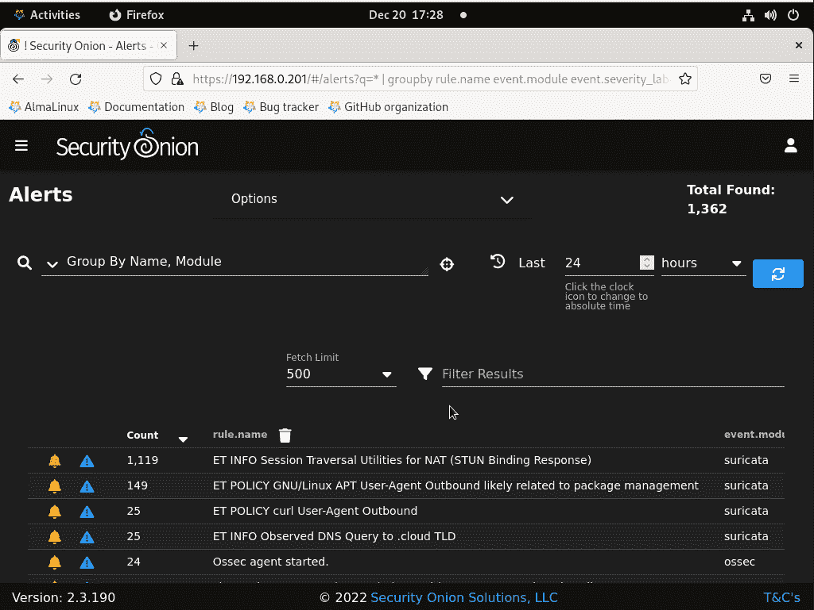

图 14.1：Security Onion 控制台

现在，让我们来关注一款非常酷的预构建防火墙设备，它还具有自己的入侵防御系统（IPS）。

## IPFire 及其内置的入侵防御系统（IPS）

当我写这本书的原版时，我在 Snort 部分讨论了 IPFire。当时，IPFire 内置了 Snort。这是一个很棒的想法，因为你有了一个边缘防火墙和一个 **入侵检测系统**（**IDS**），都在一个方便的包中。但在 2019 年夏季，IPFire 团队将 Snort 替换为他们自己的 IPS。因此，我将 IPFire 移到了它自己的章节。

> IDS 和 IPS 之间的区别在于，IDS 会通知你问题，但不会阻止它们。而 IPS 则会阻止这些问题。

如果你回想一下我们在*第四章*《用防火墙保护你的服务器 - 第一部分》和*第五章*《用防火墙保护你的服务器 - 第二部分》中的防火墙讨论，我完全忽略了讨论如何创建你需要的 **网络地址转换**（**NAT**）规则，以便设置边缘或网关类型的防火墙。那是因为有几种专门为此目的创建的 Linux 发行版和 BSD 发行版。其中一个这样的发行版就是 **IPFire**。

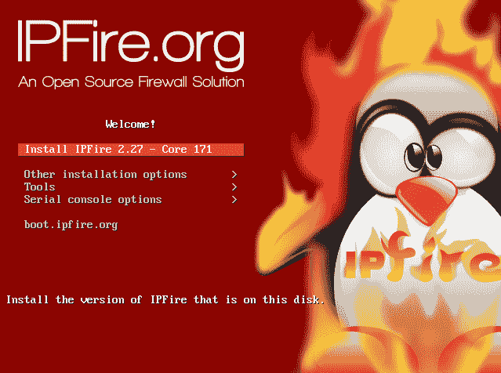

图 14.2：IPFire 安装器

IPFire 完全免费，并且只需要几分钟就能设置。你只需将它安装在至少有两个网络接口适配器的机器上，并根据你的网络配置进行配置。它是一种代理类型的防火墙，这意味着除了执行正常的防火墙包检查外，它还包括缓存、内容过滤和 NAT 功能。你可以以多种不同的配置方式设置 IPFire：

+   在有两个网络接口适配器的计算机上，你可以将一个连接到互联网，另一个连接到内部局域网（LAN）。

+   使用三个网络适配器，你可以将一个连接到互联网，一个连接到内部局域网，一个连接到**非军事区**（**DMZ**），在这个区域你可以放置面向互联网的服务器。

+   使用第四个网络适配器，你可以拥有我们刚才提到的所有功能，并且还能为无线网络提供保护。

说了这么多，我们来试试看吧。

### 实践实验 – 创建一个 IPFire 虚拟机

通常，你不会在虚拟机中运行 IPFire。相反，你会将其安装在至少有两个网络接口的物理机器上。但是，为了让你看到它的样子，先在虚拟机中进行设置是可以的。让我们开始吧：

> 你可以从他们的网站下载 IPFire: [`www.ipfire.org/`](https://www.ipfire.org/)

1.  创建一个有两个网络接口的虚拟机。将一个设置为桥接模式，另一个保持 NAT 模式。将 IPFire 安装到这个虚拟机中。在设置过程中，选择桥接适配器作为绿色接口，选择 NAT 适配器作为红色接口。

1.  安装 IPFire 后，你需要使用常规工作站的网页浏览器导航到 IPFire 仪表板。你可以使用以下 URL 进行访问：

`https://192.168.0.190:444`

1.  （当然，你需要将绿色接口的 IP 地址替换为你自己的地址。）

1.  在**防火墙**菜单下，你会看到**入侵防御**的选项。点击它进入这个页面，在这里你可以启用入侵防御。第一步是点击**添加提供者**按钮，它位于**规则集设置**部分下方。

    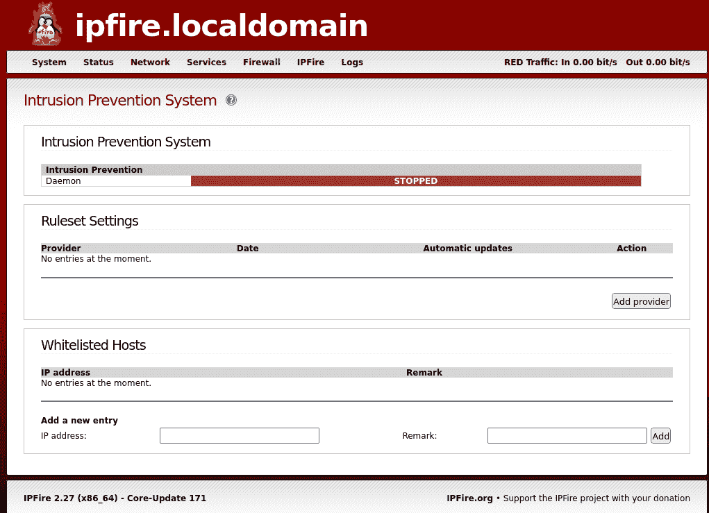

    图 14.3: 点击添加提供者按钮

1.  在下一页中，选择你想要使用的规则集。保持**启用自动更新**复选框为启用状态。然后，点击**添加**按钮：

    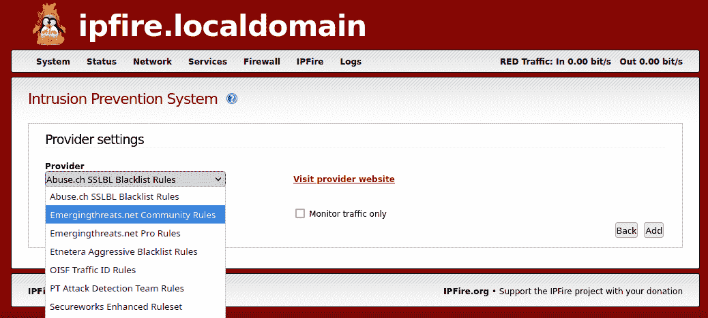

    图 14.4: 选择规则集

1.  然后，你将看到这个屏幕，在这里你可以选择要启用入侵防御的接口。（选择两个接口。）然后，勾选**启用入侵防御系统**复选框并点击保存：

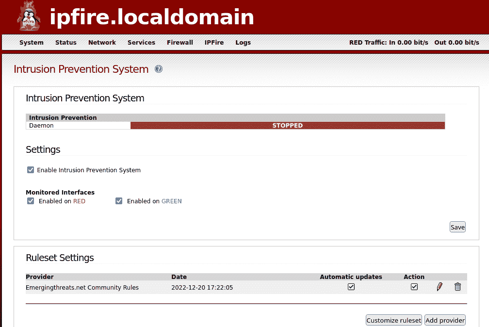

图 14.5: 启用 IPS

如果一切顺利，你将看到以下输出：

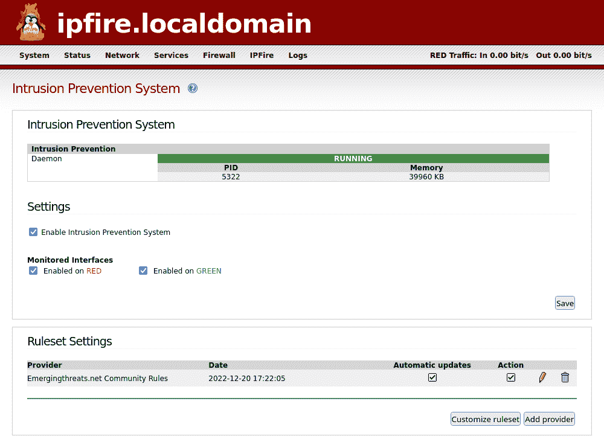

图 14.6: 启用 IPS 后的状态

1.  在**规则集设置**部分，点击**自定义规则集**按钮。在下一页中，点击你想要启用的规则。然后，在屏幕底部点击**应用**按钮：

    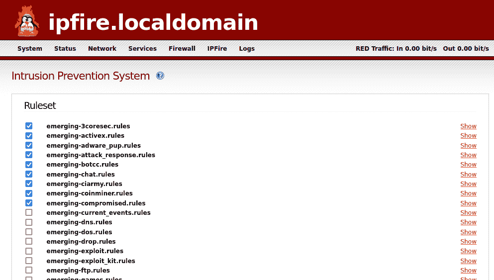

    图 14.7: 选择所需的规则

1.  通过选择**日志/IPS 日志**来查看 IPS 的工作情况。（注意，你看到的内容将取决于你启用了哪些规则。即使如此，可能需要一段时间才能看到日志条目。）

    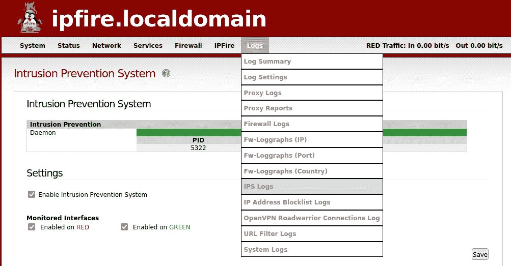

    图 14.8：查看 IPS 日志

1.  点击其他菜单项，查看 IPFire 的其他功能。

你已经完成了这个实验——祝贺你！

你刚刚看到了如何轻松设置一个带有独立网络 IPS 的边缘防火墙。接下来，我们来看一些扫描工具。

## 使用 Lynis 进行扫描与强化

Lynis 是另一款 FOSS 工具，你可以用它来扫描系统中的漏洞和不良的安全配置。它以便携式 shell 脚本的形式提供，不仅可以在 Linux 上使用，也能在多种 Unix 和类似 Unix 的系统上使用。这是一个多功能工具，你可以用它进行合规性审计、漏洞扫描或强化。与大多数漏洞扫描器不同，你需要在要扫描的系统上安装并运行 Lynis。根据 Lynis 的创始人所说，这样可以进行更深入的扫描。

Lynis 扫描工具有免费版，但其扫描功能有限。如果你需要 Lynis 所提供的全部功能，你需要购买企业版许可证。

### 在 Red Hat/CentOS 上安装 Lynis

Red Hat、CentOS 7 和 AlmaLinux 8/9 用户可以在 EPEL 仓库中找到最新版本的 Lynis。因此，如果你已安装 EPEL，如我在*第一章*《在虚拟环境中运行 Linux》所展示的那样，安装过程非常简单，只需执行以下命令：

```
sudo yum install lynis
```

### 在 Ubuntu 上安装 Lynis

Ubuntu 在其自身的仓库中提供了 Lynis，但版本稍微滞后于最新版本。如果你能接受使用较旧的版本，安装命令是：

```
sudo apt install lynis
```

> 如果你想要获取 Ubuntu 的最新版本，或者如果你想在那些没有 Lynis 的操作系统上使用 Lynis，你可以从 [`cisofy.com/downloads/lynis/`](https://cisofy.com/downloads/lynis/) 下载 Lynis。
> 
> > 这点很酷，因为一旦你下载了它，你就可以在任何 Linux、Unix 或类似 Unix 的操作系统上使用它。（这甚至包括 macOS，我通过在我的老款 Mac Pro 上运行 macOS High Sierra 进行了验证。）

由于可执行文件仅是一个普通的 shell 脚本，因此无需进行实际安装。你只需要提取归档文件，`cd` 进入结果目录，并从那里运行 Lynis：

```
tar xzvf lynis-3.0.8.tar.gz
cd lynis
sudo ./lynis -h
```

`lynis -h` 命令会显示帮助屏幕，以及你需要了解的所有 Lynis 命令。

### 使用 Lynis 进行扫描

无论你要扫描的操作系统是什么，Lynis 命令的使用方法都是一样的。唯一的不同是，如果你从网站下载的归档文件中运行它，你需要 `cd` 进入 `lynis` 目录，并在 `lynis` 命令前加上 `./`。（这是因为出于安全原因，你自己的主目录不在路径设置中，无法让 shell 自动找到可执行文件。）

要扫描已安装 Lynis 的系统，执行以下命令：

```
sudo lynis audit system
```

要扫描一个你刚下载了归档文件的系统，执行以下命令：

```
cd lynis
sudo ./lynis audit system
```

从你的主目录中的 shell 脚本运行 Lynis 会显示这个信息：

```
donnie@ubuntu:~/lynis$ sudo ./lynis audit system
. . .
[X] Security check failed
    Why do I see this error?
    -------------------------------
    This is a protection mechanism to prevent the root user from executing user created files. The files may be altered, or including malicious pieces of script.
   . . .
[ Press ENTER to continue, or CTRL+C to cancel ]
```

这并不会造成任何问题，所以你可以直接按回车键继续。如果看到这个信息真的让你很困扰，你可以按提示将 Lynis 文件的所有权更改为 root 用户。现在，我只会按回车键。

以这种方式运行 Lynis 扫描类似于对通用安全配置文件运行 OpenSCAP 扫描。主要的区别是，OpenSCAP 具有自动修复功能，而 Lynis 没有。Lynis 会告诉你它发现了什么，并建议如何修复它认为是问题的部分，但它不会为你修复任何问题。

空间不允许我展示完整的扫描输出，但我可以给你展示一些示例片段：

```
[+] Boot and services
------------------------------------
  - Service Manager                                           [ systemd ]
  - Checking UEFI boot                                        [ DISABLED ]
  - Checking presence GRUB                                    [ OK ]
  - Checking presence GRUB2                                   [ FOUND ]
    - Checking for password protection                        [ WARNING ]
  - Check running services (systemctl)                        [ DONE ]
        Result: found 21 running services
  - Check enabled services at boot (systemctl)                [ DONE ]
        Result: found 28 enabled services
  - Check startup files (permissions)                         [ OK ]
```

这个警告信息显示我没有为我的 GRUB2 引导加载程序设置密码保护。这可能是个大问题，也可能不是，因为唯一能利用这一点的方法是获得对机器的物理访问权限。如果这是一台锁在只有少数信任人员才能进入的房间里的服务器，那么我不会担心，除非适用的监管机构要求我这么做。如果它是一台放在开放隔间里的台式机，那么我肯定会修复这个问题。（我们将在*第十六章*，*忙碌蜂的安全小贴士与技巧*中查看 GRUB 密码保护。）

在**文件系统**部分，我们可以看到一些项目前面有**建议**标志：

```
[+] File systems
------------------------------------
  - Checking mount points
    - Checking /home mount point                              [ SUGGESTION ]
    - Checking /tmp mount point                               [ SUGGESTION ]
    - Checking /var mount point                               [ SUGGESTION ]
  - Query swap partitions (fstab)                             [ OK ]
  - Testing swap partitions                                   [ OK ]
  - Testing /proc mount (hidepid)                             [ SUGGESTION ]
  - Checking for old files in /tmp                            [ OK ]
  - Checking /tmp sticky bit                                  [ OK ]
  - ACL support root file system                              [ ENABLED ]
  - Mount options of /                                        [ NON DEFAULT ]
```

正如 Lynis 所建议的那样，这将出现在输出的最后部分：

```
. . .
. . .
  * To decrease the impact of a full /home file system, place /home on a separated partition [FILE-6310]
      https://cisofy.com/controls/FILE-6310/
  * To decrease the impact of a full /tmp file system, place /tmp on a separated partition [FILE-6310]
      https://cisofy.com/controls/FILE-6310/
  * To decrease the impact of a full /var file system, place /var on a separated partition [FILE-6310]
      https://cisofy.com/controls/FILE-6310/
. . .
. . .
```

我们最后要看的部分是输出结尾的扫描详细信息：

```
 Lynis security scan details:
  Hardening index : 67 [#############       ]
  Tests performed : 218
  Plugins enabled : 0
  Components:
  - Firewall               [V]
  - Malware scanner        [X]
  Lynis Modules:
  - Compliance Status      [?]
  - Security Audit         [V]
  - Vulnerability Scan     [V]
  Files:
  - Test and debug information      : /var/log/lynis.log
  - Report data                     : /var/log/lynis-report.dat
```

对于**组件**，在**恶意软件扫描器**旁有一个红色的**X**。这是因为我没有在这台机器上安装 ClamAV 或 maldet，因此 Lynis 无法进行病毒扫描。

对于**Lynis 模块**，我们在**合规状态**旁看到一个问号。这是因为这个功能是为 Lynis 企业版预留的，企业版需要付费订阅。正如我们在前一章中看到的，你可以使用 OpenSCAP 配置文件使系统符合多个不同的安全标准，而这不需要花费任何费用。使用 Lynis，你需要为合规性配置文件付费，但你可以选择更多的配置文件。例如，Lynis 企业版可以扫描 Sarbanes-Oxley 合规性问题，而 OpenSCAP 做不到。

我想说的最后一件事是关于 Lynis 企业版的。在以下截图中，这来自他们的网站，你可以看到当前的定价和不同订阅计划之间的差异：

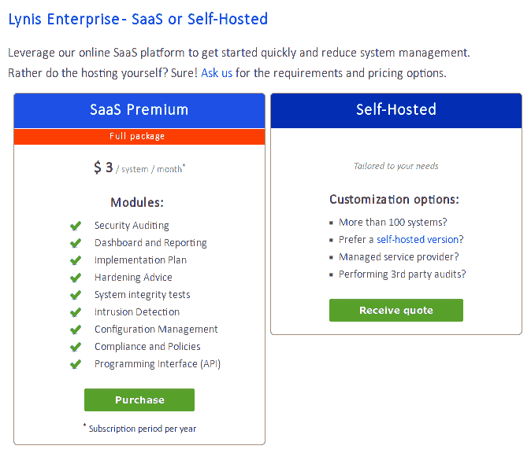

图 14.9：Lynis 企业版定价

如你所见，你有选择的余地。

> 你可以在 Cisofy 网站上找到定价信息：[`cisofy.com/pricing/`](https://cisofy.com/pricing/)

这基本上总结了我们对 Lynis 的讨论。接下来，我们将介绍一个外部漏洞扫描器。

## 使用 Greenbone 安全助手查找漏洞

在本书的前几个版本中，我提到过 OpenVAS，代表开放漏洞评估扫描器。它仍然存在，但其发布者已将其名称更改为**Greenbone 安全助手**（**GSA**）。尽管它是商业产品，但 Greenbone 也提供免费的开源社区版，完全免费。

Greenbone 安全助手是您用来执行远程漏洞扫描的工具。您可以使用它扫描各种网络设备。

三大安全发行版是 Kali Linux、Parrot Linux 和 Black Arch。它们主要面向安全研究人员和渗透测试人员，但它们也包含一些适用于普通 Linux 或 Windows 安全管理员的工具。GSA 就是其中之一。这三大安全发行版各有优缺点。由于 Kali 最为流行，我们将在演示中使用它。

> 您可以从[`www.kali.org/get-kali/`](https://www.kali.org/get-kali/)下载 Kali Linux。

当您访问 Kali 下载页面时，会看到许多选择。您可以下载适用于`x86`、`x86_64`和 Apple Silicon 的常规安装镜像。其他选项包括：

+   用于 ARM 设备的镜像，如树莓派

+   云

+   预构建的虚拟机镜像，适用于 VMWare、VirtualBox 和 QEMU

+   预构建的 Docker 容器

+   移动设备的镜像

+   Windows 子系统 Linux

Kali 是基于 Debian Linux 构建的，因此安装和更新它与安装和更新 Debian 几乎相同。

> Greenbone 安全助手是一个相当占用内存的程序，因此如果您在虚拟机中安装 Kali，请确保至少分配 3GB 内存。

安装 Kali 后，您首先需要做的就是更新它，这与更新任何 Debian/Ubuntu 类型的发行版相同。然后，像这样安装 GSA：

```
sudo apt update
sudo apt dist-upgrade
sudo apt install openvas
```

请注意，`openvas`软件包是一个**过渡软件包**，它将自动安装所有适当的 Greenbone 软件包。

GSA 安装完成后，您需要运行一个脚本，创建安全证书并下载漏洞数据库：

```
sudo gvm-setup
```

这个过程会花费很长时间，所以您不妨去拿个三明治和咖啡，等它运行完。当它最终完成时，您将看到用于登录 GSA 的密码。记下并保存在安全的地方：

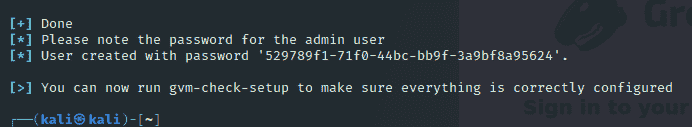

图 14.10：复制密码

接下来，通过以下操作启动 Greenbone 服务：

```
sudo gvm-check-setup
```

为确保一切正常运行，您需要手动同步数据流，然后重启 GVA 服务：

```
sudo greenbone-feed-sync --type GVMD_DATA
sudo greenbone-feed-sync --type SCAP
sudo greenbone-feed-sync --type CERT
sudo gvm-stop
```

等待 30 秒，然后重启服务：

```
sudo gvm-start
```

服务启动完成后，打开 Firefox 并访问 [`localhost:9392`](https://localhost:9392)。你会收到一个安全警告，因为 GVA 使用的是自签名的安全证书，但没关系。只需点击**高级**按钮，然后点击**添加例外**。

在登录页面，输入`admin`作为用户名，然后输入由`gvm-setup`脚本生成的密码。

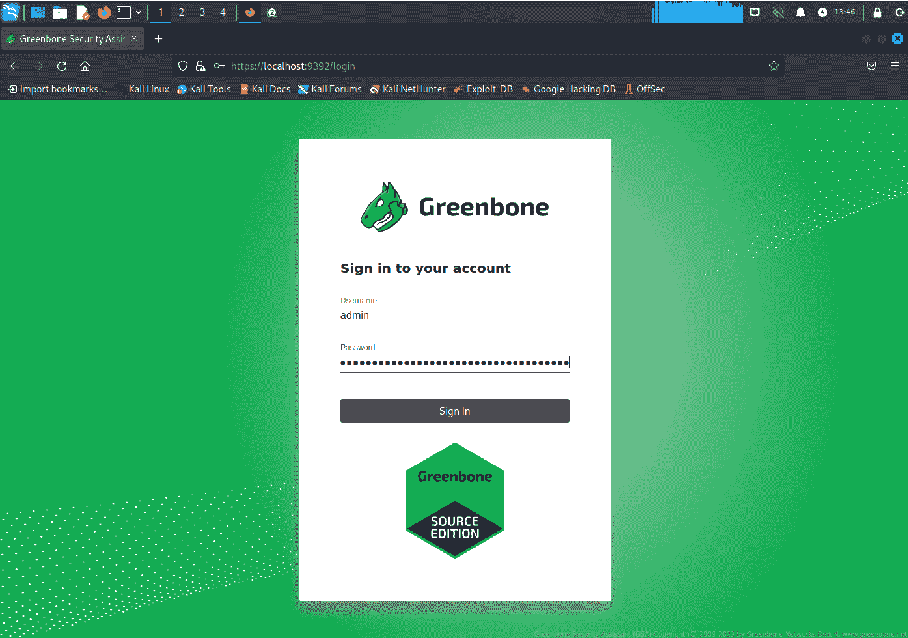

图 14.11：GVA 登录界面

有很多花里胡哨的功能可以通过 GVA 实现，但目前我们只看如何进行基础的漏洞扫描。首先，从 GVA 仪表盘的**扫描**菜单中选择**任务**：

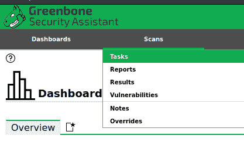

图 14.12：选择任务

当任务页面加载出来后，寻找左上角的小魔法棒。将鼠标指针悬停在这个魔法棒上，你会看到任务向导的各种选项：

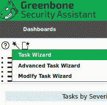

图 14.13：任务向导选项

目前，我们只选择**任务向导**选项，它将为我们选择所有默认的扫描设置。你需要做的唯一事情就是输入你想扫描的机器的 IP 地址，然后开始扫描：

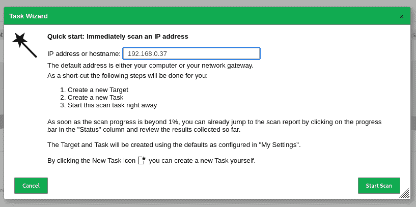

图 14.14：开始基础扫描

扫描需要一些时间，所以你不妨去喝杯饮料：

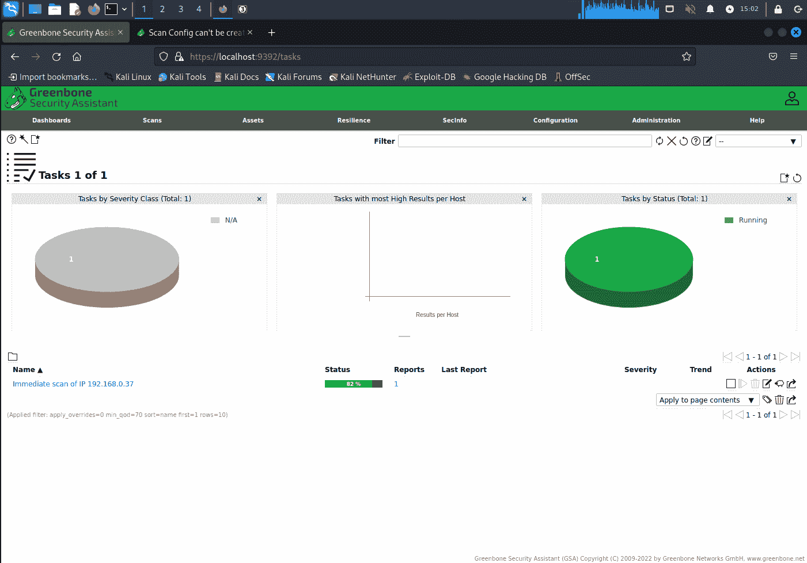

图 14.15：执行基础扫描

你正在进行的扫描类型名为**全面与快速**，这是目前提供的最全面的扫描类型。要选择其他扫描类型并配置其他扫描选项，请使用**高级任务向导**，如图所示：

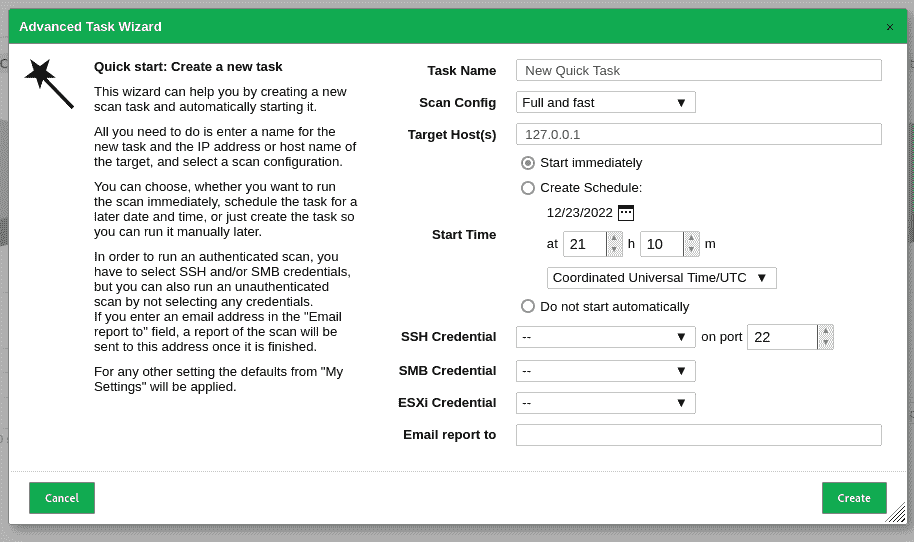

图 14.16：选择扫描选项

扫描完成后，点击**扫描/结果**菜单项：

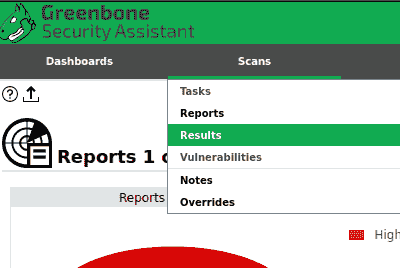

图 14.17：查看结果

为了向你展示一些有趣的内容，我特意选择了一台接近 20 年历史、操作系统过时且存在大量漏洞的目标机器。在这里，你看到这台机器使用了弱加密算法进行 Secure Shell 连接，且被分类为中等严重性问题。更糟糕的是，它还支持 SSH 版本 1，这被分类为高严重性问题。天哪！

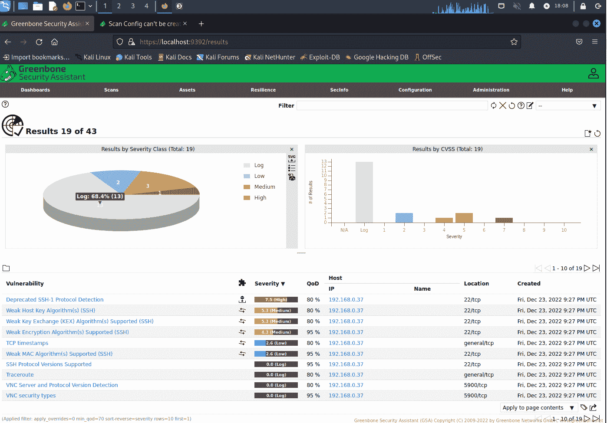

图 14.18：扫描结果

你还需要注意那些未标记为漏洞的项目。例如，**VNC 安全类型**项显示端口 `5900` 是开放的。这意味着**虚拟网络计算**（**VNC**）守护进程正在运行，允许用户远程登录到该机器的桌面。如果这台机器是面对互联网的，那将是一个真正的问题，因为 VNC 并不像 Secure Shell 那样有真正的安全性。

点击一个漏洞项，我可以看到该漏洞的解释：

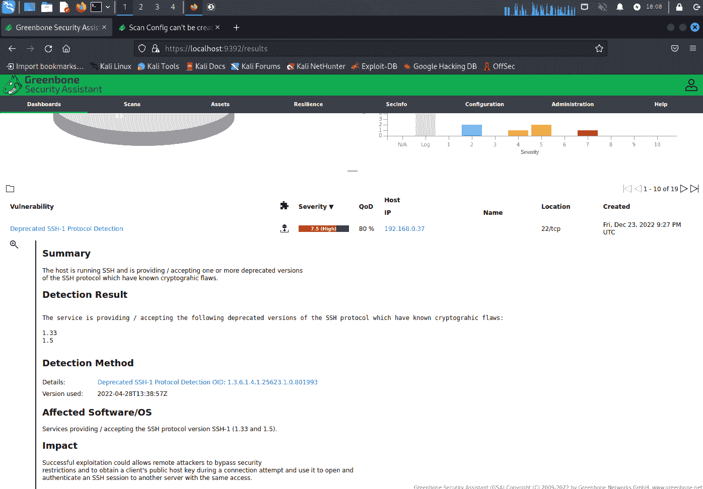

图 14.19：漏洞解释

请记住，目标机器在这种情况下是一台桌面计算机。如果是服务器，可能会遇到更多问题。

这基本上总结了 Greenbone 安全助手的内容。如前所述，你可以用它做很多非常棒的事情。不过，我展示给你的这些内容应该足以帮助你入门。你可以尝试使用不同的扫描选项，看看结果的不同。

> 如果你想了解更多关于 Kali Linux 的信息，你可以在 Packt Publishing 网站上找到许多相关的书籍。

好了，你现在知道如何使用 GSA 进行漏洞扫描了。接下来，我们来看看一个专门为 Web 服务器设计的扫描器。

## 使用 Nikto 进行 Web 服务器扫描

我们刚刚看过的 Greenbone 安全助手是一个通用的漏洞扫描工具。它能够发现大多数操作系统或大多数服务器守护进程的漏洞。不过，正如我们刚才所见，GSA 扫描可能需要较长时间运行，可能也并不是你需要的。

Nikto 是一个特殊用途的工具，只有一个目的。也就是，它专门用于扫描 Web 服务器，仅此而已。它易于安装，易于使用，并且能够快速进行全面的 Web 服务器扫描。

### Kali Linux 中的 Nikto

如果你使用 Kali Linux，你会发现 Nikto 已经在**漏洞分析**菜单下安装好了：

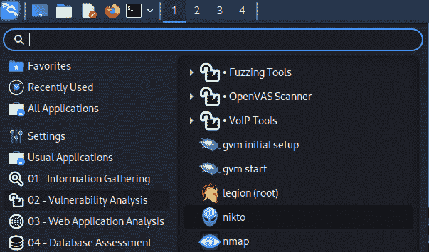

图 14.20：Kali Linux 菜单中的 Nikto

然而，最好的做法是忽略它，而是直接从 GitHub 下载更新的版本。因为你看到的这里，安装在 Kali 上的 Nikto 签名数据库自 2019 年以来就没有更新过：

```
┌──(kali㉿kali)-[~]
└─$ cd /var/lib/nikto/databases 

┌──(kali㉿kali)-[/var/lib/nikto/databases]
└─$ ls -l
total 1652
-rw-r--r-- 1 root root    2093 Mar  9  2019 db_404_strings
-rw-r--r-- 1 root root    3147 Mar  9  2019 db_content_search
-rw-r--r-- 1 root root   15218 Mar  9  2019 db_dictionary
. . .
. . .
-rw-r--r-- 1 root root    4868 Mar  9  2019 db_variables

┌──(kali㉿kali)-[/var/lib/nikto/databases]
└─$ 
```

你以前可以使用`sudo nikto -update`命令来更新数据库，但现在不再有效，因为作者已经弃用了`-update`选项。（我曾希望通过正常的`sudo apt dist-upgrade`命令来获取一些更新，但没运气。）现在，作者建议使用`git`命令来下载和更新 Nikto。那么，让我们来看一下如何操作。

#### 实验室操作——从 Github 安装 Nikto

为了简化操作，我们将在 Kali 上进行这个操作，因为它已经具备了 Nikto 运行所需的所有`perl`模块。如果你在 Debian 或 Ubuntu 上操作，它也应该能正常工作，但你需要自己去找需要的`perl`模块。而且，忘记在 AlmaLinux 上进行此操作，因为所需的`perl`模块甚至不在任何 AlmaLinux 或 EPEL 仓库中。（当然有其他安装方式，但这超出了本书的范围。）

1.  在你的普通用户主目录中，克隆 Nikto 仓库。然后，`cd` 进入 `nikto` 目录，并检出当前分支：

```
git clone https://github.com/sullo/nikto.git
cd nikto
git checkout nikto-2.5.0
```

1.  要运行 Nikto，进入程序子目录，然后从那里调用 Nikto。例如，要查看 Nikto 帮助屏幕，可以这样做：

```
cd program
./nikto -help
```

1.  定期更新 Nikto 签名数据库。只需 `cd` 进入 `nikto` 目录并执行：

```
git pull
```

1.  实验结束

接下来，让我们用 Nikto 做一些有用的事情。

#### 使用 Nikto 扫描 Web 服务器

1.  要进行简单扫描，使用 `-h` 选项指定目标主机，如下所示：

```
cd nikto/program
./nikto -h 192.168.0.9
./nikto -h www.example.com
```

1.  让我们看一下部分输出。以下是顶部部分：

```
+ Allowed HTTP Methods: POST, OPTIONS, GET, HEAD
+ OSVDB-396: /_vti_bin/shtml.exe: Attackers may be able to crash FrontPage by requesting a DOS device, like shtml.exe/aux.htm -- a DoS was not attempted.
+ /cgi-bin/guestbook.pl: May allow attackers to execute commands as the web daemon.
+ /cgi-bin/wwwadmin.pl: Administration CGI?
+ /cgi-bin/Count.cgi: This may allow attackers to execute arbitrary commands on the server
```

在顶部，我们可以看到有一个 `shtml.exe` 文件，它显然是用于 FrontPage 网页创作程序的。我不明白它为什么在这里，考虑到这是一个 Linux 服务器，而那个是 Windows 可执行文件。Nikto 告诉我，通过存在这个文件，有人可能会对该网站发起**拒绝服务**（**DOS**）攻击。

接下来，我们可以看到 `/cgi-bin/` 目录中有各种脚本。从解释信息中可以看出，这不是一件好事，因为它可能允许攻击者在我的服务器上执行命令。

让我们看看第二部分：

```
+ OSVDB-28260: /_vti_bin/shtml.exe/_vti_rpc?method=server+version%3a4%2e0%2e2%2e2611: Gives info about server settings.
+ OSVDB-3092: /_vti_bin/_vti_aut/author.exe?method=list+documents%3a3%2e0%2e2%2e1706&service%5fname=&listHiddenDocs=true&listExplorerDocs=true&listRecurse=false&listFiles=true&listFolders=true&listLinkInfo=true&listIncludeParent=true&listDerivedT=false&listBorders=fals: We seem to have authoring access to the FrontPage web.
```

这里，我们可以看到 `vti_bin` 目录中有一个 `author.exe` 文件，这理论上可能允许某人获得创作权限。

现在，看看最后部分：

```
+ OSVDB-250: /wwwboard/passwd.txt: The wwwboard password file is browsable. Change wwwboard to store this file elsewhere, or upgrade to the latest version.
+ OSVDB-3092: /stats/: This might be interesting...
+ OSVDB-3092: /test.html: This might be interesting...
+ OSVDB-3092: /webstats/: This might be interesting...
+ OSVDB-3092: /cgi-bin/wwwboard.pl: This might be interesting...
+ OSVDB-3233: /_vti_bin/shtml.exe/_vti_rpc: FrontPage may be installed.
+ 6545 items checked: 0 error(s) and 15 item(s) reported on remote host
+ End Time:           2017-12-24 10:54:21 (GMT-5) (678 seconds)
```

最后一个值得关注的项目是 `wwwboard` 目录中的 `passwd.txt` 文件。显然，这个密码文件是可以浏览的，这绝对不是一件好事。

现在，在你指责我编造这些问题之前，我会透露这是对一个实际生产网站进行的扫描，且这个网站是在一个真实的托管服务上。（是的，我确实获得了扫描许可。）所以，这些问题是真实存在的，并且需要修复。

以下是我扫描一个运行 WordPress 的 Web 服务器时获得的其他一些示例消息：

```
HTTP TRACK method is active, suggesting the host is vulnerable to XST
Cookie wordpress_test_cookie created without the httponly flag
```

长话短说，这两个问题可能允许攻击者窃取用户凭证。在这种情况下，解决方法是查看 WordPress 官方是否发布了修复此问题的更新。

那么，我们如何保护 Web 服务器免受这些漏洞的攻击呢？让我们来看看：

+   正如我们在第一个例子中看到的，你需要确保你的 Web 服务器上没有任何风险较大的可执行文件。在这种情况下，我们发现了两个 `.exe` 文件，它们在我们的 Linux 服务器上可能不会造成任何伤害，因为 Windows 可执行文件无法在 Linux 上运行。另一方面，这可能是一个伪装成 Windows 可执行文件的 Linux 可执行文件。我们还发现了一些 `perl` 脚本，这些脚本在 Linux 上肯定能运行，可能会带来问题。

+   如果有人在你的 web 服务器上植入恶意脚本，你会希望有某种强制访问控制措施，比如 SELinux 或 AppArmor，这可以防止恶意脚本访问不应该访问的内容。（有关详细信息，请参阅*第十章*，*使用 SELinux 和 AppArmor 实施强制访问控制*）

+   你还可以考虑安装 Web 应用防火墙，如 ModSecurity。由于篇幅限制，我无法详细介绍 ModSecurity，但你可以在 Packt 出版公司的网站上找到一本相关书籍。

+   保持系统更新，尤其是当你使用基于 PHP 的内容管理系统（如 WordPress）时。如果你关注 IT 安全新闻，你会发现关于 WordPress 漏洞的报道比你希望的还要频繁。

> 我不能透露我扫描的站点的 URL，但你可以从[`www.vulnhub.com/`](https://www.vulnhub.com/)下载一个易受攻击的虚拟机
> 
> > 选择一个虚拟机进行下载，然后将其导入到 VirtualBox 中。为此，在**文件**菜单中选择**导入设备**。

你还可以通过在命令行中输入`./nikto`查看其他扫描选项。不过，目前这些足以让你开始进行基本的 web 服务器扫描。

## 总结

我们已经达成了旅程中的又一个里程碑，并且看到了很酷的东西。我们从讨论设置 Snort 作为 NIDS 的基础开始。然后，我向你展示了如何通过部署一个已经设置好并准备就绪的专业 Linux 发行版来“作弊”。作为奖励，我还展示了一个快速简单的边缘防火墙设备，它内置了网络入侵防御系统。

接下来，我向你介绍了 Lynis，以及你如何使用它扫描系统中的各种漏洞和合规性问题。最后，我们通过 Greenbone Security Assistant 和 Nikto 的演示做了总结。

在下一章，我们将讨论如何阻止某些应用程序运行。下次见。

## 问题

1.  以下哪项最能描述 IPFire？

    1.  一种内置网络入侵检测系统的主机防火墙设备

    1.  一种内置网络入侵检测系统的边缘防火墙设备

1.  以下哪个工具最适合扫描 Sarbanes-Oxley 合规性问题？

    1.  Lynis

    1.  Lynis 企业版

    1.  Greenbone Security Assistant

    1.  OpenSCAP

1.  以下哪个最能代表 Snort 的功能？

    1.  HIDS

    1.  GIDS

    1.  NIDS

    1.  FIDS

1.  以下哪项工具你会选择作为通用的外部漏洞扫描器？

    1.  Greenbone Security Assistant

    1.  Nikto

    1.  OpenSCAP

    1.  Lynis

1.  以下问题中，使用 Nikto 扫描最有可能发现哪些问题？

    1.  Samba 服务正在运行，尽管不应该运行

    1.  根用户账户通过 SSH 暴露在互联网上

    1.  可能存在恶意脚本驻留在 CGI 目录中

    1.  根用户账户配置了一个弱密码

1.  Lynis 的独特特征是什么？

    1.  它是一个专有的、闭源的漏洞扫描器。

    1.  它是一个可以用于扫描任何 Linux、Unix 或类 Unix 操作系统漏洞的 shell 脚本。

    1.  它是一个外部漏洞扫描器。

    1.  它只能安装在特定的安全发行版上，例如 Kali Linux。

1.  在 Snort 中你最可能发现哪些问题？

    1.  一个密码弱的 root 用户账户

    1.  没有启用防火墙的服务器

    1.  网络上有加密货币挖矿恶意软件活动

    1.  通过 SSH 暴露到互联网上的 root 用户账户

## 进一步阅读

+   Lynis 首页：[`cisofy.com/lynis/`](https://cisofy.com/lynis/)

+   Lynis 和 auditd 的区别：[`linux-audit.com/how-are-auditd-and-lynis-different/`](https://linux-audit.com/how-are-auditd-and-lynis-different/)

+   Greenbone 首页：[`securityonionsolutions.com/`](https://securityonionsolutions.com/)

+   Snort 首页：[`www.snort.org/`](https://www.snort.org/)

+   Nikto 首页：[`cirt.net/nikto2`](https://cirt.net/nikto2)

+   Security Onion 首页：[`securityonionsolutions.com/`](https://securityonionsolutions.com/)

+   安装 Greenbone 安全管理器的教程：[`youtu.be/OUiRTv4Q80c`](https://youtu.be/OUiRTv4Q80c)

## 答案

1.  b

1.  b

1.  c

1.  a

1.  c

1.  b

1.  c
