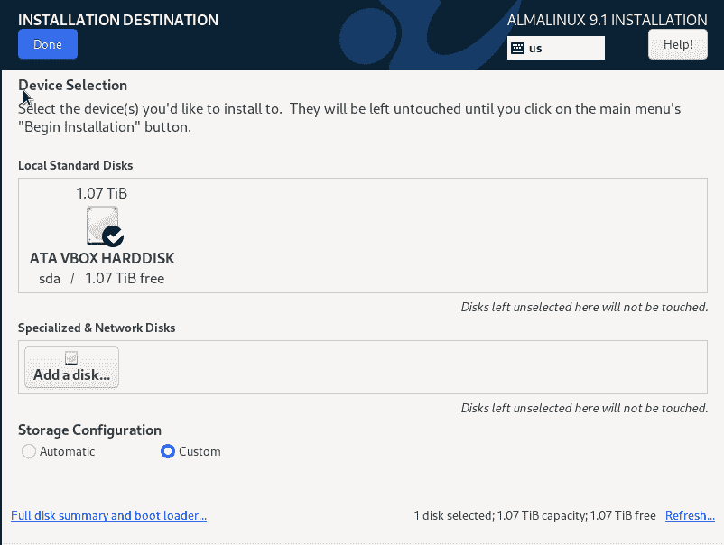
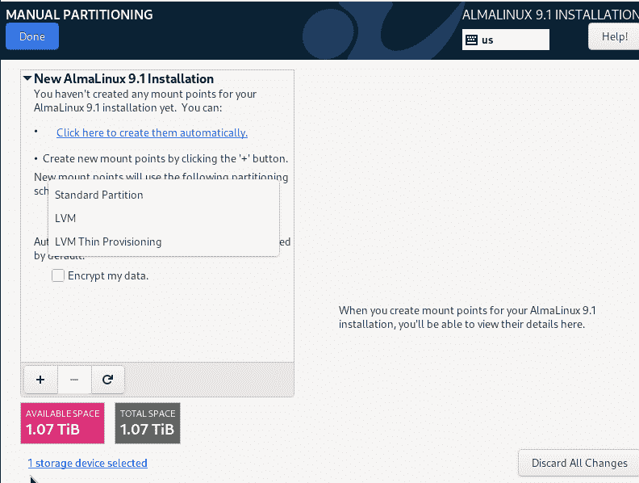
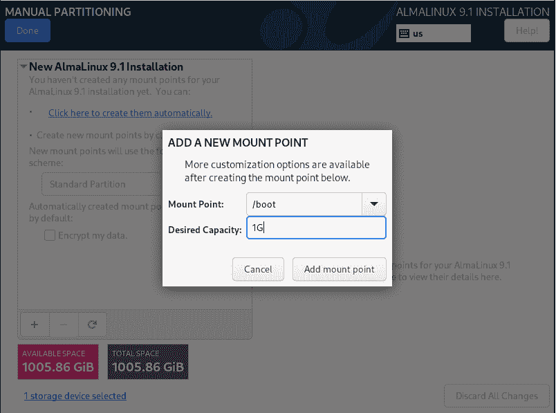
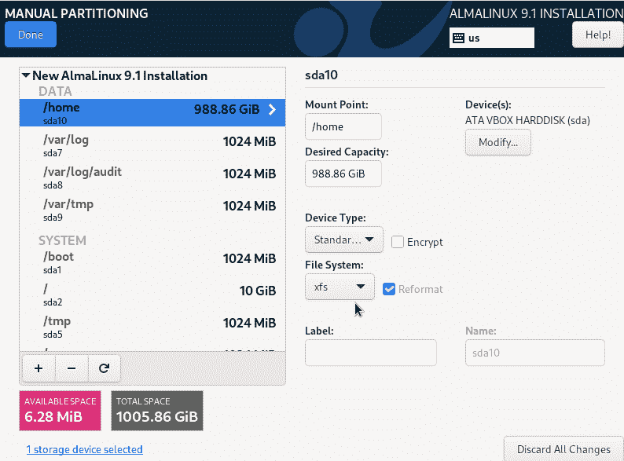
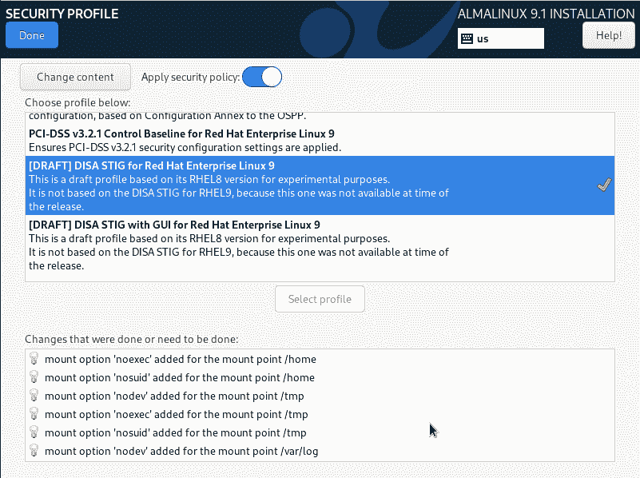

# 第十四章：15 防止不必要的程序运行

## 在 Discord 上加入我们的书籍社区

[`packt.link/SecNet`](https://packt.link/SecNet)


曾几何时，我们不需要太担心 Linux 恶意软件。虽然 Linux 用户现在仍不需要担心病毒，但还有其他类型的恶意软件确实能让 Linux 用户的日子变得糟糕。种植在你服务器上的加密货币挖矿程序会消耗内存和 CPU 时间，导致服务器比应该的工作更繁重，消耗更多的电力。勒索软件，它可以加密重要文件或系统引导加载程序，使这些重要文件甚至整个系统无法访问。即使支付了勒索款项，也不能保证你的系统会恢复正常。防止这些程序造成损害的一种方法是，只允许授权程序运行，阻止其他所有程序。这是我们本章要讨论的两个方法之一：

+   使用 *no* 选项挂载分区

+   在 Red Hat 类型系统上使用 `fapolicyd`

所以，如果你准备好了，我们就开始吧。

## 使用 no 选项挂载分区

在 *第十二章*，*扫描、审计与加固* 中，我向你展示了 OpenSCAP 如何自动使你的 Linux 系统符合某些监管机构的安全标准。我还告诉你一个不太方便的真相，那就是 OpenSCAP 无法做到的事情，某些任务需要你自己完成。它无法做的事情之一就是像一些监管机构要求的那样为你的系统驱动器分区。例如，美国政府使用的 **安全技术实施指南**（**STIG**）要求以下 Linux 系统和数据目录必须挂载到独立的分区上：

+   `/var`

+   `/var/log/`

+   `/var/tmp/`

+   `/var/log/audit/`

+   `/tmp/`

+   `/home/`

+   `/boot/`

```
/boot/efi/ (You’ll only have this one if your machine is set up in EFI mode.)
```

这是因为有两个原因：

+   如果 Linux 操作系统的根分区 (`/`) 太满，它可能会导致操作系统完全卡死。将这些目录挂载到独立的分区上可以帮助防止 `/` 分区被填满。

+   STIGs，以及可能的其他安全规定，要求这些分区挂载时使用选项，以防止在其上运行可执行程序，禁止 SGID 和 SUID 文件权限生效，并防止在其上创建设备文件。

正如我之前提到的，OpenSCAP 不会自动为你设置这种分区方案。所以，你需要在安装操作系统时进行设置。这需要仔细规划，以确保分区大小正确。我是说，你不想通过将某些分区做得太大而浪费空间，也不想在真正需要额外空间的分区上出现空间不足的情况。

> 在我开始写这一章的几周前，RHEL 9.1 及其所有克隆版本已经发布。你可能已经注意到，在 9.1 的安装程序中存在一个在 9.0 安装程序中没有的 bug。也就是说，创建普通用户账户的选项在安装程序界面上不可见。其实，它是存在的，只是你看不见，也无法向下滚动找到它。要显示这个选项，只需要不断按 Tab 键，直到你高亮显示了创建 root 用户密码的选项。然后，再按一次 Tab 键，再按回车键。（当然，等你读到这本书时，问题可能已经被修复了。）

要设置这个，你需要选择安装程序中的自定义分区方案选项。为了让这个过程稍微真实一些，将虚拟机的虚拟硬盘大小设置为大约 1 TB。（如果你的宿主机硬盘上没有那么多空间也没关系，VirtualBox 会创建一个动态大小的虚拟硬盘，除非你放入 1 TB 的文件，否则不会占用宿主硬盘上 1 TB 的空间。）让我们来看看在 AlmaLinux 9 中是如何显示的：



图 15.1：选择创建自定义分区方案

选择**Custom**选项后，点击屏幕顶部的**Done**按钮。在下一个屏幕上，点击`+`框来创建一个挂载点。请注意，你可以创建标准分区、逻辑卷或精简配置的逻辑卷。（我会选择标准分区。）



图 15.2：创建挂载点

我们从创建`/boot/`挂载点开始：



图 15.3：创建第一个挂载点

创建我在上述列表中提到的其余挂载点。你的完成方案可能如下所示：



图 15.4：创建其余的挂载点

当然，你的使用场景将决定你为每个分区设置多大的空间。在这里，你可以看到`/home/`目录最大，这表明我想把这台机器用作 Samba 文件服务器。如果我将这台机器用作其他用途，比如数据库服务器，我会根据需要调整这些分区的大小。

> 在 RHEL 安装程序中有一个长期存在的上游 bug，这个 bug 同样影响 RHEL 的克隆版本。也就是说，无论每个分区需要多少空间，你必须将每个分区的大小设置为至少 1 GB。否则，安装将失败，并显示`error in POSTTRANS scriptlet in rpm package kernel-core`的错误信息。这个问题已经存在很长时间了，但仍然没有被修复。（是的，虽然这样浪费了一些磁盘空间，但我们无能为力。）

现在，我们要稍微作弊一下。我们假装正在处理美国政府的要求，必须符合 STIG 规范。所以，在安装界面上，我们点击应用安全配置文件的选项。接下来的界面中，我们滚动到看到 STIG 配置文件的位置，并选择它。在底部，你会看到该配置文件根据需要将`noexec`、`nodev`和`nosuid`选项添加到分区中。（`/var/`分区只需要`nodev`选项，`/boot/`分区只需要`nodev`和`nosuid`选项。）



图 15.5: 应用 STIG 配置文件

以下是这三种挂载选项的作用：

+   **noexec**：任何挂载了此选项的分区上的可执行文件都不能运行。（这包括可执行的 Shell 脚本，除非你使用`sh`来调用脚本。稍后我会展示更多关于这方面的内容。）

+   **nodev**：用户无法在挂载了此选项的分区上创建任何设备文件。

+   **nosuid**：在挂载了此选项的分区上，添加 SUID 或 SGID 权限对文件没有任何影响。

安装完成后，我们的`/etc/fstab`文件将会是这样：

```
UUID=72d0a3b3-cd07-45c0-938e-4e3377750adb /             xfs     defaults        0 0
UUID=7bf3315e-525e-4940-b562-7e0b634d65de /boot       xfs     defaults,nosuid,nodev 0 0
UUID=4df2f723-e875-4194-9ccd-b4a2733fd617 /home       xfs     defaults,noexec,nosuid,nodev 0 0
UUID=d89b01b1-c3ee-48b6-bb40-0311fdd2838a /tmp        xfs     defaults,nodev,noexec,nosuid 0 0
UUID=d79889b0-1635-47d5-950d-8dbca088c464 /var         xfs     defaults,nodev        0 0
UUID=be9a3d41-0e07-4466-8eb7-57fb850df2d4 /var/log     xfs     defaults,nodev,noexec,nosuid 0 0
UUID=ed001588-333b-4027-bef1-754fcc5e868d /var/log/audit     xfs     defaults,nodev,noexec,nosuid 0 0
UUID=05c1b1e9-7f32-4791-9d41-492fce6f5166 /var/tmp     xfs     defaults,nodev,noexec,nosuid 0 0
UUID=c4fdabb8-7e45-4717-b7f5-1cad5f8e7720 none            swap    defaults        0 0
tmpfs /dev/shm tmpfs defaults,relatime,inode64,nodev,noexec,nosuid 0 0
```

（注意，某些行在打印的页面上可能会换行。）

现在，让我们看看能否从这些目录中的任何一个运行可执行脚本。在我自己的主目录中，我创建了一个如下的 Shell 脚本：

```
#!/bin/bash
echo "This is a test of the noexec option."
exit
```

在为自己添加可执行权限后，我尝试运行它。然后，我将其复制到`/tmp/`目录并再次尝试运行。以下是我得到的结果：

```
[donnie@localhost ~]$ chmod u+x donnie_script.sh 
[donnie@localhost ~]$ ./donnie_script.sh
-bash: ./donnie_script.sh: Permission denied
[donnie@localhost ~]$ cp donnie_script.sh /tmp
[donnie@localhost ~]$ cd /tmp
[donnie@localhost tmp]$ ./donnie_script.sh
-bash: ./donnie_script.sh: Permission denied
[donnie@localhost tmp]$
```

所以，我不能运行它，至少作为普通用户不能。但是，如果我用`sudo`试试呢？让我们看看：

```
[donnie@localhost tmp]$ sudo ./donnie_script.sh
[sudo] password for donnie: 
sudo: unable to execute ./donnie_script.sh: Permission denied
[donnie@localhost tmp]$
```

很酷，`noexec`选项实际上有效。好吧，对于这个例子是有效的。如果我们用`sh`调用脚本会怎样呢？让我们看看：

```
[donnie@localhost ~]$ sh ./donnie_script.sh
This is a test of the noexec option.
[donnie@localhost ~]$ cd /tmp
[donnie@localhost tmp]$ sh ./donnie_script.sh
This is a test of the noexec option.
[donnie@localhost tmp]$
```

所以，对于 Shell 脚本，阻止功能并不完美。让我们看看编译后的可执行文件会发生什么。首先，从这里下载 DERO 加密货币项目的命令行钱包/挖矿程序：

[`dero.io/download.html#linux`](https://dero.io/download.html#linux)

将文件传输到虚拟机并解压：

```
[donnie@localhost ~]$ tar xzvf dero_linux_amd64.tar.gz 
./dero_linux_amd64/
./dero_linux_amd64/Start.md
./dero_linux_amd64/explorer-linux-amd64
./dero_linux_amd64/simulator-linux-amd64
./dero_linux_amd64/dero-miner-linux-amd64
./dero_linux_amd64/derod-linux-amd64
./dero_linux_amd64/dero-wallet-cli-linux-amd64
[donnie@localhost ~]$
```

请注意，所有可执行文件的执行权限已经设置好，所以你无需再添加它。

现在，进入关键时刻。进入`dero_linux_amd64`目录并尝试运行`derod-linux-amd64`程序：

```
[donnie@localhost ~]$ cd dero_linux_amd64/
[donnie@localhost dero_linux_amd64]$ ./derod-linux-amd64
-bash: ./derod-linux-amd64: Permission denied
[donnie@localhost dero_linux_amd64]$
```

由于这是一个已编译的可执行文件，而不是 Shell 脚本，在任何情况下，在命令前加上`sh`都不会对我们有所帮助。总之，保留好这些 DERO 的内容，因为我们将在下一节中再次使用它。

> 如果你想知道什么是 DERO，可以把它当作是以太坊的私人版本。你可以在其上构建其他代币并创建智能合约应用，就像在以太坊上做的那样。不同之处在于，DERO 保护你的隐私，而以太坊则没有。

在*第十二章*，*扫描、审计与加固*中，我曾向你展示过，只有 RHEL 类型的发行版在安装操作系统时才会给我们提供应用 SCAP 配置文件的选项。在非 RHEL 的发行版上，你需要在安装完成后应用 SCAP 配置文件，前提是你的发行版提供了适用的配置文件。无论如何，如果你不需要应用整个 SCAP 配置文件，但仍希望将这些安全选项添加到你的分区，或者你的发行版没有可用的 SCAP 配置文件，只需手动编辑`/etc/fstab`文件即可将它们添加进去。

接下来，我们将看看另一种控制机制，至少目前为止，它是 Red Hat 世界独有的。

## 理解 fapolicyd

**文件访问策略守护进程**（**fapolicyd**）是一个相对较新的功能，添加到了 Red Hat Enterprise Linux 及其各种克隆版本中。它是自由软件，任何人都可以使用，但目前为止，Ubuntu 和 SUSE 还没有为它们的发行版提供支持。为了快速了解它是如何工作的，请回到你刚才使用的虚拟机。首先，将整个`derod-linux-amd64`目录移动到`/`分区的顶层：

```
[donnie@localhost ~]$ sudo mv dero_linux_amd64/ /
[sudo] password for donnie: 
[donnie@localhost ~]$ 
```

通过移动目录而不是复制目录，你的目录和文件的所有权将被保留：

```
[donnie@localhost /]$ ls -ld dero_linux_amd64/
drwx------. 3 donnie donnie 4096 Jan  2 15:42 dero_linux_amd64/
[donnie@localhost /]$
```

现在，将你创建的脚本复制到`/usr/local/bin/`：

```
[donnie@localhost dero_linux_amd64]$ cd
[donnie@localhost ~]$ sudo cp donnie_script.sh /usr/local/bin
[sudo] password for donnie: 
[donnie@localhost ~]$
```

当你查看这个脚本文件的权限设置时，你会看到一些非常不寻常的地方：

```
[donnie@localhost ~]$ cd /usr/local/bin
[donnie@localhost bin]$ ls -l
total 16364
-rwx------. 1 root root       61 Dec 31 16:01 donnie_script.sh
[donnie@localhost bin]$
```

你会看到，执行`cp`操作时，文件的所有权会自动更改为目标目录的所有者，在这种情况下就是 root 用户。这是正常操作，所以没有什么特别之处。奇怪的是，这个文件的权限设置为`700`。这与我们的 STIG 配置文件做的另一件事有关。也就是说，STIG 配置文件在这个系统上设置了**UMASK**为`077`，如我们所见：

```
[donnie@localhost ~]$ umask
0077
[donnie@localhost ~]$
```

这意味着，你创建的任何普通文件将仅对所有者具有读写权限，而你创建的任何目录将仅对所有者具有读、写和执行权限。为了让这个演示能够工作，我们需要将权限设置更改为`755`，像这样：

```
[donnie@localhost bin]$ sudo chmod 755 donnie_script.sh
[sudo] password for donnie: 
[donnie@localhost bin]$ ls -l
total 16364
-rwxr-xr-x. 1 root root       61 Dec 31 16:01 donnie_script.sh
[donnie@localhost bin]$
```

很棒，我们现在可以让演示正常工作了。我们将从进入`/dero-linux-amd64/`目录开始，尝试调用`derod-linux-amd64`可执行文件：

```
[donnie@localhost ~]$ cd /dero_linux_amd64/
[donnie@localhost dero_linux_amd64]$ derod-linux-amd64 
-bash: /dero_linux_amd64/derod-linux-amd64: Operation not permitted
[donnie@localhost dero_linux_amd64]$
```

即使你现在是在一个没有`noexec`选项挂载的分区中调用这个程序，你仍然不能运行它。这是因为它现在被`fapolicyd`阻止了。也就是说，尽管目录和可执行文件都属于你，但你仍然无法用普通用户权限运行它。

> `fapolicyd`有一个特殊的行为，我在任何文档中都没看到过，也是在偶然间才发现的。也就是说，只有当普通的非特权用户尝试运行不受信任的程序时，它才会阻止这些程序。但你可以通过正确的`sudo`权限来运行它们。（这更能说明，只应授予除最信任的管理员外其他用户有限的`sudo`权限。）

接下来，让我们看看如何使用 Shell 脚本：

```
[donnie@localhost bin]$ donnie_script.sh 
This is a test of the noexec option.
[donnie@localhost bin]$
```

那么，为什么我可以在这里调用这个脚本，却不能在我的主目录中调用它呢？原因是，在我的主目录中，`noexec`挂载选项阻止了脚本的运行。但在`/usr/local/bin/`目录下，我们没有这个挂载选项。这里只有`fapolicyd`。我们可以使用`fapolicyd-cli -list`命令查看当前生效的规则，这也许能解释为什么我能运行这个脚本。（请注意，格式限制使我无法展示完整的输出。）

```
[donnie@localhost ~]$ sudo fapolicyd-cli -list
[sudo] password for donnie: 
. . .
. . .
11\. deny_audit perm=any all : ftype=%languages
12\. allow perm=any all : ftype=text/x-shellscript
13\. deny_audit perm=execute all : all
14\. allow perm=open all : all
[donnie@localhost ~]$
```

看看第 12 条规则。该规则允许 Shell 脚本在没有`noexec`挂载选项的所有分区上运行，即使是非特权用户也可以运行。这是有道理的，因为即使是非特权用户也广泛使用 Shell 脚本来自动化重复性任务。但是，如果你完全确定没有非特权用户需要在系统上运行 Shell 脚本，你始终可以禁用此规则。而且，无论如何，只要你拥有适当的`sudo`权限，仍然可以运行 Shell 脚本。

说到规则，我们接下来就来看一下它们。

### 理解 fapolicyd 规则

`fapolicyd`框架使用`/etc/fapolicyd/rules.d/`目录中的规则来创建一个允许或拒绝在系统上执行的程序列表。当你安装`fapolicyd`时，你将获得一组已设置好并且可以立即使用的默认规则。如果你需要允许比默认规则更多的内容，你可以创建自己的自定义规则，或将你想要的程序添加到受信任应用程序列表中。

在`/etc/fapolicyd/rules.d/`目录下，有 11 个规则文件。每个文件都有不同的用途：

```
[donnie@localhost ~]$ sudo ls -l /etc/fapolicyd/rules.d
[sudo] password for donnie: 
total 44
-rw-r--r--. 1 root fapolicyd 456 Dec 29 14:42 10-languages.rules
-rw-r--r--. 1 root fapolicyd 131 Dec 29 14:42 20-dracut.rules
-rw-r--r--. 1 root fapolicyd 192 Dec 29 14:42 21-updaters.rules
-rw-r--r--. 1 root fapolicyd 225 Dec 29 14:42 30-patterns.rules
-rw-r--r--. 1 root fapolicyd 101 Dec 29 14:42 40-bad-elf.rules
-rw-r--r--. 1 root fapolicyd 248 Dec 29 14:42 41-shared-obj.rules
-rw-r--r--. 1 root fapolicyd  71 Dec 29 14:42 42-trusted-elf.rules
-rw-r--r--. 1 root fapolicyd 143 Dec 29 14:42 70-trusted-lang.rules
-rw-r--r--. 1 root fapolicyd  96 Dec 29 14:42 72-shell.rules
-rw-r--r--. 1 root fapolicyd  76 Dec 29 14:42 90-deny-execute.rules
-rw-r--r--. 1 root fapolicyd  69 Dec 29 14:42 95-allow-open.rules
[donnie@localhost ~]$
```

文件名开头的数字表示这些规则文件处理的顺序，因为规则处理的顺序非常重要。与其尝试解释这些不同类别的规则对我们做了什么，我更愿意让你打开每个文件并阅读其内容。它们都非常简短，并包括注释来解释每个文件的作用。

虽然你可以为自己的自定义应用程序创建自定义规则，但这并不是推荐的方法。出于性能和安全的考虑，最好只是将你的应用程序添加到受信任列表中，方法如下：

```
[donnie@localhost ~]$ sudo fapolicyd-cli --file add /dero_linux_amd64/derod-linux-amd64
[sudo] password for donnie: 
[donnie@localhost ~]$
```

> 我提到*安全性*问题是因为当你编写自己的自定义规则时，很容易犯错误，从而锁定整个系统。如果你只是将文件添加到受信任列表中，倒不需要太担心这个问题。

这个命令将所需的文件及其相关的 SHA256 哈希值添加到`/etc/fapolicyd/fapolicyd.trust`文件中，正如我们在这里看到的：

```
[donnie@localhost ~]$ sudo cat /etc/fapolicyd/fapolicyd.trust
[sudo] password for donnie: 
# AUTOGENERATED FILE VERSION 2
# This file contains a list of trusted files
#
#  FULL PATH        SIZE                             SHA256
# /home/user/my-ls 157984 61a9960bf7d255a85811f4afcac51067b8f2e4c75e21cf4f2af95319d4ed1b87
/dero_linux_amd64/derod-linux-amd64 16750936 847ea80b83a1df887d245085db60a9b0626aacb6cd4f0f192eb2e982643c5529
[donnie@localhost ~]$
```

为了使此更改生效，我们需要更新数据库并重启`fapolicyd`服务，如下所示：

```
[donnie@localhost ~]$ sudo fapolicyd-cli --update
[sudo] password for donnie: 
Fapolicyd was notified
[donnie@localhost ~]$ sudo systemctl restart fapolicyd
[sudo] password for donnie: 
[donnie@localhost ~]$
```

现在，当我以普通用户权限调用这个应用程序时，它将正常运行：

```
[donnie@localhost ~]$ cd /dero_linux_amd64/
[donnie@localhost dero_linux_amd64]$ ./derod-linux-amd64 
02/01 16:13:31  INFO    derod   DERO HE daemon :  It is an alpha version, use it for testing/evaluations purpose only.
02/01 16:13:31  INFO    derod   Copyright 2017-2021 DERO Project. All rights reserved.
02/01 16:13:31  INFO    derod           {"OS": "linux", "ARCH": "amd64", "GOMAXPROCS": 1}
02/01 16:13:31  INFO    derod           {"Version": "3.5.2-114.DEROHE.STARGATE+01102022"}
. . .
. . .
```

那么，现在你可能会想，是否需要手动将每个新安装的应用程序添加到受信任列表中。好吧，这取决于你如何安装它。如果你像我们在前面示例中那样下载一个已编译的程序，或者自己编译一个程序，那么是的，你需要手动将它添加到受信任列表中。但默认情况下，系统包管理器安装的每个程序都会自动被信任。这意味着，如果你使用`dnf`从软件仓库安装一个包，或者使用`rpm`安装一个你下载或创建的`rpm`包，那么相关的应用程序会自动被信任。

到目前为止，我们已经看了这三个*no*挂载选项和`fapolicyd`是如何协同工作、互补的。在这种情况下，挂载选项和`fapolicyd`都已自动设置，因为我们在安装操作系统时应用了 STIG OpenSCAP 配置文件。我们也可以在没有 STIG 配置文件的情况下安装`fapolicyd`，这就是我们接下来要看的一部分。

### 安装 fapolicyd

通常，`fapolicyd`不会在 AlmaLinux 上自动安装。在这种情况下它已被安装，因为我们应用的 STIG 配置文件要求它以及为我们的分区设置的限制性挂载选项。如果要在未安装`fapolicyd`的系统上安装它，只需执行以下命令：

```
[donnie@localhost ~]$ sudo dnf install fapolicyd
. . .
. . .
[donnie@localhost ~]$ sudo systemctl enable --now fapolicyd
Created symlink /etc/systemd/system/multi-user.target.wants/fapolicyd.service → /usr/lib/systemd/system/fapolicyd.service.
[donnie@localhost ~]$
```

关于`fapolicyd`，还有一些我没有展示的内容，但我认为你已经看到了足够的内容，能理解它的核心。要获取更多的细节，并了解如何将其用作文件完整性检查器，请务必访问官方的 Red Hat 文档。（链接位于下方的*进一步阅读*部分。）

> 将`noexec`、`nosuid`和`nodev`挂载选项添加到分区中效果不错，除了你不能将它们添加到所有分区。显然，不能将它们添加到任何应该包含可执行文件的分区，否则你的系统将无法正常工作。`fapolicyd`框架为你提供了一种方法，可以防止恶意程序在这些分区上运行，只要恶意入侵者尚未获得根权限。

好了，让我们总结一下。

## 总结

在本章中，我们介绍了两种防止不信任的程序在系统上运行的方法。第一种方法适用于任何 Linux 发行版，即将各个系统和数据目录分离到独立的分区中，然后用适当的 `noexec`、`nosuid` 和 `nodev` 挂载选项挂载每个分区。第二种方法，至今仅在 Red Hat 及其衍生版上可用，是使用 `fapolicyd` 框架。我们看到如何在安装操作系统时，通过应用 STIG OpenSCAP 配置文件自动启用这两种方法。最后，我们看到如何单独安装 `fapolicyd`，而不需要应用 STIG 配置文件。

在下一章中，我们将快速回顾一些未能完全归入前几章的主题。我们在那里见。

## 进一步阅读

RHEL 安装程序中的 bug：[`forums.rockylinux.org/t/kernel-core-error-at-install/3683`](https://forums.rockylinux.org/t/kernel-core-error-at-install/3683)

Red Hat 8 的 STIG：[`www.stigviewer.com/stig/red_hat_enterprise_linux_8/`](https://www.stigviewer.com/stig/red_hat_enterprise_linux_8/)

Linux 勒索病毒：[`phoenixnap.com/blog/linux-ransomware`](https://phoenixnap.com/blog/linux-ransomware)

Linux 文件访问策略守护进程 (`fapolicyd`) 视频：[`youtu.be/txThobi7oqc`](https://youtu.be/txThobi7oqc)

Red Hat 官方 `fapolicyd` 文档：[`access.redhat.com/documentation/en-us/red_hat_enterprise_linux/9/html/security_hardening/assembly_blocking-and-allowing-applications-using-fapolicyd_security-hardening`](https://access.redhat.com/documentation/en-us/red_hat_enterprise_linux/9/html/security_hardening/assembly_blocking-and-allowing-applications-using-fapolicyd_security-hardening)

## 问题

1.  以下哪个说法是正确的？

    1.  你可以在任何 Linux 发行版上使用 `noexec`、`nosuid` 和 `nodev` 挂载选项。

    1.  你可以在任何 Linux 发行版上使用 `fapolicyd`。

    1.  你可以通过在 `/` 分区上使用 `noexec` 挂载选项来防止恶意程序运行。

    1.  要使用 `noexec`、`nosuid` 和 `nodev` 挂载选项，你可以编辑 `/etc/mtab` 文件。

1.  你需要运行一个 `fapolicyd` 通常不会允许的程序。解决此问题的最佳方法是什么？

    1.  通过手动编辑 `/etc/fapolicyd/fapolicyd.trust` 文件来添加它。

    1.  通过创建自定义规则添加它。

    1.  通过运行 `sudo fapolicyd-cli --file add` 命令来添加它。

    1.  通过手动编辑 `/etc/fapolicyd/fapolicyd.conf` 文件来添加它。

1.  当你应用 STIG OpenSCAP 配置文件时，创建文件和目录时将具有什么权限设置？

    1.  文件权限为 644，目录权限为 755。

    1.  文件权限为 600，目录权限为 700。

    1.  文件权限为 640，目录权限为 750。

    1.  文件权限为 755，目录权限为 755。

1.  关于应用 STIG OpenSCAP 配置文件，以下哪项是正确的？

    1.  你可以在安装过程中将配置文件应用于任何 Linux 操作系统。

    1.  在安装过程中应用 STIG 配置文件会为你完成所有操作。

    1.  在应用 STIG 配置文件之前，你需要设置一个自定义分区方案，将某些目录分配到它们自己的分区上。

    1.  在 Red Hat 类型的系统上，只有在安装系统之后才能应用 STIG 配置文件。

1.  `fapolicyd`在其`fapolicyd.trust`文件中使用哪种类型的哈希值？

    1.  SHA1

    1.  Blowfish

    1.  MD5

    1.  SHA256

## 答案

1.  a

1.  c

1.  b

1.  c

1.  d
