# 第十五章：16 个忙碌蜜蜂的安全小贴士和技巧

## 加入我们的书籍社区，加入 Discord

[`packt.link/SecNet`](https://packt.link/SecNet)


在本章的最后，我想总结一些快捷的小贴士和技巧，这些技巧不一定适合之前的章节。你可以把这些小贴士当作是忙碌管理员的时间节省法宝。首先，你将学习一些快速查看哪些系统服务正在运行的方法，以确保没有不需要的服务在运行。接下来，我们将看看如何为 GRUB 2 启动加载程序设置密码保护，如何安全配置 BIOS/UEFI 来帮助防止对物理可访问机器的攻击，以及如何使用检查清单进行安全的初始系统设置。

在本章中，我们将涵盖以下主题：

+   审计系统服务

+   为 GRUB2 配置密码保护

+   安全配置并设置 UEFI/BIOS 密码保护

+   在设置系统时使用安全检查清单

如果你准备好了，我们开始吧。

## 技术要求

本章的代码文件可以在这里找到：[`github.com/PacktPublishing/Mastering-Linux-Security-and-Hardening-3E`](https://github.com/PacktPublishing/Mastering-Linux-Security-and-Hardening-3E)。

## 审计系统服务

无论我们谈论的是哪种操作系统，服务器管理的一个基本原则是，永远不要在服务器上安装任何你绝对不需要的东西。你尤其不希望任何不必要的网络服务在运行，因为这会为黑客提供额外的攻击途径。而且，黑客总有可能植入某些恶意程序，充当网络服务，你肯定希望了解这一点。在本节中，我们将看看几种不同的方法来审计你的系统，确保没有不必要的网络服务在运行。

### 使用 systemctl 审计系统服务

在配备 `systemd` 的 Linux 系统上，`systemctl` 命令几乎是一个通用命令，可以为你做很多事情。除了控制系统的服务外，它还可以显示这些服务的状态，例如：

```
donnie@linux-0ro8:~> sudo systemctl -t service --state=active
```

以下是前述命令的拆解：

+   `-t service`：我们希望查看关于服务——或者说以前称为守护进程——的信息。

+   `--state=active`：这指定我们想查看所有正在运行的系统服务的信息。

这个命令的部分输出大致如下：

```
UNIT                                                  LOAD   ACTIVE SUB     DESCRIPTION
accounts-daemon.service                               loaded active running Accounts Service
after-local.service                                   loaded active exited  /etc/init.d/after.local Compatibility
alsa-restore.service                                  loaded active exited  Save/Restore Sound Card State
apparmor.service                                      loaded active exited  Load AppArmor profiles
auditd.service                                        loaded active running Security Auditing Service
avahi-daemon.service                                  loaded active running Avahi mDNS/DNS-SD Stack
cron.service                                          loaded active running Command Scheduler
. . .
. . .
```

通常，你可能不想看到这么多信息，尽管有时你可能会。这个命令显示了系统上每个正在运行的服务的状态。现在我们真正关心的是能够让其他人连接到你系统的网络服务。因此，我们来看看如何将内容缩小一些。

### 使用 netstat 审计网络服务

你可能想跟踪系统上哪些网络服务正在运行的两个原因如下：

+   为确保没有任何你不需要的合法网络服务在运行

+   为确保没有恶意软件在监听来自其主控的网络连接

`netstat`命令既方便又易于使用。首先，假设你想查看正在监听的网络服务列表，等待有人连接到它们。（由于格式限制，我只能在这里展示部分输出。我们稍后会查看一些我无法在这里显示的行。此外，你可以从 Packt Publishing 网站下载包含完整输出的文本文件。）

```
donnie@linux-0ro8:~> netstat -lp -A inet
(Not all processes could be identified, non-owned process info
 will not be shown, you would have to be root to see it all.)
Active Internet connections (only servers)
Proto Recv-Q Send-Q Local Address Foreign Address State PID/Program name
tcp 0 0 *:ideafarm-door *:* LISTEN -
tcp 0 0 localhost:40432 *:* LISTEN 3296/SpiderOakONE
tcp 0 0 *:ssh *:* LISTEN -
tcp 0 0 localhost:ipp *:* LISTEN -
tcp 0 0 localhost:smtp *:* LISTEN -
tcp 0 0 *:db-lsp *:* LISTEN 3246/dropbox
tcp 0 0 *:37468 *:* LISTEN 3296/SpiderOakONE
tcp 0 0 localhost:17600 *:* LISTEN 3246/dropbox
. . .
. . .
```

下面是详细信息：

+   `-lp`：`l`表示我们想查看哪些网络端口在监听。换句话说，我们想查看哪些网络端口在等待连接。`p`表示我们希望看到每个端口上监听的程序或服务的名称和进程 ID 号。

+   `-A inet`：这意味着我们只想查看属于`inet`家族的网络协议信息。换句话说，我们只想查看`raw`、`tcp`和`udp`网络套接字的信息，但我们不想看到任何关于只处理操作系统内部进程间通信的 Unix 套接字的信息。

由于这个输出来自我用来编写本章原始版本的 openSUSE 工作站，所以你不会看到任何通常的服务器类服务。然而，你会看到一些你可能不希望在服务器上看到的东西。例如，来看一下第一个项目：

```
Proto Recv-Q Send-Q Local Address      Foreign Address         State       PID/Program name
tcp        0      0 *:ideafarm-door    *:*                     LISTEN      -
```

`Local Address`列指定了这个监听套接字的本地地址和端口。星号意味着这个套接字在本地网络上，而`ideafarm-door`是正在监听的网络端口的名称。（默认情况下，`netstat`会通过从`/etc/services`文件中提取端口信息，尽可能显示端口的名称。）

现在，由于我不知道`ideafarm-door`服务是什么，我用了我最喜欢的搜索引擎去查找。通过将`ideafarm-door`这个词放入 DuckDuckGo，我找到了答案：

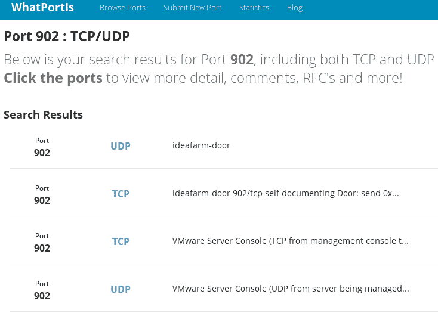

图 16.1：WhatPortIs

顶部搜索结果将我带到了一个名为**WhatPortIs**的网站。根据这个网站，`ideafarm-door`实际上是端口`902`，它属于**VMware Server Console**。好的，这个解释有道理，因为我的机器上确实安装了 VMware Player。所以，一切都好。

> 你可以在这里查看`WhatPortIs`网站：[`whatportis.com/`](http://whatportis.com/)。

这是列表中的下一个项目：

```
tcp        0      0 localhost:40432    *:*       LISTEN      3296/SpiderOakONE
```

这个项目显示本地地址为`localhost`，监听端口是`40432`。这次，`PID/Program Name`列实际告诉我们这是什么。`SpiderOak ONE`是一个基于云的备份服务，你可能会或可能不会希望它在服务器上运行。

现在，让我们看一下更多的项目：

```
tcp 0      0 *:db-lsp                   *:*      LISTEN      3246/dropbox
tcp 0      0 *:37468                    *:*      LISTEN      3296/SpiderOakONE
tcp 0      0 localhost:17600            *:*      LISTEN      3246/dropbox
tcp 0      0 localhost:17603            *:*      LISTEN      3246/dropbox
```

在这里，我们可以看到 `dropbox` 和 `SpiderOakONE` 都列出了带有星号的本地地址。因此，它们都在使用本地网络地址。`dropbox` 的端口名称是 `db-lsp`，代表**Dropbox 局域网同步协议**。`SpiderOakONE` 的端口没有正式名称，因此仅列为端口 `37468`。底部的两行显示 `dropbox` 也使用本地机器的地址，端口为 `17600` 和 `17603`。

到目前为止，我们只看到了 TCP 网络套接字。接下来看看它们与 UDP 套接字的区别：

```
udp        0      0 192.168.204.1:ntp       *:*                                 -
udp        0      0 172.16.249.1:ntp        *:*                                 -
udp        0      0 linux-0ro8:ntp          *:*                                 -
```

首先需要注意的是，`State` 列下没有任何内容。这是因为，使用 UDP 时，没有状态。它们实际上是在监听数据包的到来，并准备发送数据包。但由于 UDP 套接字几乎只能执行这些操作，因此实际上没有必要为它们定义不同的状态。

在前两行中，我们看到了一些奇怪的本地地址。这是因为我的工作站上安装了 VMware Player 和 VirtualBox。这两个套接字的本地地址是 VMware 和 VirtualBox 虚拟网络适配器的地址。最后一行显示了我的 OpenSUSE 工作站的主机名作为本地地址。在这三种情况下，端口是**网络时间协议**端口，用于时间同步。

现在，让我们来看最后一组 UDP 项目：

```
udp        0      0 *:58102         *:*                                 5598/chromium --pas
udp        0      0 *:db-lsp-disc   *:*                                 3246/dropbox
udp        0      0 *:43782         *:*                                 5598/chromium --pas
udp        0      0 *:36764         *:*                                 
udp        0      0 *:21327         *:*                                 3296/SpiderOakONE
udp        0      0 *:mdns          *:*                                 5598/chromium --pas
```

在这里，我们看到我的 Chromium 浏览器准备好在几个不同的端口上接收网络数据包。我们还看到 Dropbox 使用 UDP 接收来自其他安装了 Dropbox 的本地机器的发现请求。我猜测端口 `21327` 对于 SpiderOak ONE 执行相同的功能。

当然，由于这台机器是我的工作站之一，Dropbox 和 SpiderOak ONE 对我来说几乎是必不可少的。我是自己安装的它们，所以我一直知道它们在那里。然而，如果你在服务器上看到类似的东西，你需要调查一下，看看服务器管理员是否知道这些程序已被安装，然后找出它们为何被安装。它们可能执行某些合法功能，也可能没有。

> Dropbox 和 SpiderOak ONE 的区别在于，Dropbox 会在文件上传到 Dropbox 服务器后才对其进行加密。因此，Dropbox 的工作人员拥有你的文件的加密密钥。另一方面，SpiderOak ONE 会在本地机器上加密文件，并且加密密钥始终掌握在你自己手中。因此，如果你确实需要一个基于云的备份服务，并且你处理的是敏感文件，像 SpiderOak ONE 这样的服务肯定比 Dropbox 更好。（不，SpiderOak ONE 的人没有付钱让我这么说。）

如果你想查看端口号和 IP 地址，而不是网络名称，请添加 `n` 选项。和之前一样，这是部分输出：

```
donnie@linux-0ro8:~> netstat -lpn -A inet
(Not all processes could be identified, non-owned process info
 will not be shown, you would have to be root to see it all.)
Active Internet connections (only servers)
Proto Recv-Q Send-Q Local Address      Foreign Address     State       PID/Program name
tcp        0      0 0.0.0.0:902        0.0.0.0:*           LISTEN      -
tcp        0      0 127.0.0.1:40432    0.0.0.0:*           LISTEN      3296/SpiderOakONE
tcp        0      0 0.0.0.0:22         0.0.0.0:*           LISTEN      -
tcp        0      0 127.0.0.1:631      0.0.0.0:*           LISTEN      -
tcp        0      0 127.0.0.1:25       0.0.0.0:*           LISTEN      -
tcp        0      0 0.0.0.0:17500      0.0.0.0:*           LISTEN      3246/dropbox
tcp        0      0 0.0.0.0:37468      0.0.0.0:*           LISTEN      3296/SpiderOakONE
tcp        0      0 127.0.0.1:17600    0.0.0.0:*           LISTEN      3246/dropbox
. . .
. . .
```

只需要省略`l`选项就可以查看已建立的 TCP 连接。在我的工作站上，这会生成非常长的列表，因此我只会展示其中的几项：

```
donnie@linux-0ro8:~> netstat -p -A inet
(Not all processes could be identified, non-owned process info
 will not be shown, you would have to be root to see it all.)
Active Internet connections (w/o servers)
Proto Recv-Q Send-Q Local Address      Foreign Address         State       PID/Program name
tcp        1      0 linux-0ro8:41670   ec2-54-88-208-223:https CLOSE_WAIT  3246/dropbox
tcp        0      0 linux-0ro8:59810   74-126-144-106.wa:https ESTABLISHED 3296/SpiderOakONE
tcp        0      0 linux-0ro8:58712   74-126-144-105.wa:https ESTABLISHED 3296/SpiderOakONE
tcp        0      0 linux-0ro8:caerpc  atl14s78-in-f2.1e:https ESTABLISHED 10098/firefox
. . .
. . .
```

`Foreign Address`列显示了连接远端机器的地址和端口号。第一项显示与 Dropbox 服务器的连接处于`CLOSE_WAIT`状态。这意味着 Dropbox 服务器已经关闭了连接，而我们现在正在等待本地机器关闭套接字。

由于那些远程地址的名称没有多大意义，我们可以添加`n`选项来查看 IP 地址：

```
donnie@linux-0ro8:~> netstat -np -A inet
(Not all processes could be identified, non-owned process info
 will not be shown, you would have to be root to see it all.)
Active Internet connections (w/o servers)
Proto Recv-Q Send-Q Local Address         Foreign Address      State        PID/Program name
tcp        0      1 192.168.0.222:59594   37.187.24.170:443    SYN_SENT     10098/firefox
tcp        0      0 192.168.0.222:59810   74.126.144.106:443   ESTABLISHED  3296/SpiderOakONE
tcp        0      0 192.168.0.222:58712   74.126.144.105:443   ESTABLISHED  3296/SpiderOakONE
tcp        0      0 192.168.0.222:38606   34.240.121.144:443   ESTABLISHED  10098/firefox
. . .
. . .
```

这次，我们看到了一些新内容。第一项显示了 Firefox 连接的`SYN_SENT`状态。这意味着本地机器正在尝试与远程 IP 地址建立连接。另外，在`Local Address`下，我们可以看到我 OpenSUSE 工作站的静态 IP 地址。

如果我有足够的空间显示完整的`netstat`输出，你会发现`Proto`列下全是`tcp`。这是因为 UDP 协议不像 TCP 协议那样建立连接。

> 有一点需要记住的是，rootkit 可能会用它们自己篡改过的版本替换掉合法的 Linux 工具。例如，一个 rootkit 可能有它自己篡改过的`netstat`版本，显示所有网络进程，除了与 rootkit 相关的进程。这就是为什么你需要尽一切努力防止未授权用户获得 root 权限，以防止他们能够安装 rootkit。

如果你需要更多关于`netstat`的信息，请查看`netstat`的手册页。

#### 实操实验——使用 netstat 查看网络服务

在这个实验中，你将实践刚刚学到的关于`netstat`的内容。在具有桌面界面的虚拟机上执行此操作，这样你就可以使用 Firefox 浏览网站。按照以下步骤进行：

1.  查看正在监听连接的网络服务列表：

```
netstat -lp -A inet
netstat -lpn -A inet
```

1.  查看已建立连接的列表：

```
netstat -p -A inet
netstat -pn -A inet
```

1.  打开 Firefox 并导航到任何网站。然后，重复*步骤 2*。

1.  再次重复*步骤 2*，但在每个命令前加上`sudo`。注意输出与*步骤 2*的不同之处。

1.  从你的主机机器上，通过 SSH 登录到虚拟机。然后，重复*步骤 2*。

你已经完成了实验——恭喜！

你刚刚学习了如何使用`netstat`审计网络服务。现在，让我们来看看如何使用 Nmap 做这件事。

### 使用 Nmap 审计网络服务

`netstat`工具非常好，它可以为你提供大量关于网络服务状态的有用信息。唯一的小缺点是，你必须登录到网络上的每一台主机才能使用它。

如果你想远程审计你的网络，查看每台计算机上运行的服务，而不需要登录每一台计算机，那么你需要一个像 Nmap 这样的工具。它适用于所有主要的操作系统，所以即使你只能在工作站上使用 Windows，也不用担心。Kali Linux 中已经安装了最新版本，如果你正在使用它。它也在所有主要 Linux 发行版的仓库中，因此安装非常简单。如果你使用的是 Windows 或 macOS，你可以直接从 Nmap 官网为它们下载相应的版本。

> 你可以从[`nmap.org/download.html`](https://nmap.org/download.html)下载适用于所有主要操作系统的 Nmap。
> 
> > 在所有情况下，你还会找到安装说明。

你将在所有操作系统上以相同的方式使用 Nmap，唯一的例外是。在 Linux 和 macOS 机器上，你需要在某些 Nmap 命令前加上`sudo`，而在 Windows 机器上则不需要。（不过，在 Windows 10/11 上，你可能需要以管理员身份打开`command.exe`终端。）由于我恰好在我的 OpenSUSE 工作站上工作，我将展示如何在 Linux 上使用它。让我们从做一次 SYN 包扫描开始：

```
donnie@linux-0ro8:~> sudo nmap -sS 192.168.0.37
Starting Nmap 6.47 ( http://nmap.org ) at 2017-12-24 19:32 EST
Nmap scan report for 192.168.0.37
Host is up (0.00016s latency).
Not shown: 996 closed ports
PORT STATE SERVICE
22/tcp open ssh
515/tcp open printer
631/tcp open ipp
5900/tcp open vnc
MAC Address: 00:0A:95:8B:E0:C0 (Apple)
Nmap done: 1 IP address (1 host up) scanned in 57.41 seconds
donnie@linux-0ro8:~>
```

这里是详细信息：

+   `-sS`：小写的`s`表示我们想要执行的扫描类型。大写的`S`表示我们正在进行 SYN 包扫描。（稍后会详细讲解。）

+   `192.168.0.37`：在这个例子中，我只扫描一台机器。然而，我也可以扫描一组机器或者整个网络。

+   `Not shown: 996 closed ports`：显示所有这些关闭的端口而不是`filtered`端口，这告诉我这台机器没有防火墙。（稍后会详细讲解。）

接下来，我们会看到一组开放的端口。（稍后会详细讲解。）

这台机器的 MAC 地址表明它是某种苹果产品。稍后我将向你展示如何获得有关它是哪种苹果产品的更多细节。

现在，让我们更详细地看一下。

#### 端口状态

Nmap 扫描会显示目标机器的端口状态，可能是以下三种**端口状态**之一：

+   `filtered`：这意味着端口被防火墙阻塞。

+   `open`：这意味着端口没有被防火墙阻塞，且与该端口相关联的服务正在运行。

+   `closed`：这意味着端口没有被防火墙阻塞，但与该端口相关联的服务未运行。

因此，在我们对 Apple 机器的扫描中，我们看到安全外壳服务已经准备好在端口 `22` 上接受连接，打印服务已经准备好在端口 `515` 和 `631` 上接受连接，并且**虚拟网络计算**（**VNC**）服务已经准备好在端口 `5900` 上接受连接。所有这些端口都对有安全意识的管理员来说非常重要。如果安全外壳服务正在运行，那么了解它是否配置得安全就显得很有趣。打印服务正在运行意味着它已经设置为使用**互联网打印协议**（**IPP**）。了解为什么我们使用 IPP 而不是普通的网络打印非常重要，同时了解该版本的 IPP 是否存在任何安全隐患也很有意义。当然，我们已经知道 VNC 不是一个安全的协议，因此我们需要了解它为何仍在运行。我们还发现没有端口被列为 `filtered`，因此我们也想知道为什么这台机器没有防火墙。

我终于要透露一个小秘密了，这台机器和我在 Greenbone Security Assistant 扫描演示中使用的是同一台机器。所以，我们已经获得了一些所需的信息。Greenbone 扫描告诉我们，这台机器上的安全外壳服务使用了弱加密算法，并且打印服务存在安全漏洞。不久之后，我将向你展示如何使用 Nmap 获取其中的一些信息。

#### 扫描类型

有许多不同的扫描选项，每种选项都有其特定的目的。我们在这里使用的 SYN 数据包扫描被认为是一种隐蔽的扫描类型，因为它比其他某些类型的扫描生成的网络流量和系统日志条目要少。在这种扫描类型中，Nmap 向目标机器的一个端口发送 SYN 数据包，就像是试图与该机器建立一个 TCP 连接。如果目标机器响应一个 SYN/ACK 数据包，则意味着该端口处于 `open` 状态，准备建立 TCP 连接。如果目标机器响应一个 RST 数据包，则意味着该端口处于 `closed` 状态。如果没有任何响应，则意味着该端口被 `filtered`，被防火墙阻塞。作为一名普通的 Linux 管理员，这是你大多数时候会使用的一种扫描类型。

`-sS` 扫描显示了 TCP 端口的状态，但它不会显示 UDP 端口的状态。要查看 UDP 端口，请使用 `-sU` 选项：

```
donnie@linux-0ro8:~> sudo nmap -sU 192.168.0.37
Starting Nmap 6.47 ( http://nmap.org ) at 2017-12-28 12:41 EST
Nmap scan report for 192.168.0.37
Host is up (0.00018s latency).
Not shown: 996 closed ports
PORT     STATE         SERVICE
123/udp  open          ntp
631/udp  open|filtered ipp
3283/udp open|filtered netassistant
5353/udp open          zeroconf
MAC Address: 00:0A:95:8B:E0:C0 (Apple)
Nmap done: 1 IP address (1 host up) scanned in 119.91 seconds
donnie@linux-0ro8:~>
```

在这里，你看到了一些不同的情况：两个端口被列为 `open|filtered`。这是因为，由于 UDP 端口对 Nmap 扫描的响应方式，Nmap 并不总是能够判断一个 UDP 端口是 `open` 还是 `filtered`。在这种情况下，我们知道这两个端口可能是开放的，因为我们已经看到它们对应的 TCP 端口是开放的。

ACK 数据包扫描也很有用，但并不是用来查看目标机器网络服务的状态。相反，它是当你需要查看是否有防火墙在你和目标机器之间阻碍时的一个好选择。一个 ACK 扫描命令如下所示：

```
sudo nmap -sA 192.168.0.37
```

你不仅限于一次扫描单台机器。你可以一次扫描一组机器或整个子网：

```
sudo nmap -sS 192.168.0.1-128
sudo nmap -sS 192.168.0.0/24
```

第一个命令仅扫描此网络段的前 128 个主机。第二个命令扫描一个使用 24 位子网掩码的子网中的所有 254 个主机。

发现扫描对于你仅仅需要查看网络上有哪些设备时非常有用：

```
sudo nmap -sn 192.168.0.0/24
```

使用`-sn`选项，Nmap 会检测你是在扫描本地子网还是远程子网。如果子网是本地的，Nmap 会发送一个**地址解析协议**（**ARP**）广播，来请求子网上每台设备的 IPv4 地址。这是一种可靠的设备发现方式，因为 ARP 是不会被设备的防火墙阻止的。（我的意思是，没有 ARP，网络将无法正常运作。）不过，ARP 广播不能跨越路由器，这意味着你不能使用 ARP 来发现远程子网的主机。所以，如果 Nmap 检测到你在进行远程子网的发现扫描，它会发送 ping 数据包，而不是 ARP 广播。使用 ping 数据包进行发现不如使用 ARP 可靠，因为一些网络设备可以被配置为忽略 ping 数据包。无论如何，这是我自己家庭网络中的一个示例：

```
donnie@linux-0ro8:~> sudo nmap -sn 192.168.0.0/24
Starting Nmap 6.47 ( http://nmap.org ) at 2017-12-25 14:48 EST
Nmap scan report for 192.168.0.1
Host is up (0.00043s latency).
MAC Address: 00:18:01:02:3A:57 (Actiontec Electronics)
Nmap scan report for 192.168.0.3
Host is up (0.0044s latency).
MAC Address: 44:E4:D9:34:34:80 (Cisco Systems)
Nmap scan report for 192.168.0.5
Host is up (0.00026s latency).
MAC Address: 1C:1B:0D:0A:2A:76 (Unknown)
. . .
. . .
```

我们在这段输出中看到三个主机，并且每个主机有三行输出。第一行显示 IP 地址，第二行显示主机是否处于活动状态，第三行显示主机网络适配器的 MAC 地址。每个 MAC 地址的前三对字符表示该网络适配器的制造商。（顺便说一下，那块未知的网络适配器在最近型号的技嘉主板上。我不知道为什么它没有出现在 Nmap 数据库中。）

我们将要看的最终扫描为我们完成四个任务：

+   它会识别`open`、`closed`和`filtered`的 TCP 端口。

+   它识别运行中的服务的版本。

+   它运行一组随 Nmap 附带的漏洞扫描脚本。

+   它尝试识别目标主机的操作系统。

执行所有这些操作的扫描命令如下所示：

```
sudo nmap -A 192.168.0.37
```

我猜你可以把`-A`选项看作是*所有*选项，因为它确实能做到所有事情。（嗯，几乎是所有，毕竟它并不扫描 UDP 端口。）首先，这是我运行的扫描命令：

```
donnie@linux-0ro8:~> sudo nmap -A 192.168.0.37
```

这里是结果，已根据格式化需求分成几个部分：

```
Starting Nmap 6.47 ( http://nmap.org ) at 2017-12-24 19:33 EST
Nmap scan report for 192.168.0.37
Host is up (0.00016s latency).
Not shown: 996 closed ports
```

我们立刻看到，这台机器没有活跃的防火墙，因为没有端口处于`filtered`状态。默认情况下，Nmap 只扫描最受欢迎的 1,000 个端口。由于 996 个端口处于`closed`状态，我们显然只有四个活跃的网络服务会在这 1,000 个端口上监听：

```
PORT STATE SERVICE VERSION
22/tcp open ssh OpenSSH 5.1 (protocol 1.99)
|_ssh-hostkey: ERROR: Script execution failed (use -d to debug)
|_sshv1: Server supports SSHv1
515/tcp open printer?
```

端口`22`用于安全外壳（SSH）访问，这是我们通常会期待的。然而，看看 SSH 的版本。版本 5.1 是 OpenSSH 的一个非常旧的版本。（在写作时，当前版本是 9.1。）更糟糕的是，这个 OpenSSH 服务器支持安全外壳协议的版本 1。版本 1 存在严重缺陷，非常容易被利用，所以你绝对不希望在网络中看到这种情况。

接下来，我们看到关于通过 Greenbone Security Assistant 扫描发现的打印服务漏洞的更多信息：

```
631/tcp open ipp CUPS 1.1
| http-methods: Potentially risky methods: PUT
|_See http://nmap.org/nsedoc/scripts/http-methods.html
| http-robots.txt: 1 disallowed entry
|_/
|_http-title: Common UNIX Printing System
```

在`631/tcp`行中，我们看到相关服务是`ipp`。这个协议基于我们用来浏览网页的 HTTP。HTTP 用于从客户端到服务器传输数据的两种方式是`POST`和`PUT`。我们真正希望的是每个 HTTP 服务器都使用`POST`方法，因为`PUT`方法使得通过操控 URL 很容易让人妥协服务器。所以，如果你扫描一个服务器并发现它允许使用`PUT`方法进行任何类型的 HTTP 通信，那你就有潜在问题了。在这种情况下，解决方案是更新操作系统，并希望这些更新能够解决问题。如果这是一个 Web 服务器，你就需要和 Web 服务器管理员沟通，告诉他们你发现的问题。

接下来，我们看到这个机器上运行着 VNC 服务：

```
5900/tcp open vnc Apple remote desktop vnc
| vnc-info:
| Protocol version: 3.889
| Security types:
|_ Mac OS X security type (30)
1 service unrecognized despite returning data. If you know the service/version, please submit the following fingerprint at http://www.insecure.org/cgi-bin/servicefp-submit.cgi :
SF-Port515-TCP:V=6.47%I=7%D=12/24%Time=5A40479E%P=x86_64-suse-linux-gnu%r(
SF:GetRequest,1,"\x01");
MAC Address: 00:0A:95:8B:E0:C0 (Apple)
Device type: general purpose
```

VNC 有时确实很方便。它就像 Windows 的 Microsoft 远程桌面服务，不过它是免费的开源软件。但它也是一个安全问题，因为它是一个未加密的协议。所以，所有信息都会以明文形式通过网络传输。如果你必须使用 VNC，最好通过 SSH 隧道运行它。

接下来，我们看看 Nmap 关于目标机器操作系统的发现：

```
Running: Apple Mac OS X 10.4.X
OS CPE: cpe:/o:apple:mac_os_x:10.4.10
OS details: Apple Mac OS X 10.4.10 - 10.4.11 (Tiger) (Darwin 8.10.0 - 8.11.1)
Network Distance: 1 hop
Service Info: OS: Mac OS X; CPE: cpe:/o:apple:mac_os_x
```

等等，什么？Mac OS X 10.4？那不是非常非常古老的吗？嗯，是的，确实是。过去几章我一直守口如瓶的秘密是，我的 Greenbone Security Assistant 和 Nmap 扫描演示的目标机器其实是我那台 2003 年出产的古老的、值得收藏的 Apple eMac。我觉得扫描它会给我们带来一些有趣的结果，看来我没猜错。（是的，没错，那是*eMac*，而不是*iMac*。）

最后我们看到的是`TRACEROUTE`信息。不过这并不太有趣，因为目标机器就在我旁边，只有一个 Cisco 交换机在我们之间：

```
TRACEROUTE
HOP RTT ADDRESS
1 0.16 ms 192.168.0.37
OS and Service detection performed. Please report any incorrect results at http://nmap.org/submit/ .
Nmap done: 1 IP address (1 host up) scanned in 213.92 seconds
donnie@linux-0ro8:~>
```

> 假设目标机器将其 SSH 服务更改为某个备用端口，而不是运行在默认端口`22`上。如果你用普通的`-sS`或`-sT`扫描，这时 Nmap 将无法正确识别该备用端口上的 SSH 服务。但是，`-A`扫描会正确识别 SSH 服务，无论它使用哪个端口。

好的，让我们做一个实验。

#### 实验操作 – 使用 Nmap 扫描

在这个实验中，你将看到扫描一台机器的结果，看看它的各种服务是启用还是禁用。你将从一台防火墙禁用的虚拟机开始。让我们开始吧：

1.  通过使用以下命令，简要浏览 Nmap 帮助屏幕：

```
nmap
```

1.  无论是从你的主机还是从另一台虚拟机，针对防火墙禁用的虚拟机执行这些扫描（请用你自己的 IP 地址替换我在这里使用的地址）：

```
sudo nmap -sS 192.168.0.252
sudo nmap -sT 192.168.0.252
sudo nmap -SU 192.168.0.252
sudo nmap -A 192.168.0.252
sudo nmap -sA 192.168.0.252
```

1.  在 Ubuntu 上停止目标机器的 SSH 服务：

```
sudo systemctl stop ssh
```

在 CentOS 或 AlmaLinux 上，使用以下命令：

```
sudo systemctl stop sshd
```

1.  重复*步骤 2*。

你已经完成了这个实验室的所有步骤——恭喜！

现在你已经了解了如何扫描一个系统，接下来我们来看看 GRUB2 引导加载程序。

## 为 GRUB 2 引导加载程序设置密码保护

有时候，人们会忘记密码，即使他们是管理员。而且有时候，人们购买二手电脑时，忘记问卖家密码是什么。（是的，我做过。）不过没关系，因为所有主要操作系统都有方法让你重置或恢复丢失的管理员密码。这很方便，除非你考虑到一个问题，那就是当某人可以物理接触到机器时，登录密码的意义就显得有些多余。假设你的笔记本被偷了。如果你没有加密硬盘，窃贼只需几分钟就能重置密码并窃取你的数据。如果你加密了硬盘，那么保护级别将取决于你使用的操作系统。使用标准的 Windows 文件夹加密，窃贼只需重置密码就能访问加密的文件夹。而如果是 Linux 机器上的 LUKS 整盘加密，窃贼将无法绕过输入加密密码短语这一关。

在 Linux 上，我们有方法来防止未经授权的密码重置，即使我们没有使用整盘加密。我们只需要为 **Grand Unified Bootloader**（**GRUB**）设置密码保护，这样窃贼就无法通过进入紧急模式来重置密码。

> 是否需要本节中的建议取决于你所在组织的物理安全设置。这是因为将 Linux 机器引导到紧急模式需要物理访问权限。这不是你可以远程操作的事情。在拥有良好物理安全的组织中，服务器——尤其是那些存储敏感数据的服务器——会被锁在一个房间内，该房间又被锁在另一个房间里。只有极少数受信任的人员可以进入，并且他们必须在两个出入点出示证件。因此，为这些服务器的引导加载程序设置密码是没有意义的，除非你正在处理某个要求这样做的监管机构。
> 
> > 另一方面，为暴露在外的工作站和笔记本电脑设置启动加载器密码保护可能会非常有用。然而，光靠这个保护并不足以保护你的数据。有人仍然可以从 Live 磁盘或 USB 存储设备启动机器，挂载机器的硬盘，并获取敏感数据。因此，你还需要加密你的敏感数据，就像我在 *第六章* 中展示的那样，*加密技术*。

要重置密码，你只需要在启动菜单出现时中断启动过程，修改几个内核参数，或者选择 **恢复** 模式选项（如果可用）。无论哪种方式，机器将会以紧急模式启动，而不需要输入密码。然而，从紧急模式中进行密码重置并不是你能做的唯一操作。一旦你进入紧急模式，你将获得对整个系统的完全 root 用户控制权限。

现在，为了让你了解我所说的通过 GRUB 2 启动菜单编辑内核参数，下面我将向你展示如何在 Red Hat 系统上执行密码重置。

### 动手实验 – 重置 Red Hat/CentOS/AlmaLinux 的密码

除了一个非常小的例外，这一过程在 CentOS 7、AlmaLinux 8 和 AlmaLinux 9 上几乎完全相同。我们开始吧：

1.  启动虚拟机。当启动菜单出现时，通过按下向下箭头键中断启动过程。然后，按向上箭头键一次，选择默认启动选项：

    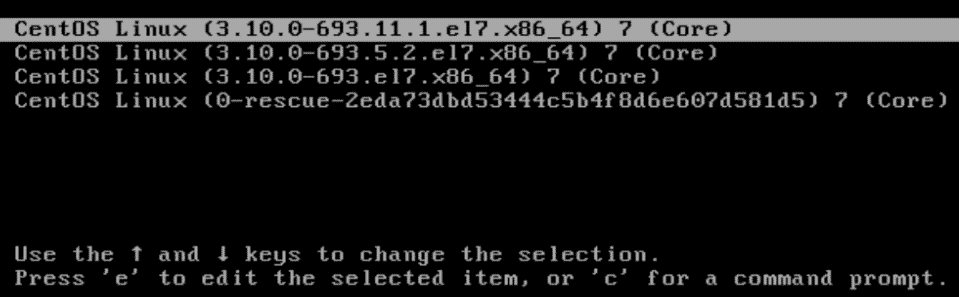

    图 16.2：选择启动选项

1.  按下 e 键以编辑内核参数。当 GRUB 2 配置页面出现时，向下移动光标，直到看到这一行：

    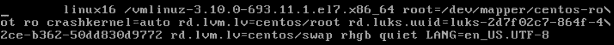

    图 16.3：编辑内核选项

    > 请注意，在 CentOS 7 上，这一行以 `linux16` 开头，如下所示。在 AlmaLinux 8/9 上，这一行以 `linux` 开头。

1.  删除这一行中的 `rhgb quiet` 字样，然后在行末添加 `rd.break enforcing=0`。这两个新选项的作用如下：

1.  `rd.break`：这会使机器进入紧急模式，允许你获得 root 用户权限，而无需输入 root 用户密码。即使 root 用户密码尚未设置，这个方法也能奏效。

1.  `enforcing=0`：当你在启用了 SELinux 的系统上重置密码时，`/etc/shadow` 文件的安全上下文会变更为错误的类型。如果系统在执行此操作时处于强制模式，SELinux 会阻止你登录，直到 `shadow` 文件被重新标记。然而，在启动过程中重新标记文件可能需要很长时间，尤其是在大硬盘上。通过将 SELinux 设置为宽容模式，你可以等待到重启后再恢复 `shadow` 文件的正确安全上下文。

1.  完成内核参数编辑后，按 Ctrl + X 继续启动过程。这会将你带到紧急模式，并出现 `switch_root` 命令提示符：

    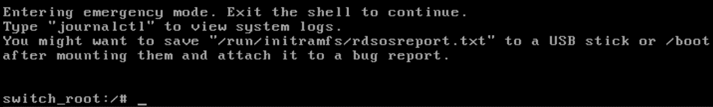

    图 16.4：在紧急模式下

1.  在紧急模式下，文件系统以只读方式挂载。你需要将其重新挂载为读写模式，并进入`chroot`模式，才能重置密码，使用以下两个命令：

```
mount -o remount,rw /sysroot
chroot /sysroot
```

输入这两个命令后，命令提示符将变为正常的 bash shell 提示符：

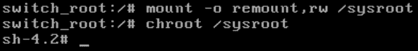

图 16.5：进入 chroot

现在你已经到达这个阶段，终于准备好重置密码了。

1.  如果你想重置 root 用户密码，或者甚至想为之前没有密码的 root 用户创建一个密码，只需输入：

```
passwd
```

然后，输入所需的新密码。

1.  如果系统从未设置过 root 用户密码，并且你仍然希望它没有密码，可以重置一个具有完全 sudo 权限的账户的密码。例如，在我的系统中，命令如下：

```
passwd donnie
```

1.  接下来，将文件系统重新挂载为只读模式。然后，输入`exit`两次以继续重启：

```
mount -o remount,ro /
exit
exit
```

1.  重启后你需要做的第一件事是恢复`/etc/shadow`文件的正确 SELinux 安全上下文。然后，将 SELinux 恢复为强制模式：

```
sudo restorecon /etc/shadow
sudo setenforce 1
```

这是我`shadow`文件上下文设置的前后截图：

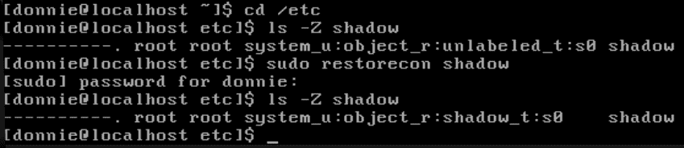

图 16.6：用于 shadow 文件的 SELinux 上下文设置

在这里，你可以看到重置密码将文件类型更改为`unlabeled_t`。运行`restorecon`命令后，文件类型恢复为`shadow_t`。

你已完成本实验——祝贺你！

现在，我们来看一下在 Ubuntu 系统上的相同操作步骤。

### 实操实验 – 重置 Ubuntu 的密码

在 Ubuntu 系统上重置密码的过程与其他系统有些不同，而且简单得多。然而，在 Ubuntu 16.04 和 Ubuntu 18.04 或更高版本之间有一个小的差别。即，在 Ubuntu 16.04 上，查看启动菜单不需要任何操作。而在 Ubuntu 18.04 上，你需要按下 Shift 键（对于基于 BIOS 的系统）或 Esc 键（对于基于 UEFI 的系统）才能看到启动菜单。在当前的 Ubuntu 22.04 上，无论是基于 BIOS 还是 UEFI 的系统，都需要按 Esc 键。除此之外，从 Ubuntu 16.04 到当前的 Ubuntu 22.04，操作过程完全相同。那么，现在我们开始吧：

1.  启动虚拟机。按下 Esc 键以调出启动菜单。

1.  按下向下箭头键以突出显示 Ubuntu 菜单中的高级选项项，然后按 Enter 键：

    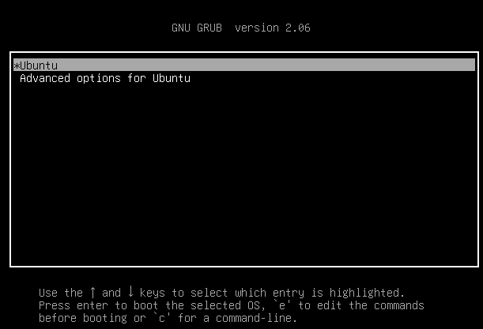

    图 16.7：Ubuntu 高级选项子菜单

1.  从**Ubuntu 高级选项**子菜单中，选择**恢复模式**选项，并按 Enter 键：

    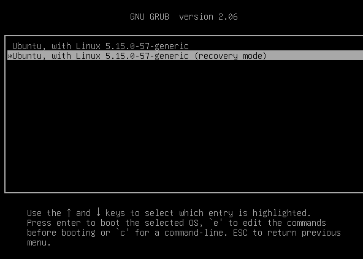

    图 16.8：选择恢复模式选项

1.  当**恢复菜单**出现时，选择**root**选项，并按 Enter 键：

    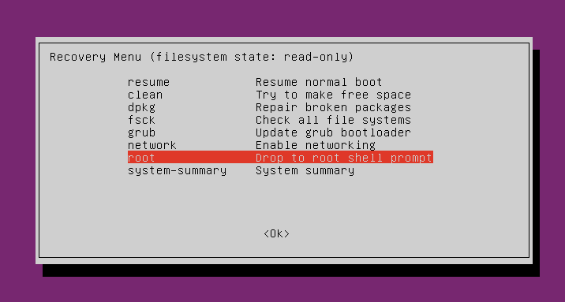

    图 16.9：选择 root 选项

1.  再次按下回车键。这将带你进入 root shell：

    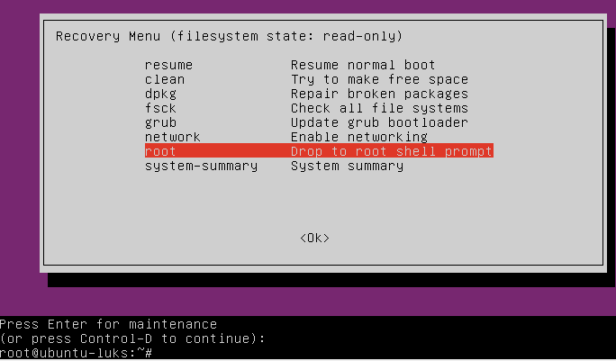

    图 16.10：恢复模式

1.  由于 Ubuntu 通常没有为 root 用户分配密码，你很可能会重置具有完全 sudo 权限的用户的密码，像这样：

```
passwd donnie
```

1.  完成后，像平常一样重启：

```
shutdown -r now
```

机器现在将正常启动。

你已完成本实验——恭喜！

当然，我们不希望每个人都能编辑内核参数或在启动机器时进入**恢复**模式。所以，让我们来解决这个问题。

### 在 Red Hat/CentOS/AlmaLinux 上防止编辑内核参数

自从 Red Hat/CentOS 7.2 引入以来，设置 GRUB 2 密码以防止编辑内核参数变得容易。幸运的是，这个技巧在 Red Hat 和 AlmaLinux 的最新版本中仍然有效。你只需要运行一个命令并选择一个密码：

```
[donnie@localhost ~]$ sudo grub2-setpassword
[sudo] password for donnie:
Enter password:
Confirm password:
[donnie@localhost ~]$
```

就是这么简单。密码哈希将被存储在`/boot/grub2/user.cfg`文件中。

现在，当你重启机器并尝试编辑内核参数时，你将被提示输入用户名和密码：


图 16.11：RHEL 7.2 及更新版本的密码保护

请注意，即使系统中尚未设置`root`用户的密码，你仍然需要输入`root`作为用户名。在这种情况下，`root`用户只是 GRUB 2 的超级用户。

当你启动 Red Hat、CentOS 或 AlmaLinux 机器时，你会看到一个**0-rescue**选项出现在启动菜单的底部。（你可以在图 16.2 中看到它。）如果选择该选项，你会发现它什么也不做，只会把你带到一个普通的登录提示符，要求你输入用户名和密码。（Red Hat 类型的发行版确实有一个救援模式，但你必须从安装介质启动机器才能进入。）

### 在 Ubuntu 上防止编辑内核参数或访问恢复模式

Ubuntu 没有像 Red Hat、CentOS 和 AlmaLinux 那样酷的工具，所以你需要手动编辑配置文件来设置 GRUB 2 密码。

在`/etc/grub.d/`目录中，你将看到构成 GRUB 2 配置的文件：

```
donnie@ubuntu3:/etc/grub.d$ ls -l
total 76
-rwxr-xr-x 1 root root  9791 Oct 12 16:48 00_header
-rwxr-xr-x 1 root root  6258 Mar 15  2016 05_debian_theme
-rwxr-xr-x 1 root root 12512 Oct 12 16:48 10_linux
-rwxr-xr-x 1 root root 11082 Oct 12 16:48 20_linux_xen
-rwxr-xr-x 1 root root 11692 Oct 12 16:48 30_os-prober
-rwxr-xr-x 1 root root  1418 Oct 12 16:48 30_uefi-firmware
-rwxr-xr-x 1 root root   214 Oct 12 16:48 40_custom
-rwxr-xr-x 1 root root   216 Oct 12 16:48 41_custom
-rw-r--r-- 1 root root   483 Oct 12 16:48 README
donnie@ubuntu3:/etc/grub.d$
```

你需要编辑的文件是`40_custom`文件。然而，在编辑文件之前，你需要创建密码哈希。使用`grub-mkpasswd-pbkdf2`工具来完成这项工作：

```
donnie@ubuntu3:/etc/grub.d$ grub-mkpasswd-pbkdf2
Enter password:
Reenter password:
PBKDF2 hash of your password is grub.pbkdf2.sha512.10000.F1BA16B2799CBF6A6DFBA537D43222A0D5006124ECFEB29F5C81C9769C6C3A66BF53C2B3AB71BEA784D4386E86C991F7B5D33CB6C29EB6AA12C8D11E0FFA0D40.371648A84CC4131C3CFFB53604ECCBA46DA75AF196E970C98483385B0BE026590C63A1BAC23691517BC4A5D3EDF89D026B599A0D3C49F2FB666F9C12B56DB35D
donnie@ubuntu3:/etc/grub.d$
```

用你喜欢的文本编辑器打开`40_custom`文件，并添加一行定义超级用户。再添加一行用于密码哈希。在我的情况下，文件现在看起来像这样：

```
#!/bin/sh
exec tail -n +3 $0
# This file provides an easy way to add custom menu entries. Simply type the
# menu entries you want to add after this comment. Be careful not to change
# the 'exec tail' line above.
set superusers="donnie"
password_pbkdf2 donnie grub.pbkdf2.sha512.10000.F1BA16B2799CBF6A6DFBA537D43222A0D5006124ECFEB29F5C81C9769C6C3A66BF53C2B3AB71BEA784D4386E86C991F7B5D33CB6C29EB6AA12C8D11E0FFA0D40.371648A84CC4131C3CFFB53604ECCBA46DA75AF196E970C98483385B0BE026590C63A1BAC23691517BC4A5D3EDF89D026B599A0D3C49F2FB666F9C12B56DB35D
```

> 以`password_pbkdf2`开头的这串文本是整行显示，在打印页面上会换行。

保存文件后，最后一步是生成一个新的`grub.cfg`文件：

```
donnie@ubuntu3:/etc/grub.d$ sudo update-grub
Generating grub configuration file ...
Found linux image: /boot/vmlinuz-4.4.0-104-generic
Found initrd image: /boot/initrd.img-4.4.0-104-generic
Found linux image: /boot/vmlinuz-4.4.0-101-generic
Found initrd image: /boot/initrd.img-4.4.0-101-generic
Found linux image: /boot/vmlinuz-4.4.0-98-generic
Found initrd image: /boot/initrd.img-4.4.0-98-generic
done
donnie@ubuntu3:/etc/grub.d$
```

现在，当我重新启动这台机器时，我必须输入我的密码才能编辑内核参数或访问**Ubuntu 高级选项**子菜单：

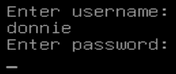

图 16.12：Ubuntu 的密码保护

这有一个问题。它不仅阻止了除超级用户外的任何人编辑内核参数，而且还阻止了除超级用户外的任何人正常启动。是的，没错。即使是正常启动，Ubuntu 现在也会要求你输入授权超级用户的用户名和密码。幸运的是，这是一个容易修复的问题。

这个修复需要在`/boot/grub/grub.cfg`文件中插入一个单词。听起来很简单，对吧？然而，这并不是一个优雅的解决方案，因为你本不应手动编辑`grub.cfg`文件。在文件的顶部，我们看到了这一行：

```
# DO NOT EDIT THIS FILE
#
# It is automatically generated by grub-mkconfig using templates
# from /etc/grub.d and settings from /etc/default/grub
#
```

这意味着每当我们做一些会更新`grub.cfg`文件的操作时，我们手动对文件所做的任何更改都会丢失。这包括当我们进行系统更新，安装新内核时，或者执行`sudo apt autoremove`来移除不再需要的旧内核时。最具讽刺意味的是，官方的 GRUB 2 文档却告诉我们应该手动编辑`grub.cfg`文件来处理这些问题。一个更好的方法是修改`update-grub`工具使用的 shell 脚本，来构建`grub.cfg`文件。这样可以避免意外覆盖你需要保留的更改。

在`/etc/grub.d/`目录中，你会看到几个用于构建`grub.cfg`的脚本。我们需要的是`10_linux`文件中的那个。用文本编辑器打开它，并导航到大约第 197 行的位置。查找这两行：

```
echo "menuentry '$(echo "$title" | grub_quote)' ${CLASS} \$menuentry_id_option 'gnulinux-$version-$type-$boot_device_id' {" | sed "s/^/$submenu_indentation/"
. . .
. . .
echo "menuentry '$(echo "$os" | grub_quote)' ${CLASS} \$menuentry_id_option 'gnulinux-simple-$boot_device_id' {" | sed "s/^/$submenu_indentation/"
```

（请注意，每一行都是在打印页面上换行的一行。）

在每一行后面加上`--unrestricted`，使得这些行现在看起来像这样：

```
echo "menuentry '$(echo "$title" | grub_quote)' ${CLASS} --unrestricted \$menuentry_id_option 'gnulinux-$version-$type-$boot_device_id' {" | sed "s/^/$submenu_indentation/"
. . .
. . .
echo "menuentry '$(echo "$os" | grub_quote)' ${CLASS} --unrestricted \$menuentry_id_option 'gnulinux-simple-$boot_device_id' {" | sed "s/^/$submenu_indentation/"
```

最后，运行`sudo update-grub`命令，你就可以正常启动机器，使用默认选项。但如果你想进入**Ubuntu 高级选项**子菜单，那就另当别论了。在设置了超级用户密码的情况下，你将始终需要输入超级用户密码才能进入**Ubuntu 高级选项**子菜单。即使你在`10_linux 脚本`中添加了`--unrestricted`选项，情况也是如此。实际上，这样可以防止没有密码的人访问**恢复**选项。

### 禁用 Ubuntu 的子菜单

在 Ubuntu 系统上，你可以轻松禁用 Ubuntu 子菜单，这样默认情况下你就会看到所有启动选项，结果看起来像这样：

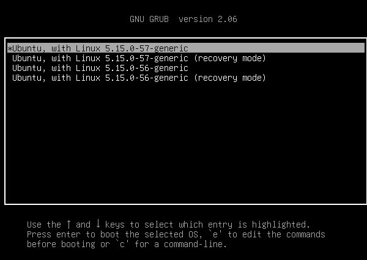

图 16.13：没有子菜单的 Ubuntu 启动菜单

如果需要，你还可以设置使得你无需按下 Shift 或 Esc 键即可看到启动菜单。

首先，在文本编辑器中打开`/etc/default/grub`文件。通过添加`GRUB_DISABLE_SUBMENU=y`这一行来禁用子菜单。为了使启动菜单默认可见，查找以下两行：

```
GRUB_TIMEOUT_STYLE=hidden
GRUB_TIMEOUT=0
```

注释掉第一行，并将第二行的值更改为非零数字。现在这些行应该看起来像这样：

```
# GRUB_TIMEOUT_STYLE=hidden
GRUB_TIMEOUT=10
```

最后，运行`sudo update-grub`命令。现在，当你重新启动机器时，启动菜单会自动显示出来，你会看到完整的启动选项列表，而不仅仅是默认启动选项和子菜单选项。经过十秒钟的超时后，系统将自动启动默认选项。

禁用 Ubuntu 子菜单的主要问题是，如果你按照我刚才所示配置了带有`--unrestricted`选项的 GRUB，用户将能够在不输入密码的情况下启动**恢复**模式。所以，这样就像是你从一开始就没有为 GRUB 设置密码保护一样。如果你禁用了 Ubuntu 子菜单，记得同时禁用**恢复**模式选项。在编辑器中打开`/etc/default/grub`文件，查找这一行：

```
# GRUB_DISABLE_RECOVERY="true"
```

删除行前面的`#`符号，使其现在看起来像这样：

```
GRUB_DISABLE_RECOVERY="true"
```

如你之前所做的那样更新 GRUB 配置：

```
sudo update-grub
```

最后，重新启动机器并验证**恢复**模式选项是否已消失。如果你禁用了**恢复**启动菜单选项并且仍然需要进入**恢复**模式，你仍然可以通过在启动过程中编辑内核参数来实现。这个过程与你刚才看到的 AlmaLinux 略有不同，因为你在 Ubuntu 上无需担心 SELinux。为了避免重复此过程，我会在*进一步阅读*部分留一个教程链接。（该链接的文章适用于 Ubuntu 18.04，但该过程仍适用于当前的 Ubuntu 22.04。）

所以，你现在可能会问，*为什么我需要禁用 Ubuntu 子菜单？* 实际上，你永远不**需要**禁用它。对我来说，这只是个人偏好问题。与 Red Hat 发行版不同，Ubuntu 在更新操作时如果安装了新内核，它不会自动删除旧的 Linux 内核。如果你在更新后没有记得执行`sudo apt autoremove`命令来清理旧内核，可能会填满`/boot/`分区，从而阻止未来更新安装新内核。通过禁用子菜单并使启动菜单默认可见，我可以在启动机器时看到已安装的 Linux 内核数量。（但嘿，那只是我，我有点怪。只要问问认识我的人就知道。）在生产机器上，启用子菜单和**恢复**选项，并设置 GRUB 2 密码会更为合理。

> 你可以在[`www.gnu.org/software/grub/manual/grub/grub.html#Security`](http://www.gnu.org/software/grub/manual/grub/grub.html#Security)找到官方 GRUB 2 文档的安全部分。

## 安全配置 BIOS/UEFI

这个话题与我们之前讨论的内容不同，因为它与操作系统无关。现在，我们将讨论计算机硬件。

每个计算机主板都有一个 BIOS 或 UEFI 芯片，用于存储计算机的硬件配置以及在开机后启动过程所需的引导指令。UEFI 替代了较老的 BIOS，并且它比旧版 BIOS 拥有更多的安全特性。

我不能给你关于 BIOS/UEFI 设置的具体信息，因为每种型号的主板都有不同的设置方式。我能提供的是一些更通用的信息。

当你考虑 BIOS/UEFI 安全时，你可能会想到禁用从除了正常系统驱动器以外的其他设备启动。在下面的截图中，你可以看到我禁用了所有 SATA 驱动端口，除了与系统驱动器连接的端口：

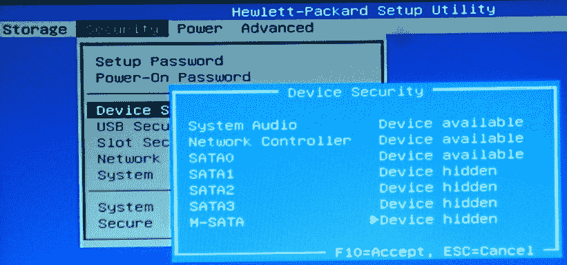

图 16.14：禁用我的惠普 Envy 驱动端口

当计算机暴露在公众面前，任何人都能轻易接触到时，这可能是一个考虑因素。对于那些存放在有安全保护的房间内、限制访问的服务器来说，就没有必要过于担心，除非某个监管机构的安全要求另有规定。对于暴露在外的机器，整个磁盘加密可以防止有人在从光盘或 USB 设备启动后窃取数据。然而，你可能仍然有其他理由阻止任何人从这些替代启动设备启动机器。

另一个考虑因素是，如果你在处理超级敏感数据的安全环境中工作。如果你担心未经授权的数据外泄，可能需要考虑禁用对 USB 设备的写入能力。这也将阻止人们从 USB 设备启动机器：

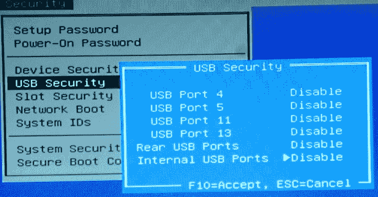

图 16.15：禁用 USB 设备

> 有时候，你可能不想完全禁用机器的 USB 端口。相反，你可以将其保持启用，并使用 USBGuard 只允许某些 USB 设备连接。与其自己写一篇说明，不如参考我找到的这篇写得非常好的教程：
> 
> > [`www.cyberciti.biz/security/how-to-protect-linux-against-rogue-usb-devices-using-usbguard/`](https://www.cyberciti.biz/security/how-to-protect-linux-against-rogue-usb-devices-using-usbguard/)
> > 
> > USBGuard 的主要问题是，它仍然无法阻止某人从 USB 设备启动。

然而，BIOS/UEFI 安全不仅仅是这样。今天的现代服务器 CPU 配备了各种安全功能，以帮助防止数据泄露。例如，我们来看看 Intel Xeon CPU 中实现的一些安全功能：

+   身份保护技术

+   高级加密标准新指令

+   受信执行技术

+   硬件辅助虚拟化技术

AMD，这个在 CPU 市场上奋力拼搏的“黑马”，在他们的 EPYC 服务器 CPU 系列中也有自己的新安全功能。这些功能包括：

+   安全内存加密

+   安全加密虚拟化

无论如何，你将会在服务器的 UEFI 设置工具中配置这些 CPU 安全选项。

> 你可以在[`www.intel.com/content/www/us/en/newsroom/news/xeon-scalable-platform-built-sensitive-workloads.html`](https://www.intel.com/content/www/us/en/newsroom/news/xeon-scalable-platform-built-sensitive-workloads.html)阅读有关 Intel Xeon 安全功能的内容。
> 
> > 你可以在[`semiaccurate.com/2017/06/22/amds-epyc-major-advance-security/`](https://semiaccurate.com/2017/06/22/amds-epyc-major-advance-security/)和[`www.servethehome.com/amd-psb-vendor-locks-epyc-cpus-for-enhanced-security-at-a-cost/`](https://www.servethehome.com/amd-psb-vendor-locks-epyc-cpus-for-enhanced-security-at-a-cost/)阅读有关 AMD EPYC 安全功能的内容。

当然，对于任何暴露在外的机器，最好为 BIOS 或 UEFI 设置密码保护：

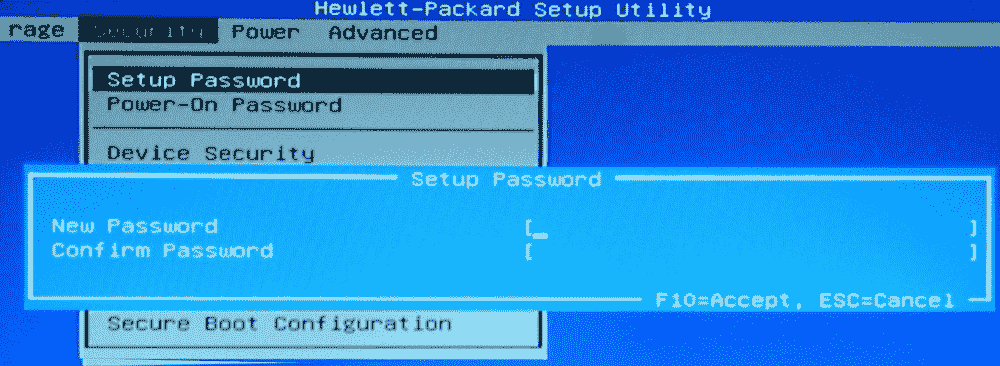

图 16.16：为 BIOS/UEFI 设置密码保护

如果没有其他原因，至少也应该为了防止别人乱动你的设置而做这件事。

现在你了解了一些关于锁定 BIOS/UEFI 的信息，我们来谈谈安全检查清单。

## 使用安全检查清单进行系统设置

之前，我向你介绍了 OpenSCAP，这是一个非常有用的工具，可以通过最小的努力来锁定你的系统。OpenSCAP 附带了多种配置文件，你可以应用这些配置文件，帮助你的系统符合不同监管机构的标准。然而，OpenSCAP 并不能为你做所有事情。例如，某些监管机构要求你的服务器硬盘按特定方式分区，将某些目录单独分成独立的分区。如果你已经将服务器设置为所有内容都放在一个大分区中，那么仅通过 OpenSCAP 的修复程序是无法解决的。确保你的服务器符合任何适用的安全法规的过程必须在你安装操作系统之前就开始。为此，你需要合适的检查清单。

如果你只需要一个通用的安全检查清单，有几个地方可以获取。德克萨斯大学奥斯汀分校发布了适用于 Red Hat Enterprise Linux 7 的通用检查清单，如果你需要将其用于 CentOS 7、Oracle Linux 7 或 Scientific Linux 7，你可以进行调整。（遗憾的是，他们没有提供任何更新的版本。）

你可能会发现一些检查清单项目与你的情况不符，可以根据需要进行调整：

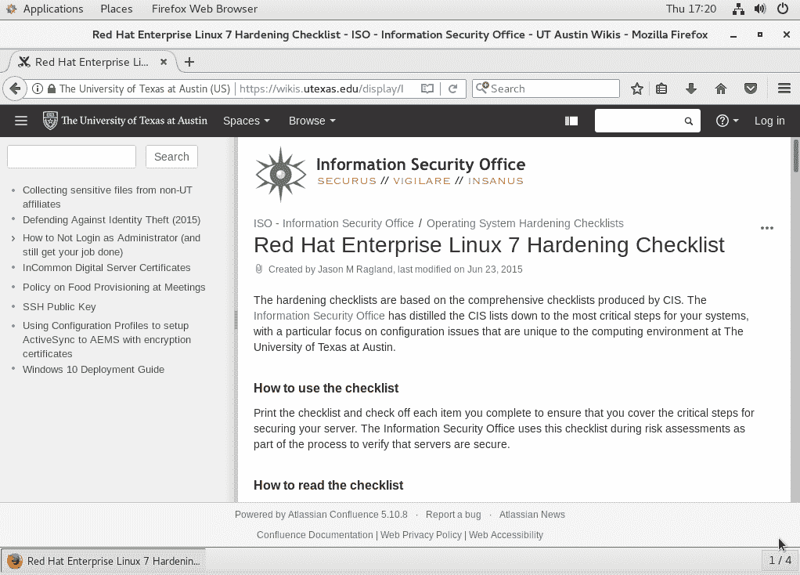

图 16.17：德克萨斯大学检查清单

对于特定的行业领域，你需要从相关的监管机构获取检查清单。如果你从事金融行业或与接受信用卡支付的企业合作，你需要从支付卡行业安全标准委员会（PCI）获取检查清单：


图 16.18：PCI-DSS 网站

对于美国的医疗保健组织，有 HIPAA 及其相关要求。对于美国的上市公司，有 Sarbanes-Oxley 及其相关要求。

> 你可以在 [`wikis.utexas.edu/display/ISO/Operating+System+Hardening+Checklists`](https://wikis.utexas.edu/display/ISO/Operating+System+Hardening+Checklists) 获取德克萨斯大学的检查清单。
> 
> > 你可以在 [`www.pcisecuritystandards.org/`](https://www.pcisecuritystandards.org/) 获取 PCI-DSS 检查清单。
> > 
> > 你可以在 [`www.hhs.gov/hipaa/for-professionals/security/guidance/cybersecurity/index.html`](https://www.hhs.gov/hipaa/for-professionals/security/guidance/cybersecurity/index.html) 获取 HIPAA 检查清单。
> > 
> > 你可以在 [`www.sarbanes-oxley-101.com/sarbanes-oxley-checklist.htm`](https://www.sarbanes-oxley-101.com/sarbanes-oxley-checklist.htm) 获取 Sarbanes-Oxley 检查清单。

其他监管机构可能也有自己的检查清单。如果你知道必须处理它们中的任何一个，务必获取相应的检查清单。

## 总结

再次，我们来到了本章的结尾，我们涵盖了许多有趣的主题。我们首先讨论了审计系统上运行的服务的不同方法，并看到了一些你可能不想看到的例子。然后，我们展示了如何使用 GRUB 2 的密码保护功能，并讨论了使用这些功能时需要处理的小问题。接着，我们换了一个节奏，讨论了如何通过正确设置系统的 BIOS/UEFI 来进一步加固系统。最后，我们讨论了为什么我们需要开始为设置加固系统做准备，通过获取并遵循适当的检查清单。

这不仅是另一个章节的结束，也是本书的结束。然而，这并不意味着你在*掌握 Linux 安全和加固*的旅程就此结束。哦，不。当你继续这段旅程时，你会发现还有更多的知识需要学习，仍然有很多内容无法在一本书中囊括。你接下来的方向主要取决于你所从事的 IT 管理领域。不同类型的 Linux 服务器，无论是 Web 服务器、DNS 服务器还是其他，都会有自己的特殊安全需求，你需要遵循最适合你需求的学习路径。

我很高兴能够陪伴你走过这段旅程，希望你也和我一样喜欢这段经历。

## 问题

1.  你需要查看正在监听传入连接的网络服务列表。你会使用以下哪条命令？

    1.  `sudo systemctl -t service --state=active`

    1.  `netstat -i`

    1.  `netstat -lp -A inet`

    1.  `sudo systemctl -t service --state=listening`

1.  以下哪条命令可以查看已建立的 TCP 连接列表？

    1.  `netstat -p -A inet`

    1.  `netstat -lp -A inet`

    1.  `sudo systemctl -t service --state=connected`

    1.  `sudo systemctl -t service --state=active`

1.  当 Nmap 告诉你某个端口处于开放状态时，这意味着什么？

    1.  该端口在防火墙上是开放的。

    1.  该端口在防火墙上是开放的，并且与该端口关联的服务正在运行。

    1.  该端口可以通过互联网访问。

    1.  确保该端口的访问控制列表设置为开放。

1.  以下哪种 Nmap 扫描选项最可能用于扫描开放的 TCP 端口？

    1.  `-sn`

    1.  `-sU`

    1.  `-sS`

    1.  `-sA`

1.  当重置 Red Hat/CentOS/AlmaLinux 机器的 root 用户密码时，你想做什么？

    1.  确保 AppArmor 处于强制模式。

    1.  确保 SELinux 处于强制模式。

    1.  确保 AppArmor 处于报告模式。

    1.  确保 SELinux 处于宽容模式。

1.  Nmap 的发现模式是如何工作的？

    1.  它通过向网络的广播地址发送 ping 数据包来发现网络设备。

    1.  它通过向网络的广播地址发送 SYN 数据包来发现网络设备。

    1.  它向本地网络发送 ARP 数据包，向远程网络发送 ping 数据包。

    1.  它向本地网络发送 ping 数据包，向远程网络发送 ARP 数据包。

1.  你想使用 Nmap 对整个子网进行 UDP 端口扫描。你会使用以下哪条命令？

    1.  `sudo nmap -sU 192.168.0.0`

    1.  `sudo nmap -U 192.168.0.0`

    1.  `sudo nmap -U 192.168.0.0/24`

    1.  `sudo nmap -sU 192.168.0.0/24`

1.  你会如何开始加固一台新计算机系统的过程？

    1.  在安装操作系统时应用 OpenSCAP 配置文件。

    1.  通过按照检查清单开始初始设置。

    1.  安装操作系统后，应用 OpenSCAP 配置文件。

    1.  安装操作系统后，按照加固清单操作。

1.  在 Red Hat/CentOS/AlmaLinux 服务器上，你最有可能做什么来强制用户在启动时编辑内核参数之前输入密码？

    1.  输入`sudo grub2-password`命令。

    1.  手动编辑 grub 配置文件。

    1.  输入`sudo grub2-setpassword`命令。

    1.  输入`sudo grub-setpassword`命令。

    1.  输入`sudo grub-password`命令。

## 深入阅读

+   netstat – 简易教程：[`openmaniak.com/netstat.php`](https://openmaniak.com/netstat.php)

+   四种方法查找哪个进程在特定端口上监听：[`www.putorius.net/process-listening-on-port.html`](https://www.putorius.net/process-listening-on-port.html)

+   netstat 与 ss 用户指南：[`computingforgeeks.com/netstat-vs-ss-usage-guide-linux/`](https://computingforgeeks.com/netstat-vs-ss-usage-guide-linux/)

+   官方 Nmap 网站：[`nmap.org/`](https://nmap.org/)

+   GNU GRUB 手册：[`www.gnu.org/software/grub/manual/grub/grub.html`](https://www.gnu.org/software/grub/manual/grub/grub.html)

+   如何将 Ubuntu 18.04 启动到紧急和救援模式（这种方法在 Ubuntu 22.04 中仍然有效）：[`linuxconfig.org/how-to-boot-ubuntu-18-04-into-emergency-and-rescue-mode`](https://linuxconfig.org/how-to-boot-ubuntu-18-04-into-emergency-and-rescue-mode)

+   如何在 Ubuntu 18.04 上查看 GRUB 启动菜单：[`askubuntu.com/questions/16042/how-to-get-to-the-grub-menu-at-boot-time`](https://askubuntu.com/questions/16042/how-to-get-to-the-grub-menu-at-boot-time)

## 答案

1.  c

1.  a

1.  b

1.  c

1.  d

1.  c

1.  d

1.  b

1.  c
