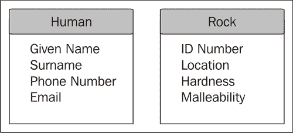
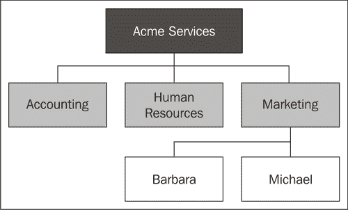
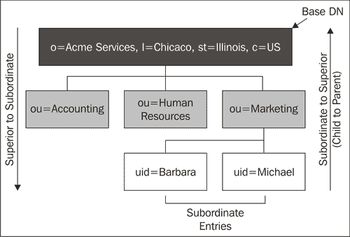
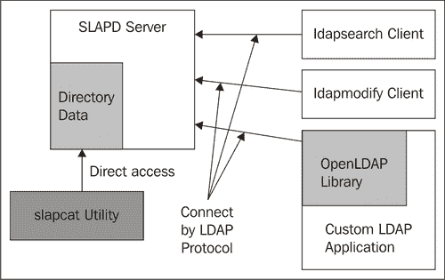

# 第一章：目录服务器与 LDAP

在本章的第一部分，我们将介绍 LDAP 的基础知识。尽管本书的大多数章节采用实践操作的方式，但第一章的内容较为高层，具有引导性。我们将介绍目录服务器和 LDAP，包括常用的目录术语。我们还将看到 OpenLDAP 服务器在目录结构中的位置，它的起源以及它的工作原理。本章涵盖的主要内容如下：

+   LDAP 目录的基础知识

+   LDAP 和 OpenLDAP 服务器的历史

+   OpenLDAP 服务器的技术概述

# LDAP 基础

**LDAP** 是 **轻量级目录访问协议**（Lightweight Directory Access Protocol）的缩写。顾名思义，LDAP 最初是为了提供一种访问现有目录服务器的网络协议，但随着 LDAP 及其相关技术的发展，LDAP 这一术语逐渐与一种特定的目录架构划上了等号。我们在谈论符合该架构的目录服务时，会使用 LDAP 这一术语，正如 LDAP 规范中所定义的。

### 注释

LDAP 是标准化的。LDAP 标准的内容，包括网络协议、目录结构以及 LDAP 服务器提供的服务，都可以通过 RFC（请求评论）文档形式获得。在本书中，我将引用具体的 LDAP RFC 作为 LDAP 的权威信息来源。

当前版本的 LDAP 是 LDAP v.3（版本 3），这是 1997 年以 RFC 2251 标准发布的，并在业界广泛实施。原始规范在 2006 年 6 月进行了更新，RFC 4510-4519 提供了更加清晰和一致的 LDAP 规范。

尽管一般目录和特别是 LDAP 目录在信息技术领域并不新颖或罕见，但推动这些技术的发展，尤其是 LDAP，远不如关系型数据库等近亲技术那样被广泛理解。本章（以及本书）的一个目标是介绍并澄清 LDAP 目录的功能和用途。

在本节中，我们将介绍一些理解 LDAP 所必需的重要概念。最好的起点是理解“目录”这一概念。

## 什么是目录？

当我们想到“目录”时，脑海中会浮现电话簿或地址簿的画面。我们使用这些目录查找个人或组织的信息。例如，我可能翻阅我的地址簿查找朋友 Jack 的电话号码，或者快速浏览电话簿寻找 Acme Services 的地址。

**目录服务器** 也是如此使用的。它维护着关于某些实体（如个人或组织）的信息，并提供访问这些信息的服务。

当然，目录服务器还必须具备添加、修改和删除信息的功能。但是，尽管电话簿被假定为主要用于阅读，目录服务器中的信息也假定主要是读取而非写入。关于目录服务器使用的这一假设在“高读写、低写”这一短语中有所总结或概括。因此，许多 LDAP 技术的应用都侧重于读取和搜索信息。

### 注意

虽然许多目录服务器已针对快速读取进行了优化，而牺牲了快速修改的能力，但 OpenLDAP 的情况不一定是这样。OpenLDAP 在这两方面都非常高效，且可以用于需要频繁写入数据的应用。

一些类型的目录服务器（比如一个简单的基于服务器的地址簿实现）只提供狭窄且特定的服务。一个单一目的的目录服务器，如在线地址簿，可能只存储一种非常特定类型的数据，如一组人的电话号码、地址和电子邮件信息。这类目录是不可扩展的。相反，它们是*单一目的*的。

但 LDAP（及其 X.500 前身）被设计为一个*通用*的目录服务器。它并非专门为捕获特定类型的数据（如电话号码或电子邮件地址）而设计。相反，它的设计目的是让实施者能够清晰且谨慎地定义目录应存储的数据。

这样的通用目录服务器应能够存储多种不同类型的信息。实际上，它应该能够存储关于不同类型实体的不同信息。例如，一个通用目录应该能够存储关于如人类和火成岩样本等多种实体的信息。但我们不想存储与人类相关的所有信息也适用于岩石。

一个人可能有姓氏、电话号码和电子邮件地址，如下图所示：



一块岩石样本可能有一个编号、关于其地理来源的信息以及一个硬度分类。

LDAP 使得定义一个人条目的样子和一块岩石条目的样子成为可能。它的通用架构提供了管理大量不同目录条目所需的能力。

在本节的其余部分，我们将探讨 LDAP 目录中的信息是如何结构化的。我们将从了解**目录条目**的概念开始，接着是**区分名称**和**属性**。然后，我们将研究条目如何在**目录信息树**中进行组织。在本节结束时，你应该理解 LDAP 目录中信息的基本结构。

## 目录条目的结构

让我们继续比较目录服务器和电话簿。电话簿包含一种非常特定类型的信息，以非常特定的方式组织，并且设计的目的是为了实现非常特定的功能。以下是一个电话簿条目的示例：

```
Acme Services
123 W. First St.
Chicago, IL 60616-1234
(773) 555-8943 or (800) 555 9834
```

如前所述，这种目录具有特定的信息，以特定的方式组织，旨在实现特定的目的：它是关于如何联系特定组织（Acme Services）的信息，按照一种熟悉的模式（地址和电话号码）组织。它的设计目的是使人们在心中有一个特定名称时，能够快速扫描目录（按组织名称字母顺序排列），并找到所需的联系信息。

但关于电话簿条目，有几个值得注意的地方：

+   数据的排列方式仅供按一个值进行搜索：组织的名称。如果你手头有某个组织的电话号码，但没有该名称，在电话簿中查找匹配的电话号码以确定名称将是一项费力的、很可能无效的任务。

+   该条目的格式较为简洁，要求读者能够识别格式，并提供解释数据所需的辅助信息。习惯于阅读电话簿条目的人能够根据前一个条目推断，并以此方式识别信息：

    ```
    Organization Name: Acme Services
    Street Address: 123 West First Street
    City: Chicago
    State: Illinois
    Postal Code: 60616-1234
    Country: USA
    Phone Number: +1 773 555 8943
    Phone Number: +1 800 555 9834
    ```

在这个示例中，信息的含义变得更加明确。每个值前都有一个标识给定信息类型的名称。Acme Services 现在被识别为一个组织的名称。信息也被分解成更小的部分（城市和州分成不同的行），并且在之前隐含的部分（例如国家）现在变得显式。而且，之前将两个信息项（两个电话号码）压缩到一行中的部分，现在已经被分开，使信息更加明确。

这种条目形式更接近于 LDAP 目录中记录的方式。但仍然存在另一个问题需要解决。我们如何区分两个非常相似的记录？

例如，假设我们有一个涵盖整个伊利诺伊州的电话目录。在伊利诺伊州，有一家名为 Acme Services 的公司位于芝加哥市，另有一家名为 Acme Services 的公司位于斯普林菲尔德市。

仅知道公司名称是不足以从电话簿中筛选出唯一条目的信息。为了做到这一点，我们需要某种唯一名称——一个在整个目录中仅出现一次的名称，可以用来指代*一个特定的条目*。

## 唯一名称：DN

区分两个非常相似的记录的一种方式是为每个目录中的记录创建一个唯一名称。这是 LDAP 采用的策略；目录中的每个记录都有一个**区分名称**。区分名称是一个重要的 LDAP 术语，通常缩写为**DN**。

在 LDAP 目录中，目录设计者决定组成 DN 的组件，但通常，DN 反映了记录在目录中的位置（这是我们将在下一部分中探讨的概念），以及一些区分该记录与其他相近记录的信息。

因此，DN 由目录信息的组合组成，类似于以下内容：

```
dn: o=Acme Services, l=Chicago, st=Illinois, c=US
```

这个单一标识符足以将其与同名的 Springfield 公司区分开来。根据之前的方案，名为 Acme Services 的 Springfield 公司 DN 可能类似于以下内容：

```
dn: o=Acme Services, l=Springfield, st=Illinois, c=US
```

从这个例子中可以明显看出，在定义组成 DN 的字段时，必须确保这些字段足够精细，以区分两个不同的条目。换句话说，要打破 DN 语法，只需要在芝加哥出现另一个 Acme Services。

### 小贴士

**DN 不是区分大小写的**

LDAP 记录的某些部分是区分大小写的，而其他部分则不是。例如，DN 是区分大小写的。

DN 是 LDAP 条目中的一个重要元素。接下来，我们将更详细地探讨 LDAP 条目的概念，以及构成条目的组件。

## 一个示例 LDAP 条目

让我们具体看看一个**LDAP 条目**是什么样子的。

一个 LDAP**条目**，或**记录**，是存储有关目录中个体项信息的目录单元。再次借用在其他目录中找到的思想：电话簿中的条目描述该目录中特定的一个信息单元。同样，LDAP 目录中的记录包含有关特定单元的信息，尽管（由于 LDAP 是通用的）该单元的确切目标并未明确规定。它可能是一个人，或者一家公司，或者一块石头，或者像 Java 对象这样的虚拟实体。

### 注意

最初，LDAP 规范规定条目必须与现实世界中的某个事物相关联。虽然这可能是早期目录服务器开发者的初衷，但实际上并没有理由要求目录服务器条目必须与目录外部的任何事物（无论是现实的还是虚拟的）相关联。

一个条目由 DN 和一个或多个**属性**组成。DN 作为 LDAP 目录信息树中的唯一标识符。属性提供关于该条目的信息。让我们将之前的电话目录条目转换为 LDAP 记录：

```
dn: o=Acme Services, l=Chicago, st=Illinois, c=US
o: Acme Services
postalAddress: 123 West First Street
l: Chicago
st: Illinois
postalCode: 60616-1234
c: US
telephoneNumber: +1 773 555 8943
telephoneNumber: +1 800 555 9834
objectclass: organization
```

第一行是 DN。此记录中的其他所有行表示属性。

请注意，这个例子与我们之前检查的电话簿示例的主要区别在于条目中每个字段的名称；这些名称现在已经压缩成一种目录可以轻松解析的形式。

### 提示

这些属性名称，如`o`和`postalAddress`，指的是在 LDAP 模式中定义良好的属性定义。它们不能在运行时“发明”或“随意编造”。创建新属性需要编写模式。模式在本书第六章中进行讲解。

一个属性描述了一种特定类型的信息。在我们的示例中，有八个属性，分别代表以下内容：

1.  组织名称（`o`）

1.  邮寄地址（`postalAddress`）

1.  本地性（`l`），可以是城市、镇、村庄等名称

1.  州或省（`st`）

1.  邮政编码或 ZIP 代码（`postalCode`）

1.  国家（`c`）

1.  电话号码（`telephoneNumber`）

1.  对象类（`objectclass`），指定此条目是何种类型（或多种类型）的记录

一个属性可以有一个或多个属性名称，这些名称是同义词。例如，`c`和`countryName`都是用来标识国家的属性类型的名称。两者标识相同的信息，LDAP 会将这两个名称视为描述相同类型的信息。

在任何给定记录中，一个属性可以有一个或多个值（前提是该属性的定义允许多个值）。上面的记录只有一个属性包含多个值。`telephoneNumber`属性有两个值，每个值代表一个不同的电话号码。

属性在*属性定义*中定义，后者将在第六章详细讨论。这些定义提供了关于存储在值中的信息的语法和长度的相关信息，所有适用的属性名称，属性是否可以有多个值等等。存储在 LDAP 目录中的记录必须遵循这些属性定义。

例如，国家名称的属性定义给出以下信息：

+   名称`c`和`countryName`可以引用此对象。默认名称为`c`。

+   国家名称作为字符串存储。

+   在进行属性值匹配时，可以忽略大小写。

+   匹配可以在整个字符串上进行（例如`Canada`），或者使用子字符串（`Ca*`）。

+   一个国家名称不能超过 32768 个字符。

+   每个记录只允许有一个国家名称。

所有这些信息被打包成一个紧凑的模式定义，目录服务器在启动时读取该定义。

属性名称不区分大小写。属性名称`o`与`O`被视为同义词。同样，`GivenName`、`givenname`和`givenName`都被评估为相同的属性名称。

至于属性的值，大小写敏感性取决于属性定义。例如，DN 和 `objectclass` 属性的值是*不*区分大小写的，但 URI（`labeledURI`）属性值是区分大小写的。

### 对象类属性

给定记录中的最后一个属性是 `objectclass` 属性。这是一个特殊属性，提供关于该记录（或条目）类型的信息。

对象类决定了可以为记录赋予哪些属性。`organization` 对象类表示该记录描述的是一个组织。根据该对象类的定义，一个 `organization` 记录可以包含地点（`l`）和邮政编码（`postalCode`），以及记录中存在的所有其他属性。

其中一个字段，组织名称（`o`），是任何具有 `organization` 对象类的条目所必需的。

对象类还允许多个其他属性，这些属性在我们的记录中不存在，如 `description` 和 `facsimileTelephoneNumber`。

给定对象类属性（这是每个条目都必需的），目录可以确定该条目中必须、可以或不能存在的属性。

与其他属性一样，`objectclass` 属性可以有多个值，尽管哪些值可以给定受 **对象类定义** 和 **架构定义** 的约束——即有关哪些属性属于哪些对象类，以及如何组合这些对象类的规则。

### 注意

**LDAP 架构** 由定义目录中记录类型的规则组成，以及这些记录如何彼此关联。架构中存储的主要两项内容（尽管还有其他内容）是属性类型定义和对象类定义。本书第六章专门讨论架构。

虽然一个记录可能有多个对象类，但其中一个对象类必须是该记录的 **结构对象类**。结构对象类决定了该记录是何种类型的对象。我们将在本书后面讨论结构对象类。

LDAP 记录由一个单一的 DN 和一个或多个属性组成（记住，`objectclass` 是必需的）。这些属性包含关于由 DN 标识的实体的信息。

一个 LDAP 目录包含多个条目的集合，这些条目按树形结构在一个或多个层次中排列。

### 操作性属性

除了常规属性外，目录服务器还可能会将特殊的 **操作性属性** 附加到条目上。操作性属性由目录服务器本身使用，用于存储关于条目的信息。这些属性不是为最终用户设计的（尽管偶尔它们可能会有用），通常在 LDAP 查询中不会返回。

在本书的多个部分，我们将使用操作性属性。但大多数时候，当我们讨论属性时，我们指的是常规属性。

## 目录信息树

到目前为止，我们一直在将 LDAP 目录与地址簿或电话簿进行比较。但现在，我将介绍 LDAP 目录服务器中数据结构与许多其他类型目录之间的主要区别之一。

电话簿中的信息通常以一长串字母顺序排列。但在 LDAP 目录中，组织结构更加复杂。

LDAP 目录中的信息被组织成一个或多个层级结构，其中层级结构的顶部是**基条目**，其他条目则以树状结构组织在基条目下。层级中的每个节点都是一个条目，具有 DN 和多个属性。

这种层级组织的条目集合称为**目录信息树**，有时简称为目录树或**DIT**。

要理解这种组织信息的方法，可以参考公司的组织结构图。

层级结构的顶端是公司本身。在其下，有多个部门和组织单元，而在这些部门和组织单元下，则是员工、承包商以及其他与公司有正式关系的个人。我们可以将其绘制成一个层级结构：



LDAP 目录也以层级关系存储数据。目录信息树的顶部是根条目。其下是一个**从属条目**，它本身可能还有自己的从属条目。每个记录都有自己的 DN 和属性。

### 提示

**文件系统类比**

大多数现代文件系统也以层级方式表示数据。例如，目录 `/home` 可能有多个子目录：`/home/mbutcher`、`/home/ikant`、`/home/dhume`。我们可以说 `/home` 有三个从属项，但每个从属项都有一个上级（即 `/home` 目录）。在思考 LDAP 目录树时，将其与文件系统的布局进行比较可能会有所帮助。

将其与前面的示例结合，我们可以轻松地创建一个表示组织结构图的 LDAP 目录信息树：



请注意，每个条目的 DN 包含有关其**上级条目**（其上面的记录）的信息。实际上，DN 由两部分组成：第一部分是**相对 DN**（**RDN**），它包含条目中的一个或多个属性。第二部分是上级条目的*完整* DN。我们将在第三章进一步讨论这种关系。

在接下来的几章中，我们将创建目录时，会创建一个类似树形结构的记录集合。

现在你应该对如何在目录信息树中表示目录有了基本的了解。由 DN 和一些属性组成的记录被组织成一个层级结构。层级结构的顶部是基条目，其下的条目被组织成树枝。

## 使用 LDAP 服务器时需要做什么

我已经描述了 LDAP 目录是什么，但同样有帮助的是了解 LDAP 目录的用途。LDAP 服务器的功能是什么？它要解决什么问题？

第一个，也是最明显的答案是，LDAP 旨在提供一个数字目录——一个在线展示，相当于电话簿或地址簿。当然，这其中确实有一些真实性，LDAP 服务器确实可以这样使用。但关系型数据库甚至更基本的数据结构也可以做到这一点。

我们可以在这个答案上做进一步扩展，指出 LDAP 提供了强大的服务层——使用复杂的过滤器进行搜索、通过属性表示复杂实体、允许对数据进行精细的访问控制等等——这些都提供了复杂的目录服务。

一个更经典的解释，源于 LDAP 从 X.500 目录演变而来的历史背景，是，LDAP 被设计用于表示组织，包括其结构、物理资产和人员。从这个角度来看，LDAP 不仅仅是一个花哨的电话簿，它更像是一个企业管理工具。事实上，这也是使用 LDAP 目录的常见方式之一。

LDAP 最常见的用途，基于将 LDAP 视为一种狭义的企业管理工具的理解，是作为网络用户、组和账户的中央权威。一个 LDAP 目录存储着网络中每个用户账户的信息——如用户名、密码、全名和电子邮件地址等。网络上的其他服务，从工作站到电子邮件服务器再到 web 应用程序，都可以将 LDAP 作为用户信息的权威来源。应用程序可以通过目录对用户进行身份验证。一个用户账户可以在多个（甚至是所有）企业应用程序之间共享。

最后，还有一种更通用或抽象的看法，关于 LDAP 服务的功能。LDAP 其实就是一种特殊的数据库，它将数据组织成树状结构，类似于文件系统层级。这种看法通过将 LDAP 目录与关系型数据库（RDB）系统进行对比更容易理解。

关系型数据库将信息存储在表格中，而表格由记录组成。在关系型数据库（RDB）中，表与表之间的关系是通过不同表中的记录建立的，关系有多种形式：一对多、一对一、多对一，等等。关系型数据库支持对数据进行读写操作，通常通过某个版本的 SQL（标准查询语言）来实现，并且它们通常监听网络连接，使得网络上的其他应用程序能够访问数据。

与 RDB 相比，LDAP 也可以看作是一个存储系统。然而，与以表格结构展示数据的 RDB 不同，LDAP 以层级结构（像文件系统一样）存储条目。LDAP 中的基本关系包括优先到从属关系（一对多）和从属到优先关系（一对一），虽然也可以使用其他关系。

### 提示

**LDAP 中的其他关系**

虽然优先/从属关系是最常用的，但它们并不是唯一被支持的关系。数据库中任意条目之间的关系通常通过使用属性将 DNs 链接在一起来建模。当我们在第四章讨论组时，我们将详细研究这种用法。

通过 LDAP 操作，支持使用复杂的过滤器和数据结构（如 **LDIF**（**LDAP 数据交换格式**））对数据库进行读写。而且，像 RDB 服务器一样，LDAP 目录通常会监听网络套接字，以向其他应用程序提供服务。

我已经提出了 LDAP 目的的不同视角。这些中是否有一个是*正确*的答案？没有。每种 LDAP 的使用方式都是合法的，LDAP 目录可以用来解决各种各样的问题。

# LDAP 和 OpenLDAP 的历史

初看之下，LDAP 这个术语似乎有些误导。例如，当我们谈论 Web 的主要协议 HTTP（超文本传输协议）时，我们是指 Web 应用程序如何通过网络传输信息。我们并不是在谈论跨网络传输的数据的格式，也不是在谈论这些数据如何存储在服务器上或从服务器中检索。

但当我们谈论 LDAP 时，通常不仅仅是指网络协议，还指一种特定类型的服务器，它将格式明确的数据存储在一个特殊的数据库中。这种看似误导的名称背后有一个历史原因。

最初，LDAP 只是一个网络协议，用于从 X.500 目录（一个在 1980 年代设计并于 1988 年标准化的目录服务器架构）中获取数据。这是 Yeong、Howes 和 Killie 在 1993 年最初起草 LDAP 规范 RFC 1487 时的初衷。

### 提示

**关于 RFC**

RFC（请求评论）是一系列技术文档，通常用于指定标准。每个 RFC 都有一个编号，按顺序排列——较早的 RFC 编号较低。有许多网站提供 RFC 数据库的完整或部分内容，其中一个示例来源是 RFC 编辑器（[`www.rfc-editor.org`](http://www.rfc-editor.org)），本书中也使用了该网站。

最早的 LDAP 服务器是 X.500 目录的网关，但这些服务器很快发展成了完整的目录服务器。Tim Howes 和他在密歇根大学的同事们创建了开源的*密歇根大学 LDAP 实现*，该实现成为其他 LDAP 服务器的参考实现。

### 注意

密歇根大学 LDAP 项目的历史信息仍然可以在线获取：[`www.umich.edu/~dirsvcs/ldap/ldap.html`](http://www.umich.edu/~dirsvcs/ldap/ldap.html)

随着密歇根大学的 LDAP 服务器的成熟，涌现了大量新的标准。LDAP 在业界逐渐获得势头。Tim Howes 被 Netscape 雇佣，LDAP 逐渐走向主流。

到 1990 年代末，Netscape、Novell、Oracle 和 Microsoft（等公司）都推出了 LDAP 产品。1997 年发布的 RFC 2251 标准化了 LDAPv3，并对早期的 LDAP 标准做出了重大改进。

LDAP 服务器市场逐渐成熟，但密歇根大学项目失去了动力。主要开发人员离开了大学，转向其他项目。

1998 年，OpenLDAP 项目由 Kurt Zeilenga 启动。不久后，Howard Chu（曾任密歇根大学职员，现为该项目的架构师）加入。他们挽救了密歇根大学的代码库，并重新开始开发。最终，OpenLDAP 2.0 取得了巨大成功，并进入了几乎所有主要的 Linux 发行版。

### 注意

OpenLDAP 贡献者的完整名单，从项目开始到现在，可以在 [`www.openldap.org/project/`](http://www.openldap.org/project/) 找到。

自 90 年代末以来，OpenLDAP 在 OpenLDAP 基金会的监督下不断成熟，并得到行业赞助商的贡献支持。截止目前，版本 2.3 是稳定版，版本 2.4 正处于测试阶段。

正如密歇根大学 LDAP 服务器的初衷一样，OpenLDAP 仍然严格遵循 LDAP 标准。事实上，Kurt Zeilenga 对 2006 年 6 月 LDAP 标准的多次更新负有重要责任。

除了高度符合标准外，OpenLDAP 还是市场上最快的目录服务器之一，远远超越了其他开源目录服务器实现的产品。

# OpenLDAP 技术概览

本书是一本面向实践的技术书籍，旨在帮助您快速搭建并运行 OpenLDAP，并帮助您将 LDAP 集成到自己的应用程序中。

我们现在将开始从前面介绍的高层次内容转向对 OpenLDAP 套件的更实际的检视。首先，让我们简要看一下 OpenLDAP 的技术结构。

OpenLDAP 套件可以分为四个组件：

+   服务器：提供 LDAP 服务

+   客户端：操作 LDAP 数据

+   工具：支持 LDAP 服务器

+   库：提供 LDAP 的编程接口

在本书中，我们将查看这四个类别。此处，我们只做概述：



该图表解释了这四个元素之间的关系。

## 服务器

LDAP 套件中的主要服务器是**SLAPD**（**独立 LDAP 守护进程**）。该服务器提供对一个或多个目录信息树的访问。客户端通过 LDAP 协议连接到服务器，通常使用基于网络的连接（尽管 SLAPD 也提供了一个 UNIX 套接字监听器）。

服务器可以将目录数据存储在本地，或仅仅访问（或代理访问）外部资源。通常，它提供认证和搜索服务，也可能支持添加、删除和修改目录数据。它提供对目录的精细访问控制。

SLAPD 是本书的主要焦点，我们将在接下来的章节中详细讨论它。

## 客户端

客户端通过 LDAP 网络协议访问 LDAP 服务器。它们的工作方式是请求服务器代其执行操作。通常，客户端会首先连接到目录服务器，然后进行绑定（认证），接着执行零个或多个其他操作（如搜索、修改、添加、删除等），最后解除绑定并断开连接。

## 实用工具

与客户端不同，实用工具不通过 LDAP 协议执行操作。相反，它们在更低的层次上操作数据，并且不通过服务器进行中介。它们主要用于帮助维护服务器。

## 库

有几个在 LDAP 应用之间共享的 OpenLDAP 库。这些库为这些应用提供 LDAP 功能。客户端、实用工具和服务器都共享对其中一些库的访问权限。

应用程序编程接口（APIs）用于允许软件开发人员编写自己的 LDAP 感知应用，而无需重写基础的 LDAP 代码。

虽然 OpenLDAP 提供的 API 是用 C 语言编写的，但 OpenLDAP 项目还提供了两个 Java API。这些 Java 库不包含在 OpenLDAP 套件中，也不在本书的讨论范围内。然而，两者都可以从 OpenLDAP 网站上获取：[`openldap.org`](http://openldap.org)。

随着本书的深入，我们将详细探讨 LDAP 架构的各个组成部分。

# 小结

在本章中，我们介绍了 LDAP 目录的一般基础知识，特别是 OpenLDAP 服务器的基础知识。我们讨论了 LDAP 的历史、重要术语以及一些 OpenLDAP 的高层技术方面。现在我们准备开始应用这些知识。

在下一章中，我们将关注 OpenLDAP 的安装和配置过程。
