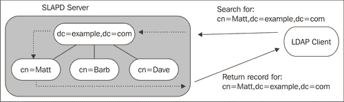

# 第二章：安装与配置

在本章中，我们将逐步演示安装和配置 OpenLDAP 工具套件的过程。这里我们只涵盖 SLAPD 服务器的基本配置。这将为后续章节（特别是第 4 至第七章）打下基础，在那些章节中我们将探讨更高级的配置选项。我们将涉及的具体内容包括：

+   安装二进制的 OpenLDAP 包

+   使用 `slapd.conf` 文件配置 LDAP 服务器

+   使用 `slaptest` 验证 `slapd.conf` 配置

+   启动和停止服务器

+   使用 `ldap.conf` 文件配置客户端工具

+   使用 `ldapsearch` 从目录中获取根 DSE 条目

# 开始之前

OpenLDAP 由 OpenLDAP 基金会维护。该基金会维护一套工具，我们称之为 OpenLDAP 工具套件。正如我们在第一章中所见，OpenLDAP 工具套件包括以下几类工具：

+   守护进程（`slapd` 和 `slurpd`）

+   库文件（尤其是 `libldap`）

+   客户端应用程序（`ldapsearch`、`ldapadd`、`ldapmodify` 等）

+   支持工具（`slapcat`、`slapauth` 等）

官方的 OpenLDAP 源代码发行版将这些工具打包成一个下载包。然而，某些二进制版本可能将其拆分为多个子包。通常，工具套件被拆分为三个包：*库文件*、*客户端* 和 *服务器*。

OpenLDAP 可以在各种操作系统上编译和运行。然而，OpenLDAP 项目本身并不提供其软件的二进制版本。因此，不同的厂商和操作系统维护者会编译并提供他们自己的二进制版本。目前，已经为大多数 UNIX 变种（包括 Mac OS X）编译了 OpenLDAP 版本，同时也有适用于 Windows 操作系统的版本。有些二进制发行版甚至提供商业支持。

## 操作系统的 OpenLDAP 二进制版本

在本书中，我们将使用 **Ubuntu Linux** 作为首选操作系统。Ubuntu 是一个基于著名的 **Debian Project** 的 GNU/Linux 发行版。像 Debian（以及其他许多基于 Debian 的发行版）一样，Ubuntu 使用 Debian 包格式。因此，如果你使用的是另一种基于 Debian 的发行版，安装过程应该会非常类似。

### 注意

Ubuntu 是一个用户友好的 Linux 发行版。你可以在 [`www.ubuntu.com/`](http://www.ubuntu.com/) 上了解更多关于 Ubuntu 的信息。想了解更多关于 Ubuntu 所基于的 Debian 项目，可以访问 [`debian.org/`](http://debian.org/)。

几乎每个主要的 Linux 和 BSD 发行版都提供 OpenLDAP 的官方支持。你可能需要查阅你所选择的发行版的文档，以了解如何获取和安装 OpenLDAP。在某些情况下，OpenLDAP 会随基础操作系统一起安装。

对于 Windows、Mac 和其他 UNIX 变种，查找可用二进制包的最佳方法是浏览由 **OpenLDAP Faq-O-Matic** 维护的发行版列表（[`www.openldap.org/faq/data/cache/108.html`](http://www.openldap.org/faq/data/cache/108.html)）。

### 商业版 OpenLDAP 发行版

如果你需要一个有商业支持的 OpenLDAP 发行版，可以考虑 **Symas** 提供的版本。Symas（[`www.symas.com/`](http://www.symas.com/)）由许多与 OpenLDAP 套件贡献者相同的人员拥有和运营。他们提供一个商业二进制版的 OpenLDAP 套件，名为 **Connexitor Directory Services (CDS)**。

有多个不同的 CDS 版本可供选择，每个版本都根据特定的组织需求进行了调优和优化。例如，它们的*铂金版*特别针对拥有超过 1.5 亿条记录的目录进行优化！Symas 还提供 LDAP 培训、维护和支持服务以及咨询服务。

### 源代码编译

如果你不想安装二进制文件，可以选择自行编译 OpenLDAP 的源代码。这个过程在本书的附录 A 中有简单的步骤说明。

从源代码构建的主要优势在于，你可以在这些修订版本发布到主流软件包之前，就享受到许多改进。OpenLDAP 稳定分支的开发重点是修复 bug。因此，从源代码构建通常能提高 OpenLDAP 的稳定性。

## 关于版本的简要说明

当前，OpenLDAP 的稳定分支是 *2.3 分支*（2.4 版本处于早期 beta 阶段）。然而，一些 Linux 发行版仍在使用 2003 年发布的老旧 2.2 版本。如果你所选择的操作系统的最新软件包仍在 2.2 分支，你可能想要考虑寻找适用于你平台的 *非官方* 2.3 版本，或者甚至编译一个自定义二进制文件（参见 附录 A）。

# 安装

本节将演示在运行 Ubuntu Linux 7.04 的系统上进行安装的过程。以后，Ubuntu 版本可能会遵循相同的安装模式。

## 依赖项

Ubuntu 中的基本 OpenLDAP 配置需要一些额外的库和软件包。具体如下：

+   Berkeley 数据库（`bdb4`）版本 4.2（但*不*包括 4.3 版本，因为它有稳定性问题）：在 Ubuntu 的默认配置中，OpenLDAP 将目录存储在 BDB 数据库中。Berkeley 数据库通常简称为 BDB。

+   OpenSSL 库：这些库提供 SSL 和 TLS 安全性。SSL 和 TLS 为网络连接到目录提供加密。

+   Cyrus SASL 库：该库提供对安全 SASL 身份验证的支持。

+   Perl 编程语言：它可以提供自定义的后端脚本。

+   iODBC 数据库连接层：OpenLDAP 可以将目录存储在关系型数据库（RDBMS）中。iODBC 库用于连接到 RDBMS。

OpenLDAP 还依赖一些标准系统库包（例如 `libc6`），这些库包在所有 UNIX/Linux 发行版中都会安装。在默认安装中，Ubuntu 包括了 BDB、OpenSSL 和 Perl。其他依赖项的安装会由包管理器自动处理，因此无需担心手动安装这些。

## 安装 OpenLDAP

像许多其他发行版一样，Ubuntu 将 OpenLDAP 拆分成多个小包。守护进程（`slapd` 和 `slurpd`）包含在 `slapd` 包中。客户端包含在 `ldap-utils` 中，库文件包含在 `libldap-2.3-0` 中。当 Ubuntu 7.04 发布时，提供的是 OpenLDAP 版本 2.3.30。随着安全修复的发布，Ubuntu 可能会通过在线更新发布新版本。尽管旧版的 2.2.26 包仍然可用，但应该避免使用。

要安装 Ubuntu，我们可以使用 **Synaptic** 图形化安装程序或任何命令行包管理工具。为了简化，我们将使用 **apt-get**。这将从官方 Ubuntu 仓库下载所有必要的包（包括依赖项）并为我们安装。请注意，使用这种方式安装需要访问互联网（或者，使用其他形式的 Ubuntu 分发媒体，如 CD-ROM）。我们需要运行以下命令。

```
 $ sudo apt-get install libldap-2.3-0 slapd ldap-utils

```

下载和安装包可能需要一些时间。

一旦 `apt-get` 完成，LDAP 服务器及其所有客户端应该就安装好了。接下来，我们将开始配置 SLAPD 服务器。

# 配置 SLAPD 服务器

OpenLDAP 包含两个守护进程：SLAPD 服务器和 SLURPD 服务器。**SLAPD**，有时被称为 **OpenLDAP 服务器**，处理客户端请求和目录管理，而 **SLURPD** 则管理将更改复制到其他目录。SLURPD 现在已经弃用，取而代之的是一种更新的、更强大的复制过程，并将在 OpenLDAP 的未来版本中移除。

在下一章中，我们将更详细地讨论这两个守护进程的作用。现在我们只关心如何启动 SLAPD 服务器，以便能够开始连接到（并使用）我们的目录。

SLAPD 有一个主要配置文件和若干辅助配置文件。在本节中，我们将编辑主配置文件。这个文件叫做 `slapd.conf`，在 Ubuntu 的发行版中，它位于 `/etc/ldap/`（如果你是从源码构建的，默认位置是 `/usr/local/etc/openldap/`）。

### 提示

使用 `find . –type f –name slapd.conf` 或者如果启用了 `locate` 服务，可以使用 `locate slapd.conf`。

虽然 Ubuntu 提供了一个不错的基础`slapd.conf`文件供你使用，但如果你选择不使用它，我们将从头开始。为了我们的目的，我们将从一个空文件开始并创建一个`slapd.conf`配置文件。你可能希望在我们开始之前先备份原始的`slapd.conf`文件。可以通过在终端中运行以下命令来进行备份：

```
 $ sudo mv /etc/ldap/slapd.conf /etc/ldap/slapd.conf.orig

```

这将把文件从`slapd.conf`重命名为`slapd.conf.orig`。

### 提示

默认情况下，Ubuntu 不会激活`root`账户。每次需要以超级用户身份执行操作时，应该使用 sudo。然而，如果需要成为`root`（例如，连续执行多个命令），可以输入`sudo su`。

现在我们准备好创建新的`slapd.conf`文件了。打开文本编辑器并创建一个基本的`slapd.conf`文件：

```
# slapd.conf - Configuration file for LDAP SLAPD
##########
# Basics #
##########
include /etc/ldap/schema/core.schema
include /etc/ldap/schema/cosine.schema
include /etc/ldap/schema/inetorgperson.schema

pidfile /var/run/slapd/slapd.pid
argsfile /var/run/slapd/slapd.args
loglevel none

modulepath /usr/lib/ldap
# modulepath /usr/local/libexec/openldap
moduleload back_hdb

##########################
# Database Configuration #
##########################
database hdb
suffix "dc=example,dc=com"
rootdn "cn=Manager,dc=example,dc=com"
rootpw secret
directory /var/lib/ldap
# directory /usr/local/var/openldap-data
index objectClass,cn eq

########
# ACLs #
########
access to attrs=userPassword
       by anonymous auth
       by self write
       by * none

access to *
       by self write
       by * none
```

文件中有三个标题（**基础设置**、**数据库配置**和**ACLs**），接下来我们将详细查看每个标题。

### 提示

如果你是从源代码构建的，则需要调整上面文件中的路径（或者，您也可以重新定位文件系统上的文件）。请在文件系统的`/usr/local`部分查找正确的位置（例如，`modulepath`位于`/usr/local/libexex/openldap/`）。

## 基础设置

配置文件的第一部分，标记为*基础设置*，包含了各种配置参数：

```
##########
# Basics #
##########
include /etc/ldap/schema/core.schema
include /etc/ldap/schema/cosine.schema
include /etc/ldap/schema/inetorgperson.schema
pidfile /var/run/slapd/slapd.pid
argsfile /var/run/slapd/slapd.args
loglevel none

modulepath /usr/lib/ldap
# modulepath /usr/local/libexec/openldap
moduleload back_hdb
```

首先要注意的是，所有以井号（`#`）开头的行都被视为注释，并且会被 SLAPD 忽略。

前三行功能性（非注释）行都以`include`指令开头。`include`指令后应始终跟随文件系统上文件的完整路径。当 SLAPD 遇到`include`指令时，它将尝试加载指定的文件。这些文件将作为当前配置文件的一部分进行处理。因此，当 SLAPD 读取这三行时，它将尝试加载三个架构文件（`core.schema`、`cosine.schema`和`inetorgperson.schema`）。

`include`指令可用于加载任何配置参数（在下一章中，我们将使用它来包含包含 ACL 的文件）。传统上，架构信息是与其他配置指令分开存储的，并在服务器启动时加载（使用`include`指令）。这可以提高代码的可读性，并有助于防止意外修改架构信息。

### 架构

架构提供了（除了其他内容）OpenLDAP 应该支持的不同对象类和属性类型的定义。利用这些，OpenLDAP 可以确定它允许存储哪些条目、任何给定的条目是否有效以及如何最佳存储条目。

这里加载的三个模式包含了最常用的选项。`core.schema` 包含了 LDAP v.3 规范中的所有属性和对象类定义。`cosine.schema` 和 `inteorgperson.schema` 文件包含了常用的标准化扩展的模式定义（参见 RFC 4524 和 2798）。OpenLDAP 还提供了许多其他模式，我们将在第六章中讨论其中的一些。

### 更多指令

在包含模式后，接下来的两个指令，`pidfile` 和 `argsfile`，告诉 SLAPD 文件存储的位置（以及在哪里查找）包含以下信息的文件：

+   SLAPD 服务器进程的进程 ID

+   启动时传递给 `slapd` 命令的参数

### 注意

由于 SLAPD 需要写入这些文件，因此运行 `slapd` 的用户需要具有 `读取` 和 `写入` 这些文件的权限。由于文件在 SLAPD 服务器关闭时会被删除，因此运行 `slapd` 的用户还需要对存储这些文件的目录（在此案例中是 `/var/run/slapd/`）具有写入权限。

接下来，`loglevel` 指令被设置为 `none`。`loglevel` 指令指定了 SLAPD 应该向系统日志（通过 `syslogd`）发送多少信息。loglevel 指令接受关键字（`any`、`none`、`trace` 等），整数（`0`、`128`、`32768`）和十六进制数字（`0x2`、`0x80`、`0x100`）。

将其设置为 `none` 会导致 SLAPD 仅记录关键事件。为了完全关闭日志记录，请使用 `0`。要开启所有日志记录，这将为每个请求生成大量日志，请使用 `any`。SLAPD 的手册页（`man slapd`）提供了所有支持的日志级别的完整列表。

### 模块指令

*基础* 部分中的最后几个指令是 `modulepath` 和 `moduleload`。这些是用于加载 OpenLDAP 模块的指令。

**模块** 是一种特殊类型的库，可以在 SLAPD 启动时加载。与将所有 SLAPD 代码编译成一个大二进制文件不同，模块使得可以为 LDAP 代码的不同功能单元创建较小的库文件。

通常，模块有两种不同的类型：

1.  **后端**：OpenLDAP 服务器可以使用不同的存储后端，包括 BDB、SQL 数据库、平面文件（LDIF 格式）或甚至另一个 LDAP 目录服务器。每个后端都可以被编译成自己的模块。然后，在配置过程中，我们可以选择仅加载所需的模块（或模块）。

1.  **覆盖层**：OpenLDAP 包括许多可选的扩展，称为覆盖层，这些覆盖层可以修改服务器的行为（我们将在本书中讨论几个覆盖层）。这些也存储在模块中。

让我们来看看在 `slapd.conf` 文件中使用的指令：

+   `modulepath` 指令提供模块（编译的库）存储目录的完整路径。默认情况下，Ubuntu 将 LDAP 库放在 `/usr/lib/ldap` 中。如果出于某种原因，您的模块存储在多个目录中，您可以指定多个路径列表，用冒号分隔：

    ```
      modulepath /usr/lib/ldap:/usr/local/lib/custom-ldap
    ```

+   `moduleload` 指令指示 OpenLDAP 加载特定的模块。该指令接受要加载的模块的文件名（例如 `back_hdb`）或模块文件的完整路径（以 `/` 开头）。如果仅指定名称，SLAPD 将在 `modulepath` 中指定的目录中查找。如果指定了完整路径，它将尝试从该路径加载（完全不使用 `modulepath`）。

+   `moduleload back_hdb` 指示 SLAPD 加载提供存储目录的服务的模块，该目录使用 *层次化* *数据库*（HDB）后端。这就是我们将在 *数据库* *配置* 部分中配置的数据库。

到目前为止，这些是我们在 *基础* 部分中所需要的唯一指令。不过还有其他选项，我们将在第四章和第五章中详细讨论它们。

## 数据库配置

我们 `slapd.conf` 文件的下一个部分是数据库配置部分。该部分处理数据库存储机制的配置。OpenLDAP 并不限于使用单一数据库，每个服务器可以使用多个数据库，每个数据库存储其自己的目录树（或子树）。例如，单个 OpenLDAP 实例可以从一个数据库提供基本为 `o=My Company,c=US` 的目录树，并从另一个数据库提供根为 `dc=example,dc=com` 的目录树。

### 注意

正如我们在第一章中看到的，目录树的基础 DN 由属性名/属性值对组成。例如，DN `o=My Company, c=US` 表示组织名称 `(o)` 是 My Company，其原籍国家 `(c)` 是美国（ISO 两字母代码为 US）。同样，第二个 DN 由属性名/值对组成，这次代表域组件 `(dc)`，来自组织注册的域名，在这里是虚构的 `Example.Com`。

我们将在第五章中讨论这个选项。在我们的简单 `slapd.conf` 文件中，我们只定义了一个数据库：

```
##########################
# Database Configuration #
##########################
database hdb
suffix "dc=example,dc=com"
rootdn "cn=Manager,dc=example,dc=com"
rootpw secret
directory /var/lib/ldap
# directory /usr/local/var/openldap-data
index objectClass,cn eq
```

数据库配置部分的第一个指令是 `database` 指令。该指令指定将使用哪个数据库后端。在本例中，我们将使用 **层次化数据库** (**HDB**)，因此我们指定 `hdb`。

### 注意

HDB 是 OpenLDAP 的新一代存储机制。与其前身 BDB 后端类似，HDB 也使用 Oracle Berkeley DB 数据库进行存储，但 HDB 采用层次结构存储条目，这非常适合 LDAP 的树状结构。旧的 BDB 后端仍然受到支持，您可以通过在 `database` 指令中指定 `bdb` 而不是 `hdb` 来使用它。

接下来的指令 `suffix` 表示此数据库将包含目录树的哪些部分。基本上，它表明该数据库的基础将是 `suffix` 指令中指定的 **区分名称**（**DN**）条目（`dc=example`,`dc=com`）。我们在第一章中讨论过 *区分* *名称*。

当服务器接收到树中某些内容的请求时（例如，`cn=Matt`,`dc=example`,`dc=com`），它会在该数据库中进行搜索。下图可以更好地说明这一点：



这里，客户端正在搜索特定的 DN，`cn=Matt`,`dc=example`,`dc=com`。SLAPD 服务器包含一个目录信息树，其基础 DN 为 `dc=example`,`dc=com`。

DN `cn=Matt`,`dc=example`,`dc=com` 属于 `dc=example`,`dc=com`。它存在于 `dc=example`,`dc=com` 树中。因此，SLAPD 会在 `dc=example`,`dc=com` 数据库中搜索一个 DN 为 `cn=Matt`,`dc=example`,`dc=com` 的记录。一旦找到该记录，它将返回给客户端。

如果客户端请求记录 `cn=Matt`,`dc=test`,`dc=net`，会发生什么情况？由于这个 DN 不包含服务器处理的基础 DN，服务器将不会搜索该记录。根据配置，服务器可能会返回一个错误给客户端，或者将客户端重定向到另一个可能能够处理该请求的服务器。

同样，如果客户端尝试*添加*一个具有与 `suffix` 指令中指定的基础 DN 不同的记录，LDAP 服务器将拒绝将该记录添加到目录信息树中。

`slapd.conf` 中的 `suffix` 指令指定了存储或引用在该数据库中的信息的基础 DN。这在很大程度上决定了该数据库将包含、搜索或允许添加哪些记录。

### 注意

一个数据库可以包含多个树（第五章有详细说明）。

接下来的两行指定了目录管理员的记录，并为管理员条目设置了密码。`rootdn` 指令指定了被视为该目录管理员的 DN。按照约定，*root* DN 是通过将 `cn=Manager` 添加到目录树的 *base* DN 前面来创建的。因此，我们的目录管理员是 `cn=Manager`,`dc=example`,`dc=com`。接下来的字段 `rootpw` 用于为目录管理员指定密码。请注意，这个密码存储在目录外部，而不是内部。例如，目录中记录的 `userPassword` 属性。这是为了防止管理员被*锁定*，无法访问目录。

目录管理员是一个具有特殊权限的特殊用户。管理员的请求不会通过 ACL 进行过滤——管理员的访问不能受到限制。此外，管理员对指定后缀或后缀下的所有记录具有*写*权限。因此，管理员 DN 应仅用于管理任务，而不应用于其他用途。

此外，由于管理员的必要字段存储在 `slapd.conf` 文件中，因此目录中**不应**有包含管理员 DN 的记录（虽然 SLAPD 并未明确禁止，但这是最佳实践推荐的做法）。

由于管理员的 DN 和密码存储在 `slapd.conf` 文件中，并且管理员对目录中的所有内容都有访问权限，因此我们应该将 `slapd.conf` 文件的文件系统权限设置得尽可能严格。

### 提示

**加密管理员的密码**

您还可以通过使用 `ldappasswd` 工具为 `rootpw` 设置加密密码，具体内容将在下一章介绍。

`directory` 指令指示文件系统中的哪个目录应该存储数据库文件。在本例中，数据库存储在 `/var/lib/ldap/`。

最后，`index` 指令由应被索引的属性列表组成，后面跟着该索引将用于的匹配类型。我们的示例如下所示：

```
index objectClass,cn eq
```

这意味着我们正在创建一个支持属性 `objectClass` 和 `cn` 上等值（`eq`）匹配的索引。当服务器收到所有 `cn Rob` 或 `commonName Rob` 的条目请求时，服务器可以通过访问索引而不是搜索整个数据库，显著加速服务。然而，如果请求是 `Rob*`（注意 `*` 通配符字符），则服务器不会寻找等于 "Rob*" 的 CN，而是寻找以 "Rob" 开头的任何 CN。在这种情况下，我们创建的索引将不会被使用。

可以使用多个索引指令，我们可以通过将索引指令拆分为两个不同的指令，来支持更快速的 CN 搜索，比如查询 `Rob*`：

```
index objectClass eq
index cn eq,sub
```

在给定的示例中，`objectClass` 属性维护了等值（`eq`）索引，而 `cn` 属性则为等值匹配（`eq`）和子字符串匹配（`sub`）建立了索引。

某些属性不支持所有类型的索引。例如，`objectClass` 属性不支持子字符串（`sub`）索引匹配。在第五章中，我们将更加仔细地查看索引指令。

一旦创建了数据库，每次修改 `slapd.conf` 中的 `index` 指令时，都应使用 `slapindex` 命令行工具重建索引。然而，由于我们尚未在数据库中放入任何数据，因此现在不需要运行此命令。

现在我们准备继续配置文件的第三个也是最后一个部分。

## ACLs

`slapd.conf` 文件的最后一部分是 ACL 部分。ACL（访问控制列表）决定了哪些客户端可以访问哪些数据，以及在什么条件下可以访问。我们将在第四章中更详细地讨论 ACL。然而，从一开始就配置一些基本的 ACL 是很重要的，因此我们将简要介绍两个简单的 ACL：

```
########
# ACLs #
########
access to attrs=userPassword
       by anonymous auth
       by self write
       by * none

access to *
       by self write
       by * none
```

ACL 只是复杂语法的指令——它们以访问指令开始，后面跟着一系列条件。条件可以跨越多行，只要每行的续写都以一个或多个空白字符（如制表符或空格）开始。

### 提示

**slapd.conf 文件中的行续写**

任何指令，不仅仅是 ACL，都可以跨越多行，只要每一行的续行都以空白字符开始。例如，`moduleload back_hdb`可以写成：

`moduleload`

`back_hdb`

让我们详细看看第一个访问控制：

```
access to attrs=userPassword
       by anonymous auth
       by self write
       by * none
```

这个访问控制的目的是保护用户密码的安全。具体来说，它允许匿名用户请求服务器在登录过程中对密码进行身份验证比较。此外，它授予用户更改自己密码的权限。最后，它拒绝其他任何人访问密码。这就是该规则的作用。那么，我们该如何实现这一点呢？

每一行包含`by`的代码都应该缩进：

`access to` [*资源*]

`by` [*谁*] [*授予的访问类型*]

`by` [*谁*] [*授予的访问类型*]

`by` [*谁*] [*授予的访问类型*]

每个`access`指令可以有一个`to`短语，并且可以有多个`by`短语。我们的第一个规则有三个`by`短语。让我们更详细地看看这些：

+   在`access to attrs=userPassword`中，`attrs`表示接下来会有一个或多个属性的列表。在我们的例子中，只有一个属性：`userPassword`。`userPassword`属性用于存储目录中对象的密码值。

    ### 注意

    虽然并非目录中的所有对象都有`userPassword`，但有许多不是用户的对象也可以拥有密码。`userPassword`属性最常见的用途是用于描述用户的记录。

    在这个访问控制中，没有明确提到该规则应用于目录的特定部分。鉴于此，ACL 将对*所有*`userPassword`实例进行强制执行。因此，该规则指定了对`userPassword`属性的访问。接下来的三句话将表明谁可以访问`userPassword`属性，以及他们可以获得什么样的访问权限。

+   接下来是`by anonymous auth`。这个短语授予匿名用户（尚未进行身份验证的用户）使用密码进行身份验证的权限。更准确地说，它表示当用户提交身份验证请求时，目录服务器被允许执行身份验证操作（即将提交的密码与相应用户条目中的`userPassword`属性值进行比较）。

+   `by`短语的最后部分指定了记录被授予的权限类型。权限级别可以通过几种方式授予，这将在第四章中详细讨论。

目前，我们将看看 ACL 中用于授予常见权限级别的四个关键字：

+   `auth`：服务器可以使用此资源执行身份验证操作。

+   `read`：客户端可以拥有 `auth` 访问权限，并且还可以*读取*该资源，但不能进行任何更改。

+   `write`：客户端可以拥有 `auth` 和 `read` 访问权限，并且还可以对资源上指定的内容执行添加、修改和删除操作。

+   `none`：服务器不应允许客户端对该资源进行任何访问。

在第四章中，当我们深入研究 ACL 时，我们将了解其他关键字，并探索创建更精细的权限级别，例如允许写入访问而不授予读取访问。

因此，第二个 `by` 短语 `by self write` 表示一旦一个 DN（通常是用户）成功连接并通过身份验证到 LDAP 服务器，它就可以更改 `userPassword` 的值。

最后，最后一个 `by` 短语是 `by * none`。`*` 是一个通配符，将应用于每个人。`none`，正如我们所知，拒绝对 `userPassword` 属性的任何访问。这个规则表示每个人都应该被拒绝访问密码属性。

这个第三个 `by` 短语很好地说明了 ACL 的应用方式。ACL 是按顺序评估的。在上面的规则中，一旦服务器找到适用于当前 DN 的规则，它就会停止处理该 ACL。举个例子。当一个匿名用户尝试使用 DN 和密码进行身份验证（绑定）时，服务器会检查 ACL，看看该 DN 是否有权请求使用 `userPassword` 属性进行身份验证比较。

当 SLAPD 评估这个 ACL 时，它会看到第一个 `by` 短语适用；使用这个规则并跳过另外两个。然而，另一方面，如果一个经过身份验证的用户尝试读取另一个 DN 的 `userPassword`，服务器将继续搜索 `by` 短语，直到找到一个匹配的规则。它会评估并跳过前两个规则，然后应用第三个规则，这会拒绝该用户访问另一个记录的 `userPassword` 属性。

### 提示

**默认的 by 短语**

在处理 ACL 时，SLAPD 默认拒绝访问。这意味着每个访问指令都会以隐式的 `by` 短语 `by * none` 结束。因此，为了节省空间，我们本可以省略我们两个 ACL 中的最后一个短语。

现在我们理解了第一个 ACL，第二个应该会非常简单。我们来看看第二个：

```
access to *
       by self write
       by * none
```

这个最后的 ACL 成为我们目录的默认规则。它可以这样转述：对于任何对象及其所有属性（`to *`），如果当前连接的 DN 是该对象的 DN，则该对象可以被写入（`by self write`）。否则，当前连接的 DN 没有任何访问权限（`by * none`）。简而言之，它允许对象写入自己，但拒绝其他所有人对该对象的所有权限。

### 提示

**限制管理器**

应该注意，ACL 不能用于限制在 `rootdn` 指令中指定的特殊目录管理员帐户。

请记住，ACL 是按顺序处理的。因此，第二条规则只有在前一条规则未生效时才会应用。

这些访问控制非常严格，会阻止目录用户从目录中获取太多信息。在第五章中，我们将创建更多规则，使目录更易于访问，但目前这些简单的规则已足够。

## 验证配置文件

我们现在已经完成了配置文件的操作。开始服务器之前，最后一步是验证配置文件是否有效。

OpenLDAP 提供了一个工具，用于测试配置文件，确保其格式正确且指令使用得当。它还检查 OpenLDAP 环境的元素，确保所需的文件位于正确的位置。这个测试工具叫做`slaptest`，其显示方式如下：

```
 $ sudo slaptest -v -f /etc/ldap/slapd.conf

```

由于`slapd.conf`的文件系统权限非常严格，我们使用`sudo`以 root 用户身份执行测试。`slaptest`命令需要知道`slapd.conf`文件的位置。通过`-f`参数指定配置文件的路径来实现。我们还使用了`-v`标志以要求详细输出。由于`slapd.conf`没有问题，所以只打印了一行：

```
config file testing succeeded
```

但如果有任何错误，`slaptest`会提供诊断信息。我们来看一个配置错误的`slapd.conf`文件：

```
# slapd.conf - Configuration file for LDAP SLAPD
##########
# Basics #
##########
include /etc/ldap/schema/core.schema
include /etc/ldap/schema/cosine.schema
include /etc/ldap/schema/inetorgperson.schema

pidfile /var/run/slapd/slapd.pid
argsfile /var/run/slapd/slapd.args
loglevel none
modulepath /usr/lib/ldap
# modulepath /usr/local/libexec/openldap
moduleload back_hdb

##########################
# Database Configuration #
##########################
database hdb
suffix "dc=example,dc=com"
rootdn "cn=Manager,dc=example,dc=com"
rootpw secret
directory /var/lib/ldap
# directory /usr/local/var/openldap-data
index objectClass sub,eq
index cn sub,eq

########
# ACLs #
########
access to attrs=userPassword
       by anonymous auth
       by self write
       by * none

access to *
       by self write
       by * none
```

这个配置文件是我们在本节中一直在检查的配置文件的小变体。问题是`objectClass`属性不能处理子字符串匹配。这个原因（在第六章中会有更详细的解释）是因为架构不允许对`objectClass`属性进行子字符串匹配。

做出上述更改后，我们运行`slaptest`命令：

```
 $ sudo slaptest -v -f slapd.conf

```

以下信息会出现：

```
slapd.conf: line 48: substr index of attribute 
                       "objectClass" disallowed
slaptest: bad configuration file!
```

正如你所见，这些信息对于在尝试启动服务器之前快速发现并修复问题非常有用。

### 提示

**Ubuntu 的疏忽**

由于 Ubuntu 打包维护者的配置疏忽，slaptest 程序在发现未知指令时不会发出警告。因此，错误的指令名称可能在验证阶段被忽略。例如，将`index`拼写为`idnex`不会导致错误。

### 提示

**使用 slapd 测试 slapd.conf**

`slaptest`命令实际上不过是一个指向 slapd 的符号链接，slapd 是用于启动服务器的命令。虽然这样做没有明显的优势，但你可以使用 slapd 程序来测试`slapd.conf`：

```
$ slapd -T dest -f /etc/ldap/slapd.conf

```

一旦配置文件通过`slaptest`程序的检查，我们就可以准备启动服务器了。

此时，我们已经走完了基本的`slapd.conf`配置文件部分。这个配置文件将使我们的目录启动并运行，在本书的后续章节中，我们将介绍一些更高级的设置，这些设置可以包含在配置文件中。

### 注意

如果你有兴趣了解更多关于`slapd.conf`的配置选项，可能想查看手册（man）页面。OpenLDAP 的 man 页面提供了详尽的（尽管有时表述简洁）参考资料，尤其是`slapd.conf`页面非常有用。

```
$ man slapd.conf

```

在该页面的底部，有一份相关手册页面的列表，例如`slapd-hdb`，该页面列出了特定于 HDB 数据库的指令。

# 启动和停止服务器

到这里，我们已经配置好了`slapd.conf`文件。现在我们准备启动服务器。有两种不同的方式来运行 SLAPD 服务器：我们可以使用发行版提供的初始化脚本，或者直接运行`slapd`命令。每种方式都有其优点，我们将在这里介绍两种方式。

## 使用初始化脚本

与 Ubuntu 一起安装的 OpenLDAP 包包括一个启动脚本，该脚本与其他服务启动脚本一起位于`/etc/init.d/`目录中。`/etc/init.d/`中的脚本，通常称为**初始化脚本**，用于在系统运行级别变化时（当系统启动、关闭或重启时）自动*启动*和*停止*服务，默认情况下，OpenLDAP 应配置为在服务器启动时启动，并在关闭和重启时停止。

`ldap`初始化脚本提供了一种方便的方式来启动、停止和重启服务器。你可以使用 Ubuntu 的`invoke-rc.d`命令来启动它（如果它尚未运行）：

```
 $ sudo invoke-rc.d slapd start

```

你也可以使用相同的脚本来停止服务器，只需将`start`改为`stop`：

```
 $ sudo invoke-rc.d slapd stop

```

同样，要重启服务器，可以使用`restart`命令，而不是`start`或`stop`。

初始化脚本设置了默认参数并传递了许多系统选项。其中一些存储在位于`/etc/default/slapd`的单独配置文件中。例如，通过将`SLAPD_USER`和`SLAPD_GROUP`变量设置为特定的系统用户 ID 和组 ID，你可以以非默认用户身份运行 SLAPD。

OpenLDAP 服务器必须以 root 用户身份启动，以便绑定到正确的 TCP/IP 端口（默认是 389 或 636）。然后，它会切换并使用位于`/etc/default/slapd`文件中指定的用户账户和组。

### 注意

Ubuntu 创建了一个名为`openldap`的特殊用户和组来运行 SLAPD。其他发行版将 SLAPD 作为 root 用户运行，这从安全角度来看并不推荐。

其他设置，例如日志设置，也可以在此配置文件中进行。

## 直接运行 SLAPD

有时，从命令行直接启动 SLAPD 是有用的。这可能有助于在服务器启动失败时查看错误消息，或者在对初始化脚本或其配置文件进行更改之前测试配置。

要直接启动 SLAPD 服务器，只需运行`slapd`命令：

```
 $ sudo slapd

```

这将在后台启动 SLAPD 服务器。

### 注意

如果你是从源代码编译 OpenLDAP，`slapd` 命令会位于 `/usr/local/libexec/` 目录下，默认情况下，该目录不在 `$PATH` 中。你需要使用完整路径来运行该命令：`/usr/local/libexec/slapd`。

服务器会将其进程 ID 写入 `slapd.conf` 中 `pidfile` 指令指定的位置。在我们的案例中，路径为 `/var/run/slapd/slapd.pid`。我们可以通过使用标准的 `kill` 命令来停止服务器：

```
 $ sudo kill `cat /var/run/slapd/slapd.pid`

```

该命令首先使用 `cat` 程序打印文件的内容（即 `slapd` 的进程 ID）。请注意，`cat` 命令被反引号（`` ` ``）包围，而不是单引号（`'`）。反引号告诉 shell 将语句作为要执行的命令。然后，进程 ID 会传递给 `kill` 命令，指示进程自我终止。

如果 `slapd.pid` 文件不可用，您可能会发现使用此命令来杀死服务器更加便捷：

```
 $ sudo kill `pgrep slapd`

```

有时候，将命令启动在前台并设置调试信息以打印到终端窗口是更有用的做法。这也可以很容易做到：

```
 $ sudo slapd -d config 

```

在上面的命令中，我们使用 `-d` 标志将日志信息打印到 shell 的标准输出。这意味着 `slapd` 将信息打印到终端窗口。`-d` 标志需要一个参数——调试级别。我们指定了 `config`，它指示服务器打印关于配置文件处理的详细日志信息。

输出大概是这样的：

```
@(#) $OpenLDAP: slapd 2.3.24 (Jun 16 2006 23:35:48) $ 
      mbutcher@bezer:/home/mbutcher/temp/openldap-2.3.24/servers/slapd
reading config file /etc/ldap/slapd.conf
line 6 (include /etc/ldap/schema/core.schema)
reading config file /etc/ldap/schema/core.schema
line 44 (rootdn "cn=Manager,dc=example,dc=com")
line 45 (rootpw ***)
line 47 (directory /var/lib/ldap)
line 48 (index objectClass eq)
index objectClass 0x0004
line 49 (index cn eq,sub,pres,approx)
index cn 0x071e
slapd starting
```

这也是一种有用的方法来查找配置问题。`-d` 标志将接受 `slapd.conf` 手册页中指定的任何调试级别。我发现 `acl` 对调试访问问题很有用，而 `filter` 在解决搜索问题时常常非常有用。

当指定 `-d` 时，程序将在前台运行。要停止服务器，只需按 *CTRL+C*。这将停止服务器并返回到 shell 提示符。

与 `slapd` 一起使用的其他有用命令行参数包括 `-u` 和 `-g`。每个参数都需要一个值：`-u` 接受一个用户名，`-g` 接受一个组名。这些参数控制 SLAPD 运行时的有效 UID 和 GID（用户 ID 和组 ID）。一旦 SLAPD 启动并连接到适当的端口（必须以 root 身份进行连接），它将切换到这些参数中指定的 UID 和 GID。

### 注意

要获取可以与 `slapd` 一起使用的其他命令行标志，请参阅 `slapd` 的手册页。

在接下来的部分中，我们将使用一些 OpenLDAP 客户端连接到我们的目录。这需要 SLAPD 服务器正在运行。你可以通过检查 `/var/run/slapd/slapd.pid` 是否存在来验证 `slapd` 是否在运行，或者通过运行 `pgrep slapd` 来查看 `slapd` 的进程 ID。如果没有返回进程 ID 号，说明 `slapd` 没有在运行。

# 配置 LDAP 客户端

在前几个章节中，我们专注于 SLAPD 服务器。现在服务器已启动，我们需要获取客户端配置，以便可以进行测试连接。

幸运的是，所有 OpenLDAP 客户端程序共享一个通用的配置文件 `ldap.conf`，该文件在 Ubuntu 中位于 `/etc/ldap/ldap.conf`（如果你是从源码构建的，参见附录 A，该文件的默认位置是 `/usr/local/etc/openldap/ldap.conf`）。

其他程序，例如使用 OpenLDAP 客户端库的程序（如 PHP 和 Python 的 LDAP API），也可能使用 `ldap.conf` 文件作为检索基本配置的默认位置。

### 提示

**太多的 ldap.conf 文件**

偶尔，一些 Linux 发行版会创建两个不同的 `ldap.conf` 文件——一个用于 OpenLDAP，另一个用于 PAM 或 NSS LDAP 工具。这可能会导致混淆，不知道哪个 `ldap.conf` 文件用于哪个进程。然而，Ubuntu 为其他软件包提供了明确命名的配置文件，例如 `/etc/pam_ldap.conf`。

## 一个基本的 ldap.conf 文件

`ldap.conf` 文件的目的是双重的：

1.  它提供了一个定义客户端行为特定方面的地方，例如它们如何处理 SSL/TLS 证书或是否遵循别名条目。

1.  它为 OpenLDAP 客户端提供了有用的默认设置。通过指定一些默认值，我们可以减少在命令行运行 OpenLDAP 客户端时必须传递的参数数量。

### 注意

**别名**是目录中的一个条目，它指向另一个条目。从概念上讲，它类似于 UNIX/Linux 文件系统中的符号链接，或 Microsoft Windows 中的快捷方式。

`ldap.conf` 文件有三种不同类型的指令：

+   一般设置，指定默认的服务器和 DN 等内容。

+   SASL 特定设置，用于确定在使用 SASL（简单身份验证和安全层）身份验证机制时，OpenLDAP 客户端将如何尝试进行身份验证。

+   TLS 特定设置，用于指定 OpenLDAP 如何处理使用 SSL（安全套接层）和 TLS 加密的连接。

此时我们只关心一般设置。稍后的章节中，我们将返回到这个文件，配置 SSL/TLS 和 SASL。

现在，我们需要查看一个基本的 `ldap.conf` 文件。`ldap.conf` 文件位于与 `slapd.conf` 相同的目录中——`/etc/ldap/`（如果你是从源码构建的，则为 `/usr/local/etc/openldap/`）。我们现在将把 LDAP 客户端设置插入到这个基本的 `ldap.conf` 文件中：

```
# LDAP Client Settings

URI  ldap://localhost
BASE  dc=example,dc=com
BINDDN  cn=Manager,dc=example,dc=com

SIZELIMIT  0
TIMELIMIT  0
```

同样地，像 `slapd.conf` 一样，所有以井号（`#`）开头的行都被视为注释，并且会被 OpenLDAP 客户端工具忽略。

接下来，我们有指令：

+   URI 指令指示如果客户端没有显式指定服务器时，要联系的服务器（或者多个服务器，因为此指令可以接受多个 URI，用空格分隔）。

    因为服务器运行在我们将要执行客户端命令的同一台机器上，所以我们应该将 URI 设置为 `ldap://localhost`。这个 URI 指定了默认的客户端连接应通过回环接口（`127.0.0.1` 或 `localhost`）使用（未加密的）LDAP 协议。由于没有指定端口，它将使用默认的 LDAP 端口，即 389。

+   第二个指令是 `BASE`。它告诉客户端程序从目录中的哪里开始搜索。它接受一个完整的 DN 作为值。在这种情况下，我们将其设置为服务器的基础 DN——即我们目录树中根条目的 DN，以便所有搜索都从根开始。

    你可能还记得，当我们在 `slapd.conf` 中配置数据库时，我们将相同的基础 DN，`dc=example,dc=com`，设置为存储在那里数据库的后缀。所以，我们在这里所做的就是告诉客户端从服务器管理的相同目录树根开始。这通常是配置 `BASE` 在 `ldap.conf` 文件中最方便的方式。

+   第三个指令是 `BINDDN`，它指定了连接服务器时使用的默认 DN。在这个文件中，我将其设置为管理员的 DN，`cn=Manager,dc=example,dc=com`。虽然这在下一章的示例中会非常有帮助，但通常来说，这并不是一个好主意，绝不应在生产环境中这样设置。通常，`BINDDN` 的默认值应该设置为一个具有有限权限的用户，或者应该省略（在这种情况下将不会使用默认 DN）。

### 大小和时间限制

接下来的两个指令，`SIZELIMIT` 和 `TIMELIMIT`，分别表示返回记录的最大数量（`SIZELIMIT`）和客户端等待服务器响应的最大时间（`TIMELIMIT`）。在这里，我们将它们都设置为 0，这是这两个指令的一个特殊值，表示没有限制。

大小和时间限制的处理方式可能会有点让人困惑。在客户端一侧，有两种方式可以指定这些限制：通过 `ldap.conf` 配置文件（正如我们在这里所做的）和通过命令行参数（我们将在下一章中看到）。

然而，上面提到的 `SIZELIMIT` 和 `TIMELIMIT` 指令并不完全是通常意义上的默认值。它们是客户端可以请求的绝对上限。通过命令行参数，客户端可以指定更低的时间和大小限制，并且这些较低的数值将会被使用。但如果客户端试图指定更大的大小或时间限制，它们将被忽略，改为使用 `SIZELIMIT` 和 `TIMELIMIT` 的值。

但事情并不止于此。SLAPD 服务器还可以定义大小和时间限制（通过 `slapd.conf` 中的 `limits`、`sizelimit` 和 `timelimit` 指令）。如果客户端指定的限制超过了服务器的限制，服务器将忽略客户端的限制，并使用自己的限制。我们将在第五章中进一步探讨如何设置服务器限制。

现在我们有了一个有效的`ldap.conf`文件，它将减少在命令行中指定这些参数的需求。

本章的最后一件事是使用 OpenLDAP 客户端来测试 SLAPD 服务器。

# 测试服务器

到此为止，我们已经配置并启动了一个 SLAPD 服务器，并且拥有一个指定了许多默认设置的`ldap.conf`文件。现在，我们将查询目录并获取一些信息。

事实上，我们还没有在数据库中放入任何条目。那么我们查询什么呢？SLAPD 确实提供了对某些信息的基于目录的访问，包括当前加载的架构和子架构、配置信息，以及一个名为**根 DSE**的特殊记录。根 DSE（**DSA 特定条目**，其中**DSA**代表**目录服务代理**—LDAP 服务器的技术术语）是一个特殊条目，提供有关服务器本身的信息。与 LDAP 中的所有其他条目一样，根 DSE 也有一个 DN。与所有其他条目不同，根 DSE 的 DN 是一个空字符串。

为什么使用空字符串作为 DN？答案很简单：任何客户端都可以连接到服务器，并了解服务器支持哪些操作，所有这些都可以在不需要客户端知道服务器上托管的目录结构的情况下完成。客户端只需执行一个空 DN 的搜索。

### 注

LDAPv3 目录信息模型规范（RFC 4512）规定，任何符合标准的 LDAP 服务器都应该提供一个带空 DN 的根 DSE。

根 DSE 包含有关服务器支持的 LDAP 协议版本、服务器支持的协议扩展以及其他有助于客户端与目录有效交互的有用信息。

我们将使用`ldapsearch`命令行客户端搜索此条目。

由于我们设置的 ACL 方式限制性较强，我们将需要身份验证才能查看根 DSE。由于我们只有一个定义的用户，即目录管理员，因此我们将以该用户身份登录，并执行对根 DSE 的搜索：

```
 $ ldapsearch -x -W -D 'cn=Manager,dc=example,dc=com' -b "" -s base

```

上述所有内容应当在 shell 提示符下放在一行中。为了进行搜索，我们必须指定多个不同的参数：

+   `-x`：这告诉服务器使用简单身份验证（而不是更复杂但更安全的 SASL 身份验证）。

+   `-W`：这告诉客户端提示我们输入交互式密码。客户端将显示以下提示：

    ```
       Enter LDAP Password:

    ```

+   `-D 'cn=Manager','dc=example','dc=com'`：这指定了我们希望用于连接目录的 DN。在本例中，我们使用的是目录管理员账户。

+   `-b ""`：这设置了搜索的基准 DN。在`ldap.conf`文件中，我们将默认基准设置为`dc=example,dc=com`。但是为了获取根 DSE（它不在`dc=example,dc=com`下），我们需要指定一个空的搜索基准。

+   `-s base`：这表示我们只想搜索一个（基础）条目——在`-b`参数中指定的 DN 条目（根 DSE 的空 DN）。

当我们运行此搜索时，这是服务器返回的结果：

```
 # extended LDIF
 #
 # LDAPv3
 # base <> with scope baseObject
 # filter: (objectclass=*)
 # requesting: ALL
 #

 #
 dn:
 objectClass: top
 objectClass: OpenLDAProotDSE

 # search result
 search: 2
 result: 0 Success

 # numResponses: 2
 # numEntries: 1

```

结果顶部是搜索处理方式的总结。高亮部分显示了根 DSE 条目。服务器返回了三个属性：`dn`（为空）和两个对象类规范。

高亮部分下方的最后一节显示了一个总结，包括返回了多少条记录（两条：DSE 条目和总结）以及错误代码（`0`表示成功）。

该记录很简洁，仅包含少数几个属性。它没有提供关于目录配置或能力的太多信息。但根 DSE 包含的信息远不止这些。我们该如何获取这些信息呢？

为了从根 DSE 获取更广泛的信息，我们需要查询该记录的所有**操作属性**。

### 注意

如第一章所述，操作属性是用于内部的属性。RFC 4512 规定，根 DSE 的许多属性应视为操作属性。

这是一个修改过的搜索版本，增加了对任意对象类`'(objectclass=*)'`的过滤，并请求所有操作属性（`+`）。由于我们在过滤器中使用了星号字符（`*`），所以过滤器必须用单引号括起来，以避免 shell 扩展：

```
 $ ldapsearch -x -W -D 'cn=Manager,dc=example,dc=com' -b "" -s base \
 '(objectclass=*)' +

```

该命令的输出大致如下：

```
  Enter LDAP Password: 
  # extended LDIF
  #
  # LDAPv3
  # base <> with scope baseObject
  # filter: (objectclass=*)
  # requesting: + 
  #
  #
  dn:
  structuralObjectClass: OpenLDAProotDSE
  configContext: cn=config
  namingContexts: dc=example,dc=com
  supportedControl: 1.3.6.1.4.1.4203.1.9.1.1
  supportedControl: 2.16.840.1.113730.3.4.18
  supportedControl: 2.16.840.1.113730.3.4.2
  supportedControl: 1.3.6.1.4.1.4203.1.10.1
  supportedControl: 1.2.840.113556.1.4.319
  supportedControl: 1.2.826.0.1.334810.2.3
  supportedControl: 1.2.826.0.1.3344810.2.3
  supportedControl: 1.3.6.1.1.13.2
  supportedControl: 1.3.6.1.1.13.1
  supportedControl: 1.3.6.1.1.12
  supportedExtension: 1.3.6.1.4.1.4203.1.11.1
  supportedExtension: 1.3.6.1.4.1.4203.1.11.3
  supportedFeatures: 1.3.6.1.1.14
  supportedFeatures: 1.3.6.1.4.1.4203.1.5.1
  supportedFeatures: 1.3.6.1.4.1.4203.1.5.2
  supportedFeatures: 1.3.6.1.4.1.4203.1.5.3
  supportedFeatures: 1.3.6.1.4.1.4203.1.5.4
  supportedFeatures: 1.3.6.1.4.1.4203.1.5.5
  supportedLDAPVersion: 3
  supportedSASLMechanisms: NTLM
  supportedSASLMechanisms: DIGEST-MD5
  supportedSASLMechanisms: CRAM-MD5
  entryDN:
  subschemaSubentry: cn=Subschema

  # search result
  search: 2
  result: 0 Success

  # numResponses: 2
  # numEntries: 1
```

上面的结果再次是相同的记录——根 DSE 记录。只是现在我们得到了一个更大的记录，包含了该记录的所有操作属性。

这次从服务器返回的信息包括支持的功能、扩展、控制和 SASL 机制的列表（其中大多数并不特别适合人类阅读）。

虽然记录中的许多项目当前对我们并不有用，但其中一些在实际应用中可能非常有用。例如，`supportedLDAPVersion`属性指示该服务器使用的 LDAP 协议版本。`namingContexts`属性给出了该服务器上托管的每个目录信息树的基础 DN。`supportedSASLMechanisms`列表告诉我们在执行 SASL 绑定时可以进行哪些身份验证例程（我们将在第四章中详细讨论）。

一些 LDAP 客户端程序甚至会查询根 DSE，并利用这些信息来确定服务器支持哪些操作，调整客户端自身的功能以适应服务器提供的服务级别。

然而，这个练习中最重要的是，我们已经验证了成功配置了 SLAPD 服务器和 OpenLDAP 客户端。我们已经连接、认证（使用简单绑定），并从 LDAP 服务器中检索到了一条记录。

# 总结

本章的重点是安装和配置 OpenLDAP 工具套件。我们在 Ubuntu 系统上安装了 OpenLDAP，然后讲解了如何编写 `slapd.conf` 文件。创建并测试了 `slapd.conf` 后，我们转向了 `ldap.conf` 文件，它包含 OpenLDAP 客户端使用的设置和默认值。最后，我们使用 `ldapsearch` 从目录中请求根 DSE 记录，验证了客户端和服务器都已正确配置。

在下一章，我们将讲解 OpenLDAP 工具和客户端应用程序。在此过程中，我们会向目录中添加一些记录。
