# 第三章 使用 OpenLDAP

现在我们已经安装、配置并运行了基本的 OpenLDAP 服务器，是时候将注意力转向使用 OpenLDAP。在本章中，我们将了解 **OpenLDAP 套件** 中各种应用的功能。在此过程中，我们将讨论 LDAP 操作，创建我们的初始目录树，并使用 OpenLDAP 客户端和实用程序与目录服务器进行交互。在此过程中，我们将覆盖以下内容：

+   OpenLDAP 工具的基本功能分为：守护进程、客户端和实用程序

+   基本的目录服务器操作

+   在 LDIF 文件中构建初始目录树

+   将数据加载到目录中

+   处理目录记录

+   搜索目录

+   设置密码并对目录进行身份验证

在此过程中，我们还将看到许多新的 LDAP 术语和概念。

# LDAP 套件简要调查

在上一章中，我们看到 OpenLDAP 套件由守护进程、库、客户端和实用程序组成。

在 UNIX 术语中，守护进程是在长时间内运行而无需用户交互的进程。它是在后台运行的进程。服务器是一种守护进程，用于响应来自其他应用程序（客户端）的请求。在 OpenLDAP 套件中有两个守护进程：SLAPD 守护进程（服务器）和 SLURPD 守护进程。在接下来的章节中，我们将详细讨论这两者。

OpenLDAP 还包含许多实用程序。实用程序是帮助管理目录但不使用 LDAP 协议的程序。它们执行诸如维护索引、转储数据库内容和帮助从一个目录迁移记录到另一个目录等任务。

客户端与实用程序相反，是使用 LDAP 协议连接到目录服务器并执行目录操作的程序，例如搜索、添加、修改和删除目录中的记录。

我们将查看所有实用程序和客户端。但在深入讨论之前，我们将查看守护进程以及 LDAP 客户端和服务器之间通信所涉及的一些概念。这将为我们使用 LDAP 实用程序和客户端提供基础知识。

# 服务器端的 LDAP

OpenLDAP 包含两个守护进程：**SLAPD** 和 **SLURPD**。SLAPD 是主服务器，在本书中我们将详细讨论其操作。SLURPD 是用于复制目录的特殊用途守护进程。虽然它仍在使用中，但现在已不推荐使用，推荐使用更健壮的复制机制。在本书中我们将只简要介绍它。

## SLAPD

第一个 SLAPD 是独立的 LDAP 守护进程。它是 LDAP 服务器。它监听客户端请求，收到请求后执行请求的操作并返回任何必要的数据。在最常见的情况下，客户端将向服务器发送查询消息。然后 SLAPD 服务器将查找信息并返回结果。让我们考虑一个例子（用口语化的英语）：

+   客户端：使用密码 Password 登录用户 Bob

+   服务器：Bob 现在已登录

+   客户端：Bob 想要获取所有电子邮件地址以“m”开头的用户的用户名。

+   服务器：有四个电子邮件地址以“m”开头的用户。用户 ID 分别是：mattb、markd、melaniek、melindaq

+   客户端：注销 Bob

+   服务器：好的

这个示例非常简化（并省略了 LDAP 事务的很多细节），但它应该能给你 SLAPD 的主要工作流程。

SLAPD 程序名恰如其分，叫做`slapd`。它位于`/usr/sbin`（如果你是从源代码编译的，它位于`/usr/local/libexec`）。在上一章中，我们使用`/etc/ldap/slapd.conf`配置文件配置了 SLAPD。

SLAPD 服务器处理所有客户端交互，包括身份验证、处理 ACL、执行搜索以及处理数据的更改、添加和删除。它还管理存储 LDAP 内容的数据库。本章中我们讨论的所有客户端都直接与 SLAPD 进行交互。实用程序为 SLAPD 提供维护服务，但它们很少直接与 SLAPD 服务器交互（它们通常对目录使用的文件进行操作）。

让我们更技术性地看一下我们在这里概述的简单 LDAP 交换。我们可以将交换分为两个主要部分：身份验证过程（在 LDAP 术语中称为**绑定**）和搜索过程。

### 绑定操作

首先必须发生的事情是客户端必须对服务器进行身份验证。请记住，为了与 LDAP 服务器交互，客户端必须提供两项信息：DN 和密码。

通常，客户端可以通过两种不同的方式认证到服务器：通过简单绑定（Simple Bind）和通过 SASL 绑定（SASL Bind）。也可以编写自定义绑定方法，但这是一项复杂的工作。让我们来看一下客户端如何通过**简单绑定**方法连接到 LDAP。

通常，为了验证用户，SLAPD 会在目录中查找 DN（及 DN 的`userPassword`属性），并验证以下内容：

1.  提供的 DN 存在于目录中。

1.  在当前条件下，允许连接 DN（例如从源 IP 地址或使用当前实施的安全特性）。

1.  提供的密码与 DN 的`userPassword`属性的值匹配。

在我们的示例场景中，用户 Bob 希望绑定到目录。为了让 Bob 按照概述的步骤进行绑定，客户端必须提供 Bob 的完整 DN，类似于`cn=Bob,dc=example,dc=net`。但是，并非所有客户端都知道用户的完整 DN。大多数应用程序只需要用户名和密码，而不需要完整的 DN。为了解决这个问题，LDAP 服务器支持**匿名**用户的概念。

当 LDAP 服务器收到一个空 DN 和空密码字段的绑定请求时，服务器会将用户视为匿名用户。匿名用户可以根据 SLAPD 指定的 ACLs 被授予或拒绝访问目录中的信息。通常，匿名用户的任务是从目录中获取 Bob 的 DN，并请求对 Bob 进行身份验证。

这怎么发生的呢？客户端首先以匿名身份连接到服务器，然后使用类似以下的过滤器在目录中搜索 Bob 的条目：*条目* *其* *CN* *为* *"Bob"* *并且* *其* *objectclass* *为* *"organizationalPerson"*。

### 注意

此请求的实际 LDAP 过滤器将如下所示：`(&(cn=Bob)(objectClass=organizationalPerson))`

假设过滤器足够具体，并且目录中确实有 Bob 的条目，那么服务器将返回一个 DN 给客户端：`cn=Bob,dc=example,dc=net`。客户端随后将重新绑定，这次作为`cn=Bob,dc=example,dc=net`（并使用 Bob 的密码），而不是作为匿名用户。

为了使匿名身份验证工作，ACLs 需要允许匿名用户进行绑定并尝试执行身份验证。我们在上一章中添加到`slapd.conf`的 ACLs 允许匿名用户请求使用`userPassword`属性的身份验证服务。

在本章中，我们将使用简单绑定，尽管我们将指定一个完整的 DN，而不是像匿名身份一样先搜索再重新绑定。简单绑定将密码从客户端发送到服务器。没有额外的安全措施（如 SSL 或 TLS 加密），这使得身份验证过程容易受到攻击。**SASL（简单认证和安全层）绑定**提供了另一种依赖外部安全措施以增强安全性的认证方法。在第四章中，我们将更详细地探讨身份验证过程，特别关注安全性。

### 搜索操作

在我们的示例场景中，Bob 在成功身份验证后搜索所有以字母*m*开头的电子邮件地址。让我们更详细地检查这个过程。

为了搜索目录，我们需要知道以下内容：

+   **基础 DN**：从目录中的哪个位置开始

+   **范围**：在树形结构中查找的深度

+   **属性**：我们想要检索的信息

+   **过滤器**：查找的内容

让我们看看 Bob 想从目录中获取什么。Bob 想要获取他所在的 Example.Com 组织中，所有电子邮件地址以字母*m*开头的人的列表。从这些信息中，我们可以构建一个搜索条件。

首先，Bob 希望了解 Example.Com 组织中的所有人。在目录中，这就是 Example.Com 条目下的所有内容：`dc=example,dc=com`。另外，由于我们知道 Bob 希望获取所有以*m*开头的电子邮件地址，而不仅仅是下一级；我们知道 Bob 想要搜索`dc=example,dc=com`下的整个子树。因此，我们有：

+   **基础 DN**: `dc=example,dc=com`

+   **范围**: 整个子树

接下来，我们想知道 Bob 想要服务器返回哪些属性。DN 会自动返回。除此之外，Bob 只关心存储邮箱地址的属性。邮箱地址存储在 `mail` 属性中。我们还可以获取任何数量的属性，例如用户的名字 (`cn`) 和电话号码 (`telephoneNumber`)。因此，我们有：

+   **属性**: `mail`, `cn`, `telephoneNumber`

    ### 注意

    **属性描述**

    `mail` 属性还有一个别名：`rfc822Mailbox`。这两个名称被称为**属性描述**，因为它们都描述了一个共同的属性。每个属性至少有一个属性描述，但可以有多个描述（例如 `cn` 和 `commonName`，或 `dc` 和 `domainComponent`）。当一个属性有多个描述时，使用哪个描述并不重要。所有描述应该返回相同的结果。

最后，我们需要根据 Bob 的标准创建一个过滤器。Bob 想要所有邮箱地址以字母 *m* 开头的条目。

这是搜索过滤器：

```
(mail=m*)
```

这个简单的过滤器由四个部分组成：

+   首先，过滤器被括号括起来。括号用于在过滤器中分组元素。对于任何过滤器，整个过滤器应始终被括号包围。

+   第二，过滤器以属性描述开始：`mail`。

+   第三个是匹配规则。匹配规则有四种：相等 (`=`)，近似匹配 (`~=`)，大于或等于 (`>=`)，和小于或等于 (`<=`)。这些规则的使用（以及是否可以使用）在很大程度上由目录模式决定，我们将在第六章详细讨论。在这种情况下，过滤器执行字符串匹配。

+   最后，我们有了断言值——我们希望结果匹配的字符串或模式。在这种情况下，它由字符 `m` 和通配符字符 (`*`) 组成。这表示字符串必须以 `m` 开头，后面可以跟零个或多个字符。

这种类型的搜索称为**子字符串搜索**，因为过滤器只提供部分字符串，并请求服务器响应所有匹配该子字符串（根据提供的模式）的条目。

如果 Bob 还需要所有以 `n` 开头的邮箱地址的用户怎么办？我们可以进行两次独立的搜索，或者我们可以创建一个更复杂的过滤器：

```
(|(mail=m*)(mail=n*))
```

这个过滤器由两个子过滤器组成：`(mail=m*)` 和 `(mail=n*)`。第一个只匹配以 *m* 开头的邮箱地址，而第二个只匹配以 *n* 开头的地址。这两个子过滤器通过管道符号 (`|`) 连接。意味着将执行一个 OR 操作，如果记录匹配 `(mail=m*)` 或 `(mail=n*)` 中的任意一个，过滤器就会匹配该记录。

语法可能一开始看起来有点不寻常，因为操作符（OR）位于两个过滤条件之前。

### 注意

在过滤器中可以使用三种逻辑运算符：AND (`&`)、OR (`|`) 和 NOT (`!`)。

为了让事情更有趣，假设 Bob 想要将列表限制为只有办公室房间号为 300 或以上的人。我们可以简单地在我们的列表中添加一个子过滤条件，就能得到 Bob 想要的结果：

```
(&(|(mail=m*)(mail=n*))(roomNumber>=300))
```

为了更好地可视化这一点，我们可以添加一些换行和空格：

```
(&
  (|
    (mail = m*)
    (mail = n*)
  )
  (roomNumber >= 300)
)
```

现在，应该更容易理解这个过滤器是如何被解释的。在最内层，电子邮件地址如果以 *m* 或 *n* 开头则视为匹配。现在，只有当它们的房间号大于或等于 300 时，才会返回这些匹配项。它们必须匹配 `(mail=m*)` 或 `(mail=n*)`，并且还必须满足 `(roomNumber >= 300)`。

一旦 Bob 执行搜索，指定了基础 DN、范围、属性和过滤条件后，他将收到来自服务器的响应，其中包含类似以下内容的记录列表：

```
dn:cn=Matt B,dc=example,dc=com
mail: mattb@example.com
cn: Matt B
cn: Matthew B
telephoneNumber: +1 555 555 55555

dn: cn=Melanie K,dc=example,dc=com
mail: melaniek@example.com
cn: Melanie K
elephoneNumber: +1 555 555 4444
```

搜索返回的是位于 `dc=example,dc=com` DN 下子树中匹配我们过滤条件的所有内容。返回的记录只包含 DN 和我们指定的属性：`mail`、`cn` 和 `telephoneNumber`。

在我们最复杂的过滤器中，我们使用了 `roomNumber` 属性。为什么它在上面的记录中没有出现？即使在过滤器中使用了它，属性值也不会在响应中返回，除非我们明确请求它。

在继续之前，有一件事需要提及关于搜索的内容。在搜索过程中，整个请求会被检查与访问控制列表是否匹配。

如果一个 ACL 指定 Bob 无法访问 `telephoneNumber` 属性，那么搜索将返回相同的 DN，但不包括 `telephoneNumber` 属性。同样，如果 ACL 阻止 Bob 访问某些人的记录，那么服务器将仅返回 Bob 有权限查看的记录。

服务器不会向 Bob 提供任何信息，表明某些数据因为 ACL 的原因被隐藏。

### 更多操作：添加、修改和删除

在我们展示 Bob 查找电子邮件地址的过程中，我们只涵盖了绑定和搜索。当然，LDAP 也支持添加、修改和删除。这三项操作都需要用户首先进行绑定，且都受到 ACL 的限制。

#### 添加操作

在添加操作中，一个新记录将被添加到服务器中。在这种情况下，客户端必须提供一个新的（且唯一的）DN 和一组属性/值对。这些属性/值对必须包括该条目所属的对象类列表。例如，如果该条目是一个新用户，并且包含用户 ID 和电子邮件账户，那么修改操作必须包括至少三个对象类的属性/值对。

一个完整的用户记录可能如下所示：

```
dn: uid=bjensen,dc=exaple,dc=com
cn: Barbara Jensen
mail: bjensen@example.com
uid: bjensen
objectClass: person
objectClass: organizationalPerson
objectClass: inetOrgPerson
```

#### 修改操作

修改作用于特定记录，由 DN 指定。一次修改请求中可以对同一记录进行多个更改。

对于特定记录，修改操作可以添加、替换或删除属性。而且它可以在同一请求中组合操作。也就是说，它可以在一个请求中移除一个属性并替换另一个属性。让我们来看这些属性：

+   **添加**请求需要一个属性名称和一个或多个值。它将这些值添加到该属性现有值的集合中。例如，考虑如下记录：

    ```
      dn: cn=Matt,dc=example,dc=com
      cn: Matt
      telephoneNumber: 1 555 555 1234
      telephoneNumber: 1 555 555 4321
      objectClass: person
    ```

    如果我们想通过添加`cn: Matthew`来修改此记录，结果将如下所示：

    ```
      dn: cn=Matt,dc=example,dc=com
      cn: Matt
      cn: Matthew
      telephoneNumber: 1 555 555 1234
      telephoneNumber: 1 555 555 4321
      objectClass: person
    ```

    修改操作是以“全有或全无”的方式处理的。当多个修改一起发送时，要么它们全部成功，要么它们全部失败。

+   **替换**请求也需要一个属性和一个或多个值。但值列表会替换现有的值。例如，如果 Matt 搬家并且电话号码发生变化，则用新的属性`telephoneNumber`: `1 555 555 6543`替换后，记录会变成这样：

    ```
      dn: cn=Matt,dc=example,dc=com
      cn: Matt
      cn: Matthew
      telephoneNumber: 1 555 555 6543
      objectClass: person
    ```

    新的号码被添加，旧的号码被移除。

+   **删除**请求也需要一个属性和一个值列表。它只删除在值列表中指定的属性值。例如，删除`cn: Matthew`将得到以下记录：

    ```
      dn: cn=Matt,dc=example,dc=com
      cn: Matt
      telephoneNumber: 1 555 555 6543
      objectClass: person
    ```

    只有匹配的 CN 被删除。如果删除请求仅指定属性（没有值），那么该属性的所有实例将被移除。

#### 删除操作

最后，整个 LDAP 记录可以被删除。像修改一样，删除操作作用于特定记录，即记录的 DN。在删除操作中，整个记录都会从目录中移除——DN 及所有属性。

只有没有子项的记录才能从目录中删除。如果条目有子项，则必须先从目录中删除子项（或将其移至树的另一部分），然后才能删除父条目。

### 不常用操作

客户端可以调用一些操作，但它们的使用频率通常低于绑定、搜索、添加、修改和删除。我们将简要地看一下三个操作：**ModifyDN**、**Compare**和**Extended Operation**。

#### ModifyDN 操作

ModifyDN 用于需要更改记录 DN 的情况。通常，DN 不应频繁更改，因为它们旨在作为目录树中的唯一且稳定的定位符。然而，可以想象到一些需要更改 DN 的情况。下图展示了一个（完整的）DN：

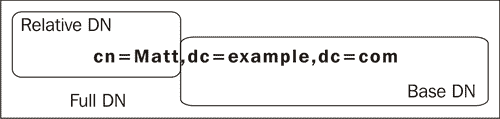

一个（完整的）DN 由两部分组成：

+   首先，有一个特定于即时记录的部分，称为**相对 DN** 或 **RDN**。例如，在 DN `cn=Matt,dc=example,dc=com` 中，RDN 部分是 `cn=Matt`。

+   其次，有一个部分是指 DN 的父记录。它是特定于此记录的。示例中 `dc=example,dc=com` 部分指向该记录的父级。

给定 DN，我们知道该记录位于目录树中的哪一层。它位于树根以下的一层——基础 DN（`dc=example,dc=com`）。

ModifyDN 操作提供了一种仅更改 RDN 或整个 DN 的方法。更改后者等同于将记录移动到目录树的另一部分。

#### Compare 操作

Compare 操作接受一个 DN 和一个属性值断言（属性 = 值），并检查该属性断言是否为真或假。例如，如果客户端提供 DN `cn=Matt,dc=example,dc=com` 和属性值断言 `cn=Matthew`，那么如果记录中有一个属性 `cn` 其值为 `Matthew`，服务器将返回*true*，否则返回*false*。与在客户端进行比较操作相比，此操作可能更快（同时也更安全）。

### 注意

在 OpenLDAP ACL 中，`auth` 权限设置（以及我们将在下一章中查看的 `=x` 权限设置）允许使用 Compare 操作，但不允许在搜索中返回属性值。`read` 权限（`=xw`）允许 Compare 操作和在搜索结果中返回属性值。

#### 扩展操作

最后，OpenLDAP 实现了 LDAP v.3 扩展操作，使得服务器能够实现自定义操作。

扩展操作的具体语法将取决于扩展的实现。支持的扩展操作在根 DSE 下的 `supportedExtension` 属性中列出。请查看第二章末的根 DSE。在该记录中有两个扩展操作：

+   1.3.6.1.4.1.4203.1.11.1：此**修改密码扩展**在 RFC 3062 中定义（[`www.rfc-editor.org/rfc/rfc3062.txt`](http://www.rfc-editor.org/rfc/rfc3062.txt)）。该扩展提供了一种在目录中更新密码的操作。

+   1.3.6.1.4.1.4203.1.11.3：此**Who Am I? 扩展**在 RFC 4532 中定义（[`www.rfc-editor.org/rfc/rfc4532.txt`](http://www.rfc-editor.org/rfc/rfc4532.txt)）。该扩展使得当前活动的 DN 可以从服务器了解自己。

在本章稍后，我们将查看使用修改密码和 Who Am I？ 扩展的工具。

### SLAPD 概述

在本节中，我们已经查看了 SLAPD 服务器提供给客户端的一些操作。我们查看了最常见的操作（绑定、搜索、修改、添加和删除）。我们还查看了一些较少为人知的操作，如 modifyDN、Compare 和扩展操作。

到目前为止，你应该已经对 SLAPD 服务器为客户端提供的服务有了较好的了解。客户端可以绑定（或认证）到 SLAPD 服务器并执行强大的目录搜索。通过 SLAPD，目录树中的信息可以得到维护。

这些概念将是本章及本书其余部分的核心内容。

接下来，我们将讨论 SLURPD 守护进程，但我们不会深入细节。

## SLURPD

SLAPD 和 SLURPD 是 OpenLDAP 套件中包含的两个守护进程。上面，我们已经讨论了 SLAPD 服务器。现在我们将转向第二个守护进程。

SLURPD，独立的 LDAP 更新复制守护进程，比 SLAPD 使用的频率低，并且正逐渐走向过时。SLURPD 提供了一种保持多个 LDAP 目录副本同步的方式（参见第一章的讨论）。基本上，它通过跟踪对 *主* SLAPD 目录服务器的更改（添加、删除、修改）来工作。当主目录发生更改时，SLURPD 会将更新发送到所有下属的 *从属* 服务器。

`SLURPD` 程序位于 `/usr/sbin` （如果是从源代码编译的，则位于 `/usr/local/libexec`）。在使用 SLURPD 的配置中，`slurpd` 通常会在 `slapd` 启动后立即启动。SLURPD 没有自己的配置文件，它会在 `slapd.conf` 文件中查找配置信息。

在第七章，我们将讨论可能替代 SLURPD 的技术：最近版本（OpenLDAP 2.2 及更高版本）的 SLAPD 内置的 LDAP 同步复制功能。

# 创建目录数据

在上一节中，我们讨论了两个 LDAP 守护进程，SLAPD 和 SLURPD。但是，尽管我们已经有一个正在运行的目录，但我们的目录中并没有任何条目（除了由 SLAPD 创建的条目，如架构记录和根 DSE）。

在本节中，我们将创建一个文件来存储我们的 LDAP 数据，并设计一些要放入该文件的目录条目。下一节我们将把数据加载到目录中。

## LDIF 文件格式

在本书的整个过程中，我们展示了以纯文本形式呈现的 LDAP 记录示例，每行包含一个属性描述，后面跟着冒号和一个值。记录的第一行是 DN，通常记录的最后几行是对象类属性：

```
dn: uid=bjensen,dc=exaple,dc=com
cn: Barbara Jensen
mail: bjensen@example.com
uid: bjensen
objectClass: person
objectClass: organizationalPerson
objectClass: inetOrgPerson
```

这种格式是以文本文件表示 LDAP 目录条目的标准方式。它是写成 **LDAP 数据交换格式 (LDIF)** 版本 1 的记录示例。

### 注意

LDIF 文件格式是作为密歇根大学 LDAP 服务器项目的一部分开发的。2000 年，LDIF 版本 1 在 RFC 2849 中进行了标准化。该标准可以在线查看，链接为 [`www.rfc-editor.org/rfc/rfc2849.txt`](http://www.rfc-editor.org/rfc/rfc2849.txt)。

LDIF 标准定义了一种文件格式，不仅用于表示目录的内容，还用于表示某些 LDAP 操作，如添加、修改和删除。在 `ldapmodify` 客户端的章节中，我们将使用 LDIF 来指定目录服务器中记录的更改，但现在我们关心的是创建一个表示目录内容的文件。

### 注意

LDIF 不是唯一的目录文件格式。还有一种基于 XML 的目录标记语言，叫做 **DSML**（**目录服务标记语言**）。虽然有一个标准化的 DSML 版本 1，但该项目似乎已经失去动力，以至于官方网站 [dsml.org](http://dsml.org) 已经消失。然而，某个开源 DSML 工具网站仍然托管着旧版 [dsml.org](http://dsml.org) 网站的镜像：[`www.dsmltools.org/dsml.org/`](http://www.dsmltools.org/dsml.org/)。

OpenLDAP 套件不直接支持 DSML。

### LDIF 文件的结构

一个 LDIF 文件由一系列记录组成，每条记录代表目录中的一个条目。每个条目必须有一个 DN（因为任何 LDAP 条目都需要 DN），然后是一个或多个属性或更改记录（`add`、`modify`、`delete`、`modrdn`、`moddn`）。现在我们将仅讨论属性，并将更改记录的讨论推迟到我们讨论 `ldapmodify` 时再进行。

记录通过空行分隔，每条记录必须以 DN 开头：

```
# First Document: "On Liberty" by J.S. Mill
dn: documentIdentifier=001,dc=example,dc=com
documentIdentifier: 001
documentTitle: On Liberty
documentAuthor: cn=John Stuart Mill,dc=example,dc=com
objectClass: document
objectClass: top

# Second Document: "Treatise on Human Nature" by David Hume
dn: documentIdentifier=002,dc=example,dc=com
documentIdentifier: 002
documentTitle: Treatise on Human Nature
documentAuthor: cn=David Hume,dc=example,dc=com
objectClass: document
objectClass: top
```

以井号或数字符号（`#`）开头的行被视为注释，并会被忽略。请注意，井号必须是该行的第一个字符，前面不能有任何空白字符。

尽管记录通常以 `objectClass` 属性结束，这是因为这样更易于阅读，但并没有强制要求这样做。LDIF 记录中属性的顺序是无关紧要的。

对象类（在模式定义中定义）表示记录所代表的对象类型或类型。在前面的示例中，两个记录都是 `documents`。对象类定义决定了哪些属性是必需的，哪些属性是允许的。当编写 LDIF 文件时，你需要知道哪些字段是必需的。任何条目的 DN 当然是必需的，`objectclass` 属性也是必需的。在表示模式层次结构根的 `top` 对象类中，除了 `objectclass` 外没有其他必需字段。`document` 对象类定义要求有 `documentIdentifier`，并允许包含十一种其他字段，包括 `documentTitle`（其值为字符串）和 `documentAuthor`（其值为 DN，指向目录中的另一个记录）。

### 提示

**文档对象类**

LDAP 目录可以建模多种不同类型的对象。前面例子中使用的`document`对象类代表目录中的文档（如书籍、论文和手册）。`document`对象类及相关的`documentSeries`对象类的模式包含在`cosine.schema`中，并在 RFC 4524 的第 3.2 节中定义（ftp://ftp.rfc-editor.org/in-notes/rfc4524.txt）。模式将在第六章中详细讨论。

让我们来看一下`document`和`documentSeries`对象类的属性列表：

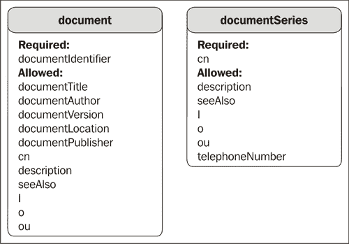

任何在 DN 中使用但不属于目录基础 DN 的属性必须出现在记录中。例如，假设基础 DN 为`dc=example,dc=com`。如果条目的 DN 为`cn=Matt,dc=example,dc=com`，则该条目必须包含一个值为`Matt`的`cn`属性。在前面的例子中，由于`documentIdentifier`在 DN 中被使用，因此记录中必须有一个匹配的`documentIdentifier`属性。

### 注

实际上，`document`对象类需要`documentIdentifier`属性，因此，即使该属性在 DN 中未被使用，任何文档记录仍然需要一个`documentIdentifier`。

同样，一个 DN 为`cn=Matt,ou=Users,dc=example,dc=com`的条目必须包含属性`cn:Matt`和`ou:Users`。

### 在 LDIF 中表示属性值

不是所有的属性值都是简单的短 ASCII 字符串。LDIF 提供了对更复杂数据类型进行编码的功能。

有时属性值无法在一行内显示。如果属性值过长，无法在一行中显示，可以将其续行，前提是续行的第一字符是空白字符：

```
dn: documentIdentifier=003,dc=example,dc=com
documentIdentifier: 003
documentTitle: An essay on the nature and conduct of the passions
 and affections with illustrations on the moral sense.
documentAuthor: cn=Francis Hutchison,dc=example,dc=com
objectClass: document
objectClass: top
```

根据 RFC，LDIF 文件只能包含 ASCII 字符集中的字符。然而，非 ASCII 字符可以通过 Base-64 编码值在 LDIF 中表示。Base-64 编码的属性值略有不同，属性描述后面跟着两个冒号，而不是一个：

```
dn: documentIdentifier=004,dc=example,dc=com
documentIdentifier: 004
documentTitle:: bW9uYWRvbG9neQ==
documentAuthor: cn=G. W. Leibniz,dc=example,dc=com
objectClass: document
objectClass: top
```

在以下情况下，你应该考虑使用 Base-64 编码：

+   当属性值包含二进制数据（例如 JPEG 照片）时。

+   当字符集不是 ASCII 时。通常，目录数据应该以 UTF-8 格式存储，但这意味着为了保持与 LDIF 标准的兼容性，值应该进行 Base-64 编码。

+   当值中有换行符或其他不可打印字符时。（请注意，为了接受这样的值，模式必须允许这些字符，否则目录服务器即使这些字符已被编码，也不会允许它们被上传。）

+   当值以空白字符开始或结束（并且希望保留这些空白字符），或以冒号（`:`）或小于号（`<`）开始时。

即使是 DN，也可以进行 Base-64 编码，只要 DN 是 Base-64 编码的，你就可以在 DN 中使用 UTF-8 字符。

有几种 UNIX/Linux 工具可以用来进行 base-64 编码。最流行的是 `uuencode` 程序，它包含在 `sharutils` 包中。然而，这个程序在 Ubuntu 中并不是默认安装的。你可以通过命令行使用 `apt-get` 快速安装它：

```
 $ sudo apt-get install sharutils

```

一旦安装了 `sharutils`，你可以使用 `uuencode` 编码一个值：

```
$ echo -n " test" | uuencode -m name
begin-base64 644 name
IHRlc3Q=
====
```

在这个例子中，我们将字符串 `" test"`（注意前导空格）转换为 base-64 编码的字符串。这是通过命令行中的几个命令来完成的（此例中使用 Bash shell）。

`uuencode` 命令通常用于将文件编码为电子邮件附件，因此我们需要做一点工作，让它按我们想要的方式运行。首先，我们使用 `echo` 命令回显我们想要编码的字符串。`echo` 程序默认会在回显的字符串末尾添加一个换行符。我们使用 `-n` 标志来防止它添加换行符。

字符串 `" test"` 被回显到标准输出（`/dev/stdout`），然后通过管道符（`|`）传递到 `uuencode` 命令中。`-m` 标志指示 `uuencode` 使用 base-64 编码，`name` 字符串被 `uuencode` 用来为附件生成名称。当使用 `uuencode` 生成电子邮件附件时，这很有用，但对我们来说没有实际作用。因为我们不将这个文件附加到任何东西上，所以放什么内容都无所谓；`foo` 也能同样起作用。

`uuencode` 程序然后会打印出三行输出：

```
begin-base64 644 name
IHRlc3Q=
====
```

只有代码中的第二行（高亮的那一行），即实际的 base-64 编码值，对我们来说才重要。我们可以复制 `IHRlc3Q=` 并将其粘贴到我们的 LDIF 文件中。

### 注意

另一个流行的 base-64 编码工具是 `mimencode`，它由 `metamail` 包提供。Perl 和 Python 脚本语言也有 base-64 编码工具。

在某些情况下，将一个较长的属性值（例如整个 base-64 编码的图像文件，甚至是大量文本）插入到 LDIF 文件中会使文件过大，以至于无法高效地使用文本编辑器进行编辑。即使是一个小的图像文件，经过 base-64 编码后，也会有数百个字符。与其直接将 base-64 编码的字符串插入到文件中，不如使用特殊的文件引用，文件的内容将在导入 LDIF 文件时被检索并加载到目录中。

```
dn: documentIdentifier=005,dc=example,dc=com
documentIdentifier: 005
documentTitle: Essays in Pragmatism
documentAuthor: cn=William James,dc=example,dc=com
description:< file:///home/mbutcher/long-description.txt
objectClass: document
objectClass: top
```

高亮的代码行展示了如何插入外部文件的引用。

这个例子中有两个重要的特点需要注意：

+   左尖括号（`<`）字符用于表示应该导入文件。这个字符在 UNIX/Linux shell 中也用于相同的目的。

+   文件的路径遵循标准的 `file://` URL 方案来表示文件路径。

### 注意

请注意，在文件方案中，通常需要在开头使用三个斜杠（`file:///path/to/file`）来指示没有主机字段。RFC 3986 (ftp://ftp.rfc-editor.org/in-notes/rfc3986.txt) 定义了 URI 和 URL 的一般结构。`file://` 是一种特定的 URL 方案，大致定义见 RFC 1738 的第 3.1 节 (ftp://ftp.rfc-editor.org/in-notes/rfc1738.txt)。

在拥有多种语言的属性值时，你可以将语言信息与属性描述一起存储：

```
dn: documentIdentifier=006,dc=example,dc=com
documentIdentifier: 006
documentTitle;lang-en: On Generation and Corruption
documentTitle;lang-la: De Generatione et Corruptione
documentAuthor: cn=Aristotle,dc=example,dc=com
objectClass: document
objectClass: top
```

语言信息存储在目录中，客户端将能够使用它来显示与地区相符的语言。

这涵盖了 LDIF 文件格式的基本内容，接下来我们将创建一个 LDIF 文件并加载到目录中。

## Example.Com 的 LDIF

现在我们准备在 LDIF 文件中建模我们的目录树。首先需要做的是决定目录结构。我们将代表一个组织在我们的目录树中。当然，你可以建模的树种类几乎是无限的，但我们将坚持使用那些在 LDAP 目录中最常见的类型。

定义组织目录树根节点有两种流行的方法：

1.  第一个方法是创建一个根条目，指示组织的官方名称和组织的地理位置（通常只是国家）。以下是几个示例：

    ```
      o=Arius Ltd.,c=UK

      o=Acme GmBH,c=DE

      o=Example.Com,c=US
    ```

    在这三个示例中，`o` 代表组织名称，`c` 是两字符的国家代码。

1.  第二种流行的模型是使用组织的域名。例如，如果 Airius 公司注册了 `airus.co.uk` 域名，那么根 DN 将由三个 **域组件**（`dc`）属性组成：

    ```
      dc=airius,dc=co,dc=uk
    ```

    同样，其他两个记录也可以使用各自的域组件重新编写：

    ```
      dc=acme,dc=de

      dc=example,dc=com
    ```

使用组织/国家配置有其优点。拥有多个域的公司可能会发现这种形式更具吸引力。但第二种形式，依赖于域组件的方式，已变得更加普遍。在大多数情况下，我更喜欢域组件形式，因为它与互联网上信息的引用方式更为相关。

当然，关于 DN 结构的具体要求并没有硬性规定，你可能会发现其他基本 DN 结构更具吸引力。

### 定义基本 DN 记录

既然我们已经选择了基本 DN 风格，接下来让我们开始为 Example.Com 构建一个目录。LDIF 文件是按顺序逐条读取的。因此，基本 DN 必须排在最前面，因为所有其他记录都会在它们的 DN 中引用它。同样，在构建目录信息树时，我们需要确保父条目始终出现在子条目之前。

我们的基本 DN 看起来是这样的：

```
dn: dc=example,dc=com
description: Example.Com, your trusted non-existent corporation.
dc: example
o: Example.Com
objectClass: top
objectClass: dcObject
objectClass: organization
```

让我们从底部开始，按顺序反向分析这个示例。该记录有三个对象类：`top`、`dcObject`和`organization`。正如我们已经看到的，`top`对象类是对象类层次结构的根节点，目录中的所有记录都属于`top`对象类。

下面是显示对象类的图示：

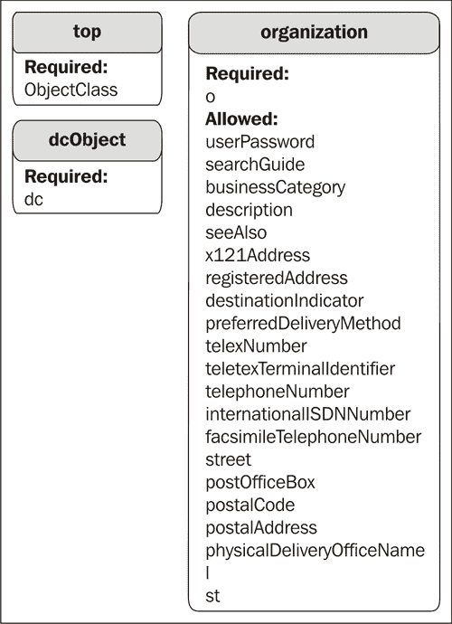

`dcObject`对象类仅描述域组件——域名的组成部分。例如，域[www.packtpub.com](http://www.packtpub.com)有三个域组件：`www`、`packtpub`和`com`。由于我们在 DN 中使用了域组件，所以需要`dcObject`类，它要求有一个属性：`dc`。

您可能注意到，虽然在 DN 中有两个`dc`属性（`dc=example`和`dc=com`），但在记录中只列出了一个（`dc:example`）。虽然乍一看似乎不太直观，但其实原因非常简单。该记录并未描述整个域，而只是单个域组件（`example`）。就像 DNS 记录一样，父组件（`com`）指向层次结构中另一个地方的实体。

因此，使用`dcObject`对象类的每条记录只能描述一个域组件，因此记录中只能有一个`dc`属性（尽管 DN 可能有多个`dc`属性，指明该记录在域层次结构中的位置）。

那么，`dc=com`的记录是否应该在我们的目录中？由于该目录的根节点（如`slapd.conf`文件中指定的）是`dc=example,dc=com`，我们不应在数据库中找到`dc=com`的记录，因为它不在`dc=example,dc=com`树部分下（而是`dc=com`位于该部分之上，或者说是该部分的上级）。

### 注意

**处理目录树外的记录请求**

如果我们收到针对`dc=com`的搜索请求，该怎么办？或者，如果我们收到`dc=otherExample,dc=com`的请求呢？这些是我们目录中不应有的记录。通过在`slapd.conf`文件中使用转介指令，您可以将这类请求引导到另一个可能在该问题上更具权威性的服务器。该指令的语法是`referral <ldap URL>`，例如：`referral ldap://root.openldap.org`。

现在我们已经指定了记录描述的域组件。但我们仍然需要更多的信息。我们不能只依赖`top`和`dcObject`对象类的记录，因为这样有两个原因——一个是实际的，另一个是技术性的。

实际上，仅凭这些简略信息，这条记录并不会特别有用，因为它并没有真正告诉我们目录树的基础（除了它有一个域名之外）。

从技术上讲，`top` 和 `dcObject` 这两个对象类都不足以构成完整的记录。原因在于，这两个对象类都不是**结构化对象类**，(`top` 是抽象的，`dcObject` 是辅助的)，而且目录中的每一条记录都必须有一个被视为该记录结构化对象类的对象类。有关详细的解释，以及一些有关记录结构的有用信息，请参阅第六章。

如何使我们的基本记录更加有用（并满足记录必须具有结构化对象类的要求）呢？`organization` 对象类描述了一个组织，顾名思义。它要求一个字段，`o`（或其同义词 `organizationName`），用于指定组织的（法定）名称。此外，`organization` 对象类还允许使用二十一个可选字段，提供有关组织的更详细信息，例如 `postalAddress`、`telephoneNumber` 和 `location`。在前面的示例中，我们使用了 `description` 字段，它也是 `organization` 对象类允许的二十一种属性之一。

这是我们目录的基本入口。它描述了目录信息树根部的记录。接下来，我们希望为目录添加一些结构。

### 使用组织单位（OU）结构化目录

LDAP 目录服务器模型的一个优势是它能够将数据组织成层级结构。在这一节中，我们将使用**组织单位（OUs）**在我们的 `dc=example,dc=com` 根目录下创建多个子树。

我们的 Example.Com 目录主要用于保存用户和账户信息。因此，我们将希望使用组织单位（OU）来创建子树。

### 注意

例如，如果我们正在创建一个 `document` 记录的目录（正如我们在 *LDIF 文件格式* 章节中所做的那样），我们可能不会使用 OUs，而是使用 `documentSeries` 记录。

OpenLDAP 并不提供默认的 OU 子树结构，因此你需要创建自己的结构。这可以通过多种方式实现，但在这里我们将看到两种主要理论，说明 OUs 应该如何结构化。

#### 理论 1：目录作为组织结构图

第一个理论是，目录应当结构化为表示你正在建模的组织的组织结构图。例如，如果该组织有三个主要部门——会计、人力资源（HR）和信息技术（IT）——那么你应该有三个 OUs。以下是相应的图示：

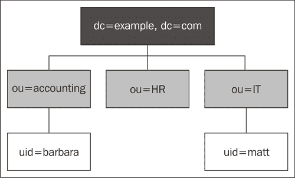

在给定的截图中，每个 OU 代表组织结构图中的一个单位。在会计部门工作的员工将会在目录子树 `ou=Accounting,dc=example,dc=com` 中拥有他们的用户账户，而在 IT 部门工作的员工则会在 `ou=IT,dc=example,dc=com` 中拥有账户。

这种方法有一些明显的优点。了解组织如何运作将有助于你在目录中查找信息。相反，目录将作为一个工具，帮助你理解组织的结构。组织中人与人之间或记录与记录之间的关系将更容易被识别。例如，只需看一下`uid=Marvin,ou=Accounting,dc=example,dc=com`的记录（或仅查看 DN），你就会知道 Marvin 与 Barbara 在同一个部门工作。

然而，在以这种方式构建目录之前，需要考虑以下几点：

+   首先，虽然组织结构会发生变化——有时变化过于频繁——但在目录中重新定位 DN 并不是一项简单的任务（在某些情况下需要删除树中某个部分的记录，并在树的另一个部分创建类似的记录）。

    如果会计部经理 Barbara 调任人力资源部，她的 DN 必须更改（以反映新的 OU）。一些（较旧的）后台不允许更改 DN，因此 Barbara 的会计部记录需要被删除，然后在 HR OU 中为她创建新的记录。此外，存储用户 DN 的应用程序也必须重新配置。类似地，一些员工可能会在两个部门之间分配时间。如何处理这种情况？

+   第二个考虑因素是与 LDAP 目录的技术使用有关的，而这一点并不那么明显。如果用户记录分散在目录树的各个地方，那么应用程序需要足够智能，能够在整个树中搜索用户记录。

    这个问题通常通过预认证搜索技术来解决，例如以匿名用户或特定认证用户身份绑定，搜索目录中用于认证的账户，然后以正确的账户身份绑定（如果找到的话）。但并非所有客户端（更不用说所有目录）都允许预认证搜索。并且预认证搜索可能会给服务器带来更大的负担，而其他技术可能对服务器更为友好。

+   第三个考虑因素是你希望在目录中存储哪些其他类型的信息。如果你主要将目录作为建模组织结构图的工具，那么这种特定的目录结构方法将非常适合你。你可以在目录中跟踪员工、资产（车队车辆、计算机等）和其他资源，并定位它们在组织中的位置。

    但是，如果目录的主要目的是创建一个 IT 服务用户的目录，那么这种结构就不太理想了，需要应用程序做更多的工作来定位用户（在某些情况下，还要求用户了解更多关于他们的 LDAP 账户信息）。

#### 理论 2：目录作为 IT 服务

第二种理论是，目录应当结构化为系统（网络、服务器、用户应用）访问记录的方式。在这种情况下，LDAP 目录的结构应当针对这些 IT 服务的使用进行优化。虽然组织结构图方法是按记录与组织的关系进行分组，但这种方法则是按功能单元分组记录，目录中的位置主要由应用程序和服务所需的任务来决定。

一种常见的目录结构方式是将其拆分为一个用于用户的单元、一个用于组的单元以及一个系统级记录的单元，后者是应用程序所需的，但用户无需访问。我们来看一个示例：

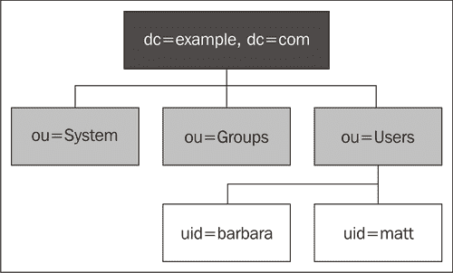

在这种情况下，所有用户账户都位于目录的特定子树下：`ou=Users,dc=example,dc=com`。应用程序只需在目录的一部分中进行搜索即可找到用户账户，当组织发生变化时，目录的结构不必也发生变化。

### 注意

使用组织单位（OU）来划分目录信息树并没有什么神奇之处。你可以使用其他记录类型和其他属性（如`cn`——常用名称）将目录划分为多个分支。尽管如此，使用 OU 是传统做法，但在目录信息树并未反映组织结构图的情况下，可能并不是最合适的选择。

这种方法也有一些缺点。首先，目录结构从设计上看并未提供组织结构的任何明确线索。当然，组织信息，比如部门 ID，可以存储在单独的记录中，便于通过这种方式进行检索。

更重要的是，如果目录支持大量用户，那么`ou=Users`分支将会有大量记录。这不一定是性能问题，但它可能使浏览目录（与搜索目录相对）变得冗长。

在某些情况下，通过在用户的分支下添加额外的子树来缓解这个问题。有时，这通过创建一个混合配置来实现，其中`ou=Users`下有表示组织部门的子树，例如`ou=Accounting,ou=Users,dc=example,dc=com`。有时也会使用其他分类系统，例如按字母顺序的方案来处理这种情况：`uid=matt,ou=m-p,ou=Users,dc=example,dc=com`。

但是对于小型和中型的目录，用户的分支通常没有任何额外的子树，这简化了与其他应用程序的集成过程。

LDAP 还具有描述目录中记录组的对象类。通常，将这些与用户账户存储在一起没有意义，因此它们可以被移动到一个单独的分支。

最后，系统分支用于存储诸如系统账户、邮件服务器、Web 服务器等记录，其他各种应用程序通常需要（或者在拥有自己 LDAP 账户时表现更好）。但如果可以避免的话，应该避免将它们与用户账户放在一起。

我概述了两种不同的目录信息树结构方式——一种反映组织结构，另一种便于 IT 服务。但这些只是两种目录结构方式，你可能会发现其他结构更适合你的需求。然而，对于我们的目的，接下来的 LDIF 文件构建将采用 IT 服务结构。

#### 在 LDIF 中表示组织单位

现在我们准备将选定的组织单位写入 LDIF 文件。我们将创建三个组织单位——Users、Groups 和 System，如下所示：

```
# Subtree for users
dn: ou=Users,dc=example,dc=com
ou: Users
description: Example.Com Users
objectClass: organizationalUnit
# Subtree for groups
dn: ou=Groups,dc=example,dc=com
ou: Groups
description: Example.Com Groups
objectClass: organizationalUnit

# Subtree for system accounts
dn: ou=System,dc=example,dc=com
ou: System
description: Special accounts used by software applications.
objectClass: organizationalUnit
```

这三个组织单位的结构相同。

每个组织单位必须有`organizationalUnit`对象类。该对象类有一个必填属性：`ou`。下面是显示**组织单位**的图示：

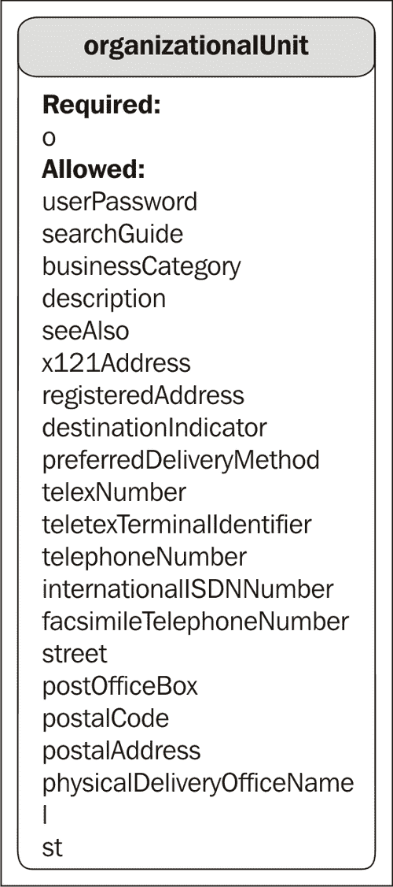

### 注意

请注意，`objectClass: top`在这些记录中已被省略，接下来的所有记录也同样省略。在所有记录中，默认假设它们是`top`对象类的实例，因此不需要显式地包含`objectClass: top`属性。

`description`属性是可选的，除此之外还有二十多个其他（可选）属性可以添加——其中大多数提供组织单位的联系信息，例如`telephoneNumber`、`postOfficeBox`和`postalAddress`。

在组织单位（OUs）已经设置好后，我们准备在目录树中添加第三层。在开始创建单独的记录之前，让我们先了解一下下一层的结构。下面是包含一个组、一个系统账户和一对用户的目录树结构：

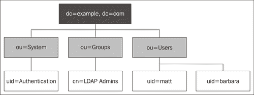

这是我们将在本节余下部分中创建的目录信息树。接下来，我们将继续构建 LDIF 文件，首先添加用户记录，然后是系统记录，最后是组记录。

### 添加用户记录

我们将保留`Users`组织单位用于描述组织中人员的记录。在这些账户中，我们希望存储有关用户的信息——例如名字、姓氏、职称和部门。由于目录还将作为应用程序信息的中央资源，我们还希望存储用户 ID、电子邮件地址和密码。

一个基本的用户记录如下所示：

```
# Barbara Jensen:
dn: uid=barbara,ou=Users,dc=example,dc=com
ou: Users
uid: Barbara
sn: Jensen
cn: Barbara Jensen
givenName: Barbara
displayName: Barbara Jensen
mail: barbara@example.com
userPassword: secret
objectClass: person
objectClass: organizationalPerson
objectClass: inetOrgPerson
```

芭芭拉的用户记录属于三个对象类：`person`、`organizationalPerson` 和 `inetOrgPerson`。这三个都是结构化对象类，其中 `inetOrgPerson` 是 `organizationalPerson` 类的子类，而 `organizationalPerson` 又是 `person` 对象类的子类。芭芭拉记录中的属性是这三个对象类中的必需属性和允许属性的混合。下图展示了芭芭拉记录中的属性：

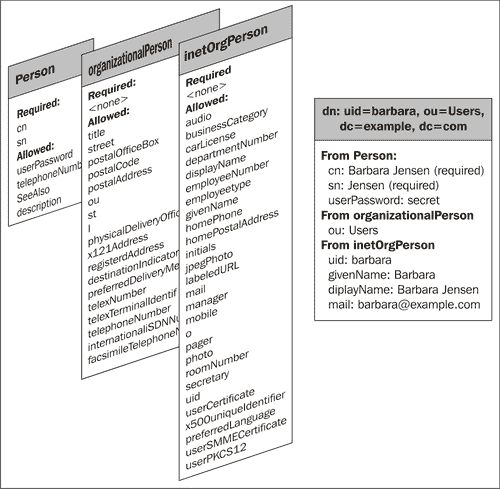

由于 `inetOrgPerson` 继承自 `organizationalPerson`，因此拥有 `inetOrgPerson` 对象类的记录必须同时拥有 `organizationalPerson` 对象类。而 `organizationalPerson` 又继承自 `person` 对象类，所以 `person` 也是必需的。

这意味着所有 `inetOrgPerson` 记录都将需要 `cn`（用户的全名）和 `sn`（用户的姓氏）属性，因为所有的 `inetOrgPerson` 记录也是 `person` 记录。这也意味着该记录可以有三者对象类中定义的四十九个可选属性的任何组合。

### 注意

由于 `uid` 和 `ou` 属性在 DN 中被使用，因此它们实际上也是必需的属性。此外，OpenLDAP 会要求记录中必须有 `uid` 和 `ou` 属性，并且这两个属性的值与 DN 中的值匹配——换句话说，由于 DN 中的 `ou` 是 `Users`，记录中的 `ou` 属性必须有 `Users` 这个值。这种行为是由 LDAP 标准决定的。

### 提示

**不同的对象类，不同的架构**

虽然 `person` 和 `organizationalPerson` 定义在核心架构文件（`core.schema`）中，`inetOrgPerson` 是在它自己的架构文件（`inetOrgPerson.schema`）中定义的，并且在 RFC 2798 中进行了标准化（[`rfc-editor.org/rfc/rfc2798.txt`](http://rfc-editor.org/rfc/rfc2798.txt)）。之所以这样，主要是历史原因：`person` 和 `organizationalPerson` 在 `inetOrgPerson` 之前就已被定义（并且是由不同方定义的）。

使用更多可用属性的 `inetOrgPerson` 记录可能看起来是这样的：

```
# Matt Butcher
dn: uid=matt,ou=Users,dc=example,dc=com
ou: Users
# Name info:
uid: Matt
cn: Matt Butcher
sn: Butcher
givenName: Matt
givenName: Matthew
displayName: Matt Butcher
# Work Info:
title: Systems Integrator
description: Systems Integration and IT for Example.Com
employeeType: Employee
departmentNumber: 001
employeeNumber: 001-08-98
mail: mbutcher@example.com
mail: matt@example.com
roomNumber: 301
telephoneNumber: +1 555 555 4321
mobile: +1 555 555 6789
st: Illinois
l: Chicago
street: 1234 Cicero Ave.
# Home Info:
homePhone: +1 555 555 9876
homePostalAddress: 1234 home street $ Chicago, IL $ 60699-1234
# Misc:
userPassword: secret
preferredLanguage: en-us,en-gb
objectClass: person
objectClass: organizationalPerson
objectClass: inetOrgPerson
```

在这个例子中，我们仍然使用相同的三个对象类，但选择了更多的可选属性。在芭芭拉和马特的记录中，有一件事可能会显得特别突出，那就是有许多属性仅仅用于指定个人的姓名；`cn`、`sn`、`givenName` 和 `displayName` 都是与个人姓名相关的字段。为什么会有这么多呢？提供多种姓名字段有两个好处：

+   这减少了应用程序在解析姓名时需要进行的猜测工作。姓名可能会有歧义——例如，约翰·斯图尔特·密尔的姓是密尔，而玛丽·斯图尔特·马斯特森的姓是斯图尔特·马斯特森。明确指定这些内容可以减少歧义。

+   不同的属性允许指定附加信息。多个 `cn` 和 `givenName` 值可以指定一个人姓名的不同形式，而 `displayName`（只能有一个值，并且在同一记录中不能多次使用）确保应用程序始终一致地显示相同的姓名。

### 提示

**常见名称**

`cn` 字段被目录中的许多不同对象类使用，其中许多并不描述人员。因此，`cn` 并不总是包含一个人的全名。组、设备和文档等事物可能会使用 `cn`（或 `commonName`）属性。

在之前的示例中，包含个人密码的 `userPassword` 字段是明文的。当该文件加载到目录时，密码的值会进行 base-64 编码，但它并没有被 *加密*。将明文密码存储在目录中是极不安全的（而且 base-64 编码并不能提高密码的安全性）。在本节后面，我们将查看 `ldappasswd` 工具，它在将密码存储到目录之前会对密码进行加密。生产环境中的目录应该始终将 `userPassword` 值以加密形式存储。

### 注意

你可能会注意到，在 `homePostalAddress` 字段中，美元符号（`$`）被用来代替通常期望看到的换行符。OpenLDAP 不会自动将这些符号转换为换行符。但是，使用美元符号是一种较老的方式，表示换行符而不使用 base-64 编码。通常，它仅用于与邮政地址相关的字段——并且由实现应用程序来正确解释这些美元符号。

这两个示例都使用 `inetOrgPerson` 对象类作为其主要结构化对象类。这是因为这些记录描述的是一个人，并且使用了 `uid` 属性（并将其作为 DN 的一部分）。此外，`inetOrgPerson` 提供了许多对现代信息基础设施有用的属性；如 `jpegPhoto`、`preferredLanguage` 和 `displayName`（等等）主要是供现代计算机代理使用，而非人类使用。由于它已被标准化并广泛部署（从 Sun 到 Microsoft 的 LDAP 服务器都在使用它），它成为了描述组织内人员的首选对象类。

到目前为止，我们已经创建了一个基本的 DN 条目、一些组织单位和几个用户。现在我们将添加一个记录，描述一个系统账户。

### 添加系统记录

我们树中的一些条目——我们需要的条目——并不描述用户，因此不属于用户组织单位（OU）。相反，我们将这些特殊记录放入 `System` OU。同样，我们所描述的实体并不是人，因此使用 `person`、`organizationalPerson` 和 `inetOrgPerson` 对象类并不合适。

在本节中，我们将创建一个新的账户记录，帮助用户进行登录。账户的功能将在第四章详细描述，但这个账户需要能够对目录服务器进行身份验证并执行操作。然而，这个账户并非为特定的人而创建，因此它不会拥有个人数据（如姓氏或名字）。

我们的新系统账户 `authenticate` 看起来是这样的：

```
# Special Account for Authentication:
dn: uid=authenticate,ou=System,dc=example,dc=com
uid: authenticate
ou: System
description: Special account for authenticating users
userPassword: secret
objectClass: account
objectClass: simpleSecurityObject
```

该记录有两个对象类：`account` 和 `simpleSecurityObject`。第一个对象类，`account`，是结构化对象类。一个 `account` 对象，定义在 Cosine 模式（`cosine.schema`）中，描述了用于访问计算机或网络的账户。我们来看一下这两个对象类：

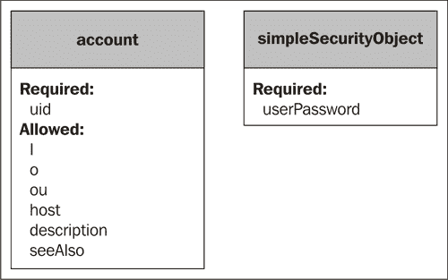

我们的账户，DN 为 `uid=authenticate,ou=System,dc=example,dc=com`，使用了 `account` 对象类所要求的 `uid` 属性，以及账户中的 `ou` 和 `description` 字段。但账户对象类没有用于存储密码的字段。因此，我们需要在记录中添加辅助对象类 `simpleSecurityObject`，它有一个属性：必需的 `userPassword` 属性。

### 注意

辅助对象类可以与任何其他结构化或辅助对象类结合使用。虽然在一个记录中使用多个结构化对象类要求这些对象类必须是相关的（例如 `organizationalPerson` 是 `person` 的子类），但辅助对象类不需要与它们所使用的对象类相关联。在这种情况下，`simpleSecurityObject` 与 `account` 没有直接关系。请参阅第六章获取更详细的解释。

通过添加 `simpleSecurityObject` 辅助对象类，我们现在使得我们的 `account` 记录能够拥有密码。同样，在我们的示例中，我们以明文的形式指定了密码（`userPassword: secret`）。在目录中存储未加密的密码是不安全的。有关加密 LDAP 密码的信息，请参阅本章稍后部分关于 `ldappasswd` 的章节。

现在我们在三个组织单位中的两个下创建了一些记录：用户（Users）和系统（System）。接下来，我们将在“组（Groups）”组织单位下添加一个组。

### 添加组记录

我们将添加到 LDIF 文件的最后一条记录是描述 DN 组的记录。组提供了一种灵活的方法，通过任何所需的标准收集相似的 DN。组中的 DN 不必在结构上相似——它们可以具有完全不同的属性和对象类，甚至可以描述完全不同的内容（例如文档和人员）。因此，目录管理员和目录应用程序可以决定哪些 DN 会被分组到特定的组中。

在我们的例子中，我们将创建一个组来代表我们的目录管理员，该组的所有 DNs 都是用户的 DNs（在 `Users` 组织单位中，并且具有 `inetOrgPerson` 结构化对象类）。

```
# LDAP Admin Group:
dn: cn=LDAP Admins,ou=Groups,dc=example,dc=com
cn: LDAP Admins
ou: Groups
description: Users who are LDAP administrators
uniqueMember: uid=barbara,dc=example,dc=com
uniqueMember: uid=matt,dc=example,dc=com
objectClass: groupOfUniqueNames
```

我们的组的 DN 是 `cn=LDAP Admins,ou=Groups,dc=example,dc=com`。请注意，我们使用 `cn` 属性，而不是 `uid`，来标识该组。因为 `groupOfUniqueNames` 对象类不允许使用 `uid` 属性（而 `cn` 是必需的）。

### 提示

通常，你应该使用 `groupOfNames` 对象类，而不是 `groupOfUniqueNames`，因为 `groupOfNames` 是 OpenLDAP 中默认的分组对象类。我们在这里使用 `groupOfUniqueNames` 来展示后续章节中 LDAP 组管理的一些特性。

`groupOfUniqueNames` 类是 LDAP 版本 3 核心架构（`core.schema`）中定义的三种分组对象类之一。其他两种是 `groupOfNames` 和 `organizationalRole`。

这些已经在下图中显示：

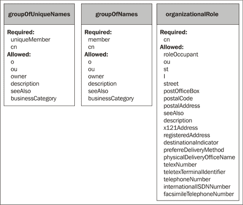

这三种对象类都是为了收集 DNs 而设计的。每个类都有一个属性，用于指定该组成员的 DN。在 `groupOfNames` 中，该属性简单地被称为 `member`。`groupOfUniqueNames` 类，功能上与 `groupOfNames` 相同，使用 `uniqueMember` 作为其成员属性。`organizationalRole` 分组类旨在表示组织中负责执行特定角色的组，它使用 `roleOccupant` 属性作为成员属性。

在所有三种分组对象类中，成员属性（`member`、`uniqueMember` 或 `roleOccupant`）可以多次指定，正如我们在 `LDAP Admins` 组的 LDIF 片段中所看到的那样。

### 提示

**我应该使用哪种类型的组？**

如何决定是使用 `groupOfNames`、`groupOfUniqueNames` 还是 `organizationalRole`？默认情况下，最好使用 `groupOfNames`，因为它被 OpenLDAP 视为默认的分组对象类。`organizationalRole` 对象类用于定义一个人在组织中的角色。`groupOfUniqueNames` 对象类的用途与 `groupOfNames` 不同，但在 OpenLDAP 中，它们的功能是相同的。

`groupOfUniqueNames` 和 `groupOfNames` 对象类都允许使用 `owner` 属性，并且可以多次使用（例如，建模某个组有两个所有者的情况）。`owner` 属性保存的是被认为是该组所有者的记录的 DN。

### 注意

OpenLDAP 中有一种第四种（但实验性的）通用分组方法，叫做 **dynlist**/**dyngroup**。它使用特定的对象类，动态的 **groupOfURLs** 分组类，并结合特殊的目录覆盖。这种分组方法预计将在 OpenLDAP 2.4 中成熟。

在我们的示例群组 `groupOfUniqueNames` 中，我们指定了两个 `uniqueMember` 属性：

```
uniqueMember: uid=barbara,dc=example,dc=com
uniqueMember: uid=matt,dc=example,dc=com
```

这两个 DN 都是群组的成员。请注意，SLAPD 不会主动检查这些 DN 是否存在，也不会在 DN 从目录中删除时自动将其从群组中移除。

### 注意

**完整性检查**

SLAPD 可以通过第五章中讨论的 RefInt（参照完整性）覆盖层来配置执行记录的完整性检查。这个覆盖层可以确保群组成员的 DN 与目录信息树中的条目保持同步。

因此，目录管理员和目录应用程序在处理群组时必须小心，进行额外的验证和清理。当一个 DN 从目录中删除时，应该进行全目录范围的搜索，查找那些使用 DN 值的属性，以确保像 `member` 和 `roleOccupant`（以及 `seeAlso`）等属性不会指向新删除的 DN。

## 完整的 LDIF 文件

最后，我们完成了 LDIF 文件的构建。我们将它保存在一个名为 `basics.ldif` 的文件中，因为它包含了我们目录的基本元素。下面是它的样子：

```
# This is the root of the directory tree
dn: dc=example,dc=com
description: Example.Com, your trusted non-existent corporation.
dc: example
o: Example.Com
objectClass: top
objectClass: dcObject
objectClass: organization

# Subtree for users
dn: ou=Users,dc=example,dc=com
ou: Users
description: Example.Com Users
objectClass: organizationalUnit

# Subtree for groups
dn: ou=Groups,dc=example,dc=com
ou: Groups
description: Example.Com Groups
objectClass: organizationalUnit

# Subtree for system accounts
dn: ou=System,dc=example,dc=com
ou: System
description: Special accounts used by software applications.
objectClass: organizationalUnit

##
## USERS
##

# Matt Butcher
dn: uid=matt,ou=Users,dc=example,dc=com
ou: Users
# Name info:
uid: matt
cn: Matt Butcher
sn: Butcher
givenName: Matt
givenName: Matthew
displayName: Matt Butcher
# Work Info:
title: Systems Integrator
description: Systems Integration and IT for Example.Com
employeeType: Employee
departmentNumber: 001
employeeNumber: 001-08-98
mail: mbutcher@example.com
mail: matt@example.com
roomNumber: 301
telephoneNumber: +1 555 555 4321
mobile: +1 555 555 6789
st: Illinois
l: Chicago
street: 1234 Cicero Ave.
# Home Info:
homePhone: +1 555 555 9876
homePostalAddress: 1234 home street $ Chicago, IL $ 60699-1234
# Misc:
userPassword: secret
preferredLanguage: en-us,en-gb
# Object Classes:
objectClass: person
objectClass: organizationalPerson
objectClass: inetOrgPerson

# Barbara Jensen:
dn: uid=barbara,ou=Users,dc=example,dc=com
ou: Users
uid: barbara
sn: Jensen
cn: Barbara Jensen
givenName: Barbara
displayName: Barbara Jensen
mail: barbara@example.com
userPassword: secret
objectClass: person
objectClass: organizationalPerson
objectClass: inetOrgPerson

# LDAP Admin Group:
dn: cn=LDAP Admins,ou=Groups,dc=example,dc=com
cn: LDAP Admins
ou: Groups
description: Users who are LDAP administrators
uniqueMember: uid=barbara,dc=example,dc=com
uniqueMember: uid=matt,dc=example,dc=com
objectClass: groupOfUniqueNames

# Special Account for Authentication:
dn: uid=authenticate,ou=System,dc=example,dc=com
uid: authenticate
ou: System
description: Special account for authenticating users
userPassword: secret
objectClass: account
objectClass: simpleSecurityObject
```

在下一节中，我们将介绍 OpenLDAP 工具，并将使用这些工具将我们的 LDIF 文件加载到目录中。

# 使用工具准备目录

到目前为止，在本章中我们已经查看了服务器操作，并创建了一个表示初始目录信息树的 LDIF 文件。在本章的剩余部分，我们将探讨两组工具。在这一部分，我们将介绍 OpenLDAP 工具。在下一部分，我们将介绍 OpenLDAP 客户端。

与 OpenLDAP 客户端不同，这些工具不使用 LDAP 协议连接到服务器并执行目录操作。相反，它们在更低的层次上工作，直接与 OpenLDAP 目录和数据文件进行交互。OpenLDAP 套件包括八个用于执行管理任务的工具。我们将在创建、加载和验证目录数据的过程中，逐步了解这些工具。

本节的目的是解释这些工具的基本使用方法。每个工具都有一些命令行标志，可以用来进一步修改工具的行为。我们将介绍一些常用的标志，但如果需要详细信息，应该查阅优秀的 OpenLDAP 手册页。

在 OpenLDAP 的新版本中，这些工具实际上并不存在作为独立的程序。相反，它们都被编译进了 `slapd` 程序，并且创建了符号链接，将工具名称指向 `slapd` 程序。使用 `ls` 命令，我们可以查看这些工具，了解它们是如何实现的：

```
 $ ls -og /usr/local/sbin

```

这就是我们得到的结果：

```
total 0
lrwxrwxrwx 1 16 2006-08-17 11:37 slapacl -> ../libexec/slapd
lrwxrwxrwx 1 16 2006-08-17 11:37 slapadd -> ../libexec/slapd
lrwxrwxrwx 1 16 2006-08-17 11:37 slapauth -> ../libexec/slapd
lrwxrwxrwx 1 16 2006-08-17 11:37 slapcat -> ../libexec/slapd
lrwxrwxrwx 1 16 2006-08-17 11:37 slapdn -> ../libexec/slapd
lrwxrwxrwx 1 16 2006-08-17 11:37 slapindex -> ../libexec/slapd
lrwxrwxrwx 1 16 2006-08-17 11:37 slappasswd -> ../libexec/slapd
lrwxrwxrwx 1 16 2006-08-17 11:37 slaptest -> ../libexec/slapd
```

这八个工具都是`slapd`程序的符号链接。当执行`slapd`时，它会检查执行时使用的程序名称，然后按照该程序的行为运行。例如，当`slapd`作为`slapadd`调用时，它会作为一个将数据加载到目录中的程序运行。如果作为`slaptest`调用，它会作为一个用于验证配置文件格式和指令的程序运行。

在我们继续描述这些工具时，我们将把它们视为独立的程序来讲解，因为它们就是如此被处理的。

由于我们在上一部分创建了一个 LDIF 文件，因此本节将首先介绍将 LDIF 文件加载到目录后端的工具。

## slapadd

`slapadd`程序用于将格式化为 LDIF 文件的目录数据直接加载到 OpenLDAP 中。它是在操作系统的 Shell 中执行的（例如命令提示符或 Shell 脚本）。

`slapadd`程序不会使用 LDAP 协议连接到正在运行的服务器。相反，它直接与 OpenLDAP 后端进行交互。因此，当你运行`slapadd`时，必须首先关闭目录服务器。否则，可能会出现`slapd`服务器进程和`slapadd`进程之间的冲突，因为它们都试图独占管理相同的数据库。

### 何时应该使用 slapadd？

有许多工具可以将记录加载到目录中，包括 OpenLDAP 客户端`ldapadd`（它通过 LDAP 协议连接到服务器并执行一个或多个添加操作）。那么，如何在特定情况下确定使用哪个程序呢？

其实，`slapadd`旨在加载大量的目录数据，通常用于创建新目录或从备份恢复目录。由于它要求目录下线，因此这个工具通常不适合用于执行常规更新。`ldapadd`程序（稍后在*客户端*部分中讨论）更适合这种操作。

### `slapadd`做什么？

`slapadd`工具读取`slapd.conf`文件（及任何包含的文件），加载适当的后端数据库，然后读取 LDIF 数据（通常来自一个文件）。在读取数据时，它验证所有记录是否构造正确（例如，DN 是否位于服务器管理的树中，记录是否使用正确的对象类属性，是否包含所有必需字段，记录格式是否正确等），然后将记录加载到适当的后端中。

由于`slapadd`不会通过 LDAP 协议连接，因此不需要对目录进行身份验证。不过，它确实需要对目录数据库文件的写访问权限。因此，`slapadd`通常由运行目录服务的用户（通常是`ldap`或`slapd`）或根账户从 Shell 中运行。

### 加载 LDIF 文件

在本章的前面部分，我们创建了一个包含我们目录树中少量记录的 LDIF 文件。现在，我们将把这个 LDIF 文件加载到目录中。这将包括四个步骤：

+   停止 `slapd` 服务器

+   使用 `slapadd` 测试 LDIF 文件

+   使用 `slapadd` 加载目录

+   重启 `slapd` 服务器

#### 停止服务器

我们在第二章的结尾已经讲解了启动和停止服务器的过程。简而言之，我们可以使用 `invoke-rc.d` 命令停止通过 Ubuntu 软件包安装的版本：

```
 $ sudo invoke-rc.d slapd stop

```

使用从源代码编译的版本（请参阅附录 A），可以通过查找 `slapd` 进程 ID 并终止该进程（或使用 `killall` 程序）来实现：

```
 $ sudo kill `pgrep slapd`

```

接下来，我们需要确保我们在上一部分创建的 LDIF 文件格式正确。

#### 在测试模式下运行 ldapadd

在实际加载之前运行测试模式可以大大减少加载新的 LDIF 文件所需的时间，因为它能帮助您在记录写入目录之前捕捉到 LDIF 错误。通常，`slapadd` 会一条一条地添加记录。所以如果文件中有三条记录，第一条记录会在读取第二条或第三条记录之前被添加到目录中。如果文件中的后续记录有错误，那么目录将会部分加载，您将不得不创造性地修改 LDIF 文件，或者销毁数据库并重新开始。

使用测试模式，我们可以在开始将记录加载到目录之前确保 LDIF 文件没有任何错误。这应该可以消除因为错误记录导致 LDIF 文件只部分导入的情况。

我们可以使用 `slapadd` 程序在将数据加载到目录之前进行此操作：

```
 $ sudo slapadd -v -u -c -f /etc/ldap/slapd.conf -l /tmp/basics.ldif

```

该命令使用五个标志：

+   `-v` 标志：此标志将程序设置为“详细”模式，在该模式下，程序会打印出额外的信息，说明正在发生的事情（如果过程失败，还会显示导致失败的原因）。通常，建议在加载未经测试的 LDIF 文件时以详细模式运行 `slapadd`。

+   `-u` 标志：这告诉 `slapadd` 以测试（或 *干运行*）模式运行。当启用此模式时，`slapadd` 会评估文件，就像它要将文件加载到目录中一样，但实际上不会将任何记录放入目录。

+   `-c` 标志：这告诉 `slapadd` 即使遇到错误的记录也继续处理文件。使用此标志，我们可以先运行一遍文件并获取所有格式不正确的记录列表。

+   `-f` 标志：此标志接受服务器配置文件路径作为参数，指定应该使用哪个配置文件。在大多数情况下，您可以省略此标志，`slapadd` 会默认查看配置文件的位置（通常是 `/etc/ldap/slapd.conf`）。

+   `-l` 标志：此标志指向我们要加载的 LDIF 文件。在本例中，我们正在加载位于系统 `/tmp` 目录中的 `basics.ldif` 文件。

如果 LDIF 文件中存在错误，`slapadd`会打印出一些有用的信息。例如，如果我们尝试加载一个明显损坏的文件，它看起来像这样：

```
# This is the root of the directory tree
dn: dc=example,dc=com
description: Example.Com, your trusted non-existent corporation.
dc: example
o: Example.Com
objectClass: top
objectClass: dcObject
objectClass: organization

Broken

# Subtree for users
dn: ou=Users,dc=example,dc=com
ou: Users
ferble: glarp
description: Example.Com Users
objectClass: organizationalUnit
```

在这个文件中，损坏的行已被高亮显示。当我们运行`slapadd`时，我们将得到一个错误：

```
added: "dc=example,dc=com"
str2entry: entry -1 has no dn
slapadd: could not parse entry (line=11)
<= str2entry: str2ad(ferble): attribute type undefined
slapadd: could not parse entry (line=18)
```

在这里，`slapadd`成功测试了我们的第一个记录`dc=example,dc=com`，没有问题，但在第 11 行遇到了一行没有以 DN 开头的内容，跳过了那个记录。在第 18 行，它遇到了另一个错误：`ferble`属性在记录中的任何对象类中都没有定义。

当对本章早些时候创建的 LDIF 文件运行成功时，输出如下：

```
$ sudo slapadd -v -u -c -f /etc/ldap/slapd.conf -l basics.ldif
added: "dc=example,dc=com"
added: "ou=Users,dc=example,dc=com"
added: "ou=Groups,dc=example,dc=com"
added: "ou=System,dc=example,dc=com"
added: "uid=matt,ou=Users,dc=example,dc=com"
added: "uid=barbara,ou=Users,dc=example,dc=com"
added: "cn=LDAP Admins,ou=Groups,dc=example,dc=com"
added: "uid=authenticate,ou=System,dc=example,dc=com"
```

没有错误。我们已经准备好进行第三步：将记录导入目录。

#### 使用 slapadd 导入记录

要将记录实际导入目录，我们使用`slapadd`命令，并使用上一节中使用的标志的子集。我们省略了`-u`标志（用于测试）和`-c`标志（以便遇到错误记录时不继续）。

### 提示

**使用 -q 标志**

为了更快地加载目录，你可以添加`-q`标志，关闭`slapadd`在处理数据时执行的一些耗时检查。但是在使用此标志之前，请确保先测试 LDIF 数据（使用刚才描述的方法）。否则，你可能会遇到无法使用的目录。

现在，命令看起来是这样的：

```
 $ sudo slapadd -v -f /etc/ldap/slapd.conf -l basics.ldif

```

这是我们得到的输出：

```
added: "dc=example,dc=com" (00000001)
added: "ou=Users,dc=example,dc=com" (00000002)
added: "ou=Groups,dc=example,dc=com" (00000003)
added: "ou=System,dc=example,dc=com" (00000004)
added: "uid=matt,ou=Users,dc=example,dc=com" (00000005)
added: "uid=barbara,ou=Users,dc=example,dc=com" (00000006)
added: "cn=LDAP Admins,ou=Groups,dc=example,dc=com" (00000007)
added: "uid=authenticate,ou=System,dc=example,dc=com" (00000008)
```

注意，这次的输出只是稍有不同；每行的末尾都有一个括号括起来的 ID 号。这个 ID 号是记录的`entryCSN`属性的一部分，内部用于监控记录。

### 注意

与许多 LDAP 服务器一样，OpenLDAP 会向记录附加特殊的**操作属性**。在这些属性中，OpenLDAP 存储有关记录的目录中心信息。我们稍后将在讨论`slapcat`工具时详细说明这些内容。

我们刚刚用本章前面创建的八个记录填充了我们的目录。现在我们准备好启动目录了。

#### 重启目录

在第二章中，我们讨论了启动和停止目录。这可以通过初始化脚本完成：

```
 $ sudo invoke-rc.d slapd start

```

或者，如果你按照附录 A 安装，`slapd`可以直接运行：

```
 $ sudo /usr/local/libexec/slapd

```

#### 如果出了问题……

有时，在执行`slapadd`的过程中，程序会遇到错误——无论是 LDIF 文件本身的问题，还是外部因素的影响——并且会在导入目录的过程中中止。在这种情况下，你可能需要重新开始。但是，仅仅重新运行`slapadd`操作会出现像这样的错误（具体的错误信息可能根据你使用的后端不同而有所不同）：

```
$ sudo slapadd -v -f /usr/local/etc/openldap/slapd.conf -l 
    basics.ldif
=> hdb_tool_entry_put: id2entry_add failed: DB_KEYEXIST: Key/data 
    pair already exists (-30996)
=> hdb_tool_entry_put: txn_aborted! DB_KEYEXIST: Key/data pair 
    already exists (-30996)
slapadd: could not add entry dn="dc=example,dc=com" (line=9): 
    txn_aborted! DB_KEYEXIST: Key/data pair already exists (-30996)
```

这里发生了什么？

发生的情况是，`basics.ldif` 文件中的一些条目已经导入到目录中，但可能并不是全部。你可以尝试各种方法来解决这个问题。你可以尝试将 LDIF 文件精简，只保留那些尚未添加的记录。你也可以尝试以继续模式（使用 `-c` 标志）运行 `slapadd` 程序，并希望所有剩余的记录都能正确添加。

但你可能会发现，处理这些情况的最佳方法是简单地销毁并重建目录。虽然这听起来是一种极端的措施，但与其他方法相比，它有一个明显的优势：它避免了由于 `slapadd` 命令失败而导致的不一致记录的问题。因此，它通常是从失败的目录导入中恢复的最佳方法。

### 提示

索引文件中的错误也可能是由 `slapadd` 失败引起的。如果你决定在 `slapadd` 失败后不销毁并重建目录，确保在向目录加载新记录后运行 `slapindex` 工具（本章稍后会介绍）。

#### 销毁并重建目录文件

在大多数可以通过 `slapadd` 加载的 OpenLDAP 后端中，后端将数据存储在文件系统中的某个位置或关系型数据库中。在 `slapadd` 失败后，你可能会发现恢复的最佳方法是销毁底层后端中的所有数据，然后重新开始。

目前，我们正在使用 `hdb` 后端（见第二章）。这里使用的方法同样适用于其他 BerkeleyDB 后端（在 `bdb` 模式下的 `bdb` 和 `ldbm`），并且可以轻松适配（已弃用的）`ldbm` 和 `gdbm` 后端。

对于其他类型的后端，例如使用关系型数据库（如 PostgreSQL）或自定义后端（如 `back-perl`），你需要查看这些后端的文档，以确定清除目录记录的最佳方法。

对于 `hdb` 和 `bdb` 后端，目录数据文件存储在文件系统中。在 Ubuntu 中，这些文件位于 `/var/lib/ldap`。如果你按照 附录 A 的指示操作，数据库文件位于 `/usr/local/var/openldap-data/`。

以下是 `/var/lib/ldap` 目录的内容：

```
alock    __db.002    __db.005    dn2id.bdb    objectClass.bdb
cn.bdb    __db.003    DB_CONFIG    id2entry.bdb
__db.001    __db.004    DB_CONFIG.example    log.0000000001
```

在这里，你可以看到所有的目录数据库文件（以 `__db.` 开头）、目录索引文件（以 `.bdb` 结尾）和 BerkeleyDB 事务日志（以 `log.` 开头）。该目录中还有一些其他文件，例如 `alock` 和 `DB_CONFIG`，我们不需要删除它们。要删除文件，我们使用 `rm` 命令，并配合一个表达式列表，仅匹配我们想要删除的文件：

```
 $ sudo rm __db.* *.bdb log.*

```

这样就只删除了我们不需要的文件。现在目录中应该只包含几个文件：

```
alock    DB_CONFIG    DB_CONFIG.example
```

这就是销毁数据库所需要做的一切。现在，我们可以通过使用 `slapadd` 命令加载（如果需要，已修正的）LDIF 文件来重新创建目录：

```
 $ sudo slapadd -v -l basics.ldif

```

并且返回以下消息：

```
added: "dc=example,dc=com" (00000001)
added: "ou=Users,dc=example,dc=com" (00000002)
added: "ou=Groups,dc=example,dc=com" (00000003)
added: "ou=System,dc=example,dc=com" (00000004)
added: "uid=matt,ou=Users,dc=example,dc=com" (00000005)
added: "uid=barbara,ou=Users,dc=example,dc=com" (00000006)
added: "cn=LDAP Admins,ou=Groups,dc=example,dc=com" (00000007)
added: "uid=authenticate,ou=System,dc=example,dc=com" (00000008)
```

这就是销毁并重建目录的全部内容。

## slapindex

接下来我们将查看的工具是`slapindex`。这个工具管理使用索引的 OpenLDAP 后端的索引文件（例如`hdb`、`bdb`和已废弃的`ldbm`）。

OpenLDAP 维护一组索引文件，以加速搜索记录。这些文件存储在主目录数据库之外，随着记录的添加、修改和删除，`slapd`服务器会相应地修改索引文件。

但在某些情况下，`slapd`服务器可能没有足够的信息来了解需要对索引文件进行的更改，在这些情况下，索引需要手动重建。

### 注意

像`slapadd`一样，在服务器运行时不应运行`slapindex`。在运行`slapindex`之前，应停止`slapd`。

有三种常见情况需要使用`slapindex`命令：

1.  当使用工具（通常是`slapadd`）向*现有*数据库添加记录时。

1.  当`slapd.conf`中的索引指令发生更改或添加了新的索引时（参见第二章和第五章的*性能* *调优*部分）。

1.  在其他（罕见的）情况下，外部条件或失败的`slapadd`命令可能会导致目录数据库和目录索引不同步。这种同步错误的主要症状是使用`ldapsearch`进行搜索时，无法返回已知存在于目录中的记录。

在这三种情况下，应该运行`slapindex`：

```
 $ sudo slapindex -q -f /etc/ldap/slapd.conf

```

这将重建`slapd.conf`中定义的第一个数据库的所有索引（我们只定义了一个数据库）。

`-q`标志指示 slapindex 执行一些额外的检查操作，这将大大加速重新索引的过程。跳过这些检查通常在使用`slapindex`时是安全的，但在使用`slapadd`时应谨慎操作。

`-f`标志用于指定配置文件的路径，它指定了`slapd`配置文件。如果省略此标志（如我们所做的那样），`slapindex`将查找默认位置中的`slapd.conf`文件。

如果您想监控`slapindex`的进度，可以使用`-v`标志启用详细输出。

## slapcat

`slapcat`程序将目录的所有内容转储到 LDIF 文件中。它是创建目录备份的方便工具，也可以用于检查目录中的数据。

当然，也有类似的客户端应用程序 `ldapsearch`，它也可以导出整个目录内容。那么你如何判断何时使用每个工具呢？由于 `ldapsearch` 使用 LDAP 协议来联系服务器、绑定并执行 LDAP 搜索操作，它的开销更大。另一方面，`slapcat` 直接与后端进行交互。`ldapsearch` 受时间和大小限制，这些限制在客户端配置文件 `ldap.conf` 和服务器的配置文件 `slapd.conf` 中都有设置（请参见第二章）。`ldapsearch` 命令还受到 ACL 的限制，而 `slapcat` 不受 ACL 的影响。

显然，对于像备份目录这样的操作，应该使用 `slapcat` 而不是 `ldapsearch`。

从 OpenLDAP 2.3 版本开始，如果你使用的是 `hdb` 或 `bdb` 后端，你可以在 `slapd` 运行时安全地运行 `slapcat`；不需要关闭目录服务器就能备份副本。

### 注意

OpenLDAP 中的 `slapcat` 手册页错误地指出，在目录服务器运行时运行 `slapcat` 是不安全的。这只是早期版本的 OpenLDAP（2.2 及更早版本）的遗留问题，在那些版本中，`slapcat` 不能在 `slapd` 运行时执行。需要注意的是，在 `slapd` 运行时，仍然不安全对 `ldbm` 后端执行 `slapcat`。

当我们在本章之前介绍 `slapadd` 时，我们使用该工具将 `basics.ldif` 中的记录加载到目录中。现在我们可以使用 `slapcat` 查看这些记录。

```
 $ sudo slapcat -l basics-out.ldif

```

`-l` 标志需要一个路径作为参数，指示输出应该写入到哪个文件。在本例中，它将写入文件 `basics-out.ldif`。如果省略 `-l`，则 LDIF 数据将被发送到标准输出，通常直接打印到屏幕上。

与其他工具一样，`-f` 标志可用于指定 SLAPD 配置文件的路径。`-a` 标志需要一个 LDAP 过滤器，可以用来指定记录必须匹配的模式，才能被导出到输出中。你可以使用此标志仅导出一个子树。例如，我们可以使用以下命令仅导出 `Users` 组织单位中的记录：

```
 $ sudo slapcat -a "(entryDN:dnSubtreeMatch:=ou=Users,
 dc=example,dc=com)"

```

这将仅返回以下三个 DN 的完整记录：

+   `ou=Users,dc=example,dc=com`

+   `uid=matt,ou=Users,dc=example,dc=com`

+   `uid=barbara,ou=Users,dc=example,dc=com`

### 操作属性

让我们仔细查看仅关于基础 DN 记录的输出：

```
$ sudo slapcat -a "(dc=example)"
dn: dc=example,dc=com
description: Example.Com, your trusted non-existent corporation.
dc: example
o: Example.Com
objectClass: top
objectClass: dcObject
objectClass: organization
structuralObjectClass: organization
entryUUID: b1a00a7c-c587-102a-9eb2-412127118751
creatorsName: cn=Manager,dc=example,dc=com
modifiersName: cn=Manager,dc=example,dc=com
createTimestamp: 20060821173908Z
modifyTimestamp: 20060821173908Z
entryCSN: 20060821173908Z#000000#00#000000

```

高亮显示的属性应该看起来不熟悉，因为它们在我们创建的原始 LDIF 文件中并不存在。这些是 OpenLDAP 自动维护的内部 **操作属性**。

不同的操作属性在 OpenLDAP 中扮演不同的角色，这些属性对目录管理员和支持 LDAP 的应用程序可能很有用。

例如，`creatorsName`、`modifiersName`、`createTimestamp` 和 `modifyTimestamp` 字段通常非常有用。OpenLDAP 会自动保留以下记录级别的信息：

1.  每条记录的创建时间和创建人。

1.  每条记录的最后修改时间和修改人。

`entryUUID` 属性为记录提供了 **全局唯一标识符（UUID）**，该标识符作为比 DN 更稳定的标识符（DN 可能会变化），并且根据 RFC 4122 中的规范（[`rfc-editor.org/rfc/rfc4122.txt`](http://rfc-editor.org/rfc/rfc4122.txt)）应当是“在所有 UUID 空间内，跨越空间和时间的唯一标识符”。请参阅 `entryUUID` 的 RFC [`rfc-editor.org/rfc/rfc4530.txt`](http://rfc-editor.org/rfc/rfc4530.txt)。

`entryCSN` (**变更序列号**) 属性由 SyncRepl 复制提供程序使用，用于确定需要在 LDAP 服务器之间同步的记录。我们将在第七章详细讨论这一点。

最后，添加了 `structuralObjectClass` 属性。该属性指定了哪个对象类应作为结构对象类。回想一下，当我们为 Matt 和 Barbara 创建记录时，每个记录有三个对象类：`person`、`organizationalPerson` 和 `inetOrgPerson`。这三个都是结构对象类，并且它们之间有关联（`inetOrgPerson` 是 `organizationalPerson` 的子类，`organizationalPerson` 又是 `person` 的子类）。但每条记录只能有一个结构对象类。如上所述，树结构中最深的一个成为结构对象类，其他的则被视为抽象对象类。如果我们使用 `slapcat` 导出 Barbara 的记录，就可以看到这一点：

```
$ sudo slapcat -a '(uid=barbara)'
dn: uid=barbara,ou=Users,dc=example,dc=com
ou: Users
uid: barbara
sn: Jensen
cn: Barbara Jensen
givenName: Barbara
displayName: Barbara Jensen
mail: barbara@example.com
userPassword:: e1BMQUlOfXNlY3JldA==
objectClass: person
objectClass: organizationalPerson
objectClass: inetOrgPerson
structuralObjectClass: inetOrgPerson
entryUUID: b1ae9916-c587-102a-9eb7-412127118751
creatorsName: cn=Manager,dc=example,dc=com
modifiersName: cn=Manager,dc=example,dc=com
createTimestamp: 20060821173908Z
modifyTimestamp: 20060821173908Z
entryCSN: 20060821173908Z#000005#00#000000
```

注意，`structuralObjectClass` 属性的值为 `inetOrgPerson`。

到目前为止，我们已经研究了 `slapcat` 工具，以及 `slapindex` 和 `slapadd` 工具。这三者是最常用的工具。但在某些情况下，还有一些其他工具也可能非常有用。接下来，我们将看一下 `slapacl`。

## slapacl

编写 ACL（访问控制列表）可能会令人沮丧且难以测试。为了简化在 `slapd.conf` 文件中测试 ACL 效果的过程，OpenLDAP 套件包括一个用于直接测试 ACL 的工具。我们将在第四章测试 ACL 时更多地使用这个工具，但在这里我们将先介绍该工具。

在第二章中，我们向 `slapd.conf` 添加了以下 ACL：

```
access to attrs=userPassword
       by anonymous auth
       by self write
       by * none
```

这个 ACL 指定了对于目录中的任何给定记录，如果该记录具有 `userPassword`，则应对访问该属性的请求应用以下规则：

+   `anonymous` 用户应该能够使用 `userPassword` 进行身份验证。

+   它应该允许 DN 修改（和读取）自己的密码。

+   它应该拒绝所有其他 DN 访问该记录的 `userPassword`。

这意味着 `uid=matt,ou=Users,dc=example,dc=com` 不应能够为 `uid=barbara,ou=Users,dc=example,dc=com` 写入新的 `userPassword` 值。我们可以使用 `slapacl` 工具来测试这一点：

```
 $ sudo slapacl -v -D "uid=matt,ou=Users,dc=example,dc=com" -b 
 "uid=barbara,ou=Users,dc=example,dc=com" "userPassword/write"

```

这个命令一开始看起来可能很复杂，但实际上非常简单。我们按顺序来看一下这些参数：

+   `-v`标志打开详细输出。

+   `-D`标志用于告诉`slapacl`哪个 DN 正在尝试访问目录。在这种情况下，我们设置了：`-D "uid=matt,ou=Users,dc=example,dc=com"`。也就是说，`slapacl`正在测试 Matt 的 DN 是否可以访问。

+   `-b`标志指示我们希望给定的 DN 尝试访问哪个记录。在这种情况下，它是 Barbara 的 DN，因为我们想测试 Matt 是否能写 Barbara 的密码：`-b "uid=barbara,ou=Users,dc=example,dc=com"`。

+   最后，最后一个参数指定了我们希望访问的属性，以及我们请求的权限类型。在这种情况下，我们想要访问`userPassword`属性，并且我们想查看 Matt 是否对其具有`write`权限（`"userPassword/write"`）。

因此，最终我们是在测试 Matt 的 DN 是否能够为 Barbara 的记录写入新的`userPassword`。以下是`slapacl`命令的结果：

```
authcDN: "uid=matt,ou=users,dc=example,dc=com"
write access to userPassword: DENIED
```

这是我们预期的结果。由于这个 ACL，Matt 不能写入 Barbara 的`userPassword`属性。

## slapauth

**`slapauth`**工具用于测试 SASL 身份验证到目录。当一个应用程序尝试使用 SASL 进行绑定时，它并不指定一个完整的 DN（例如`uid=matt,ou=Users,dc=example,dc=com`），而是传递一个用户 ID（`u: matt`）以及其他一些信息，如领域标识符和认证机制。

我们将在第四章中讲解 SASL 身份验证。如果你还没有 SASL 的经验，建议先阅读下文，并在阅读完第四章后再回到这一节。

OpenLDAP 可以利用这些信息，并使用正则表达式猜测用户所属的 DN。但理解正则表达式的具体形式可能比较困难。`slapauth`工具在测试特定的 SASL 请求在 OpenLDAP 接收到时的表现时非常有用。

例如，我们可以将以下 SASL 配置指令添加到我们的`slapd.conf`文件中：

```
authz-policy from
authz-regexp 
  "^uid=([^,]+).*,cn=auth$" 
  "uid=$1,ou=Users,dc=example,dc=com"
```

`authz-regexp`中的正则表达式应该将 SASL authzID 格式转换为 LDAP DN：

```
$ sudo slapauth -U "matt" -X "u: matt"
ID: <matt>
authcDN: <uid=matt,ou=users,dc=example,dc=com>
authzDN: <uid=matt,ou=users,dc=example,dc=com>
authorization OK
```

第一个参数`-U matt`发送一个包含 SASL authcID 为`matt`的测试请求。`-X "u: matt"`参数则发送一个包含 authzID 为`u: matt`的测试请求。根据`authz-regexp`中的正则表达式，它们应该输出一个正确格式的 DN。

我们将在第四章中更多地使用`slapauth`，当我们设置 SASL 身份验证时。

## slapdn

**`slapdn`**工具用于测试给定的 DN 是否对这个目录服务器有效。具体来说，它将 DN 与已定义的模式进行匹配，确保 DN 是有效的。

这里有一些`slapdn`实际应用的示例：

```
$ sudo slapdn 'cn=Foo,dc=example,dc=com'
DN: <cn=Foo,dc=example,dc=com> check succeeded
normalized: <cn=foo,dc=example,dc=com>
pretty: <cn=Foo,dc=example,dc=com>

$ sudo slapdn 'ou=New Unit,dc=example,dc=com'
DN: <ou=New Unit,dc=example,dc=com> check succeeded
normalized: <ou=new unit,dc=example,dc=com>
pretty: <ou=New Unit,dc=example,dc=com>
```

在这两个示例中，DN 是有效的。`slapdn`测试了这些 DN，然后打印出标准化版本（所有小写，去除多余的空格）和原始格式版本。

这里有一个失败的示例：

```
$ sudo slapdn 'fakeAttr=test,dc=example,dc=com'
DN: <fakeAttr=test,dc=example,dc=com> check failed 21 
    (Invalid syntax)
```

在这种情况下，没有找到包含 `fakeAttr` 属性的模式。这里是另一个失败的例子：

```
$ sudo slapdn 'documentSeries=Series 18,dc=example,dc=com'
DN: <documentSeries=Series 18,dc=example,dc=com> check failed 21 
    (Invalid syntax)
```

虽然 `documentSeries` 在模式中被定义为对象类，但它是一个对象类，而不是属性，且对象类名称不能用于构造 DN。

`slapdn` 程序的实用性仅限于那些你需要在不查看 `slapd.conf` 文件来确定加载了哪些模式的情况下，测试 DN 与目录的匹配的罕见情况（或者，交替使用 `ldapsearch` 程序搜索模式）。

## slappasswd

`slappasswd` 实用工具是一个根据 OpenLDAP 支持的模式加密密码的工具，例如 RFC 2307 中描述的模式（[`rfc-editor.org/rfc/rfc2307.txt`](http://rfc-editor.org/rfc/rfc2307.txt)）。

### 在 OpenLDAP 中存储和使用密码

当我们创建基础的 LDIF 文件时，我们使用了 `userPassword` 属性来存储密码。例如，我们的身份验证账户记录如下所示：

```
# Special Account for Authentication:
dn: uid=authenticate,ou=System,dc=example,dc=com
uid: authenticate
ou: System
description: Special account for authenticating users
userPassword: secret
objectClass: account
objectClass: simpleSecurityObject
```

`userPassword` 字段中存储的是明文密码。当该值被加载到目录中时，`userPassword` 会使用 base64 编码，看起来像这样：

```
userPassword:: c2VjcmV0
```

但是，这并不是加密的——只是以一种容易反转的方式进行了编码。虽然它可能防止目录管理员无意中看到用户的密码，但 base64 编码并不会防止攻击者从中猜出密码。

### 注意

使用 Python 脚本语言，你可以轻松地通过内置的 `base64.b64encode()` 和 `base64.b64decode()` 函数进行字符串的编码和解码。

但是，OpenLDAP 并不要求你以未加密的文本形式存储密码。事实上，最好不要这么做。OpenLDAP 支持多种单向哈希算法，可以用来以无法解密的方式存储密码。

`slappasswd` 程序提供了创建密码哈希值的工具。然后，可以在 LDIF 文件的 `userPassword` 字段中使用该哈希值。

OpenLDAP 支持五种不同的密码哈希方案：Crypt（`CRYPT`）、消息摘要算法 5（`MD5`）、加盐 MD5（`SMD5`）、安全哈希算法 SHA-1 版本（`SHA`）和加盐 SHA（`SSHA`）。默认情况下，OpenLDAP 使用最安全的哈希算法：`SSHA`。

密码存储在 `userPassword` 字段中，格式遵循 RFC 2307 第 5.3 节的规定（[`rfc-editor.org/rfc/rfc2307.txt`](http://rfc-editor.org/rfc/rfc2307.txt)）。加密后的密码如下所示：

```
{SSHA}71xEB2E59cuoPEQLErY44bYMHwCCgbtR

```

在密码的开头，花括号中的部分（`{}`）表示使用了哪种密码方案。在这种情况下，它是默认的 SSHA 算法。字段的其余部分是密码的摘要哈希值。

尽管哈希后的密码无法被解密，但当用户尝试绑定到服务器时，OpenLDAP 会使用与`userPassword`值（以及相同的盐值）相同的算法对用户提供的密码进行加密。如果两个哈希后的密码匹配，则 OpenLDAP 会让用户登录。如果不匹配，OpenLDAP 会返回一个错误消息，提示身份验证失败。

### 使用 slappasswd 生成密码

基于对密码如何使用和存储的基本理解，我们现在可以看看`slappasswd`程序。这个程序可以用来加密密码并将其格式化以便插入到 LDIF 文件中。该命令可以在没有任何参数的情况下调用：

```
$ slappasswd
New password: 
Re-enter new password: 
{SSHA}71xEB2E59cuoPEQLErY44bYMHwCCgbtR
```

在这种情况下，由于命令行上没有指定任何参数，`slappasswd`会提示输入密码，然后再提示验证密码。接着，它会输出密码的加密值。我们可以在 LDIF 记录中使用这个值：

```
dn: uid=nicholas,ou=Users,dc=example,dc=com
cn: Nicholas Malebranche
sn: Malebranche
uid: nicholas
ou: Users
userPassword: {SSHA}71xEB2E59cuoPEQLErY44bYMHwCCgbtR
objectClass: person
objectClass: organizationalPerson
objectClass: inetOrgPerson
```

在某些情况下，输入和重新输入密码可能过于繁琐，因此更喜欢一种更快速的加密多个密码的方法。你可以使用`-T`标志来指定一个包含待哈希明文密码列表的文件，或者可以使用`-s`标志在命令行中指定密码：

```
$ for i in  foo bar baz ; do slappasswd -s $i; done
{SSHA}p3zm8Sq/jgAMxYkniwnu+ym954qjIRiG
{SSHA}Fklv7m0n0wIw8sLQOe2IxDRsexZegzUT
{SSHA}FOLOLnR0fgmw7jP8p1WRQEJXoX3fJsyG
```

在这个 Shell 命令中，三个明文密码`foo`、`bar`和`baz`都被`slappasswd`加密。

### 注意

在多用户系统上，其他用户可能能够访问你的命令历史记录，从而能够看到这些明文密码。在命令行中指定密码（或其他敏感信息）时应小心。

通过使用`-h`标志，你可以指定`slappasswd`应使用的哈希算法：

```
$ slappasswd -h {MD5} -s test
{MD5}CY9rzUYh03PK3k6DJie09g==
$ slappasswd -h {SMD5} -s test
{SMD5}vWw5aAcoIbJ1PS9BMnp/KF5XS5g=
$ slappasswd -h {SHA} -s test
{SHA}qUqP5cyxm6YcTAhz05Hph5gvu9M=
```

在上述命令中，使用三种不同的哈希算法对相同的密码`test`进行加密。

接下来，我们将转向最后一个 OpenLDAP 工具——`slaptest`。

## slaptest

`slaptest`工具用于检查`slapd.conf`文件（及其包含的任何文件）中使用的格式和指令。

运行`slaptest`非常简单：

```
 $ slaptest -v -f /etc/ldap/slapd.conf

```

`-v`标志打开详细输出，而`-f`标志（它需要一个参数）指定要检查的配置文件。如果省略`-f`，则会检查默认的`slapd.conf`文件（通常是`/etc/ldap/slapd.conf`）。

### 注意

如前一章所述，Ubuntu Linux 提供的`slaptest`版本在`slapd`中的指令未知时不会打印警告。这是一种非标准行为。大多数时候，OpenLDAP 都是在启用这些警告的情况下进行编译的。

如果配置文件格式正确且所有指令有效且可操作，那么`slaptest`会打印出基本的成功消息：

```
config file testing succeeded
```

然而，如果出现任何问题，`slaptest`会打印出诊断信息。例如，如果我在`slapd.conf`中添加一个指向不存在文件的 include 指令，`slaptest`会打印出错误：

```
$ sudo slaptest 
could not stat config file "/non/existent/file": No such file or 
    directory (2)
slaptest: bad configuration file!
```

这个输出应该有助于追踪配置文件中的问题。在这种情况下，问题是由一个看起来像这样的行引起的：

```
include /non/existent/file
```

这是 OpenLDAP 实用程序的最后一部分。现在我们将转向包含在 OpenLDAP 套件中的客户端应用程序。

# 使用客户端执行目录操作

有许多 OpenLDAP 客户端，全部存储在 `/usr/bin`（或者如果您根据 附录 A 进行编译，则存储在 `/usr/local/bin`）。OpenLDAP 客户端通过 LDAP 协议进行通信。它们都符合标准，并遵循 LDAPv3 协议（该协议最后更新于 2006 年 6 月）。

虽然一些客户端提供基本的标准化 LDAP 操作，如搜索、添加和删除，但其他客户端实现了一个或多个 LDAP 扩展。但由于这套工具遵循标准，这些工具应该可以与任何符合标准的 LDAP 目录服务器一起工作。

本章的这一部分我们将简要介绍每个 OpenLDAP 客户端，并看看它们如何与 LDAP 服务器交互。我们没有足够的空间来详细介绍每个客户端的所有细节，所以我们将重点介绍每个客户端最有用和最常见的功能。OpenLDAP 的手册页（与 OpenLDAP 一起安装）详尽而且信息丰富，它们为这些客户端提供了良好的进一步信息来源。

### 注意

在上一部分中，大多数实用程序要求 SLAPD 服务器必须不在运行。然而，本节中的所有工具都连接到 SLAPD 服务器。因此，请确保在尝试本部分示例之前，您的服务器正在运行。

## 常见命令行标志

所有 OpenLDAP 客户端都是使用 UNIX 风格标志将参数传递给程序的命令行应用程序。为了保持连贯性，通用标志（如 `-D`、`-b` 和 `-H`）在所有客户端中都一致使用。

在第二章中，我们配置了我们的目录服务器来处理基本的目录操作。然而，我们没有配置它来使用 SASL 认证（这在第四章中介绍）。为了对服务器进行认证，我们将使用所谓的**简单绑定**。在简单绑定中，客户端通过向服务器发送完整的 DN 和密码来进行认证。

根据是否进行简单绑定或**SASL 绑定**，客户端需要不同的命令行标志。现在我们将看到简单绑定所需的那些标志。关于 SASL 绑定所需的标志将在第四章中介绍。

### 常见标志

有关简单绑定过程的命令行标志。以下是一些常见标志：

+   `-D`：`-D` 标志用于指定将绑定到目录服务器的用户的完整 DN（这用于简单绑定）。

+   `-W`、`-w`、`-y`：每个标志表示密码的不同来源。我们逐个来看它们：

    +   `-W` 标志指示用户应与服务器交互式提示输入密码。

    +   `-w`：此标志接受一个密码字符串作为值。我们可以用它在命令行中指定密码。

    +   `-y`：此标志接受文件名作为参数。它将使用文件的内容作为密码。这些标志是互斥的——每个命令中只能使用一个。

    ### 注意

    `-y` 标志使用文件的整个内容作为密码。这意味着如果文件中有换行符，它将被视为密码的一部分。要创建密码文件，可以使用带 `-n` 标志的 `echo` 命令：`$ echo -n "secret" > my_pw`。

+   `-x`：`-x` 标志指定客户端将使用简单绑定。如果未指定，则客户端将尝试使用 SASL 绑定。

+   `-H`，`-h`：这两个标志提供了指定连接主机的不同方式。`-H` 接受一个 LDAP URL（`-H 'ldap://example.com:389'`）。`-h` 仅接受主机名（`-h example.com`），并可以与 `-p` 一起指定端口。除非没有选择，否则使用 `-H`。`-h` 标志仅为向后兼容而提供，未来版本中可能会删除。

+   `-Z`：此标志用于指示客户端应向服务器发出**启动 TLS**命令，以便根据 TLS 标准加密流量。但是，如果 TLS 协商失败，客户端仍将继续操作。使用两个 Z（`-ZZ`）将强制流量加密。如果协商失败，则客户端将断开连接。TLS 相关内容将在下一章中详细介绍。

+   `-b`：用于指定基本 DN（`-b 'dc=example,dc=com'`）。

+   `-f`：`-f` 标志接受文件名作为参数。客户端将读取该文件的内容，并根据文件内容构建请求。

+   `-v`：此标志将开启详细输出。在故障排除时非常有用。

这些是 OpenLDAP 套件中客户端常用的标志。但这些仅代表每个客户端使用的标志的一个子集，因为每个客户端都实现了完成其任务所需的标志。

### 在 ldap.conf 中设置默认值

在第二章的 *配置 LDAP 客户端* 部分，我们查看了 `ldap.conf` 文件。在该文件中，我们设置了一些有用的默认值。特别是我们设置了以下三项：

```
URI ldap://localhost
BASE dc=example,dc=com
BINDDN cn=Manager,dc=example,dc=com
```

如果省略了主机设置（`-H`，`-h`），则将使用 `URI` 的值。如果客户端需要基本 DN，并且没有使用 `-b` 标志进行设置，则将使用 `BASE` 的值。同样，如果客户端使用简单绑定（`-x`）且未使用 `-D` 指定 DN，则将使用 `BINDDN` 的值。

由于我们已经创建了一个 `ldap.conf` 文件，因此许多示例将省略 `-H` 和 `-b` 标志。

虽然 `ldap.conf` 是所有客户端共享的，但你可以在你的主目录中创建一个特定于用户的 LDAP 配置文件。LDAP 客户端将在你的主目录（`$HOME`）中查找名为 `ldaprc` 和 `.ldaprc` 的用户特定配置文件。

现在我们已经准备好查看客户端命令。

## ldapsearch

我们首先要看的客户端是最常用的工具：`ldapsearch`。顾名思义，这是一个用于搜索目录信息树的工具。

`ldapsearch` 客户端连接到服务器，验证用户身份，然后（以该用户身份）执行一个或多个**搜索操作**，并以 LDIF 格式返回结果。当完成搜索后，它会关闭连接并退出。由于 `ldapsearch` 是一个网络客户端，因此可以用于搜索本地目录或远程目录服务器。

### 一个简单的搜索

让我们来看一个简单的搜索命令。在这个命令中，我们将以目录管理员身份登录，并请求获取用户 ID *barbara* 的记录：

```
 $ ldapsearch -x -W -D 'cn=Manager,dc=example,dc=com' -b \ 
 'ou=Users,dc=example,dc=com' '(uid=barbara)'

```

这是结果：

```
Enter LDAP Password: 
# extended LDIF
#
# LDAPv3
# base <ou=Users,dc=example,dc=com> with scope subtree
# filter: (uid=barbara)
# requesting: ALL
#

# barbara, Users, example.com
dn: uid=barbara,ou=Users,dc=example,dc=com
ou: Users
uid: barbara
sn: Jensen
cn: Barbara Jensen
givenName: Barbara
displayName: Barbara Jensen
mail: barbara@example.com
userPassword:: c2VjcmV0
objectClass: person
objectClass: organizationalPerson
objectClass: inetOrgPerson

# search result
search: 2
result: 0 Success

# numResponses: 2
# numEntries: 1
```

在这个例子中，我们运行了带有四个标志的 `ldapsearch` 命令：`-x`、`-W`、`-D` 和 `-b`。有关这些标志的描述，请参阅《*常用命令行标志*》部分。不过，简而言之，`-x`、`-W` 和 `-D` 都是用于目录认证的参数。它们指示客户端使用简单认证（`-x`）以 `-D` 指定的 DN（此例中为目录管理员）进行绑定，然后交互式地提示用户输入密码（`-W`）。

`-b` 标志设置搜索的基础 DN。它被设置为 `ou=Users,dc=example,dc=com`。根据这一设置，`ldapsearch` 将从 `Users` 组织单位（OU）开始搜索。

### 注意

如果我们省略了 `-b` 标志，则会使用 `ldap.conf` 中的 BASE 值，这会将基础 DN 设置为 `dc=example,dc=com`。

在所有命令行标志及其参数之后，我们指定了一个 LDAP 过滤器：

```
(uid=barbara)
```

这是服务器用于搜索的过滤器。我们在本章的《*搜索操作*》部分更详细地讨论了搜索过滤器。不过，在这种情况下，搜索过滤器很简单：它仅匹配属性名为 `uid` 且属性值为 `barbara` 的记录。

### 注意

许多属性有多个名称（这些被称为**属性描述**）。例如，标记用户 ID 的属性有属性描述 `uid` 和 `userID`。在上面的例子中，搜索 `(uid=barbara)` 也会匹配具有形式为 `userID: barbara` 的目录条目。

当执行该命令时，系统首先会提示用户输入密码（因为使用了 `-W` 标志），然后连接到服务器并尝试以指定的 DN（`cn=Manager,dc=example,dc=com`）进行绑定。接着，如果绑定成功，它会请求所有符合过滤器 `(uid=barbara)` 的记录。如示例所示，服务器将返回用户的整个记录，或者在非管理员用户的情况下返回 ACLs 允许的部分记录。

结果以 LDIF 格式返回，其中夹杂着注释。第一组注释提供了有关搜索的基本信息：

```
# extended LDIF
#
# LDAPv3
# base <ou=Users,dc=example,dc=com> with scope subtree
# filter: (userID=barbara)
# requesting: ALL
#
```

第一行表示该记录是扩展的 LDIF 格式。这是 LDIF 版本 1.0，并包含一些注释。下面是搜索的摘要，包含以下内容：

+   使用的 LDAP 版本（v3）

+   基本 DN 是什么（`ou=Users,dc=example,dc=com`）。

+   将执行什么类型的搜索。在此案例中，这是一个**子树搜索**，意味着服务器会查找基本 DN 下所有记录。

+   操作搜索过滤器是什么（`(userid=barbara)`）。

+   客户端希望返回的属性。`ALL` 表示客户端希望返回所有可用的属性。

文件的中央部分包含 Barbara 的完整记录。记录下方是结果的简要总结：

```
search: 2
result: 0 Success

# numResponses: 2
# numEntries: 1
```

第一行 `search` 表示我们执行了两个搜索操作（一个用于绑定，一个用于执行过滤搜索）。

第二行 `result` 表示服务器返回的结果代码。`0 Success` 表示我们的搜索没有遇到任何错误。

扩展（因此带有注释的）结果增加了一些附加信息。`numResponses` 表示服务器向客户端发送了两个响应（一个用于绑定，另一个用于搜索）。而 `numEntries` 表示搜索返回了多少条记录。在此例中，只有一条——Barbara 的记录。

### 限制返回字段

有时我们不想获取整个 DN 的记录。相反，我们只希望获取一些特定的属性。这可以通过在命令的末尾指定属性列表来实现：

```
 $ ldapsearch -x -w secret -D 'cn=Manager,dc=example,dc=com' -b \ 
 'ou=Users,dc=example,dc=com' -LLL '(userID=matt)' mail cn

```

这里是结果：

```
dn: uid=matt,ou=Users,dc=example,dc=com
cn: Matt Butcher
mail: mbutcher@example.com
mail: matt@example.com
```

请注意，在这个例子中，我们使用了 `-w secret` 标志在命令行中指定密码。我们还使用了 `-LLL` 标志来抑制 LDIF 输出中的所有冗余注释。

### 提示

在命令行中指定密码可能会存在安全风险。系统上的其他用户可能通过命令行历史记录（如 Bash shell 的历史功能）和操作系统构造（如 Linux 中的 `/proc` 文件系统）访问这些信息。

除了过滤器`(userID=matt)`，我还添加了一个我希望返回的属性列表：`cn` 和 `mail`。返回的记录包含四行：`dn`、两个 `mail` 属性和 `cn` 属性。DN 总是会被返回。

### 请求操作属性

你可能已经注意到，通过 `ldapsearch` 返回的 Barbara 记录与通过 `slapcat` 返回的记录有所不同。

### 注意

我们在本章名为 *使用工具准备目录* 的部分中讲解了 `slapcat`。

让我们对比一下这两者。首先，这是 `ldapsearch` 的输出：

```
$ ldapsearch -x -w secret -D 'cn=Manager,dc=example,dc=com' -b 
'ou=Users,dc=example,dc=com' -LLL '(userID=barbara)'
dn: uid=barbara,ou=Users,dc=example,dc=com
ou: Users
uid: barbara
sn: Jensen
cn: Barbara Jensen
givenName: Barbara
displayName: Barbara Jensen
mail: barbara@example.com
userPassword:: c2VjcmV0
objectClass: person
objectClass: organizationalPerson
objectClass: inetOrgPerson
```

现在，这是 `slapcat` 的输出：

```
$ sudo slapcat -a '(uid=barbara)'
dn: uid=barbara,ou=Users,dc=example,dc=com
ou: Users
uid: barbara
sn: Jensen
cn: Barbara Jensen
givenName: Barbara
displayName: Barbara Jensen
mail: barbara@example.com
userPassword:: c2VjcmV0
objectClass: person
objectClass: organizationalPerson
objectClass: inetOrgPerson
structuralObjectClass: inetOrgPerson
entryUUID: bec561c4-c5b0-102a-81c0-81bc30f92d57
creatorsName: cn=Manager,dc=example,dc=com
modifiersName: cn=Manager,dc=example,dc=com
createTimestamp: 20060821223300Z
modifyTimestamp: 20060821223300Z
entryCSN: 20060821223300Z#000005#00#000000
```

`slapcat` 的输出包含许多额外的属性——即目录内部维护的特殊操作属性。我们可以通过 `ldapsearch` 获取这些操作属性，方法是指定属性名称并与所需属性列表一起使用，或者在 `ldapsearch` 命令末尾使用特殊的加号（`+`）属性列表说明符：

```
 $ ldapsearch -x -w secret -D 'cn=Manager,dc=example,dc=com' -b 
 'ou=Users,dc=example,dc=com' -LLL '(userID=barbara)' +

```

这是我们得到的结果：

```
dn: uid=barbara,ou=Users,dc=example,dc=com
structuralObjectClass: inetOrgPerson
entryUUID: bec561c4-c5b0-102a-81c0-81bc30f92d57
creatorsName: cn=Manager,dc=example,dc=com
modifiersName: cn=Manager,dc=example,dc=com
createTimestamp: 20060821223300Z
modifyTimestamp: 20060821223300Z
entryCSN: 20060821223300Z#000005#00#000000
entryDN: uid=barbara,ou=Users,dc=example,dc=com
subschemaSubentry: cn=Subschema
hasSubordinates: FALSE

```

指定 `+` 列表并不会返回所有属性——仅返回操作属性。要获取所有常规属性和所有操作属性，您需要同时使用 `+` 说明符和 `*`（星号）说明符。`*` 说明符表示我们想要所有标准属性。以下是输出：

```
$ ldapsearch -x -w secret -D 'cn=Manager,dc=example,dc=com' -b 
     'ou=Users,dc=example,dc=com' -LLL '(userID=barbara)' '*' +
dn: uid=barbara,ou=Users,dc=example,dc=com
ou: Users
uid: barbara
sn: Jensen
cn: Barbara Jensen
givenName: Barbara
displayName: Barbara Jensen
mail: barbara@example.com
userPassword:: c2VjcmV0
objectClass: person
objectClass: organizationalPerson
objectClass: inetOrgPerson
structuralObjectClass: inetOrgPerson
entryUUID: bec561c4-c5b0-102a-81c0-81bc30f92d57
creatorsName: cn=Manager,dc=example,dc=com
modifiersName: cn=Manager,dc=example,dc=com
createTimestamp: 20060821223300Z
modifyTimestamp: 20060821223300Z
entryCSN: 20060821223300Z#000005#00#000000
entryDN: uid=barbara,ou=Users,dc=example,dc=com
subschemaSubentry: cn=Subschema
hasSubordinates: FALSE
```

现在我们有了完整的属性列表。使用这些参数的组合，我们可以生成适合备份的 LDIF 文件（假设 ACL 不会阻止访问某些内容）。虽然 `slapcat` 在这个任务上会比 `ldapsearch` 更高效，但 `ldapsearch` 可以远程通过网络运行，这在许多情况下非常有吸引力。

### 注意

请注意，在给定的记录中，`ldapsearch` 返回了三个 `slapcat` 未显示的操作属性：`entryDN`、`subschemaSubentry` 和 `hasSubordinates`。这些值是在运行时动态生成的，并不存在于 LDAP 后端。因此，它们不会与 `slapcat` 一起导出。由于它们是动态生成的，它们并不是备份的有用值。

也可以使用 `ldapsearch` 按顺序运行多个查询。这是通过使用外部文件来存储多个搜索的过滤器信息来实现的。

### 使用文件进行搜索

`ldapsearch` 客户端可以使用文件来构建并执行多个查询。假设我们有一个包含用户 ID 的纯文本列表，并且我们想获取每个用户 ID 的姓氏。文件 `userIDs.txt` 看起来是这样的：

```
matt
barbara
```

我们可以使用 `ldapsearch` 动态构建过滤器并为每个用户的姓氏运行搜索。为此，我们使用 `-f` 标志，指向 `userIDs.txt` 文件，然后构建一个特殊的过滤器。以下是要执行的命令行：

```
 $ ldapsearch -x -D 'cn=Manager,dc=example,dc=com' -b \
 'ou=Users,dc=example,dc=com' -w secret -f userIDs.txt '(uid=%s)' sn

```

到现在为止，大部分内容应该已经很熟悉了。但请注意过滤器：`'(uid=%s)'`。这个过滤器使用特殊的 `%s` 占位符来指示文件中的值应该放置的位置。每当 `ldapsearch` 运行时，它会逐行读取 `userIDs.txt` 文件，并在每行中执行一个搜索，将该行的值替换为过滤器中的 `%s`。结果如下：

```
# extended LDIF
#
# LDAPv3
# base <ou=Users,dc=example,dc=com> with scope subtree
# filter pattern: (uid=%s)
# requesting: sn 
#

#
# filter: (uid=matt)
#
# matt, Users, example.com
dn: uid=matt,ou=Users,dc=example,dc=com
sn: Butcher

# search result
search: 2
result: 0 Success

# numResponses: 2
# numEntries: 1

#
# filter: (uid=barbara)
#
# barbara, Users, example.com
dn: uid=barbara,ou=Users,dc=example,dc=com
sn: Jensen

# search result
search: 3
result: 0 Success

# numResponses: 2
# numEntries: 1
```

在这个示例中，`ldapsearch` 客户端实际上运行了两个不同的搜索操作。它首先将 `(uid=%s)` 扩展为 `(uid=matt)` 并运行一个搜索；然后，它将 `(uid=%s)` 扩展为 `(uid=barbara)`，并运行另一个搜索。在每种情况下，它只返回 `dn`（这是匹配时总会返回的）和请求的 `sn` 属性。

您还可以在文件中创建过滤器，并运行多个搜索过滤器。例如，我们可以创建一个名为 `filters.txt` 的文件，其中包含以下几行：

```
&(ou=System)(objectClass=account)
&(uid=b*)(ou=Users)
```

由于每一行将被插入到一个过滤器中，因此不需要外部的括号。现在我们可以使用这些行通过 `ldapsearch` 动态构建过滤器：

```
 $ ldapsearch -x -D 'cn=Manager,dc=example,dc=com' -b \
 'dc=example,dc=com' -w secret -f filters.txt '(%s)' cn description

```

我们将得到以下输出：

```
# extended LDIF
#
# LDAPv3
# base <dc=example,dc=com> with scope subtree
# filter pattern: (%s)
# requesting: cn description 
#

#
# filter: (&(ou=System)(objectClass=account))
#
# authenticate, System, example.com
dn: uid=authenticate,ou=System,dc=example,dc=com
description: Special account for authenticating users

# search result
search: 2
result: 0 Success

# numResponses: 2
# numEntries: 1

#
# filter: (&(uid=b*)(ou=Users))
#
# barbara, Users, example.com
dn: uid=barbara,ou=Users,dc=example,dc=com
cn: Barbara Jensen
# search result
search: 3
result: 0 Success

# numResponses: 2
# numEntries: 1
```

在这种情况下，过滤器 `(%s)` 在第一个案例中被展开为 `(&(ou=System)(objectClass=account))`，在第二个案例中则展开为 `(&(uid=b*)(ou=Users))`。

使用这种技术，就可以通过一个命令执行多个复杂的搜索。

本书中我们将继续使用 `ldapsearch` 客户端。现在我们对它的基本工作方式有了了解，接下来我们将继续介绍 OpenLDAP 套件中的下一个客户端。

## ldapadd

这是一个用于向 LDAP 目录添加新条目的命令行程序。`ldapadd` 命令实际上并不是一个独立的客户端，它只是 `ldapmodify` 程序的一个链接。当 `ldapmodify` 看到它是作为 `ldapadd` 被调用时，它会假定应该请求服务器执行**添加操作**，而不是请求修改操作。

在最简单的情况下，`ldapadd` 可以用来从命令行输入一个新记录：

```
$ ldapadd -x -W -D 'cn=Manager,dc=example,dc=com'
Enter LDAP Password: 
```

一旦我们成功通过身份验证，光标将移到下一行并等待输入。我们可以直接输入记录。只要我们按下 *Enter* 两次（创建一个空白行，表示记录结束），`ldapadd` 就会将记录发送到服务器：

```
dn: uid=adam,ou=Users,dc=example,dc=com
cn: Adam Smith
sn: Smith
uid: adam
ou: Users
objectClass: person
objectClass: organizationalPerson
objectClass: inetOrgPerson

adding new entry "uid=adam,ou=Users,dc=example,dc=com"
```

高亮部分是我们输入的文本。它指定了一个完整的记录（一个名为 Adam Smith 的用户记录）。

当我们按下回车键两次，插入一个空白行时，记录被发送到服务器。客户端显示正在添加记录：`adding new entry "uid=adam,ou=Users,dc=example,dc=com"`。没有错误信息出现。这意味着添加成功。

一旦记录被添加，光标将移至空白行，等待下一个记录的 `dn` 属性。

```
dn: cn=Foo,dc=example,dc=com
farble: gork
objectClass: account

adding new entry "cn=Foo,dc=example,dc=com"
ldap_add: Undefined attribute type (17)
        additional info: farble: attribute type undefined
```

在这个示例中，我们输入的记录（再次突出显示）包含一个未定义的属性，服务器因而显示相同的错误信息。当服务器发送错误信息时，`ldapadd` 客户端会打印错误信息并退出。要重新输入记录，您必须重新运行 `ldapadd`。

但只要新记录有效，并且服务器没有报告错误，`ldapadd` 将继续提示（或者说是监听）新记录。当完成时，使用 *CTRL*-*C* 键组合退出程序。

### 从文件添加记录

虽然有时直接在客户端输入记录可能很有用，但在大多数情况下，创建纯文本文件中的记录并使用 `ldapadd` 程序一次性加载它们要更方便（且更不容易出错）。

和往常一样，文本文件中的记录应该采用 LDIF 格式。例如，以下是文件 `user_records.ldif` 的内容：

```
dn: uid=david,ou=Users,dc=example,dc=com
cn: David Hume
sn: Hume
uid: david
ou: Users
objectClass: person
objectClass: organizationalPerson
objectClass: inetOrgPerson

dn: uid=immanuel,ou=Users,dc=example,dc=com
cn: Immanuel Kant
sn: Kant
uid: immanuel
ou: Users
objectClass: person
objectClass: organizationalPerson
objectClass: inetOrgPerson
```

我们可以添加文件中的所有记录：

```
$ ldapadd -x -w secret -D 'cn=Manager,dc=example,dc=com' -f \
     user_records.ldif
adding new entry "uid=david,ou=Users,dc=example,dc=com"

adding new entry "uid=immanuel,ou=Users,dc=example,dc=com"
```

就像我们交互式地添加记录时一样，这里没有错误信息表示记录已成功添加。

接下来，我们将看一下如何修改目录中已经存在的记录。

## ldapmodify

`ldapmodify` 程序用于修改现有条目。它可以添加、更改和删除目录中的条目属性。它还可以用来添加新条目（以及条目的属性）。

与 `ldapadd` 类似，`ldapmodify` 也可以交互式运行。它可以用来添加、修改和删除记录。

### 使用 `ldapmodify` 添加记录

添加记录的语法在 `ldapmodify` 中与 `ldapadd` 几乎相同：

```
 $ ldapmodify -w secret -x -D 'cn=Manager,dc=example,dc=com'

```

结果如下：

```
dn: uid=nicholas,ou=Users,dc=example,dc=com
changetype: add
cn: Nicholas Malebranche
sn: Malebranche
uid: nicholas
ou: Users
objectClass: person
objectClass: organizationalPerson
objectClass: inetOrgPerson

adding new entry "uid=nicholas,ou=Users,dc=example,dc=com"
```

唯一的区别是，在 `dn` 后添加了 `changetype` 指令。这告诉 `ldapmodify` 应对该记录执行哪种 LDAP 操作。

### 注意

`changetype` 指令并不是一个属性，尽管它看起来像是。它不是记录的一部分，而是告诉服务器应使用哪种操作的指令（以 LDIF 格式）。

`changetype` 有四个可能的值：

+   `add`

+   `modify`

+   `modrdn`

+   `delete`

每一个操作都对应一个 LDAP 操作。`add` 更改类型用于添加新记录（本质上执行与 `ldapadd` 相同的添加操作）。`modify` 更改类型用于修改现有记录（例如，通过添加、替换或删除属性）。`modrdn` 更改类型用于修改记录的相对 DN（或 RDN）。`delete` 更改类型用于从目录服务器中删除整个记录。

### 修改现有记录

通常，使用 `ldapadd` 添加记录更为简便。而 `ldapmodify` 客户端的真正亮点在于它能修改现有记录，添加、删除或替换记录中的属性。

让我们为上一节中添加的一个记录增加一个 `givenName` 字段：

```
 $ ldapmodify -x -W -D 'cn=Manager,dc=example,dc=com'

```

这会产生以下输出：

```
Enter LDAP Password: 
dn: uid=david,ou=Users,dc=example,dc=com
changetype: modify
add: givenName
givenName: David 

modifying entry "uid=david,ou=Users,dc=example,dc=com"
```

与 `ldapadd` 一样，一旦认证阶段完成，`ldapmodify` 会等待提供一个 DN。在指定 `dn` 属性后，应紧跟 `changetype`。

使用 `modify` 更改类型时，如我们在此所做的，必须明确指定我们将要更改哪些属性，以及如何更改它们。`modify` 更改类型是唯一需要进一步指定的类型。以下是显示几个更改类型的图示：

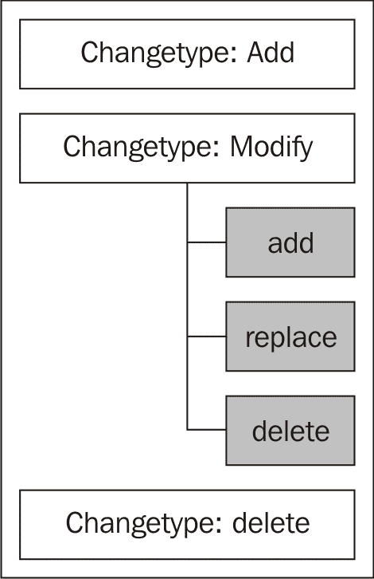

在这种情况下，我们想要为 `uid=david`、`ou=Users`、`dc=example`、`dc=com` 记录添加一个新属性。我们要添加的属性是 `givenName`。因此，指定要添加 `givenName` 属性的行是 `add: givenName`。

接下来，我们想要指定属性和属性值：

```
givenName: David
```

然后，按*Enter*两次表示记录已完成。就像使用`ldapadd`一样，`ldapmodify`会指示它正在修改哪个记录。如果服务器没有返回错误，`ldapmodify`将等待另一个修改记录。

`add`修改类型是`ldapmodify`支持的三种类型之一。只有当更改类型设置为修改时，才能指定操作。三种修改类型分别是：

+   `add`：向现有记录中添加新属性

+   `replace`：用新属性值替换现有属性值

+   `delete`：从记录中删除属性

这些操作中的多个可以在一个事务中进行：

```
$ ldapmodify -w secret -x -D 'cn=Manager,dc=example,dc=com'
dn: uid=immanuel,ou=Users,dc=example,dc=com
changetype: modify
add: givenName
givenName: Manny
-
replace: cn
cn: Manny Kant

modifying entry "uid=immanuel,ou=Users,dc=example,dc=com"
```

在这个示例中，我们首先添加`givenName`，然后用新的值替换现有的`cn`。在两个修改请求之间，我们使用连字符（`-`）表示我们仍在处理同一记录。记住，空行表示我们已完成该记录。现在，如果我们使用`ldapsearch`查找该记录，它将如下所示：

```
$ ldapsearch -x -w secret -D 'cn=Manager,dc=example,dc=com' -LLL \
     '(uid=immanuel)'

dn: uid=immanuel,ou=Users,dc=example,dc=com
sn: Kant
uid: immanuel
ou: Users
objectClass: person
objectClass: organizationalPerson
objectClass: inetOrgPerson
givenName: Manny
cn: Manny Kant
```

`cn`已被替换，并且`givenName`属性已被添加。

如果修改是添加多个属性，您可以将它们分组，而不是使用连字符分开添加：

```
dn: uid=nicholas,ou=Users,dc=example,dc=com
changetype: modify
add: description title
description: This is a test
title: Cartesian philosopher
```

请注意，在这种情况下，`add`行包含两个属性名称（`description`和`title`），后跟这两个属性。就像使用`ldapadd`一样，我们可以将这些变更记录放入一个纯文本文件中，然后使用`-f`标志（后接文件路径），让`ldapmodify`从文件中读取命令，而不是从交互式提示符中读取：

```
$ ldapmodify -x -w secret -D 'cn=Manager,dc=example,dc=com' -f \
     change-nicholas.ldif 
modifying entry "uid=nicholas,ou=Users,dc=example,dc=com"
```

使用`modify`更改类型，我们可以删除一个属性：

```
dn: uid=nicholas,ou=Users,dc=example,dc=com
changetype: modify
delete: title
```

从记录中删除一个属性会导致该属性的所有值从记录中被删除。例如，如果 Nicholas 有两个指定的头衔，上面的操作会将它们全部删除。

要删除一个特定的属性，请求中必须指定要删除的属性值：

```
dn: uid=nicholas,ou=Users,dc=example,dc=com
changetype: modify
delete: title
title: Cartesian philosopher
```

这将删除任何包含精确字符串"Cartesian philosopher"的`title`属性值，保留任何其他属性值不变。

### 修改相对 DN

第三种更改类型用于修改相对 DN——即标识当前记录的 DN 部分（参见本章开头的讨论）。

例如，我们可以更改用户`uid=immanuel,ou=Users,dc=example,dc=com`的 DN 的 RDN 部分：

```
$ ldapmodify -w secret -x -D 'cn=Manager,dc=example,dc=com'
dn: uid=immanuel,ou=Users,dc=example,dc=com
changetype: modrdn
newrdn: uid=manny
deleteoldrdn: 0

modifying rdn of entry "uid=immanuel,ou=Users,dc=example,dc=com"
rename completed
```

在这个示例中，我们使用`modrdn`更改类型来指示 SLAPD 更改用户 DN 的 RDN 部分。`newrdn`指令提供新的 RDN 部分，而`deleteoldrdn`指令决定是否删除或保留旧的属性值（`uid=immanuel`）。设置`0`表示不删除旧的属性值，而设置`1`则会删除旧的属性值。

现在，如果我们搜索该用户，我们可以观察到修改：

```
$ ldapsearch -x -W -D 'cn=manager,dc=example,dc=com' -LL \
     '(sn=kant)' uid
Enter LDAP Password: 
version: 1

dn: uid=manny,ou=Users,dc=example,dc=com
uid: immanuel
uid: manny
```

在某些情况下，我们不希望保留旧的 RDN 属性值。在这种情况下，将`deleteoldrdn`值设置为`1`将删除旧的 RDN 属性值：

```
$ ldapmodify -w secret -x -D 'cn=Manager,dc=example,dc=com'
dn: uid=manny,ou=Users,dc=example,dc=com
changetype: modrdn
newrdn: uid=immanuel
deleteoldrdn: 1

modifying rdn of entry "uid=manny,ou=Users,dc=example,dc=com"
rename completed
```

这将 RDN 更改回`uid=immanuel`，并且由于`deleteoldrdn`设置为`1`，旧的 UID 值（`manny`）应该被删除。我们可以通过`ldapsearch`验证这一点：

```
$ ldapsearch -x -W -D 'cn=manager,dc=example,dc=com' -LL \ 
     '(sn=kant)' uid
Enter LDAP Password: 
version: 1

dn: uid=immanuel,ou=Users,dc=example,dc=com
uid: immanuel
```

请注意，除了更改后的 DN，旧的`uid`属性值（`manny`）不再出现在记录中，它已被替换。

当我们检查`ldapmodrdn`客户端时，我们将再次查看相对 DN 的修改。

#### 使用 modrdn 移动记录

`modrdn`变更类型不仅可以用于更改 RDN，还可以用于更改记录的上级条目，实际上是将记录在目录信息树中重新定位。

然而，为了使此操作有效，后端数据库类型必须支持这种修改。目前，唯一支持这种修改的存储数据库是 HDB。在第二章中，我们设置了`slapd.conf`以在 HDB 后端存储`dc=example,dc=com`树。

现在，我们可以执行一个复合 ModRDN 操作，在此操作中，我们更改记录的 RDN，并将记录移动到另一个 OU：

```
$ ldapmodify -w secret -x -D 'cn=Manager,dc=example,dc=com'
dn: uid=manny,ou=users,dc=example,dc=com
changetype: modrdn
newrdn: uid=immanuel
deleteoldrdn: 1
newsuperior: ou=system,dc=example,dc=com
```

在此示例中，我们将用户的 UID 从`manny`更改回`immanuel`。由于`deleteoldrdn`为`1`，旧的 RDN（`uid=manny`）将从记录中删除。

`newsuperior`指令告诉 SLAPD DN 的新基础部分应该是什么。这将有效地把记录从`ou=users`分支移动到我们目录信息树中的`ou=system`分支。

### 注意

与修改用户的 RDN 不同，更改记录的上级不会修改记录中的任何字段。因此，我们上面的记录仍然会保留`ou=Users`属性。

再次，我们可以使用`ldapsearch`查看已修改的记录：

```
 $ ldapsearch -x -W -D 'cn=manager,dc=example,dc=com' -LL 
 '(sn=kant)' uid

```

然后，我们得到：

```
Enter LDAP Password: 
version: 1

dn: uid=immanuel,ou=system,dc=example,dc=com
uid: immanuel

```

请注意，不仅`uid`已更改，DN 中的`ou`也发生了变化。

为了使用`newsuperior`指令，必须首先指定`modrdn`。因此，如果我们想将该用户的记录移动回用户 OU，我们仍然需要指定该用户的新 RDN。

那么，如何在不更改 RDN 的情况下移动记录呢？

由于`modrdn`变更类型不要求新 RDN 与旧 RDN 不同，因此只需将`newrdn`设置为与旧 RDN 相同，即可使用`modrdn`移动记录：

```
$ ldapmodify -w secret -x -D 'cn=Manager,dc=example,dc=com'
dn: uid=immanuel,ou=system,dc=example,dc=com
changetype: modrdn
newrdn: uid=immanuel
deleteoldrdn: 1
newsuperior: ou=users,dc=example,dc=com

modifying rdn of entry "uid=immanuel,ou=system,dc=example,dc=com"
rename completed
```

在此情况下，`newrdn: uid=immanuel`实际上并没有更改用户的 RDN。但这是为了更改上级所必须的。

`newsuperior`指令表示记录应该被移动（回到）`ou=users,dc=example,dc=com`树。对该记录进行最后一次`ldapsearch`，我们可以看到该变更的结果：

```
$ ldapsearch -x -W -D 'cn=manager,dc=example,dc=com' -LL 
     '(sn=kant)' uid
Enter LDAP Password: 
version: 1

dn: uid=immanuel,ou=users,dc=example,dc=com
uid: immanuel
```

再次，记录回到了`Users` OU。

### 删除整个记录

最后，使用`delete`变更类型，我们可以通过`ldapmodify`删除整个记录：

```
$ ldapmodify -w secret -x -D 'cn=Manager,dc=example,dc=com'

dn: uid=nicholas,ou=Users,dc=example,dc=com
changetype: delete

deleting entry "uid=nicholas,ou=Users,dc=example,dc=com"
```

删除记录时，我们只需指定 DN 和变更类型。

本质上，使用删除更改类型执行的任务与使用`ldapdelete`客户端执行的任务相同。

## ldapdelete

`ldapdelete`工具用于从目录中删除一个或多个记录。它执行与`ldapmodify`中使用的`delete`更改类型相同的操作。

如果你想使用`ldapdelete`删除一条记录，必须知道它的 DN。此工具不会搜索，例如，所有具有指定地址的记录，然后删除它们。

`ldapdelete`命令的语法很简单：

```
 $ ldapdelete -x -w secret -D 'cn=Manager,dc=example,dc=com' \
 'uid=nicholas,ou=Users,dc=example,dc=com'

```

在常见的标志（`-x`、`-w`、`-D`）之后，`ldapdelete`接受要删除的 DN（这是命令第二行中的`uid=nicholas`的 DN）。执行时，它将请求服务器删除该记录。如果记录存在且用户（根据服务器的 ACL）被允许删除记录，那么该记录将从目录中移除。

## ldapcompare

该工具用于询问服务器某个特定条目（通过 DN 标识）是否具有与指定属性匹配的属性。如果该条目确实具有匹配的属性，则`ldapcompare`返回`TRUE`。否则，返回`FALSE`。

这里有一对示例：

```
$ ldapcompare -x -w secret -D 'cn=Manager,dc=example,dc=com' \
    'uid=david,ou=Users,dc=example,dc=com' 'givenName:David'
TRUE

$ ldapcompare -x -w secret -D 'cn=Manager,dc=example,dc=com' \
    'uid=david,ou=Users,dc=example,dc=com' 'cn:Dave Hume'
FALSE
```

在第一个示例中，`ldapcompare`请求服务器检查`uid=david,ou=Users,dc=example,dc=com`的记录，查看它是否具有值为`David`的`givenName`属性。记录确实具有`givenName: David`属性，因此返回值为`TRUE`。

第二个示例对相同的记录执行了类似的比较；它查找值为`Dave Hume`的`cn`属性。虽然该记录具有`cn`属性，但该属性的值为`David Hume`，而不是`Dave Hume`。因此，服务器返回了`FALSE`。

### 提示

**使用 ldapcompare 进行 Base-64 编码**

在值进行比较时，如果该值不是 ASCII 字符串，应该将该值进行 Base-64 编码，并使用我们在 LDIF 文件中使用的双冒号语法（`::`）。例如：`givenName::RGF2aWQ=`

LDAP 比较操作通常比搜索操作要快得多。在可以通过`ldapsearch`和`ldapcompare`完成相同任务的情况下，通常使用`ldapcompare`更高效。

## ldapmodrdn

`ldapmodrdn`客户端用于更改 DN 的相对 DN（RDN）部分。该客户端请求一个 ModifyDN 操作。`ldapmodrdn`接受一个现有记录的完整 DN 和应该替换现有 RDN 的相对 DN：

```
 $ ldapmodrdn -x -w secret -D 'cn=Manager,dc=example,dc=com' 
 'uid=immanuel,ou=Users,dc=example,dc=com' 'uid=manny'

```

这个示例请求将`uid=immanual,ou=Users,dc=example,dc=com`的 RDN 从`uid=immanuel`更改为`uid=manny`。

现在让我们查看更改后的记录。我们将通过`sn`字段进行搜索：

```
$ ldapsearch -x -w secret -D 'cn=Manager,dc=example,dc=com' -LLL \ 
    '(sn=Kant)' uid

dn: uid=manny,ou=Users,dc=example,dc=com
uid: immanuel
uid: manny
```

在这里，过滤器正在查找姓氏为`Kant`的记录，并请求仅返回`uid`属性。回想一下，我们从未添加过`uid`属性值为`manny`的记录——我们只有`uid: immanuel`。

但是从结果来看，我们可以看到不仅 DN 已被修改，而且一个新的用户 ID 属性也被添加了。在某些情况下，修改 RDN 导致添加（而不是替换）属性值是可以的。但在其他情况下，这样做会很不方便，甚至是非法的（因为架构的原因）。

例如，我们可能在目录中有一个描述与公司网站相关的记录子树的条目。这样的记录可能如下所示：

```
dn: dc=www,dc=example,dc=com
dc: www
ou: Website
objectClass: organizationalUnit
objectClass: dcObject
```

现在，假设我们想将 RDN 从`www`更改为`web`。像之前那样使用`ldapmodrdn`会导致错误：

```
$ ldapmodrdn -x -w secret -D 'cn=Manager,dc=example,dc=com' \
    'dc=www,dc=example,dc=com' 'dc=web'

Rename Result: Constraint violation (19)
Additional info: attribute 'dc' cannot have multiple values
```

出现此错误的原因是`dc`的架构定义指定每个记录中只能有一个`dc`属性值。

### 注意

`dc`（或`domainComponent`）属性在`core.schema`中有定义。

解决此问题的方法是为`ldapmodrdn`使用`-r`标志。

```
 $ ldapmodrdn -x -w secret -D 'cn=Manager,dc=example,dc=com' -r 
 'dc=www,dc=example,dc=com' 'dc=web'

```

`-r`标志使得`ldapmodrdn`替换现有的属性值，而不是添加它。现在结果记录看起来是这样的：

```
dn: dc=web,dc=example,dc=com
ou: Website
objectClass: organizationalUnit
objectClass: dcObject
dc: web
```

列出的只有一个`dc`属性，并且它具有新设置的值`web`。

### 使用`ldapmodrdn`修改上级 DN

就像我们之前看到的`ldapmodify`的`modrdn`类型变更一样，我们也可以使用`ldapmodrdn`来更改上级 DN（记录 DN 的基础部分）。

### 提示

**正确的后端**

不是所有的后端都支持这种类型的重命名。目前，只有 HDB 后端支持更改 DN 中的上级引用。其他非存储后端（如`ldap`）可能会将这些操作传递给底层存储机制，而该机制可能会或可能不会支持这种程度的重命名。

同样，与`modrdn`类型变更一样，`ldapmodrdn`必须指定一个替换的 RDN，即使这个 RDN 与当前的 RDN 相同。换句话说，即使 RDN 不是新的，仍然需要指定 RDN。我们将在下面看到一个例子。

`ldapmodrdn`的`-s`标志指定了新的上级 DN。因此，要将条目`uid=barbara,ou=users,dc=example,dc=com`移动到目录中的`ou=system`分支，我们可以使用如下命令：

```
 ldapmodrdn -x -w secret -D 'cn=Manager,dc=example,dc=com' \
 -s "ou=system,dc=example,dc=com" -r \
 "uid=barbara,ou=users,dc=example,dc=com" "uid=barbara"

```

这是一个较长的命令，因此分成了三行：

+   第一行包含了用于绑定到目录的标志，这些标志现在应该已经很熟悉了。

+   第二行以`-s`标志开始，后面跟着一个 DN 作为参数。这个标志指定了新的上级 DN 是什么。在这个例子中，它是`ou=system,dc=example,dc=com`。

    如我们之前所见，`-r`标志指示 SLAPD 用新的 RDN 替换旧的 RDN。

+   第三行是我们要修改的条目的 DN，`uid=barbar,ou=users,dc=example,dc=com`，以及新的 RDN。由于我们希望保持相同的 RDN（但将记录移动到新的子树），因此我们将最后一个值设置为`uid=barbara`，这是现有记录的 RDN。

运行此命令后，我们可以使用`ldapsearch`查看结果：

```
$ ldapsearch -x -W -D 'cn=manager,dc=example,dc=com' -LL 
    '(uid=barbara)' uid ou
Enter LDAP Password: 
version: 1

dn: uid=barbara,ou=system,dc=example,dc=com
ou: Users
uid: barbara

```

Barbara 的新记录的基本部分现在是`ou=system,dc=example,dc=com`。

就像在`ldapmodify`的`modrdn`变更类型中一样，修改上级条目不会改变记录中的任何属性。因此，即使这个记录现在位于系统 OU 中，它仍然具有`ou: Users`属性。

构建具有多个属性值的相对 DN 是可能的。例如，我可以在 RDN 部分中使用`uid`和`l`（用于位置）的组合：

```
dn: uid=matt+l=Chicago,ou=Users,dc=example,dc=com
```

在这种情况下，使用加号（`+`）表示这两个属性都应该被视为 RDN 的一部分。

`ldapmodrdn`足够智能，能够处理这些情况。它将添加（或替换）RDN 中使用的所有属性。

在指定了`-r`标志的情况下，有一些需要注意的事项。首先，`ldapmodrdn`将替换新 RDN 中使用的所有字段。其次，如果初始 RDN 中有被从 RDN 中移除的值，那么该属性值也将从记录中移除。例如，以下是我们的起始记录：

```
dn: cn=Matt Butcher+l=Chicago,dc=example,dc=com
cn: Matt Butcher
sn: Butcher
l: Chicago
objectClass: person
objectClass: organizationalPerson
```

请注意，DN 使用了`cn`和`l`两个属性，这两个属性都出现在记录的主体中。现在，如果我们使用`ldapmodrdn`并加上`-r`标志，将`cn=Matt Butcher+l=Chicago`替换为`cn=Matt Butcher`，`l: Chicago`属性将从记录中删除：

```
dn: cn=Matt Butcher,dc=example,dc=com
sn: Butcher
objectClass: person
objectClass: organizationalPerson
cn: Matt Butcher
```

因此，在使用带有多属性 RDN 的`ldapmodrdn`时，应谨慎使用`-r`标志。

## ldappasswd

在实用工具部分，我们查看了如何使用`slappasswd`加密密码。该工具用于生成加密的值，以便包含在 LDIF 文件中。与此不同，`ldappasswd`客户端连接到服务器并在目录中更改密码值。如果需要，它还可以用来自动生成密码。

与使用 LDAP v.3 标准的 Add 和 Modify 操作的`ldapadd`和`ldapmodify`不同，`ldappasswd`客户端使用的是扩展操作——**LDAP 密码修改扩展操作**，该操作在 RFC 3062 中有定义（[`rfc-editor.org/rfc/rfc3062.txt`](http://rfc-editor.org/rfc/rfc3062.txt)）。

### 注意

当从 LDIF 文件加载密码，或通过`ldapadd`或`ldapmodify`时，如果你发送给服务器的是明文密码，该密码将以未加密的字符串形式存储在目录中。这是不安全的。你应该使用`slappasswd`生成加密密码并将其包含在 LDIF 文件中，或者使用`ldappasswd`来设置密码。

只要 ACL 允许，用户就可以使用`ldappasswd`客户端更改她或他的密码：

```
$ ldappasswd -x -W -S -D 'uid=matt,ou=Users,dc=example,dc=com'
New password: 
Re-enter new password: 
Enter LDAP Password: 

Result: Success (0)
```

`-S`标志是这里唯一使用的新标志。它表示`ldappasswd`应该提示用户输入（并重新输入）新密码。如你所记得，`-W`标志则提示用户交互式地输入当前密码。

用户输入密码的顺序与常规不同。用户首先被提示输入并重新输入新密码，然后再输入当前密码。

管理员（或具有`userPassword`属性写入权限的用户）也可以更改其他用户的密码：

```
$ ldappasswd -x -w secret -D 'cn=Manager,dc=example,dc=com' -s secret \ 'uid=barbara,ou=Users,dc=example,dc=com'

Result: Success (0)
```

在这种情况下，目录管理员正在更改`uid=barbara,ou=Users,dc=example,dc=com`的`userPassword`属性值。与使用`-S`并在交互提示符下输入密码不同，密码已在命令行中指定：`-s secret`。

通过`ldappasswd`更改密码时，密码会在存储到记录中之前由服务器自动加密：

```
# barbara, Users, example.com
dn: uid=barbara,ou=Users,dc=example,dc=com
userPassword:: e1NTSEF9UzFTUnQ1bkkvcHZGOGt3UklVU3J3TkRHZHFSS3hOQ1Y=
```

如果我们解码`userPassword`值，结果是：`{SSHA}S1SRt5nI/pvF8kwRIUSrwNDGdqRKxNCV`。该密码以不可逆的 SSHA 哈希格式存储。

### 提示

**设置默认加密方案**

你可以指定服务器在加密密码时选择哪种加密方案。要指定算法，请在`slapd.conf`中使用`password-hash`指令。例如：`password-hash {SMD5}`

最后，`ldappasswd`可以请求服务器为该 DN 生成一个强密码。如果没有设置标志来指示密码的来源（例如`-s`、`-S`或`-T`），那么`ldappasswd`将请求生成一个密码。以下是请求：

```
$ ldappasswd -x -w secret -D 'cn=Manager,dc=example,dc=com'  \
    'uid=barbara,ou=Users,dc=example,dc=com'

New password: dS9R4Kvc
Result: Success (0)
```

服务器响应了这个请求，并生成了一个密码`New password: dS9R4Kvc`，该密码已被加密并存储在服务器的`userPassword`属性中。

## ldapwhoami

OpenLDAP 套件中的最后一个客户端是`ldapwhoami`。该客户端提供了**“我是谁？”扩展操作**的客户端实现。该操作提供了当前与目录绑定的 DN 的信息。

`ldapwhoami`命令仅需要足够的信息来验证目录服务器：

```
$ ldapwhoami -x -w secret -D 'cn=Manager,dc=example,dc=com'

dn:cn=Manager,dc=example,dc=com
Result: Success (0)
```

如你所见，从这个例子中可以看出，这个客户端只会返回我们连接的用户的 DN。这个工具在调试不需要 DN 来连接的 SASL 身份验证时非常有用。我们将在下一章讨论 SASL 配置。

# 总结

在本章中，我们详细介绍了 OpenLDAP 套件中的工具。我们首先查看了 SLAPD 和 SLURPD 服务器。特别是，我们了解了主要的 LDAP 操作，如绑定（bind）、搜索（search）、添加（add）、修改（modify）和删除（delete）。

接下来，我们在一个 LDIF 文件中创建了一个基本的目录信息树。在此过程中，我们熟悉了 LDIF——用于表示 LDAP 目录数据的文本格式。

然后我们查看了 OpenLDAP 套件中的实用工具和客户端。在此过程中，我们将目录信息树从 LDIF 加载到目录中，然后添加和修改了这些数据。

到此为止，你应该已经能够熟练使用 OpenLDAP 中包含的工具。在下一章中，我们将回到 SLAPD 服务器，并深入了解 LDAP 安全。
