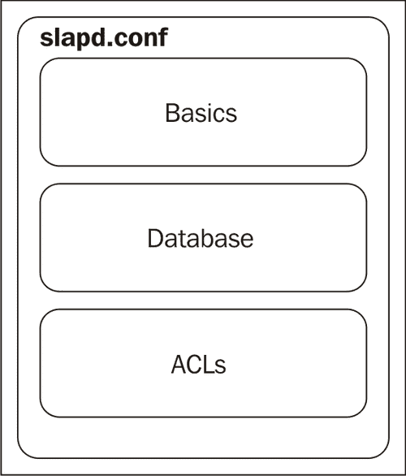
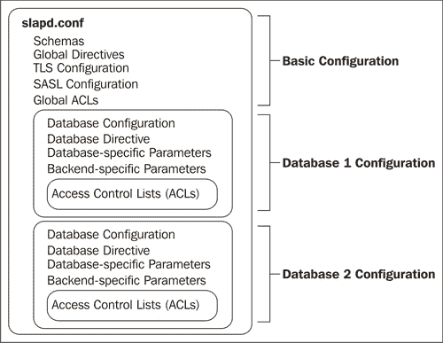

# 第五章：高级配置

在上一章中，我们讨论了如何通过 SSL/TLS、简单认证和 SASL 认证以及基于 ACL 的授权规则来保护我们的 OpenLDAP 服务器。所有这些措施都通过 SLAPD 的配置文件实现。在本章中，我们将介绍 SLAPD 的一些其他高级功能，包括：

+   配置多个数据库后端

+   调整目录性能

+   使用目录覆盖

+   添加完整性检查

+   添加唯一性约束

# 多个数据库后端

迄今为止，在操作 OpenLDAP 时，我们一直使用一个目录树（`dc=example,dc=com`）和一个后端数据库（在`slapd.conf`中配置的 HDB 数据库）。这种配置适用于大多数小型目录服务器。它简单易配置，所有数据都存储在同一个地方。

但是，在一些更复杂的使用场景中，拥有一个可以处理多个目录树的目录服务器是有意义的，每个目录树都存储在自己的后端数据库中。以下是一些可能需要这种配置的情况：

+   一个目录服务器托管多个组织的目录信息树

+   一个大型目录服务器被拆分成多个较小的树和子树，以提高性能和复制的效率。

+   两个或更多先前存在的目录信息树正在逐步合并（如企业并购的情况）。

当然，还有其他可能需要使用多个后端的 LDAP 服务器的场景。这些只是一些常见情况的示例。

一个带有多个后端的 SLAPD 是如何工作的？让我们通过一个简单的例子来理解。假设我们有两个目录信息树，一个是我们在之前章节中使用过的`dc=example,dc=com`树，另一个是`dc=demo,dc=net`。

我们希望在同一个 SLAPD 服务器上托管这两个目录树。但我们不希望`dc=example,dc=com`的数据与`dc=demo,dc=net`存储在相同的数据库文件中（如果以后需要拆分数据库，这可能会带来问题）。当然，我们也不希望一个目录树中的记录查询返回另一个目录树中的条目。

配置一个新的数据库主要是通过在`slapd.conf`中定义新的数据库来完成的。完成这一步之后，我们只需要创建一些数据并将其加载到新数据库中。

## slapd.conf 文件

我们在第二章中创建了`slapd.conf`文件。在之前的章节中，我们修改了`slapd.conf`的一小部分，但现在我们将回顾一下`slapd.conf`文件的整体结构。

如第二章所述，`slapd.conf`文件可以分为几个组成部分。最初，我们创建了三个部分，分别叫做*Basics*、*Database*和*ACLs*。在上一章中，我们详细讨论了 ACLs 以及大多数情况下在第一个*Basics*部分中定义的安全指令。让我们来看看我们`slapd.conf`文件的结构：



现在是时候稍微完善一下模型了。*基础*部分包含全局配置参数。也就是说，在那里定义的参数对整个 SLAPD 服务器有效，无论它有多少个数据库后端。

*数据库*部分包含与特定数据库后端相关的指令，每个后端通常只托管一个目录信息树。此部分中的参数定义了使用哪个后端（例如 BDB、HDB、LDIF、SQL）、该后端的具体参数和叠加层、哪个 DN 将是该数据库的管理员，等等。一个`slapd.conf`文件中可以有多个*数据库*部分。实际上，配置多个数据库部分是我们在一个 SLAPD 服务器上托管多个数据库后端的方式。

最后，*ACL*部分实际上是*数据库*部分的一个子部分（虽然正如我们在上一章所看到的，ACL 也可以在全局级别使用）。每个数据库可以有自己的访问控制集。所以，`slapd.conf`文件的一个更准确的表现应该是这样的：



这个图更能代表`slapd.conf`文件的组成。前面的例子展示了两个独立的数据库（虽然数据库的数量当然不限于两个），每个数据库都有自己的指令和访问控制列表（ACL）。

虽然全局 ACL 在*基础* *配置*部分中提到，但它们没有被单独分成一个部分，部分原因是它们在这里的作用不像在后端上下文中使用 ACL 那样重要。全局 ACL 主要用于保护根 DSE、`cn=Config`和`cn=Subschema`树的部分（请参阅附录 C），但不止于此。大多数 ACL 应放置在适当的*数据库* *配置*部分中。

现在我们准备转向配置文件本身，看看前面的图示是如何付诸实践的。

一个基本的多数据库设置可以通过在我们的`slapd.conf`文件中增加十几行轻松完成。我们将从第二章创建的现有后端配置开始，并在其下方添加一个新的数据库后端：

```
##############################
# BDB Database Configuration #
##############################
# Database 1: Example.Com

database        hdb
suffix          "dc=example,dc=com" "o=My Company,c=US"
rootdn          "cn=Manager,dc=example,dc=com"
rootpw          secret
directory      /var/lib/ldap
#directory       /usr/local/var/openldap-data
index   objectClass     eq
index   cn      eq,sub,pres,approx
index   uid     eq,sub,pres

########
# ACLs #
########
include /etc/ldap/acl.conf

##############################
# Database 2:  Demo.Net

database        hdb
suffix          "dc=demo,dc=net"
rootdn          "cn=Manager,dc=demo,dc=net"
rootpw          secret
directory      /var/lib/ldap/demo.net
#directory       /usr/local/var/openldap-data/demo.net
index   objectClass     eq
index   cn      eq,sub,pres,approx
index   uid     eq,sub,pres

########
# ACLs #
########
access to attrs=userPassword
        by anonymous auth
        by self write

access to dn.sub="dc=demo,dc=net" by users read
```

我们刚刚配置了两个数据库：

+   `Example.Com`目录由第一个数据库处理。

+   `Demo.Net`目录由第二个数据库处理。

关于此配置，有几点需要注意：

+   每个目录都有一个单独的管理员帐户。这在每个目录由不同的个人或小组管理时非常有用。

+   第二个数据库的目录与第一个数据库的目录不同。请记住，目录是存储数据库文件的位置。每个后端必须有自己的存储目录。

+   正如我们之前讨论的，每个数据库部分可以（并且应该）有自己的 ACL，并且可以为`slapd.conf`中定义的每个数据库指定不同的 ACL。在之前的示例中，ACL 是最小的。

## 创建和导入第二个目录

在我们导入数据之前，需要创建存储数据的位置。在`slapd.conf`文件片段中，`directory`指令指向`/var/lib/ldap/demo.net`。然而，这个目录还不存在。我们需要创建它：

```
 $ sudo mkdir /var/lib/ldap/demo.net

```

### 注意

如果 SLAPD 是以非`root`用户身份运行的，请确保更改`demo.net/`目录的所有权。SLAPD 用户应该拥有该目录。例如，如果`ldap`用户运行`slapd`，可以执行以下操作：

```
chown ldap /var/lib/ldap/demo.net

```

接下来，我们需要创建一个包含新目录基本记录的 LDIF 文件。在第三章中，我们为`dc=example,dc=com`目录信息树创建了一个 LDIF 文件，其中包含主要的树结构。在这里，我们将创建一个最小的目录结构，并将其保存在一个名为`demo.net.ldif`的文件中：

```
# This is the root of the directory tree
dn: dc=demo,dc=net
description: Demo.Net
dc: demo
o: Demo.Net
objectClass: top
objectClass: dcObject
objectClass: organization
# Subtree for users
dn: ou=Users,dc=demo,dc=net
ou: Users
description: Demo.Net Users
objectClass: organizationalUnit

# George Berkeley
dn: uid=george,ou=Users,dc=demo,dc=net
ou: Users
uid: george
sn: Berkeley
cn: George Berkeley
givenName: George
displayName: George Berkeley
mail: george@demo.net
objectClass: person
objectClass: organizationalPerson
objectClass: inetOrgPerson
```

这个文件创建了顶级条目——一个单一的子树分支（用于用户）和一个单一的用户。

现在我们已经有了一个 LDIF 文件，我们可以通过`slapadd`导入它。如果你还没有这样做，请在运行`slapadd`时停止 SLAPD。我们运行以下命令进行导入：

```
 $ sudo slapadd -b 'dc=demo,dc=net' -l demo.net.ldif
```

默认情况下，`slapadd`会尝试将数据导入到`slapd.conf`中指定的第一个目录。然而，在我们的案例中，我们希望将数据存储在第二个目录中。因此，在之前的示例中，我们使用了`-b`标志来指定第二个目录的基准 DN。我们本可以使用`-n` `2`，这样就指示`slapadd`将记录放入第二个数据库中，而不是使用`-b` `'dc=demo,dc=net'`。

现在我们有了一个包含少量条目的第二个数据库。我们可以启动服务器并使用`ldapsearch`进行测试：

```
  $ ldapsearch -LLL -x -W -D 'cn=Manager,dc=demo,dc=net' -b \ 
               'dc=demo,dc=net' '(objectclass=*)' description
```

这是我们将得到的结果：

```
Enter LDAP Password: 

dn: dc=demo,dc=net
description: Demo.Net
dn: ou=Users,dc=demo,dc=net
description: Demo.Net Users

dn: uid=george,ou=Users,dc=demo,dc=net
```

作为该目录的管理员绑定到`dc=demo,dc=net`目录树，我们可以验证我们添加的三个记录是否存在。请注意，只有`description`属性会被返回。这就是为什么只显示`dn`和`description`的原因。

在`slapd.conf`中的`demo.net`部分没有设置 ACL 来阻止`example.com`数据库的用户查看`demo.net`目录中的信息。例如，用户`uid=matt,ou=users,dc=example,dc=com`可以从`demo.net`目录中检索信息：

```
 $ ldapsearch -LLL -U matt -b 'dc=demo,dc=net' '(uid=george)' mail
```

这是输出：

```
SASL/DIGEST-MD5 authentication started
Please enter your password: 
SASL username: matt
SASL SSF: 128
SASL installing layers

dn: uid=george,ou=Users,dc=demo,dc=net
mail: george@demo.net
```

如果我们想防止这种行为，可以通过 ACL 来实现。例如，我们可以将规则`access` `to` `dn`.`sub="dc=demo,dc=net"` `by` `users` `read`替换为一个限制仅允许`dc=demo,dc=net`树内条目读取的规则：

```
access to dn.sub="dc=demo,dc=net"
       by dn.sub="dc=demo,dc=net" read
```

这将拒绝`dc=demo,dc=net`树以外的条目访问这些记录。必须在`dc=example,dc=com`部分的 ACL 中添加类似的规则，以阻止`dc=demo,dc=net`树中的用户访问。

现在我们有一个包含两个不同数据库的目录。在本书的后续部分中，我们将研究使用多个数据库的其他方面。例如，在本章的后面，我们将看看如何使用 `glue` 叠加来连接两个数据库进行搜索。在第七章中，我们将研究在多个数据库上进行复制。但接下来，我们将看一些 SLAPD 的性能调优选项。

# 性能调优

在第二章中，我们创建了一个基本的 `slapd.conf` 文件。我们在那里的重点是让基本服务器运行起来。在上一章中，我们详细查看了与安全相关的指令。刚刚创建第二个数据库后端时，我们更高层次地查看了 `slapd.conf` 文件。

在这部分中，我们将继续在 `slapd.conf` 上工作，但这里我们将专注于帮助您根据组织的性能需求调整服务器的参数。稍后在这一部分，我们将看看 Berkeley DB 后端（BDB 和 HDB）使用的 `DB_CONFIG` 文件。在该文件中进行的优化可以显著提升 OpenLDAP 的性能。

### 提示

**术语：数据库和后端**

数据库和后端之间的区别非常微妙，通常这两个术语可以互换使用。这里是区别。

+   **数据库**是存储目录信息树的位置（文件、关系数据库、网络资源）。

+   **后端**是用于存储数据库（或者在某些情况下，指导 SLAPD 连接到远程数据库）的特定机制。后端被编码为模块，这意味着它们可以在启动时动态加载。

## 性能指令

我们已经创建了一个 SLAPD 使用的 `slapd.conf` 文件来管理目录服务器。随着我们查看下一批指令，我们将继续构建这个配置文件。

我们将把指令分成两个不同的类：

+   那些属于全局的指令应该放在 `slapd.conf` 文件顶部的基本配置部分。

+   仅适用于单个数据库后端的指令

对于数据库后端适用的指令，一些适用于所有后端类型（如 BDB、SQL、Shell、LDIF 等），还有一些仅适用于特定后端类型。由于我们使用的是 HDB 后端（默认），我们将专注于可以由该后端使用的指令。

### 全局指令

全局指令必须放在 `slapd.conf` 文件的顶部部分，在定义任何数据库部分之前。这些指令适用于整个 SLAPD 服务器，而不仅仅是该服务器内的特定目录信息树。

我们将首先看到的前三个指令用于优化客户端与 LDAP 服务器之间的交互。这些指令是 `timelimit`、`sizelimit` 和 `idletimeout` 指令。之后，我们将看看 `threads` 指令，该指令用于调整 SLAPD 的线程。

### 注意

可以使用`limit`指令为每个数据库设置精细的大小和时间限制，稍后会讨论该指令。例如，可以使用此指令为每个用户或组设置时间和大小限制。

#### 时间限制

`timelimit`指令用于指定 SLAPD 在停止操作并返回消息给客户端之前，针对特定操作所能花费的最大时间。

一些操作，例如在一个没有索引的属性上搜索一个大目录，可能需要很长时间。其他时候，客户端通过慢速网络连接并请求大量数据也可能会占用大量时间。这类漫长的搜索会拖慢整个服务器的速度，在繁忙的服务器上，它还可能阻止其他客户端连接并获取及时的响应。当然，并非所有客户端应用程序都能很好地处理长时间的等待。

为了避免这些问题，存在一个`timelimit`指令，它允许你设置服务器在结束操作并返回消息给客户端之前，等待操作完成的最大时间。

默认时间限制是 3600 秒。在这个例子中，我们将其降低到仅五分钟：

```
timelimit 300
```

请记住，这个指令是一个*全局*指令，必须放在配置文件中的`database`指令之前。

有时，取消所有时间限制是有用的。这样做的缺点是允许连接占用资源一段不确定的时间，如果有太多连接这样做，可能会导致客户端出现长时间延迟（在极端情况下，甚至是拒绝服务）。但是，在受控环境中，这可能是一个可以接受的风险。要关闭时间限制，请使用关键字`unlimited`：

```
timelimit unlimited
```

使用此设置，服务器在操作完成之前不会向客户端返回任何消息。

这些例子展示了时间限制的基本用法，但有时需要更复杂的时间限制配置。OpenLDAP 开发人员创建了一种更高级的`timelimit`指令形式来处理这种复杂的时间限制设置。在这种形式中，`timelimit`指令可以设置两种不同类型的时间限制：

+   **软限制**：软限制是默认的时间限制，服务器在客户端请求中没有包含所需时间限制时，会使用该限制。

+   **硬限制**：硬限制是服务器处理请求时所能花费的最长时间。

理解这一差异有助于了解客户端和服务器如何处理时间问题。

当客户端连接到目录并执行搜索时，它可能会发送自己的时间限制请求，指示服务器在该时间限制内完成搜索。例如，如果客户端发送了 30 秒的时间限制，它将期望服务器在 30 秒内响应。如果服务器的硬时间限制高于客户端发送的时间限制，那么服务器将为该请求设置客户端请求的时间限制。然而，如果服务器的硬时间限制低于客户端的时间限制，它将使用自己的硬限制来处理该请求。

所以，如果服务器的硬时间限制是 60 秒，而客户端请求的是 30 秒时间限制，服务器将使用 30 秒的限制。然而，如果服务器的硬时间限制是 10 秒，而客户端请求的是 30 秒时间限制，服务器将使用其硬 10 秒限制，因为它较低。

### 提示

**设置客户端时间限制**

对于像`ldapsearch`这样的 OpenLDAP 客户端，可以通过编辑`ldap.conf`（或你的`.ldaprc`文件）并添加`TIMELIMIT`指令来设置客户端时间限制。在`ldap.conf`文件中，`TIMELIMIT`只有一个参数：以秒为单位的时间限制。例如，设置时间限制为 30 秒：`TIMELIMIT` `30`。

软时间限制在哪儿起作用？客户端并不总是提供时间限制，在这些情况下，你可能希望设置一个低于硬时间限制的限制。也就是说，如果默认的硬时间限制是一小时，这可能是一个完全合法的最大限制，但对于那些不需要更长时间限制的客户端来说，设置一分钟或两分钟的默认限制会更合适。

### 注意

如果你设置了一个高于硬限制的软限制，将使用硬限制。

现在我们可以查看`timelimit`指令的扩展形式，了解如何设置硬时间限制和软时间限制的示例。通常，两者是在同一命令中设置的（虽然你可以只设置一个，而不设置另一个）：

```
timelimit time.soft=30 time.hard=300
```

在这个例子中，软时间限制是 30 秒，而硬时间限制是 300 秒。这允许请求更长时间限制的客户端获得更长的处理时间，同时为那些在请求时没有提供时间限制的客户端设置较低的默认时间限制。

如果时间限制到达，客户端会得到什么？服务器将返回它能够完成的最大处理量，但也会包含一个警告，说明时间限制已被超出。

请注意，在繁忙的服务器上，请求可能会被排队，但实际上可能直到线程可用时才会执行。在这种情况下，请求等待线程的时间不会算入时间限制。时间限制的计时器从工作线程开始处理请求时开始，而不是从服务器接收到请求时开始。

### 注意

本章后面讨论的后端特定限制指令提供了更细粒度的时间和大小限制支持。例如，你可以为特定用户或组成员设置时间限制。

#### 空闲超时

除了限制 SLAPD 处理请求所需的时间外，您还可以限制 SLAPD 允许客户端保持连接但空闲的时间。如果一个连接已连接到 SLAPD，但没有执行任何操作，则该连接为空闲状态。例如，客户端可能连接到 SLAPD，执行绑定操作，然后保持连接打开，可能是在等待用户输入。

在许多情况下，允许客户端保持连接但处于空闲状态并不会造成危害。空闲的客户端不需要服务器线程的关注，因此不会消耗宝贵的资源。因此，服务器的默认行为是简单地允许空闲连接无限期地保持连接。

但有时（有时是由于系统其他部分的限制），希望防止客户端连接并保持空闲。使用 `idletimeout` 指令来设置超时时间。与 `timelimit` 的简单形式类似，`idletimeout` 只需要一个参数，即连接空闲前 SLAPD 关闭连接的秒数：

```
idletimeout 3600
```

#### 大小限制

除了设置操作可以持续的时间限制外，还可以设置搜索操作返回记录的数量限制。客户端可以轻松执行广泛的搜索，这些搜索会返回大量记录。如果没有设置大小限制，使用过滤器 `(objectclass=*)` 的搜索（如果不受 ACL 限制）将返回搜索基准中的每一条记录。如果在包含数百万条记录的数据库上执行此类搜索，SLAPD 会将所有这些记录返回给客户端。

在大多数情况下，为任何一次搜索设置记录返回数量的上限是有意义的。默认情况下，SLAPD 只会返回前 500 条记录。但这个数字可以通过 `sizelimit` 指令进行更改。

在其简单形式中，`sizelimit` 指令只需要一个参数，即返回的最大记录数：

```
sizelimit 1000
```

与 `timelimit` 类似，`sizelimit` 指令也有扩展形式，并且像 `timelimit` 一样，`sizelimit` 具有软限制和硬限制。扩展形式的 `sizelimit` 指令还可以设置第三个属性，这个属性称为 `unchecked`。

在 `sizelimit` 中，硬限制和软限制的功能与 `timelimit` 中相似。硬限制决定了在任何搜索中返回的最大搜索结果数。就像时间限制一样，客户端也可以发送信息告诉服务器客户端希望返回的最大条目数。如果没有设置此类信息，则会使用软限制的值。

如果服务器发现的记录超过了 `sizelimit` 允许的数量，它将返回最大数量的记录并附带错误信息：`Size limit exceeded`。

`unchecked`条件稍微复杂一些。在搜索请求的属性未被索引时，SLAPD 可能会找到大量记录，需要测试这些记录是否符合客户端的筛选条件。有时候候选记录的数量非常大。`unchecked`属性可以用来设置一个最大记录数限制，限制可以作为匹配候选项的记录数。这可以防止调优不良的数据库在搜索匹配的记录时消耗大量时间和资源。

### 注意

对常用的搜索属性进行索引是避免这种情况的最佳方法。索引将在本章后面讨论。

如果客户端的请求产生的候选项超过了`unchecked`属性允许的数量，服务器将返回错误（`行政限制超出`），并且不会执行搜索。

`unchecked`属性将防止服务器在此类任务上花费过多时间，但代价是客户端无法对数据库运行查询。这样，完全合法的搜索也可能会被阻止。因此，`unchecked`属性应谨慎使用。默认情况下，未对候选记录数设置限制。这相当于指定`size.unchecked=unlimited`。

这是一个在一个指令中设置所有三个限制的示例：

```
sizelimit size.soft=500 size.hard=1000 size.unchecked=2000
```

在此示例中，软大小限制设置为 500，硬限制设置为 1000，最大未检查记录数为 2000。请注意，未检查的大小限制应当实际设置为比硬限制更大的值。

#### 线程

最后的几个指令涉及设置服务器执行请求操作的限制。这些限制可以有效地防止资源的浪费或误用。现在，我想转向一个指令，它控制服务器处理请求的能力。

SLAPD 是一个多线程应用程序。与其他服务器不同，SLAPD 不会启动子进程来处理搜索。相反，SLAPD 服务器是一个单一进程，在该进程内有多个不同的线程并发执行。

每个线程可以执行自己的任务。因此，如果一个服务器有十六个线程（OpenLDAP 的 SLAPD 服务器的默认配置），那么它可以同时执行十六个不同的任务。粗略地说，线程执行操作。一个客户端可以建立一个连接，然后请求多个不同的操作，每个操作可能由不同的线程执行（尽管不超过一半的线程会被分配给单个客户端）。

默认的 16 个线程是过多的。最近的性能测试表明，在负载较高的情况下，运行 8 个线程的繁忙服务器的表现要优于运行 16 个线程的服务器。为什么？简而言之，更多的线程会导致更多的资源竞争。SLAPD 足够高效，通常将工作委托给较小的线程池会比使用大型线程池更快，并且可以减少线程调度的开销。

降低线程数还有其他好处。据估计，每个线程至少需要 13MB 的内存（根据 SLAPD 的配置和机器硬件，可能需要更多的内存）。企业级 LDAP 目录能够承受这种开销，但如果主机同时运行 LDAP 和其他许多服务，减少线程数可能会提升服务器在其他领域的性能，且仍然能保持与使用 16 个线程时相同（或更好的）性能。

### 注意

在未来版本的 OpenLDAP 中，默认的线程数很可能会从 16 降低到 8。

`threads` 指令用于设置 SLAPD 创建的最大线程数。它需要一个整数值：

```
threads 8
```

在典型的 OpenLDAP 配置中，这个设置是最优的，尽管流量较小的服务器可能会通过将线程池减少到 4 来受益。

### 提示

**代理与线程**

如果你正在运行一个忙碌的 SLAPD 代理服务器（使用 `proxy` 或 `ldap` 后端，在第七章中介绍），该服务器会查询远程目录服务器，你可能会通过拥有更大的线程池来提高性能。由于工作线程会一直占用，直到远程 LDAP 服务器响应，因此一个线程可能会长时间被占用。为了防止客户端被拒绝服务，你可能需要添加更多的线程。

请注意，允许的最低线程数是 2。这个线程数是 OpenLDAP 提供基本服务所需的最小线程数。

### 数据库部分中的指令

一些指令应该放在数据库部分，而不是配置文件的主部分。并且其中有些数据库指令是特定于所使用的后端的。除了与后端无关的指令外，我们还会看到一些可以在 BDB/HDB 后端使用的指令。

#### 限制

我们已经看过了 `sizelimit` 和 `timelimit` 指令，它们都用于全局部分。但在数据库部分，还有另一种用于设置限制的指令，这种指令提供了更精细的控制，可以限制特定用户。你可以例如为单独的 DN、子树或某个组的成员设置更低或更高的限制。用来做这些事情的指令是 `limit` 指令。

`limit` 指令类似于 ACL。它有三个部分：指令本身、who-phrase 和一个或多个 limit-phrase。下面是一个例子：

```
limits users size=20
```

此指令为所有经过身份验证的用户（使用`users`关键字）设置了限制。在 SLAPD 返回消息`Size limit exceeded`之前，只会返回二十条记录。

`limit`指令支持两种限制短语：`size`和`time`。与上面讨论的`sizelimit`指令一样，`size`可以使用`soft`、`hard`和`unchecked`样式。同样，`time`可以使用`soft`和`hard`样式。由于可以使用多个限制短语，我们可以创建更强大的限制集。以下是一个示例，将匿名用户限制为只返回短结果集，并且仅在操作可以迅速完成时才返回：

```
limits anonymous 
  size.soft=5 size.hard=15 size.unchecked=100 
  time.soft=5 time.hard=30
```

这将为匿名用户设置所有三个大小限制，以及两个时间限制。这将防止匿名用户进行长时间的搜索。

正如我们所看到的，`anonymous`和`users`关键字可以用于 who-phrase。但是，就像在 ACLs 中一样，`dn`说明符以及它的修饰符（`exact`、`base`、`onelevel`、`subtree`、`children`和`regex`）也可以使用。

### 注意

`dn`字段及其修饰符在上一章的*访问控制列表*部分中已详细介绍。

使用`dn`字段，我们可以为特定的 DN、DN 模式或子树设置限制。例如，我们可以为特定用户设置大小限制：

```
limits dn="uid=matt,ou=Users,dc=example,dc=com" size=50
```

这将仅为该特定用户设置大小限制为 50。如果这是唯一的限制声明，则 SLAPD 会将`sizelimit`中设置的大小限制应用于所有其他 DN。

同样，我们可以使用类似的指令为子树中的所有 DN 设置大小限制：

```
limits dn.sub="ou=Users,dc=example,dc=com" size=50
```

上述限制将适用于`uid=matt,ou=Users,dc=example,dc=com`以及该目录信息树同一分支下的所有其他用户。

最后，限制还可以通过组来设置。在这种情况下，限制将适用于该组的任何成员。与 ACLs 一样，限制指令的 who-phrase 使用`group`字段来指示 SLAPD 应该基于组成员身份进行限制：

```
limits group="cn=Admins,ou=Groups,dc=example,dc=com" size=unlimited
```

此指令为`Admins`组的成员设置了`unlimited`的限制，这意味着不会对这些组成员实施限制。

与 ACLs 一样，只有具有对象类`groupOfNames`的记录才会自动被视为组。但是，其他对象类也可以作为组使用。例如，在第三章中，我们创建了一个对象类为`groupOfUniqueNames`的组。该组的 DN 是`cn=LDAP` `Admins`，`ou=Groups,dc=example,dc=com`。

为了将该记录作为一个组使用，我们需要在`limits`子句中指定更多信息：

```
limits group/groupOfUniqueNames/uniqueMember="cn=LDAPAdmins,ou=Groups,dc=example,dc=com" size=unlimited
```

当将指令（如给定的指令）放入`slapd.conf`文件时，请注意整个组字段（从`group`到 DN 的末尾）必须写在一行上。

这个`限制`指令将允许`cn=LDAP` `Admins`，`ou=Groups,dc=example,dc=com`组成员的搜索结果大小不限。该组类型明确指示了记录的对象类（`groupOfUniqueNames`）以及应视为该组成员字段的字段（`uniqueMember`）。因此，当

SLAPD 检查限制时，会查看`LDAP` `Admins`记录，检查是否具有`groupOfUniqueNames`对象类，然后评估连接的用户是否在记录中的某个`uniqueMember`值中。如果是，那么该用户的大小限制将设置为`unlimited`。

#### 只读和限制指令

提高繁忙服务器性能的一种方法是限制客户端在服务器上可以执行的操作。例如，如果目录中的信息是静态的（即没有用户应该能够更改数据），那么最好将目录服务器设置为只读模式。或者，也许仅限制特定的操作（例如添加新记录或删除记录）就足够了。

有两个指令可以放在`slapd.conf`文件中以实现这些结果：`readonly`和`restrict`。

`readonly`指令很简单。它只有`on`或`off`两种状态。默认情况下是`off`，因此目录允许写入操作（添加、修改、删除等）。以下是将 SLAPD 配置为只读目录服务器的方式：

```
readonly on
```

当设置此指令时，尝试修改目录信息树中信息的客户端将从服务器收到错误信息：

```
  ldap_modify: Server is unwilling to perform (53)
  additional info: operation restricted
```

### 注意

当`readonly`开启时，甚至管理员也无法对目录进行修改。

然而，绑定、搜索以及其他不涉及更改目录信息的操作仍然可以正常运行。

### 注意

扩展操作，如**密码修改扩展操作**，不会受到`readonly`指令的影响。因此，`ldappasswd`客户端（例如）即使在`readonly`开启时仍然能够更改目录中的密码。

为了防止这种情况发生，可以使用`restrict`操作来限制一个或所有扩展操作。密码修改扩展操作在 RFC 3062 中定义（[`www.ietf.org/rfc/rfc3062.txt`](http://www.ietf.org/rfc/rfc3062.txt)）。

有时候将服务器设置为只读模式过于严格。可能只需要阻止某些操作。这可以通过`restrict`指令来实现。

`restrict`指令接受一个或多个 LDAP 操作的列表，这些操作应该被禁止。`restrict`支持以下操作：

+   `添加`

+   `绑定`

+   `比较`

+   `删除`

+   `修改`

+   `重命名`

+   `读取`（一个特殊的伪名，防止所有读取操作，如搜索、比较和绑定）

+   `搜索`

+   `写入`（一个特殊的伪名，防止所有写入操作，等同于将`readonly`设置为`on`）

除了这九种类型外，还有一种特殊类型用于处理扩展操作：`extended=<OID>`。在扩展类型中，`<OID>`应替换为你想要限制的扩展操作的对象标识符（OID）。

例如，我们可以使用以下指令防止用户添加、重命名和删除整个条目：

```
restrict add delete rename
```

这将阻止用户添加新条目、重命名现有条目（即更改 DN）或删除条目。根据在 `slapd.conf` 数据库部分中的配置，我们不能使用命令行工具添加或删除条目：

```
  $ ldapadd -U matt -f john_locke.ldif 
```

这是我们得到的结果：

```
SASL/DIGEST-MD5 authentication started
Please enter your password: 
SASL username: matt
SASL SSF: 128
SASL installing layers
adding new entry "cn=John Locke, ou=users,dc=example,dc=com"
ldap_add: Server is unwilling to perform (53)
          additional info: operation restricted

$ ldapdelete -U matt "uid=manny,ou=users,dc=example,dc=com"
SASL/DIGEST-MD5 authentication started
Please enter your password: 
SASL username: matt
SASL SSF: 128
SASL installing layers
ldap_delete: Server is unwilling to perform (53)
             additional info: operation restricted
```

请注意，在这两种情况下，服务器的响应都是：`Server unwilling to perform`。然而，仍然允许修改记录中的属性，以及进行搜索、比较和绑定操作。

如前所述，扩展操作可以通过 `restrict` 指令与 `extended` 类型进行限制。不过，与其他类型不同，`extended` 需要一个值——我们可以指定要限制的扩展操作。不幸的是，值必须使用不友好的 OID 格式。要找到正确的 OID，你可以检查服务器的 Root DSE 条目（参见 附录 C），或者阅读所需扩展操作的 RFC。

一旦你获得了 OID 编号，就可以轻松设置限制。例如，为了防止客户端执行 *Password* *Modify* 扩展操作，使用以下内容：

```
restrict extended=1.3.6.1.4.1.4203.1.11.1
```

尝试使用 `ldappasswd` 客户端修改密码将会导致错误：

```
  $ ldappasswd -x -W -D 'cn=Manager,dc=example,dc=com' -S 
       'uid=barbara,ou=users,dc=example,dc=com'
```

以下是我们得到的错误：

```
New password: 
Re-enter new password: 
Enter LDAP Password: 
Result: Server is unwilling to perform (53)
Additional info: extended operation restricted
```

`restrict` 指令提供了一种方便的方式来限制客户端可以执行的操作。

#### 索引（仅限 BDB/HDB 后端）

如果你运行的是带有 BDB 或 HDB 后端的 SLAPD 服务器（最常用的后端），那么 `index` 指令是最重要的性能相关指令。

`index` 指令在每个 BDB 或 HDB 数据库的数据库部分中指定，表示 SLAPD 应该为哪些字段构建并维护索引。索引是一个单独的数据库文件，优化用于在 LDAP 读取操作时进行快速访问。

当客户端使用带有未索引属性的搜索过滤器时，SLAPD 会在目录中查找每一条记录，寻找所需的属性，然后将该属性的值与客户端提供的属性值或过滤器进行对比。

如果该属性已经建立索引，那么 SLAPD 服务器会直接在相应的属性索引中查找该值，并迅速返回匹配记录的列表。

索引搜索比全目录搜索要快，而且目录越大，差异越明显。

确定需要索引的属性的任务由你来完成，你应该根据在目录信息树中使用的对象类以及针对你的目录服务器执行的读取操作（搜索、绑定、比较）来决定需要索引的属性。主要面向人员信息的目录（使用`person`、`organizationalPerson`和`inetOrgPerson`对象类）可能需要为常用属性如`cn`、`sn`和`uid`创建索引。

在第二章创建基础的`slapd.conf`文件时，我们配置了以下索引：

```
index  objectClass  eq
index  cn  eq,sub,pres,approx
index  uid  eq,sub,pres
```

上面指定了三个索引：一个是针对`objectClass`的，一个是针对`cn`的，还有一个是针对`uid`的。

第一行创建了一个针对`objectClass`属性的索引。该索引针对相等（`eq`）匹配进行了优化（即像`objectclass=person`这样的搜索，但不是像`objectclass=*son`这样的搜索）。这个索引应该始终包含，因为绝大多数的读取操作都会使用`objectClass`属性。

第二行是针对`cn`属性的索引。除了配置此索引以有效处理相等（`eq`）匹配外，还配置了有效执行子字符串（`sub`）和近似（`approx`）匹配，并快速测试该属性是否存在（`pres`）。以下是每种索引优化类型的简要说明：

+   `approx`：这优化了近似匹配的搜索。如果搜索操作请求近似匹配（`cn~=mat`），则可以使用此索引加速近似匹配。

+   `eq`：这优化了相等匹配。请求精确匹配的过滤器，如（`uid=matt`）或（`objectclass=person`），都会使用`eq`优化。确保`objectclass`属性有针对相等匹配优化的索引非常重要。当使用目录复制或其他覆盖时，可能还需要对其他常用属性进行索引。

+   `sub`：这优化了子字符串匹配。当搜索请求发送一个字符串的部分，并请求返回包含该部分的属性值时，就会发生子字符串搜索。例如，过滤器（`uid=*ar*`）应该匹配任何包含字符串`ar`的 UID。用户`mark`和`karen`都会匹配此过滤器。

+   `subinitial`：这是一种特殊的`sub`优化，仅优化匹配字符串的第一部分。它适用于处理像（`uid=mar*`）这样的过滤器，但不适用于像（`uid=*ark`）这样的过滤器。

+   `subfinal`：这也是一种特殊的`sub`优化。它优化了匹配字符串最后一部分，并且对于像（`uid=*ark`）这样的过滤器表现良好。

+   `pres`：`pres`类型优化了索引，用于仅需检查某个属性是否存在的情况。

然而，并不是所有属性都支持所有的索引选项。例如，`objectclass` 属性不支持 `approx`、`sub` 或任何 `sub` 的变体，也无法从 `pres` 索引中获益。

### 提示

**索引与模式**

一个对象类的模式定义了一个属性支持的匹配规则，而匹配规则的类型决定了该属性是否能支持某种特定类型的索引。请参见第六章。

一般来说，为常用属性添加索引是一个好主意。它加快了搜索和其他读取操作的速度，并且由于大多数 LDAP 操作是读取操作，这对性能来说是一个提升。

但是，维护索引会减慢涉及索引属性的写入操作，因为这些属性不仅需要在主数据库中维护，还需要在索引数据库文件中维护。此外，每个索引还需要额外的缓存空间来高效地进行搜索，这意味着添加更多索引将消耗更多的内存。基于这些原因，最好只对经常用于搜索操作的属性进行索引，而不是对所有属性都进行索引。

当添加或修改 `index` 指令时，SLAPD 并不会自动重新索引目录中的所有条目。你需要手动执行。例如，在查看我们系统上的常见搜索后，我们确定为 `sn` 和 `member` 属性添加索引会是个不错的选择。其他应用程序经常进行搜索，以查找特定 DN 所在的组，索引该属性将加快这些搜索。

为了满足这些需求，我们将添加以下新的 `index` 指令：

```
index sn eq,sub,approx
index member eq
```

但是，一旦我们将这些添加到 `slapd.conf` 后，我们需要停止 SLAPD 并运行 `slapindex` 程序来重建索引文件：

```
 $ sudo slapindex -q
```

这将重建所有的索引。`-q`（快速）标志将大大加速该过程，因为它跳过了数据库一致性检查。

### 提示

**避免重建索引**

`slapindex` 程序将重建所有索引。在向一个大型目录中添加索引时，你可能希望避免重建所有其他索引。一种方法是注释掉 `slapd.conf` 中现有的索引（只保留新的索引行未注释），然后运行 `slapindex`，再从现有的索引中删除注释。OpenLDAP 的下一个版本将支持一种更方便的添加索引的方式。

如果某些优化类型不允许某个属性使用（例如，如果尝试为 `objectclass` 添加子字符串索引），`slapindex` 程序将打印错误信息。但当运行成功时，它会悄悄退出，并且不会打印任何信息。

一旦 `slapindex` 完成，SLAPD 就可以重新启动。

#### 控制缓存（仅限 BDB/HDB）

在 BDB 和 HDB 后端中，SLAPD 将经常访问的记录存储在缓存中，这样它就不需要每次请求时都从磁盘读取目录信息。默认情况下，SLAPD 在缓存中保留一千条记录。但是，对于拥有几千条或更多条目且繁忙的目录服务器来说，增加缓存大小会有所帮助。这可以通过`cachesize`指令来实现：

```
cachesize 2000
```

上面的指令将默认缓存大小加倍，指示 SLAPD 将 2000 条记录保存在内存中。

当缓存满了会发生什么呢？默认情况下，SLAPD 会直接删除缓存中的最后一个项目（使缓存保持 2000 个条目，但只有 1999 个条目已满）。在繁忙的服务器上，每次只清空一个缓存项可能会对性能产生轻微的负面影响，因为如果多个搜索迅速连续执行，每个搜索都未命中缓存，缓存的最后一个条目将被清空，并在每个请求中填充。这种情况在缓存大小与数据库中的条目数量不成比例时更有可能发生。

`cachefree`指令可以用来指示 SLAPD 在缓存满时删除多个项目：

```
cachefree 5
```

这个示例指示 SLAPD 从缓存中删除最后五个条目。

理想情况下，缓存大小应该尽量接近数据库中实际条目的数量，前提是内存限制允许。至少，缓存应该足够大，以便频繁请求的记录能够保持在内存中。例如，如果你的目录服务器作为通讯录使用，那么缓存应该足够大，以便用户记录及其祖先记录可以同时保存在缓存中。

### 注意

这些缓存指令并不是 SLAPD 中唯一重要的指令。请参阅`DB_CONFIG`文件部分中的`set_cachesize`指令。

第三个缓存指令是`idlcachesize`。`idlcachesize`指令用于缓存经常执行的搜索结果，在这里，较大的缓存将使经常使用的搜索变得更快。对于 HDB 数据库，建议将此值设置为`cachesize`的*三倍*：

```
cachesize 2000
idlcachesize 6000
```

我们现在已经完成了对`slapd.conf`配置选项的查看。接下来，我们将转向另一个可以用来调整 SLAPD 性能的配置文件。

#### 降低磁盘 I/O 延迟（仅适用于 BDB/HDB）

当 LDAP 操作将新数据写入目录，并且 SLAPD 使用 BDB 或 HDB 后端时，数据首先存储在内存中，然后刷新到操作系统中的数据库文件。

在非常繁忙的目录服务器（或磁盘 I/O 非常慢的服务器）上，有时会希望在速度和数据安全性之间进行权衡。特别有两个指令可以指示 SLAPD 进行这种权衡：

+   其中第一个，且风险较小的是`dirtyread`指令，它不接受任何参数。

    假设有一个客户端执行写操作来修改一个记录，然后另一个客户端在 SLAPD 将第一个客户端的更改写入磁盘之前，执行对该记录的读取操作。此时服务器应当返回未修改的磁盘数据，还是未提交的修改数据呢？通常，服务器会返回前者，将*干净*但即将过时的记录发送给客户端。

    “脏读”一词描述了第二种情况，即服务器将尚未提交的信息发送给客户端。虽然返回这些数据可能更快，但它可能不准确；即使服务器已将修改后的数据发送给第二个客户端，也可能会拒绝或中止第一个客户端的修改请求。

    `dirtyread` 指令只会增加客户端获取不准确数据的风险。

+   第二个指令 `dbnosync` 风险更高。

    通常，当一个操作更改了目录信息时，修改会尽快写入磁盘。存储在内存中的数据会被刷新到 Berkeley DB 子系统中的文件中。但进行磁盘 I/O 操作可能会减慢服务器速度。加速此过程的一种方式是指示 SLAPD 延迟将信息写入磁盘上的日志文件，这可以通过 `dbnosync` 指令来实现。

    使用 `dbnosync` 运行的风险在于，如果服务器在没有正常关闭的情况下崩溃，对目录所做的修改但尚未写入磁盘的部分将会丢失。然而，这并不会导致数据库损坏的风险增加——数据库仍然可以恢复，尽管最近的更改可能会丢失。

    你可以通过同时使用 `checkpoint` 指令来降低（但不能消除）使用 `dbnosync` 运行的风险。设置检查点会使 SLAPD 定期将数据写入磁盘。`checkpoint` 指令有两个参数：最大大小（以千字节为单位）和时间限制（以分钟为单位）。当写入的数据量大于最大大小或经过指定时间间隔后，SLAPD 将执行数据库检查点。以下是 `checkpoint` 指令的示例：

    ```
    	  checkpoint 1024 30
    ```

    这指示 SLAPD 在向数据库写入超过一兆字节的数据并且每隔 30 分钟时，执行数据库检查点（将所有新数据从内存刷新到文件系统）。

由于这些指令增加了风险，通常最好先尝试其他提升性能的方法（例如调整缓存或调优 `DB_CONFIG` 文件），再实施这些指令。

## DB_CONFIG 文件

`DB_CONFIG` 文件在技术上根本不是一个 OpenLDAP 配置文件。它是一个 Berkeley DB 配置文件，仅针对 BDB 和 HDB 后端。它为 Berkeley 数据库引擎提供了一系列设置。

### 注意

Berkeley DB 是一个开源的嵌入式数据库，目前由 Oracle 维护。由于它稳健可靠，且得到积极维护并广泛支持，因此它在开源和专有应用中都非常流行。如需了解有关 Berkeley DB 的更多信息，请访问 Oracle 的网站：[`www.oracle.com/database/berkeley-db/index.html`](http://www.oracle.com/database/berkeley-db/index.html)

由于整个目录信息树以及索引都存储在 Berkeley DB 数据库中，因此正确配置的 `DB_CONFIG` 文件是影响目录性能的最重要因素。

在实验 `DB_CONFIG` 文件并尝试新配置时，最好使用非生产服务器，并在做任何更改之前，使用 `slapcat` 做一次目录数据的完整备份。

`DB_CONFIG` 文件并没有与 OpenLDAP 配置文件一起存储。相反，它与数据库文件一起存储在 `/var/lib/ldap`（或 `/usr/local/var/openldap-data`）目录下。与其他配置文件不同，它只有在创建或恢复数据库时才会被读取。从 OpenLDAP 2.3 版本开始，如果 SLAPD 在启动时检测到 `DB_CONFIG` 的变化，它会尝试进行数据库恢复以融入这些变化，你可能会在日志文件中看到类似的条目：

```
bdb_db_open: DB_CONFIG for suffix dc=example,dc=com has changed
Performing database recovery to activate new settings
```

同样地，当你创建一个新的目录时，Berkeley DB 子系统会读取 `DB_CONFIG` 文件，并根据其中的指令创建数据库。

### 提示

确保你的数据库中有一个 `DB_CONFIG` 文件。如果你的数据库目录中没有 `DB_CONFIG` 文件，系统将使用 Berkeley DB 的出厂默认设置，这些默认设置非常保守。在除了小型（<100 条目）目录服务器外的任何情况下，这些默认设置都不足以提供足够的性能，并且会导致性能问题。

OpenLDAP 发行版包括一个默认的 `DB_CONFIG` 文件，已针对一般用途进行了调整。它应该已经位于 `/var/lib/ldap`（尽管有时会标记为 `DB_CONFIG.example`，此时你需要将其重命名为 `DB_CONFIG`）。在 Ubuntu Linux 中，一个针对 Ubuntu 定制的 `DB_CONFIG` 文件位于 `/usr/share/doc/slapd/examples/DB_CONFIG`。我们将从 OpenLDAP 源代码发行版中包含的版本开始使用（该版本已为企业使用配置）。默认版本大致如下：

```
# one 0.25 GB cache
set_cachesize 0 268435456 1
# Data Directory
#set_data_dir db

# Transaction Log settings
set_lg_regionmax 262144
set_lg_bsize 2097152
#set_lg_dir logs
```

我们已经从文件的头部和尾部删除了一些注释，但保留了所有的设置。

对于中型目录的标准使用，这些设置是合适的。如果你的目录性能足够快，且系统资源充足，那么无需强迫自己更改默认设置。

`DB_CONFIG` 文件包含与底层 Berkeley DB 文件性能直接相关的指令。我们将依次介绍这六个设置，最重要的指令是第一个。

本节末我们还将查看三个额外的指令，用于调优 Berkeley DB 锁定处理。

### 注意

我们之前检查过的一些指令是 `DB_CONFIG` 指令的同义词。例如，`dbnosync` 的作用与 `DB_CONFIG` 指令 `set_flags` `DB_TXN_NOSYNC` 相同。

### 设置缓存大小

BDB/HDB 后端会尽量将尽可能多的目录信息保存在内存中作为缓存。这使得目录读取更快速，因为 SLAPD 不必从磁盘读取信息。

尽管在具有其他服务的系统上（作为一种良好的经济权衡）可能无法将整个目录保存在缓存中，但如果至少将最常用的条目保存在缓存中，服务器的运行速度会更快。

`set_cachesize` 指令决定 SLAPD 为目录缓存分配多少内存。该指令接受三个参数：

+   分配给缓存的千兆字节数

+   分配给缓存的字节数

+   用于缓存的段数

第一个和第二个值相加后，不应超过 4 GB。第三个值决定了 Berkeley DB 后端将缓存分割成多少个数据段。值 1 和 0 都会导致单个缓存段（通常是需要的）。

在默认的 OpenLDAP `DB_CONFIG` 文件中，`set_cachesize` 指令如下所示：

```
set_cachesize 0 268435456 1
```

缓存的总大小为 256 兆字节（268435456/1024/1024），整个缓存存储在一个段中。对于我们的小型目录来说，这远远超过了我们的需求。虽然完整的 256 兆字节不会被分配，但这是一个安全设置。

对于小型或中型目录，估算所需最小缓存量的一个经验法则是：每 100 兆字节的 LDIF 数据分配 2 兆字节的缓存，每个索引分配 1 兆字节的缓存。然而，较大的目录一定会从精心调整的缓存中受益。有关更精确的计算，参见 OpenLDAP FAQ-O-Matic 上关于设置缓存大小的条目：[`www.openldap.org/faq/data/cache/1075.html`](http://www.openldap.org/faq/data/cache/1075.html)。

### 配置数据目录

`set_data_dir` 指令接受一个参数，即包含数据库文件的目录路径。在之前的示例中，这个指令被注释掉。由于 `DB_CONFIG` 文件与 BDB 文件本身存储在同一目录中，因此通常不需要设置此指令。仅当 `DB_CONFIG` 文件从数据库目录外的某个位置加载时，才需要设置此指令。

### 优化 BDB/HDB 事务日志

最后三个指令与事务日志相关。随着对 Berkeley DB 的修改，事务的完整细节会被写入日志文件，日志文件名为`log.XXXXXXXXXX`，其中十个`X`会被 0-9 之间的数字替换。第一个日志文件是`log.0000000001`，一旦它变得过大，一个新的日志文件会通过递增数字创建：`log.0000000002`。

日志文件包含了数据库中所有发生过的记录。实际上，它们如此完整，以至于可以用来重建一个损坏的数据库。日志文件格式不是纯文本，不能通过常规工具（如`cat`、`more`或`less`）读取。要读取它，您需要使用`db_printlog`命令（或`dbX.Y_printlog`，其中`X.Y`是数据库的主版本号和次版本号，如`db4.2_printlog`）。这将显示每个事务的记录。

### 提示

**恢复损坏的 BDB/HDB 数据库**

Berkeley DB 子系统写入的日志文件可以用来恢复损坏的数据库。Berkeley DB 发行版包括一个名为`db_recover`的工具（或`dbX.Y_recover`，其中`X.Y`是主版本号和次版本号，如`db4.3_recover`）。`db_recover`工具使用日志文件来修复损坏的数据库。有关更多信息，请查看`db_recover`的手册页。

启动时，SLAPD 会自动对 BDB 目录执行恢复，以确保数据库处于稳定状态。只有在极少数情况下，系统管理员才需要手动处理日志文件。

由于这些事务日志文件在 SLAPD 数据安全性中起着如此重要的作用，因此确保环境已正确调优是很有必要的。

`set_lg_regionmax`指令控制分配给存储 Berkeley DB 文件名称的内存量。它需要一个参数：要分配的空间量（以字节为单位）。上述文件为存储名称分配了 256 KB 的空间，这对几乎所有应用程序来说都足够了。只有在极少数有大量索引文件的情况下，才需要提高此限制（我至今从未遇到过这种情况）。

下一个指令，`set_lg_bsize`，用于分配用于缓冲数据的内存量，直到数据被写入事务日志。它也需要一个参数：用于缓冲区的空间量（以字节为单位）。我们文件中的设置分配了两兆字节的空间。当对 BDB/HDB 数据库进行修改时，关于该修改的信息不会写入日志，直到事务完成。在它被写入之前，它会暂时存储在一个内存缓冲区中，缓冲区的大小不超过`set_lg_bsize`的值。

由于大多数 LDAP 数据相对较短，通常两兆字节已经足够。但如果你的目录经常存储大量数据（如图像文件），你可以考虑增加事务日志的缓冲区大小，以适应最大的文件块。例如，如果目录存储的图像最大为十兆字节，`set_lg_bsize` 应该设置为 `10485760`（即 10 * 1024 * 1024）。

OpenLDAP 开发者之一 Howard Chu 指出，当将 `set_lg_bsize` 标志的值增大到如此大的值时，你还必须通过 `set_lg_max` 标志提高日志文件的最大大小限制。日志文件的最大大小必须*至少*是 `set_lg_bsize` 值的四倍。

```
set_lg_max 41943040
```

最后一条指令 `set_lg_dir` 指向 BDB 的日志文件。默认情况下，这些日志文件与其他数据库文件存储在同一目录下（如果你从源代码编译，则存储在 `/var/lib/ldap/` 或 `/usr/local/var/openldap-data/`）。然而，由于日志对于数据库恢复至关重要，最好将日志文件存储在与数据库文件不同的位置。例如，你可能希望将日志存储在与数据库文件不同的硬盘上。为此，可以取消注释 `set_lg_dir` 指令，并将其设置为目标目录的绝对路径：

```
set_lg_dir /usr/local/var/ldap/
```

这条指令将指示 Berkeley DB 子系统将日志文件写入 `/usr/local/var/ldap`，而不是写入与 BDB 文件所在目录相同的位置。

### 注意

定期备份 Berkeley DB 文件（包括日志文件）是一个好主意。备份数据的更便捷方式是使用 `slapcat` 工具导出目录的副本。这将会把数据库导出为 LDIF 格式，可以轻松导入到 SLAPD 服务器中，无论后端格式如何。

### 调整锁定文件

`DB_CONFIG` 文件中应该包括三个附加参数。这三条指令用于调整 Berkeley DB 中的锁机制。

数据库上的某些操作需要锁定数据，以防止数据不一致的情况发生。例如，允许两个不同的线程同时修改同一条记录是不好的。Berkeley DB 使用锁定机制来防止这种情况发生。

有三条指令用于调整锁定子系统。这些指令是：

+   `set_lk_max_objects`：一次可以锁定的最大对象数

+   `set_lk_max_locks`：一次可以请求的最大锁定数

+   `set_lk_max_lockers`：最大同时锁定请求数

在默认的 Ubuntu `DB_CONFIG` 文件中，这些值都设置为 5000，但较低的值（介于 1500 和 3000 之间）可能更为理想：

```
# Number of objects that can be locked at the same time.
set_lk_max_objects      5000
# Number of locks (both requested and granted)
set_lk_max_locks        5000
# Number of lockers
set_lk_max_lockers  5000
```

将这些值设置为足够大的值，可以防止数据库用尽锁定，从而拒绝数据库访问。

### 注意

要查看您的 Berkeley DB 锁定设置是否足够，可以使用以下命令，该命令会打印关于锁和锁定器的详细信息：

**db4.2_stat -c**

### 更多关于 Berkeley DB 的信息

我们在本节中介绍的指令是 OpenLDAP 中最受关注的那些。然而，还有其他指令，合理使用这些设置也可以提高 BDB 和 HDB 后端的性能和可靠性。

这些参数的一些信息可以在 OpenLDAP 的 FAQ-O-Matic 中找到（[`www.openldap.org/faq/data/cache/1072.html`](http://www.openldap.org/faq/data/cache/1072.html)）。然而，要全面理解，最好的资源是*Berkeley* *DB* *参考* *指南*。最新版本可以在这里找到：[`www.oracle.com/technology/documentation/berkeley-db/db/ref/toc.html`](http://www.oracle.com/technology/documentation/berkeley-db/db/ref/toc.html)

到目前为止，我们已经查看了`slapd.conf`和`DB_CONFIG`文件，检查了这些文件可以通过哪些方式进行修改，以提高 SLAPD 的性能。接下来，我们将讨论一个不同的话题：使用目录覆盖扩展 SLAPD 的功能。

# 目录覆盖层

随着 OpenLDAP 项目的发展，越来越多的功能被添加进来。最初，这些功能直接被添加到 SLAPD 服务器的代码库中。但是随着功能的不断集成到 OpenLDAP 中，代码和配置变得越来越复杂。

为了解决这个问题，OpenLDAP 开发者在 OpenLDAP 2.2 中引入了一个新概念，使得在减少底层代码复杂性的同时更容易引入新功能。开发者引入了一个名为**覆盖层**（overlays）的模块化系统。覆盖层是可以修改 SLAPD 行为的一段代码。

当 SLAPD 收到一个配置为使用覆盖层的数据库请求时，覆盖层会在从底层数据库检索任何信息之前有机会对请求进行处理。因此，覆盖层可以用于对请求进行额外的处理。

如何将覆盖层添加到目录服务器中？通过在 `slapd.conf` 文件中的特殊指令。`overlay` 指令放置在数据库配置部分，尽管某些覆盖层会拦截与后端无关的操作。

一个数据库中可以使用多个覆盖层。当覆盖层以这种方式使用时，它们被称为**堆叠**。正如我们在本章后面将看到的那样，覆盖层指令的顺序非常重要，因为 SLAPD 会依次遍历覆盖层堆栈，一次调用一个覆盖层。

## 官方覆盖的简要介绍

在 OpenLDAP 2.3 中，包含了十六个*官方*覆盖层以及一些贡献的和非官方的覆盖层。几乎所有的官方覆盖层都在手册页中进行了描述。在这里，我们简要描述了这十六个覆盖层；我们还将更详细地讨论一些有用的覆盖层。在后续章节中，我们也会使用这些覆盖层。

*官方*覆盖层如下：

1.  `accesslog`：访问日志覆盖层用于记录有关目录访问和利用的信息。信息不是记录在文件系统中，而是作为记录存储在一个特殊的日志目录中。然后，可以通过 LDAP 客户端检索日志，或者使用如`slapcat`之类的工具将日志导出到平面（LDIF）文件中。在下一章中，我们将实现此覆盖层，并在第七章中再次使用它来改进复制。

1.  `auditlog`：审计日志覆盖层记录关于目录变更的信息。与功能更强大的访问日志覆盖层不同，审计日志将信息存储在文件系统中的文件中。

1.  `chain`：在复杂的目录环境中，一个目录可能包含另一个目录没有的信息。第二个目录可能被配置为*引用*第一个目录的客户端。通常，引用涉及发送客户端有关重定向查询的信息，然后客户端需要追踪该引用。`chain`覆盖层处理服务器端的引用追踪；服务器会自行跟踪引用并将完整信息返回给客户端。

1.  `denyop`：拒绝操作覆盖层执行的功能与本章早些时候讨论的限制指令相同。它不允许客户端执行某些 LDAP 操作。在下一部分，我们将使用此覆盖层。

1.  `dyngroup`：`dyngroup`覆盖层提供了一种基于对象中特定属性创建动态组的方法。这提供了一种强大的记录分组方法。

1.  `dynlist`：它类似于`dyngroup`覆盖层。

1.  `glue`：`glue`覆盖层是内建的，并且默认加载，它使得将两个数据库连接起来成为可能，从而使它们看起来像是一个大的目录信息树。例如，如果一个数据库包含`dc=example,dc=com`，而另一个数据库包含`ou=Users,dc=example,dc=com`，`glue`覆盖层使得对`dc=example, dc=com`的搜索可以返回来自`ou=Users,dc=example,dc=com`数据库的条目。必须在`slapd.conf`的数据库部分使用`subordinate`指令，来指示哪些数据库应该被连接。

1.  `lastmod`：最后修改覆盖层在目录信息树中创建一个特殊的记录，包含有关最近修改的记录是什么以及何时修改的信息。

1.  `pcache`：代理缓存覆盖层缓存 LDAP 搜索的结果。此覆盖层主要与`ldap`后端一起使用。通过这种组合，SLAPD 可以配置为使用另一个 LDAP 服务器作为其后端，但通过在一个特殊的数据库中保持数据的缓存副本，从而加速客户端请求。

1.  `ppolicy`：密码策略覆盖层允许您强制执行某些限制，如密码过期日期和密码长度。密码策略覆盖层将在下一章进行描述。

1.  `refint`：参照完整性覆盖层用于在记录删除或 DN 修改时保持目录条目的一致性。例如，如果从目录中删除一个 DN，并且使用了`refint`覆盖层，SLAPD 会在目录中搜索其他与该 DN 相关的引用（例如，组成员关系），并将这些引用也一并删除。我们将在本章稍后讨论此内容。

1.  `retcode`：此覆盖层旨在帮助 LDAP 客户端实现者测试他们的代码如何响应异常的服务器响应。

1.  `rwm`：重写与映射覆盖层提供了一种机制，可以重新编写或映射客户端请求中的某些部分到其他值。可以与代理 LDAP 服务器配合使用，重写属性名称和 DN。

1.  `syncprov`：同步提供者覆盖层用于作为提供者的 SLAPD 服务器，这些服务器向其他 SLAPD 服务器复制数据。我们将在第七章中详细讨论这个话题。

1.  `translucent`：`translucent`覆盖层类似于代理覆盖层。当客户端请求记录时，它会从远程服务器检索该记录。但它可以做更多的事情——它可以存储该记录的本地副本，并可以覆盖远程记录的部分内容。

1.  `unique`：`unique`覆盖层强制属性唯一性。它用于确保对于指定的属性，某个属性值在目录中仅存在于一个记录中。这对于避免多个用户具有相同的电子邮件地址（`mail`）或用户 ID（`uid`）属性值非常有用。

本文档中记录的每个覆盖层（`denyop`除外）都有相应的 man 页面，可以通过命令`man` `slapo-<overlay 名称>`访问，其中`<overlay 名称>`替换为覆盖层的简称。例如，要查看`translucent`覆盖层的 man 页面，可以运行命令：`man` `slapo-translucent`。

在本章的剩余部分，我们将详细介绍一些简单的覆盖层。在接下来的几章中，我们将介绍几个复杂的覆盖层，并使用它们来解决常见的目录服务器需求。

## 配置覆盖层：denyop

由于我们在查看`restrict`指令时已经涵盖了`denyop`覆盖层背后的基本概念，并且`denyop`实现起来较为简单，因此我们将以它作为如何使用覆盖层的示例进行探讨。

### 注意

`restrict`指令实际上是限制操作的首选方法。`denyop`覆盖层主要是作为其他覆盖层作者的示例。

覆盖层在`slapd.conf`文件中进行配置。通常配置覆盖层有三个步骤：

1.  使用`moduleload`指令加载动态对象。

1.  使用`overlay`指令将覆盖层添加到*数据库* *部分*。

1.  将任何特定于覆盖层的指令添加到数据库部分。

让我们详细看看每个步骤。

### 加载模块

第一个任务是加载包含覆盖层的模块。这部分并不总是必要的。某些版本的 OpenLDAP 已经将所有模块静态编译，这意味着它们与服务器一起加载。然而，更多情况下，SLAPD 被编译为动态加载模块，这些模块在 SLAPD 启动时加载，几乎所有的覆盖层都作为模块实现。

### 注意

参见附录 A，进一步讨论这两种构建 OpenLDAP 方式的区别。

`moduleload`指令应放在配置文件的顶部，位于第一个`database`指令之前。要加载`denyop`动态对象，我们需要添加以下高亮显示的行：

```
modulepath /usr/lib/ldap
moduleload back_hdb
moduleload denyop

```

当 SLAPD 启动时，它将搜索模块路径中的`denyop`对象，并在找到时加载它。

### 注意

如果你需要加载一个不在模块路径中的模块，可以指定模块的完整路径。例如`/usr/local/libexec/openldap/my_module`。

如果 SLAPD 在启动时未能找到模块，它将无法启动，并且会显示类似这样的错误：

```
lt_dlopenext failed: (/tmp/lastmod) /tmp/lastmod.so: cannot open 
                   shared object file: No such file or directory
```

这表明在给定的模块路径中没有找到模块`lastmod`，在此情况下路径错误地设置为`/tmp`。

确保模块位于`modulepath`列出的目录之一，或者模块的完整路径是正确的。

### 添加覆盖层

下一步是将覆盖层添加到覆盖层堆栈中。由于尚未指定任何覆盖层，这将是堆栈中的第一个项。`glue`覆盖层会自动应用，但除非存在`subordinate`指令，否则它不会执行任何操作。操作的后端处理（实际的目录查找）始终是堆栈中的最后一项。

要添加我们的覆盖层，我们需要将指令放在`slapd.conf`文件的相应数据库部分中。如果有多个后端，可以在每个数据库部分重复同样的覆盖层指令，以便为每个数据库加载覆盖层。以下示例中突出显示了新的指令：

```
database hdb
suffix "dc=example,dc=com" "o=My Company,c=US"
rootdn "cn=Manager,dc=example,dc=com"
rootpw secret
directory /var/lib/ldap
overlay denyop

```

现在，我们准备进行第三步。

### 添加特定于覆盖层的指令

一个覆盖层可能有其特定的指令。这些指令通常在该覆盖层的手册页中有文档。

`denyop`覆盖层仅支持一个指令，即同名的`denyop`指令。像我们之前看到的`restrict`指令一样，`denyop`指令接受一个操作列表。客户端将被禁止执行该列表中的任何操作。

在本章前面，我们使用了`restrict`指令来防止客户端执行`add`、`delete`和`rename`操作：

```
restrict add delete rename
```

我们可以使用`denyop`指令实现相同的功能：

```
denyop add,delete,modrdn
```

这两个指令之间有一些小的区别：

+   `denyop`接受一个以逗号分隔的操作列表。

+   `denyop`使用`modrdn`作为名称，而不是使用`rename`一词。

如果客户端尝试执行其中一个不允许的操作，`denyop`将阻止 SLAPD 执行该操作，并且客户端将收到`Unwilling to perform`错误。

`denyop`覆盖层是简单的，并且由于`restrict`指令的存在，在生产服务器中不太可能被广泛使用。但我们接下来将要查看的下一个覆盖层提供了有用的功能，尽管伴随的指令稍微复杂一些。

## 参照完整性覆盖层

我们将要查看的第二个覆盖层是 RefInt（参照完整性）覆盖层。RefInt 旨在处理修改或删除记录时，可能导致其他记录中的属性值不准确的情况。

LDAP 组为说明 RefInt 覆盖层旨在解决的问题提供了一个很好的示例。在第三章中，我们创建了一个看起来像这样的 LDAP 组：

```
dn: cn=Admins,ou=Groups,dc=example,dc=com
objectClass: groupOfNames
cn: Admins
ou: Groups
member: uid=matt,ou=users,dc=example,dc=com
member: uid=david,ou=users,dc=example,dc=com
```

这个组有两个成员，`uid=matt`和`uid=david`。这两个成员属性分别引用其他记录（由它们各自的 DN 标识），这些记录也位于目录中。例如，这是`uid=david`的记录：

```
dn: uid=david,ou=Users,dc=example,dc=com
cn: David Hume
sn: Hume
uid: david
ou: Users
objectClass: person
objectClass: organizationalPerson
objectClass: inetOrgPerson
```

如果我们从目录信息树中删除了`uid=david`的记录，`cn=Admins`组会发生什么？什么也不会发生！`cn=Admins`组仍然会包含一个成员属性，指向`uid=david`的 DN。默认情况下，SLAPD 不会对修改或删除的 DN 进行任何引用搜索。为什么？通常的假设是，这类任务应该由访问和修改目录的应用程序负责。

但是，保持目录中没有无效引用并不是每个人都愿意交给外部应用程序的任务。因此，OpenLDAP 开发人员创建了 RefInt 覆盖层，使得维护参照完整性的任务变成 SLAPD 的责任。

RefInt 覆盖层会在两种情况下启动：

+   当一个 DN 被修改（通过`modrdn`操作）时：RefInt 覆盖层会搜索目录（仅搜索配置中指定的属性值），并将旧的 DN 替换为新的修改后的 DN。

+   当记录被删除（通过`delete`操作）时：RefInt 覆盖层会搜索目录（仅查找指定的属性），并删除它找到的所有引用该 DN 的项。

我们将查看这些例子的实际情况，但首先让我们配置覆盖。

### 配置覆盖

配置覆盖的第一步是确保模块已加载。与往常一样，方法是在`slapd.conf`文件的基本部分中，在第一个数据库部分之前添加`moduleload`指令：

```
modulepath /usr/lib/ldap
moduleload back_hdb
moduleload denyop
moduleload refint

```

这个例子基于我们之前的`moduleload`例子。只有高亮的那一行被添加了进来。

接下来，我们希望将覆盖添加到栈中，并为其配置操作。这些配置指令应该放在我们希望使用该覆盖的每个数据库部分中：

```
overlay refint
refint_attributes member uniqueMember seeAlso
refint_nothing cn=EMPTY
```

第一行的`overlay`指令将 RefInt 添加到覆盖栈中。记住，它相对于其他`overlay`指令的位置将决定它在覆盖栈中的位置。

下一行是`refint_attributes`指令。此指令接受一个由空格分隔的属性列表，每当执行`modrdn`或`delete`操作时，这些属性将被搜索。我们希望包括所有希望 SLAPD 维护引用完整性的属性。

由于我们有`groupOfNames`和`groupOfUniqueNames`对象类的记录，我们希望 RefInt 覆盖检查`member`和`uniqueMember`属性。`seeAlso`属性是一个允许用于`organization`、`organizationalUnit`和`person`对象的属性（这些对象都在我们的目录信息树中使用），它的值是一个 DN，所以我们希望 RefInt 也检查它。

### 提示

**seeAlso 属性**

`seeAlso`属性仅允许值为 DN，用于表示包含`seeAlso`属性的记录与`seeAlso`属性指向的记录或多个记录之间的连接。还有其他属性，如`inetOrgPerson`对象的`manager`属性，也允许使用 DN 值。

最后的指令`refint_nothing`用于特殊情况，当 RefInt 响应`delete`操作时。

有时候，RefInt 无法删除一个属性值。这发生在根据模式要求，记录必须至少拥有一个此类属性值的情况下。例如，任何`groupOfNames`对象必须至少有一个`member`属性值。模式不允许没有成员的组。

但是，如果删除一个条目需要 RefInt 删除某个组的唯一`member`属性，该怎么办呢？我们不希望 RefInt 违反服务器的模式约束。

RefInt 通过这种方式避免了问题：RefInt 将`refint_nothing`中的 DN 作为该属性的值，然后删除其他属性。实际上，它用已知的占位符值替换了被删除的值。

在前面的例子中，我们将`refint_nothing` DN 设置为`cn=EMPTY`。我们的目录信息树中没有名为`cn=EMPTY`的条目（虽然如果有，也不会引发任何问题）。

### 修改记录

现在，我们将向我们的目录中添加两条记录：

```
dn: uid=marcus,ou=users,dc=example,dc=com
uid: marcus
sn: Tullius
cn: Marcus Tullius
givenName: Marcus
ou: users
objectclass: person
objectclass: organizationalperson
objectclass: inetOrgPerson

dn: cn=Public Relations,ou=Groups,dc=example,dc=com
objectclass: groupOfNames
cn: Public Relations
ou: Groups
member: uid=marcus,ou=users,dc=example,dc=com
```

第一条记录是一个新的 `inetOrgPerson`，UID 为 `marcus`。第二条记录定义了 `cn=Public` `Relations` 组，该组当前有一个成员 `uid=marcus`。如果我们使用以下命令删除 `uid=marcus` 的记录，那么 `cn=Public` `Relations` 的 `member` 属性会发生什么变化呢？

```
  $ ldapdelete -U matt uid=marcus,ou=users,dc=example,dc=com
```

现在，我们搜索 `cn=Public` `Relations` 组：

```
  $ ldapsearch -U matt -LLL '(cn=Public Relations)'
```

该记录看起来像这样：

```
SASL/DIGEST-MD5 authentication started
Please enter your password: 
SASL username: matt
SASL SSF: 128
SASL installing layers

dn: cn=Public Relations,ou=Groups,dc=example,dc=com
objectClass: groupOfNames
cn: Public Relations
ou: Groups
member: cn=EMPTY
```

正如代码的最后一行所示，仍然有一个成员（`groupOfNames` 模式要求至少有一个成员），但是得益于 RefInt 覆盖，它不再指向已删除的 `uid=marcus` 记录。相反，它指向我们在 `refint_nothing` 中指定的 DN。

通常，记录将包含多个成员属性，像之前的 `cn=Admins` 示例一样。在这种情况下，当其中一个 DN 被删除时，属性值将被完全移除。考虑我们修改后的 `cn=Public` `Relations` 组：

```
dn: cn=Public Relations,ou=Groups,dc=example,dc=com
objectclass: groupofnames
cn: Public Relations
ou: Groups
member: uid=david,ou=users,dc=example,dc=com
member: uid=marcus,ou=users,dc=example,dc=com

```

如果在这种情况下删除了 `uid=marcus` 的记录，那么 RefInt 覆盖将简单地删除第二个成员属性值，使得该组看起来像这样：

```
dn: cn=Public Relations,ou=Groups,dc=example,dc=com
objectclass: groupofnames
cn: Public Relations
ou: Groups
member: uid=david,ou=users,dc=example,dc=com

```

`refint_nothing` 的值仅在需要时使用。

这最后两个示例涉及的是使用 `delete` 操作的情况。但是 RefInt 覆盖还处理使用 `modrdn` 操作更改 DN 的情况。例如，如果我们不是删除 `uid=marcus` 的记录，而是更改了 DN 会怎么样？使用之前的示例，让我们从相同的两条记录开始：

```
dn: uid=marcus,ou=users,dc=example,dc=com
uid: marcus
sn: Tullius
cn: Marcus Tullius
givenName: Marcus
ou: users
objectclass: person
objectclass: organizationalperson
objectclass: inetOrgPerson

dn: cn=Public Relations,ou=Groups,dc=example,dc=com
objectclass: groupofnames
cn: Public Relations
ou: Groups
member: uid=marcus,ou=users,dc=example,dc=com

```

让我们将第一条记录的 DN 改为 Marcus Tullius 更为人知的名字：

```
 $ ldapmodrdn -U matt uid=marcus,ou=users,dc=example,dc=com
      uid=cicero
```

在之前的示例中，我们更改了 DN `uid=marcus,ou=users,dc=example,dc=com`，用一个新的相对 DN `uid=cicero` 替换了相对 DN 部分 (`uid=marcus`)。现在第一条记录看起来像这样：

```
dn: uid=cicero,ou=users,dc=example,dc=com
uid: marcus
uid: cicero
sn: Tullius
cn: Marcus Tullius
givenName: Marcus
ou: users
objectClass: person
objectClass: organizationalPerson
objectClass: inetOrgPerson
```

`ldapmodrdn` 客户端添加了新的 `uid` 属性值 (`cicero`)，然后将条目的 DN 从 `uid=marcus,ou=users,dc=example,dc=com` 更改为 `uid=cicero,ou=users,dc=example,dc=com`。那么 `cn=Public` `Relations` 组呢？它现在看起来像这样：

```
dn: cn=Public Relations,ou=Groups,dc=example,dc=com
objectClass: groupOfNames
cn: Public Relations
ou: Groups
member: uid=cicero,ou=users,dc=example,dc=com

```

RefInt 属性将 `member` 属性的值更改为指向新修改的 DN。记住，如果没有 RefInt 覆盖，`cn=Public` `Relations` 组将指向现在已经不存在的 DN `uid=marcus,ou=users,dc=example,dc=com`。

### 缺点

使用 RefInt 覆盖是否存在任何缺点？性能是一个问题。对于每次删除或 DN 修改，RefInt 覆盖将检查 `refint_attributes` 指令中列出的所有属性的所有值。大量的删除或 DN 修改可能会影响系统性能。但是在大多数情况下，大规模的 `delete` 和 `modrdn` 操作并不是常见的（而且在进行此类操作时，可以随时关闭该覆盖）。

还有一个值得考虑的缺点。一些应用程序确实会自行处理引用检查。可能存在一个写得不好的客户端试图删除不存在的属性值，从而生成虚假的错误消息。当然，这不会对目录信息树产生负面影响，但可能会引起用户的警觉。然而，绝大多数客户端，包括许多执行自身完整性检查的客户端，都不应该受到 RefInt 覆盖层的影响。

### 有用的备注

在安装新覆盖层后启动 SLAPD 时，出现以下警告信息并不少见：

```
WARNING: No dynamic config support for overlay refint.
```

这条信息是什么意思？问题严重吗？

在使用`slapd.conf`文件配置 OpenLDAP 时，可以忽略此警告信息。这只是一个通知，表示一旦服务器启动后，无法更改此覆盖层的配置选项。但当然，所有在`slapd.conf`文件中的指令都是如此。

该警告信息仅适用于将配置加载到目录作为 LDIF 文件并在目录服务器内管理配置（使用`cn=Config`记录）的安装。这一功能比较新，并且由于不支持 OpenLDAP 的所有特性（如许多覆盖层），因此它不是大多数客户端推荐的配置。

# 唯一性覆盖层

本节中我们将要检查的最后一个覆盖层是唯一性覆盖层。唯一性覆盖层强制执行目录中特定属性集的唯一性。它防止不同记录中的属性包含相同的值。例如，当处理`uid`属性时，这是我们所期望的，因为显然我们不希望系统中多个用户拥有相同的 UID。默认情况下，SLAPD 只强制执行 DN 的唯一性——没有两个 DN 可以相同。但其他属性值则不受检查。通过使用唯一性覆盖层，我们可以指定希望 SLAPD 强制唯一性的属性。

配置唯一性覆盖层的第一步是加载该模块：

```
modulepath      /usr/local/libexec/openldap
moduleload      back_hdb
moduleload      denyop
moduleload      refint
moduleload      unique

```

在`slapd.conf`的*基本设置*部分，我们添加了一个`moduleload`指令。我们希望加载的模块名为`unique`。

接下来，我们希望将此覆盖层和一些特定的指令添加到相关的数据库部分：

```
overlay unique
unique_base dc=example,dc=com
unique_attributes uid
```

这是唯一性覆盖层的非常基础的配置。`unique_base`指令指明了我们希望在其中强制实施唯一性的目录信息树的部分。对于我们的练习，我们希望在整个目录树`dc=example,dc=com`中强制实施唯一性。

`unique_attributes`指令接受一个以空格分隔的属性列表，唯一性覆盖层将在这些属性上强制执行唯一性约束。在此示例中，我们只希望在 UID 属性上强制执行唯一性。

### 备注

唯一性叠加层的行为预计将在下一个版本的 OpenLDAP（版本 2.4）中发生变化。特别是，它将支持在单个数据库中使用多个基。

因此，根据我们的配置，`dc=example,dc=com` 目录信息树中任何记录的 UID 值都不应该相同。

现在让我们看看这个叠加层在实际中的表现。

在讨论 RefInt 叠加层时，我们创建了以下记录：

```
dn: uid=cicero,ou=users,dc=example,dc=com
uid: marcus
uid: cicero
sn: Tullius
cn: Marcus Tullius
givenName: Marcus
ou: users
objectClass: person
objectClass: organizationalPerson
objectClass: inetOrgPerson
```

请注意，这个记录的 UID 是 `marcus`，即使该属性在 DN 中没有被使用。现在让我们尝试添加以下记录：

```
dn: uid=marcus,ou=users,dc=example,dc=com
uid: marcus
sn: Aurelius
cn: Marcus Aurelius
givenName: Marcus
ou: users
objectclass: person
objectclass: organizationalperson
objectclass: inetOrgPerson
```

该记录也使用了 UID `marcus`。如果没有唯一性叠加层，SLAPD 会允许这两个记录拥有相同的 UID。当然，这会导致假设唯一 ID 确实是唯一的应用程序出现问题——对 UID 属性进行搜索时只会返回零个或一个结果。

但是，使用我们配置的唯一性叠加层，SLAPD 将阻止客户端添加与现有 UID 值匹配的 UID 值。唯一性叠加层通过检查 `add`、`modify` 或 `modrdn` 操作中的属性来实现这一点。如果我们尝试为 `uid=marcus` 添加记录，会收到一个错误：

```
$ ldapadd -U matt -f unique-example.ldif
SASL/DIGEST-MD5 authentication started
Please enter your password: 
SASL username: matt
SASL SSF: 128
SASL installing layers

adding new entry "uid=marcus,ou=users,dc=example,dc=com"
ldap_add: Constraint violation (19)
 additional info: some attributes not unique

```

SLAPD 返回 **约束违反** 错误，因为唯一性叠加层不允许重复的 UID 属性值。为了解决这个问题，我们必须删除 `uid=cicero` 记录中的额外 UID 属性，或者为 Marcus Aurelius 的记录使用一个不同的 UID。

我们刚才看到的示例配置代表了唯一性叠加层最典型的使用方式。还有两个额外的唯一性指令可以提供更复杂的配置：

第一个是 `unique_ignore` 指令。通常情况下，这是 *替代* `unique_attributes` 使用的。

### 提示

虽然你可以同时使用 `unique_attributes` 和 `unique_ignore`，但不推荐这样做，因为这可能会导致意外的行为。有关更多详细信息，请参阅手册页：`man` `slapo-unique`。

`unique_ignore` 指令接受一个由空格分隔的属性列表，这些属性 *不应该* 被测试是否唯一。某些属性，如 `ou`、`sn` 和 `objectclass`，可能会在目录中合法地被多次使用。例如，组织中多个员工可能有相同的姓氏，因此具有相同的 `sn` 属性值是完全可能的。

但是，当没有指定 `unique_attributes` 时，默认情况下所有 *非操作性* *属性* 都会被假定为需要唯一性。请考虑这个示例配置：

```
  overlay unique
  unique_base dc=example,dc=com
  unique_ignore objectclass sn ou description
```

根据这个配置，目录信息树中除了 `objectclass`、`sn`、`ou` 和 `description` 外，所有属性值都必须具有唯一值。显然，这个配置比我们第一个示例更为严格，使用时需要小心。

### 注意

操作参数——那些用于内部 SLAPD 的参数——在任何情况下都不会自动添加到唯一性列表中。这样做可能会导致难以调试的错误，从而阻止 SLAPD 正常工作。

最后，关于唯一性覆盖层，还有一个额外的指令。`unique_strict`指令不带参数，可用于开启“严格”的唯一性强制。

默认情况下，唯一性覆盖层允许多个属性具有空（null）值。例如，如果我们强制执行`uid`属性的唯一性，SLAPD 仍然允许多个记录具有空值的 UID 属性。但这并不总是可取的。在某些情况下，可能需要确保只有一个属性具有空值。`unique_strict`指令用于此目的。

当`unique_strict`指令存在时，如果相同属性的另一个实例已经存在且其值为空（null），唯一性覆盖层将不允许客户端将该属性值设置为空。

到此为止，你应该对如何使用覆盖层有了一个较好的了解。我们已经看过了三种不同的覆盖层，但在接下来的章节中，我们将研究更多的覆盖层。

# 总结

本章的重点是 SLAPD 服务器的高级配置。我们从重新审视`slapd.conf`文件开始。然后，我们向目录服务器添加了一个额外的数据库，支持第二个目录信息树。从那里，我们探讨了使用`slapd.conf`文件中的指令来提升 SLAPD 性能的方法，还调优了 Berkeley DB 的`DB_CONFIG`文件。在最后一部分，我们研究了 SLAPD 的覆盖层引擎，介绍了三种特定的覆盖层。

到目前为止，你应该已经能够舒适地使用`slapd.conf`文件，并且掌握覆盖层的使用。

在下一章，我们将研究 LDAP 模式，添加一些新的覆盖层的模式，然后创建我们自己的模式。稍后，在第七章中，我们将在讨论如何配置多个 OpenLDAP 服务器协同工作时，扩展本章中的一些主题。
