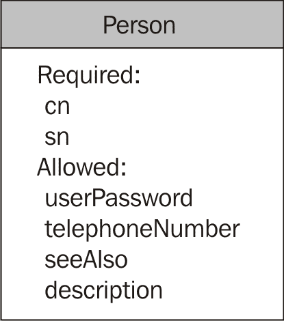
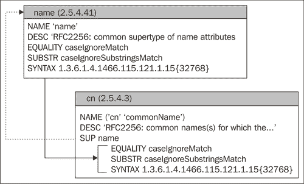
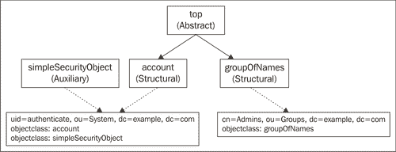
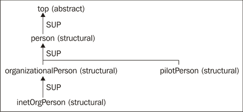

# 第六章：LDAP 架构

本章的重点将是 LDAP 架构。架构是描述可能存储在目录中的对象结构的标准方式。本章的前几节旨在提供架构的基本知识，解释架构的作用和工作原理——这是我们在本章后续部分使用和实现架构所需的基础知识。但我们将继续探讨一些更实际的主题，包括添加预定义架构和定义我们自己的自定义架构。

我们将从对架构的一般性检查开始。从那里，我们将深入探讨架构的层次结构。像目录信息树本身一样，架构也被组织成层次结构。接下来，我们将研究 OpenLDAP 中包括的一些基本架构。我们还将查看需要自己架构的两个覆盖。最后，我们将创建一个自定义架构，由一对新的对象类组成，每个类都有新的属性。本章我们将讨论的主要主题包括：

+   架构定义的基础

+   三种类型的对象类

+   在 OpenLDAP 中使用不同的架构

+   配置访问日志和密码策略覆盖

+   获取和使用对象标识符（OID）

+   手动创建新架构

# LDAP 架构简介

我们已经看过 OpenLDAP 中使用的各种属性和对象类。例如，我们使用 `person`、`organizationalPerson` 和 `inetOrgPerson` 对象类为用户创建了条目，并在此过程中使用了诸如 `cn`、`sn`、`uid`、`mail` 和 `userPassword` 等属性。我们还使用 `groupOfNames` 和 `groupOfUniqueNames` 对象类创建了组，并特别注意了 `member` 和 `uniqueMember` 属性。我们甚至简要地（在第三章中）看过用于描述文档和文档集合的对象类和属性（分别为 `document` 和 `documentCollection`）。

每个对象类和属性都有严格的定义。属性和对象类的定义被捆绑在一起，形成较大的集合，称为架构。OpenLDAP 应用程序使用这些架构来确定记录应该如何结构化，以及每个条目在层次结构中的位置。

## 为什么它们看起来如此复杂？

LDAP 架构有一个不好的声誉。它们被认为是复杂的、神秘的、超技术的，并且难以实现。本章的目标是克服这种看法。

尽管如此，这种声誉仍然是可以理解的。我认为，LDAP 架构中有几个方面对于新手来说是令人生畏的。

首先，LDAP 架构基于多代技术规范，这些规范来源于复杂的 X.500 系统。由于这种遗产，LDAP 架构频繁使用一些不特别适合人类理解的设备，例如像这样看起来的对象标识符：`1.3.6.1.4.1.1466.115.121.1.25`。然而，掌握一点背景知识就能克服这个障碍。

其次，LDAP 模式定义语言与 SQL 开发人员熟悉的定义语言（DDL）显著不同。这主要是由于后端数据库的性质不同。LDAP 不像关系型数据库那样固有地是表格化的，尽管它经常使用像继承这样的概念（在 SQL DDL 语言中是罕见的，尽管一些支持这种概念）。最后，虽然 SQL DDL 是以 SQL 命令的形式出现，但 LDAP 模式定义则是纯粹的描述性。

但是，LDAP 模式语言实际上相当简洁，通常只需要两个指令（`attributetype`和`objectclasstype`），每个指令有一些参数，就可以创建自定义模式。因此，学习曲线较短，到了本章结束时，你应该能够轻松创建自己的模式。

通常，模式是以纯文本文件形式编写并存储在 OpenLDAP 配置文件夹的子目录中。在 Ubuntu 中，这些文件位于`/etc/ldap/schema`。如果是从源代码构建，模式文件默认位于`/usr/local/etc/openldap/schema`。

SLAPD 不会自动使用模式目录中的所有模式。SLAPD 启动时，它只加载在`slapd.conf`文件中指定的模式。

### 注意

这个规则有一个例外：某些重要的 LDAP 模式组件，如`objectclass`，是硬编码到 OpenLDAP 中的，因为它们对服务器的操作至关重要。

通常，模式是通过`include`指令来包含的。在第二章中，我们在`slapd.conf`文件中包含了三个模式文件。文件顶部附近的 include 部分如下所示：

```
include /etc/ldap/schema/core.schema
include /etc/ldap/schema/cosine.schema
include /etc/ldap/schema/inetorgperson.schema
```

第一行导入核心模式，其中包含标准 LDAP 使用所必需的属性和对象类的模式。第二行导入了一些常用的对象类和属性，包括用于存储文档信息和 DNS 记录的属性。`inetorgperson.schema`文件包含了 inetOrgPerson 对象类定义及其相关的属性定义。

在接下来的章节中，我们将查看这些文件的格式，实现一些现有的模式，最后创建我们自己的模式。

## 模式定义

LDAP 模式用于正式定义属性、对象类和各种结构化目录信息树的规则。术语**模式**指的是一组（概念上相关的）模式定义。例如，`inetOrgPerson`模式包含`inetOrgPerson`对象类的定义，以及所有由`inetOrgPerson`对象类允许或要求的额外（非核心）属性。

**模式定义**是一种特殊类型的指令，用于提供关于如何构建 SLAPD 中某个特定实体的信息。可以在`slapd.conf`（或包含的模式定义）中包含四种不同类型的模式定义：

+   **对象类定义**：这定义了一个对象类，包括它的唯一标识符、名称以及它可能或必须具备的属性。

+   **属性定义**：这定义了一个属性，包括它的唯一标识符、名称或名称、允许作为值的内容类型规则，以及如何执行匹配操作。

+   **对象标识符**：这将一个字符串名称附加到唯一标识符。它主要用于加速创建模式。

+   **DIT 内容规则**：这指定了具有特定结构对象类的条目可以拥有的附加（辅助）对象类的规则。

除了这四种，还有其他不通常放置在模式中的模式定义。大多数这些是由 OpenLDAP 代码生成的。以下是每种的简要描述（更多信息请参见定义 LDAP 模式语言的 RFC 4512）：

+   **匹配规则定义**：这些定义了用于匹配操作的规则。搜索可以使用匹配规则（例如相等匹配和子串匹配）来查找特定的属性值。例如，`distinguishedNameMatch`匹配规则（唯一标识符为`2.5.13.1`）定义了用于精确匹配 DN 的匹配规则。该规则被像`member`（用于组成员）和`seeAlso`这样的属性使用。使用此规则进行搜索时，只有当属性值与给定的 DN 匹配时，才会返回成功的结果。任何属性的匹配规则决定了可以为该属性创建哪些索引。

+   **匹配规则使用**：这些将属性映射到匹配规则，通常由 SLAPD 动态创建。根据此定义，客户端可以判断某个特定的匹配规则适用于哪些属性。例如，它可以用来查找支持精确 DN 匹配的所有属性值（`distinguishedNameMatch`匹配规则）。匹配规则使用的模式定义（`matchingRuleUse`）包含一个唯一标识符、匹配规则名称以及该匹配规则适用的所有属性。

+   **LDAP 语法**：这些描述了允许用于属性值内容的语法。定义属性时，可以指定属性值的确切类型和语法。SLAPD 定义了多个支持的语法（`ldapSyntaxes`），包括 DN 结构的语法、二进制数据的语法、几种纯文本数据的语法等。当我们查看属性定义时，我们会进一步讨论支持的语法。

+   **结构规则**：这些定义了给定条目可以在目录信息树中位于何处。它基于条目的结构化对象类。结构化对象类和对象类层次结构将在后面的*对象类层次结构*部分进行讨论。

+   **名称格式**：这些指定了在条目的 DN 的 RDN 部分（基于条目的结构对象类）中可能或必须使用的属性。

SLAPD 通过代码构建架构的这一部分。例如，匹配规则的使用是基于现有的匹配规则以及哪些属性实现了这些匹配规则。像架构的其他部分一样，匹配规则、LDAP 语法、结构规则和名称格式都可以通过 LDAP 协议进行访问。有关更多信息，请参见*从 SLAPD 检索架构*部分。

目前，我们将主要关注可以包含在`slapd.conf`文件中的四个架构定义。特别是，我们将重点讨论如何创建新的对象类和属性。

## 对象类和属性

我们需要两种不同类型的架构定义，以便扩展我们的目录服务器将存储的信息类型：

+   **属性类型定义**：属性类型定义定义一个属性，包括该属性可能拥有的名称（例如，`cn`和`commonName`）、属性可能包含的值类型（数字、字符串、DN 等）、匹配值时使用的规则，以及该属性是否可以有多个值。

    每个属性可能要求其值或多个值由特定的字符或数据类型组成。例如，`description`属性允许长字符串字符，这使得可以将一句或两句信息作为描述字段的值。

+   **对象类定义**：对象类定义指定对象类的名称、必须拥有的属性、可拥有的属性以及它是何种类型的对象。

我们将逐一查看这些内容。首先，回顾一下在第三章中介绍的一个架构。以下是`person`对象类的图示：



`person`对象类有两个必需的属性（`cn`和`sn`），以及四个允许的但非必需的属性：`userPassword`、`telephoneNumber`、`seeAlso`和`description`。

一个新的`person`对象类记录（且没有其他对象类）可能如下所示：

```
dn: cn=Thomas Reid, dc=example,dc=com
objectclass: person
cn: Thomas Reid
sn: Reid
userPassword:: DSFSUYJKHGH=
telephoneNumber: 555-555-5555
seeAlso: uid=david,ou=users,dc=example,dc=com
description: A basic user.
```

该记录包含`person`对象类中的所有属性，并且仅包含这些属性。尝试添加架构中未提到的其他属性类型会导致错误。同样，试图删除`cn`或`sn`属性的所有值也会导致错误，因为这些属性是必需的。

那么，OpenLDAP 是如何知道哪些属性是必需的，哪些是允许的呢？这些信息存储在`person`对象类的架构定义中。

## 对象类定义

架构定义存储在`core.schema`（以及`core.ldif`）文件中，路径为`/etc/ldap/schema`（如果从源代码编译，则为`/usr/local/etc/openldap/schema`）。请查看以下内容：

```
objectclass 
  ( 
   2.5.6.6
   NAME 'person'
   DESC 'RFC4519: a person'
   SUP top STRUCTURAL
   MUST ( sn $ cn )
   MAY ( userPassword $ telephoneNumber $ seeAlso $ description ) 
  )
```

这是一个简单的对象类定义。它以描述符`objectclass`开头，告诉模式解释器正在创建什么类型的定义。其余部分被圆括号括起来。额外的空白字符，包括换行符，通常会被忽略（除非被引用的字符串包含其中），但请记住

由于`objectclass`是`slapd.conf`文件格式中的指令，因此除了第一行外，每一行必须以空白字符开头。

定义中的第一个字段是对象类的数字标识符：`2.5.6.6`。这个唯一标识符称为**对象标识符**（**OID**）。每个模式定义都有一个唯一的 OID，它将该定义与世界上任何其他定义区分开来。因为这个 OID 应是全球唯一的，所以为定义指定唯一标识符有一个官方程序。稍后会在章节中描述这一点。现在，值得注意的是，这些 OID 必须是全局唯一的。

任何 LDAP 应用程序都可以通过 OID 引用定义。对象类、属性、匹配规则以及许多其他 LDAP 实体都有 OID。

### 注意

根 DSE 记录是 LDAP 客户端如何根据服务器提供给客户端的 OID 了解服务器能力的一个好例子。请参阅附录 C 中的示例。

定义中的第二个字段是`NAME`字段。虽然 OID 易于计算机使用，但人类并不容易理解它。因此，除了 OID 外，还可以指定服务器唯一的名称（以字符字符串形式）。上面的对象类只有一个名称：`person`。一个对象类可以有多个名称，但通常一个名称就足够了。

在模式定义中，字符串名称应始终用单引号括起来。在字符串值的列表中，每个值必须用单引号括起，并且整个列表必须用圆括号括起来。例如，如果人员定义指定了两个名称，`person`和`humanBeing`，则`NAME`字段应如下所示：

```
NAME ( 'person' 'humanBeing' )
```

还请注意，`NAME`字段的值中不允许有空格，因此`'human` `being'`将是一个非法名称。

### 注意

在属性定义中，通常会给属性指定一个长名称和一个简称。例如，`cn`和`commonName`都是属性`2.5.4.3`的名称。

大多数时候，对象类和属性是通过`NAME`字段中的值来引用，而不是通过 OID。

### 注意

按惯例，由多个单词组成的名称通过大写每个单词的首字母来连接，首个单词除外。例如，`commonName`由两个单词组成：`common`和`name`，只有第二个单词的首字母大写。通常不会使用下划线、连字符或其他特殊字符来连接单词。因此，您不应使用像`common_name`或`common-name`这样的名称。

`DESC`字段是对该模式定义用途的简要描述。在此情况下，描述字段指的是 RFC（RFC 4519），该 RFC 详细解释了对象类。当然，并不需要为正式定义模式创建 RFC，但如果计划广泛分发该模式，编写 RFC 是一个好主意。

接下来的字段是`SUP`，即“上级”的缩写，指示该对象类的父对象类是什么。`person`对象类的父对象类是名为`top`的对象类。对象类像目录信息树一样按层次结构组织，`top`对象类位于对象类层次结构的顶端。`STRUCTURAL`关键字也与该模式定义如何适应模式层次结构相关。我们将在下一部分讨论模式层次结构。

最后两个字段比较简单。它们定义了`person`对象必须（`MUST`）包含的属性，以及该对象可以（`MAY`）包含的属性。

`MUST`和`MAY`字段的语法很简单。每个描述都包含一组属性：

```
MAY ( userPassword $ telephoneNumber $ seeAlso $ description )
```

属性值的列表（可以通过 OID 或属性名称指定）被括在圆括号内。值之间用美元符号（`$`）分隔。上面的例子表示，`userPassword`、`telephoneNumber`、`seeAlso`和`description`四个值是一个人对象可以具有的属性。

属性应该仅在两个列表中的一个中指定。无需将一个属性同时放入`MAY`和`MUST`列表。

当然，名称也可以用 OID 替代。因此，以下两行是等价的：

```
   MUST ( sn $ cn )
```

和

```
   MUST ( sn $ 2.5.4.3 )
```

`cn`属性的 OID 是`2.5.4.3`，无论使用哪个标识符都可以。

对象类定义中可能包含一些字段，但这些字段在前面的代码中没有出现。第一个是`OBSOLETE`关键字，它出现在`DESC`字段之后。这个关键字用于标记一个对象类已经过时，但仍然（暂时）支持。

第二部分是扩展部分，用于为模式提供特定于实现的扩展。在模式的末尾可以指定一个或多个扩展。扩展是一个关键字，后跟括号中的列表。默认情况下，OpenLDAP 的`schema/`目录中包含的所有模式都没有扩展。

总结来说，对象类定义以`objectclasstype`指令开始，可以包含以下字段：

+   一个唯一的 OID，用于标识该对象类（例如：`2.5.6.6`）。

+   一个`NAME`字段，带有一个唯一的名称（`NAME` `'person'`）。

+   一个`DESC`字段，用于简要描述该对象类的目的（`DESC` `'RFC4519:` `a` `person'`）。

+   如果该类已经过时并不应再使用，可以选择性地包含`OBSOLETE`标签。

+   `SUP`行表示此对象类的父类（上级）。此外，该行应指定对象类的类型（`STRUCTURAL`、`ABSTRACT`或`AUXILLIARY`）。例如：`SUP` `top` `STRUCTURAL`。抽象类没有上级。在定义抽象类时，可以省略`SUP`。

+   `MUST`字段列出必须为该对象类实例指定的属性。例如：`MUST` `(` `sn` `$` `cn` `)`。

+   `MAY`字段列出可以选择性地添加到此对象类记录中的属性。例如：`MAY` `(` `userPassword` `$` `telephoneNumber` `$` `seeAlso` `$` `description` `)`。

+   一个或多个扩展。

对象类定义是模式的重要部分，我们将在本章中多次回顾这些概念。在涵盖其他定义类型后，我们将详细研究对象类层次结构。在这个过程中，`SUP`行的作用将变得更加明确。

稍后我们将查看一些特定的对象类，并编写我们自己的自定义对象类。但在我们继续这些内容之前，我们将查看其他模式定义。接下来，我们将查看属性定义。

## 属性定义

我们现在检查的`person`对象类可以拥有六个不同的属性——两个必要的`sn`和`cn`属性，以及可选的`userPassword`、`telephoneNumber`、`seeAlso`和`description`属性。正如对象类在模式中被定义一样，每个属性也都有定义。属性定义的语法类似，但定义中允许的字段不同且更多。

`telephoneNumber`属性的模式定义是一个基本属性定义的好例子：

```
attributetype 
  ( 
   2.5.4.20
   NAME 'telephoneNumber'
   DESC 'RFC2256: Telephone Number'
   EQUALITY telephoneNumberMatch
   SUBSTR telephoneNumberSubstringsMatch
   SYNTAX 1.3.6.1.4.1.1466.115.121.1.50{32} 
  )
```

属性定义以`attributetype`指令开始。定义的其余部分被括号括起来。

定义中的第一个字段是此属性的唯一 OID。与所有 OID 一样，这个标识符必须是全局唯一的。OID `2.5.4.20` 应仅用于表示`telephoneNumber`属性。本章稍后，在*获取* *OID*一节中，我们将讨论如何获取和使用基本 OID。

OID 之后是`NAME`字段，用于将一个或多个名称与属性关联。

### 注意

在`NAME`字段中给出的名称通常被称为*属性* *描述*（请参见第三章中对搜索操作的讨论）。在讨论模式定义时，这个术语可能会令人混淆，因为属性模式定义中有一个描述字段，而该字段并不是属性描述。

属性通常有两个名称——一个长名称（例如`commonName`或`surname`）和一个缩写名称（分别为`cn`或`sn`）。当一个属性有多个名称时，名称列表应放在括号中。例如，考虑`fax`属性的`NAME`字段：

```
attributetype 
  ( 
   2.5.4.23
 NAME ( 'facsimileTelephoneNumber' 'fax' )
   DESC 'RFC2256: Facsimile (Fax) Telephone Number'
   SYNTAX 1.3.6.1.4.1.1466.115.121.1.22 
  )
```

请注意高亮行的语法。列表中的每个名称都用单引号（`'`）括起来，并且整个列表被括号包围。

### 注意

SLAPD 将通过第一个名称引用属性。因此，如果你搜索`fax`属性，SLAPD 会返回匹配的属性`facsimileTelephoneNumber`，而不是`fax`。

`DESC`字段提供了属性目的的简要描述。在`telephoneNumber`属性定义中，该字段的值为`'RFC2256:` `Telephone` `Number'`，表示该属性在 RFC 2256 中有定义。

定义属性时，一个重要的方面是指定应用程序应如何测试两个属性值是否匹配。`TEST`和`test`匹配吗？在某些情况下我们可能希望它们匹配，而在其他情况下则不希望它们匹配。`t*st`是否与`test`匹配？同样，在某些情况下，这是可以接受的，而在其他情况下则不是。

我们可以在属性定义中确定应使用哪些匹配规则来测试一个值是否匹配另一个值。当我们在第三章讨论搜索操作时，我们看到可以在搜索筛选器中使用四种不同的比较运算符：

+   相等运算符（`=`）

+   近似运算符（`~=`）

+   大于或等于运算符（`>=`）

+   小于或等于运算符：（`<=`）

除了这些，我们还考虑了使用正则表达式字符，如星号（`*`），来匹配属性值的部分或子字符串。这些行为在很大程度上由属性定义中的匹配规则决定。

当 LDAP 服务器处理比较操作（如绑定、比较和搜索操作）时，它会使用模式来确定如何处理这些比较。模式指定应使用哪些匹配规则。可以在模式中分配三种不同类型的匹配规则：

+   相等性规则，EQUALITY

+   排序规则，ORDERING

+   子字符串匹配规则，SUBSTRING

属性模式可以为这三种规则之一、两种或三种都指定规则。每个规则的值可以是 OID 或匹配规则的名称。在`telephoneNumber`模式中，使用了`EQUALITY`和`SUBSTRING`规则：

```
EQUALITY telephoneNumberMatch
SUBSTR telephoneNumberSubstringsMatch
```

当请求对电话号码进行相等性测试时，例如评估筛选器`(telephoneNumber=+1` `234` `567` `8901)`，会使用`telephoneNumberMatch`规则。请注意，`+`符号是电话号码的一部分，而不是运算符的一部分。如果筛选器包含通配符匹配，例如`(telephoneNumber=+1` `234` `567*)`，则会使用`telephoneNumberSubstringsMatch`规则。

### 注意

如果没有定义`ORDERING`规则，SLAPD 将不会处理`>=`或`<=`运算符的匹配测试。任何比较都会返回假。

这两种匹配规则如何执行呢？我们来看一个例子。当我们定义 UID 为`matt`的用户时，我们为该用户分配了电话号码。这里，我们将搜索该条目，只请求`telephoneNumber`属性：

```
 $ ldapsearch -LL -U matt '(uid=matt)' telephoneNumber

```

搜索结果如下：

```
SASL/DIGEST-MD5 authentication started
Please enter your password: 
SASL username: matt
SASL SSF: 128
SASL installing layers
version: 1

dn: uid=matt,ou=Users,dc=example,dc=com
telephoneNumber: +1 555 555 4321
```

`telephoneNumber`属性的值为`+1 555 555 4321`。现在让我们使用电话号码进行搜索：

```
 $ ldapsearch -LL -U matt '(telephoneNumber=+1 555 555 4321)' uid \
 telephoneNumber

```

搜索结果如下：

```
SASL/DIGEST-MD5 authentication started
Please enter your password: 
SASL username: matt
SASL SSF: 128
SASL installing layers
version: 1

dn: uid=matt,ou=Users,dc=example,dc=com
uid: matt
telephoneNumber: +1 555 555 4321
```

如预期的那样，使用准确的电话号码进行搜索返回了一个结果。这看起来与我们预期的字符串匹配规则没有什么不同。不过，使用架构中的特殊`telephoneNumberMatch`规则有一些优势。当使用此匹配规则时，SLAPD 会忽略某些电话号码格式化字符。下面是一个使用子字符串搜索的示例：

```
 $ ldapsearch -LL -U matt '(telephoneNumber=+1 555-555-43*)' uid \
 telephoneNumber

```

这是结果：

```
SASL/DIGEST-MD5 authentication started
Please enter your password: 
SASL username: matt
SASL SSF: 128
SASL installing layers
version: 1

dn: uid=matt,ou=Users,dc=example,dc=com
uid: matt
telephoneNumber: +1 555 555 4321
```

此示例中的过滤器使用了破折号（`-`），而之前的过滤器使用了空格。使用`telephoneNumberSubstringMatch`规则时，SLAPD 忽略了破折号。使用`telephoneNumberMatch`和`telephoneNumberSubstringMatch`规则时，`+15555554321`、`+1 555 555 4321`、`1-5-5-55554-3-2-1`和`+1 555-555-4321`这些号码都被视为相同的匹配项。

这说明了能够在架构中指定匹配规则的优点。对于`cn`、`sn`或`mail`（电子邮件地址）等属性，我们当然不希望破折号被当作空格字符来处理。我们也不希望`Dan`和`Forth`与`Danforth`匹配。但是，当匹配电话号码时，这显然是一个理想的功能。LDAP 对此问题的解决方案是为存储在属性中的信息类型分配适当的匹配规则。

### 注意

其他属性，如`homePhone`、`pagerTelephoneNumber`和`mobileTelephoneNumber`（都在`cosine.schema`中定义），也都使用`telephoneNumberMatch`和`telephoneNumberSubstringMatch`匹配规则。由于它们共享相同的格式，因此无需为每个属性分配不同的专用匹配规则。

### 注意

**匹配规则和索引**

一些后端，如 BDB 和 HDB，支持索引（使用`slapd.conf`中的`index`指令）。支持的索引由为属性定义的匹配规则决定。例如，具有相等匹配规则的属性可以拥有相等（`eq`）索引。同样，具有子字符串匹配规则的属性支持`sub`索引。

`telephoneNumber`匹配方案中的最后一个字段是`SYNTAX`字段。这与存储在`telephoneNumber`属性值中的数据类型和结构有关。

```
SYNTAX 1.3.6.1.4.1.1466.115.121.1.50{32}
```

`SYNTAX`参数的值有两个部分。第一个是 LDAP 语法的 OID（或名称），第二部分是用大括号（`{`和`}`）括起来的最大长度（通常是字符数）。长度说明符是可选的，服务器没有义务强制执行最大长度。

前面提到的 OID，`1.3.6.1.4.1.1466.115.121.1.50`，是电话号语法。这表明，`telephoneNumber`属性的实例的属性值应包含电话号码所需的字符（整数、破折号、空格等）。SLAPD 会拒绝包含字母和其他特殊字符的电话号码。稍后在本章的*创建* *模式*部分，我们将查看 OpenLDAP 支持的常见 LDAP 语法列表。

就复杂性而言，`telephoneNumber`属性属于中等水平。然而，许多属性定义要短得多，利用了在类似属性中设置的字段。因此，许多属性由于从其上级（父级）属性继承了大部分特性，仅具有 OID、`NAME`字段和`DESC`字段。广受欢迎的`cn`属性的模式定义如下：

```
attributetype 
  ( 
   2.5.4.3
   NAME ( 'cn' 'commonName' )
   DESC 'RFC2256: common name(s) for which the entity is known by'
   SUP name 
  )
```

在这种情况下，`SUP`名称字段表明`name`属性是`cn`属性的父属性。属性和对象类一样，可以按层次结构组织。上级属性是该属性的父级或原型，如果在模式定义中未指定某些属性，它们将从上级继承。例如，语法和匹配规则可以从父级继承。

在之前的示例中没有指定匹配规则和 LDAP 语法。因此，`cn`属性类型从其上级继承了这些值。`name`属性使用`caseIgnoreMatch` `EQUALITY`匹配规则和`caseIgnoreSubstringMatch` `SUBSTR`规则，并使用目录字符串 LDAP 语法（`1.3.6.1.4.1.1466.115.121.1.15`）。目录字符串是一个 UTF-8 编码的字符串，用于存储文本。

之前的示例中没有涉及的一些其他字段包括`OBSOLETE`、`SINGLE-VALUE`、`COLLECTIVE`、`NO-USER-MODIFICATION`、`USAGE`和扩展区。我们来简要看一下这些字段。

`OBSOLETE`标志通常出现在`DESC`字段后，在属性定义中与在对象类定义中起到相同的作用。它标记一个属性为过时。虽然过时的属性仍然受到支持，并且可以用于目录信息树中的记录，但它们应该被视为已弃用，并可能在未来的模式或软件版本中被移除。`OBSOLETE`不接受任何参数。

`SINGLE-VALUE`标志表示定义的属性只能有一个属性值。通常，一个属性可以有任意数量的值。但任何包含`SINGLE-VALUE`标志的属性，其值不能超过一个。我们在第三章和第四章中看到的域组件（`dc`）属性就是一个例子。拥有`dc`属性的对象只能为该属性分配一个值。`SINGLE-VALUE`不接受任何参数。

`COLLECTIVE` 标志表示该属性是一个集合属性。条目可以与集合属性一起分组，形成 **条目集合**。

集合在 OpenLDAP 中通过 `collect` 覆盖实现，该覆盖默认并未编译或安装，但可以在源代码的 `servers/slapd/overlays` 目录中找到。支持集合的模式在 OpenLDAP 分发版中也没有默认包含，必须从其他来源（如 RFC 3671）复制。

以下是条目集合如何工作的粗略示意：

1.  一个记录是集合记录，必须使用 `collectiveAttributeSubentry` 对象类。这将成为该集合属性的权威。所有其他下级记录都继承该属性（及其值），并且该属性作为每个记录的属性可见（但为只读）。有关集合的更多信息，请参见 RFC 3671（[`www.ietf.org/rfc/rfc3671.txt`](http://www.ietf.org/rfc/rfc3671.txt)）。

1.  `NO-USER-MODIFICATION` 标志用于表示该属性是一个操作性属性（由 SLAPD 或覆盖使用），不能被 LDAP 客户端修改。这通常不用于用户定义的模式。只有在编写自定义覆盖并使用其操作属性时，才使用该标志。

1.  `USAGE` 字段提供 SLAPD 该属性的使用信息。该字段有四个可能的值。前三个值 `directoryOperation`、`distributedOperation` 和 `dSAOperation` 表示 SLAPD 自身使用该属性。最后一个值 `userApplication` 是默认值，表示该属性主要用于客户端应用程序。由于大多数模式是为客户端应用程序设计的，因此默认值通常是所需的，`USAGE` 字段很少使用。

1.  最后，`attributetype` 定义还可以使用扩展，尽管在 OpenLDAP 中包含的主要模式中没有使用扩展。扩展的语法对于属性类型与对象类定义相同。

总结来说，属性模式定义以 `attributetype` 指令开始，后跟一个括号括起来的模式定义。属性定义中允许包含以下字段：

+   一个唯一的 OID 编号，这是必需的。例如：`2.5.4.15`。

+   一个 `NAME` 字段，包含该属性的一个或多个名称。例如：`NAME` `'businessCategory'`。

+   一个 `DESC` 字段，包含该属性类型的描述。例如：`DESC` `'RFC2256:` `business` `category'`。

+   如果属性已弃用，则有一个 `DEPRECATED` 标签。

+   一个 `SUP` 字段，包含上级属性类型的名称或 OID。例如：`SUP` `postalAddress`。

+   一个 `EQUALITY` 匹配规则的 OID 或名称。例如：`EQUALITY` `caseIgnoreMatch`。

+   一个 `ORDERING` 匹配规则的 OID 或名称。

+   一个 `SUBSTR` 匹配规则的 OID 或名称。例如：`SUBSTR` `caseIgnoreSubstringsMatch`。

+   一个带有 LDAP 语法 OID 和可选长度的 `SYNTAX` 字段。示例：`SYNTAX` `1.3.6.1.4.1.1466.115.121.1.15{128}`。

+   `SINGLE-VALUE` 标志，如果该属性只能有一个值。

+   `COLLECTIVE` 标志，如果该属性是一个集合属性。

+   `NO-USER-MODIFICATION` 标志，如果该属性是一个操作性属性，客户端应用程序不应能够修改它。

+   `USAGE` 字段，与四个关键字中的一个一起使用（`userApplication`、`directoryOperation`、`distributedOperation` 或 `dSAOperation`），用来指示该属性的用途。

+   属性定义所需的任何扩展。

到此为止，我们已经看过了对象类定义和属性定义。当创建自定义模式时，最可能需要使用的就是这两种类型的模式定义。

我们已经讨论了模式的基础知识，并在文本中看了一些例子。在本章的后面部分，我们将查看一些其他具体的示例。如果你想查看更多属性和对象类模式的示例，可以浏览 OpenLDAP 模式目录中的文件（`/etc/ldap/schema` 或 `/usr/local/etc/openldap/schema`）。最好的起点是 `core.schema` 模式，它定义了标准的 LDAPv3 模式。

### 注意

在阅读 `core.schema` 时，你可能会注意到一些非常重要的对象类和属性类型被注释掉了。为什么？因为它们包含在 **系统模式** 中，硬编码在 OpenLDAP 中。这个模式可以在 OpenLDAP 源代码中的 `slapd/schema_prep.c` 找到。

`cosine.schema` 文件包含了许多其他常用的模式，也是一个很好的参考地方。`inetOrgPerson.schema` 模式是一个很好的示例，展示了用户自定义模式文件的样子。或者，作为一个简短的用户自定义模式示例，可以查看 `openldap.schema`。

虽然 `attributetype` 和 `objectclass` 是模式创建中使用的两个主要指令，但还有一些其他指令，我们将在接下来的两节中简要介绍。

## 对象标识符定义

对象标识符指令（`objectidentifier`）是对标准定义语言的扩展。虽然它并没有为模式语言提供额外的功能，但它作为一个省时且人性化的工具，发挥着作用。

`objectidentifier` 指令用于为 OID 分配字符串别名。当 SLAPD 处理 `attributetype`、`objectclasstype` 和 `ditcontentrule` 指令中的 OID 字段时，如果遇到的是字符串而不是 OID，它会检查该字符串是否是 OID 的别名，如果是，它将使用 OID 的值。在上一节中我们检查的 `telephoneNumber` 模式就是一个很好的例子：

```
attributetype 
  ( 
   2.5.4.20
   NAME 'telephoneNumber'
   DESC 'RFC2256: Telephone Number'
   EQUALITY telephoneNumberMatch
   SUBSTR telephoneNumberSubstringsMatch
   SYNTAX 1.3.6.1.4.1.1466.115.121.1.50{32} 
  )
```

替代使用电话号平等和子串匹配规则的 OID（分别是`1.3.6.1.4.1.1466.115.121.1.50`和`1.3.6.1.4.1.1466.115.121.1.58`），schema 引用了匹配规则的名称：`telephoneNumberMatch`和`telephoneNumberSubstringMatch`。这种形式更容易让人类阅读。

`objectidentifier`指令使得为 OID 数字定义别名变得容易，可以是整个 OID 或部分 OID。以下是为 OID 分配名称的简单示例：

```
objectidentifier exampleComDemo 1.3.6.1.4.1.8254.1021.3.1
```

在 schema 的顶部使用类似的指令使得后续可以通过`exampleComDemo`来引用 OID。

### 注意

给定的 OID 是有效的，并且已经注册给作者。如果你正在开发自己的 LDAP schema，你应该注册你自己的 OID（请参见*获取 OID*部分）。虽然你可以在重新创建这些示例时使用这个 OID，但不要用它来编写你自己的扩展。否则，就无法确保这些 OID 在全球范围内的唯一性，这就违背了 OID 的目的。

例如，我们可以创建如下的 schema：

```
objectclass 
  (
   exampleComDemo
   NAME 'myPersonObjectClass'
   DESC 'My Person Object Class'
   SUP inetOrgPerson STRUCTURAL
  )
```

请注意，我们使用的是`exampleComDemo`别名，而不是使用该对象的 OID 号。但通常，我们不会为每个对象类分配一个别名。更方便的做法是别名化一个公共的根 OID，然后仅附加 OID 号的最后一部分。例如：

```
objectidentifier exampleComOC 1.3.6.1.4.1.8254.1021.1

objectclass 
  (
   exampleComOC:1
   NAME 'myPersonObjectClass'
   DESC 'My Person Object Class'
   SUP inetOrgPerson STRUCTURAL
  )
```

在这个示例中，我们使用了`objectidentifier`指令为 OID 基础创建了一个别名，所有我的对象类定义将使用这个基础。因此，当 SLAPD 遇到名称`exampleComOC`时，它会将其展开为`1.3.6.1.4.1.8254.1021.1`。`myPersonObjectClass`的对象类定义应该具有 OID `1.3.6.1.4.1.8254.1021.1.1`（注意末尾的额外`.1`）。我们使用`exampleComOC`别名，并附加一个冒号（`:`），然后加上对象类的数字后缀，而不是写出整个数字。

当 SLAPD 遇到`exampleComOC:1`时，它会将其展开为`1.3.6.1.4.1.8254.1021.1.1`。同样，如果我创建第二个对象类并使用所需的 OID `1.3.6.1.4.1.8254.1021.1.2`，我可以使用`exampleComOC:2`，而不必输入整个长的 OID。

### 注意

使用`objectidentifier`属性不仅可以减少打字量，还可以减少在容易出错的地方（且难以发现错误的地方）出现的拼写错误。

关于`objectidentifier`指令的更多示例，请参阅 OpenLDAP 的 schema 目录中的`openldap.schema`文件。

## DIT 内容规则

我们将要查看的最后一个 schema 指令是`ditcontentrule`指令，它用于创建**DIT 内容规则**。

### 注意

*DIT* 代表目录信息树（Directory Information Tree）。这是 LDAP 术语中一个常用的缩写。

DIT 内容规则标识特定的结构化对象类，并指示哪些辅助对象类可以（或不可以）包含在使用该对象类的条目中。

例如，我们可以使用第三章中介绍的一些对象类。在《LDIF 文件的结构》部分，我们创建了一个表示文档的条目。它实现了`document`对象类，其模式（位于`cosine.schema`中）如下所示：

```
objectclass 
  ( 
   0.9.2342.19200300.100.4.6 
   NAME 'document'
   SUP top 
   STRUCTURAL
   MUST documentIdentifier
   MAY ( commonName $ description $ seeAlso $ localityName $
         organizationName $ organizationalUnitName $
         documentTitle $ documentVersion $ documentAuthor $
         documentLocation $ documentPublisher )
  )
```

这是一个结构对象类。同样在第三章中，在《添加系统记录》部分，我们为`uid=authenticate,ou=System,dc=example,dc=com`添加了条目。该条目实现了`simpleSecurityObject`对象类。这里是`simpleSecurityObject`的模式：

```
objectclass 
  ( 
   0.9.2342.19200300.100.4.19 
   NAME 'simpleSecurityObject'
   DESC 'RFC1274: simple security object'
   SUP top 
   AUXILIARY
   MUST userPassword 
  )
```

这个对象类是一个辅助对象类，意味着它可以添加到已经具有结构对象类的条目中，结果是该条目现在可以使用辅助对象类的属性。

### 注意

有关不同类型对象类及其功能的更多讨论，请参见第三章中的讨论以及本章中的《对象类层次结构》部分。

根据默认的 OpenLDAP 设置，如果我们有一个使用`document`结构对象类的条目，我们可以通过向记录中添加`objectclass:` `simpleSecurityObject`，然后添加`userPassword`属性，来为该文档设置密码（用于绑定到目录）。这样，我们就能得到一个类似这样的记录：

```
dn: documentIdentifier=011,uid=david,ou=Users,dc=example,dc=com
documentIdentifier: 011
documentTitle: Treatise on Human Nature
userPassword:: c2VjcmV0
objectClass: document
objectClass: simpleSecurityObject
```

这个条目本质上是一个能够登录的文档！一个使用此记录的 DN 和正确密码的客户端可以以该文档身份登录。

也许在某些情况下这是可取的，但为了这个示例，我们假设这是我们不想允许的配置。

通常，关于哪些条目具有哪些对象类的决定是由外部应用程序来做的。但如果我们想确保没有应用程序能为`document`添加`userPassword`属性怎么办？

解决这个问题的最佳方法是创建一个 DIT 内容规则，禁止向任何具有`document`对象类的条目添加`userPassword`属性。这可以通过`ditcontentrule`指令来实现：

```
ditcontentrule 
  ( 
   0.9.2342.19200300.100.4.6 
   NAME 'noPWForDocs'
   DESC 'Do not allow passwords for documents'
   NOT userPassword
  )
```

`ditcontentrule`指令的格式现在应该很熟悉了。像`objectclass`和`attributetype`指令一样，这个指令将 DIT 内容规则定义包裹在括号内。

第一个字段是一个 OID。但与其他模式定义不同，这个 OID 并不是该定义的 OID。相反，它是我们目标的结构化对象类的 OID。

在这种情况下，OID `0.9.2342.19200300.100.4.6`是`document`对象类的 OID。你可以通过查看前面几页列出的文档模式，或者浏览 cosine 模式来验证这一点。

`NAME`字段应该包含用于引用此规则的唯一名称。在大多数情况下，该字段的值用于报告日志文件中对该规则的引用，并且用于客户端的响应中。

`DESC`字段包含该规则功能的简短文本描述。

`NOT`字段包含一组 OID 或属性名称，指定应该禁止的内容。名称`userPassword`来源于`userPassword`属性定义中的`NAME`字段。

有了这个内容规则，如果我们尝试将`userPassword`属性添加到文档中，会发生什么呢？以下是使用`ldapmodify`的一个示例：

```
$ ldapmodify -U matt
SASL/DIGEST-MD5 authentication started
Please enter your password: 
SASL username: matt
SASL SSF: 128
SASL installing layers

dn: documentIdentifier=011,uid=dave,ou=users,dc=example,dc=com
changetype: modify
add: objectclass
objectclass: simpleSecurityObject
-
add: userPassword
userPassword: secret
modifying entry 
       "documentIdentifier=011,uid=dave,ou=users,dc=example,dc=com"
ldap_modify: Object class violation (65)
        additional info: content rule 'noPWForDocs' precluded 
        attribute 'userPassword'
```

该示例中的高亮部分是尝试的修改。我们尝试将`simpleSecurityObject`对象类和`userPassword`属性添加到记录中。但服务器响应了一个**对象类违规**错误，并给出了以下原因：

```
content rule 'noPWForDocs' precluded attribute 'userPassword'
```

我们自定义的 DIT 内容规则成功地执行了它的任务——它阻止了将`userPassword`属性添加到`document`条目中。

我们上面创建的 DIT 内容规则是一个负面规则——它定义了条目*不能*拥有的属性。但是，`ditcontentrule`也可以用来创建正面规则：即指定允许哪些属性（或辅助对象类）的规则。

例如，我们可以编写一个规则，要求每个`inetOrgPerson`条目必须拥有`userPassword`属性：

```
ditcontentrule 
  (
   2.16.840.1.113730.3.2.2
   NAME 'reqPassword'
   DESC 'Require userPassword for inetOrgPerson'
   MUST userPassword
  )
```

该规则中使用的 OID 是`inetOrgPerson`对象类的 OID。`MUST`字段表示任何具有结构性对象类`inetOrgPerson`的条目必须设置`userPassword`属性。

由于此规则，尝试添加没有`userPassword`的`inetOrgPerson`条目将导致与我们之前看到的类似的错误：

```
$ ldapadd -U matt
SASL/DIGEST-MD5 authentication started
Please enter your password: 
SASL username: matt
SASL SSF: 128
SASL installing layers

dn: uid=Johann,ou=users,dc=example,dc=com
uid: johann
ou: users
cn: Johann Fichte
cn: Johann Gottlieb Fichte
sn: Fichte
givenName: Johann
objectclass: person
objectclass: organizationalPerson
objectclass: inetOrgPerson

adding new entry "uid=Johann,ou=users,dc=example,dc=com"
ldap_add: Object class violation (65)
        additional info: content rule 'reqPassword' requires attribute 'userPassword'
```

正在添加的记录（已高亮）是一个有效的`inetOrgPerson`条目，符合`inetOrgPerson`对象类定义。但由于 DIT 内容规则的限制，添加该记录失败，因为没有指定`userPassword`属性值。

现在让我们扩展这个规则，利用`AUX`字段。`AUX`字段可用来明确声明可以与此结构性对象类组合的辅助类。

在我们新修订的 DIT 内容规则中，我们将确保只有`pkiUser`和`labeledURIObject`辅助对象类可以添加到`inetOrgUser`记录中。

### 注意

`pkiUser`对象类是一个辅助对象类，用于指示条目能够执行**公钥基础设施**（**PKI**）安全事务。它有一个属性`userCertificate`，包含用户的加密证书。请参阅维基百科页面以快速了解 PKI：[`en.wikipedia.org/wiki/Public_key_infrastructure`](http://en.wikipedia.org/wiki/Public_key_infrastructure)。

`labeledURIObject`对象类允许添加一个额外的属性`labeledURI`，该属性接受一个 URI（如 URL）和一个纯文本描述：

```
labeledURI: http://aleph-null.tv Home Page
```

URI 与标签之间用空格分隔。因此，URI 是[`aleph-null.tv`](http://aleph-null.tv)，标签是`Home` `Page`。`labeledURIObject`在 RFC 2079 中定义（[`www.ietf.org/rfc/rfc2079.txt`](http://www.ietf.org/rfc/rfc2079.txt)）。

此外，我们将修改`NAME`和`DESC`元素，以反映我们规则现在做的不仅仅是要求`userPassword`。现在的 DIT 内容规则如下所示：

```
ditcontentrule 
  (
   2.16.840.1.113730.3.2.2
   NAME 'inetOrgPersonRules'
   DESC 'Restrictions for entries with inetOrgPerson object class'
   MUST userPassword
   AUX ( labeledURIObject $ pkiUser )
  )
```

请注意`AUX`字段的语法。要在字段中列出多个值，必须将值列表（用美元符号`$`分隔）括在括号中。

使用此 DIT 内容规则，我们可以成功地将一个 URL（使用`labeledURIObject`辅助对象类）添加到我的记录中：

```
$ ldapmodify -U matt
SASL/DIGEST-MD5 authentication started
Please enter your password: 
SASL username: matt
SASL SSF: 128
SASL installing layers

dn: uid=matt,ou=users,dc=example,dc=com
changetype: modify
add: objectclass
objectclass: labeledURIObject
-
add: labeledURI
labeledURI: http://aleph-null.tv Home Page

modifying entry "uid=matt,ou=users,dc=example,dc=com"
```

上面突出显示的条目已成功添加，因为`labeledURIObject`（允许`labeledURI`属性）是内容规则所允许的。但如果我尝试添加一个不同的辅助对象类——一个在 DIT 内容规则中没有明确允许的类——更改请求将被拒绝：

```
$ ldapmodify -U matt
SASL/DIGEST-MD5 authentication started
Please enter your password: 
SASL username: matt
SASL SSF: 128
SASL installing layers

dn: uid=matt,ou=users,dc=example,dc=com
changetype: modify
add: objectclass
objectclass: userSecurityInformation

modifying entry "uid=matt,ou=users,dc=example,dc=com"
ldap_modify: Object class violation (65)
        additional info: content rule 'inetOrgPersonRules' does not 
        allow class 'userSecurityInformation'
```

DIT 内容规则阻止了添加辅助对象类，因为此类未在规则的`AUX`字段中指定。

与其他定义一样，`ditcontentrule`指令也允许`OBSOLETE`标志。

总结来说，`ditcontentrule`指令采用一个括号括起来的 DIT 内容规则定义。支持以下字段：

+   适用于此规则的结构对象类的 OID。

+   `NAME`字段，提供用于标识规则的简短名称。

+   `DESC`字段，其中包含规则的描述。

+   `OBSOLETE`标志，用于标记该规则为过时。

+   `AUX`字段，其中包含所有允许此对象类条目实现的辅助类的名称或 OID。

+   `MUST`字段，其中包含此对象类条目必须拥有的所有（尚未强制要求的）属性的列表。

+   `MAY`字段，其中列出此对象类成员可能拥有的所有字段。自 OpenLDAP 2.3.30 起，这不是排他性的。未在此列表中的属性但被对象类模式定义允许的，仍然允许。换句话说，`MAY`并不施加任何限制。

+   `NOT`字段，其中包含此对象类条目不能拥有的属性的列表。不能应用于对象类模式定义所要求的属性。

现在，我们已经了解了`slapd.conf`文件（或包含文件）中允许的四种不同的模式定义指令。通过这些信息，你应该能够阅读并理解 OpenLDAP 中定义的任何模式。

接下来，我们将简要了解如何使用 LDAP 协议从 SLAPD 服务器获取模式信息。

## 从 SLAPD 检索模式

当 SLAPD 加载模式时，它将它们存储在目录信息树的一个特殊部分，与 Root DSE 记录一起；一个特殊条目保存模式信息。拥有这些信息对调试很有用，但更重要的是，它为客户端应用程序提供了一种了解此目录服务器中可能存储的对象和属性类型的方式。

从目录中获取信息就像执行一个`ldapsearch`命令一样简单。

架构信息存储在一个特殊的记录中，称为**subschema subentry**。你可以使用`ldapsearch`访问 subschema subentry：

```
 $ ldapsearch -U matt -b 'cn=subschema' -s base +

```

### 注意

对`cn=subschema`记录的访问受全局 ACL（在数据库部分之前出现的 ACL）管理。例如，为了仅允许用户访问 subschema，你可以使用这样的规则：`access` `to` `dn.exact="cn=subschema"` `by` `users` `read`。

这将从服务器中检索整个架构规范，包括不仅仅是属性和对象类定义，还包括匹配规则、匹配规则使用、结构规则、名称格式和 LDAP 语法的定义。

但是，与 LDAP 服务器中的任何其他记录一样，我们可以使用搜索过滤器仅获取特定属性的值。例如，我们可以找出所有现有的 DIT 内容规则：

```
$ ldapsearch -LL -U matt -b 'cn=subschema' -s base ditcontentrules
SASL/DIGEST-MD5 authentication started
Please enter your password: 
SASL username: matt
SASL SSF: 128
SASL installing layers
version: 1

dn: cn=Subschema
dITContentRules: ( 0.9.2342.19200300.100.4.6 NAME 'noPWForDocs' DESC
       'Do not allow passwords for documents' NOT userPassword )
dITContentRules: ( 2.16.840.1.113730.3.2.2 NAME 'inetOrgPersonRules'
      DESC 'Restrictions for inetOrgPerson object class.'
      AUX ( labeledURIObject $ pkiUser )
      MUST userPassword )
```

此搜索将返回当前包含在此服务器架构定义中的所有 DIT 内容规则。当然，唯一的两个规则就是我们在上一节中创建的规则。

以下与架构相关的属性包含在`cn=Subschema`记录中：

+   `ldapSyntaxes`：此属性为目录中每种支持的 LDAP 语法提供一个值。示例：`ldapSyntaxes:` `(` `1.3.6.1.1.16.1` `DESC` `'UUID'` `)`。

+   `matchingRules`：此属性为目录中的每个匹配规则提供一个值。示例：`matchingRules:` `(` `2.5.13.14` `NAME` `'integerMatch'` `SYNTAX` `1.3.6.1.4.1.1466.115.121.1.27` `)`。

+   `matchingRuleUse`：此属性为每个匹配规则使用提供一个值，该值将匹配规则 OID 与实施该匹配规则的所有属性列表配对。示例：`matchingRuleUse:` `(` `2.5.13.27` `NAME` `'generalizedTimeMatch'` `APPLIES` `(` `createTimestamp` `$` `modifyTimestamp` `)` `)`。

+   `attributeTypes`：此属性为目录中每个属性定义提供一个值。示例：`attributeTypes:` `(` `2.5.4.3` `NAME` `(` `'cn'` `'commonName'` `)` `DESC` `'RFC2256:` `common` `name(s)` `for` `which` `the` `entity` `is` `known` `by'` `SUP` `name` `)`。

+   `objectClasses`：此属性包含每个对象类定义的一个值。示例：`objectClasses:` `(` `2.5.6.2` `NAME` `'country'` `DESC` `'RFC2256:` `a` `country'` `SUP` `top` `STRUCTURAL` `MUST` `c` `MAY` `(` `searchGuide` `$` `description` `)` `)`。

+   `dITContentRules`：此属性包含每个已定义 DIT 内容规则的一个值。

其他标准属性，如`cn`、`objectclass`以及基本操作属性，也是记录的一部分。

以这种方式检查架构是另一种替代直接读取架构文件的方法。虽然它的文档较少（因为没有注释），但使用过滤器仍然是有帮助的。此外，不在标准架构中的信息（例如操作属性的架构定义）也可以在此记录中找到。

在本章的后面，我们将开始在 SLAPD 中实现架构，首先包括一些已编写好的架构，然后编写我们自己的架构。但接下来我们将快速浏览架构的另一个理论组成部分：架构层次结构。

# 对象类层次结构

LDAP 中的对象类和属性可以组织成层次关系。层次关系是指一个实体与一个或多个下属实体之间存在父级或上级关系。

属性层次结构通常很简单，只需要简短的解释。另一方面，对象类则使用更为复杂的层次模型，并将在本章中成为焦点。

在属性和对象类层次结构的案例中，创建层次结构的机制是架构定义。属性和对象类的架构定义都使用`SUP`字段来表示与父级或上级的关系。

我们将从简短的属性层次结构讨论开始，然后转向更复杂的对象类层次结构。

## 属性层次结构

属性层次结构是简单的关系，其中一个属性可以通过其与另一个属性的从属关系，继承某些特征，例如匹配规则和 LDAP 语法。

属性层次结构的简单性表现为几个方面：

+   并没有要求属性与其他属性有任何关系。换句话说，并没有要求属性必须属于某个层次结构。许多属性，比如我们在前一部分中看到的`telephoneNumber`属性，是独立存在的。

+   属性层次结构在属性的使用中并没有发挥重要作用。属性层次结构主要存在是为了保持属性架构定义的简洁和清晰，减少重复。

`name`属性通常不直接用于任何对象类，它是属性定义中使用上级/下级关系的一个很好例子。核心架构中有十三个属性将`name`作为它们的上级。`cn`属性就是一个例子。



`cn`的架构定义只使用了`NAME`、`DESC`和`SUP`字段，其中`SUP`表示`name`属性是`cn`的上级。

由于`cn`属性定义没有指定任何匹配规则或 LDAP 语法，因此这些规则是从`name`属性继承的。因此，`cn`继承了在`name`中定义的相等性和子字符串匹配规则，以及 LDAP 语法和长度。

但是，属性层次结构可以做的事情并不多。除了匹配规则和语法外，其他内容不会自动从上级继承，并且使用属性层次结构没有其他好处。

### 下属属性与搜索

从属性层级中会产生一个有趣的效果。请求一个上级属性时，可能会返回作为匹配项的下级属性。例如，下面是一个仅请求一个属性的搜索：`name`：

```
$ ldapsearch -LL -U matt '(uid=matt)' name
SASL/DIGEST-MD5 authentication started
Please enter your password: 
SASL username: matt
SASL SSF: 128
SASL installing layers
version: 1

dn: uid=matt,ou=Users,dc=example,dc=com
ou: Users
cn: Matt Butcher
sn: Butcher
givenName: Matt
givenName: Matthew
title: Systems Integrator
st: Illinois
l: Chicago

```

根据搜索参数，搜索应返回`uid=matt`的记录中的任何`name`属性值。但返回的记录（已高亮显示）包含的不止这些。除了总是返回的 DN，记录中还包含了`ou`、`cn`、`sn`、`givenName`、`title`、`st`和`l`等值。

为什么会这样呢？这仅仅是因为所有这些属性类型都有`name`作为上级属性。

这种行为也会扩展到搜索过滤器行为中。例如，一个搜索过滤器（如`(name=Marcus)`）将会对所有使用`name`作为上级属性的属性进行搜索：

```
$ ldapsearch -LL -U matt '(name=Marcus)'
SASL/DIGEST-MD5 authentication started
Please enter your password: 
SASL username: matt
SASL SSF: 128
SASL installing layers
version: 1

dn: uid=cicero,ou=Users,dc=example,dc=com
uid: marcus
uid: cicero
sn: Tullius
cn: Marcus Tullius
givenName: Marcus
ou: users
objectClass: person
objectClass: organizationalPerson
objectClass: inetOrgPerson
```

`uid=cicero`的记录匹配是因为`givenName`字段的值为`Marcus`。正如在属性类型定义中所看到的，`givenName`属性的上级属性类型是`name`：

```
attributetype ( 2.5.4.42 NAME ( 'givenName' 'gn' )
    DESC 'RFC2256: first name(s) for which the entity is known by'
    SUP name 
```

尽管这一特性可能会对不熟悉架构的人造成一些意外行为，但有时它也非常有用。

大部分情况下，属性层级相对简单。然而，对象类层级要复杂得多。接下来，我们将对其进行详细探讨。

## 对象类类型：抽象、结构化和辅助

像属性一样，对象类也可以组织成层级结构。通常情况下，会有一个主要的对象类层级。但尽管对象类的层级组织在目录结构中发挥着重要作用，并非所有的对象类都属于这个层级结构。要理解为什么会这样，我们必须首先检查不同类型的对象类。

有三种类型的对象类：抽象、结构化和辅助，如下所示：

+   **抽象对象类**位于对象类层级的顶部。它可以为所有位于其下层级的对象类设置所需和允许的属性，但没有记录仅能是该对象类的实例。此外，任何抽象对象类的父类也必须是抽象的。

+   **结构化对象类**也在层级中占有一席之地，并且是另一个结构化对象类或抽象对象类的子类（或者换句话说，它继承自其他结构化对象类或抽象对象类）。目录中的一项条目是结构化对象类的一个实例。当一个结构化对象类是另一个结构化对象类的子类时，父类会被视作抽象类。因此，从操作角度讲，对于任何给定的记录，它只有一个结构化对象类——结构化对象类在对象类层级中是最低的。

+   **辅助对象类**不要求成为对象类层次结构的一部分，尽管它可以是。辅助对象类旨在为已经具有结构对象类的记录定义额外的属性。例如，一个描述系统账户的记录可能不在层次结构中的人员部分，但仍然可能需要一个密码。`simpleSecurityObject` 是一个辅助对象类，可以添加到其他结构对象类中，以允许（并且实际上要求）设置 `userPassword` 属性。

抽象和结构对象类被组织成一个层次结构，抽象类位于最上层，结构对象类是它们的下级。在核心模式（`core.schema`）中，只有一个抽象对象类：`top`。这个对象类标志着对象类层次结构的顶端——所有对象类的祖先（最高的上级）。

### 对象类层次结构：概述

层次结构从抽象对象类 `top` 开始。它下面有任意数量的结构对象类，所有这些类都是直接或间接的下级。直接下级是指在模式定义的 `SUP` 字段中列出 `top` 作为其上级对象类的类。间接下级则在对象类层次结构的更深层次，它列出了另一个抽象或结构对象类作为其上级，但该上级要么自身将 `top` 作为上级，要么引用另一个间接下级。

### 注意

在其他 LDAP 参考中，超级类有时称为 **超类**，而上级属性（在属性层次结构中）称为 **超类型**。同样，**子类** 和 **子类型** 这两个术语可以用来表示类和属性中的从属关系。

结构对象类的上级可以是抽象对象类，也可以是另一个结构对象类。

辅助对象类可能在对象类层次结构中，也可能不在。它们可以有上级，但不要求一定有。

这里是一个简单的对象类层次结构的示意图（由四个对象类组成），以及我们在第三章中创建的目录信息树中的一对记录：



`account` 和 `groupOfNames` 结构对象类都将 `top` 列为它们的上级（如实线所示）。`simpleSecurityObject`，作为一个辅助对象类，则没有上级。

在对象类层次结构下方有两个记录，显示了 DN 和对象类属性。虚线表示这些条目所实现的模式。两个记录（`uid=authenticate` 用户和 `cn=Admins` 组）与对象类层次结构的不同部分相关。`cn=Admins` 是一个 `groupOfNames`，而 `uid=authenticate` 是一个账户，也具有 `simpleSecurityObject` 的属性。

这种对象类层次结构的表示方式旨在展示模式的组织结构与目录中的条目之间的关系。

需要牢记的是，这里有两个不同的层次结构。上面的两个条目属于目录信息树层次结构。它们在该层次结构中的位置由其 DN 表示。例如，`uid=authenticate`条目是`ou=System`条目的子条目，而`ou=System`条目又是`dc=example,dc=com`条目（我们目录信息树的根条目）的子条目。

但通过它们的对象类，条目也可以与对象类层次结构相关联，如图所示。目前，我们只对第二个层次结构——对象类层次结构感兴趣。

让我们看看这三种对象类类型。理解它们之间的区别，以及每种类型所扮演的角色，将有助于阐明对象类层次结构中的概念。

### 抽象类

我们将要检查的三种类型中的第一种是**抽象类**。尽管抽象类的使用较为罕见，但它们在对象类层次结构的开发中起着重要作用。

我们已经讨论过特殊的`top`对象类。最常用的 LDAP 模式除了`top`之外不会使用任何其他抽象对象类。`top`对象类的定义如下：

```
objectclass 
  ( 
   2.5.6.0
   NAME 'top'
   DESC 'RFC2256: top of the superclass chain'
   ABSTRACT
   MUST objectClass
  )
```

它只需要一个属性：`objectclass`。所有结构化对象类都应该与`top`相关联，无论是直接还是间接。而任何抽象对象类，如果其下有结构化对象类，则必须与`top`相关联。虽然可以创建没有父类的抽象类，实际上启动一个新的对象类树，但这通常不这么做。

### 提示

**没有父类的抽象类**

定义没有父类的抽象类的主要情况是，所有从该抽象类继承的类都将是辅助对象类。根据 RFC 4512，结构化对象类必须与`top`对象类（直接或间接）相关联。

但`top`并不是唯一常用的抽象对象类。OpenLDAP 中包含了一些常见的模式，特别是`java.schema`和`corba.schema`，它们使用了抽象对象类，而这些类的父类是`top`。如果一个抽象对象类有父类，它必须是一个抽象父类。

抽象对象类可以在其定义的`MUST`和`MAY`字段中列出属性。正如我们刚刚看到的，`top`对象类要求有`objectclass`属性。任何实现了结构化对象类且隶属于这个抽象对象类的条目，都会继承父类的`MUST`和`MAY`约束。

例如，在`java.schema`中，`javaObject`类是抽象的。以下是其定义：

```
objectclass 
  ( 
   1.3.6.1.4.1.42.2.27.4.2.4
   NAME 'javaObject'
   DESC 'Java object representation'
   SUP top
   ABSTRACT
   MUST javaClassName
   MAY ( javaClassNames $ javaCodebase $
         javaDoc $ description ) 
  )
```

根据`SUP`字段，该对象类从属于`top`。它要求任何实现了`javaObject`的记录必须具有`javaClassName`属性。它还定义了几个属性——`javaClassNames`、`javaCodebase`、`javaDoc`和`description`——记录可以包含这些属性。

### 注意

Java 架构用于在目录服务器中存储序列化的 Java 对象。它在 RFC 2713 中进行了定义。

`javaObject`没有从属的结构性对象类。然而，有几个从属于`javaObject`的辅助对象类：`javaSerializedObject`和`javaMarshalledObject`。以下是`javaSerializedObject`架构的定义：

```
objectclass 
  ( 
   1.3.6.1.4.1.42.2.27.4.2.5
   NAME 'javaSerializedObject'
   DESC 'Java serialized object'
   SUP javaObject
   AUXILIARY
   MUST javaSerializedData 
  )
```

在这个类中只需要一个属性：`javaSerializedData`。在这个定义中没有指定可选属性。

如果某个记录使用了`javaSerializedData`对象类，它*必须*具有哪些字段？它*可以*具有哪些字段？

它必须具有`javaSerializedData`属性。我们可以从`javaSerializedObject`架构中看到这一点。但它还必须具有`javaClassName`属性，因为这是在上级`javaObject`对象类中要求的。而`javaSerializedData`记录可以包含`javaObject`架构中`MAY`字段列出的任何属性：`javaClassNames`、`javaCodebase`、`javaDoc`和`description`。

这个例子说明了如何使用抽象对象类作为将对象类组织成层次结构的一种方式，将类似的对象类（这里是`javaSerializedObject`和`javaMarshalledObject`）归类于一个共同的（更加通用的）祖先`javaObject`。然后，`javaObject`抽象对象类被用来指定这两个从属对象类需要包含的公共属性。

因此，抽象对象类的主要用途之一是收集应当（或可以）包含在定义为从属的对象类中的公共属性。

抽象类是罕见的。相比之下，最常用的对象类类型是结构性对象类。

### 结构性对象类

正如我们在多个示例中看到的，每个记录都有一个 DN 和一个或多个对象类。从这些对象类出发，记录的其他属性取决于对象类。然而，记录可以拥有哪些对象类是有限制的。决定记录可以有哪些对象类的一个主要因素是结构性对象类的层次结构。

目录中的每个记录必须至少有一个结构性对象类。结构性对象类决定了记录的类型。例如，具有结构性对象类`organization`的记录是一个`organization`记录。

### 注意

一旦记录在目录中创建，其结构性对象类就无法更改。可以添加或移除辅助对象类，但结构性对象类是不可更改的（*ipso* *facto*，同样，优先级对象类的链条也是如此）。

一个条目可以实现多个对象类，并且它实现的所有对象类并不一定都是结构性对象类。我们来看一下我们在第三章创建的组织记录：

```
dn: dc=example,dc=com
description: Example.Com, your trusted non-existent corporation.
dc: example
o: Example.Com
objectClass: top
objectClass: dcObject
objectClass: organization
```

这个条目有三个对象类：

+   `top`—一个抽象对象类

+   `dcObject`—一个辅助对象类

+   `organization`—一个结构性对象类

### 注意

`top`对象类在此条目中并非严格必要。SLAPD 会隐式地将`top`包括在所有条目中，因为所有结构性对象类都源自它。

我们如何知道哪些对象类属于哪种类型？这些对象类的模式定义是此类信息的主要来源。

结构性对象类将该条目定位在对象类的层级结构中，这个层级由抽象对象类和结构性对象类组成。

一个条目可以有多个结构性对象类，只要它们之间存在上级/下级关系。

在一个记录中有多个结构性对象类的情况下，最下级的对象类（距离根对象类`top`最远的那个）将具有所有其他结构性对象类作为祖先。也就是说，对于对象类层级中距离`top`最远的对象类，所有其他结构性对象类必须是它的上级。然后，这个最下级的对象类将被视为结构性对象类。

例如，在第三章中我们为用户`barbara`创建了一个记录：

```
dn: uid=barbara,ou=Users,dc=example,dc=com
ou: Users
uid: barbara
sn: Jensen
cn: Barbara Jensen
givenName: Barbara
displayName: Barbara Jensen
mail: barbara@example.com
userPassword: secret
objectClass: person
objectClass: organizationalPerson
objectClass: inetOrgPerson
```

这个用户属于四个对象类。前三个对象类在之前已经明确提到：`person`、`organizationalPerson`和`inetOrgPerson`。这三者恰好都是结构性对象类。第四个对象类是`top`，它是隐式包含的。

这四个对象类在层级结构中是相关的。`top`抽象对象类位于对象类层级的顶端。`person`对象类直接从属于`top`。也就是说，`person`对象类的定义将`top`列为其父类：

```
 objectclass 
  ( 
   2.5.6.6
   NAME 'person'
   DESC 'RFC2256: a person'
 SUP top 
   STRUCTURAL
   MUST ( sn $ cn )
   MAY ( userPassword $ telephoneNumber $ seeAlso $ description ) 
  )
```

虽然`person`指向`top`作为它的上级，`organizationalPerson`指向`person`，而`inetOrgPerson`指向`organizationalPerson`作为它的上级。因此，我们得到了一个对象类的层级结构：



因此，根据这个层级结构，任何作为`inetOrgPerson`的条目必须遵守其所有上级定义：`organizationalPerson`、`person`和`top`。这些对象类的任何必需属性都将是`inetOrgPerson`条目的必需属性，任何这些类的可选属性对于`inetOrgPerson`条目来说是可选的。

因此，`inetOrgPerson`的必需字段是`sn`和`cn`，这两个字段分别来自`person`对象类，`objectclass`属性来自`top`。

### 注意

有关`inetOrgPerson`所需和允许的字段的完整列表，请参见第三章中*添加* *用户* *记录*的子节。

在前面的图中，还包括了`pilotPerson`对象类，它表示层次结构的另一个分支。与`organizationalPerson`和`inetOrgPerson`一样，`pilotPerson`描述了组织中的一个人，但它包含了一些`organizationalPerson`和`inetOrgPerson`中没有的属性，包括`favouriteDrink`和`janetMailBox`属性。

虽然`pilotPerson`并未正式废弃，但它通常不被使用；通常使用的是`inetOrgPerson`。但是，像`organizationalPerson`一样，`pilotPerson`将`person`列为其上级。因此，它继承了`person`和`top`的属性。然而，它与`organizationalPerson`或`inetOrgPerson`没有直接或间接关系，因此不会继承它们的任何属性。

因为`pilotPerson`与`organizationalPerson`或`inetOrgPerson`没有关系，并且这些都是结构化对象类，SLAPD 不允许任何记录实现`pilotPerson`对象类与`organizationalPerson`或其子类的组合。例如，如果我们尝试添加包含所有四个描述人的对象类的记录，我们会得到一个错误：

```
$ ldapadd -U matt
SASL/DIGEST-MD5 authentication started
Please enter your password: 
SASL username: matt
SASL SSF: 128
SASL installing layers

dn: uid=charles,ou=users,dc=example,dc=com
uid: charles
ou: users
cn: Charles Sanders Peirce
sn: Peirce
gn: Charles
objectclass: person
objectclass: organizationalPerson
objectclass: inetOrgPerson
objectclass: pilotPerson

adding new entry "uid=charles,ou=users,dc=example,dc=com"
ldap_add: Object class violation (65)
        additional info: invalid structural object class chain 
        (inetOrgPerson/pilotPerson)
```

当客户端请求添加上述记录时，SLAPD 会返回**对象类违规**错误，表明对象类链不正确。这是因为`pilotPerson`与`organizationalPerson`或`inetOrgPerson`没有关系。

回到我们的`uid=barbara`记录，该条目列出了三个对象类：

```
objectClass: person
objectClass: organizationalPerson
objectClass: inetOrgPerson
```

正如我们在前面的图中看到的，`inetOrgPerson`是层次结构中最低的对象类——最远离`top`的对象类。这意味着 SLAPD 将此对象类视为记录的结构化对象类。它甚至设置了一个特殊的操作属性`structuralObjectClass`，用来存储此值。因此，你可以通过`ldapsearch`获取有关结构化对象类的信息：

```
 $ ldapsearch -LL -U matt '(uid=barbara)' structuralObjectClass
```

以下是相关信息：

```
SASL/DIGEST-MD5 authentication started
Please enter your password: 
SASL username: matt
SASL SSF: 128
SASL installing layers
version: 1

dn: uid=barbara,ou=Users,dc=example,dc=com
structuralObjectClass: inetOrgPerson
```

在处理操作和评估规则时，如 DIT 内容规则，SLAPD 会将此记录视为`inetOrgPerson`记录。

在本讨论中，我们已经涵盖了对象类层次结构的要点。一个条目在层次结构中的位置由其结构化对象类决定。但并非所有对象类都会影响记录在对象类层次结构中的位置。让我们来看看第三种类型的对象类：辅助对象类。

### 辅助对象类

辅助对象类提供了一种机制，可以向具有现有结构化对象类的条目添加一个或多个属性。可以将其视为一种模块化系统，用于定义一组相关的属性集合，这些属性可以附加到其他（在概念上）不相关的对象类。

为了更好地理解其工作原理，我们再看一遍`uid=authenticate`条目：

```
dn: uid=authenticate,ou=System,dc=example,dc=com
uid: authenticate
ou: System
description: Special account for authenticating users
userPassword:: c2VjcmV0
objectClass: account
objectClass: simpleSecurityObject
```

该条目的结构化对象类是`account`。`simpleSecurityObject`对象类是辅助对象类。

`account`模式，位于`cosine.schema`中，类似于：

```
objectclass 
  ( 
   0.9.2342.19200300.100.4.5 
   NAME 'account'
   SUP top STRUCTURAL
   MUST userid
   MAY ( description $ seeAlso $ localityName $
         organizationName $ organizationalUnitName $ host )
  )
```

根据 COSINE 标准（RFC 4524），此条目用于在计算机上定义一个系统账户。

无论出于什么原因，标准的创建者没有包括赋予账户密码所需的属性。这是有道理的。系统账户通常不需要通过 LDAP 进行身份验证。然而，我们创建的系统账户需要执行目录操作，因此我们需要该账户具有`userPassword`属性。

一种实现方法是创建一个新的结构化对象类，作为账户的下级，但需要一个`userPassword`属性。但在`core.schema`中也有一个专门用于给目录中的非个人条目提供`userPassword`以便允许它们绑定的对象类。换句话说，已经存在一个提供我们所需功能的对象类：`simpleSecurityObject`对象类。

### 注意

`simpleSecurityObject`也在 COSINE 模式中定义。

`simpleSecurityObject`模式定义如下：

```
objectclass 
  ( 
   0.9.2342.19200300.100.4.19 
   NAME 'simpleSecurityObject'
   DESC 'RFC1274: simple security object'
   SUP top 
   AUXILIARY
   MUST userPassword 
  )

```

这个模式定义向任何实现的条目添加了一个必需的属性：`userPassword`。因此，`simpleSecurityObject`对象类可以添加到条目中，以允许它绑定到目录（假设 ACLs 允许）。

结合`account`结构化对象类和`simpleSecurityObject`辅助对象类，我们的`uid=authenticate`记录现在有三个必需字段：

+   `objectclass`，继承自`top`

+   `uid`，来自`account`结构化对象类

+   `userPassword`，来自`simpleSecurityObject`辅助对象类。

这个例子说明了如何使用辅助对象类向已经属于结构化对象类的条目添加额外的属性。

与其为每组属性创建新的结构化对象类，不如使用辅助对象类机制，它可以定义一个模块化的附加属性集合，根据需要将这些属性附加到条目中。

默认情况下，可以向记录中添加任何辅助对象类，而不管该记录的结构化对象类是什么。

换句话说，默认情况下，将具有`person`结构化对象类（显然是用于表示一个人的条目）的条目与`javaSerializedObject`辅助对象类（用于描述 Java 二进制类的存储表示的条目）连接起来是合法的。

历史上，合理选择应当添加到条目的辅助对象类的责任一直由 LDAP 客户端应用程序和用户负责。然而，你可以使用 DIT 内容规则（请参见本章前面部分）来正式化给定结构化对象类的条目允许具备哪些辅助对象类。

## 继续前进

到目前为止，本章主要关注 LDAP 模式系统的细节，理论与实践并重。

在这些页面中，我尝试提供关于 LDAP 模式的简明解释，重点关注最适用于本书目标的方面。这些材料应该提供阅读模式定义、明智选择适合自己目录需求的模式以及编写自定义模式所需的背景知识。

然而，如果你打算在 OpenLDAP 代码上进行工作，编写覆盖模块或模块，甚至编写旨在进行公共标准化的模式，你应该阅读 LDAP 的 RFC，特别是 RFC 4512，它定义了 LDAP 模式语言。

现在我们准备继续处理更实际的事务。在下一节中，我们将实现一些需要额外模式的覆盖模块。在配置这些覆盖模块时，我们将检查模式及其在覆盖模块功能中所扮演的角色。

之后，我们将创建我们自己的简短模式。

# 模式：Accesslog 和密码策略覆盖模块

在上一章中，我们看到了 OpenLDAP 的覆盖模块技术，并实现了一些简单的覆盖模块。在本章中，我们了解了 LDAP 模式是如何工作的。现在我们将看看几个需要自定义模式的覆盖模块。

我们将要检查的两个覆盖模块是 `accesslog` 覆盖模块和 `ppolicy`（密码策略）覆盖模块。

由于它们需要自己的模式，并且每个模式都提供强大的功能集，这两个覆盖模块的配置更为复杂。然而，由于基本概念已经熟悉，我们将快速进行。

## 使用 Accesslog 覆盖模块进行日志记录

访问日志覆盖模块（`accesslog`）扩展了 SLAPD 服务器的日志记录能力。首先，它使得能够跟踪客户端对目录服务器的访问。其次，它将这些日志数据存储在目录中，使得任何授权的 LDAP 客户端都可以检索访问日志。

由于它将信息存储在目录服务器内，并且由于访问日志条目的格式在任何已知的模式中尚未描述，因此访问日志覆盖模块需要自己的模式。

访问日志模式仍然被视为实验性，尚未最终确定。它也未包含在模式目录（`/etc/ldap/schema` 或 `/usr/local/etc/openldap/schema`）中。对象类在手册页（`man` `slapo-accesslog`）中定义。

然而，访问日志覆盖模块会自动加载其自己的模式，因此不需要手动配置模式。

安装 `accesslog` 的过程分为四个步骤：

1.  加载 `accesslog` 模块

1.  配置 `accesslog` 后端部分

1.  创建一个数据库来存储访问日志

1.  配置目录后端以将日志写入新的数据库

### 加载 accesslog 模块

到现在为止，这一步应该已经很熟悉了。和`slapd.conf`文件顶部的其他`moduleload`语句一起，我们需要添加一条来加载`accesslog`模块：

```
modulepath      /usr/local/libexec/openldap
moduleload      back_hdb
moduleload      denyop
moduleload      refint
moduleload      unique
moduleload      accesslog

```

当 SLAPD 重新启动时，包含`accesslog`覆盖模块的`accesslog`模块将被加载。

### 配置访问日志后台

`accesslog`覆盖模块需要在目录服务器中有一个位置来写入访问信息。我们将创建一个额外的数据库后台来存储日志数据。

这个后台并没有什么特别之处。它的功能与其他后台一样，我们将使用标准的配置指令集。但实现`accesslog`时有一个要注意的地方：存储访问日志的数据库必须出现在`slapd.conf`中*在*将要记录访问数据的数据库之前。

我们希望记录对第一个数据库（即后缀为`dc=example,dc=com`的数据库）的访问日志，因此需要在`dc=example,dc=com`数据库之前插入访问日志的配置指令。以下是原始 Example.Com 数据库定义的开头部分：

```
##############################
# BDB Database Configuration #
##############################
# Database 1: Example.Com

database        hdb
suffix          "dc=example,dc=com" "o=My Company,c=US"
rootdn          "cn=Manager,dc=example,dc=com"
```

我们将把访问日志的配置插入到之前示例中的`database`指令上方：

```
##############################
# BDB Database Configuration #
##############################
# Database 1: Logging DB

database hdb
suffix cn=log
rootdn          "cn=Manager,cn=log"
rootpw          secret
directory      /var/lib/ldap/accesslog
#directory       /usr/local/var/openldap-data/accesslog
index reqStart eq

##############################
# Database 2: Example.Com

database        hdb
suffix          "dc=example,dc=com" "o=My Company,c=US"
```

高亮部分是访问日志数据库的定义。

与其他数据库一样，这个数据库使用 HDB 后台。我们的日志目录的后缀将仅为`cn=log`。

每个日志事件将作为 LDAP 记录存储，并且日志目录中的每一条记录都会有一个由两个属性组成的 DN。RDN 是`reqStart`属性（该属性包含表示请求开始时间的时间戳），并以后缀结尾，在我们的案例中是`cn=log`。

该数据库还拥有自己的管理帐户和密码（`rootdn`和`rootpw`）。Berkeley DB 文件将存储在`/var/lib/ldap/accesslog`目录中——我们将在下一步中在文件系统上创建该目录。

最后，`index`指令为`reqStart`属性配置了一个相等（`eq`）索引，这个属性是 SLAPD 用来创建 DN 的属性。在执行维护操作时，SLAPD 会使用这个属性，因此为这个属性建立索引是个好主意。

在`slapd.conf`中还需要做几件事。但在进行这些之前，我们将为 Berkeley DB 文件创建一个目录。

### 为访问日志文件创建目录

与其他 HDB 数据库一样，这个新数据库也需要一个存储 Berkeley DB 数据库文件的服务器文件系统位置。在之前的配置中，我们已经将 SLAPD 指向了`/var/lib/ldap/accesslog`目录。现在，我们需要创建这个目录并为 Berkeley DB 环境配置它。

首先需要做的就是创建新目录。在 shell 中，可以轻松地完成这项操作：

```
 $ sudo mkdir /var/lib/ldap/accesslog

```

接下来，我们只需要将`DB_CONFIG`复制到新的`accesslog/`目录中：

```
 $ sudo cp /var/lib/ldap/DB_CONFIG /var/lib/ldap/accesslog/

```

根据你服务器的流量和你记录的数据量，你可能需要增加或减少在 `DB_CONFIG` 中分配的缓存大小。有关如何调优 `DB_CONFIG` 文件的更多信息，请参见上一章的讨论。

### 注意

**检查 DB_CONFIG 文件**

我们在上一章创建的 `DB_CONFIG` 文件没有任何对文件系统位置的绝对引用。但 `DB_CONFIG` 文件中的某些指令（如 `set_lg_dir`）可能会有绝对路径引用，这可能导致两个数据库使用相同的日志。那样会导致灾难性的后果。确保根据需要调整 `DB_CONFIG` 文件。

确保新的 `accesslog/` 目录对运行 SLAPD 进程的用户账户是可读写的，并且确保该用户可以读取 `DB_CONFIG` 文件。

### 为主后端启用日志记录

现在我们已经设置好了日志记录环境，接下来的工作是配置我们的 `dc=example,dc=com` 后端开始使用新的日志记录后端。

回到 `slapd.conf`，我们需要在 `dc=example,dc=com` 后端中添加一些新的特定于覆盖层的指令。这些指令必须放在 Example.Com 数据库的数据库定义之后：

```
##############################
# Database 1: Example.Com

database        hdb
suffix          "dc=example,dc=com" "o=My Company,c=US"

# ... a dozen lines omitted ...

overlay accesslog
logdb cn=log
logops all
logold (objectclass=person)
logpurge 7+00:00 2+00:00
logsuccess TRUE
```

第一个指令 `overlay` `accesslog` 在这个特定数据库的上下文中加载了访问日志覆盖层。接下来的五个指令是与访问日志相关的特定指令。

`logdb` 指令是 `accesslog` 覆盖层所必需的，其他的都是可选的。

`logdb` 指令指定了哪个数据库将被用作访问日志。在我们的例子中，我们希望使用 `cn=log` 数据库。对于托管多个目录信息树的网站，可以为每个后缀设置单独的日志数据库。

`logops` 指令用于精确指定哪些 LDAP 操作应该被记录。在这个例子中，关键字 `all` 表示所有操作都会被记录。但以下选项也被支持：

+   可以按名称指定任何操作：`add`，`delete`，`modify`，`modrdn`，`search`，`compare`，`extended`，`bind`，`unbind` 和 `abandon`。

+   有一些特殊的关键字包含了一组操作，它们是：

    +   `read`（搜索，比较）

    +   `write`（添加，删除，修改，modrdn）

    +   `session`（绑定，解除绑定，放弃）

+   有一个 `all` 关键字，表示包含所有操作。

`logops` 行可以放置多个值，值之间应以空格分隔。例如，`logops` `modify` `modrdn` 会记录所有的 modify 和 modrdn 操作。

`logold`（“日志旧”）指令带有搜索过滤器。当删除或修改操作成功执行时，`accesslog`将检查记录是否匹配该过滤器。如果匹配，`accesslog`将存储该变更的完整记录，包括添加了哪些属性，哪些属性被更改或删除。例如，当我使用`ldapmodify`命令行工具修改用户时，访问日志目录信息树中会写入一条详细变更的记录：

```
dn: reqStart=20070117022818.000002Z,cn=log
objectClass: auditModify
reqStart: 20070117022818.000002Z
reqEnd: 20070117022818.000003Z
reqType: modify
reqSession: 4
reqAuthzID: uid=matt,ou=users,dc=example,dc=com
reqDN: uid=barbara,ou=users,dc=example,dc=com
reqResult: 0
reqMod: objectClass:+ labeledURIObject
reqMod: labeledURI:+ http://example.com Home Page
reqMod: entryCSN:= 20070117022818Z#000001#00#000000
reqMod: modifiersName:= uid=matt,ou=users,dc=example,dc=com
reqMod: modifyTimestamp:= 20070117022818Z
reqOld: objectClass: person
reqOld: objectClass: organizationalPerson
reqOld: objectClass: inetOrgPerson
reqOld: entryCSN: 20061228230549Z#000000#00#000000
reqOld: modifiersName: cn=Manager,dc=example,dc=com
reqOld: modifyTimestamp: 20061228230549Z

```

`reqMod`值显示新的修改，而`reqOld`属性值显示旧的条目。请注意，添加了两行（对象类和`labeledURI`），而两行发生了更改（`modifiersName`，`modifyTimestamp`）。

为什么要使用`logold`？它可能对日志评估没有特别大的用处，但当与 SyncRepl 结合使用时，SLAPD 服务器之间的同步可以更高效地完成。（这种形式的 SyncRepl 称为**Delta-SyncRepl**。）如果你没有使用 SyncRepl，可能根本不需要使用`logold`。我们将在下一章详细讨论 SyncRepl（以及 Delta-SyncRepl）。

`logpurge`指令要求 SLAPD 定期检查访问日志并删除旧条目。它需要两个参数来提供以下信息：条目多旧时才是删除候选，并且检查删除条目的时间间隔是多久。

这两个参数的格式是相同的：

```
[<number of days>+]<hours>:<minutes>[:<seconds>]
```

天数和秒数是可选字段。我们的`logpurge`参数如下所示：

```
logpurge 7+00:00 2+00:00
```

这表示七天前的日志将被视为可以删除的条目。并且在运行检查后，SLAPD 将在指定的时间——两天——后再次检查是否有新的删除操作。

最后一个参数是`logsuccess`。默认情况下，`accesslog`会记录所有尝试的操作，无论成功与否。若只记录成功完成的操作，请将`logsuccess`设置为`TRUE`。

配置`accesslog`就这么简单。需要重新启动 SLAPD 以便添加新的覆盖层。

### 日志记录

现在我们已经启动了新的日志记录覆盖层，让我们测试一下。第一步是生成一些日志数据。因为我们正在记录所有操作（`logops` `all`），所以任何 LDAP 操作都可以。

这里有一个简单的`ldapsearch`：

```
 $ ldapsearch -x -W -D 'uid=matt,ou=users,dc=example,dc=com' \
 '(uid=matt)' mail gn sn

```

这使用了简单的绑定，并搜索我的记录（`uid=matt`），检索`mail`、`gn`（名字）和`sn`属性的值。

使用这样的搜索，访问日志中会写入什么？为了找出答案，我们可以使用`ldapsearch`：

```
$ ldapsearch -LL -U matt -b 'cn=log'

```

即便只有一条命令的结果，这个命令的输出也出奇的大：

```
SASL/DIGEST-MD5 authentication started
Please enter your password: 
SASL username: matt
SASL SSF: 128
SASL installing layers
version: 1

dn: cn=log
objectClass: auditContainer
cn: log

dn: reqStart=20070117044539.000000Z,cn=log
objectClass: auditBind
reqStart: 20070117044539.000000Z
reqEnd: 20070117044539.000001Z
reqType: bind
reqSession: 0
reqAuthzID:
reqDN: uid=matt,ou=users,dc=example,dc=com
reqResult: 0
reqVersion: 3
reqMethod: SIMPLE

dn: reqStart=20070117044539.000002Z,cn=log
objectClass: auditSearch
reqStart: 20070117044539.000002Z
reqEnd: 20070117044539.000003Z
reqType: search
reqSession: 0
reqAuthzID: uid=matt,ou=Users,dc=example,dc=com
reqDN: dc=example,dc=com
reqResult: 0
reqScope: sub
reqDerefAliases: never
reqAttrsOnly: FALSE
reqFilter: (uid=matt)
reqAttr: mail
reqAttr: gn
reqAttr: sn
reqEntries: 1
reqTimeLimit: 3600
reqSizeLimit: 500

dn: reqStart=20070117044540.000000Z,cn=log
objectClass: auditObject
reqStart: 20070117044540.000000Z
reqEnd: 20070117044540.000001Z
reqType: unbind
reqSession: 0
reqAuthzID: uid=matt,ou=Users,dc=example,dc=com
```

`ldapsearch`返回四个不同的条目，每个条目有不同的结构化对象类。我们将依次查看每个条目。

它显示的第一个 LDIF 条目是`cn=log`的基础记录：

```
dn: cn=log
objectClass: auditContainer
cn: log
```

`auditContainer`对象类被设计为一种通用对象类，用于访问日志。它的模式如下所示：

```
objectClass 
  ( 
   1.3.6.1.4.1.4203.666.11.5.2.0 
   NAME 'auditContainer' 
   DESC 'AuditLog container' 
   SUP top 
   STRUCTURAL 
   MAY ( cn $ reqStart $ reqEnd ) 
  )
```

基本记录只使用了可选的`cn`属性。

在`accesslog`模式中，为每个 LDAP 操作定义了对象类：`auditAbandon`、`auditAdd`、`auditBind`、`auditCompare`、`auditDelete`、`auditModify`、`auditModRDN`、`auditSearch`和`auditExtended`。此外，还有一个名为`auditObject`的特殊对象类，用于描述一般事件。

实际上（在当前版本中），所有列出的操作对象类都是`auditObject`对象类的子类。因为它是这些对象类的父类，所以我们将首先查看`auditObject`的模式定义。

`auditObject`对象类的定义如下所示：

```
objectclass 
  ( 
   1.3.6.1.4.1.4203.666.11.5.2.1 
   NAME 'auditObject' 
   DESC 'OpenLDAP request auditing' 
   SUP top 
   STRUCTURAL 
   MUST ( reqStart $ reqType $ reqSession ) 
   MAY ( reqDN $ reqAuthzID $ reqControls $ reqRespControls $
         reqEnd $ reqResult $ reqMessage $ reqReferral ) 
  )
```

必需的三个属性是：

+   `reqStart`：表示操作开始时间的时间戳。

+   `reqType`：一个字符串，表示正在执行的操作。

+   `reqSession`：SLAPD（内部）使用的连接 ID 号。

除了这些必需属性外，还有八个可选属性：

+   `reqDN`：记录操作当前操作的记录的 DN。

+   `reqAuthzID`：记录执行操作的用户的 DN。如果用户是匿名用户，则该值为空。

+   `reqControls`和`reqRespControls`：如果客户端设置了任何控制项，这里会显示。

+   `reqEnd`：记录操作完成时的时间戳。

+   `reqResult`：如果操作遇到错误，这里会包含数字错误代码。如果操作成功，则返回`0`。

+   `reqMessage`：如果错误代码伴随有文本消息，则该消息会放入此属性中。

+   `reqReferral`：如果操作返回了引用，这里会记录该引用。

返回的第二个条目记录了客户端的绑定操作：

```
dn: reqStart=20070117044539.000000Z,cn=log
objectClass: auditBind
reqStart: 20070117044539.000000Z
reqEnd: 20070117044539.000001Z
reqType: bind
reqSession: 0
reqAuthzID:
reqDN: uid=matt,ou=users,dc=example,dc=com
reqResult: 0
reqVersion: 3
reqMethod: SIMPLE
```

这一条记录了绑定操作，并且是`auditBind`对象类的一个实例。`auditBind`对象类是`auditObject`的一个子类：

```
objectClass 
  ( 
   1.3.6.1.4.1.4203.666.11.5.2.6 
   NAME 'auditBind' 
   DESC 'Bind operation' 
   SUP auditObject 
   STRUCTURAL 
   MUST ( reqVersion $ reqMethod ) 
  )

```

它添加了两个必需的属性：`reqVersion`，用于记录用于连接的 LDAP 版本，以及`reqMethod`，指示在绑定时使用的方法。

看着绑定条目，我们可以看到它记录了成功绑定操作的详细信息。开始和结束时间分别记录在`reqStart`和`reqEnd`中。`reqType`表示执行的操作是一个绑定操作。`reqSession`表示请求的内部 ID（由于这是我们启动 SLAPD 以来的第一次操作，连接 ID 从`0`开始递增，因此它的值恰好是 0）。

由于绑定是由匿名用户执行的，`reqAuthzID` 属性存在，但没有值。`reqDN` 表示客户端正在尝试以 `uid=matt,ou=users,dc=example,dc=com` 进行绑定，而 `reqResult` 的值为 `0`，表示绑定操作已成功完成。底部的两个属性属于 `auditBind` 对象类。`reqVersion` 属性表示客户端使用的是 LDAPv3 协议，并且根据 `reqMethod`，该绑定是简单绑定。

所以，在这个 LDAP 会话中执行的第一个操作是绑定。第二个操作是搜索：

```
dn: reqStart=20070117044539.000002Z,cn=log
objectClass: auditSearch
reqStart: 20070117044539.000002Z
reqEnd: 20070117044539.000003Z
reqType: search
reqSession: 0
reqAuthzID: uid=matt,ou=Users,dc=example,dc=com
reqDN: dc=example,dc=com
reqResult: 0
reqScope: sub
reqDerefAliases: never
reqAttrsOnly: FALSE
reqFilter: (uid=matt)
reqAttr: mail
reqAttr: gn
reqAttr: sn
reqEntries: 1
reqTimeLimit: 3600
reqSizeLimit: 500
```

由于描述的是搜索操作，因此此条目使用了 `auditSearch` 对象类，其具有以下模式定义：

```
objectClass 
  ( 
   1.3.6.1.4.1.4203.666.11.5.2.11 
   NAME 'auditSearch' 
   DESC 'Search operation' 
   SUP auditReadObject 
   STRUCTURAL 
   MUST ( reqScope $ reqDerefAliases $ reqAttrsonly ) 
   MAY ( reqFilter $ reqAttr $ reqEntries $ reqSizeLimit $
         reqTimeLimit ) 
  )
```

请注意，`auditSearch` 是 `auditObject` 的下属，而不是直接下属，而是 `auditReadObject` 的下属，`auditReadObject` 是另一个结构性对象类，且它本身是 `auditObject` 的下属。换句话说，`auditSearch` 是 `auditObject` 的间接子类。`auditReadObject`（从 OpenLDAP 2.3.30 起）并未添加任何额外的属性。

在大多数情况下，从 `auditObject` 继承的属性在此处执行的作用与绑定操作中的条目相同。此时的 `reqAuthzID` 是已认证用户的 DN，而不是空值，`reqDN` 显示的是搜索操作的基础 DN。

下一组属性提供了有关搜索请求性质的详细信息。

+   `reqScope` 表示搜索的范围。`reqDerefAliases` 表示在搜索过程中，别名条目（映射到目录中其他条目的条目，这类似于 Linux 文件系统中的符号链接）永远不会被解除引用。`reqAttrsOnly` 标志表示搜索没有请求只返回属性名称，而是要求返回名称和值。

+   `reqFilter` 包含 LDAP 搜索过滤器。这是我们在运行 `ldapsearch` 命令时在命令行中指定的过滤器。

+   `reqAttr` 有三个值：`mail`、`gn` 和 `sn`，对应于我在 `ldapsearch` 命令中请求的三个属性。`reqEntries` 表示在目录中找到的匹配记录的总数。

+   `reqTimeLimit` 和 `reqSizeLimit` 表示搜索中请求的（软）大小和时间限制。

总体来看，此条目提供了关于我 LDAP 搜索的详细记录，仅凭这一记录，就可以轻松地复制完全相同的搜索。

还有一条最终的（简短的）条目，记录客户端的解除绑定操作。

```
dn: reqStart=20070117044540.000000Z,cn=log
objectClass: auditObject
reqStart: 20070117044540.000000Z
reqEnd: 20070117044540.000001Z
reqType: unbind
reqSession: 0
reqAuthzID: uid=matt,ou=Users,dc=example,dc=com
```

由于解除绑定操作没有参数（只是关闭连接），因此没有特定的对象类来表示这一事件。相反，`auditObject` 对象类被用作此条目的结构性对象类。

当客户端执行其他类型的 LDAP 操作（如添加和修改）时，将使用不同的对象类。对象类定义（和属性定义）可以在`cn=sucbschema`记录中找到。有关如何执行此操作的信息，请参见前面的章节*从 SLAPD 检索架构*。

现在我们已经完成了对`accesslog`覆盖层的学习。这个覆盖层不仅在记录保持方面有用，还能在调试问题时帮助发现哪些属性最适合索引，甚至为目录复制添加性能增强功能。在下一章节中，我们将讨论密码策略覆盖层。

## 实现复杂覆盖层：密码策略

LDAP 的一个提议扩展是为在 LDAP 目录中实现密码策略提供标准化的方法。密码策略（`ppolicy`）覆盖层实现了“LDAP 目录的密码策略”IETF 草案，该草案可能很快成为 RFC。

密码策略提供账户老化、密码过期、密码强度检查、宽限登录和多种其他密码维护服务。

这在 OpenLDAP 中是如何工作的？密码策略信息存储在目录信息树内的记录中，这些记录由专门的架构描述。`ppolicy`覆盖层监控连接，更新密码信息并根据需要强制执行密码策略。

### 注意

密码策略作用于`userPassword`属性。这意味着，如果你使用 SASL 并将密码存储在目录信息树之外（如存储在`sasldb`中），那么`ppolicy`覆盖层将无法起作用。在本章中，我们将使用简单绑定。

密码策略架构定义了由密码策略条目实现的对象类`pwdPolicy`。没有用于用户记录的对象类。相反，操作属性（SLAPD 内部使用的属性）用于存储用户记录中的密码策略信息。这些操作属性用于存储内部信息（例如用户上次更改密码的时间），通常仅由`ppolicy`覆盖层管理。

密码策略扩展具有许多功能，所有这些都在手册页中记录，也在 IETF 草案标准中说明。由于该草案尚未最终确定，并且仍在变化中，因此此模块被标记为实验性。随着标准的变化，可能会添加新功能，或者当前功能可能会被修改甚至移除。但实验性分类并不反映代码的稳定性。大型系统的管理员报告称，该模块具有生产质量。

由于功能丰富，`ppolicy`覆盖层并非一个快速简单的安装过程。它需要以下步骤：

1.  包括密码策略架构并加载模块

1.  创建密码策略

1.  配置`ppolicy`覆盖层

一旦密码策略覆盖层实现完成，我们将进行一些测试。

### 在 slapd.conf 中设置全局指令：模式和模块

我们需要做的第一件事是配置`slapd.conf`文件的全局（基础）部分。像其他覆盖层一样，我们需要加载`ppolicy`模块。由于我们使用的是存储在`schema/`目录中的新模式，我们还需要将其包含进来。

由于指令很接近，我们可以一起查看两个添加项：

```
include /etc/ldap/schema/core.schema
include /etc/ldap/schema/cosine.schema
include /etc/ldap/schema/inetorgperson.schema
include /etc/ldap/schema/ppolicy.schema

#pidfile /var/run/slapd/slapd.pid
#argsfile /var/run/slapd/slapd.args
pidfile /usr/local/var/run/slapd.pid
argsfile /usr/local/var/run/slapd.args
loglevel none

modulepath /usr/lib/ldap
# modulepath /usr/local/libexec/openldap
moduleload back_hdb
moduleload denyop
moduleload refint
moduleload unique
moduleload accesslog
moduleload ppolicy

```

这两行高亮显示的内容展示了必要的更改：

1.  高亮显示的`include`指令将`ppolicy.schema`文件导入配置中。

1.  `moduleload`指令加载`ppolicy`模块

在第 3 步中，我们回到`slapd.conf`文件并进行一些进一步的更改，接下来我们需要创建密码策略并将其加载到目录中。这将需要重新启动 SLAPD 以应用新的模式定义：

```
 $ sudo invoke-rc.d slapd restart

```

### 创建密码策略

这一步比之前的更具挑战性。我们的目标是将新的密码策略加载到目录中。为此，我们需要了解`ppolicy`模式中的`pwdPolicy`对象类，创建所需的 LDIF 条目，并使用`ldapadd`将这些条目加载到目录中。

`pwdPolicy`对象类包含多个属性，用于存储有关密码策略的信息。密码策略是一组条件，用于确定在 LDAP 服务器中对密码使用施加哪些约束。

这是`pwdPolicy`对象类的模式：

```
objectclass 
  ( 
   1.3.6.1.4.1.42.2.27.8.2.1
   NAME 'pwdPolicy'
   SUP top
   AUXILIARY
   MUST ( pwdAttribute )
   MAY ( pwdMinAge $ pwdMaxAge $ pwdInHistory $ pwdCheckQuality $
         pwdMinLength $ pwdExpireWarning $ pwdGraceAuthNLimit $
         pwdLockout $ pwdLockoutDuration $ pwdMaxFailure $
         pwdFailureCountInterval $ pwdMustChange $ pwdAllowUserChange 
         $ pwdSafeModify ) 
  )
```

该对象类是一个辅助对象类，因此，在创建存储策略的条目时，它需要一个结构性对象类。

`pwdPolicy`只有一个必需的属性：`pwdAttribute`。该属性的值应设置为用于存储密码的属性的 OID。由于该模式是提议的标准的一部分，这个属性的目的是使不同的目录服务器能够使用相同的模式（因为不同的目录服务器实现使用不同的属性来存储密码值）。然而，对于 OpenLDAP 的 SLAPD，唯一可以在此使用的属性是`userPassword`的 OID，值为`2.5.4.35`。

### 注意

在 RFC 3112 中定义的`authPassword`属性是未来 OpenLDAP 版本中替代`userPassword`的候选属性。然而，目前它尚未完全实现。

剩余的属性，全部是可选的，用于存储策略信息。以下是每个属性的简要说明：

+   `pwdMinAge`：此参数指定在密码最后一次更改和下一次 SLAPD 允许更改密码之间必须经过的时间（以秒为单位）。设置此项可以防止账户在短时间内多次更改密码。

+   `pwdMaxAge`：此项指定密码的有效期限（以秒为单位）。该期限从密码上次更改的时间开始计算。超过该时间后，密码将被标记为已过期。

+   `pwdInHistory`：如果您将密码以明文（未加密）存储在目录中，那么`ppolicy`覆盖可以配置为维护密码历史记录，并防止用户重复使用密码。此属性用于指定`ppolicy`为每个用户维护的最大密码数。除非设置此属性且其值大于零，否则不会维护密码历史。

+   `pwdCheckQuality`：如果设置为检查密码，`ppolicy`会进行两项质量检查。第一项是长度检查（下文讨论）。第二项是运行自定义的质量检查功能。可以通过使用`pwdCheckModule`对象类和一些自定义 C 代码，将您自己的密码质量检查模块添加到 SLAPD 中，然后用它来检查密码质量。此属性有三个整数值：`0`，`1`和`2`。现在我们有三种情况：

    +   如果值为`0`（默认值），则`ppolicy`不会尝试进行任何质量检查。

    +   如果为`1`，则`ppolicy`将尝试检查，但如果密码被加密且某些检查功能无法执行，则会返回成功。

    +   如果为`2`，则当密码检查功能无法运行时，它将返回错误消息。

+   `pwdMinLength`：如果`pwdCheckQuality`设置为`1`或`2`，则`ppolicy`将确保新密码满足最低长度要求。此属性为正整数，用于设置密码的最小接受长度。

+   `pwdExpireWarning`：当密码接近到期日期（由`pwdMaxAge`设置）时，`ppolicy`可以在用户登录时向用户提供警告。此属性表示密码过期前多少秒开始提醒用户。换句话说，在从设置密码时的`pwdMaxAge`减去`pwdExpireWarning`的时间点，用户将开始收到警告消息。如果此值设置为`0`（默认值），则不会发送过期警告。

+   `pwdGraceAuthNLimit`：默认情况下（或如果将此属性设置为`0`），当密码过期时，帐户将被锁定，用户将无法再绑定到目录服务器。但通过使用此属性，我们可以允许宽限期登录。此属性的值应为非负整数，表示在帐户被锁定之前，密码过期的用户可以进行多少次宽限登录。

+   `pwdLockout`：此属性允许启用密码锁定。如果启用，当用户连续失败绑定指定次数（`pwdMaxFailures`）后，帐户将被锁定一段时间（`pwdLockoutDuration`）。要启用`pwdLockout`，其默认值为关闭，将此属性的值设置为`TRUE`即可。

+   `pwdLockoutDuration`：此属性指定账户在`pwdLockout`设置为`TRUE`且用户登录失败次数过多时（超过`pwdMaxFailures`设置的次数）被锁定的持续时间，单位为秒。如果此属性设置为`0`或未设置，则账户将被锁定，直到管理员重新启用它。

+   `pwdMaxFailures`：此属性指定用户连续失败登录的次数，超过此次数后账户将被锁定。不过，在执行此限制之前，必须先将`pwdLockout`设置为`TRUE`。

+   `pwdFailureCountInterval`：此属性可用于微调密码锁定的时间设置。默认情况下（或当此属性设置为`0`时），失败的登录尝试会被存储，直到成功登录为止。但此属性的值可以设置为一个秒数，`ppolicy`将在清除密码失败计数之前等待这个时间。

+   `pwdMustChange`：此属性决定在管理员设置密码后，用户是否必须更改密码。默认情况下，用户不会被提示更改密码。但如果此设置为`TRUE`，当管理员更改（或初次设置）密码时，用户将被提示重置密码。

+   `pwdAllowUserChange`：默认情况下，用户可以更改自己的密码。但如果此属性设置为`FALSE`，则在此策略下的用户将无法更改自己的密码。由于可以将不同的策略分配给不同的用户组，因此这比访问控制列表（ACL）提供了更细粒度的密码写权限控制。

+   `pwdSafeModify`：默认情况下，一旦用户成功执行绑定操作，用户可以更改密码，而无需重新发送原始密码。但如果`pwdSafeModify`被设置为`TRUE`，那么用户必须同时发送旧密码和新密码才能更改密码值。这为密码更改过程增加了额外的安全层。

一些策略属性——主要是密码检查功能和密码历史——要求密码以明文存储在目录中。之所以如此，是因为比较函数无法对加密值进行操作。如果使用不同的盐值序列，两个相同的密码值将产生不同的密文。即使使用相同的盐值，采用不同的哈希算法（如 MD5 和 SHA）也会对相同的密码生成不同的哈希。同样，考虑到某些哈希算法，两个不同的字符串也可能生成相同的密文（尽管这种情况发生在特定用户身上的可能性微乎其微）。

然而，大多数其他功能无论目录中存储的值如何，都能正常工作。

现在我们准备创建一个 LDIF 文件来存储我们的策略。根据惯例，密码策略通常位于目录信息树中的一个单独的组织单位（OU）中。我们将为此目的添加一个新的 OU。

对于我们的策略，我们将使用大多数可能的属性：

```
dn: ou=Policies,dc=example,dc=com
ou: Policies
description: Directory policies.
objectclass: organizationalUnit

dn: cn=Standard,ou=Policies,dc=example,dc=com
cn: Standard
description: Standard password policy.
pwdAttribute: 2.5.4.35
pwdMinAge: 60
# 30 days: 60 sec * 60 min * 24 hr * 30 days
pwdMaxAge: 2592000
pwdCheckQuality: 1
pwdMinLength: 7
# Warn three days in advance
pwdExpireWarning: 259200
pwdGraceAuthNLimit: 3
pwdLockout: TRUE
pwdLockoutDuration: 1200
pwdMaxFailure: 3
pwdFailureCountInterval: 1200
pwdMustChange: TRUE
pwdAllowUserChange: TRUE
pwdSafeModify: TRUE
objectclass: device
objectclass: pwdPolicy
```

第一个条目是我们的组织单位。第二个是我们的密码策略。由于`pwdPolicy`对象类是辅助对象类，我们必须为条目指定另一个对象类，一个结构化对象类。通常使用`device`对象类（基于 OpenLDAP 源分发中使用的测试模式）。

### 提示

**为什么 pwdPolicy 是辅助对象类？**

有几个原因可能导致密码策略规范的创建者做出这样的选择。首先，根据 RFC 4512，结构化对象类必须表示物理实体。其次，将该类设为辅助类使得可以将此模式与其他现有模式集成。然而，对于我们来说，这也带来了一个小小的难题，因为没有合适的候选结构化对象类。

现在我们可以使用`ldapadd`添加这个 LDIF。我们已经将上述 LDIF 保存到名为`ppolicy.ldif`的文件中，因此可以使用以下命令将其添加：

```
 ldapadd -x -W -D 'uid=matt,ou=users,dc=example,dc=com' -f ppolicy.ldif

```

这将我们的两个新条目添加到目录中。

### 注意

确保在添加模式后重新启动服务器。如果未加载`ppolicy`模式，以上操作将无法正常工作。

现在我们已经加载了条目，是时候返回`slapd.conf`并配置覆盖层了。

### 配置覆盖层指令

在设置密码策略覆盖层的第一步中，我们向`slapd.conf`添加了指令，以包括`ppolicy`模式定义并加载`ppolicy`模块。现在我们将查看覆盖层的后端配置。

与其他覆盖层一样，所有配置指令都是特定于后端的。此外，由于`ppolicy`覆盖层会大量写入目录信息树，因此并非所有功能都能在只读数据库上工作。

尽管这个覆盖层很复杂，但它只有三个指令，并且这些指令都非常直接。在我们的`slapd.conf`文件中的相关部分，在`dc=example,dc=com`目录树中，像这样：

```
overlay ppolicy
ppolicy_default cn=Standard,ou=Policies,dc=example,dc=com
ppolicy_use_lockout
ppolicy_hash_cleartext 
```

一旦使用`overlay`指令将覆盖层应用于此数据库，就会有三个特定于覆盖层的指令。

第一个，`ppolicy_default`，指向目录信息树中将作为默认密码策略条目的条目的 DN。如我们很快将看到的，不同的条目可以使用不同的策略。但由`ppolicy_default`指示的条目是`ppolicy`在未显式设置其他条目时将使用的条目。对于上面的示例，它被设置为我们在上一步创建的条目的 DN。

第二个指令是`ppolicy_use_lockout`。这个指令改变了 SLAPD 如何报告由于帐户锁定导致的错误消息。当用户的帐户被密码策略覆盖层锁定时，用户将无法再次绑定。默认情况下（当未包含此指令时），客户端会被通知绑定失败是因为凭证无效（通用 LDAP 错误），但不会提供更多的错误信息。然而，当此指令存在时，SLAPD 会发送*帐户* *已锁定*错误代码。

### 注意

虽然这个额外的错误消息可能对用户有帮助，但它可能会带来负面影响。攻击者可能根据这些信息判断出服务器正在使用密码锁定功能。这样的攻击者可以通过尝试在每个已知账户上登录，直到账户被锁定，从而对服务器上的已知账户发起拒绝服务攻击。

最后的`ppolicy`指令，`ppolicy_hash_cleartext`，修改了 SLAPD 处理密码更改的方式。简而言之，如果存在此指令，则 SLAPD 将在使用 LDAP 修改操作时自动对明文密码进行哈希处理（与 LDAP 密码修改扩展操作不同）。

为了理解这意味着什么，我们来看一个示例。在我们的目录中，我们有以下记录（在第三章创建）：

```
dn: uid=adam,ou=Users,dc=example,dc=com
cn: Adam Smith
sn: Smith
uid: adam
ou: Users
objectClass: person
objectClass: organizationalPerson
objectClass: inetOrgPerson
```

这个用户尚未设置密码。设置密码的一种方法是使用`ldappasswd`工具，正如我们在第三章看到的，它使用 LDAP 密码修改扩展操作。这是更改密码的最佳方式，因为服务器会处理密码加密。以下是使用`ldappasswd`设置密码的示例：

```
 $ ldappasswd -U matt -s secret 'uid=adam,ou=users,dc=example,dc=com'

```

这将`uid=adam`的密码设置为`secret`。现在记录会是什么样子呢？像这样：

```
dn: uid=adam,ou=Users,dc=example,dc=com
cn: Adam Smith
sn: Smith
uid: adam
ou: Users
objectClass: person
objectClass: organizationalPerson
objectClass: inetOrgPerson
userPassword:: e1NTSEF9WlFzZWdrVUdpT3JKNUgwYXFRdisxQ0dpaTNYUFdkMjA=
```

`userPassword`的值是 Base64 编码的。解码后的值是：

```
{SSHA}ZQsegkUGiOrJ5H0aqQv+1CGii3XPWd20
```

SLAPD 对该值执行了 SSHA 哈希。

修改密码的第二种方式是使用 LDAP 修改操作（如`ldapmodify`客户端所用）。当使用 LDAP 修改更改`userPassword`的值时，假定客户端发送的是应该存储的密码值的形式。实际上，LDAP 标准规定，当进行属性值修改时，服务器应当按这种方式操作。因此，SLAPD 不会对密码进行加密。

这是使用`ldapmodify`设置密码的示例：

```
$ ldapmodify -x -W -D 'uid=matt,ou=users,dc=example,dc=com'
Enter LDAP Password: 
dn: uid=adam,ou=users,dc=example,dc=com
changetype: modify
replace: userPassword
userPassword: secret
modifying entry "uid=adam,ou=users,dc=example,dc=com"
```

上面的高亮部分是需要修改的 LDIF 信息。`userPassword`属性的值被设置为`secret`——这是在`ldappasswd`示例中使用的相同密码。但这次，如果我们查看条目，`userPassword`的值并没有被加密：

```
dn: uid=adam,ou=Users,dc=example,dc=com
cn: Adam Smith
sn: Smith
uid: adam
ou: Users
objectClass: person
objectClass: organizationalPerson
objectClass: inetOrgPerson
userPassword:: c2VjcmV0
```

密码没有被哈希处理。相反，它只是被 Base64 编码。解码后的值是`secret`。

包括`ppolicy_hash_cleartext`指令会修改这种行为。在修改期间，`ppolicy`叠加层会检查修改的属性是否为`userPassword`，且该值是否为明文。如果值是明文，`ppolicy`将对其进行哈希处理。

### 注意

实际上，启用此功能会导致 SLAPD 以非标准方式执行，但为了额外的安全性。

例如，我们可以重新运行相同的`ldapmodify`：

```
$ ldapmodify -x -W -D 'uid=matt,ou=users,dc=example,dc=com'
Enter LDAP Password: 
dn: uid=adam,ou=users,dc=example,dc=com
changetype: modify
replace: userPassword
userPassword: secret
modifying entry "uid=adam,ou=users,dc=example,dc=com"
```

但这次，由于`ppolicy_hash_cleartext`已启用，密码被加密了：

```
dn: uid=adam,ou=Users,dc=example,dc=com
cn: Adam Smith
sn: Smith
uid: adam
ou: Users
objectClass: person
objectClass: organizationalPerson
objectClass: inetOrgPerson
userPassword:: e1NTSEF9Q0M3QUdSQUlPMG4vYy8rbVZiRE95bC9aYnpqNHcxd1Q=
```

解码后的`userPassword`值是`{SSHA}CC7AGRAIO0n/c/+mVbDOyl/Zbzj4w1wT`。当启用明文密码哈希时，LDAP 修改操作（仅针对`userPassword`属性）行为更像是 LDAP 密码修改扩展操作。

我们现在已完全配置了覆盖层。然而，SLAPD 需要重新启动才能加载`slapd.conf`中的更改。现在我们可以开始测试这些功能。

### 测试覆盖层

目前的配置是，SLAPD 将对任何具有`userPassword`属性的条目执行策略控制。让我们进行一些小测试，看看密码策略是如何工作的。

### 提示

**管理员**

在我执行示例时，我使用`uid=matt`账户作为管理账户。该账户被 ACL 允许执行管理任务。但它也受`ppolicy`覆盖层的约束。

root DN 账户`(cn=manager,dc=example,dc=com on this server)`会被特殊处理。例如，管理员可以为用户设置密码，而不需要知道用户的旧密码，即使`pwdSafeModify`已开启。

首先，让我们看看策略如何响应一些密码更改。我们从一次`ldapmodify`尝试开始：

```
$ ldapmodify -x -W -D 'uid=matt,ou=users,dc=example,dc=com'
Enter LDAP Password: 
dn: uid=adam,ou=users,dc=example,dc=com
changetype: modify
replace: userPassword
userPassword: new_password
modifying entry "uid=adam,ou=users,dc=example,dc=com"
ldap_modify: Insufficient access (50)
        additional info: Must supply old password to be changed as
        well as new one
```

修改尝试失败，因为`pwdSafeModify`设置为`TRUE`。无法通过`ldapmodify`满足此要求。相反，我们必须使用`ldappasswd`来更改密码，并且必须设置以提供旧密码。这是我们得到的结果：

```
$ ldappasswd -x -W -D 'uid=matt,ou=users,dc=example,dc=com' \
   -s new_password -a secret 'uid=adam,ou=users,dc=example,dc=com'
Enter LDAP Password: 
Result: Success (0)
```

`-s`标志用于指定新密码，而`-a`标志用于提供旧密码（然后`ldappasswd`会提示输入绑定 DN 的密码）。设置这两个后，我们就满足了`pwdSafeModify`的要求。

由于我们启用了密码检查功能，因此我们应该能够测试密码长度：

```
$ ldappasswd -x -W -D 'uid=matt,ou=users,dc=example,dc=com' \
  -s short -a new_password  'uid=adam,ou=users,dc=example,dc=com'
Enter LDAP Password: 
Result: Constraint violation (19)
Additional info: Password fails quality checking policy
```

在这种情况下，新的密码`short`（顾名思义）太短了。策略中的`pwdMinLength`规定密码必须至少七个字符长，当执行密码质量检查功能时（由于`pwdCheckQuality`设置为`1`，它会被执行），服务器会返回一个错误，指出验证失败。不幸的是，系统未能提供具体的失败原因。

接下来，让我们看看密码过期警告和密码过期。为了测试，我们需要对策略做一些小的调整——具体来说，我们将把`pwdMaxAge`和`pwdExpireWarning`的值设置为较低的值（这些值通常对生产环境来说太低）。我们将设置密码每十分钟过期，过期警告将在最后九分钟内显示：

```
$ ldapmodify -x -W -D 'uid=matt,ou=users,dc=example,dc=com'
Enter LDAP Password: 
dn: cn=Standard,ou=Policies,dc=example,dc=com
changetype: modify
replace: pwdMaxAge
pwdMaxAge: 600
-
replace: pwdExpireWarning
pwdExpireWarning: 540
modifying entry "cn=Standard,ou=Policies,dc=example,dc=com"
```

现在，当`uid=adam`绑定时，以下消息会记录在 LDAP 日志中：

```
ppolicy_bind: Setting warning for password expiry for 
              uid=adam,ou=users,dc=example,dc=com = 536 seconds
```

不幸的是，没有消息发送到客户端，因此用户看不到该消息。这可能是因为草案规范没有要求将消息发送到客户端。因此，过期警告主要对管理员有用。

十分钟后，`userPassword`值将超过过期点，下次用户登录时，SLAPD 将标记密码为过期。再次提示，用户不会收到此事实的明确警告。日志文件中的一条记录指示帐户过期：

```
ppolicy_bind: Entry uid=adam,ou=Users,dc=example,dc=com 
              has an expired password: 3 grace logins
```

除了这条日志记录外，用户的记录中还添加了一个新的操作属性。`pwdGraceUseTime`属性被添加到用户的记录中，其中的时间戳指示用户最后一次执行绑定操作的时间：

```
$ ldapsearch -LL -x -W -D 'uid=matt,ou=users,dc=example,dc=com' \
 '(uid=adam)' pwdGraceUseTime
Enter LDAP Password: 
version: 1

dn: uid=adam,ou=Users,dc=example,dc=com
pwdGraceUseTime: 20070121172107Z
```

每次一个具有过期`userPassword`的 DN 绑定到目录时，都会在`pwdGraceUseTime`属性中添加一个新值。因此，在`uid=adam`的密码过期后进行了三次绑定，用户的记录将包含三个`pwdGraceUseTime`属性值：

```
$ ldapsearch -LL -x -W -D 'uid=matt,ou=users,dc=example,dc=com' \
 '(uid=adam)' pwdGraceUseTime
Enter LDAP Password: 
version: 1

dn: uid=adam,ou=Users,dc=example,dc=com
pwdGraceUseTime: 20070121172107Z
pwdGraceUseTime: 20070121173638Z
pwdGraceUseTime: 20070121174603Z
```

在`pwdGraceUseTime`值的数量达到策略中`pwdGraceAuthNLimit`属性的数量时，帐户将被视为已锁定，并且该 DN（在此例中为`uid=adam`）将不再允许绑定。如果`uid=adam`尝试绑定，他将收到一条错误消息：

```
$ ldapsearch -x -W -D 'uid=adam,ou=users,dc=example,dc=com' \
 '(uid=adam)'
Enter LDAP Password: 
ldap_bind: Invalid credentials (49)
```

此外，还会向日志中添加一条消息，指出该问题：

```
ppolicy_bind: Entry uid=adam,ou=Users,dc=example,dc=com 
              has an expired password: 0 grace logins
```

此时，管理员需要采取措施重新启用该帐户。

### 密码策略操作属性

在上一部分中，我们测试了密码策略的几个不同功能。现在我们将着眼于对帐户执行管理操作。

`ppolicy`覆盖层在用户记录中存储有关用户遵守密码策略的信息。这些信息存储在操作属性中。

与常规属性不同，操作属性不会返回给客户端，除非客户端明确请求它们（无论是通过名称，还是使用特殊的加号（`+`）属性说明符，该说明符匹配任何操作属性）。而且，SLAPD 可以阻止客户端修改操作属性。

首先，我们将查看启用密码锁定（`pwdLockout`）并且帐户被锁定时发生的情况示例。`ppolicy`覆盖层使用操作属性来存储失败和锁定的信息。

在我们的策略中，当用户连续三次验证失败（根据`pwdMaxFailure`），他们的帐户将被锁定一段时间（由`pwdLockoutDuration`决定）。

我们目录中的其他用户之一是`uid=dave,ou=users,dc=example,dc=com`。该用户已失败验证三次。下次用户尝试验证时，即使使用正确的密码，也将无法绑定：

```
$ ldapsearch -x -W -D 'uid=dave,ou=users,dc=example,dc=com'\
   '(uid=dave)'
Enter LDAP Password: 
ldap_bind: Invalid credentials (49)
```

该用户记录中的几个操作属性指示了问题所在：

```
$ ldapsearch -LL -x -W -D 'uid=matt,ou=users,dc=example,dc=com' \
   '(uid=dave)' +
Enter LDAP Password: 
version: 1

dn: uid=dave,ou=Users,dc=example,dc=com
structuralObjectClass: inetOrgPerson
entryUUID: efbf8838-c734-102a-935c-57e457da105f
creatorsName: cn=Manager,dc=example,dc=com
createTimestamp: 20060823205147Z
pwdChangedTime: 20070121180110Z
pwdFailureTime: 20070121180139Z
pwdFailureTime: 20070121180140Z
pwdFailureTime: 20070121180142Z
pwdAccountLockedTime: 20070121180142Z
entryCSN: 20070121180142Z#000000#00#000000
modifiersName: cn=Manager,dc=example,dc=com
modifyTimestamp: 20070121180142Z
entryDN: uid=dave,ou=Users,dc=example,dc=com
subschemaSubentry: cn=Subschema
hasSubordinates: TRUE
```

请注意，示例中的 `ldapsearch` 仅查询（且只查询）与过滤器匹配的条目的所有操作属性——这就是加号 (`+`) 的作用。

高亮显示的行展示了我们感兴趣的属性：`pwdFailureTime` 和 `pwdAccountLockedTime`。

`pwdFailureTime` 操作属性包含用户每次登录失败的时间戳。当用户成功登录时，`pwdFailureTime` 的值会被清除，因此有三个值意味着连续三次登录失败。

`pwdAccountLockedTime` 指示密码被锁定的时间。根据我们的配置，锁定应只持续二十分钟，之后用户可以重新尝试登录。

如果用户成功登录，`pwdFailureTime` 和 `pwdAccountLockedTime` 属性将从用户记录中删除：

```
$ ldapsearch -LL -x -W -D 'uid=matt,ou=users,dc=example,dc=com' '(uid=dave)' +
Enter LDAP Password: 
version: 1

dn: uid=dave,ou=Users,dc=example,dc=com
structuralObjectClass: inetOrgPerson
entryUUID: efbf8838-c734-102a-935c-57e457da105f
creatorsName: cn=Manager,dc=example,dc=com
createTimestamp: 20060823205147Z
pwdChangedTime: 20070121180110Z
entryCSN: 20070121182203Z#000000#00#000000
modifiersName: cn=Manager,dc=example,dc=com
modifyTimestamp: 20070121182203Z
entryDN: uid=dave,ou=Users,dc=example,dc=com
subschemaSubentry: cn=Subschema
hasSubordinates: TRUE
```

在这种情况下，管理员无需对用户条目进行任何特殊更改。但是如果用户被锁定怎么办？如果将 `pwdLockDuration` 设置为 `0`，且用户登录失败次数过多，就会发生这种情况。如我们在示例中看到的，如果用户的密码已过期且用户已用尽允许的宽限登录次数，也会发生这种情况。

一旦账户被锁定，用户甚至无法更改其密码。这意味着管理员需要代表用户介入，并使用 `ldappasswd`、`ldapmodify` 或其他类似工具来更改密码。

在少数情况下，可能需要直接修改操作属性。例如，`pwdAccountLockedTime`、`pwdReset` 和 `pwdPolicySubentry` 可以由管理员进行修改：

```
$ ldapmodify -x -W -D 'cn=manager,dc=example,dc=com'
Enter LDAP Password: 

dn: uid=adam,ou=users,dc=example,dc=com
changetype: modify
add: pwdReset
pwdReset: TRUE

modifying entry "uid=adam,ou=users,dc=example,dc=com"
```

在这个示例中，`uid=adam` 账户的 `pwdReset` 标志被设置为 `TRUE`。这将要求用户在下一次绑定时更改密码。

但是，SLAPD 可能不允许通过标准 LDAP 修改操作其他操作属性。这是因为 `ppolicy` 模式在这些模式定义上设置了 `NO-USER-MODIFICATION` 标志。

这些操作属性能否被修改？使用特殊控制，**Relax Rules 控制**（以前称为 ManageDIT），管理员可以更改通常不允许更改的操作参数的值。但是，Relax Rules 控制尚未正式发布，并且在 OpenLDAP 中默认未启用。我们需要构建 OpenLDAP 的开发版本来启用该控制。

### ppolicy 操作属性摘要

我们查看了 `ppolicy` 可以附加到绑定记录的一些其他操作属性。以下是所有可能的属性及其简短描述：

+   `pwdChangedTime`：这是一个时间戳，表示密码最后一次更改的时间。此属性只能有一个值。没有此属性的条目中的密码将永不过期。

+   `pwdAccountLockedTime`：当条目被锁定时，会添加此属性。它包含一个时间戳，表示 SLAPD 标记账户为锁定的时间。我们看到，当用户连续多次身份验证失败时，会使用此属性。

+   `pwdFailureTime`：每当用户尝试绑定但未能提供正确密码时，都会将`pwdFailureTime`属性值添加到记录中。成功登录时会清除所有`pwdFailureTime`属性。

+   `pwdGraceUseTime`：如果用户的账户已过期，并且策略允许宽限期登录，则每次用户使用过期密码登录时，都会添加一个新的`pwdGraceUseTime`值。重置密码时会清除所有`pwdGraceUseTime`值。

+   `pwdHistory`：如果开启了密码历史跟踪，那么每次用户更改密码时，旧密码会存储在`pwdHistory`属性值中。只有策略中指定的密码数量会保留在历史中。

+   `pwdPolicySubentry`：此属性仅允许一个值，采用此记录应使用的密码策略的 DN。如果未找到此属性，SLAPD 将使用默认策略（如`slapd.conf`中的`ppolicy_default`指令所指定）。

+   `pwdReset`：此属性采用布尔值。当管理员更改密码时，标志被设置为`TRUE`。如果策略中同时设置了`pwdMustChange`为`TRUE`，则用户必须在下次绑定时（使用`ldappasswd`）更改其密码。

到此为止，我们已经完成了与密码策略覆盖层的工作。接下来，我们将开始创建我们自己的架构。

# 创建架构

到目前为止，我们已经深入研究了架构定义，并实现了一些使用自定义架构的覆盖层。到现在为止，你应该已经能熟练地操作和阅读架构。接下来我们将创建我们自己的架构。

本节的目标是创建一个小型架构，用于将博客信息添加到我们的目录中。我们希望能够在目录中存储一个表示博客的记录，并将现有条目与这些博客链接起来，例如，表明某个用户维护了特定的博客。

为此，我们将添加两个对象类——一个结构性和一个辅助性——以及一些新属性。结构性对象类`blog`将描述一个独立的博客。它将包含描述博客所需的属性。

辅助类`blogOwner`将用于向特定条目添加博客所有权信息。由于博客信息将存储在一个`blog`条目中，`blogOwner`对象类只需要一个属性，用于指向相应的`blog`条目。

我们将首先走一遍获取 OID 的过程。然后我们将创建我们的对象类。对象类创建完成后，我们将定义新的属性。最后，我们将尝试使用我们的新架构。

## 获取 OID

正如我们到目前为止看到的，OID（对象标识符）在定义架构时起着重要作用。

OID 是由整数组成的序列，数字之间用点（`.`）分隔。但 OID 并不是任意的数字组合。它们是有结构的，用于表示对象的来源。在这里，我们将它们用于创建新架构时，会将 OID 视为由三个部分组成：

+   基础 OID

+   类型号码

+   项目号码

OID 号码的基础部分由命名机构分配。我们将从 **互联网号码分配局**（**IANA**）获得我们的 OID。

### 注意

**IANA** 并不是唯一的命名机构。每个国家可能有自己的注册表。例如，在美国，**美国国家标准协会（ANSI）** 也有一个注册表。

IANA 维护着一个用于私营企业的 OID 注册表。它免费分配号码，只需进行一次注册。然后，IANA 每个企业只分配一个号码，所以如果你的组织已经有了一个，应该使用现有的那个。你可以在 [`www.iana.org/assignments/enterprise-numbers`](http://www.iana.org/assignments/enterprise-numbers) 上查看注册表。

要获得一个号码，请访问 [`iana.org/cgi-bin/enterprise.pl`](http://iana.org/cgi-bin/enterprise.pl) 并填写那里的表格。然后，你将分配一个类似于这样的 OID：1.3.6.1.4.1.?，其中问号会被一个整数替换。这个 OID 作为我们在创建架构时使用的 OID 的基础。通过在这个字符串后面附加你自己的数字和点，你可以创建自己的 OID 号码，只要你确保在自己的域内保持 OID 的唯一性，你就可以假设这些 OID 也是全局唯一的（因为你是唯一拥有该基础 OID 的人）。

### 注意

在这些例子中，我使用的是注册给我的 OID。这些 OID 可以用于复制这里的例子，但不要用我的 OID 来创建你自己的架构。使用他人的 OID 的做法称为 **OID 劫持**，这种做法是不被提倡的，因为它破坏了 OID 唯一性的假设。

尽管这一串数字有一定的语义含义（大致上意味着拥有者是一个在 IANA 命名空间内运营的私营企业），但在如何构建 OID 方面没有限制。例如，你可以每次需要创建新 OID 时，简单地将一组随机数字附加到基础 OID 上：

```
1.3.6.1.4.1.8254.78.45146762
1.3.6.1.4.1.8254.57.483729598
```

但是通常更易于提出一些语义化的组织方案。建议使用基于 OpenLDAP 基金会方案的版本。从基础 OID 开始，创建一个仅用于 LDAP OID 的段：

```
1.3.6.1.4.1.8254.1021
```

现在，我们只有一个部分命名空间，它将仅用于 LDAP OID。接下来我们将使用一个简单的子类别标识符。从 OID 区段 1.3.6.1.4.1.8254.1021 开始，我们将创建如下格式的 OID：

```
1.3.6.1.4.1.8254.1021.x.y
```

其中，`x`表示对象的类型，`y`表示我们正在标识的具体对象。OpenLDAP 基金会使用以下类型：

+   LDAP 语法（`1`）

+   匹配规则（`2`）

+   属性类型（`3`）

+   对象类（`4`）

+   支持的特性（`5`）

+   协议机制（`9`）

+   控制（`10`）

+   扩展操作（`11`）

我们将只创建对象类和属性，因此我们类的`x`值对于附加到属性的 OID 为`3`，对于附加到对象类的 OID 为`4`。

对于`y`值，我们只需从数字`1`开始，每次定义一个新类型的对象时递增。例如，我们的第一个对象类将具有以下 OID：

```
1.3.6.1.4.1.8254.1021.4.1
```

对于我们的第二个对象类，我们只需将最后一个值从`1`递增到`2`：

```
1.3.6.1.4.1.8254.1021.4.2
```

再次说明，这只是一个约定，不同的组织使用不同的约定。虽然我提倡这种约定，但如果你觉得其他约定更适合你的需求，你可以自由选择。

然而，有两件事需要记住。首先，确保 OID 在你的命名空间内唯一。这意味着你应该在一个所有与 OID 相关的组织成员都能访问的地方维护一个 OID 注册表。其次，为数字添加意义可以提供巨大的实用性，因为它有助于你回忆或推导出一个本来是任意的数字串所代表的内容。

现在我们准备好开始创建我们的架构了。

## 给我们的 OID 命名

我们的架构定义都放在一个名为`blog.schema`的文件中，稍后我们将在`slapd.conf`中的`include`语句中引用它。

通常，一旦定义了 LDAP 对象的基本 OID，就可以方便地使用`slapd.conf`中的`objectidentifier`指令来使 OID 更具可读性，并减少创建架构定义时出错的概率。

我们可以在架构文件的前几行中完成这一操作：

```
objectidentifier blogSchema 1.3.6.1.4.1.8254.1021
objectidentifier blogAttrs blogSchema:3
objectidentifier blogOCs blogSchema:4
```

第一行将名称`blogSchema`映射到 OID`1.3.6.1.4.1.8254.1021`。现在我们可以将那个长 OID 称为`blogSchema`，这样更容易记住。

第二和第三个`objectidentifier`指令添加了更多的别名。第二个指令将名称`blogAttrs`设置为指代 OID `blogSchema:3`（即`1.3.6.1.4.1.8254.1021.3`）。因此，当我们定义属性时，可以使用快捷方式`blogAttrs:1`，而不是输入完整的`1.3.6.1.4.1.8254.1021.3.1`。

类似地，`blogOCs`别名（即“博客对象类”的缩写）可用于指代`1.3.6.1.4.1.8254.1021.4`命名空间。

通过这个机制，我们实现了上一节中解释的组织策略，从此我们的 OID 命名应该只是简单地递增 OID 中的最后一个整数。

## 创建对象类

我们将从对象类开始，然后使用这些定义的对象类来指导我们属性的创建。这通常是创建模式的方式，但它有一个反直觉的结果：对象类必须在它们包含的属性之后定义。实际上，我们是在跳到模式文件的末尾来添加对象类，并且稍后会在对象标识符和对象类之间添加属性定义。

第一个要描述的对象类是`blog`类。该对象类将定义定义博客所需的属性。为了我们的目的，我们将创建一个非常简单的对象类，尽管还可以附加更多的属性。

我们希望该类包含以下属性：

+   `blogTitle`：博客标题

+   `blogUrl`：博客主页的 URL（统一资源定位符）

+   `blogFeedUrl`：该 URL 指向 RSS 或 Atom 订阅源的地址

+   `description`：博客的简要文本描述

在这些属性中，`blogUrl`和`blogTitle`属性应该是必需的。`blogUrl`是博客的重要组成部分，没有它，描述博客的条目将没有多大价值。而`blogTitle`属性是必需的，它可以作为命名组件在 DN 中使用。

为了清晰起见，我们在所有新属性前加上了`blog`字符串，以便能立即区分这些属性与其他类似属性。

### 提示

**命名对象类和属性**

如果您的对象类或属性是为内部使用或特定应用程序使用设计的，建议在属性和对象类的名称前加上组织或应用程序的名称。这有助于明确已定义项的目的。

幸运的是，`description`已经被定义。虽然我们可以使用`core.schema`中定义的`title`属性，但这可能会引起混淆，因为该属性用于指代组织中人的职称。为了避免混淆，我们将避免重用该属性。

我们已经说过这个对象类将是结构类，并且我们有一个确定 OID 号的方案。由于没有类似的对象类，我们将创建一个以`top`为父类的类。现在我们已经拥有了创建模式定义所需的所有信息：

```
objectclass 
  (
   blogOCs:1
   NAME 'blog'
   DESC 'Describes an online blog accessible by URL.'
   SUP top
   STRUCTURAL
   MUST ( blogUrl $ blogTitle )
   MAY ( blogFeedUrl $ description )
  )
```

在 OID 字段中，我们使用了上一节中分配的对象标识符。我们从`1`开始，这是我们的第一个对象类。

`blogOwner`对象类应标记为辅助类，以便可以将其附加到不同类型的条目上，无论其结构对象类如何。例如，无论博客是企业博客、由某个组织单元维护，还是单纯个人博客，我们都可以将该对象类添加到所需的条目中。

我们希望使用`blogOwner`对象类从一个条目插入指向目录信息树中相应`blog`条目的指针。既然这是我们所需的全部，因此一个属性就足够了。

+   `blogDN`：描述与此条目相关联的`blog`的 DN。

这个对象类实际上比前一个更简单：

```
objectclass 
  (
   blogOCs:2
   NAME 'blogOwner'
   DESC 'Indicates that this entry is responsible for a blog.'
   AUXILIARY
   MUST ( blogDN )
  )
```

这个 OID 号与第一个不同，唯一的区别是最后一个值已经递增。这遵循了我们在前一部分定义的方案。

由于这是一个辅助对象类，因此不需要上级对象。并且由于我们希望这个类用于指向目录中其他地方的`blog`条目，因此需要`blogDN`属性。

现在我们有了两个对象类。在创建它们时，我们引用了四个目前不存在的属性。现在是时候创建它们了。

## 创建属性

在创建了`blog`和`blogOwner`对象类之后，我们初步定义了（在文本中）四个属性：`blogTitle`、`blogUrl`、`blogFeedUrl`和`blogDN`。现在我们将定义每个属性，从`blogTitle`开始。

为了定义我们的属性，我们需要决定属性的语法以及 SLAPD 将用于该属性的匹配规则。`blogTitle`将包含文本数据的字符串值。因此，我们需要的语法是支持这种数据类型的。**目录字符串语法**，在 RFC 4517 中定义，正是为此目的而设，且支持国际化，能够以 UTF-8 存储字符。

在执行搜索时，我们不希望文本的大小写（大写或小写）产生影响。换句话说，我们希望"My Blog"和"my blog"被视为匹配项。因此，我们需要找到最适合支持此功能的匹配规则。OpenLDAP 支持三十多种匹配规则（您可以通过搜索`cn=Subschema`条目查看列表）。我们希望在`blogTitle`属性上实现基于字符串的相等性和子字符串匹配，因此我们将使用的匹配规则对是`caseIgnoreMatch`和`caseIgnoreSubstringsMatch`。

现在，我们拥有了创建新属性类型所需的所有信息：

```
attributetype 
  (
   blogAttrs:1
   NAME 'blogTitle'
   DESC 'Title of a blog.'
   EQUALITY caseIgnoreMatch
   SUBSTR caseIgnoreSubstringsMatch
   SYNTAX 1.3.6.1.4.1.1466.115.121.1.15{256}
  )
```

OID 字段为`blogAttrs:1`，表示这是我们的第一个属性。

LDAP 语法 OID 是**目录字符串**的 OID。在 OID 的末尾，`{256}`表明标题的最大长度应限制为 256 个字符。

### 注意

字符是 UTF-8 编码的，因此如果每个 256 个字符占用两个字节，这可能会占用最多 512 字节的空间。

接下来的两个属性，`blogUrl`和`blogFeedUrl`，是类似的，我们可以利用这一点在定义它们时进行简化。

首先需要检查的是这些属性的 LDAP 语法。与`blogTitle`不同，我们不希望`blogUrl`和`blogFeedUrl`的值使用目录字符串语法，因为（根据 RFC 3986 和之前的 URL 标准）URL 应使用 ASCII 字符集的子集。

### 注意

关于 URL 和国际化的更多信息，请参见 W3C 的*Web* *Naming* *and* *Addressing*页面：[`www.w3.org/Addressing/`](http://www.w3.org/Addressing/)。相关信息和相关 RFC 可以在该页面找到。

我们应该使用**IA5 字符串语法**，而不是使用目录字符串语法，它描述了一种扩展的 ASCII 字符集。该语法的 OID 是`1.3.6.1.4.1.1466.115.121.1.26`。

同样地，当我们指定匹配规则时，我们希望使用 IA5 匹配规则。而且由于 URL 是区分大小写的，我们希望进行精确匹配。我们不希望忽略大小写。因此，匹配规则我们要使用`caseExactIA5Match`和`caseExactIA5SubstringsMatch`。

现在我们可以定义这两个属性了：

```
attributetype 
  (
   blogAttrs:2
   NAME 'blogUrl'
   DESC 'Uniform Resource Locator (URL) for a blog.'
   EQUALITY caseExactIA5Match
   SUBSTR caseExactIA5SubstringsMatch
   SYNTAX 1.3.6.1.4.1.1466.115.121.1.26{512}
  )

attributetype 
  (
   blogAttrs:3
   NAME 'blogFeedUrl'
   DESC 'URL to an XML feed for a blog.'
   SUP blogUrl
  )
```

由于`blogUrl`字段包含了`blogFeedUrl`使用的匹配规则和语法，并且这两者在使用上有明显的相似性，因此将`blogUrl`视为`blogFeedUrl`的超类型是有意义的。所以，`blogFeedUrl`继承了`blogUrl`的 LDAP 语法和匹配规则。

最后，我们需要定义我们的`blogDN`字段，它将保存一个 DN。DN 有语法和特定的匹配规则，我们将使用这些规则。**区分名语法**，用 OID `1.3.6.1.4.1.1466.115.121.1.12`定义，用于表示 DN 的值。而`distinguishedNameMatch`匹配规则则用于对 DN 进行精确匹配。DN 没有子字符串匹配或排序匹配。

我们最后的属性看起来像这样：

```
attributetype 
  (
   blogAttrs:4
   NAME 'blogDN'
   DESC 'DN of a blog entry in the directory.'
   EQUALITY distinguishedNameMatch
   SYNTAX 1.3.6.1.4.1.1466.115.121.1.12 
  )
```

现在我们已经定义了整个模式。我们准备好进行测试了。

## 加载新模式

与所有其他模式一样，为了加载此模式，我们必须在`slapd.conf`中包含它。

```
include /etc/ldap/schema/core.schema
include /etc/ldap/schema/cosine.schema
include /etc/ldap/schema/inetorgperson.schema
include /etc/ldap/schema/ppolicy.schema
include /etc/ldap/schema/blog.schema

```

假设`blog.schema`位于`/etc/ldap/schema`目录中（这是放置模式的好位置）。如果你选择将模式放置在其他地方，请相应地调整路径。

代码中高亮的行是唯一需要添加的部分（其余部分应该已经存在）。请注意，我们的模式只依赖于`core.schema`。其他三个模式对于使我们的模式生效并不是必须的。

重启 SLAPD 将加载该模式。

### 排查模式加载问题

如果模式中存在错误，SLAPD 将无法启动，而是会显示一个详细的错误信息，例如：

```
/etc/schema/blog.schema: line 89: Unexpected token before 
                         MUST ( blogDN ) )
ObjectClassDescription = "(" whsp
   numericoid whsp  ; ObjectClass identifier
   [ "NAME" qdescrs ]
   [ "DESC" qdstring ]
   [ "OBSOLETE" whsp ]
   [ "SUP" oids ]  ; Superior ObjectClasses
   [ ( "ABSTRACT" / "STRUCTURAL" / "AUXILIARY" ) whsp ]
                   ; default structural
   [ "MUST" oids ]  ; AttributeTypes
   [ "MAY" oids ]  ; AttributeTypes
   whsp ")"
slapd stopped.
connections_destroy: nothing to destroy.
```

当我们拼写错误`AUXILIARY`时，触发了这个错误——这个错误信息并不容易直接看出其原因。但它说明了编写模式定义需要耐心和精确。

处理这种故障的最佳策略是仔细阅读错误的模式定义，寻找错误。有时简化定义也可以帮助排除其他可能的错误。最后，将定义与 RFC 4512 中的规范进行对比，帮助你发现任何不明显的语法错误。

## 新记录

现在我们可以使用`ldapadd`将一个新的`blog`条目添加到我们的目录信息树中。我们将添加关于 Example.Com 官方公司博客的信息：

```
$ ldapadd -U matt
SASL/DIGEST-MD5 authentication started
Please enter your password: 
SASL username: matt
SASL SSF: 128
SASL installing layers

dn: blogTitle=Example.Com News,dc=example,dc=com
blogTitle: Example.Com News
blogUrl: http://example.com/blogs/main
blogFeedUrl: http://example.com/rss/main
description: The Official Example.Com Blog.
objectclass: blog

adding new entry "blogTitle=Example.Com News,dc=example,dc=com"
```

上面的高亮部分是我们正在添加的新条目。SLAPD 返回的最后一行表示该条目已成功添加。

我们的用户 `uid=barbara` 负责维护这个博客，因此我们可以通过使用 `ldapmodify` 向她的记录中添加 `blogOwner` 对象类和 `blogDN` 属性来表示这种关系：

```
$ ldapmodify -U matt
SASL/DIGEST-MD5 authentication started
Please enter your password: 
SASL username: matt
SASL SSF: 128
SASL installing layers

dn: uid=barbara,ou=users,dc=example,dc=com
changetype: modify
add: objectclass
objectclass: blogOwner
-
add: blogDN
blogDN:  blogTitle=Example.Com News,dc=example,dc=com

modifying entry "uid=barbara,ou=users,dc=example,dc=com"
```

`uid=barbara` 的记录现在如下所示：

```
dn: uid=barbara,ou=Users,dc=example,dc=com
ou: Users
uid: barbara
sn: Jensen
cn: Barbara Jensen
givenName: Barbara
displayName: Barbara Jensen
mail: barbara@example.com
objectClass: person
objectClass: organizationalPerson
objectClass: inetOrgPerson
objectClass: labeledURIObject
objectClass: blogOwner
blogDN: blogTitle=Example.Com News,dc=example,dc=com

```

我们刚刚成功创建并实现了一个包含新属性和对象类的新模式。

# 总结

本章的重点是模式。我们首先从理论角度探讨了模式的构成及其定义方式。接着，我们看了目录中模式的组织方式，重点介绍了不同类型的对象类及它们如何协同工作以构成一个层次结构的目录。随后，我们转向了更实用的内容。我们研究了 `accesslog` 和 `ppolicy` 覆盖层，每个覆盖层都需要其独立的模式。最后，我们通过创建自定义模式、构建一对对象类和一组属性来结束本章。

在下一章，我们将讨论如何处理多个目录，特别关注目录复制，即保持两个或更多目录服务器同步并包含相同内容的过程。
