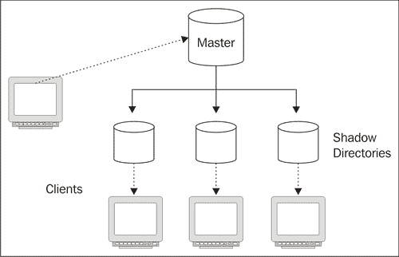

# 第七章。多个目录

在前几章中，我们专注于使用单个目录服务器。但在网络环境中，您可能需要配置多个目录服务器以实现互操作。在本章中，我们将讨论不同的方式来让目录服务器在网络上互操作。

虽然本书的重点是 OpenLDAP，但这里介绍的许多策略可以应用于将 OpenLDAP 与其他 LDAP 目录服务器集成，例如 Apache Directory Server、Fedora DS、微软的 Active Directory 以及 Novell Directory Server（NDS）。

我们将要查看的两个主要过程是复制（在另一个目录服务器上创建目录信息树的镜像）和代理（允许一个目录服务器作为 LDAP 客户端与另一个目录服务器之间的中介）。在本章中，我们将讨论：

+   同步和复制目录的基础

+   使用 SyncRepl 进行目录复制

+   使用`ldap`后端进行代理

+   使用 Proxy Cache 覆盖层添加缓存

+   使用`transparency`覆盖层创建混合缓存

在本章中，我们将使用两台服务器——一台将托管目录的权威副本，另一台将通过网络与权威副本进行同步。

# 复制：概述

有时需要多个相同的目录服务器副本。这在 LDAP 服务器承受大量流量、需要故障转移保护，或 LDAP 客户端地理分布广泛的情况下尤其有效，在这种情况下，拥有本地目录副本将大大加快服务速度。这些都是 LDAP 复制可以提供解决方案的场景。

**复制**是配置两个或更多目录以包含相同的目录信息树（或目录树的部分），并确保随着时间推移，多个目录数据副本保持同步的过程。这是 OpenLDAP 套件自诞生以来的核心特性。事实上，其前身——密歇根大学 LDAP 服务器，早期就实现了复制，因此，复制长期以来一直被视为 LDAP 服务器的标准任务。

在标准的 LDAP 模型中，复制是以层次结构的方式进行的。一个服务器被认为是**主服务器**（或者**主 DSA**（目录服务器代理），有时称为**提供者**）。该服务器负责维护目录信息树的规范版本。

在主服务器之下有一个或多个**影子服务器**（有时称为**消费者**、**副本**或**从服务器**）。影子服务器保存主服务器的目录信息树的副本，客户端可以连接到影子服务器并执行对目录信息树（DIT）的查询。我们来看一下下面的图：



就实际应用而言，影像服务器具有只读特性。尽管影像服务器可以处理许多 LDAP 操作，但不允许修改复制的目录信息树中的记录。例如，当接收到添加、修改或删除操作时，影像服务器将返回一个**引用**给客户端，指导客户端转而联系主服务器。引用是一种特殊的响应类型，它引导客户端联系另一个服务器来执行该操作。配置影像服务器指向主服务器的引用，只需要在 `slapd.conf` 文件中添加一个 `referral` 指令即可。

当客户端收到一个引用时，它就拥有了重新尝试在正确服务器上执行操作所需的信息。

为什么不允许对从服务器进行写操作呢？允许多个服务器接受所有的修改、添加和删除操作，使得目录信息树可能处于不一致状态。如果两个目录服务器同时修改一个属性会发生什么？或者如果一个服务器修改了另一个服务器正在删除的记录会怎样？通过仅允许在主服务器上进行写操作，更容易保持多个副本的一致性。

### 注意

在 OpenLDAP 2.4 版本中，将可以配置**多主**模式，这将允许多个服务器充当主服务器。和所有多主配置一样，可能会出现某些不一致性风险，但这些风险应当被最小化。

在 OpenLDAP 中，有两种不同的方式实现复制。第一种是通过配置主服务器来保持影像服务器的同步更新，这称为*推送*方法。第二种是配置从服务器定期检查主服务器是否有变化，并根据变化进行更新，这称为*拉取*方法。

直到 OpenLDAP 2.2，第一种模型才是 OpenLDAP 唯一支持的模型，并且它是通过一个名为 SLURPD 的独立服务器来实现的。但是 SLURPD 存在许多问题和低效之处，现在已被弃用，将在 OpenLDAP 2.4 中被移除。如果你有兴趣继续使用它以保持向后兼容性，请参阅 [`openldap.org`](http://openldap.org) 中的*OpenLDAP* *管理员* *指南*。

随着 SLURPD 的老化，OpenLDAP 的开发者开始致力于开发一种更好、更强大的目录复制方式。结果就是新的同步复制（SyncRepl）模型，它使用 LDAP 同步协议来保持影像目录与主服务器的同步。

## SyncRepl

在 OpenLDAP 2.2 中，开发者发布了一种新的实验性复制形式，称为**LDAP 同步复制**，简称为 **SyncRepl**。这种方法更可靠、更可配置，在 OpenLDAP 2.3 发布时，它被进一步完善并标记为稳定版本。现在，它是处理 OpenLDAP 服务器复制的首选方式。

与 SLURPD 复制过程不同，SyncRepl 不需要第二个守护进程。SLAPD 服务器实现了影子服务器部分的代码，而提供者服务（主服务器的服务）则通过叠加层提供。SyncRepl 可以使用影子从主服务器拉取或混合拉取/推送方法。

在拉取场景中（称为**仅刷新操作**），影子服务器定期连接到主服务器，并请求自上次检查以来的所有更改。然后，主服务器将所有更改的记录发送给影子服务器（如果是删除操作，则发送被删除记录的 DN）。

SynRepl 的第二种方法（称为**刷新并持久化**）是推送特性（在 SLURPD 模型中体现）和上述一些拉取特性的混合（因此它不是一个*真正的*推送方法）。

在这种情况下，影子服务器首先连接到主服务器并拉取一些初始更新。但它保持连接打开。当主服务器修改其目录信息树副本时，它会通过该开放连接将信息推送到影子服务器。如果影子服务器断开连接，主服务器不做任何处理。下次从服务器连接时，它会请求所有的新更改（就像在拉取方法中一样），然后主服务器将其发送。

### 注意

有关 LDAP 内容同步和 OpenLDAP 中包括的 SyncRepl 实现的更详细信息，请参见 RFC 4533（[`www.rfc-editor.org/rfc/rfc4533.txt`](http://www.rfc-editor.org/rfc/rfc4533.txt)）和*OpenLDAP 管理员指南*，网址为[`openldap.org`](http://openldap.org)。

SyncRepl 模型相对于 SLURPD 具有一些明显的优势：

1.  由于影子服务器发起连接并处理更新，网络中断不会影响目录信息树的可靠性。下次从服务器重新连接时，它将检索所有更新。

1.  很少需要中断主服务器的服务。当新的影子服务器首次连接到主服务器时，它会下载整个目录信息树，因此无需从主服务器转储数据并将其发送给影子（尽管仍然支持这种方法，并且在目录信息树较大且网络连接较慢的情况下，这种方法可能更为方便）。

1.  在选择仅刷新操作和刷新并持久化操作之间的灵活性使您能够选择最适合您需求的模型。

每种复制模式都有其优点。在高度分布的网络中，由于不需要在一个大且不可预测的网络中保持持续连接，**仅刷新**复制通常效果更好。但由于影子服务器只是定期检查主服务器，因此主服务器更新和影子服务器获取更改之间可能存在延迟。大多数情况下，这不会造成任何问题。

在一个可靠的局域网中，刷新和持久（refreshAndPersist）复制可能是更好的选择——尤其是当从主服务器到影像服务器的更改需要在最短时间内传输时。一旦主服务器发生变化，它将立即将更新发送到影像服务器。这意味着等待时间较短。

### 注意

即使是在刷新和持久（refreshAndPersist）操作中，网络中断也不会导致灾难性后果。影像服务器将简单地尝试重新连接到主服务器，并在成功连接后立即获取更新。

这些评论旨在作为一般性指南。由于尝试两者都比较容易，你可能希望通过实验来查看哪个对你最有效。通常，在局域网上，刷新和持久是最佳选择，而在较慢的链接上，刷新仅操作更好。在接下来的章节中，我们将介绍如何配置主服务器与影像副本之间的 SyncRepl。

# 配置 SyncRepl

SLAPD 服务器自带实现影像服务器所需的所有功能，而 `syncprov` 覆盖层提供了实现主服务器的功能。

### 注意

SyncRepl 在 OpenLDAP 2.2 中被引入，但当时的配置方式有很大不同。SyncRepl 应避免在运行 OpenLDAP 2.2 的生产环境中使用。

要使 SyncRepl 运行，需要在主服务器和影像服务器上进行配置。两者的配置指令将添加到 `slapd.conf` 文件的后端部分。

## 配置主服务器

我们首先要做的是将一台服务器配置为主服务器。该服务器将监听来自影像服务器的复制请求，并根据请求发送更新。在本书中，我们一直在配置一个 SLAPD 服务器。现在，我们将使用该服务器作为主服务器。

主服务器的功能是通过一个名为 `syncprov` 的覆盖层实现的（`syncprov` 是 **同步提供者** 的缩写）。我们需要加载并配置该覆盖层。

由于我们的 SLAPD 服务器是通过模块构建的，第一步是在 `slapd.conf` 文件的顶部附近添加模块加载指令：

```
modulepath      /usr/local/libexec/openldap
moduleload      back_hdb
moduleload      refint
moduleload      unique
moduleload      accesslog
moduleload      syncprov

```

当目录服务器重新启动时，`syncprov` 模块将被加载。现在，我们需要对我们将要复制的数据库的配置部分进行一些更改。该目录配置的主要部分大致如下所示：

```
database  hdb
suffix  "dc=example,dc=com"
rootdn  "cn=Manager,dc=example,dc=com"
rootpw  secret
directory  /var/lib/ldap
#directory  /usr/local/var/openldap-data
index  objectClass  eq
index  cn  eq,sub,pres,approx
index  uid  eq,sub,pres
index  sn  eq,sub,approx
index  member  eq
```

现在，我们想要为 SyncRepl 设置这个数据库。

首先要添加的是一些额外的索引。这些索引将跟踪在 SyncRepl 过程中经常访问的一对操作属性：`entryCSN` 属性和 `entryUUID` 属性。

`entryCSN`属性用于在每个记录中存储**变更序列号（CSN）**。`entryCSN`的值基本上是一个精细的时间戳，表示该属性最后一次修改的时间。第二个属性`entryUUID`包含该条目的（全局）唯一标识符，可用于快速识别主服务器和影子服务器上的对应条目。像其他属性一样，这些属性可以通过 LDAP 搜索检索：

```
$ ldapsearch -LLL -U matt "(uid=matt)" entryCSN entryUUID
SASL/DIGEST-MD5 authentication started
Please enter your password: 
SASL username: matt
SASL SSF: 128
SASL installing layers

dn: uid=matt,ou=Users,dc=example,dc=com
entryUUID: bec1eb70-c5b0-102a-81bf-81bc30f92d57
entryCSN: 20070122003136Z#000000#00#000000

```

当 SyncRepl 搜索这些属性时，它会进行相等性检查，因此我们应该为执行相等性测试配置一个索引：

```
index entryCSN,entryUUID eq
```

这个`index`指令配置了两个相等性索引—每个属性一个—可以将其添加到`slapd.conf`文件中，位于其他`index`指令的下方。

接下来，我们需要加载并配置`syncprov`覆盖层。这个覆盖层通常使用的配置指令只有两个，因此我们为主服务器配置的完整覆盖层配置如下所示：

```
overlay syncprov
syncprov-checkpoint 50 10
syncprov-sessionlog 100
```

第一行加载了`syncprov`覆盖层。第二行指定了 SyncRepl 信息应多久写入一次数据库。与 BDB 和 HDB 后端一样，SyncRepl 经过调整，以尽可能快地执行操作。写入底层数据库的代价很高，因此简化这一过程可以提高性能。

`syncprov-checkpoint`指令指示覆盖层仅在新的写入请求到来时才将更改写入数据库，并且已经发生了特定数量的写入（在此情况下为`50`次），或者已经过去了特定数量的分钟（在此情况下为`10`分钟）。

第二个指令，`syncprov-sessionlog`，指定了应在会话日志中存储多少次修改和删除。主服务器使用此日志中的信息来确定需要发送给影子服务器的信息。在这种情况下，它将存储最近的 100 次修改和删除。

我们完成的配置看起来像这样：

```
##############################
# Database 1: Example.Com

database        hdb
suffix          "dc=example,dc=com"
rootdn          "cn=Manager,dc=example,dc=com"
rootpw          secret
directory      /var/lib/ldap
#directory       /usr/local/var/openldap-data
index   objectClass     eq
index   cn      eq,sub,pres,approx
index   uid     eq,sub,pres
index   sn      eq,sub,approx
index   member  eq
index   entryCSN,entryUUID      eq

overlay syncprov
syncprov-checkpoint 50 10
syncprov-sessionlog 100
```

一旦完成了对`slapd.conf`的修改，最好运行`slaptest`来确保配置文件可以被解析，然后（为了保险起见）运行`slapindex`来更新索引文件。

### 创建 SyncRepl 用户

准备主服务器的最后一步是创建一个用于同步的特殊帐户。影子服务器将使用这个帐户连接到主服务器。

我们将创建一个类似于用于执行身份验证的帐户：

```
dn: uid=syncrepl,ou=System,dc=example,dc=com
uid: syncrepl
ou: System
userPassword: secret
description: Special account for SyncRepl.
objectClass: account
objectClass: simpleSecurityObject
```

我们可以使用`ldapadd`客户端加载此记录：

```
 $ ldapadd -U matt -f syncReplUser.ldif

```

为了使复制帐户正常工作，它还需要有权限更新目录中的必要条目。这意味着 ACL 必须授予此用户相应的权限。虽然我们可以像第四章那样详细列出 ACL，但为了方便起见，我们将只将新的 SyncRepl 用户添加到`cn=LDAP` `Admins`组中，并使用`ldapmodify`：

```
$ ldapmodify -U matt
SASL/DIGEST-MD5 authentication started
Please enter your password: 
SASL username: matt
SASL SSF: 128
SASL installing layers

dn: cn=LDAP Admins, ou=Groups, dc=example,dc=com
changetype: modify
add: uniqueMember
uniqueMember: uid=syncrepl,ou=system,dc=example,dc=com

modifying entry "cn=LDAP Admins, ou=Groups, dc=example,dc=com"
```

现在，`uid=syncrepl` 用户是 LDAP 管理员组的成员，并且应用于该组的 ACL 也将应用于我们的新用户。

这就是将目录配置为主服务器的所有步骤。接下来，我们将配置影子服务器。

## 配置影子服务器

我们将配置影子服务器使用 `refreshOnly` 复制方式，主服务器会定期检查更新，如果发现有更新，则获取更改并将其加载到自己的目录树中。

我们的影子服务器将是一个全新的 SLAPD 实例，运行在同一局域网中的另一台服务器上。我们从一个基础的 `slapd.conf` 文件开始。随着配置 SyncRepl，我们将对这个文件进行修改：

```
# slapd.conf - Configuration file for LDAP SLAPD
##########
# Basics #
##########
include  /etc/ldap/schema/core.schema
include  /etc/ldap/schema/cosine.schema
include  /etc/ldap/schema/inetorgperson.schema
include  /etc/ldap/schema/blog.schema

pidfile  /var/run/slapd/slapd.pid
argsfile  /var/run/slapd/slapd.args
loglevel none

modulepath /usr/lib/ldap
moduleload back_hdb

#############################
# BDB Database Configuration #
##############################
# Database 1: Example.Com

database  hdb
suffix  "dc=example,dc=com"
rootdn  "cn=Manager,dc=example,dc=com"
#rootpw  secret
directory  /var/lib/ldap
index  objectClass,member eq
index  cn,uid,sn  eq,sub
index  entryCSN,entryUUID eq

#include  /usr/local/etc/openldap/acl.conf
```

基于我们在第二章和第三章中汇总的配置，这应该是很熟悉的。不过，有几点需要注意：

+   主服务器使用的所有模式也必须在影子服务器上加载。

+   在这种情况下，我们将把整个主目录复制到这个影子 SLAPD 服务器，因此我们希望后缀保持一致，`dc=example,dc=com`。

+   我们不希望此实例有根密码。所有更新将来自主服务器，我们不希望在本地进行任何更改。

+   对于主服务器和影子服务器，索引不必完全相同（事实上，主服务器和影子服务器甚至可以使用不同的数据库后端），但我们确实希望确保 `objectclass`、`entryCSN` 和 `entryUUID` 都被索引，因为它们对 SLAPD 的性能至关重要。

这个基础的 `slapd.conf` 文件应该能够运行一个独立的服务器。但我们不想运行一个独立的服务器；我们希望它从主服务器获取信息并与主服务器保持同步。

### syncrepl 指令

当影子 SLAPD 服务器执行同步操作时，它充当一种特殊的 LDAP 客户端。它绑定到主服务器并执行 LDAP 操作——通常是 RFC 4533 中定义的特殊 LDAP 同步操作。

因此，配置一个影子服务器作为 SyncRepl 消费者，类似于配置其他 LDAP 客户端。这大部分配置与提供有关影子服务器如何绑定主服务器以及如何执行搜索的信息有关。

实现影子服务器的配置工作大部分通过一个 `slapd.conf` 指令完成：`syncrepl`。该指令采用多个参数，格式为 `name=value`，用于指定影子服务器的行为。以下是一个包含执行基本同步所需所有参数的 `syncrepl` 指令。在 `slapd.conf` 文件中，该指令位于我们 `example.com` 后端的数据库配置部分：

```
syncrepl rid=001
  provider=ldap://directory.example.com 
  type=refreshOnly
  interval=00:00:05:00
  searchbase="dc=example,dc=com"
  binddn="uid=syncrepl,ou=system,dc=example,dc=com"
  credentials=secret
```

该指令提供了使 SyncRepl 工作所需的最小配置。该指令有七个名称/值参数：`rid`、`provider`、`type`、`interval`、`searchbase`、`binddn` 和 `credentials`。

第一个参数是 `rid`，即 **副本标识符 (RID)**。该三位数字必须在所有使用相同主服务器的影子服务器中是唯一的。主 SLAPD 实例使用 RID 来跟踪哪些消费者服务器在与它连接。通常，最好从较低的 RID 数字开始，并为每个影子服务器递增它。因此，`rid=001` 表示这是第一个影子服务器。如果我们添加第二个影子副本，则会是 `rid=002`。

### 注意

在早期版本的 OpenLDAP 中，主服务器必须包含其消费者服务器的所有 RID 列表。现在不再需要这样做。

`provider` 参数应包含主服务器的 LDAP URL。可以使用 `ldap://` 或 `ldaps://` 协议。主机部分可以是主机名或 IP 地址，并且可以在末尾添加可选端口，通过冒号分隔。例如，要通过非标准端口使用 LDAPS 连接到主服务器，可以使用如下格式的 provider：`ldaps://10.0.1.34:6868`。请注意，这里仅支持这种简单的 LDAP URL 格式。包含基本 DN、搜索过滤器等的完整 LDAP URL 语法在这里不被支持。

### 提示

**使用 StartTLS 替代 SSL/TLS**

您可以配置影子服务器通过 LDAP（未加密）连接，然后发出 StartTLS 命令以开始与主服务器之间的 TLS 加密。为此，添加 `starttls=yes`（如果 TLS 协商失败应停止事务，则使用 `starttls=critical`）。

`type` 参数确定影子服务器在连接主服务器时将使用哪种复制模式。唯一可接受的值是 `refreshOnly` 和 `refreshAndPersist`。

在我们的示例中，我们使用了 `refreshOnly` 选项。在刷新并持久化配置中，`interval` 参数将被忽略。

否则，配置仅刷新和刷新并持久化之间没有显著差异。

`interval` 参数表示影子服务器在检查主服务器更新之前等待的时间。这适用于 `refreshOnly` 模式，在该模式下，消费者服务器连接、检查更新然后断开连接。然后，它将等待由 `interval` 参数指定的时间段后再进行下一次检查。

`interval` 参数的语法为 `dd:hh:mm:ss`，其中 `dd` 表示等待的天数，`hh` 为小时，`mm` 为分钟，`ss` 为秒。如果未指定该参数，则默认值为一天 (`01:00:00:00`)。通常希望选择较短的间隔，特别是当影子服务器需要提供最新信息时。在前面的示例中，影子服务器将在每次检查之间等待五分钟 (`00:00:05:00`)。

### 提示

如果影像服务器必须与主服务器保持紧密同步，并且影像服务器与主服务器位于同一局域网，则 `refreshAndPersist` 模式可能更适合。

在 `refreshOnly` 模式下，一个潜在的困难出现在主服务器不可用的情况下（例如，由于网络中断或服务器故障）。这时，影像服务器应如何处理？除了 `interval` 参数外，还有一个额外的参数，允许调整刷新间隔，但该选项仅在无法连接到主服务器时生效。

此参数 `retry` 提供了影像服务器在无法联系到主服务器时应如何处理的信息。它的格式如下：`retry="120` `10"`。这指示影像服务器在主服务器不可用时每 120 秒重试一次，最多重试 10 次。

### 提示

**使用 retry 参数**

在 refresh-only 和 refresh-and-persist 配置中设置 retry 参数是一个好主意。这将确保短暂的网络故障不会干扰复制过程。

此参数可以包含多个参数对。例如，我们可以配置它在短时间内检查几次，然后（如果仍然无法连接）在更长的时间间隔内再次测试：`retry="30` `10` `600` `20"`。这次，如果影像服务器无法连接到主服务器，它将每 30 秒尝试一次，共尝试 10 次。如果主服务器仍然无法连接，则它将等待十分钟（600 秒）后再尝试一次。它会重复此过程再进行 20 次。但在这些尝试后，影像服务器将放弃继续尝试连接主服务器。

要配置影像服务器无限期测试——即不断尝试直到连接成功——可以插入特殊的 `+`（加号）符号代替重试次数。例如，参数 `retry="60` `+"` 会指示影像 SLAPD 每分钟尝试连接主服务器，直到最终成功为止，成功后将恢复到 `interval` 参数设置的常规时间间隔。

在 `interval` 参数之后是 `searchbase` 参数。该参数指示同步请求的基本 DN。通常，`searchbase` 应与影像服务器的数据库 `suffix` 指令相同。

影像服务器不必复制主服务器的整个目录信息树。例如，我们可以配置影像服务器仅复制 `ou=users` 分支，数据库配置如下：

```
database    hdb
suffix      "ou=users,dc=example,dc=com"
rootdn      "ou=users,dc=example,dc=com"
directory  /var/lib/ldap
index   objectClass,member eq
index   cn,uid,sn  eq,sub
index   entryCSN,entryUUID eq
include /etc/ldap/acl.conf

syncrepl rid=001
  provider=ldap://directory.example.com 
  type=refreshOnly
  interval=00:00:05:00
  searchbase="ou=users,dc=example,dc=com"
  binddn="uid=syncrepl,ou=system,dc=example,dc=com"
  credentials=secret
```

再次提醒，`suffix` 和 `searchbase` 是相同的。

`searchbase` 指令是构成搜索规范的多个指令之一。我们还可以使用 `scope`、`filter`、`attrs`、`attrsonly`、`sizelimit` 和 `timelimit` 参数来构建更复杂的搜索规范。不过，如果不使用这些参数，我们只是接受了默认设置，它会执行如下的搜索：

+   `scope` 设置为 `sub`

+   `filter` 设置为 `(objectclass=*)`。

+   `attrs` 字段设置为 `*`,`+`，这将请求所有常规和操作属性。

+   没有包括 `attrsonly` 标志，因此返回的既有属性也有值。

+   `sizelimit` 和 `timelimit` 参数都设置为 `unlimited`。

`syncrepl` 指令中的第六和第七个参数是 `binddn` 和 `credentials`。这些用于执行简单绑定到目录。

配置主服务器时，我们创建了 `uid=syncrepl` 账户。现在，我们将使用相同的 DN 从影像服务器连接到主服务器。如前所述，主服务器不会自动授予此账户任何特殊权限；主服务器上的 ACL 将应用于该账户。

此用户将应用大小和时间限制。配置 SyncRepl 时一个常见的错误是无意中将 SyncRepl 用户设置为过低的大小或时间限制。结果是，影像服务器可能只获取了它应该拥有的目录信息树的部分内容，无法为客户端提供完整的目录信息。

如果系统资源允许，通常建议为 SyncRepl 用户提供无限的时间和请求大小。

`credentials` 参数在简单绑定的情况下保存密码。

### 注意

我们的基本配置使用简单绑定和未加密的（纯 LDAP）连接。这不安全。使用 StartTLS、SSL/TLS 或适当强度的 SASL 机制将提供更高的安全性。

简单绑定并不是 SyncRepl 支持的唯一类型。SASL 身份验证也可以启用，尽管这可能需要额外的参数：

+   `bindmethod=sasl`：默认情况下，绑定方法设置为简单。要启用 SASL 身份验证，必须手动设置此参数。

+   `saslmech=<SASL` `Mechanism>`：此项应设置为，例如，`DIGEST-MD5`，以便在传输前对密码进行 MD5 哈希。更多信息请参见第四章中的 SASL 部分。

+   `authcid=<uid>`：此项应设置为用于身份验证的账户的 SASL ID。类似的 `authzid` 参数可用于配置备用授权账户。

+   `credentials=<SASL` `Credentials>`：`credentials` 字段用于 SASL 身份验证，将凭据信息传递给 SASL 子系统。例如，在 DIGEST-MD5 机制中，`credentials` 保存账户的密码。

+   `realm=<SASL` `Realm>`：此参数可传递领域信息（参见第四章）。

+   `secprops=<SASL` `Security` `Props>`：可以通过此参数传递额外的 SASL 安全属性。

最后需要注意的是，默认情况下，在 SyncRepl 操作期间，影像服务器不会对从主服务器接收到的记录进行模式检查。换句话说，如果主服务器发送给影像服务器的记录违反了模式约束，影像服务器会简单地存储该不合法记录，而不会尝试验证或拒绝它。

通常，禁用模式检查是可取的。由于主服务器应始终执行模式检查，第二套相同的检查是多余的，并且会减慢复制过程。然而，在极少数情况下，可能希望进行额外的评估。在`syncrepl`指令中通过添加`schemachecking=on`参数可以启用对复制记录的模式检查。

### 配置引用

对复制的目录信息树执行写操作只能在主服务器上进行。例如，你不能通过连接到影像服务器并执行 LDAP 添加操作来更改某个属性。换句话说，影像服务器实际上是只读的。

如果客户端尝试在影像服务器上修改条目，该服务器将响应并表示不会执行修改操作：

```
$ ldapmodify -x -W -D "uid=matt,ou=users,dc=example,dc=com" -H \
    ldap://localhost
Enter LDAP Password:

dn: uid=matt,ou=users,dc=example,dc=com
changetype: modify
replace: description
description: testing modify against shadow.

modifying entry "uid=matt,ou=users,dc=example,dc=com"
ldap_modify: Server is unwilling to perform (53)
 additional info: shadow context; no update referral

```

在这个例子中，当我们尝试修改自己的记录的描述属性值时，服务器响应了`unwilling` `to` `perform`错误。

虽然影像服务器不能允许更新其自身的数据，但可以配置为将客户端重定向到主服务器。这是通过在数据库部分（通常就在`syncrepl`指令下方）添加额外的指令来实现的，指示请求应被重定向到哪个服务器。指令如下所示：

```
updateref ldap://directory.example.com 
```

现在，当客户端尝试执行写操作时，不会收到错误，而是会收到一个引用：

```
$ ldapmodify -x -W -D "uid=matt,ou=users,dc=example,dc=com" -H \ 
    ldap://localhost
Enter LDAP Password:

dn: uid=matt,ou=users,dc=example,dc=com
changetype: modify
replace: description
description: testing modify against shadow.

modifying entry "uid=matt,ou=users,dc=example,dc=com"
ldap_modify: Referral (10)
  referrals:
    ldap://directory.example.com/uid=matt,ou=users,dc=example,dc=com 
```

许多客户端可以配置为执行所谓的**引用追踪**。也就是说，当它们收到引用时，可以自动跟随该引用。在此情况下，客户端将自动尝试在`directory.example.com`主服务器上执行修改操作。

## 启动复制

到此为止，我们已经仔细查看了主服务器和影像服务器的 SyncRepl 配置选项。现在我们准备启用这些配置。

一旦主服务器配置完成，必须重新启动才能使配置更改生效。当`syncprov`叠加层加载后，SLAPD 将作为主服务器运行。所有这些步骤应在启动配置好的消费者服务器之前完成，否则，影像服务器将尝试从主服务器获取信息，而主服务器将没有必要的 LDAP 操作可用。

在主服务器重新运行后，可以启动影子服务器。对于中小型目录，以及带宽足够的网络，无需手动将任何目录数据加载到影子服务器中。相反，当影子服务器首次连接到主服务器时，它将获取一份新的目录信息树副本（在主服务器的 ACL 允许的范围内），并将其全部存储到本地。

几分钟之内，影子服务器应该会有一份正确且完整的副本，包含主服务器中存储的信息。

### 对于较大的目录...

从主服务器到影子服务器自动下载目录信息树确实很容易，但当目录信息树非常庞大且包含几 GB 数据时，通过网络执行更新（每个事务都使用 LDAP 协议）可能会消耗大量时间和资源。

在这种情况下，通常最好在主服务器上使用`slapcat`来导出目录内容（无需停止 SLAPD 即可执行此操作），然后将 LDIF 文件传输到影子服务器，并通过`slapadd`导入。

### 注意

附录 C 包含使用`slapcat`和`slapadd`来导出和加载 SLAPD 数据库的指令。

由于`slapcat`和`slapadd`程序不涉及 LDAP 网络协议的开销，因此在添加新记录时，它们的性能可以超过 SyncRepl。在带宽无法专门用于大规模数据传输的网络中，LDIF 文件也可以通过其他（离线）介质传输。

一旦目录数据库通过`slapadd`填充完毕，你可以启动影子服务器。

## Delta SyncRepl

默认情况下，当主服务器向影子服务器发送修改或添加的记录时，它会发送*整个* *记录*，而不仅仅是更改部分。这是因为主服务器并不会追踪已经发送到影子服务器的信息。

但是，`accesslog`叠加层确实会跟踪发送到影子服务器的信息。通过配置 SLAPD 使用`accesslog`叠加层来提供`syncprov`叠加层的日志信息，可以简化复制过程，只发送更改过的信息，而不是整个记录。这被称为**Delta SyncRepl**。在修改频繁的网络或包含非常大记录的目录中，这种简化可能会带来明显的性能提升。

### 注意

**Delta SyncRepl**是一种高级配置。由于它涉及多个叠加层的协作，以及一些相当复杂的配置，因此它可能不是所有配置的最佳解决方案。我在处理小型和中型目录通过局域网（LAN）和广域网（WAN）链接复制的经验表明，常规的 SyncRepl 已足够，Delta SyncRepl 并非必需。

配置 Delta SyncRepl 需要在主服务器上进行一些更改，并在影子服务器上进行少量更改。

### 主服务器的配置

主服务器必须运行第五章中实现的`accesslog`覆盖层。我们将从为该覆盖层设置日志数据库开始。这一配置与第五章中创建的配置非常相似：

```
# Database 1: Logging DB
# This is used by the access
# log overlay

database hdb
suffix cn=log
rootdn          "cn=Manager,cn=log"
rootpw          secret
directory       /var/lib/ldap/accesslog
index reqStart,objectclass,entryCSN,reqResult eq

overlay syncprov
syncprov-nopresent TRUE
syncprov-reloadhint TRUE
```

本节创建了一个新的日志数据库，名为`cn=log`，所有访问日志信息都将写入该数据库。

本节中只有几行与第五章的配置有所不同。首先，索引指令现在会在`reqStart`、`objectclass`、`entryCSN`和`reqResult`上建立索引。虽然`reqStart`和`entryCSN`主要用于内部，但 SyncRepl 消费者会大量使用`objectclass`和`reqResult`属性，因此对这些属性建立索引将加速复制过程。

最后四个指令是新的。必须将`syncprov`覆盖层添加到 accesslog 数据库的配置中，以配置 SyncRepl 的访问日志。这两个标志，`syncprov-nopresent`和`syncprov-reloadhint`，都必须开启（`TRUE`），以使 Delta SyncRepl 正常工作。事实上，`syncprov-nopresent`标志*仅*应在进行 Delta SyncRepl 时启用。

### 提示

**设置限制和 ACL**

根据你的`sizelimit`和`timelimit`设置，你可能需要显式地为`uid=syncrepl`用户在`cn=log`数据库上授予无限制的时间和大小限制。同时，确保该数据库的 ACL（访问控制列表）为`uid=syncrepl`授予`read`访问权限。有关 ACL 的更多信息，请参见第四章，关于`limit`指令的内容，请参见第五章。

最后，我们希望通过第五章中介绍的`limit`指令，为`syncrepl`用户提供无限的搜索时间和结果大小。

接下来，我们需要稍微重新配置我们将要复制的数据库。在`slapd.conf`文件中，这应该直接放置在给定的 accesslog 定义下方：

```
##############################
# Database 2: Example.Com

database        hdb
cachesize       500
idlcachesize    1500
suffix          "dc=example,dc=com"
rootdn          "cn=Manager,dc=example,dc=com"
rootpw          secret
directory      /var/lib/ldap
index   objectClass     eq
index   cn      eq,sub,pres,approx
index   uid     eq,sub,pres
index   sn      eq,sub,approx
index   member  eq
index   entryCSN,entryUUID      eq
overlay syncprov
syncprov-checkpoint 50 10
syncprov-sessionlog 100

overlay accesslog
logdb cn=log
logops writes
# Purge logs for entries one week old, check once every two days.
logpurge 7+00:00 2+00:00
logsuccess TRUE

```

高亮的部分标记了新增加的数据库部分，该部分属于复制后端数据库中的数据库。这里配置的`accesslog`覆盖层将使用之前定义的`cn=log`数据库。我们需要记录的操作仅包括写入数据库的操作（添加、修改、删除和 modrdn）。

### 注意

根据你的大小和时间限制设置，你可能还需要添加一个显式的限制指令，授予`uid=syncrepl`无限的时间和结果大小以完成操作。

这些是主服务器需要做的唯一更改。现在我们将看看影子服务器的`slapd.conf`文件中的更改。

### 影子服务器的配置

在消费者（影子服务器）端，启用 Delta SyncRepl 需要在`syncrepl`指令中添加几个参数：

```
syncrepl rid=001
  provider=ldap://10.21.77.100
  type=refreshOnly
  interval=00:00:02:00
  searchbase="dc=example,dc=com"
  binddn="uid=syncrepl,ou=system,dc=example,dc=com"
  credentials="secret"
 syncdata=accesslog
 logbase="cn=log"
 logfilter="(&(objectclass=auditWriteObject)(reqResult=0))"

```

`syncrepl`指令的新部分由给定示例末尾新增的三行构成。这些行指示影子服务器查阅主服务器的 accesslog 数据库以获取同步信息。

`syncdata` 参数指示 SyncRepl 应该使用哪个源来获取需要更新的记录信息。应该设置为 `accesslog`，表示我们使用的是 accesslog 后端。

`logbase` 指令应该设置为主服务器上 access-log 的基础 DN。在前面的章节中，我们将其设置为 `cn=log`。

最后，`logfilter` 参数定义了在搜索主服务器的 accesslog 时应该使用的过滤器。在复制过程中，我们需要有关数据库任何更改的信息——添加、修改、modRDN 或删除。这些都是写入操作，并将使用 `auditWriteObject` 对象类记录在 accesslog 中。此外，我们只想同步成功完成的事务（记住，accesslog 会记录更改目录的失败尝试，我们不希望复制这些）。在写入成功的情况下，`reqResult` 标志将被设置为 `0`。因此，我们也将此添加到过滤器中。

### 注意

有关完整的 Delta SyncRepl 配置文件集，请参见 Connexitor 博客上的以下技术说明：[`www.connexitor.com/forums/viewtopic.php?t=3`](http://www.connexitor.com/forums/viewtopic.php?t=3)（Connexitor 是 Symas 提供的商业支持版本 OpenLDAP）。

现在主服务器和影像服务器都已配置完毕。首次启动时，你可能希望删除旧的影像数据库（请参见本章前面的说明）并重新开始。再次，启动消费者之前先重启主服务器。

这就是配置 Delta SyncRepl 的所有内容。接下来，我们将探讨一些调试复制问题的策略。

## 调试 SyncRepl

配置基于网络的服务器到服务器的设置（如 SyncRepl）时，调试的难度是一个令人沮丧的因素。以下是一些使 SyncRepl 调试变得更容易的提示。

### 从头开始

有时首次配置复制会失败。实际上，非常容易清除影像服务器的整个数据库，并从头开始重新配置。

如果你使用的是 BDB 或 HDB 后端，只需要删除数据库目录中的所有数据文件：

```
 $ sudo /etc/init.d/slapd stop
 $ cd /var/lib/ldap
 $ rm -f *.bdb __db.* log.*

```

### 注意

警告：确保不要删除 `DB_CONFIG` 文件！

下次重新启动 SLAPD 时，它将从头开始重建数据文件。

类似的步骤也可以用于迁移数据库、修复损坏的后端等。但这些情况需要更多的关注。有关更详细的说明，请参见 附录 C。

### 策略日志记录

调试复制的另一种方法是将影像 SLAPD 实例以前台模式运行，并启用 `sync` 日志级别：

```
 $ sudo slapd -d sync

```

这将打印关于同步过程的详细信息。

增加主服务器上的日志信息也可能有所帮助。`acl`日志级别对于评估如何将访问规则应用于 SyncRepl 用户的请求非常有用。对于更复杂的问题，`trace`调试级别也非常有帮助。

### 一些常见错误

配置 SyncRepl 时常见的一些错误。

**限制和 ACL**：我已经提到过时间限制和大小限制的问题：`sizelimit`和`timelimit`指令适用于 SyncRepl 用户，就像它们适用于其他非管理员帐户一样。如果数据库中的条目超过了最大大小限制，或者复制连接需要很长时间，那么从主服务器到阴影服务器的复制可能会提前结束，导致同步不完整。

ACL 也可能在复制中产生意想不到的结果。如果 ACL 拒绝 SyncRepl 用户的访问权限，则该用户将无法同步该信息。这也可能导致同步不完整。幸运的是，SLAPD 会尝试自动弥补尽可能多的这些不一致性。不幸的是，这可能会使问题在更长时间内保持不可见。

**未调优的 DB_CONFIG**：在第五章中，我们查看了`DB_CONFIG`文件，这是一个用于调优 BDB/HDB 数据库后端的特殊配置文件。在配置阴影服务器时，重要的是在数据库目录(`/var/lib/ldap`)中放置一个`DB_CONFIG`文件。如果`DB_CONFIG`文件缺失或调优不当，数据库环境将变得更慢。虽然这在执行简短偶尔的搜索时可能不易察觉，但这会对复制产生不利影响。较大的事务（如初始更新或转移重要修改）可能会比使用经过良好调优的数据库环境时慢得多。

有时，这只是增加了更新数据库时的延迟，但当与时间限制结合使用时，它可能导致同步被截断。

**SASL 认证失败**：在实现 SyncRepl（或 SLURPD）时，SASL 配置有时会导致混淆。如果你通常使用 SASL 进行认证，并且 SASL 信息没有存储在目录信息树中，那么你还需要确保外部 SASL 数据被同步。

在第四章中，我们配置了 SASL 使用外部的`/etc/sasldb2`文件进行 DIGEST-MD5 认证，用于存储密码。如果我们要在阴影服务器上使用 SASL DIGEST-MD5 认证，则需要确保每个服务器都有相同的`/etc/sasldb2`文件，这就需要使用一些其他非 OpenLDAP 工具，如**rsync**([`samba.anu.edu.au/rsync/`](http://samba.anu.edu.au/rsync/))。

解决这个问题的一种方法是将明文 SASL 密码存储在目录中，而不是存储在`sasldb2`文件中。这可以通过使用`{CLEARTEXT}`密码哈希而不是`{SSHA}`或其他机制来实现。有关更多信息，请参见第三章。OpenLDAP 管理员指南（[`openldap.org`](http://openldap.org)）也解释了这种配置。

简单绑定（通过 DN 和用户密码）应该能够与复制正常工作，就像我们在第六章配置的 SASL EXTERNAL 认证一样。

# 配置 LDAP 代理

有时，代替复制目录信息树，可能需要代理与 LDAP 目录的通信。在这种情况下，配置一个 SLAPD 服务器，站在客户端与网络上另一个 LDAP 服务器之间，响应客户端请求，并从其他 LDAP 服务器检索目录信息来响应请求。

OpenLDAP 支持几种不同的配置方式，将 SLAPD 配置为代理。

## 使用 LDAP 后端

设置两个服务器之间的代理的一种方式是配置一个服务器使用`ldap`后端（而不是 BDB 或 HDB）。`ldap`后端监听请求，当收到请求时，透明地将请求转发到另一个 LDAP 服务器。例如，假设我们有两个服务器，directory.example.com，存储数据库，和 proxy.example.com，使用`ldap`后端将请求代理到 directory.example.com 服务器。

从客户端的角度来看，当客户端连接到 proxy.example.com 时，它看起来是从 proxy.example.com 获取结果的。所有网络流量在客户端和代理之间传输，返回的结果中没有任何内容表明结果是从另一个服务器获取的。此外，`ldap`后端会自动跟随引用，而不需要客户端应用程序进行引用追踪。

从 directory.example.com 的角度来看，连接来自 proxy.example.com。

在协议层面，`ldap`后端会透明地将客户端的所有请求转发到其他服务器。换句话说，当客户端进行绑定时，它绑定的不是 proxy.example.com，而是 directory.example.com。

### 注意

这也是可以配置的，且可以实现更高级的绑定配置。有关此类功能的讨论，请参见*使用* *身份* *管理* *功能*一节。

每个客户端都会获得一个独立的连接，从代理到目录，唯一的例外是，所有作为匿名用户连接的客户端都通过相同的连接代理到远程服务器。

### 注意

TLS 连接从客户端到代理。代理可以配置为在客户端请求 TLS 时，或每次代理连接到远程服务器时使用 TLS 与远程服务器进行通信。这可以通过`ldap`后端的`tls`指令来实现。

配置`ldap`后端作为代理非常简单。下面是一个完整的`slapd.conf`配置，用于`ldap`后端：

```
# slapd.conf - Configuration file for LDAP SLAPD
##########
# Basics #
##########

include  /etc/ldap/schema/core.schema
include  /etc/ldap/schema/cosine.schema
include  /etc/ldap/schema/inetorgperson.schema
include  /etc/ldap/schema/blog.schema

pidfile  /var/run/slapd/slapd.pid
argsfile /var/run/slapd/slapd.args
loglevel none

modulepath /usr/lib/ldap
moduleload back_ldap
################
# LDAP Backend #
################
database ldap
uri "ldap://directory.example.com"
suffix "dc=example,dc=com"

```

本例的重点已被突出显示。

一旦加载了`back_ldap`模块，后端仅通过三条指令来定义。数据库指令指向`ldap`后端（而不是我们在前几章中使用的`hdb`后端）。

`uri`指令的值为以空格分隔的 LDAP URL 列表。在这个例子中，只有一个 URL。当有多个 URL 时，尤其是在某个服务器故障时会很有用。当 URL 列表存在时，`ldap`后端会按照顺序尝试连接服务器。如果第一个服务器无法连接，它会切换到第二个 URL，依此类推，直到所有服务器都尝试过或者最终成功连接。

`suffix`指令指定该后端服务的后缀或多个后缀。这应包含远程目录提供的基准 DN 或多个 DN。通过这种方式，使用代理可以仅使远程服务器的某个分支或几个分支可用。例如，远程服务器可能提供`dc=example,dc=com`的访问权限。但我们可以将代理上的后缀设置为`ou=users,dc=example,dc=com`，这样该服务器的用户就只能通过该代理搜索目录信息树的这一部分。

### 注意

一些 OpenLDAP 用户报告成功实现了`ldap`后端，将请求代理到其他目录服务器，如 Microsoft 的 Active Directory。

`ldap`后端还有一些其他可用的配置选项，所有这些都在`slapd-ldap`手册页中有记录：`man` `slapd-ldap`。但我们将只关注其中的一部分：身份管理功能。

### 使用身份管理功能

`ldap`后端可以做更多复杂的操作。例如，你可以将身份验证和授权任务分开，客户端提供的 DN 进行身份验证，但所有操作都以另一个用户的身份执行。

这个名为**ID 断言**的功能，允许你设置一个代理（可能位于较不安全的网络上），使得用户能够以自己身份进行绑定，但随后使用一个权限较低的帐户（如权限受到 ACL 限制的系统帐户）从目录中获取有限的信息子集。

配置 ID 断言只需要几个额外的指令。在代理上，你需要向`ldap`数据库配置中添加两个指令：`idassert-bind`和`idassert-authzFrom`。

`idassert-bind`指令指定代理服务器如何验证远程目录服务器。以下是一个示例配置：

```
idassert-bind
  bindmethod=simple
  binddn="uid=authenticate,ou=system,dc=example,dc=com"
  credentials="secret"
  mode=none
```

该指令定义了代理用于连接到远程目录以验证客户端的帐户（及其认证方式）。

`bindmethod`的支持值有`simple`（进行简单绑定）、`sasl`（进行 SASL 绑定）和`none`。如果使用`none`，则不会进行身份声明（这与完全不使用该指令的效果相同）。

`binddn`和`credentials`参数指定连接到远程目录的 DN 和密码。

`mode`参数指定将向远程服务器声明哪个身份。在给定的示例中，我们将`mode`设置为`none`，这意味着代理将声明`binddn`中指定的 DN 作为其身份。换句话说，代理将在远程服务器上以`binddn`中的 DN 身份执行所有操作。

对于更复杂的代理，您可以将`mode`设置为`anonymous`（这将向远程目录声明匿名身份）或`self`（这将声明由客户端发送的身份）。这些实现了 RFC 4370 中定义的**代理授权**（**proxyAuth**）**控制**（[`www.rfc-editor.org/rfc/rfc4370.txt`](http://www.rfc-editor.org/rfc/rfc4370.txt)）。

对于`anonymous`或`self`，您可能还需要在`ldap.conf`中设置`authz-policy`指令，并向代理或客户端的 DN（分别）添加`authzFrom`或`authzTo`条目。有关更多信息，请参阅`slapd.conf`和`slapd-ldap`的手册页。

`idassert-authzFrom`指令用于授权哪些客户端可以使用代理。例如，我们可以设置一条规则，允许用户使用代理，如果他们的 DN 位于`ou=users`子树中：

```
idassert-authzFrom dn.subtree="ou=users,dc=example,dc=com"
```

与其他使用`dn`说明符的指令一样，这个指令支持常规的修饰符列表，如`dn.subtree`、`dn.one`和`dn.regex`。有关这些修饰符的解释，请参阅第五章中的限制讨论。

## 将简单代理转换为缓存代理

目前我们已经配置了代理，每个请求都被转发到远程目录服务器，代理本身不保存任何结果。因此，当相同的请求被多次执行时，代理每次都会连接到远程目录服务器并转发请求。然而，可以使用`pcache`（**代理缓存**）叠加层为代理添加缓存，将远程目录的一个子集存储在代理上。这在某些情况下可以显著提升性能。

代理缓存通过将经常访问的信息的子集存储在代理 SLAPD 实例的数据库中来工作。当代理收到一个请求，且该请求的信息已存储在缓存中时，它将返回缓存数据，而不是从远程服务器获取记录。

记录存储在**LRU（最近最少使用）**缓存中，这意味着一旦缓存被填满，访问*最少* *最近*的记录会被移除，以腾出空间供新条目进入。此外，缓存中的条目只会在一定的时间（称为生存时间，TTL）内提供服务，之后代理将重新连接到远程目录以获取该条目的新副本。这可以防止代理提供过时或已经改变的主目录信息。

### 注意

`pcache`不会缓存绑定操作。每个客户端连接仍然需要执行绑定操作，绑定操作的行为取决于`ldap`后端的配置。它可以使用 ID 断言，或者将认证请求传递到远程主机。

`pcache`覆盖层在代理的`slapd.conf`文件中进行配置。实现`pcache`覆盖层的前几个步骤很熟悉。在配置文件的顶部附近，我们需要添加`moduleload` `pcache`行来加载正确的模块。

在数据库部分，我们需要使用常见的`overlay`指令添加`pcache`覆盖层。然后，有几个指令是必需的，用于配置`pcache`覆盖层。以下是包含代理缓存覆盖层的`ldap`数据库完整配置部分：

```
database ldap
uri "ldap://10.21.77.100"
suffix  "dc=example,dc=com"
rootdn "cn=Manager,dc=example,dc=com"

idassert-bind
  bindmethod=simple
  binddn="uid=authenticate,ou=system,dc=example,dc=com"
  credentials="secret"
  mode=none

idassert-authzFrom "dn.subtree:dc=example,dc=com"

overlay pcache
proxycache bdb 1000 1 50 1200
directory /var/lib/ldap/cache
index objectclass eq
index uid,mail eq,sub
index queryid eq

proxycachequeries 100
proxyattrset 0 uid mail cn sn givenName
proxytemplate (uid=) 0 600
```

文件的开始部分与我们在上一节中使用的身份断言配置相差不大。然而，有一个不同之处是，添加了`rootdn`指令，这是数据库支持的`pcache`覆盖层所要求的。它从未用于认证目的，因此使用目录的基本 DN 是可以的。

一旦通过`overlay` `pcache`将覆盖层添加到覆盖层堆栈中，第一个代理缓存指令就会出现：

```
proxycache bdb 1000 1 50 1200
```

该指令处理代理缓存引擎的核心配置。它有五个不同的参数：

+   数据库类型：`pcache`需要一个存储缓存数据的地方，可以使用底层数据库机制中的一个，比如`bdb`、`hdb`或`ldif`。如果你需要高效的存储系统，`bdb`或`hdb`是最佳选择。稍后在配置中，我们还需要为数据库设置一些指令。

+   缓存中的最大条目数：你可以设置一个上限来控制缓存中的条目数量。你可以根据该数据库中的记录数量以及代理的使用类型来估算需要缓存的条目数。

+   存储的属性集数量：代理缓存存储来自远程目录的一部分信息。哪些属性被缓存通过定义**属性集**来控制。此参数应设置为已定义的属性集的数量。我们将首先定义一个，所以上面的值为`1`。

+   每次搜索结果的最大条目数。有些搜索可能返回大量条目，这会占用代理服务器上的大量空间（如果这个特定的大搜索不经常执行，这也会引入低效）。为了避免这种问题，参数指定了搜索结果在缓存时可以有的最大条目数。如果搜索返回的条目数超过最大值（此例中为 `50`），则该搜索不会被缓存。

+   一致性检查间隔。该参数指定检查记录过期 TTL 的时间间隔（秒）。如果记录的 TTL 已经过期，那么该记录将被视为过期并从缓存中移除。

`proxycache` 指令中的第一个字段是数据库类型，用于指定将用于存储缓存数据的数据库后端。现在我们需要添加一些指令来配置该数据库后端：

```
directory /var/lib/ldap/cache
index objectclass eq
index uid,mail eq,sub
index queryid eq
```

`directory` 指令（这是我们在第三章配置 HDB 后端时使用过的）指向将存储 BDB 文件的目录。

如果你将 `directory` 设置为一个尚不存在的位置，请确保在文件系统上创建该目录：`mkdir` `/var/lib/ldap/cache`。你还应该将 `DB_CONFIG` 文件的副本放入 `cache/` 目录，否则将使用默认的 Berkeley DB 设置，而这些通常会导致性能较差。

在数据库指令之后，有几个索引指令，指定应创建哪些索引以及每个索引支持的搜索类型。如同往常一样，这些索引文件可以加速性能。

应该包含两个索引：一个是 `objectclass` 的等式索引，另一个是 `queryid` 的等式索引。`queryid` 索引特定于 `pcache` 后端，后者使用 `queryid` 来识别缓存数据库中的查询。应该指定其他索引，以提高代理缓存模板中定义的查询的查找速度（稍后我们将查看这些模板）。

你还可以使用为 BDB 后端定义的其他指令（如 `cachesize`）。有关详细信息，请参阅第五章的讨论以及 `slapd-bdb` 的手册页。

现在我们有一些更多与 `pcache` 相关的指令需要检查：

```
proxycachequeries 100
proxyattrset 0 uid mail cn sn givenName
proxytemplate (uid=) 0 600
```

`proxycachequeries` 指令指定应缓存多少查询（而非条目）。

`proxyattrset` 指令指定了应该缓存哪些属性。代理缓存存储了远程目录的一个子集。这个子集不仅是总条目的子集，还包括每个条目的属性子集。这里的示例中，`proxyattrset` 指定了只缓存 `uid`、`mail`、`cn`、`sn` 和 `givenName` 属性（及其值）。对其他属性的请求将被代理到远程服务器。

`proxyattrset` 指令包含两个部分：

+   第一个是一个整数标识符，`0` 代表第一个 `proxyattrset`，`1` 代表第二个，以此类推。

+   第二部分是要存储在缓存中的属性列表（以空格分隔）

可以有多个 `proxyattrset`，但 `proxycache` 指令中必须显式指定 `proxyattrset` 指令的总数。在我们的配置中，只有一个 `proxyattrset` 指令，因此在 `proxycache` 指令中的第三个参数（属性集的数量）设置为 `1`。

最后的指令是 `proxytemplate` 指令。**过滤器模板**指定将存储在缓存中的搜索类型，并指示哪些属性将存储在与搜索过滤器匹配的记录中。该指令有三个参数：

+   一个过滤器模板

+   要使用的 `proxyattrset` 指令

+   与此模板匹配的条目的 TTL

过滤器模板是常规 LDAP 过滤器的变体。常规过滤器可能如下所示：`(uid=m*)`，或 `(&(ou=users)(objectclass=person))`。过滤器模板是没有声明值的过滤器；也就是说，它是一个没有等号右侧值的模板。`(uid=)` 和 `(&(ou=)(objectclass=))` 是这两种搜索过滤器的过滤器模板。

如果传入搜索的过滤器与过滤器模板匹配（并且返回的结果不超过最大结果数），那么它将由缓存处理。例如，过滤器 `(uid=*)`、`(uid=mat*)` 和 `(uid=dave)` 都与过滤器模板 `(uid=)` 匹配。它们可以由缓存处理，但 `(&(uid=*)(ou=system))` 不能，因为它不匹配任何定义的过滤器模板。

第二个参数是应该使用的 `proxyattrset` 指令的数字标识符。在我们的示例中，我们将其设置为 `0`，这使用 `proxyattrset` `0`。因此，此过滤器模板缓存了 `uid`、`mail`、`cn`、`sn` 和 `givenName` 属性的值。

`proxyattrset` 指令用于确定是从缓存中提供传入的搜索请求，还是通过连接到远程目录来处理请求。如果请求与搜索过滤器模板匹配，并且客户端提供的属性列表仅包含 `proxyattrset` 中的属性，那么结果可能会从代理缓存中提供。例如，如果请求使用搜索过滤器 `(uid=m*)`（它与 `(uid=)` 模板匹配），并请求 `uid`、`mail` 和 `sn` 属性，这些结果可以从缓存中提供。另一方面，如果属性列表是 `uid`、`mail` 和 `telephoneNumber`，那么缓存将被跳过，代理将从远程服务器获取信息。为什么会这样？原因很简单，因为其中一个属性 `telephoneNumber` 根本没有存储在缓存中，因此 `pcache` 覆盖层无法满足整个请求。

`proxytemplate` 指令的第三个参数是 TTL。它指定条目可以在缓存中存在多少秒，之后它被认为是过时的，并将被移除或刷新。

还有一个特殊的第四个参数也可以使用：所谓的**负 TTL**。默认情况下，代理缓存仅缓存成功的请求。也就是说，如果发出搜索请求，并且远程目录返回零条记录，则不会缓存任何信息。

然而，有时缓存一个“未命中”可能会很有用，这样如果相同的查询再次到来，就可以立即从缓存中提供，而不需要再次访问远程目录——这个过程可能会导致相同的空结果集。负 TTL 参数允许你启用未命中的缓存，并设置负结果（未命中的记录）在缓存中应保留的秒数。

### 关于属性集和模板的说明

代理缓存覆盖中可能令人困惑的一点是属性集和过滤器模板之间的关系（以及`proxycache`指令的属性集计数）。

每个属性集应该至少由一个过滤器模板引用。但多个过滤器模板可以使用相同的属性集。例如，以下是合法的：

```
proxycachequeries 100
proxyattrset 0 uid mail cn sn givenName
proxytemplate (&(mail=)(objectclass=)) 0 600
proxytemplate (uid=) 0 600
```

在这种情况下，两个过滤器模板都引用了相同的属性集（ID 号为`0`的那个）。

同一个模板可以与不同的属性集一起使用。在这种情况下，发生的情况如下所示。考虑以下内容：

```
overlay pcache
proxycache bdb 1000 2 50 1200
# ... skipped a few lines...
proxyattrset 0 uid mail cn sn givenName
proxyattrset 1 uid description
proxytemplate (uid=) 0 600
proxytemplate (uid=) 1 600
```

上述是合法的，并且可以正常工作，但具有有趣的结果。

### 注意

注意，`proxycache`的第三个参数现在是`2`而不是`1`。这反映了现在定义了两个`proxyattrset`指令的事实。

如果执行`(uid=m*)`的搜索，要求返回`uid`和`mail`，则会为第一个属性集生成一个缓存条目。

但是，如果执行`(uid=m*)`的搜索，要求返回`uid`和`description`，则会为第二个属性集生成一个条目。

如果执行`(uid=m*)`的搜索，要求返回`mail`和`description`，它将*错过*两个缓存，并且结果将从远程服务器检索。

代理缓存覆盖可以将`ldap`后端转变为不仅仅是一个简单的代理。通过调整属性集和模板以匹配常用的查询，你可以使用`pcache`来提高代理的响应速度，并减少对远程目录的流量。

## 半透明代理

考虑以下情况。一个远程目录包含你所需的基本信息。你想要创建一个到该目录的 LDAP 代理，但有一些值你希望在代理上修改（而不是在远程目录上修改）。

这可以通过`translucent`覆盖来实现，它代理对远程目录的请求，但同时允许在不修改远程目录信息树的情况下，本地修改和存储属性。此类混合代理被称为**半透明代理**。

我们将简要介绍如何配置半透明代理。

如常规操作一样，在代理的`slapd.conf`文件顶部附近，我们需要加载透明模块。我们还需要 LDAP 和 BDB 模块，因为将使用这两个后端：

```
moduleload back_ldap
moduleload back_bdb
moduleload translucent
```

现在我们可以跳到配置文件中的数据库部分。

对于 translucent 代理，我们需要将其配置为在本地存储一些信息，但同时像代理一样工作并从远程目录服务器检索信息。以下是`transparent`叠加层的示例配置：

```
database bdb
directory /var/lib/ldap/transparent
suffix "dc=example,dc=com"
rootdn "uid=authenticate,ou=system,dc=example,dc=com"
rootpw secret
index objectclass eq
index uid eq,sub
lastmod off
overlay translucent
uri "ldap://10.21.77.100"

idassert-bind
    bindmethod=simple
    binddn="uid=authenticate,ou=system,dc=example,dc=com"
    credentials="secret"
    mode=none

idassert-authzFrom "dn.subtree:dc=example,dc=com"
```

`transparent`叠加层使用数据库（在此例中是`bdb`后端）将信息本地存储，然后隐式使用`ldap`后端连接到远程目录。与`pcache`叠加层一样，最好使用 BDB 或 HDB 作为后端数据存储机制。

对于`bdb`后端配置，我们需要常规指令：`directory`、`suffix`、`rootdn`、`rootpw`，以及一个或多个`index`指令（我们至少应该在`objectclass`上有一个相等索引）。

我们还关闭了修改时间戳（`lastmod` `off`），以防止 SLAPD 自动生成相应的`modifiersName`和`modifyTimestamp`操作属性。如果你希望将这些信息存储在代理的数据库中，可以删除此行，但当客户端从代理请求记录时，它将看到不同的修改信息，而不是连接到远程目录时看到的信息。

`rootdn`和`rootpw`密码在 translucent 代理中扮演着特殊角色。这个 DN 是*唯一*可以向代理数据库添加新记录的用户。来自该用户的任何 LDAP 修改、添加或 modRDN 操作只会改变*本地*数据副本。

### 注意

根 DN 只能访问它被允许访问的远程服务器上的值，但可以在本地的 translucent 数据库中添加或修改任何记录。这意味着，实际上，它可能能够将条目写入它无法访问的目录树分支（由于远程目录上的 ACL 限制）。

现在我们已经配置好了后端数据库。接下来，我们要配置`translucent`叠加层。

在`overlay`指令之后，插入`translucent`到叠加层堆栈中，我们需要为`translucent`叠加层提供关于远程目录的信息。

由于`translucent`叠加层使用`ldap`后端，因此可以在此处使用任何`ldap`后端参数：

```
overlay translucent
uri "ldap://10.21.77.100"

idassert-bind
  bindmethod=simple
  binddn="uid=authenticate,ou=system,dc=example,dc=com"
  credentials="secret"
  mode=none

idassert-authzFrom "dn.subtree:dc=example,dc=com"
```

`uri`指令用于将 translucent 代理指向远程服务器。我们再次使用本章前面讨论的身份验证来处理对远程服务器信息的授权。

现在让我们来看一些 translucent 代理实际应用的例子。首先，我们可以从远程服务器获取一个代理的记录：

```
$ ldapsearch -x -W -D 'uid=matt,ou=users,dc=example,dc=com' \
    -H ldap://proxy.example.com -b 'dc=example,dc=com' 
      -LLL '(uid=manny)'
Enter LDAP Password: 

dn: uid=manny,ou=Users,dc=example,dc=com
sn: Kant
uid: immanuel
uid: manny
ou: Users
objectClass: person
objectClass: organizationalPerson
objectClass: inetOrgPerson
givenName: Manny
cn: Manny Kant

```

在这个例子中，我们使用`ldapsearch`连接到代理（`ldap://proxy.example.com`），并检索具有`uid=manny`的记录。

该操作会导致代理从远程服务器检索记录。然后，它将该记录与其自身的修改数据库中的信息进行比较，并且如果该记录存在任何本地修改，修改将插入到结果记录中。

假设我们想要在 Manny 的记录中添加一个`description`字段，但我们只希望该字段存在于代理中，而不是在远程目录中。我们可以通过使用`ldapmodify`来实现，并以代理的 root DN（`uid=authenticate,ou=system,dc=example,dc=com`）进行身份验证：

```
$ ldapmodify -x -W \
    -D 'uid=authenticate,ou=system,dc=example,dc=com'\
      -H ldap://proxy.example.com
Enter LDAP Password: 
dn: uid=manny,ou=users,dc=example,dc=com
changetype: modify
add: description
description: This was added only to the proxy.

modifying entry "uid=manny,ou=users,dc=example,dc=com"
```

此修改仅添加了描述属性，并附上消息：**此项仅添加到代理中**。

### 注意

请注意，在此示例中，我们以列为透明数据库 rootdn 的 DN 进行绑定。这是因为这是唯一可以写入透明（本地）数据库的 DN。

现在修改应该仅写入透明数据库。因此，我们应该能够在代理上重复进行搜索，并查看新的描述字段：

```
$ ldapsearch -x -W -D 'uid=matt,ou=users,dc=example,dc=com' \
    -H ldap://proxy.example.com -b 'dc=example,dc=com' -LLL \
      '(uid=manny)'
Enter LDAP Password: 

dn: uid=manny,ou=Users,dc=example,dc=com
sn: Kant
uid: immanuel
uid: manny
ou: Users
objectClass: person
objectClass: organizationalPerson
objectClass: inetOrgPerson
givenName: Manny
cn: Manny Kant
description: This was added only to the proxy.

```

当代理收到此搜索操作时，它会从远程目录请求整个`uid=manny`的记录。该记录大致如下（加上操作属性，这些属性未显示）：

```
dn: uid=manny,ou=Users,dc=example,dc=com
sn: Kant
uid: immanuel
uid: manny
ou: Users
objectClass: person
objectClass: organizationalPerson
objectClass: inetOrgPerson
givenName: Manny
cn: Manny Kant
```

透明代理随后将该记录与其自己的记录进行比较，结果如下：

```
dn: uid=manny,ou=users,dc=example,dc=com
description: This was added only to the proxy.
```

然后，这两条记录会被合并，透明数据库的更改会优先于远程目录的更改。结果是将`description`属性附加到返回记录的末尾。

### 注意

透明数据库可以使用`slapcat`工具进行转储，备份可以使用`slapadd`工具加载。

但我们如何知道此修改没有写入远程目录呢？我们可以在该目录上运行搜索，查看未更改的记录：

```
$ ldapsearch -x -W -D 'uid=matt,ou=users,dc=example,dc=com' \
    -H ldap://directory.example.com -b 'dc=example,dc=com' -LLL \
      '(uid=manny)'
Enter LDAP Password: 

dn: uid=manny,ou=Users,dc=example,dc=com
sn: Kant
uid: immanuel
uid: manny
ou: Users
objectClass: person
objectClass: organizationalPerson
objectClass: inetOrgPerson
givenName: Manny
cn: Manny Kant

```

透明代理可以用于提供本地修改条目的功能，而这些条目原本由外部控制。与其他形式的代理一样，没有特定于 OpenLDAP 的远程目录，透明代理可以使用任何符合标准的 LDAP v3 目录作为远程目录。

# 总结

本章我们已经研究了多种配置 LDAP 服务器以便协同工作的策略。我们首先探讨了如何使用 SyncRepl 将目录信息树从主目录同步和复制到一个或多个影像（从属）目录服务器。

在查看了复制功能后，我们转向了代理，研究了三种不同的代理配置：简单代理、缓存代理和透明代理。

本章结束了我们对 OpenLDAP 服务器套件的详细分析。接下来，我们将转向 LDAP 集成和扩展应用程序以利用目录数据的任务。我们将要研究的大多数应用程序使用 OpenLDAP 库来实现其 LDAP 功能。
