# 第八章：LDAP 与 Web

到目前为止，本书的重点是 LDAP 服务本身。在这一章中，我们将探讨如何将 LDAP 与其他服务集成。本章的重点将是将 OpenLDAP 与支持 LDAP 的 Web 服务集成。目标不仅是提供一些具体的 Web 服务示例，还要给出关于支持 LDAP 的应用程序常见特征的一般了解。我们主要将使用 Apache Web 服务器和 phpLDAPadmin 工具。本章将涉及以下主题：

+   支持 LDAP 的应用程序基础知识

+   使用 OpenLDAP 进行 Apache 认证

+   Apache LDAP 模块的其他功能

+   安装和配置 phpLDAPadmin

+   通过 Web 界面管理目录服务器

我们将以一些关于集成 OpenLDAP 和支持 LDAP 的应用程序的一般指导结束。

# 支持 LDAP 的应用程序

什么是支持 LDAP 的应用程序？支持 LDAP 的应用程序是指能够通过 LDAP 协议与目录服务器进行通信并执行 LDAP 操作，从而利用目录信息的应用程序。

虽然目录服务最常见的用途是身份验证，但 LDAP 的用途绝不仅限于此。一些 DNS 服务器使用目录服务器存储区域信息。Sendmail 和 Postfix 可以使用 LDAP 存储邮件路由信息。Mozilla Thunderbird、Microsoft Outlook 和许多其他邮件客户端将 LDAP 服务器视为地址簿。所有这些应用程序都被视为支持 LDAP 的应用程序。

### 注意

尽管有许多支持 LDAP 的应用程序，但并不是所有应用程序都支持 LDAP v3 协议，尽管 LDAP v3 已经发布了十年（请参见 RFC 2251）。许多支持 LDAP 的应用程序仍然使用 LDAP 协议的版本 2，版本 2 缺少一些重要功能，如 StartTLS 支持和 SASL 绑定。

支持 LDAP 的应用程序的共同特点是能够连接并绑定到目录服务器。这也是最常需要配置的功能。因此，大多数支持 LDAP 的应用程序至少需要以下信息：

+   一个将用于绑定到目录的 DN。

+   用于绑定时的密码。

+   关于 LDAP 服务器位置的信息。这可以是 `ldap` URL（`ldap://directory.example.com:389`）或主机和端口对（`host=directory.example.com`，`port=389`）。

一些应用程序可能需要额外的信息，如搜索过滤器或要请求的属性列表。

### 注意

如果 DN 是匿名用户的 DN（即空字符串），则密码不需要设置。

当然，要求用户记住完整的 DN，而他们通常只习惯于记住登录 ID，这可能并不是一个成功的策略。为此，许多支持 LDAP 的应用程序将使用传统的两阶段认证，包括执行两次简单的绑定操作。

这样的应用程序会提示用户输入登录 ID（通常映射到 OpenLDAP 中的 `uid` 属性）和密码。然后，应用程序会作为初始 DN 进行绑定（通常该 DN 为匿名），接着执行对指定登录属性的搜索，以获取完整的 DN。然后，应用程序将使用新找到的 DN 和用户提供的密码重新绑定。

### 注意

在第五章中，我们介绍了不同的绑定 OpenLDAP 的方法。

在这种情况下，应用程序本身并不进行密码验证。它将密码发送给目录服务器，目录服务器进行适当的身份验证。

在较少见的情况下，应用程序可能会尝试使用 SASL 绑定，而不是简单绑定。这样，应用程序将不需要完整的 DN。相反，它只需要用户的 SASL 特定信息（例如 DIGEST-MD5 的登录 ID 和密码，或 SASL EXTERNAL 机制的 X.509 证书）。

仅使用 LDAP 进行身份验证的应用程序通常只需要执行绑定操作（或多个操作）。一旦应用程序确认用户可以成功绑定，它就从 LDAP 服务器获取了所需的所有信息。

其他应用程序（例如通讯录或 DNS 服务器）可能会继续与 LDAP 服务器进行交互，执行搜索，甚至更改目录信息树。

在本章中，我们将首先查看 Apache web 服务器如何将 OpenLDAP 用作身份验证源。然后，我们将讨论那些与目录服务器进行更多互动的服务。

# Apache 和 LDAP

Apache web 服务器 ([`httpd.apache.org`](http://httpd.apache.org)) 是互联网中最常用的 web 服务器。它可以运行在大多数主要操作系统上，以其稳定性和丰富的功能集而闻名。几乎每个 Linux 发行版都包括 Apache 作为支持的软件包。

在撰写本文时，Ubuntu 发行版中提供的是 Apache 2.2 版本。但 Apache 2.0 仍然广泛使用。由于这两个版本之间的 LDAP 配置略有不同，我将重点介绍 Apache 2.2，但也会包括配置旧版 Apache 2.0 的技巧。

## 安装 Apache 简明指南

Apache 提供了出色的手册，并且 Ubuntu 提供的基础配置（其他大多数发行版也是如此）几乎可以直接使用，只需很少的配置。因此，在这一部分，我将提供一个非常基本的 Apache 入门指南。

若要了解更多信息，您可能希望查阅 Apache 网站 ([`httpd.apache.org`](http://httpd.apache.org))、Ubuntu Apache 配置文档 ([`help.ubuntu.com/7.04/server/C/httpd.html`](https://help.ubuntu.com/7.04/server/C/httpd.html))，或许多关于配置 Apache 的指南，既有在线的，也有印刷版的。

要在 Ubuntu 上安装 Apache，您只需要运行一个命令：

```
 $ sudo apt-get install apache2

```

安装 Apache 可能需要安装几个其他依赖项，但`apt-get`将解析这些依赖项，并仅提示我们允许安装它们。

### 注意

如果您从源代码构建 OpenLDAP，则可能需要安装另一个（可能是较旧的）版本的 LDAP 库以满足软件包依赖关系。这样做不会影响当前的 LDAP 应用程序。

在之前的 Apache 版本 1.3 中，需要安装额外的模块（`mod_ldap`）才能获得 LDAP 支持，但从 Apache 2.0 开始，LDAP 支持已经包含在核心 Apache 发行版中。稍后，我们将安装 PHP 模块以获取对 PHP 语言的 Web 服务器支持，但目前不需要额外的软件包。

在 Ubuntu 中，Apache 配置文件位于`/etc/apache2`目录。目录布局如下：

```
$ ls -1
apache2.conf
conf.d/
envvars
httpd.conf
magic
mods-available/
mods-enabled/
ports.conf
README
sites-available/
sites-enabled/
ssl/
magic
ports.conf
README
ssl/
```

对于我们来说，重要的是已经突出显示。

`apache2.conf`文件包含 Apache 的基本设置。Apache 可以执行虚拟主机，其中一个服务器实例可以托管多个不同的网站（位于不同的 IP 地址或主机名上）。`apache2.conf`文件包含适用于核心服务器和所有托管站点的配置信息。

类似于 OpenLDAP，Apache 的代码是模块化的。除了服务器的基本功能外，功能可以作为单独的模块实现，并在启动时加载到服务器中。安装模块时，模块的配置文件将放置在`mods-available/`目录中。要启用模块，只需在`mods-enabled/`目录中创建指向`mods-available/`目录中模块配置文件的符号链接，当 Apache 重新启动时，它将加载所需的模块。为了进一步简化此过程，还有两个工具，`a2enmod`和`a2dismod`，用于分别启用和禁用 Apache 模块。

### 注意

此方法适用于 Ubuntu、Debian 和其他几个 Apache 发行版，但并非通用。请参阅您系统的文档，了解如何在服务器上启用或禁用模块的具体说明。通常只需在其中一个 Apache 配置文件中添加一两行即可。

最后，虚拟主机（或站点特定）的配置文件位于`sites-available/`。这些配置文件包含特定于特定虚拟主机的参数，但不适用于整个服务器。例如，假设我们想在 Apache 实例上托管两个网站：`www.example.com`和`www.anothersite.com`。这两个站点将在`sites-available/`目录中分别有一个单独的配置文件（通常分别称为`www.example.com`和`www.anothersite.com`）。

但是，仅仅将网站放在`sites-available/`文件夹中并不足以启用该站点。与模块一样，Apache 会检查`sites-enabled`目录，看看哪些站点应在启动时激活。启用站点只需要从`sites-available/`中的目标配置文件添加一个符号链接到`sites-enabled/`目录。同样，Apache 的工具`a2ensite`和`a2dissite`可以用来管理这些链接。

Ubuntu 开箱即配了一个默认的网站。配置文件位于`sites-available/default`，并且已经链接到`sites-enabled/`。我们不需要更改这个配置文件就能运行一个基本的 Web 服务器。我们所需要做的就是启动 Apache：

```
 $ sudo /etc/init.d/apache2 start

```

现在，你应该能够通过将 Web 浏览器指向服务器的 IP 地址来浏览默认网站，例如`http://192.168.0.211`。

## 配置 LDAP 认证

该网站提供的 HTML 文件位于`/var/www/`。让我们在这个文件夹中创建一个新目录，然后为它添加密码保护：

```
 $ sudo mkdir /var/www/private

```

在这个新目录中，我们创建一个新的 XHTML 页面，命名为`index.html`：

```
<!DOCTYPE html PUBLIC "-//W3C//DTD XHTML 1.0 Transitional//EN"
    "http://www.w3.org/TR/xhtml1/DTD/xhtml1-transitional.dtd">
<html >
<head>
  <title>Insiders Only</title>
</head>
<body>
  <p>This page is private, and only authenticated users should 
     be able to access it.</p>
</body>
</html>
```

这只是一个简单、无花哨的网页，设置标题为`Insiders Only`，并显示消息：`This` `page` `is` `private`，`and` `only` `authenticated` `users` `should` `be` `able` `to` `access` `it`。

### 提示

**授予权限**

Apache 以用户 www-data 的身份运行。为了将页面提供给客户端，Apache 需要能够读取该目录和页面。你可能需要使用 chmod 设置正确的文件系统权限。目录需要为 www-data 设置读取和执行权限，HTML 文件则需要读取权限。

此时，您应该能够通过在我们访问的 URL 后面加上目录名称来访问该页面。在我们的示例中，网站的 URL 是`http://192.168.0.211`。要访问`private/`目录的索引页面，我们应该能够使用`http://192.168.0.211/private`的 URL。

当然，由于我们尚未为此目录配置认证，因此在未登录的情况下我们仍然能够查看该页面。

现在我们已经有了新的文件夹和 HTML 页面，我们可以开始为它提供安全保护，防止被窥探。为此，我们将配置 Apache 加载 LDAP 模块，并在`sites-available/default`文件中添加几行代码，启用该文件夹及其内容的 LDAP 认证。

### 加载模块

Apache 的 LDAP 功能都是作为 Apache 模块实现的。默认情况下，它们并没有被启用，尽管已经安装。也就是说，代码已经存在于服务器上，默认的配置文件位于`/etc/apache2/mods-available`，但在`/etc/apache2/mods-enabled`中并没有指向这些文件的符号链接。

在 Apache 2.0 和 Apache 2.2 之间，这些模块的名称发生了变化，更好地反映了它们的用途。

要在 Apache 2.2 中启用正确的模块，请运行`a2enmod`命令：

```
 $ sudo a2enmod authnz_ldap

```

这将会在 `mods-enabled` 中添加一个指向 `mods-available/auth_ldap.load` 的链接。

在较旧的 Apache 2.0 中，我们需要运行类似的命令：

```
 $ sudo a2enmod auth_ldap

```

### 提示

**为什么会有差异？**

Apache 2.2 引入的一个重要改进是“身份验证、授权和访问控制”功能的重新设计。重新设计的结果是将身份验证（AuthN）和授权（AuthZ）更加清晰地分离。这一分离体现在模块名称上。

接下来，我们需要重启服务器，以便它加载并配置该模块：

```
 $ sudo /etc/init.d/apache2 restart

```

一旦完成这些操作，我们就可以继续编辑站点的配置文件，并为新建的 `/var/www/private` 目录添加一些保护措施。

### 编辑默认配置文件

`default` 配置文件大约有 45 行。它包含了运行一个基本 Web 服务器所需的所有配置指令。Ubuntu 文档解释了此文件中的指令。

我们希望在配置文件中创建一个如下结构的部分：

```
<Directory "/path/on/file/system">
    Parameter Value
    Parameter2 Value
    #...
</Directory>
```

`<Directory>` 部分表示该标签内的配置指令专门应用于指定的目录（在给定示例中的 `/path/on/file/system`）及其内容。

`<Directory>` 标签内包含的路径是文件系统路径，而不是 URL 的相对路径组件。也就是说，我们的 `private/` 目录位于文件系统的 `/var/www/private/` 位置，但它的 URL 是 `http://192.168.0.211/private`（相对 URL，即服务器部分后的 URL，是 `/private/`）。在 `<Directory>` 标签中，我们将使用 `/var/www/private/`。

由于 `<Directory>` 和 `</Directory>` 标签之间的参数仅适用于该目录的内容，因此目录部分可以在目录级别上微调权限、功能和服务。我们将创建自己的 `<Directory>` 部分，以便为 `private/` 目录添加 LDAP 身份验证。

为了设置这一功能，我们需要结合使用 Apache 的 `mod_auth` 和 `mod_access` 模块的参数，它们提供基本的身份验证和授权服务并默认加载，以及我们在上一节中刚加载的 `ldap_auth` 模块。

再次提醒，Apache 2.0 配置和 Apache 2.2 配置之间有所不同。我们将首先详细查看 Apache 2.2 配置，并简要提供 Apache 2.0 配置的示例。

#### 目录部分——Apache 2.2

现在，我们准备创建一个新的 `<Directory>` 部分，该部分将应用于 `/var/www/private` 目录。我们将在 `default` 配置文件中的 `</VirtualHost>` 行上方添加以下内容：

```
<Directory "/var/www/private">
  AuthType Basic
  AuthName LDAP
  AuthBasicProvider ldap
  Require valid-user
  AuthzLDAPAuthoritative off
  AuthLDAPBindDN "uid=authenticate,ou=system,dc=example,dc=com"
  AuthLDAPBindPassword "secret"
  AuthLDAPURL ldap://localhost/ou=Users,dc=example,dc=com?uid?? \
      (objectclass=inetOrgPerson)
</Directory>

```

`<Directory>` 部分应用于我们新创建的 `private/` 目录，本节中指定的指令将强制网页用户在尝试访问 `private/` 目录或其中的任何内容时进行身份验证。

前两个参数是 Apache 内置的 `mod_auth_basic` 模块的一部分。

`<Directory>` 部分中的第一个参数是 `AuthType`。该参数控制密码信息从客户端传输到服务器的方式，可能的值有两个：`Basic` 和 `Digest`。如果选择 `Basic`，则密码将以明文发送到服务器。不幸的是，许多 HTTP 客户端只支持 `Basic`。`Digest` 更加安全（设置它将指示客户端在发送前对密码进行哈希处理），但支持的客户端较少。由于该模块使用 LDAP 简单绑定，因此密码必须以未加密的形式发送，这意味着当前仅支持 `Basic`。

### 提示

**加密 HTTP 流量**

确保认证过程安全的最佳方式是配置 Apache 使用 SSL/TLS 来与客户端通信。Ubuntu Apache 文档和官方 Apache 项目文档都有相关介绍。

`AuthName` 字段的值会发送到浏览器，作为指示认证目的的方式。例如，当一个网页浏览器试图访问 `private/` 目录中的文件时，用户将会看到一个提示要求输入认证信息的对话框，样式大致如下：

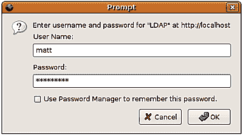

`AuthName` 显示在对话框的第一行：**请输入 "LDAP" 的用户名和密码，网址：http://localhost**。通常，`AuthName` 的值应该是一个提示，告知用户他或她正在登录的内容。

在 `<Directory>` 部分的下一行，`AuthBasicProvider` 指定用于基本认证的服务。除了 LDAP，Apache 还支持平面文件、哈希式数据库、关系型数据库以及其他来源。

我们希望使用 LDAP 认证。在 Apache 2.2 中，LDAP 认证（AuthN）和授权（AuthZ）服务由 `mod_authnz_ldap` 模块提供。要使用 `mod_authnz_ldap` 认证源，`AuthBasicProvider` 参数应设置为 `ldap`。这意味着当客户端尝试对 Web 服务器进行认证时，将使用 LDAP 源来处理认证令牌。换句话说，用户名和密码将与目录中的信息进行比对。

一旦认证成功，下一阶段是 *授权*。在这一阶段，Web 服务器决定认证过的用户是否有权限访问请求的资源。接下来两个参数适用于授权过程。

`Require` 指令指定用户获得访问请求资源的条件。稍后，我们将探讨如何要求用户具备特定属性或成为目录信息树中特定组的成员。但在我们的示例中，`valid-user` 要求仅需要用户存在于指定的来源（此例为目录中）并且用户能够成功认证。

`AuthzLDAPAuthoritative` 表示是否应仅使用 LDAP 作为授权信息的来源。默认情况下，这是启用的，这将导致 Apache 使用一个 `ldap-*` `Require` 值。但在之前的示例中，我们要做的只是确保用户是有效用户——也就是说，用户已成功通过身份验证。仅此就足够作为我们的授权。在这种情况下，验证检查是在 `mod_authnz_ldap` 模块外部提供的，因此我们需要关闭 `AuthzLDAPAuthoritative` 标志：

```
AuthzLDAPAuthoritative off
```

为了使用 `require` 参数的 `valid-user` 值，我们需要关闭 `AuthzLDAPAuthoritative`，以便可以使用另一个模块（`mod_auth_basic`）来处理授权。在这种情况下，LDAP 只会执行身份验证步骤。

接下来的三个指令是 LDAP 特定的：

```
AuthLDAPBindDN "uid=authenticate,ou=system,dc=example,dc=com"
AuthLDAPBindPassword "secret"
AuthLDAPURL ldap://localhost/ou=Users,dc=example,dc=com?uid?? \
    (objectclass=inetOrgPerson)
```

`AuthLDAPBindDN` 和 `AuthLDAPBindPassword` 指定了 Apache 应使用的 DN 和密码，以执行对 LDAP 服务器的简单绑定。当新的身份验证请求到来时，Apache 将使用此 DN 和密码绑定到 SLAPD，然后搜索目录信息树以获取尝试进行身份验证的用户的 DN。换句话说，绑定的 DN 和密码用于本章第一部分讨论的两阶段身份验证的第一阶段。

### 注意

如果省略了 `AuthLDAPBindDN` 和 `AuthLDAPBindPassword`，Apache 将作为匿名用户进行绑定。

对于此应用程序，将使用 `uid=Authenticate` 系统帐户来访问目录。这提供了一定程度的安全性（因为我们不必允许匿名绑定和搜索），同时也可以提供更好的审计跟踪，记录谁访问了目录中的哪些内容。

### 注意

您的 SLAPD ACL 需要配置成允许此 DN 从 Apache 服务器进行绑定，否则身份验证的第一阶段将失败。

第三个 `mod_authnz_ldap` 指令是 `AuthLDAPURL`。该参数的值是一个 LDAP URL，包含基本 DN、搜索类型、搜索模式以及要返回的属性。

在前面的示例中，我们使用了这个 LDAP URL：`ldap://localhost/ou=Users,dc=example,dc=com?uid??(objectclass=inetOrgPerson)`。Apache 使用此 URL 提取它需要的所有信息，以便搜索用户的 DN。

当用户登录时，正如几页之前登录对话框所示，Apache 将获取用户名和密码。用户名应映射到该用户 LDAP 记录中的 `uid` 属性，密码应与 `userPassword` 属性的值匹配（当然是在 SLAPD 对其进行哈希处理之后）。

一旦接收到这些信息，Apache 将使用 `AuthLDAPBindDN` 中的 DN 进行绑定，并根据上述 LDAP URL 执行搜索，目标是获取尝试登录的用户的 DN。

### 注意

请注意，所有 LDAP 通信都由 Apache 执行，而不是浏览器。网页浏览器从未直接连接到 LDAP 服务器。这意味着目录可以被防火墙保护。只要 Apache 可以访问它，LDAP 认证就可以使用。

虽然 LDAP URL 在附录 B 中有更详细的介绍，我们将简要查看刚才看到的 URL，以理解其功能。协议部分表明 Apache 要建立一个未加密的 LDAP 连接：

```
ldap://localhost/ou=Users,dc=example,dc=com?uid?? \
    (objectclass=inetOrgPerson)
```

可以通过使用 `ldaps://` 代替 `ldap://` 来建立 SSL LDAP 连接。（您可能还需要 `LDAPTrustedGlobalCert` 参数来指示 LDAP 证书的证书授权文件的位置。）

### 提示

**使用 StartTLS 代替 LDAPS**

StartTLS（而不是 LDAPS）是建立 SSL/TLS 连接到目录的首选方式。要在 Apache 2.2 中使用 StartTLS，请将指令`LDAPTrustedMode TLS`添加到`<Directory>`部分。再次提醒，您可能需要 `LDAPTrustedGlobalCert` 参数或其他 SSL/TLS 参数。

URL 的协议部分之后是主机：

```
ldap://localhost/ou=Users,dc=example,dc=com?uid?? \
    (objectclass=inetOrgPerson)
```

在这种情况下，SLAPD 与 Apache 运行在同一台服务器上，因此 `localhost`（或 `127.0.0.1`）将导致 Apache 使用回环接口连接到 SLAPD。

下一部分是基础 DN，即 SLAPD 开始搜索用户的 DN：

```
ldap://localhost/ou=Users,dc=example,dc=com?uid?? \
    (objectclass=inetOrgPerson)
```

由于我们的用户都位于 `ou=Users,dc=example,dc=com` 分支下，因此我们将使用它作为基础 DN。

剩余的参数都由问号（`?`）分隔，而不是斜杠。在基础 DN 后是 SLAPD 将搜索的属性：

```
ldap://localhost/ou=Users,dc=example,dc=com?uid?? \
    (objectclass=inetOrgPerson)
```

在这种情况下，用户发送到目录的名称应该是她或他的 UID，因此我们需要查找 `uid` 属性。类似地，您可以使用 `cn` 或任何其他属性，只要您知道它将返回不超过一个匹配项。

要使 Apache 认证正常工作，必须返回唯一的 DN 作为标识属性。其操作原理如下：如果搜索返回多个条目，Apache 无法确定哪个记录是正确的认证用户。因此，如果搜索返回多个 DN，Apache 将认为认证尝试失败，并且不允许用户访问该站点。

在 `uid` 后面是一个空参数，表示通过两个连续的分隔符`(??)` `??:`。

```
ldap://localhost/ou=Users,dc=example,dc=com?uid?? \
    (objectclass=inetOrgPerson)
```

这一部分可以用来指定搜索范围。将其留空表示接受默认范围，即 `sub`（子树）。子树范围指示 SLAPD 查找出现在基础 DN 或其下属的任何记录。其他选项包括 `base`、`one` 和 `children`。

最后一个字段是过滤器：

```
ldap://localhost/ou=Users,dc=example,dc=com?uid?? \
    (objectclass=inetOrgPerson)
```

这表示只有具有`inetOrgPerson`对象类的记录才会被搜索。当 Apache 处理 URL 时，它将构造一个结合用户名搜索和给定过滤器的搜索过滤器。结果可能是这样的：`(&(uid=matt)(objectclass=inetOrgPerson))`，其中`matt`是尝试登录的用户的名称。

针对我们的目录信息树，搜索应该返回一个 DN，`uid=matt, ou=users,dc=example,dc=com`。当 DN 返回到 Apache 时，它将执行第二次绑定，这次使用`uid=matt,ou=users,dc=example,dc=com`和用户提交的密码。如果该绑定成功，则 Apache 将授予用户访问权限。

在`<Directory>`部分中使用这些参数后，我们已经配置了 Apache，仅当 web 用户在目录信息树中存在并能够提供必要的信息成功绑定时，才能查看`private/`目录中的信息。

#### Apache 2.0 的变化

要在 Apache 2.0 中获得基本相同的行为，我们需要对配置进行一些小的修改：

```
<Directory "/var/www/private">
    AuthType Basic
    AuthName LDAP
    Require valid-user
    AuthLDAPBindDN "uid=authenticate,ou=system,dc=example,dc=com"
    AuthLDAPBindPassword "secret"
    AuthLDAPURL ldap://localhost/ou=Users,dc=example,dc=com?uid?? \
        (objectclass=inetOrgPerson)
</Directory>

```

此文件与 Apache 2.2 配置的不同之处在于，它缺少`AuthBasicProvider`和`AuthzLDAPAuthoritative`参数。

### `Require`参数的其他功能

在上一节中，我们使用了`Require` `valid-user`参数来强制执行授权要求，要求任何尝试访问该网站部分的用户必须在目录信息树中存在，并能够成功绑定。

但是，`Require`参数还可以采用其他选项。我们将简要地查看每个选项。Apache 2.0 使用了不同的名称，我已将它们放在 Apache 2.2 使用的名称后面：

+   `valid-user`：这要求用户在目录中存在并且可以绑定。这个选项在 2.0 和 2.2 版本中是相同的。

+   `ldap-user`（`ler`）：这要求用户在用户列表中。例如，`Require` `ldap-user` `matt` `dave`将只允许有效的用户，且这些用户的 UID 为`matt`或`dave`。

+   `ldap-dn`（`dn`）：这要求 DN 与`Require`参数中的 DN 完全匹配。例如，`Require` `ldap-dn` `uid=matt,ou=users,dc=example,dc=com`要求用户有效，并且具有 DN `uid=matt,ou=users,dc=example,dc=com`。

+   `ldap-group`（`group`）：这要求用户有效且是指定组的成员。稍后我们会更详细地讨论这个指令。

+   `ldap-attribute`：这个参数在 2.0 和 2.2 中名称相同。若在`Require`参数中使用此项，要使用户获得访问权限，用户必须有效，并且必须具有此参数所声明的属性。例如，`Require` `ldap-attribute` `departmentNumber=001` 只会授予有效的用户访问权限，并且该用户必须具有`departmentNumber`属性，且该属性值为`001`。

+   `ldap-filter`（*新功能*，*Apache 2.2*新增）：它接受一个 LDAP 过滤器，如果用户有效且在执行该过滤器的 LDAP 搜索时返回用户记录，则授予访问权限。

配置基于组的访问控制可能比其他`Require`指令稍微复杂一些。该要求的基本用法如下：

```
Require ldap-group cn=Admins,ou=groups,dc=example,dc=com
```

### 注意

在 Apache 2.0 中，`ldap-group`应替换为`group`。

根据此指令，用户必须是`cn=Admins,ou=groups,dc=example,dc=com`组的成员，才能进行身份验证。当 Web 用户尝试登录时，Apache 将作为`AuthLDAPBindDN`中的用户进行绑定，执行对该用户 DN 的搜索，再次以该用户身份进行绑定，然后（仍然作为`AuthLDAPBindDN`中的用户）检查该用户是否在`cn=Admins`组中。

为了使该组搜索正常运行，`AuthLDAPBindDN`中的用户必须具有访问组条目的权限。（我们在第四章中的 ACL 没有允许这一点。）你可能需要在 ACL 中添加如下规则：

```
## Allow anyone to read the groups branch. (Needed for group auth)
access to dn.subtree="ou=groups,dc=example,dc=com"
       by * read
```

这将允许任何人（包括匿名用户）读取`ou=groups`子树中的条目。

Apache 如何知道要查找哪种类型的组属性？`groupOfNames`对象类使用`member`属性，而`groupOfUniqueNames`对象类使用`uniqueMember`属性。两者都是标准的 LDAP 对象类。

Apache 会检查`member`和`uniqueMember`属性。但可能会出现需要将其他属性视为成员属性的情况。`seeAlso`、`owner`和`roleOccupant`都是可以作为成员属性的标准属性，此外你还可以在自定义架构中定义其他属性。在这种情况下，可以在`<Directory>`部分使用`AuthLDAPGroupAttribute`参数来告诉 Apache 应该将哪个属性视为成员属性。

# phpLDAPadmin

我们已经配置了 Apache，使用内置的 LDAP 模块通过目录服务器进行身份验证。现在我们将转向一个更复杂的基于 Web 的应用程序——**phpLDAPadmin**。phpLDAPadmin 是一个用 PHP 编写的应用程序，旨在帮助管理目录服务器。虽然它已知可以在其他目录服务器上运行，但它是针对 OpenLDAP 开发的。

## 前提条件

在我们安装 phpLDAPadmin 之前，需要先安装其他一些软件包。在本章的第一部分中，我们了解了 Apache。要运行 phpLDAPadmin，需要使用某些版本的 Web 服务器（我们使用的是 PHP 5），并且需要 PHP LDAP 模块。

例如，要安装 PHP 5，我们可以运行以下命令：

```
 $ sudo apt-get install libapache2-mod-php5 php5-ldap

```

安装 PHP 可能需要满足其他一些依赖项，但`apt-get`会为你处理这些繁重的任务。

### 注意

如果你是从源代码构建 OpenLDAP，可能会提示你安装另一个（可能较旧的）版本的 LDAP 库，以满足软件包依赖性。这样做不会对当前的 LDAP 应用程序造成任何影响。

一旦 PHP 安装完成，你可以重启 Apache，然后继续安装 phpLDAPadmin。

## 安装 phpLDAPadmin

安装 phpLDAPadmin 的最简单方法是使用 Ubuntu 仓库中的软件包。

phpLDAPadmin 被包含在 Ubuntu 的*universe* 仓库中。这意味着，只要你在源列表中启用了 universe 仓库（请参见`/etc/apt/sources.list`），就可以通过简单的`apt-get`命令安装它：

```
 $ sudo apt-get install phpldapadmin

```

phpLDAPadmin 将被安装在文件系统中的`/usr/share/phpldapadmin`目录下，Apache 被配置为将对[`hostname/phpldapadmin`](http://hostname/phpldapadmin)的请求指向 phpLDAPadmin 应用。Apache 配置文件位于`/etc/phpldapadmin/apache.conf`。

### 注意

你也可以从[`phpldapadmin.sourceforge.net`](http://phpldapadmin.sourceforge.net)获取源代码包，轻松安装 phpLDAPadmin。一旦 Web 服务器和 PHP 安装完成，只需将源代码解压到 Web 服务器的根目录下的一个文件夹中（例如`/var/www/`）。有关完整的安装说明，请参见官方 phpLDAPadmin 文档 Wiki 上的安装指南：[`wiki.phpldapadmin.info/tiki-index.php?page_ref_id=6`](http://wiki.phpldapadmin.info/tiki-index.php?page_ref_id=6)。

安装完 phpLDAPadmin 后，我们可以继续配置。

### 你的软件包是否损坏？

一些版本的 Ubuntu phpLDAPadmin（特别是`phpldapadmin_0.9.8.3-7`）自带的配置文件丢失了。因为这个原因，在安装过程中，你可能会看到类似这样的错误：

```
* Forcing reload of web server (apache2)...
grep: /etc/apache2/conf.d/phpldapadmin: No such file or directory

apache2: Syntax error on line 195 of /etc/apache2/apache2.conf: Could 
not open configuration file /etc/apache2/conf.d/phpldapadmin: No such 
file or directory

[fail]
invoke-rc.d: initscript apache2, action "restart" failed.
```

问题在于文件`/etc/phpldapadmin/apache.conf`（它链接到`/etc/apache2/conf.d/phpldapadmin`）丢失了。

幸运的是，我们可以在`/etc/phpldapadmin`目录中创建一个合适的单行`apache.conf`文件。这个配置文件的目的是将 phpLDAPadmin 映射到文件系统中 phpLDAPadmin 脚本所在的绝对路径。

要创建这个映射，我们只需要在`/etc/phpldapadmin/apache.conf`文件中添加以下一行：

```
Alias /phpldapadmin /usr/share/phpldapadmin/htdocs
```

保存此更改后，简单地重启 Web 服务器：

```
 $ sudo invoke-rc.d apache2 restart

```

然后，Apache 应该会在没有错误的情况下重启。

## 配置 phpLDAPadmin

phpLDAPadmin 配置文件位于`/etc/phpldapadmin/config.php`。phpLDAPadmin 使用的配置文件格式在 PHP 和 Perl 应用中较为常见，但对于习惯编辑大多数 UNIX 应用使用的典型名称/值参数文件的人来说，可能会显得有些令人生畏。

这个配置文件与标准类型的主要区别有两个：

+   默认配置选项的处理方式

+   配置参数的形式

关于第一点，phpLDAPadmin 有两个配置文件，一个用于存储所有默认设置（`/usr/share/phpldapadmin/lib/config_default.php`），另一个供管理员编辑（`/etc/phpldapadmin/config.php`）。管理员应该只修改第二个配置文件。`config_default.php` 文件不应被修改。

当 phpLDAPadmin 尝试访问某个设置时，它会首先检查是否在自定义设置文件（`config.php`）中存在该设置。如果找到了，它将使用该设置。如果没有找到，则使用默认设置的值。

这种技术的优点是，升级 phpLDAPadmin 时无需对自定义配置文件进行任何更改。只需修改默认文件。缺点是有时会添加新参数，但由于管理员的配置文件保持不变，可能会被忽略。

第二个区别，配置参数的形式，部分基于第一个。phpLDAPadmin 并没有使用简单的文本文件来存储参数，而是使用 PHP 变量来存储信息。从这个意义上讲，`config.php` 配置文件实际上是一个代码片段。

这样做有一些明显的优势：

+   配置文件中可以使用所有内建的 PHP 功能（包括动态评估的脚本）。

+   无需特殊的配置文件解析器，从而使得代码体积更小，运行速度更快。

但是这种方法肯定有一些缺点，主要的问题是文件的可读性可能会大大降低。例如，默认配置文件几乎有 400 行，并且包含了代码（尽管只有少量）与配置参数混合在一起。

另一个缺点是，应用程序的直观配置仍然需要一些 PHP 语言的知识。

在我们查看配置文件时，我不会假设你对 PHP 有工作知识，并且会解释配置文件中的一些构造。

### 配置参数的基本概览

phpLDAPadmin 中的配置参数一开始看起来可能让人望而却步。在这一部分，我将解释每种配置参数的格式。每个部分都会提供一个简短的示例，展示该参数的形式，之后是对其所做操作的更详细描述。

如果你不是程序员，不必气馁，如果并非所有内容都能理解。最重要的是，你要理解每个配置指令的结构。

### 注意

由于这不是 PHP 教程，我只会简要介绍一些设置参数时需要理解的概念。如需更多 PHP 信息，PHP 团队维护了一个非常好的在线手册，网址是 [`www.php.net/manual/en/`](http://www.php.net/manual/en/)。

在 phpLDAPadmin 的 `config.php` 文件中，配置参数有三种形式：变量设置、函数调用或数组设置。

#### 设置一个变量

设置变量是这三者中最简单的。简而言之，变量赋值看起来像这样：

```
$variable_name = 'value';
```

这就是变量定义的工作方式。

在 PHP 中，所有变量名都以美元符号（`$`）开头。等号（`=`）用来给变量赋值。字符串值应当用单引号（`'`）或双引号（`"`）括起来。数字（整数或浮动小数）不需要加任何引号。每一行都应以分号（`;`）结尾。以下是两个示例：

```
$name = 'Matt';
$favorite_number = 7;
```

第一个设置`$name`变量的值为字符串`Matt`。第二个设置`$favorite_number`变量的值为整数`7`。

在`config.php`中只有少数几个简单的配置参数。大多数参数是以更复杂的 PHP 语句形式出现的。

#### 调用一个函数

phpLDAPadmin 的配置文件中的配置参数的第二种形式使用了函数调用。简言之，函数调用看起来像这样：

```
$object->function('parameter one', 'parameter 2');
```

一个函数可以有零个或多个参数，参数的数量由程序员决定。

函数可以附加到对象上。粗略来说，对象是数据和函数的容器。phpLDAPadmin 是一个面向对象的程序，意味着它频繁使用对象来组织源代码的功能单元。

要调用附加到对象的函数，你需要使用箭头（访问）操作符（`->`），它由短横线（`-`）和大于号（`>`）组成。这表示该函数是对象的*成员*。以下是从 phpLDAPadmin 配置文件中提取的一个示例：

```
$i = 0;
$ldapservers = new LDAPServers;
$ldapservers->SetValue($i,'server','name','My LDAP Server');
```

第一行将名为`$i`的变量赋值为`0`。

第二行创建了一个新的`LDAPServers`对象，并将其赋值给变量`$ldapservers`。现在，每当我们操作变量`$ldapservers`时，实际上是在操作一个拥有`LDAPServers`类中定义的所有成员函数和变量的对象。`LDAPServers`类描述了 phpLDAPadmin 将连接的服务器。

你可以将类视为定义机器的各个部分，而对象则是该机器的实例。一旦我们拥有了 LDAPServers 机器的副本，就可以访问机器中存储的数据，并使用机器的功能执行特定任务。

根据该对象的类定义，它有一些成员函数，包括`SetValue()`函数。该函数将数据存储在`$ldapservers`对象中。所以在给定示例中的第三行设置了一些关于 LDAP 服务器的信息：

```
$ldapservers->SetValue($i,'server','name','My LDAP Server');
```

这一行使用了`$ldapservers`的`SetValue()`函数。`SetValue()`函数需要四个不同的参数：

+   服务器的编号（此时为`$i`的值）

+   一个表示此设置类型的字符串（`'server'`）

+   一个表示要设置的属性名称的字符串（`'name'`）

+   一个表示属性值的字符串（`'My` `LDAP` `Server'`）

稍后我们将讨论这些每一项的作用。不过目前重要的是理解函数的一般形式：`$object->function(` `param_1,` `param_2);`。一个函数可以有程序员决定的任意数量的参数。

大部分情况下，配置文件中的注释会引导我们了解每个函数需要什么样的参数。你不需要查看其他任何代码来弄清楚在对象中应该放入什么。

现在我们来看看列表类型的指令。

#### 设置数组值

在 phpLDAPadmin 中，最后一种配置参数是数组。设置数组值有两种基本形式：

```
$my_array[0] = 'My Value';
$my_map['Key Name'] = 'Value';
```

**数组** 是一种组织信息的集合。PHP 有两种不同类型的数组：索引数组（其中元素按编号顺序存储）和映射数组（其中元素按名称/值对存储）。

可以这样创建一个索引数组：

```
$my_array = array( 'a', 'b', 'c');
```

这创建了一个包含三项的数组：`'a'`、`'b'` 和 `'c'`。第一个 `'a'` 被存储在数组的第一个槽中，并可以通过索引号访问：

```
$my_array[0];
```

请注意，第一个索引号是零，而不是一。这将返回值 `'a'`。第二个元素可以通过第二个项的索引号访问：

```
$my_array[1];
```

这将返回 `'b'`。

在映射类型的数组中，不是使用数字作为索引，可以使用一些字符串（或其他对象）。例如，我们可以这样创建一个映射：

```
$my_map = array( 'First Name' => 'Matt', 'Last Name' = 'Butcher' );
```

这创建了一个包含两个项的数组，一个名为 `First` `Name`，另一个名为 `Last` `Name`。现在，我可以通过名称而不是索引来访问它们：

```
$my_array['First Name'];
```

这将返回 `'Matt'`。

一旦通过 `array()` 函数创建了一个数组，你可以通过给数组槽赋值来向数组中添加元素。对于一个索引数组，这可能像下面这样：

```
$my_array[3] = 'd';
```

这将把 `'d'` 放在数组中的第四个位置（0、1、2、**3**）。

同样，向映射中添加值也类似，不同的是，你用的是键名而不是索引号：

```
$my_array['First Name'] = 'Dave';
```

这将把名字 `'Dave'` 添加到键名为 `'First` `Name'` 的数组项中。

最后，数组可以互相嵌套。再一次，这里是来自 phpLDAPadmin 配置文件的一个示例：

```
$q=0;
$queries = array();
$queries[$q]['name'] = 'User List';
$queries[$q]['base'] = 'dc=example,dc=com';
```

在这个示例中，`$queries` 数组是一个索引数组，每个值都是一个映射数组。所以 `$queries[0]['name']` 和 `$queries[1]['name']` 代表两个不同的名字值。每个名字值被存储在索引数组中的不同位置。可以把这个数组看作是像下面这样结构化的伪代码：

```
Queries[0]:
  'name' => 'User List'
  'base' => 'dc=example, dc=com'
Queries[1]:
  'name' => 'Another List'
  'base' => 'dc=demo, dc=net'
```

现在我们有两个不同的查询（都存储在同一个索引数组中）：查询 0 和 查询 1。每个查询都有自己的名字和基础。

这些是数组的基本特性——我们将用这些特性来配置 phpLDAPadmin。现在我们准备开始实际配置 phpLDAPadmin。

### 配置 LDAP 服务器设置

我们需要做的第一件事是配置 phpLDAPadmin 以连接到我们的 LDAP 服务器。这是通过 `$ldapservers` 对象来完成的。

在我的安装中，Apache 和 OpenLDAP 运行在同一台服务器上，因此我将配置 phpLDAPadmin 连接到本地实例。

为了开始这一部分的配置，我们需要在配置文件中找到 `$ldapservers` 对象。我们关心的行看起来像这样：

```
$ldapservers = new LDAPServers;
```

它位于我们默认配置文件的第 63 行。

这定义了 `$ldapservers` 对象。我们为 LDAP 服务器配置的其他指令需要位于此行下方。

首先需要做的是设置我们的 LDAP 连接信息。我们需要为我们的 LDAP 服务器指定一个名称、主机和端口信息，并指定是否希望通过 TLS 加密此连接：

```
$ldapservers->SetValue($i,'server','name','Example.Com');
$ldapservers->SetValue($i,'server','host','localhost');
$ldapservers->SetValue($i,'server','port','389');
$ldapservers->SetValue($i,'server','tls',false);
```

这将我们的服务器命名为 `Example.Com`，并将其配置为连接到 `localhost` 上的默认 LDAP 端口 `389`，没有任何 SSL/TLS 加密。

给定函数中的 `$i` 表示我们正在配置的 LDAP 服务器的编号。`$i` 被设置为 `0`，表示这是我们配置的第一个 LDAP 服务器。如果需要配置第二个 LDAP 服务器，我们会将 `$i` 改为 `1`，然后继续执行第二批相同类型的指令。

第二个参数 `'server'` 表示我们正在设置服务器参数。第三个参数（`'name'`、`'host'`、`'port'` 和 `'tls'`）表示我们正在设置的具体服务器参数，第四个参数包含要分配给该参数的值。

请注意，TLS 设置用于开启或关闭 StartTLS（见第四章）。如果您希望使用 LDAPS（基于 SSL 的 LDAP），请在主机设置中使用 LDAP URL，`'ldaps://example.com'`，并将端口设置为正确的 LDAPS 端口（默认端口为 `636`）。

接下来，我们需要告诉 phpLDAPadmin 登录信息存储的位置。该信息存储在 `auth_type` 参数中：

```
$ldapservers->SetValue($i,'server','auth_type','session');
```

当用户登录 phpLDAPadmin 时，用于绑定到 LDAP 的信息会被存储。此信息可以存储在三个地方：

+   Web 浏览器中的 cookie（`'cookie'`）

+   服务器会话变量（`'session'`）

+   （这些信息可以手动添加到）配置文件（`'config'`）

一般来说，我们应将信息存储在会话变量中（正如给定示例所做的那样）。如果选择基于 cookie 存储，请确保还将 `$config->custom->session['blowfish']` 设置为一个随机字符的字符串。该字符串用作 Blowfish 加密算法的密钥，且必须至少为 32 个字符长，越长越好。

### 注意

有关 Blowfish 加密算法的信息，请参见 [`www.schneier.com/blowfish.html`](http://www.schneier.com/blowfish.html)。

下一个参数设置了 phpLDAPadmin 应显示的命名上下文（基础 DN）列表：

```
$ldapservers->SetValue($i,
    'server','base'(,array('dc=example,dc=com'));
```

这只设置了一个上下文 DN：`dc=example,dc=com`。虽然在某些 LDAP 服务器上此设置是必要的，但 OpenLDAP 不需要它。OpenLDAP 在根 DSE 记录中发布了上下文的列表，phpLDAPadmin 可以从中获取信息。事实上，这就是 phpLDAPadmin 的默认配置，因此该设置可以省略或设置为：

```
$ldapservers->SetValue($i,'server','base',array());
```

这将创建一个空的上下文列表（`array()`），并使 phpLDAPadmin 在根 DSE 中查找支持的上下文。

只剩下两个参数需要查看：

```
$ldapservers->SetValue($i,'login','anon_bind',false);
$ldapservers->SetValue($i,'appearance','password_hash','ssha');
```

我们来看看这两个设置：

+   第一个设置禁用匿名绑定。这将防止用户在未登录的情况下访问 phpLDAPadmin。即使允许这种情况，SLAPD 中的 ACL 仍然会阻止此类用户修改目录信息树。

+   第二个设置指定了要使用的默认密码哈希。phpLDAPadmin 尝试直接修改`userPassword`属性，而不是使用 LDAP 密码修改扩展操作。为了做到这一点，它必须在将更新发送到 SLAPD 之前，执行所有的加密和 Base-64 编码。此设置告诉 phpLDAPadmin 在修改密码时应该使用哪种哈希算法。默认情况下，OpenLDAP 使用 SSHA，因此我们应该将 phpLDAPadmin 设置为相同的算法。

    如果你在`slapd.conf`中使用 password-hash 指令设置了不同的值，应该在这里设置相同的值。

### 注意

不是所有 phpLDAPadmin 中的加密选项都被 OpenLDAP（或任何其他 LDAP 服务器）支持。你不应该为密码使用 blowfish 加密。OpenLDAP 不支持这种加密方式，phpLDAPadmin 错误地将其标记为`crypt`哈希。

虽然 phpLDAPadmin 配置文件中还有许多其他可配置的参数，但我们已经完成了基本的配置。现在可以使用我们的网页浏览器测试 phpLDAPadmin 工具了。

## phpLDAPadmin 初步介绍

安装了 PHP、重启了 Apache 并配置了 phpLDAPadmin 后，我们现在可以连接到 phpLDAPadmin。Ubuntu 安装了 phpLDAPadmin，并且它可以通过 URL[`<hostname or IP address>/phpldapadmin/`](http://<hostname or IP address>/phpldapadmin/)访问。在这种情况下，我在与 Apache 服务器相同的机器上运行网页浏览器，因此`http://localhost/phpldapadmin`指向 phpLDAPadmin 工具。

当 phpLDAPadmin 第一次加载时，它看起来像这样：

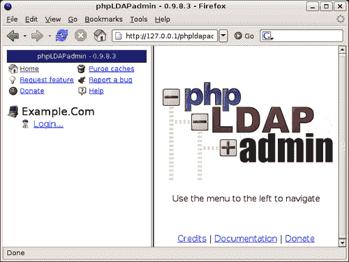

左侧框架是 phpLDAPadmin 的导航框架。带有**Example.Com**文本的计算机图标表示我们配置的服务器。如果 phpLDAPadmin 已配置了多个主机，则左侧框架将列出它们所有的主机。

这是截图：

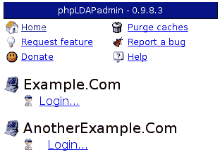

在顶部部分，在版本横幅（**phpLDAPadmin – 0.9.8.3**）下方，有六个链接。**主页**链接指向此页面。**请求功能**、**捐赠**和**报告错误**分别指向 phpLDAPadmin 外部网站的不同位置。**帮助**加载一个内部页面，里面的链接将返回 phpLDAPadmin 论坛网站。

最后，**清除缓存**链接可以用来清除 phpLDAPadmin 用来优化性能的 LDAP 数据副本的内部缓存。如果 phpLDAPadmin 显示的是某个数据的旧副本，而实际上应该显示更近期的更新，则可能需要此操作。

要登录我们的服务器，请点击**登录...**链接，位于**Example.Com**图标下方。这将在右侧的主框架中加载登录界面。

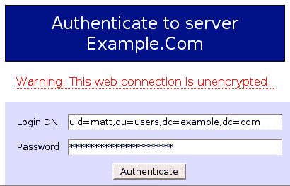

请注意，与 Apache 默认设置不同，phpLDAPadmin 默认要求您输入完整的 DN 才能登录。然后，它将直接以该 DN 进行绑定。

### 注意

警告消息**警告：此网页连接未加密**表明浏览器与 Web 服务器之间的连接是 HTTP 而不是加密的 HTTPS。对于这样的应用程序，最好配置 Apache 使用 HTTPS。更多信息，请参见[`httpd.apache.org/docs/2.0/ssl/`](http://httpd.apache.org/docs/2.0/ssl/)。

如果 phpLDAPadmin `conf.php` 文件中的 `anon_bind` 参数设置为 `true` 而不是 `false`，用户还可以勾选一个框来以匿名用户身份登录：

```
$ldapservers->SetValue($i,'login','anon_bind',true);
```

在这种情况下，用户无需输入 DN 或密码，但 phpLDAPadmin 将允许他们在 ACL 允许的范围内浏览目录信息树。

### 浏览 phpLDAPadmin

登录后，导航框架将显示此目录服务器上托管的目录信息树列表，如屏幕截图所示：

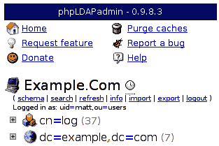

在**Example.Com**下方，现在有七个链接列表：

+   **架构**: 点击此按钮将显示此 LDAP 服务器支持的整个架构（来自`cn=subschema`）。

+   **搜索**: 这将加载用于执行简单 LDAP 搜索的主搜索表单。

+   **刷新**: 这将刷新当前显示在下方树形结构中的数据。如果条目已添加但未立即显示，点击**刷新**应该能够解决问题。

+   **信息**: **信息**链接将加载根 DSE 信息（已解码，以便人类更易读），显示在主框架中。这对于了解目录服务器非常有用。（有关 Root DSE 的更多信息，请参见附录 C。）

+   **导入**: 这将上传一个 LDIF 文件，并尝试将条目添加到目录服务器（通过 LDAP 添加操作）。

+   **导出**：通过此链接，你可以下载目录内容的副本。此操作也使用 LDAP 协议，这意味着它受 ACL 限制，可能无法导出所有内容。换句话说，它不是 `slapcat` 的替代品。不过，它有一个额外的优点：能够导出为 LDIF、DSML（XML 格式）、CSV（逗号分隔版本）和 VCARD 格式。

+   **注销**：此链接将当前用户从 phpLDAPadmin 中注销。

在这些链接列表下方是当前托管在此服务器上的两个目录信息树的基础条目，分别是 `cn=log` 树（保存访问日志）和 `dc=example,dc=com` 树（保存我们在本书中创建的目录条目）。

### 注意

这两棵树会显示出来，因为在 config.php 中设置的基础 DN 看起来像这样：`$ldapservers->SetValue(` `$i,` `'server',` `'base',` `array());`。这使得 phpLDAPadmin 使用来自根 DSE 的信息来确定哪些目录信息树在此托管。根 DSE 返回了两个：`cn=log` 和 `dc=example,dc=com`。

点击加号（`+`）图标会展开树的那部分，显示其下属条目：

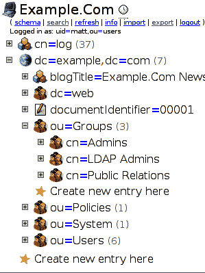

因此，可以通过左侧导航窗格快速有效地浏览目录信息树。

树中的每个条目仅显示 DN 的 RDN 部分。通过查看层级结构，可以构建完整的 DN，但如果你希望默认显示完整的 DN，可以在 `config.php` 文件中设置以下参数：

```
$config->custom->appearance['tree_display_format'] = '%dn';
```

相反，如果你只想显示 RDN 的值，而不显示 `attr=` 部分，你可以将该参数设置为 `%rdnValue`。

### 查看和修改记录

要查看完整的记录，只需点击左侧导航框中的层级视图中的所需条目。例如，如果我们点击 `cn=Admins`，主框中将显示完整的记录：

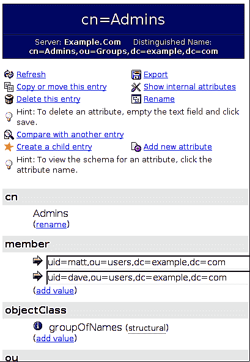

此屏幕提供了多个工具来操作记录，并显示所有记录的属性。工具如下：

+   **刷新**：此操作刷新当前记录。这在条目自上次加载此页面以来可能已更改时非常有用。

+   **复制或移动此条目**：此操作可用于将条目移动（或复制）到目录信息树中的另一个位置。

+   **删除此条目**：此操作会对记录执行 LDAP 删除，将其从目录信息树中移除。

+   **与另一个条目进行比较**：此操作显示两个不同记录的并排可编辑视图。它可以用来直观地扫描两个记录，或者将一个记录作为创建另一个记录的参考。

+   **创建子条目**：此操作将在当前选定条目的基础上创建一个新的子条目。

+   **导出**：这与左侧导航窗格中的**导出**链接执行相同的功能，只不过它默认选择当前条目，而不需要用户选择要导出的点。

+   **显示内部属性**：这将显示所选记录的操作属性。当然，操作属性不能由客户端应用程序修改，因此这些属性将是只读的。

+   **重命名**：这允许您更改条目的 RDN（就像我们使用`ldapmodrdn`命令行工具所做的那样）。

+   **添加新属性**：通过这个功能，您可以向条目添加新属性。phpLDAPadmin 允许您从当前记录的对象类所允许的属性列表中选择属性。换句话说，您不必担心意外选择不允许该记录拥有的属性。

在这些工具选择下方，是当前记录的所有属性的显示：

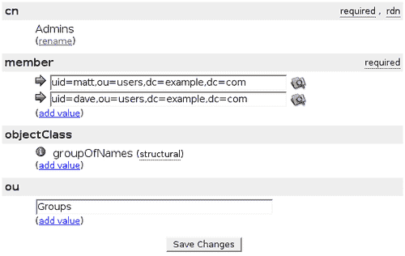

`cn=Admins`组记录具有以下（非操作）属性：`cn`、`member`、`objectclass`和`ou`。phpLDAPadmin 分析记录并呈现适合该记录的选项。

首先，`cn`不能修改，因为它用于 RDN（如最右侧所示）。此外，它被标记为**必需**。点击**重命名**链接将与工具列表中的**重命名**选项做相同的事情：提示我执行`modrdn`操作。

在`member`属性下，它也是必需的，有两个值：属于此组的用户的 DN。

DN 左侧的箭头 () 是指向这些用户记录的链接。如果点击该链接，它将加载一个类似的页面，允许您编辑该 DN 的记录。

在成员 DN 字段的另一侧是看起来像带放大镜的目录图标 ()。点击此图标将允许您浏览目录树，找到另一个 DN 并将其放入此字段。

我们稍后会查看这个对话框。但首先，我们将通过添加一个新的属性值来向我们的组中添加一个新的组成员。

查看记录显示的**member**部分，我们可以通过点击**添加值**链接来添加新成员。这将弹出一个属性编辑屏幕：

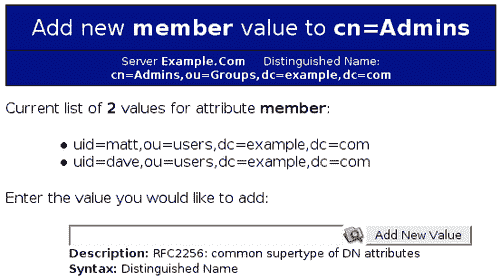

属性编辑屏幕用于向现有记录添加新属性。在屏幕顶部，我们可以看到有关我们正在添加的属性（**member**）以及其所在记录（**cn=Admins**）的一些基本信息。

接下来，属性编辑器列出了该属性的现有值（因为该组已经有两个成员）。最后，有一个单行文本框，允许我们输入一个新成员。

phpLDAPadmin 会检查该属性的架构并显示架构描述以及语法的可读人描述。

另外，由于此字段的值是 DN，右侧会出现查找图标（带放大镜的文件夹图标）。我们可以点击该图标调出查找对话框，在该窗口中，我们可以浏览目录信息树，找到我们想要添加的 DN。它会像这样显示：

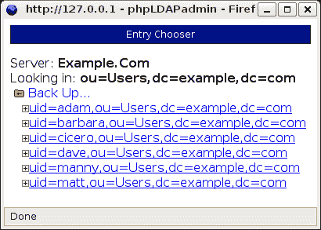

点击加号（`+`）图标将展开该树的分支，而点击 DN 本身则会将该 DN 插入到属性编辑屏幕中的字段中。

### 注意

此查找对话框在 phpLDAPadmin 中经常使用，提供了一个简单的树形导航工具，用于在目录信息树中定位条目。

现在我们在新的`member`字段中有了所需的值：

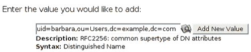

点击**添加新值**按钮将暂时把此属性添加到我们的`cn=Admin`组，并将我们返回到记录视图。我们的新添加项将在主记录视图中显示：

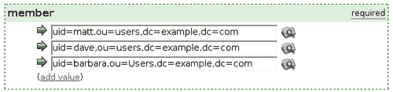

现在我们有三名成员。在页面底部有一个按钮，标注为**保存更改**。该按钮用于保存直接对页面字段所做的任何更改，但它并不需要用来保存新加入的组成员——用户`uid=barbara`已经被添加到该组。

请注意，`objectClass`字段不允许修改结构对象类。这是因为 LDAP 不允许更改条目的结构对象类。然而，可以使用**添加值**链接添加新的对象类（辅助类）。

此外，在每个对象类旁边都有一个信息图标 ()——一个蓝色圆圈，里面有一个白色字母`i`。

点击此图标将加载该对象类的架构查看器，显示有关该对象类的有用信息：

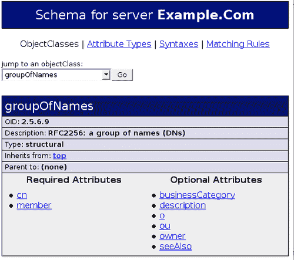

架构查看器展示了 LDAP 架构中存储的所有信息，但比我们在第六章中查看的架构文件要更加人性化。架构查看器提供了一个界面来查看对象类、属性定义、匹配规则和语法信息。在这种情况下，它展示了`groupOfNames`对象类。属性和上级对象类是相互链接的，这使得浏览架构变得更加容易。此外，还有一个**跳转到对象类**下拉列表，提供了一种快速查看其他对象类的方式。

### 添加新记录

可以在 phpLDAPadmin 的多个位置添加新记录。在任何有星形图标的地方 ()，都表示可以在此位置添加一个新的下级记录。

让我们添加一个简单的用户帐户。为此，我们将使用左侧导航窗格中的树状视图定位`ou=Users`分支：

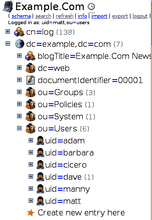

点击星形图标（**在此处创建新条目**）将把记录创建视图加载到主框架中。我们可以在此开始定义新用户的条目。

第一步是为新用户选择一个结构对象类。phpLDAPadmin 提供了一个可供选择的列表：

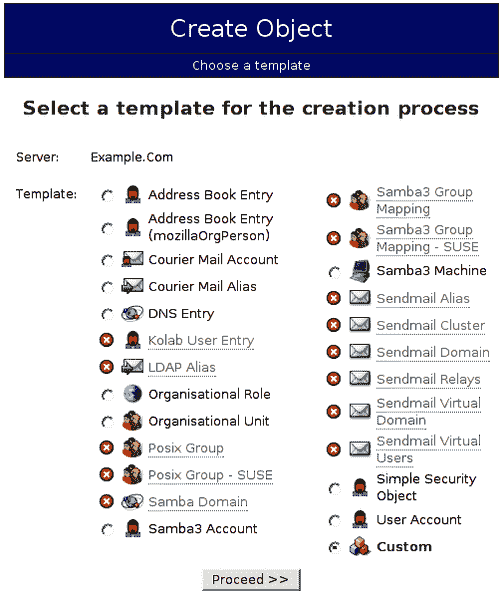

phpLDAPadmin 系统有许多预定义的模板用于添加新条目，但我们的 LDAP 服务器并未配置 phpLDAPadmin 支持的所有对象类。（这些模式中的许多已经在`/etc/ldap/schemas/`目录中定义。）

尝试添加**用户帐户**（该帐户使用`posixUser`对象类，如`nis.schema`中定义的）会在创建用户时出现问题。

在 phpLDAPadmin 中定义但在模板定义中被禁用的条目会用黑色圆圈中的白色箭头标记；这些条目无法选择。

### 注意

可以轻松创建和添加新的自定义模板。模板是存储在`/etc/phpldapadmin/templates/`中的简单 XML 文件。要添加一个新的模板，只需创建一个新的 XML 文件（或复制并修改现有文件），将其保存在`templates/`目录中，然后使用 phpLDAPadmin 中的**清除缓存**工具强制重新加载 XML 文件。请参阅本书中附带的示例包（可在 Packt 网站上找到：[`www.packtpub.com`](http://www.packtpub.com)）。

我们希望创建一个新的`inetOrgPerson`对象。由于没有为`inetOrgPerson`预定义模板，我们将使用**自定义**模板。

第一步是创建 DN 并选择一个结构对象类：

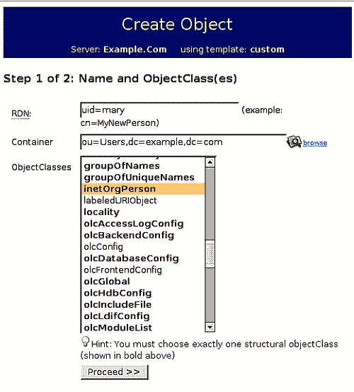

我们新用户的 UID 将是`mary`，并且一如既往，我们将使用`uid`作为 RDN 中的属性。用户将位于`ou=Users`组织单位中。我们希望从对象类列表中选择`inetOrgPerson`（以及`person`和`organizationalPerson`）。点击**继续 >>**将带我们进入下一个页面，在那里我们可以填写一些属性值。以下是下一个页面：

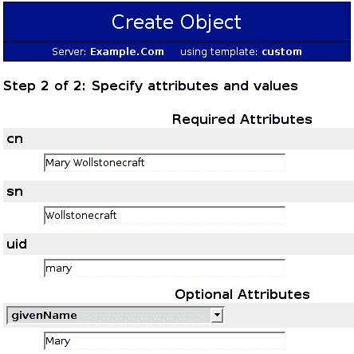

必填属性位于表单的顶部。之后，有一个选择多个可选属性并为其赋值的部分。如果在这里添加`userPassword`值，它将被正确加密并存储在目录服务器上。

滚动到此页面底部，有一个标有**创建对象**的按钮。点击该按钮将在目录服务器上执行 LDAP 添加操作。

一旦新用户创建完成，phpLDAPadmin 将显示该条目。

其他模板通过自动选择正确的对象类，并将可用的属性缩小到最常用的那些，简化了这一过程。

### 使用 phpLDAPadmin 进行搜索

我们将在 phpLDAPadmin 中查看的最后一个任务是 **搜索**。phpLDAPadmin 配备了一套搜索工具，可以用来在目录信息树中查找信息。

要进入搜索界面，请点击左侧导航框中的 **搜索**。这将带你到基本搜索屏幕：

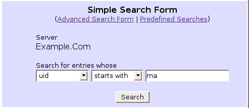

在这里，我们将搜索所有 UID 以 `ma` 开头的条目。点击 **搜索** 按钮将执行搜索，对于我们的目录，它返回四条记录：

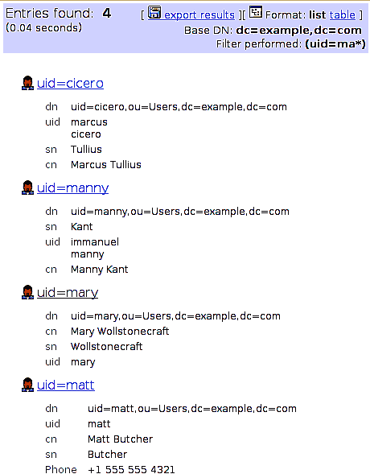

这返回了所有 UID 以 `ma` 开头的用户。请注意，默认情况下，搜索会检查所有可用的目录上下文。这可能意味着某个目录信息树没有搜索结果，而另一个可能有一堆匹配项。

有时，拥有更多对 LDAP 搜索的控制也是很有用的。在简单搜索界面顶部点击 **高级搜索表单** 链接，将加载一个具有更多选项的搜索界面：

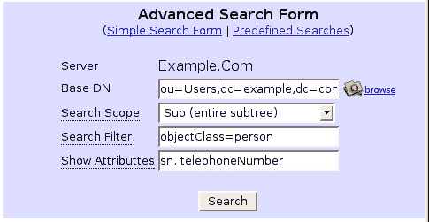

这使我们能够明确设置基础 DN、范围和搜索过滤器，并指定我们希望返回的属性列表。简而言之，这个搜索表单包含了我们在其他 LDAP 应用程序中常见的字段，例如 `ldapsearch` 命令行客户端。

这也将返回符合我们规格的项目列表。

第三个搜索选项是 **预定义搜索**。这个工具特别适合反复执行带有相同参数的搜索。

搜索在 `/etc/phpldapadmin/` 目录下的 `config.php` 文件底部预定义。预定义搜索部分以如下方式开始：

```
$q=0;
$queries = array();
```

第一行设置查询计数器，第二行创建一个新的查询数组。我们将向 `$queries` 数组中添加配置指令。

搜索定义如下所示：

```
$queries[$q]['name'] = 'Users with Email Addresses';
$queries[$q]['base'] = 'ou=Users,dc=example,dc=com';
$queries[$q]['scope'] = 'sub';
$queries[$q]['filter'] = '(&(objectClass=inetOrgPerson)(mail=*))';
$queries[$q]['attributes'] = 'cn, uid, mail';
```

每一行都会将一个新的名称/值对添加到 `$queries` 数组的第一个位置（记住，`$q` 是 `0`，表示数组的第一个位置）。到目前为止，这种过滤器的格式应该已经相当熟悉：

+   `name`：预定义搜索的可读名称。

+   `base`：搜索将从该基础 DN 开始。

+   `scope`：搜索范围（基础、单一、子级、子孙）。

+   `filter`：LDAP 过滤器。

+   `attributes`：应返回给用户的属性列表。请注意，属性列表被引号括起来，值之间用逗号分隔。

如果我们要创建第二个过滤器，首先会递增 `$q` 变量，然后定义一组新的参数：

```
$q++;
$queries[$q]['name'] = 'Entries with SeeAlso attributes';
$queries[$q]['base'] = 'dc=example,dc=com';
$queries[$q]['scope'] = 'sub';
$queries[$q]['filter'] = '(seeAlso=*)';
$queries[$q]['attributes'] = 'cn, description';
```

这一行 `$q++` 将 `$q` 的值从 `0` 改为 `1`，将下一个五个参数放入 `$queries` 数组的下一个索引位置。

一旦我们定义了过滤器并保存文件，就可以进行测试了。无需重启 Apache 或 SLAPD；phpLDAPadmin 会在每次新的请求时读取其配置文件，并立即加载我们的更改。

这是**预定义搜索**的屏幕：

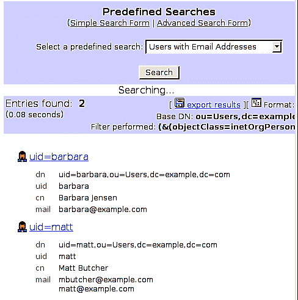

使用预定义的搜索，我们只需从页面顶部的下拉列表中选择所需的搜索，并按下**搜索**按钮即可运行。由于过滤器存储在配置文件中，phpLDAPadmin 不需要我们提供任何额外的信息。

我们现在已经查看了 phpLDAPadmin 的主要功能，它是一个通过网页界面管理 LDAP 目录的成熟工具。

phpLDAPadmin 并不是唯一的开源目录服务器管理程序。还有像 GQ（[`gq-project.org`](http://gq-project.org)）这样的标准桌面工具，以及其他几十种基于网页的 LDAP 工具。还有插件可以将 LDAP 支持带入其他流行的基于网页的应用程序（如 Squirrelmail、Joomla 和 OpenCms）。

还有一些工具可以将 LDAP 服务引入其他身份验证工具。例如，`libpam-ldap`包为**PAM（可插拔身份验证模块）**提供了执行 LDAP 查找的功能。而**saslauthd**，一个提供身份验证服务的 SASL 守护进程，也可以配置为连接到 LDAP 服务器进行身份验证。

最后，还有许多 DNS 服务器、邮件服务器、文件服务器以及其他可以配置为使用 LDAP 存储和检索信息（尤其是身份验证信息）的软件包。

# 总结

在本章中，我们已经探讨了配置其他工具与 OpenLDAP 互操作的方法。我们从 Apache web 服务器开始，使用 LDAP 作为身份验证和授权的来源。接着，我们安装了 phpLDAPadmin，这是一个基于网页的目录服务器管理程序。我们查看了其主要功能并进行了自定义调整。

当然，这只是 LDAP 启用应用程序的冰山一角。本章中提供的信息应该能帮助你实施任何 LDAP 启用的应用程序，因为它们都需要相同的基本配置信息：主机、端口、绑定信息和搜索过滤器。

若要了解更多关于启用 LDAP 的应用程序，你可能需要浏览一些开源软件包网站，比如 Freshmeat.Net（[`freshmeat.net`](http://freshmeat.net)）和 Source Forge（[`sourceforge.net`](http://sourceforge.net)）。
