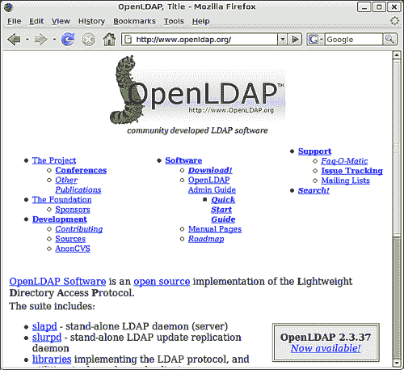

# 附录 A：从源代码构建 OpenLDAP

在本附录中，我们将逐步介绍从源代码构建 OpenLDAP 的过程。我们将从配置 Linux 平台以编译 OpenLDAP 开始。接着，我们将配置、编译并安装 OpenLDAP。编译 OpenLDAP 可能听起来很复杂，但其实并不复杂，我已尽力提供足够简明的说明，即使是没有 C 语言经验的人，也能快速从源代码编译。

# 为什么要从源代码构建？

许多 Linux 和 UNIX 发行版迁移到 OpenLDAP 的新版本的速度较慢。具体原因可以推测，但其中一个可能的原因是，发行版维护者对于已经表现良好、已与其他服务集成并且在安全性和功能性上对许多组织至关重要的任务进行快速采纳新版本的软件持保留态度。提供认证服务的 OpenLDAP 正是这样的服务。

由于这种不愿意更新的态度，你可能在选择的 Linux 或 UNIX 发行版中找不到最新的 OpenLDAP 版本。如果你需要（或者想要）OpenLDAP 提供的最新功能，可能需要获取一个全新的源代码副本并从头开始构建。

# 获取代码

要获取最新版本的代码，请访问官方的 OpenLDAP 网站：[`openldap.org`](http://openldap.org)。该网站由**OpenLDAP 基金会**托管，这是一个非盈利组织，负责管理和监督 OpenLDAP 项目。

在主页上，你会在右下角的突出框中找到当前版本的链接，如屏幕截图所示：



你可以直接从那里下载最新的稳定版本，或者可以访问下载页面（在链接表格的中间列标记为**Download!**）来查找其他版本（过去的版本、当前的实验版和测试版等）。

# 编译工具

每当你从源代码构建一个应用程序时，都会需要正确的工具和库。OpenLDAP 也不例外。幸运的是，OpenLDAP 对需求的要求比某些服务器应用程序要轻一些。

编译是在命令行中进行的，因此你需要打开终端或以其他方式访问 shell。

## 构建工具

你将需要标准的工具链来处理 C 和 C++应用程序；C 编译器、连接器和 make 程序。幸运的是，几乎所有 Linux 发行版都会默认包含这些工具。你可以使用`which`命令测试系统中是否有适当的工具，这个命令会告诉你工具在文件系统中的位置（前提是它们位于`$PATH`环境变量中列出的某个目录下）。

下面是一个快速示例，展示如何检查工具的位置以及每个工具的当前版本。我使用的是 Ubuntu Linux 6.06，您自己系统上的版本号可能会有所不同，没关系。OpenLDAP 应该能够在所有现代 Linux 发行版上编译，可能也可以在所有现代 UNIX 发行版上编译。

```
$ gcc --version
gcc (GCC) 4.0.3 (Ubuntu 4.0.3-1ubuntu5)
Copyright (C) 2006 Free Software Foundation, Inc.
This is free software; see the source for copying conditions.  There is NO warranty; not even for MERCHANTABILITY or FITNESS FOR A PARTICULAR PURPOSE.
$ which ld
/usr/bin/ld
$ ld --version
GNU ld version 2.16.91 20060118 Debian GNU/Linux
Copyright 2005 Free Software Foundation, Inc.
This program is free software; you may redistribute it under the terms of the GNU General Public License.  This program has absolutely no warranty.
$ which make
/usr/bin/make
$ make --version
GNU Make 3.81beta4
Copyright (C) 2003  Free Software Foundation, Inc.
This is free software; see the source for copying conditions.
There is NO warranty; not even for MERCHANTABILITY or FITNESS FOR A
PARTICULAR PURPOSE.

This program built for i486-pc-linux-gnu
$ 
```

在每种情况下，我使用`which`工具来查看工具的位置。我检查的程序有`gcc`、`ld`和`make`——分别是编译器、链接器和构建程序。只要返回了某个路径，就表示该工具已经安装。如果没有找到命令，`which`会没有任何输出。因此，如果我搜索一个不存在的命令，比如`blah`，输出会像这样：

```
$ which blah
$
```

因此，如果你运行`which`命令检查任何程序（如`gcc`、`ld`或`make`），如果没有输出，就表示你没有安装所需的工具。

### 注意

在一些 UNIX 系统上，GCC 编译器（`gcc`）可能不存在，但可能存在其他 C 编译器。C 编译器的*事实*名称是`cc`，如果`which` `gcc`没有返回结果，你可以尝试`which` `cc`。

在给定示例中的`which`命令之后，我使用`--version`标志运行每个命令（在`version`前有*两个*破折号），以查看已安装的版本。`--version`标志是 GNU 标准，但非 GNU 程序（如其他版本的`make`或`cc`）可能不支持该标志。

接下来要做的是设置几个环境变量，为给定工具提供一些基本的设置。虽然你可以通过环境变量为工具提供很多选项，但在这里我们只为构建 OpenLDAP 提供基本设置。

### 注意

一些 Linux 和 UNIX 发行版会为你设置必要的环境变量。在这种情况下，通常最好使用已经定义好的环境变量，这些变量通常是专门为你的系统优化过的，而不是我们现在要设置的通用变量。

要检查是否有必要的环境变量，可以运行`env`命令（不带任何参数），然后查看输出，确认`CC`、`CFLAGS`和`PATH`是否已经定义。

设置环境变量的一种方法是使用`export`命令。当你使用`export`命令时，环境变量会在当前 Shell 会话期间存储（换句话说，直到退出 Shell 或关闭终端窗口）。在这里，我们将使用`export`设置必要的环境变量：

```
$ export CC=gcc
$ export CFLAGS="-O2"
```

第一个`export`命令将`$CC`环境变量设置为`gcc`。`make`程序将使用这个来确定使用哪个编译器。（如果你使用的是`cc`编译器，而不是`gcc`，那么请调整示例，指向`cc`而不是`gcc`）。注意，当你*设置*环境变量时，变量名之前不需要加美元符号（`$`）。但是，当你*引用*变量时，必须包含美元符号。

第二行设置了`$CFLAGS`变量。`$CFLAGS`变量是在编译期间传递给编译器的选项。在这个例子中，我们传递了`-O2`选项（这是大写字母 O，不是零）。这告诉编译器在编译代码时使用级别 2 的优化。

`$PATH`环境变量也应设置好。然而，通过使用`which`命令查看我们的工具所在位置，我们已经验证了必要的目录（即包含我们工具的目录）已在`$PATH`变量中指定。

如果你使用的是非标准系统或某些库的非标准版本，或者你希望向构建工具传递其他选项，可能还需要使用一些额外的环境变量。你可以使用`$CPPFLAGS`来传递选项给 C 预处理器（`cpp`，是 GCC 的一部分）。同样，你可以使用`$LDFLAGS`变量传递链接器（`ld`）的选项。最后，如果你有存储在非标准位置的库（由其他应用程序使用的已编译代码模块），可以使用`$LIBS`变量来指定这些库的位置。如果需要使用这些变量，应该参考工具和库的文档。

在任何时候，你都可以通过一些简单的命令检查你的环境变量。`env`命令（无参数执行）将列出当前定义的所有环境变量及其值。你也可以使用`echo`命令检查单个环境变量。只需输入`echo`，然后跟上环境变量的名称，即可显示该环境变量的值：

```
$ echo $PATH
/usr/local/sbin:/usr/local/bin:/usr/sbin:/usr/bin:/sbin:/bin:/usr/bin
/X11:/usr/games
```

在这个例子中，`echo` `$PATH`显示的是 Shell 搜索程序的目录列表。正如你可能还记得的，`which`命令执行时，会输出指定工具的位置。为了找到工具，它会搜索`$PATH`变量中指定的每个目录。

到此，我们可以继续下一步：安装必要的依赖项。

## 安装依赖项

依赖项是 OpenLDAP 编译和运行时所需的包。安装这些依赖项因平台而异（并且因 Linux 发行版而异）。在这里，我将使用 Debian 工具（包含在 Ubuntu Linux 中）来安装这些包。

OpenLDAP 需要标准的 C 库、正则表达式库和 Berkeley DB 4.2（或更高版本）库。这些库几乎总是包含在现代 Linux 发行版中。除了这些库，还需要头文件。这些头文件通常存储在单独的包中（通常称为 DEV 包）。例如，要在 Ubuntu 中安装 Berkeley DB 4.2 开发包，可以从命令行执行以下命令：

```
 $ sudo apt-get install libdb4.2-dev

```

这将获取并安装所需的包。

还有一些其他有用的软件包需要安装，我们需要它们来构建本书中使用的所有功能。你需要安装：

+   OpenSSL（用于 SSL 和 TLS 支持）

+   SASL 2（用于 SASL 认证支持）

如果你有兴趣将目录存储在关系型数据库引擎中，例如 MySQL 或 Oracle，你还可能需要安装 iODBC2（用于数据库后台支持）。

这些软件包在现代 Linux 系统中非常常见。确保已经安装这些软件包，并且每个软件包的 DEV（或 `-dev`）附加组件也已安装。在 Ubuntu 6.06 中，可以通过一条（相当长的）命令安装：

```
 $ apt-get install libssl0.9.8 libssl-dev libiodbc2 libiodbc2-dev 
 libsasl2 libsasl2-dev

```

其他发行版可能使用不同的安装程序，甚至使用不同的软件包名称，但根据提供的名称列表，你应该能够轻松找到它们。

### 注意

OpenLDAP 包含许多可选模块，提供额外的功能（例如调试或与其他服务的集成）。这些模块在本书中没有涉及，但你可以选择自行探索。一些模块需要额外的库。有关更详细的信息，请查阅源代码中包含的 OpenLDAP 文档。

到目前为止，你已经具备了构建 OpenLDAP 所需的所有工具和要求。接下来我们将进入实际的编译过程。

# 编译 OpenLDAP

在上一节中，我们为构建 OpenLDAP 准备了所有工具和库。在本节中，我们将配置、编译并测试 OpenLDAP。

首先，我们需要将 OpenLDAP 服务器的源代码移动到一个临时目录中进行构建。将 `openldap-2.3.x.tgz` 文件复制到适当的目录，然后解压该文件：

```
$ mkdir build/
$ cp openldap-2.3.37.tgz build/
$ cd build
$ tar -zxf openldap-2.3.37.tgz 
```

在这里，我创建了一个新的目录（名为 `build/`），将 OpenLDAP 源代码压缩包复制到新目录中，将工作目录切换到 `build/`，然后使用 `tar` 工具解压该文件（`-zxf` 标志指示 tar 解压缩（`z`）并提取文件内容（`x`），文件（`f`）为 `openldap-2.3.37.tgz`）。完成后，`build/` 目录应包含一个名为 `openldap-2.3.37` 的目录。使用 `cd` 切换到该目录：`cd` `openldap-2.3.37`。

## 配置

现在，我们需要运行配置脚本，以准备源代码进行编译。这个脚本决定了 OpenLDAP 的构建方式，并确定哪些选项会默认启用或禁用。OpenLDAP 非常可配置，提供了许多不同的选项可以选择。要查看完整的选项列表，可以使用 `--help` 标志运行配置脚本：

```
 $ ./configure --help

```

这个命令会打印出所有可用于配置 OpenLDAP 的选项列表。它还会指示每个选项是否默认启用。例如，SLAPD 数据库后台部分的前几行如下所示：

```
SLAPD Backend Options:
    --enable-backends     enable all available backends no|yes|mod
    --enable-bdb          enable Berkeley DB backend no|yes|mod [yes]
    --enable-dnssrv       enable dnssrv backend no|yes|mod [no]
```

我们可以看到，每个选项有三种可能的状态：yes、no 和 mod（mod 表示将该组件构建为可插拔模块，而不是将其构建到 slapd 中）。在列出的选项中，只有`--enable-bdb`（启用 Berkeley DB 后端）默认是开启的。

在大多数情况下，默认设置是合适的。所有关键选项默认都是开启的。然而，这本书中讨论的一些附加模块默认并未启用，我们需要手动启用它们。它们是：

+   `--enable-ldap`：启用 LDAP 后端存储机制（参见第七章）

+   `--enable-ppolicy`：启用密码策略覆盖（参见第六章）

如果你不打算使用 ODBC 数据库后端，可以添加`--enable-sql`，但你需要确保安装前面章节中提到的 iODBC2 包。

### 注意

默认情况下，OpenLDAP 将在`/usr/local`的子目录中安装（通过最终的 make install 步骤）。这是推荐放置“本地”应用程序和库的地方。那些没有作为标准预配置应用程序（如 deb 或 RPM 包）发布的包被视为本地包。如果你希望将包放置在其他位置，可以使用`--prefix`和`--exec-prefix`标志。

现在我们准备好运行配置命令了：

```
 $ ./configure --enable-ldap --enable-sql --enable-ppolicy

```

这将启动一个评估过程，可能需要几分钟时间。配置脚本将系统地评估你的系统设置，确定你正在使用的工具、如何构建以及系统是否具备所有必要的库文件。

如果配置过程终止并显示错误，它会说明失败的原因。通常，这种失败表明缺少某个必需的库或工具。例如，如果错误信息显示`sql.h`缺失，这表明没有找到 iODBC2 的头文件（在 Ubuntu 中是`libiodbc2-dev`）。这通常意味着它们根本没有安装，尽管也可能是它们安装在了非标准位置。

一些缺失的库不会阻止配置过程运行。这些包会生成错误而不是警告。比如 OpenSSL 库和 SASL 库就是这种情况。一旦配置脚本完成运行，回滚查看结果，确保没有类似以下的行：

```
configure: WARNING: Could not locate TLS/SSL package
configure: WARNING: TLS data protection not supported!
```

或

```
configure: WARNING: Could not locate Cyrus SASL
configure: WARNING: SASL authentication not supported!
```

如果你看到这些，你可能需要确保已安装适当的包（记得是 DEV 包），然后重新运行`./configure`脚本。

一旦配置脚本完成运行，并且没有警告或错误，你就可以开始构建 OpenLDAP 的源代码了。

## 使用 make 进行构建

使用 make 构建是一个两步过程。首先，需要构建辅助库，然后构建主工具和服务器。幸运的是，所有这些繁重的工作都可以通过一个简短的命令完成：

```
 $ make depend && make

```

这将编译所有的库（`make` `depend`），然后，如果第一部分成功，它将运行主构建（`make`）。编译可能需要很长时间。

通常，配置脚本会在主编译开始前确保一切正常。然而，极少数情况下，其中一个 `make` 命令可能会失败。如果发生这种情况，您需要评估错误信息并确定采取哪些步骤来修复问题。在大多数情况下，问题与未满足的依赖关系有关——OpenLDAP 所需的某些软件包或工具未安装，且（由于某种原因）配置脚本未注意到这个问题。

有时，OpenLDAP 附带的文档（`README`、`make` 和 `docs/`、`libraries/`、`servers/` 目录中的文档）会指出可能的问题。

### 注意

如果 `make` 失败且您找不到问题所在，最佳的做法是搜索 OpenLDAP 邮件列表存档（访问 [`openldap.org`](http://openldap.org)），或者，如果一切都失败了，订阅邮件列表并在那里询问该问题。

一旦编译过程结束，建议运行自动化测试程序以确保代码构建正确。这也是通过 `make` 来完成的：

```
 $ make test

```

由于测试包括频繁的程序延迟并执行数十个测试，因此这个过程可能需要几分钟才能完成。完成后，请查看输出并确保没有错误。请注意，由于我们没有使用所有可能的选项编译 OpenLDAP，部分测试将被跳过。跳过的测试是正常现象，无需担心。

现在我们准备好安装全新的 OpenLDAP 服务器。

# 安装

安装只需执行一个额外的命令：

```
 $ sudo make install

```

在某些版本的 Linux 或 UNIX 中，您需要切换用户（`su`）为 root，并以 root 用户身份运行安装命令：`su` `-c` `'make` `install'`。系统会提示您输入帐户密码（或者，如果使用 `su` 而非 `sudo`，则需要输入 root 密码）。输入正确密码后，必要的 OpenLDAP 文件将被复制到 `/usr/local` 的子目录中。

在某些系统中，包含本地可执行文件的目录（`/usr/local/bin` 和 `/usr/local/sbin`）没有包含在 `$PATH` 环境变量中。因此，仅在命令行输入 OpenLDAP 命令可能会返回错误。解决此问题的一种方法是输入命令的完整路径：

```
 $ /usr/local/sbin/slapcat

```

但这可能很繁琐。您还可以将适当的路径附加到您的 `$PATH` 环境变量中。然后，您将能够直接执行命令，而无需指定命令的绝对路径：

```
 $ export PATH= /usr/local/bin:/usr/local/sbin:$PATH
 $ slapcat

```

在这个示例中，export 命令会重新设置当前会话的 `$PATH`。因此，变量 `$PATH` 会被赋予 `/usr/local/bin`、`/usr/local/sbin` 和当前 `$PATH` 变量的内容（其中可能包含 `/bin`、`/sbin`、`/usr/bin` 和其他目录）。顺序很重要。当 shell 搜索一个命令（在这个例子中是 `slapcat`）时，它会从 `$PATH` 中的第一个目录开始，一直到最后一个目录。只要找到匹配项，它就会停止搜索。因此，例如，如果存在两个 `slapcat` 命令，shell 会使用它找到的第一个命令。在我们的案例中，最好将两个 `/usr/local` 目录放在路径的前面，以防文件系统的其他地方安装了旧版本的 LDAP。

通常，`export` 命令应该添加到 shell 配置文件中（例如 `~/.bash_profile`），以便每次启动 shell 会话时自动添加额外的路径信息。

现在，你可以开始配置新版本的 OpenLDAP。

# 构建所有内容

在前一节提到的构建中，我们只编译了基础内容。这能让我们运行最基本的功能。但 OpenLDAP 有许多可能有用的后端和覆盖层（书中会介绍许多）。在我们想要构建所有内容时，通常最好编译带模块支持的 OpenLDAP，并将所有覆盖层和后端编译为模块。这样，我们可以获得所有附加功能，但只有在运行时需要（并在`slapd.conf`中配置）的模块才会被加载。

### 注意

许多附加的后端和覆盖层有自己的依赖项。例如，Perl 后端要求安装 Perl 库。Ubuntu 默认安装了大多数必需的依赖项。如果你没有某个模块所需的库，`configure` 或 `make` 程序会告诉你缺少哪个库，你需要追踪包含该库的包。对于这个过程，你可以参考 Debian 网站上的包搜索功能（[`www.us.debian.org/distrib/packages#search_contents`](http://www.us.debian.org/distrib/packages#search_contents)）。

因为我们正在构建带有模块的 OpenLDAP，所以我们需要确保安装了`libtool`和 libtool 头文件。在 Ubuntu 中，它默认没有安装。此外，由于 Perl 后端（`back_perl`）将被安装，我们还需要安装 Perl 开发包。你可以通过一个命令安装所有这些：

```
 $ sudo apt-get install libtool libltdl3 libltdl3-dev libperl-dev

```

`libltdl3` 库通常会默认安装，但其他库也需要用来编译带模块支持的 OpenLDAP。现在，我们已经准备好构建带模块的 OpenLDAP。

要构建带有所有额外模块的 OpenLDAP，我们只需在`configure`时使用正确的标志：

```
 $./configure --enable-dynamic --enable-modules --enable-backends=mod 
\
 --enable-overlays=mod

```

构建所有内容只需要四个标志。第一个，`--enable-dynamic` 启用共享库。第二个，`--enable-modules` 简单地告诉 `configure` 我们希望使用模块。接下来的两个标志指示我们希望构建的后端和覆盖层：`--enable-overlays`，设置为 `mod` 以构建模块，以及 `–enable-backends`（同样设置为 `mod`）以构建所有可用的后端。

一旦 `configure` 完成，你可以运行 `make`：

```
 $ make depend && make && make test

```

这将构建所有依赖项，然后构建 OpenLDAP（以及所有模块），最后测试所有内容。当你准备好安装时，可以按照上一节中的说明进行操作。

# 总结

在本附录中，我们简要介绍了从源代码构建 OpenLDAP 的过程。此时，你应该已经具备了从源代码构建 OpenLDAP 所需的信息。

我们已经看到了一个非常基础的构建过程，以及一个使用模块的完整构建过程。但还有许多其他可用的选项。你可以通过 OpenLDAP 附带的文档了解更多关于构建 OpenLDAP 的信息。
