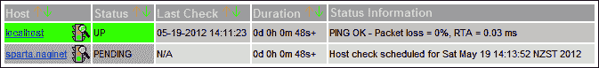
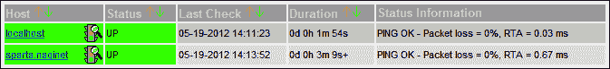
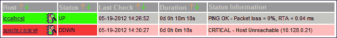
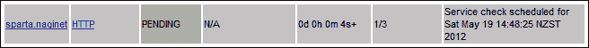
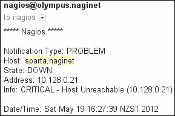
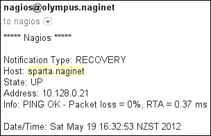
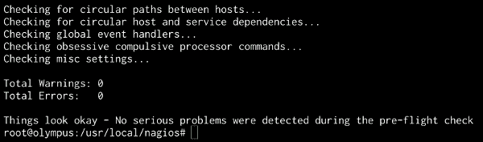
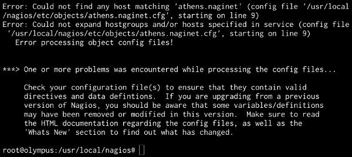
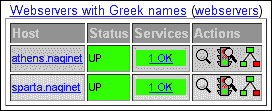
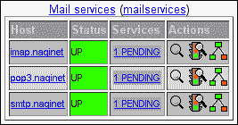

# 第一章：理解主机、服务和联系人

在本章中，我们将涵盖以下内容：

+   创建一个新的网络主机

+   创建一个新的 HTTP 服务

+   创建一个新的电子邮件联系人

+   验证配置

+   创建一个新的主机组

+   创建一个新的服务组

+   创建一个新的联系人组

+   创建一个新的时间段

+   在组内所有主机上运行服务

# 引言

**Nagios Core**适用于监控各种主机上的服务和状态，其主要优点之一是配置可以根据需要简单或复杂。许多 Nagios Core 用户只会将该软件用作向本地网络或可能的互联网中的少数主机发送 PING 请求，并在没有收到回复时向管理员发送电子邮件或寻呼机消息。Nagios Core 能够监控比这更复杂的系统，从简单的局域网配置扩展到作为监控整个网络的基石。

然而，对于 Nagios Core 的简单和复杂配置来说，最基本的配置构建块是**主机**、**服务**和**联系人**。这些是即使是非常简单的网络设置的管理员最终也会编辑和可能创建的三项内容。如果你是 Nagios Core 的初学者，可能曾在这里和那里更改过主机名，或者复制过配置中的某个段落以使其按预期工作。在本章中，我们将更深入地探讨这些配置的作用。

在 Nagios Core 配置中：

+   主机通常对应某种计算机。这可以是通过网络访问的物理或虚拟机器，或者是监控服务器本身。然而，从概念上讲，主机可以监控任何类型的网络实体，例如 VPN 的终端。

+   服务通常对应于 Nagios Core 检查主机某些内容的安排，无论是像获取主机的 PING 响应这样的简单操作，还是像检查 SNMP OID 的值是否在可接受范围内这样更复杂的操作。

+   联系人定义了一种在我们的主机上发生事件时通知某人的方式，例如无法获得 PING 响应，或无法发送测试电子邮件消息。

在本章中，我们将添加这三项内容，并学习如何将它们的定义组合在一起，以使配置更具可读性，并以组的形式操作主机，而不必单独编辑每个主机。我们还将为通知设置一个自定义时间段，这样像我们这样的辛勤系统管理员就不会在午夜时分不必要地接到通知了！

# 创建一个新的网络主机

在本教程中，我们将从默认的 Nagios Core 配置开始，并为响应我们本地网络上 PING 的服务器设置一个主机定义。最终结果是，Nagios Core 在启动时将我们的新主机添加到内部表中，并会定期自动检查它（可能使用 PING）。在本示例中，我将使用我的 Nagios Core 监控服务器，**域名系统**（**DNS**）名称为`olympus.naginet`，并为 DNS 名称为`sparta.naginet`的 web 服务器添加主机定义。这一切都在我的本地网络上 – `10.128.0.0/24`。

## 准备工作

你需要安装一个能够运行的 Nagios Core 3.0 或更高版本，并且必须有一个 Web 界面，以及安装了所有 Nagios Core 插件。如果你尚未安装 Nagios Core，应该先从快速入门指南开始：[`nagios.sourceforge.net/docs/3_0/quickstart.html`](http://nagios.sourceforge.net/docs/3_0/quickstart.html)。

我们假设 Nagios Core 启动时读取的配置文件位于`/usr/local/nagios/etc/nagios.cfg`，这是默认安装时的配置。将新主机定义放入配置文件的哪个位置不应该有太大影响，只要 Nagios Core 最终会读取该文件，但最好是为每个主机在单独的对象目录中创建一个文件，正如我们在这里所做的那样。你应该能在服务器上访问 shell，并使用你喜欢的编辑器编辑文本文件；我将使用`vi`。你需要通过`su`或`sudo`获得服务器的 root 权限。

你应该知道如何在服务器上重启 Nagios Core，以便将你即将添加的配置应用到系统中。通常不需要重启整个服务器！在类 Unix 系统中，启动/关闭脚本的常见位置是`/etc/init.d/nagios`，我将在这里使用这个路径。

你还应该准备好你想要监控的服务器的主机名或 IP 地址。如果可能，最好使用 IP 地址，这样即使 DNS 不可用，你的检查依然能正常工作。你不需要子网掩码之类的东西；Nagios Core 只需要 PING 工具所需要的任何信息来执行它自己的`check_ping`命令。

最后，你应该先测试一下；通过从 shell 中直接检查来确认你是否能够通过 PING 从 Nagios Core 服务器访问该主机，确保你的网络堆栈、路由、防火墙和子网掩码都是正确的：

```
tom@olympus:~$ ping 10.128.0.21
PING sparta.naginet (10.128.0.21) 56(84) bytes of data.
64 bytes from sparta.naginet (10.128.0.21): icmp_req=1 ttl=64 time=0.149 ms

```

## 如何操作...

我们可以按照以下步骤为`sparta.naginet`创建新的主机定义：

1.  切换到`/usr/local/nagios/etc/objects`目录，并创建一个名为`sparta.naginet.cfg`的新文件：

    ```
    # cd /usr/local/nagios/etc/objects
    # vi sparta.naginet.cfg

    ```

1.  将以下内容写入文件，并根据你自己的设置适当更改粗体部分的值：

    ```
    define host {
     host_name              sparta.naginet
     alias                  sparta
     address                10.128.0.21
     max_check_attempts     3
        check_period           24x7
        check_command          check-host-alive
        contacts               nagiosadmin
        notification_interval  60
        notification_period    24x7
    }
    ```

1.  切换到`/usr/local/nagios/etc`目录，并编辑`nagios.cfg`文件：

    ```
    # cd ..
    # vi nagios.cfg

    ```

1.  在文件末尾添加以下一行：

    ```
    cfg_file=/usr/local/nagios/etc/objects/sparta.naginet.cfg

    ```

1.  重启 Nagios Core 服务器：

    ```
    # /etc/init.d/nagios restart

    ```

如果服务器成功重启，网页界面应显示一个全新的主机，在**Hosts**列表中处于**PENDING**状态，等待进行存活检查：



在接下来的几分钟内，它应该变为绿色，显示检查已通过，主机处于**UP**状态，假设检查成功：



如果测试失败，并且在三次尝试后 Nagios Core 未能从目标机器获取到 PING 响应，无论出于何种原因，那么它的界面可能会显示如下所示的截图：



## 它是如何工作的...

本节中我们包含的配置将主机添加到 Nagios Core 的主机列表中。它将通过发送 PING 请求定期检查该主机，查看是否收到回复，并根据 Nagios Core 网页界面中的显示更新主机的状态。我们尚未定义要检查的其他服务，也没有指定如果主机宕机应采取何种措施。不过，Nagios Core 将定期自动检查该主机，并且我们可以随时在网页界面中查看其状态。

我们在前面的配置中定义的指令如下所示：

+   `host_name`：此项定义了机器的主机名，Nagios Core 在内部用来引用该主机。它将在配置的其他部分中使用。

+   `alias`：此项定义了一个更易于识别的、可读性强的主机名称，显示在网页界面中。它还可以用于为主机提供一个完整的文本描述。

+   `address`：此项定义了机器的 IP 地址。这是 Nagios Core 用来联系服务器的实际值；一般来说，使用 IP 地址而非 DNS 名称是最佳实践，因为即使 DNS 无法正常工作，检查仍然能够继续进行。

+   `max_check_attempts`：此项定义了如果检查失败，Nagios Core 应重试的次数。在此，我们定义了`3`次，这意味着如果主机首次被发现宕机，Nagios Core 将在接下来的两次尝试中再次 PING 目标主机。

+   `check_period`：此项引用了应检查主机的时间段。`24x7`是 Nagios Core 默认配置中定义的时间段。这个值对于主机来说是合理的，因为它意味着主机将始终被检查。这项设置定义了 Nagios Core 检查主机的频率，而非通知频率。

+   `check_command`：此项引用了将用于检查主机是否处于`UP`、`DOWN`或`UNREACHABLE`状态的命令。在本例中，QuickStart Nagios Core 配置将`check-host-alive`定义为 PING 检查，这对于测试基本的网络连接性是一个很好的方法，且是大多数主机的合理默认配置。实际上，这个指令对于创建有效的主机并非必需，但在大多数情况下你仍然需要包含它；没有它，检查将不会执行。

+   `contacts`：这指的是将收到主机状态变化通知的联系人。在这个例子中，我们使用了`nagiosadmin`，它在 QuickStart 的 Nagios Core 配置中有定义。

+   `notification_interval`：这定义了主机在出现问题时应多频繁地重复发送通知。在这里，我们使用了值`60`，表示 60 分钟或一小时。

+   `notification_period`：这指的是 Nagios Core 在出现问题时应发送通知的时间段。在这里，我们再次使用了`24x7`时间段；对于其他主机，像`workhours`这样的时间段可能更为合适。

请注意，我们将定义添加到一个名为`sparta.naginet.cfg`的文件中，然后在主配置文件`nagios.cfg`中引用它。这仅仅是一种传统的主机布局方式，实际上这是一种相当整洁的管理方式，通过将定义保存在各自的文件中来保持清晰。

## 还有更多...

还有许多其他有用的主机参数，但我们使用的这些已经涵盖了所有必需的内容。

虽然这种指定主机的方式完全有效，但通常更常见的做法是基于某些模板定义主机，并定义主机应多久检查一次，状态变化时应该联系谁，以及联系的依据等类似属性。Nagios Core 的 QuickStart 示例配置定义了一个简单的模板主机，名为`generic-host`，可以通过使用`use`指令扩展主机定义来使用它：

```
define host {
 use                 generic-host
    name                sparta
    host_name           sparta.naginet
    address             10.128.0.21
    max_check_attempts  3
    contacts            nagiosadmin
}
```

这使用了为`generic-host`定义的所有参数，然后添加了需要检查的特定主机的详细信息。请注意，如果使用`generic-host`，则需要在主机定义中定义`check_command`。如果你想查看`generic-host`中定义了什么内容，可以在`/usr/local/nagios/etc/objects/templates.cfg`中找到它的定义。

## 另见

+   第二章中的*使用替代的主机检查命令*实例，*工作与命令和插件*

+   第三章中的*指定检查主机的频率*实例，*工作与检查和状态*

+   第九章中的*在目录中分组配置文件*和*使用继承简化配置*实例，*配置管理*

# 创建新的 HTTP 服务

在这个食谱中，我们将创建一个新的服务来检查现有的主机。具体来说，我们将检查我们的`sparta.naginet`服务器，看看它是否在常用的 HTTP TCP 端口 80 上响应 HTTP 请求。为此，我们将使用一个预定义的命令`check_http`，该命令又使用 Nagios Core 插件集中的一个标准插件，名为`check_http`。如果你还没有在 Nagios Core 中定义一个作为主机的 Web 服务器，你可以尝试本章中的*创建一个新的网络主机*食谱。

完成这些步骤后，不仅`check_command`会检查我们的主机是否有 PING 响应，Nagios Core 还会定期检查该机器上的 HTTP 服务是否能响应同一主机上的请求。

## 准备工作

你需要一个运行正常的 Nagios Core 3.0 或更高版本的安装，并且有一个 Web 界面，安装了所有 Nagios 插件，并且至少定义了一个主机。如果你需要先为你的 Web 服务器设置主机定义，你可以阅读本章中的*创建一个新的网络主机*食谱，要求与此相同。

在设置检查之前，最好先测试一下 Nagios Core 服务器是否能够联系到 Web 服务器，以确保我们即将设置的检查能够成功。标准的**telnet**工具是一个很好的方法，用来测试是否能从 TCP 端口 80 获得我们期望的 Web 服务器响应：

```
tom@olympus:~$ telnet sparta.naginet 80
Trying 10.128.0.21...
Connected to sparta.naginet.
Escape character is '^]'.

```

## 操作步骤...

我们可以按如下方式为`sparta.naginet`创建服务定义：

1.  切换到包含`sparta.naginet`主机定义的文件所在目录，并按如下方式编辑该文件：

    ```
    # cd /usr/local/nagios/etc/objects
    # vi sparta.naginet.cfg

    ```

1.  将以下代码片段添加到文件末尾，并替换主机的`host_name`指令的值：

    ```
    define service {
     host_name              sparta.naginet
        service_description    HTTP
        check_command          check_http
        max_check_attempts     3
        check_interval         5
        retry_interval         1
        check_period           24x7
        notification_interval  60
        notification_period    24x7
        contacts               nagiosadmin
    }
    ```

1.  重启 Nagios Core 服务器：

    ```
    # /etc/init.d/nagios restart
    ```

如果服务器成功重启，Web 界面应该会在**服务**部分显示一个新的服务，其状态为**PENDING**，等待首次检查：



几分钟后，当检查成功并获得**HTTP/1.1 200 OK**响应（或类似响应）时，服务的状态应该变为**OK**：


如果检查出现问题，可能是因为目标服务器上的 HTTP 守护进程未运行，那么检查可能会显示**CRITICAL**。这可能并不意味着配置有问题；更可能是网络或 Web 服务器未正常工作：


## 工作原理...

我们添加的配置为现有主机添加了一个简单的服务检查定义，用于检查该主机上的 HTTP 守护进程是否响应一个简单的**HTTP/1.1**请求，最多检查三次。如果 Nagios Core 无法得到响应，它将标记该服务的状态为**严重**，并会在发送通知之前再尝试两次。该服务将在 Nagios Core 的 Web 界面中可见，我们可以随时查看其状态。Nagios Core 将定期测试服务器，并标记检查是否成功。

需要注意的是，服务像是某个特定主机的一个属性；我们为特定主机定义一个服务进行检查，在这个例子中是 `sparta.naginet` Web 服务器。这就是为什么获取正确的 `host_name` 定义很重要。

我们在前面配置中定义的指令如下：

+   `host_name`：这是指该服务应适用的主机定义。这将与适当主机的 `host_name` 指令相同。

+   `service_description`：这是服务本身的名称，应该是一个易于识别的名称，将出现在警报中以及 Web 界面的服务部分。在这个例子中，我们使用了 `HTTP`。

+   `check_command`：这是指用于检查服务状态的命令。在这里，我们指的是 Nagios Core 默认配置中定义的 `check_http` 命令，该命令是 Nagios Core 插件集中同名插件的引用。

+   `max_check_attempts`：这是定义当 Nagios Core 发现服务状态不是 `OK` 时，应该尝试重新检查服务的次数。

+   `check_interval`：这是定义当服务处于 `OK` 状态时，或者当超过 `max_check_attempts` 中给定的检查次数后，Nagios Core 应该等待多久再进行下次检查。

+   `retry_interval`：这是定义 Nagios Core 在第一次发现服务状态不是 `OK` 后，应该在重新尝试检查时等待的时间。

+   `check_period`：这是指 Nagios Core 应该在该时间段内运行服务检查。在这里，我们使用了在 Nagios Core 默认配置中定义的合理时间段 `24x7`。请注意，这可以与 `notification_period` 不同；我们可以检查服务的状态，而不一定需要通知联系人。

+   `notification_interval`：这是定义当服务处于非 `OK` 状态时，Nagios Core 应该在重新发送通知时等待的时间。

+   `notification_period`：这是指 Nagios Core 应该在何时发送通知，如果它发现主机处于问题状态。在这里，我们再次使用了 `24x7`，但对于一些不太重要的服务，使用诸如 `workhours` 的时间段可能更合适。

请注意，我们在与主机定义相同的文件中添加了服务定义，并且紧跟其后。我们实际上可以将定义放在任何我们喜欢的位置，但这样做有助于保持组织结构。

## 还有更多...

我们在`sparta.naginet`上设置的监控服务是 HTTP 服务，但这只是我们可以在网络上监控的众多服务之一。Nagios Core 为其核心插件集定义了许多不同的命令，如`check_smtp`、`check_dns`等。这些命令实际上指向执行检查并将结果返回给 Nagios Core 服务器处理的程序。关键是要知道，服务几乎可以监控任何东西，而且在 Nagios Exchange 网站上有成百上千个可用于常见网络监控检查的插件：[`exchange.nagios.org/`](http://exchange.nagios.org/)。

服务有更多可能的指令，在实际应用中，即使是简单的设置，我们也更有可能希望扩展一个服务模板。这样，我们就可以为多个服务定义我们可能需要的值，例如在发生通知事件之前，服务应处于`CRITICAL`状态多长时间，以及何时有人被联系以处理问题。

Nagios Core 默认配置中定义的一个模板叫做`generic-service`，我们可以通过`use`关键字引用它，将其作为我们新服务的基础：

```
define service {
 use                    generic-service
    host_name              sparta.naginet
    service_description    HTTP
    check_command          check_http
}
```

这对你来说可能非常有效，因为`generic-service`模板中设置了许多非常合理的默认值，这使得事情变得更加简单。我们可以通过查看`/usr/local/nagios/etc/objects/templates.cfg`中的模板定义来检查这些值。这与我们之前可能使用过的`generic-host`定义位于同一个文件中。

## 参见

+   本章中的*创建新服务组*配方

+   在第三章中，*指定检查服务的频率*和*为主机或服务安排停机时间*配方，*与检查和状态一起工作*

+   在第五章中，*监控 Web 服务*配方，*监控方法*

# 创建一个新的电子邮件联系人

在本配方中，我们将创建一个新的联系人，使主机和服务能够进行交互，主要是通知它们主机或服务状态的变化。我们将使用设置电子邮件联系人的最简单示例，并配置现有主机，以便当 Nagios Core 的主机检查失败并且主机显然无法访问时，此人会收到电子邮件消息。在这个例子中，当我的主机`sparta.naginet`的状态从`DOWN`变为`UP`，或反之时，我将让它给我发送电子邮件，邮件地址是`nagios@sanctum.geek.nz`。

## 准备工作

你应该有一个正常运行的 Nagios Core 3.0 或更高版本的服务器，带有 Web 界面，并且至少有一个需要监控的主机。如果你需要先做这一步，请参见本章中的*创建一个新的网络主机*部分。

对于这种特定类型的联系人，你还需要在监控服务器上运行一个正常工作的 SMTP 守护进程，如**Exim**或**Postfix**。你应该验证是否能够将消息发送到目标地址，并且这些消息能够成功送达预期的邮件服务器。

## 如何操作...

我们可以按如下方式将一个简单的新联系人添加到 Nagios Core 配置中：

1.  切换到 Nagios Core 的对象配置目录；理想情况下，这里应该有一个专门用于联系人配置的文件，比如这里的`contacts.cfg`，并编辑该文件：

    ```
    # cd /usr/local/nagios/etc/objects
    # vi contacts.cfg

    ```

1.  将以下联系人定义添加到文件的末尾，根据需要替换加粗的属性值：

    ```
    define contact {
     contact_name                   spartaadmin
     alias                          Administrator of sparta.naginet
     email                          nagios@sanctum.geek.nz
        host_notification_commands     notify-host-by-email
        host_notification_options      d,u,r
        host_notification_period       24x7
        service_notification_commands  notify-service-by-email
        service_notification_options   w,u,c,r
        service_notification_period    24x7
    }
    ```

1.  编辑`sparta.naginet`主机的定义，并为适当的主机将`contacts`定义添加或替换为我们的新`spartaadmin`联系人：

    ```
    define host {
        host_name              sparta.naginet
        alias                  sparta
        address                10.128.0.21
        max_check_attempts     3
        check_period           24x7
        check_command          check-host-alive
     contacts               spartaadmin
        notification_interval  60
        notification_period    24x7
    }
    ```

1.  重启 Nagios Core 服务器：

    ```
    # /etc/init.d/nagios restart

    ```

完成后，下次我们的主机状态发生变化时，我们应该收到类似以下的消息：



当主机再次可用时，我们应该收到类似以下的恢复消息：



如果可能，值得通过一个我们可以安全关闭并重新启动的测试主机来测试此设置，以检查是否能收到适当的通知。

## 如何操作...

该配置将一个新联系人添加到 Nagios Core 配置中，并在某个主机的配置中引用它，作为当主机出现问题时使用的合适联系人。

我们已定义了联系人所需的指令，以及其他几个指令，具体如下：

+   `contact_name`：此项定义了联系人的唯一名称，以便我们可以在主机和服务定义中，或者在 Nagios Core 配置的任何其他地方引用它。

+   `alias`：此项定义了联系人的人性化名称，可能简要说明此人或小组的身份和/或其负责的内容。

+   `email`：此项定义了联系人的电子邮件地址，因为我们将通过电子邮件发送消息。

+   `host_notification_commands`：此项定义了当主机状态变化并触发通知时，应该运行的命令或命令集合。在这种情况下，我们将使用一个预定义的命令`notify-host-by-email`，通过电子邮件将结果发送给联系人。

+   `host_notification_options`：此项指定应通知此联系人的不同主机事件类型。这里我们使用的是`d,u,r`，意味着此联系人将接收关于主机`DOWN`、变为`UNREACHABLE`或恢复`UP`时的通知。

+   `host_notification_period`: 这定义了此联系人可以在任何主机事件通知期间内被通知的时间段。如果生成了主机通知，并且定义为发送给此联系人，但它不在此时间段内，则通知将不会被发送。

+   `service_notification_commands`: 这定义了在服务状态变化时运行的命令或命令，以便向此联系人发送通知。在本例中，我们将使用预定义命令 `notify-service-by-email` 将结果通过电子邮件发送给联系人。

+   `service_notification_options`: 这指定了应向此联系人通知的不同类型的服务事件。在这里，我们使用 `w,u,c,r`，这意味着我们希望收到关于进入 `WARNING`、`UNKNOWN` 或 `CRITICAL` 状态的服务的通知，以及当它们恢复并回到 `OK` 状态时的通知。

+   `service_notification_period`: 这与 `host_notification_period` 相同，只是此指令是关于服务的通知，而不是关于主机的。  

请注意，我们将联系人的定义放在了 `contacts.cfg` 中，这是一个相当合理的地方。但是，我们可以将联系人定义放在 Nagios Core 将作为配置的一部分读取的任何文件中；我们可以按照自己喜欢的方式组织我们的主机、服务和联系人。选择一种系统有助于我们在需要添加、更改或删除它们时，能够轻松地识别定义可能出现的位置。

## 还有更多……

如果我们定义了许多具有相似选项的联系人，可能适合使个体联系人扩展联系人模板，以便它们可以继承这些共同的设置。QuickStart Nagios Core 配置包括一个名为 `generic-contact` 的模板，我们可以将我们的新联系人定义为此模板的扩展，如下所示：

```
define contact {
 use    generic-contact
    alias  Administrator of sparta.naginet
    email  nagios@sanctum.geek.nz
}
```

要查看 `generic-contact` 定义的指令，你可以检查 `/usr/local/nagios/etc/objects/templates.cfg` 文件中的定义。

## 参见

+   在本章中的 *创建新的联系人组* 配方

+   *自动化联系轮换* 和 *为重复通知定义升级* 在 第五章, *监控方法*

# 验证配置

在本配方中，我们将学习关于调试 Nagios Core 配置的最基本步骤，即验证配置。在重新启动 Nagios Core 服务器以加载更改的配置之前进行这一步骤非常有用，因为它将警告我们可能存在的问题。如果由于配置问题而无法在任何时候启动 Nagios Core 服务器，而是获得类似以下输出，则这是一个很好的配方可供遵循：

```
# /etc/init.d/nagios restart
Running configuration check... CONFIG ERROR!  Restart aborted.  Check your Nagios configuration.

```

## 准备就绪

你应该有一个运行良好的 Nagios Core 3.0 或更高版本服务器。

## 怎么做……

我们可以按以下方式验证 Nagios Core 配置：

1.  运行以下命令，如果需要，可以替换为 Nagios 二进制文件的路径和我们的主配置文件`nagios.cfg`：

    ```
    # /usr/local/nagios/bin/nagios -v /usr/local/nagios/etc/nagios.cfg

    ```

1.  如果输出非常长，可能最好通过一个分页程序来显示，比如`less`：

    ```
    # /usr/local/nagios/bin/nagios -v /usr/local/nagios/etc/nagios.cfg | less

    ```

1.  检查输出并查看警告和问题。如果我们的配置正确，以下是我们可能期望的输出的一部分示例：

    如果出现某些问题，我们可能会看到类似下面的输出，这只是一个可能的错误示例；我的配置出错是因为我尝试为一个名为`athens.naginet`的主机添加服务，但实际上我还没有配置该主机。所以，Nagios Core 很正确地对我发出了警告：

    

## 它是如何工作的...

配置会被解析，就像 Nagios Core 即将启动一样，以检查配置是否合理。它会执行基本的检查，比如查找语法错误，也会检查是否至少有一个主机和服务在监控之中。它报告的某些内容是警告，意味着这些不一定是问题；例如，主机没有任何被监控的服务，或者没有定义任何联系人。

这是检查 Nagios Core 配置是否合理并能正常工作的最快方式。每当重新启动 Nagios Core 服务器遇到问题时，最好首先检查此命令的输出。实际上，养成在重新启动前检查配置的好习惯是很有帮助的，尤其是当我们不确定配置变更时，或者当监控服务器正在检查一些非常重要的内容时！这意味着，如果最终发现我们的配置有问题，那么 Nagios Core 守护进程将继续使用我们更改之前的配置运行，我们可以在重启前修复问题。

## 还有更多...

`/usr/local/nagios/bin/nagios`程序实际上与运行 Nagios Core 服务器的程序是相同的，但是命令中的`-v`部分是一个用于验证配置的开关，而不是启动服务器，它会显示配置中的任何问题。第二个路径是 Nagios Core 启动时使用的配置文件，它会导入对象的配置文件，例如联系人、主机和服务定义。

## 另请参见

+   第十章中的*将调试信息写入 Nagios Core 日志文件*教程，*安全与性能*

# 创建一个新的主机组

在这个教程中，我们将学习如何创建一个新的主机组；在这个案例中，我们将创建一个主机组来将两个网页服务器归为一组。这对于拥有不同属性的主机组非常有用，例如它们可能由不同的团队进行监控，或者运行不同类型的监控服务。它还允许我们在 Nagios Core 网页界面中查看组的详细信息，并将一个服务应用于整个主机组，而不是单独应用。这意味着，我们可以通过将主机添加到一个组来为新主机设置服务，而无需手动指定配置。

## 准备工作

您应该有一个运行中的 Nagios Core 3.0 或更高版本的服务器，并且该服务器有一个网页界面。

您还应该至少有两台主机组成一个有意义的组；也许它们是相似类型的服务器，如网页服务器，或者由同一团队进行监控，或者都位于同一个物理位置。

在这个例子中，我们有两台网页服务器，`sparta.naginet`和`athens.naginet`，我们将它们添加到一个名为`webservers`的组中。

## 如何操作...

我们可以通过以下方式将新的主机组`webservers`添加到 Nagios Core 配置中：

1.  如果`/usr/local/nagios/etc/objects/hostgroups.cfg`文件尚不存在，请创建它：

    ```
    # cd /usr/local/nagios/etc/objects
    # vi hostgroups.cfg

    ```

1.  将以下代码添加到新文件中，并根据您的布局替换加粗的名称：

    ```
    define hostgroup {
     hostgroup_name  webservers
     alias           Webservers with Greek names
    }
    ```

1.  向上移动一个目录，然后编辑`nagios.cfg`文件：

    ```
    # cd ..
    # vi nagios.cfg

    ```

1.  将以下行添加到文件的末尾：

    ```
    cfg_file=/usr/local/nagios/etc/objects/hostgroups.cfg
    ```

1.  对于我们希望添加到组中的每个主机，找到它们的定义，并添加一个`hostgroups`指令，将它们放入新主机组中。在本例中，`sparta.naginet`和`athens.naginet`的定义最终看起来如下：

    ```
    define host {
        use         linux-server
        host_name   sparta.naginet
        alias       sparta
        address     10.128.0.21
        hostgroups  webservers
    }
    define host {
        use         linux-server
        host_name   athens.naginet
        alias       athens
        address     10.128.0.22
        hostgroups  webservers
    }
    ```

1.  重启 Nagios：

    ```
    # /etc/init.d/nagios restart

    ```

现在我们应该能够访问网页界面中的**主机组**部分，并看到一个包含两个成员的新主机组：



## 它是如何工作的...

我们添加的配置包括一个新文件，并将新的主机组插入到 Nagios Core 配置中，同时将适当的主机插入到该组中。目前，这样做只是为我们在网页界面中创建一个单独的部分，以便快速查看该特定组中的所有主机。

## 还有更多...

我们将主机添加到组的方式其实并不是唯一的做法。如果我们愿意，可以在组定义中为该组命名主机，使用`members`指令，这样我们就可以得到类似以下的代码片段：

```
define hostgroup {
    hostgroup_name  webservers
    alias           Webservers with Greek names
    members         athens.naginet,sparta.naginet
}
```

这扩展到允许我们创建一个始终包含所有主机的主机组，如果我们觉得这有用：

```
define hostgroup {
    hostgroup_name  all
    alias           All hosts
 members         *
}
```

如果我们在 Nagios Core 配置中广泛使用主机组，那么我们应该选择最适合我们配置的方式。如果有需要，我们也可以同时使用这两种方法。

值得注意的是，一个主机可以属于多个组，并且我们声明的组数量没有限制，因此我们可以在将主机分组到有用的类别时更加灵活。示例可以是按功能、制造商或托管客户组织服务器，或按 BGP 或 OSPF 使用组织路由器；这完全取决于我们监控的网络类型。

## 另见

+   本章中的*创建新主机*和*在组内所有主机上运行服务*配方

+   在第九章的*通过继承简化配置*配方中，*管理配置*。

# 创建一个新的服务组

在这个配方中，我们将创建一个新的服务组。这允许我们将一组任意的服务组成有意义的组，以便在网页管理区域的独立部分中查看这些服务的状态。

## 准备工作

你应该已经运行着一个正常工作的 Nagios Core 3.0 或更高版本的服务器，并且具备网页界面。

你还应该定义至少两个服务，它们形成一个有意义的组；这些服务可能是类似类型的服务，如邮件服务，或者由同一团队监控，或者都位于同一物理位置的服务器上。

在这个示例中，我们有三台执行邮件功能的服务器：`smtp.naginet`、`pop3.naginet`和`imap.naginet`，分别运行 SMTP、POP3 和 IMAP 守护进程。所有三台主机和它们的服务都已经在 Nagios Core 中设置好了。我们将把它们添加到一个名为`mailservices`的新服务组中。

下面是示例中使用的主机和服务的定义，你可以看到它们是如何配合工作的：

```
define host {
    use                 linux-server
    host_name           smtp.naginet
    alias               smtp
    address             10.128.0.31
    hostgroups          webservers
}
    define service {
        use                  generic-service
        host_name            smtp.naginet
        service_description  SMTP
        check_command        check_smtp
    }
define host {
    use                 linux-server
    host_name           pop3.naginet
    alias               pop3
    address             10.128.0.32
    hostgroups          webservers
}
    define service {
        use                  generic-service
        host_name            pop3.naginet
        service_description  POP3
        check_command        check_pop
    }
define host {
    use                 linux-server
    host_name           imap.naginet
    alias               imap
    address             10.128.0.33
    hostgroups          webservers
}
    define service {
        use                  generic-service
        host_name            imap.naginet
        service_description  IMAP
        check_command        check_imap
    }
```

## 如何操作...

我们可以通过以下步骤添加新的服务组：

1.  切换到我们的 Nagios Core 配置对象目录，并编辑一个名为`servicegroups.cfg`的新文件：

    ```
    # cd /usr/local/nagios/etc/objects
    # vi servicegroups.cfg

    ```

1.  将以下定义添加到新文件中，替换粗体部分的值为你自己的值：

    ```
    define servicegroup {
     servicegroup_name  mailservices
     alias              Mail services
    }
    ```

1.  向上移动一个目录，然后编辑`nagios.cfg`文件：

    ```
    # cd ..
    # vi nagios.cfg

    ```

1.  将以下行添加到文件末尾：

    ```
    cfg_file=/usr/local/nagios/etc/objects/servicegroups.cfg
    ```

1.  对于我们想要添加到组中的每个服务，找到它们的定义，并添加一个`servicegroups`指令，将它们加入到新的服务组中。定义可能最终类似于以下代码片段：

    ```
    define service {
        use                  generic-service
        host_name            smtp.naginet
        service_description  SMTP
        check_command        check_smtp
     servicegroups        mailservices
    }
    define service {
        use                  generic-service
        host_name            pop3.naginet
        service_description  POP3
        check_command        check_pop
     servicegroups        mailservices
    }
    define service {
        use                  generic-service
        host_name            imap.naginet
        service_description  IMAP
        check_command        check_imap
     servicegroups        mailservices
    }
    ```

1.  使用以下命令重启 Nagios：

    ```
    # /etc/init.d/nagios restart

    ```

现在我们应该能够访问网页界面的**服务组**部分，并看到一个包含三个成员的新服务组：



## 如何工作...

我们添加的配置包括一个新文件，其中包含一个新的服务组，并将适当的服务插入到该组中。这在网页界面中为我们创建了一个单独的部分，让我们可以快速查看该特定组中的所有服务。

## 还有更多...

我们将服务添加到组中的方式实际上并不是唯一的方式。如果我们愿意，我们可以在组定义中使用 `members` 指令来命名服务（及其适用的主机），从而拥有类似以下的代码片段：

```
define servicegroup {
    servicegroup_name  mailservices
    alias              Mail services
 members            smtp.naginet,SMTP,pop3.naginet,POP3
}
```

请注意，我们需要指定服务所在的主机，然后列出该主机上要监控的服务，服务之间用逗号分隔。主机名先出现，然后是服务。

这也扩展到允许我们创建一个始终包含每个单独服务的服务组，如果我们认为这有用的话：

```
define servicegroup {
    servicegroup_name  all
    alias              All services
 members            *
}
```

如果我们打算在 Nagios Core 配置中广泛使用服务组定义，我们应该使用我们认为最易于维护的两种方法中的任意一种来将服务添加到组中。

值得注意的是，一个服务可以属于多个组，而且我们声明的组数量没有限制，因此我们可以非常灵活地将服务归类到不同的类别中。举例来说，可以根据通知的相应联系人、内部功能或面向客户的功能来组织服务。

## 另见

+   本章中的*创建新服务*和*在组内所有主机上运行服务*食谱

+   第九章中的*使用继承简化配置*食谱，*配置管理*

# 创建一个新的联系人组

在这个食谱中，我们将创建一个新的联系人组，向其中添加我们的联系人。像主机组和服务组一样，联系人组主要是便捷的快捷方式。在这种情况下，它允许我们定义一个联系人组作为主机或服务定义的通知接收者。这意味着我们可以定义一个名为 `ops` 的组，然后即使人员加入或离开该组，我们也无需更改主机或服务的任何定义。

## 准备工作

你应该运行一个正常工作的 Nagios Core 3.0 或更高版本的服务器。

你还应该至少有两个联系人组成一个有意义的组。在这种情况下，我们有两位员工，John Smith 和 Jane Doe，他们都是我们网络运维团队的一部分。我们希望他们都能接收到所有相关主机和服务的通知，因此我们将把他们添加到一个名为 `ops` 的组中。以下是我们正在使用的定义：

```
define contact {
    use           generic-contact
    contact_name  john
    alias         John Smith
    email         john@naginet
}
define contact {
    use           generic-contact
    contact_name  jane
    alias         Jane Doe
    email         jane@naginet
}
```

## 如何操作...

我们可以按如下方式创建新的 `ops` 联系人组：

1.  进入我们的 Nagios Core 对象配置目录，并编辑 `contacts.cfg` 文件：

    ```
    # cd /usr/local/nagios/etc
    # vi contacts.cfg

    ```

1.  向文件中添加以下定义，并根据需要替换加粗部分的值：

    ```
    define contactgroup {
     contactgroup_name  ops
     alias              Network operators
    }
    ```

1.  对于我们想要添加到组中的每个联系人，找到他们的定义并为他们添加 `contactgroups` 指令。定义最终会类似于以下代码片段：

    ```
    define contact {
        use            generic-contact
        contact_name   john
        alias          John Smith
        email          john@naginet
     contactgroups  ops
    }
    define contact {
        use            generic-contact
        contact_name   jane
        alias          Jane Doe
        email          jane@naginet
     contactgroups  ops
    }
    ```

1.  重启 Nagios Core 服务器：

    ```
    # /etc/init.d/nagios restart

    ```

## 它是如何工作的...

设置好这个组后，我们现在可以在`contactgroups`指令中使用它，指定应接收通知的联系人组。通知将发送到该组中的所有地址。这可以替代`contacts`指令，其中我们逐个列出联系人。

## 还有更多...

这意味着，例如，替代具有如下类似服务定义：

```
define service {
    use                  generic-service
    host_name            sparta.naginet
    service_description  HTTP
    check_command        check_http
 contacts             john,jane
}
```

我们可以使用以下代码片段：

```
define service {
    use                  generic-service
    host_name            sparta.naginet
    service_description  HTTP
    check_command        check_http
 contact_groups       ops
}
```

如果 John Smith 离开了操作团队，我们只需删除他的联系人定义，其他的无需更改；从此以后，只有 Jane Doe 会收到服务通知。此方法在联系人和他们接收通知的主机与服务之间提供了一层抽象。

## 另请参见

+   本章中的*创建新联系人*示例

+   第四章中的*自动化联系人轮换*示例，*配置通知*

+   第九章中的*使用继承简化配置*示例，*管理配置*

# 创建新的时间段

在这个示例中，我们将在 Nagios Core 配置中添加一个新的时间段定义，以便我们仅在工作日进行主机和服务的监控。这里有一个默认配置定义为`workhours`，几乎适合我们的需求，除了它没有包括晚上时间。我们将从头开始创建一个新的，并且还会再创建一个用于覆盖周末的时间段。

## 准备工作

你应该有一个运行正常的 Nagios Core 3.0 或更高版本的服务器。

## 如何操作...

我们可以如下设置新的时间段，命名为`weekdays`：

1.  切换到我们的 Nagios Core 配置对象目录，并编辑名为 `timeperiods.cfg` 的文件：

    ```
    # cd /usr/local/nagios/etc/objects
    # vi timeperiods.cfg

    ```

1.  将以下定义添加到文件的末尾：

    ```
    define timeperiod {
        timeperiod_name  weekdays
        alias            Weekdays
        monday           00:00-24:00
        tuesday          00:00-24:00
        wednesday        00:00-24:00
        thursday         00:00-24:00
        friday           00:00-24:00
    }
    define timeperiod {
        timeperiod_name  weekends
        alias            Weekends
        saturday         00:00-24:00
        sunday           00:00-24:00
    }
    ```

1.  重启 Nagios Core 服务器：

    ```
    # /etc/init.d/nagios restart

    ```

## 它是如何工作的...

在我们的主机和服务定义中，有两个指令，`check_period` 和 `notification_period`。这些指令用于定义主机或服务应检查的时间，以及应发送通知的时间。`24x7` 和 `workhours` 时间段已在我们刚刚编辑的 `timeperiods.cfg` 文件中定义，并且在多个示例和模板中使用。

我们刚刚又添加了两个这样的时间段，现在可以在主机和服务的定义中使用它们。第一个称为`weekdays`，表示工作日的任何时间；第二个称为`weekends`，表示任何非工作日的时间。请注意，在这两种情况下，我们通过命名每一天并指定对应的时间，来定义了日期和时间。

## 还有更多...

日期的定义非常巧妙，可以通过多种方式进行定义。以下都是有效的天数和时间段定义：

+   `june 1 - july 15 00:00-24:00`：从 6 月 1 日到 7 月 15 日的任何时间（含这两天）

+   `thursday -1 00:00-24:00`：每月的最后一个星期四的任何时间

+   `day 1 - 10 13:00-21:00`：每月的 1 号至 10 号期间，从下午 1 点到晚上 9 点的时间段

很可能，标准的 `24x7` 和 `workhours` 定义已经适合日常监控，也许可以添加一个 `weekdays` 和 `weekends` 的定义。然而，可能会有某个时候，我们需要对某个主机或服务进行不常规的监控，特别是如果我们正在调试一个仅在某个特定时间出现的问题，或者需要管理大量联系人，或者有一个复杂的轮值安排。

请注意，Nagios Core 在某些情况下可能表现异常，特别是在正常运行时间报告方面，如果我们对主机和服务的监控时间段总和不到 24 小时。理想情况下，我们应当全天候检查并通知所有主机和服务，但根据日程安排以不同的方式处理通知；例如，工作时间内可以通过分页通知系统管理员关于非关键系统的情况，但当他们睡觉时，只需通过电子邮件通知他们！

## 另请参见

+   第四章中的*自动化联系轮换*、*配置通知时段*和*配置通知组*的教程，*配置通知*

# 在组内所有主机上运行服务

在本教程中，我们将创建一个新服务，但不是将其应用到现有的主机上，而是将其应用到现有的主机组上。在这种情况下，我们将创建一个名为 `webservers` 的组。执行此操作的步骤与为单个主机添加服务非常相似；唯一不同的是有一条指令。

## 准备工作

你应该运行一个工作中的 Nagios Core 3.0 或更高版本的服务器，并且具有 Web 界面。你应熟悉如何向单个主机添加服务。

你还应至少定义一个主机组，并且该组中至少有一个主机；我们将使用一个名为 `webservers` 的组，并在其中定义主机 `sparta.naginet` 和 `athens.naginet`。

作为参考，以下是该主机组的定义及其包含的两个主机定义：

```
define hostgroup {
    hostgroup_name  webservers
    alias           Webservers
}
define host {
    use         linux-server
    host_name   athens.naginet
    alias       athens
    address     10.128.0.22
    hostgroups  webservers
}
define host {
    use         linux-server
    host_name   sparta.naginet
    alias       sparta
    address     10.128.0.21
    hostgroups  webservers
}
```

## 如何操作...

我们可以如下为 `webservers` 组创建服务定义：

1.  进入包含定义 `webservers` 主机组的文件所在的目录，并进行编辑：

    ```
    # cd /usr/local/nagios/etc/objects
    # vi hostgroups.cfg

    ```

1.  在主机组定义后添加以下代码片段。将粗体部分修改为适合你自己模板和主机组名称的内容：

    ```
    define service {
     use                    generic-service
     hostgroup_name         webservers
        service_description    HTTP
        check_command          check_http
    }
    ```

1.  重启 Nagios Core 服务器：

    ```
    # /etc/init.d/nagios restart

    ```

需要特别注意的是，如果我们已经通过每个主机的同名服务在监控这些主机，那么我们也需要删除这些定义；如果同一主机上已经定义了相同描述的服务，Nagios Core 可能无法启动。

## 它是如何工作的...

将服务添加到主机组的方式与添加到单个主机完全相同，不同之处在于，它只需要一个定义，然后应用于组内所有主机。这意味着它是保持 Nagios Core 配置整洁的一个非常好的方式。如果我们有一个包含 50 个不同 Web 服务器的主机组，并且我们需要基于相同的标准监控它们的 HTTP 服务，那么我们就不需要为每个服务器创建 50 个服务定义；我们只需为主机组创建一个服务定义，这样配置更简洁且更易于更新。

## 还有更多...

与服务的`host_name`指令类似，`hostgroup_name`指令实际上可以定义多个主机组，这些主机组通过逗号分隔。这意味着我们可以将相同的服务应用于多个主机组，而不仅仅是一个。如果我们希望在多个不同的主机组上运行某个服务（例如，基本的 PING 监控），这将使得配置更加灵活。

## 另见

+   本章中的*创建新服务和创建新主机组*配方

+   第九章中的*使用继承简化配置*配方，*管理配置*
