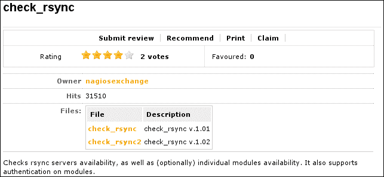
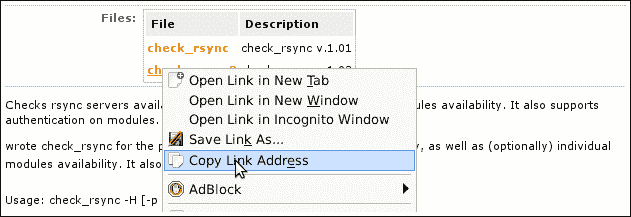
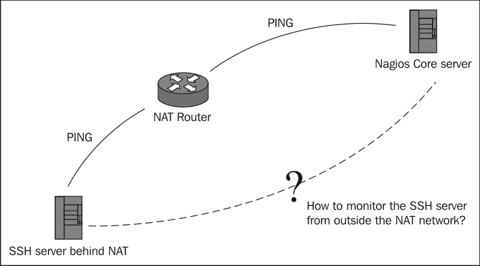
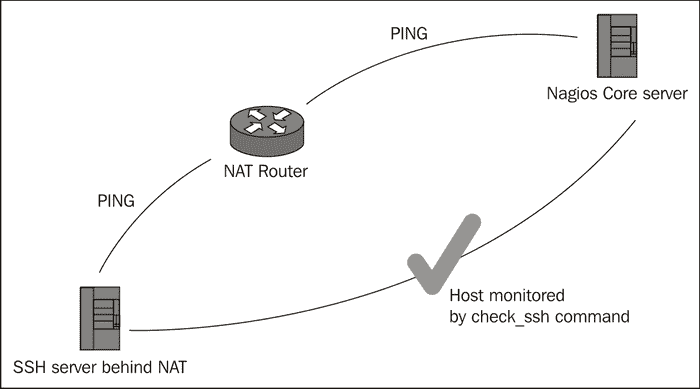

# 第二章：使用命令和插件

在本章中，我们将涵盖以下内容：

+   查找插件

+   安装插件

+   移除插件

+   自定义现有命令

+   使用替代的主机检查命令

+   从零开始编写新插件

# 介绍

Nagios Core 也许最好被视为一个监控框架，而不仅仅是一个监控工具。它的模块化设计可以使用任何能够根据某种检查返回适当值的程序，例如用于主机或服务的 `check_command` 插件。这就是命令和插件概念发挥作用的地方。

对于 Nagios Core，**插件**是任何可以用来收集有关主机或服务信息的程序。为了确保主机响应 PING 请求，我们可以使用一个插件，如 `check_ping`，当该插件针对主机名或地址运行时，无论是否由 Nagios Core 执行，都会返回一个状态码，指示是否在一定时间内收到了 PING 请求的响应。这个状态码和任何附带的消息就是 Nagios Core 用来确定主机或服务状态的依据。

插件通常就像 Unix 类系统上的任何其他程序；它们可以从命令行运行，受限于权限和所有者的限制，可以用任何编程语言编写，并且可以接受参数和选项来修改其工作方式。最重要的是，它们与 Nagios Core 本身完全独立（即使是由同一个团队编写的），并且它们在应用程序中的使用方式是可以更改的。

为了允许插件在使用时具有更大的灵活性，Nagios Core 根据命令定义的条款使用这些程序。特定插件的命令定义了该插件的使用方式，包括它在文件系统中的位置、应该传递的任何参数以及其他选项。特别是，参数和选项通常包括 `WARNING` 和 `CRITICAL` 状态的阈值。

Nagios Core 通常与一组插件一起下载和安装，这些插件称为**Nagios 插件**，可以在[`www.nagiosplugins.org/`](http://www.nagiosplugins.org/)上找到，本书假设你已经安装了这些插件。这些插件之所以被选择，是因为作为一个整体，它们能够很好地覆盖监控基础设施中最常见的需求，包括对常见服务的检查，如 web、邮件服务和 DNS 服务，以及更通用的检查，如检查服务器上 TCP 或 UDP 端口是否可访问并且开放。对于大多数监控需求，我们可能不需要其他插件；但如果需要，Nagios Core 使得通过自定义命令定义、在 Nagios Exchange 网站上添加由贡献者编写的第三方插件，或者在一些特殊情况下从零开始编写自定义插件成为可能。

# 查找插件

在这个食谱中，我们将遵循一个良好的流程，找到适合特定监控任务的插件。我们将首先检查是否已经有现有的插件可以完全满足我们的需求。如果找不到，我们将检查是否可以使用其他更通用的插件来解决问题。如果仍然没有合适的插件，我们将访问 Nagios Exchange 并在那里搜索合适的插件。

## 准备工作

你应该已经运行了一个 Nagios Core 3.0 或更新版本的服务器，并且已经配置了一些主机和服务，你需要在其中一台主机上配置一个特定的服务，而你不确定如何监控它。

我们将以一个简单的问题作为示例；我们有一台名为`troy.naginet`的服务器，运行一个`rsync`进程，该进程在端口`873`上监听。我们已经通过`PING`监控了主机的网络连接，但我们希望 Nagios Core 检查`rsync`服务器是否始终可用并监听，以防它在运行时崩溃或在系统重启时未能启动。

## 如何操作...

我们可以通过以下步骤找到适合任何监控任务的新插件：

1.  首先，由于我们已经安装了 Nagios Core Plugins 集，我们将检查其中的任何插件是否可以直接应用于我们的问题。我们将从访问 Nagios Core 服务器上的`/usr/local/nagios/libexec`目录开始，并获取目录列表：

    ```
    # cd /usr/local/nagios/libexec
    # ls
    check_apt       check_ide_smart     check_nntp      check_simap
    check_breeze    check_ifoperstatus  check_nntps     check_smtp
    check_by_ssh    check_ifstatus      check_nt        check_spop
    ...

    ```

    这里有一长串插件，但没有一个像`check_rsync`或`check_backup`，所以看起来核心中似乎没有一个插件能完全满足我们的需求。

1.  然而，有一个名为`check_tcp`的插件。搜索其名称时，Nagios Plugins 网站的手册页面作为第一个结果出现，描述了它的功能：

    *“这个插件测试与指定主机（或 Unix 套接字）的 TCP 连接。”*

    我们不仅仅需要检查端口，所以这也不太适合我们。

1.  搜索`check_rsync`，这是插件的合适名称，搜索结果中出现了 Nagios Exchange 网站的一页，正好有一个名为`check_rsync`的插件。我们现在找到了一个合适的插件：

## 它是如何工作的...

如果我们只需要检查`rsync`是否在端口`873`上监听，而不需要真正监控其实际功能，那么`check_tcp`插件可能足够了。然而，在我们的案例中，我们可能需要找到一种方法，不仅检查端口是否开放，还需要检查特定目录或`rsync`模块是否可访问。

阅读`check_rsync`的描述，它看起来正好具备我们需要的功能——检查服务器上是否有某个`rsync`模块。在这一点上，我们可以下载插件并按照其安装说明进行安装。

## 还有更多...

本操作指南旨在强调，除了将一组功能强大的插件作为 Nagios Core 插件集的一部分外，Nagios Core 插件网站上提供的在线文档 [`nagiosplugins.org/`](http://nagiosplugins.org/) 以及 Nagios Exchange 上提供的其他插件 [`exchange.nagios.org/`](http://exchange.nagios.org/) 使得找到适合特定监控问题的插件相对简单。

请注意，当我们下载第三方插件时，重要的是要检查是否信任该插件以确保它能执行我们需要的操作。**Nagios Exchange**是一个有管理的社区，遵循一定的编码标准，但插件的使用风险自负；如果我们不理解某个插件的功能，应该谨慎安装或使用它，且需阅读其代码、文档及评论。

## 另请参见

+   本章中的*安装插件*、*移除插件*和*从零开始编写插件*的操作指南

# 安装插件

在本操作指南中，我们将把从 Nagios Exchange 下载的自定义插件安装到 Nagios Core 服务器上，以便将其用作 Nagios Core 命令，从而检查服务。

## 准备工作

你应该已经有一个 Nagios Core 3.0 或更新版本的服务器，并且已经配置了一些主机和服务，同时找到一个合适的插件来解决某个特定的监控需求。你的 Nagios Core 服务器应该具有互联网连接，能够直接从网站下载插件。

在这个示例中，我们将使用`check_rsync`插件，它可以在网上找到，网址是 [`exchange.nagios.org/directory/Plugins/Network-Protocols/Rsync/check_rsync/details`](http://exchange.nagios.org/directory/Plugins/Network-Protocols/Rsync/check_rsync/details)。

这个插件非常简单，由一个 Perl 脚本和一些基本的依赖项组成。如果你希望安装此脚本作为示例，那么服务器还需要安装 Perl 解释器；在许多系统中，它安装在`/usr/bin/perl`路径下。

本示例还将直接测试运行`rsync`守护进程的服务器，主机名为`troy.naginet`。

## 如何操作...

我们可以按如下方式下载并安装新插件：

1.  复制`check_rsync`插件的最新版本下载链接：

1.  转到 Nagios Core 服务器的插件目录。默认位置是`/usr/local/nagios/libexec`：

    ```
    # cd /usr/local/nagios/libexec

    ```

1.  使用`wget`命令将插件下载到名为`check_rsync`的文件中。请确保将 URL 用引号括起来：

    ```
    # wget 'http://exchange.nagios.org/components/com_mtree/attachment.php?link_id=307&cf_id=29' -O check_rsync

    ```

1.  使用`chmod`和`chown`命令使插件可执行：

    ```
    # chown nagios.nagios check_rsync
    # chmod 0770 check_rsync

    ```

1.  直接运行插件，且不带任何参数，以检查它是否能够运行并获取使用说明。建议使用`nagios`用户通过`su`或`sudo`来测试：

    ```
    # sudo -s -u nagios
    $ ./check_rsync
    Usage: check_rsync -H <host> [-p <port>] [-m <module>[,<user>,<password>] [-m <module>[,<user>,<password>]...]]

    ```

1.  尝试直接对运行`rsync`的主机运行插件，查看它是否能正常工作并报告状态：

    ```
    $ ./check_rsync -H troy.naginet
    Output normally starts with the status determined, with any extra information after a colon:
    OK: Rsync is up

    ```

如果这一切正常，那么插件现在已经安装并且可以正常工作。

## 它是如何工作的...

因为 Nagios Core 插件本身就是程序，所以安装插件就相当于将一个程序或脚本保存到合适的目录；在这个案例中是`/usr/local/nagios/libexec`，在那里存放着所有其他插件。它接下来可以像任何其他插件一样使用。

插件一旦正常工作，下一步就是在 Nagios Core 配置中定义一个命令，以便它可以用于监控主机和/或服务。这可以通过本章中的*创建新命令*部分来完成。

## 还有更多...

如果我们检查 Perl 脚本，我们可以看到它的工作原理。它像其他 Perl 脚本一样工作，不同之处在于它的返回值定义在一个名为`%ERRORS`的哈希表中，选择的返回值取决于它尝试检查`rsync`进程时发生的情况。这是为 Nagios Core 实现插件的最关键部分。

不同插件的安装过程各不相同。特别是许多插件是用像 C 这样的语言编写的，因此需要编译。一个这样的插件是流行的`check_nrpe`。这些插件通常不仅仅是保存到一个目录并使其可执行，它们往往遵循配置、编译和安装的常规模式：

```
$ ./configure
$ make
# make install

```

对于许多以这种方式构建的插件，通常该过程的最后一步会将编译好的插件安装到合适的目录。一般来说，如果插件附带了说明文档，最好阅读它们，以确保我们正确安装插件。

## 参见

+   本章中的*查找插件*、*删除插件*和*创建新命令*部分

# 删除插件

在这个实例中，我们将删除一个我们不再需要的插件，作为我们 Nagios Core 安装的一部分。可能是它无法正常工作，或者它监控的服务不再可用，或者使用它存在安全或许可问题。

## 准备工作

你应该已经运行了一个 Nagios Core 3.0 或更高版本的服务器，并且已经配置了几个主机和服务，同时有一个你想从服务器中删除的插件。在本例中，我们将从 Nagios Core 服务器中删除现在不再需要的`check_rsync`插件。

## 操作方法...

我们可以按照以下步骤从 Nagios Core 实例中删除插件：

1.  删除任何使用该插件的配置部分，包括使用它的主机或服务的`check_command`，以及引用该程序的命令定义。举个例子，以下定义的命令在我们删除`check_rsync`插件后将不再有效：

    ```
    define command {
        command_name  check_rsync
        command_line  $USER1$/check_rsync -H $HOSTADDRESS$
    }
    ```

    使用`grep`等工具是查找命令和插件引用的一个好方法：

    ```
    # grep -R check_rsync /usr/local/nagios/etc

    ```

1.  在 Nagios Core 服务器上切换到保存插件的目录。默认位置是`/usr/local/nagios/libexec`：

    ```
    # cd /usr/local/nagios/libexec

    ```

1.  使用`rm`命令删除插件：

    ```
    # rm check_rsync

    ```

1.  验证配置并重启 Nagios Core 服务器：

    ```
    # /usr/local/nagios/bin/nagios -v /usr/local/nagios/etc/nagios.cfg
    # /etc/init.d/nagios restart

    ```

## 它是如何工作的...

Nagios Core 插件仅仅是服务器用来执行主机和服务检查的外部程序。如果不再需要插件，只需从我们的配置中删除对它的引用（如果有），然后从`/usr/local/nagios/libexec`目录中删除插件程序即可。

## 还有更多内容...

通常，即使 Nagios Core 没有使用插件程序，将其保留在服务器上也不会有什么害处。它不会导致任何性能问题或其他麻烦，而且以后可能会需要。Nagios Core 的插件通常是非常小的程序，不会在现代服务器上占用太多磁盘空间。

## 另见

+   本章中的*查找插件*，*安装插件*和*创建新命令*方法

# 创建一个新命令

在这个例子中，我们将为刚刚安装到 Nagios Core 服务器上`/usr/local/nagios/libexec`目录中的插件创建一个新命令。这将定义 Nagios Core 如何使用该插件，从而允许它作为服务定义的一部分被使用。

## 准备工作

你应该已经运行了 Nagios Core 3.0 或更新版本的服务器，并且已经配置了一些主机和服务，并安装了你希望为其定义新命令的插件。这将允许你将它作为服务定义的一部分使用。在这个例子中，我们将为已安装的`check_rsync`插件定义一个命令。

## 如何操作...

我们可以按照以下方式在配置中定义一个新命令：

1.  切换到包含 Nagios Core 对象配置的目录。默认位置是`/usr/local/nagios/etc/objects`：

    ```
    # cd /usr/local/nagios/etc/objects

    ```

1.  编辑`commands.cfg`文件：

    ```
    # vi commands.cfg

    ```

1.  在文件底部，添加以下命令定义：

    ```
    define command {
        command_name  check_rsync
     command_line  $USER1$/check_rsync -H $HOSTADDRESS$
    }
    ```

1.  验证配置并重启 Nagios Core 服务器：

    ```
    # /usr/local/nagios/bin/nagios -v /usr/local/nagios/etc/nagios.cfg
    # /etc/init.d/nagios restart

    ```

如果验证通过并且服务器成功重启，我们应该能够在服务定义中使用`check_rsync`命令。

## 它是如何工作的...

我们添加到`commands.cfg`文件中的配置定义了一个名为`check_rsync`的新命令，定义了使用同名插件监控服务的方法。这使我们能够在服务声明中使用`check_rsync`作为`check_command`指令的值，类似于以下代码片段：

```
define service {
    use                  generic-service
    host_name            troy.naginet
    service_description  RSYNC
 check_command        check_rsync
}
```

命令定义只需要两个指令，我们已经定义了这两个指令：

+   `command_name`：这定义了我们可以在主机或服务定义中引用该命令时使用的唯一名称。

+   `command_line`：这定义了 Nagios Core 应该执行的命令行，以进行适当的检查。

这个特定的命令行还使用了两个宏：

+   `$USER1$`：它展开为`/usr/local/nagios/libexec`，这是插件二进制文件的存放位置，包括`check_rsync`。它在文件`/usr/local/nagios/etc/resource.cfg`的示例配置中定义。

+   `$HOSTADDRESS$`：它展开为任何主机的地址，且该命令用于该主机或服务定义。

所以，如果我们在检查`troy.naginet`上的`rsync`服务器时使用了这个命令，那么完成的命令可能会像下面这样：

```
$ /usr/local/nagios/libexec/check_rsync -H troy.naginet

```

我们可以直接以 nagios 用户身份从命令行运行它，看看它返回什么样的结果：

```
$ /usr/local/nagios/libexec/check_rsync -H troy.naginetOK: Rsync is up

```

## 还有更多内容...

一个插件可以用于多个命令。如果我们有一个特定的`rsync`模块，配置名称为`backup`，我们可以编写另一个命令`check_rsync_backup`，如下所示，检查此模块是否可用：

```
define command {
    command_name  check_rsync_backup
 command_line  $USER1$/check_rsync -H $HOSTADDRESS$ -m backup
}
```

或者，如果我们的一个或多个`rsync`服务器运行在另一个端口上，比如端口`5873`，那么我们可以为此定义一个单独的命令`check_rsync_altport`：

```
define command {
    command_name  check_rsync_altport
 command_line  $USER1$/check_rsync -H $HOSTADDRESS$ -p 5873
}
```

因此，命令可以根据我们的需求定义得非常精确。在本章的*自定义现有命令*配方中，我们将详细探讨这一点。

## 另见

+   本章中的*安装插件*和*自定义现有命令*配方

# 自定义现有命令

在这个配方中，我们将自定义一个现有的命令定义。你可能会出于多种原因想这么做，其中一个常见的原因是检查过于“积极”，在`WARNING`或`CRITICAL`状态时发送通知，尽管这些状态实际上并不严重。它还可以有用，如果一个检查过于“宽容”，没有检测到主机或服务的实际问题。

另一个原因是考虑到你自己网络的特殊情况。例如，如果你在大量主机上运行 HTTP 守护进程，并且这些守护进程都使用备用端口`8080`，那么需要检查它们，最好有一个`check_http_altport`命令可用。我们可以通过复制并修改原始`check_http`命令的定义来实现这一点。

## 准备工作

你应该已经运行了 Nagios Core 3.0 或更新版本的服务器，并且已经配置了一些主机和服务。你还应该已经熟悉服务、命令和插件之间的关系。

## 如何操作...

我们可以按照如下方式自定义现有的命令定义：

1.  切换到包含 Nagios Core 对象配置的目录。默认位置是`/usr/local/nagios/etc/objects`：

    ```
    # cd /usr/local/nagios/etc/objects

    ```

1.  编辑`commands.cfg`文件，或者编辑位于适当位置的其他文件，以适应`check_http`命令：

    ```
    # vi commands.cfg

    ```

1.  查找`check_http`命令的定义。在默认的 Nagios Core 配置中，它应该类似于以下内容：

    ```
    # 'check_http' command_definition
    define command {
     command_name  check_http
     command_line  $USER1$/check_http -H $HOSTADDRESS$ $ARG1$
    }

    ```

1.  将此定义复制到新定义中，并将其更改为类似于以下代码片段，重命名命令并向命令行添加一个新选项：

    ```
    # 'check_http_altport' command_definition
    define command {
     command_name  check_http_altport
     command_line  $USER1$/check_http -H $HOSTADDRESS$ -p 8080 $ARG1$
    }

    ```

1.  验证配置并重启 Nagios Core 服务器：

    ```
    # /usr/local/nagios/bin/nagios -v /usr/local/nagios/etc/nagios.cfg
    # /etc/init.d/nagios restart

    ```

如果验证通过且服务器成功重启，我们现在应该能够在服务定义中使用基于原始`check_http`命令的`check_http_altport`命令。

## 它是如何工作的...

我们添加到`commands.cfg`文件中的配置重新定义了`check_http`命令，但在两个方面做了更改：

+   它将命令从`check_http`重命名为`check_http_alt`，这是为了区分这些命令。Nagios Core 中的命令名称，就像主机名一样，必须是唯一的。

+   它在命令行调用中添加了选项`-p 8080`，指定了何时调用`check_http`。检查将使用 TCP 端口`8080`，而不是默认的 TCP 端口`80`。

`check_http_alt`命令现在可以像`check_http`命令一样作为检查命令使用。例如，检查`sparta.naginet`主机是否在`8080`端口上运行 HTTP 守护进程的服务定义可能类似于以下代码片段：

```
define service {
    use                  generic-service
    host_name            sparta.naginet
 service_description  HTTP_8080
 check_command        check_http_alt
}
```

## 还有更多...

这道配方的标题暗示我们应该通过直接编辑现有命令来进行自定义，实际上，如果我们确实希望以这种方式操作，这种方法是有效的。我们可以在命令行中直接添加`-p 8080`或其他自定义选项，而不是复制命令定义，并修改原始命令。

然而，在大多数情况下，这种做法是不可取的，主要是因为它可能会破坏现有的监控，并且可能会让其他 Nagios Core 服务器的管理员感到困惑。如果我们有一个特殊的监控案例——在这种情况下，检查非标准端口的 HTTP——那么明智的做法是基于现有命令创建一个全新的命令，并进行必要的自定义。

你可以定义任意数量的命令，因此在定义所需的替代命令时可以非常自由。建议给它们起一些具有指导意义的名字，描述它们的功能，并在配置文件中添加解释性注释。你可以通过在文件前加`#`字符来添加注释：

```
#
# 'check_http_altport' command_definition. This is to keep track of
# servers that have panels running on alternative ports.
#
define command {
 command_name  check_http_altport
 command_line  $USER1$/check_http -H $HOSTADDRESS$ -p 8080 $ARG1$
}

```

## 另请参见

+   本章中的*创建新命令*配方

+   第一章中的*创建新服务*配方，*理解主机、服务和联系人*

# 使用备用检查命令检查主机

在这个配方中，我们将学习如何处理网络监控中的一个稍微棘手的情况——监控一个不响应 PING 的服务器，但仍然提供需要检查的某些网络服务。

在可能的情况下，允许 PING 是一个良好的实践，因为它是**RFC 1122**中的一项规定，并且是一个非常有用的诊断工具，不仅用于监控，也用于故障排除。然而，有时只被少数人访问的服务器可能被配置为不响应这些消息，可能是出于保密的原因。家庭路由器通常会这样配置。

这个问题的另一个非常常见的原因，也是我们在这里处理的示例，是检查位于**IPv4 NAT**防火墙后面的服务器。我们无法通过**RFC1918**地址（如`192.168.1.20`）直接访问主机，因为它不能从公共互联网进行访问。因此，单纯地对路由器的公共接口进行 ping 测试并不能告诉我们，路由器正在转换地址的主机是否正常工作。

然而，SSH 的端口`22`从外部转发到该服务器，正是我们需要检查其可用性的服务。



我们将通过 SSH 检查主机是否正常，因为我们无法像通常那样从外部 ping 它。

## 准备工作

您应该已经运行了 Nagios Core 3.0 或更新版本的服务器，并且已经配置了一些主机和服务。您也应该已经熟悉服务、命令和插件之间的关系。

## 如何操作...

我们可以按如下方式为主机指定替代的检查方法：

1.  切换到包含 Nagios Core 对象配置的目录。默认位置是`/usr/local/nagios/etc/objects`：

    ```
    # cd /usr/local/nagios/etc/objects

    ```

1.  找到包含无法响应 PING 的主机定义的文件，并进行编辑。在本例中，我们要编辑的是`crete.naginet`主机：

    ```
    # vi crete.naginet.cfg

    ```

1.  更改或定义主机的`check_command`参数，使用我们想要用于检查的命令，而不是通常的`check-host-alive`或`check_ping`插件。在这种情况下，我们希望使用`check_ssh`。最终的主机定义可能类似于以下代码片段：

    ```
    define host {
        use            linux-server
        host_name      crete.naginet
        alias          crete
        address        10.128.0.23
        check_command  check_ssh
    }
    ```

    请注意，即使我们使用的是主机模板，如`generic-host`或`linux-server`，定义`check_command`依然有效。最好检查主机是否会按预期响应我们的检查：

    ```
    # sudo -s -u nagios
    $ /usr/local/nagios/libexec/check_ssh -H 10.128.0.23
    SSH OK - OpenSSH_5.5p1 Debian-6+squeeze1 (protocol 2.0)

    ```

1.  验证配置并重启 Nagios Core 服务器：

    ```
    # /usr/local/nagios/bin/nagios -v /usr/local/nagios/etc/nagios.cfg
    # /etc/init.d/nagios restart

    ```

完成此操作后，接下来的对`crete.naginet`服务器的计划检查应该会显示该主机为`UP`，因为它是通过`check_ssh`命令而非通常的`check-host-alive`命令进行检查的。

## 它是如何工作的

我们为`crete.naginet`主机添加的配置使用`check_ssh`来检查主机是否`UP`，而不是使用 PING 的检查。这是合适的，因为从`crete.naginet`访问的唯一公共服务是其 SSH 服务。



`check_ssh`命令通常用于检查服务的可用性，而不是主机。然而，Nagios Core 允许我们将其作为主机检查命令使用。大多数服务命令都是这样工作的；您也可以通过`check_http`检查位于 NAT 后面的 Web 服务器。

## 还有更多...

请注意，为了完整性，适当地通过 PING 或其他适合其公共地址的检查监控 NAT 路由器也是合适的。这样，如果 SSH 服务器的主机检查失败，我们可以检查位于前面的 NAT 路由器是否仍然可用，这有助于排查问题是否出在服务器本身还是前面的 NAT 路由器上。你还可以通过将 NAT 路由器设置为 SSH 服务器的父主机，来使这个设置更有用，这一点可以在 第八章中的 *创建网络主机层次结构* 方案，*理解网络布局* 中找到。

## 另见

+   第五章中的 *监控 SSH 以检查任何主机* 和 *检查替代 SSH 端口* 方案，*监控方法*

+   第六章中的 *使用 NRPE 监控远程主机上的本地服务* 方案，*启用远程执行*

+   第八章中的 *创建网络主机层次结构* 和 *建立主机依赖关系* 方案，*理解网络布局*

# 从零开始编写一个新的插件

即便有 Nagios 插件集中非常有用的标准插件，以及 Nagios Exchange 上大量可用的自定义插件，随着我们的监控设置变得更加精细，我们有时也会发现，某些服务或主机的某个属性我们希望进行检查，但似乎没有合适的插件可用。每个网络都是不同的，有时候其他人慷慨为社区制作的插件并不能完全覆盖你的需求。通常，监控需求越具体，可用的插件就越少，甚至没有一个插件能够完全满足你的要求。

在这个示例中，我们将处理一个非常具体的问题，我们假设这个问题无法通过任何已知的 Nagios Core 插件有效解决，因此我们将使用 Perl 编写一个插件来解决。下面是示例问题：

我们的 Linux 安全团队希望能够自动检查我们的服务器是否运行着有已知漏洞的内核。然而，他们并不担心所有存在漏洞的内核，而是关注特定的版本。他们已经提供了三个内核的版本号，这些内核有一些小漏洞，虽然他们并不特别担心，但确实需要打补丁，还有一个内核是他们非常担心的。

假设小漏洞存在于版本号为 `2.6.19`、`2.6.24` 和 `3.0.1` 的内核中，而严重漏洞存在于版本号为 `2.6.39` 的内核中。请注意，这些版本号是任意的，并不一定反映任何真实的内核漏洞！

团队可以单独登录到所有服务器进行检查，但这些服务器的年龄和访问方式各不相同，由不同的人管理。他们还需要多次手动检查，因为有可能某个未经经验的管理员会升级到一个在旧版中已知存在漏洞的内核版本，而且他们可能还想以后添加其他受影响的内核版本进行检查。

因此，团队要求我们通过 Nagios Core 监控来解决问题，我们决定最好的解决方式是编写自己的插件 `check_vuln_kernel`，该插件检查 `uname` 的输出中的内核版本字符串，然后执行以下操作：

+   如果是略微有漏洞的内核版本，它将返回一个 `WARNING` 状态，提醒我们安全团队在下次有时间时应当处理此问题。

+   如果是高度易受攻击的内核版本，它将返回一个 `CRITICAL` 状态，安全团队知道必须立即安装修补后的内核。

+   如果 `uname` 给出了错误或我们无法理解的输出，它将返回一个 `UNKNOWN` 状态，提醒团队插件中可能存在错误或服务器可能存在更严重的问题。

+   否则，它将返回一个 `OK` 状态，确认该内核版本没有已知漏洞。

+   最后，他们希望能够一目了然地在 Nagios Core 监控中看到内核版本，并判断它是否存在漏洞。

出于这个示例的目的，我们只监控 Nagios Core 服务器本身，但通过 NRPE，我们可以在其他需要监控的服务器上安装这个插件，它们也能正常工作。你可以在第六章的 *使用 NRPE 监控远程机器的本地服务* 中学习如何操作。

尽管这个问题非常具体，我们将以一种非常通用的方式来处理它，你可以将这种方式适应到任何需要 Nagios 插件的解决方案中：

1.  执行命令并将其输出存储到变量中。

1.  检查输出中是否存在或不存在某些模式。

1.  根据这些测试返回适当的状态。

这意味着如果你能做到这一点，你将能够通过 Nagios Core 有效地监控服务器上的任何东西！

## 准备工作

你应该已经有一个运行着的 Nagios Core 3.0 或更新版本的服务器，并且已经配置了一些主机和服务。你还应该熟悉服务、命令和插件之间的关系。你还需要安装 Perl。

这将是一个相当长的教程，涵盖了许多 Nagios Core 的概念。你应该熟悉以下所有概念：

+   定义新主机和服务，以及它们之间的关系。

+   定义新命令，以及它们如何与调用的插件相关联。

+   安装、测试和使用 Nagios Core 插件。

一些 Perl 的基础知识也会有所帮助，但不是必需的。我们会在插件中包含注释，解释每一段代码的作用。

## 如何做到这一点...

我们可以按如下方式编写、测试并实现我们的示例插件：

1.  切换到包含 Nagios Core 插件二进制文件的目录。默认位置是`/usr/local/nagios/libexec`：

    ```
    # cd /usr/local/nagios/libexec

    ```

1.  开始编辑一个新的文件，名为`check_vuln_kernel`：

    ```
    # vi check_vuln_kernel

    ```

1.  在其中包含以下代码；请注意注释，它们解释了每一段代码的作用：

    ```
    #!/usr/bin/env perl

    #
    # Use strict Perl style and report potential problems to help us write this
    # securely and portably.
    #
    use strict;
    use warnings;

    #
    # Include the Nagios utils.pm file, which includes definitions for the return
    # statuses that are appropriate for each level: OK, WARNING, CRITICAL, and
    # UNKNOWN. These will become available in the %ERRORS hash.
    #
    use lib "/usr/local/nagios/libexec";
    use utils "%ERRORS";
    #
    # Define a pattern that matches any kernel vulnerable enough so that if we find
    # it we should return a CRITICAL status.
    #
    my $critical_pattern = "^(2\.6\.39)[^\\d]";

    #
    # Same again, but for kernels that only need a WARNING status.
    #
    my $warning_pattern = "^(2\.6\.19|2\.6\.24|3\.0\.1)[^\\d]";

    #
    # Run the command uname with option -r to get the kernel release version, put
    # the output into a scalar $release, and trim any newlines or whitespace
    # around it.
    #
    chomp(my $release = qx|/bin/uname -r|);

    #
    # If uname -r exited with an error status, that is, anything greater than 1,
    # then there was a problem and we need to report that as the UNKNOWN status
    # defined by Nagios Core's utils.pm.
    #
    if ($? != 0) {
     exit $ERRORS{UNKNOWN};
    }

    #
    # Check to see if any of the CRITICAL patterns are matched by the release
    # number. If so, print the version number and exit, returning the appropriate
    # status.
    #
    if ($release =~ m/$critical_pattern/) {
     printf "CRITICAL: %s\n", $release;
     exit $ERRORS{CRITICAL};
    }

    #
    # Same again, but for WARNING patterns.
    #
    if ($release =~ m/$warning_pattern/) {
     printf "WARNING: %s\n", $release;
     exit $ERRORS{WARNING};
    }

    #
    # If we got this far, then uname -r worked and didn't match any of the
    # vulnerable patterns, so we'll print the kernel release and return an OK
    # status.
    #
    printf "OK: %s\n", $release;
    exit $ERRORS{OK};

    ```

1.  使插件归`nagios`用户所有，并使用`chmod`命令使其可执行：

    ```
    # chown nagios.nagios check_vuln_kernel# chmod 0770 check_vuln_kernel
    Run the plugin directly to test it:
    # sudo -s -u nagios
    $ ./check_vuln_kernel
    OK: 2.6.32-5-686

    ```

现在我们应该能够像使用任何其他命令一样，在命令中使用该插件，从而在服务检查中使用它。请注意，本书的代码包中包含了该插件的代码，方便您参考。

## 它是如何工作的...

我们在新插件文件`check_vuln_kernel`中添加的代码其实非常简单：

1.  它运行`uname -r`来获取内核的版本号。

1.  如果这不起作用，它会以`UNKNOWN`状态退出。

1.  如果版本号与包含关键版本号的模式匹配，它会以`CRITICAL`状态退出。

1.  如果版本号与包含警告版本号的模式匹配，它会以`WARNING`状态退出。

1.  否则，它会以`OK`状态退出。

它还会打印状态作为字符串，并附带内核版本号，如果它能够成功获取的话。

我们可能会按如下方式为此插件设置命令定义：

```
define command {
    command_name  check_vuln_kernel
    command_line  $USER1$/check_vuln_kernel
}
```

反过来，我们可能会按如下方式为该命令设置服务定义：

```
define service {
    use                  local-service
    host_name            localhost
    service_description  VULN_KERNEL
 check_command        check_vuln_kernel
}
```

如果内核没有漏洞，服务在 Web 界面中的显示可能类似于以下截图：


然而，如果监控服务器本身运行的是一个有漏洞的内核，那么它的显示可能更接近以下截图（并且如果配置了通知，它会发送后续通知）：


## 还有更多...

这可能是一个简单的插件，但它的结构可以泛化为各种监控任务。如果我们能找出正确的逻辑，在合适的编程语言中返回我们想要的状态，那么我们就可以编写一个插件，几乎做任何事情。

这样一个插件同样可以用 C 语言编写，以提高性能，但为了简便起见，我们假设插件不需要高性能。相反，我们可以使用更适合快速临时脚本的语言；在这种情况下，我们使用 Perl。文件`utils.sh`，也在`/usr/local/nagios/libexec`中，如果我们更喜欢，也允许我们使用 Shell 脚本编写。

如果您编写了一个插件，认为它对 Nagios 社区有普遍的使用价值，请考虑将其置于自由软件许可证下，并提交到 Nagios Exchange，以便其他人也能从您的工作中受益。社区的贡献和支持使 Nagios Core 成为一个如此出色的监控平台，并在广泛使用中。

通过这种方式发布的任何插件应该符合 Nagios 插件开发指南。在撰写本文时，这些指南可在[`nagiosplug.sourceforge.net/developer-guidelines.html`](http://nagiosplug.sourceforge.net/developer-guidelines.html)找到。

最后，您应该注意，示例中使用的`utils.pm`方法可能在未来版本的 Nagios Core 中被弃用。为了简便起见，这里使用了这种方法。新的包含方式是通过一个名为`Nagios::Plugin`的 CPAN 模块来实现的。

## 另见

+   本章中的*创建新命令*和*定制现有命令*食谱

+   本章中的*创建新服务食谱*，见第一章，*理解主机、服务和联系人*

+   本章中的*使用 NRPE 监控远程机器上的本地服务*食谱，见第六章，*启用远程执行*
