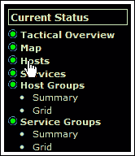
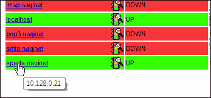
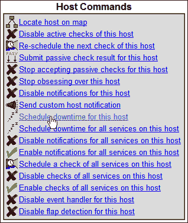
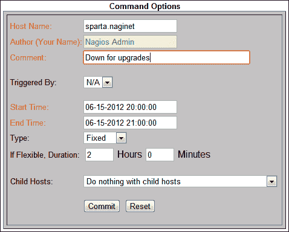
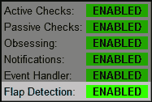
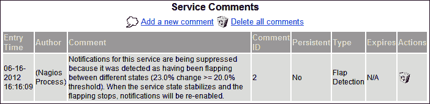

# 第三章：与检查和状态的工作

本章将涵盖以下内容：

+   指定检查主机或服务的频率。

+   更改 PING RTT 和数据包丢失的阈值。

+   更改磁盘使用的阈值。

+   为主机或服务安排停机时间。

+   通过波动管理短期停机。

+   调整服务的波动百分比阈值。

# 引言

一旦在 Nagios Core 中配置了主机和服务，它的行为主要由它所执行的检查决定，以确保主机和服务按预期运行，并且根据这些检查得出的结论，主机和服务必须处于的状态。

检查主机和服务的频率以及何时标记主机或服务为存在问题，取决于服务的性质及其始终运行的重要性。比如，若检查位于世界另一端的主机，且在繁忙时段它的往返时间超过 100 毫秒，那么这可能并不会引起任何关注，甚至可能不需要标记为 `WARNING` 状态，更不用说 `CRITICAL` 状态了。

然而，如果同一主机位于本地网络，期望往返时间小于 10 毫秒，那么超过 100 毫秒的往返时间可能就会被视为一个严重问题，可能是局部网络出现了数据包风暴或其他问题，并且我们需要立即通知相关管理员。同样，对于像 Web 服务器这样的主机，可能对于繁忙的共享网站主机上页面的响应时间超过一秒并不关心。但如果公司网站或专用托管客户的响应时间变得如此糟糕，可能就需要通知 Web 服务器管理员。

因此，主机和服务并不是完全相同的。Nagios Core 提供了几种方式来更精确地定义行为，具体如下：

+   使用适当的 `check_command` 插件，规定主机或服务应被检查的频率。

+   检查结果必须达到多差，才会触发 `WARNING` 或 `CRITICAL` 问题，若有的话。

+   为主机或服务定义一个停机时间段，使得 Nagios Core 知道在指定时间段内不需要期望它运行，通常用于升级或其他维护。

+   是否自动容忍“波动”，即主机和服务看似频繁上下波动的情况。

本章将使用一些常见的主机和服务行为问题实例，展示如何配置它们。

# 指定检查主机或服务的频率。

在这个示例中，我们将配置一个非常重要的主机，每三分钟检查一次，如果 Nagios Core 发现该主机因检查失败而处于 `DOWN` 状态，它将在一分钟后重新检查该主机，然后再将状态通知其定义的联系人。我们将通过自定义现有主机的定义来完成这一操作。

## 准备工作

您应该已经配置了至少一个主机的 Nagios Core 3.0 或更新版本的服务器。我们将以`sparta.naginet`为例，它是在其自己的文件中定义的主机。

您还应该了解命令和插件的基础知识，特别是`check_command`指令的含义。相关内容在第二章中有讲解，*命令与插件的使用*。

## 如何操作...

我们可以按如下方式自定义主机的检查频率：

1.  转到 Nagios Core 的`objects`配置目录。默认路径是`/usr/local/nagios/etc/objects`。如果您将主机定义放在其他文件中，请转到该文件所在的目录：

    ```
    # cd /usr/local/nagios/etc/objects

    ```

1.  编辑包含您主机定义的文件，并找到该文件中的主机定义：

    ```
    # vi sparta.naginet.cfg

    ```

    主机定义可能类似于以下内容：

    ```
    define host {
        use                 linux-server
        host_name           sparta.naginet
        alias               sparta
        address             10.128.0.21
    }
    ```

1.  将`check_interval`指令的值设置或编辑为`3`：

    ```
    define host {
        use                 linux-server
        host_name           sparta.naginet
        alias               sparta
        address             10.128.0.21
     check_interval      3
    }
    ```

1.  将`retry_interval`指令的值设置或编辑为`1`：

    ```
    define host {
        use                 linux-server
        host_name           sparta.naginet
        alias               sparta
        address             10.128.0.21
        check_interval      3
     retry_interval      1
    }
    ```

1.  将`max_check_attempts`的值设置或编辑为`2`：

    ```
    define host {
        use                 linux-server
        host_name           sparta.naginet
        alias               sparta
        address             10.128.0.21
        check_interval      3
        retry_interval      1
     max_check_attempts  2
    }
    ```

1.  验证配置并重启 Nagios Core 服务器：

    ```
    # /usr/local/nagios/bin/nagios -v /usr/local/nagios/etc/nagios.cfg
    # /etc/init.d/nagios restart

    ```

完成此操作后，Nagios Core 将每三分钟对该主机运行相关的`check_command`插件（可能类似于`check-host-alive`）；如果失败，它将标记该主机为“停机”状态，并在一分钟后再次检查，只有当第二次检查也失败时，才会向定义的联系人发送通知。

## 如何工作...

上述配置更改了主机对象类型的三个属性，以实现我们所需的更改：

+   `check_interval`：这定义了在正常条件下，连续检查主机之间需要等待的时间。我们将其设置为`3`，即三分钟。

+   `retry_interval`：这定义了在首次发现主机问题后，跟进检查之间的等待时间。我们将其设置为`1`，即一分钟。

+   `max_check_attempts`：这定义了在发送通知之前需要运行多少次检查。我们将其设置为`2`，即进行两次检查。这意味着在第一次检查失败后，Nagios Core 会在一分钟后再进行一次检查，只有当第二次检查也失败时，才会发送通知。如果进行了两次检查且主机仍然处于问题状态，它将从`SOFT`状态转换为`HARD`状态。

请注意，在从模板派生的主机中设置这些指令（如我们示例中的情况）将覆盖模板中的相同指令。

## 还有更多内容...

需要注意的是，我们还可以定义`check_interval`和`retry_interval`命令使用的单位。它们默认只使用分钟，检查通常在 Nagios Core 的根配置文件中定义的`interval_length`设置，默认路径为`/usr/local/nagios/etc/nagios.cfg`：

```
interval_length=60
```

如果我们想要改为以秒为单位来指定这些时间段，我们可以将其值设置为`1`而不是`60`：

```
interval_length=1
```

这将使我们能够例如将`check_interval`设置为`15`，每隔 15 秒检查一次主机。请注意，如果我们有很多主机，并且检查时间很长，这样紧密的检查计划可能会过度负担 Nagios Core 进程。

不要忘记，更改大量主机的这些属性可能很繁琐，因此，如果有必要为多个主机设置这些指令的公共值，那么将这些值设置为主机模板中，并使这些主机从中继承可能是合适的做法。有关详细信息，请参阅《第九章》的*使用继承简化配置*配方，*配置管理*。请注意，同样的三个指令也适用于服务声明，并且具有相同的含义。我们可以定义与以下类似的声明来为`sparta.naginet`上的服务定义相同的通知行为：

```
define service {
    use                  generic-service
    host_name            sparta.naginet
    service_description  HTTP
    check_command        check_http
    address              10.128.0.21
 check_interval       3
 retry_interval       1
 max_check_attempts   2
}
```

## 另请参见

+   在本章的*Scheduling downtime for a host*配方中

+   在《第九章》的*使用继承简化配置*配方中，*配置管理*，Chapter 9。

# 更改 PING RTT 和数据包丢失的阈值

在本配方中，我们将为监视 PING 的主机设置一个服务，并查看如何调整`WARNING`和`CRITICAL`状态的阈值，使用命令参数完成。我们将通过为已经使用`check-host-alive`等插件检查的现有主机设置一个服务来实现这一点。我们的服务将用于监控主机是否完全`DOWN`，而是是否在合理时间内响应 PING 请求。

这对于通知并帮助诊断服务或主机的实际连通性问题可能非常有用。

因此，本配方将作为向命令提供参数以及调整特定服务的`WARNING`和`CRITICAL`阈值概念的良好示范。

## 准备工作

您应该拥有一个 Nagios Core 3.0 或更新的服务器，至少已经配置了一个主机，并且正在使用`check_command`插件`check-host-alive`。我们将使用`sparta.naginet`的例子，这是在其自己的文件中定义的主机。

您还应了解主机和服务在 Nagios Core 配置中如何配合，并熟悉通过`check_command`指令使用命令和插件的基础知识。

## 如何做...

我们可以按如下方式将我们的 PING 服务添加到现有主机，并设置自定义的往返时间和数据包丢失阈值：

1.  更改到 Nagios Core 对象配置目录。默认值为`/usr/local/nagios/etc/objects`。如果您将主机的定义放在不同的文件中，则请转到其目录：

    ```
    # cd /usr/local/nagios/etc/objects

    ```

1.  编辑包含主机定义的文件：

    ```
    # vi sparta.naginet.cfg

    ```

1.  在文件末尾添加以下定义。在这里最感兴趣的是`check_command`指令的值：

    ```
    define service {
        use                  generic-service
        host_name            sparta.naginet
        service_description  PING
     check_command        check_ping!100,20%!200,40%
    }
    ```

1.  验证配置并重启 Nagios Core 服务器：

    ```
    # /usr/local/nagios/bin/nagios -v /usr/local/nagios/etc/nagios.cfg
    # /etc/init.d/nagios restart

    ```

完成此操作后，Nagios Core 不仅会对原始主机运行`check-host-alive`主机检查以确保其处于正常状态，还会作为服务运行更严格的 PING 响应检查，以确保机器有足够的响应能力：

+   如果**往返时间**（**RTT**）大于 100ms（但小于 200ms），Nagios Core 将标记为`WARNING`状态。

+   如果 PING 响应的 RTT 大于 200ms，Nagios Core 将标记为`CRITICAL`状态。

+   如果超过 20%（但少于 40%）的 PING 请求未收到响应，Nagios Core 将标记为`WARNING`状态。

+   如果超过 40%的 PING 请求未收到响应，Nagios Core 将标记为`CRITICAL`状态。

在这两种情况下，如果已配置通知，则会将通知发送给服务定义的联系人。

否则，该服务与其他服务的工作方式相同，并会出现在 Web 界面中。

## 工作原理...

我们为现有主机添加的配置创建了一个新服务，其`service_description`为 PING。对于`check_command`，我们使用`check_ping`命令，该命令使用同名插件。这里有趣的部分是`check_command`定义后面跟着的内容：字符串`!100,20%!200,40%`。

在 Nagios Core 中，`!`字符用作分隔符，传递给命令的参数。在`check_ping`的情况下，第一个参数定义了阈值或条件，如果满足这些条件，Nagios Core 将为该服务标记为`WARNING`状态。同样，第二个参数定义了`CRITICAL`状态的阈值。

这两个参数的每个值都由两个以逗号分隔的术语组成：第一个数字是触发状态的 PING 请求及其响应的 RTT 阈值，第二个数字是应该容忍的丢包百分比，超过该值会触发相同的状态。

这种参数模式是`check_ping`特有的；它们不适用于其他命令，如`check_http`。

## 还有更多...

如果我们想更详细地查看这些参数是如何应用的，可以检查`check_ping`的命令定义。默认情况下，这在`/usr/local/nagios/etc/objects/commands.cfg`文件中，内容类似于以下内容：

```
define command {
    command_name  check_ping
    command_line  $USER1$/check_ping -H $HOSTADDRESS$ -w $ARG1$ -c $ARG2$ -p 5
}
```

在`command_line`的值中，使用了四个宏：

+   `$USER1$`：这会展开为`/usr/local/nagios/libexec`，即 Nagios Core 插件（包括`check_ping`）通常存放的目录。

+   `$HOSTADDRESS$`：这会展开为命令所用主机或服务定义的主机名。在此例中，它展开为`10.128.0.21`，即`sparta.naginet`主机的`address`指令的值。

+   `$ARG1$`：这会展开为命令第一个参数的值，在我们本例中，是字符串`100,20%`。

+   `$ARG2$`：此选项扩展为命令的第二个参数的值；在我们的配方中，字符串为`200,40%`。

对于我们特定检查的完整命令行调用，应用所有这些替换后，应该类似于以下内容：

```
/usr/local/nagios/libexec/check_ping -H 10.128.0.21 -w 100,20% -c 200,40% -p 5

```

此命令行利用了`check_ping`程序的四个参数：

+   `-H`：此选项指定要检查的主机的地址

+   `-w`：此选项指定提升为`WARNING`状态的阈值

+   `-c`：此选项指定提升为`CRITICAL`状态的阈值

+   `-p`：此选项指定要发送的 PING 请求的数量

我们可以直接从 Nagios Core 服务器的命令行运行此命令，以查看检查结果可能是什么：

```
# /usr/local/nagios/libexec/check_ping -H 10.128.0.21 -w 100,20% -c 200,40% -p 5

```

上述命令输出包括检查的`OK`结果，还包括一些性能数据，具体如下：

```
PING OK - Packet loss = 0%, RTA = 0.17 ms|rta=0.174000ms;100.000000;200.000000;0.000000 pl=0%;5;10;0

```

命令中指定的参数因此用于定制`check_command`的行为，以适应特定主机或服务的编辑。

## 另见

+   本章中的*磁盘使用阈值变化*配方

+   第一章中的*创建新服务*配方，*理解主机、服务和联系人*

+   第二章中的*自定义现有命令*和*创建新命令*配方，*使用命令和插件*

+   本章中的*监控任何主机的 PING*配方在第五章中，*监控方法*

# 磁盘使用阈值变化

在这个配方中，我们将配置 Nagios Core 服务器来检查其自身的磁盘使用情况，并根据磁盘剩余的可用空间多少，标记为`WARNING`或`CRITICAL`状态。我们将通过向已定义的`localhost`添加一个名为`DISK`的新服务来实现这一点，该服务将运行`check_local_disk`命令来检查服务器上挂载卷的状态。

由于不断增长的磁盘使用情况可能会悄然增加，对于任何系统管理员来说，如果磁盘在没有任何警告的情况下突然完全填满，这将产生严重的影响，因此这是任何网络中最重要的监控内容之一。

为简便起见，我们仅在监控服务器本身上演示这一点，作为一个名为`localhost`的主机，IP 地址为`127.0.0.1`。这是因为`check_disk`插件无法直接检查远程服务器的磁盘使用情况。然而，这里讨论的原则可以适应使用`check_nrpe`在远程服务器上运行检查。NRPE 的使用在第六章，*启用远程执行*中的所有配方中都有讨论。

## 准备工作

你应该拥有一个 Nagios Core 3.0 或更新版本的服务器，并且应有一个针对 `localhost` 的定义，这样监控主机才能对自身进行检查。`localhost` 的主机定义包含在 `/usr/local/nagios/etc/objects/localhost.cfg` 中的示例配置文件中。你还应该了解 Nagios Core 配置中主机和服务的基本结构，并熟悉通过 `check_command` 指令使用命令和插件。

我们将以 `olympus.naginet` 作为我们的 Nagios Core 服务器进行自检的例子，其中有一个磁盘的块设备，设备文件位于 `/dev/sda1`。

## 如何执行...

我们可以通过以下方式将 `DISK` 服务添加到现有主机中，并自定义使用阈值：

1.  切换到 Nagios Core 的对象配置目录。默认目录是 `/usr/local/nagios/etc/objects`。如果你将主机定义放在了不同的文件中，请转到相应的目录：

    ```
    # cd /usr/local/nagios/etc/objects

    ```

1.  编辑包含主机定义的文件：

    ```
    # vi localhost.cfg

    ```

1.  将以下定义添加到文件的末尾。这里最重要的是 `check_command` 指令的值：

    ```
    define service {
        use                  local-service
        host_name            localhost
        service_description  DISK
     check_command        check_local_disk!10%!5%!/dev/sda1
    }
    ```

1.  验证配置并重新启动 Nagios Core 服务器：

    ```
    # /usr/local/nagios/bin/nagios -v /usr/local/nagios/etc/nagios.cfg
    # /etc/init.d/nagios restart

    ```

完成这些操作后，为 `localhost` 创建了一个新服务，检查 `/dev/sda1` 上的磁盘使用情况。如果可用空间低于 10%，该服务将标记为 `WARNING` 状态；如果低于 5%，则标记为 `CRITICAL` 状态。

在这两种情况下，都会向服务的已定义联系人发送通知（如果已配置）。

## 它是如何工作的

我们为现有主机添加的配置创建了一个新的服务，`service_description` 为 `DISK`。对于 `check_command`，我们使用了 `check_local_disk` 命令，该命令又使用了 `check_disk` 插件来检查本地机器的磁盘。这里的重点是 `check_local_disk` 定义后面的内容：字符串 `!10%!5%!/dev/sda1`。

在 Nagios Core 中，`!` 字符用作分隔符，用于分隔应传递给命令的参数。在 `check_local_disk` 的例子中，前两个参数定义了阈值或条件，当条件满足时，Nagios Core 将标记服务为 `WARNING` 状态（第一个参数，10%）或 `CRITICAL` 状态（第二个参数，5%）。第三个参数定义了要检查的磁盘设备名，即 `/dev/sda1`。

## 还有更多内容...

如果我们想更详细地查看这些参数是如何应用的，可以检查 `check_local_disk` 的命令定义。默认情况下，该定义位于 `/usr/local/nagios/etc/objects/commands.cfg` 文件中，类似于以下内容：

```
define command {
    command_name  check_local_disk
    command_line  $USER1$/check_disk -w $ARG1$ -c $ARG2$ -p $ARG3$
}
```

在这种情况下，`command_name` 和 `command_line` 中使用的插件名称不同。

在 `command_line` 的值中，使用了四个宏：

+   `$USER1$`：该参数展开为 `/usr/local/nagios/libexec`，即通常存放 Nagios Core 插件的目录，包括 `check_disk`。

+   `$ARG1$`：该参数展开为命令的第一个参数的值；在此案例中，该值为字符串 `10%`。

+   `$ARG2$`：此参数展开为命令的第二个参数值；在此例中，字符串为 `5%`。

+   `$ARG3$`：此参数展开为命令的第三个参数值；在此例中，字符串为 `/dev/sda1`。

对我们特定检查的完整命令行调用，所有这些替换完成后，将如下所示：

```
/usr/local/nagios/libexec/check_disk -w 10% -c 5% -p /dev/sda1

```

该命令行使用了 `check_disk` 程序的三个参数：

+   `-w`：此参数指定触发 `WARNING` 状态的阈值

+   `-c`：此参数指定触发 `CRITICAL` 状态的阈值

+   `-p`：此参数指定要检查的磁盘的设备文件

我们可以直接从 Nagios Core 服务器的命令行运行这个命令，查看检查的结果是什么：

```
# /usr/local/nagios/libexec/check_disk -w 10% -c 5% -p /dev/sda1

```

输出包括检查的 `OK` 结果，以及一些性能数据：

```
DISK OK - free space: / 2575 MB (71% inode=78%);| /=1044MB;3432;3051;0;3814

```

## 另请参阅

+   本章中的*更改磁盘使用阈值*示例

+   第一章中的*创建新服务*的示例，*理解主机、服务和联系人*

+   第二章中的*定制现有命令*和*创建新命令*的示例，*与命令和插件一起工作*

+   第五章中的*监控主机的 PING*的示例，*监控方法*

# 为主机或服务安排停机时间

在这个示例中，我们将学习如何在 Nagios Core 中为主机或服务安排停机时间。这对于优雅地抑制某些可预测时间段的通知非常有用；一个很好的例子是当服务器需要停机进行升级或硬件检查时。

在此示例中，我们将演示如何为名为 `sparta.naginet` 的主机安排停机时间，并查看它在 Web 界面中的变化。

## 准备工作

你应该有一个 Nagios Core 3.0 或更新版本的服务器，并至少定义了一个主机和一个服务，并对你希望安排停机时间的时段有所了解。同时，你应该根据 Nagios Core 3.0 的快速入门安装指南拥有一个可用的 Web 界面。

你还应该配置好 Nagios Core 来处理外部命令，并为你的 Web 界面用户授予应用这些命令的权限。如果你按照推荐的快速入门指南以 `nagiosadmin` 用户登录，那么你可以通过在 `/usr/local/nagios/etc/nagios.cfg` 中使用以下指令来检查是否已经配置好：

```
check_external_commands=1
```

从 Web 界面提交外部命令的权限定义在 `/usr/local/nagios/etc/cgi.cfg` 中；检查你的用户名是否被包含在这些指令中：

```
authorized_for_all_service_commands=nagiosadmin
authorized_for_all_host_commands=nagiosadmin
```

如果你按照 Nagios Core 快速入门指南操作，那么你可能会发现它已经正常工作：[`nagios.sourceforge.net/docs/3_0/quickstart.html`](http://nagios.sourceforge.net/docs/3_0/quickstart.html)。

## 如何操作...

我们可以按照以下方式为我们的主机和服务设置一个固定的计划停机时间：

1.  登录到 Nagios Core 的 Web 界面。

1.  点击左侧菜单中的**主机**：

1.  点击弹出表格中主机名称，以查看该主机的详细信息：

1.  在**主机命令**菜单中点击**为此主机安排停机时间**：

1.  在结果表单中填写相关字段，包括以下细节：

    +   **主机名称**：您为其安排停机时间的主机名称。此项应已为您填写。

    +   **作者**：您的姓名，用于记录是谁安排了停机时间。这项可能会显示为灰色，并显示**Nagios 管理员**；这没问题。

    +   **注释**：解释停机原因的注释。

    +   **开始时间**：安排的停机时间应开始的时间，届时状态通知将结束。

    +   **结束时间**：安排的停机时间应结束的时间，届时状态通知将恢复。

    

    在这种情况下，我们的停机时间将是 2012 年 6 月 15 日晚上 8:00 到 9:00。

1.  点击**提交**以提交停机时间定义，然后在接下来的屏幕中点击**完成**。

完成此操作后，我们可以在指定的时间内安全地将`sparta.naginet`主机下线，并且在停机时间结束之前，任何与该主机及其服务相关的通知都会被抑制。

请注意，重启 Nagios Core 在此步骤中不是必需的，因为通常对于 Nagios Core 配置文件的更改，重启是必须的。此更改是“即时生效”的。

还要注意，注释现在会出现在主机和服务的详细信息中，定义了停机时间，并包括为其指定的原因。

## 它是如何工作的...

上述步骤为`sparta.naginet`服务器及其所有服务指定了一个停机时间段。这实现了两件事：

+   它会抑制主机或服务在适当时间段内的所有通知（无论是电子邮件还是其他形式的通知），包括`恢复`通知。唯一的例外是`停机开始`和`停机结束`通知。

+   它会在主机或服务上添加注释，显示已安排的停机时间，以便其他可能使用 Web 界面的用户参考。

Nagios Core 跟踪所有主机和服务的停机时间，并在此期间阻止它通常会发送的通知。请注意，它仍然会进行检查并记录主机和服务的状态，即使在停机期间也是如此。被抑制的只是通知，而不是实际的检查。

## 还有更多...

请注意，单个服务的停机时间也可以通过类似的方式应用，方法是在 Web 界面中点击**为此服务安排停机时间**，位于**服务命令**下。

本食谱中定义的是一种定义固定停机时间的方法，在这种方法中，我们提前知道主机或其服务何时可能不可用。如果我们实际上不知道停机开始的时间，但我们知道它可能持续多久，那么我们可以定义一个灵活的停机时间。这意味着停机可以在指定的时间段内的任何时间开始，并且从那时起会持续我们指定的时间。

当主机或服务开始停机时，会触发一个通知事件，称为`DOWNTIMESTART`，停机结束时会触发另一个通知事件，称为`DOWNTIMEEND`。如果相关联系人或联系人组希望在这种情况下接收通知，这可能是一个有用的通知。可以通过确保主机或服务配置为发送这些消息来安排此操作，在主机和服务的`notification_options`指令中包括`s`标志，并相应地在联系人定义中进行配置：

```
notification_options  d,u,r,f,s
```

## 另见

+   本章中的*管理短暂的停机并处理波动*和*调整服务的波动百分比阈值*食谱

+   第四章中的*指定要通知的状态*和*容忍一定数量的失败检查*食谱，*配置通知*

+   第七章中的*在网页界面上添加主机或服务的评论*食谱，*使用 Web 界面*

# 管理短暂的停机并处理波动

在本食谱中，我们将学习如何使用 Nagios Core 的状态波动检测和处理功能，避免在主机或服务的状态变化过于频繁时发送过多的通知。这在主机或服务在最后 21 次检查中频繁地在`OK`、`WARNING`和`CRITICAL`状态之间变化时非常有用。如果状态变化的百分比过高，Nagios Core 将抑制进一步的通知，并在主机或服务上添加一个图标和注释，显示它正在波动。

波动检测通常在 Nagios Core 的快速启动配置中启用，并且是示例`generic-host`主机模板和`generic-service`服务模板的一部分。因此，大多数服务器上可能已经启用了该功能，我们只需要检查它是否仍然有效。

## 准备工作

你应该已经配置了一个 Nagios Core 3.0 或更高版本的服务器，并且至少有一个主机和一个服务已配置。你还应该能够访问 Nagios Core 服务器的工作网页界面。如果你正在监控一个可以启停的测试服务以触发波动检测来进行测试，那会很有帮助；一个未使用的 Web 服务器可能很适合这个目的。

你应该熟悉主机和服务因检查而改变状态的方式，并了解与主机和服务相对应的不同状态，以便理解波动检测的基本原理。

## 如何操作...

我们可以通过以下方式检查是否已启用 Nagios Core 服务器、主机和服务的波动检测：

1.  切换到 Nagios Core 的配置目录。默认路径是`/usr/local/nagios/etc`。

    ```
    # cd /usr/local/nagios/etc

    ```

1.  编辑`nagios.cfg`文件。

    ```
    # vi nagios.cfg

    ```

1.  查找`enable_flap_detection`指令的现有定义，并检查其是否设置为`1`：

    ```
    enable_flap_detection=1
    ```

1.  如果未将其设置为`1`，则在我们更改后，可能还需要暂时禁用同一文件中的`use_retained_program_state`指令：

    ```
    use_retained_program_state=0
    ```

1.  编辑我们特定主机或服务的文件。我们应该检查至少满足以下之一的情况：

    +   主机或服务继承自一个模板，该模板将`enable_flap_detection`指令设置为`1`。例如，默认在`/usr/local/nagios/etc/objects/templates.cfg`中定义的`generic-host`和`generic-service`模板都做到了这一点。

    +   主机或服务本身在其定义中将`enable_flap_detection`指令设置为`1`。

        在后一种情况下，主机或服务的配置可能类似于以下代码片段：

        ```
        define host {
            ...
         flap_detection_enabled 1
        }
        define service {
            ...
         flap_detection_enabled 1
        }
        ```

1.  如果之前的配置有所更改，请验证新的配置并重新启动 Nagios Core 服务器：

    ```
    # /usr/local/nagios/bin/nagios -v /usr/local/nagios/etc/nagios.cfg
    # /etc/init.d/nagios restart

    ```

1.  检查希望启用波动检测的主机或服务的详细信息中，是否出现了**ENABLED**字样：

完成此操作后，如果主机或服务在 21 次检查内频繁更改状态，则会被标记为波动，并在该主机或服务的视图中显示自定义图标：


在主机或服务上也会有一条注释，解释发生了什么，以便任何在 Web 界面查看该主机或服务的人理解为什么通知停止：



主机或服务的详细信息中还会有一个指示器，定义主机或服务是否处于波动状态：


对于未启用波动检测的主机或服务，该字段将简单地显示**N/A**，并且下方的**Flap Detection**字段将显示为**DISABLED**。

## 它是如何工作的...

确定波动检测的逻辑实际上是相当复杂的。就我们的目的而言，足以将波动检测解释为基于主机或服务在其最后 21 次检查中是否过于频繁地更改状态——这些阈值通常以百分比表示。

这在 Nagios Core 3.0 文档中有详细讨论，包括用于确定波动状态的公式，文档可以在线查阅，网址如下：

[`nagios.sourceforge.net/docs/3_0/flapping.html`](http://nagios.sourceforge.net/docs/3_0/flapping.html)

## 还有更多内容...

振荡的常见原因是检查条件过于严格。举个例子，如果你检查一个共享 Web 服务器的响应时间是否小于 50ms，而服务器正在忙碌，那么检查可能会通过或失败，但并未准确反映服务是否正常工作。在这种情况下，适当放宽服务的阈值，通过提高其百分比阈值，使得它不那么容易因为一些其实并不令人担忧的问题就标记为`WARNING`或`CRITICAL`状态。振荡检测有助于诊断此类情况。

我们还可以通过 Web 界面为主机启用或禁用振荡检测；在主机和服务的详细信息屏幕中，**主机命令**下有一个菜单项，标记为**为此主机启用/禁用振荡检测**，在**服务命令**下还有一个标记为**为此服务启用/禁用振荡检测**。

当我们希望暂时启用或禁用特定主机或服务的振荡检测时，这些配置可能会很有用，可能因为在某些情况下使用该功能不合适或不必要。为了永久设置并保持清晰，最好按照配方中所示的方式在配置中显式包含它。

## 另见

+   本章中的*调整服务的振荡百分比阈值*配方

+   第四章中的*容忍一定数量的失败检查*配方，*配置* *通知*

+   第七章中的*在 Web 界面上添加主机或服务的注释*配方，*与 Web 界面协作*

# 调整服务的振荡百分比阈值

在这个配方中，我们将学习如何调整主机或服务的振荡检测百分比阈值。这意味着我们可以调整主机或服务在其最后 21 次检查中必须发生多少次状态变化，才能让 Nagios Core 认为它正在振荡，并抑制通知，直到它的状态再次变得稳定。

## 准备工作

你应该已经配置了至少一台主机和一项服务的 Nagios Core 3.0 或更高版本的服务器。你还应该可以访问 Nagios Core 服务器的工作 Web 界面。

你应该熟悉主机和服务如何因其检查而改变状态，以及与主机和服务对应的不同状态，以理解振荡检测如何工作的基本原理。振荡检测也应该已经为适当的主机和服务启用并正常工作。

## 操作方法...

我们可以按如下方式调整特定主机或服务的振荡检测阈值：

1.  切换到 Nagios Core 的`objects`配置目录。默认路径是`/usr/local/nagios/etc/objects`。

    ```
    # cd /usr/local/nagios/etc/objects

    ```

1.  编辑包含我们要设置阈值的主机或服务定义的文件：

    ```
    # vi sparta.naginet.cfg

    ```

1.  在主机或服务定义中，将`low_flap_threshold`和/或`high_flap_threshold`值设置为适当的百分比：

    ```
    define host {
        ...
     high_flap_threshold 50.0
     low_flap_threshold 25.0
    }
    define service {
        ...
     high_flap_threshold 45.0
     low_flap_threshold 20.0
    }
    ```

1.  验证配置并重启 Nagios Core 服务器：

    ```
    # /usr/local/nagios/bin/nagios -v /usr/local/nagios/etc/nagios.cfg
    # /etc/init.d/nagios restart

    ```

完成此操作后，主机或服务的波动阈值应适当调整，以便进行未来的检查。

## 它是如何工作的...

前述的配置更改包括以下指令：

+   `high_flap_threshold`：如果主机或服务在一定时间内发生状态变化的百分比，必须超过此百分比阈值，才会被确定为波动状态。

+   `low_flap_threshold`：如果主机或服务已经处于波动状态，则其状态变化百分比必须低于此阈值，波动状态才会结束。

关于状态变化百分比如何计算的详细信息，请参见 Nagios Core 3.0 的在线文档，网址如下：

[`nagios.sourceforge.net/docs/3_0/flapping.html`](http://nagios.sourceforge.net/docs/3_0/flapping.html)

## 还有更多...

如果合适，我们还可以通过在`/usr/local/nagios/etc/nagios.cfg`文件中添加以下指令，设置主机和服务的全局默认波动阈值。以下值为示例：

```
high_host_flap_threshold=50.0
low_host_flap_threshold=25.0
high_service_flap_threshold=45.0
low_service_flap_threshold=20.0
```

这些值对应于状态变化的百分比，方式与每个主机和服务的配置相同。

请注意，在这种情况下，主机和服务有各自的指令。如果为特定服务或主机指定了阈值，如我们在示例中所做的，这些值也会被覆盖。

## 另见

+   本章中的*管理短暂故障与波动*示例
