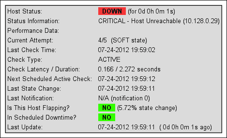

# 第四章：配置通知

在本章中，我们将涵盖以下内容：

+   配置通知周期

+   配置组的通知

+   指定需要通知的状态

+   容忍一定数量的检查失败

+   自动化联系人轮换

+   为重复通知定义升级

+   定义自定义通知方法

# 简介

**Nagios Core 中的通知**是指当主机或服务状态变化时触发的事件和生成的消息，目的是通知相关人员或系统。

例如，当与主机的连接丢失时，它会离开`UP`状态并在下次检查时进入`DOWN`状态。这最终会生成一个通知事件，只要设置了适当的标志并且有可用的联系人，关于状态变化的消息就会生成并按照配置的方式处理。

此类通知的默认文本详细描述了问题，包括来自相应插件命令的输出：

```
***** Nagios *****
Notification Type: PROBLEM
Host: sparta.naginet
State: DOWN
Address: 10.128.0.21
Info: CRITICAL - Host Unreachable (10.128.0.21)
Date/Time: Sat May 19 16:27:39 NZST 2012

```

因此，随着事件生成这种文本，接下来的问题是 Nagios Core 应该如何处理它。大多数 Nagios Core 管理员都会熟悉通过系统邮件发送此文本作为电子邮件消息的常见通知方法，但同样生成的消息可以以多种方式使用。就像命令可以灵活定义其运行的命令行一样，适用于特定联系人的操作也可以非常灵活地定义，使用任何联系人被配置接收的通知文本。

在本章中，我们将学习如何优化 Nagios Core 中的通知管理，以确保适当的人或系统能收到相关网络事件的通知，而不被不重要的事件打扰。我们还将学习如何设置超越简单电子邮件消息的通知方法，并且当问题在一定时间内未得到解决时，如何升级通知。

# 配置通知周期

在本例中，我们将调整配置，解决一个在深夜频繁发出通知的服务。我们将安排对主机`sparta.naginet`进行 24 小时全天候监控，但我们会使用默认 Nagios Core 配置中的两个预定义时间周期，避免其在工作时间以外发送通知。

## 准备工作

你应该已经拥有一个 Nagios Core 3.0 或更新版本的服务器，并且至少配置了一个主机。我们将使用`sparta.naginet`作为示例，这个主机在其自己的文件中定义。

## 如何操作...

我们可以为主机定义`check_period`和`notification_period`插件，如下所示：

1.  进入 Nagios Core 的对象配置目录。默认目录是`/usr/local/nagios/etc/objects`。如果你的主机定义在其他文件中，则转到其目录。

    ```
    # cd /usr/local/nagios/etc/objects

    ```

1.  编辑包含主机定义的文件，并在文件中找到相应的定义：

    ```
    # vi sparta.naginet.cfg

    ```

    主机定义可能类似于以下代码片段：

    ```
    define host {
        use                  linux-server
        host_name            sparta.naginet
        alias                sparta
        address              10.128.0.21
    }
    ```

1.  将 `check_period` 指令的值添加或编辑为 `24x7`：

    ```
    define host {
        use                  linux-server
        host_name            sparta.naginet
        alias                sparta
        address              10.128.0.21
     check_period         24x7
    }
    ```

1.  将 `notification_period` 指令的值添加或编辑为 `workhours`：

    ```
    define host {
        use                  linux-server
        host_name            sparta.naginet
        alias                sparta
        address              10.128.0.21
        check_period         24x7
     notification_period  workhours
    }
    ```

1.  验证配置并重启 Nagios Core 服务器：

    ```
    # /usr/local/nagios/bin/nagios -v /usr/local/nagios/etc/nagios.cfg
    # /etc/init.d/nagios restart

    ```

完成此操作后，Nagios Core 将始终对主机进行检查（每天 24 小时，每周 7 天），包括记录 `UP` 和 `DOWN` 状态，并在网页界面和报告中显示，但只会在工作时间内（默认从早上 9 点到下午 5 点，周一至周五）向指定的联系人发送通知。

## 它是如何工作的……

上述配置更改了主机对象类型的两个属性，以实现所需的更改：

+   `check_period`：此指令定义了应检查主机的时间段；我们选择了预定义的时间段`24x7`，意味着无论白天还是夜晚，都会对主机进行检查。

+   `notification_period`：此指令定义了主机应在何时向适当的联系人发送通知；我们选择了预定义的时间段 `workhours`，意味着通知只会在早上 9 点到下午 5 点之间发送，周一至周五。

相同的配置可以精确地应用于服务，而不是主机：

```
define service {
    ...
 check_period         24x7
 notification_period  workhours
}
```

这个新配置所涉及的两个时间段本身是在 Nagios Core 配置中定义的。我们使用的 `24x7` 和 `workhours` 是默认包含的标准时间段，保存在 `/usr/local/nagios/etc/objects/timeperiods.cfg` 文件中。例如，`workhours` 的定义类似于以下代码片段：

```
define timeperiod {
    timeperiod_name  workhours
    alias            Normal Work Hours
    monday           09:00-17:00
    tuesday          09:00-17:00
    wednesday        09:00-17:00
    thursday         09:00-17:00
    friday           09:00-17:00
}
```

这里使用的只是常见时间段的示例。我们可以非常精确地定义时间段；有关如何操作的更多细节，请参考 第一章中的 *创建新时间段* 章节。

## 还有更多……

这两个指令的区别非常重要。在大多数情况下，我们会希望 `check_period` 指令对应全天候服务的时间段，因为这样可以保留该服务的长期正常运行时间信息。而保留一个独立的 `notification_period` 指令，主要是为了控制通知的发送时间，可能是因为否则通知会发送到寻呼机，打扰到一位心情不佳的系统管理员，尤其是对于一些相对不重要的系统！

在 Nagios Core 配置中，将 `check_period` 插件设置为较短的时间段（例如 `workhours`）是有效的。但除非主机在这些时间段之外会实际停止运行，否则通常不需要这么做。在大多数情况下，适当的做法是将 `24x7` 时间段作为 `check_period` 的值。

## 另请参阅

+   本章中的*配置组通知*食谱

+   在第一章中的*创建新时间段*食谱，*理解主机、服务和联系人*

+   在第三章中的*指定检查主机或服务的频率*食谱，*使用检查和状态*

# 配置组通知

在本食谱中，我们将学习如何为主机定义一个联系人组。我们将展示这是如何作为一种通用最佳实践来实现的，即将通知发送到联系人组，而不是单个联系人，这样可以更灵活地将单个联系人分配到适当的组中，以接收相应的通知。

## 准备工作

您应当已经有一个 Nagios Core 3.0 或更高版本的服务器，并且至少配置了一个主机。我们将使用`sparta.naginet`的示例，这是一个在其自己文件中定义的主机，我们将配置它将通知发送到一个名为`noc`的现有联系人组。

## 操作步骤...

我们可以按照以下方式配置通知，发送到我们的联系人组：

1.  切换到 Nagios Core 的`objects`配置目录。默认路径是`/usr/local/nagios/etc/objects`。如果您将主机的定义放在了其他文件中，请转到该文件所在的目录。

    ```
    # cd /usr/local/nagios/etc/objects

    ```

1.  确保为您打算发送通知的组定义了一个适当的`contact_group`。有效的定义可能类似于以下代码片段，可能存放在`contacts.cfg`中：

    ```
    define contactgroup {
        contactgroup_name  noc
        alias              Network Operations
        members            john,jane
    }
    ```

1.  如果组中引用了任何联系人，您应确保这些联系人也已定义。它们可能类似于以下代码片段：

    ```
    define contact {
        use            generic-contact
        contact_name   john
        alias          John Smith
        email          john@naginet
    }
    define contact {
        use            generic-contact
        contact_name   jane
        alias          Jane Doe
        email          jane@naginet
    }
    ```

1.  编辑包含主机定义的文件，并在文件中找到相应的定义：

    ```
    # vi sparta.naginet.cfg

    ```

    主机定义可能类似于以下代码片段：

    ```
    define host {
        use                  linux-server
        host_name            sparta.naginet
        alias                sparta
        address              10.128.0.21notification_period  24x7
    }
    ```

    将`contact_groups`指令的值添加或编辑为`noc`：

    ```
    define host {
        use                  linux-server
        host_name            sparta.naginet
        alias                sparta
        address              10.128.0.21
        notification_period  24x7
     contact_groups       noc
    }
    ```

1.  如果主机已经定义了联系人，您可能希望将它们删除，尽管这不是必须的。

1.  验证配置并重新启动 Nagios Core 服务器：

    ```
    # /usr/local/nagios/bin/nagios -v /usr/local/nagios/etc/nagios.cfg
    # /etc/init.d/nagios restart

    ```

完成此步骤后，所有针对此主机的通知应发送给`noc`组的每个成员；在我们的示例中，联系人是`jane`和`john`。

## 工作原理...

定义应该接收特定主机通知的联系人，可以通过单独引用它们、作为组或两者结合来完成。我们本可以通过将主机的`contacts`指令定义为`jane,john`，直接引用单个联系人，而不是通过其组名，来实现与前面相同的结果。

设置服务的联系人组（而不是主机）时，几乎相同的配置过程适用；我们只需在`service`定义中为`contact_groups`指令添加一个值：

```
define service {
    ...
 contact_groups  noc
}
```

当主机或服务发生事件并触发通知时，如果该事件设置了有效的`notification_option`标志，Nagios Core 将检查主机的`contacts`和`contact_groups`指令的值，以确定向谁发送通知。在我们的例子中，服务器发现`contact_groups`的值是`noc`，因此会引用该联系人组以识别其中的单个联系人，并将通知发送给每个联系人。

## 还有更多...

选择哪种方法来定义主机或服务的联系人，无论是通过单独的联系人引用还是通过组，这取决于你自己。对于大量的主机和服务，通常将通知定向到适当的组比定向到个人更为容易，因为它可以通过简单地更改组中的个人来为我们提供更多灵活性，选择发送通知给谁。

你需要为主机或服务定义至少一个联系人或联系人组，或者通过模板继承一个联系人组，才能使其成为 Nagios Core 的有效配置。

## 另见

+   本章中的*配置通知周期*、*指定需要通知的状态*以及*自动化联系人轮换*教程

+   第一章中的*创建新联系人*和*创建新联系人组*教程，*理解主机、服务和联系人*。

# 指定需要通知的状态

在这个教程中，我们将学习如何细化由主机或服务发送的通知类型，以及特定联系人应接收哪些通知。我们将通过修改主机和服务应生成的通知类型，以及配置联系人的接收通知类型来实现这一目标。

## 准备工作

你应该拥有一个 Nagios Core 3.0 或更高版本的服务器，并且已经配置了至少一个主机。我们将使用`sparta.naginet`的例子，它是一个在自己文件中定义的主机，我们将配置它仅发送`DOWN`和`RECOVERY`通知，忽略其他如`WARNING`和`UNKNOWN`的通知。它将把通知发送给名为`john`的现有联系人；我们会确保这个联系人已经配置为接收这些通知。

## 如何操作...

我们可以按如下方式配置主机的通知类型：

1.  切换到 Nagios Core 的`objects`配置目录。默认目录是`/usr/local/nagios/etc/objects`。如果你将主机的定义放在了不同的文件中，则转到该文件所在的目录。

    ```
    # cd /usr/local/nagios/etc/objects

    ```

1.  编辑包含主机定义的文件。它可能看起来像以下代码片段：

    ```
    define host {
        use                    linux-server
        host_name              sparta.naginet
        alias                  sparta
        address                10.128.0.21
        contacts               john
        notification_period    24x7
    }
    ```

1.  为`notification_options`指令添加一个值。在我们的例子中，我们将使用`d,r`，对应于`DOWN`和`RECOVERY`状态的通知：

    ```
    define host {
        use                    linux-server
        host_name              sparta.naginet
        alias                  sparta
        address                10.128.0.21
        contacts               john
        notification_period    24x7
     notification_options   d,r
    }
    ```

1.  我们还应确保该主机的通知已启用，具体来说，`notifications_enabled`应设置为`1`。设置此项以及其他相关指令的一个简单方法是让主机继承一个模板，如之前所做的`linux-server`，但如果我们愿意，也可以显式地设置它：

    ```
    define host {
        use                    linux-server
        host_name              sparta.naginet
        alias                  sparta
        address                10.128.0.21
        contacts               john
        notification_period    24x7
        notification_options   d,r
     notifications_enabled  1
    }
    ```

1.  编辑包含主机指定联系人定义的文件，或其指定联系人组内的联系人。在这种情况下，我们正在编辑主机的指定联系人`john`。定义可能如下所示：

    ```
    define contact {
        use           generic-contact
        contact_name  john
        alias         John Smith
     email         john@naginet
    }
    ```

1.  编辑或设置每个联系人的`host_notification_options`指令，以包括与您为主机设置的相同值。在这种情况下，我们将其设置为`d`、`u`、`r`，这意味着`John Smith`可以接收有关主机的`DOWN`、`UNREACHABLE`和`RECOVERY`通知：

    ```
    define contact {
        use                        generic-contact
        contact_name               john
        alias                      John Smith
        email                      john@naginet
     host_notification_options  d,u,r
    }
    ```

1.  同样，您应确保联系人配置为接收主机通知，方法是将`host_notifications_enabled`指令设置为`1`。我们可以通过继承一个模板，如`generic-contact`，这通常更简单，或者我们可以显式地设置它：

    ```
    define contact {
        use                         generic-contact
        contact_name                john
        alias                       John Smith
        email                       john@naginet
        host_notification_options   d,r
     host_notifications_enabled  1
    }
    ```

    接收服务通知的类似指令是`service_notifications_enabled`。

1.  验证配置并重启 Nagios Core 服务器：

    ```
    # /usr/local/nagios/bin/nagios -v /usr/local/nagios/etc/nagios.cfg
    # /etc/init.d/nagios restart

    ```

完成此操作后，当主机进入`DOWN`状态时，发送的通知应发送给联系人，并且当主机恢复到`OK`状态时也应发送通知，但不应发送有关该主机的其他通知（例如`UNREACHABLE`或`DOWNTIMESTART`通知）给联系人`john`。

## 它是如何工作的...

主机应产生的通知类型由其`notification_options`指令定义，而定义的联系人应接收的主机通知类型由其`host_notification_options`指令配置。两者都采用以逗号分隔的值的形式。

`notification_options`指令对于主机对象的有效值是：

+   `d`: 主机处于`DOWN`状态时的通知

+   `u`: 主机处于`UNREACHABLE`状态时的通知

+   `r`: 主机从问题中恢复（变为`UP`）时的通知

+   `f`: 主机开始或结束颠簸状态时的通知

+   `s`: 主机开始或结束计划的停机时间时的通知

例如，对于一个主机，当其进入`DOWN`或`UP`状态时应发送通知，但忽略`UNREACHABLE`或颠簸的通知事件，我们可以定义如下：

```
define host {
    ...
 notification_options d,r
}
```

对于服务对象，合法的指令稍有不同：

+   `w`: 服务处于`WARNING`状态时的通知

+   `u`: 服务处于`UNKNOWN`状态时的通知

+   `c`: 服务处于`CRITICAL`状态时的通知

+   `r`: 服务从故障中恢复（变为`OK`）时的通知

+   `f`: 服务开始或结束颠簸状态时的通知

+   `s`: 服务开始或结束计划的停机时间时的通知

例如，对于一个主机，我们希望它为所有这些事件发送通知，但排除波动和计划停机状态，我们可能会定义以下内容：

```
define service {
    ...
 notification_options  w,u,c,r
}
```

上述所有值可以在联系对象定义中使用，通过`service_notification_options`指令来限制特定联系人应接收的服务通知：

```
define contact {
    ...
 service_notifications_enabled  1
 service_notification_options   w,u,c,r
}
```

## 还有更多内容...

除非我们有特别的原因让某些联系人不接受某种特定类型的通知，否则最好配置联系人以接收所有发送给他们的通知，通过在联系人指令中包括所有标志：

```
define contact {
    ...
 host_notification_options     d,u,r,f,s
 service_notification_options  w,u,c,r,f,s
}
```

这意味着该联系人将处理所有发送给它的通知，我们可以通过限制由该联系人管理的主机和服务发送的通知类型来替代这一点。对于新的配置，通常最好从发送过多的信息开始，然后在适当时删除不必要的通知标志，而不是因为从未发送而错过重要消息。

如果我们打算对所有的联系人执行此操作，可能需要将这些指令作为联系模板的一部分，并通过`use`指令从中继承。默认配置中包含的`generic-contact`联系模板可能适用。

如果你想完全禁用给定主机、服务或联系人的通知，可以为`notification_options`、`host_notification_options`和`service_notification_options`使用单一值`n`来实现。

## 另见

+   本章中的*配置组通知*、*自动化联系人轮换*和*定义自定义通知方法*配方

+   本书中第九章的*使用继承简化配置*配方，*配置管理*

# 容忍一定数量的失败检查

在本配方中，我们将学习如何安排 Nagios Core 配置，仅在主机或服务的检查失败且重复一定次数后，才发送关于问题的通知。

这对于那些偶尔会出现“波动”或短暂宕机的非关键主机来说是一个理想的配置安排，只有在多次检查后仍然处于宕机状态时才会变得有问题。

## 准备就绪

你应该有一个 Nagios Core 3.0 或更新版本的服务器，并且已经配置了至少一个主机。我们将使用`sparta.naginet`这个例子，它是一个在其自身文件中定义的主机。我们将安排它仅在进行五次连续失败检查后才向我们发送通知。

## 如何操作...

我们可以配置容忍失败检查的次数，然后才发送通知，方法如下：

1.  切换到 Nagios Core 的`objects`配置目录。默认路径是`/usr/local/nagios/etc/objects`。如果你的主机定义在其他文件中，请转到该文件所在的目录。

    ```
    # cd /usr/local/nagios/etc/objects

    ```

1.  编辑包含主机定义的文件，并找到其中的定义。它可能类似于以下代码片段：

    ```
    define host {
        use                  linux-server
        host_name            sparta.naginet
        alias                sparta
        address              10.128.0.21
        notification_period  24x7
    }
    ```

1.  将`max_check_attempts`的值添加或编辑为`5`：

    ```
    define host {
        use                  linux-server
        host_name            sparta.naginet
        alias                sparta
        address              10.128.0.21
        notification_period  24x7
     max_check_attempts   5
    }
    ```

1.  验证配置并重新启动 Nagios Core 服务器：

    ```
    # /usr/local/nagios/bin/nagios -v /usr/local/nagios/etc/nagios.cfg
    # /etc/init.d/nagios restart

    ```

完成此设置后，Nagios Core 将在主机进入`DOWN`状态之前，不会发送通知，直到检查已尝试了五次且每次都失败。在以下截图中，尽管已经进行了四次检查并失败，但没有发送通知，并且状态被列为**SOFT**：



`SOFT`状态表示，尽管 Nagios Core 已将主机标记为`DOWN`，它将继续重试检查，直到用尽`max_check_attempts`。此时，它将标记主机为`HARD` `DOWN`状态并发送通知。

然而，如果主机在下一次检查之前恢复，那么状态将会恢复为**UP**，而不会发送任何通知：


## 它是如何工作的...

前面的配置修改了主机的`max_check_attempts`指令，用于指定在主机标记为`HARD` `DOWN`或`UNREACHABLE`状态并生成通知事件之前，需要失败的检查次数。

更改服务在发送通知之前的最大尝试次数的过程是相同的；我们向服务的定义中添加相同的指令和值：

```
define service {
    use                  generic-service
    host_name            sparta.naginet
    service_description  HTTP
    check_command        check_http
 max_check_attempts   5
}
```

## 还有更多...

在发送任何通知之前，主机的连续重试检查之间的时间间隔也可以通过`retry_interval`指令进行自定义。默认情况下，间隔以分钟为单位，因此如果我们想配置两分钟的重试等待时间，可以向主机或服务添加此指令：

```
define host {
    ...
 retry_interval  2
}
define service {
    ...
 retry_interval  2
}
```

## 另见

+   第三章中的*指定检查主机或服务的频率*和*通过抖动管理短期故障*配方，*与检查和状态一起工作*

# 自动化联系人轮换

在这个配方中，我们将学习如何自动安排通知，以便它们仅在特定时间由某些组中的联系人接收。

对于拥有多名专职网络工作人员的公司，通常会有一个值班名单，某个员工在一定时间内（可能是一周或两周）担任专职值班人员。我们在这里配置的这种设置允许过滤通知，使其仅在适当的时间发送给联系人；通知由主机和服务生成，并发送给指定组中的所有联系人，但实际上只有一个（或者多个）联系人会接收到它。

我们将通过使用联系人属性中的两个设置来完成此配置，允许我们限制他们应接收通知的时间段：`host_notification_period` 和 `service_notification_period`。

## 准备工作

您应该有一个 Nagios Core 3.0 或更高版本的服务器，并且已经配置了至少一个联系人组，并且该组中至少有两个联系人。您应该熟悉配置时间段，并理解本章前面讨论的通知基础知识。

我们将使用一个非常简单的例子，假设有三个网络运营商，分别命名为联系人`alan`、`brenden`和`charlotte`，他们每周轮流值班监控。三者都是`ops`组的成员，该组在网络上所有主机和服务的`contact_groups`指令中指定。

## 如何操作...

我们可以为接收通知的操作员设置一个基本的交替时间表，如下所示：

1.  切换到 Nagios Core 的`objects`配置目录。默认路径是`/usr/local/nagios/etc/objects`。如果您将主机的定义放在了其他文件中，请转到其目录。

    ```
    # cd /usr/local/nagios/etc/objects

    ```

1.  检查相关文件或文件，以确保您的联系人已定义，并且他们是适当联系人组的成员。此类信息的一个好位置是在`contacts.cfg`文件中。配置可能看起来类似于以下代码片段：

    ```
    define contactgroup {
        contactgroup_name  ops
        alias              Network Operations
        members            alan,brenden,charlotte
    }
        define contact {
            use           generic-contact
            contact_name  alan
            alias         Alan Jones
            email         alan@pager.naginet
        }
        define contact {
            use           generic-contact
            contact_name  brenden
            alias         Brenden Peters
            email         brenden@pager.naginet
        }
        define contact {
            use           generic-contact
            contact_name  charlotte
            alias         Charlotte Franks
            email         charlotte@pager.naginet
        }
    ```

1.  在这种情况下，所有我们的主机和服务都已配置为向`ops`联系人组发送消息：

    ```
        define host {
            ...
     contact_groups  ops
        }
        define service {
            ...
     contact_groups  ops
        }
    ```

1.  定义时间段，以对应每个联系人应该接收消息的时间。我们将使用时间段定义的特殊语法来设置这个轮换的定义：

    ```
    define timeperiod {
        timeperiod_name  alan-pageralias            Alan pager schedule
        2012-06-05 / 21  00:00-24:00
        2012-06-06 / 21  00:00-24:00
        2012-06-07 / 21  00:00-24:00
        2012-06-08 / 21  00:00-24:00
        2012-06-09 / 21  00:00-24:00
        2012-06-10 / 21  00:00-24:00
        2012-06-11 / 21  00:00-24:00
    }
    define timeperiod {
        timeperiod_name  brenden-pageralias            Brenden pager schedule
        2012-06-12 / 21  00:00-24:00
        2012-06-13 / 21  00:00-24:00
        2012-06-14 / 21  00:00-24:00
        2012-06-15 / 21  00:00-24:00
        2012-06-16 / 21  00:00-24:00
        2012-06-17 / 21  00:00-24:00
        2012-06-18 / 21  00:00-24:00
    }
    define timeperiod {
        timeperiod_name  charlotte-pager
        alias            Charlotte pager schedule
        2012-06-19 / 21  00:00-24:00
        2012-06-20 / 21  00:00-24:00
        2012-06-21 / 21  00:00-24:00
        2012-06-22 / 21  00:00-24:00
        2012-06-23 / 21  00:00-24:00
        2012-06-24 / 21  00:00-24:00
        2012-06-25 / 21  00:00-24:00
    }
    ```

1.  返回并使用`host_notification_period`和`service_notification_period`指令配置每个联系人，以便仅在他们的专用时间段内接收通知：

    ```
    define contact {
        use                          generic-contact
        contact_name                 alan
        alias                        Alan Jones
        email                        alan@pager.naginet
     host_notification_period     alan-pager
     service_notification_period  alan-pager
    }
    define contact {
        use                          generic-contact
        contact_name                 brenden
        alias                        Brenden Peters
        email                        brenden@pager.naginet
     host_notification_period     brenden-pager
     service_notification_period  brenden-pager
    }
    define contact {
        use                          generic-contact
        contact_name                 charlotte
        alias                        Charlotte Franks
        email                        charlotte@pager.naginet
     host_notification_period     charlotte-pager
     service_notification_period  charlotte-pager
    }
    ```

1.  验证配置并重新启动 Nagios Core 服务器：

    ```
    # /usr/local/nagios/bin/nagios -v /usr/local/nagios/etc/nagios.cfg
    # /etc/init.d/nagios restart

    ```

完成此操作后，配置的联系人应该仅在其专用的呼叫器时间内接收通知。如果这些是我们唯一的联系人，那么所有生成的通知将在任何给定时间只发送给一个人。

## 它是如何工作的...

在我们联系人的定义中，`host_notification_period`和`service_notification_period`指令用于限制这些联系人应接收通知的时间段。在这个例子中，我们的每个联系人都有自己定义的时间段，以对应他们在呼叫器时间表中的部分。

我们来看看 Alan 的例子：

```
    define timeperiod {
        timeperiod_name  alan-pager
        2012-06-05 / 21  00:00-24:00
        2012-06-06 / 21  00:00-24:00
        2012-06-07 / 21  00:00-24:00
        2012-06-08 / 21  00:00-24:00
        2012-06-09 / 21  00:00-24:00
        2012-06-10 / 21  00:00-24:00
        2012-06-11 / 21  00:00-24:00
    }
```

指令的第二行，`2012-06-05 / 21 00:00-24:00`，可以分解为如下：

+   从 6 月 5 日开始，

+   每 21 天，

+   从午夜到第二天午夜（即整天）。

配置然后继续为 Alan 值班的第一周的剩余几天做相同的配置，并指定他将在 21 天（即 3 周）后的同一天继续值班。对于联系人`brenden`和`charlotte`，分别设置了类似的配置，但分别从一周和两周后开始。

## 还有更多...

请注意，时间段不一定不能重叠。如果我们觉得合适，可以安排多个联系人接收通知。类似地，如果某个时间段内不需要通知，我们也可以在时间表中留出空隙。

Nagios Core 中的时间段非常灵活；要查看你可以用来定义它们的各种语法示例，可以参考第一章中的*创建新的时间段*教程，*理解主机、服务和联系人*。

## 另见

+   本章节中的*配置群组的通知*和*指定要通知的状态*教程

+   第一章中的*创建新的联系人*、*创建新的联系人组*和*创建新的时间段*教程，*理解主机、服务和联系人*

# 为重复通知定义升级

在这个教程中，我们将学习如何配置 Nagios Core，使得在重复一定次数后，关于主机或服务的故障通知会升级到另一个联系人，而不是（或除了）通常定义的联系人。这是通过定义一个名为主机或服务升级的独立对象类型来实现的。

这种配置可能对提醒更资深的网络人员注意一个无法解决的问题非常有用，尤其是在经验较少的人无法解决问题时，也可以作为“安全阀”，确保主机的故障通知最终能传达到其他人那里，若问题依旧未被修复。

## 准备工作

你应该拥有一个 Nagios Core 3.0 或更新版本的服务器，且已经配置了至少一个主机或服务，并且至少有两个联系人组——一个用于前几次通知，另一个用于升级通知。你应该理解如何生成通知，并将其发送到主机或服务的`contacts`和`contact_groups`。

我们以名为`sparta.naginet`的主机为例，该主机通常会将通知发送到一个名为`ops`的组。我们将配置使得第四次及以后的所有通知也发送到一个名为`emergency`的联系人组。

## 如何操作...

我们可以如下配置主机或服务的升级：

1.  切换到 Nagios Core 的对象配置目录。默认目录为`/usr/local/nagios/etc/objects`。如果你将主机的定义放在了不同的文件中，则进入其所在的目录。

    ```
    # cd /usr/local/nagios/etc/objects

    ```

1.  编辑包含主机定义的文件。该定义可能类似于以下代码片段：

    ```
    define host {
        use                    linux-server
        host_name              sparta.naginet
        alias                  sparta
        address                10.128.0.21
        contact_groups         ops
        notification_period    24x7
        notification_interval  10
    }
    ```

1.  在主机定义下面，添加一个新的`hostescalation`对象的配置：

    ```
    define hostescalation {
        host_name              sparta.naginet
        contact_groups         ops,emergency
        first_notification     5
        last_notification      0
        notification_interval  10
    }
    ```

1.  验证配置并重启 Nagios Core 服务器：

    ```
    # /usr/local/nagios/bin/nagios -v /usr/local/nagios/etc/nagios.cfg
    # /etc/init.d/nagios restart

    ```

完成此配置后，当遇到主机问题并生成通知时，超过第五个通知的所有通知将同时发送到`ops`联系组和`emergency`联系组，扩展了接收到通知的人或系统的数量，从而更有可能让问题得到解决或修复。也许 ops 团队的某个成员把他们的寻呼机弄丢了。

## 它是如何工作的...

前面一节中添加的配置最好被看作是针对特定主机的特殊情况或覆盖，因为它指定了一系列应该发送到不同联系组的通知。可以将其分解如下：

+   `host_name`：这是在主机定义中给定的`host_name`的相同值；我们指定了`sparta.naginet`。

+   `contact_groups`：这是应该接收满足此特殊情况的通知的联系人组。我们指定了`emergency`组和`ops`组，以便匹配的通知都发送给这两个组。请注意，它们是用逗号分隔的。

+   `first_notification`：这是应该与此升级匹配的第一次通知计数；我们选择了第五次通知。

+   `last_notification`：这是应该与此升级匹配的最后一次通知计数。我们将其设置为零，这意味着`first_notification`之后的所有通知应发送给指定的联系人或联系组。通知将持续发送，直到手动关闭或问题解决。

+   `notification_interval`：与主机和服务的同名指令一样，它指定如果主机仍处于问题状态，Nagios Core 应等待多长时间后发送新通知。在这里，我们选择了十分钟。

个人联系人也可以使用`contacts`指令（或替代）进行指定，而不是使用`contact_groups`。

服务升级的工作原理与此相似；不同之处在于，你需要通过`service_description`指令指定服务以及其主机名。其他部分的工作方式相同。一个类似的服务检查升级，`service_description`为`HTTP`，运行在`sparta.naginet`上的代码片段可能如下所示：

```
define serviceescalation {
    host_name              sparta.naginet
    service_description    HTTP
    contact_groups         ops,emergency
    first_notification     5
    last_notification      0
    notification_interval  10
}
```

## 还有更多...

前面的升级会继续将通知发送给原始的`ops`组和`emergency`组的成员。通常最好这样做，而不是仅仅将通知发送给升级组，因为升级的目的是在问题没有被处理时扩大通知的覆盖范围，而不是单纯地尝试联系另一组人。

这一原则同样适用于堆叠升级；如果我们有一个包含所有联系人主机组，可能名为`everyone`，我们可以定义第二次升级，以便从第十个通知开始，所有通知都发送给每个联系人：

```
define hostescalation {
    host_name              sparta.naginet
    contact_groups         everyone
    first_notification     10
    last_notification      0
    notification_interval  10
}
```

正如我们可以指定多个主机升级一样，通知的范围也可以重叠，这样就可以应用多个升级。

通过一点数学运算，你可以安排升级，使它们在主机或服务处于问题状态一段时间后生效。例如，我们在配方中指定的升级将在主机处于问题状态 40 分钟后应用，因为 `notification_interval` 指定 Nagios Core 应该在重新发送通知之间等待 10 分钟。

## 参见

+   本章中的 *配置组的通知* 配方

+   在第一章中，*创建新的联系人组* 配方，*理解主机、服务和联系人*

# 定义一个自定义通知方法

在这个配方中，我们将学习如何为联系人指定一种替代方法，以便接收有关服务的通知。联系人接收通知的一种非常典型的方法是通过电子邮件发送到他们的联系地址；电子邮件消息可以发送到收件箱或分页设备。

然而，通知仅仅是文本；我们可以像配置主机或服务检查一样，通过任何我们希望的命令来处理它们。在这个配方中，我们将设置一个名为 `motd` 的新联系人，当它接收到通知时，会将通知写入服务器的 `/etc/motd` 目录，以便在登录时显示。

## 准备工作

你应该拥有一个 Nagios Core 3.0 或更高版本的服务器，并且至少已经配置了一个主机或服务。你需要了解通知是如何生成的，并且理解它们默认的行为是如何发送到主机或服务的 `contacts` 和 `contact_groups`。

我们将使用一个名为 `troy.naginet` 的主机示例，该主机配置为将通知发送到 `ops` 联系人组。我们将在这个组中添加一个名为 `motd` 的新联系人。

## 如何操作...

我们可以如下安排我们的自定义通知方法：

1.  确保你的 `/etc/motd` 文件可以被 Nagios Core 写入，并且它是一个静态文件，系统在启动时不会覆盖该文件。如果你以推荐的默认用户和组 `nagios` 运行 Nagios Core 服务器，可以像下面这样操作：

    ```
    # chgrp nagios /etc/motd
    # chmod g+w /etc/motd

    ```

1.  通过 `su` 或 `sudo` 测试用户是否能够写入该文件会是个好主意：

    ```
    # sudo -s -u nagios
    $ echo 'test' >>/etc/motd

    ```

1.  切换到 Nagios Core 的 `objects` 配置目录。默认路径是 `/usr/local/nagios/etc/objects`。如果你将主机的定义放在了其他文件中，那么请转到该文件所在的目录。

    ```
    # cd /usr/local/nagios/etc/objects

    ```

1.  编辑包含通知命令定义的文件。默认情况下，这些定义在 `commands.cfg` 文件中。将以下定义附加到该文件：

    ```
    define command {
        command_name    notify-host-motd
        command_line    /usr/bin/printf "%s\n" "$SHORTDATETIME$: $HOSTALIAS$ is $HOSTSTATE$" >>/etc/motd
    }
    define command {
        command_name    notify-service-motd
        command_line    /usr/bin/printf "%s\n" "$SHORTDATETIME$: $SERVICEDESC$ on $HOSTALIAS$ is $SERVICESTATE$" >>/etc/motd
    }
    ```

1.  编辑包含联系人定义的文件。在 QuickStart 配置中，这些定义在 `contacts.cfg` 文件中。将以下定义附加到该文件：

    ```
    define contact {
        use                            generic-contact
        contact_name                   motd
        contact_groups                 ops
        alias                          MOTD
        host_notification_commands     notify-host-motd
        service_notification_commands  notify-service-motd
    }
    ```

1.  编辑包含主机和/或服务定义的文件，确保它们在 `contact_groups` 指令中指定了 `ops`：

    ```
    define host {
        host_name       troy.naginet
        ...
     contact_groups  ops
    }
        define service {
            host_name       troy.naginet
            ...
     contact_groups  ops
        }
    ```

1.  验证配置并重启 Nagios Core 服务器：

    ```
    # /usr/local/nagios/bin/nagios -v /usr/local/nagios/etc/nagios.cfg
    # /etc/init.d/nagios restart

    ```

完成此操作后，接下来的主机和服务通知不仅应通过电子邮件发送给 `ops` 组中的任何联系人，还应由 `motd` 联系人写入 `/etc/motd`，以便在登录时显示：

```
06-30-2012 17:24:05: troy is DOWN
06-30-2012 17:24:05: HTTP on troy is CRITICAL
06-30-2012 17:25:07: troy is DOWN
06-30-2012 17:25:07: HTTP on troy is CRITICAL
```

## 它是如何工作的...

我们添加的配置的第一部分是定义新的通知命令。这些实际上是命令定义，就像用于主机和服务的 `check_command` 定义一样；区别在于，它们被联系人用于将通知发送给相关人员（或在这种情况下，将通知写入文件）以适当的方式。

如果你使用的是默认的 Nagios Core 配置，`commands.cfg` 中已经定义的命令应包括 `notify-host-by-email` 和 `notify-service-by-email`。我已经截断了完整的命令行，因为它非常长：

```
define command {
    command_name    notify-host-by-email
    command_line    /usr/bin/printf "%b" "***** Nagios *****\n\nNotification...
}
define command {
    command_name    notify-service-by-email
    command_line    /usr/bin/printf "%b" "***** Nagios *****\n\nNotification...
}
```

这些命令使用系统的 `printf` 实现，并结合许多 Nagios Core 宏来构建适当的通知字符串，该字符串通过 shell 管道发送到系统邮件程序并通过电子邮件发送给适当的联系人。

如果我们检查定义了 `generic-contact` 模板的 `templates.cfg` 文件，我们可以看到这两个方法在两个指令中被引用：

```
define contact {
    ...
    service_notification_commands notify-service-by-email
    host_notification_commands notify-host-by-email
}
```

该配置因此定义了一个特定的通知命令，供从 `generic-host` 模板派生的主机使用。

我们自己的命令定义类似地通过调用 `printf` 来构建字符串。但不同的是，它不是将输出写入管道发送到系统邮件程序，而是将其附加到 `/etc/motd` 文件中。

我们为 `motd` 联系人处理主机通知所指定的 `command_line` 指令如下：

```
/usr/bin/printf "%s\n" "$SHORTDATETIME$: $HOSTALIAS$ is $HOSTSTATE$" >>/etc/motd

```

Nagios Core 在成功触发该联系人的通知事件时，首先会替换它的宏值，`$SHORTDATETIME$`、`$HOSTALIAS$` 和 `$HOSTSTATE$`：

```
/usr/bin/printf "%s\n" "06-30-2012 17:24:05: troy is DOWN" >>/etc/motd

```

生成的字符串随后由正在运行的 Nagios Core 用户（默认为 `nagios`）作为命令执行，只要该用户具有适当的权限，它将被附加到 MOTD 的末尾。

## 还有更多内容...

向 MOTD 添加消息对于所有网络管理员来说可能没有用，特别是对于大型或更敏感的网络，因为这些网络每天可能会生成数百个通知。这里需要记住的主要内容是，Nagios Core 可以根据需要配置为处理通知事件，只要：

+   我们可以定义一个命令行，确保它在执行时能始终按照 Nagios Core 为我们执行宏替换的结果完成所需的操作

+   `nagios` 用户，或者说 Nagios Core 服务器运行的用户，拥有执行该命令所需的所有相关权限

电子邮件通知，特别是发送到移动分页设备，对于大多数管理员来说，是一个非常合理的通知基础。然而，如果需要其他通知方式，例如插入数据库或管道传递到 Perl 脚本中，这也是可以实现的。

请注意，最好为我们在这些命令中使用的任何二进制文件或文件指定完整路径，因此使用`/usr/bin/printf`而不仅仅是`printf`。这样可以确保我们实际打算运行的程序被正确运行，并避免需要处理`nagios`用户的`$PATH`配置。

## 另请参见

+   本章中的*为组配置通知*教程

+   第二章中的*创建新命令*和*自定义现有命令*教程，*使用命令和插件*
