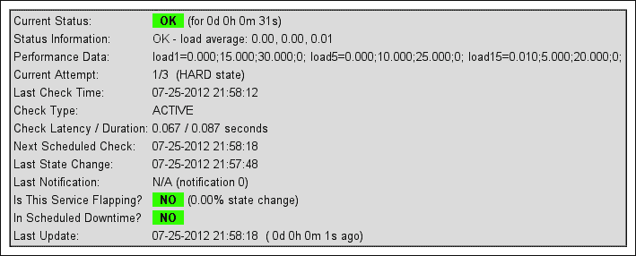
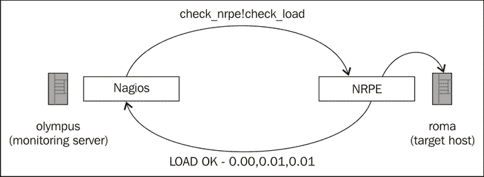

# 第六章：启用远程执行

在本章中，我们将介绍以下几个教程：

+   使用 NRPE 监控远程机器上的本地服务

+   设置 NRPE 的监听地址

+   设置 NRPE 的允许客户端主机

+   安全地创建新的 NRPE 命令定义

+   给 NRPE 授予有限的 sudo 权限

+   使用 `check_by_ssh` 结合密钥认证来代替 NRPE。

# 介绍

对于一个可以访问网络相关部分的专用 Nagios Core 服务器，通过使用能进行 ICMP、TCP 和 UDP 连接的命令和插件来进行检查相对简单，以此来判断网络主机和服务的运行状态。这些方法可用于检查任何类型的网络服务，而无需在目标机器上安装任何东西。例如，当使用 `check_http` 插件检查 Web 服务器时，其工作方式与浏览器发起请求的方式相同。

然而，彻底监控一个网络通常不只是检查网络连接和可用性。检查网络的一些属性也很重要，这些属性并不直接对应于网络服务，因此不能通过网络连接直接进行检查。

这些通常是硬件或底层系统的属性，例如磁盘空间或系统负载平均值，或仅配置为本地监听的进程，通常用于数据库服务器。

我们可能会在所有系统上安装 Nagios Core，但这将使维护变得困难。更好的方法是有某种远程执行诊断程序的手段，使它们能直接在目标主机上运行，以获取所需的信息，然后通过专用网络服务将结果返回到单一的 Nagios Core 服务器。

解决这个问题有三种常见方法：

+   使用 `check_nrpe` 在目标机器上运行标准的 Nagios Core 插件，并将其结果透明地返回给监控服务器。

+   使用 `check_by_ssh` 通过 SSH 连接到目标机器，然后从监控服务器上运行任意命令。

+   使用 `check_snmp` 检查已配置提供返回值和目标主机上某些命令输出的 SNMP OID。

本章介绍前两种解决方案，重点讲解更常用的 **Nagios 远程插件执行器**（**NRPE**），并解释它与 `check_by_ssh` 解决方案的区别。关于 SNMP 配置的一些信息，请参见 第五章中的 *监控 SNMP 查询输出* 和 *创建 SNMP OID 进行监控* 部分。

# 使用 NRPE 监控远程机器上的本地服务

在这个教程中，我们将学习如何在目标主机 `roma.naginet` 上安装并运行 NRPE 服务器。我们将使用它来通过 `check_load` 插件检查该主机的负载平均值。

这些检查的插件将在目标服务器上由 NRPE 守护进程执行，但结果将返回到我们的 Nagios Core 监控服务器`olympus.naginet`。这要求在监控服务器上安装`check_nrpe`插件，并在目标服务器上安装完整的 Nagios 插件集（但不包括 Nagios Core 本身）。

这是一个相对较长且深入的教程，因为它涉及在两台服务器上安装总共三种软件包。

## 准备工作

你需要一台安装了 Nagios Core 3.0 或更高版本的监控服务器。同时，你还应该有一个类 UNIX 的目标主机，打算监控该主机，并且能够运行 NRPE 守护进程。大多数现代类 UNIX 系统，包括 Linux 和 BSD，应该都能做到这一点。监控服务器和目标主机都需要互联网连接，并且你应该已经通过主机定义在监控目标主机，接下来我们会为它添加服务检查。

如果你的服务器没有直接连接到互联网的网关，你可以通过将相关文件下载到工作站或其他有互联网访问的机器后上传，来解决这个问题。

你应该了解从源代码配置、编译和安装软件的基本知识。在大多数情况下，通常的`./configure`、`make`和`make install`过程就足够了，本教程会带你完成这一过程。你需要安装`make`工具，并且还需要为配置和构建过程准备好其他工具，包括如`gcc`这样的 C 编译器。

你还应该对 Nagios Core 中主机和服务的相互关系有一个清晰的理解，这在第一章中有讨论，并且了解 Nagios Core 如何使用命令和插件，这部分内容在第二章中有说明。你不需要深入理解任何特定插件的使用；本教程会展示如何使用相关插件。

最后，你应该能够配置任何防火墙，以允许 Nagios Core 服务器与目标服务器之间通过 TCP 目的端口`5666`建立连接。

## 如何操作…

本教程的第一部分在目标服务器上完成：

1.  下载并安装最新的 Nagios 插件包。写作时，链接可通过[`nagiosplugins.org/download/`](http://nagiosplugins.org/download/)访问。

    ```
    $ wget http://downloads.sourceforge.net/project/nagiosplug/nagiosplug/1.4.16/nagios-plugins-1.4.16.tar.gz
    $ tar -xzf nagios-plugins-1.4.16.tar.gz

    ```

1.  配置、编译并安装插件，就像在新的监控服务器上做的那样。你需要拥有`root`权限来执行`make install`命令。

    ```
    $ cd nagios-plugins-1.4.16
    $ ./configure
    $ make
    # make install

    ```

    你可能需要为某些插件安装一些共享库和头文件，例如`libssl`实现。`./configure`脚本的输出应该会提示你遇到的任何此类问题。

1.  从 Nagios Exchange 网站下载并安装 NRPE 的最新版本。在本文写作时，链接可通过 [`exchange.nagios.org/directory/Addons/Monitoring-Agents/NRPE--2D-Nagios-Remote-Plugin-Executor/details`](http://exchange.nagios.org/directory/Addons/Monitoring-Agents/NRPE--2D-Nagios-Remote-Plugin-Executor/details) 访问。

    ```
    $ wget http://prdownloads.sourceforge.net/sourceforge/nagios/nrpe-2.13.tar.gz
    $ tar -xzf nrpe-2.13.tar.gz

    ```

1.  进入 `nrpe-2.13` 源目录，配置、编译并安装守护进程及其默认配置。您将需要 `root` 权限才能执行 `make install-daemon` 和 `make install-daemon-config` 命令：

    ```
    $ cd nrpe-2.13
    $ ./configure
    $ make all
    # make install-daemon
    # make install-daemon-config

    ```

    如果目标主机上没有 `nagios` 用户，您可能需要先创建一个用户，才能正确安装守护进程：

    ```
    # groupadd nagios
    # useradd -r -g nagios nagios

    ```

1.  编辑新安装的文件 `/usr/local/nagios/etc/nrpe.cfg`，找到以 `allowed_hosts` 开头的行。在此行添加逗号和监控服务器的 IP 地址。在本例中，我们添加了 IP 地址 `10.128.0.11`：

    ```
    allowed_hosts=127.0.0.1,10.128.0.11

    ```

1.  启动 `nrpe` 守护进程，并通过使用 `pgrep` 或 `ps` 搜索进程表来检查它是否正在运行：

    ```
    # /usr/local/nagios/bin/nrpe -c /usr/local/nagios/etc/nrpe.cfg -d
    # pgrep nrpe
    18593
    # ps -e | grep [n]rpe
    nagios 18593 1 0 21:55 ? 00:00:01 nrpe

    ```

1.  如果您希望 `nrpe` 守护进程在启动时自动启动，请根据您的系统添加适当的 `init` 脚本。在 `./configure` 时，源目录会生成一个示例 `init-script`。对于 Debian 派生系统和 SUSE 系统，也会分别生成 `init-script.debian` 和 `init-script.suse`。具体的操作方法将取决于您的系统，您可能需要查阅其文档。

接下来的部分将在监控服务器上完成。

1.  再次以与目标服务器相同的方式下载 NRPE 的最新版本：

    ```
    $ wget http://prdownloads.sourceforge.net/sourceforge/nagios/nrpe-2.13.tar.gz
    $ tar -xzf nrpe-2.13.tar.gz

    ```

1.  再次配置并构建软件。然而，需要注意的是，这一次的安装命令不同，因为我们安装的是 `check_nrpe` 插件，而不是 `nrpe` 守护进程：

    ```
    $ cd nrpe-2.13.tar.gz
    $ ./configure
    $ make all
    # make install-plugin

    ```

1.  检查插件是否正确安装。它应保存在 `/usr/local/nagios/libexec/check_nrpe` 目录下：

    ```
    $ ls /usr/local/nagios/libexec/check_nrpe
    /usr/local/nagios/libexec/check_nrpe

    ```

1.  转到包含 Nagios Core 对象配置的目录。默认情况下，这是 `/usr/local/nagios/etc/objects`：

    ```
    $ cd /usr/local/nagios/etc/objects

    ```

1.  编辑适当的文件以定义新命令。对于默认安装，`/usr/local/nagios/etc/objects/commands.cfg` 是一个不错的选择。在该文件末尾添加以下定义：

    ```
    define command {
        command_name  check_nrpe
        command_line  $USER1$/check_nrpe -H $HOSTADDRESS$ -c $ARG1$
    }
    ```

1.  编辑定义目标主机为对象的文件。定义可能类似于以下代码片段：

    ```
    define host {
        use        linux-server
        host_name  roma.naginet
        alias      roma
        address    10.128.0.61
    }
    ```

1.  在主机的定义下，其他已定义的服务之后，添加以下服务定义：

    ```
    define service {
        use                  generic-service
        host_name            roma.naginet
        service_description  LOAD
        check_command        check_nrpe!check_load
    }
    ```

1.  验证配置并重启 Nagios Core 服务器：

    ```
    # /usr/local/nagios/bin/nagios -v /usr/local/nagios/etc/nagios.cfg
    # /etc/init.d/nagios restart

    ```

完成此步骤后，一个名为 `LOAD` 的新服务将出现在 Web 界面中，准备进行检查，并将显示适当的状态，包括从目标主机上的 `nrpe` 守护进程读取的负载平均值：


我们可以在服务的详细页面查看有关检查执行方式及其结果的更多细节：



如果`roma.naginet`上的负载平均值超过了在目标主机的`/usr/local/nagios/etc/nrpe.cfg`中为`check_load`命令定义的限制，服务将进入`WARNING`或`CRITICAL`状态，并会在配置了通知的情况下发送通知，所有这一切都与非 NRPE 服务相同。

## 它是如何工作的...

NRPE 插件和守护进程用于在目标主机上运行 Nagios Core 插件，而不是在监控服务器上运行。这些检查的结果会被传回监控服务器，并由 Nagios Core 以与在监控服务器上运行插件（例如`check_http`或`check_ssh`）相同的方式记录和分析。

我们遵循的食谱主要做了四件事：

+   我们将最新的 Nagios 插件包安装到目标主机上，包括`check_load`插件。这是必要的，因为该插件实际上是在目标主机上运行的，而不是在监控服务器上，后者的插件用于检查网络服务。

+   我们将`nrpe`守护进程安装到目标主机，并附带了一个默认的配置文件`nrpe.cfg`。这是一个网络服务，通过它，`check_nrpe`插件可以请求在目标主机上运行命令。插件将由这个进程运行，通常是作为`nagios`用户。

+   我们将`check_nrpe`插件安装到监控主机，并定义了一个同名的命令来使用它。该命令接受一个在`$ARG1$`宏中的参数；其值是应该在目标主机上运行的命令。在这种情况下，我们为此参数提供了`check_load`。

+   我们设置了一个服务，通过`check_nrpe`监控标准`check_load`插件的输出。

与其他 Nagios Core 插件一样，`check_nrpe`程序也可以直接从命令行运行。如果我们想要测试在前一部分中配置的响应，那么我们可能会运行以下命令：

```
$ /usr/local/nagios/libexec/check_nrpe -H roma.naginet -c check_load
OK - load average: 0.00, 0.00, 0.00|load1=0.000;15.000;30.000;0;
load5=0.000;10.000;25.000;0; load15=0.000;5.000;20.000;0;

```

在这种情况下，`OK`状态和通过`check_load`检索的负载平均值作为`check_nrpe`调用的结果，由`nrpe`守护进程返回。



需要特别注意的是，这个简单的 NRPE 配置默认并不完全安全。在*另见*部分列出的食谱提供了一些基本的手段来保护 NRPE 实例不被滥用。这些措施应该与合理的防火墙策略一起使用。

## 还有更多...

当然，`check_load`并不是唯一可以通过这种方式在目标服务器上运行的插件。如果我们检查目标主机上的`/usr/local/nagios/etc/nrpe.cfg`文件，在文件的末尾，我们会找到一些其他的命令定义，这些命令将在监控服务器发出的请求中由`check_nrpe`运行：

```
command[check_users]=/usr/local/nagios/libexec/check_users -w 5 -c 10
command[check_load]=/usr/local/nagios/libexec/check_load -w 15,10,5 -c 30,25,20
command[check_hda1]=/usr/local/nagios/libexec/check_disk -w 20% -c 10% -p /dev/hda1
command[check_zombie_procs]=/usr/local/nagios/libexec/check_procs -w 5 -c 10 -s Z
command[check_total_procs]=/usr/local/nagios/libexec/check_procs -w 150 -c 200

```

我们识别出`check_load`是这其中的第二个。请注意，它已经在其`-w`和`-c`参数中包括了一些`WARNING`和`CRITICAL`警告的阈值。

如果我们还想检查该服务器上的进程数量，我们可以为`roma.naginet`添加一个服务检查，定义如下：

```
define service {
    use                  generic-service
    host_name            roma.naginet
    service_description  PROCS
    check_command        check_nrpe!check_total_procs
}
```

如果进程数量超过 150，该服务将生成一个`WARNING`警报，超过 200 则生成`CRITICAL`警报。同样，插件是在目标服务器上运行的，而不是在监控服务器上。

`check_nrpe`的另一个有用且常见的应用是在数据库服务器上进行远程检查，使用如`check_mysql`和`check_pgsql`等插件，这通常发生在服务器因安全原因不在网络接口上监听时。相反，它们仅在`localhost`或 UNIX 套接字上监听，因此无法访问监控服务器。为了解决这个问题，我们可以在目标服务器的`nrpe.cfg`末尾添加一个新的命令定义，如下所示：

```
command[check_mysql]=/usr/local/nagios/libexec/check_mysql -u nagios -d nagios -p wGG7H233bq

```

随后，在监控服务器上可以使用`check_mysql`命令进行相应的检查：

```
define service {
    use                  generic-service
    host_name            roma.naginet
    service_description  MYSQL
    check_command        check_nrpe!check_mysql
}
```

请参阅第五章中的*监控数据库服务*食谱，了解如何使用`check_mysql`和`check_pgsql`插件的详细信息。

因此，NRPE 不仅对检查系统属性或硬件有用，还适用于任何需要在目标主机上运行而不是在监控主机上运行的插件。

最后，需要注意的是，默认`nrpe.cfg`文件中包含的命令定义仅作为示例；你可能需要微调其中一些命令的参数，并移除不使用的命令，同时添加你自己的命令。

## 另见

+   本章中的*设置 NRPE 监听地址*、*设置允许的客户端主机*、*安全创建新的 NRPE 命令定义*和*授予 NRPE 有限的 sudo 权限*食谱

+   第五章中的*监控数据库服务*食谱

# 设置 NRPE 的监听地址

在本食谱中，我们将学习如何让 NRPE 在目标主机的特定 IP 地址上监听。这可能在具有多个网络接口的主机上进行，以防止来自不受信任接口（例如公共互联网）对`nrpe`守护进程的无效请求。此方法也适用于将守护进程配置为仅在受信任的 VPN 接口上监听。

此配置在服务器具有一个专用管理网络接口，并且监控服务器也能访问该接口时特别有用，可以防止`nrpe`守护进程在其他接口上不必要地响应请求，从而关闭潜在的安全漏洞。

## 准备工作

你应该已在 Nagios Core 3.0 或更高版本的监控服务器上配置了目标主机。目标主机应该运行`nrpe`守护进程，并在所有接口上监听（我们会进行修复）。你可以通过`pgrep`或`ps`验证`nrpe`是否正在运行：

```
# pgrep nrpe
29964
# ps -e | grep [n]rpe
nagios 29964 1 0 21:55 ? 00:00:01 nrpe

```

你可以通过检查`netstat`的输出，查看`nrpe`守护进程是否在所有接口上监听：

```
# netstat -plnt | grep nrpe
tcp 0 0 0.0.0.0:5666 0.0.0.0:* LISTEN 29964/nrpe

```

`0.0.0.0`地址表明`nrpe`正在所有接口上监听，这是我们想要更正的地方。

## 如何操作...

我们可以通过以下方式配置`nrpe`守护进程仅监听一个地址：

1.  编辑`nrpe`守护进程的配置文件。默认位置是`/usr/local/nagios/etc/nrpe.cfg`。查找以`server_address`开头的行，默认情况下通常会被注释掉：

    ```
    #server_address=127.0.0.1

    ```

    如果你没有这样的行，可以在文件末尾添加它。

1.  如果该行被注释掉，取消注释，去掉前面的`#`字符，并将`127.0.0.1`地址更改为你希望限制`nrpe`进程监听的地址：

    ```
    server_address=10.128.0.61

    ```

1.  重启`nrpe`守护进程。如果你为它安装了`init`脚本，你可以通过以下方式重启：

    ```
    # /etc/init.d/nrpe restart

    ```

    如果没有，你可以通过向其发送`HUP`信号来重启该进程，使用`kill`命令，它将提示进程重新读取配置文件并恢复运行：

    ```
    # pgrep nrpe
    29964
    # kill -HUP 29964

    ```

完成这些设置后，`nrpe`守护进程现在应该只会在指定的地址上监听。我们可以通过使用`netstat`来验证这一点：

```
# netstat -plnt | grep nrpe
tcp 0 0 10.128.0.61:5666 0.0.0.0:* LISTEN 29964/nrpe

```

## 工作原理...

我们在前面章节中调整的配置定义了`nrpe`守护进程应该监听的地址，并暗示它不应该响应其他地址的请求。

由于`nrpe`服务器明确设计用于应远程服务器的请求运行命令，因此在适当的地方采取像这样的措施非常重要，以防止攻击者利用该服务。

## 另请参阅

+   本章中的*在远程机器上监控本地服务使用 NRPE*食谱。

# 设置 NRPE 允许的客户端主机

在这个食谱中，我们将学习如何配置 NRPE 守护进程，使其只响应来自特定 IP 地址的请求，通常是指定的 Nagios Core 服务器或监控你的网络的服务器。这意味着`nrpe`不会执行插件或返回任何来自不在此列表中的 IP 地址的`check_nrpe`请求的结果。

这是运行 NRPE 服务器的基本安全步骤。应该与硬件或软件防火墙和安全策略一同实施。如果目标主机的接口或路由连接到不受信任的网络，则可能会有攻击者发送虚假请求来获取系统信息，导致日志被大量检查请求占满硬盘，甚至可能会利用`nrpe`守护进程或 Nagios 插件。

## 准备工作

你应该在 Nagios Core 3.0 或更高版本的监控服务器上为目标主机配置检查。目标主机应运行`nrpe`守护进程。你可以使用`pgrep`或`ps`命令验证`nrpe`是否正在运行：

```
# pgrep nrpe
29964
# ps -e | grep [n]rpe
nagios 29964 1 0 21:55 ? 00:00:01 nrpe

```

我们可以通过尝试打开`telnet`或`netcat`连接来验证目标主机是否没有配置为响应特定的 IP 地址。如果我们不是被允许的主机之一，`nrpe`会立即关闭会话，而无需等待任何输入：

```
$ telnet roma.naginet 5666
Trying 10.128.0.61...
Connected to 10.128.0.61.
Escape character is '^]'.
Connection closed by foreign host.

```

这假设 NRPE 正在监听其默认端口号`5666`。在这个示例中，我们将把 IP 地址`10.128.0.12`添加到允许从 NRPE 请求信息的主机列表中。

## 如何操作……

我们可以按照以下方式配置`nrpe`守护进程，以响应新的地址：

1.  编辑`nrpe`守护进程的配置文件。默认位置是`/usr/local/nagios/etc/nrpe.cfg`。查找以`allowed_hosts`开头的行。它可能类似于以下代码片段：

    ```
    allowed_hosts=127.0.0.1,10.128.0.11

    ```

1.  向该行添加或删除 IP 地址，用逗号分隔。对于这个示例，我们将添加一个新地址：

    ```
    allowed_hosts=127.0.0.1,10.128.0.11,10.128.0.12

    ```

1.  重启`nrpe`守护进程。如果你已经为其安装了`init`脚本，你可以使用类似以下的命令来重启它：

    ```
    # /etc/init.d/nrpe restart

    ```

    如果没有，你可以通过使用`kill`命令发送`HUP`信号来重启该进程，这将促使它重新读取配置文件并继续运行：

    ```
    # pgrep nrpe
    29964
    # kill -HUP 29964

    ```

完成此操作后，`nrpe`守护进程现在应该只对指定的主机做出响应，其他请求将立即关闭连接。我们可以通过另一个`telnet`测试来验证我们的新主机是否被允许与`roma.naginet`上的`nrpe`服务通信：

```
$ telnet roma.naginet 5666

```

请注意，`nrpe`守护进程现在正在等待输入，而不是像之前那样立即关闭连接。这意味着我们现在可以从`10.128.0.12`运行`check_nrpe`检查（如果需要的话）。

## 它是如何工作的……

我们上面调整的配置定义了一组地址，如果有请求发出，`nrpe`守护进程应该响应，并且意味着它应该拒绝来自任何其他地址的请求。

`nrpe`守护进程检查传入连接的 IP 地址，如果定义了`allowed_hosts`指令，它会检查该地址是否在列表中。如果不在，它会关闭连接并拒绝运行任何插件，更不用说返回任何插件的输出了。

## 还有更多……

`allowed_hosts`指令实际上是可选的；如果我们愿意的话，我们可以将`nrpe`服务器设置为响应任何 IP 地址的请求。然而，默认安装和示例配置默认启用了它，允许来自本地主机 IP `127.0.0.1`的请求，以及`./configure`运行时主机拥有的任何网络地址。

这是一个明智的策略，因为 Nagios Core 插件是由第三方在开源社区中设计的，旨在用于受信任网络中的监控目的，并不一定非常安全。一个插件实际上不需要有安全漏洞就能引发这样的问题；例如，如果它所执行的检查非常消耗资源，像是打开大量 TCP 连接或查询一个大型数据库，攻击者只需要在短时间内发出大量的`check_nrpe`请求，就可能在目标主机上引发问题（如果允许的话）。

## 另见

+   本章中的*使用 NRPE 监控远程机器上的本地服务*配方

# 安全地创建新的 NRPE 命令定义

在本节中，我们将学习如何安全地为 `nrpe` 创建新的命令定义，以便在监控服务器请求时运行。我们需要这么做，因为即使在目标主机上安装了大量插件并运行 `nrpe`，该守护进程也只会运行其配置文件中定义的命令。

我们还将学习如何在严格必要的情况下将参数传递给这些命令，以及这可能带来的负面安全后果。

## 准备工作

你应该在 Nagios Core 3.0 或更高版本的监控服务器中配置一个目标主机进行检查。目标主机应运行 `nrpe` 守护进程。你可以使用 `pgrep` 或 `ps` 来验证 `nrpe` 是否正在运行：

```
# pgrep nrpe
29964
# ps -e | grep [n]rpe
nagios 29964 1 0 21:55 ? 00:00:01 nrpe

```

我们可以通过查找配置文件中的 `command` 指令来检查 `nrpe` 已经配置运行的命令列表。默认情况下，这个文件是 `/usr/local/nagios/etc/nrpe.cfg`，并且默认的命令定义通常在文件的末尾：

```
command[check_users]=/usr/local/nagios/libexec/check_users -w 5 -c 10
command[check_load]=/usr/local/nagios/libexec/check_load -w 15,10,5 -c 30,25,20
command[check_hda1]=/usr/local/nagios/libexec/check_disk -w 20% -c 10% -p /dev/hda1
command[check_zombie_procs]=/usr/local/nagios/libexec/check_procs -w 5 -c 10 -s Z
command[check_total_procs]=/usr/local/nagios/libexec/check_procs -w 150 -c 200

```

我们将向这组命令中添加另一个命令，用于检查可用的交换空间是否超过特定的阈值，使用标准的 Nagios Core 插件 `check_swap`。我们可以通过在目标主机上运行它来测试是否工作正常：

```
$ /usr/local/nagios/libexec/check_swap -w 10% -c 5%
SWAP OK - 100% free (216 MB out of 217 MB) |swap=216MB;21;10;0;217

```

为了完整起见，我们还将展示如何在 Nagios Core 监控服务器上使用这个新插件定义服务检查。

## 如何操作...

我们可以按照如下方式向 `nrpe` 配置添加一个新的命令定义：

1.  编辑 `nrpe` 守护进程的配置文件。默认位置是 `/usr/local/nagios/etc/nrpe.cfg`。查找以 `command` 开头的行，这些行默认通常位于文件末尾。

1.  在文件末尾添加以下行：

    ```
    command[check_swap]=/usr/local/nagios/libexec/check_swap -w 10% -c 5%

    ```

1.  重启 `nrpe` 守护进程。如果你为其安装了 `init` 脚本，你可能可以使用类似以下命令来完成此操作：

    ```
    # /etc/init.d/nrpe restart

    ```

    如果没有，你可以通过发送 `HUP` 信号来重启进程，使用 `kill` 命令，迫使其重新读取配置文件并恢复运行：

    ```
    # pgrep nrpe
    29964
    # kill -HUP 29964

    ```

完成此步骤后，假设我们的监控服务器已包含在 `allowed_hosts` 指令中并且可以联系目标主机，则在监控主机上调用 `check_nrpe` 应该返回目标主机上 `check_swap` 插件的状态和输出：

```
$ /usr/local/nagios/libexec/check_nrpe -H roma.naginet -c check_swap
SWAP OK - 100% free (216 MB out of 217 MB) |swap=216MB;21;10;0;217

```

反过来，这允许我们在监控服务器上使用服务定义中的检查，通过 `check_nrpe` 命令：

```
define service {
    use                  generic-service
    host_name            roma.naginet
    service_description  SWAP
    check_command        check_nrpe!check_swap
}
```

## 它是如何工作的...

上一节中添加的配置在 `nrpe.cfg` 中定义了一个名为 `check_swap` 的新命令。在 `nrpe.cfg` 中定义新命令的一般形式如下：

```
command[command_name] = command_line

```

我们为 NRPE 定义了一个命令 `check_swap`。它不接受任何参数，而实际的 `check_swap` 插件需要这些参数；相反，参数被硬编码到命令定义中，两个选项 `-w 10%` 和 `-c 5%` 设置了可用交换空间的阈值。

除了检查系统属性（如负载平均值或交换空间）之外，这些属性通常只能通过像 SNMP 这样的系统来直接获取，NRPE 的另一个常见用途是报告仅在本地监听的网络服务的状态，或者监控主机无法直接访问的服务。数据库服务器监控就是一个很好的例子。我们可以在`nrpe.cfg`中定义以下命令：

```
command[check_mysql] = /usr/local/nagios/libexec/check_mysql -u nagios -d nagios -p NFmxenQ5

```

假设在目标主机上安装了`check_mysql`插件，如果在编译时提供了 MySQL 客户端库和头文件，那么这个命令将启用从监控主机执行此检查：

```
$ /usr/local/nagios/libexec/check_nrpe -H roma.naginet -c check_mysql
Uptime: 420865  Threads: 1  Questions: 172  Slow queries: 0  Opens: 99
Flush tables: 1  Open tables: 23  Queries per second avg: 0.0

```

这可以配置为使用适当的`check_nrpe`命令定义来进行服务检查，如下所示：

```
define service {
    use                  generic-service
    host_name            roma.naginet
    service_description  MYSQL
    check_command        check_nrpe!check_mysql
}
```

因此，我们能够在不直接连接到 MySQL 服务器的情况下获取远程主机`roma.naginet`上 MySQL 服务器的状态；我们安排目标主机上的 NRPE 服务代表监控服务器执行此操作。

这不仅对在目标主机上运行的网络服务有用。它还可以用来委托任何远程主机可以执行的检查，而监控服务器无法执行。通过使用 NRPE，也可以绕过 NAT 的可寻址性问题，因为运行在像`192.168.1.1`这样的地址上的服务从网络外部是无法寻址的。如果 NRPE 在 NAT 网关上运行，我们可以利用它通过本地地址寻址适当的系统。

## 还有更多...

此外，在`nrpe.cfg`文件的底部，你将找到一些关于如何将参数作为`check_nrpe`请求的一部分提供给 NRPE 命令的信息，而不是硬编码它们。文件中包含的注释非常明确地指出，这样做存在一些风险：

> 以下示例允许用户提供的参数，并且仅在 NRPE 守护进程编译时支持命令参数，并且此配置文件中的`dont_blame_nrpe`指令设置为'1'时才能使用。这带来潜在的安全风险，因此在执行此操作之前，请确保阅读`SECURITY`文件。

重要的是要理解，当在目标主机上运行 NRPE 时，你是在运行一个允许网络机器在目标机器上执行命令的服务，而没有强认证，这也是为什么保持 NRPE 安全如此重要。如果你允许向命令传递参数，你需要意识到这样做的全部后果和风险，推荐的`SECURITY`文件对此做了很好的解释。

如果你真的想使用它，需要重新配置并重新编译`nrpe`守护进程，并使用`--enable-command-args`开关：

```
$ ./configure --enable-command-args
$ make all
# make install-daemon

```

然后将`nrpe.cfg`中的`dont_blame_nrpe`参数设置为`1`，否则默认值为`0`：

```
dont_blame_nrpe=1
```

在重新启动`nrpe`后（如果你重新构建了它，这次你需要完全重启它，而不仅仅是发送`HUP`信号），这将允许我们使用类似于以下的命令定义：

```
command[check_mysql_args]=/usr/local/nagios/libexec/check_mysql -H localhost -u $ARG1$ -d $ARG2$ -p $ARG3$

```

这个命令允许像这样从监控服务器进行检查，使用 `check_nrpe` 的 `-a` 选项：

```
# /usr/local/nagios/libexec/check_nrpe -H roma.naginet -c check_mysql_args -a nagios nagios NFmxenQ5

```

由于安全问题，我建议你尽可能避免使用命令参数。如果你确实需要使用它们，确保流量是加密的，特别是当它包含用户名和密码时。这方面的建议可以在 `nrpe` 守护进程的 `SECURITY` 文档中找到。

## 另见

+   本章中的 *在远程机器上使用 NRPE 监控本地服务* 和 *给 NRPE 赋予有限的 sudo 权限* 食谱

+   第五章中的 *监控数据库服务* 食谱，*监控方法*

# 给 NRPE 赋予有限的 sudo 权限

在这个食谱中，我们将学习如何解决 NRPE 执行权限的问题。大多数标准的 Nagios 插件不需要特别的权限来运行，尽管这取决于你系统的安全限制有多严格。然而，一些插件需要以 `root` 用户，或许是以 `nrpe` 以外的其他用户身份运行。这种情况通常发生在那些需要请求系统级资源的插件，例如检查 `RAID` 阵列的完整性。

解决此问题有四种常见方法：

+   **不推荐**：一种方法是将插件设置为 `setuid`，意味着它们将始终以拥有它们的用户身份运行，无论是谁执行它们。这样做的问题在于，设置这个标志会允许任何人以 `root` 用户身份运行程序，而不仅仅是 `nrpe`，这是一个非常常见的攻击向量。

+   **更糟糕的是**：另一种方法是以 `root` 用户身份运行 `nrpe`，或者以适当的用户身份运行。这是通过在 `nrpe.cfg` 中更改 `nrpe_user` 和 `nrpe_group` 属性来实现的。这种做法更加危险，完全违反了最小权限原则；我们应该尽可能给用户最少的权限，只让它完成所需的工作。绝对不要这样做！

+   **较好**：第三种方法是使用 `nrpe.cfg` 中的 `command_prefix`，将 `/usr/bin/sudo` 作为前缀添加到所有命令中，并为 `nrpe` 提供完全的 `sudo` 权限，仅运行 `/usr/local/nagios/libexec` 中的插件。这种方法稍好，但仍然相当冒险，因为我们可能并不需要每个命令都以 `root` 用户身份运行，只有一两个命令需要。

+   **最佳**：最佳的方法是使用 `sudo` 为 `nrpe` 用户分配有限的权限，仅限于它需要运行的命令，并且仅限于必须由它运行的用户身份。

最后一种解决方案是最可能安全的，因此我们将在这里查看一个示例。我们将以 `root` 用户身份运行 `check_procs` 插件，以获取进程计数。在大多数情况下，你不需要 `root` 权限就能获取所有进程的完整计数，但在安装了非常严格的 `grsecurity` 补丁的系统上，可能需要 `root` 权限。

## 准备工作

你应该在 Nagios Core 3.0 或更高版本的监控服务器上配置一个目标主机进行检查。目标主机应当运行`nrpe`守护进程，并在所有接口上监听。你可以通过`pgrep`或`ps`验证`nrpe`是否正在运行：

```
# pgrep nrpe
29964
# ps -e | grep [n]rpe
nagios 29964 1 0 21:55 ? 00:00:01 nrpe

```

你还应该在目标系统上安装并配置好`sudo`，并理解它的作用。我们将编辑`/etc/sudoers`文件，为我们的`nrpe`用户授予`root`权限，仅限于某个程序。这个步骤假设`nrpe`守护进程是以`nagios`用户和`nagios`组运行的。

## 操作步骤如下...

我们可以为`nrpe`用户授予有限的`root`权限，仅限于一个命令，具体操作如下：

1.  编辑`/etc/sudoers`文件。最安全的做法通常是使用`visudo`命令，它会创建文件的临时副本并验证其语法是否正确，然后再安装：

    ```
    # visudo

    ```

1.  将以下行添加到文件中，并保存：

    ```
    nagios ALL=(ALL) NOPASSWD: /usr/local/nagios/libexec/check_procs
    ```

    请注意，如果`requiretty`指令出现在你的`/etc/sudoers`文件中的任何位置，你可能需要将其移除才能使其正常工作。

1.  使用`sudo`切换到`nagios`用户，测试运行命令是否以`root`身份执行，并且没有密码提示：

    ```
    # sudo -s -u nagios
    $ sudo /usr/local/nagios/libexec/check_procs
    PROCS OK: 89 processes

    ```

1.  编辑`nrpe`守护进程的配置文件。默认位置是`/usr/local/nagios/etc/nrpe.cfg`。查找`check_total_procs`的命令定义，如果没有的话，创建一个。请注意，`/usr/bin/sudo`已经添加到命令的开头：

    ```
    command[check_total_procs]=/usr/bin/sudo /usr/local/nagios/libexec/check_procs -w 150 -c 200

    ```

1.  重启`nrpe`守护进程。如果你为其安装了`init`脚本，你可以尝试使用类似以下命令来重启：

    ```
    # /etc/init.d/nrpe restart

    ```

    如果没有，你可以通过发送`HUP`信号使用`kill`命令重启该进程，这将促使其重新读取配置文件并继续运行：

    ```
    # pgrep nrpe
    29964
    # kill -HUP 29964

    ```

完成此操作后，我们现在应该能够从监控服务器发出`check_nrpe`调用，并获得成功的响应：

```
$ /usr/local/nagios/libexec/check_nrpe -H roma.naginet -c check_total_procs
PROCS OK: 89 processes

```

## 它是如何工作的...

上述配置并不会对`nrpe`的行为产生太大变化；大部分配置实际上是在它的主机系统上完成的。我们所做的唯一更改是修改`check_total_procs`的命令定义，使其通过`sudo`运行。

为了实现不需要密码的操作，我们在`/etc/sudoers`文件中进行了定义，使得`nagios`用户执行该程序时无需密码，以`root`权限运行。由于`nrpe`是以`nagios`用户身份运行的，因此它只能够对该命令使用`sudo`，且不需要密码。

这意味着，当我们从监控服务器调用`check_total_procs`命令时，它会返回插件的完整输出，正如它以`root`权限运行时的输出，但`nagios`用户没有`root`权限来运行任何其他可能危险的命令，如`rm`或`halt`。

## 还有更多内容...

尽管这是一种更安全的方式来允许以另一个用户身份运行`nrpe`，但仍然需要信任以`root`权限运行的插件是安全的，并且无法轻易被利用。在运行自定义代码或从网上找到的插件之前，务必非常小心！

如果你打算允许`nagios`用户运行多个不同的程序，那么在`/etc/sudoers`中通过`Cmnd_Alias`定义它们可能会显得更整洁：

```
Cmnd_Alias NAGIOS = /usr/local/nagios/libexec/check_procs, /usr/local/nagios/libexec/check_load
nagios ALL=(ALL) NOPASSWD: NAGIOS
```

## 另请参见

+   本章中的*使用 NRPE 监控远程机器上的本地服务*和*使用`check_by_ssh`和密钥认证代替 NRPE*的示例

# 使用`check_by_ssh`和密钥认证代替 NRPE

尽管本章中的所有前面示例都表明 NRPE 可以非常有效地被限制并加以保护，但我们可能需要某种身份验证手段来访问目标主机，以便在其上运行相应的 Nagios 插件。`nrpe`守护进程不需要任何身份验证即可返回关于主机状态的信息；只要 IP 地址匹配，并且命令已定义为可执行，它就会返回信息。

如果你已经在网络中使用 SSH 密钥进行公钥基础设施，那么你可能会更倾向于使用`check_by_ssh`插件，它允许你在运行任何命令之前，通过公钥认证与目标主机进行认证。这仅在目标主机运行`ssh`守护进程时适用。

在本例中，我们将重复本章第一篇示例中针对`check_load`插件的设置，*使用 NRPE 监控远程机器上的本地服务*，但我们将改为使用`check_by_ssh`插件。

## 准备工作

你应该准备好一个 Nagios Core 3.0 或更新版本的服务器，并安装了`ssh`客户端软件，同时目标主机应运行`sshd`。OpenSSH 实现应该能正常工作。

目标主机应该安装所有 Nagios 插件；在此案例中，我们使用的是`check_load`。

你应该了解公钥认证及其优缺点。维基百科有一篇关于公钥加密和认证的精彩文章，地址是[`en.wikipedia.org/wiki/Public-key_cryptography`](http://en.wikipedia.org/wiki/Public-key_cryptography)。

有一个关于使用密钥基础设施进行 SSH 认证的流行介绍，详见[`support.suso.com/supki/SSH_Tutorial_for_Linux`](http://support.suso.com/supki/SSH_Tutorial_for_Linux)。

我们将通过合理的密钥基础设施设置进行操作，但最好了解其工作原理，以防此设置不适合你的配置。

## 如何操作...

我们可以通过`check_by_ssh`从远程主机获取`check_load`的输出，如下所示：

1.  在监控服务器上，为`nagios`用户决定私钥和公钥的位置。我建议将它们放在`/usr/local/nagios/keys`中。创建此目录并将其归`nagios`用户所有，只允许该用户读取：

    ```
    # KEYSDIR=/usr/local/nagios/keys
    # mkdir -p $KEYSDIR
    # chown nagios.nagios $KEYSDIR
    # chmod 0700 $KEYSDIR

    ```

1.  使用`su`或`sudo`切换到`nagios`用户：

    ```
    # su nagios
    # sudo -s -u nagios

    ```

1.  使用`ssh-keygen`生成一对私钥和公钥。这里我们使用了 2048 位的 RSA 密钥；根据你的网络设置选择适当的密钥长度和加密算法。

    ```
    $ ssh-keygen -b 2048 -t rsa -f /usr/local/nagios/keys/id_rsa

    ```

    当提示输入密码短语时，直接按*Enter*键表示你不需要密码短语。

    这应该会在`/usr/local/nagios/keys`目录中创建两个文件，分别叫做`id_rsa`和`id_rsa.pub`。第一个是**私钥**，应该始终保密。第二个是**公钥**，可以安全地分发并安装到其他机器上。

1.  确定目标主机上`authorized_keys`文件的位置。最简单的方式可能是为`nagios`用户指定一个`$HOME`目录，并在适当时创建它：

    ```
    # NAGIOSHOME=/home/nagios
    # usermod -d $NAGIOSHOME nagios
    # mkdir -p $NAGIOSHOME/.ssh
    # chown -R nagios.nagios $NAGIOSHOME
    # chmod 0700 $NAGIOSHOME/.ssh

    ```

1.  将`/usr/local/nagios/keys/id_rsa.pub`文件从监控服务器复制到目标机器的`/home/nagios/.ssh/authorized_keys`。执行此操作的方法有很多种，一种可能的方法是使用`scp`：

    ```
    $ whoami
    nagios
    $ scp /usr/local/nagios/keys/id_rsa.pub roma.naginet:.ssh/authorized_keys

    ```

    你可能需要为目标主机上的`nagios`用户暂时设置一个密码，以完成此操作：

    ```
    # passwd nagios
    Enter new UNIX password:
    Retype new UNIX password:
    passwd: password updated successfully.

    ```

1.  检查是否可以现在从监控服务器以`nagios`用户身份无密码登录到目标服务器：

    ```
    $ whoami
    nagios
    $ ssh -i /usr/local/nagios/keys/id_rsa roma.naginet
    Linux roma 2.6.32-5-686 #1 SMP Mon Oct 3 04:15:24 UTC 2011 i686
    Lost login: Sun Jul 29 18:23:14 2012 from olympus.naginet

    ```

1.  返回监控服务器，检查是否能够运行`check_by_ssh`插件，以调用远程服务器上的一个已安装插件；在此示例中，我们调用的是`check_load`：

    ```
    $ whoami
    nagios
    $ /usr/local/nagios/libexec/check_by_ssh \
     -H roma.naginet \
     -i /usr/local/nagios/keys/id_rsa \
     -C '/usr/local/nagios/libexec/check_load -w 15,10,5 -c 30,24,20'
    OK - load average: 0.00, 0.00, 0.00|load1=0.000;15.000;30.000;0;
    load5=0.000;10.000;24.000;0; load15=0.000;5.000;20.000;0;

    ```

    请注意，`-C`选项的值需要用引号括起来。

1.  现在我们已经验证了`check_by_ssh`在我们的基础设施中能够正常工作，我们可以在`/usr/local/nagios/etc/objects/commands.cfg`中定义一个命令来使用它：

    ```
    define command {
        command_name  check_by_ssh
        command_line  $USER1$/check_by_ssh -H $HOSTADDRESS$ -i /usr/local/nagios/keys/id_rsa -C '$ARG1$'
    }
    ```

1.  我们可以将该命令应用到`roma.naginet`的新服务检查，如下所示，最好将其放在主机定义下方：

    ```
    define service {
        use                  generic-service
        host_name            roma.naginet
        service_description  LOAD_BY_SSH
        check_command        check_by_ssh!/usr/local/nagios/libexec/check_load -w 15,10,5 -c 30,25,20
    }
    ```

1.  验证配置并重启 Nagios Core 服务器：

    ```
    # /usr/local/nagios/bin/nagios -v /usr/local/nagios/etc/nagios.cfg
    # /etc/init.d/nagios restart

    ```

完成此操作后，带有描述`LOAD_BY_SSH`的新服务应出现在 Web 界面中，准备进行检查，并将显示相应的状态，包括通过`SSH`读取的目标主机的负载平均值。对 Nagios Core 来说，检查结果与通过 NRPE 获取的结果完全相同。

## 它是如何工作的...

通过 NRPE 和 SSH 检查服务实际上是一个相似的过程；核心思想是我们使用监控服务器和目标主机之间共享的另一个网络服务，指示目标主机运行一个插件，并将结果返回给监控服务器。

在`check_by_ssh`的情况下，这是通过 SSH 连接完成的。管理员通常通过`ssh`客户端在远程主机上运行命令，只需将要运行的命令添加到命令行中：

```
$ hostname
olympus.naginet
$ ssh roma.naginet hostname
roma.naginet

```

`check_by_ssh`插件的作用仅仅是将此过程正式化为 Nagios 插件的上下文。我们定义的命令行指令的`command_line`值可以分解为以下几个部分：

+   `$USER1$/check_by_ssh`：这是插件的路径，按照命令定义的惯例，使用`$USER1$`宏来扩展为`/usr/local/nagios/libexec`。

+   `-H $HOSTADDRESS$`：这指定了插件应该连接到任何使用该命令的主机或服务。

+   `-i /usr/local/nagios/keys/id_rsa`：这指定了用于与远程主机进行身份验证的私钥的路径。

+   `-C '$ARG1$'`：这指定了`check_by_ssh`在目标主机上运行的命令，这个命令在服务的`check_command`定义中作为第一个参数；在本例中，我们的命令是：

    ```
    /usr/local/nagios/libexec/check_load -w 15,10,5 -c 30,25,20

    ```

请注意，`$ARG1$`需要加上引号，因为我们希望将整个命令作为一个参数传递给`check_by_ssh`。

## 还有更多...

使用`check_by_ssh`代替`check_nrpe`可以通过公钥进行完全身份验证，而不仅仅是通过拥有正确的 IP 地址。它还隐式加密所有流量，从而最大限度地减少敏感数据（如用户名或密码）被拦截的风险。你应该使用哪一个插件，很大程度上取决于你的网络性质和安全策略。如果你愿意，完全可以同时使用这两者。

请小心不要将这个插件与`check_ssh`混淆，后者检查 SSH 服务本身是否运行，并在第五章的*监控 SSH 服务*示例中讨论，*监控方法*。

## 另见

+   本章中的*在远程机器上监控本地服务（使用 NRPE）*示例

+   第五章中的*监控任何主机的 SSH*示例，*监控方法*
