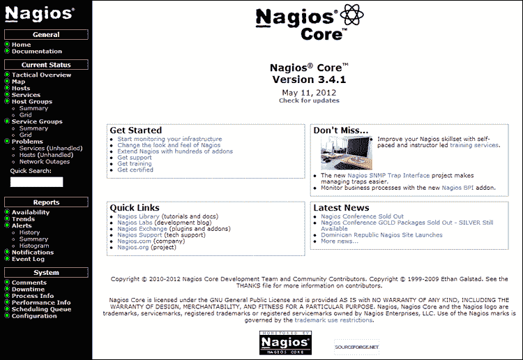
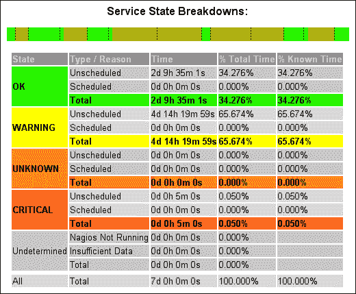
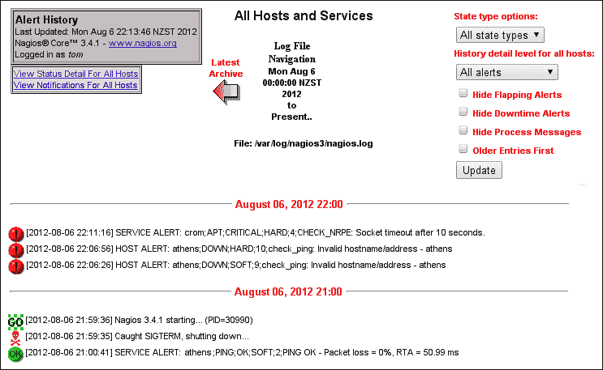

# 第七章：使用网页界面

在本章中，我们将涵盖以下内容：

+   使用战术概览

+   查看和解释可用性报告

+   查看和解释趋势

+   查看和解释通知历史

+   在网页界面中添加主机或服务的注释

+   查看网页界面中的配置

+   从网页界面安排检查

+   通过网页界面确认问题

# 简介

Nagios Core 的网页界面是管理员查看被监控网络当前状态的首选方式。通过 CGI 和 PHP 脚本，它可以提供所有被监控主机和服务的总体性能概况。它还提供有关其当前状态的信息以及如何执行检查。这比通常在电子邮件通知中包含的细节要多得多。



在大多数方面，Nagios Core 的网页界面（没有任何插件）是为了显示信息而设计的，而不是用来控制或配置服务器，但有些操作可以通过它来实际改变 Nagios Core 的运行方式。这些操作包括以下内容：

+   禁用或启用主动检查和被动检查、事件处理程序、通知和波动检测，无论是针对所有主机和服务还是特定的主机和服务

+   发送关于主机或服务的自定义通知，这些通知不一定与实际状态变化相对应

+   重新安排检查，通常是在管理员认为问题已经解决并希望重新检查时，优先进行检查

+   确认问题，以便管理员可以抑制关于他们正在修复的问题的进一步通知

+   安排停机时间以抑制某一时间段内的通知；这在第三章《与检查和状态的协作》中“为主机或服务安排停机时间”的例子中已讨论过

+   为任何其他管理员留下关于主机和服务的注释，供他们检查；列表中的许多其他操作将隐式地执行此操作

我们不会在这里提供网页界面的全面概述，因为它的许多功能在其他章节中已经解释，或者是相当直观的。相反，我们将探索通过网页界面进行的一些运行时行为变化，这些变化列在前一节中，并且在左侧导航菜单中的**报告**部分下使用和解释可用的报告。

网页界面的另一个重要且极其有用的部分，**网络状态图**，在第八章《管理网络布局》中有几个例子进行了讨论。我们在这里不讨论它，因为它非常有用，值得单独成为一个章节。

# 使用战术概览

在本节中，我们将查看 Nagios Core Web 界面的**战术概览**屏幕。顾名思义，这个屏幕提供了对当前受监控主机和服务以及 Nagios Core 服务器本身的运行状态的单页概述。

## 入门

你需要访问 Nagios Core 的 Web 界面。在 QuickStart 安装中，`nagiosadmin`用户将具备所有必要的权限。

## 如何操作...

我们可以按如下方式查看**战术概览**：

1.  登录到 Nagios Core Web 界面。

1.  点击左侧菜单中的**战术概览**项：

    你应该能看到**战术监控概览**屏幕出现在右侧框架中：

    

1.  尝试点击**主机**和**服务**下的一些项，例如**主机**下的**正常**计数。请注意，你会看到该部分所包含的所有主机的列表。

1.  返回**战术概览**，然后尝试点击**监控功能**标题下的一些项，例如**波动检测**下的**启用**项。请注意，点击这些项会带你到一个可以快速开启或关闭相关功能的屏幕（前提是你的用户具有相应的权限）。

## 它是如何工作的...

战术概览是你在发现受监控网络出现问题时的第一个重要入口，特别是当你有理由相信问题不仅仅出现在一个主机上时。它也是调整监控功能的好地方。例如，如果网络中有大规模的区域将会停机，而对所有受影响的主机安排停机时间不太实际，那么你可以简单地暂时完全抑制通知，以便在解决问题时不受干扰。

请注意，屏幕的右上角包含了对服务器监控性能的整体评估；如果你怀疑监控服务器无法跟上任务的处理，或者想了解它进行的检查数量，这里是一个非常有用的起始位置。

在其下方是一个简单的条形图，显示网络的总体状态。它会根据问题的严重程度变化颜色；在之前的截图中，网络中部分主机和服务出现了严重问题，因此该条形图较短且为红色。

## 还有更多内容...

如果你觉得**战术概览**很有用，可能可以考虑将其设置为 Web 界面的首页，而不是默认的页面，后者主要展示 Nagios Core 的品牌、版本和一些链接。我们可以通过修改`/usr/local/nagios/share/index.php`文件中`$corewindow`的值，将其从`main.php`改为`cgi-bin/tac.cgi`来实现这一点：

```
$corewindow=”cgi-bin/tac.cgi”;

```

完成此操作后，当我们访问监控主机上的`/nagios/` URL 时，**战术概览**应该会立即显示。可以通过菜单中的任何页面来完成此操作。**服务**项也是一个很好的选择，可以作为备用主页。

## 另见

+   本章中的*Web 界面中的查看配置*教程

# 查看和解释可用性报告

在本教程中，我们将学习如何使用**可用性报告**来构建一个表格，显示主机、主机组、服务或服务组的正常运行时间统计信息。这对于快速评估整体可用性非常有用，可能用于满足服务级别协议的条款。

## 入门

您需要访问 Nagios Core Web 界面，并有权限从 CGI 执行命令。通过遵循快速入门指南安装的示例配置，在通过 `HTTP` 身份验证时，`nagiosadmin` 用户将获得所有必要的权限。

如果您发现自己没有此权限，请检查 `/usr/local/nagios/etc/cgi.cfg` 中的 `authorized_for_all_services` 和 `authorized_for_all_hosts` 指令，并将您的用户名包含在其中；例如，对于用户`tom`，指令可能类似于以下内容：

```
authorized_for_all_servicess=nagiosadmin,tom
authorized_for_all_hosts=nagiosadmin,tom
```

另外，如果您使用与您想要检查的主机或服务的指定联系人相同的用户名进行身份验证，您也应该能够看到该主机或服务的信息。有关详细信息，请参见第十章中的*使用经过身份验证的联系人*教程，*安全性和性能*。

在这个示例中，我们将查看`troy.naginet`上的`PING`服务的一个月历史记录，这是一个 Linux 服务器。

## 如何操作...

我们可以为我们的`troy.naginet`服务器安排上个月的可用性报告，具体如下：

1.  登录到 Nagios Core Web 界面。

1.  点击左侧菜单中的**可用性**链接，位于**报告**下：如何操作...

1.  选择报告类型，可以是**主机(s)**、**主机组(s)**、**服务(s)** 或 **服务组(s)**：如何操作...

1.  选择一个特定的主机或服务进行报告，或者选择为所有主机、主机组、服务或服务组运行报告：如何操作...

1.  为报告定义一些选项。默认设置是合理的，所以我们现在使用它们；我们将在下一节中讨论其他字段的影响。完成后点击**创建可用性报告！**：如何操作...

    您应该看到一个表格，显示主机或服务在每个状态中所花费的时间百分比。一个健康的服务可能类似于以下截图，只有少数几次波动，甚至没有：

    

    一个问题较多的服务可能会有大量时间处于`WARNING`或`CRITICAL`状态：

    

    表格上方显示了每个状态下所花费时间的快速可视化总结，点击后将链接到具有相同标准的**趋势报告**。此外，表格下方显示了服务或主机状态变化的任何日志条目。

## 它是如何工作的...

Nagios Core 从其日志文件中汇总指定时间段内的状态变化，并按百分比构建状态变化表格。因此，可用性报告仅适用于归档日志文件覆盖的时间段。构建报告的第三步涉及许多可能的选项：

+   **报告时间段**：此下拉菜单允许选择一个相对于当前日期的固定时间段；或者，可以选择最后的**自定义时间段**选项，选择接下来两个字段中的日期：

    +   **开始日期（包含）**：此字段指定报告应开始的日期，如果已设置自定义时间段选项。

    +   **结束日期（包含）**：此字段指定报告应结束的日期，如果已设置自定义时间段选项。

+   **报告时间段**：这是评估可用性的时间段。默认值为**无**，这意味着将在任何时间点使用服务或主机的状态进行计算。例如，您可以将其设置为`workhours`，以查看服务器预期繁忙期间的正常运行时间百分比。

+   **假定状态保持**：如果在报告期间 Nagios Core 被重启过一次或多次，选中此选项将使报告假设在任何重启之前的状态被 Nagios Core 保留，直到它重新启动；此选项通过`nagios.cfg`中的`retain_state_information`指令启用。

+   **假定初始状态**：如果 Nagios Core 无法确定报告开始时服务的初始状态，直到第一次检查时，它将基于**首次假定主机状态**或**首次假定服务状态**字段的值来假定状态。

+   **假定程序停机期间的状态**：如果 Nagios Core 发现其日志文件中记录了停机时间，它将假定在停机前从主机或服务读取的最终状态。

+   **包含软状态**：Nagios Core 将绘制`SOFT`状态，这意味着它将包括发生的状态变化，但会在`max_check_attempts`未耗尽之前恢复到其先前的状态。否则，它将只绘制通过重试检查的状态，或`HARD`状态。

+   **首次假定主机状态**或**首次假定服务状态**：如果 Nagios Core 无法从日志文件中确定主机或服务的状态，则应假定该状态的值。

+   **回溯档案**：此字段指定 Nagios Core 进程应检查的已归档日志文件的数量，以尝试查找主机或服务的初始状态。

## 还有更多...

你还可以选择为主机组或服务组运行报告，这将生成一个索引表，显示每个主机或每个服务的状态时间百分比，以及该组中所有主机或服务的平均正常运行时间。

## 参见

+   本章中的*查看和解释趋势*以及*查看和解释通知历史*教程

+   本章中的*使用认证联系人*教程见第十章，*安全与性能*

# 查看和解释趋势

在这个教程中，我们将学习如何使用**主机**和**服务状态趋势**报告工具，通过主机或服务显示在一段固定时间内的状态图表。这可以帮助我们不仅确定整体的可用性，或许是为了满足服务级别协议的条款，还能了解是否有特定的时间段或间隔，主机会进入非`OK`状态。这是查看主机停机模式的一个好方法。

## 开始

你需要访问 Nagios Core Web 界面，并且有权限从 CGI 运行命令。通过快速入门指南安装的示例配置会在通过`HTTP`身份验证时，授予`nagiosadmin`用户所有必要的权限。

如果你发现自己没有这个权限，检查`authorized_for_all_services`和`authorized_for_all_hosts`指令在`/usr/local/nagios/etc/cgi.cfg`中的配置，并在其中添加你的用户名；例如，对于用户`tom`，指令可能如下所示：

```
authorized_for_all_services=nagiosadmin,tom
authorized_for_all_hosts=nagiosadmin,tom
```

另外，如果你使用的用户名与主机或服务的指定联系人相同，你也应该能够查看该主机或服务的信息。

在这个例子中，我们将查看`athens.naginet`（一个我们正在运行检查的 Web 服务器）上 HTTP 服务的一个月历史。

## 如何操作...

我们可以为我们的`athens.naginet`服务器安排一个过去一个月的**服务状态趋势**报告，如下所示：

1.  登录到 Nagios Core Web 界面。

1.  点击左侧菜单中的**趋势**链接，位于**报告**下方：

1.  选择报告类型，**主机**或**服务**：

1.  选择你希望报告的特定主机或服务：

1.  定义报告的一些选项。默认设置是合理的，我们暂时使用这些设置；我们将在下一节中详细说明其他字段的作用。完成后点击**创建报告**：

你应该能看到一张展示主机或服务随时间变化的状态图表，并标明状态变化的时间，以及右侧的状态百分比分布。

一个健康的服务可能看起来像下面的截图，只有一些小的波动，或者根本没有：


更具问题性的服务可能会长时间处于`警告`或`严重`状态：


你可以点击图表的某些部分以进行“缩放”，前提是你没有在**选择报告选项**页面选择**禁止图像映射**选项。

## 它是如何工作的...

Nagios Core 从指定时间段的日志文件中汇总状态变化，并通过颜色构建状态变化图，横轴标出日期并按固定间隔划分。因此，趋势图仅适用于存档日志文件所涵盖的时间段。构建报告的第三步涉及许多可能的选项：

+   **报告周期**：此下拉菜单允许选择一个固定的周期，方便地与当前日期进行比较；或者，可以通过选择**自定义时间周期**选项并在接下来的两个字段中选择日期来使用自定义时间周期：

    +   **开始日期（包含）**：此字段指定如果设置了自定义时间周期选项，报告应该开始的日期。

    +   **结束日期（包含）**：此字段指定如果设置了自定义时间周期选项，报告应该结束的日期。

+   **假设状态保留**：如果 Nagios Core 在报告周期内重启过一次或多次，勾选此选项将使报告假定在任何重启之前的状态被 Nagios Core 保留，直到它重新启动；此选项通过在 `nagios.cfg` 中启用 `retain_state_information` 指令来启用。

+   **假设初始状态**：如果 Nagios Core 无法在报告开始到第一次检查时确定服务的初始状态，它将根据**首次假定主机状态**或**首次假定服务状态**字段的值进行假设。

+   **假设程序停机期间的状态**：如果 Nagios Core 在其日志文件中发现它曾在一段时间内停机，它将假定在停机期间从主机或服务读取的最终状态。

+   **包括软状态**：Nagios Core 将绘制`软`状态，意味着它会包括发生的状态变化，但这些变化会在`max_check_attempts`未耗尽之前恢复到先前的状态。否则，它只会绘制那些通过重试检查持续存在的状态，或称为`硬`状态。

+   **首次假定主机状态**或**首次假定服务状态**：这是 Nagios Core 在无法从日志文件中确定主机或服务状态时应假定的值。

+   **回溯存档**：此项指定 Nagios Core 进程应回溯多少个存档日志文件，以尝试为主机或服务查找初始状态。

+   **禁止图像映射**：这会防止图表被点击以放大特定区域，可能是出于浏览器兼容性原因。

+   **禁止弹出窗口**：这会防止图表在悬停时显示弹出窗口，可能是出于浏览器兼容性原因。

## 还有更多...

请注意，确保在运行报告的整个期间，检查实际上是持续运行的非常重要，否则**状态细分**部分的统计数据会被扭曲。对于仅存在六个月的主机，运行一年的报告是没有意义的！通常，检查越频繁和一致，趋势图的准确性就越高。

## 另见

+   本章中的*查看和解释可用性报告* *和查看和解释通知历史* 配方

# 查看和解释通知历史

在这个配方中，我们将看到如何获取由 Nagios Core 对主机和服务状态变化生成的警报和通知的完整列表和方便的摘要。这些选项都可以在侧边栏的**报告**部分下找到：


在本节中区分警报和通知非常重要。**警报**是响应事件（如主机或服务状态变化）生成的。**通知**则可能会或不会作为对该警报的响应生成，并发送给相关联系人。`SOFT` 状态变化构成警报；通常只有 `HARD` 状态变化才会生成通知。

在生产监控服务器中，可能不会为每个警报发送通知，特别是如果你很好地使用了 `max_check_attempts`、计划停机和问题确认功能。你应该确保正在检查正确的部分。

## 入门

你需要访问 Nagios Core 的 web 界面并且拥有从 CGI 执行命令的权限。通过快速入门指南安装的示例配置会在通过 `HTTP` 身份验证时为 `nagiosadmin` 用户授予所有必要的权限。

## 如何操作……

我们可以通过以下方式概览在 Nagios Core 服务器上生成的通知、警报和其他事件：

1.  从**通知**报告开始。结果页面应该显示当前日志文件中读取的当天通知。

1.  请注意，如果你使用的是 Nagios Core 的**日志轮换**功能，并且已通过 `log_rotation_method` 指令进行配置，那么你可以使用表格上方的箭头导航到前一周期的监控（通常为 24 小时）。此外，请注意，信息包含以下内容：

    +   生成通知的主机和服务链接

    +   这些通知发送到的联系人

    +   执行的通知命令

    +   触发警报和通知的命令输出

    另外，请注意，你可以使用右上角的表单过滤任何特定类型的通知，并更改排序顺序：

    

1.  接下来，转到**警报**或**警报 | 历史报告**。与表格格式不同，这会以列表形式展示由主机和服务生成的所有警报，并使用红色感叹号图标表示`CRITICAL`或`DOWN`状态，绿色图标表示`OK`状态，其他状态则显示不同的图标。该列表按一小时的间隔划分：

    请注意，这些警报还包括服务器启动或关闭的情况。还要注意，您可以再次使用右上角表单筛选特定的警报类型。

1.  **警报**菜单中的另外两个选项允许生成包含多个条件的复杂报告。第一个，**摘要**，根据表单中输入的条件以表格格式呈现结果。现在，尝试点击第一页底部的**创建摘要报告**，在所有字段使用默认值的情况下，感受一下它生成的结果：

    **直方图**报告生成类似的内容，展示在固定时间段内为指定主机或服务生成的警报的细分情况：

    

## 它是如何工作的……

Nagios Core 会长期保存警报和通知的数据，从而允许动态生成此类报告。请注意，这些报告中展示的数据是警报和通知，而不是服务随时间变化的实际状态。要获得有用的统计信息，如正常运行时间百分比，您将需要生成可用性报告，正如本章中的*查看和解释可用性报告*方法所讨论的那样。

相同的通知数据还可以通过 NDOUtils 扩展转换为 MySQL 数据库格式，从而使得能够以编程方式读取警报和通知数据，以生成自定义报告。有关如何操作的详细信息，请参见第十一章中的*将状态读取到 MySQL 数据库与 NDOUtils*方法，*自动化和扩展 Nagios*章节。

## 还有更多……

菜单中的剩余项是**事件日志**，它呈现了 Nagios Core 整体活动的更全面总结，而不仅仅过滤警报或通知。此屏幕可以包括例如外部命令应用等信息。它通常比较冗长，但它是通过 Web 界面读取`nagios.log`文件的有用方式。要使用此功能，您的用户名需要包含在 `/usr/local/nagios/etc/cgi.cfg`中的`authorized_for_system_information`指令中：

```
authorized_for_system_information=nagiosadmin,tom
```

## 另见

+   本章中的*查看和解释可用性报告*和*查看和解释趋势*方法

+   第十一章中的*将状态读取到 MySQL 数据库与 NDOUtils*方法，*自动化和扩展 Nagios*

# 在 Web 界面中添加主机或服务的评论

在本教程中，我们将学习如何在 Nagios Core 网页界面中向主机或服务添加评论，以便为所有网页界面用户跟踪相关信息。

## 入门

你需要访问 Nagios Core 网页界面，并且具有从 CGI 运行命令的权限。按照快速入门指南安装的示例配置将为`nagiosadmin`用户授予所有必要的权限，前提是通过`HTTP`进行身份验证。你还需要至少一个主机或服务。

如果你发现自己没有此权限，请检查`/usr/local/nagios/etc/cgi.cfg`中的`authorized_for_all_service_commands`和`authorized_for_all_host_commands`指令，并将你的用户名添加到两者中；例如，对于用户`tom`，指令可能类似于以下内容：

```
authorized_for_all_service_commands=nagiosadmin,tom
authorized_for_all_host_commands=nagiosadmin,tom
```

## 如何操作...

我们可以通过以下方式向主机或服务添加评论：

1.  登录到 Nagios Core 网页界面，点击你希望留下评论的主机名或服务描述。你可以通过**主机**或**服务**菜单项进入此页面。在这里，我正在对我的**sparta.naginet**主机添加评论：

1.  点击页面底部的**添加新评论**链接：

1.  填写结果表单并包括以下细节：

    +   **主机名**：这是应该添加评论的主机或服务的主机名。此项应自动填写。

    +   **持久化**：如果希望即使在重启 Nagios Core 后评论仍然保留在主机上，请勾选此框。

    +   **作者（你的名字）**：这是确认故障的人的名字。此项应默认为你的名字或用户名；根据`/usr/local/nagios/etc/cgi.cfg`中`lock_author_names`的设置，可能会显示为灰色且不可更改。

    +   **评论**：这是评论的具体内容。

    请注意，解释性说明也会出现在命令描述的右侧。完成后，点击**提交**：

    

完成此操作后，评论应已添加到主机或服务。处理命令可能需要一点时间。你会发现主机或服务的链接菜单中添加了一个图标，并且已添加评论：


## 工作原理...

与大多数从 Nagios Core 网页界面发出的更改一样，向主机或服务添加评论也是一个发往服务器处理的命令，服务器的主要任务是执行插件和记录状态。这就是为什么即使在空闲服务器上，应用评论有时也需要几秒钟的原因。这些信息会被写入命令文件，默认保存在`/usr/local/nagios/var/rw/nagios.cmd`，Nagios Core 系统会定期读取该文件。

当命令被执行时，评论将被添加到主机或服务，任何具有适当权限的用户都可以在网页界面中查看。

## 还有更多...

你可以通过侧边栏中的 **评论** 链接查看所有评论的列表：


这将列出所有主机和服务的完整评论，包括自动和手动的评论：


## 另见

+   本章中的 *通过 web 界面确认问题* 实例

# 在 web 界面中查看配置

在这个实例中，我们将学习如何查看当前为运行中的 Nagios Core 实例配置的所有对象的表格。这是一个非常方便的方式来查看系统如何理解你的配置。如果你使用了很多配置技巧，比如对象继承和主机名模式，这确实可以帮助你理解配置。

一些管理员可能不了解这个功能，因为它隐藏在 Nagios Core web 界面导航菜单的底部。使用起来非常简单，只有两个步骤。

## 入门

你需要访问 Nagios Core web 界面，并有权限从 CGI 执行命令。按照快速入门指南安装的示例配置，授予了 `nagiosadmin` 用户通过 `HTTP` 认证时所需的所有权限。

如果你发现自己没有这个权限，可以检查 `/usr/local/nagios/etc/cgi.cfg` 中的 `authorized_for_configuration_information` 指令，并将你的用户名添加进去；例如，对于用户 `tom`，指令可能如下所示：

```
authorized_for_configuration_information=nagiosadmin,tom
```

## 如何操作...

我们可以在 web 界面中查看不同对象类型的配置，如下所示：

1.  登录到 Nagios Core web 界面，并点击导航菜单中的 **配置** 项：

1.  选择你希望查看的对象类型，然后点击 **继续**。在这个例子中，我想查看我定义的所有主机：

    你应该会看到一个完整的表格，显示你系统中所有定义主机的指令值。这个表格可能比屏幕宽，因此需要水平滚动。

    

## 它是如何工作的...

这只是一个方便的快捷方式，用于查看 Nagios Core 理解的主机配置。以下对象类型可以查看：

+   主机

+   主机依赖

+   主机升级

+   主机组

+   服务

+   服务组

+   服务依赖

+   服务升级

+   联系人

+   联系人组

+   时间段

+   命令

+   命令扩展

这个快捷方式对于有时可能非常复杂的定义尤其方便，比如从模板继承的主机和服务，或时间段定义。这是一个检查 Nagios Core 是否按照预期解读你配置的好方法。

## 还有更多...

需要注意的是，输出实际上并没有告诉你主机或服务的状态；它仅显示它们的配置。如果你需要以易于处理的格式获取配置和状态信息，可以使用 NDOUtils 插件，它允许你将这些信息转换为 MySQL 数据库格式。有关如何实现这一点的详细信息，请参阅 第十一章 中的 *将状态读入 MySQL 数据库与 NDOUtils* 章节，*自动化与扩展 Nagios Core*。

## 参见

+   第十一章 中的 *将状态读入 MySQL 数据库与 NDOUtils* 和 *编写定制的 Nagios Core 报告* 章节，*自动化与扩展 Nagios Core*

# 从 Web 界面调度检查

在本节中，我们将学习如何通过 Web 界面手动调度主机和服务的检查，覆盖 Nagios Core 通常执行的自动调度。这对于加快刚刚添加的主机或服务的检查，或者解决刚发生问题的主机或服务，或者强制进行检查即使主机上的主动检查因为某些原因被禁用，都非常方便。

在这个例子中，我们将调度一个服务的检查，但主机的检查也可以以相同的方式进行。

## 入门

你需要访问 Nagios Core Web 界面，并有权限从 CGI 运行命令。按照快速入门指南安装的示例配置会在通过 `HTTP` 认证后，授予 `nagiosadmin` 用户所有必要的权限。

如果你发现自己没有这个权限，请检查 `/usr/local/nagios/etc/cgi.cfg` 中的 `authorized_for_all_service_commands` 和 `authorized_for_all_host_commands` 指令，并将你的用户名加入其中；例如，对于用户 `tom`，这些指令可能看起来像以下这样：

```
authorized_for_all_service_commands=nagiosadmin,tom
authorized_for_all_host_commands=nagiosadmin,tom
```

## 如何操作...

我们可以如下调度一个现有服务的检查：

1.  登录到 Nagios Core Web 界面，找到你想要调度检查的主机或服务的链接。在这个例子中，我们正在强制对 **sparta.naginet** 主机上的 **LOAD** 服务进行检查：

1.  点击右侧菜单中的 **重新调度此服务的下一次检查** 或 **重新调度此主机的下一次检查** 链接：

1.  完成生成的表单并包括以下细节：

    +   **主机名**：这是出现问题的主机或服务的主机名。此项应该会自动填写。

    +   **服务**：这是出现问题的服务的描述（如果适用）。此项同样会自动填写。

    +   **检查时间**：这是 Nagios Core 应重新调度检查的时间。

    +   **强制检查**：指定是否需要强制执行检查，即使该主机或服务的活动检查已被禁用。

    请注意，解释性说明也会显示在命令描述的右侧。完成后点击**提交**：

    

完成此操作后，在 Nagios Core 处理新命令后，查看服务时应该会显示下次计划检查的新时间，检查将在指定时间运行，并正常处理返回值。

## 工作原理...

以这种方式调度检查是一种为特定主机或服务“跳过队列”的方法。检查调度通常是一个自动化过程，Nagios Core 根据主机和服务指令（如`check_interval`和`retry_interval`）来决定。

和所有从网络界面发出的外部命令一样，命令会被写入命令文件，通常位于`/usr/local/nagios/var/rw/nagios.cmd`，由系统处理。

## 还有更多内容...

我们可以通过点击侧边栏**系统**部分下的**调度队列**链接来检查排队的检查任务：


这将显示待处理检查的列表，以及它们将执行的时间：


我们还可以通过使用`nagios`命令的`-s`标志来获取有关排队过程和性能的更详细信息：

```
# /usr/local/nagios/bin/nagios -s /usr/local/nagios/etc/nagios.cfg

```

这会打印大量信息到终端，太多了，无法在此复述！使用诸如`less`的分页工具可能会更有帮助，方便阅读：

```
# /usr/local/nagios/bin/nagios -s /usr/local/nagios/etc/nagios.cfg | less

```

## 另见

+   本章中的*查看和解读通知历史*教程

+   第十章中的*使用 Nagiostats 检查 Nagios Core 性能*教程，*安全与性能*

+   第十一章中的*允许被动检查*和*通过 NSCA 从远程主机运行被动检查*教程，*自动化与扩展 Nagios Core*

# 通过网络界面确认问题

在本篇教程中，我们将学习如何确认主机或服务的问题，以防止收到进一步的通知，并标明问题正在处理中。如果有多个管理员可以访问 Nagios Core 网络界面，这个方法尤其有用，可以避免多个管理员同时尝试解决同一个问题，并防止在操作团队已知问题后仍然收到不必要的长期通知。确认时产生的行为变化会在提交时定义。

## 入门

要确认一个通知，必须至少有一个主机或服务遇到问题。任何处于`WARNING`、`CRITICAL`或`UNKNOWN`状态的主机或服务都可以进行确认。

您需要访问 Nagios Core 的 Web 界面，并且需要有从 CGI 运行命令的权限。快速启动配置会在通过`HTTP`认证时授予`nagiosadmin`用户所有必要的权限。

如果您发现自己没有此权限，请检查`/usr/local/nagios/etc/cgi.cfg`中的`authorized_for_all_service_commands`和`authorized_for_all_host_commands`指令，并将您的用户名添加到两者中；例如，对于用户`tom`，指令可能如下所示：

```
authorized_for_all_service_commands=nagiosadmin,tom
authorized_for_all_host_commands=nagiosadmin,tom
```

## 如何操作...

我们可以通过以下方式确认主机或服务的问题：

1.  登录到 Nagios Core 的 Web 界面，点击左侧菜单中的**主机**或**服务**部分，访问出现问题的主机或服务。在此示例中，我正在确认我机器**athens**上**APT**服务的问题；Nagios Core 报告有可用的升级，但它们不是关键性问题，我现在无法执行它们。因此，我将确认这些问题，以便其他管理员知道我已经有解决问题的计划：

1.  点击**服务命令**菜单下的**确认此服务问题**链接：

1.  完成生成的表单，并包含以下细节：

    +   **主机名称**：这是出现问题的主机或服务的主机名。此项应自动填写。

    +   **服务**：这是出现问题的服务描述（如果适用）。此项也将自动填写。

    +   **粘性确认**：如果勾选此项，通知将被抑制，直到问题解决；如果 Nagios Core 被重启，确认将不会消失。

    +   **发送通知**：如果勾选此项，`ACKNOWLEDGEMENT`通知将会发送给所有相关主机或服务的联系人和联系人组。

    +   **持续评论**：确认总是对相关的主机或服务留下评论。默认情况下，这些评论会在主机或服务恢复时被移除，但如果您愿意，您可以勾选此项以安排让它们变为永久评论。

    +   **作者（您的姓名）**：这是确认故障的人的名字。此项应默认填写您的姓名或用户名；根据`/usr/local/nagios/etc/cgi.cfg`中的`lock_author_names`值，它可能是灰色并且不可更改。

    +   **评论**：这是确认的说明；通常这是一个放置预期解决时间以及正在做什么以解决问题的好地方。

    请注意，解释性说明也会出现在命令描述的右侧。完成后，点击**提交**：

    

完成此操作后，您选择的停机效果应该很快生效。处理命令可能需要一点时间。您会发现，主机或服务链接的菜单中添加了一个确认图标，且已经添加了评论：


你的联系人可能还会收到一个**确认**通知：


## 它是如何工作的...

像大多数通过 Nagios Core Web 界面发出的更改一样，确认主机或服务是一条命令，由服务器处理，除了执行插件和记录状态这一主要任务外。这就是为什么即使在空闲的服务器上，应用此操作有时也需要几秒钟时间的原因。所有这些操作都会写入命令文件，该文件默认存储在`/usr/local/nagios/var/rw/nagios.cmd`路径下。只要在`/usr/local/nagios/etc/nagios.cfg`中启用了外部命令处理，Nagios Core 系统会定期读取此文件。

当命令被执行并且选择了**固定确认**选项时，其效果是，Nagios Core 通常应用的过滤器会注意到主机或服务在发送通知之前已经确认了问题，因此会阻止通知的发送。

当主机恢复（`恢复`事件）时，会发送相应的通知，并且确认会被移除，因为它不再需要。即使主机或服务出现的再次是完全相同的问题，未来的任何问题仍然需要重新确认。

## 还有更多...

确认主机和服务问题对于管理员来说是一个非常好的习惯，尤其是当在团队中工作时，因为这可以避免很多混乱或重复的工作。因此，它与评论一样有帮助，有助于让你的团队了解网络的最新状况。

计划停机和确认之间的区别非常重要。**停机时间**是为了主机或服务的计划性停机而设置的；**确认**则是用于通知一个未预见的问题已经发生，并且正在处理中的手段。

如果我们不断收到已经知道的问题的通知，并且已经使用了确认功能，那么可能需要审查适用主机或服务的`notification_interval`指令，以限制通知发送的频率。例如，如果我们只希望每四小时发送一次重复通知，可以编写以下代码片段：

```
define host {
    ...
    notification_interval  240
}
```

例如，对于低优先级的主机，可能并不需要每 10 分钟发送一次通知！

不要将此指令与`notification_period`混淆，`notification_period`用于定义可发送通知的时间段，另一个可能需要审查的指令：

```
define host {
    ...
    notification_period  24x7
}
```

## 另见

+   本章中的*在 Web 界面上为主机或服务添加评论*示例

+   第三章中的*为主机或服务安排停机时间*示例，*工作与检查和状态*
