# 第八章：管理网络布局

本章将涵盖以下内容：

+   创建网络主机层次结构

+   使用网络地图

+   为主机选择图标

+   建立主机依赖关系

+   建立服务依赖关系

+   监控集群中的独立节点

+   将网络地图用作覆盖层

# 介绍

虽然当 Nagios Core 配置为仅监控简单的主机和服务列表时仍然非常有用，但它包括一些可选指令，允许定义监控网络的一些结构和功能属性；特别是，主机和服务如何相互关联。通过在配置中描述这种结构，可以在监控和通知中实现 Nagios Core 的一些附加智能行为。

在 Nagios Core 中处理网络结构的主要方法有两种：

+   主机父级定义允许管理员从 Nagios Core 服务器的“视角”定义监控主机的连接层次结构。例如，可能有一台位于另一个子网中的服务器，它通过路由器与 Nagios Core 服务器相连。如果路由器进入 `DOWN` 状态，它会触发 Nagios Core 的主机可达性逻辑，自动确定哪些主机变得无法访问，并将这些主机标记为 `UNREACHABLE` 而非 `DOWN`，从而实现更细致的通知行为。

+   主机和服务依赖关系允许在主机或服务之间建立关系，通常是为了抑制不必要的通知。例如，可能有一个服务用来测试登录邮件服务，而该服务本身需要一个数据库服务才能正常工作。如果 Nagios Core 发现数据库服务和登录服务都出现故障，服务依赖关系可以抑制有关登录服务的通知；因此，管理员只会收到关于数据库服务故障的通知，这更可能是实际的问题所在。

这里的功能有一些重叠，但一般的模式是，主机父级定义描述了从监控服务器的视角来看网络的结构，而主机和服务依赖关系描述了它如何运作，与监控服务器无关。我们将在本章中定义父级定义和依赖关系，主要目标是过滤并改进 Nagios Core 在检测失败时发送的通知，这将极大地帮助诊断问题。

我们还将探讨在建立主机父级定义时的另一个更微妙的好处，即如何使 Nagios Core 网络接口的网络地图变得有用，一旦设置了基本的层次结构，我们将展示如何自定义地图的外观（包括为主机定义图标），使其通常作为网络天气图变得有用。

# 创建网络主机层次结构

在这个教程中，我们将学习如何在一个非常简单的网络中为两台主机建立父子关系，以便利用 Nagios Core 的可达性逻辑。更改此配置非常简单；只需要添加一个指令，并可选地更改一些通知选项。

## 准备就绪

你需要运行 Nagios Core 3.0 或更新版本的服务器，并且至少有两台主机，其中一台只能通过另一台主机访问。允许与其他主机通信的主机是**父主机**。你应该相当有信心，如果与父主机的连接丢失，意味着子主机无法从监控服务器访问。

访问 Nagios Core 的 Web 界面也很有用，因为做出这个更改会改变网络地图的显示，这部分内容在本章的*使用网络地图*教程中有所讨论。

我们的示例将使用一台 Nagios Core 监控服务器`olympus.naginet`，监控三台主机：

+   `calpe.naginet`，一台路由器

+   `janus.naginet`，另一台路由器

+   `corsica.naginet`，一台 Web 服务器

主机按照以下图示连接：

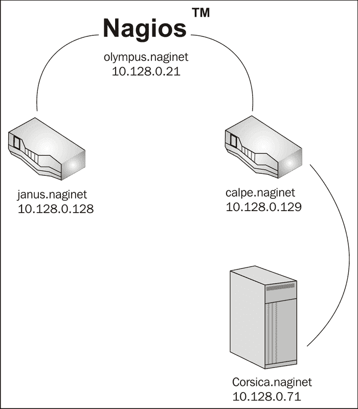

请注意，Nagios Core 服务器`olympus.naginet`只能在路由器`calpe.naginet`正常工作的情况下与`corsica.naginet` Web 服务器通信。如果**calpe.naginet**进入**DOWN**状态，我们也会看到**corsica.naginet**进入**DOWN**状态：

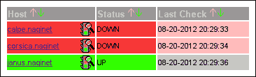

这有点误导，因为我们并不知道`corsica.naginet`是否宕机。它可能宕机，但由于主机间的路由器未正确工作，Nagios Core 无法得知。对于该主机，更准确的状态应该是`UNREACHABLE`；这就是我们接下来要添加的配置所安排的状态。

## 如何操作...

我们可以按以下方式为我们的两台主机配置父子关系：

1.  更改到 Nagios Core 的`objects`配置目录。默认路径是`/usr/local/nagios/etc/objects`。如果你将主机定义放在了其他文件中，请进入该目录。

    ```
    # cd /usr/local/nagios/etc/objects

    ```

1.  编辑包含子主机定义的文件。在我们的示例中，子主机是`corsica.naginet`，即 Web 服务器。主机定义可能类似于以下代码片段：

    ```
    define host {
        use        linux-server
        host_name  corsica.naginet
        alias      corsica
        address    10.128.0.71
    }
    ```

1.  在主机定义中添加新的`parents`指令，并为其设置与其依赖的连接主机的`host_name`指令相同的值。在我们的示例中，这台主机是`calpe.naginet`。

    ```
    define host {
        use        linux-server
        host_name  corsica.naginet
        alias      corsica
        address    10.128.0.71
     parents    calpe.naginet
    }
    ```

1.  验证配置并重启 Nagios Core 服务器：

    ```
    # /usr/local/nagios/bin/nagios -v /usr/local/nagios/etc/nagios.cfg
    # /etc/init.d/nagios restart

    ```

完成此操作后，如果父主机进入**DOWN**状态且无法联系到子主机，则子主机将进入**UNREACHABLE**状态，而不是被标记为**DOWN**：

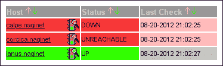

只要在主机的`notification_options`和联系人的`host_notification_options`中包含`u`标志，子主机的联系人也会收到`UNREACHABLE`通知，而不是子主机的`DOWN`通知。有关详细信息，请参见第四章中的*指定要通知的状态*一节，*配置通知*部分。

## 它是如何工作的...

这是 Nagios Core 可达性逻辑的一个简单应用。当对`calpe.naginet`的检查第一次失败时，Nagios Core 会注意到它是一个父主机，拥有一个子主机`corsica.naginet`。如果在检查子主机时发现无法与其通信，它会标记为`UNREACHABLE`状态，而不是`DOWN`状态，触发一个不同的通知事件。

这种方式的主要优点有两个：

+   `DOWN`通知仅发送给最近出现问题的父主机。所有超出该主机的其他主机会触发`UNREACHABLE`通知。这意味着 Nagios Core 的可达性逻辑会自动确定从它的角度看失败的节点，这在诊断实际出现问题的主机时非常有用。

+   如果主机是大量其他主机的父主机，可以通过配置来避免为`UNREACHABLE`主机发送紧急通知。当一个非常核心的路由器宕机时，向管理员发送一百个电话或电子邮件通知可能没有太大意义；他们已经知道下游主机出现了问题，因此我们只是在用无用的信息分散他们的注意力。

通过一些规划和对网络的了解，我们只需在主机定义中添加几个`parents`指令，就能构建一个简单的网络结构，结果是 Nagios Core 会表现得更加智能。这是改进 Nagios Core 通知行为的最简单方法之一，值得强烈推荐！

## 还有更多内容...

请注意，一个子主机本身可以成为其他主机的父主机，从而允许形成嵌套的网络结构。也许在另一种情况下，我们会发现`corsica.naginet`服务器距离监控服务器有两个路由器之远：

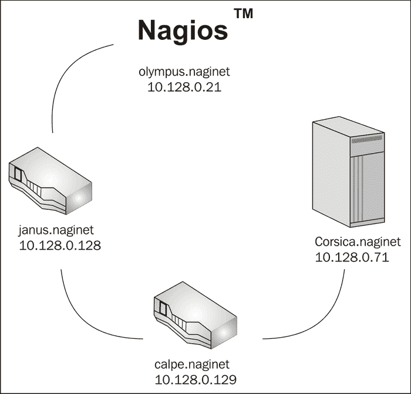

在这种情况下，不仅`corsica.naginet`是`calpe.naginet`的子主机，而且`calpe.naginet`本身也是`janus.naginet`的子主机。我们可以以完全相同的方式指定这种关系：

```
define host {
    use        linux-router
    host_name  calpe.naginet
    alias      calpe
    address    10.128.0.129
 parents    janus.naginet
}
```

还可以为主机设置多个父主机，如果有两条可能的路径通向同一台机器：

```
define host {
    use        linux-server
    host_name  corsica.naginet
    alias      corsica
    address    10.128.0.71
 parents    calpe.naginet,janus.naginet
}
```

在此配置下，只有当`corsica.naginet`的两个父主机都宕机时，`corsica.naginet`才会被认为是`UNREACHABLE`。这种配置有助于考虑网络中的冗余路径；应用场景可能包括生成树技术或动态路由故障切换。

在您使用 `parents` 指令为您的网络设置了良好的基本结构之后，务必查看本章中的 *使用网络地图* 方案，以便从新的配置中获得有关网络结构的自动可视化反馈。

## 另见

+   本章中的 *使用网络地图* 和 *建立主机依赖关系* 方案

+   第四章 中的 *指定需要通知的状态* 和 *配置通知组* 方案，*配置通知*

# 使用网络地图

在本方案中，我们将在 Nagios Core Web 界面中检查网络地图（或状态图）中的网络层次结构。网络地图以生成的图形形式展示主机层次结构及其当前状态。您可以在本章中的 *创建网络主机层次结构* 方案中学习如何建立这样的层次结构。网络地图允许过滤以显示特定主机，并可以点击主机以在更大的网络中导航。

## 准备工作

您需要运行 Nagios Core 3.0 或更新版本的服务器，并且可以访问其 Web 界面。您还需要查看主机状态的权限，最好是所有主机。您可以通过将您的用户名添加到 `authorized_for_all_hosts` 指令中来安排此权限，通常该指令位于 `/usr/local/nagios/etc/cgi.cfg` 中；例如，对于用户 `tom`，我们可能会将该指令配置为如下：

```
authorized_for_all_hosts=nagiosadmin,tom
```

默认情况下，`nagiosadmin` 用户应该具有查看完整地图所需的所有权限。

如果您的主机尚未配置至少一些 `parents` 指令并按层次结构排列，那么网络地图就不会特别有用。因此，如果您尚未为主机设置任何 `parents` 指令，您可能希望首先阅读本章中的 *创建网络主机层次结构* 方案，并按其说明安排您的监控主机。

## 操作步骤...

我们可以按如下方式检查我们新配置的主机层次结构的网络地图：

1.  登录到 Nagios Core Web 界面。

1.  点击左侧菜单中的 **地图** 项：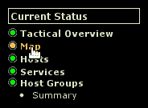

    您应该看到一个生成的图形，显示您的用户有权限查看的所有网络主机：

    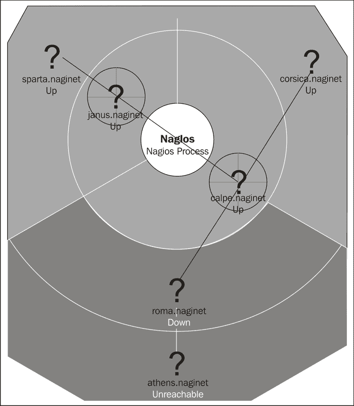

1.  将鼠标悬停在任何主机上，即可看到一个面板，分解主机的当前状态：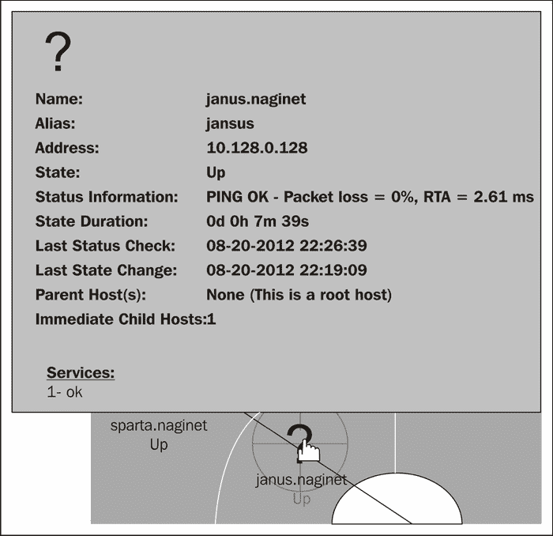

1.  默认情况下，网络地图围绕 Nagios 进程图标居中。尝试点击您的某个主机以重新居中地图；在此示例中，它已经重新居中在 `calpe.naginet` 上：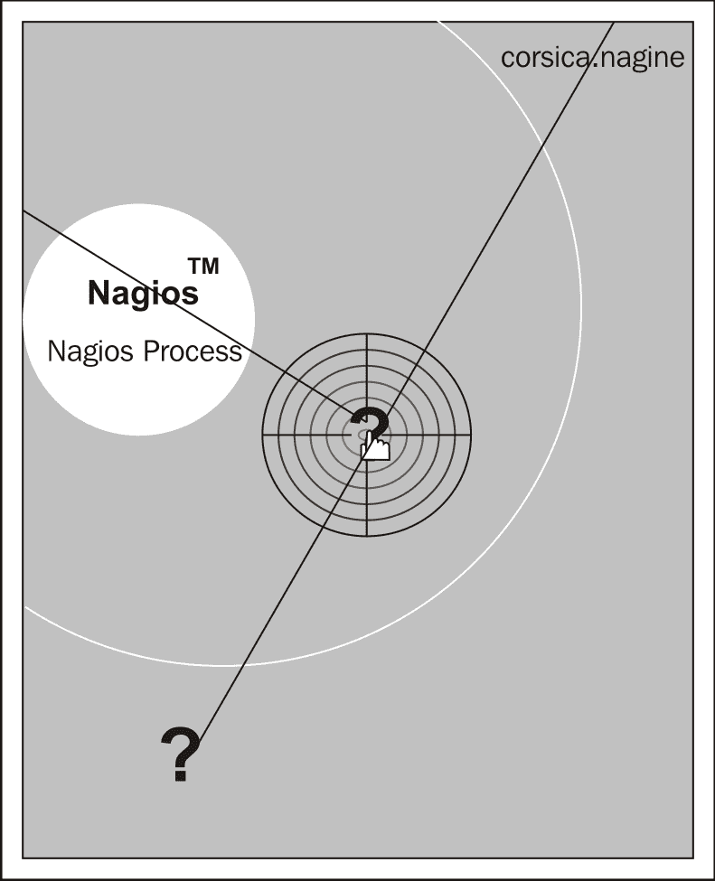

## 它是如何工作的...

网络地图是从您的主机配置中自动生成的。默认情况下，它将主机排列在扇区中，从中央的 Nagios 进程图标向外辐射，使用线条显示依赖关系，并将背景颜色调整为绿色表示 `UP` 状态，红色表示 `DOWN` 或 `UNREACHABLE` 状态。

这张地图是通过**GD2 库**生成的，该库由 Thomas Boutell 编写。它采用链接图像地图的形式。这意味着您可以简单地右击图像保存它，在网络处于特定状态时以便稍后参考，并且还可以点击单个节点以将地图重新集中在指定主机上。这对于具有大量主机和许多父/子主机关系层级的网络特别有用。

## 还有更多...

请注意，右上角面板中的表单允许直接定制地图的外观：

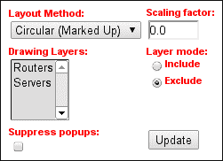

+   **布局方法**：这允许您选择用于排列和绘制主机的算法。值得尝试这些方法中的每一种，以查看哪一种最适合您特定的网络布局。

+   **缩放因子**：在此更改值以减少或增加地图图像的大小；`0.0`到`1.0`之间的值将减小图像的大小，而大于`1.0`的值将增大它。

+   **绘制图层**：如果您的主机已组织成主机组，您可以筛选地图，仅显示属于特定组的主机。

+   **图层模式**：如果您在**绘制图层**选项中选择了任何主机组，这允许您选择是否将这些组中的主机包含在地图中，或将它们排除在外。

+   **抑制弹出窗口**：如果您觉得当将鼠标悬停在主机上时出现的黄色信息弹出窗口很烦人，您可以通过勾选此复选框来关闭它们。

选择或更改任何这些选项后，您需要点击**更新**才能应用它们。

通过更改 Nagios Core 配置文件中的指令，并向主机添加一些指令，状态地图的外观可以配置得远远超过此内容；请查看本教程中*另见*部分下的示例，了解如何实现此功能。

## 另见

+   本章节中的*自定义网络地图外观*、*选择主机图标*、*指定主机在网络地图中的坐标*和*使用网络地图作为叠加层*教程

# 选择主机图标

在本教程中，我们将学习如何为主机选择图形，并在 Nagios Core 的 Web 界面中的不同部分显示它们。这是通过向主机添加指令来指定适当的图像路径，以代表该主机。

添加这些定义不会影响 Nagios Core 的监控行为；它们主要是外观上的变化，尽管在网络地图上，快速查看某个节点是服务器还是工作站仍然很有用。

## 准备工作

您需要运行 Nagios Core 3.0 或更高版本的服务器，并能够访问其 Web 界面。您还必须能够编辑服务器的配置文件。

最好检查一下你是否确实安装了所需的图像。默认的图标集包含在 `/usr/local/nagios/share/images/logos` 中。不要与其父目录 `images` 混淆，后者包含的是作为 Nagios Core Web 界面一部分的图像。

在 `logos` 目录中，你应该能找到多个不同格式的图像。在这个示例中，我们关心的是 `router` 和 `rack-server` 图标：

```
$ ls /usr/local/nagios/share/images/logos/{router,rack-server}.*
/usr/local/nagios/share/images/logos/rack-server.gd2
/usr/local/nagios/share/images/logos/rack-server.gif
/usr/local/nagios/share/images/logos/router.gd2
/usr/local/nagios/share/images/logos/router.gif

```

为了充分利用这些图标，你可能希望熟悉使用网络图，并可以访问你自己 Nagios Core 实例中的相应主机。网络图将在本章的 *使用网络图* 这一小节中介绍。

## 如何操作...

我们可以定义要用于显示主机的图像如下：

1.  切换到 Nagios Core 的 `objects` 配置目录。默认路径是 `/usr/local/nagios/etc/objects`。如果你把主机定义放在了不同的文件中，请转到该目录。

    ```
    # cd /usr/local/nagios/etc/objects

    ```

1.  向每个你想应用图标的主机添加三个新指令。在此示例中，`rack-server` 图标分配给 `corsica.naginet`，而 `router` 图标分配给 `calpe.naginet` 和 `corsica.naginet`：

    ```
    define host {
        use              linux-server
        host_name        corsica.naginet
    	alias            corsica
    	address          10.128.0.71
     icon_image       rack-server.gif
     icon_image_alt   Rack Server
     statusmap_image  rack-server.gd2
    }
    define host {
        use              linux-router
        host_name        janus.naginet
        alias            janus
    	address          10.128.0.128
     icon_image       router.gif
     icon_image_alt   Router
     statusmap_image  router.gd2
    }
    define host {
        use              linux-router
        host_name        calpe.naginet
        alias            calpe
    	address          10.128.0.129
     icon_image       router.gif
     icon_image_alt   Router
     statusmap_image  router.gd2
    }
    ```

1.  验证配置并重启 Nagios Core 服务器：

    ```
    # /usr/local/nagios/bin/nagios -v /usr/local/nagios/etc/nagios.cfg
    # /etc/init.d/nagios restart

    ```

完成此操作后，访问状态图应该显示带有图标的主机，而不是问号：

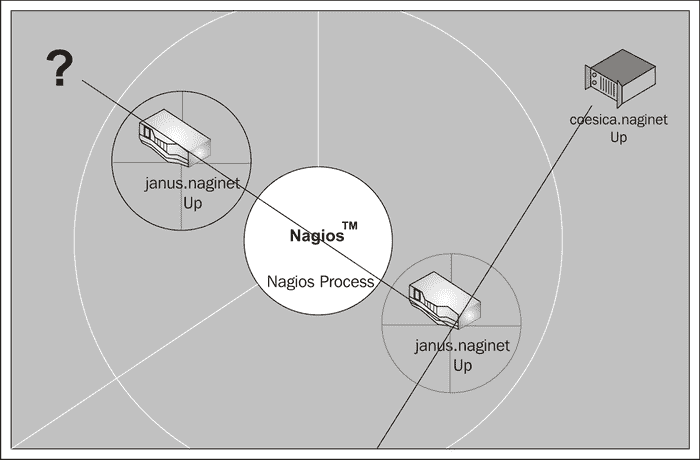

**主机** 列表还应包括图像的缩小版：

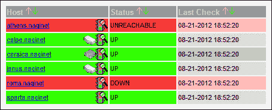

## 它是如何工作的...

当生成主机列表、服务列表或网络状态图时，它会检查每个主机对象中是否存在 `icon_image` 或 `statusmap_image` 值，如果定义了，则读取相应的图像，并将其作为处理的一部分。网络状态图默认仅在缺少 `statusmap_image` 指令的值时显示问号。

请注意，对于 `statusmap_image` 指令，我们选择了图标的 `.gd2` 版本，而不是 `.gif` 版本。这是出于性能考虑；状态图是通过 GD2 库生成的，它能够更高效地处理本地的 `.gd2` 格式。

`icon_image_alt` 指令定义了在 `` HTML 标签中显示图像时 `alt` 属性的值。大多数浏览器在鼠标悬停在图标上时会简要显示该标签的内容。

Nagios Core 3.0 允许你将这些指令放在一个单独的 `hostextinfo` 对象中，但该对象类型在 Nagios Core 4.0 中已被正式弃用，因此建议避免使用它。

## 还有更多

如果你有多个主机需要共享相同的镜像，最佳做法是从一个公共的主机模板继承，并设置适当的指令。对于我们的示例，我们可以定义一个模板如下：

```
define host {
    name             router-icon
    icon_image       router.gif
    icon_image_alt   Router
    statusmap_image  router.gd2
    register         0
}
```

然后，我们可以通过从该模板继承并将其添加到`use`指令中，直接应用图像设置到我们的两个路由器：

```
define host {
 use        linux-router,router-icon
    host_name  janus.naginet
    alias      janus
    address    10.128.0.128
}
define host {
 use        linux-router,router-icon
    host_name  calpe.naginet
    alias      calpe
    address    10.128.0.129
}
```

如果你不喜欢附带的图标集，可以在 Nagios Exchange 网站上找到许多图标集，[`exchange.nagios.org/`](http://exchange.nagios.org/)。如果你愿意，你甚至可以使用物理硬件的图片制作自己的图标，保存为标准的 PNG 或 GD2 格式。

## 另见

+   本章中的*使用网络地图*和*指定网络地图上主机的坐标*食谱

# 建立主机依赖关系

在这个食谱中，我们将学习如何在两个主机之间建立主机依赖关系。这个功能可以用来控制 Nagios Core 如何检查主机，并在某些情况下，如果一个主机处于`DOWN`状态，意味着至少有一个其他主机也必定处于`DOWN`状态时通知我们出现问题。

## 准备工作

首先，非常重要的一点是，值得注意的是，这与主机处于`UNREACHABLE`状态并不完全相同，`parents`指令正是为此目的而设计的，正如本章中的*创建网络主机层次结构*食谱所讨论的那样。大多数情况下，主机处于`DOWN`状态并不意味着其他主机会因此处于`DOWN`状态。通常，子主机会处于`UNREACHABLE`状态；它可能正常工作，但由于路径中的`DOWN`主机，Nagios Core 无法检查它。

然而，有一个特别广泛的领域，主机依赖关系肯定是有用的：虚拟机的主机/客户机关系。如果你同时监控一台物理主机和一台或多台客户机虚拟机，那么这些虚拟机肯定依赖于主机；如果主机机器处于`DOWN`状态且没有冗余故障切换，那么这意味着客户机也处于`DOWN`状态，而不仅仅是`UNREACHABLE`。

我们将以**虚拟化**为例，在主机`ephesus.naginet`上运行两台虚拟机`zeus.naginet`和`athena.naginet`。这三台机器已经在监控中，但我们将建立主机依赖关系，这样如果 Nagios Core 判断主机处于`DOWN`状态，它就不会通知任何人关于虚拟机的状态。

你需要一个 Nagios Core 3.0 或更新版本的服务器，并具有更改其后端配置的 Shell 访问权限。

## 如何操作...

我们可以按照以下方式建立主机依赖关系：

1.  切换到 Nagios Core 的`objects`配置目录。默认路径是`/usr/local/nagios/etc/objects`。如果你将主机定义放在其他文件中，则请转到该文件所在的目录。

    ```
    # cd /usr/local/nagios/etc/objects

    ```

1.  创建或编辑一个适当的文件，该文件将被配置文件`/usr/local/nagios/etc/nagios.cfg`包含。一个合理的选择是`/usr/local/nagios/etc/objects/dependencies.cfg`：

    ```
    # vi dependencies.cfg

    ```

1.  添加一个`hostdependency`定义。在我们的例子中，定义类似于以下代码片段。请注意，你可以通过用逗号分隔主机名来包含多个依赖主机：

    ```
    define hostdependency {
        host_name                      ephesus.naginet
        dependent_host_name            zeus.naginet,athena.naginet
        execution_failure_criteria     n
        notification_failure_criteria  d,u
    }
    ```

1.  验证配置并重启 Nagios Core 服务器：

    ```
    # /usr/local/nagios/bin/nagios -v /usr/local/nagios/etc/nagios.cfg
    # /etc/init.d/nagios restart

    ```

完成这一设置后，如果`ephesus.naginet`主机宕机并使`zeus.naginet`和`athena.naginet`主机也一同宕机，那么对这三台主机的检查将继续进行，但对两台依赖主机的通知将被抑制。

## 它是如何工作的...

主机依赖对象的四个指令如下：

+   `host_name`：这是至少有其他一个主机依赖于它的主机名称。我们将其称为依赖主机。这个名称也可以是以逗号分隔的主机名称列表。

+   `dependent_host_name`：这是依赖主机的名称。同样，这也可以是以逗号分隔的列表。

+   `execution_failure_criteria`：定义依赖主机的状态列表。如果该主机处于这些状态中的任何一个，Nagios Core 将跳过对依赖主机的检查。这可以是以下任何标志的逗号分隔列表：

    +   `o`：依赖主机是`开启`

    +   `d`：依赖主机是`关闭`

    +   `u`：依赖主机是`无法访问`。

    +   `p`：依赖主机是`待定`（尚未检查）

    另外，也可以使用单一标志`n`（如本例中所示），指定无论依赖主机的状态如何，都应进行检查。

+   `notification_failure_criteria`：定义依赖主机的状态列表。如果该主机处于这些状态中的任何一个，那么将不会发送对依赖主机的通知。标志与`execution_failure_criteria`相同；在本例中，我们选择如果依赖主机处于`关闭`或`无法访问`状态时抑制通知。

当 Nagios Core 发现`zeus.naginet`或`athena.naginet`主机因主机检查失败而显得`关闭`时，它会参考其配置检查该主机是否有依赖项，发现它们依赖于`ephesus.naginet`。

它接着检查`ephesus.naginet`的状态，发现它是`关闭`状态。参考`execution_failure_criteria`指令并找到`n`，它继续对两个依赖主机执行检查，状态为`正常`。但是，参考`notification_failure_criteria`指令并找到`d,u`，它决定在主机恢复到`开启`状态之前抑制通知。

## 还有更多...

我们可以使用`hostgroup_name`和`dependent_hostgroup_name`指令指定主机组，而不是主机名称来处理依赖关系：

```
define hostdependency {
 hostgroup_name                 vm-hosts
 dependent_hostgroup_name       vm-guests
    execution_failure_criteria     n
    notification_failure_criteria  d,u
}
```

我们还可以提供以逗号分隔的依赖主机列表：

```
define hostdependency {
 host_name            ephesus.naginet,alexandria.naginet
    dependent_host_name  zeus.naginet,athena.naginet    
    execution_failure_criteria     n
    notification_failure_criteria  d,u
}
```

如果一个主机依赖于多个主机，则只有当其任何一个依赖项没有满足时，检查或通知规则才会生效，而不是所有依赖项都未满足时。以之前的例子为例，这意味着如果`ephesus.naginet`处于`关闭`状态，而`alexandria.naginet`处于`开启`状态，那么依赖关系仍然会抑制所有依赖主机的检查或通知。

这意味着在冗余场景中，主机依赖关系并不真正适用，因为丢失一个被依赖的主机并不意味着丢失其所有依赖的主机。你可能会发现将节点作为集群进行监控更适合这种情况；这在本章的*作为集群监控单独节点*食谱中有讨论。

## 另请参见

+   本章中的*建立服务依赖关系*、*创建网络主机层次结构*和*作为集群监控单独节点*食谱

# 建立服务依赖关系

在本教程中，我们将学习如何在两个服务之间建立服务依赖关系。这个功能可以用来控制 Nagios Core 如何检查服务，并在一种服务处于`PROBLEM`状态时通知我们，意味着至少另一个服务也必然处于`PROBLEM`状态。

## 准备就绪

你需要一台 Nagios Core 3.0 或更新版本的服务器，并具有 shell 访问权限以更改其后端配置。你还需要至少定义两个服务，其中一个服务依赖于另一个；这意味着如果被依赖的服务进入`CRITICAL`状态，那么它将意味着被依赖的服务也会是`CRITICAL`。

我们将使用一个简单的示例：假设我们正在测试对邮件服务器`marathon.naginet`的身份验证，服务为`MAIL_LOGIN`，同时在同一主机上检查一个数据库服务`MAIL_DB`，它存储登录用户名和密码哈希值。

在这种情况下，如果`MAIL_DB`无法正常工作，`MAIL_LOGIN`几乎肯定也无法正常工作。如果是这样，我们可以配置 Nagios Core，使其知道`MAIL_LOGIN`服务依赖于`MAIL_DB`服务。

## 如何操作...

我们可以如下建立服务依赖关系：

1.  切换到 Nagios Core 的`objects`配置目录。默认路径是`/usr/local/nagios/etc/objects`。如果你将主机定义放在了其他文件中，请转到该目录。

    ```
    # cd /usr/local/nagios/etc/objects

    ```

1.  创建或编辑一个适当的文件，该文件将被`/usr/local/nagios/etc/nagios.cfg`中的配置包含。一个合理的选择可能是`/usr/local/nagios/etc/objects/dependencies.cfg`：

    ```
    # vi dependencies.cfg

    ```

1.  添加一个`servicedependency`定义。在我们的例子中，定义类似于以下代码片段：

    ```
    define servicedependency {
        host_name                      marathon.naginet
        service_description            MAIL_DB
        dependent_host_name            marathon.naginet
    	dependent_service_description  MAIL_LOGIN
        execution_failure_criteria     c
        notification_failure_criteria  c
    }
    ```

1.  验证配置并重启 Nagios Core 服务器：

    ```
    # /usr/local/nagios/bin/nagios -v /usr/local/nagios/etc/nagios.cfg
    # /etc/init.d/nagios restart

    ```

完成此设置后，如果`MAIL_DB`服务因任何原因失败并进入`CRITICAL`状态，`MAIL_LOGIN`服务将跳过对该服务的检查，也会跳过它通常会发送的任何关于其自身问题的通知（如果有的话）。请注意，Web 界面可能仍显示 Nagios Core 正在调度检查，但实际上不会执行这些检查。

## 它是如何工作的...

服务依赖对象的五个指令如下：

+   `host_name`：这是与这些服务关联的主机名称。我们将其称为依赖主机。

+   `service_description`：这是被依赖服务的描述，可以是逗号分隔的列表。我们将其称为依赖服务。

+   `dependent_service_description`：这是依赖服务的描述，也可以是逗号分隔的列表。

+   `execution_failure_criteria`：定义了依赖服务的状态列表。如果该服务处于这些状态之一，Nagios Core 将跳过对依赖服务的检查。它可以是逗号分隔的以下标志的列表：

+   `o`：依赖服务处于 `OK` 状态

    +   `w`：依赖服务处于 `WARNING` 状态

    +   `c`：依赖服务处于 `CRITICAL` 状态（如本示例所示）

    +   `u`：依赖服务处于 `UNKNOWN` 状态

    +   `p`：依赖服务处于 `PENDING` 状态（尚未检查）

    另外，可以使用单个标志 `n` 来指定无论依赖服务的状态如何，都应进行检查。在本示例中，我们选择了 `c` 值，仅在依赖服务处于 `CRITICAL` 状态时才抑制服务检查。

+   `notification_failure_criteria`：定义了依赖服务的状态列表。如果该服务处于这些状态之一，则不会发送有关依赖服务的通知。标志与 `execution_failure_criteria` 相同；在本示例中，我们再次选择了 `c` 值，仅当依赖服务处于 `CRITICAL` 状态时才抑制通知。

当 Nagios Core 检测到 `MAIL_DB` 服务因服务检查失败而进入 `CRITICAL` 状态时，它会查阅其配置，检查该服务是否有任何依赖关系，并发现它依赖于 `MAIL_LOGIN` 服务。

然后它检查 `MAIL_DB` 的状态，发现其处于 `CRITICAL` 状态。查阅 `execution_failure_criteria` 指令并发现 `c`，它会阻止对两个依赖服务的检查。查阅 `notification_failure_criteria` 指令并发现 `c`，它也决定在服务恢复到其他状态之前抑制通知。

## 还有更多内容...

请注意，服务不需要在同一主机上才能相互依赖。我们可以添加 `dependent_host_name` 或 `dependent_hostgroup_name` 指令来指定其他主机：

```
define servicedependency {
 host_name                      marathon.naginet
    service_description            MAIL_DB
 dependent_host_name            sparta.naginet
    dependent_service_description  WEBMAIL_LOGIN
    execution_failure_criteria     c
    notification_failure_criteria  c
}
```

在此示例中，`sparta.naginet` 上的 `WEBMAIL_LOGIN` 服务被定义为依赖于 `marathon.naginet` 上的 `MAIL_DB` 服务。请注意，`host_name` 和 `dependent_host_name` 的值是不同的。

在 Nagios Core 3.3.1 之前的版本中，即使 `dependent_host_name` 和 `host_name` 相同，依然需要定义 `dependent_host_name` 指令。

## 另见

+   本章中的*建立主机依赖关系*和*将单独的节点作为集群进行监控*的示例

# 监控集群中的单独节点

在这个示例中，我们将学习如何使用标准 Nagios 插件中的`check_cluster`插件监控集群中的主机。能够集体监控多个主机在冗余环境下非常有用；如果某一台主机处于`DOWN`状态，可能是为了节省能源或进行维护，这不一定需要通知。然而，如果更多的主机或所有主机都宕机，我们就确实需要被通知。使用`check_cluster`可以实现这一点。

## 准备工作

你需要一个 Nagios Core 3.0 或更新版本的服务器，并且需要有 Shell 访问权限以更改其后端配置。你还需要至少有两个被监控的主机，并且它们在冗余设置中执行某些功能，比如数据库复制、DNS 服务器或负载均衡的 Web 服务器。

你还应熟悉如何定义主机和服务，特别是如何定义命令；这些概念在第一章，*理解主机、服务和联系人*中有讨论。

在这个示例中，我们将使用三台刀片服务器，它们的主机名分别是`achilles.naginet`、`odysseus.naginet`和`agamemnon.naginet`，这些服务器在冗余集群中运行，以支持虚拟主机环境。所有三台主机已经在监控中，如果其中一台发生故障，将发送电子邮件通知。我们将安排一个`check_cluster`服务在“虚拟主机”上，以便：

+   如果没有刀片服务器宕机，服务为`OK`。

+   如果其中一台刀片服务器宕机，服务进入`WARNING`状态，并再次适当通知我们。

+   如果两台或三台刀片服务器都宕机，服务进入`CRITICAL`状态，再次适当通知我们。

## 如何操作……

我们可以按照如下方式为我们的主机安排集群检查：

1.  切换到 Nagios Core 的`objects`配置目录。默认路径是`/usr/local/nagios/etc/objects`。如果你将主机定义放在了其他文件中，则切换到该文件所在的目录。

    ```
    # cd /usr/local/nagios/etc/objects

    ```

1.  创建或编辑一个适当的文件来定义新命令。一个合理的选择可能是`/usr/local/nagios/etc/objects/commands.cfg`。

1.  在此文件中定义两个新命令，`check_dummy`和`check_host_cluster`：

    ```
    define command {
        command_name  check_dummy
        command_line  $USER1$/check_dummy $ARG1$ $ARG2$
    }
    define command {
        command_name  check_host_cluster
        command_line  $USER1$/check_cluster -h -d $ARG1$ -w $ARG2$ -c $ARG3$
    }
    ```

1.  创建或编辑一个适当的文件，该文件将被`/usr/local/nagios/etc/nagios.cfg`配置文件包含。一个合理的选择可能是`/usr/local/nagios/etc/objects/clusters.cfg`。

1.  为集群定义一个虚拟主机，使用以下值：

    ```
    define host {
        use                 generic-host
        host_name           naginet-blade-cluster
        alias               Naginet Blade Cluster
        address             127.0.0.1
        max_check_attempts  1
        contact_groups      admins
        check_command       check_dummy!0!"Dummy host only"
    }
    ```

    请注意，`address`指令的值为`127.0.0.1`；这是故意设置的，因为虚拟主机本身并不需要被主动检查或发送任何通知。

1.  为虚拟主机添加一个服务：

    ```
    define service {
        use                   generic-service
        host_name             naginet-blade-cluster
        service_description   CLUSTER
     check_command         check_host_cluster!$HOSTSTATEID:achilles.naginet$,$HOSTSTATEID:odysseus.naginet$,$HOSTSTATEID:agamemnon.naginet$!@1:!@2:
        notification_options  c,w,r
    }
    ```

    从`generic-service`继承的建议仅仅是一个示例；你可能希望使用自己的模板或值。请注意，`check_command`的值是单行的，并且没有空格。你应该替换为你自己机器的主机名。

1.  验证配置并重启 Nagios Core 服务器：

    ```
    # /usr/local/nagios/bin/nagios -v /usr/local/nagios/etc/nagios.cfg
    # /etc/init.d/nagios restart

    ```

完成后，`naginet-blade-cluster`虚拟主机上的`CLUSTER`服务应该可以查看。如果集群中的主机上线或宕机，它将像任何其他服务一样更改状态并发送通知：

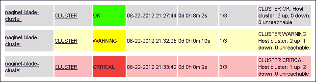

## 它是如何工作的…

本配方中添加的主机仅仅是`CLUSTER`服务的一个“钩子”，实际的检查由该服务执行。这就是为什么我们使用一个通过`check_dummy`插件返回`OK`状态的命令：

```
# /usr/local/nagios/libexec/check_dummy 0 "Dummy host only"
OK: Dummy host only

```

`check_cluster`命令实际上非常简单。它不会执行实际的检查。相反，它基于其他主机或服务的当前状态来确定状态。

这就是为什么在服务的`check_command`指令中使用`$HOSTSTATEID:hostname$`宏；它会计算出一个数字，表示主机的状态，并在冒号后指定主机名。

例如，如果`achilles.naginet`和`odysseus.naginet`处于`UP`状态，但`agamemnon.naginet`处于`DOWN`状态，那么 Nagios Core 运行的检查命令在宏展开后将类似于以下代码片段：

```
/usr/local/nagios/libexec/check_cluster -h -d 0,0,1 -w @1: -c @2:

```

我们可以作为`nagios`用户自己运行此命令以检查输出：

```
# sudo -s -u nagios
$ /usr/local/nagios/libexec/check_cluster -h -d 0,0,1 -w @1: -c @2:
CLUSTER WARNING: Service cluster: 2 ok, 1 warning, 0 unknown, 0 critical

```

在插件的`-d`选项中给出的以逗号分隔的状态对应于两个主机处于`UP`状态（状态 ID 为`0`），一个主机处于`DOWN`状态（状态 ID 为`1`）。`-w`选项的值`@1:`意味着如果一个或多个主机处于宕机状态，则会进入`WARNING`状态。同样，`-c`选项的值`@2:`意味着如果两个或更多主机宕机，则会进入`CRITICAL`状态。

这使您可以根据`DOWN`状态的主机数量自定义通知，而不仅仅是单独监控各个主机。一旦您确信此配置正常工作，您甚至可以选择阻止单个主机向您的寻呼机发送通知，而让`CLUSTER`服务来代替。

## 还有更多…

如果您需要监控的是一组服务而非主机，可以通过使用`check_cluster`的`-s`选项来完成，而不是使用`-h`选项。在这种情况下，您将使用`$SERVICESTATEID:<host_name>:<service_description>$`宏，而不是`$HOSTSTATEID:<host_name>$`宏。一个示例配置可能看起来像以下代码片段，适用于一个由两台 Web 服务器`sparta.naginet`和`athens.naginet`组成的集群，并给一个名为`naginet-http-cluster`的虚拟主机：

```
define command {
    command_name  check_service_cluster
 command_line  $USER1$/check_cluster -s -d $ARG1$ -w $ARG2$ -c $ARG3$
} 
define service {
    use                  generic-service
	host_name            naginet-http-cluster
	service_description  CLUSTER_HTTP
 check_command       check_service_cluster!$SERVICESTATEID:sparta.naginet:HTTP$,$SERVICESTATEID:athens.naginet:HTTP$!@1:!@2:
}
```

## 另见

+   本章中的*建立主机依赖关系*配方

# 使用网络地图作为覆盖层

在本配方中，我们将学习如何使用网络地图的背景，并故意将主机放置在地图的特定位置，制作一种网络状态天气图，以便在地理上下文中一目了然地查看主机状态。

## 准备开始

你需要一个 Nagios Core 3.0 或更高版本的服务器，并且需要有 shell 访问权限以更改其后端配置。你还应该至少配置几个主机用于在地图上显示，并了解如何使用 Nagios 网络地图和主机图标。这些内容在本章的 *使用网络地图* 和 *为主机选择图标* 章节中有讨论。

你还应该选择一个背景图像，在其上可以有意义地放置主机。如果你正在监控一个办公室网络，背景图像可以是建筑物或服务器机房的平面图。如果你在监控一个全国性的互联网服务提供商，则可以使用你所在州或国家的地图。有些管理员甚至喜欢使用物理设备的照片，并将 Nagios Core 主机放置在它们的物理类比上。在本示例中，我们将使用一张澳大利亚地图，大小为 640 x 509 像素，这是一张来自[自然地球网站](http://www.naturalearthdata.com/)的公共领域图像：


背景图像可以是任何你喜欢的内容，并且可以使用包括 PNG 在内的多种图形格式。然而，为了快速渲染地图，建议使用 GD2 文件格式的图像，扩展名为 .`gd2`。如果你拥有 PNG 格式的图像，可以使用免费的工具`pngtogd2`将其转换为 GD2 图像：

```
$ pngtogd2 australia.png australia.gd2 0 1

```

该工具可以在基于 Debian 的系统上通过 `libgd-tools` 软件包获得。其源代码也可以在 [`www.libgd.org/`](http://www.libgd.org/) 在线访问。

## 如何操作...

我们可以按如下方式设置网络地图的背景：

1.  将你的 GD2 格式图像复制到 `physical_html_path` 目录下的 `images` 子目录中。在默认安装中，该目录为 `/usr/local/nagios/share/images`；如果有所不同，你可以在 `/usr/local/nagios/etc/cgi.cfg` 中找到 `physical_html_path` 的定义。

    ```
    # cp /home/tom/australia.gd2 /usr/local/nagios/share/images

    ```

1.  切换到 Nagios Core 的配置目录。在默认安装中，该目录为 `/usr/local/nagios/etc`。编辑文件 `cgi.cfg`。

    ```
    # cd /usr/local/nagios/etc
    # vi cgi.cfg

    ```

1.  在此文件中查找指令`statusmap_background_image`。取消注释并将其值设置为你的图像名称：

    ```
    statusmap_background_image=australia.gd2
    ```

1.  在同一文件中查找指令`default_statusmap_layout`。将其更改为`0`，对应于**用户自定义坐标**布局。

    ```
    default_statusmap_layout=0
    ```

1.  切换到 Nagios Core 的 `objects` 配置目录。在默认安装中，该目录为`/usr/local/nagios/etc/objects`。向你希望在地图上显示的每个主机添加`2d_coords`指令。你可能还希望在此处包括`statusmap_image`的定义，方法如下：

    ```
    # vi australia.cfg
    define host {
        use              linux-server
        host_name        adelaide.naginet
    	address          10.128.0.140
        2d_coords        390,360
     statusmap_image  rack-server.gd2
    }
    define host {
        use              linux-server
        host_name        cairns.naginet
        address          10.128.0.141
        2d_coords        495,100
     statusmap_image  rack-server.gd2
    }
    ... etc ...
    ```

1.  对于指令`2d_coords`，提供两个逗号分隔的值，描述主机放置的坐标。例如，`adelaide.naginet`距离左侧 390 像素，距离顶部 360 像素。获取坐标的便捷方法是使用 GIMP，这是一个开源的图像工具，或者甚至可以使用简单的工具如 MS Paint；加载图像并悬停在希望使用的点上，以查找其像素坐标。

1.  验证配置并重新启动 Nagios Core 服务器：

    ```
    # /usr/local/nagios/bin/nagios -v /usr/local/nagios/etc/nagios.cfg
    # /etc/init.d/nagios restart

    ```

完成这些步骤后，通过在 Nagios Core Web 界面左侧菜单上点击**地图**，访问网络地图，您的主机将放置在其相应的位置上，包括用于指定子父关系和可达性的正常线条和颜色：

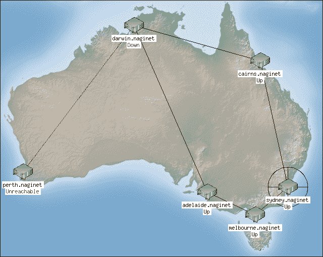

## 工作原理...

指令`default_statusmap_layout`默认将网络地图固定为**用户提供的坐标**模式。在此模式下，仅显示具有`2d_coords`值的主机，并且它们显示在地图上的固定点，而不是动态放置。

如果需要，我们可以在没有背景的情况下使用此显示模式，但是通过使用实际背景图像，我们可以为生成的网络图片提供大量有用的背景信息。

请注意，如果没有定义坐标的主机，您将收到类似以下截图的错误：


## 还有更多...

在带有图像背景的网络地图中，可以特别帮助快速查看单个主机的状态，但是在多个主机故障的情况下，还可以寻找可能的地理原因。如果城市或国家的某一部分的所有节点同时宕机，我们可以一目了然地看到这一点。这使得网络地图成为网络监控显示的绝佳选择，或者在诊断大规模问题时的首选。

以这种方式，网络地图非常有用，从图形上讲，它可能是 Nagios Core Web 界面中最令人印象深刻的部分。如果您希望获得更多选项和更广泛的主机状态可视化，您可能希望考虑查看出色的**NagVis**扩展，它本身可能填写整本书。在第十一章的*使用 NagVis 获得额外的可视化*食谱中简要介绍了其用法。

## 另见

+   本章节中的*创建网络主机层次结构*、*使用网络地图*和*为主机选择图标*食谱

+   第十一章的*使用 NagVis 获得额外的可视化*食谱，*自动化和扩展 Nagios*
