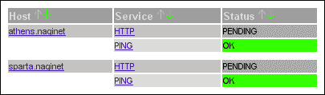
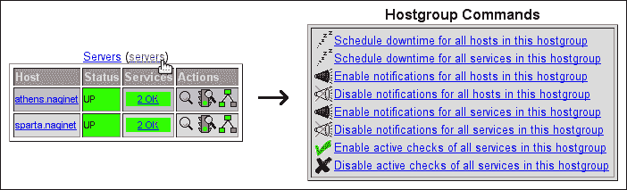
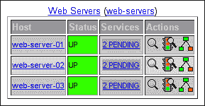
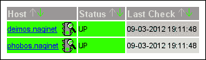

# 第九章 配置管理

本章中，我们将覆盖以下配方：

+   将配置文件分组到目录中

+   保持配置在版本控制下

+   使用组配置主机角色

+   使用正则表达式构建组

+   使用继承简化配置

+   在资源文件中定义宏

+   动态构建主机定义

# 介绍

Nagios Core 配置灵活性的一个主要缺点是，如果没有适当的管理，配置很容易膨胀成成百上千个文件，包含数千个对象，且所有对象之间的依赖关系不明确。当尝试对配置进行重大更改时，或者即使只是像删除主机这样简单的操作时，这种情况会令人沮丧，因为你需要筛选出依赖关系，找出导致配置错误并阻止你重新启动 Nagios Core 的原因。

因此，仔细构建配置非常重要，尽可能多地使用抽象，以便能够轻松地添加、更改和删除主机和服务定义，并避免配置的重复。Nagios Core 提供了几种方法来处理此问题，最显著的就是明智地使用组和模板来管理基本对象。还应避免重复网络特定的和易变的数据，例如密码；最好的做法是使用在资源文件中定义的自定义宏来处理。

本章的配方将展示一些大规模网络配置的最佳实践。最重要的配方是前两个，*将配置文件分组到目录中*和*使用组配置主机角色*。如果你希望理顺并重构一个杂乱的配置，那么这两个配方是最好的起点。

本章的最后一个配方，*动态构建主机定义*，将展示整洁配置的主要优势之一，即能够根据保存在其他外部信息源中的主机和服务列表，轻松生成配置，如**配置管理数据库**（**CMDB**）。

# 将配置文件分组到目录中

在这个配方中，我们将学习如何将配置文件分组到目录中，以极大地简化配置的管理。我们将通过配置 Nagios Core 加载给定目录中所有以`.cfg`扩展名结尾的文件，包括递归遍历子目录来实现。最终结果是，要让 Nagios Core 加载一个文件，我们只需要在该目录中包含它，并使用适当的扩展名；我们不需要在`nagios.cfg`中精确指定加载了哪些文件。

## 准备工作

你需要一台运行 Nagios Core 3.0 或更高版本的服务器，并且需要有命令行权限来修改其配置。你应该熟悉使用`cfg_file`指令在`/usr/local/nagios/etc/nagios.cfg`中加载单独的配置文件。

特别是，你应该准备一个目录，包含你希望被 Nagios Core 加载的所有配置文件。在这个例子中，我们将准备一个名为`/usr/local/nagios/etc/naginet`的新目录，它将包含三个配置文件，每个文件定义一个主机的信息：

```
# ls -1 /usr/local/nagios/etc/naginet
athens.cfg
ithaca.cfg
sparta.cfg

```

你需要确保目录、文件和其中的子目录对`nagios`用户是可读的（尽管不一定是该用户拥有的）。

## 如何执行...

我们可以按以下方式安排 Nagios Core 包含目录中的所有文件：

1.  切换到包含`nagios.cfg`文件的目录。在默认安装中，它位于`/usr/local/nagios/etc/nagios.cfg`。

    ```
    # vi nagios.cfg

    ```

1.  编辑文件，并在任何其他`cfg_file`或`cfg_dir`指令下面，添加以下一行，指向包含`.cfg`文件的目录的绝对路径：

    ```
    cfg_dir=/usr/local/nagios/etc/naginet
    ```

    请注意，此指令是`cfg_dir`，而不是`cfg_file`。

1.  删除指向新目录中`.cfg`文件的任何`cfg_file`定义。这样可以防止加载相同的对象两次。在我们的例子中，我们需要注释掉之前加载这些文件的规则：

    ```
    #cfg_file=/usr/local/nagios/etc/naginet/sparta.cfg
    #cfg_file=/usr/local/nagios/etc/naginet/athens.cfg
    #cfg_file=/usr/local/nagios/etc/naginet/ithaca.cfg

    ```

1.  验证配置并重启 Nagios Core 服务器：

    ```
    # /usr/local/nagios/bin/nagios -v /usr/local/nagios/etc/nagios.cfg
    # /etc/init.d/nagios restart

    ```

完成此操作后，Nagios Core 应该已加载`naginet`目录或其任何子目录中找到的所有`.cfg`扩展名的文件，从而省去我们单独指定它们的麻烦。

## 它是如何工作的...

在加载时，Nagios Core 解释`cfg_dir`指令的意思是它应该识别特定目录中所有的`.cfg`文件，包括递归遍历其子目录。它会忽略没有该扩展名的文件，允许我们包括元数据或其他文件类型（例如版本控制信息目录），而不会引起问题。

结果是，定义一个新主机或服务变得像将文件添加到合适的包含目录一样简单，无需编辑`nagios.cfg`。

## 还有更多...

需要注意的是，此指令也会包含子目录中的所有`.cfg`文件。这可能允许我们对配置文件进行有意义的分组：

```
$ find /usr/local/nagios/etc/naginet
/usr/local/nagios/etc/naginet
/usr/local/nagios/etc/naginet/hosts
/usr/local/nagios/etc/naginet/hosts/athens.cfg
/usr/local/nagios/etc/naginet/hosts/sparta.cfg
/usr/local/nagios/etc/naginet/hosts/ithaca.cfg
/usr/local/nagios/etc/naginet/commands
/usr/local/nagios/etc/naginet/commands/webserver-checks.cfg
/usr/local/nagios/etc/naginet/services
/usr/local/nagios/etc/naginet/services/webservers.cfg

```

对于大型网络，值得为目录决定一个合适的组织原则。一种常见的方法是为主机、服务和命令定义分别创建独立的目录，这些目录与特定的**域名系统**（**DNS**）区域或较大子网相关。

如果你想防止某个文件在任何时候被包含，你只需要将其移出目录，或者将其重命名，使其不再具有`.cfg`扩展名。一个可能的做法是添加后缀`.exclude`：

```
# mv unwanted-file.cfg unwanted-file.cfg.exclude

```

这将防止 Nagios Core 将其作为`cfg_dir`搜索算法的一部分加载。

## 另见

+   本章中的*使用继承简化配置*和*将配置保留在版本控制下*的实例

# 将配置保留在版本控制下

在本教程中，我们将把 Nagios Core 配置目录置于版本控制之下，目的是跟踪对其所做的更改，并使我们能够在出现问题时撤销更改。

## 准备工作

你应该选择一个合适的版本控制系统。根据你选择的系统，具体步骤会有所不同；这里无法演示所有的选项，因此我们将使用流行的开源内容管理工具**Git**，它非常适合进行这种类型的版本控制，并且不需要外部服务器。不过，如果你更喜欢使用**Subversion**或**Mercurial**也是完全可以的。你需要在服务器上安装所选系统的客户端（如`git`、`hg`、`svn`等）。

这将适用于任何版本的 Nagios Core。它不涉及直接更改任何 Nagios Core 配置的部分，仅仅是跟踪其中的文件。

## 如何操作...

我们可以按如下方式将配置目录放入版本控制：

1.  切换到配置目录的根目录。在默认安装中，该目录为`/usr/local/nagios/etc`：

    ```
    # cd /usr/local/nagios/etc

    ```

1.  运行`git init`以在当前目录中初始化一个仓库：

    ```
    # git init
    Initialized empty Git repository in /usr/local/nagios/etc/.git/.

    ```

1.  使用`git add`将配置目录中的所有文件添加到版本控制中：

    ```
    # git add .

    ```

1.  使用`git commit`提交文件：

    ```
    # git commit -m "First commit of configuration"
    [master (root-commit) 6a2c605] First commit of configuration.
     39 files changed, 3339 insertions(+), 0 deletions(-)
     create mode 100644 naginet/athens.naginet.cfg
     create mode 100644 naginet/ithaca.naginet.cfg
     create mode 100644 naginet/sparta.naginet.cfg
     ...

    ```

完成后，我们应该在`/usr/local/nagios/etc`下拥有一个`.git`仓库，跟踪所有对配置文件的更改。

## 它是如何工作的...

现在可以使用`git status`查看对该目录中配置文件的更改。例如，如果我们更改了其中一个主机的 IP 地址，我们可以通过输入以下命令来检查更改：

```
# git status -s
M naginet/hosts/sparta.cfg

```

然后我们可以提交这个更改并附上说明信息：

```
# git commit -am "Changed IP address of host"
[master d5116a6] Changed IP address of host
1 files changed, 1 insertions(+), 1 deletions(-)

```

我们可以使用`git log`查看更改记录：

```
# git log --oneline
d5116a6 Changed IP address of host
6a2c605 First commit of configuration

```

如果我们稍后想检查到底做了哪些更改，可以使用`git diff`，后跟前一输出中的第一列短提交 ID：

```
# git diff 6a2c605
diff --git a/naginet/hosts/sparta.cfg b/naginet/hosts/sparta.cfg
index 0bb3b0b..fb7c2a9 100644
--- a/naginet/hosts/sparta.cfg
+++ b/naginet/hosts/sparta.cfg
@@ -2,7 +2,7 @@ define host {
 use                 linux-server
 host_name           sparta.naginet
 alias               sparta
-    address             10.128.0.101
+    address             10.128.0.102
}

```

Git 的完整功能，包括回退到旧版本，并不在本教程的范围内。你可以通过 Scott Chacon 的精彩著作《*Pro Git*》了解更多关于如何使用 Git 的内容，该书可以在[`git-scm.com/book`](http://git-scm.com/book)免费在线阅读。

## 还有更多...

版本控制在多人编辑配置时特别有用，因为它能帮助我们确定是谁在什么时候做了更改。它还允许我们查看确切的变更集，审查为什么会做出这些更改，并在发生问题时撤销或修改这些更改。

如果你打算使用此方法，最好保持配置的适当粒度，使用多个文件而不是仅使用一两个文件。即使你只有两个大文件，如`hosts.cfg`和`services.cfg`，它也能正常工作，但每次提交之间的差异就不那么清晰了。因此，这是一个与本章中的*将配置文件分组到目录中*教程结合使用的非常好的做法。

与其仅仅将配置目录纳入版本控制，你可能更愿意将整个 Nagios Core 目录都纳入版本控制，包括插件和其他脚本与二进制文件。如果你在安装中升级到新版本并希望查看文件中发生了哪些更改，以防止出现问题，这样做会特别有用。在这种情况下，请小心使用你所选择的版本控制系统的“忽略”功能，以防止跟踪临时文件或日志文件。对于 Git，可以查看`git help ignore`的输出。

## 另见

+   本章中的*将配置文件分组到目录中*教程

# 使用组配置主机角色

在本教程中，我们将学习如何利用主机和服务组的抽象化，以便构建一个配置，使得主机和服务能够更轻松地添加或移除。我们将通过使用主机组结构为主机定义角色，然后将相关服务分配给主机组，而不是单独分配给各个主机。

## 准备工作

你需要一台运行 Nagios Core 3.0 或更高版本的服务器，能够访问命令行以更改其目录，并理解主机和服务组的基本工作原理。这些内容可以在第一章中的*创建新主机组*和*创建新服务组*教程中找到。

在这个例子中，我们将创建两个简单的主机组：一个叫做`servers`，它的成员主机应进行`PING`检查，另一个叫做`webservers`，它的成员主机应进行`HTTP`检查。一旦完成设置，我们将向两个组中添加一个示例主机`sparta.naginet`，从而将所有适当的服务在一个定义中轻松分配给该主机，我们可以通过删除主机来干净地移除它。

## 如何做到这一点…

我们可以如下创建基于组的主机角色：

1.  切换到`objects`配置目录。在默认安装中，该目录为`/usr/local/nagios/etc/objects`。如果你已经按照本章中的*将配置文件分组到目录中*这一教程操作，那么你的目录可能会有所不同。

    ```
    # cd /usr/local/nagios/etc/objects

    ```

1.  在一个适当的文件中，也许是`hostgroups.cfg`，定义新主机组，名称应与主机的角色相对应。暂时不要为它们分配任何成员。

    ```
    define hostgroup {
        hostgroup_name  servers
        alias           Servers
    }
    define hostgroup {
        hostgroup_name  web-servers
        alias           Web Servers
    }
    ```

1.  在另一个适当的文件中，也许是`services.cfg`，定义新服务并为它们分配`hostgroup_name`值，值应与上一步骤中添加的主机组相对应：

    ```
    define service {
        use                  generic-service
     hostgroup_name       servers
        service_description  PING
        check_command        check_ping!100,10%!200,20%
    }
    define service {
        use                  generic-service
     hostgroup_name       web-servers
        service_description  HTTP
        check_command        check_http
    }
    ```

    请注意，`generic-service` 模板的使用仅是一个示例；你可能更希望从你自己特定的服务模板中继承。

1.  使用 `hostgroups` 指令，添加或编辑现有主机，使其成为适当主机组的一部分：

    ```
    define host {
        use         linux-server
        host_name   sparta.naginet
        alias       sparta
        address     10.128.0.21
     hostgroups  servers,web-servers
    }
    define host {
        use         linux-server
        host_name   athens.naginet
        alias       athens
        address     10.128.0.22
     hostgroups  servers,web-servers
    }
    ```

1.  如果你已经有与此配方中添加的服务相同的 `service_description` 指令的服务，你需要删除它们，因为这可能会与前一步添加的服务发生冲突。

1.  验证配置并重启 Nagios Core 服务器：

    ```
    # /usr/local/nagios/bin/nagios -v /usr/local/nagios/etc/nagios.cfg
    # /etc/init.d/nagios restart

    ```

完成这一步后，你应该会发现你为所创建的主机组定义的所有服务都已附加到相应的主机上：



## 它是如何工作的...

前面部分添加的配置避免了直接将服务分配给主机，而是将它们分配给主机组，从而为服务创建了角色，主机可以通过成为组的一部分或离开该组来采纳或丢弃这些角色。

除了使配置更简洁之外，这种方法的另一个优点是，如果以这种方式添加服务，添加或删除 Nagios Core 配置中的主机只需要添加或删除主机定义。类似地，如果主机承担了其他角色（例如，一个 web 服务器添加了数据库功能），我们只需通过修改其主机组来修改其检查的服务。这比在其他文件中添加依赖关系要容易得多。

另一个优点是，通过主机功能组织主机组有助于进行批量操作，比如在一个简单的操作中安排计划的停机时间，或者检查某种特定类型主机的所有服务。一旦定义了主机组，我们可以通过点击其名称，在任何主机组视图中对其中的所有主机执行操作：



例如，如果我们有二十台即将停机的 web 服务器，这比为每台服务器单独安排停机时间要容易得多！

## 还有更多内容...

值得注意的是，主机组可以有子组，这意味着添加到任何子组中的所有主机都会隐式地添加到父组中。

例如，我们可以使用 `hostgroup_members` 指令，将 web 服务器定义为 `servers` 主机组的子组：

```
define hostgroup {
    hostgroup_name     servers
    alias              Servers
 hostgroup_members  web-servers
}
```

这将允许我们隐式地将主机添加到两个组中，而无需引用父组，并且将所有分配给这两个组的服务也分配给主机：

```
define host {
    use         linux-server
    host_name   athens.naginet
    alias       athens
    address     10.128.0.22
 hostgroups  web-servers
}
```

这对于排序“子类别”服务非常有用。其他示例可能包括一个 `dns-servers` 组，带有子组 `dns-authoritative-servers` 和 `dns-recursive-servers`，或者一个 `database-servers` 组，带有子组 `oracle-servers` 和 `mysql-servers`。

## 另见

+   本章中的 *使用正则表达式构建组* 和 *利用继承简化配置* 配方

+   在第一章中的*创建新主机组*、*创建新服务组*和*在主机组中的所有主机上运行服务*的食谱中，*了解主机、服务和联系人*

# 使用正则表达式构建主机组

在本食谱中，我们将学习如何使用正则表达式快速构建主机组，通过与主机名进行匹配来实现。

如果你的主机采用了命名规范，允许根据位置、功能或其他有用的标准通过主机名中的公共字符串合理分组，那么这个食谱可能会对你有用。

## 准备工作

你需要有一台运行 Nagios Core 3.0 或更高版本的服务器，能够访问命令行以更改其配置，并理解主机组和服务组的基本原理。这些内容在第一章中的*创建新主机组*和*创建新服务组*食谱中有涉及。

在这个示例中，我们将把三个已有的主机`web-server-01`、`web-server-02`和`web-server-03`仅通过它们的主机名分组到一个新的主机组`web-servers`中。

对正则表达式有一定了解会有所帮助，但本食谱包括了一个简单的示例，应该能满足许多使用场景。关于正则表达式的一个优秀网站，包括教程，可以参考[`www.regular-expressions.info/`](http://www.regular-expressions.info/)。

## 如何操作...

我们可以通过将正则表达式与主机名匹配来构建主机组，如下所示：

1.  切换到 Nagios 配置目录。在默认安装中，该目录是`/usr/local/nagios/etc`。编辑该目录中的`nagios.cfg`文件。

    ```
    # cd /usr/local/nagios/etc
    # vi nagios.cfg

    ```

1.  搜索`use_regexp_matching`指令。如有必要，取消注释该指令并设置为`1`。

    ```
    use_regexp_matching=1
    ```

1.  搜索`use_true_regexp_matching`指令。如有必要，取消注释该指令，并确保它设置为`0`，默认情况下应该是这样。

    ```
    use_true_regexp_matching=0
    ```

1.  切换到`objects`配置目录。在默认安装中，该目录是`/usr/local/nagios/etc/objects`。如果你已经按照本章中的*将配置文件分组到目录中*的食谱操作过，则你的目录可能有所不同。

    ```
    # cd /usr/local/nagios/etc/objects

    ```

1.  在适当的文件中，可能是`hostgroups.cfg`，添加类似以下的定义。在此例中，`.+`表示“任何长度至少为一个字符的字符串”；你可能需要根据自己的主机名设计一个合适的模式。

    ```
    define hostgroup {
        hostgroup_name  web-servers
     members         web-server-.+
        alias           Web Servers
    }
    ```

1.  验证配置并重启 Nagios Core 服务器：

    ```
    # /usr/local/nagios/bin/nagios -v /usr/local/nagios/etc/nagios.cfg
    # /etc/init.d/nagios restart

    ```

完成此操作后，如果你的正则表达式正确匹配了所有适当的主机名，那么你应该发现这些主机已经成为该组的一部分：



## 工作原理...

当`use_regexp_matching`指令设置为`1`时，Nagios Core 将尝试将包含 `*`、`?`、`+` 或 `\.` 的主机名字符串作为正则表达式来匹配主机名。因为 `web-server-01`、`web-server-02` 和 `web-server-03` 都匹配在 `web-servers` 主机组的 `members` 指令中给出的正则表达式 `web-server-.+`，所以这三个主机都被添加到该组中。

我们将`use_true_regexp_matching`关闭。如果它开启，它将把每个主机名模式都当作正则表达式来匹配，不管其中是否包含特殊的正则表达式字符。对于大多数配置，这显然不是你想要的。

## 还有更多...

这种匹配不仅适用于主机组定义；例如，你也可以在服务的 `host_name` 定义中使用它：

```
define service {
    use                  generic-service
 host_name            web-server-.+
    service_description  HTTP
    check_command        check_http
}
```

这是 Nagios Core 手册中为简化对象定义提出的一些非常好的建议之一：[`nagios.sourceforge.net/docs/3_0/objecttricks.html`](http://nagios.sourceforge.net/docs/3_0/objecttricks.html)。

## 另请参见

+   本章中的*使用正则表达式构建组*和*利用继承简化配置*教程

+   第一章中的*创建新主机组*和*创建新服务组*教程，*理解主机、服务和联系人*

# 使用继承简化配置

在这个教程中，我们将学习如何使用继承来处理主机和服务共享大量相同值的情况，从而避免配置中的冗余。

一些 Nagios Core 对象，特别是主机和服务，有一个相当长的可能指令列表，这些指令的默认值并不总是合适的。因此，能够声明你想要的指令值，并通过从模板复制这些值，仅用几行代码定义实际主机，会使配置变得更加简洁、易读。

本书中的前面示例已经演示了如何通过继承 `linux-server` 主机模板或 `generic-service` 服务模板来简化配置，为了简洁起见；在这个例子中，我们将定义自己的模板，并展示如何使用这些模板来简化配置。

## 准备工作

你需要运行 Nagios Core 3.0 或更高版本的服务器，能够访问命令行来更改配置，并且熟悉如何定义主机和服务。这些内容在第一章的*创建新主机*和*创建新服务*教程中有介绍。

在这个示例中，我们将定义一个模板 `critical-host`，作为任何需要全天候检查和通知的主机的基础，设置一个非常严格的 `check_command` 指令，并启用所有通知类型。我们还将定义两个名为 `phobos.naginet` 和 `deimos.naginet` 的主机，它们继承自这个模板。

## 如何操作...

我们可以定义一个主机模板，然后定义主机从中继承，如下所示：

1.  切换到 `objects` 配置目录。在默认安装中，这个目录是 `/usr/local/nagios/etc/objects`。如果你已经按照本章中的 *按目录分组配置文件* 配方进行操作，那么你的目录可能有所不同。

    ```
    # cd /usr/local/nagios/etc/objects

    ```

1.  在一个合适的文件中，可能是 `templates.cfg`，添加以下定义。注意使用了特殊的指令 `name` 和 `register`：

    ```
    define host {
     name                   critical-host
     register               0
        check_command          check_ping!25,10%!50,20%
        max_check_attempts     3
        check_interval         1
        notification_interval  1
        notification_period    24x7
        notification_options   d,u,r,f,s
        check_period           24x7
        contact_groups         admins
    }
    ```

1.  在另一个文件中，或者如果你更喜欢每个文件只包含一个主机，可以定义从这个模板继承的主机。添加其余所需的主机指令，并包含一个 `use` 指令，引用已建立的模板：

    ```
    define host {
     use        critical-host
        host_name  phobos.naginet
        alias      phobos
        address    10.128.0.151
    }
    define host {
     use        critical-host
        host_name  deimos.naginet
        alias      deimos
        address    10.128.0.152
    }
    ```

1.  验证配置并重启 Nagios Core 服务器：

    ```
    # /usr/local/nagios/bin/nagios -v /usr/local/nagios/etc/nagios.cfg
    # /etc/init.d/nagios restart

    ```

    你可能会收到关于主机没有定义服务的警告，但现在可以忽略这些警告。

完成此步骤后，应该有两个新主机被注册到你的配置中，**phobos.naginet** 和 **deimos.naginet**：



不应添加其他新主机，因为模板本身显式未作为对象通过 `register` 指令注册。

## 它是如何工作的...

前面章节中添加的配置定义了一个新的模板，`name` 指令为 `critical-host`。由于主机的 `register` 指令的值为 `0`，而通常默认为 `1`，所以该主机并未作为对象注册到 Nagios Core 中。相反，它变成了一个配置片段，可以通过引用其名称，供相同类型的真实对象使用。

请注意，在模板中，通常需要的 `host_name`、`alias` 和 `address` 值缺失；这意味着该主机是不完整的，如果我们尝试将其注册为实际主机，它将无法工作。

相反，我们使用它的值作为其他主机的基础，`phobos.naginet` 和 `deimos.naginet`。这两个主机都继承自 `critical-host`，并在自己的定义中补充其余缺失的值。这使得我们无需在两个不同的主机中重复相同的指令。

如果一个对象从其父对象继承了某个指令的值，可以通过在继承对象定义中重新定义该指令来覆盖它。例如，如果我们希望 `phobos.naginet` 的 `max_check_attempts` 值不同，我们可以在其定义中添加：

```
define host {
    use                 critical-host
    host_name           deimos.naginet
    alias               deimos
    address             10.128.0.152
 max_check_attempts  5
}
```

## 还有更多...

模板最重要的注意事项是它们适用于各种 Nagios Core 对象，最重要的包括主机、服务和联系人。因此，你可以以相同的方式设置并继承一个服务模板：

```
define service {
    name      critical-service
    register  0
    ...etc...
}
define service {
    use       critical-service
    ...etc...
}
```

或者是联系人模板：

```
define contact {
    name      critical-contact
    register  0
    ...etc...
}
define contact {
    use       critical-contact
    ...etc...
}
```

请注意，继承是可以堆叠的。例如，`critical-host` 可以通过添加自己的 `use` 指令来继承自模板，可能是 `generic-host`：

```
define host {
 use       generic-host
    name      critical-host
    register  0
    ...etc...
}
```

这允许设置一个任意复杂度的继承结构，但你应避免过多的深度，以免自己或其他人阅读配置时感到困惑。两级深度可能是一个合适的限制。

关于继承处理的规则在 Nagios Core 手册中有更详细的讨论，包括多重继承的处理。了解这些规则是有用的，但为了保持配置清晰，最好谨慎使用： [`nagios.sourceforge.net/docs/3_0/objectinheritance.html`](http://nagios.sourceforge.net/docs/3_0/objectinheritance.html)。

## 另见

+   本章中的 *使用组配置主机角色* 配方

+   第一章 中的 *创建新主机*、*创建新服务* 和 *创建新联系人* 配方，*理解主机、服务和联系人*

# 在资源文件中定义宏

在本节中，我们将学习如何在资源文件中定义自定义用户宏。这是用于 `check_command` 定义或其他由多个主机或服务共享的指令中的字符串的良好实践。例如，代替在 `command_name` 指令中写出完整路径，如下所示：

```
command_name=/usr/local/nagios/libexec/check_ssh $HOSTADDRESS$
```

我们也可以改为写成：

```
command_name=$USER1$/check_ssh $HOSTADDRESS$
```

结果是，如果 `check_ssh` 脚本的位置发生变化，我们只需要在适当的资源文件中更改 `$USER1$` 的值，以更新配置中所有的引用。

Nagios Core 中的大多数宏是由监控服务器自动定义的，但最多可以使用 32 个用户定义的宏，形式为 `$USERn$`。

## 准备工作

你需要运行 Nagios Core 3.0 或更高版本的服务器，并且需要有命令行访问权限以更改其配置，特别是 `resource.cfg` 文件。

在这个示例中，我们将添加一个新的宏，`$USER2$`，用于包含 SNMP 社区名 `snagmp`，如在各种 `check_snmp` 请求中使用的那样。

## 如何操作…

我们可以按如下方式定义我们的用户宏：

1.  切换到 Nagios 配置目录。在默认安装中，该目录为 `/usr/local/nagios/etc`。编辑该目录中的 `resource.cfg` 文件。

    ```
    # cd /usr/local/nagios/etc
    # vi resource.cfg

    ```

1.  确保 `$USER2$` 宏尚未在文件中定义。如果已经定义，我们可以改为定义 `$USER3$`，依此类推。

1.  将以下定义添加到文件末尾：

    ```
    $USER2$=snagmp
    ```

1.  切换到 Nagios Core 的 `objects` 配置目录。在默认安装中，该目录为 `/usr/local/nagios/etc/objects`。

    ```
    # cd /usr/local/nagios/etc/objects

    ```

1.  编辑你希望使用宏值的任何`object`配置文件，并将内联值替换为`$USER2$`。在我们的示例中，我们可能会发现多个地方使用了字面值`checksnmp`社区字符串：

    ```
    define command {
        ...
        command_line  $USER1$/check_snmp -H $HOSTADDRESS$ -C snagmp -o .1.3.6.1.2.1.1.5.0 -r $ARG1$
    }
    define service {
        ...
        check_command  check_snmp!snagmp
    }
    ```

    我们可以将这些替换为使用宏：

    ```
    define command {
        ...
     command_line  $USER1$/check_snmp -H $HOSTADDRESS$ -C $USER2$ -o .1.3.6.1.2.1.1.5.0 -r $ARG1$
    }
    define service {
        ...
     check_command  check_snmp!$USER2$
    }
    ```

1.  验证配置并重启 Nagios Core 服务器：

    ```
    # /usr/local/nagios/bin/nagios -v /usr/local/nagios/etc/nagios.cfg
    # /etc/init.d/nagios restart

    ```

完成此操作后，所有监控应与之前相同，但我们现在使用宏展开来集中配置。

## 它是如何工作的...

在 Nagios Core 处理像`command_line`和`check_command`这样的指令之前，它会首先展开所有引用的宏，包括我们在`resource.cfg`资源文件中添加的用户定义宏。

`$USERn$`宏的一个常见用途是定义 Nagios Core 资源（如插件或事件处理脚本）所在目录的完整路径——事实上，Nagios Core 中包含的示例配置将`resource.cfg`中的`$USER1$`定义为`/usr/local/nagios/libexec`，这是插件脚本和二进制文件的默认位置。

值得注意的是，你可以通过在`/usr/local/nagios/etc/nagios.cfg`中添加更多的`resource_file`指令来加载多个资源文件。例如，要加载另一个名为`resource-extra.cfg`的文件，我们可以添加第二行，如下所示：

```
resource_file=/usr/local/nagios/etc/resource.cfg
resource_file=/usr/local/nagios/etc/resource-extra.cfg

```

## 还有更多内容...

使用资源文件还有安全性上的好处——对于敏感信息，我们可以通过将其设置为仅对`nagios`用户可读，来防止其他用户读取它们：

```
# cd /usr/local/nagios/etc
# chown nagios.nagios resource.cfg
# chmod 0600 resource.cfg

```

这使得它成为存储凭据的一个不错方式，例如用户名和密码，用于在`check_command`中对 MySQL 进行验证：

```
define command {
    command_name  check_mysql_secure
 command_line  check_mysql -H $HOSTADDRESS$ -u naguser -d nagdb -p $USER3$
}
```

你还可以通过在主机定义中使用以下划线开头的自定义指令来定义每个主机的宏：

```
define host {
    use                 critical-host
    host_name           sparta.naginet
    alias               sparta
    address             10.128.0.21
 _mac_address        08:00:27:7e:7c:d2
}
```

在前面的示例中，我们能够在自定义指令中包含主机的 MAC 地址；这可以在服务中引用为`$_HOSTMAC_ADDRESS$`：

```
define service {
    use                  generic-service
    host_name            sparta.naginet
    service_description  ARP
    check_command        check_arp!$_HOSTMAC_ADDRESS$
}
```

同样的技巧也可以应用于联系人和服务。这种自定义宏的特殊用法在 Nagios 文档的*自定义对象变量*章节中有讨论，地址是[`nagios.sourceforge.net/docs/3_0/cu`](http://nagios.sourceforge.net/docs/3_0/customobjectvars.html)。

## 另请参见

+   第五章中的*监控 SNMP 查询输出*配方，*监控方法*

+   第八章中的*集群中单个节点的监控*配方，*理解网络布局*

# 动态构建主机定义

在本配方中，我们将学习构建 Nagios 配置的一个可能方法，以避免为新主机或服务编写或复制大量指令。换句话说，本配方是关于使用模板生成配置的。

为了演示这个工具的用途，我们将使用 `m4` 宏语言工具，它应该在几乎所有类 UNIX 系统上都可用，包括 GNU/Linux 和 BSD。作为一个设计用于宏展开的工具，`m4` 特别适合创建冗长的纯文本配置文件，如 Nagios Core 使用的文件。

这里的原则同样适用于你偏好的编程语言或模板语言，可能是 Python 或 Perl，或是 shell 脚本。

## 准备就绪

你需要确保你有 `m4` 宏语言工具，最好但不一定是与运行 Nagios Core 的系统相同的系统。它是一个非常标准的工具，应该已经安装，或者作为包的一部分提供。这个例子使用的版本是 **GNU m4**，文档请参见 [`www.gnu.org/software/m4/manual/m4.html`](http://www.gnu.org/software/m4/manual/m4.html)。这个示例不假定你对 `m4` 有任何了解，它将向你展示基础知识。

你可能希望在你的主目录中创建一个新的子目录：

```
$ mkdir $HOME/nagios-dynamic-hosts
$ cd $HOME/nagios-dynamic-hosts

```

## 如何操作...

我们可以按照以下方式创建并应用一个示例 Nagios Core 配置模板：

1.  创建一个新的文件 `host-service-template.m4`，内容如下：

    ```
    define(`NAGHOST', `
        define host {
            host_name              $1
            alias                  $2
            address                $3
            contact_groups         ifelse(`$#', `4', `$4', `admins')
            check_command          check-host-alive
            check_interval         5
            check_period           24x7
            max_check_attempts     3
            notification_interval  30
            notification_options   d,r
            notification_period    24x7
        }
        define service {
            host_name              $1
            contact_groups         ifelse(`$#', `4', `$4', `admins')
            check_command          check_ping!100,10%!200,20%
            check_interval         5
            check_period           24x7
            max_check_attempts     3
            notification_interval  30
            notification_period    24x7
            retry_interval         1
            service_description    PING
        }
    ')
    ```

1.  在相同目录中创建一个名为 `sparta.host.m4` 的第二个文件，内容如下：

    ```
    include(`host-service-template.m4')
    NAGHOST(`sparta', `Sparta Webserver', `10.0.128.21')
    ```

1.  在相同目录中创建一个名为 `athens.host.m4` 的第三个文件，内容如下：

    ```
    include(`host-service-template.m4')
    NAGHOST(`athens', `Athens Webserver', `10.0.128.22', `ops')
    ```

1.  运行以下命令并记录输出：

    ```
    $ m4 sparta.host.m4
    define host {
     host_name              sparta
     alias                  Sparta Webserver
     address                10.0.128.21
     contact_groups         admins
     check_command          check-host-alive
     check_interval         5
     check_period           24x7
     max_check_attempts     3
     notification_interval  30
     notification_options   d,r
     notification_period    24x7
    }
    define service {
     host_name              sparta
     contact_groups         admins
     check_command          check_ping!100,10%!200,20%
     check_interval         5
     check_period           24x7
     max_check_attempts     3
     notification_interval  30
     notification_period    24x7
     retry_interval         1
     service_description    PING
    }
    $ m4 athens.host.m4
    define host {
     host_name              athens
     alias                  Athens Webserver
     address                10.0.128.22
     contact_groups         ops
     check_command          check-host-alive
     check_interval         5
     check_period           24x7
     max_check_attempts     3
     notification_interval  30
     notification_options   d,r
     notification_period    24x7
    }
    define service {
     host_name              athens
     contact_groups         ops
     check_command          check_ping!100,10%!200,20%
     check_interval         5
     check_period           24x7
     max_check_attempts     3
     notification_interval  30
     notification_period    24x7
     retry_interval         1
     service_description    PING
    }

    ```

如前面的输出所示，我们现在可以使用一个两行的 `m4` 脚本，引用一个模板，通过简单地将输出写入 `.cfg` 文件来生成一个基本的主机和服务配置：

```
$ m4 sparta.host.m4 > sparta.cfg

```

## 它是如何工作的...

文件 `sparta.host.m4` 和 `athens.host.m4` 都调用了一个带有参数的 `m4` 宏，在包含了主机和服务模板的 `host-service-template.m4` 文件后。这些被展开为完整的定义，并按以下方式替换了给定的参数：

+   `$1` 被替换为第一个参数，`host_name`

+   `$2` 被替换为第二个参数，`alias`

+   `$3` 被替换为第三个参数，`address`

+   `$4` 被替换为第四个参数，`contact_group`

请注意，这两个值，`$1` 和 `$4`，在主机和 `PING` 服务定义中都有使用。

同样注意，参数 `$4` 是可选的；`if-else` 结构会测试参数的数量，如果发现有四个参数，则使用第四个参数的值；对于 `athens.naginet`，这是联系组 `ops`。如果没有第四个参数，则默认使用 `admins` 的值。这允许我们在需要时为参数设置默认值。

其余的指令都直接写入模板中。通过这个过程生成的配置对于 Nagios Core 是有效的，前提是所使用的 `check_command` 和 `contact_groups` 已定义。

## 还有更多...

为了进一步自动化，我们可以使用`make`命令根据以下`Makefile`，自动生成所有扩展名为`.host.m4`的`.cfg`文件：

```
%.cfg : %.host.m4
    m4 $< > $*.cfg
```

请注意，正确的`Makefile`语法通常需要使用一个实际的*Tab*字符来缩进第二行，而不是四个空格。

将所有前述文件与此文件放在同一目录下，为了构建`sparta.naginet`主机的配置，我们只需要使用`make`命令来生成文件：

```
$ make sparta.cfg
m4 sparta.host.m4 > sparta.cfg
$ make athens.cfg
m4 athens.host.m4 > athens.cfg

```

请注意，最好避免重复指令，而是使用主机组、主机和服务模板来为新主机定义“角色”。这样可以更轻松地添加和删除主机，这两个过程将在本章的*使用组配置主机角色*和*利用继承简化配置*部分进行讲解。

David Douthitt 在[`administratosphere.wordpress.com/2009/02/19/configuring-nagios-with-m4/`](http://administratosphere.wordpress.com/2009/02/19/configuring-nagios-with-m4/)中更深入地探讨了使用`m4`进行 Nagios 配置的可能性。

## 另见

+   本章中的*使用组配置主机角色*和*利用继承简化配置*部分
