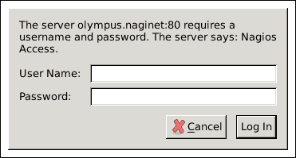
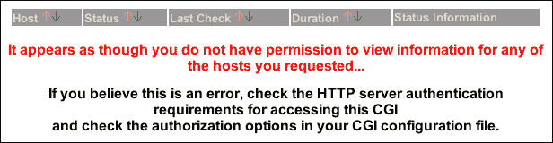
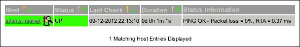
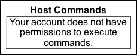
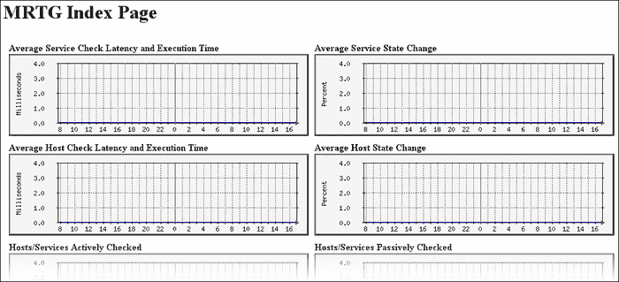
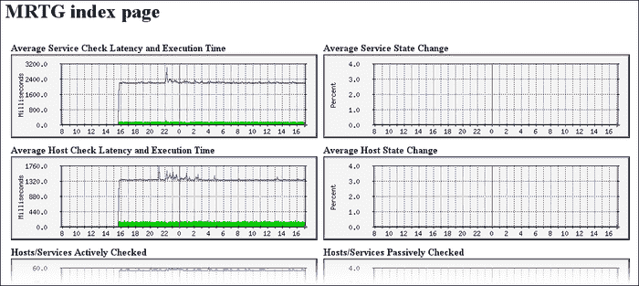
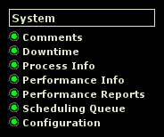
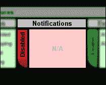
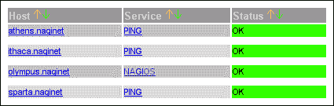

# 第十章 安全性与性能

在本章中，我们将介绍以下内容：

+   要求 Web 界面进行身份验证

+   使用认证联系人

+   将调试信息写入 Nagios 日志文件

+   使用 Nagiostats 监控 Nagios 性能

+   通过预缓存对象文件来提高启动时间

+   设置冗余监控主机

# 介绍

即使是中型网络的大多数管理员，也会选择为监控软件专门分配一台服务器，有时甚至为 Nagios Core 配置一台独立服务器。这主要是因为大多数综合性 Nagios Core 设置都有两个主要因素：

+   它们拥有很多特权，因为为了检查如此多不同主机和服务的运行状态，它们需要被授予适当的网络访问权限。这通常意味着它们的 IP 地址在整个网络中都被列为白名单。能够获得这些特权的用户可能会造成很大损害。

+   它们有大量工作要做，因此理想情况下需要专用的软件和硬件资源来顺利运行数千个主机和服务检查，并及时发现问题和恢复。如果 Nagios Core 服务器无法跟上检查计划，可能会导致对非常重要的服务的通知延迟。

因此，在构建配置时，非常重要的一点是要考虑到你的 Nagios Core 服务器的安全性和性能。

一般的最佳网络安全实践适用于 Nagios Core 管理，这些内容在此不再详细讨论。以下通用指南对于保护 Nagios Core 服务器与保护任何其他类型的服务器同样重要：

+   **不要以 root 用户运行服务器**：除非你自己修改了配置，否则这通常不是一个问题，因为如果你按照快速入门指南安装，服务器应该已设置为以非特权的`nagios`用户运行。在大多数情况下，Nagios Core 不需要 `root` 权限。

+   **使用防火墙**：Nagios Core、NSCA 和 NRPE 的主机检查所提供的保护非常基础，不能替代软件或硬件防火墙策略。即便是一个简单的`iptables`或`pf`软件防火墙，也非常有助于保护监控服务器。

+   **使用最小特权原则**：不要给予 Nagios Core 或其任何插件或进程超过所需的权限，且应将可写文件（如`logs`）和状态信息限制为仅对适当的用户可写。类似地，仅允许通过防火墙让 Nagios Core 访问它所需检查的内容，其他的不要开放。

+   **加密敏感信息**：如果可以避免，尽量不要将凭证以明文形式写入任何配置文件中；如果无法避免，请将它们定义在只有 `nagios` 用户可读的资源文件中。

因此，你不应将本章视为一个完整的 Nagios Core 服务器安全和优化指南。有关安全性和优化程序的更全面内容，务必查阅 Nagios Core 文档中的以下页面：

+   **安全性考虑**：[`nagios.sourceforge.net/docs/3_0/security.html`](http://nagios.sourceforge.net/docs/3_0/security.html)

+   **增强 CGI 安全性和** **认证**：[`nagios.sourceforge.net/docs/3_0/cgisecurity.html`](http://nagios.sourceforge.net/docs/3_0/cgisecurity.html)

+   **调优 Nagios 以获得最大** **性能**：[`nagios.sourceforge.net/docs/3_0/tuning.html`](http://nagios.sourceforge.net/docs/3_0/tuning.html)

本章特别关注保护 CGI，因为 web 界面会将 Nagios Core 的信息暴露给外界，如果配置不当，容易受到滥用攻击。本章还将包括评估 Nagios Core 性能的方法。

# 为 web 界面要求认证

在本教程中，我们将探讨为 Nagios Core web 界面使用基本认证的方法，这可能是防止恶意用户滥用软件的最重要配置步骤。

默认情况下，Nagios Core 的安装过程采取了一个明智的步骤，即在其推荐的 Apache 配置文件中默认锁定认证，使用标准的 HTTP 认证，并为名为`nagiosadmin`的默认用户设置了完全权限。

不幸的是，一些管理员会删除此认证或从不安装它，尽管安装指南中已有推荐。即便在私人网络上，也建议安装并保留认证，特别是当运行 Nagios Core 的服务器以任何方式连接到互联网时（通常不推荐这样做）。

这样做不仅是因为安全性方面的好处，还因为它允许你设置基本的访问控制，赋予特定用户在某些资源上读取状态或执行命令的权限，但对其他资源则没有权限。它还有其他更微妙的好处，比如记录执行操作的用户姓名，以便日志记录。

## 准备工作

你需要访问 Nagios Core 服务器的后台，版本要求为 3.0 或更高，以便更改其配置并重启服务器。你还需要一个正常工作的 web 界面。本教程大部分内容假设 web 界面运行在推荐的**Apache HTTPD 服务器**上；你可能还需要能够编辑该配置。这里假定你对 Apache HTTPD 有一定的了解；如果需要查阅，网上的文档非常详细：

[`httpd.apache.org/docs/`](https://httpd.apache.org/docs/)

本教程分为两部分：首先，我们将确保所有推荐的设置已到位，以正确要求身份验证；接着，我们将演示如何添加一个名为`helpdesk`的用户，该用户拥有只读权限，用于访问服务器的 Web 界面。该用户将能够查看所有主机和服务的状态，但无法执行（例如）命令或提交被动检查结果。

## 如何做...

我们可以确保 Nagios Core Web 界面已正确启用身份验证，如下所示：

1.  清除浏览器中的所有 cookie 和已保存的身份验证数据，然后尝试访问 Web 界面。如果浏览器没有像下面那样要求您输入用户名或密码，那么可能是您的身份验证已被禁用或未正常工作：

1.  在服务器上，进入 Nagios Core 配置目录并打开`cgi.cfg`文件。在默认安装中，该文件保存在`/usr/local/nagios/etc/cgi.cfg`中。

    ```
    # cd /usr/local/nagios/etc
    # vi cgi.cfg

    ```

1.  确保`use_authentication`的值未被注释掉并设置为`1`：

    ```
    use_authentication=1
    ```

1.  确保`default_user_name`指令已被注释掉：

    ```
    #default_user_name=guest

    ```

1.  在 Apache 配置中的`nagios.conf`文件中，检查以下行是否包含，指向`htpasswd.users`文件：

    ```
    AuthName "Nagios Access"
    AuthType Basic
    AuthUserFile /usr/local/nagios/etc/htpasswd.users
    Require valid-user
    ```

    此文件应位于 Apache 的配置目录中，例如`/etc/apache/conf.d/nagios.conf`。如果需要更改 Apache 的配置来修复此问题，您需要重启 Apache 使更改生效。

我们可以按如下方式添加一个名为`helpdesk`的只读用户：

1.  使用`htpasswd`（Apache HTTPD 密码管理器）将用户添加到`htpasswd.users`文件中。其位置会根据系统的不同而有所变化；常见的位置有`/usr/bin`和`/usr/local/apache/bin`。

    ```
    # htpasswd /usr/local/nagios/etc/htpasswd.users helpdesk
    New password:
    Re-type new password:
    Adding password for user helpdesk

    ```

    如果您担心系统上的用户会窃取哈希值，可以将`htpasswd.users`文件设置为仅 Web 服务器用户可读。

1.  在`cgi.cfg`中，取消注释`authorized_for_read_only`指令，并将新添加的`helpdesk`用户添加到其值中：

    ```
    authorized_for_read_only=helpdesk
    ```

1.  将该用户添加到`authorized_for_all_services`和`authorized_for_all_hosts`指令的值中：

    ```
    authorized_for_all_services=nagiosadmin,helpdesk
    authorized_for_all_hosts=nagiosadmin,helpdesk
    ```

    小心不要将这些与`authorized_for_all_service_commands`和`authorized_for_all_host_commands`指令混淆。

您通常不需要像其他`.cfg`文件一样重启 Nagios Core 服务器来使这些更改生效。

完成这些设置后，您应该只能使用有效的用户名和密码访问 Nagios Core Web 界面。安装时创建的默认`nagiosadmin`用户应具有完全权限，而在本教程中添加的`helpdesk`用户应能够查看主机和服务的状态，但无法执行任何命令，如重新调度检查或提交被动检查结果。

## 它是如何工作的...

需要注意的是，实际上并不是 Nagios Core 自身在提示用户名和密码并执行认证检查；这项功能由 Web 服务器执行，如 `nagios.conf` 文件所指定，推荐与 Apache HTTPD 一起安装使用。

然而，在登录后，Nagios Core 会每次访问 Web 界面中的 CGI 脚本时，使用 `cgi.cfg` 文件中定义的权限，以确保通过 Web 服务器身份验证的用户具有查看请求页面或执行请求操作的权限。

我们通过注释掉 `default_user_name` 指令来禁用它，因为该指令指定了 Nagios Core 在没有身份验证的情况下访问 CGI 的用户。这是一个潜在的危险设置，在大多数情况下最好避免，尤其是对于具有公开可访问地址的服务器。

以下 `cgi.cfg` 文件中的指令允许细化使用 CGI 的权限，形成一种简单的访问控制列表：

+   `authorized_for_configuration_information`: 指定的用户允许在 Web 界面中查看主机的配置信息

+   `authorized_for_system_information`: 指定的用户允许查看 Nagios Core 的进程和性能信息

+   `authorized_for_system_commands`: 指定的用户允许运行影响 Nagios Core 进程的命令，如关机和重启

+   `authorized_for_all_services`: 指定的用户允许查看所有服务的状态信息和历史记录

+   `authorized_for_all_hosts`: 指定的用户允许查看所有主机的状态信息和历史记录

+   `authorized_for_all_service_commands`: 指定的用户允许在所有服务上运行命令，如重新安排检查或提交被动检查结果

+   `authorized_for_all_host_commands`: 指定的用户允许在所有主机上运行命令，如重新安排检查或提交被动检查结果

进一步细化每项服务和每台主机的访问权限可以通过认证联系人完成，在本章的*使用认证联系人*示例中有展示。这对于职责混合、需要访问相同 Nagios Core Web 界面的团队非常推荐。

## 还有更多...

除了通过 Apache HTTPD 进行身份验证外，通常也可以限制允许访问 Nagios Core 实例的 IP 地址，使用 `Order` 和 `Allow` Apache 指令。我们可以如下扩展由 Apache 加载的 `nagios.conf` 文件：

```
<Directory "/usr/local/nagios/sbin">
    Options ExecCGI
    AllowOverride None
    AuthName "Nagios Access"
    AuthType Basic
    AuthUserFile /usr/local/nagios/etc/htpasswd.users
    Require valid-user
 Order Allow,Deny
 Deny from all
 Allow from 127.0.0.0/16
 Allow from 10.128.0.1
</Directory>
```

这将只允许本地地址和 `10.128.0.1` 访问 CGI，其他任何人都会被拒绝访问并返回 `403 Forbidden`。类似地，我们也可以安排只允许通过 HTTPS 连接，或许使用 `SSLRequireSSL` 指令；一般来说，我们可以配置 Apache 来严格控制访问 CGI，何况是滥用它们。

请注意，这一切不应替代适当的防火墙解决方案和策略。监控服务器应像任何其他关键任务服务器一样得到保护。

## 另见

+   本章中的*使用经过身份验证的联系人*示例

+   第七章中的*Web 界面中的查看配置*和*Web 界面中调度检查*示例，*使用 Web 界面*

# 使用经过身份验证的联系人

在这个示例中，我们将学习如何使用经过身份验证的联系人来精细控制 Nagios Core Web 界面中信息的访问权限。这个示例适用于某个用户需要查看特定主机和服务的状态，但不应被允许查看其他主机和服务的情况，这种设置无法通过`cgi.cfg`中的指令进行管理。

作为一个简单示例，在某个监控服务器上，我们可能配置了如下两个主机：

```
define host {
    use        linux-server
    host_name  sparta.naginet
    alias      sparta
    address    10.128.0.21
    contacts   nagiosadmin
}
define host {
    use        linux-server
    host_name  athens.naginet
    alias      athens
    address    10.128.0.22
    contacts   nagiosadmin
}
```

我们可能想要添加一个新用户`athensadmin`，使其能够查看`athens.naginet`主机及其服务的状态，并对其执行命令，但不能查看`sparta.naginet`主机或其服务。

## 准备工作

你需要访问 Nagios Core 服务器的后台，版本为 3.0 或更高，以更改其配置并重新启动它。你还需要一个运行身份验证的有效 Web 界面，并熟悉其工作原理；本章中的*要求 Web 界面进行身份验证*示例说明了如何操作。

## 如何操作...

我们可以通过以下方式添加一个经过身份验证的联系人：

1.  在`htpasswd.users`文件中使用`htpasswd`工具创建一个名为`athensadmin`的新用户：

    ```
    # htpasswd /usr/local/nagios/etc/htpasswd.users athensadmin
    New password:
    Re-type new password:
    Adding password for user athensadmin

    ```

1.  使用刚刚添加的凭据登录到 Nagios Core Web 界面，点击左侧菜单中的**主机**，验证你暂时无法查看任何信息：

1.  回到命令行，切换到 Nagios Core 对象配置目录。在快速入门安装指南中，这个目录是`/usr/local/nagios/etc/objects`。

    ```
    # cd /usr/local/nagios/etc/objects

    ```

1.  编辑`contacts.cfg`文件，添加一个新的联系人对象定义`athensadmin`。在这里，我们使用了`generic-contact`模板。如果你愿意，也可以使用你自己的模板或值；`contact_name`的值是最重要的部分：

    ```
    define contact {
        use           generic-contact
     contact_name  athensadmin
        alias         Athens Administrator
        email         athens@example.com
    }
    ```

1.  编辑你希望`athensadmin`用户访问的主机或服务，并将`athensadmin`添加到其联系人列表中。以我们的示例为例，这意味着`athens.naginet`的定义类似于以下代码片段：

    ```
    define host {
        use        linux-server
        host_name  athens.naginet
        alias      athens
        address    10.128.0.22
     contacts   nagiosadmin,athensadmin
    }
    ```

1.  验证配置并重启 Nagios Core 服务器：

    ```
    # /usr/local/nagios/bin/nagios -v /usr/local/nagios/etc/nagios.cfg
    # /etc/init.d/nagios restart

    ```

完成这些步骤后，使用`athensadmin`用户登录应该能查看`athens.naginet`主机的详细信息，但不能查看其他信息：



你还应该能够执行与该主机相关的命令，例如重新调度检查和确认问题。

## 工作原理...

当以经过身份验证的用户身份通过 Apache HTTPD 登录时，Nagios Core 会检查用户名是否与任何配置联系人中的 `contact_name` 指令匹配。如果匹配，则会授予检查该联系人关联的主机和服务状态的权限，并且只能对这些主机和服务执行命令。Web 界面其他方面的功能保持不变。对于经过身份验证的联系人而言，似乎没有其他主机或服务正在被监控。

如果你的网络包含同一位置的设备或具有混合监控职责的团队，这将允许你将 Nagios Core 界面限制为特定用户的某些主机。这对于保密性、透明性和委托目的非常有用。

## 还有更多…

如果你希望允许经过身份验证的用户只读访问他们关联的主机或服务的详细信息，你可以通过将其用户名添加到 `cgi.cfg` 中 `authorized_for_read_only` 指令的值来实现：

```
authorized_for_read_only=athensadmin
```

然后，`athensadmin` 用户仍然可以查看相同的主机和服务信息，但不能执行任何命令：



## 另见

+   本章中的 *要求 Web 界面进行身份验证* 食谱

+   本章节中 第一章 中的 *创建新联系人* 食谱，*理解主机、服务和联系人*

# 将调试信息写入 Nagios 日志文件

在本食谱中，我们将学习如何使用 Nagios Core 中的调试日志文件，从运行中的程序中获取各种进程信息，比标准 `log_file` 指令指定的文件中提供的信息多得多。这不仅对调试有用，特别是在 Nagios Core 在运行时执行了意外操作时，还能帮助你更好地了解服务器如何工作，特别是与你的配置相关的部分。

## 准备就绪

你将需要一个版本为 3.0 或更高版本的 Nagios Core 服务器。3.0 之后的版本提供了更多调试选项，但这些将在本食谱中提到。你需要能够修改 `nagios.cfg` 文件并重启服务器。

在本示例中，我们将简单地记录尽可能多的内容，然后在 *工作原理……* 部分解释如何在必要时调整日志记录行为。

## 如何操作…

我们可以通过以下方式为我们的监控服务器启用非常详细的调试：

1.  切换到 Nagios Core 的配置目录。在默认安装中，这是 `/usr/local/nagios/etc`。编辑 `nagios.cfg` 文件：

    ```
    # cd /usr/local/nagios/etc
    # vi nagios.cfg

    ```

1.  查找 `debug_level`、`debug_verbosity` 和 `debug_file` 指令。确保它们没有被注释掉，或者如果它们不存在，则将其添加到文件末尾，并按如下定义：

    ```
    debug_level=-1
    debug_verbosity=2
    debug_file=/usr/local/nagios/var/nagios.debug
    ```

1.  验证配置并重启 Nagios Core 服务器：

    ```
    # /usr/local/nagios/bin/nagios -v /usr/local/nagios/etc/nagios.cfg
    # /etc/init.d/nagios restart

    ```

完成此操作后，`/usr/local/nagios/var/nagios.debug`文件应该会很快开始填充有关运行进程的信息。你可能会发现，使用`tail -f`监视它一段时间很有帮助，这样你可以实时看到文件内容的更新：

```
# tail -f /usr/local/nagios/var/nagios.debug
[1347529967.839794] [008.2] [pid=14621] No events to execute at the moment. Idling for a bit...
[1347529967.839799] [001.0] [pid=14621] check_for_external_commands()
[1347529967.839805] [064.1] [pid=14621] Making callbacks (type 8)...
[1347529968.089971] [008.1] [pid=14621] ** Event Check Loop
[1347529968.090027] [008.1] [pid=14621] Next High Priority Event Time: Thu Sep 13 21:52:52 2012
[1347529968.090038] [008.1] [pid=14621] Next Low Priority Event Time:  Thu Sep 13 21:53:00 2012
...

```

## 它是如何工作的...

`debug_level`指令指定应该写入调试日志的信息量（及其种类）。在这里，我们使用了值`-1`，这是指定所有调试信息写入调试日志文件的快捷方式。

然而，在实践中，我们通常只希望获取有关特定类型的 Nagios Core 任务的信息。在这种情况下，我们可以使用`debug_level`的`OR`值来指定需要的任务。

可以通过以下数字指定不同种类的调试信息：

+   `1`：功能进入和退出调试

+   `2`：配置调试

+   `4`：进程调试

+   `8`：计划事件调试

+   `16`：主机和服务检查调试

+   `32`：通知调试

+   `64`：事件代理调试

在 Nagios Core 3.3 及以后的版本中，还可以指定以下内容。后续版本中可能会有更多新增内容：

+   `128`：外部命令调试

+   `256`：命令调试

+   `512`：计划停机调试

+   `1024`：注释调试

+   `2048`：宏调试

为了指定多个调试类型，而不是用逗号分隔这些值，它们是相加的。例如，如果我们只想保存进程和计划事件的调试信息，而不包含其他内容，我们将使用`4 + 8 = 12`：

```
debug_level=12
```

我们可以通过将`debug_level`重新设置为`0`，即其默认值，完全关闭调试功能。

## 还有更多内容...

Nagios Core 在最高调试级别下生成大量信息，即使在最小配置下，每秒也会产生超过 30 行的信息，因此如果不总是需要它，最好不要永久运行调试，因为它可能会逐渐占满磁盘。你可以通过使用`max_debug_file_size`指令指定文件的最大字节数来避免这种情况。例如，如果希望限制文件大小为 1MB，我们可以定义如下：

```
max_debug_file_size=1000000
```

当调试日志的大小超过设定限制时，Nagios Core 将通过添加`.old`扩展名来“滚动”现有的调试日志，并开始新的日志。它还会在这样做时自动删除任何以前带有`.old`扩展名的日志文件。

## 另见

+   本章中的*使用 Nagiostats 监控 Nagios 性能*方法

+   第七章中的*查看和解释通知历史记录*方法，*使用 Web 接口*

# 使用 Nagiostats 监控 Nagios 性能

在本教程中，我们将学习如何使用`nagiostats`工具获取有关 Nagios Core 进程性能以及其监视的主机和服务状态的一些统计信息。

可选地，我们还将展示如何使用 Nagios Core 源代码分发中构建的`mrtg.cfg`文件，设置由`mrtg`（多路由器流量图形化器）构建的图表，并在 Web 界面的菜单中链接到这些图表。Nagios Core 源代码分发包含一些文件来帮助此操作，我们将在这里使用。

## 准备工作

你需要安装并运行 Nagios Core 3.0 或更新版本服务器来调用`nagiostats`。旧版本包含此实用程序，但返回的信息可能不如新版本详细。

如果你希望运行`mrtg`图表，这是强烈推荐的，你应该在系统上安装`mrtg`及其辅助程序`indexmaker`。如果你已经使用`mrtg`图表其他内容，不用担心，这个操作不会影响它们。

此操作不假设您对`mrtg`有任何熟悉程度，但如果您在使用中遇到任何问题，可以在线查阅其文档：[`oss.oetiker.ch/mrtg/doc/index.en.html`](http://oss.oetiker.ch/mrtg/doc/index.en.html)。

你还应该可以访问 Nagios Core 安装时编译的源代码。如果需要重新获取源代码，可以从 Nagios Core 网站下载（[`www.nagios.org/`](http://www.nagios.org/)）。

在这种情况下，您需要再次运行`./configure`来生成所需的文件`sample-config/mrtg.cfg`。

## 操作步骤...

我们可以随时在一步中调用`nagiostats`本身，以获取有关服务器性能的统计信息：

1.  执行以下命令：

    ```
    # /usr/local/nagios/bin/nagiostats -c /usr/local/nagios/etc/nagios.cfg

    ```

    这将给你输出，从以下开始：

    ```
    Nagios Stats 3.4.1
    Copyright (c) 2003-2008 Ethan Galstad (www.nagios.org)
    Last Modified: 05-11-2012
    License: GPL
    CURRENT STATUS DATA
    ------------------------------------------------------
    Status File:                            /usr/local/nagios/var/status.dat
    Status File Age:                        0d 0h 0m 2s
    Status File Version:                    3.4.1
    Program Running Time:                   2d 2h 25m 23s
    Nagios PID:                             2487
    Used/High/Total Command Buffers:        0 / 0 / 4096
    Total Services:                         60
    Services Checked:                       60
    ...

    ```

1.  执行以下命令：

    ```
    # /usr/local/nagios/bin/nagiostats -c /usr/local/nagios/etc/nagios.cfg --help

    ```

    这将为您提供所有字段的名称和含义的完整列表，由`nagiostats`输出返回。

如果您希望包含此数据的`mrtg`图表，一个很好的起点是使用 Nagios Core 源代码分发中包含的示例配置，在`sample-config/mrtg.cfg`中。

1.  将`sample-config/mrtg.cfg`复制到`/usr/local/nagios/etc`：

    ```
    # cp nagios-3.4.1/sample-config/mrtg.cfg /usr/local/nagios/etc

    ```

1.  创建一个目录来存储`mrtg`页面和图表，以便在 Nagios Core Web 界面中查看：

    ```
    # mkdir /usr/local/nagios/share/stats

    ```

1.  编辑`/usr/local/nagios/etc/mrtg.cfg`，在文件顶部包含一个`WorkDir`声明：

    ```
    WorkDir: /usr/local/nagios/share/stats
    ```

1.  运行`mrtg`以创建图表：

    ```
    # mrtg /usr/local/nagios/etc/mrtg.cfg

    ```

    对于第一次运行，我们可以安全地忽略任何关于缺少先前数据或备份日志文件的错误：

    ```
    2012-09-16 17:01:04, Rateup WARNING: /usr/bin/rateup could not read the primary log file for nagios-n
    2012-09-16 17:01:04, Rateup WARNING: /usr/bin/rateup The backup log file for nagios-n was invalid as well
    2012-09-16 17:01:04, Rateup WARNING: /usr/bin/rateup Can't remove nagios-n.old updating log file
    2012-09-16 17:01:04, Rateup WARNING: /usr/bin/rateup Can't rename nagios-n.log to nagios-n.old updating log file

    ```

    如果您的 shell 中使用 UTF-8 语言环境，可能会导致`mrtg`运行失败。您可以使用`env`前缀在标准 C 语言环境中运行它：

    ```
    # env LANG=C mrtg /usr/local/nagios/etc/mrtg.cfg

    ```

1.  使用安装的`mrtg`中的`indexmaker`辅助程序运行，创建一个指向图表的索引：

    ```
    # indexmaker /usr/local/nagios/etc/mrtg.cfg --output=/usr/local/nagios/share/stats/index.html

    ```

    除非以后向`mrtg.cfg`添加或删除图表定义，否则只需要执行一次此操作。

1.  访问`http://olympus.naginet/nagios/stats`，用你自己的 Nagios Core 服务器主机名替换`olympus.naginet`。在认证后（如果需要），我们应该能够看到一些空的`mrtg`图表：

    不用担心它们为空；我们预计会是这样，因为目前每个图表只有一个数据点。

1.  如果到目前为止一切顺利，我们可能需要添加一个每五分钟运行一次的 `cron` 任务，以向图表添加新的数据点。在这里，我们假设 `mrtg` 程序保存在 `/usr/bin`：

    ```
    */5 * * * *  root  /usr/bin/mrtg /usr/local/nagios/etc/mrtg.cfg
    ```

    执行此操作的最佳方法因系统而异。您可以将其放入 `/etc/crontab`，或者如果您希望更整洁，可以将其放入 `/etc/cron.d/nagiostats` 中。

    作为 `root` 用户运行它可能是安全的，但如果您对此有所担心，您也可以通过包括 `--lock-file` 选项，以 `nagios` 用户身份运行它：

    ```
    */5 * * * *  nagios  /usr/bin/mrtg --lock-file=/usr/local/nagios/var/mrtg.cfg.lock /usr/local/nagios/etc/mrtg.cfg
    ```

    这可能需要修正已生成图表的权限：

    ```
    # chown -R nagios.nagios /usr/local/nagios/share/stats

    ```

完成此操作后，如果 `cron` 任务安装正确，我们应该会在接下来的几个小时内开始看到数据被绘制：



## 它是如何工作的...

`nagiostats` 提供的统计信息既包含了 Nagios Core 本身的性能数据，如完成对所有对象检查所需的时间，以及每次检查所需的平均时间，还包括主机在不同状态下的数量等数据。默认情况下，运行它将以简洁但易读的格式返回数据；通过运行 `--help`，您可以更好地理解每个字段的含义，正如配方中所建议的。

`mrtg.cfg` 文件包含在 Nagios 源代码分发包中，该文件在 `./configure` 阶段根据您的特定系统进行定制，包含了 `mrtg` 图表的示例定义，这些图表解析了从 `nagiostats` 获取的数据。这些图表并不是使用 `nagiostats` 提供的数据的唯一可能图表，但它们是有用的示例。

使用的数据与您从 shell 中调用 `nagiostats` 时读取的数据相同，但格式略有不同。如果您想查看传递给 `mrtg` 的数据，可以使用 `--mrtg` 选项运行它，并通过 `--data` 提供字段以包含在输出中；例如：

```
# /usr/local/nagios/bin/nagiostats -c /usr/local/nagios/etc/nagios.cfg --mrtg --data=AVGACTSVCPSC,AVGPSVSVCPSC,PROGRUNTIME,NAGIOSVERPID
0
0
1d 2h 43m 43s
Nagios 3.4.1 (pid=1080)

```

配方中调用的 `indexmaker` 是一个独立的程序，它会生成一个包含所有图表链接的 `index.html` 文件，仅仅是为了方便。与 `mrtg` 调用一样，它会引用配置文件 `/usr/local/nagios/etc/mrtg.cfg` 来确定需要执行的操作。

## 还有更多...

一旦您对图表网页的显示方式满意，您可能希望将它们添加到 Nagios Core 的侧边栏中。这可以通过编辑 `/usr/local/nagios/share/side.php` 并在 **性能信息** 链接下方添加一个名为 **性能报告** 的新链接来实现。新行可能类似于以下代码片段：

```
<li><a href="/nagios/stats/" target="<?php echo $link_target;?>">Performance Reports</a></li>
```

这将使图表的链接在 Web 界面中显示如下：



请注意，像这样的菜单自定义将在重新安装 Nagios Core 时被覆盖。

如果你喜欢 `mrtg` 处理这些数据的方式，你可能会喜欢看看**Cacti**，它是 `rrdtool` 的一个非常有用的前端，类似于 `mrtg`。它允许你在定义图表时拥有很大的灵活性，尽管学习起来需要一些时间（[`www.cacti.net/`](http://www.cacti.net/)）。

如果你对 Nagios Core 性能和状态数据的更多图表感兴趣，你可能会喜欢 Nagiosgraph 扩展，该扩展在第十一章的*使用 NagiosGraph 跟踪主机和服务状态*食谱中进行了讨论，*自动化和扩展 Nagios*。

最后，请注意，Nagios Core 在其报告中包含了一些内置的主机和状态图表，因此在尝试为已经存在的报告构建图表之前，请务必查看这些内容！这些内容也在第七章的*与 Web 界面协作*中进行了讨论。请查看本食谱中*另见*部分中的参考资料。

## 另见

+   第七章的*使用战术概览*、*查看和解读可用性报告*、*查看和解读趋势*、*查看和解读通知历史*食谱，*与 Web 界面协作*。

+   在第十一章的*使用 Nagiosgraph 跟踪主机和服务状态*食谱中，*自动化和扩展 Nagios*。

# 通过预缓存对象文件来提高启动时间

在本食谱中，我们将学习如何缩短大型和/或复杂的 Nagios Core 配置的启动时间。这是通过预缓存来自配置的 Nagios Core 对象，应用所有适当的模板和组扩展到一个文件中，这样 Nagios Core 就能比更模块化、更具可读性的配置更快地读取。

如果你监控的主机或服务数量超过一百个，并且有一个相对复杂的模板和分组布局（如第一章和第九章中一些食谱所建议的那样），这可能会对你有兴趣。它在较小的安装上也能运行，但启动速度的提升可能非常有限。

如果你只运行一个小型设置，那么如果你想更好地理解 Nagios Core 如何扩展使用大量模板和其他配置技巧的配置，本食谱可能会对你有兴趣。

## 准备工作

你应该运行 Nagios Core 3.0 或更新版本的服务器，并且可以访问服务器以更改其配置。

你应该检查 `/usr/local/nagios/etc/nagios.cfg` 中的 `precached_object_file` 指令是否已取消注释，并定义为一个可访问的文件。快速启动配置中的设置是合理的：

```
precached_object_file=/usr/local/nagios/var/objects.precache
```

取消注释此指令并不会实际生成或使用预缓存对象文件；这需要明确执行，具体操作将在后面的步骤中解释。

不要将其与同一文件中的`object_cache_file`指令混淆，该指令应该保持当前设置不变。

在这个例子中，我们将使用一个相当大的配置，定义了大约 20,000 个对象，且运行在一台较慢的机器上。

## 如何实现...

我们可以通过使用预缓存的对象文件来获得一些性能提升的想法，如下所示：

1.  运行`nagios`并使用`-s`选项，检查输出。这将打印出通常参与从配置文件构建完整对象定义的进程的概要。

    ```
    # /usr/local/nagios/bin/nagios -s /usr/local/nagios/etc/nagios.cfg

    ```

    在这种情况下，我们特别关注输出中用星号标记的部分，位于`OBJECT CONFIG PROCESSING TIMES`标题下，表示可以通过预缓存对象文件来提升的时间，包括在`TOTAL`字段末尾的节省时间估算：

    ```
    OBJECT CONFIG PROCESSING TIMES      (* = Potential for precache savings with -u option)
    ----------------------------------
    Read:                 8.285613 sec
    Resolve:              0.001696 sec  *
    Recomb Contactgroups: 0.000124 sec  *
    Recomb Hostgroups:    1.972412 sec  *
    Dup Services:         0.309333 sec  *
    Recomb Servicegroups: 0.000029 sec  *
    Duplicate:            0.000168 sec  *
    Inherit:              0.102685 sec  *
    Recomb Contacts:      0.000001 sec  *
    Sort:                 0.000000 sec  *
    Register:             0.826046 sec
    Free:                 0.102805 sec
     ============
    TOTAL:                11.600912 sec  * = 2.386448 sec (20.57%) estimated savings

    ```

    我们可能会决定，`2.3`秒的节省时间对于我们的重启时间来说是值得的。也许我们真的不想错过任何重要的检查！

1.  使用`-p`和`-v`选项运行`nagios`，验证配置并同时写入预缓存对象文件：

    ```
    # /usr/local/nagios/bin/nagios -pv /usr/local/nagios/etc/nagios.cfg

    ```

1.  使用`-u`和`-s`选项运行`nagios`，查看在指示使用预缓存对象文件时，启动和调度测试的耗时：

    ```
    # /usr/local/nagios/bin/nagios -us /usr/local/nagios/etc/nagios.cfg

    ```

1.  我们可能会注意到，`TOTAL`所需时间现在明显减少（比预估的改进还要多），并且许多时间已经为零秒，因为 Nagios Core 完全没有执行那个步骤：

    ```
    OBJECT CONFIG PROCESSING TIMES      (* = Potential for precache savings with -u option)
    ----------------------------------
    Read:                 4.975257 sec
    Resolve:              0.000000 sec  *
    Recomb Contactgroups: 0.000000 sec  *
    Recomb Hostgroups:    0.000000 sec  *
    Dup Services:         0.000000 sec  *
    Recomb Servicegroups: 0.000000 sec  *
    Duplicate:            0.000000 sec  *
    Inherit:              0.000000 sec  *
    Recomb Contacts:      0.000000 sec  *
    Sort:                 0.000000 sec  *
    Register:             0.828953 sec
    Free:                 0.000758 sec
     ============
    TOTAL:                5.804968 sec

    ```

完成此操作后，我们应该会发现，使用`-d`和`-u`标志重新启动 Nagios Core 的速度比以前更快。这个过程可以融入到任何启动脚本中（例如`/etc/init.d/nagios`）。这也意味着如果我们对配置进行了更改，我们必须记得再次运行`nagios -pv`来验证并重新生成预缓存对象文件。

## 它是如何工作的...

当使用`-p`选项运行时，Nagios Core 将正常解析配置，将其转化为可以使用的对象，扩展`hostgroups`、`templates`和其他配置快捷方式。它会将这些信息写入由`precached_object_file`指令指定的单一文件。

配置文件是人类可读的；如果你在文本编辑器中查看它，你将看到从配置中构建的扩展定义，包含所有对象继承、正则表达式的主机组和多主机服务定义。

在下一次重启时，可以通过包括`-u`选项指示 Nagios Core 使用这个文件，而不是重新解析整个配置。你可能需要在任何正在使用的`init.d`脚本中加入这个选项。

## 还有更多内容...

如果在 Nagios Core 重启时你没有速度问题，最好避免让这成为永久配置，因为这会给配置构建添加额外的复杂性；如果你在更改配置后忘记重建预缓存对象文件并重启 Nagios Core，它将继续使用先前的配置，而没有意识到差异。请谨慎使用！

## 另见

+   第一章中的*在组内所有主机上运行服务*食谱，*理解主机、服务和联系人*。

+   第九章中的*使用组配置主机角色*和*使用继承简化配置*的食谱，*配置管理*。

# 设置冗余监控主机

在本食谱中，我们将学习如何通过在另一台机器上运行第二个配置几乎相同的 Nagios Core 实例来实现 Nagios Core 的简单冗余。

这看起来好像不需要食谱就能实现。只需简单地复制 Nagios Core 系统的配置并同时运行，应该是比较直接的。然而，这里有两个主要问题：

+   网络上检测到的每个问题都会触发两次通知事件。负责看护传呼机的管理员可能会觉得这难以忍受！

+   一切都会被检查两次。在较小的网络中，如果检查较简单，这可能不会成为问题，但在更大、繁忙的网络中，可能会成为问题。

本食谱将通过配置从属监控服务器来抑制通知，直到它检测到主服务器的问题，从而解决第一个问题。在*更多内容…*部分中，我们将讨论如何扩展这个解决方案以解决第二个问题，通过防止从属服务器在主服务器活动时进行检查以及发送通知。

## 准备工作

这是本书中最复杂的食谱之一，也是最长的，涉及许多其他食谱和章节中的概念。要跟随这个食谱，你可能需要对以下内容有一定的工作知识：

+   Nagios Core 的构建模块——主机、服务、联系人、命令、插件和通知——在第 1 到第四章的所有食谱中都有解释。

+   通过`check_nrpe`进行远程执行——在第六章中的所有食谱中都有解释，*启用远程执行*。该食谱将在某个时刻告诉你需要在主服务器上安装 NRPE 以运行特定插件，因此你应该先学习如何做这一步。

+   事件处理程序及其写入命令文件的方法——在第十一章的*设置事件处理程序脚本*食谱中解释。

事件处理程序脚本是这个配置中最复杂的部分，幸运的是它们已经为我们写好了；我们将通过从 Nagios Core 源代码包中复制它们来展示如何实现。你需要确保有适用于你版本的 Nagios Core 的源代码。如果需要重新获取源代码，可以从 Nagios Core 的官网 [`www.nagios.org/`](http://www.nagios.org/) 重新下载。

本配方假设我们有两台监控服务器：`olympus.naginet` (`10.128.0.11`)，它将作为主监控服务器，和 `everest.naginet` (`10.128.0.12`)，它将作为从属服务器。这两台服务器配置为监控相同的三个主机，并进行 PING 服务检查：

+   `sparta.naginet`

+   `athens.naginet`

+   `ithaca.naginet`

这两台服务器的 Nagios Core 配置最初完全相同，且两者都将通知发送到适当的联系人组。然而，请注意，这两台服务器尚未互相监控；这是本配方中的一个重要部分。

## 如何执行...

我们可以为两台 Nagios Core 服务器安排一个简单的冗余设置，如下所示：

1.  确认 `check_nagios` 插件在主服务器上可用，并尝试运行它：

    ```
    # cd /usr/local/nagios/libexec
    # ./check_nagios -e 5 -F /usr/local/nagios/var/status.dat -C /usr/local/nagios/bin/nagios
    NAGIOS OK: 1 process, status log updated 3 seconds ago

    ```

1.  在主服务器上安装 NRPE 守护进程，并在 `nrpe.cfg` 文件中定义命令 `check_nagios`（详见 第六章）。

    ```
    command[check_nagios]=/usr/local/nagios/libexec/check_nagios -e 5 -F /usr/local/nagios/var/status.dat -C /usr/local/nagios/bin/nagios

    ```

1.  在 `/usr/local/nagios/etc/nrpe.cfg` 文件中，将从属服务器的地址包含在 `allowed_hosts` 指令中：

    ```
    allowed_hosts=127.0.0.1,10.128.0.12
    ```

    不要忘记重启 NRPE 以将此更改包含到配置中。

1.  在从属服务器上，验证通过 `check_nrpe` 调用是否能够获取主服务器上 `check_nagios` 的结果：

    ```
    # cd /usr/local/nagios/libexec
    # ./check_nrpe -H olympus.naginet
    NRPE v2.13
    # ./check_nrpe -H olympus.naginet -c check_nagios
    NAGIOS OK: 1 process, status log updated 2 seconds ago

    ```

    你需要在从属服务器上安装 `check_nrpe` 插件来实现这一点。这个过程在 *使用 NRPE 监控远程机器上的本地服务* 这一配方中进行了说明，详见 第六章。

1.  在从属服务器上，将源代码包中的四个文件（两个事件处理程序和两个辅助脚本）复制到 `/usr/local/nagios/libexec/eventhandlers` 目录（你可能需要先创建这个目录）：

    ```
    # EHD=/usr/local/nagios/libexec/eventhandlers
    # mkdir -p $EHD
    # cd /usr/local/src/nagios
    # cp contrib/eventhandlers/enable_notifications $EHD
    # cp contrib/eventhandlers/disable_notifications $EHD
    # cp contrib/eventhandlers/redundancy-scenario1/handle-master-host-event $EHD
    # cp contrib/eventhandlers/redundancy-scenario1/handle-master-proc-event $EHD

    ```

    前面的命令假设你将 Nagios Core 分发包的源代码保存在 `/usr/local/src` 目录下。我们定义并使用 shell 变量 `$EHD` 来方便地引用事件处理程序目录。

1.  在已安装的 `handle-master-proc-event` 脚本中，找到并将 `active_service_checks` 替换为 `notifications`。命令行工具 `sed` 非常适合这个操作：

    ```
    # sed -i 's/active_service_checks/notifications/g' $EHD/handle-master-proc-event

    ```

    这是因为提供的脚本发出的命令是切换活动检查，而不是通知。写作时，在 Nagios 3.3.1 中，`handle-master-proc-event` 脚本的第 49 行可能存在一个 bug，需要修正：

    ```
    `eventhandlerdir/disable_active_service_checks`
    ```

    它应该在第一个反引号后面加上一个美元符号：

    ```
    `$eventhandlerdir/disable_active_service_checks`
    ```

1.  确保事件处理程序由 `nagios` 用户拥有并且具有可执行权限：

    ```
    # chown nagios.nagios $EHD/*
    # chmod 0755 $EHD/*

    ```

1.  在`/usr/local/nagios/etc/objects/commands.cfg`中，定义两个新的事件处理程序命令：

    ```
    define command {
        command_name  handle-master-host-event
        command_line  $USER1$/eventhandlers/handle-master-host-event $HOSTSTATE$ $HOSTSTATETYPE$ $HOSTATTEMPT$
    }
    define command {
        command_name  handle-master-proc-event
        command_line  $USER1$/eventhandlers/handle-master-proc-event $SERVICESTATE$ $SERVICESTATETYPE$ $SERVICEATTEMPT$
    }
    ```

1.  在从属服务器上创建主机和服务定义来监控主服务器。它可能类似于以下代码片段；根据需要更改`host_name`、`alias`和`address`的值。所使用的模板仅为示例；你可能希望选择已定义的模板，以便频繁地进行检查，并在 24x7 的时间段内运行。

    ```
    define host {
        use            critical-host-template
        host_name      olympus.naginet
        alias          olympus
        address        10.128.0.11
        event_handler  handle-master-host-event
    }
        define service {
            use                  critical-service-template
            host_name            olympus.naginet
            service_description  NAGIOS
            check_command        check_nrpe!check_nagios
            event_handler        handle-master-proc-event
        }
    ```

    如果愿意，你可以让主服务器也监控从属服务器。

1.  请注意，你需要定义`check_nrpe`命令，正如第六章中*使用 NRPE 监控远程机器上的本地服务*配方所解释的那样。如果你已经按照该配方操作，那么你可能已经完成了此操作。如果没有，以下定义适用：

    ```
    define command {
        command_name  check_nrpe
        command_line  $USER1$/check_nrpe -H $HOSTADDRESS$ -c $ARG1$
    }
    ```

1.  最后，在从属服务器的`nagios.cfg`中，将`enable_notifications`更改为`0`：

    ```
    enable_notifications=0
    ```

1.  验证配置并重启 Nagios Core 服务器：

    ```
    # /usr/local/nagios/bin/nagios -v /usr/local/nagios/etc/nagios.cfg
    # /etc/init.d/nagios restart

    ```

完成此操作后，两个 Nagios Core 服务器应该都在运行，但需要注意的是，从属服务器上的通知默认是禁用的，正如**战术概览**中所示：



然而，所有系统仍然在被监控，正如**服务**界面中所见，包括主机上的**NAGIOS**服务：



这意味着通知只会由主服务器发送，因为主服务器仍然启用了通知。然而，如果主服务器宕机或其 Nagios 进程停止工作，应该会调用事件处理程序，从属服务器上的通知会自动启用。当主服务器或其`NAGIOS`服务恢复时，通知将再次禁用，并且检查和状态变更将继续不中断地进行。因此，我们已经建立了一种简单的冗余。如果你使用此设置，应该彻底测试它，以确保从属 Nagios Core 服务器能根据每种情况（如主机宕机、服务宕机、服务恢复等）启用或禁用通知。

## 它是如何工作的...

在 Nagios Core 分发包中包含的事件处理程序，我们将其复制到`eventhandlers`目录中，旨在根据给定服务或主机的状态处理通知和主动检查的切换。它们是为了演示事件处理程序和像这样的冗余情况而提供的。

我们首先设置从属服务器，不仅监控运行主服务器的主机，还要监控 Nagios Core 服务本身，使用`check_nagios`插件。该插件检查日志文件的年龄和系统的进程表，以确保系统上确实在运行 Nagios Core 服务。由于这是一个本地插件，不适用于远程检查，因此我们通过 NRPE 从从属服务器进行检查。

从服务器会检查主服务器及其`NAGIOS`服务的状态，作为其正常的主动检查例程的一部分。当主服务器的主机或其`NAGIOS`服务状态发生变化时，两个事件处理程序`handle-master-host-event`和`handle-master-proc-event`都会被调用，这些事件处理程序在相应的命令中定义。

每次调用事件处理程序时，它们都会传递三个宏形式的参数。对于`handle-master-host-event`，这些参数是：

+   `$HOSTSTATE$`：这是主服务器的新状态。

+   `$HOSTSTATETYPE$`：这指定状态是`SOFT`还是`HARD`。

+   `$HOSTATTEMPT$`：这是尝试的主机检查次数，最大值为主机的`max_check_attempts`。

`handle-master-proc-event`传递三个类似的参数，唯一的区别是它们引用的是服务状态，而不是主机状态：

+   `$SERVICESTATE$`：这是主服务器上`NAGIOS`服务的新状态。

+   `$SERVICESTATETYPE$`：这指定服务状态是`SOFT`还是`HARD`。

+   `$SERVICEATTEMPT$`：这是尝试的主机检查次数，最大值为主机的`max_check_attempts`。

事件处理程序的编写方式是，只有当新状态为`HARD`时才会执行操作；也就是说，只有当`max_check_attempts`的次数达到时才会生效。在足够多次连续检查失败之前，它会忽略`SOFT`状态的变化，直到它能够合理地确认被监控的主机或服务出现了问题。

如果主机或服务进入`HARD CRITICAL`状态，事件处理程序会调用辅助脚本`enable-notifications`，在`/usr/local/nagios/var/rw/nagios.cmd`的`commands`文件中写入命令以供服务器处理。此命令的形式如下，其中包括写入命令时的 UNIX 时间戳：

```
[1348129155] ENABLE_NOTIFICATIONS;1348129155

```

当 Nagios Core 处理此命令时，其效果是先前禁用的通知被启用，所有由于检查而生成的后续通知都会被发送。

同样，当主机或服务从`HARD CRITICAL`状态恢复，进入`HARD UP`或`HARD OK`状态时，会调用`disable-notifications`辅助脚本，并以相同的方式写入命令：

```
[1348129231] DISABLE_NOTIFICATIONS;1348129231

```

其效果是，当主服务器被标记为宕机时，从服务器会注意到并采取相同的通知行为，而当主服务器恢复时，从服务器会停止自己的通知，再次允许主服务器恢复其角色。

## 还有更多内容...

如果网络带宽是一个问题，我们可以安排在不使用时让从服务器基本处于闲置状态，不仅默认关闭通知，还关闭服务检查。Nagios Core 发行版中也包含了相关的辅助脚本，分别是`disable_active_service_checks`和`enable_active_service_checks`脚本。

这个变更的主要问题是从属服务器在进行初始检查时丧失状态信息；这也可以绕过，正如 Nagios 核心文档中关于冗余的解释：[`nagios.sourceforge.net/docs/3_0/redundancy.html`](http://nagios.sourceforge.net/docs/3_0/redundancy.html)。

一旦这些步骤完成，设置的主要麻烦就是必须保持两个配置目录同步。每次配置需要更改时必须在两台服务器上进行更改，这既不理想又容易出错，因此你可能想考虑使用如`rsync`这样的快照工具来保持两个目录一致。更多关于`rsync`的信息可以在[`en.wikipedia.org/wiki/Rsync`](http://en.wikipedia.org/wiki/Rsync)上找到。

使用版本控制管理的配置也在这里有所帮助，如第九章中的*将配置纳入版本控制*的示例所推荐。这样，你可以使用`git clone`或`svn checkout`快速复制并更新多个机器上的配置文件。

## 另见

+   本章中的*将调试信息写入 Nagios 日志文件*的示例

+   第六章中的*在远程机器上监控本地服务与 NRPE*的示例，*启用远程执行*

+   第九章中的*将配置纳入版本控制*的示例，*配置管理*

+   第十一章中的*设置事件处理脚本*的示例，*自动化与扩展 Nagios*
