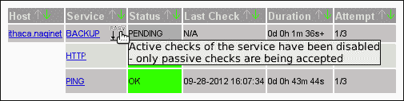
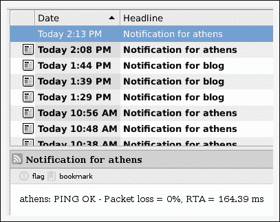

# 第十一章：自动化与扩展 Nagios Core

在本章中，我们将覆盖以下内容：

+   允许并提交被动检查

+   使用 NSCA 从远程主机提交被动检查

+   响应 SNMP 陷阱提交被动检查

+   设置事件处理脚本

+   使用 Nagiosgraph 跟踪主机和服务状态

+   使用 NDOUtils 将状态读入 MySQL 数据库

+   编写定制化的 Nagios Core 报告

+   获取额外的可视化效果与 NagVis

# 引言

除了作为独立的监控框架有用外，Nagios Core 还具有模块化设计，允许与其他程序和工具进行交互并进行扩展，主要是通过其外部命令文件来控制服务器的行为。

与 Nagios Core 服务器进行交互的最有用方式之一是通过使用被动检查：将检查结果直接提交给服务器，而不是作为服务器自身主动检查的结果。

被动检查的最简单应用是在监控一些可能需要不确定时间才能运行的过程，因此不适合主动检查；服务不进行主动检查，而是接受由另一个应用提交的检查结果，可能是在备份脚本完成后提交的结果。这些检查可以通过一个名为**Nagios Service Check Acceptor**（**NSCA**）的附加组件进行发送和接收。同样，插件和通知实际上是对外部命令的脚本化调用，如`check_http`和`mail`，事件处理程序也可以配置为每次主机或服务状态变化时执行指定的命令。这可以用于补充记录状态变化数据，或自动化地尝试解决问题，如重启远程服务器。我们还在第十章的*设置冗余监控主机*部分中看到事件处理程序的使用。

最后，本章还包括了安装程序和对一些流行的 Nagios Core 扩展的讨论：

+   **Nagiosgraph**：这是一个先进的基于 Web 的图表解决方案，用于 Nagios Core，能够绘制服务器性能、主机和服务状态的指标。

+   **NagVis**：这是一个高级的基于 Web 的可视化扩展，适用于 Nagios Core 数据，尤其适合那些需要比 Nagios Core 内置网络映射更全面功能的管理员。

+   **NDOUtils**：该工具将 Nagios Core 数据转换为标准数据库系统，如 MySQL；对于执行 Nagios Core 数据的高级查询非常有用，适用于定制系统，如监控显示或与变更控制系统的日志记录。

我们将通过两个单独的步骤来讨论 NDOUtils，它可能是所有 Nagios Core 扩展中最通用的；首先展示如何安装它，然后提供一些如何应用它的想法，创建我们自己的自定义 Nagios Core 报告应用程序，形式为用**Perl**编写的**CLI 报告**和用**PHP**编写的**RSS 订阅**。

# 允许并提交被动检查

在本步骤中，我们将学习如何配置 Nagios Core 接受服务的被动检查。这允许用户和外部应用程序直接向 Nagios Core 提交检查结果，而不是让应用程序通过插件（如 `check_http` 或 `check_ping`）执行轮询来主动获取结果。

我们将展示一个简单的被动检查示例，标记一个名为 `BACKUP` 的服务，该服务对应于现有主机。我们将展示如何通过 Web 界面操作，这非常简单，并通过外部命令文件操作，虽然稍微复杂一些，但更加灵活且易于自动化。

这个想法是，当用户或进程确认主机上的备份过程已正确完成时，他们能够直接向服务提供 `OK` 检查结果，而不需要 Nagios Core 自己进行轮询。

## 准备工作

你应该运行 Nagios Core 3.0 或更新版本的服务器。你还应该已经配置了一个主机，在该主机上你希望定义一个接受被动检查的服务。在这个示例中，我们将使用主机 `ithaca.naginet`，它可能如下所示：

```
define host {
    use        linux-server
    host_name  ithaca.naginet
    alias      ithaca
    address    10.128.0.21
}
```

你还需要一个工作的 Nagios Core Web 界面，以检查被动检查是否已启用，并尝试使用此步骤中的方法提交被动检查。

本步骤将分为两部分：仅启用并配置服务以接受被动检查，以及通过 Web 界面实际提交被动检查。在*更多内容...*部分，我们将展示如何通过外部命令文件提交检查结果，尽管这有点复杂，但它支持高级自动化行为。

## 如何操作...

我们可以定义一个只接受被动检查的新 `BACKUP` 服务，如下所示：

1.  登录到 Web 界面，确保已启用被动检查。在**战术概览**部分，底部附近会有一个面板显示相关信息。检查它是否为绿色：

    如果它不是绿色，你应该能够通过点击**禁用**栏再次启用检查。在这种情况下，你还应检查 `/usr/local/nagios/etc/nagios.cfg` 文件，确保 `accept_passive_service_checks` 选项设置为 `1`，以便 Nagios Core 在启动时允许被动检查。

1.  切换到 Nagios Core 的 `objects` 配置目录。如果你使用的是示例配置，这通常会是 `/usr/local/nagios/etc/objects`。

    ```
    # cd /usr/local/nagios/etc/objects

    ```

1.  编辑 `commands.cfg` 文件，并为 `check_dummy` 命令添加定义：

    ```
    define command {
        command_name  check_dummy
        command_line  $USER1$/check_dummy $ARG1$ $ARG2$
    }
    ```

    如果你已经按照第八章中*监控集群中的各个节点*的教程操作过，那么你可能已经定义了这个命令，在这种情况下，你可以跳过此步骤，因为定义是相同的。

1.  编辑包含现有主机定义的文件。在此示例中，主机定义在名为`ithaca.naginet.cfg`的文件中。

    ```
    # vi ithaca.naginet.cfg

    ```

1.  在文件末尾添加以下服务定义，替换`host_name`为适当的值。

    ```
    define service {
        use                     generic-service
        host_name               ithaca.naginet
        service_description     BACKUP
     active_checks_enabled   0
     passive_checks_enabled  1
     check_command           check_dummy!1!"Unwanted active check!"
    }
    ```

    这个示例使用了`generic-service`模板。你可以使用任何你喜欢的服务模板；重要的指令是`active_checks_enabled`、`passive_checks_enabled`和`check_command`。

1.  验证配置并重新启动 Nagios Core 服务器：

    ```
    # /usr/local/nagios/bin/nagios -v /usr/local/nagios/etc/nagios.cfg
    # /etc/init.d/nagios restart

    ```

完成此操作后，Nagios Core 网页界面应显示该服务仅接受被动检查，具体在**服务**列表中：



它将保持在`PENDING`状态，直到为其提交了被动检查结果。

我们可以通过网页界面提交被动检查结果，具体步骤如下：

1.  点击**服务**列表中的服务名称，然后点击**提交该服务的被动检查结果**菜单项：

1.  完成结果表单，输入以下值：

    +   **主机名**：这是应该提交被动检查结果的主机名。这个信息应该已经为我们填写好。

    +   **服务**：这是应该提交被动检查结果的服务描述。这个信息也应该已经填写为`BACKUP`。

    +   **检查结果**：这是你希望为检查提交的特定结果。在本例中，我们选择`OK`来表示备份成功完成。如果需要，我们也可以选择提交`CRITICAL`结果。

    +   **检查输出**：这是附加到状态的消息。在本例中，我们选择简单的消息**夜间备份成功**。

    +   **性能数据**：这是关于被检查服务执行情况的可选额外细节。我们可以留空此项。

1.  点击**提交**以提交被动检查结果：

稍等片刻后，服务的详细信息应显示反映被动检查结果，并明确显示已禁用主动检查：


## 它的工作原理...

前面一节中添加的配置将一个名为`BACKUP`的新服务添加到现有的`ithaca.naginet`主机，并旨在管理和报告该主机的备份状态。在我们的示例中，这不是 Nagios Core 可以手动检查的内容；`ithaca.naginet`上没有任何网络服务可以检查备份是否成功。

然而，假设作为管理员，我们每天早晨的确会收到一个备份报告，这样我们就能知道备份是成功还是失败，并希望将该状态注册到 Nagios Core，可能是为了记录存档或提醒其他管理员出现问题。

为此，我们禁用该服务的主动检查，并设置一个虚拟检查命令 `check_dummy`，我们不希望它运行。如果由于某种原因运行了主动检查，它将始终标记为 `WARNING` 状态，消息为 **不需要的主动检查！**。`check_dummy` 命令实际上不会检查任何内容，它被配置为始终返回其两个参数定义的状态和输出。

相反，我们为该服务启用被动检查并手动提交结果。如果备份失败，我们也可以轻松地记录一个 `WARNING` 或 `CRITICAL` 的被动检查结果。

## 还有更多内容...

也可以（并且通常是理想的）通过外部命令文件提交主动检查，这对于自动化非常有用。我们将检查的详细信息以单行格式写入命令文件，如下所示：

```
[<timestamp>] PROCESS_SERVICE_CHECK_RESULT;<host_name>;<service_description>;<service_status>;<plugin_output>
```

对于我们的示例，这一行类似于以下代码片段：

```
[1348806599] PROCESS_SERVICE_CHECK_RESULT;ithaca.naginet;BACKUP;0;Nightly backups were successful
```

我们可以如下所示直接将其写入外部命令文件：

```
# CHECK="[`date +%s`] PROCESS_SERVICE_CHECK_RESULT;ithaca.naginet;BACKUP;0;Nightly backups were successful"
# echo $CHECK >>/usr/local/nagios/var/rw/nagios.cmd

```

在此情况下，`<service_status>` 字段需要是一个整数，表示相应的状态。如果使用文本值 `OK` 或 `WARNING`，命令将无法按预期工作。

+   `0` 表示 `OK`

+   `1` 表示 `WARNING`

+   `2` 表示 `CRITICAL`

+   `3` 表示 `UNKNOWN`

如果语法正确，那么被动检查将以与通过网页界面提交时相同的方式注册。因此，写入命令文件使我们能够通过脚本和自动化系统提交被动检查结果，只需了解合适的 Shell 脚本语言，如 Bash 或 Perl。

我们将更详细地讨论如何使用外部命令来获取被动检查结果，包括在本章的 *通过 NSCA 从远程主机提交被动检查* 配方中提到的与 NSCA 插件的常见应用。如果你不希望手动输入被动检查结果，那么你很可能会对这个配方感兴趣，并且它也包括了新鲜度检查的相关解释。

## 另见

+   本章中的 *通过 NSCA 从远程主机提交被动检查*、*响应 SNMP trap 提交被动检查* 和 *设置事件处理脚本* 配方

# 通过 NSCA 从远程主机提交被动检查

在本配方中，我们将展示如何通过远程主机自动提交被动检查，使用一个被监控主机 `ithaca.naginet` 提交其 `BACKUP` 服务性能的被动检查到 Nagios Core 服务器的例子。

例如，如果备份过程成功完成，我们会配置被监控主机提交一个被动检查结果，指定 `BACKUP` 服务的状态应该是 `OK`。然而，如果备份出现问题，被监控主机可以发送一个带有 `WARNING` 或 `CRITICAL` 状态的被动检查结果。

在这两种情况下，Nagios Core 不进行自己的检查；它信任目标主机提交的结果。

为了实现这一点，我们将使用 NSCA 插件。我们将在 Nagios Core 服务器上安装 NSCA 服务器，并在被监控的主机上安装 NSCA 客户端程序 `send_nsca`。

## 准备工作

你应该已经按照本章中的*允许并提交被动检查*教程进行操作。在本教程中，我们将基于该教程中建立的配置进行操作；具体来说，我们假设你已经有一个只接受被动检查的服务配置的主机。

你需要能够在监控服务器（NSCA 服务器）和将提交被动检查的服务器（NSCA 客户端）上安装软件，并且理想情况下，对在类 UNIX 系统上从源代码安装软件的`./configure`、`make`和`make install`过程有一般性的了解。

你还应该能够定义任何必要的防火墙配置，以允许 NSCA 客户端将信息发送到 NSCA 服务器上的 TCP 端口`5667`。防火墙对于保护`nsca`守护进程免受滥用是绝对必要的。

## 操作步骤...

我们可以在监控服务器（本例中为`olympus.naginet`）上设置 NSCA 服务器，如下所示：

1.  使用 `wget` 或类似工具下载最新版本的 NSCA。你可以在 Nagios Exchange 页面找到 NSCA 的下载链接：[`exchange.nagios.org/directory/Addons/Passive-Checks/NSCA--2D-Nagios-Service-Check-Acceptor/details`](http://exchange.nagios.org/directory/Addons/Passive-Checks/NSCA--2D-Nagios-Service-Check-Acceptor/details)。

    在这个例子中，我们将在监控服务器的主目录中下载并编译它。

    ```
    $ cd
    $ wget http://downloads.sourceforge.net/project/nagios/nsca-2.x/nsca-2.7.2/nsca-2.7.2.tar.gz

    ```

1.  解压 `.tar.gz` 文件：

    ```
    $ tar -xzf nsca-2.7.2.tar.gz

    ```

1.  进入新的 `nsca-2.7.2` 目录，配置并编译 `nsca` 守护进程。请注意，此过程可能会提示你安装`libmcrypt`库及其头文件，这些文件可能在系统的软件包管理器中的`libmcrypt`和`libmcrypt-dev`包中：

    ```
    $ cd nsca-2.7.2
    $ ./configure
    $ make

    ```

1.  手动安装 NSCA 服务器文件；你可能需要 `root` 权限：

    ```
    # cp src/nsca /usr/local/nagios/bin
    # cp sample-config/nsca.cfg /usr/local/nagios/etc

    ```

1.  编辑新文件 `/usr/local/nagios/etc/nsca.cfg`：

    ```
    # vi /usr/local/nagios/etc/nsca.cfg

    ```

1.  取消注释 `password` 指令，并定义它。使用像 `pwgen` 或 `makepasswd` 之类的工具生成的随机密码就可以。不要使用下面的密码，它只是一个示例！

    ```
    password=yV3aa6S2o
    ```

1.  检查 NSCA 守护进程是否正常运行且没有错误：

    ```
    # /usr/local/nagios/bin/nsca -c /usr/local/nagios/etc/nsca.cfg --single

    ```

    如果是这样，你应该将此命令添加到适当的启动脚本中，可能是在`/etc/rc.local`中，以便守护进程在监控服务器启动时启动。你应该查阅系统文档以找到添加此命令的最佳位置。

我们可以按如下方式在被监控的服务器（在此示例中为`ithaca.naginet`）上设置 NSCA 客户端：

1.  同样，下载并解压最新版本的 NSCA，然后配置和编译它：

    ```
    $ cd
    $ wget http://downloads.sourceforge.net/project/nagios/nsca-2.x/nsca-2.7.2/nsca-2.7.2.tar.gz
    $ tar -xzf nsca-2.7.2.tar.gz
    $ cd nsca-2.7.2
    $ ./configure
    $ make

    ```

1.  手动安装 NSCA 客户端文件；你可能需要`root`权限，并且可能需要提前创建`/usr/local/bin`和`/usr/local/etc`目录：

    ```
    # mkdir -p /usr/local/bin /usr/local/etc
    # cp src/send_nsca /usr/local/bin
    # cp sample-config/send_nsca.cfg /usr/local/etc

    ```

1.  编辑新文件`/usr/local/etc/send_nsca.cfg`：

    ```
    # vi /usr/local/etc/send_nsca.cfg

    ```

1.  取消注释`password`指令，并将其定义为与监控服务器上的`nsca.cfg`中给定的密码相同：

    ```
    password=yV3aa6S2o
    ```

1.  运行`send_nsca`程序，尝试提交一个被动检查结果：

    ```
    # CHECK="ithaca.naginet\tBACKUP\t0\tBackup was successful, this check submitted by NSCA\n"
    # echo -en $CHECK | send_nsca -c /usr/local/etc/send_nsca.cfg -H olympus.naginet
    1 data packet(s) sent to host successfully.

    ```

    用适当的主机名替换监控服务器（`olympus.naginet`）、被监控服务器（`ithaca.naginet`）和服务描述`BACKUP`。

    请注意，字段之间由`\t`字符分隔，该字符通过`echo -en`扩展为字面上的*Tab*字符。

如果这工作正常，你应该看到被动检查结果已经成功通过 Web 界面读取，并被监控服务器正确应用：


## 它是如何工作的...

安装在监控服务器上的`nsca`守护进程旨在监听来自`send_nsca`客户端提交的服务检查，前提是密码正确且数据格式正确：

```
<host_name>\t<service_description>\t<check_result>\t<check_output>\n
```

我们的示例被动检查采用了以下形式：

```
ithaca.naginet\tBACKUP\t0\tBackup was successful, this check submitted by NSCA\n
```

在这里，就像本地提交的被动检查一样，`check_result`对应于一个数值，表示以下之一：

+   `0`表示`OK`

+   `1`表示`WARNING`

+   `2`表示`CRITICAL`

+   `3`表示`UNKNOWN`

一旦`nsca`守护进程在监控服务器上接收到此信息，它将转换为一个被动检查结果命令，写入 Nagios Core 的外部命令文件`/usr/local/nagios/var/rw/nagios.cmd`，并以与本地提交的被动检查相同的方式处理。

这使我们能够在脚本的末尾（例如管理备份的脚本）中包含对`send_nsca`的调用，以立即并自动发送与备份脚本是否成功对应的被动检查结果。

由于 NSCA 守护进程设计非常简单，并且安全检查也非常基础，因此需要应用防火墙策略，以确保只有适当的主机能够写入监控系统上的 NSCA 端口。此处实现的密码是一个好的第一步，但不足以确保安全。确保阅读 NSCA 源代码中包含的`SECURITY`文件，以确保守护进程的配置是安全的。类似的安全指南适用于 NRPE 的安装，详细内容请参见第六章。

## 还有更多内容...

为了补充此设置，通常一个好主意是让 Nagios Core 检查其服务的时效性。如果我们有一个需要定期运行的进程，例如备份，我们可能希望在特定时间内没有收到来自主机的被动检查时得到通知。

这可以通过配置服务，在一段时间内没有被动检查后运行主动检查来管理。配置可能类似于以下代码片段，添加`check_freshness`和`freshness_threshold`的值：

```
define service {
    use                     generic-service
    host_name               ithaca.naginet
    service_description     BACKUP
    active_checks_enabled   0
    passive_checks_enabled  1
 check_freshness         1
 freshness_threshold     86400
    check_command           check_dummy!1!"No backups have run for 24 hours"
}
```

在这种情况下，`freshness_threshold`为 86400 秒，即 24 小时；如果 24 小时内没有提交任何被动检查，则会运行`check_command`，即使主动检查被禁用。`check_command`的定义是，当它实际运行时，通过`check_dummy`命令和插件为该服务标记`WARNING`状态，并附上适当的解释信息。

有关检查新鲜度的更多信息，请参阅 Nagios Core 文档中的《服务和主机新鲜度检查》部分，地址是[`nagios.sourceforge.net/docs/3_0/freshness.html`](http://nagios.sourceforge.net/docs/3_0/freshness.html)。

请注意，服务的状态不一定非要来自同一主机。你可以从一台主机发送被动检查，以提交关于另一台主机的信息。实际上，这正是分布式监控设置的基础；一台主机可以提交其他任何数量主机的检查结果。

这种方法对于解决网络连接或路由问题尤其有用；如果 Nagios Core 与需要监控的主机完全没有连接，但与一个中间主机有连接，可以配置该主机代表无法访问的主机提交检查，这是一种稍显复杂但常常必要的设置。

## 另请参阅。

+   本章中的*允许并提交被动检查*、*响应 SNMP 陷阱提交被动检查*和*设置事件处理脚本*的配方。

+   第二章中的*使用替代检查命令*配方，*与命令和插件一起工作*。

# 响应 SNMP 陷阱提交被动检查。

在本配方中，我们将学习如何配置 Nagios Core 来处理**简单网络管理协议**（**SNMP**）陷阱，这是由被监控的网络设备发送到中央监控服务器的信息。

因为 SNMP 陷阱通常包含有关主机工作状态的有用或紧急信息，至少以某种方式处理它们会非常有帮助，特别是对于那些无法使用`send_nsca`以标准形式提交被动检查结果的固件网络设备，如*从远程主机使用 NSCA 提交被动检查*配方中所述。

举个例子，大多数支持 SNMP 的主机可以配置为在其某个网络接口的状态变化时发送 SNMP 陷阱，可能是由于网络电缆被拔掉。这些被称为`linkUp`和`linkDown`陷阱。监控这种特定类型的陷阱对具有大量接口的设备特别有用，例如交换机或路由器。

在 Nagios Core 中跟踪这些事件对于保持统一的监控界面非常有价值，而不必使用单独的应用程序来监控 SNMP 陷阱。

## 准备工作

要使这个方法有效，首先有一些前提条件。它是 Nagios Core 监控中最强大但也是最复杂的方法之一。

首先，这个方法假设你有一定的 SNMP 知识。尽管 SNMP 的名字中有“简单”一词，但它实际上并不简单！你应该熟悉**SNMP 检查**和**SNMP 陷阱**的概念。**Net-SNMP**（本示例中使用的 SNMP 实现）的文档可能会有所帮助：[`www.net-snmp.org/docs/readmefiles.html`](http://www.net-snmp.org/docs/readmefiles.html)。

在与 Nagios Core 服务器（版本 3.0 或更高版本）相同的主机上，你应该安装`snmptrapd`来收集`trap`信息，以及`snmptt`，即**SNMP 陷阱翻译器**，用于从陷阱中过滤出有用的信息，并以可操作的格式将信息提交给 Nagios Core。SNMPTT 的文档可在[`snmptt.sourceforge.net/docs/snmptt.shtml`](http://snmptt.sourceforge.net/docs/snmptt.shtml)找到。

这两个系统都是免费软件并且相对流行，因此你可以检查一下是否有适用于你的系统的安装包，以免麻烦地从源代码进行编译。例如，在像 Ubuntu 这样的 Debian 衍生系统中，它们可以在`snmpd`和`snmptt`软件包中找到。

我们将使用一个名为`submit_check_result`的事件处理程序，它在 Nagios Core 发行版中可用。因此，你需要能够访问原始的源代码。如果你丢失了它们，可以从 Nagios 网站再次下载：[`www.nagios.org/download`](http://www.nagios.org/download)。

还需要确保你为主机使用的`host_name`值能够与监控服务器通过 DNS 解析的主机名相对应。这是因为当 SNMP 陷阱被 SNMPTT 接收时，它只能通过 DNS 将其转换为主机名。你的主机的`host_name`可能是`crete.naginet`，但陷阱将来自像`10.128.0.27`这样的 IP 地址。因此，系统需要能够通过反向 DNS 查找解析它。测试这个是否有效的一个简单方法是使用`host`或`dig`：

```
$ host 10.128.0.27
27.0.128.10.in-addr.arpa domain name pointer crete.naginet.
$ dig -x 10.128.0.27 +short
crete.naginet.

```

最后，你当然需要有一个已配置的设备，将 SNMP 陷阱发送到你的监控服务器，而监控服务器则配置为通过`snmpd`守护进程来监听 SNMP 陷阱。我并不想鼓励你拔掉一个核心交换机来测试这个，所以我们将通过在被监控的服务器上手动生成一个陷阱，使用`snmptrap`来演示这个原理。

## 如何操作……

我们可以按照以下步骤为现有主机配置一个新的服务，以接收 SNMP 陷阱：

1.  将事件处理脚本 `contrib/eventhandlers/submit_check_result` 从 Nagios Core 源文件复制到 `/usr/local/nagios/libexec/eventhandlers`。你可能需要先创建目标目录。你的源文件不一定要放在 `/usr/local/src/nagios`，这只是一个示例。

    ```
    # mkdir -p /usr/local/nagios/libexec/eventhandlers
    # cp /usr/local/src/nagios/contrib/eventhandlers/submit_check_result /usr/local/nagios/libexec/eventhandlers

    ```

    此脚本应设置为可执行，执行用户为 `snmptrapd` 用户。

1.  切换到监控服务器上的 Nagios Core `objects` 配置目录。默认配置的路径是 `/usr/local/nagios/etc/objects`。

    ```
    # cd /usr/local/nagios/etc/objects

    ```

1.  编辑包含 SNMP 启用监控主机定义的文件。在此示例中，`crete.naginet` 的定义在其独立的文件 `crete.naginet.cfg` 中：

    ```
    # vi crete.naginet.cfg

    ```

    主机定义可能类似于以下代码片段：

    ```
    define host {
        use        linux-server
        host_name  crete.naginet
        alias      crete
        address    10.128.0.21
    }
    ```

1.  为现有主机添加一个仅接受被动检查并标记为 `volatile` 的服务定义。在此，我们使用了示例配置中包含的 `generic-service` 模板。你也可以使用其他模板，但此处定义的所有值都很重要。

    ```
    define service {
        use                     generic-service
        host_name               crete.naginet
        service_description     TRAP
     is_volatile             1
        check_command           check-host-alive
     active_checks_enabled   0
     passive_checks_enabled  1
        max_check_attempts      1
        contact_groups          admins
    }
    ```

1.  验证配置并重启 Nagios Core 服务器：

    ```
    # /usr/local/nagios/bin/nagios -v /usr/local/nagios/etc/nagios.cfg
    # /etc/init.d/nagios restart

    ```

    在 Web 界面中，当前该服务应显示在 **Services** 部分：

    

1.  通过在监控服务器上使用测试字符串调用 `submit_check_result` 脚本，检查它是否正常工作：

    ```
    # /usr/local/nagios/libexec/eventhandlers/submit_check_result crete.naginet TRAP 0 "Everything working"

    ```

    如果一切正常，经过短暂的延迟后，我们应该能看到 Web 界面中的服务状态发生变化，反映测试结果：

    

接下来，我们需要配置 `snmptrapd` 和 `snmpd` 来接收陷阱，并为我们调用 `submit_check_result` 脚本：

1.  配置 `snmpd` 通过修改其配置文件 `/etc/snmp/snmptrapd.conf` 来将接收到的陷阱传递给 `snmptt`。以下配置可能有效：

    ```
    traphandle default /usr/sbin/snmptt
    disableAuthorization yes
    donotlogtraps yes
    ```

1.  重启 `snmpd` 以应用此更改：

    ```
    # /etc/init.d/snmpd restart

    ```

1.  配置 `snmptt` 将 IP 地址转换为主机名，在 `/etc/snmp/snmptt.ini` 中将 `dns-enable` 的值更改为 `1`：

    ```
    dns_enable = 1
    ```

1.  配置 `snmptt` 在启动时使用 Net-SNMP，方法是在 `/etc/snmp/snmptt.ini` 中设置：

    ```
    net_snmp_perl_enable = 1
    ```

1.  配置 `snmptt` 响应 SNMP 事件，在 `/etc/snmp/snmptt.conf` 中进行定义。这里我们使用了 OID `.1.3.t6.1.6.3.1.1.5.3` 定义的通用 `linkDown` 事件：

    ```
    EVENT linkDown .1.3.6.1.6.3.1.1.5.3 "Status Events" Normal
    FORMAT Link down on interface $1\.  Admin state: $2\.  Operational state: $3
    EXEC /usr/local/nagios/libexec/eventhandlers/submit_check_result $r TRAP 1 "linkDown for interface $1"
    SDESC
    A linkDown trap signifies that the SNMP entity, acting in
    an agent role, has detected that the ifOperStatus object for
    one of its communication links is about to enter the down
    state from some other state (but not from the notPresent
    state).  This other state is indicated by the included value
    of ifOperStatus.
    EDESC
    ```

    根据你的发行版，可能已经定义了一个 `linkDown` 事件，在这种情况下，你可能只需要更改 `EXEC` 字段。

1.  从监控主机发送一个 `linkDown` 事件的测试陷阱。将 `olympus.naginet` 替换为你的监控主机的名称或 IP 地址。这需要在该主机上安装 `snmptrap` 工具，并可能需要 `root` 权限。

    ```
    # snmptrap -v 1 -c public olympus.naginet .1.3.6.1.6.3.1.1.5.3 localhost 2 0 '' .1.3.6.1.2.1.2.2.1.1.1 i 1

    ```

    请注意，我们在此使用的是 `public` 社区字符串；你自己的可能会不同。

1.  检查位于 `/usr/local/nagios/var/nagios.log` 的 Nagios Core 日志文件，查看事件处理器是否有新的输出：

    ```
    [1348914096] EXTERNAL COMMAND: PROCESS_SERVICE_CHECK_RESULT;crete.naginet;TRAP;1;linkDown for interface 1
    [1348914100] PASSIVE SERVICE CHECK: crete.naginet;TRAP;1;linkDown for interface 1
    [1348914100] SERVICE ALERT: crete.naginet;TRAP;WARNING;HARD;3;linkDown for interface 1
    [1348914100] SERVICE NOTIFICATION: nagiosadmin;crete.naginet;TRAP;WARNING;notify-service-by-email;linkDown for interface 1

    ```

    如果是这样，`TRAP` 服务的相同状态应该在 Web 界面中反映出来：

    

完成这一步后，我们已经确认来自`crete.naginet`主机的 SNMP 陷阱能够被`olympus.naginet`服务器接收并处理。我们可以通过将其他在网络中生成 SNMP 陷阱的主机配置为将其陷阱发送到 Nagios Core 监控服务器，并为预期的陷阱添加适当的处理程序，应用相同的设置。

如果这不起作用，首先要检查的是监控服务器是否实际上在相关的 IP 地址上监听检查请求，因为`snmptrap`在无法传送陷阱时不会抛出错误。在基于 Debian 的系统上，你应该检查`snmptrapd`进程是否实际在运行；可能需要修改`/etc/defaults/snmp`文件并重启`snmpd`。

## 它是如何工作的...

当一个 SNMP 陷阱生成并通过任意方式传送到监控服务器时，`snmpd`守护进程将它传递给`snmptt`程序进行处理。

`snmptt`处理程序检查事件 OID 是否与其在`snmptt.conf`中定义的任何陷阱匹配。在我们的示例中，它找到一个为 OID`.1.3.6.1.6.3.1.1.5.3`定义的处理器，它对应于`linkDown`事件，相关接口的编号作为额外参数`$1`。

使用这些信息，它会触发我们在教程第一部分安装的`submit_check_result`处理程序，将`TRAP`服务的状态设置为`WARNING`，并将`linkDown`信息（对于接口`1`）包含在`submit_check_result`的最终参数中，如`EXEC`处理程序所指定。服务可以设置为通知适当的联系人或联系人组，就像它监控一个主动监控的服务一样。

如果一个陷阱到达 Nagios Core 服务器，而 Nagios Core 并不认识该主机，即使它已经为`snmptt`定义了事件处理器，它也会忽略该陷阱。

## 还有更多内容...

为了“清除”服务的状态并将其恢复为`OK`，我们可以简单地通过 Web 界面调度一个主动检查，选择**强制检查**：


因为`check_command`定义为`check-host-alive`，只要监控主机实际响应`PING`，服务应该处于`OK`状态：


## 另见

+   本章中的*从远程主机提交被动检查使用 NSCA*、*允许并提交被动检查*和*设置事件处理器脚本*教程

+   第五章中的*监控 SNMP 查询的输出*和*创建一个 SNMP OID 进行监控*教程，*监控方法*

# 设置事件处理器脚本

在这个教程中，我们将学习如何为 Nagios Core 设置事件处理脚本。事件处理器是在每次主机或服务状态变化时执行的命令（无论是对所有主机或服务，还是仅对特定的主机或服务）。它们的定义方式与通知命令和插件的检查命令类似。

在这个示例中，我们将实现一个简单的事件处理程序，将日期、主机状态和检查尝试次数写入单个主机的单独文件。这是一个简单的示例，用于演示该概念；关于事件处理程序更实用和复杂的应用程序，参考第十章中的*设置冗余监控主机*示例。

## 准备工作

你需要一台运行 Nagios Core 3.0 或更高版本的服务器。你应该熟悉如何定义新命令，具体可参考第二章中的*创建新命令*示例和第四章中的*写入低优先级通知到 MOTD*示例，*配置通知*部分。

## 如何操作...

我们可以按如下方式为 Nagios Core 服务器设置一个新的事件处理程序：

1.  切换到 Nagios Core 的`objects`配置目录。在快速启动指南安装中，该目录为`/usr/local/nagios/etc/objects`。编辑文件`commands.cfg`：

    ```
    # cd /usr/local/nagios/etc/objects
    # vi commands.cfg

    ```

1.  添加以下命令定义：

    ```
    define command {
        command_name    record_host_data
        command_line    /usr/bin/printf "%b" "$LONGDATETIME$: $HOSTSTATE$ (attempt $HOSTATTEMPT$)\n" >>/usr/local/nagios/var/states-$HOSTNAME$.log
    }
    ```

1.  编辑包含现有主机定义的文件，在此示例中为`delphi.naginet`。将`event_handler`指令与值`record_host_data`添加到你的主机定义中：

    ```
    define host {
        use            linux-server
        host_name      delphi.naginet
        alias          delphi
        address        10.128.0.26
     event_handler  record_host_data
    }
    ```

1.  验证配置并重启 Nagios Core 服务器：

    ```
    # /usr/local/nagios/bin/nagios -v /usr/local/nagios/etc/nagios.cfg
    # /etc/init.d/nagios restart

    ```

完成后，下次主机状态发生变化（无论是`SOFT`还是`HARD`状态），它应该会将信息记录在`/usr/local/nagios/var/states-delphi.naginet.log`文件中：

```
Sat Sept 29 23:53:54 NZST 2012: DOWN (attempt 1)
Sat Sept 29 23:54:04 NZST 2012: DOWN (attempt 2)
Sat Sept 29 23:54:14 NZST 2012: DOWN (attempt 3)
Sat Sept 29 23:57:14 NZST 2012: UP (attempt 1)

```

## 它是如何工作的...

我们定义的`event_handler`命令配置为使用`printf`将一行文本写入一个以主机名命名的文件。其定义由四个宏组成：

+   `$LONGDATETIME$`：这指定了日期和时间，采用易读的格式

+   `$HOSTSTATE$`：这指定了主机的状态（`UP`、`DOWN`或`UNREACHABLE`）

+   `$HOSTATTEMPT$`：这指定了在问题状态下，已对主机进行的检查尝试次数

+   `$HOSTNAME$`：这是主机名本身（用于构建文件名）

请注意，这种行为与通知略有不同。通知命令仅在主机或服务的`max_check_attempts`次数被超出时运行，用于警告问题。而事件处理程序则在`SOFT`和`HARD`状态变更时都运行，因此可以用来记录主机性能的更多信息，这些信息可能会被常规通知忽略。

服务事件处理程序可以通过向其定义中添加`event_handler`指令来以相同的方式定义：

```
define service {
    use                  generic-service
    host_name            crete.naginet
    service_description  PING
    check_command        check_ping!100,10%!200,20%
 event_handler        record_service_data
}
```

在这种情况下，我们可能希望使用服务状态的宏：

```
define command {
    command_name    record_service_data
    command_line    /usr/bin/printf "%b" "$LONGDATETIME$: $SERVICESTATE$ (attempt $SERVICEATTEMPT$)\n" >>/usr/local/nagios/var/states-$HOSTNAME$-$SERVICEDESC$.log
}
```

## 还有更多...

作为快捷方式，如果我们想在所有主机或所有服务上运行事件处理程序，可以在`nagios.cfg`中使用`global_host_event_handler`和`global_service_event_handler`指令：

```
global_host_event_handler=record_host_data
global_service_event_handler=record_service_data
```

这将为所有主机和服务应用适当的事件处理器，因此每当主机或服务状态发生变化时，都会运行。

还可以使用 Nagios Core 的性能数据功能，作为记录插件和检查的详细性能数据的事件处理器的专门案例，手册中有相关文档，网址为：[`nagios.sourceforge.net/docs/3_0/perfdata.html`](http://nagios.sourceforge.net/docs/3_0/perfdata.html)。

性能数据在每次检查时都会被写入，而不是在每次状态变化时写入，因此它对于评估插件和检查的性能非常有用。例如，**Nagiosgraph** 工具会使用性能数据，详见本章中的*使用 Nagiosgraph 跟踪主机和服务状态*食谱。

## 另请参见

+   本章中的*使用 Nagiosgraph 跟踪主机和服务状态*食谱

+   第二章中的*创建新命令*食谱，*与命令和插件配合使用*

+   第四章中的*将低优先级通知写入 MOTD*食谱，*配置通知*

# 使用 Nagiosgraph 跟踪主机和服务状态

在本食谱中，我们将学习如何安装和配置 Nagiosgraph，这个程序与 Nagios Core 的性能数据工具集成，生成显示有关主机和服务检查长期表现的图表。

## 准备工作

你需要运行 Nagios Core 3.0 或更高版本的服务器。Nagiosgraph 可能仍然可以与旧版本的 Nagios Core 一起工作，但配置可能会有所不同。源代码中包含的 `INSTALL` 文档详细解释了这些差异。

你应该对定义主机、服务和命令有透彻的理解，并能够以 `root` 用户身份在监控服务器上安装新软件。你还应该至少熟悉监控系统中 Apache HTTPD 服务器的布局；本食谱假设它安装在 `/usr/local/apache`。

由于 Nagiosgraph 依赖于许多 Perl 库，你需要在服务器上安装 Perl，并且可能还需要安装一些 Perl 模块作为依赖项。你的系统包管理器可能包含它们，或者你可能需要通过**综合 Perl 存档网络**（**CPAN**）下载它们：[`www.cpan.org/modules/INSTALL.html`](http://www.cpan.org/modules/INSTALL.html)。

服务器需要已监控至少一个主机和至少一个服务，图表才会有用。Nagiosgraph 包含规则集，可以将已知的性能数据字符串转换为可用的统计信息。这意味着，对于输出格式可预测的熟悉插件，如 `check_ping` 或 `check_http`，图表生成将运行得很好，但对于较少使用的插件，可能需要进行一些自定义配置才能生成图表。

本食谱并不是对 Nagiosgraph 所有功能的全面概述；如果你喜欢这个功能，确保查看 Nagiosgraph 的在线文档：[`nagiosgraph.sourceforge.net/`](http://nagiosgraph.sourceforge.net/)。

## 如何操作...

我们可以为监控服务器获取一些基本的 Nagiosgraph 功能，方法如下：

1.  从其网站[`nagiosgraph.sourceforge.net/`](http://nagiosgraph.sourceforge.net/)下载最新版的 Nagiosgraph，直接使用`wget`等工具下载到您的监控服务器：

    ```
    $ cd
    $ wget http://downloads.sourceforge.net/project/nagiosgraph/nagiosgraph/1.4.4/nagiosgraph-1.4.4.tar.gz

    ```

1.  解压`.tar.gz`文件并切换到其中的目录：

    ```
    $ tar -xzf nagiosgraph-1.4.4.tar.gz
    $ cd nagiosgraph-1.4.4

    ```

1.  以`root`用户身份运行`install.pl`脚本，并使用`--check-prereq`选项。这将为您提供一个依赖项的调查，您可能需要通过软件包或 CPAN 安装它们。当您安装完所有先决条件后，输出应该类似于以下代码片段：

    ```
    # ./install.pl --check-prereq
    checking required PERL modules
     Carp...1.11
     CGI...3.43
     Data::Dumper...2.124
     File::Basename...2.77
     File::Find...1.14
     MIME::Base64...3.08
     POSIX...1.17
     RRDs...1.4003
     Time::HiRes...1.9719
    checking optional PERL modules
     GD...2.39
    checking nagios installation
     found nagios at /usr/local/nagios/bin/nagios
    checking web server installation
     found apache at /usr/sbin/apache2

    ```

    这些都是比较标准的 Perl 库，因此在使用 CPAN 之前，不要忘记检查是否有可用的相关软件包。例如，我在我的 Debian 系统上能够按照以下方式安装 RRDs 和 GD 模块：

    ```
    # apt-get install librrds-perl libgd-gd2-perl

    ```

    如果在运行`install.pl`时无法找到 Nagios Core 或 Apache HTTPD 实例，可以查看`install.pl --help`的输出，以运行适合您系统类型的安装程序。有关详细信息，请参阅`INSTALL`文件。

1.  以`root`用户身份运行`install.pl`脚本，并使用`--install`参数。安装过程中会多次提示您选择目录布局选项。默认选项以方括号显示，对于典型的 Nagios Core 安装应该是正确的，因此开始时只需在每个选项上按*Enter*键即可。

    ```
    # ./install.pl --install
    ...Destination directory (prefix)? [/usr/local/nagiosgraph]
    Location of configuration files (etc-dir)? [/usr/local/nagiosgraph/etc]
    Location of executables? [/usr/local/nagiosgraph/bin]
    Location of CGI scripts? [/usr/local/nagiosgraph/cgi]
    Location of documentation (doc-dir)? [/usr/local/nagiosgraph/doc]
    Location of examples? [/usr/local/nagiosgraph/examples]
    Location of CSS and JavaScript files? [/usr/local/nagiosgraph/share]
    Location of utilities? [/usr/local/nagiosgraph/util]
    Location of state files (var-dir)? [/usr/local/nagiosgraph/var]
    Location of RRD files? [/usr/local/nagiosgraph/var/rrd]
    Location of log files (log-dir)? [/usr/local/nagiosgraph/var]
    Path of log file? [/usr/local/nagiosgraph/var/nagiosgraph.log]
    Path of CGI log file? [/usr/local/nagiosgraph/var/nagiosgraph-cgi.log]
    URL of CGI scripts? [/nagiosgraph/cgi-bin]
    URL of CSS file? [/nagiosgraph/nagiosgraph.css]
    URL of JavaScript file? [/nagiosgraph/nagiosgraph.js]
    Path of Nagios performance data file? [/tmp/perfdata.log]
    URL of Nagios CGI scripts? [/nagios/cgi-bin]
    username or userid of Nagios user? [nagios]
    username or userid of web server user? [www-data]
    Modify the Nagios configuration? [n]
    Modify the Apache configuration? [n]
    ...

    ```

    在完成上述选择后，文件应已安装并设置了适当的权限。输出的最后部分提供了将配置添加到 Nagios Core 和 Apache HTTPD 的说明，接下来我们将进行这些操作。

1.  切换到 Nagios Core 的配置目录。在快速入门指南安装中，该目录为`/usr/local/nagios/etc`。

    ```
    # cd /usr/local/nagios/etc

    ```

1.  编辑核心配置文件`nagios.cfg`，并在文件末尾添加以下指令：

    ```
    # process nagios performance data using nagiosgraph
    process_performance_data=1
    service_perfdata_file=/tmp/perfdata.log
    service_perfdata_file_template=$LASTSERVICECHECK$||$HOSTNAME$||$SERVICEDESC$||$SERVICEOUTPUT$||$SERVICEPERFDATA$
    service_perfdata_file_mode=a
    service_perfdata_file_processing_interval=30
    service_perfdata_file_processing_command=process-service-perfdata-for-nagiosgraph

    ```

1.  切换到 Nagios Core 的`objects`配置目录。在快速入门指南安装中，该目录为`/usr/local/nagios/etc/objects`。

    ```
    # cd /usr/local/nagios/etc/objects

    ```

1.  编辑`commands.cfg`文件，添加以下命令定义：

    ```
    # command to process nagios performance data for nagiosgraph
    define command {
     command_name process-service-perfdata-for-nagiosgraph
     command_line /usr/local/nagiosgraph/bin/insert.pl
    }

    ```

1.  编辑 Apache HTTPD 服务器的`httpd.conf`文件，在文件末尾添加以下行：

    ```
    Include /usr/local/nagiosgraph/etc/nagiosgraph-apache.conf
    ```

    在 Apache HTTPD 的本地安装中，该文件通常位于`/usr/local/apache/conf/httpd.conf`，但其位置因系统而异。在 Debian 衍生的系统中，它可能位于`/etc/apache2/apache2.conf`。

1.  验证 Apache HTTPD 服务器和 Nagios Core 服务器的配置，并重新启动这两个服务：

    ```
    # /usr/local/apache/bin/apachectl configtest
    # /usr/local/apache/bin/apachectl restart
    # /usr/local/nagios/bin/nagios -v /usr/local/nagios/etc/nagios.cfg
    # /etc/init.d/nagios restart

    ```

1.  在浏览器中访问[`olympus.naginet/nagiosgraph/cgi-bin/showconfig.cgi`](http://olympus.naginet/nagiosgraph/cgi-bin/showconfig.cgi)，将你的 Nagios Core 服务器的主机名替换其中，测试一切是否正常工作。你应该看到一个包含 Nagiosgraph 配置的长页面：

1.  如果到此为止一切正常，剩下的就是为你想要生成图表的服务定义一个操作 URL，这样你就可以从 Nagios Core Web 界面点击直接跳转到该服务的图表。

    最整洁且最直接的做法是定义一个服务模板：

    ```
    define service {
        name        nagiosgraph
        action_url  /nagiosgraph/cgi-bin/show.cgi?host=$HOSTNAME$&service=$SERVICEDESC$
        register    0
    }
    ```

    然后，你可以通过将`nagiosgraph`添加到`use`指令的值中，使你想要生成图表的服务继承它以及它们所使用的其他模板。

    ```
    define service {
     use                   generic-service,nagiosgraph
        host_name             corinth.naginet
        service_description   PING
        check_command         check_ping!100,10%!200,20%
    }
    ```

    你应该对所有需要生成图表的服务执行此操作。

1.  验证配置并重新启动 Nagios Core 服务器：

    ```
    # /usr/local/nagios/bin/nagios -v /usr/local/nagios/etc/nagios.cfg
    # /etc/init.d/nagios restart

    ```

完成此操作后，访问 Web 界面的**服务**部分，应该会在每个已生成图表的服务后面看到操作图标：


点击其中一个应该会弹出一个图表界面；例如，使用`check_ping`的服务可能会显示类似以下截图的内容：


请注意，它包含两条线条以显示`CRITICAL`和`WARNING`状态的阈值，以及实际响应时间。同样请注意，前面的图表是几天前的；需要一段时间来积累足够的数据，以便看到明显的线条，直到 Nagiosgraph 从 Nagios 接收到性能数据之前，你可能看不到任何图表。

别忘了，图表不会对每个服务开箱即用。如果 Nagiosgraph 无法解析某个检查的性能数据，它会显示红色错误文本，而不是图表。我们将在*更多内容...*部分提到修复这个问题的方法。

## 它是如何工作的...

前面部分的配置更改会促使 Nagios Core 记录每个服务每次检查的性能数据，使用`service_perfdata_file_processing_command`指令。这个命令名为`process-service-perfdata-for-nagiosgraph`，其定义是将数据传递给新`/usr/local/nagiosgraph`目录中包含的`bin/insert.pl`脚本。

这个脚本进一步解析性能输出，比如以下来自使用`check_ping`的典型服务的输出：

```
PING OK - Packet loss = 0%, RTA = 174.19 ms
```

Nagiosgraph 根据在`/usr/local/nagiosgraph/etc/map`中定义的模板，使用 Perl 正则表达式从性能数据中提取数值信息。这些数据使用 Perl 的 RRD 库绑定记录，并使用 GD2 库生成图表，外观类似于 MRTG 生成的图表。

`action_url` 指令使用宏为每个服务定义一个 URL，显示其图形。在我们的示例中，对于主机 `corinth.naginet` 上的服务 PING，`action_url` 会展开为以下内容：

```
action_url  /nagiosgraph/cgi-bin/show.cgi?host=corinth.naginet&service=PING
```

当然，`action_url` 不仅仅有这种用法；它恰好在我们这种情况下非常有用。你可以让 `action_url` 定向到你希望的任何地方，用于指定的主机或服务。

## 还有更多...

如果你不打算为服务定义其他操作，可能希望将 `action.gif` 图像更改为比默认的红色污点更具描述性的内容。Nagiosgraph 源文件中包含了一个可能的替代图标，但你可以使用任何你想要的 GIF 图像。

```
# cp nagiosgraph-1.4.4/share/graph.gif /usr/local/nagios/share/images/action.gif

```

你可能正在运行某种 Nagiosgraph 无法绘制的检查，因为它无法理解性能输出的格式，也无法从中提取数值信息。默认的映射规则涵盖了许多标准插件的输出，但如果你对 Perl 有一定了解，你可能能够向 `/usr/local/nagiosgraph/etc/map` 中添加更多规则，以处理其他类型的插件输出。

除了映射文件中的示例外（包括编写新输出检查的说明），`/usr/local/nagiosgraph/examples/map_examples` 文件中还包含了更多此类定义的示例。

如果你在比较 Nagios 的图形解决方案，另一个值得尝试的流行解决方案是 **PNP4Nagios**，可在 [`docs.pnp4nagios.org/pnp-0.6/start`](http://docs.pnp4nagios.org/pnp-0.6/start) 获取。

## 另见

+   本章中的*使用 NagVis 获取额外可视化效果*配方

+   第十章中的*使用 Nagiostats 监控 Nagios 性能*配方，*安全与性能*

# 使用 NDOUtils 将状态读入 MySQL 数据库

在本配方中，我们将学习如何安装 **NDOUtils** 扩展到 Nagios Core，以便将 Nagios Core 的所有配置和数据写入 MySQL 数据库。这使得使用 Perl 和 PHP 等语言及其与流行的 MySQL 服务器的标准接口，轻松开发定制的报告和界面，而不必与 Nagios Core 的日志或其数据格式交互。一些插件，如 NagVis，使用这种格式来读取有关 Nagios Core 配置和对象的信息。

## 准备工作

你需要一个版本为 3.0 或更高的 Nagios Core 服务器。NDOUtils 可能仍然可以在旧版本的 Nagios Core 上安装并正常工作，但安装过程略有不同；有关此信息，请参见 NDO 源中的 `INSTALL` 文件。

Nagios Core 使用其事件代理功能将信息写入 MySQL 数据库的套接字中。你需要使用 `--enable-event-broker` 标志编译 Nagios Core：

```
$ ./configure --enable-event-broker
$ make
# make install

```

如果你不确定是否使用此标志进行编译，最好重新编译并重新安装包含此标志的原始 Nagios Core 源代码。别忘了备份之前的安装，以防出现问题。

为了编译 NDOUtils 的 `ndomod` 部分，你需要在 Nagios Core 服务器上安装 MySQL 客户端库和头文件。你还需要准备一个 MySQL 服务器来存储数据。MySQL 服务器不必与 Nagios Core 运行在同一主机上，但 Nagios Core 服务器应能够连接到它。

最后，你应该注意 `README` 的开头段落，本文写作时指出 NDOUtils for Nagios Core 3.0 仍处于正式的 Beta 阶段；你应该阅读该备注并了解安装时的风险。然而，凭我的经验，代码非常稳定。目前写作时也没有保证此过程能够在未发布的 Nagios 4.0 上正确运行。

## 如何操作...

我们可以按照以下方式为 Nagios Core 安装 NDOUtils 包：

1.  从其 Sourceforge 网站下载最新的 NDOUtils `.tar.gz` 文件：[`sourceforge.net/projects/nagios/files/ndoutils-1.x/`](http://sourceforge.net/projects/nagios/files/ndoutils-1.x/)。

    ```
    $ wget http://downloads.sourceforge.net/project/nagios/ndoutils-1.x/ndoutils-1.5.2/ndoutils-1.5.2.tar.gz

    ```

1.  解压 `.tar.gz` 文件并切换到该目录。

    ```
    $ tar -xzf ndoutils-1.5.2.tar.gz
    $ cd ndoutils-1.5.2

    ```

1.  运行 `./configure` 并构建软件。请注意，安装目标不存在；我们将手动执行安装。

    ```
    $ ./configure
    $ make

    ```

1.  如果构建失败，请仔细查看 `./configure` 的输出，以确定系统上是否缺少任何依赖项。`./configure` 的输出应以类似以下代码片段的内容结束：

    ```
    *** Configuration summary for ndoutils 1.5.2 06-08-2012 ***:
    General Options:
    -------------------------
    NDO2DB user:    nagios
    NDO2DB group:   nagios
    Review the options above for accuracy.  If they look okay,
    type 'make' to compile the NDO utilities.

    ```

1.  在 MySQL 服务器上，创建一个数据库来存储 Nagios Core 信息，并创建一个用户来访问它。在此示例中，MySQL 服务器与 Nagios Core 服务器运行在同一主机（`olympus.naginet`）上，因此访问将来自 `localhost`。

    ```
    mysql> CREATE DATABASE nagios;
    Query OK, 1 row affected (0.10 sec)
    mysql> CREATE USER 'ndo'@'localhost' IDENTIFIED BY 'mPYxbAYqa';
    Query OK, 0 rows affected (0.62 sec)
    mysql> GRANT ALL ON nagios.* TO 'ndo'@'localhost';
    Query OK, 0 rows affected (0.02 sec)

    ```

    我们在 `IDENTIFIED BY` 后使用了一个随机密码。你应该生成自己安全的密码。

1.  在源码目录中运行 `installdb` 脚本来创建 Nagios Core 将使用的各种数据库表。使用前一步骤中设置的数据库详细信息：

    ```
    $ cd db
    $ ./installdb -u ndo -p mPYxbAYqa -h localhost -d nagios
    ** Creating tables for version 1.5.2
     Using mysql.sql for installation...
    ** Updating table nagios_dbversion
    Done!

    ```

    不用担心以下错误消息；这是因为你是第一次安装此扩展：

    ```
    DBD::mysql::db do failed: Table 'nagios.nagios_dbversion' doesn't exist at ./installdb line 51.
    ```

1.  将编译后的 `ndomod` 模块复制到 `/usr/local/nagios/bin` 目录：

    ```
    # cd ..
    # cp src/ndomod-3x.o /usr/local/nagios/bin/ndomod.o

    ```

1.  将模块的示例配置文件复制到 `/usr/local/nagios/etc` 目录：

    ```
    # cp config/ndomod.cfg-sample /usr/local/nagios/etc/ndomod.cfg

    ```

1.  确保该文件仅对 `nagios` 用户可读：

    ```
    # chown nagios.nagios /usr/local/nagios/etc/ndomod.cfg
    # chmod 0600 /usr/local/nagios/etc/ndomod.cfg

    ```

1.  编辑你的 `nagios.cfg` 文件：

    ```
    # vi /usr/local/nagios/etc/nagios.cfg

    ```

1.  向文件中添加 `broker_module` 定义，并检查 `event_broker_options` 指令是否设置为 `-1`：

    ```
    broker_module=/usr/local/nagios/bin/ndomod.o config_file=/usr/local/nagios/etc/ndomod.cfg
    event_broker_options=-1
    ```

    请注意，`broker_module` 和 `config_file` 定义应位于同一行，但 `event_broker_options` 应单独占一行。

    完成此操作后，代理模块应该已成功安装，我们可以继续安装 `ndo2db` 守护进程。

1.  将 `ndo2db` 二进制文件复制到 `/usr/local/nagios/bin` 目录：

    ```
    # cp src/ndo2db-3x /usr/local/nagios/bin/ndo2db

    ```

1.  将守护进程的示例配置复制到`/usr/local/nagios/etc`：

    ```
    # cp config/ndo2db.cfg-sample /usr/local/nagios/etc/ndo2db.cfg

    ```

1.  确保仅由`nagios`用户可读：

    ```
    # chown nagios.nagios /usr/local/nagios/etc/ndo2db.cfg
    # chmod 0600 /usr/local/nagios/etc/ndo2db.cfg

    ```

1.  编辑安装的配置文件：

    ```
    # vi /usr/local/nagios/etc/ndo2db.cfg

    ```

1.  更改`ndo2db.cfg`中的值以反映数据库详细信息：

    ```
    db_host=localhost
    db_port=3306
    db_name=nagios
    db_user=ndo
    db_pass=mPYxbAYqa
    ```

1.  通过启动`ndo2db`守护进程并使用`ps -e`或`pgrep`验证它是否正在运行来测试：

    ```
    # /usr/local/nagios/bin/ndo2db -c /usr/local/nagios/etc/ndo2db.cfg
    # ps -e | grep '[n]do2db'
    32285 ? 00:00:00 ndo2db
    # pgrep ndo2db
    32285

    ```

    如果工作正常，应将此命令添加到系统的`init`脚本中，以便在启动时启动守护进程。

1.  验证配置并重新启动 Nagios Core 服务器：

    ```
    # /usr/local/nagios/bin/nagios -v /usr/local/nagios/etc/nagios.cfg
    # /etc/init.d/nagios restart

    ```

完成此操作后，应检查 MySQL 中的数据库表，以查看它们是否已被填充来自 Nagios Core 的信息，例如`nagios_services`表：

```
$ mysql --user=ndo --password --database=nagios
mysql> select count(1) from nagios_services;
+----------+
| count(1) |
+----------+
|       54 |
+----------+
1 row in set (0.00 sec)

```

## 工作原理...

实际上，NDOUtils 是一个组件集，其中两个我们在前面的章节中安装了：

+   `ndomod`被用作代理模块，将 Nagios Core 的事件和数据写入到位于`/usr/local/nagios/var/ndo.sock`中的 UNIX 套接字。它作为 Nagios Core 服务器的模块运行。

+   `ndo2db`被用作数据库后端，用于从`ndomod`写入的 UNIX 套接字中读取事件和数据，并将它们作为 MySQL 数据库操作应用。它作为系统上的守护进程独立运行，并执行 MySQL 连接和事务。

`broker_module`在运行插件时更新这些表，主机和服务更改状态，发出通知以及其他 Nagios Core 行为发生。它相当全面地涵盖了大多数感兴趣的数据。请注意，它包括：

+   配置指令

+   Nagios Core 对象类型的详细信息

+   主机的属性和当前状态

+   承认和计划的停机信息

+   通知历史和完整日志记录

安装 NDOUtils 的主要原因是将 Nagios Core 的数据放入标准化格式中，以便外部应用程序读取和处理，无论是简单的表格样式报告还是全新的应用程序界面，访问 Nagios Core 数据。这通常比自定义构建自己的 Nagios Core CGI 要容易得多！

## 还有更多...

本章中的另一个示例，*编写定制的 Nagios Core 报告*，在安装 NDOUtils 后应用它，演示了一些用于从其表中检索有用数据和总结的示例 MySQL 查询，包括在 Perl 中编写报告的示例，以及 PHP 中的简单 RSS 订阅。

要充分利用 NDOUtils，建议查看其文档，其中包括 MySQL 表内容的完整介绍：[`nagios.sourceforge.net/docs/ndoutils/NDOUtils.pdf`](http://nagios.sourceforge.net/docs/ndoutils/NDOUtils.pdf)。

## 参见

+   本章中的*编写定制的 Nagios Core 报告*和*使用 NagVis 获取额外的可视化*的示例

# 编写定制的 Nagios Core 报告

在本示例中，我们将尝试一些简单的 NDOUtils 数据库应用，通过尝试一些查询，将其中一个转换为 Perl 中的简单报告，并且还转换为基于 PHP 的 RSS 订阅。

## 准备工作

本食谱假设你已经安装了 NDOUtils，并且你的 Nagios Core 3.0（或更高版本）服务器至少正在监控一些主机和服务，以便我们尝试的查询能够实际返回一些数据。你还应该有执行 MySQL 查询的工具。`mysql`命令行客户端将完全适用；像 phpMyAdmin 这样的工具可能会让数据更易于探索。

## 如何操作...

我们可以针对 NDOUtils 数据库进行如下查询：

1.  获取最新十条通知的内容和日期/时间：

    ```
    mysql> SELECT start_time, long_output FROM nagios_notifications ORDER BY start_time DESC LIMIT 10;

    ```

1.  获取最新十条主机或服务评论的内容和日期/时间：

    ```
    mysql> SELECT entry_time, comment_data FROM nagios_commenthistory ORDER BY entry_time DESC LIMIT 10;

    ```

1.  统计当前处于`OK`状态的主机数量：

    ```
    mysql> SELECT COUNT(1) FROM nagios_hoststatus WHERE current_state = 0;

    ```

1.  获取当前在计划停机中的所有主机的名称：

    ```
    mysql> SELECT display_name FROM nagios_hosts JOIN nagios_hoststatus USING (host_object_id) WHERE scheduled_downtime_depth > 0;

    ```

    请注意，此查询的语法假设 MySQL 版本至少为 5.0.12。

1.  返回所有主机名称及其相关服务数量的列表：

    ```
    mysql> SELECT nagios_hosts.display_name, COUNT(service_id) FROM nagios_hosts LEFT JOIN nagios_services ON nagios_hosts.host_object_id = nagios_services.host_object_id GROUP BY nagios_hosts.host_object_id;

    ```

我们可以实现一个 Perl 脚本，使用 DBI 模块打印最新的十条通知，代码如下：

```
#!/usr/bin/env perl

# Enforce Perl best practices
use strict;
use warnings;

# Import database modules
use DBI;
use DBD::mysql;

# Get connection to database
my $nagios = DBI->connect(
    'dbi:mysql:dbname=nagios;host=localhost',
    'ndo',
    'mPYxbAYqa'
) or die "Could not connect to database";

# Define an SQL query to run
my $query = q{
    SELECT
        notification_id, start_time, name1, long_output
    FROM
        nagios_notifications
    JOIN
        nagios_objects USING (object_id)
    ORDER BY
        start_time DESC
    LIMIT
        10
};

# Execute query and retrieve notifications
my $notifications = $nagios->selectall_hashref(
    $query,
    'notification_id'
) or die 'Could not retrieve notifications';

# Print each notification
foreach my $id (keys %{$notifications}) {
    my $notification = $notifications->{$id};
    printf {*STDOUT} "%s - %s: %s\n",
        $notification->{start_time},
        $notification->{name1},
        $notification->{long_output};
}

# Exit successfully
exit 0;
```

将其保存为文件`latest-notifications.pl`，然后我们可以如下运行：

```
$ chmod +x latest-notifications.pl
$ ./latest-notifications.pl
2012-10-06 10:11:27 - blog: PING OK - Packet loss = 0%, RTA = 160.31 ms
2012-10-06 10:48:17 - athens: PING OK - Packet loss = 0%, RTA = 155.82 ms
2012-10-06 14:08:17 - athens: PING WARNING - Packet loss = 16%, RTA = 171.79 ms
2012-10-06 14:13:17 - athens: PING OK - Packet loss = 0%, RTA = 164.39 ms
2012-10-06 10:56:17 - athens: PING CRITICAL - Packet loss = 28%, RTA = 164.65 ms
2012-10-06 10:38:17 - athens: PING CRITICAL - Packet loss = 28%, RTA = 166.10 ms
2012-10-06 10:06:27 - blog: PING WARNING - Packet loss = 16%, RTA = 163.72 ms
2012-10-06 13:39:27 - blog: PING WARNING - Packet loss = 16%, RTA = 163.78 ms
2012-10-06 13:44:27 - blog: PING OK - Packet loss = 0%, RTA = 167.10 ms
2012-10-06 13:29:27 - blog: PING CRITICAL - Packet loss = 28%, RTA = 159.55 ms

```

同样，我们可以使用 PHP5 和 PDO MySQL 实现一个简单的 RSS 通知源，代码如下：

```
<?php
// Get connection to database
$nagios = new PDO(
    'mysql:host=localhost;dbname=nagios',
    'ndo',
    'mPYxbAYqa'
);
// Define an SQL query to run
$query = '
    SELECT
        start_time, name1, long_output
    FROM
        nagios_notifications
    JOIN
        nagios_objects
    USING
        (object_id)
    ORDER BY
        start_time DESC
    LIMIT
        10
';
// Retrieve all the notifications as objects
$statement = $nagios->prepare($query);
$statement->setFetchMode(PDO::FETCH_OBJ);
$statement->execute();
// Read the notifications into an array
for ($notifications = array(); $notification = $statement->fetch(); ) {
    $notifications[] = $notification;
}
// Send an RSS header rather than an HTML one
header("Content-Type: application/rss+xml; charset=utf-8");
echo '<?xml version="1.0" encoding="UTF-8"?>';
?>
<rss version="2.0">
    <channel>
        <title>
            Latest Nagios Core Notifications
        </title>
        <link>
            http://olympus.naginet/nagios/
        </link>
        <description>
            The ten most recent notifications from Nagios Core
        </description>
<? foreach ($notifications as $notification): ?>
        <item>
            <description>
                <?= htmlspecialchars($notification->name1); ?>: <?= htmlspecialchars($notification->long_output) ?>
            </description>
            <pubDate>
                <?= htmlspecialchars(date('r', strtotime($notification->start_time))) ?>
            </pubDate>
        </item>
<? endforeach; ?>
    </channel>
</rss>
```

将其保存为名为`latest-notifications.php`的文件，我们可以在我们最喜欢的 RSS 阅读器中订阅此内容，例如**Life** **rea** ([`liferea.sourceforge.net/`](http://liferea.sourceforge.net/))：



## 它是如何工作的...

上一节中给出的示例仅用于让你开始编写非常简单的报告；在 NDOUtils 数据库中有大量数据可以供你探索。以下是一些其他的可能性：

+   按名称排序的系统中所有主机及其状态的详细信息，以 HTML 表格的形式呈现

+   列出一个月内停机超过一次的所有主机

+   所有主机的正常运行时间百分比

## 另见

+   本章中的*将读取状态保存到 MySQL 数据库中使用 NDOUtils*和*使用 NagVis 获取额外的可视化效果*食谱

# 使用 NagVis 获取额外的可视化效果

在本食谱中，我们将探讨如何超越第八章中讨论的默认网络地图，通过扩展 NagVis 来获得更多的可视化功能。NagVis 可以使用 NDOUtils 后端来构建各种风格的自定义地图。

**NagVis** 如果你有兴趣更广泛地可视化 Nagios 数据，它最有可能对你有用，特别是如果你遇到包含的 Nagios Core 状态地图的可扩展性问题。默认的状态地图适用于小型网络，但在渲染更大的网络时可能会出现延迟。

对 NagVis 功能的完整概述不可能在一个食谱中涵盖，但这个食谱将带你完成下载、安装和配置扩展的过程，提供一个简单的**自动地图**，让你入门。

## 准备工作

你应该有一个正在运行的 Nagios Core 服务器，版本为 3.0 或更高，并且已经成功安装 NDOUtils 后端，并正在填充一个 MySQL 数据库，你具有管理员访问权限。这个过程在本章的 *使用 NDOUtils 将状态读取到 MySQL 数据库* 章节中进行了讨论。

为了使自动地图功能更有用，你需要一个至少具有一些父子关系的网络——有关如何创建网络主机层次结构的详细信息，请参见第八章中的 *创建网络主机层次结构* 章节。

NagVis 包含一个安装脚本，可以很好地处理不同系统上 Nagios Core 的安装。然而，它仍然需要某些依赖项，特别是：

+   在与 Nagios Core 同一台服务器上使用 Apache 和 `mod_php`

+   PHP 5.3 或更高版本，并且需要以下模块：`gd`、`gettext`、`mbstring`、`mysql`、`pdo`、`session`、`sqlite` 和 `xml`

+   Graphviz 图形可视化软件，包含以下模块：`circo`、`dot`、`fdp`、`neato`、`twopi`

+   SQLite 3

你可能需要查阅系统文档来安装所有这些依赖项；如果系统有软件包管理器，检查一下它。对于 Ubuntu 和其他 Debian 派生的系统，通常以下软件包就足够了：

```
# apt-get install apache2 libapache2-mod-php5 libgd2-xpm libgd2-xpm-dev php5 php5-gd php5-mysql php5-sqlite graphviz sqlite3

```

在像 CentOS 和 Fedora 这样的系统上，以下软件包可能有效：

```
# yum install php php-gd php-gettext php-mbstring php-mysql php-pdo php-sqlite php-xml graphviz graphviz-gd graphviz-php

```

很难预料所有系统所需的确切软件包；在软件包管理器中搜索关键词（例如 `php sqlite`）可能会有所帮助。

## 如何操作...

我们可以按如下方式安装带有 NDO 后端的 NagVis：

1.  从 [`www.nagvis.org/downloads`](http://www.nagvis.org/downloads) 下载最新的 NagVis 源代码：

    ```
    $ wget http://downloads.sourceforge.net/project/nagvis/NagVis1.7/nagvis-1.7.1.tar.gz

    ```

1.  解压 `.tar.gz` 文件并进入该目录：

    ```
    $ tar -xzf nagvis-1.7.1.tar.gz
    $ cd nagvis-1.7.1

    ```

1.  以 `root` 用户身份运行 `install.sh` 脚本：

    ```
    # ./install.sh

    ```

1.  脚本将尝试查找你的 Nagios Core 安装，并会要求你指定新 NagVis 文件的安装位置。在我们的例子中，默认设置是正确且可以接受的，因此我们可以直接按 *Enter*。

    ```
    -- Checking paths --
    Please enter the path to the nagios base directory [/usr/local/nagios]:
     nagios path /usr/local/nagios  found
    Please enter the path to NagVis base [/usr/local/nagvis]:

    ```

1.  脚本将尝试查找所有需要的前提条件，并会在找不到时提醒你。如果是这种情况，你应该按 *Ctrl* + *C* 中止安装，并在重新尝试之前先安装这些前提条件。

    ```
    -- Checking prerequisites --
    PHP 5.3                                  found
     PHP Module: gd 5.3                     found
     PHP Module: mbstring compiled_in       found
     PHP Module: gettext compiled_in        found
     PHP Module: session compiled_in        found
     PHP Module: xml compiled_in            found
     PHP Module: pdo compiled_in            found
     Apache mod_php                         found
    Graphviz 2.26                            found
     Graphviz Module dot 2.26.3             found
     Graphviz Module neato 2.26.3           found
     Graphviz Module twopi 2.26.3           found
     Graphviz Module circo 2.26.3           found
     Graphviz Module fdp 2.26.3             found
    SQLite 3.7                               found

    ```

1.  脚本将提示你选择一个合适的后端作为 NagVis 的数据源进行配置。在这个示例中，我们只需要选择 `ndo2db` 后端，按 *n* 键跳过其他选项。

    ```
    -- Checking Backends. (Available: mklivestatus,ndo2db,ido2db,merlinmy) --
    Do you want to use backend mklivestatus? [y]: n
    Do you want to use backend ndo2db? [n]: y
    Do you want to use backend ido2db? [n]: n
    Do you want to use backend merlinmy? [n]: n
     /usr/local/nagios/bin/ndo2db (ndo2db)  found

    ```

1.  脚本将尝试检测你的 Apache HTTPD 设置。它在大多数系统上表现良好，但在按 *Enter* 键之前，你应该检查结果是否正确。允许它为你创建 Apache 配置文件也应该是安全的。

    ```
    -- Trying to detect Apache settings --
    Please enter the web path to NagVis [/nagvis]:
    Please enter the name of the web-server user [www-data]:
    Please enter the name of the web-server group [www-data]:
    create Apache config file [y]:

    ```

1.  脚本将给出关于安装软件的意图的总结，并要求你确认。通过按 *Enter* 键确认：

    ```
    -- Summary --
    NagVis home will be:           /usr/local/nagvis
    Owner of NagVis files will be: www-data
    Group of NagVis files will be: www-data
    Path to Apache config dir is:  /etc/apache2/conf.d
    Apache config will be created: yes
    Installation mode:             install
    Do you really want to continue? [y]:

    ```

1.  重启 Apache HTTPD 服务器：

    ```
    # apache2ctl configtest
    # apache2ctl restart

    ```

如果以上操作都正确，安装完成后，您应该能够访问 NagVis 配置页面：[`olympus.naginet/nagvis/`](http://olympus.naginet/nagvis/)，并将主机名替换为您自己的 Nagios Core 服务器：


您可以使用默认用户名`admin`和密码`admin`登录，查看一些演示地图。

在我们使自动地图工作之前，还有一些步骤要完成：

1.  在服务器上编辑`/usr/local/nagvis/etc/nagvis.ini.php`文件：

    ```
    # vi /usr/local/nagvis/etc/nagvis.ini.php

    ```

1.  查找并更改`backend_ndomy_1`部分中的以下指令，添加您在`ndo2db`安装中使用的值：

    ```
    ; hostname for NDO-db
    dbhost="localhost"
    ; portname for NDO-db
    dbport=3306
    ; database name for NDO-db
    dbname="nagios"
    ; username for NDO-db
    dbuser="ndo"
    ; password for NDO-db
    dbpass="mPYxbAYqa"
    ; prefix for tables in NDO-db
    dbprefix="nagios_"
    ; instance name for tables in NDO-db
    dbinstancename="default"
    ```

    确保所有前面的值没有被注释掉（即它们前面不应有分号）。

1.  登录到 NagVis Web 界面，并在**选项**菜单下点击**管理地图**：

1.  在**创建地图**下：

    1.  对于**地图名称**，输入`Automap`。

    1.  对于**地图图标集**，选择**std_small**。

    1.  将**背景**留空。

    1.  点击**创建**。

    

    页面应该刷新并显示一个空白屏幕，因为我们还没有为地图选择数据源。

1.  在**编辑地图**菜单下点击**地图选项**。

1.  在弹出的对话框中：

    1.  勾选**sources**复选框，并将值更改为`automap`。

    1.  勾选**backend_id**复选框，并选择值**ndomy_1**。

    1.  向下滚动到页面底部并点击**保存**。

    

完成这些操作后，页面应刷新并展示您的网络地图，该地图将根据您的配置自动生成，样式与 Nagios Core Web 界面状态地图相似。您还应能够悬停在单个节点上查看其详细信息。


## 它是如何工作的...

NagVis 的自动地图是从我们在 NDOUtils 教程中建立的数据库中的数据生成的。它生成地图的方式与默认状态地图类似，但对于较大的网络更具可扩展性。配置中定义的父子关系将被包含，以创建树状地图。

## 还有更多内容...

使用 NagVis 本身可以填充整本书，而自动地图只是许多可能地图中的一个，包括定义自己的背景、图标、标签和悬停行为。欲了解如何制作定制地图以及其他样式的自动地图的更多细节，请参考 NagVis 文档：[`www.nagvis.org/doc`](http://www.nagvis.org/doc)。

## 另见

+   本章中的*将状态读取到 MySQL 数据库与 NDOUtils*和*编写定制的 Nagios Core 报告*教程

+   第八章中的*创建网络主机层级*和*使用网络地图*教程，*理解网络布局*
