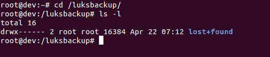
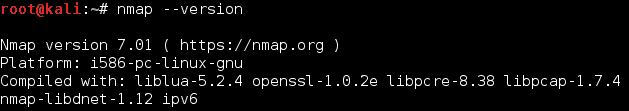
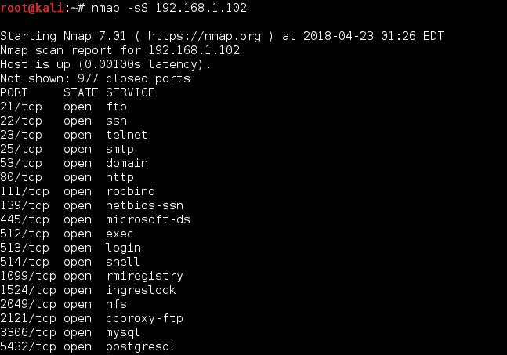

# 第一章：Linux 安全问题

一台 Linux 机器的安全性取决于管理员的配置。我们安装完自己选择的 Linux 发行版并移除所有不必要的包之后，可以通过微调已安装的软件和服务来开始处理系统的安全问题。

在本章中，我们将讨论以下主题：

+   配置服务器安全

+   安全策略—服务器安全

+   定义安全控制

+   缺乏备份计划

本章将涵盖以下内容：

+   使用校验和检查安装介质的完整性

+   使用 LUKS 磁盘加密

+   利用`sudoers`—配置`sudo`权限

+   使用 Nmap 扫描主机

+   获取脆弱的 Linux 系统的 root 权限

+   缺乏备份计划

# 安全策略

安全策略是一个定义，概述了组织在计算机网络安全方面应遵循的规则和做法。安全策略定义了组织应如何管理、保护和分发敏感数据。

# 制定安全策略

在创建安全策略时，您应该牢记它应该简洁易懂，便于所有用户遵循。策略的目标应该是在保护数据的同时，保持用户的隐私。

它应围绕以下几点进行开发：

+   系统的可访问性

+   系统上的软件安装权限

+   数据权限

+   从故障中恢复

在制定安全策略时，用户应仅使用已获得授权的服务。任何不允许的行为都应在策略中加以限制。让我们来看一些常见的 Linux 安全误区。

# Linux 安全误区

在计划在您的业务中使用基于 Linux 的系统时，您可能会感到紧张。这可能是由于一些关于 Linux 安全的错误传言，认为这些系统可能已成为某些安全误区的受害者。

# 误区 – 由于 Linux 是开源的，因此它被认为不安全

Linux 作为一个免费和开源的操作系统，拥有许多优势。它包括一个庞大的开发者基础，这些开发者不断审计源代码，寻找潜在的安全风险；Linux 社区能够为任何可能的安全问题提供快速的支持和修复。补丁会快速发布给社区进行测试，因此它们不必处理其他 Unix 供应商可能遇到的繁琐管理问题。

由于全球庞大的用户群体，Linux 的安全性在各种计算环境中得到了广泛的测试，从而使其成为最稳定、最安全的操作系统之一。由于 Linux 开放供全球开发者审查，它有助于在权限分配的方式上提高安全性。Linux 系统中这些权限的分配方式也是源自开源代码的安全特性。

# 误区 – Linux 仅适用于专家，只有他们知道如何在安全方面配置系统

假设 Linux 仅适用于懂得如何处理病毒的专家是一个误解。Linux 已经发展成了一个适合任何人使用的最友好的操作系统之一，无论是新手还是专家。

Linux 因其强大的架构而安全。Linux 系统上的普通用户拥有低权限账户，而不是 root 权限。

# 错误观念——Linux 是没有病毒的

由于其强大的架构，即使 Linux 系统被攻破，病毒也无法获得 root 权限，因此无法对系统造成重大损害。

即使在 Linux 服务器上，也会实施多个级别的安全措施，并且它们会更频繁地更新，从而有助于保护服务器免受病毒侵害。

仍然存在一些针对 Linux 的病毒，因此它并非完全没有病毒。但大多数存在的 Linux 病毒性质上是非破坏性的。

# 配置服务器安全

创建 Linux 服务器后，紧接着的步骤是实施安全程序，确保任何威胁都不会导致系统被攻击。对 Linux 服务器恶意攻击的一个主要原因是安全措施实施不当或存在漏洞。在配置服务器时，安全策略需要正确实施，以创建一个安全的环境，帮助防止您的业务被黑客攻击。

# 如何操作...

让我们逐一查看每个配置。

# 用户管理

按照以下步骤配置服务器安全：

1.  当创建 Linux 服务器时，默认创建的第一个用户始终是 root 用户。该 root 用户仅应用于初始配置。

1.  初始配置完成后，应通过 SSH 禁用此 root 用户。这将使黑客更难以访问您的 Linux 机器。

1.  此外，应创建一个二级用户来登录并管理机器。如果需要执行管理操作，可以授予该用户 sudo 权限。

# 密码策略

按照以下步骤配置服务器安全：

1.  创建用户账户时，确保使用强密码。如果允许，密码长度应保持在 12 到 14 个字符之间。

1.  如果可能，随机生成密码，并包括小写字母、大写字母、数字和符号。

1.  避免使用容易猜测的密码组合，如字典单词、键盘模式、用户名、身份证号等。

1.  避免重复使用相同的密码。

# 配置策略

按照以下步骤配置服务器安全：

1.  服务器上的操作系统应根据批准的 InfoSec 指南进行配置。

1.  任何未使用的服务或应用程序应尽可能禁用。

1.  服务器上服务和应用程序的每次访问都应进行监控和记录。还应通过访问控制方法进行保护。此示例将在第三章中讨论，*本地文件系统安全*。

1.  系统应保持更新，并且应尽快安装任何可用的最新安全补丁。

1.  尽量避免使用 root 账户。最好使用需要最低权限才能执行功能的安全原则。

1.  任何特权访问必须尽可能通过安全通道连接（SSH）进行。

1.  服务器的访问应在受控环境中进行。

# 监控策略

1.  服务器系统上的所有安全相关操作必须进行日志记录，并且审核报告应按如下方式保存：

+   所有与安全相关的日志应保持在线一个月。

+   所有每日备份和每周备份应保留一个月。

+   至少保留两年的每月完整备份

1.  任何与安全相关的事件发生泄露时，应报告给 InfoSec 团队。随后，他们将审查日志并将事件报告给 IT 部门。

1.  一些安全相关事件的示例如下：

+   端口扫描相关攻击

+   未经授权访问特权账户

+   由于主机上的某个特定应用程序而导致的异常情况

# 它是如何工作的...

遵循此处给出的策略有助于组织拥有或运营的内部服务器的基本配置。有效实施该策略将最大限度地减少对任何敏感和专有信息的未经授权访问。

# 安全策略 – 服务器安全

对 Linux 服务器的恶意攻击的主要原因之一是安全实施不当或现有漏洞。在配置服务器时，需要正确实施安全策略，并对服务器的适当定制负责。

# 如何执行…

让我们看一下各种安全策略

# 一般策略

让我们讨论各种安全策略：

1.  组织内所有服务器的管理由一个专门的团队负责，该团队还应监控任何合规性问题。如果发生合规性问题，该团队应立即审查并实施更新的安全策略。

1.  在配置内部服务器时，必须以如下方式进行注册，以便根据以下信息识别服务器：

    +   服务器的位置

    +   操作系统版本和硬件配置

    +   服务器上运行的服务和应用程序

1.  组织的管理系统中的任何信息必须始终保持最新。

# 配置策略

让我们讨论各种安全策略：

1.  服务器上的操作系统应按照 InfoSec 批准的指南进行配置。

1.  任何未使用的服务或应用程序应尽可能禁用。

1.  对服务器上所有服务和应用程序的访问应进行监控和记录，并应通过访问控制方法进行保护。有关示例将在第三章中介绍，*本地文件系统安全*。

1.  系统应保持更新，任何可用的最新安全补丁应尽快安装。

1.  尽量避免使用 root 账户。最好使用最小权限原则来执行功能。

1.  任何类型的特权访问都必须通过安全通道连接（SSH）进行，尽可能地。

1.  访问服务器应在受控环境下进行。

# 监控策略

让我们讨论一下各种安全策略：

1.  所有与安全相关的服务器系统操作必须记录日志，并且审计报告应按如下方式保存：

    +   在一个月的时间内，所有与安全相关的日志应保持在线。

    +   在一个月的时间内，日常备份以及每周备份应予以保留。

    +   至少保留两年的月度完整备份。

1.  任何与安全相关的事件如果被泄露，应该报告给信息安全团队。然后他们会审查日志并将事件报告给 IT 部门。

1.  一些与安全相关的事件示例如下：

    +   与端口扫描相关的攻击

    +   未经授权访问特权账户

    +   主机上由特定应用程序引起的异常事件

# 它是如何工作的...

遵循这里给出的策略有助于组织所拥有或运营的内部服务器的基础配置。有效实施该策略将最小化对任何敏感和专有信息的未经授权访问。

# 定义安全控制

加固 Linux 服务器的过程从加固系统开始，为此，定义安全控制列表非常重要。安全控制列表（或安全检查清单）可以确认已实施适当的安全控制措施。

# 如何执行...

让我们看一下各种安全控制检查表。

# 安装

现在我们将查看每个安全控制检查表：

+   安装介质如 CD-ROM/DVD/ISO 应通过使用校验和进行检查。

+   在创建服务器时，应进行最小基础安装。

+   为`/home`和`/tmp`创建单独的文件系统是一种良好的做法。

+   在服务器上安装最小软件是一种良好的实践，可以最大限度地减少漏洞的可能性。

+   始终保持 Linux 内核和软件的最新状态。

# 启动和磁盘

现在我们将查看每个安全控制检查表：

+   使用如 LUKS 等磁盘加密方法对分区进行加密。

+   通过配置 BIOS 密码限制对 BIOS 的访问。

+   限制可启动设备，仅允许像磁盘这样的设备启动。

+   配置密码以访问单用户模式的引导加载程序。

# 网络与服务

现在我们将查看每个安全控制检查表：

+   通过检查打开的网络端口来确定正在运行的服务。

+   使用防火墙，如`iptables/nftables`，根据需要限制对服务的访问。

+   加密所有通过网络传输的数据。

+   避免使用 FTP、Telnet、Rlogin/Rsh 等服务。

+   应禁用任何不必要的服务。

+   应使用集中式认证服务。

# 入侵检测和拒绝服务（DoS）

现在我们将查看每个安全控制检查表：

+   应安装并配置文件完整性工具，如 AIDE、Samhain 和 AFICK，用于监控重要文件。

+   使用恶意软件扫描工具，如 CalmAV，来防止恶意脚本。

+   配置系统日志记录到远程机器，用于检测、取证和归档。

+   通过使用反暴力破解工具来防止暴力破解攻击。

# 审计和可用性

现在我们将查看每个安全控制检查表：

+   阅读日志以监控可疑活动。

+   配置 auditd 配置以执行系统帐务。

+   确保备份正常工作，并检查恢复。

# 它是如何工作的……

实施这些安全控制措施可以最小化 Linux 服务器的安全风险，帮助保护数据免受黑客攻击。

# 使用校验和检查安装介质的完整性

每当你下载任何 Linux 发行版的镜像文件时，都应该检查文件的正确性和安全性。这可以通过下载镜像文件后生成 MD5 哈希，然后将生成的哈希与提供镜像文件的组织生成的哈希进行比较来完成。

这有助于检查下载文件的完整性。如果原始文件被篡改，通过 MD5 哈希比较可以检测到。文件大小越大，文件变化的可能性越高。强烈建议你对操作系统安装光盘等文件进行 MD5 哈希比较。

# 做好准备

`md5sum` 通常已在大多数 Linux 发行版中安装，因此无需安装。

# 如何执行……

执行以下步骤：

1.  打开 Linux 终端，然后将目录切换到包含已下载 ISO 文件的文件夹。

由于 Linux 对大小写敏感，输入文件夹名称时请确保拼写正确。在 Linux 中，Downloads 与 downloads 并不相同。

1.  切换到下载目录后，输入以下命令：

```
md5sum ubuntu-filename.iso
```

md5sum 将以单行形式打印计算的哈希，如下所示：

```
8044d756b7f00b695ab8dce07dce43e5 ubuntu-filename.iso
```

现在，我们可以将此命令计算出的哈希与 UbuntuHashes 页面上的哈希进行比较（[`help.ubuntu.com/community/UbuntuHashes`](https://help.ubuntu.com/community/UbuntuHashes)）。打开 UbuntuHashes 页面后，我们只需要将之前计算出的哈希复制到浏览器的查找框中（通过按 *Ctrl* + *F*）。

# 它是如何工作的……

如果计算出的哈希值与 UbuntuHashes 页面上的哈希值匹配，则表示下载的文件没有损坏。如果哈希值不匹配，则可能是文件已被篡改或损坏。尝试重新下载文件。如果问题仍然存在，建议向服务器管理员报告该问题。

# 另见

如果你想再进一步，下面是一个额外的内容：适用于 Ubuntu 的 GUI 校验和计算器。

有时候，使用终端进行校验和检查真的很不方便。你需要知道下载文件的正确文件夹和准确的文件名，这让记住确切的命令变得很困难。

作为解决方案，有一个非常小巧简单的软件——**GtkHash**。

你可以在这里下载该工具：[`gtkhash.sourceforge.net/`](http://gtkhash.sourceforge.net/)。

或者，你也可以使用以下命令安装它：

```
sudo apt-get install gtkhash 
```

# 使用 LUKS 磁盘加密

在企业、小型企业和政府办公室中，用户可能需要保护他们的系统，以保护个人数据，包括客户信息、重要文件、联系方式等。为此，Linux 提供了许多加密技术，可以用来保护硬盘或可移动介质等物理设备上的数据。一个这样的加密技术是使用**Linux 统一密钥设置**（**LUKS**）磁盘格式。此技术允许加密 Linux 分区。

这是 LUKS 的功能**：**

+   整个块设备可以使用 LUKS 进行加密；它非常适合保护可移动存储介质或笔记本硬盘上的数据。

+   LUKS 使用现有的设备映射内核子系统

+   它还提供了密码短语强化功能，有助于防止字典攻击。

# 准备工作

为了让以下过程顺利进行，在安装 Linux 时需要创建一个单独的分区，该分区将使用 LUKS 进行加密。

按照给定步骤配置 LUKS 将删除加密分区上的所有数据。因此，在开始使用 LUKS 之前，请确保将数据备份到外部来源。

# 如何操作...

要手动加密目录，请执行以下步骤：

1.  按照此处所示安装`cryptsetup`，它是用于设置加密文件系统的工具：

```
apt-get install cryptsetup
```

前面的命令生成以下输出：


1.  加密你的`/dev/sdb1`分区，它是一个可移动设备。要加密该分区，请输入以下命令：

```
cryptsetup -y -v luksFormat /dev/sdb1
```

前面的命令生成以下输出：


该命令初始化分区并设置一个密码短语。请确保记下密码短语，以便后续使用。

1.  现在通过创建映射打开新创建的加密设备：

1.  检查以确认设备是否存在：

```
ls -l /dev/mapper/backup2
```

上述命令生成以下输出：


1.  使用以下命令检查映射状态：

1.  使用以下命令导出 LUKS 头部信息：

1.  接下来，将零写入 `/dev/mapper/backup2` 加密设备：

由于 `dd` 命令可能需要几个小时才能完成，我们使用 `pv` 命令来监控进度。

1.  现在创建文件系统：

```
mkfs.ext4 /dev/mapper/backup2
```

上述命令生成以下输出：


1.  然后挂载新文件系统并确认文件系统是否可见：

恭喜！你已成功创建加密分区。现在，即使电脑关机，你也能保证数据安全。

# 还有更多...

执行以下命令来卸载并保护分区上的数据：

```
umount /backup2
cryptsetup luksClose backup
```

要重新挂载加密分区，请执行以下步骤：

```
cryptsetup luksOpen /dev/xvdc backup2
mount /dev/mapper/backup2 /backup2
df -H
mount
```


# 利用 sudoers —— 配置 sudo 访问权限

Sudoer 是 Linux 系统的一个功能，管理员可以通过它向受信任的普通用户提供管理员访问权限，而无需实际共享 root 用户的密码。管理员只需将普通用户添加到 sudoers 列表中。

一旦用户被添加到 sudoers 列表中，他们就可以通过在命令前加上 sudo 来执行任何管理员命令。接着，系统会要求用户输入自己的密码。之后，管理员命令将以与 root 用户相同的方式执行。

# 准备就绪

由于配置文件是预定义的且使用的命令是内建的，因此在开始步骤之前不需要进行额外配置。

# 如何操作…

执行以下步骤：

1.  首先创建一个普通账户，然后为其提供 sudo 权限。完成后，你将能够从新账户使用 `sudo` 命令，并执行管理员命令。按照给定步骤配置 sudo 访问权限。首先，使用 root 账户登录系统，然后使用 `useradd` 命令创建一个用户账户，如下所示。将命令中的 USERNAME 替换为你选择的任何名字：


1.  现在，使用 `passwd` 命令为新用户账户设置密码，如下所示：

1.  现在通过运行 `visudo` 编辑 `/etc/sudoers` 文件，如下所示。使用 `sudo` 命令时应用的策略由 `/etc/sudoers` 文件定义：

1.  打开文件后，搜索以下行，这些行允许测试组的用户获得 sudo 访问权限：

1.  您可以通过删除第二行开头的注释字符（`#`）来启用给定的配置。更改完成后，保存文件并退出编辑器。现在，使用 `usermod` 命令将先前创建的用户添加到测试组中：

1.  现在，您需要检查当前创建的配置是否允许新用户帐户使用 `sudo` 执行命令。

1.  要切换到新创建的用户帐户，请使用 `su` 选项：

1.  现在，使用 `groups` 命令确认该用户帐户是否在测试组中：

最后，从新帐户运行带有 `sudo` 的 `whoami` 命令。由于您是第一次使用该新用户帐户通过 `sudo` 执行命令，因此会显示 `sudo` 命令的默认横幅消息。屏幕还会要求输入用户帐户密码：


1.  输出的最后一行是 `whoami` 命令返回的用户名。如果 `sudo` 配置正确，该值将是 root。

您已成功配置了一个具有 `sudo` 权限的用户。现在，您可以登录此用户帐户，并像使用 root 用户一样使用 `sudo` 执行命令。

# 它是如何工作的…

当您创建一个新帐户时，它没有运行管理员命令的权限。然而，在编辑 `/etc/sudoers` 文件并进行适当的条目以授予新用户帐户 `sudo` 访问权限后，您就可以开始使用新帐户执行所有管理员命令。

# 还有更多内容…

以下是一些您可以采取的额外措施，以确保完全的安全性。

# 漏洞评估

漏洞评估是审计您的网络和系统安全的过程，通过该过程，您可以了解网络的机密性、完整性和可用性。漏洞评估的第一阶段是侦察，这将进一步引导进入系统准备阶段，在该阶段我们主要检查目标中所有已知的漏洞。接下来是报告阶段，我们将所有发现的漏洞分为低风险、中等风险和高风险类别。

# 使用 Nmap 扫描主机

Nmap 是用于扫描网络的工具，是 Linux 中最流行的工具之一。它已经存在多年，目前是收集网络信息的首选工具之一。Nmap 可以由管理员在其网络上使用，用于查找任何开放端口和主机系统。在进行漏洞评估时，Nmap 绝对是一个不容错过的工具。

# 准备工作

大多数 Linux 版本都预装了 Nmap。第一步是使用以下命令检查您是否已安装它：

```
    nmap --version
```

如果 Nmap 存在，您应该看到类似以下的输出：



如果 Nmap 尚未安装，你可以通过以下链接下载并安装它：[`nmap.org/download.html`](https://nmap.org/download.html)

以下命令将快速在你的系统上安装 Nmap：

```
sudo apt-get install nmap
```

# 如何操作...

扫描主机时请按照以下步骤操作：

1.  Nmap 最常见的用途是查找给定 IP 范围内的所有在线主机。所使用的默认命令需要一些时间来扫描完整的网络，这取决于网络中主机的数量。

1.  以下截图展示了一个例子：

1.  要对子网中的特定 IP 执行 SYN 扫描，请使用以下命令：

1.  如果 SYN 扫描不能正常工作，你也可以使用隐形扫描：

1.  要检测远程主机上运行的服务版本号，可以执行服务版本检测扫描，如下所示：

1.  如果你想检测远程主机上运行的操作系统，请运行以下命令：

```
nmap -O 192.168.1.102
```


1.  这里的输出已被截断：

1.  如果你只想扫描某个特定端口，如`80`，请运行以下命令：

# 它是如何工作的...

Nmap 通过测试最常见的网络通信端口来检查正在监听的服务。此信息有助于网络管理员关闭所有不需要或未使用的端口和服务。之前的示例展示了如何使用端口扫描以及如何利用 Nmap 作为强大的工具来研究我们周围的网络。

# 参见

Nmap 还具有脚本功能，可以用来编写自定义脚本。这些脚本可以与 Nmap 一起使用，自动化并扩展 Nmap 的扫描能力。

你可以在 Nmap 的官方网站找到更多关于使用 Nmap 的信息：[`nmap.org/`](https://nmap.org/)

# 获取有漏洞的 Linux 系统的 root 权限

当尝试学习如何扫描并利用 Linux 机器时，我们遇到的一个主要问题是哪里可以进行尝试。为此，Metasploit 团队开发并发布了一款虚拟机，名为*Metasploitable*。这台机器故意设为有漏洞，运行了许多未打补丁的服务。因此，它成为了一个非常适合练习或开发渗透测试技能的平台。在本节中，我们将学习如何扫描 Linux 系统，并通过扫描结果，找到一个有漏洞的服务。利用这个漏洞服务，我们将获取系统的 root 权限。

# 准备工作

本节将使用 Kali Linux 和 Metasploitable VMware 系统。Metasploitable 的镜像文件可以从以下链接下载：

+   [`sourceforge.net/projects/metasploitable/files/Metasploitable2/`](http://sourceforge.net/projects/metasploitable/files/Metasploitable2/)

+   [`images.offensive-security.com/virtual-images/kali-linux-2018.2-vm-i386.zip`](https://images.offensive-security.com/virtual-images/kali-linux-2018.2-vm-i386.zip)

# 如何操作…

Metasploit 框架是一个开源工具，全球的安全专业人员使用它通过在框架内执行漏洞代码来进行渗透测试。它预装在 Kali Linux 中（Kali Linux 是安全专家的首选发行版）。

按照以下步骤获得对易受攻击的 Linux 系统的 root 访问权限：

1.  首先通过运行以下命令在 Kali 系统上打开 Metasploit 控制台：

```
service postgresql start
msfconsole
```


1.  在屏幕底部，你应该看到由`msf>`表示的 Metasploit 框架提示符。

1.  接下来，我们需要使用 Nmap 扫描目标（在本示例中是`192.168.0.102`）：

以下截图显示了命令的输出：


1.  在前面的命令中，你可以看到许多服务正在不同的端口上运行。其中你可以看到 FTP 也在端口`21`上运行。

1.  我们现在重点关注 FTP 服务。从输出结果中可以看到，FTP 服务由 vsftpd 应用程序版本 2.3.4 提供。

1.  现在让我们尝试在 Metasploit 框架中为`vsftpd`寻找一个漏洞，通过简单地执行命令`search vsftpd`。以下是输出结果：


1.  搜索结果显示了一个模块——VSFTPD 后门命令执行，评分非常高，这意味着这个漏洞可以完美地工作。

1.  现在运行以下命令来使用漏洞并检查其选项：

1.  如截图所示，你需要设置`RHOST`的值，在我们的例子中是`192.168.1.102`。

1.  设置`RHOST`的值，然后按照如下所示执行漏洞：


1.  一旦漏洞成功执行，你将获得 root 访问权限，如前面的截图所示。

# 它是如何工作的…

我们首先进行了 Nmap 扫描，检查运行的服务和开放的端口，并发现 FTP 服务正在运行。然后我们尝试找出 FTP 服务的版本。一旦获取了信息，我们就搜索是否有适用于 VSFTPD 的漏洞。搜索结果中找到的 VSFTPD 后门模块，实际上是 Metasploit 框架发送到目标机器的代码。由于 VSFTPD 的某个模块编写不当，代码会在目标机器上执行。一旦代码执行，我们就能在 Kali 机器上获得 root shell 访问权限。

使用找到的 VSFTPD 漏洞，我们尝试攻击目标系统并获得了 root shell。

# 还有更多…

让我们了解一些 Linux 中常见的其他漏洞和攻击方式。

# 缺少备份计划

在这个充满恶意攻击和危险网络攻击的时代，数据永远不安全。你的数据需要的不仅仅是保护，它还需要备份作为保险。在任何时候，如果你的数据丢失，拥有数据备份可以确保你的业务能够迅速恢复运行。

# 准备工作

当我们谈论 Linux 中的数据备份时，选择一个与业务需求相匹配的最佳备份工具是至关重要的。每个人都需要一个可靠的数据备份工具，但不需要花费过多，以便获得满足需求的功能。备份工具应该允许你进行本地备份、远程备份、一次性备份、定期备份等许多功能。

# 如何操作…

让我们来看一下几个出色的 Linux 备份工具。

# fwbackups

这是所有 Linux 备份工具中最简单的。fwbackups 具有用户友好的界面，可以用于单次备份，也可以用于定期备份。

可以通过各种格式进行本地和远程备份，例如 `tar`、`tar.gz`、`tar.bz` 或 `rsync` 格式。可以使用该工具备份单个文件或整个计算机。

使用该工具，备份和恢复可以轻松完成。增量或差异备份可以加速该过程。

# rsync

这是最广泛使用的 Linux 备份解决方案之一。它可用于增量备份，无论是本地备份还是远程备份。

`rsync` 可以在保持链接、所有权、权限和特权的同时，更新目录树和文件系统。

作为一款命令行工具，`rsync` 非常适合用来创建简单的脚本，结合 `cron` 使用，以便实现自动化备份。

# Amanda（高级马里兰自动网络磁盘归档器）

这是一个为“*中型计算机中心*”开发的免费开源工具。它旨在通过网络对多台机器进行备份，备份目标可以是磁带驱动器、磁盘或光盘。

Amanda 可以用于备份多样化网络中的几乎所有内容，结合主备份服务器与 Linux 或 Windows 系统使用。

LVM 快照和硬件快照也可以通过该工具进行处理。

# 简单备份解决方案（SBS）

SBS 主要针对桌面备份，可以用于备份文件和目录。它还允许使用正则表达式进行排除操作。

它包括预定义的备份配置，可以用来备份如 `/var/`、`/etc/`、`/usr/local` 等目录。

SBS 可用于自定义备份、手动备份和定期备份，并不限于仅仅预定义的备份。

# Bacula

Bacula 是一个免费开源工具，需要在每个目标系统上安装客户端程序，所有这些系统通过一个集中控制的服务器来管理备份规则。

Bacula 有自己的文件格式，并不是专有的，因为该工具是开源的。

可以使用该工具进行常规的全量和增量备份，如果使用多个服务器并配有独立磁带驱动器，它还提供更好的配置支持。

Bacula 支持加密和 RAID。Bacula 还提供了自定义备份任务的脚本语言，可以用来集成加密功能。

# 它是如何工作的…

备份工具对于任何 IT 行业从业者或计算机重度用户都是必需的。该备份工具应支持定时备份、一键备份、本地备份、远程备份以及许多其他功能。
