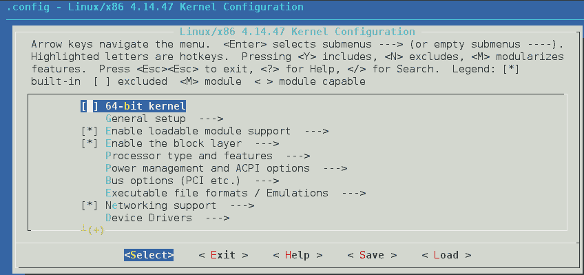

# 第二章：配置安全且优化的内核

内核是任何操作系统的核心，无论是 Windows 还是 Linux。从技术上讲，Linux 只是内核，而不是完整的操作系统。作为操作系统的核心，内核首先被安装，通常无需手动配置。即使需要安装一些内核级别的更新，在 Linux 系统上也可以像常规应用程序一样进行安装。然而，在某些情况下，可能需要从源代码编译内核并进行特定的修改。

然而，可能会有一些情况需要您自己从源代码编译内核。这些情况包括：

+   启用内核中的实验性功能

+   启用新硬件支持

+   调试内核

+   探索内核源代码

在您开始构建 Linux 内核之前，必须确保已经存在用于 Linux 系统的有效启动媒体。这可以用于在引导加载程序配置不正确的情况下启动到 Linux 系统。您将学习如何创建 USB 启动媒体、获取内核源代码、配置和构建内核，并从内核安装并启动。

在本章中，我们将涵盖以下内容：

+   创建 USB 启动媒体

+   获取内核源代码

+   配置和构建内核

+   从内核安装并启动

+   内核测试与调试

+   使用 Netconsole 配置调试控制台

+   调试内核启动

+   内核错误

+   使用 Lynis 检查内核参数

# 创建 USB 启动媒体

可以在任何格式为 ext2、ext3 或 VFAT 的 USB 媒体设备上创建 USB 启动媒体。同时，请确保设备上有足够的空闲空间，通常在 4 GB 用于传输发行版 DVD 镜像，700 MB 用于发行版 CD 镜像，或仅 10 MB 用于传输最小启动媒体镜像。对于不太熟悉 Linux 的读者来说，学习如何创建启动媒体将非常有帮助。

# 准备工作

在开始步骤之前，您需要准备一个 Linux 安装磁盘的镜像文件，您可以将其命名为`boot.iso`，以及一个 USB 存储设备，正如之前所述。

# 操作步骤...

要开始创建 USB 启动媒体的过程，您需要以 root 用户执行以下命令：

1.  要在您的系统上安装 Syslinux，只需执行以下命令：

```
sudo apt-get install syslinux
```

1.  您需要通过在 USB 存储设备上执行以下命令来安装 Syslinux 引导加载程序：

```
       syslinux /dev/sdb1
```

1.  现在通过执行以下命令为`boot.iso`文件和 USB 存储设备各创建一个挂载点：

```
    mkdir /mnt/isoboot /mnt/diskboot
```

1.  接下来，将`boot.iso`文件挂载到为其创建的挂载点：

```
    mount -o loop boot.iso /mnt/isoboot
```

在之前的命令中，`-o loop`选项用于创建一个伪设备，充当基于块的设备。它将文件视为块设备。

1.  接下来，将 USB 存储设备挂载到为其创建的挂载点：

```
    mount /dev/sdb1 /mnt/diskboot
```

1.  一旦 `boot.iso` 和 USB 存储设备都已挂载，复制 `boot.iso` 中的 Isolinux 文件到 USB 存储设备：

```
    cp /mnt/isoboot/isolinux/* /mnt/diskboot
```

1.  接下来，运行命令使用 `boot.iso` 文件中的 `isolinux.cfg` 文件作为 USB 存储设备的 `syslinux.cfg` 文件：

```
    grep -v local /mnt/isoboot/isolinux/isolinux.cfg > /mnt/diskboot/syslinux.cfg
```

1.  完成前面的命令后，卸载 `boot.iso` 和 USB 存储设备：

```
    unmount /mnt/isoboot /mnt/diskboot
```

1.  现在重新启动系统，然后尝试使用 USB 启动媒体启动，以验证您是否能从中启动。

# 它是如何工作的...

当您从 `boot.iso` 文件复制所需的文件到 USB 存储媒体，并将 USB 存储媒体中的 `isolinux.cfg` 文件作为 `syslinux.cfg` 文件使用时，它将把 USB 存储设备转换为可引导的媒体设备，从而可以用来启动 Linux 系统。

# 获取内核源代码

大多数 Linux 发行版都包含内核源代码。然而，这些源代码可能有些过时。因此，您在构建或定制内核时，可能需要获取最新的源代码。

# 准备就绪

大多数 Linux 内核开发者社区使用**Git**工具进行源代码管理。甚至 Ubuntu 也将 Git 集成到其 Linux 内核源代码中，从而使内核开发者能更好地与社区互动。您可以使用以下命令安装 Git 包：

```
sudo apt-get install git
```

# 如何做...

Linux 内核源代码可以从不同的来源下载，下面我们将介绍从这些来源下载的几种方法：

1.  我们可以在 Linux 内核的官方网站上找到完整的 tarball 以及增量补丁的源代码：

[`www.kernel.org`](http://www.kernel.org/)

除非您有特定的原因需要使用较旧的版本，否则始终建议使用最新版本。

1.  Ubuntu 的内核源代码可以在 Git 中找到。每个版本的内核代码都会在 `kernel.ubuntu.com` 上以独立的 Git 仓库进行维护，仓库位置如下：

`git://kernel.ubuntu.com/ubuntu/ubuntu-<release>.git`

它位于这里：

`http://kernel.ubuntu.com/git-repos/ubuntu/`

1.  您可以使用 Git 克隆仓库，获取本地副本。命令会根据您感兴趣的 Ubuntu 版本进行修改。

1.  要获取精确的树结构，请插入以下命令：


要下载其他树结构，命令的语法如下：

```
    git clone git://kernel.ubuntu.com/ubuntu/ubuntu-<release>.git
```

1.  下载的文件将是 GNU ZIP（`gzip`）格式或 `bzip2` 格式。下载源文件后，您需要解压它。如果压缩包是 `bzip2` 格式，请使用以下命令：

```
tar xvjf linux-x.y.z.tar.bz2
```

如果是压缩的 GNU ZIP 格式，请使用以下命令：

```
tar xvzf linux-x.y.z.tar.gz
```

# 它是如何工作的...

通过这里提到的不同方法，您可以下载 Linux 内核的源代码。使用任何选项都取决于用户的选择和偏好。

# 配置和构建内核

配置内核的需求可能由于多种原因而产生。您可能希望调整内核的大小，仅运行必要的服务，或者您可能需要打补丁以支持内核之前不支持的新硬件。对任何系统管理员来说，这可能是一项艰巨的任务，在本节中，您将看到如何配置和构建内核。

# 准备工作

始终建议在任何系统中为内核在启动分区中留出足够的空间。您应该选择整个磁盘安装选项，或者为启动分区分配至少 3 GB 的磁盘空间。安装完您的 Linux 发行版并配置了所需的开发包后，为您的用户帐户启用 sudo。现在在开始安装任何软件包之前，先更新系统：

```
    sudo apt-get update && sudo apt-get upgrade
```

在此之后，您需要安装一些软件包才能开始。这些软件包包括此处提到的包：

+   最新版本的`gcc`

+   ncurses 开发包

+   用于交叉编译 Linux 内核所需的软件包

+   用于运行 make menuconfig 的包

为此，使用此处给出的命令：

```
sudo apt-get install build-essential gcc libncurses5-dev ncurses-dev binutils-multiarch alien bc libelf-dev
```

这些软件包用于在`x86_64`系统上配置和编译 Linux 内核。

# 如何操作...

完成*准备工作*部分的步骤后，您可以开始配置和构建内核的过程。这个过程会花费很长时间，所以请做好准备：

1.  通过访问[`www.kernel.org`](http://www.kernel.org)下载 Linux 内核，如此处截图所示：


1.  或者您可以使用以下命令：

```
wget https://www.kernel.org/pub/linux/kernel/v4.x/linux-4.14.47.tar.xz
```


1.  下载完成后，转到下载保存的文件夹。执行此操作的命令是：

****

1.  现在使用以下命令将下载的 tar 文件提取到`/usr/src/`：


1.  接下来，切换到文件提取的文件夹：


1.  现在运行命令来配置 Linux 内核，以便在系统上编译和安装：


如果您的帐户没有管理员权限，可能需要在命令前加上`sudo`。

1.  执行前面的命令后，将弹出一个包含许多菜单的窗口，如此处所示。选择新配置的项目：



1.  您需要检查文件系统菜单，如下所示：


1.  在菜单下，检查是否已选择`ext4`，如截图所示。如果没有选中，您需要现在选择它：


1.  然后提供一个名称并保存配置：


1.  现在编译 Linux 内核。根据系统配置，编译过程大约需要 40 到 50 分钟完成。按照下面的命令运行：

```
    make -j 5 
```

前述命令的输出如下图所示：


# 它是如何工作的...

首先下载 Linux 内核源代码，然后将其解压到特定位置，接着配置内核以进行编译过程。

# 安装并从内核启动

在花费大量时间配置和编译内核后，您现在可以开始将内核安装到本地系统的过程。

# 准备工作

在开始安装内核之前，确保备份系统中的所有重要数据。同时，将`/boot/`目录复制到格式化为 FAT32 文件系统的外部存储中。如果安装过程由于任何原因失败，这将有助于修复系统。

# 如何操作...

一旦内核编译完成，您可以开始按照此处的命令继续安装内核：

1.  如果作为模块启用，可以通过运行命令来安装驱动程序。该命令将把模块复制到`/lib/modules`的子目录中：


1.  现在运行以下命令以安装实际的内核：

```
    make install 
```

前述命令将显示以下输出：


该命令执行`/sbin/installkernel`。新内核将安装到`/boot/vmlinuz-{version}`。如果`/boot/vmlinuz`已存在符号链接，它将通过将`/boot/vmlinuz`链接到新内核来刷新。以前安装的内核将作为`/boot/vmlinuz.old`可用。对配置文件和`System.map`文件也会发生相同的情况。

1.  接下来，通过运行以下命令将内核复制到`/boot`目录：

```
    cp -v arch/x86/boot/bzImage /boot/vmlinuz-4.1.6
```

前述命令将显示以下输出：


1.  现在制作初始 RAM 磁盘：

1.  接下来，我们需要复制`System.map`，它包含内核符号及其对应的地址。运行给定命令来执行此操作，并将内核的名称附加到目标文件中：

1.  接下来，创建一个`symlink /boot/System.map`文件，该文件将指向`/boot/System.map-YourKernelName`，如果`/boot`所在的文件系统支持`symlinks`：

如果`/boot`所在的文件系统不支持符号链接，只需运行`cp /boot/System.map-YourKernelName /boot/System.map`

# 它是如何工作的...

一旦内核配置并编译完成，就可以安装到系统中。第一个命令将模块复制到`/lib/modules`的子目录中。第二个命令执行`/sbin/installkernel`。同时，新的内核将被安装到`/boot/vmlinuz-{version}`中。在此过程中，如果`/boot/vmlinuz`已经存在符号链接，它将被更新，指向新的内核。而之前安装的内核将作为`/boot/vmlinuz.old`保留。配置文件和`System.map`文件也会做同样的处理。完成这些操作后，我们可以重启系统，使用新的内核启动：


# 内核测试和调试

任何开放或封闭的软件开发周期中，测试和调试都是重要的一部分。Linux 内核也不例外。测试和调试的最终目标是确保内核在安装新的内核源代码后，仍然能够与之前的版本以相同的方式工作。

# 使用 netconsole 配置控制台进行调试

Linux 内核的最大问题之一是内核恐慌（Kernel Panic）。它类似于微软 Windows 操作系统中的*蓝屏死机*（Blue Screen of Death）。如果内核发生恐慌，它将把大量信息显示在屏幕上，并保持在那里。如果系统重启，由于没有生成日志，就很难追踪内核恐慌。为了解决这个问题，我们可以使用 Netconsole。它是一个内核模块，可以通过 UDP 记录内核的`printk`消息。当磁盘日志失败时，这对于调试问题非常有帮助。

# 准备工作

在开始配置 Netconsole 之前，你需要知道要发送 UDP 数据包的系统的 MAC 地址。这个系统可以称为接收端，可能在同一子网中，也可能在不同的子网中。这里描述了这两种情况。我们先来看第一种情况，当接收端在同一子网中时：

1.  本示例中接收端的 IP 地址是`192.168.1.4`。我们将使用此命令将 UDP 数据包发送到该 IP 地址：

1.  现在通过执行以下命令，来查找接收端系统的 MAC 地址。这里，IP 地址是接收端系统的：

如前面的示例所示，`90:00:4e:2f:ac:ef`是我们需要的 MAC 地址。现在来看第二种情况，当接收端不在同一子网时。

1.  在这种情况下，我们需要先找到默认网关。为此，执行下面的命令：

在这种情况下，默认网关是`192.168.1.1`。

1.  我们需要找到默认网关的 MAC 地址。首先，向默认网关发送一个数据包：


1.  现在我们来查找 MAC 地址：

这里，`c0:3f:0e:10:c6:be`是我们需要的默认网关的 MAC 地址。现在我们已经有了接收端的 MAC 地址，可以开始进行 Netconsole 的配置过程。

# 如何操作...

首先，你需要在启动时更改内核选项。如果你使用的是 GRUB 作为引导加载程序，它默认会以**quiet splash**选项引导内核。然而，你不希望这样发生，因此需要更改内核选项：

1.  首先，创建`/etc/default/grub`的备份：

1.  现在，打开你选择的任何编辑器来编辑`/etc/default/grub`：

找到`GRUB_CMDLINE_LINUX_DEFAULT="quiet splash"`这一行，并将其替换为`GRUB_CMDLINE_LINUX_DEFAULT="debug ignore_loglevel"`：


1.  现在运行命令以相应地更新 GRUB：

1.  完成这些命令后，你需要在启动时初始化 Netconsole。为此，首先需要知道*发送端*系统的 IP 地址和接口。可以通过以下命令获取：


你还需要接收系统的 IP 地址和 MAC 地址，这些信息我们已经在*准备工作*部分获取。

1.  现在让我们开始初始化 Netconsole。首先，通过将模块添加到`/etc/modules`来让 Netconsole 在启动时加载：

接下来，确保它也配置了正确的选项。为此，将模块选项添加到`/etc/modprobe.d/netconsole.conf`文件中，然后运行以下命令：


在之前的命令中，以`netconsole`开头的部分具有以下语法：

```
netconsole=<LOCAL_PORT>@<SENDER_IP_ADDRESS>/<SENDER_INTERFACE>,<REMOTE_PORT>@<RECEIVER_IP_ADDRESS>/<STEP_1_MAC_ADDRESS>
```

我们使用`6666`作为`<LOCAL_PORT>`和`<REMOTE_PORT>`。

1.  接下来，我们需要设置*接收端*。

根据使用的 Linux 版本不同，设置接收端的命令可能会有所不同：

```
netcat -l -u 192.168.1.4 6666 | tee ~/netconsole.log
```

或者如果之前的命令不工作，可以尝试不带 IP 地址的方式：

```
netcat -l -u 6666 | tee ~/netconsole.log
```

1.  如果你使用的是具有不同版本 Netcat 的其他 Linux 变种，尝试之前的命令时将会显示以下错误消息：

如果出现错误信息，你可以尝试以下命令：


1.  现在让之前的命令保持运行。

1.  接下来，你需要检查一切是否正常工作。重启发送系统，然后执行以下命令：


1.  现在你需要检查接收系统，看看内核消息是否已收到。

1.  完成所有操作后，按下*Ctrl* + *C*。然后可以查看`~/netconsole.log`中的消息。

# 它是如何工作的...

为了捕获内核 panic 消息，我们配置 Netconsole，它通过网络记录这些消息。为此，我们需要一个额外的系统作为接收端。首先，我们尝试找到接收系统的 MAC 地址。然后，我们更改内核启动选项。更新 GRUB 后，我们开始在发送端系统上初始化 Netconsole。最后，我们设置接收端系统开始接收内核消息。

# 还有更多...

如果你使用的是 Windows 系统作为接收端，我们也可以使用适用于 Windows 的 Netcat，下载链接为`http://joncraton.org/files/nc111nt.zip`。

从给定的链接下载文件，并将其解压到某个位置，例如`C:\Users\Tajinder\Downloads\nc`。

现在打开命令提示符（开始 | `运行` | `cmd`）。然后移动到你解压 Netcat 的文件夹：


接下来，运行以下命令：


这里，`192.168.1.3`就是`<RECEIVER_IP_ADDRESS>`。让前面的命令继续运行，然后继续执行第 9 步中的命令。一旦完成，按*Ctrl* + *C*。你会在`netconsole.txt`中找到消息。

# 调试内核启动

有时候，由于内核的变化，你的系统可能无法启动。因此，在创建关于这些失败的报告时，包含所有调试的相关信息非常重要。这将有助于内核团队解决问题。

# 如何操作...

如果你尝试捕获在启动过程中出现的错误信息，那么最好在启动内核时移除`quiet`和`splash`选项。这可以帮助你看到屏幕上出现的任何信息。

要编辑启动选项参数，请执行以下操作：

1.  启动计算机。

1.  在 BIOS 屏幕期间，按下*Shift*键并保持按住。BIOS 加载后，你应该看到 GRUB 菜单：

1.  导航到你希望启动的内核条目并按下*e*键。

1.  然后移除`quiet`和`splash`关键字（在以`linux`开头的那一行中找到）。

1.  按下*Ctrl + X*启动。

如果有错误信息，你可以在屏幕上看到它们。根据你遇到的错误信息类型，可能有其他启动选项可以尝试。例如，如果你发现有 ACPI 错误，可以尝试使用`acpi=off`启动选项来启动。

# 内核错误

内核 panic 或内核错误是指 Linux 系统停止运行且似乎没有响应的情况。当内核检测到异常情况时，它会自愿暂停系统活动。当 Linux 系统检测到无法安全恢复的内部致命错误时，它会生成内核 panic。

# 内核错误的原因

在 Linux 中，内核错误可能由多种原因引起。这里我们将讨论其中一些原因：

+   **硬件 – 机器检查异常**：这种类型的内核错误是在硬件通过异常检测到并报告组件故障时引起的。通常，错误信息如下所示：

```
System hangs or kernel panics with MCE (Machine Check Exception) in /var/log/messages file.
System was not responding. Checked the messages in netdump server. Found the following messages ..."Kernel panic - not syncing: Machine check".
System crashes under load.
System crashed and rebooted.
Machine Check Exception panic
```

+   **错误检测与纠正（EDAC）**：如果检测到任何内存芯片和 PCI 传输错误，硬件机制会报告此错误并导致 EDA 错误。此错误会在`/sys/devices/system/edac/{mc/,pci}`中报告，通常如下所示：

```
Northbridge Error, node 1, core: -1
K8 ECC error.
EDAC amd64 MC1: CE ERROR_ADDRESS= 0x101a793400
EDAC MC1: INTERNAL ERROR: row out of range (-22 >= 8)
EDAC MC1: CE - no information available: INTERNAL ERROR
EDAC MC1: CE - no information available: amd64_edacError Overflow
```

+   **不可屏蔽中断（NMI）**：当标准操作系统机制无法忽略或屏蔽一个中断时，就称为**不可屏蔽中断**（**NMI**）。它通常用于关键的硬件错误。在`/var/log/messages`中出现的示例 NMI 错误如下所示：

```
kernel: Dazed and confused, but trying to continue
kernel: Do you have a strange power saving mode enabled?
kernel: Uhhuh. NMI received for unknown reason 21 on CPU 0
kernel: Dazed and confused, but trying to continue
kernel: Do you have a strange power saving mode enabled?
kernel: Uhhuh. NMI received for unknown reason 31 on CPU 0.
```

+   **软件 – BUG()宏**：当发生任何异常情况，表明存在编程错误时，内核代码会引发这种类型的内核错误。它通常如下所示：

```
NFS client kernel crash because async task already queued hitting BUG_ON(RPC_IS_QUEUED(task)); in __rpc_executekernel BUG at net/sunrpc/sched.c:616!invalid opcode: 0000 [#1] SMPlast sysfs file: /sys/devices/system/cpu/cpu15/cache/index2/shared_cpu_mapCPU 8Modules linked in: nfs lockd fscache nfs_acl auth_rpcgss pcc_cpufreq sunrpc power_meter hpilohpwdt igb mlx4_ib(U) mlx4_en(U) raid0 mlx4_core(U) sg microcode serio_raw iTCO_wdtiTCO_vendor_support ioatdma dca shpchp ext4 mbcache jbd2 raid1 sd_mod crc_t10dif mpt2sasscsi_transport_sas raid_class ahci dm_mirror dm_region_hash dm_log dm_mod[last unloaded: scsi_wait_scan]
```

+   **软件 – 假死锁**：这种类型的错误通常出现在系统似乎挂起时，可能有多种原因导致这种行为，如：

    +   **死锁**：当运行实时内核时，如果应用负载过高，可能导致系统进入无法响应的状态。系统并未完全挂起，但看起来像是因为运行过慢。

当系统频繁挂起时，`/var/log/messages` 中记录的示例错误信息如下所示：

```
INFO: task cmaperfd:5628 blocked for more than 120 seconds.
"echo 0 > /proc/sys/kernel/hung_task_timeout_secs" disables this message.
cmaperfd D ffff810009025e20 0 5628 1 5655 5577 (NOTLB)
ffff81081bdc9d18 0000000000000082 0000000000000000 0000000000000000
0000000000000000 0000000000000007 ffff81082250f040 ffff81043e100040
0000d75ba65246a4 0000000001f4db40 ffff81082250f228 0000000828e5ac68
Call Trace:
[<ffffffff8803bccc>]
:jbd2:start_this_handle+0x2ed/0x3b7
[<ffffffff800a3c28>] autoremove_wake_function+0x0/0x2e
[<ffffffff8002d0f4>] mntput_no_expire+0x19/0x89
[<ffffffff8803be39>]
:jbd2:jbd2_journal_start+0xa3/0xda
[<ffffffff8805e7b0>]
:ext4:ext4_dirty_inode+0x1a/0x46
[<ffffffff80013deb>] __mark_inode_dirty+0x29/0x16e
[<ffffffff80041bf5>] inode_setattr+0xfd/0x104
[<ffffffff8805e70c>] :ext4:ext4_setattr+0x2db/0x365
[<ffffffff88055abc>] :ext4:ext4_file_open+0x0/0xf5
[<ffffffff8002cf2b>] notify_change+0x145/0x2f5
[<ffffffff800e45fe>] sys_fchmod+0xb3/0xd7
```

+   **软件 – 内存不足杀手**：当发生内存饥饿时，系统需要释放一些内存，通过杀死几个进程来触发这种错误或恐慌。此错误通常如下所示：

```
Kernel panic - not syncing: Out of memory and no killable processes...
```

每当发生内核恐慌或错误时，您可能需要分析这些错误以进行诊断和故障排除。可以使用 Kdump 工具来完成此操作。Kdump 可以按照以下步骤进行配置：

1.  安装`kexec-tools`。

1.  编辑`/etc/grub.conf`文件，并在内核行的末尾插入`crashkernel=<reserved-memory-setting>`。

1.  编辑`/etc/kdump.conf`并指定`kexec`输出的目标位置，即`vmcore`。

1.  丢弃不必要的内存页，仅压缩所需的内存页，通过配置 Core 收集器来实现。

# 使用 Lynis 检查内核参数

任何操作系统都像其最弱的一环。就 Linux 而言，任何内核中的弱点都会导致系统的完全破坏。因此，有必要检查 Linux 内核的安全配置。

在本主题中，我们将学习如何使用 Lynis 自动检查内核参数。Lynis 有多个预定义的关键字对用于检查内核配置，并根据检查结果提供建议。

# 准备工作

要查看或编辑 Linux 内核的任何安全相关参数，可以使用`/etc/sysctl.conf`文件。所有参数都存储在此文件中，并且在启动时读取。如果你希望查看此文件中的可用内核参数，可以通过运行`command:sysctl -a`来实现。该命令将显示一个广泛的配置设置列表。内核安全参数也在此列表中。Lynis 帮助自动检查此文件中的内核安全参数，从而避免了手动检查每个参数的麻烦。为了使用 Lynis，运行工具的用户帐户需要对`/tmp`具有写访问权限。

# 如何操作…

Lynis 是一款开源安全工具，帮助审计运行 UNIX 衍生系统（如 Linux、macOS、BSD、Solaris、AIX 等）的系统。

以下是接下来的步骤列表：

1.  使用 Lynis 的第一步是下载它的包。你可以通过这个链接来下载：

[`cisofy.com/downloads/lynis/`](https://cisofy.com/downloads/lynis/)


1.  一旦你点击下载，你将获得一个 tarball 文件来保存。将其保存在系统中的任何文件夹里：

1.  下一步是从 tar 文件中提取内容。你可以通过运行以下命令来完成：

一旦提取完成，你将在同一目录下获得一个名为`lynis`的目录。

1.  进入`lynis`目录，并列出其中的文件：


1.  在`lynis`目录内，除了其他文件，你还会看到一个名为`lynis`的可执行文件。运行这个文件后，你将能够看到所有可用的 Lynis 工具选项。你可以按以下方式运行该工具：

1.  要审计内核参数，你需要使用`audit system`参数。一旦你使用该参数运行 Lynis，它将开始审计系统：


在结果中，你还将看到内核参数列表：


1.  内核参数将在结果中显示，如下所示：


1.  根据操作系统和内核版本，参数的数量可能会有所变化。如果任何参数配置不正确，Lynis 会通知你并提供建议。
