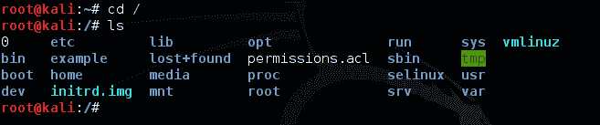
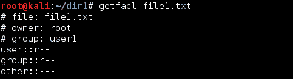
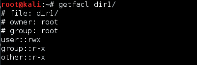
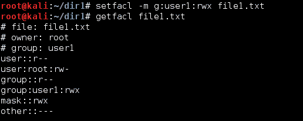
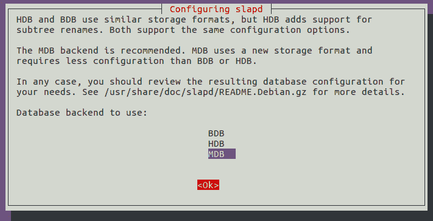
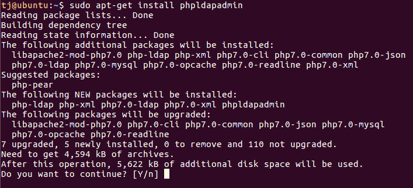

# 本地文件系统安全

在本章中，我们将讨论以下内容：

+   使用`ls`查看文件和目录详细信息

+   使用`chmod`设置文件和目录的权限

+   使用`chown`更改文件和目录的所有权

+   使用 ACLs 访问文件

+   使用 SELinux 实现强制访问控制

+   使用扩展文件属性保护敏感文件

+   使用`mv`命令处理文件（移动和重命名）

+   在 Ubuntu 上安装和配置基本的 LDAP 服务器

# 使用 `ls` 查看文件和目录详细信息

`ls`命令用于列出目录中的文件，类似于 DOS 中的`dir`命令。可以根据不同的参数使用该命令，以获得不同的结果。

# 准备工作

由于`ls`命令是 Linux 中的内置命令，我们无需安装其他任何东西即可使用它。

# 如何操作…

现在，让我们来看看如何通过这些步骤以不同的方式使用`ls`来获取各种结果：

1.  要查看当前目录下的简单文件列表，输入`ls`命令：



1.  要获取更多关于文件和目录的信息，可以在`ls`命令后添加类型标识符，如下所示：


1.  当使用前面提到的标识符时，可执行文件的名称末尾会有一个星号，而目录会有一个斜杠，等等。要查看文件的详细信息，如创建日期、所有者和权限，可以运行带有`l`标识符的命令，如下所示：


1.  要列出当前目录下的所有隐藏文件，可以使用`a`标识符，如下所示：


1.  以点（.）开头的文件（也叫做点文件）是隐藏文件，如果没有使用`–an`选项，它们不会显示。

要以可读的形式打印文件大小（如 MB、GB、TB 等），而不是以字节为单位显示，可以使用`-h`标识符与`-l`标识符一起使用，如下所示：


1.  如果你只想排除所有文件并仅显示子目录，则可以使用`-d`选项，如下所示：


1.  当`ls`命令与`-R`选项一起使用时，它还会显示子目录的内容：


# 它是如何工作的…

当我们使用不同的选项与`ls`命令时，它会根据不同的目录列出不同的结果。我们可以根据需求使用任何选项。

建议你养成使用`ls -lah`的习惯，这样你可以始终以可读的大小查看文件列表。

# 使用 chmod 设置文件和目录的权限

**chmod**，或称 **Change Mode**，是一个用于修改文件和目录访问权限的 Linux 命令。每个人都希望保持数据的安全和正确组织。因此，Linux 提供了将所有者和组与每个文件和目录关联的概念。这些所有者和组有不同的权限来访问特定文件。

# 正在准备中

在我们查看 `chmod` 命令的使用之前，我们需要知道，不同类型的用户使用的符号表示如下：

+   `u` 用于表示用户/所有者

+   `g` 用于表示组

+   `o` 用于表示其他用户

现在，让我们创建一个名为 `file1.txt` 的文件，以检查 `chmod` 的不同命令。

# 如何操作...

现在，我们将展示如何以不同的方式使用 chmod 来设置不同的权限：

1.  我们首先检查文件的当前权限以及它的创建时间：


如我们所见，目前只有用户/所有者具有读写权限，而组和其他用户只有读取权限。

1.  现在，让我们使用 `+` 符号来修改所有者的单一权限，这个符号用于添加权限：

```
chmod u+x file1.txt
```


该命令将为文件的所有者添加执行权限。

1.  要添加多个权限，我们可以在一个命令中执行相同的操作。只需要使用逗号分隔不同的权限，如下所示：

```
chmod g+x,o+x file1.txt
```


该命令将为文件的组和其他用户添加执行权限。

1.  如果我们希望删除某个权限，只需使用 `-` 符号代替 `+`，如下所示：

```
chmod o-x file1.txt
```


这将删除特定文件的其他用户的执行权限。

1.  如果我们希望为所有用户（所有者、组和其他用户）添加或删除某个权限，可以通过使用 `a` 选项（表示所有用户）来使用单个命令完成。

要为所有用户添加读取权限，可以使用以下命令：

```
chmod a+r file1.txt
```

要删除所有用户的读取权限，可以使用以下命令：

```
chmod a-r file1.txt
```


1.  假设我们想要为目录中的所有文件添加特定权限。一种方法是之前看到的，为所有文件单独运行命令。相反，我们可以使用 `-R` 选项，它表示给定操作是递归的。因此，要为目录中所有文件添加执行权限，命令将是：

```
chmod o+x -R /dir1
```


1.  我们还可以使用 `reference` 选项将某个文件的权限复制到另一个文件：

```
chmod --reference=file2 file1
```


在这里，我们已将 `file2` 的权限应用到另一个文件 `file1`。相同的命令也可以用于将一个目录的权限应用到另一个目录。

# 它是如何工作的...

当使用符号表示法时，`chmod` 的使用规则如下：

+   `u` 用于表示用户/所有者

+   `g` 用于表示组

+   `o`用于表示其他用户

此外，不同的权限表示如下：

+   r: 读取

+   w: 写入

+   x: 执行

因此，使用这些命令，我们可以根据需要更改用户、组或其他人的权限。

# 还有更多...

权限也可以通过数字形式设置，称为八进制表示法。我们可以同时编辑所有者、组和其他用户的权限。命令的语法如下：

```
chmod xxx file/directory
```

这里，xxx 表示从 1 到 7 之间的三位数字。第一位表示所有者的权限，第二位表示组的权限，第三位表示其他用户的权限。

当我们使用八进制表示法时，r、w 和 x 权限有特定的数值：

+   r = 4

+   w = 2

+   x = 1

所以，如果我们想添加读取和执行权限，它的计算方式如下：

+   r-x = 4+0+1 = 5

类似地，读取、写入和执行权限的计算方式如下：

+   rwx = 4+2+1 = 7

如果我们只想给予读取权限，它将是：

+   r-- = 4+0+0 = 4

所以，现在如果我们运行给定的命令，它会按计算方式赋予权限：

```
chmod 754 file1.txt
```


# 使用`chown`更改文件和目录的所有权

文件所有权在 Linux 中是基础性的。因为每个文件都与一个所有者和一个组相关联，我们可以使用`chown`命令来更改文件或目录的所有者。

# 如何操作...

为了理解`chown`的使用方法，我们可以按照以下步骤操作：

1.  为了理解`chown`命令的使用，我们可以创建一个名为`file1.txt`的文件和一个名为`user1`的用户：


更改密码信息的先前命令是可选的。如果你不需要，可以忽略它。

1.  现在，让我们检查`file1.txt`的当前所有者。

我们可以看到，当前两个文件的所有者都是 root，并且它们属于 root 组。

1.  让我们将`file1.txt`的所有权更改为`user1`：


如这里所示，`file1.txt`的所有者已更改为`user1`。

1.  如果我们想要更改文件的组，也可以使用`chown`命令来完成：


1.  我们可以在一个命令中同时更改文件的所有者和组，如下所示：


我们可以看到，`file2.txt`的所有者和组已经更改。

1.  如果我们希望递归地更改目录及其内容的所有权，可以按照以下方式操作：


1.  `chown`还可以用于将一个文件的所有者/组权限复制到另一个文件：


# 还有更多...

如果我们希望以详细的方式列出`chown`命令所做的更改，可以使用以下命令：


# 使用 ACLs 来访问文件

使用`chmod`实现基本文件权限是不够的，因此我们可以使用 ACL，或称为*访问控制列表*。除了为特定文件的所有者和组提供权限外，我们还可以为任何用户、任何用户组或任何不在特定用户组中的所有用户组设置权限。

# 准备就绪

在使用 ACL 之前，我们检查它是否已启用：

1.  为此，我们尝试查看任何文件的 ACL，如下所示：


如果启用了 ACL，此命令将显示如下输出。在我们的例子中，`/dev/sda1`没有启用 ACL，因为它没有列在挂载选项中。

1.  要启用 ACL，我们将其添加到文件系统中，使用以下命令：


1.  现在，再次运行`tune2fs`命令以确认 ACL 已启用：


现在，我们可以在`/dev/sda1`分区看到 ACL 选项。

# 如何执行...

为了理解 ACL 的工作原理，让我们按照以下步骤操作：

1.  我们将首先检查任何文件或目录的默认 ACL 值。为此，我们使用`getfacl`命令：



1.  现在，要在`file1.txt`上设置 ACL，我们将使用以下命令：


在上述命令中，我们为`file1.txt`文件的 root 用户授予了`rwx`权限。

当我们再次使用`getfacl`检查时，我们可以看到新的 ACL 值。

1.  运行给定的命令以确认`file1.txt`上的 ACL 设置：


文件权限后的（`+`）符号确认它已设置 ACL。

1.  我们还可以通过使用`setfacl`命令递归地设置文件夹上的 ACL。首先，我们将使用`getfacl`检查`dir1`目录的默认 ACL：



1.  现在，让我们使用`setfacl`为`dir1`目录添加`rwx`权限：


1.  我们现在可以通过给定的命令确认目录上已设置 ACL：


1.  现在，让我们检查`user1`组在`file1.txt`上的 ACL：


1.  让我们为`user1`组设置`rwx`权限在`file1.txt`上：



# 还有更多...

每当我们处理文件权限时，最好对权限进行备份，特别是当文件很重要时。

在这里，我们假设我们有一个包含一些重要文件的`dir1`目录。然后，我们首先导航到`dir1`目录，并使用以下命令备份权限：

```
getfacl -R * > permissions.acl
```


该命令会创建权限的备份并将其存储在`permissions.acl`中。

现在，如果我们想恢复权限，命令如下：

```
setfacl --restore=permissions.acl
```


这将恢复所有权限，回到创建备份时的状态。

# 使用`mv`命令进行文件处理（移动和重命名）

`mv`或`move`命令用于将文件从一个目录移动到另一个目录，而不会创建任何重复文件，这与`cp`或复制命令不同。

# 准备工作

由于`mv`是 Linux 的内建命令，我们无需配置任何其他设置即可理解其工作原理。

# 它是如何工作的...

让我们通过不同的示例来看看如何使用`mv`命令：

1.  要将`testfile1.txt`从当前目录移动到其他目录，比如`/home/practical/example`，命令如下：

```
    mv testfile1.txt /home/practical/example
```


只有当源文件位置与目标位置不同时，此命令才会生效。

当我们使用前面的命令移动文件时，文件将从原始位置被删除。

1.  要使用单个命令移动多个文件，可以使用以下命令：

```
mv testfile2.txt testfile3.txt testfile4.txt /home/practical/example
```

当使用前面的命令时，我们移动的所有文件应位于相同的源位置。

1.  移动目录的命令与移动文件时相同。假设我们在当前工作目录下有一个`directory1`目录，并希望将其移动到`/home/practical/example`位置；命令如下：

```
    mv directory1 /home/practical/example
```


1.  `mv`命令还用于重命名文件和目录。假设我们有一个文件，`example_1.txt`，并且希望将其重命名为`example_2.txt`。实现这一操作的命令如下：

```
    mv example_1.txtexample_2.txt 
```

只有当源位置和目标位置相同的时候，此命令才会生效：


1.  重命名目录与重命名文件的方式相同。假设我们有一个目录，`test­­_directory_1`，我们想将其重命名为`test­­_directory_2`；命令如下：

```
    mv test­­_directory_1/ test­­_directory_2/
```


1.  当我们使用`mv`命令移动或重命名大量文件或目录时，可以通过在命令中使用`-v`选项来检查命令是否成功执行。

假设我们想将当前目录中的所有文本文件移动到`/home/practical/example`目录，并希望确保它能正确工作；命令如下：

```
    mv -v *.txt /home/practical/example
```


移动或重命名目录时也是如此，如下所示：


1.  当我们使用`mv`命令将文件移动到另一个位置，并且该位置已经存在同名文件时，默认命令将覆盖已存在的文件。然而，如果我们希望在覆盖文件之前显示弹出通知，则需要使用`-i`选项，如下所示：

```
mv -i testfile1.txt /home/practical/example
```


当执行上述命令时，它会通知我们目标位置已经存在同名文件。只有在我们按下 *Y* 时，命令才会完成，否则会被取消。

1.  当使用 `mv` 命令将文件移动到另一个位置时，如果目标位置已有同名文件，使用 `-u` 选项可以仅在源文件比目标文件更新时才更新目标文件。

我们在源位置有两个文件，`file_1.txt` 和 `file_2.txt`，首先使用 `ls` 命令检查文件的详细信息：

```
    ls -l *.txt
```

现在，让我们检查目标位置文件的详细信息：

```
    ls -l /home/practical/example/*.txt
```

现在，使用给定的命令移动文件：

```
    mv -uv *.txt /home/practical/example/
```


我们看到 `file1.txt` 和 `file2.txt` 已经被移动到目标位置，并且因为源文件的时间戳较新，更新了先前的文件。

1.  我们在源位置有两个文件，`file_1.txt` 和 `file_2.txt`，首先使用以下命令检查文件的详细信息：

```
    ls -l *.txt  
```

现在，使用以下命令移动文件：

```
    mv -vn *.txt /home/practical/example/
```

现在，让我们检查目标位置文件的详细信息：

```
    ls -l /home/practical/example/*.txt
```

我们看到同名文件没有被移动，可以通过观察时间戳进行检查：


1.  在移动文件时，如果目标位置已经有同名文件，我们还可以在新文件覆盖目标文件之前，创建目标文件的备份。为此，我们使用 `-b` 选项：

```
    mv -bv *.txt /home/practical/example
```

现在，让我们检查目标位置文件的详细信息。

我们在详细信息中看到有名为 `file1.txt~` 和 `file2.txt~` 的文件。这些文件是备份文件，可以通过时间戳验证，它们的时间戳早于 `file1.txt` 和 `file2.txt`。


# 使用 SELinux 实现强制访问控制

**SELinux**（**安全增强型 Linux**的缩写），是一种灵活的强制访问控制（MAC），旨在克服标准的 ugo/rwx 权限和 ACL 的限制。

# 正在准备中

在大多数 Linux 发行版中，如 CentOS 和 Redhat，SELinux 默认包含在内核中。然而，如果我们使用的是其他发行版，如 Debian，可能需要在系统上安装和配置 SELinux：

1.  首先，我们必须通过运行以下命令来获取 SELinux 的基本工具集和默认策略：


1.  安装完成后，运行以下命令配置 GRUB 和 PAM，并创建 `/autorelabel`：


之后，您需要重启系统，以便在启动时标记文件系统。

1.  重启后，当系统启动时，您可能会收到以下警告：


现在，我们有一个正常工作的 SELinux 系统。

# 如何操作...

一旦我们有了一个正常工作的 SELinux 系统，我们可以选择如何使用它：

1.  SELinux 可以以两种不同的方式运行：Enforcing 模式和 Permissive 模式。

1.  让我们通过使用`getenforce`命令来检查当前的模式：


如我们所见，SELinux 当前处于 Permissive 模式。

1.  现在，如果我们希望切换模式，可以使用`setenforce`命令：


当我们运行带有选项 1 的上述命令时，模式将切换为 Enforcing 模式。

1.  如果我们想要切换回 Permissive 模式，可以再次使用带有选项 0 的`setenforce`命令：


现在，模式已恢复为 Permissive 模式。

1.  此更改不会在系统重启后保留。如果我们想要永久更改模式，必须编辑`/etc/selinux/config`文件，并将 SELinux 变量更改为我们想要的模式：enforcing、permissive 或 disabled。

1.  每当应用程序出现故障或无法正常工作时，作为故障排除的一部分，我们应该尝试在 SELinux 模式之间切换（从 Enforcing 到 Permissive，或反之）。这将帮助我们了解在切换到 Permissive 模式后，应用程序是否能正常工作。如果可以正常工作，那么我们就知道这是一个 SELinux 权限问题。

# 它是如何工作的...

SELinux 在两种模式下运行：Enforcing 和 Permissive 模式。在 Enforcing 模式下，SELinux 根据 SELinux 策略规则拒绝访问。这些规则是控制安全引擎的准则的一部分。

当 SELinux 在 Permissive 模式下工作时，它不会拒绝访问，但任何在 Enforcing 模式下会被拒绝的操作都会被记录下来。

可以修改 SELinux 规则，以允许在 Enforcing 模式下会被拒绝的任何应用程序或服务。

# 还有更多...

你可以通过输入`man mv`或`mv --help`来了解更多关于`mv`命令的信息。这将显示它的手册页面，我们可以在其中探索更多有关该命令的详细信息。

# 使用扩展文件属性保护敏感文件

扩展属性是一种可扩展的方式，用于在文件中存储元数据。这些是与文件和目录相关联的名称-值对。多个文件系统支持扩展文件属性，使得文件操作的自定义变得更加灵活。

# 准备中

目前，在 Linux 中有四种不同的命名空间用于扩展文件属性：

+   `user`

+   `trusted`

+   `security`

+   `system`

有许多工具可以操作扩展属性，这些工具通常包含在`attr`软件包中，后者大多数 Linux 发行版都包含该软件包。

如果系统中没有安装`attr`，只需执行以下命令来安装它：

```
sudo apt-get install attr
```

要检查该软件包是否已安装在我们的系统中，只需在终端运行`attr`。如果出现如下输出，则表示该软件包已安装：


下一步是检查内核是否支持该属性。可以使用以下命令进行检查：


输出确认内核已支持该属性。

我们还需要确认文件系统是以`user_xattr`选项挂载的。为此，运行以下命令：


# 如何操作...

一旦我们确认了前面一节中提到的所有要求，就可以继续了解如何使用扩展属性：

1.  首先，我们将创建一个包含一些虚拟数据的测试文件：


1.  现在，我们将使用`setfattr`命令向该文件添加一个扩展属性：


1.  现在，让我们使用`getfattr`命令确定文件上的属性：


1.  如果我们想要检查属性的值，可以使用以下命令：


1.  随时，如果我们想要删除任何属性，可以使用`setfattr`命令，添加`-x`选项来实现。

# 在 Ubuntu 上安装和配置基本的 LDAP 服务器

**轻量级目录访问协议**（**LDAP**）是一种用于管理从某个集中位置访问文件和目录层次结构的协议。LDAP 主要用于集中认证。

LDAP 服务器有助于控制谁可以访问和更新目录中的信息。

# 准备工作

要安装和配置 LDAP，我们首先需要创建一个 Ubuntu 服务器。当前的 Ubuntu 服务器安装媒体版本可以在此找到：[`www.ubuntu.com/download/server`](http://www.ubuntu.com/download/server)。

下载后，按照提供的步骤安装 Ubuntu 服务器。

我们需要第二台安装了 Ubuntu 桌面版本的系统。将用来通过 Web 界面访问 LDAP 服务器。

完成后，我们可以继续安装 LDAP。

# 如何操作...

现在我们开始在 Ubuntu 服务器上安装和配置 LDAP：

1.  我们将首先从 Ubuntu 的仓库更新服务器上的软件包列表，以获取所有软件包及其依赖项的最新版本信息：

```
sudo apt-get update
```

1.  现在，运行命令来安装`slapd`包及其相关工具，并安装`ldap-utils`来安装 LDAP 服务器：


1.  在安装过程中，当系统提示时，输入并确认一个管理员密码，该密码将用于 LDAP 的管理员账户。配置一个您选择的密码并继续安装过程。

1.  安装完软件包后，我们将根据我们的需求重新配置 LDAP 包。为此，输入以下命令：

```
Sudo dpkg-reconfigure slapd
```

这将启动一系列关于配置软件的问题。我们需要根据需求逐一选择选项。

1.  第一个问题是是否忽略 OpenLDAP 服务器配置？选择否并继续：


1.  接下来，输入域名。可以使用服务器上已存在的域名，也可以创建一个新的域名。我们在这里使用`example.com`：


1.  接下来，输入`组织名称`：

-

1.  接下来，配置 LDAP 的管理员密码。可以使用安装过程中配置的相同密码，或者在此步骤中更改为其他密码。

1.  接下来，设置要使用的数据库后端。选择`MDB`并继续：



1.  现在，系统会询问是否希望在`slapd`被删除时移除数据库。请选择**否**。

1.  接下来，选择是以移动旧数据库，并允许配置过程创建一个新数据库：


1.  当询问`是否允许使用 LDAPv2 协议？`时，选择`否`，因为最新版本是 LDAPv3，LDAPv2 现在已经过时：


1.  此时，配置过程完成，LDAP 正在运行：


1.  现在让我们为 LDAP 打开防火墙端口，以便外部用户可以使用它：


1.  现在我们将安装 PHPldapadmin 包，它将帮助通过 Web 界面管理 LDAP：

```
sudo apt-get install phpldapadmin
```



安装完成后，编辑 PHPldapadmin 的配置文件，以配置一些值：

```
Sudo nano /etc/phpldapadmin/config.php
```

1.  现在，搜索给定部分并修改它，以反映 Ubuntu 服务器的域名或 IP 地址：

```
$servers->setValue('server','host','domain_name_or_IP_address');
```

1.  接下来，编辑以下条目并插入我们在重新配置`slapd`时给定的域名：

```
$servers->setValue('server','base',array('dc=example,dc=com'));
```

将域名作为值输入到前一行中的`dc`属性。由于我们的域名是`example.com`，因此前一行中的值将输入为`dc=example, dc=com`。

1.  接下来，找到以下行，并再次将域名作为`dc`属性输入。对于`cn`属性，值将仅为`admin`：

```
$servers->setValue('login','bind_id','cn=admin,dc=example,dc=com');
```

1.  现在，搜索如下所示的部分，首先取消注释该行，然后将值设置为`true`：

```
$config->custom->appearance['hide_template_warning'] = true;
```

完成所有这些更改后，保存并关闭文件。

1.  当 PHPldapadmin 的配置完成后，在另一个系统中打开浏览器，该系统具有 Ubuntu 桌面版本。在浏览器的地址栏中，输入域名或服务器的 IP 地址，后跟`/phpldapadmin`：

```
domain_name_or_IP_address/phpldapadmin
```

1.  一旦 PHPldapadmin 页面打开，在左侧找到登录链接。点击它，你将看到一个登录提示：


如果 PHPldapadmin 配置正确，登录界面将显示正确的登录 DN 详细信息：


在我们的例子中，这是`cn=admin,dc=example,dc=com`。

1.  一旦正确输入管理员密码，管理界面将会显示：


1.  在管理界面中，在左侧看到域组件（`dc=example,dc=co`）的位置，点击旁边的加号。它将显示正在使用的管理员登录：


1.  我们的基础 LDAP 服务器现在已设置并正常运行。

# 它是如何工作的……

我们首先创建一个 Ubuntu 服务器，然后在其上安装`slapd`包来安装 LDAP。安装完成后，我们安装所需的附加包。然后，我们根据需求重新配置 LDAP。

配置完成后，我们安装 PHPldapadmin 包，它将帮助我们通过浏览器的 Web 界面管理 LDAP 服务器。
