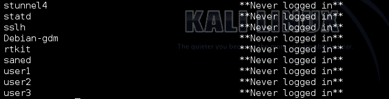
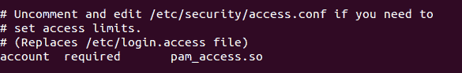
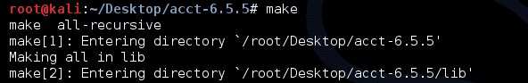
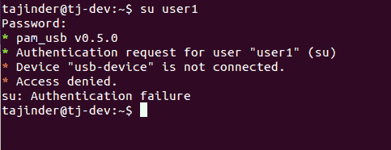

# 第四章：Linux 中的本地认证

在本章中，我们将讨论以下内容：

+   用户认证与日志记录

+   限制用户的登录能力

+   禁用用户名/密码登录

+   使用 acct 监控用户活动

+   使用 USB 设备和 PAM 进行登录认证

+   定义用户授权控制

+   使用 IDAM 进行访问管理

# 用户认证与日志记录

用户认证的一个重要部分是监控系统用户。Linux 提供了多种方法来追踪用户的成功与失败的登录尝试。

# 准备工作

Linux 系统会记录系统中所有账户的登录尝试。这些日志都位于`/var/log/`目录下：


# 如何操作...

Linux 有许多方法帮助管理员查看日志，既有图形界面方法，也有命令行方法：

1.  如果我们想检查某个特定用户（例如 root）的错误登录尝试，可以使用以下命令：

```
    lastb root  
```

****

1.  要使用终端查看日志，我们可以使用`dmesg`命令。此命令显示存储在内存中的 Linux 内核消息缓冲区，如下所示：


1.  如果我们希望过滤前面的输出，仅显示与 USB 设备相关的日志，可以使用`grep`来实现：


1.  如果我们不想查看所有日志，而只查看特定日志文件中的 10 条最新日志，可以使用以下命令：


在前面的命令中，`-n`选项用于指定要显示的行数。

1.  如果我们希望查看用户账户的最新登录尝试，可以使用`last`命令：


`last`命令以格式化的方式显示`var/log/wtmp`日志。

1.  如果我们想查看每个用户最后一次登录系统的时间，可以使用`lastlog`命令：



# 如何工作...

Linux 有不同的文件来记录不同类型的日志。通过这里展示的命令，我们可以查看这些日志并获取详细信息。每个命令提供了不同类型的细节。

# 限制用户的登录能力

作为一名 Linux 系统管理员，你可能希望限制特定用户或组对 Linux 系统的访问。在本节中，我们将学习如何使用`/etc/securetty`和`/etc/security/access.conf`这两个文件来限制用户访问。

# 准备工作

这里提供的所有步骤已在 Ubuntu 系统上进行了测试；然而，你也可以在任何其他 Linux 发行版上执行这些步骤。

# 如何操作...

让我们学习如何编辑前面提到的两个文件，以对 Linux 系统上的用户访问进行不同的限制：

1.  首先，我们将使用`more`命令检查`/etc/securetty`文件的内容：

```
more /etc/securetty
```


正如我们在前面的截图中看到的，文件指定了允许 root 登录的终端。

1.  现在，使用你选择的任何编辑器编辑文件，并按图所示注释掉`tty1`项：


在完成前述步骤并进行更改后，保存并退出编辑器。

1.  现在，通过运行命令`chvt 1`切换到`tty1`终端。如果我们现在尝试以 root 身份登录，将会得到以下结果：


我们可以看到系统已拒绝 root 账户的访问。如果我们仍然希望获取 root 权限，我们必须首先以普通用户身份登录，然后使用`sudo`或`su`命令。

1.  从同一个终端，当我们尝试以普通用户账户登录时，登录结果如图所示：


1.  我们已经看到如何使用`/etc/securetty`文件来指定从任何终端进行 root 账户访问。现在，让我们来看一下如何允许或拒绝特定用户的访问。

1.  第一件事是修改`/etc/pam.d/login`文件，并添加`pam_access.so`模块。这将允许`pam`扫描`/etc/security/access.conf`文件并检查我们定义的规则。

所以我们打开`etc/pam.d/login`，找到那行写着`#account required pam_access.so`的内容，去掉`#`以取消注释该行：



1.  接下来，我们将在`/etc/security/access.conf`中定义一个规则。使用任何编辑器打开该文件，并根据以下语法定义规则：

```
permission : users : origins
```

1.  如果我们想要拒绝 root 账户从`tty1`终端的访问，可以使用以下规则：


1.  要拒绝`user1`的访问，我们使用以下规则：


1.  如果我们想要在同一规则中指定多个用户名，可以像下面这个规则一样操作：


# 它是如何工作的...

Linux 使用`/etc/securetty`来指定哪些终端可以进行 root 访问。因此，当我们在该文件中进行更改时，特定终端的 root 访问也会受到影响。

同样，`/etc/security/access.conf`文件被`pam`用来检查是否允许特定用户的终端访问。该文件中定义的规则遵循以下语法：

```
permission : users: origins
```

这里，`permission`指的是拒绝或允许规则，并由`-`或`+`符号表示。

Users 指的是一个登录用户名的列表。

Origins 指的是允许或拒绝访问的来源。

# 禁用用户名/密码登录

系统管理员的一个重要职责是配置和管理 Linux 系统中的用户和组。这也涉及到检查所有用户的登录能力，并在必要时禁用它们。

# 准备工作

这里给出的所有步骤都在 Ubuntu 系统上进行了尝试；然而，你也可以在任何其他 Linux 发行版上按照这些步骤进行操作。

# 如何操作...

在这里，我们将讨论如何在 Linux 系统上限制用户的登录能力：

1.  我们可以通过在`/etc/passwd`文件中将帐户的登录 shell 更改为特殊值来限制用户帐户的访问。让我们以`user1`帐户为例，在`/etc/passwd`文件中检查详细信息，如下所示：


1.  在这些详细信息中，`user1`帐户的最终值设置为`/bin/bash`。目前，我们可以从`user1`帐户登录。现在，如果我们要更改希望限制的用户帐户的 shell，我们可以像这样做：


1.  如果我们现在尝试从用户 1 登录，我们会收到以下错误：

****

1.  限制用户访问的另一种方式是使用`/etc/shadow`文件。如果我们使用`cat`命令检查此文件的详细信息，我们将得到以下结果：

****

1.  详细信息显示了`user3`帐户的哈希密码（以... $6$wI1akgI4...开头）。

1.  现在，要锁定`user3`帐户，命令如下：

```
 passwd -l user3 
```


让我们再次查看`/etc/shadow`文件中`user3`帐户的详细信息。我们看到哈希密码已通过添加`!`而变为无效。

```
cat /etc/shadow | grep user3
```

****

1.  要再次解锁帐户，命令如下：

```
    passwd -u user3
```

1.  如果我们想要检查帐户是否已被锁定，可以使用此命令进行检查：

****

正如我们在输出中看到的，`user1`帐户已被锁定，第二字段的细节显示为`L`，而`user2`没有被锁定，因为细节中显示为`P`。

1.  锁定或解锁帐户的过程也可以使用`usermod`命令完成。要使用`usermod`锁定帐户，命令如下：

```
    usermod -L user2
```

****

1.  一旦锁定，如果我们尝试从该帐户登录，我们会收到以下错误：

****

1.  要使用`usermod`解锁帐户，命令如下：

```
    usermod -U user2
```

****

# 它是如何工作的……

对于 Linux 中的每个帐户，用户帐户详细信息存储在`/etc/passwd`和`/etc/shadow`文件中。这些详细信息指定用户帐户的行为。当我们能够更改这些文件中任何用户帐户的详细信息时，我们能够更改用户帐户的行为。

在前面的部分中，我们已经看到如何修改这些文件以“锁定”或“解锁”用户帐户。

# 使用 acct 监控用户活动

**Acct**是一个开源应用程序，可以帮助监控 Linux 系统上的用户活动。它在后台运行，跟踪用户的所有活动，并记录正在使用的资源。

# 准备就绪

要使用`acct`命令，我们首先需要通过以下命令在 Linux 系统上安装该软件包：

```
    apt-get install acct
```

****

如果前述方法无法正常工作，我们可以访问此链接手动下载软件包：

[`packages.ubuntu.com/precise/admin/acct`](http://packages.ubuntu.com/precise/admin/acct)

下载软件包后，我们需要将其解压到某个目录中，就像我们在桌面上所做的那样：


然后，进入该目录：


接下来运行脚本来配置该软件包：


配置完成后，接下来运行`make`命令：



然后，运行`make install`命令：


一旦成功完成，它将把软件包安装到你的 Linux 系统上。

# 如何操作...

acct 包有不同的命令来监控进程活动：

1.  根据特定用户从 wtmp 文件中登录和注销的情况，如果我们希望检查总连接时间，可以使用`ac`命令：


1.  如果我们希望按天打印总登录时间，可以在“ac”命令中使用`-d`选项：


1.  要打印按用户统计的总登录时间，我们使用以下命令：


1.  如果我们只希望检查特定用户的登录时间，可以使用以下命令：


1.  我们还可以通过使用`lastcomm`命令查看所有用户或特定用户之前执行的命令：


# 它是如何工作的...

为了监控系统，我们首先需要在系统上安装 acct 包。对于其他一些 Linux 发行版，如果`acct`不兼容，可以使用`psacct`包。

一旦工具安装并运行，它会开始维护系统活动日志。我们可以使用前面讨论的命令来查看这些日志。

# 使用 USB 设备和 PAM 进行登录认证

当一个 Linux 用户想要保护系统安全时，最常见的方法通常是使用他们的登录密码。然而，我们知道这种方法并不非常可靠，因为有许多方法可以破解传统的密码。为了提高安全性，我们可以使用像身份验证令牌这样的 USB 设备，用于登录系统。

# 准备就绪

为了执行这些步骤，我们需要一个 USB 存储设备，并且在 Linux 系统上下载 **可插拔认证模块**（**PAM**）。大多数 Linux 系统以预编译软件包的形式提供 PAM，可以从相关的软件仓库中获取。

# 如何操作...

通过使用任何类型的 USB 存储设备和 PAM，我们可以创建身份验证令牌：

1.  首先，我们需要安装 PAM USB 认证所需的包。为此，我们运行以下命令：

```
 $ sudo apt-get install pamusb-tools libpam-usb
```

****

1.  安装完软件包后，我们必须配置 USB 设备以使用 PAM 认证。为此，我们可以使用命令，或者编辑`/etc/pamusb.conf`文件。

若要使用命令方法，首先连接 USB 设备，然后执行以下命令：

```
    $ sudopamusb-conf --add-device usb-device  
```


在前面的命令中，`usb-device`是我们正在使用的 USB 设备的名称。这个名称可以是你选择的任何名称。

使用`pamusb-conf`命令时，它会自动发现 USB 设备，包含多个分区。当命令执行完成后，它会在`/etc/pamusb.conf`文件中添加一个 XML 代码块，定义我们的 USB 设备：


1.  接下来，我们定义我们的 USB 设备：

```
    $ sudopamusb-conf --add-user user1
```

****

如果用户已存在，它将被添加到 PAM 配置中。

前面的命令将`pam_usb`用户的定义添加到`/etc/pamusb.conf`文件中：


1.  现在，我们将配置 PAM，在系统认证过程中添加`pam_usb`模块。为此，我们将编辑`/etc/pam.d/common-auth`文件，并添加以下行：

****

这将使系统范围的 PAM 库识别`pam_usb`模块。

`required`选项指定需要正确的密码，而`sufficient`选项表示这也可以认证用户。在前面的配置中，我们使用`sufficient`进行 USB 设备认证，但对默认密码使用`required`。

如果系统中未定义`user1`的 USB 设备，用户需要输入正确的密码。为了在授予系统访问权限之前强制用户完成两个认证流程，请将`sufficient`更改为`required`。

1.  现在，我们将尝试切换到`user1`：


当被要求时，连接 usb-device。如果连接了正确的 USB 令牌设备，登录将完成，否则会出现错误。

1.  如果出现任何错误，比如此处显示的错误，可能是因为 USB 设备的路径未正确添加：

```
    Error: device /dev/sdb1 is not removable
    * Mount failed
```

在这种情况下，将 USB 设备的完整路径添加到`/etc/pmount.allow`。

1.  现在，运行该命令检查 USB 设备分区如何在文件系统中列出：

```
    $ sudo fdisk -l
```

****

在我们的情况下，分区已列为`/dev/sdb1`。

1.  现在，在`/etc/pmount.allow`文件中添加一行，以解决该错误。

1.  我们目前在 `/etc/pam.d/common-auth` 中所做的配置意味着，如果 USB 设备未连接，用户仍然可以使用正确的密码登录。如果我们希望强制用户在登录时也使用 USB 设备，则将 `sufficient` 改为 `required`，如下所示：


1.  如果用户现在尝试登录，他们将需要输入正确的密码并插入 USB 设备：


1.  现在，移除 USB 设备并尝试使用正确的密码再次登录：



# 它是如何工作的...

一旦我们安装了所需的 `pam-usb` 包，我们编辑配置文件以添加我们的 USB 设备，将其作为认证令牌使用。之后，我们添加需要使用的用户账户。然后，我们在 `/etc/pam.d/common-auth` 文件中做更改，以指定 USB 认证如何工作，并且是否始终需要进行登录。

# 还有更多内容...

我们已经看过如何使用 USB 设备来验证用户登录。除此之外，我们还可以利用 USB 设备触发事件，每次它从系统中断开或连接时都会发生此事件。

让我们修改 `/etc/pamusb.conf` 中的 XML 代码，以便为用户定义添加事件代码：

****

由于前面的修改，每当用户断开 USB 设备时，屏幕将被锁定。类似地，当用户再次连接 USB 设备时，屏幕将解锁。

# 定义用户授权控制

在计算机上定义用户授权主要是决定用户可以或不能执行的操作。这可能包括执行程序或读取文件等活动。

由于 `root` 账户拥有所有权限，授权控制主要是决定是否允许用户账户访问 `root` 权限。

# 准备开始

为了查看用户授权如何工作，我们需要一个用户账户来尝试这些命令。所以，我们创建了几个用户账户，`user1` 和 `user2`，来执行这些命令。

# 如何操作...

在本节中，我们将介绍可以应用于用户账户的各种控制：

1.  假设我们有两个用户账户，`user1` 和 `user2`。我们从 `user2` 登录，然后尝试以 `user1` 身份运行命令 `ps`。在正常情况下，我们会得到以下结果：


1.  现在，编辑 `/etc/sudoers` 文件并添加这一行：

```
    User2 ALL = (user1) /bin/ps
```

1.  在 `/etc/sudoers` 中保存更改后，再尝试从 `user2` 以 `user1` 身份运行 `ps` 命令：


1.  现在，如果我们希望从 `user2` 以 `user1` 身份再次运行相同的命令，但不要求输入密码，我们可以通过编辑 `/etc/sudoers` 文件来实现，方法如下：


1.  现在，当我们以`user1`身份从`user2`运行`ps`命令时，我们看到它不再要求输入密码：


1.  现在我们已经看到如何在不要求输入密码的情况下运行命令，系统管理员的主要关注点将是`sudo`始终提示输入密码。

1.  要使`user1`用户帐户在系统上始终提示输入密码，请编辑`/etc/sudoers`文件并添加以下行：

```
    Defaults:user1    timestamp_timeout = 0
```


1.  现在，如果`user1`尝试运行任何命令，系统将始终提示输入密码：


1.  现在，假设我们要授予`user1`帐户更改`user2`和`user3`密码的权限。编辑`/etc/sudoers`文件并添加以下行：


1.  现在，从`user1`登录，让我们尝试更改`user2`和`user3`帐户的密码：


# 它是如何工作的...

使用`sudo`命令和`/etc/sudoers`文件，我们进行必要的更改，以按要求执行任务。

我们编辑文件以允许以其他用户身份执行程序。我们还添加了`NOPASSWD`选项，以便在执行程序时不要求输入密码。然后我们添加所需的行，以便`sudo`始终提示输入密码。

接下来，我们将看到如何授权用户帐户更改其他用户帐户的密码。

# 使用 IDAM 进行访问管理

在今天的世界中，一个 Linux 系统可能被多个本地或远程用户使用。管理这些用户的访问权限变得至关重要，以保护那些仅应由少数经过身份验证的用户访问的敏感和机密信息。

IDAM（身份和访问管理）工具可以帮助系统管理员轻松管理各种用户的身份和访问权限。

# 准备就绪

要开始安装和配置 WSO2 Identity Server，我们需要任何已设置 Java 环境的 Linux 发行版。

在这里，我们将看到如何设置 Java 环境：

1.  在安装 JDK 之前，我们需要安装一个与 Python 相关的包作为依赖项。执行此操作的命令如下：


1.  现在，要安装 Oracle JDK，即 Oracle 官方版本，我们需要更新系统的包仓库并添加 Oracle 的 PPA。为此，我们运行以下命令：


1.  现在，通过运行以下命令安装 Java 的稳定版本：


1.  安装完成后，下一步是设置`JAVA_HOME`环境变量。为此，使用任何编辑器编辑`/etc/environment`文件并添加以下行：


1.  为了测试环境变量是否已正确设置，可以执行以下命令：


我们可以看到在前面的步骤中设置的路径。

# 如何操作...

在系统上完成 JDK 的安装和配置后，我们可以继续安装和配置 WSO 身份和访问管理服务器：

1.  首先，从以下链接下载 WSO2 包：[`wso2.com/identity-and-access-management/install/download/?type=ubuntu`](https://wso2.com/identity-and-access-management/install/download/?type=ubuntu)

1.  接下来，创建一个目录`/var/wso2`，并将下载的包解压到此目录中：


1.  为了提取包，运行以下命令：

```
unzip ~/wso2is-5.6.0.zip /var/wso2
```

1.  提取过程完成后，我们可以检查目录中的文件：


1.  接下来，如果我们希望配置服务器使用 FQDN 而不是`localhost`启动，我们可以更改`carbon.xml`文件中的配置。为此，编辑位于`[INSTALL_DIR]/repository/conf/carbon.xml`的`carbon.xml`文件：


修改`<HostName>`，将 localhost 替换为系统的 FQDN：


1.  现在，我们可以启动 WSO2 身份服务器。为此，运行以下命令：


1.  一旦服务器成功启动，它会显示类似于`WSO2 Carbon started in 463 sec`的行，如下所示：


1.  一旦服务器启动并运行，我们可以通过浏览器访问它。访问服务器的默认配置始终是通过 HTTPS 并使用端口`9443`：


在登录页面，使用默认用户名`admin`和默认密码`admin`进行登录。

1.  登录后，我们可以用它来添加用户和角色。

Linux 管理员现在可以使用 WSO2 IS 来管理身份并执行访问管理。

# 工作原理...

WSO2 身份服务器是一个开源的 IAM 产品，专注于访问管理、访问控制、身份治理管理、API 安全等众多功能。
