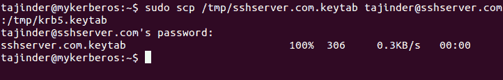
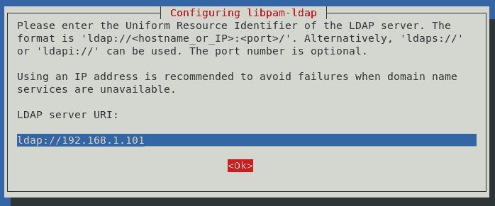

# 远程身份验证

本章将讨论以下内容：

+   使用 SSH 访问远程服务器/主机

+   禁用或启用 SSH 根用户登录

+   基于密钥的 SSH 登录以限制远程访问

+   远程复制文件

+   使用 Ubuntu 设置 Kerberos 服务器

+   使用 LDAP 进行用户身份验证和管理

# 使用 SSH 访问远程服务器/主机

**安全外壳**（**SSH**）是一种用于安全登录远程系统的协议，是访问远程 Linux 系统的最常用方法。

# 准备工作

要了解如何使用 SSH，您需要两台 Ubuntu 系统。一台作为服务器，另一台作为客户端。

# 如何操作……

要使用 SSH，您可以使用一个名为 OpenSSH 的免费软件。安装该软件后，可以通过`ssh`命令使用它。我们将详细了解如何使用此工具：

1.  如果 OpenSSH 服务器尚未安装，可以使用以下命令进行安装：

```
    sudo apt-get install openssh-server
```


1.  接下来，我们需要安装软件的客户端版本：

```
    sudo apt-get install openssh-client
```


1.  对于最新版本，SSH 服务在软件安装后会自动启动。如果默认情况下没有运行，我们可以使用以下命令启动服务：

```
    sudo service ssh start  
```


1.  现在，要从任何其他系统通过 SSH 登录到服务器，可以使用以下命令：

```
    ssh remote_ip_address
```

这里，`remote_ip_address`指的是服务器系统的 IP 地址。此外，假设客户端机器上的用户名与服务器机器上的用户名相同：


如果我们想以不同的用户登录，命令将如下所示：

```
    ssh username@remote_ip_address
```


1.  接下来，我们需要根据需求配置 SSH。Ubuntu 中`sshd`的主要配置文件位于`/etc/ssh/sshd_config`。在对该文件的原版进行任何更改之前，请使用以下命令创建备份：

```
    sudo cp /etc/ssh/sshd_config{,.bak}
```

配置文件定义了服务器系统上 SSH 的默认设置。

1.  打开文件在文本编辑器中，我们可以看到`sshd`服务器监听传入连接的默认端口声明是`22`。我们可以将其更改为任何非标准端口，以通过防止随机端口扫描来增强服务器的安全性，从而使其更安全。假设我们将端口更改为`888`，那么下一次客户端想连接到 SSH 服务器时，命令将如下所示：

```
    ssh -p port_numberremote_ip_address
```


如您所见，当您运行命令时，如果未指定端口号，则连接会被拒绝。当您指定正确的端口号时，连接将成功建立。

# 如何操作……

SSH 用于将客户端程序连接到 SSH 服务器。在一台系统上，我们安装 openssh-server 软件包将其设置为 SSH 服务器，而在另一台系统上，我们将安装 openssh-client 软件包以将其用作客户端。

现在，保持服务器系统上的 SSH 服务运行，我们尝试通过客户端连接到它。

我们使用 SSH 的配置文件来更改连接的默认端口等设置。

# 启用和禁用 SSH 上的 root 登录

Linux 系统默认启用 root 账户。未经授权的用户获得 root 访问权限可能会非常危险。

我们可以根据需要禁用或启用 root 用户的 SSH 登录，以防止攻击者获得系统访问权限。

# 准备就绪

我们需要两台 Linux 系统作为服务器和客户端。在服务器系统上，安装 openssh-server 软件包，如前面的配方所示。

# 如何操作...

首先，我们将看到如何禁用 SSH root 登录，然后我们也会看到如何重新启用它：

1.  首先，在任何编辑器中打开 SSH 的主配置文件 `/etc/ssh/sshd_config`：

```
    sudo nano /etc/ssh/sshd_config
```

1.  现在查找以下内容的行：

```
    PermitRootLogin yes
```

1.  将 `yes` 的值更改为 `no`。然后保存并关闭文件：

```
    PermitRootLogin no
```


1.  完成后，使用以下命令重启 SSH 守护进程服务：


1.  现在让我们尝试以 root 用户登录。我们应该会收到一个错误：

```
"Permission Denied" 
```

这是因为 root 登录已被禁用：


1.  现在每当我们想要以 root 用户登录时，首先我们必须以普通用户身份登录。之后，我们可以使用 `su` 命令切换到 root 用户。所以，`/etc/sudoers` 文件中没有列出的用户将无法切换到 root 用户，系统将更加安全：


1.  如果我们想要再次启用 SSH 的 root 登录，我们只需要重新编辑 `/etc/ssh/sshd_config` 文件，并将 `no` 选项改为 `yes`：

```
    PermitRootLogin yes
```


1.  然后再次使用以下命令重启服务：


1.  现在，如果我们再次尝试以 root 用户身份登录，它将成功：


# 它是如何工作的...

当我们尝试使用 SSH 连接到远程系统时，远程系统会检查其位于 `/etc/ssh/sshd_config` 的配置文件，并根据文件中提到的细节决定是否允许连接。

# 还有更多...

假设我们的系统上有许多用户账户。我们需要编辑 `/etc/ssh/sshd_config` 文件，以便仅为少数指定的用户允许远程访问：

```
          sudo nano /etc/ssh/sshd_config
```

添加以下行：

```
          AllowUsers tajinder user1
```

现在重启 SSH 服务：

```
          sudo service ssh restart
```

现在，当我们尝试以 `user1` 登录时，登录成功。然而，当我们尝试以 `user2` 登录时，由于 `user2` 未在 `/etc/ssh/sshd_config` 文件中添加，登录失败，并且我们会收到 "Permission denied" 错误，如下所示：


# 基于密钥的 SSH 登录以限制远程访问

尽管 SSH 登录通过使用用户账户密码进行保护，但我们可以通过使用基于密钥的 SSH 身份验证来增强其安全性。

# 准备工作

要查看基于密钥的身份验证如何工作，我们需要两个 Linux 系统（在我们的示例中，都是 Ubuntu 系统）。我们应该在它们上面安装 OpenSSH 服务器包。

# 操作步骤...

要使用基于密钥的身份验证，我们需要创建一对密钥——一个私钥和一个公钥：

1.  在客户端或本地系统上，执行以下命令生成 SSH 密钥对：

```
    ssh-keygen -t rsa 
```


在创建密钥时，我们可以接受默认值或根据需要进行更改。它还会询问是否设置密码短语，您可以选择任何内容或将其留空。

1.  密钥对将被创建在 `~./ssh/` 目录中。切换到该目录，然后使用`ls -l`命令查看密钥文件的详细信息：


我们可以看到`id_rsa`文件只能由所有者读取和写入。此权限确保文件的安全性。

1.  现在，我们需要将公钥文件复制到远程 SSH 服务器。为此，我们运行以下命令：

```
 ssh-copy-id 192.168.1.101  
```


一个 SSH 会话将被启动，并提示输入用户账户的密码。一旦输入正确的密码，密钥将被复制到远程服务器。

1.  一旦公钥成功复制到远程服务器，再次使用以下命令尝试登录到服务器：

```
    ssh 192.168.1.101 
```


我们可以看到现在我们不再被要求输入用户账户的密码。由于我们已为 SSH 密钥配置了密码短语，因此没有被询问密码。如果没有配置密码短语，则系统会要求我们输入密码。

# 工作原理...

当我们创建 SSH 密钥对并将公钥移至远程系统时，它作为连接远程系统的身份验证方法。如果远程系统中的公钥与本地系统生成的公钥匹配，并且本地系统也拥有完整的密钥对的私钥，则会进行登录。否则，如果任何密钥文件丢失，则不允许登录。

# 远程复制文件

使用 SSH 进行远程管理系统非常方便。然而，许多人并不知道 SSH 还可以帮助远程上传和下载文件。

# 准备工作

要尝试文件传输工具，我们需要两个可以互相 ping 的 Linux 系统。我们还需要在其中一台系统上安装 OpenSSH 包，并确保 SSH 服务器正在运行。

# 操作步骤...

Linux 提供了一些可以帮助在联网计算机之间传输数据的工具。在本节中，我们将看看它们的部分工作原理：

1.  假设我们在本地系统上有一个`myfile.txt`文件，想要将其复制到远程系统。执行以下命令进行复制：

```
 scp myfile.txt tajinder@sshserver.com:~Desktop/  
```


这里，文件将被复制到的远程位置是用于连接的用户账户的`Desktop`目录。

1.  当我们检查远程 SSH 系统时，我们可以看到`myfile.txt`文件已成功复制：


1.  现在，假设我们在本地系统中有一个目录`mydata`，我们希望将其复制到远程系统。这可以通过在命令中使用`-r`选项来完成：

```
    scp -r mydata/ tajinder@sshserver.com:~Desktop/ 
```


1.  再次检查远程服务器，我们看到`mydata`目录已经连同所有文件一起复制成功：


1.  现在，我们将看到如何将文件从远程系统复制回本地系统。

首先，在远程服务器上创建一个文件。我们的文件是`newfile.txt`：


1.  现在，在本地系统中，进入你希望复制文件的目录。

然后，运行如所示的命令，将文件从远程系统复制到当前目录中的本地系统：

```
    scp -r tajinder@sshserver.com:/home/tajinder/Desktop/newfile.txt . 
```


1.  你也可以使用` sftp`工具，通过使用`ftp`命令交互式地从远程系统复制文件。

1.  为此，首先使用以下命令启动连接：

```
    sftp tajinder@sshserver.com 
```


1.  接下来，你可以运行任何`ftp`命令。在我们的例子中，我们尝试使用`get`命令从远程系统获取文件，如下所示：

```
    get sample.txt /home/tajinder/Desktop 
```


1.  在本地系统中，你现在可以检查文件是否已成功复制：


1.  SSH 还可以通过 Nautilus（GNOME 桌面环境的默认文件管理器）工作。因此，我们可以使用 GNOME 文件浏览器启动与远程系统的 SSH 连接，而不是使用命令行。

1.  在 GNOME 文件浏览器中，前往文件 | 连接到服务器。

1.  在下一个窗口中，输入所需的详细信息并点击连接：


1.  现在我们可以通过图形界面从远程系统复制文件到本地系统，或反向操作：


# 它是如何工作的...

要通过 SSH 远程复制文件，我们使用`scp`工具。它帮助将单个文件或完整目录从客户端系统复制到服务器系统的指定位置。要复制一个包含所有内容的目录，我们在命令中使用`-r`选项。

我们使用相同的工具将文件从远程 SSH 服务器复制到客户端计算机。不过，为了做到这一点，我们需要知道服务器上文件的确切位置。

类似于`scp`，我们也有` sftp`工具，它用于通过 ftp 从服务器到客户端复制文件。**安全文件传输协议**（**SFTP**）优于 FTP，确保数据安全传输。

最后，我们使用 GNOME 文件浏览器以图形方式连接并传输文件，从服务器到客户端，或反向操作。

# 在 Ubuntu 上设置 Kerberos 服务器

Kerberos 是一种认证协议，通过使用秘密密钥加密和可信第三方，在不受信任的网络上进行安全认证。

# 开始

要查看 Kerberos 的设置和运行，我们需要三台 Linux 系统（在我们的示例中，我们使用了 Ubuntu）。它们应该能够相互通信，并且还应该具有准确的系统时钟。

我们为每个系统设置的主机名如下：

+   Kerberos 系统 – `mykerberos.com`

+   SSH 服务器系统 – `sshserver.com`

+   客户端系统 – `sshclient.com`

完成此操作后，编辑每个系统中的`/etc/hosts`文件，并添加以下详细信息：


系统的 IP 地址和主机名可能不同。只需确保在进行这些更改后，它们仍然能够相互 ping 通。

# 如何操作...

现在让我们看看如何为我们的示例设置 Kerberos 服务器和其他系统：

1.  第一步是安装 Kerberos 服务器。为此，我们将在`mykerberos.com`系统上运行以下命令：

```
 sudo apt-get install krb5-admin-server krb5-kdc 
```


1.  在安装过程中，将会问几个问题。按照此处所述输入详细信息。

1.  对于问题`默认的 Kerberos 版本 5 领域`，我们案例中的答案是`v=spf1 ip6:fd1d:f5c3:ee7c6::/48 -all`：


1.  对于下一个问题`你的领域的 Kerberos 服务器？`，答案是`mykerberos.com`：


1.  在下一个屏幕中，问题是`你的领域的管理服务器？`，其答案是`mykerberos.com`：


一旦我们回答了所有问题，安装过程将继续进行。

1.  下一步是创建一个新的领域。为此，我们使用以下命令：

```
 sudo krb5_realm 
```


在此过程中，我们将被要求为 Kerberos 数据库创建一个密码。我们可以选择任何密码。

1.  接下来，我们需要编辑`/etc/krb5.conf`文件，并按照此处所示修改详细信息。如果文件中没有某一行，则需要手动输入。进入文件中的`libdefaults`部分并按以下方式修改值：


向下移动到`realms`部分，并按照此处所示修改详细信息：


接下来，进入`domain_realm`部分并输入如所示的行：

```
 mykerberos.com = MYKERBEROS.COM .mykerberos.com = MYKERBEROS.COM
```


1.  接下来，我们需要向 Kerberos 数据库中添加原则或条目，这些原则代表网络上的用户或服务。为此，我们将使用`kadmin.local`工具。每个参与 Kerberos 认证的用户都必须定义一个原则。

通过键入以下命令运行该工具：

```
 sudo kadmin.local
```

这将启动`kadmin.local`提示符，如下所示：


要查看现有的原则，我们可以输入以下命令：

```
 list princs 
```

1.  现在，为了为用户添加一个原则，我们使用`addprinc`命令，如下所示：

为了添加`tajinder`账户，我们使用了以下命令：


为了给所添加的账户添加管理员角色，命令如下：


如果我们赋予某个用户管理员角色，那么取消注释`*/admin`这一行，位于`/etc/krb5kdc/kadm.acl`文件中。

1.  要检查原则是否正确应用，请使用以下命令：

```
 kinit 
```

1.  一旦你完成 Kerberos 系统的设置，我们就可以转到客户端系统了。首先，我们需要通过以下命令安装 Kerberos 客户端包：


在安装过程中，它将询问与安装 Kerberos 服务器时相同的问题。这里输入我们之前输入的相同信息。

1.  完成安装后，检查我们是否仍能从 sshclient.com 系统 ping 通 mykerberos.com。

1.  现在，为了获取客户端机器的票证，根据我们在 mykerberos.com 上创建的原则，使用的命令如下：


如果命令运行正常，说明它工作得很顺利。

1.  完成上述命令后，我们转到第三个系统，即作为 SSH 服务器的系统。我们需要在该系统上安装 SSH 服务器和`krb5-config`包。为此，我们运行如下命令：


再次，我们将被询问与安装 Kerberos 服务器时相同的问题。这里输入我们之前输入的相同信息。

1.  现在编辑`/etc/ssh/sshd_config`文件，启用以下行：


如果尚未更改，请移除`#`并将值更改为`yes`。

做完更改后，使用以下命令重启 SSH 服务器：

```
 sudo service ssh restart 
```

1.  接下来，我们将配置 Kerberos 服务器，使其与 SSH 服务器配合使用。为此，运行`kadmin.local`工具，然后运行如下所示的命令：

```
 kadmin.local 
```


截图中的上一个命令为 SSH 服务器添加了原则。

接下来，我们运行以下命令来创建密钥文件：


1.  现在我们将使用以下命令将密钥文件从 Kerberos 服务器系统复制到 SSH 服务器系统：



我们已将文件复制到 SSH 服务器系统的`/tmp/`目录。复制完成后，将文件移动到`/etc/`目录。

1.  现在在客户端系统上，编辑文件`/etc/ssh/ssh_config`，并按如下所示修改这些行：

```
    GSSAPIAuthentication yes
    GSSAPIDelegateCredentialsyes
```

1.  现在在客户端系统上，运行命令获取票证：

```
 kinit tajinder 
```

1.  一旦此命令正常工作，尝试从客户端系统使用 `ssh` 登录到 SSH 服务器系统。


我们应该在不被要求输入密码的情况下完成认证。

# 它是如何工作的...

首先，我们在第一个系统上安装所需的软件包，以创建 Kerberos 服务器。安装后，为服务器配置创建一个领域。为了完成配置，我们按照 `/etc/krb5.conf` 文件中的说明进行更改。

然后我们在 Kerberos 数据库中添加主体，以便添加将要使用的用户账户。

完成此操作后，我们转到下一个系统，安装 Kerberos 用户软件包以创建客户端系统。然后，我们从 Kerberos 服务器系统获取用户账户的票证，以便在客户端上使用。

接下来，我们转到第三个系统，安装 Openssh 服务器软件包以创建 SSH 服务器。然后编辑 SSH 的配置文件，启用认证功能。

现在我们回到 Kerberos 服务器系统，为 SSH 服务器添加一个主体。我们为 SSH 服务器创建一个密钥，然后使用 `scp` 命令将此密钥文件从 Kerberos 服务器传输到 SSH 服务器。

现在，如果我们尝试从客户端系统登录到 SSH 服务器系统，我们会在不被要求输入密码的情况下登录，因为我们之前生成的密钥正在用于认证。

# 使用 LDAP 进行用户认证和管理

**轻量级目录访问协议** (**LDAP**) 有助于将认证信息集中存储。我们将在本主题中讨论如何配置任何客户端机器与 LDAP 服务器进行远程认证。

# 入门

要继续配置客户端机器，我们需要一台配置为 LDAP 服务器的 Linux 机器。这个过程已在 第三章 *本地文件系统安全* 中详细讲解。

配置完 LDAP 服务器后，我们需要添加组织单位、组和用户。登录到 LDAP 服务器后，可以使用左侧菜单创建组和用户。

完成此过程后，我们应该拥有一个设置了若干用户和组的 LDAP 服务器。

# 如何操作...

在完成 Ubuntu 上 LDAP 服务器的设置，并创建了一些用户和组之后，我们现在尝试配置客户端机器，以便远程与服务器进行认证：

1.  第一步是在客户端机器上安装一些软件包，以便与 LDAP 服务器正常进行认证。安装软件包时，我们运行以下命令：

```
apt-get install libpam-ldap nscd
```


1.  在安装过程中，将会问到各种问题，方式与安装服务器组件时相同。

1.  第一个被要求的信息将是 LDAP 服务器的统一资源标识符，如下所示：


将字符串`ldapi:///`更改为`ldap://`，并输入服务器信息，如下所示：



1.  接下来，输入 LDAP 服务器的识别名称，确保与配置`/etc/phpldapadmin/config.php`文件时输入的 LDAP 服务器值一致：


1.  接下来，选择要使用的 LDAP 版本，选择`3`：


1.  接下来，选择`Yes`，以允许 LDAP 管理员账户作为本地 root 账户使用：


1.  然后选择`No`，表示`LDAP 数据库是否需要登录`：


1.  接下来，输入 LDAP 服务器上`/etc/phpldapadmin/config.php`文件中配置的 root LDAP 账户的详细信息：


1.  输入 LDAP root 账户的密码：


1.  所有问题回答完成后，包的安装将完成。

1.  我们的下一步是配置客户端，使其认证文件知道需要查找我们的 LDAP 服务器以获取认证信息。为此，我们编辑`/etc/nsswitch.conf`文件，并更新包含`passwd`、`group`和`shadow`定义的三行，如下所示：


1.  之后，我们在 PAM 配置文件`etc/pam.d/common-session`中添加一个值。PAM（可插拔认证模块）有助于连接认证，为需要认证的应用程序提供服务。

1.  编辑`/etc/pam.d/common-session`文件，并在底部添加一行，如下所示：

```
 session required    pam_mkhomedir.so skel=/etc/skel umask=0022 
```


1.  现在我们重新启动服务以实施之前的更改：


1.  我们已经完成了客户端机器上的所有配置。现在我们将尝试使用我们的 LDAP 用户登录。使用新的终端窗口通过 LDAP 用户的详细信息 SSH 连接到客户端机器：


1.  我们应该能够像本地用户一样成功登录。
