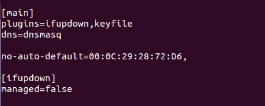
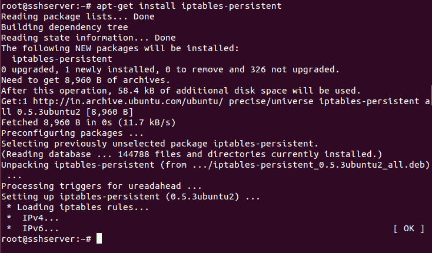
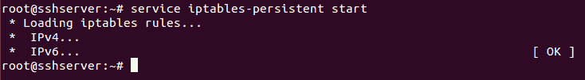
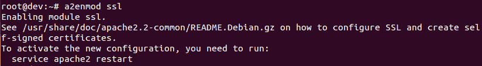

# 第六章：网络安全

在本章中，我们将讨论以下主题：

+   管理 TCP/IP 网络

+   使用数据包嗅探器监控网络流量

+   使用 IP 防火墙进行配置

+   阻止伪造地址

+   阻止传入流量

+   配置和使用 TCP Wrappers

+   使用`mod_security`阻止特定国家的流量

+   使用 SSL 保护网络流量

# 管理 TCP/IP 网络

随着计算机网络规模的扩大，管理网络信息成为系统管理员的重要任务。

# 准备工作

在我们开始更改 TCP/IP 配置之前，请确保通过以下命令备份网络管理器配置文件：


同样以相同的方式备份`/etc/network/interfaces`文件。

# 如何操作...

在本节中，我们将了解如何使用命令行手动配置网络设置：

1.  在开始手动配置之前，首先检查当前由 DHCP 自动分配给系统的 IP 地址。我们可以通过右键点击右上角面板上的网络图标，选择**连接信息**来以图形方式查看详细信息，如下图所示：


我们可以看到，当前系统的 IP 地址是`192.168.1.101`。

1.  接下来，我们使用命令行通过输入`ifconfig`命令来检查相同的信息：


1.  如果我们只想查看系统上可用的以太网设备，可以运行以下命令：


上述命令将列出系统上所有可用以太网设备的单行描述。

1.  如果我们想获取有关网络接口的更详细信息，可以使用一个叫做`lshw`的工具，如下所示：


此命令还提供有关硬件其他功能的详细信息。

1.  现在，我们将禁用网络管理器，并手动设置 IP 地址。要禁用网络管理器，编辑`/etc/NetworkManager/NetworkManager.conf`文件，如下所示：



将行`managed=false`更改为`managed=true`并保存文件。

1.  现在，打开`/etc/network/interfaces`文件，可以选择任何编辑器。我们可以看到，默认情况下，`eth0`接口没有任何信息：


1.  编辑文件并添加下图所示的信息。确保根据您的网络设置添加 IP 详细信息：


完成后，保存文件并重启计算机以`解除`网络管理器的控制。

1.  如果您希望创建一个虚拟网络适配器，可以在`/etc/network/interfaces`文件中添加以下行，如下所示：


通过这样做，我们已经为单个以太网卡添加了两个 IP 地址。我们可以通过这种方式创建多个网络卡实例。

1.  完成编辑后，通过以下命令重启网络服务：

```
    service network-manager restart
```

您还可以使用此命令：

```
    /etc/init.d/networking restart
```

1.  接下来，我们可以查看如何配置适当的`nameserver`，如果 IP 地址是手动配置的话。

要进行更改，请在任意编辑器中编辑`/etc/resolv.conf`文件，并添加以下截图所示的行：


按照前面的步骤，我们将能够成功配置 IP 详情。

# 它是如何工作的...

系统上的 TCP/IP 设置可以是自动管理或手动管理的。根据`/etc/NetworkManager/NetworkManager.conf`文件中的内容，系统会理解这些设置是自动管理还是手动管理。

对于手动配置，我们编辑`/etc/network/interfaces`文件，并输入前面章节中显示的 IP 详情。完成后，我们可以重启网络服务或完全重启系统，以使更改生效。

# 使用数据包嗅探器监控网络流量

最广泛使用的 Linux 命令行数据包嗅探器或数据包分析工具之一是 Tcpdump。它帮助捕获或过滤通过网络在特定接口上传输或接收的 TCP/IP 数据包。

# 准备工作

Tcpdump 在大多数 Linux/Unix 操作系统中预装。如果没有预装，我们可以通过以下命令安装它：


# 如何操作...

一旦安装了`tcpdump`，我们可以通过简单地运行命令`tcpdump`来开始使用它：

1.  当我们仅仅运行`tcpdump`时，它会开始捕获在任何接口上发送或接收的所有数据包。


1.  如果我们只想捕获特定接口上的数据包，可以按以下截图所示的方式进行操作：


1.  前述命令将捕获在定义接口上接收到的所有数据包，直到手动停止。如果我们希望捕获特定数量的数据包，可以使用`-c`选项，如下所示：


1.  要以 ASCII 格式显示捕获的数据包，我们可以使用`-A`选项：


1.  如果我们希望列出系统上可用的接口数量，可以使用`-D`选项来实现：


1.  如果我们在捕获数据包时使用`-XX`选项，`tcpdump`将捕获数据包的链路层头部，格式为 HEX 和 ASCII，如下所示：


1.  我们可以通过在执行 `tcpdump` 时使用 `-w` 选项，将捕获的数据包保存到 `.pcap` 格式的文件中：


在前面的命令中，我们已将数据保存到 `capture.pcap` 文件中。

1.  当我们想要读取和分析捕获的包文件时，可以使用带有 `-r` 选项的命令，如下所示：


1.  默认情况下，`tcpdump` 会捕获所有端口的包。如果我们想要捕获某个特定端口的数据包，例如端口 `80`，可以按如下方式进行：


# 它是如何工作的...

TCPdump 分析网络行为、性能以及生成或接收网络流量的应用程序。Tcpdump 使用 `libpacp/winpcap` 来捕获数据，并利用其内置的广泛协议定义来分析捕获的数据包。

# 使用 IP 表配置防火墙

在保护 Linux 系统时，一个至关重要的步骤是设置一个好的防火墙。大多数 Linux 发行版都预装了不同的防火墙工具。Iptables 就是其中一种默认的防火墙工具。对于旧版本的 Linux 内核，Ipchains 是默认的防火墙。

# 准备就绪

由于 **Iptables** 随 Linux 发行版一起提供，因此无需安装额外的工具即可使用它。然而，建议在使用 Iptables 时不要使用 root 账户。相反，使用具有超级用户权限的普通账户来高效运行命令。

# 如何实现...

我们可以使用 Iptables 定义不同的规则。这些规则会被内核在检查进出流量数据包时遵循：

1.  我们在系统上要做的第一件事是检查安装的 `iptables` 版本，可以使用以下命令：


1.  现在，我们将通过使用 `-L` 选项检查系统中是否已经存在 Iptables 的规则：


1.  上述输出也可以以一种格式查看，它告诉我们每个策略所需的命令。为此，可以使用 `-S` 选项，如下所示：


1.  现在，我们将通过以下命令检查哪些 `iptables` 模块在默认情况下已加载，以确保其正常功能：


1.  现在，让我们添加第一个规则，它将确保即使在我们设定阻止不需要的服务规则后，所有当前的在线连接仍然保持在线：

```
    iptables -A INPUT -m conntrack --ctstate ESTABLISHED,RELATED -j ACCEPT
```

在这里，`-A` 选项将规则附加到现有的表中。`INPUT` 告诉我们该规则将被附加到 Iptables 的输入链中。命令的下一个参数 `-m conntrack --ctstateESTABLISHED,RELATED` 确保该规则只适用于当前在线的连接。接着，`-j ACCEPT` 告诉 `iptables` 接受并允许符合先前指定条件的数据包。

1.  现在，如果我们再次检查 `iptables` 中的规则列表，我们可以看到我们的规则已被添加：

****

1.  现在，假设我们希望保持通过 Iptables 允许 SSH 连接。为此，我们添加以下截图中的规则：

****

我们使用了端口 `22`，因为它是 SSH 的默认端口。如果你在服务器上更改了 SSH 的端口，请在前面的截图中使用相应的端口。

1.  我们还需要确保我们的服务器继续正常运行，允许服务器上的服务之间相互通信，而不会被 Iptables 规则阻塞。为此，我们希望允许所有发送到回环接口的包。

我们添加以下规则以允许回环访问：

```
 iptables -I INPUT 1 -i lo -j ACCEPT
```

在这里，`-I` 选项告诉 iptables 插入一条新规则，而不是将其附加到现有规则中。它需要指定链和新规则需要添加的位置。在前面的命令中，我们将此规则作为 `INPUT` 链中的第一条规则进行添加，这样它就是首先被应用的规则。

1.  现在，如果我们使用 `-v` 选项查看 Iptables 中的规则列表，我们可以看到回环接口 `lo` 的规则作为我们的第一条规则：

****

1.  现在，假设我们已经根据需求为所有要允许的数据包添加了规则，我们必须确保任何其他进入 `INPUT` 链的数据包都应该被阻止。

为此，我们将通过运行 `iptables -A INPUT -j DROP` 命令来修改 `INPUT` 链：

****

从前面的代码可以看出，丢弃所有数据包的规则已被添加到 `INPUT` 链的底部。这确保每当有数据包进入时，`iptables` 规则会按指定顺序进行检查。如果没有规则匹配该数据包，它将被丢弃，从而默认阻止数据包被接受。

1.  到目前为止，我们在 Iptables 中添加的所有规则都是非持久性的。这意味着，一旦系统重启，所有的 `iptables` 规则将会消失。为了保存我们创建的规则并在服务器重启时自动加载这些规则，我们可以使用 `iptables-persistent` 包。

1.  使用以下命令安装该软件包：

```
    apt-get install iptables-persistent
```

****

1.  在安装过程中，系统会询问您是否希望保存当前的 iptables 规则并自动加载它们。根据您的选择，选择 `Yes` 或 `No`。

1.  安装完成后，我们可以通过运行以下命令启动该软件包：

****

# 它是如何工作的……

在前面的示例中，我们使用了 Linux 中的 Iptables 来配置系统防火墙。

首先，我们了解了 `iptables` 命令的基本选项，然后我们学习了如何在 `iptables` 中添加不同的规则。我们添加了允许本地访问和外发主动连接的规则。接着，我们添加了一条规则来允许 SSH 连接。

然后，我们添加了一条规则，拒绝所有不符合上述规则的传入数据包。

最后，我们使用 `iptables-persistent` 包保存 iptables 规则，即使在系统重启后也能保存。

# 阻止伪造的地址

IP 欺骗是一种攻击者常用的技术，用于向服务器发送恶意数据包。它是通过伪造 IP 地址创建 IP 数据包的过程。这主要用于执行如**拒绝服务**（**DoS**）攻击等攻击。

# 准备工作

如果我们希望阻止伪造的 IP 地址，我们需要有一个包含这些伪造连接源地址的 IP 地址或域名列表。

# 如何操作……

我们将尝试创建一个基本的 iptables 规则集，通过它我们将限制所有传入数据包，除了那些我们需要的：

1.  第一步是创建一个允许访问回环接口的规则，以便系统上的服务能够在本地相互正常通信。执行此操作的命令如下：

```
    iptables -A INPUT -i lo -j ACCEPT  
```


这是系统正常运行所必需的。

1.  接下来，我们将为由我们的系统发起的外发连接创建规则：

```
    iptables -A INPUT -m conntrack --ctstate RELATED,ESTABLISHED -j ACCEPT
```

这将接受所有外发流量，包括来自远程服务器的响应，我们尝试连接的服务器（例如我们访问的任何网站）：


1.  现在，让我们创建一个在 `iptables` 中使用的表。我们将其命名为 `blocked_ip`。您可以选择任何您喜欢的名称：

```
    iptables -N blocked_ip  
```

这是我们将添加要阻止的伪造 IP 地址的表。

1.  现在，我们将通过以下命令将此表插入到 `iptables` 的 `INPUT` 表中：

```
    iptables -I INPUT 2 -j blocked_ip  
```

请注意，我们使用了数字 `2`，确保此规则在 `iptables` 中排在第二位。

1.  现在，让我们将恶意 IP 地址添加到我们创建的 `blocked_ip` 表中：

```
    iptables -A blocked_ip -s 192.168.1.115 -j DROP  
```

我们在这里使用了 IP 地址 `192.168.1.115` 作为示例。您可以将其替换为您要阻止的 IP 地址。如果您有多个 IP 地址需要阻止，请逐个添加到 `iptables`。

1.  现在，我们可以使用以下命令查看 `iptables` 中的规则列表：

```
    iptables -L
```

在以下截图中显示的详细信息中，我们可以看到，在底部，我们有正在尝试阻止的 IP 地址。您可以根据需要指定单个 IP 地址或范围：


1.  在设置完 Iptables 规则后，我们还可以编辑 `/etc/host.conf` 文件。用您选择的任何编辑器打开该文件。我使用的是 nano：

```
    nano /etc/host.conf
```

现在，按如下方式在文件中添加或编辑以下行：

```
    order hosts,bind
    nospoof on
```

****

在前面的示例中，`nospoof on` 选项会将通过主机名查找返回的 IP 地址与通过 IP 地址查找返回的主机名进行比较。如果比较失败，系统会生成欺骗警告。

完成后，保存并关闭文件。这也有助于保护系统免受 IP 欺骗。

# 它是如何工作的...

要阻止伪造的 IP 地址或任何其他 IP 地址，我们再次使用 Iptables，因为它是默认的防火墙，除非我们不想使用任何其他 Linux 工具。

我们再次创建规则以允许本地主机访问系统，并保持出站活动连接的存活。然后，我们在 Iptables 中创建一个表格，用于维护我们要阻止的伪造 IP 地址列表。之后，我们将此表格添加到 Iptables 的输入链中。现在，我们可以在需要时将任何 IP 地址添加到表格中，它将自动被阻止。

我们还可以使用 `/etc/host.conf` 文件来保护系统免受 IP 欺骗。

# 阻止传入流量

Linux 系统管理员最重要的任务之一是控制对网络服务的访问。有时，最好阻止服务器上的所有传入流量，仅允许所需的服务进行连接。

# 准备工作

由于我们在这里也将使用 `iptables`，因此执行这些步骤无需额外的软件包。我们只需要一个具有超级用户权限的用户帐户。然而，最好这个帐户不是 `root` 帐户。

# 如何操作...

我们将配置 Iptables 来拒绝一切流量，除了从我们系统内部发起的流量（例如，网页浏览器有网页流量，或者之前已经启动了某些下载，以更新软件包或其他软件）：

1.  如前面的示例所示，我们在 Iptables 中的第一条规则将是允许访问本地主机数据。运行以下命令来执行此操作：

```
    iptables -A INPUT -i lo -j ACCEPT  
```


1.  我们的下一条规则将用于接受所有与出站连接相关的流量。这也包括来自远程服务器的响应，我们的系统正在连接该服务器：


1.  接下来，我们将添加规则以接受时间超时 ICMP 数据包。这对于时间限制的连接设置非常重要：

```
    iptables -A INPUT -p icmp -m icmp --icmp-type 11 -j ACCEPT   
```

1.  接下来，我们将添加规则以接受来自远程服务器的目的地不可达 ICMP 数据包：

```
    iptables -A INPUT -p icmp -m icmp --icmp-type 3/4 -j ACCEPT
```

1.  接下来，添加规则以接受 PING 请求/响应（回显 ICMP），保持我们系统与可能需要 PING 的 Web 服务的连接：

```
    iptables -A INPUT -p icmp -m icmp --icmp-type 8 -j ACCEPT  
```

1.  一旦添加了前面的规则，我们通过运行以下命令来检查 Iptables 中的列表：

```
    iptables -L 
```


1.  现在，我们将创建一个 iptables 表，其中包含一系列可接受的规则和服务：

```
    iptables -N allowed_ip  
```

然后，我们将这个表添加到 Iptables 的`INPUT`链中：

```
    iptables -A INPUT -j allowed_ip  
```

1.  现在，让我们添加一条规则，允许系统访问 SSH。为此，我们可以运行以下命令：

```
    iptables -A allowed_ip -p tcp --dport 22 -j ACCEPT
```

1.  现在，如果我们检查 iptables 中的规则列表，得到的结果如下：

```
 iptables -L 
```


1.  一旦我们添加了接受我们需要的流量的规则，我们现在希望拒绝所有其他没有设置规则的流量。为此，我们添加以下规则：

```
    iptables -A INPUT -j REJECT --reject-with icmp-host-unreachable

```

通过这样做，每当有人尝试连接到服务器时，会向他们发送一个**主机不可达**ICMP 数据包，从而终止连接尝试。

1.  在添加了上述规则后，我们的 iptables 现在看起来像以下屏幕截图所示：


# 它是如何工作的...

为了阻止所有进入的流量并只允许出站连接，我们再次使用 Iptables，因为它是 Linux 的默认防火墙。

为了确保服务器内部的正常运行，我们允许访问本地主机。

接下来，为了保持出站连接的活跃，我们添加规则以接受**超时**、**目标不可达**和**回显**ICMP 数据包。

一旦这些规则被添加，我们可以定义是否允许某些特定服务（如 SSH）或某个特定客户端地址的传入流量。为此，我们创建一个表来添加我们希望允许的客户端的 IP 地址列表。然后，添加规则来允许访问 SSH 服务，或根据我们的需求允许任何其他服务。

最后，我们添加规则来拒绝所有没有添加规则的流量。

# 配置和使用 TCP Wrappers

通过限制访问来保护服务器是一项关键措施，设置服务器时不应忽视。使用 TCP Wrappers，我们可以只允许已配置并支持 TCP Wrappers 的网络访问我们服务器的服务。

# 准备就绪

为了演示接下来的步骤，我们使用两个在同一网络中的系统，能够成功地彼此 ping 通。一个系统将作为服务器，另一个将作为客户端。

# 如何操作...

Linux 提供了几种控制网络服务访问的工具。TCP Wrappers 是其中之一，它增加了一层额外的保护。在接下来的步骤中，我们将展示如何配置 TCP Wrappers 来定义不同主机的访问权限：

1.  首先，我们需要检查某个程序是否支持 TCP Wrappers。为此，可以使用`which`命令查找程序可执行文件的路径：

```
    which sshd 
```


在这里，我们以`SSH`程序为例。

1.  接下来，我们使用`ldd`程序检查`SSH`程序与 TCP Wrappers 的兼容性：

```
    ldd /usr/sbin/sshd  
```


如果前面命令的输出中包含`libwrap.so`，则表示该程序支持 TCP Wrappers。

1.  现在，每当 SSH 程序尝试使用 TCP Wrappers 连接到服务器时，将按照以下顺序检查两个文件：

+   +   `/etc/hosts.allow`：如果在此文件中找到与程序匹配的规则，则会允许访问。

    +   `/etc/hosts.deny`：如果在此文件中找到与程序匹配的规则，则会拒绝访问。

1.  如果在两个文件中都没有找到匹配的规则，访问将被允许。

1.  如果我们尝试连接到 SSH 服务器，在添加任何规则之前，我们会看到连接成功：


1.  现在，假设我们想拒绝来自某个系统的 SSH 程序访问，且该系统具有指定的 IP 地址。为此，我们将编辑`/etc/hosts.deny`文件，如下所示：


1.  现在，如果我们尝试从已被拒绝访问的特定系统连接到 SSH 服务器，它将显示以下错误：


1.  如果我们想允许所有程序和所有客户端的访问，可以在两个文件中都不添加任何规则，或者在`/etc/hosts.allow`文件中添加以下行：


1.  如果我们想允许来自特定客户端（IP 地址为`192.168.1.106`）的所有服务访问，那么我们可以在`/etc/hosts.allow`文件中添加以下行：


1.  如果我们希望允许某个特定网络中的所有客户端访问 SSH，但排除 IP 地址为`192.168.1.100`的特定客户端，可以在`/etc/hosts.allow`文件中进行以下更改：


1.  在做完上述更改后，当我们尝试通过 SSH 连接时，我们将看到以下错误：


我们可以看到，一旦客户端的 IP 地址更改，SSH 访问将被允许，这意味着该网络中的所有客户端可以访问 SSH，除非该 IP 地址已被拒绝。

1.  前述步骤会阻止我们在`/etc/hosts.allow`文件中定义规则的服务。然而，在服务器端，我们无法得知是哪一个客户端尝试连接服务器以及何时尝试连接。因此，如果我们想保持客户端所有连接尝试的日志，可以按如下方式编辑`/etc/hosts.allow`文件：


在前面的这行中，`spawn` 关键字定义了每当客户端发出连接请求时，它将回显由 `%h` 选项指定的详细信息，并将其保存在日志文件 `conn.log` 中。

1.  现在，当我们读取 `conn.log` 文件的内容时，可以看到其详细信息，如下所示：


文件包含了客户端尝试连接的时间记录以及来源 IP 地址。通过使用 `spawn` 命令的不同参数，可以捕获更多的细节信息。

# 它是如何工作的...

我们使用 TCP Wrappers 来限制对支持 TCP Wrapper 包的程序的访问。我们首先使用 `ldd` 工具检查我们要限制的程序是否被 TCP Wrapper 支持。然后，我们根据需要在 `/etc/hosts.allow` 或 `/etc/hosts.deny` 文件中添加规则。

之后，我们根据需要添加规则来限制某个特定客户端或整个网络的访问。通过在 TCP Wrapper 中使用 `spawn` 选项，我们甚至可以为被限制的客户端或程序的连接尝试维护一个日志。

# 使用 mod_security 阻止特定国家的流量

ModSecurity 是一个可以用于 Apache Web 服务器的 Web 应用防火墙。它提供日志记录功能，并可以监控 HTTP 流量以检测攻击。ModSecurity 还可以作为入侵检测工具，我们可以使用它来根据需求阻止特定国家的流量。

# 准备工作

在我们开始安装和配置 `mod_security` 之前，必须在 Ubuntu 系统上安装 Apache 服务器。

在 Ubuntu 上安装 Apache，运行以下命令：

```
apt-get update
apt-get install apache2
```

# 如何操作...

在本节中，我们将看到如何安装和配置 ModSecurity **Web 应用防火墙**（**WAF**）来阻止特定国家的流量：

1.  一旦在 Ubuntu 上安装了 Apache，下一步是通过运行以下命令来安装 ModSecurity：


1.  安装 ModSecurity 后，重启 Apache：


1.  为了确认 ModSecurity 是否安装成功，运行以下命令：


如果安装成功，我们应该会看到类似于以下内容：`security2_module (shared)`，如前面的截图所示。

1.  安装完成后，我们开始配置 ModSecurity。为此，我们使用预先包含的推荐配置文件 `modsecurity.conf-recommended`，该文件位于 `/etc/modsecurity` 目录中。

1.  将 `modsecurity.conf-recommended` 文件重命名，如下所示：


1.  重命名文件后，我们编辑 `modsecurity.conf` 文件，并将 `SecRuleEngine detectiononly` 的值更改为 `SecRuleEngine` 打开。


1.  保存这些更改后，重启 Apache：


1.  ModSecurity 提供了许多 **Core Set Rules** (**CSR**) 规则集。不过，我们可以通过以下命令从 GitHub 下载最新的 OWASP ModSecurity CRS：

```
git clone https://github.com/SpiderLabs/owasp-modsecurity-crs.git
```

1.  下载完成后，进入下载的目录。接下来，将 `crs-setup.conf.example` 文件移动并重命名为 `/etc/modsecurity/`，如下所示。将 `rules/` 目录也移动到 `/etc/modsecurity/`：


1.  现在，编辑 Apache 配置文件 `/etc/apache2/mods-available/security2.conf`，并添加 `Include` 指令来指向规则集，如下所示：


1.  重新启动 Apache 以使更改生效：


1.  ModSecurity 支持通过与免费的 Maxmind 数据库集成来使用地理位置数据。

1.  要阻止特定国家的流量，首先需要在与 ModSecurity 配置相同的服务器上下载地理位置数据库。下载数据库的命令如下：


1.  下载完成后，解压并将文件移动到 `/usr/share/GeoIP/`。

1.  下一步是编辑 `/etc/modsecurity/crs-setup.conf` 文件，以启用地理位置数据库的使用。为此，我们启用 `SecGeoLookupDb` 指令，并定义下载的 GeoIP 数据库文件的路径：


1.  接下来，我们需要设置规则来阻止来自任何国家的流量。配置文件中有一个示例规则供参考，可以通过取消注释该规则来使用：


1.  取消注释规则并添加我们希望阻止的国家的国家代码后，如下图所示，我们可以保存文件：


1.  如果我们希望服务器仅能从特定国家访问，并阻止所有其他国家的流量，我们可以创建如下的规则：

```
SecRule *GEO:COUNTRY_CODE3* "***!@streq USA***" "phase:1,t:none,log,deny,msg:'Client IP not from USA'"
```

这样，我们就可以使用 ModSecurity 来阻止或允许特定国家的流量。

# 使用 SSL 加密网络流量

**TLS** 和 **SSL** 是安全协议，旨在将普通流量放置在一个受保护的加密外壳中。借助这些协议，流量可以以加密格式在远程用户之间传输，从而保护流量不被其他人拦截和读取。这些证书是数据加密过程中的重要组成部分，并有助于确保互联网交易的安全。

# 准备工作

在开始创建和配置自签名证书之前，我们需要在 Ubuntu 系统上安装 Apache 服务器。

要在 Ubuntu 上安装 Apache，请运行以下命令：

```
apt-get update
apt-get install apache2
```

# 如何操作...

在本节中，我们将学习如何创建自签名证书以加密到 Apache 服务器的流量：

1.  一旦我们的 Apache 服务器安装完成，我们可以通过访问浏览器中的 `http://localhost` 链接来检查默认网页：


1.  然而，当我们尝试使用 HTTPS 访问相同页面时，我们会遇到以下错误：


1.  要开始使用 SSL，我们必须在 Ubuntu 服务器上启用 SSL 支持模块。为此，我们需要运行以下命令：



1.  启用 SSL 模块后，重新启动 Apache 服务器，以便可以识别更改：


1.  现在，我们将继续创建自签名证书。首先，在 Apache 配置层级中创建一个子目录。我们将在此处放置要创建的证书文件。运行以下命令：


1.  现在，我们将创建密钥和证书文件，并将其放置在前一步骤中创建的目录中。要创建密钥和证书文件，我们可以使用 `openssl` 命令，如下所示：


有关 `openssl` 命令使用的选项的更多详细信息，建议查阅该命令的手册。

1.  当我们执行之前的命令时，会提示我们回答一些问题。输入所需的详细信息以完成证书创建过程：


在这些问题中，最重要的是 `Common Name`（服务器的 `FQDN 或您的名字`）。在此，我们需要输入应与证书关联的域名。如果没有域名，也可以使用服务器的公网 IP。

1.  一旦命令完成，我们可以检查之前创建的 `/etc/apache2/ssl` 目录。我们将看到密钥和证书文件已被放置在此处：


1.  创建密钥和证书文件后，下一步是配置 Apache 使用这些文件。我们将以 `etc/apache2/sites-available/default-ssl` 文件为基础进行配置，因为该文件包含默认的 SSL 配置。

1.  编辑文件并设置我们将为虚拟主机配置的值，包括 `SeverAdmin`、`ServerName`、`ServerAlias` 等。按照以下方式输入详细信息：


1.  在同一文件中，我们需要定义 Apache 可以找到 SSL 证书和密钥的位置，如下所示：


1.  一旦为启用 SSL 的虚拟主机完成上述配置，我们需要启用它。为此，我们运行以下命令：


1.  为了加载新的虚拟主机文件，重新启动 Apache 使更改生效。

1.  完成所有设置后，我们现在可以通过使用 HTTPS 协议访问我们服务器的域名来测试我们的配置。一旦我们在浏览器中输入带有`https`的域名并按*Enter*键，我们将看到以下屏幕：


这证实证书正在加载。由于它是自签名证书，我们会收到一个警告消息，指出“此连接不受信任”。如果证书是由浏览器信任的证书颁发机构之一签发的，则不会出现此警告。

1.  一旦我们点击“我理解风险并继续”，我们将被要求添加一个安全异常，如下截图所示。确认安全异常以将我们的自签名证书添加到浏览器中：


我们现在在我们的 Web 服务器上启用了 SSL。这将有助于保护用户和服务器之间的通信流量。

# 工作原理...

SSL 证书是提供认证的数字护照，用于保护服务器与浏览器之间通信的机密性和完整性。SSL 证书具有一对密钥：公钥和私钥，它们共同工作以建立加密连接。

当浏览器尝试连接到使用 SSL 加密的 Web 服务器时，它会请求 Web 服务器进行身份验证。然后，服务器会发送其 SSL 证书的副本。收到证书后，浏览器向服务器发送一条消息。之后，服务器会发送回一个数字签名的确认消息，告知服务器启动 SSL 加密连接。现在，服务器和浏览器之间共享的所有数据都是加密的。
