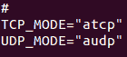
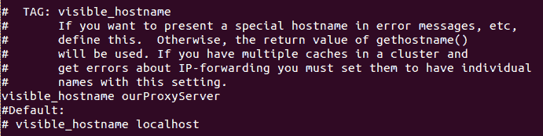
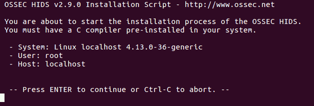
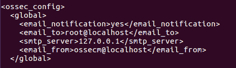
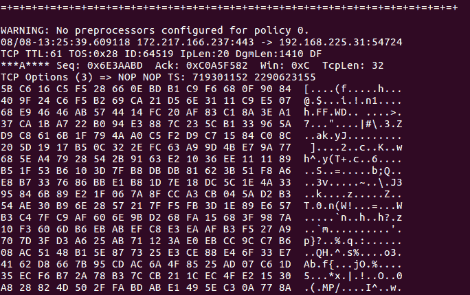
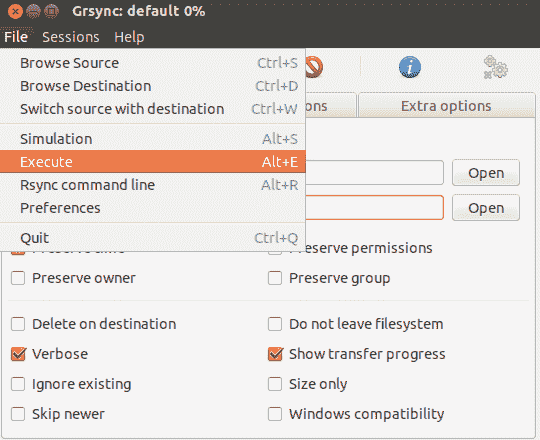
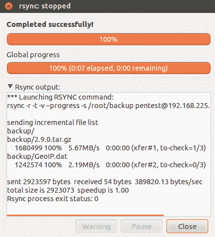

# 第七章：安全工具

本章我们将讨论以下内容：

+   Linux sXID

+   Port Sentry

+   使用 Squid Proxy

+   Open SSL 服务器

+   Trip Wire

+   Shorewall

+   OSSEC

+   Snort

+   Rsync 和 Grsync—备份工具

# Linux sXID

在 Linux 中，通常一个文件具有读取、写入和执行权限。除了这些权限外，文件还可以具有特殊权限，如 SUID（设置所有者用户 ID）和 SGID。由于这些权限，用户可以从他们的帐户登录，并以实际文件所有者的权限（也可以是 root）运行某个特定文件/程序。sXid 是定期监控 SUID/SGID 的工具。使用该工具，我们可以跟踪文件和文件夹的 SUID/SGID 变化。

# 准备工作

要使用此工具，我们需要在 Linux 系统上安装 sXid 软件包。我们可以使用 `apt-get` 命令来安装软件包，或者下载软件包并手动配置和安装它。要安装 sXid 软件包，我们运行以下命令：

```
    apt-get install sxid
```


# 如何做到...

要开始监控文件和文件夹的 `suid/sgid`，我们将工具配置如下：

1.  安装完成后，我们开始编辑 `/etc/sxid.conf` 文件，以根据需要使用该工具。用您选择的编辑器打开文件：

```
    nano /etc/sxid.conf
```

1.  在配置文件中，查找以下行：


如果您希望每次运行 `sxid` 时将更改的输出发送到您的电子邮件 ID，请将 `EMAIL` 的值更改为其他电子邮件 ID。

1.  接下来，查找包含`KEEP_LOGS`的行，并将其值更改为您选择的数字值。此数字定义了要保留的日志文件数量：


1.  如果您希望即使 sXid 未发现任何变化时也能收到日志，请将 `ALWAYS_NOTIFY` 的值更改为 yes：


1.  我们可以为 `SEARCH` 选项定义一个以空格分隔的目录列表，作为 sXid 搜索的起始点。然而，如果我们希望排除任何目录，可以在 `EXCLUDE` 选项下指定该目录：


假设我们有一个目录 `/usr/local/share` 需要被搜索，而 `/usr/local` 目录已被列入排除列表，但它仍会被搜索。这在排除主目录并只指定一个目录时非常有用。

1.  `/etc/sxid.conf` 中有更多选项，可以根据我们的需求进行配置。完成编辑后，保存并关闭文件。

1.  现在，如果我们希望手动运行 sxid 进行抽查，可以使用以下命令：

```
    sxid -c /etc/sxid.conf -k
```


这里，`-c` 选项帮助定义配置文件的路径，如果命令没有自动选择该路径。`-k` 选项用于运行该工具。

# 它是如何工作的...

我们首先安装 sxid 包，然后根据我们的要求编辑 `/etc/sxid.conf` 文件进行配置。配置完成后，我们手动运行 sXid 进行抽查。我们甚至可以在 `crontab` 中添加一个条目，以便在定义的间隔时间内自动运行 sXid（如果需要的话）。

# Port Sentry

作为系统管理员，一个主要的关注点是保护系统免受网络入侵。这就是 PortSentry 发挥作用的地方。它具有检测主机系统上扫描活动的能力，并根据我们选择的方式对这些扫描作出反应。

# 准备就绪

为了演示 PortSentry 的实现和使用，我们需要两个在同一网络中的系统，且这两个系统可以相互 ping 通。此外，我们还需要在一个系统上安装 Nmap 包，它将作为客户端，另一个系统上我们将安装并配置 PortSentry 包。要安装 `nmap` 包，可以使用 `apt-get install nmap` 命令：


# 如何操作...

1.  在第一台系统上，我们使用以下命令安装 PortSentry 包：

```
    apt-get install portsentry
```


1.  在安装过程中，会弹出一个包含有关 PortSentry 信息的窗口。只需点击 `Ok` 继续。

1.  一旦安装完成，PortSentry 就开始监控 TCP 和 UDP 端口。我们可以通过使用以下命令检查 `/var/log/syslog` 文件来验证这一点：

```
    grep portsentry /var/log/syslog
```


我们可以在日志中看到与 `portsentry` 相关的消息。

1.  现在，在第二台我们用作客户端的机器上，运行如下所示的 `nmap` 命令：


我们还可以使用任何其他 `nmap` 命令对第一个运行 `portsentry` 的系统进行 TCP 或 UDP 扫描。要查看 Nmap 命令，请参见 第一章，*Linux 安全问题*。在之前的结果中，我们可以看到，即使在第一个系统上运行 PortSentry，nmap 也能够成功扫描。我们甚至可以尝试从客户端 ping 服务器系统，看看在安装 PortSentry 后是否仍然有效。

1.  现在，让我们通过编辑服务器系统上的 `/etc/portsentry/portsentry.conf` 文件来配置 PortSentry。打开文件后，查找显示的行并将值更改为 `1`：


1.  向下滚动并找到并取消注释此行：


1.  接下来，取消注释以下行：


完成后，保存并关闭文件。

1.  接下来，编辑 `/etc/default/portsentry` 文件：



在这里显示的行中，我们需要提到 Portsentry 应该工作在哪个协议上，TCP 还是 ATCP。

1.  现在，编辑 `/etc/portsentry/portsentry.ignore.static` 文件，并在文件底部添加一行，如下所示：


这里，`192.168.1.104` 是我们尝试阻止的客户端机器的 IP 地址。

1.  现在，使用以下命令重启 Portsentry 服务：


1.  完成前面的步骤后，我们将再次尝试在客户端机器上运行 `nmap`，并查看它是否仍然正常工作：


我们可以看到，nmap 现在无法扫描该 IP 地址。

1.  如果我们尝试从客户端 ping 服务器，即使是这个操作也无法成功：


1.  如果我们检查 `/etc/hosts.deny` 文件，我们会看到以下行已经自动添加：


1.  同样，当我们检查 `/var/lib/portsentry/portsentry.history` 文件时，我们会得到类似于此截图最后一行的结果：


# 工作原理...

我们使用了两台系统。第一台系统充当 Portsentry 服务器，另一台充当客户端。在第一台系统上，我们安装 Portsentry 软件包，在第二台系统上安装 nmap，用于演示 Portsentry 的工作原理。现在，我们在客户端机器上对服务器执行 Nmap 扫描，看到它正常工作。完成此操作后，我们根据需求编辑各种文件来配置 Portsentry。编辑完成后，重启 portsentry 服务，然后再次尝试从客户端对服务器执行 Nmap 扫描。我们看到现在扫描无法正常工作。

# 使用 Squid 代理

Squid 是一款功能强大的 Web 代理应用，具有多种配置和用途。Squid 拥有大量的访问控制功能，并支持多种协议，如 HTTP、HTTPS、FTP 和 SSL。在本节中，我们将学习如何使用 Squid 作为 HTTP 代理。

# 准备工作

要在特定系统和网络上安装和使用 Squid，请确保该系统有足够的物理内存，因为 Squid 也作为缓存代理服务器工作，因此需要空间来维护缓存。我们在本例中使用的是 Ubuntu 系统，Squid 可以在 Ubuntu 仓库中找到。所以，我们需要确保系统是最新的。为此，我们运行此命令：

```
    apt-get update
```

然后我们运行此命令：

```
    apt-get upgrade
```

# 如何操作...

要在我们的系统上安装和配置 Squid，我们需要按照以下步骤进行：

1.  第一步是使用以下命令安装 Squid 软件包：


1.  一旦 Squid 安装完成，它将以默认配置启动，默认配置是阻止所有网络上的 HTTP/HTTPS 流量。要检查这一点，我们只需要配置网络中任意系统的浏览器，使用代理系统的 IP 地址，如下所示：


1.  完成后，我们可以尝试访问任何网站，并且会看到一个错误页面，如下图所示：


1.  现在，我们将开始配置我们的代理服务器，以使其按照我们的要求工作。为此，我们将在我们选择的编辑器中编辑`/etc/squid3/squid.conf`文件。一旦在编辑器中打开文件，搜索读取`TAG: visible_hostname`的类别。在此类别下，添加一行，`visible_hostname ourProxyServer`：



在这里，`ourProxyServer`是我们给代理服务器起的名称。

1.  接下来，搜索类别为`TAG: cache_mgr`并添加一行，`cache_mgr email@yourdomainname`。在此处，提及可以联系的管理员电子邮件地址，而不是`email@yourdomainname`：


1.  接下来，我们搜索如下截图所示的行。`http_port`变量定义了 Squid 监听的端口。默认端口是`3128`，但我们可以将其更改为任何未使用的端口。我们甚至可以定义多个 Squid 要监听的端口，如下所示：


1.  现在，根据我们的需求，我们需要添加一条允许网络计算机上流量的规则。为此，我们将搜索读取`acl localnet src 10.0.0.8`的行。在这里，我们添加我们的规则，`acl localnetwork src 192.168.1.0/24`，如下面的截图所示：


在我们添加的前面的规则中，`acl`用于定义一个新规则，`localnetwork`是我们给规则起的名称。`src`定义了要发送到代理服务器的流量源。我们按位数定义了网络 IP 地址与子网，如此处所示。根据我们的需求，我们可以添加任意数量的规则。

1.  接下来，搜索读取`http_access allow localhost`的行，并在其下方添加`http_access allow localnetwork`的行，以开始使用我们在上一步中添加的规则并允许流量：


1.  完成前述配置步骤后，我们使用此命令重新启动 Squid 服务：

```
    service squid3 restart
```

1.  现在，我们的 Squid 代理服务器正在运行。为了检查，我们可以尝试从网络上任何系统的浏览器访问代理服务器的 IP 地址：


前面的错误屏幕告诉我们 Squid 代理运行正常。现在，我们可以尝试访问任何其他网站，它应该按照我们在 Squid 配置文件中添加的规则打开。

# 工作原理如下...

我们从安装 Squid 包开始。安装完包后，我们编辑其配置文件`/etc/squid3/squid.conf`，并添加主机名、管理员的电子邮件 ID 以及 Squid 应该监听的端口。然后，我们创建一条规则，以允许同一网络上所有系统的流量。一旦保存了所有配置，我们重新启动 Squid 服务，我们的代理服务器就可以工作了。

# 打开 SSL 服务器

SSL（安全套接层）是一种用于在互联网上传输敏感信息的协议。这些信息可能包括账户密码和信用卡详细信息。SSL 通常与 HTTP 协议一起用于网页浏览。OpenSSL 库提供了 SSL 和 TLS（传输层安全）协议的实现。

# 准备就绪

为了演示 OpenSSL 的使用，我们需要两台系统。一个将作为服务器，我们将在其上安装 OpenSSL 软件包以及 Apache。第二台系统将作为客户端。要安装 Apache，我们运行以下命令：


# 如何操作...

我们现在将展示如何使用 OpenSSL 为 Apache 创建一个自签名证书。这将有助于加密流向服务器的流量：

1.  我们首先在第一个系统上使用以下命令安装 OpenSSL 软件包：


1.  一旦安装了 OpenSSL，我们需要启用 SSL 支持，Ubuntu 的 Apache 包默认已包含此功能。为此，我们运行以下命令：


启用 SSL 支持后，使用以下命令重新启动 Apache：

```
    service apache2 restart
```

1.  现在，在 Apache 的配置目录中创建一个目录。这是我们将在下一步中创建的证书文件存放的位置：

```
    mkdir /etc/apache2/ssl
```

1.  现在，我们将使用以下命令创建密钥和证书：


在上一个命令中，`req -x509`指定我们将创建一个符合 X.509 证书签名请求（CSR）管理的自签名证书。`-nodes`指定密钥文件将创建时不受密码保护。`-days 365`告诉我们创建的证书将在一年内有效。`-newkeyrsa:2048`表示密钥文件和证书文件将同时创建，并且生成的密钥将是 2048 位长。下一个参数`-keyout`指定将创建的私钥的名称。`-out`参数指定创建的证书文件的名称。

1.  在创建密钥和证书文件时，系统会问你几个问题。提供你的配置细节。然而，其中一个问题是`Common Name（例如服务器 FQDN 或您的名字）`，这是非常重要的，我们必须提供域名或服务器的公共 IP。

1.  接下来，我们需要编辑`/etc/apache2/sites-available/default`文件，配置 Apache 使用在前一步中创建的密钥文件和证书文件。找到并编辑此处显示的行。对于`ServerName`，我们提供了 Apache 服务器系统的 IP 地址：


1.  在同一个文件中，滚动到文件末尾，在`<VirtualHost>`块关闭之前，添加此处给出的行。指定在创建这些文件时使用的密钥文件名和证书文件名：


1.  现在，在客户端系统上，打开任何浏览器并使用`https://协议`访问 Apache 服务器的公共 IP，如下所示：


浏览器将显示关于连接不安全的警告信息，因为证书没有被任何受信任的机构签名。

1.  点击`我了解风险`，然后点击`添加例外`按钮，将证书添加到浏览器中：


1.  接下来的窗口将显示有关服务器的一些信息。要继续并添加证书，请点击`确认安全例外`：


1.  如果您希望查看证书的更多详细信息，请点击上一屏幕中的`查看`，您将获得一个新窗口，显示证书的完整信息。

1.  一旦证书成功添加，网页加载将完成，如下所示：


# 它是如何工作的...

我们在此设置中使用了两个系统。第一个是安装了 OpenSSL 包的 Apache 服务器。第二个系统作为客户端，我们将尝试从该客户端连接到 Apache Web 服务器。在第一个系统上安装 Apache 和 OpenSSL 包后，我们启用 Apache 的 SSL 支持。接着，我们使用 OpenSSL 工具和一些参数创建服务器密钥和服务器证书文件。完成后，我们编辑`/etc/apache2/sites-available/default`文件，以便 Apache 能够使用我们创建的密钥和证书。完成后，我们尝试通过客户端机器上的浏览器访问 Apache Web 服务器。我们看到它要求将新的证书添加到浏览器中，添加完成后，我们就能够使用 HTTPS 协议访问网页。

# 还有更多...

我们已经看到如何使用 OpenSSL 创建自签名证书。除了创建自签名证书之外，OpenSSL 还有其他多种使用场景。在这里，我们将看到其中的一些：

1.  如果我们想创建一个新的**证书签名请求**（**CSR**）和一个新的私钥，可以使用如下所示的命令：


1.  在此过程中，它会要求提供一些详细信息。请输入此处所示的详细信息：


1.  我们可以看到当前目录中创建的两个文件：


1.  如果我们想在将证书签名之前检查 CSR，可以按照这里所示进行操作：


同样，还有其他可以与 OpenSSL 一起使用的命令。

# Tripwire

随着如今服务器攻击次数的增加，在确保安全的同时管理服务器正变得越来越复杂。要确保每次攻击都已有效阻止是很难知道的。Tripwire 是一个基于主机的入侵**检测系统**（**IDS**），它可以用来监控不同的文件系统数据点，并在文件被修改或更改时提醒我们。

# 准备中

我们只需要在 Linux 系统上安装 Tripwire 包来配置我们的 IDS。在接下来的部分中，我们将看到如何安装和配置该工具。

# 如何操作...

我们将在接下来的步骤中讨论如何在我们的 Ubuntu 系统上安装和配置 Tripwire：

1.  第一步是使用`apt-get`安装 Tripwire 包，如下所示：


1.  在安装过程中，会显示一个信息窗口。点击 OK 继续。

1.  在下一个窗口中，选择 Internet Site 作为邮件配置类型，然后点击 Ok：


1.  在下一个窗口中，它将要求输入`system mail name`。请输入您正在配置 Tripwire 的系统的域名：


1.  在下一个屏幕中按 Ok 继续。

1.  现在，我们将被问到是否要为 Tripwire 创建一个密码短语。选择 Yes 并继续。

1.  现在，我们将被问到是否希望重新构建配置文件。选择 Yes 并继续：


1.  接下来，选择 Yes 以重新构建 Tripwire 的策略文件：


1.  接下来，提供您希望为 Tripwire 配置的密码短语：


它还会要求您在下一屏中重新确认密码短语。

1.  接下来，为本地密钥提供一个密码短语，并在下一屏中重新确认：


1.  下一屏确认安装过程已成功完成。点击 Ok 完成安装：


1.  一旦安装成功完成，我们的下一步是初始化 Tripwire 数据库。为此，我们运行这里显示的命令：


在这里显示的输出中，我们可以看到许多文件名显示了一个名为`No such file or directory`的错误。这是因为 Tripwire 会扫描其配置文件中提到的每个文件，无论它是否存在于系统中。

1.  如果我们希望删除之前显示的错误，我们必须编辑`/etc/tripwire/tw.pol`文件，并注释掉文件/目录中不存在的行。如果我们愿意，也可以保持原样，因为这不会影响 Tripwire。

1.  如果我们遇到与“分段错误”相关的错误，可能需要编辑`/etc/tripwire/twpol.txt`文件，禁用出现该错误的设备/文件，如下所示 -


1.  我们现在来测试 Tripwire 的工作情况。为此，我们将运行以下命令创建一个新文件：

```
    touch tripwire_testing
```

你可以为文件选择任何名称。

1.  现在，运行 Tripwire 的交互命令来测试它的工作情况。为此，命令如下：

```
    tripwire --check --interactive
```


我们将得到之前显示的输出。Tripwire 会检查所有文件/目录，如果有任何修改，它会显示在结果中：


在我们的例子中，它显示了之前提到的那一行，告诉我们在`/root`目录下添加了一个名为`tripwire_testing`的文件。如果我们希望保留这些变化，只需保存自动在编辑器中打开的结果文件。在保存时，会提示你输入本地密码短语。请输入在安装 Tripwire 时配置的密码短语。

1.  最后，我们在`crontab`中添加一条记录，以便自动运行 Tripwire 检查文件/目录的变化。使用你喜欢的编辑器打开`/etc/crontab`文件，并添加这一行：


这里，`00 6`表示 Tripwire 将每天 6 点进行检查。

# 它是如何工作的...

我们首先安装 Tripwire 软件包，并在安装过程中填写要求的详细信息。安装完成后，我们初始化 Tripwire 数据库。之后，我们检查 Tripwire 是否正常工作。为此，我们首先在任意位置创建一个新文件，然后运行 Tripwire 的交互命令。命令执行完成后，我们会看到输出显示新文件已添加。这确认了 Tripwire 正在完美运行。然后我们编辑 Crontab 配置，以便在特定时间间隔自动运行 Tripwire。

# Shorewall

想要将 Linux 系统设置为小型网络的防火墙吗？Shorewall 帮助我们通过标准的 Shorewall 工具配置企业级防火墙。Shorewall 实际上是建立在 Iptables 之上的，但它简化了配置过程。

# 准备工作

配置 Shorewall 需要一台安装并正常工作的带有两个网卡的 Linux 系统。一个网卡将用作外部网络接口，另一个将用作内部网络接口。在我们的示例中，我们使用`eth0`作为外部接口，`eth1`作为内部接口。根据网络配置配置两个网卡。确保能够 ping 通本地网络中的另一台系统，并且能够连接到外部网络，即互联网。在这台系统上，我们将安装 Shorewall 软件包，并根据我们的需求进行配置。

# 如何操作...

1.  我们从使用`apt-get`命令在系统上安装 Shorewall 开始：

我们添加了一条规则：如果数据包从`net`发送到`fw`，并且使用`tcp`协议且端口号为`80`，则`accept`该数据包。

1.  安装完成后，尝试启动 Shorewall。你会看到如下错误信息：


1.  要配置 Shorewall，编辑`/etc/default/shorewall`文件，并选择你喜欢的编辑器。寻找包含`startup=0`的行，将其值改为`1`：


1.  接下来，编辑`/etc/shorewall/shorewall.conf`文件，并找到包含`IP_FORWARDING`的行。验证其值是否设置为`On`：


1.  Shorewall 的配置文件位于`/etc/shorewall`目录中。要使其工作，必需的最小文件是 interfaces、policy、rules 和 zones。如果在安装后`/etc/shorewall`目录中找不到这些文件，可以在`/usr/share/doc/shorewall/default-config/`目录中找到相同的文件。将所需的文件从该位置复制到`/etc/shorewall`目录。

1.  现在，编辑`/etc/shorewall/interfaces`文件，并添加以下截图所示的行：


我们在配置中将`eth0`称为`net`，将`eth1`称为`local`。你可以选择其他任何名称，只要它是字母数字组合且不超过`5`个字符。

1.  接下来，编辑`/etc/shorewall/zones`文件。Zone 主要用于设置是否使用`ipv4`或`ipv6`：


在之前的配置中，`fw`指的是`me`或 Shorewall 防火墙本身。接下来的两行定义了两个网络接口的`ipv4`。

1.  现在，编辑`/etc/shorewall/policy`策略文件。此文件主要用于设置整体策略，规定谁可以去哪里。该文件中的每一行都从上到下处理，并按照以下格式读取：如果数据包从 ____ 发送到 __，则 ______ 它：


在我们的示例中，如果我们读取第一条策略，它的含义是：如果数据包从本地发送到网络，则接受该数据包。你可以按照相同的方式添加任意数量的策略，Shorewall 防火墙会相应地工作。

1.  最后，我们编辑`/etc/shorewall/rules`文件。此文件用于创建政策的例外。它主要用于允许外部网络的人进入内部网络。以下是一个示例规则文件：


这意味着我们需要首先配置 Shorewall，才能让其开始运行。

1.  一旦我们根据需求完成了配置前述文件，就可以通过运行此命令来测试设置：

```
    shorewall check
```

1.  在显示的输出中，滚动到底部，如果看到`Shorewall configuration verified`，则表示设置已正确完成，现在 shorewall 可以作为防火墙使用：


1.  现在，重启`shorewall`服务以应用设置：

```
    serviceshorewall restart
```

# 它是如何工作的...

我们从在系统上安装 shorewall 开始，该系统有两个网络接口卡。安装完成后，我们编辑`/etc/default/shorewall`文件以及`/etc/shorewall/shorewall.conf`文件。然后，我们编辑或创建以下文件：interfaces、policy、rules 和 zones，并根据给定的要求在每个文件中添加相应的行。编辑完成后，我们检查一切是否正常，然后启动`shorewall`服务以启动防火墙。

# OSSEC

作为系统管理员，我们可能希望跟踪服务器上的授权和未授权活动。OSSEC 可能是解决方案。它是一个开源的基于主机的入侵检测系统，可用于跟踪服务器活动。当正确配置时，OSSEC 可以执行日志分析、完整性检查、rootkit 检测、基于时间的警报等多种功能。

# 准备就绪

为了安装和配置 OSSEC，我们将使用 Ubuntu 服务器。可能需要额外的包，如 gcc、libc、Apache 和 PHP，用于编译和运行 OSSEC。此外，如果我们希望实时警报功能正常工作，还需要一个单独的包。要安装所有必需的包，请运行此处显示的命令：


# 如何操作...

在本节中，我们将学习如何安装和配置 OSSEC 以监控本地 Ubuntu 服务器。我们还将测试 OSSEC 以检测任何文件修改：

1.  我们的第一步是使用以下命令从其 GitHub 仓库下载最新版本的 OSSEC：


1.  根据下载文件保存的位置，使用以下命令解压下载的文件：


1.  进入解压后的目录并列出其内容。我们将看到一个 install.sh 脚本，将用于安装 OSSEC：


1.  如下所示运行 install.sh 来安装 OSSEC：


当提示时，我们将选择我们的语言。所以，如果我们的语言是英语，那么我们将输入`en`并按*Enter*键。

1.  一旦我们按下*Enter*，将会看到以下输出：



1.  再次按*Enter*键继续。在下一屏幕上，它会让你选择想要的安装类型。输入`local`来监控正在安装 OSSEC 的服务器，然后按*Enter*键：


1.  接下来，我们将选择 OSSEC 的安装位置。默认安装位置是 `/var/ossec`。按 Enter 键继续：


1.  我们可以配置 OSSEC，以便将电子邮件通知发送到本地邮箱地址。键入 `y` 并按 Enter 键进行此操作：


1.  在下一步中，我们将被询问是否要运行完整性检查守护进程和 rootkit 检测引擎。对于两者都输入 `Y` 并按 *Enter* 键继续：


1.  接下来，我们将启用主动响应：


1.  继续进行以启用防火墙丢弃响应：


1.  如果需要，我们可以将 IP 添加到白名单中。否则，键入 `n` 并按 *Enter* 键继续：


1.  接下来，按 *Enter* 键启用远程 Syslog。

1.  一旦所有配置完成，按 *Enter* 键开始安装。安装开始后，将显示如下输出：


1.  安装完成后，将看到以下输出：


1.  安装完成后，我们可以通过以下命令检查 OSSEC 的状态：


1.  要启动 OSSEC，请运行以下命令：


1.  一旦 OSSEC 启动，我们将收到邮件警报。键入 `mail` 来查看邮件，邮件内容将类似于以下内容：


1.  我们的下一步是编辑 OSSEC 的主配置文件，即 `/var/ossec/etc/ossec.conf` 文件。使用像 nano 这样的编辑器打开 `ossec.conf` 配置文件。

1.  当我们打开文件时，它将显示我们在安装过程中指定的电子邮件配置。我们可以随时更改此设置：



1.  根据默认配置，OSSEC 在服务器上添加新文件时不会提醒我们。我们可以通过在该部分下方添加一行来更改此设置，如下所示：


1.  如果我们希望 OSSEC 发送实时警报，则需要更改 OSSEC 应检查的目录列表。为此，我们需要修改以下两行，以使 OSSEC 实时报告变更。按如下所示进行更改：


1.  接下来，修改 `local_rules.xml` 规则文件，该文件位于 `/var/ossec/rules` 目录中，以包括新添加到系统的文件规则：


1.  在完成前述更改后，保存并关闭文件。然后，重启 OSSEC：


1.  现在，我们将检查 OSSEC 是否正常工作。让我们尝试在`/etc/network/interfaces`中做一些更改。如果 OSSEC 工作正常，我们应该会收到一封电子邮件警告，提到系统发生了变化。我们会看到类似以下的警告：


# 它是如何工作的...

我们首先在我们的 Ubuntu 服务器上安装 OSSEC，并在安装过程中提供我们希望接收 OSSEC 生成的警报的详细信息。我们还在安装过程中启用希望用于监控的守护进程。安装完成后，我们在配置文件中进行更改，以便每次向服务器添加新文件时收到警报。还在相关配置文件中做了其他必要的更改，以便从 OSSEC 获取警报。

# Snort

在今天的企业环境中，安全性是一个主要问题，有许多工具可以用来保护网络基础设施和互联网通信。Snort 就是其中之一，作为开源工具，它是免费的。它是一个轻量级的网络入侵检测和防御系统。Snort 有三种不同的工作模式：嗅探模式、数据包日志记录模式和网络入侵检测系统模式。

# 准备就绪

在开始安装 Snort 之前，确保我们的系统是最新的，并且安装所需的依赖项。要安装所需的依赖项，我们运行以下命令：


# 如何操作...

Snort 可以在 Ubuntu 上安装，无论是从源代码安装，还是通过 deb 包安装。在本节中，我们将通过 deb 包安装 Snort：

1.  要开始，我们在我们的 Ubuntu 系统上使用`apt-get`命令进行安装，如下所示：


1.  在安装过程中，我们将被要求选择 Snort 监听数据包的接口。默认选择的接口是`eth0`，如下所示：


1.  根据我们的系统配置选择接口：


1.  现在，让我们开始使用 Snort 的嗅探模式。在嗅探模式下，Snort 读取网络流量并显示人类可读的翻译。要在嗅探模式下测试 Snort，请输入以下命令：


1.  在这里显示的输出中，我们可以看到 Snort 检测到的系统、路由器和互联网之间的流量头信息：


1.  以下输出显示了 Snort 分析的流量摘要：


1.  如果我们希望 Snort 也显示数据，可以运行以下命令：

```
-snort -vd
```



这将给出之前显示的输出。

1.  现在，让我们开始使用 Snort 的数据包记录器模式。如果我们希望 Snort 仅显示流量标头并将完整的流量详细信息记录在磁盘上，我们需要首先指定一个目录，Snort 可以在其中保存其报告。为此，我们进入 `/var/log/snort` 并创建一个任意名称的目录，如下所示：


1.  现在，运行这里显示的命令，Snort 的日志将保存在 `logs_snort` 目录内：


1.  一旦我们捕获了足够的数据包，我们停止命令。现在，我们可以检查 `logs_snort` 目录内部，看到已创建了一个文件：


1.  如果我们想要读取前一步骤中创建的日志文件的内容，我们可以运行以下命令：


我们可以看到完整的输出，如前所示。

# 工作原理...

Snort 可以在三种不同的模式下工作：sniffer 模式、数据包日志模式和网络入侵检测系统模式。根据运行 Snort 时使用的参数，相应的模式会被启动，我们可以相应地捕获和监视日志。

# Rsync 和 Grsync – 备份工具

**远程同步** (**Rsync**) 是一种本地和远程文件同步工具。使用其算法，它可以高效地复制和同步文件，允许我们仅传输两组文件之间的差异。Grsync 是 Rsync 工具的 GUI 前端。作为跨平台工具，它可以在 Linux、Windows 和 macOS 上运行。

# 准备工作

由于在 Linux 和类 Unix 系统上的流行，Rsync 大多数 Linux 发行版默认安装了。然而，如果没有安装，我们可以通过运行以下命令来安装它：


与 Rsync 不同，Grsync 在 Linux 发行版中并不预装。要在 Ubuntu 上安装 Grsync，请运行以下命令：


要使用 Rsync 和 Grsync 进行远程文件同步，需要确保两个系统都启用了 SSH 访问，并且在两个系统上都安装了 rsync 和 grsync。

# 如何操作...

在本节中，我们将看到如何使用 rsync 和 grsync 将文件/目录在本地同步，以及从一个系统远程同步到另一个系统。

1.  让我们从一个系统开始创建两个测试目录，并在其中一个目录内创建一些测试文件。为此，我们运行以下命令：


这里我们创建了两个目录，`dir1` 和 `dir2`，并且在 `dir1` 中创建了五个空文件。

1.  如果我们想要在本地将 `dir1` 的内容同步到 `dir2`，可以使用以下命令：


`-r` 选项表示递归方法，`dir1` 后面的斜杠 (`/`) 指的是 `dir1` 的内容。

1.  如果我们想将`dir1`目录同步到另一个远程系统，可以使用以下命令：


在这里，我们提到目标系统的用户名前缀后的目标地址。当我们运行命令时，它会要求输入远程用户的密码。一旦输入密码，同步就会完成。

1.  一旦之前的命令完成工作，我们可以检查远程系统，看到`dir1`目录已同步到远程系统，如下所示：


1.  现在，让我们看看如何使用 Grsync 通过图形界面同步文件。我们可以通过应用菜单或使用`grsync`命令在命令行中启动 Grsync。Grsync 的默认界面如下所示：


1.  要将本地系统中的目录（`/root/backup`）备份到远程系统，请按照如下所示输入源和目标的详细信息：


1.  输入完上述详细信息后，转到文件菜单，点击“模拟”以验证输入的详细信息是否已收集：


一旦点击“模拟”，系统会提示你输入远程用户的密码。

1.  如果输入的详细信息正确且一切正常，将出现“已成功完成”消息，如下所示：


1.  现在，我们可以通过点击文件菜单中的“执行”选项开始文件传输：



再次，它会提示输入远程用户密码。提供密码后继续操作。

1.  根据目录的内容，过程可能需要一些时间。一旦完成，将显示“已成功完成”消息，如下所示：



1.  我们可以通过检查远程系统中的备份文件来验证传输是否成功：


# 它是如何工作的...

Rsync 和 Grsync 是可以本地和远程工作的同步工具。Rsync 是一个命令行工具，而 Grsync 为 Rsync 提供了一个图形用户界面（GUI）。通过使用这些工具中的不同选项，我们可以管理两个系统之间的备份同步。
