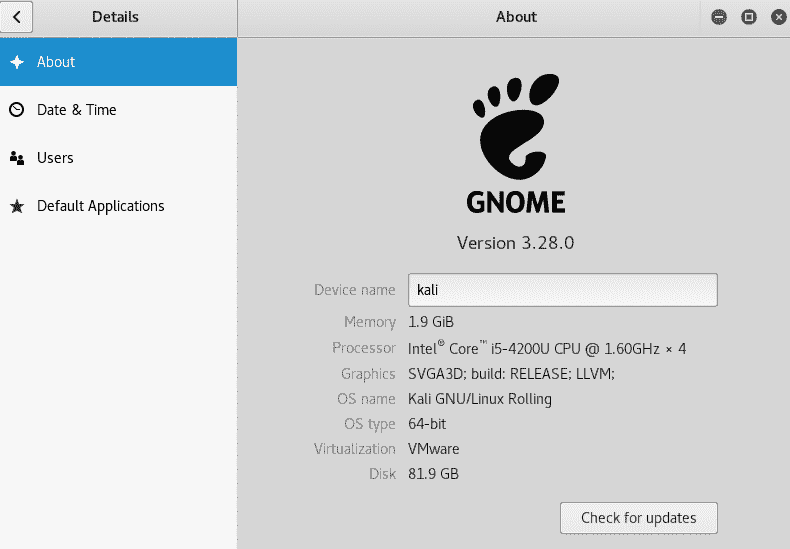
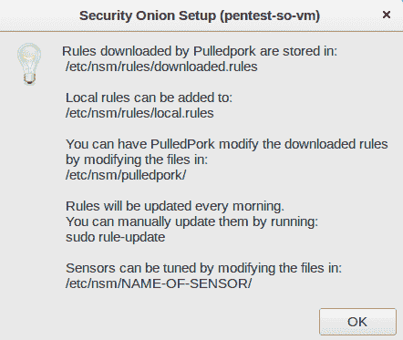

# Linux 安全发行版

在本章中，我们将讨论：

+   Kali Linux

+   pfSense

+   **数字证据和取证工具包**（**DEFT**）

+   网络安全工具包（**NST**）

+   Security Onion

+   Tails OS

+   Qubes OS

# Kali Linux

Kali 是一个基于 Debian 的 Linux 发行版，专为安全测试而开发。Kali 内置了数百个渗透测试工具，是一个即用型操作系统。我们可以通过 live CD、USB 媒体或虚拟机来运行它。

Kali 的最新版本经历了一些重大变化，其中之一是从 Kali 2.0 开始，整个系统已转向滚动发布模型。现在我们只需在系统上安装 Kali 2.0 或更高版本，并通过正常更新获得其中的最新工具版本。这意味着我们不必删除现有的操作系统并安装最新版本的 Kali 2.2 来获得最新的内容。

要探索 Kali 2.2，您可以从其官方网站下载最新版本：[`www.kali.org/downloads/`](https://www.kali.org/downloads/)

我们可以下载 ISO 文件，然后将其刻录到 CD/DVD 或创建可启动的 USB 设备。我们还可以从相同的链接下载**Kali Linux VMWare**、**VirtualBox** 或 **ARM** 镜像。

Kali 的最新版本包含了关于更新的开发环境和工具的重大变化。我们将探索这些变化，了解它们之间的差异。

要开始使用 Kali，我们可以选择安装它，或者通过 live 选项使用它。

当我们启动 Kali 时，会发现 GRUB 屏幕发生了变化，并且变得更加简洁易用，如图所示：

Kali 的桌面环境已迁移至 GNOME 3，并拥有全新设计的用户界面。我们可以在这里的登录屏幕看到这些变化，登录屏幕也经过了重新设计：

整个桌面以及面板和应用程序菜单都已重新设计/重构：

我们还可以通过点击位于侧边栏底部的菜单图标来访问工具，如图所示。这样我们可以一次性看到所有工具：

Kali 包含一个内置的屏幕录制选项，它实际上是 GNOME 3 的一部分。在顶部，右键单击录制器图标，我们会看到开始录制的选项。现在您可以通过单击一次来录制您在 Kali 上所做的任何操作：

如果我们想访问 Kali 的设置菜单，会发现它在应用程序菜单中缺失。要访问设置，请点击右上角的电源图标，弹出一个菜单。

在这个菜单中，我们可以看到左下角的设置图标：

我们还可以在此菜单中看到 VPN 选项。使用此选项，我们可以配置 VPN 设置。

当我们点击前一步的设置图标时，会看到如下所示的设置菜单。现在，根据需求修改系统设置：

向下滚动并点击“详细信息”以查看关于 Kali Linux 的更多信息。

我们可以在这里显示的屏幕中看到有关系统的详细信息。这包括关于 GNOME 版本的信息：

每当我们希望更新 Kali 时，只需在“详细信息”窗口中点击“检查更新”按钮。

如果你的系统已经是最新的，屏幕上会显示一条消息，如下所示，否则可以下载可用的更新：

当我们启动 Kali 时，会看到桌面屏幕发生了变化。现在屏幕左侧有一个侧边栏，帮助我们轻松访问应用程序。

左上角的应用程序菜单包含了不同类别下的所有工具。应用程序也可以通过屏幕底部侧边栏上的菜单图标来访问。

接下来，我们看到 Kali 内置了一个屏幕录制工具，可以通过右上角的菜单访问。在同一个菜单中，我们现在可以访问系统设置菜单。

然后我们可以看到检查系统更新的选项，以保持 Kali 的最新。

Kali 包含了更新的工具，并且构建时会从 Debian 拉取更新，确保系统始终保持最新，并定期实施安全更新。

# pfSense

作为网络管理员，拥有一个防火墙和路由器是必不可少的。当我们谈到设置防火墙时，我们可以选择从任何供应商安装一个预配置的防火墙，或者自己设置防火墙系统。

pfSense 是一款非常棒的软件发行版，如果你希望从头开始设置自己的防火墙，它非常合适。它是一个基于 FreeBSD 的开源发行版，专门设计用于作为防火墙，可以通过 Web 界面轻松管理。

# 准备就绪

1.  从此链接下载 pfSense：[`www.pfsense.org/download/mirror.php?section=downloads.`](https://www.pfsense.org/download/mirror.php?section=downloads)

1.  根据需求选择正确的计算机架构和平台。

1.  下载 pfSense 后，将 ISO 文件刻录到 CD/DVD 介质中，或者你甚至可以创建一个可启动的 USB 介质。

1.  我们还需要一台具有两张网络接口卡的系统来安装和配置 pfSense。

该系统将专用于防火墙功能，不能用于其他计算任务，如网页浏览等。建议使用一台旧电脑，比如 Pentium 4 机器，或者甚至可以设置并使用虚拟机来完成此任务。

# 如何操作...

按照这里的步骤设置和配置 pfSense 防火墙：

1.  当我们使用 pfSense CD/DVD 或 USB 设备启动系统时，欢迎界面将如图所示。按 *6* 配置启动选项：

1.  在下一个屏幕中，再次按 *6* 开启详细模式，然后按 *1* 返回上一屏幕。

返回到第一个屏幕时，按 *Enter* 启动 pfSense。

1.  pfSense 开始启动。在启动过程中，我们会看到如图所示的屏幕：

按 *I* 安装 pfSense。在 20 秒倒计时内迅速选择该选项。

1.  下一个屏幕要求你配置控制台。选择“接受这些设置”选项并按 *Enter* 继续。

1.  在下一个屏幕中，如果你是 pfSense 新手，请选择快速/简单安装，否则可以选择自定义安装，以便在安装过程中使用更多高级选项。

1.  按“确定”继续安装。安装过程将开始。

1.  在安装过程中，你将被要求选择安装哪个内核配置。选择标准内核，因为我们是在桌面或 PC 上安装 pfSense。如果是在嵌入式平台（如路由器板）上安装，可以选择嵌入式内核选项。

1.  完成后，安装将继续。一旦完成，选择“重启”并按 *Enter* 完成安装。

1.  在重启过程中，pfSense 的默认用户名和密码将显示如下：

1.  重启后，我们现在需要根据网络配置设置接口卡。两个接口的名称将如图所示。这些名称在你的设备上可能会有所不同：

1.  现在系统会询问你是否要立即设置 VLAN。此时输入 `n` 表示否。

1.  现在，我们需要输入用于 WAN 的接口名称。在我们的示例中是 `le0`。根据你的配置输入相应的名称。

1.  接下来，输入用于 LAN 的接口名称。对于我们的示例，它是 `le1`：

然后按 *Y* 继续设置。

1.  一旦设置完接口，我们将看到如图所示的 pfSense 菜单：

如果 WAN 和 LAN 接口的 IP 地址在此步骤之前未正确设置，我们可以通过从上一步菜单中选择 *2* 来手动设置 IP 地址。

1.  选择要配置的接口，然后提供相应的 IP 地址：

1.  接下来，输入子网和默认网关：

1.  对于 LAN 接口，按照相同步骤操作。完成后，屏幕上将显示一个链接，可以用于访问 `pfSensewebConfigurator` 界面：

在我们的案例中，地址是`http://192.168.1.115.`

1.  现在，从与 pfSense 系统在同一局域网的任何浏览器上访问此链接。一旦访问该链接，我们将看到如图所示的登录界面：

输入默认用户名 `admin` 和默认密码 `pfsense` 以登录。登录后，这些信息可以稍后更改。

成功登录后，我们将看到 pfSense 的主仪表板：

# 它是如何工作的…

我们从 pfSense CD/DVD 启动，然后选择安装操作系统的选项。

要安装 pfSense，我们在启动时选择选项 I，然后使用快速/简易安装。安装完成后，我们设置两个接口卡。第一张卡按照外部网络进行配置，使用菜单中的“设置接口 IP 地址”选项。然后配置 IP 地址、子网和网关地址。

接下来，我们对第二张卡执行相同的操作，按照本地网络进行配置。

配置完成后，我们可以使用第二张网卡的 IP 地址，通过同一网络系统上的任何浏览器访问 pfSense 的网页界面，并根据我们的需求自定义路由器/防火墙。

# 数字证据和取证工具包（DEFT）

在进行计算机取证时，使用的软件必须能够确保文件结构的完整性。它还应能够分析正在调查的系统，而不改变、删除或更改数据。

DEFT 是为取证设计的，基于 Lubuntu，而 Lubuntu 又基于 Ubuntu。

DEFT 可以通过以下链接下载：[`www.deftlinux.net/download/.`](http://www.deftlinux.net/download/)

下载完成后，我们可以将镜像文件刻录到 CD/DVD 媒体上，或者创建一个可启动的 USB 媒体。

要使用 DEFT，我们需要先了解操作系统中包含了哪些工具，接下来我们将了解这些内容。

一旦我们从 DEFT CD/DVD 或 USB 媒体启动，我们会看到启动屏幕。首先，我们需要选择语言。完成后，我们可以选择运行 DEFT live，或者将 DEFT 安装到我们的系统中。

在我们的示例中，我们选择了启动 DEFT live。启动过程完成后，我们应该看到 DEFT 桌面。

现在让我们了解 DEFT 中有哪些不同的工具可用。

在开始菜单中，DEFT 下的第一个子菜单包含了各种分析工具的列表：

下一个子菜单展示了所有的反恶意软件工具。接着是与数据恢复相关的工具子菜单。

下一个子菜单包含了不同的哈希工具列表，可以用来检查和比较任何文件的哈希值。

在下一个子菜单中，我们可以看到用于成像的工具。这些工具可以在取证调查中使用，用于创建需要调查的系统磁盘的映像。随着 DEFT 7 的发布，还添加了用于分析移动设备的工具。它们可以在“移动取证”子菜单中找到。

下一个子菜单包含网络取证工具。下一个菜单是 OSINT，包含开源情报工具。

DEFT 还包含密码恢复工具，可以在下一个子菜单中找到。

除了这些分类工具外，DEFT 还包含一些报告工具，这在创建报告时非常有用。DEFT 使用**WINE**在 Linux 下执行 Windows 工具，WINE 的选项可以在主菜单中找到。

我们可以选择安装 DEFT，或者使用实时 CD 选项将其启动到系统中。启动后，我们进入开始菜单，然后进入 DEFT 菜单。在这里，我们可以找到各种分类下的工具。我们可以使用用于分析、数据恢复、移动取证、网络取证等的工具。

WINE 在 DEFT 中用于执行 Windows 应用程序。

# 网络安全工具包（NST）

Linux 有许多发行版，主要用于渗透测试。其中一个是**网络安全工具包**（**NST**），它的开发目的是为了在一个地方提供对开源网络安全应用程序的便捷访问。

NST 基于 Fedora Linux，包含面向专业人员和网络管理员的工具。

# 准备就绪

NST 可以从其网页或直接通过此链接下载：[`sourceforge.net/projects/nst/files/.`](http://sourceforge.net/projects/nst/files/)

下载完成后，我们可以将 ISO 烧录到 CD/DVD 上，或创建一个实时可启动的 USB 介质。

# 如何操作...

当我们了解如何使用操作系统以及操作系统中包含了哪些工具时，使用 NST 进行渗透测试将变得更加容易。

1.  要使用 NST，第一步是用 NST 启动系统。我们可以选择使用实时启动选项，或者直接在系统上安装 NST。在我们的示例中，我们选择了实时启动选项。根据需要，您可以选择任何选项。

1.  启动完成后，我们将看到 NST 的默认桌面，如图所示：

1.  NST 配有一个 Web 用户界面，这是一个控制面板，可以用来执行与 NST 相关的任何操作。然而，只有在现有用户账户设置了密码后才能访问此界面。要设置密码，我们需要点击桌面上的“设置 NST 系统密码”图标。这将打开一个终端窗口，并提供创建新密码的选项：

1.  设置密码后，我们可以通过任何浏览器访问 NST 的 Web 用户界面。要在本地系统上访问它，我们可以使用这个地址：`http://127.0.0.1:9980/nstwui.`

如果从本地网络上的其他系统访问，则需要使用运行 NST 的系统的 IP 地址：

一旦我们打开链接，系统会提示输入用户名和密码。输入详细信息后点击 OK。

1.  现在我们看到的是**NSTWUI**的登录页面。在左上角，我们可以看到运行 NST 的系统的详细信息。下面是 NST 菜单：

我们还可以在右上角看到系统运行时长的相关信息：

1.  NST 配备了多种工具，其中之一是**bandwidthd**。该工具展示了网络使用情况的概览，我们可以通过进入 Network | Monitors | bandwidthd UI 菜单来启用它：

1.  点击“Start Bandwidthd”后，工具将开始运行。

1.  另一个重要功能是能够通过 SSH 使用 Web 界面进行远程操作。请前往 System | Control Management | Run command 菜单。

如截图所示，将会弹出一个窗口，我们可以在其中运行任何命令：

1.  NSTWUI 还允许管理员通过 Web 界面远程重启或关闭服务器。操作方法是进入 System | Control Management | Reboot 菜单。

1.  点击“Proceed to reboot this NST system”以确认重启。否则，点击“Exit”取消操作。

1.  在下一个屏幕中，输入如图所示的文本并点击 OK：

# 它是如何工作的...

安装或启动 NST 后，第一步是为现有用户帐户设置密码。可以通过使用“Set NST System Password”选项来完成此操作。

设置密码后，我们可以通过任何浏览器访问系统的 IP 地址，通过 Web 用户界面访问 NST。

登录 NSTWUI 后，我们可以看到与网络安全相关的各种工具列表。

我们可以探索一些工具，例如 bandwidthd 和 SSH。

# Security Onion

**Security Onion** 是一个免费的开源 Linux 发行版，适用于入侵检测、企业级安全监控和日志管理。Security Onion 内置了多种工具，如 Snort、Suricata、Kibana、OSSEC 等。

# 正在准备

Security Onion 可以通过其官方网页提供的 ISO 镜像进行安装。另一种安装方法是先安装标准的 Ubuntu 16.04 ISO 镜像，然后再添加 Security Onion 的 PPA 和相关软件包。

要下载 Security Onion 的 ISO 镜像，请访问此链接：

[`github.com/Security-Onion-Solutions/security-onion/blob/master/Verify_ISO.md.`](https://github.com/Security-Onion-Solutions/security-onion/blob/master/Verify_ISO.md)

# 如何操作...

本节将介绍如何使用 ISO 镜像安装 Security Onion。安装完成后，我们将配置其进行后续使用：

1.  要开始安装，我们通过 ISO 镜像启动系统。接下来会出现以下屏幕，我们选择第一个选项启动 Security Onion：

1.  启动完成后，桌面将出现。我们可以在桌面上看到 Install Security Onion 16.04 的图标：

1.  我们点击图标后，安装将开始。第一个屏幕会要求我们选择安装类型。根据需求选择任意选项，或者继续使用默认选择：

1.  一旦点击“立即安装”，安装过程将开始。这将需要一些时间来完成。

1.  初始安装完成后，它会提示我们重启系统。选择“立即重启”以完成安装。

1.  当系统重启时，我们将看到启动菜单。选择默认选项并按*Enter*键启动 Security Onion。

1.  重启后，我们将看到登录屏幕。请输入在安装过程中配置的用户名和密码。

1.  登录后，我们可以看到屏幕上的一个“设置”图标。我们将使用它完成 Security Onion 提供的安全工具设置：

1.  我们将被提示输入管理员账户的密码。

1.  输入密码后，下一屏将显示将要配置的服务列表。按“是，继续！”以继续：

1.  安装程序会询问我们是否现在配置接口，还是稍后配置。按“是”以立即配置接口：

1.  安装程序会检测系统中存在的接口并进行配置。如果有多个接口，我们可以选择要配置的接口：

1.  根据需求选择静态或 DHCP 选项：

1.  完成后，点击“是，进行更改”继续。

1.  安装程序会要求我们重启系统。重启以继续安装过程。

1.  系统重启后，再次点击“设置”图标继续设置。系统会询问我们是否要重新配置接口或跳过。点击“是，跳过网络配置”继续：

1.  在下一步，安装程序会询问我们是为评估模式还是生产模式设置系统。目前我们选择评估模式，并点击“确定”：

1.  现在，我们将创建一个供安装程序配置的服务使用的用户账户。在这里输入用户名：

1.  接下来，配置新创建用户的密码：

1.  在下一屏中，点击“是”继续更改。

1.  安装完成后，我们会看到以下窗口：

1.  安装程序还会显示如下信息，用于后续服务的使用：

1.  安装程序还会显示有关服务所使用的规则位置的信息：

1.  要开始使用 Security Onion 在设置过程中配置的服务，打开浏览器并访问[`localhost`](https://localhost)。接受有关 SSL 证书的安全警告并继续操作。接着，我们会看到一个网页，如下所示：

通过这个页面，我们可以开始访问 Security Onion 工具套件中的服务。

# 它是如何工作的...

Security Onion 附带了一整套安全工具。我们将 Security Onion 安装到系统中，然后设置套件中的所有工具。设置完成后，我们可以使用在设置过程中配置的用户帐户来启动工具。

# Tails 操作系统

**Tails**是一个 Linux 发行版，作为实时操作系统运行，可以从 USB 驱动器或 DVD 运行在任何系统上。

它旨在通过帮助用户匿名上网并避免在用户去的几乎任何地方受到限制，从而保护用户的隐私和匿名性。Tails 还帮助用户在不留下任何痕迹的情况下进行活动，除非用户明确要求它保存痕迹。

# 准备就绪

Tails 是一个基于 Debian 的免费软件，ISO 镜像可以从其网站下载：[`tails.boum.org/index.en.html`](https://tails.boum.org/index.en.html)：

使用右侧的按钮下载 Tails 的 ISO 镜像。

# 如何操作...

Tails 是一个完整的操作系统，可以作为实时操作系统从 USB 驱动器或 DVD 运行。

要使用 Tails，我们从 Tails 的实时 DVD 或 USB 启动系统，当我们使用 Tails 启动系统时，屏幕将显示如下：

点击“启动 Tails”以开始使用 Tails 操作系统。启动完成后，我们将看到桌面界面。点击“应用程序”菜单，我们可以看到不同类别的工具，就像其他任何基于 Debian 的操作系统一样。不过，菜单中有一个 Tails 类别：

Tails 子菜单包含帮助它维持隐私和匿名性的工具。Tails 包含**Tor**浏览器，帮助维持在线隐私。当我们点击 Tor 浏览器时，它会在后台启动。Tor 准备就绪时，我们会收到通知：

当我们在任何系统上使用 Tails 时，它不会改变或依赖当前运行在系统上的操作系统。Tails 已被配置为不使用其运行的系统的硬盘，除非用户明确希望将数据保存到硬盘。Tails 还附带了一组保护数据的工具，使用强加密技术。这包括 LUKS，用于加密 USB 驱动器或外部硬盘。Tails 使用 HTTPS Everywhere，自动加密与任何主要网站的所有通信。

我们可以通过使用 Tails 安装程序从应用程序菜单将 Tails 安装到 USB 闪存驱动器上：

Tails 可以作为实时操作系统使用，并且它预装了一些已配置好并且注重安全性的应用程序。一旦用户通过 Tails 启动他们的计算机，他们可以使用这些工具来保持隐私和匿名。

# Qubes 操作系统

目前有许多 Linux 发行版，其中包括一些小众的发行版。**Qubes**就是其中一个专注于安全性的 Linux 发行版。正如其标语所说，它是一个“*合理安全的操作系统*”。

当用户使用任何其他操作系统时，如果他们不小心运行了恶意软件（可能是通过电子邮件附件传播的），那么根据恶意软件的严重性，它可能会影响系统上的所有内容。

然而，Qubes 采用了一种不同的方法，称为*通过隔离来保证安全*。它使用 Qubes（虚拟实例）来隔离用户运行的程序。

# 准备工作

要使用 Qubes，我们可以从其官方网站下载 ISO 镜像：

[`www.qubes-os.org/downloads/.`](https://www.qubes-os.org/downloads/)

要在计算机上安装 Qubes，建议您具有如上所述的最低配置：

+   64 位 Intel 或 AMD 处理器（x86_64，也叫 x64，亦即 AMD64）

+   4 GB 内存

+   32 GB 磁盘空间

Qubes 也可以安装在不符合这些推荐配置的系统上，但性能可能会较慢。

# 如何操作...

当我们完成 Qubes 的 ISO 镜像下载后，就可以在符合推荐配置的系统上开始安装。

1.  要安装 Qubes，我们使用之前下载的 ISO 镜像启动系统。

1.  一旦 ISO 镜像启动，它将显示一个菜单。选择“测试此媒体并安装 Qubes”并按*回车键*开始安装。

1.  下一屏幕将要求我们选择语言。我们将选择英语并点击继续：

1.  在下一个窗口中，点击“安装目标”：

1.  这将打开另一个窗口。向下滚动并取消勾选“加密我的数据”选项，然后点击左上角的“完成”：

1.  现在，我们回到之前的窗口。点击“开始安装”以继续：

1.  随着安装的进行，我们会看到“用户设置”选项。在这里，我们可以为 root 账户设置密码，也可以通过点击“用户创建”来创建一个新用户以使用 Qubes：

1.  当我们点击“用户创建”时，会弹出一个新窗口，让我们为新用户设置用户名和密码。设置完成后，安装将继续：

1.  安装完成后，我们需要重新启动系统以开始使用 Qubes。点击“重新启动”，如图所示，来使用 Qubes：

1.  当系统重新启动时，我们会看到以下屏幕，屏幕上显示了 QUBES OS 的图标。点击 QUBES OS 以进行设置：

1.  在下一个窗口中，根据您的需求选择选项，然后点击 Done：

1.  一旦点击 Done，Qubes 设置将开始使用默认模板配置系统，如下所示：

1.  一旦模板配置完成，我们将看到以下屏幕。点击 FINISH CONFIGURATION 继续：

1.  现在我们可以使用在安装过程中创建的用户账户登录 Qubes 系统：

1.  登录后，我们将看到 Qubes VM 管理器窗口，它显示了配置的 Qubes 列表。我们可以从列表中启动任何现有的 Qube，或者根据需要使用此 VM 管理器创建新的 Qube：

1.  一旦我们创建了不同的虚拟机（也叫做**Qubes**），就可以开始使用它们。在一个 Qube 内运行的任何应用程序都与另一个 Qube 相互独立，从而提供了隔离性。

# 它是如何工作的...

Qubes OS 使用 **Xen hypervisor** 来创建和隔离虚拟机。我们可以在这些虚拟机上工作，以隔离的方式访问相同的应用程序。

我们可以并排使用同一个浏览器的两个不同实例，它们可能运行在不同的安全域中。如果我们使用两个浏览器访问同一个网站，并且其中一个浏览器已登录该网站，则另一个浏览器窗口将不会使用该登录会话，因为它运行在完全不同的虚拟机上。
