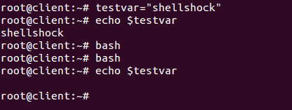
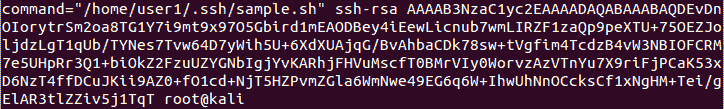
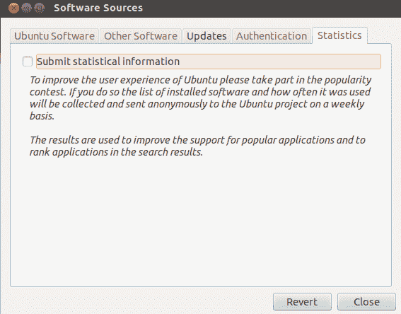

# 第九章：Bash 漏洞修复

本章将涵盖以下内容：

+   理解 Bash 漏洞 - Shellshock

+   安全问题 - Shellshock

+   补丁管理系统

+   在 Linux 网络上集成补丁

+   其他知名 Linux 漏洞

# 理解 Bash 漏洞 - Shellshock

**Shellshock**或**Bashdoor**是大多数 Linux 和 Unix 操作系统版本中存在的漏洞。它于 2014 年 9 月 12 日被发现，并影响所有使用 Bash shell 的 Linux 发行版。Shellshock 漏洞使得通过环境变量可以远程执行命令。

# 准备工作

为了理解 Shellshock，我们需要一个使用 Bash 4.3 之前版本的 Linux 系统，该版本存在此漏洞。

# 如何操作...

在本节中，我们将展示如何设置系统以理解 Shellshock 漏洞的内部细节：

1.  执行的第一步是检查 Linux 系统中 Bash 的版本，以便我们可以找出系统是否易受**Shellshock**攻击。检查 Bash 版本，请运行以下命令：


通过 4.3 版本的 Bash 已被报告存在 Shellshock 漏洞。在我们的示例中，我们使用的是 Ubuntu 12.04 LTS 桌面版。从前面的截图输出中，我们可以看出该系统是有漏洞的。

1.  现在，让我们检查漏洞是否真的存在。为此，我们运行以下代码：


一旦运行了上述命令，如果输出中打印了`shellshock`，则确认该漏洞的存在。

1.  现在，让我们理解这个漏洞的内在原理。为此，首先我们需要了解 Bash shell 变量的基础知识。

1.  如果我们想在 bash 中创建一个名为`testvar`的变量，并将值`'shellshock'`存储其中，我们必须运行以下命令：

```
 testvar="shellshock'
```

现在，如果我们希望打印这个变量的值，可以使用`echo`命令，如下所示：

```
          echo $testvar
```

1.  现在，我们将通过运行`bash`命令打开一个 bash 子进程。然后，再次尝试在子进程中打印变量`testvar`的值：



我们可以看到，当我们尝试在子进程中打印变量值时，没有任何输出。

1.  现在，我们将尝试通过使用 bash 的环境变量来做同样的事情。当我们启动一个新的 bash shell 会话时，会有一些变量可供使用，这些变量被称为**环境变量**。

1.  为了将我们的`testvar`变量变成环境变量，我们将进行导出。一旦导出，我们也可以在子 shell 中使用它，如下所示：


1.  正如我们已经定义了变量并将其导出一样，类似地，我们也可以定义一个函数并将其导出，以便在子 shell 中使用。以下步骤展示了如何定义函数并导出它：


我们可以在前面的示例中看到，函数`x`已经被定义，并且使用`-f`标志进行了导出。

1.  现在，我们定义一个新的变量，将其命名为`testfunc`，并为其赋值，如下所示：

```
    testfunc='() { echo 'shellshock';}'
```

之前定义的变量可以像常规变量一样访问：

```
    echo $testfunc
```

1.  接下来，我们将导出这个变量，使其成为一个环境变量，然后尝试从子 shell 中访问它，如下所示：


我们可以在前面的结果中看到一些意外的情况。在父 shell 中，变量作为普通变量访问。然而，在子 shell 中，它被解释为一个函数，并执行函数体。

1.  接下来，我们将终止函数的定义，并传递任意命令，如下所示：


在前面的示例中，我们可以看到，一旦启动新的`bash` shell，定义在函数外的代码会在`bash`启动时执行。

这是`bash` shell 中的漏洞。

# 它是如何工作的...

我们首先检查系统上运行的 bash 版本。然后，运行著名的代码来确认是否存在 shellshock 漏洞。

为了理解 shellshock 漏洞是如何工作的，我们在 bash 中创建一个变量，然后尝试将其导出到子 shell 并在那里执行。接下来，我们尝试创建另一个变量，并将其值赋为`'() { echo 'shellshock';}'`。做完这个之后，当我们将该变量导出到子 shell 并在其中执行时，我们可以看到它被解释为一个函数并执行函数体。

这就是使 bash 容易受到 shellshock 攻击的原因，其中精心构造的变量可以在启动 bash 时执行任何命令。

# 安全问题 – Shellshock

在这个几乎所有事物都在线的时代，网络安全是一个主要问题。如今，许多 Web 服务器、网络连接的设备和服务都使用 Linux 作为平台。大多数版本的 Linux 使用 Unix bash shell，因此 Shellshock 漏洞可能影响大量网站和 Web 服务器。

在之前的示例中，我们了解了关于 Shellshock 漏洞的详细信息。现在，我们将理解如何通过 SSH 利用这个漏洞。

# 准备工作

要利用 Shellshock 漏洞，我们需要两台系统。第一台系统将作为受害者系统，并且应当易受 Shellshock 攻击。在我们的案例中，我们使用 Ubuntu 系统作为脆弱系统。第二台系统将作为攻击者系统，可以运行任何 Linux 版本。对于我们的案例，第二台系统上运行的是 Kali。

受害系统将运行`openssh-server`包。可以使用以下命令进行安装：

```
    apt-get install openssh-server
```

然后，我们将配置该系统作为一个脆弱的 SSH 服务器，以展示如何利用 Shellshock 漏洞进行攻击。

# 如何操作...

要了解如何利用 Shellshock 漏洞攻击 SSH 服务器，我们首先需要将 SSH 服务器配置为易受攻击的系统。为此，我们将按照以下步骤操作：

1.  第一步是在 SSH 服务器系统上添加一个名为`user1`的新用户帐户。我们还必须将`/home/user1`设置为其主目录，并将`/bin/bash`作为其 Shell：


一旦帐户添加完毕，我们通过检查`/etc/passwd`文件来确认。

1.  接下来，我们在`/home`下为`user1`创建一个目录，并将该目录的所有权授予`user1`账户：


1.  现在，我们需要通过授权密钥对攻击者进行身份验证，以便登录到 SSH 服务器。为此，我们将首先在攻击者的系统上生成授权密钥，使用以下命令：


我们可以看到已经生成了公钥/私钥。

1.  在生成授权密钥后，我们将通过 SFTP 将公钥发送到远程 SSH 服务器。首先，我们将公钥文件`id_rsa.pub`复制到桌面，然后运行以下命令以使用 SFTP 连接到 SSH 服务器：


连接后，我们使用`put`命令传输文件。

1.  现在，在受害者的 SSH 服务器系统上，我们在`/home/user1/`内创建一个名为`.ssh`的目录，然后将`id_rsa.pub`文件的内容写入`/home/user1/.ssh/`目录下的`authorized_keys`文件中：


1.  完成后，我们编辑 SSH 的配置文件`etc/ssh/sshd_config`，启用`PublicKeyAuthentication`变量。我们还要检查`AuthorizedKeysFile`是否正确指定：


1.  一旦前面的步骤成功完成，我们可以尝试从攻击者系统登录到 SSH 服务器，看看是否会要求输入密码：


1.  现在，我们将创建一个基本的脚本，如果用户尝试传递`date`命令作为参数，它会显示消息`restricted`。然而，如果传递的是其他内容，它将被执行。我们将这个脚本命名为`sample.sh`：


1.  一旦脚本创建完毕，我们可以运行给定的命令来赋予它可执行权限：

```
    chmod +x sample.sh
```

1.  完成后，我们使用`authorized_keys`文件中的`command`选项，通过添加脚本的路径来运行我们的`sample.sh`脚本：



在`authorized_keys`文件中标记之前的更改，以限制用户执行一组预定义的命令，这将使得公钥认证变得脆弱。

1.  现在，从攻击者的系统尝试通过 SSH 连接到受害者的系统，并传递`date`作为参数：


我们可以看到由于我们添加到`authorized_keys`文件中的脚本，显示了`restricted`信息。

1.  接下来，我们尝试将我们的 Shellshock 漏洞利用作为参数传递，如下所示：


我们可以看到，尽管我们在这个脚本中限制了`date`命令，但这次它被执行了，并且我们得到了`date`命令的输出。

1.  现在，让我们看看如何利用 Shellshock 漏洞来攻陷运行任何脚本的 Apache 服务器，这些脚本可以触发带有环境变量的 bash shell。

1.  如果受害者系统上尚未安装 Apache，我们必须通过运行以下命令来安装它：

```
       apt-get install apache2
```

安装完成后，我们使用以下命令启动 Apache 服务器：

```
        service apache2 start
```

1.  接下来，我们转到`/usr/lib/cgi-bin/`路径，并创建一个名为`example.sh`的脚本，其中包含以下代码，以显示一些 HTML 输出：


然后我们通过运行以下命令使其可执行：

```
          chmod +x example.sh
```

现在，从攻击者的系统中，我们尝试使用名为`curl -`的命令行工具远程访问`example.sh`文件。

我们按预期获得脚本的输出：`Example Page`。


1.  现在，让我们通过使用 curl 向服务器发送一个恶意请求，以打印受害者系统中`/etc/passwd`文件的内容：

```
    curl -A '() { :;}; echo "Content-type: text/plain"; echo; /bin/cat /etc/passwd' http://192.168.1.104/cgi-bin/example.sh
```


这是输出结果，但被截断：


我们可以看到攻击者系统上的输出，展示了如何利用 Shellshock 漏洞远程访问受害者的系统。在前面的命令中，`() { :;} ;`表示一个看起来像函数的变量。在这段代码中，函数是单一的`:`，它被定义为什么都不做，仅仅是一个简单的命令。

1.  我们将尝试另一个命令，查看受害者系统当前目录的内容，如下所示：


我们可以在前面的输出中看到受害者系统中`root`目录的内容。

# 它是如何工作的……

在我们的 SSH 服务器系统上，我们创建一个新的用户账户，并将 bash shell 设置为其默认 shell。我们还在`/home`目录下为该新用户账户创建一个目录，并将其所有权分配给该账户。

接下来，我们配置 SSH 服务器系统以使用授权密钥验证另一个系统的连接。

然后，我们创建一个 bash 脚本来限制特定命令，如`date`，并使用命令选项将该脚本路径添加到`authorized_keys`中。

之后，当我们尝试从另一个系统连接到 SSH 服务器时，如果我们在连接时传递`date`命令作为参数，我们会看到该命令被限制。

然而，当相同的`date`命令与 Shellshock 漏洞一起传递时，我们可以看到它的输出，从而展示了如何使用 Shellshock 来攻击 SSH 服务器。

类似地，我们通过创建一个示例脚本并将其放置在 Apache 系统的 `/usr/lib/cgi-bin` 目录中来利用 Apache 服务器。

然后，我们尝试从另一个系统使用 curl 工具访问这个脚本。

我们可以看到，当通过 curl 访问脚本时，如果传递 `shellshock exploit`，我们就能在远程 Apache 服务器上运行我们的命令。

# Linux 补丁管理系统

在当前的计算环境中，漏洞和补丁管理是一个永无止境的循环。当计算机因为已知漏洞被利用而遭受攻击时，我们可以看到该漏洞的补丁已经存在，但在系统中并未正确实施，从而导致了攻击的发生。

作为系统管理员，我们必须知道哪些补丁需要安装，哪些可以忽略。

# 准备就绪

由于补丁管理可以使用 Linux 的内置工具进行，因此在执行这些步骤之前无需配置特定的设置。

# 如何操作...

保持系统更新的最简单和最高效的方法是使用内置于 Linux 系统中的 Update Manager。在本教程中，我们将探讨 Update Manager 如何在 Ubuntu 系统中工作：

1.  要在 Ubuntu 中打开 Update Manager 的图形版本，点击左侧工具栏顶部的**超级键**，然后输入`update`。在下面的截图中，我们可以看到 Update Manager：


1.  当我们打开 Update Manager 时，我们会看到以下弹出框，显示了可供安装的不同安全更新：


选择要安装的更新并点击“安装更新”以继续。

1.  在同一窗口的左下角，我们有一个设置按钮。点击它后，我们会看到一个名为“软件源”的新窗口，里面有更多配置 Update Manager 的选项。

1.  第一个标签为“Ubuntu 软件”，它显示了一个用于下载更新的仓库列表。我们根据需要从列表中选择选项：


1.  如果我们点击“下载源”选项，就可以更改用于下载的仓库服务器。如果我们在连接当前选择的服务器时遇到问题，或服务器速度较慢，这个选项非常有用：


1.  在下拉菜单中，当我们选择“其他”选项时，我们可以选择服务器，如下所示：


1.  下一个标签页，“其他软件”，用于添加 Canonical 的合作伙伴仓库：


1.  我们可以从前面截图中显示的列表中选择任何选项，然后点击“编辑”以更改仓库详细信息：


1.  更新标签用于定义 Ubuntu 系统如何以及何时接收更新：


1.  下一个标签页，认证，包含来自软件仓库维护者的、有关软件提供商认证密钥的详细信息：


1.  最后一个标签叫做统计信息，供那些希望匿名向 Ubuntu 开发者项目提供数据的用户使用。这些信息帮助开发者提高软件的性能和体验：



1.  在任何标签页下进行更改后，当我们点击关闭时，会弹出一个提示，确认是否要在列表中显示新的更新。点击重新加载或关闭：


1.  如果我们想检查更新管理器从哪些位置获取所有包，可以查看 `/etc/apt/sources.list` 文件的内容。我们得到以下结果：


# 它是如何工作的...

要更新我们的 Linux 系统，我们根据 Linux 发行版使用内置的更新管理器。

在更新管理器中，我们可以选择安装所有可用的更新，或者根据我们的需求通过设置窗口进行配置。

在设置窗口中，我们可以选择显示可以下载更新的仓库列表。

设置窗口中的第二个标签允许我们添加 Canonical 的第三方合作伙伴仓库。

使用下一个标签，我们可以指定何时以及下载什么类型的更新。

我们还可以通过设置窗口检查软件提供商的认证密钥。

最后一个标签页，名为统计信息，帮助我们将数据发送给 Ubuntu 项目开发者，以提高软件的性能。

# 在 Linux 中应用补丁

每当在任何软件中发现安全漏洞时，都会发布一个安全补丁来修复该漏洞。通常，我们使用 Linux 内置的更新管理器来应用安全更新。然而，对于通过编译源代码安装的软件，更新管理器可能无法提供帮助。

对于这种情况，我们可以将补丁文件应用于原始软件的源代码，然后重新编译软件。

# 准备工作

由于我们将使用 Linux 的内置命令来创建和应用补丁，因此在开始以下步骤之前不需要做任何准备工作。我们将创建一个 C 语言示例程序来理解创建补丁文件的过程。

# 如何操作...

在本节中，我们将看到如何使用 `diff` 命令为程序创建补丁，然后使用 `patch` 命令应用补丁：

1.  我们的第一步将是创建一个简单的 C 程序，名为 `example.c`，用于打印 `This is an example`，如下所示：


1.  现在，我们将创建 `example.c` 的副本，并将其命名为 `example_new.c`

1.  接下来，我们将编辑新的文件`example_new.c`并在其中添加几行额外的代码，具体如下：


1.  现在，`example_new.c`可以视为`example.c`的更新版本。

1.  我们现在将使用`diff`命令创建一个补丁文件，并命名为`example.patch`，具体如下：


1.  如果我们查看补丁文件的内容，将得到如下输出：


1.  现在，在应用补丁之前，我们可以通过使用`-b`选项备份原始文件，具体如下：


我们可以看到，一个名为`example.c.orig`的新文件已经被创建，这是备份文件。

1.  在实际应用补丁之前，我们可以先进行试运行，检查是否会出现任何错误。为此，我们运行以下命令：


如果没有错误消息，意味着补丁文件现在可以应用到原始文件上。

1.  现在，我们运行以下命令将补丁应用到原始文件：

```
    patch < example.patch
```

1.  应用补丁后，如果我们检查`example.c`程序的内容，将看到它已更新，包含了在`example_new.c`中写入的额外代码行：


1.  一旦补丁应用到原始文件上，如果我们希望撤销该补丁，可以使用`-R`选项，具体如下：


我们可以看到在应用补丁后，再撤销补丁后的文件大小变化。

# 它是如何工作的...

我们首先创建一个示例 C 程序。然后，我们创建它的副本并添加更多的代码行，使其成为一个更新版本。之后，我们使用`diff`命令创建补丁文件。在应用补丁之前，我们通过试运行检查它是否存在任何错误。

如果没有错误，我们使用`patch`命令应用补丁。现在，原始文件的内容与更新后的版本文件相同。

我们还可以使用`-R`选项撤销补丁。

# 其他著名的 Linux 漏洞

随着时间的推移，Linux 因其开源特性而获得了广泛的关注。然而，这也带来了日益严重的安全问题。Linux 系统的漏洞问题与其他操作系统（如 Windows）一样普遍，这些漏洞可能源于操作系统本身的缺陷，或由于 Linux 管理员的疏忽。

# 如何操作...

在本节中，我们将讨论一些最常见的 Linux 漏洞，具体如下：

1.  **Linux 内核 netfilter: xt_TCPMSS**：尽管这是一个较老的漏洞，影响的是 4.11 之前的 Linux 内核版本，以及 4.9.x 版本的 4.9.36 之前的版本，但它仍然存在于许多没有解决该漏洞并且仍在使用较老版本 Linux 内核的组织系统中。此漏洞的 CVE ID 为：CVE-2017-18017，且具有 9.8 的严重漏洞评分。

1.  如果该漏洞成功被利用，黑客可以借此发起**拒绝服务**（**DoS**）攻击，向目标发送大量通信。

1.  **Dirty Cow 漏洞**：CVE-2016-5195 是该漏洞的官方参考。发现 Linux 内核的内存管理器在处理私有只读内存映射的写时复制（copy-on-write）中存在竞态条件。

该漏洞位于 Linux 内核的一个部分，几乎所有开源操作系统的发行版中都有，且这个漏洞已经存在了近十年：


1.  利用此漏洞不会在日志中留下任何异常的痕迹。任何本地用户都可以写入他们能够读取的任何文件，该漏洞至少自 Linux 内核版本 2.6.22 起就存在。

1.  如果你想了解更多关于此漏洞的可利用信息，可以查看：[`www.exploit-db.com/exploits/40839/`](https://www.exploit-db.com/exploits/40839/)。

1.  Metasploit 框架，作为最流行的渗透测试框架，也包括了一个针对 Dirty Cow 漏洞的利用模块。更多相关信息可以在这里找到：[`github.com/rapid7/metasploit-framework/pull/7476`](https://github.com/rapid7/metasploit-framework/pull/7476)。

# 它是如何工作的...

Linux 系统中不断发现许多漏洞，无论是与内核相关，还是与操作系统级别的代码有关。

一些漏洞，如 Dirty Cow，已经存在很长时间，攻击者可以轻松利用它们。

这些漏洞中的大多数都有现成的利用方法，因此，保持系统的修补和更新是必要的，以确保安全。
