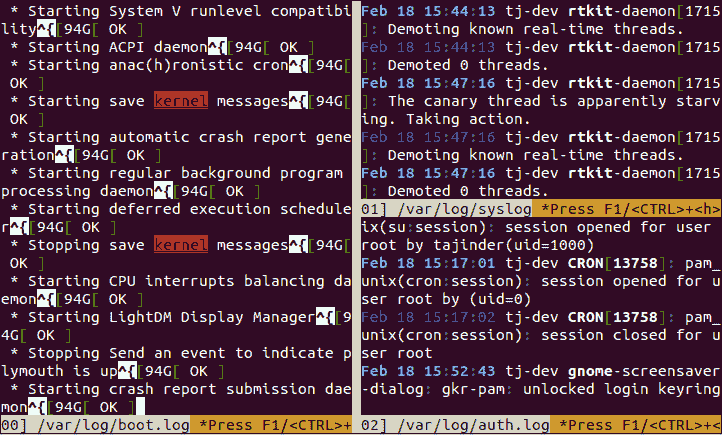
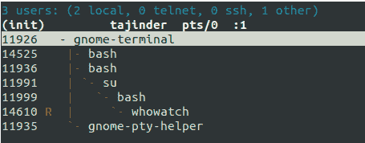
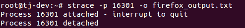
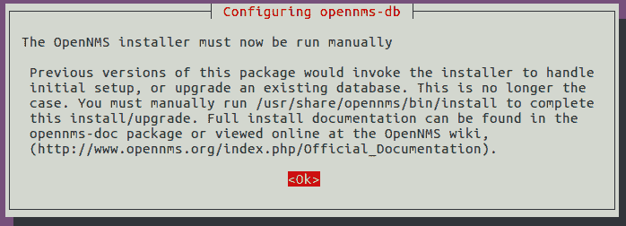

# 第十章：安全监控与日志记录

在本章中，我们将讨论以下配方：

+   使用 Logcheck 查看和管理日志文件

+   使用 Nmap 进行网络监控

+   使用 Glances 进行系统监控

+   使用 MultiTail 进行日志监控

+   使用系统工具 – whowatch

+   使用系统工具 – `stat`

+   使用系统工具 – `lsof`

+   使用系统工具 – `Strace`

+   使用 IPTraf 进行实时 IP 局域网监控

+   使用 Suricata 进行网络安全监控

+   使用 OpenNMS 进行网络监控

# 使用 Logcheck 查看和管理日志文件

作为管理员，在检查系统中的恶意活动或软件问题时，日志文件发挥着非常重要的作用。然而，随着软件数量的增加，生成的日志文件数量也随之增加。这使得管理员很难正确地分析日志文件。

在这种情况下，Logcheck 是一个非常好的工具，能够帮助管理员分析和扫描日志文件。Logcheck 根据其文档扫描日志中的有趣行。

这些有趣的行“主要指的是工具检测到的安全问题。

# 准备就绪

使用 Logcheck 在 Linux 系统上没有特定的要求。

# 如何做...

在本节中，我们将学习如何安装和配置 Logcheck，以便根据我们的需求使用它：

1.  第一步是使用以下命令安装软件包：


1.  在安装过程中，会弹出一个窗口，显示有关选择邮件服务器配置类型的信息，如下所示：


按“确定”继续。

1.  在下一个窗口中，选择 Internet Site，然后选择“确定”继续：


1.  安装完成后，我们需要在配置文件`/etc/logcheck/logcheck.conf`中进行更改。

1.  我们可以在配置文件中编辑的第一件事是邮件主题中使用的日期/时间戳的格式：


1.  接下来，我们可以根据我们的需求更改`REPORTLEVEL`变量的值，以控制日志的过滤级别。我们有三种选项，默认情况下，值设置为 server：


工作站值过滤掉大多数消息，信息较少。极端值对于具有高安全性的系统非常有用，这些系统尽可能少地运行服务，并且输出更详细。

1.  接下来，我们将更改变量`SENDMAILTO`的值，并提供我们的电子邮件地址，以便我们能够接收日志：


1.  Logcheck 生成的邮件为不同的事件使用不同的主题。如果我们希望修改这些主题行，可以像下面这样编辑变量的值：


1.  默认情况下，Logcheck 使用 `/etc/logcheck/logcheck.logfiles` 文件来维护要监控的日志文件列表。如果我们希望使用其他文件来定义该列表，并且它位于其他位置，可以编辑 `RULEDIR` 变量以定义新路径：


1.  如果我们希望 Logcheck 监控除 `/etc/logcheck/logcheck.logfiles` 文件中已经定义的文件之外的某个特定文件，可以在其中添加以下条目：


在前面的文件中，我们添加了以下行：`/var/log/boot.log`。

# 它是如何工作的...

我们首先安装 Logcheck 软件包，安装完成后，编辑其配置文件 `/etc/logcheck/logcheck.conf`。

在配置文件中，我们修改日志的日期/时间戳格式，并通过修改 `REPORTLEVEL` 变量编辑 Logcheck 进行过滤的级别。

接下来，我们编辑 `SENDMAILTO` 变量并输入我们的电子邮件 ID，以便通过电子邮件接收日志。

使用 `etc/logcheck/logcheck.logfiles` 文件，我们定义了 Logcheck 要监控的日志。

# 使用 Nmap 监控网络

对于任何网络，无论大小，网络监控和安全都是非常重要的任务。定期监控网络对于保护系统免受攻击，并防止病毒和恶意软件进入网络至关重要。

**Nmap**，即 **网络映射器**，是一个免费的开源网络监控工具，是系统/网络管理员使用的最强大的工具。Nmap 可用于执行安全扫描、探索网络、查找远程系统的开放端口并进行网络审计。

# 准备工作

为了展示 `nmap` 的工作原理，我们需要至少两台系统组成一个小型网络。我们将在一台系统上安装 `nmap` 软件包，另一台系统将作为扫描主机使用。

1.  如果 `nmap` 尚未安装，可以运行以下命令来安装：


1.  如果我们想检查 Nmap 的版本，可以使用以下命令：


# 如何操作...

在本节中，我们将看到如何使用 Nmap 执行不同类型的扫描，具体步骤如下：

1.  一旦安装了 `nmap`，我们只需输入 `nmap` 并按 *Enter* 键，就可以获得更多有关可以与 `nmap` 一起使用的选项的信息。这样会显示以下输出，显示 `nmap` 支持的所有选项：


1.  我们先通过使用 Nmap 扫描网络中的活跃主机。为此，请运行以下命令：


在前面的输出中，我们可以看到处于活动状态的主机。

1.  现在，让我们使用我们要扫描的系统的 IP 地址进行一次简单扫描。执行简单扫描的命令如下：


在前面的示例中，我们正在扫描的系统的 IP 地址是 `192.168.43.100`。在扫描结果中，我们可以看到目标系统正在运行各种服务。

1.  Nmap 还可以用于扫描我们自己的系统。为此，我们可以运行以下命令：

```
      nmap localhost
```

1.  如果我们想在同一命令中扫描多个系统，可以使用以下命令来实现：

```
      nmap 192.168.43.100 192.168.43.102

```

1.  如果我们只想限制扫描特定端口，可以告诉 `nmap` 仅扫描该端口，方法是使用`-p`选项，如下所示：


在前面的示例中，我们扫描了端口 `22` 和 `80`，这是 SSH 服务和 HTTP（Web 服务器）服务的默认端口。正如我们在前面的结果中看到的，远程系统同时运行了 SSH 和 Web 服务器。

1.  在扫描目标系统时，确定该系统的操作系统非常重要，因为许多漏洞是针对特定操作系统平台的。要了解目标系统的操作系统，我们可以使用 `-O` 选项，如下所示：

```
    nmap -O 192.168.43.100
```


前面屏幕截图中显示的结果告诉我们，目标系统运行的是基于 Linux 的操作系统，内核版本为 2.6。

1.  我们已经看到，通过使用`-p`选项，我们可以检查哪个特定端口是开放的。现在，假设目标系统的 22 号端口是开放的，这意味着该系统正在运行 SSH。如果我们想检查远程系统上 SSH 服务的版本，可以使用`-sV`选项，如下所示：


1.  我们可以将 Nmap 扫描的输出保存以便将来分析，并可以选择 Nmap 支持的各种格式。我们使用 `-oN` 选项将输出保存为普通格式：


1.  我们可以看到输出文件已经在当前目录中创建：


如果我们检查文件的内容，我们将看到与运行以下命令时，nmap 在屏幕上显示的相同输出：


# 它是如何工作的...

当 Nmap 仅对 IP 地址进行扫描时，它会执行基本扫描并告诉我们目标系统上开放的端口。通过了解开放的端口，我们可以识别系统上运行的服务。同样，nmap 也用于通过提供本地系统的 IP 地址来扫描本地系统。

Nmap 还可以通过在同一命令中依次列出 IP 地址来同时扫描多个 IP 地址。此外，Nmap 可用于检查网络中哪些系统正在运行。

它还可以用于扫描特定端口，使用 `-p` 选项，并且如果使用了 `-O` 选项，它将对目标系统进行指纹识别，以显示该系统上运行的操作系统。

Nmap 也用于执行其他任务，例如识别运行在目标系统上的服务的软件版本。

# 使用 Glances 进行系统监控

对于管理员来说，系统监控就是通过检查正在运行的进程和服务来监控系统的性能。但由于屏幕空间有限，有时很难显示所有信息。在这种情况下，我们希望有一个工具，可以在有限的屏幕空间内显示关于系统的最大信息，例如 CPU、磁盘 I/O、内存、网络等。

尽管我们有各自独立的工具来监控所有信息，但使用 Glances，管理员可以在最小的空间内查看最多的信息。它可以根据终端窗口的大小动态调整信息，并高亮显示使用最大系统资源的程序。

# 准备就绪

如果你在 Ubuntu 上安装 Glances，建议使用 Ubuntu 13.04 或更高版本。对于其他版本的 Linux，应该使用最新版本。我们的示例使用的是 Kali Linux 2.0。

# 如何操作...

为了了解 Glances 的工作原理，我们将按照以下步骤进行：

1.  第一步显然是使用以下命令安装软件包：

```
    apt-get install glances
```

1.  安装完成后，我们需要编辑`/etc/default/glances`文件，并将`RUN`的值更改为`true`，如下截图所示：


这样做会在系统启动时自动运行 Glances。

1.  要手动启动该工具，只需运行 `glances` 命令。你将看到以下输出窗口：


在前面的窗口中，我们可以看到不同颜色的文本。Glances 中这些颜色代码的含义如下：

+   **绿色**：这意味着一切`OK`

+   **蓝色**：这种颜色表示`小心`，需要注意

+   **紫色**：这种颜色表示`警告`

+   **红色**：这表示某些东西是`关键`

请参考图形包以获取颜色图像代码。

1.  这些颜色代码基于 Glances 配置文件中定义的默认阈值进行工作。我们可以通过编辑 `/etc/glances/glances.conf` 文件来更改这些阈值：


1.  默认情况下，Glances 每秒刷新一次值。我们可以通过使用 `-t` 选项后跟秒数来更改此值，方法如下：

```
    glances -t 5
```

1.  有时，我们可能无法物理访问我们的系统，但仍然希望监控系统的性能。Glances 可以帮助我们远程做到这一点。为此，我们首先需要通过使用 `-s` 选项启用 Glances 的客户端/服务器模式，并使用 `-B` 选项将其绑定到系统的 IP 地址，如下所示：


现在，Glances 服务器正在运行在 IP 地址为`192.168.1.102`的系统上，默认情况下它运行在端口`61209`上。如果在启用客户端/服务器模式时提示输入密码，请定义您选择的任何密码。

在远程系统上，如果要访问 Glances，请运行以下命令：

```
    glances -c -P 192.168.1.102
```

一旦运行此命令，我们将看到以下窗口，左上角显示`Connected to Kali - IP 192.168.1.102/24`，说明我们现在正在远程访问 Glances：


要让此命令在远程系统上运行，必须确保远程系统上也安装了 Glances。

# 它是如何工作的...

安装完 Glances 后，我们启用了其在系统启动时自动运行的功能。

我们通过使用`glances`命令运行它，并通过编辑`/etc/glances/glances.conf`文件来修改颜色代码的阈值。

通过使用`-t`选项，我们可以修改刷新时间间隔，通过使用`-s`选项，我们启用 Glances 的客户端/服务器模式，然后通过`-c`选项和 Glances 运行系统的 IP 地址远程访问。

# 使用 MultiTail 监控日志

对于任何系统管理员来说，监控日志文件是一项非常繁琐的任务，如果我们需要同时参考多个日志文件来排查问题，频繁切换日志文件会变得更加困难。

对于这种情况，我们可以使用 MultiTail 工具，它可以让我们在一个窗口或终端中显示多个日志文件，并实时显示日志文件的最新几行。

# 准备工作

要使用 MultiTail，我们无需在 Linux 系统上进行特别的设置，只需要安装 MultiTail 包即可。可以使用以下命令完成安装：

```
    apt-get install multitail
```


# 如何操作...

一旦安装了 MultiTail 工具，我们可以根据需求使用以下命令来开始使用它：

1.  如果我们想要使用`multitail`查看两个日志文件，我们将运行以下命令：

```
    multitail /var/log/syslog /var/log/boot.log
```


我们可以看到，屏幕已经分成两部分，每部分显示了单独日志文件的内容。

1.  如果我们想在打开的两个文件中滚动，只需按*B*，然后会弹出一个菜单，如下所示。在这个列表中，我们可以选择想要详细监控的文件：


在弹出的新窗口中，按`gg/G`可以跳转到滚动窗口的顶部或底部，要退出滚动窗口，按*Q*。

1.  如果我们想在 2 列中查看三个日志文件，可以使用以下命令：

```
    multitail -s 2 /var/log/boot.log /var/log/syslog /var/log/auth.log
```



上面的截图显示了三个日志文件分为两列。

1.  MultiTail 允许我们在打开日志文件时自定义每个文件的颜色，并将它们合并显示在同一窗口中。可以使用以下命令来实现：

```
    multitail -ci yellow /var/log/auth.log -ci blue -I /var/log/boot.log 
```


# 它是如何工作的...

当我们在命令行中提供两个日志文件的名称时，MultiTail 会将这两个文件在同一屏幕上显示，并将屏幕分割成两部分。

使用 MultiTail 查看超过两个日志文件时，我们可以通过使用 `-s` 选项并指定列数来决定屏幕分割的列数。

MultiTail 还允许我们在同一屏幕上查看多个日志文件，而无需分割屏幕，通过根据颜色区分文件。颜色可以通过使用 `-ci` 选项来定制。

# 使用系统工具 – whowatch

在监控网络的同时，管理员还希望监控当前登录系统的用户以及每个用户在机器上执行的操作。

Whowatch 是进行此类任务的完美工具。它使用简单的基于文本的界面，易于操作，并能够显示关于用户的用户名、进程等信息，还可以显示连接类型，如 SSH 和 telnet。

# 准备工作

由于 Whowatch 不是 Linux 中预安装的包，我们需要安装它才能使用。安装 whowatch 的命令如下：

```
    apt-get install whowatch
```


# 如何操作...

为了最大限度地利用 Whowatch 工具，我们需要正确理解工具的详细信息：

1.  要开始使用该工具，只需输入 `whowatch` 命令，屏幕会显示如下内容：


前面的屏幕列出了所有已登录的用户账户。

1.  在这个列表中，我们可以选择任何用户账户，按 *Enter* 键后，可以查看该用户正在运行的所有程序的信息：



在同一屏幕上，底部还有更多选项，使用这些选项我们可以获取更多关于用户的信息，以及用户运行的程序：


1.  在 Whowatch 的主屏幕上，我们可以看到底部有一个菜单，如下所示：


在前面的截图中，我们可以看到必须使用 *F9* 键来访问菜单选项。

1.  一旦按下 *F9*，我们将看到屏幕顶部显示一个菜单。使用键盘上的箭头键浏览菜单。当我们选择“进程”选项卡时，会弹出一个子菜单，提供给我们一个信号来终止运行的进程。类似地，我们可以在同一子菜单中看到更多选项：


1.  当我们切换到“视图”选项卡时，我们会看到以下选项：


1.  最后一项是帮助，下面有“键”选项：


1.  当我们按下键时，它会打开一个新窗口，显示用于不同任务的键的详细信息，如下图所示：


1.  按下*s*键可以获取更多关于系统的信息：


1.  如果我们按下*t*键，我们会看到系统上所有进程的树形结构列表，如下图所示：


# 它是如何工作的

Whowatch 只需在命令行中输入`whowatch`即可启动。启动后，它会显示一个登录用户的列表。只需在任何用户名上按下*Enter*键，即可获取该用户下正在运行的所有程序的信息。

要访问 Whowatch 中的更多选项，我们可以按*F9*键进入主菜单。然后我们会看到各种标签，如“进程”、“视图”、“用户”、“帮助”等等。

过程标签页提供了管理进程的选项，而视图标签页则提供了搜索和查看进程的选项。帮助标签页有查看在 Whowatch 中可用的快捷键的选项。

我们使用不同的键来访问系统信息并获取所有进程的列表。

# 使用系统工具 – stat

在 Linux 中，最常用的命令是`ls`，它会列出指定目录中的文件。然而，它只显示关于文件的少量信息。

相比之下，如果我们使用`stat`命令，与使用`ls`相比，我们可以获得更多关于文件/目录的信息。因为`stat`可以从文件的 inode 获取信息，所以它能提供更多文件的详细信息。

# 准备工作

由于`stat`是 Linux 的内建命令，因此不需要安装其他任何东西即可使用它。

# 如何操作...

本节将解释`stat`命令的选项和使用方法。通过使用`stat`，我们可以获取特定文件或文件系统的详细状态。

1.  假设我们有一个名为`example.txt`的文件。当我们使用`ls -l`命令对这个文件进行长列表显示时，我们会获得关于文件的信息，其中包括文件上次修改的时间。

然而，当我们使用`stat`命令检查同一文件的详细信息时，它会显示关于文件的额外信息以及差异，如下图所示：


在前面的输出中，我们可以看到`修改`和`更改`时间相同，但访问时间已经变化。它还显示了以八进制和 rwx 格式的权限信息，其他许多详细信息也会显示。

1.  现在，让我们把文件重命名为`sample.txt`。之后，如果我们使用`stat`检查`sample.txt`文件的详细信息，我们可以看到`更改`时间已经更新：


1.  现在，假设我们有三个文件，分别叫做`sample.txt`、`sample1.txt`和`sample2.txt`。如果我们想查看这三个文件的详细信息，我们可以单独使用`stat`命令查看每个文件，或者使用通配符和`stat`命令一起查看这三个文件的详细信息，如下所示：


1.  我们可以使用`stat`命令检查目录的详细信息，如下所示：


在目录的情况下，我们可以看到关于链接数的额外详细信息。

1.  如果我们对 Linux 中的任何目录使用`stat`命令，例如`/etc/`，我们会看到链接数会有一个很大的值，如下所示：


1.  如果我们想查看文件系统的详细信息，不能使用`ls`命令。但是，`stat`命令也适用于文件系统。我们可以获得与文件相同的文件系统详细信息：


1.  如果我们在检查文件系统详细信息时使用`stat`命令的`-f`选项，它会显示文件系统的状态：


# 如何运作...

我们可以使用`stat`命令获取文件的详细信息。当文件被重命名时，`stat`会告诉我们更改的时间。它还可以通过使用通配符在命令中同时提供多个文件的信息。

`stat`命令也适用于目录和文件系统。在文件系统的情况下，`stat`可以使用`-f`选项显示其状态。

# 使用系统工具 – lsof

有时我们遇到无法卸载磁盘的情况，系统提示文件正在使用，但我们无法理解到底是哪个文件。此时，我们可以查看是哪个进程正在使用哪些文件。

这可以通过`lsof`命令实现，它的意思是列出打开的文件。由于 Linux 将所有内容（包括目录、设备、套接字等）都视为文件，因此我们可以使用`lsof`轻松识别所有打开的文件。

# 准备工作

要使用`lsof`命令，建议从根账户登录，或者从非根账户使用`sudo`，以确保`lsof`命令的输出不受限制。

# 如何操作...

在本节中，我们将探讨可以与`lsof`命令一起使用的不同选项，以了解其工作原理：

1.  如果我们仅仅运行`lsof`，它会列出系统上所有属于任何活动进程的打开文件。如果输出过长，我们可以使用`less`命令滚动查看输出：

```
    lsof | less
```


在前面的截图中显示的输出，以列的形式展示了诸如命令、PID、用户、FD、类型、设备等信息，以便更好地理解文件。

FD 列包含有关文件描述符的信息，例如 **当前工作目录** (**CWD**)、**根目录** (**RTD**)、**程序文本** (**TXT**) 等。如果 FD 列包含类似 `0u`、`1u` 等信息，数字表示实际的文件描述符，字母表示不同的模式（读取访问、写入访问和读/写访问）。

1.  要检查特定用户的所有打开文件列表，我们可以使用 `-u` 选项，后跟用户名，如下所示：

```
    lsof -u tajinder
```


1.  使用 `lsof`，我们可以检查是否有进程在特定端口上运行。为此，我们必须使用 `-i` 选项并运行以下命令：

```
    lsof -i TCP:22
```


在上面的示例中，我们查看了 `22` 端口上的运行进程列表，看到 SSH 进程正在运行。

1.  如果我们想检查系统上打开文件的确切数量，可以运行以下命令：


在上面的示例中，我们看到有很多打开的文件——具体来说是 `5,220` 个。

1.  要查看哪个用户正在查看哪些文件，以及用户正在运行哪些命令，我们可以使用以下命令：

```
    lsof -i -u tajinder
```


使用 `lsof` 时，我们有很多其他选项，可以通过参考 `lsof` 命令的主页面进行探索。

# 如何工作...

只运行 `lsof` 命令会列出系统上所有打开的文件。通过使用 `-u` 选项并指定用户名，我们可以获取特定用户的打开文件列表。

当我们使用 `-i` 选项并指定端口号时，我们可以获取该端口上运行的任何进程的信息。

当我们使用 `-i` 和 `-u` 选项以及特定用户名时，我们可以获取该用户正在访问的文件和命令的信息。

# 使用系统工具 – strace

当我们在 Linux 机器上运行任何命令或程序时，可能会想知道它的后台工作原理。为此，我们在 Linux 中有一个非常有用的工具，叫做 `strace`。

它是一个命令行工具，也可以作为诊断或调试工具使用。Strace 监控进程与 Linux 内核之间的交互，当我们需要调试程序执行时，它非常有用。

# 准备就绪

这个工具默认适用于所有基于 Linux 的系统。因此，开始使用 `strace` 不需要进行其他配置。

# 如何操作...

让我们看看 `strace` 如何以各种方式跟踪任何程序的执行，从开始到结束：

1.  要跟踪任何可执行命令在 Linux 上的执行，只需运行 `strace` 命令，后跟可执行命令。如果我们使用 `strace` 跟踪 `ls` 命令，得到以下输出：


1.  在前面的截图中，显示的输出已经被截断。如果我们查看输出的最后几行，就会看到当前目录列出的`write`系统调用：


1.  要查看目录列表，我们可以在同一目录下单独运行`ls`命令，就会看到与之前截图中相同的列表：


1.  如果我们希望以简洁的方式显示`strace`命令的统计摘要，可以使用`-c`选项，如下所示：

```
    strace -c ls
```


1.  我们还可以通过使用`-t`选项，在每行输出前显示时间戳，如下所示：


1.  默认的`strace`命令显示了可执行程序发出的所有系统调用。如果我们只想显示特定的调用，可以使用`-e`选项。因此，如果我们想查看`ls`命令的`open`系统调用，我们需要运行以下命令：

```
    strace -e open ls
```


1.  如果我们希望将`strace`命令的输出保存在文件中以便稍后查看，可以使用`-o`选项，如下所示：

```
    strace -o output.txt ls
```


这里，`output.txt`是将创建的文件名，用于保存`strace`命令的输出。

1.  如果我们希望对当前正在运行的任何进程使用`strace`，可以通过使用该进程的进程 ID 来实现。在我们的例子中，我们使用的是 Firefox 进程，其 ID 为`16301`。

我们可以运行以下命令，并使用`-o`选项将命令的输出保存在`firefox_output.txt`文件中：



1.  然后，我们可以使用`tail`命令或任何我们选择的文本编辑器查看输出文件的内容。

# 工作原理

当`strace`命令用于其他 Linux 命令或程序时，它会追踪其与 Linux 内核的交互。

当`-c`选项与`strace`一起使用时，我们会得到一个统计摘要，如果使用`-t`选项，则每行输出前会显示时间戳。

使用`-e`选项，我们可以看到程序执行的特定调用，比如`open`系统调用。通过使用`-o`选项，我们可以将`strace`命令的输出写入文件。

# 实时 IP 局域网监控，使用 IPTraf

IPTraf 是一个用于网络监控的工具。它允许我们分析 Linux 服务器的进出网络流量。IPTraf 也可以用于分析局域网内的流量，或者查看带宽的利用率。

# 准备工作

IPTraf 是 Linux 发行版的一部分，可以通过 Linux 的默认软件仓库安装。如果我们使用的是 Ubuntu 系统，可以通过`apt-get`命令安装 IPTraf 包，如下所示：

```
 apt-get install iptraf
```

****

# 如何操作...

使用`Iptraf`非常简单。安装完成后，只需运行一个简单命令，就可以从终端启动它。让我们来探索一下这个工具是如何工作的：

1.  要启动`Iptraf`，只需在终端输入以下命令：

```
Iptraf    
```

1.  这将启动一个基于 ASCII 的菜单界面。按任意键继续。

1.  在下一个屏幕中，我们将看到一个菜单系统，其中包含不同的选项，具体如下：


1.  我们将选择第一个选项，IP 流量监控，并按*Enter*键。这将要求我们选择要监听流量的接口：


我们将在前面的列表中选择`eth0`，并按*Enter*键。

1.  IPTraf 现在将显示所有在`eth0`接口上发生的 TCP 和 UDP 连接。窗口的上半部分显示 TCP 连接，下半部分显示 UDP 数据包：


1.  按*X*返回上一菜单。我们选择菜单中的“统计细分”选项，并按*Enter*键：


1.  这个功能允许我们按 TCP/UDP 端口对数据包进行排序。我们还可以根据大小对数据包进行排序：


1.  退出到主菜单，选择配置选项，并按*Enter*键。在这里，我们可以配置工具的工作方式。我们可以启用或禁用反向 DNS 查询、服务名称、混杂模式等设置：


在上述截图中，我们已启用反向 DNS 查询。

1.  启用反向 DNS 查询后，在监控流量时，我们可以看到输出中显示的是 DNS 名称，而不仅仅是 IP 地址：


1.  如果我们想保存网络监控历史记录，可以在配置菜单中启用日志记录功能：


1.  启用日志记录后，工具将要求我们指定日志文件的保存路径。我们可以指定路径，也可以使用默认路径：


1.  在主菜单中，我们可以选择查看详细的接口统计信息。选择此选项并开始监控：


1.  现在，我们可以看到关于所选接口`eth0`的完整流量详情，如下所示：


# 它是如何工作的...

IPTraf 是一个易于使用的工具，用于监控接口上的网络流量。我们可以根据需求配置该工具，甚至将流量日志保存到文件中以供进一步分析。

# 使用 Suricata 进行网络安全监控

如果我们希望在 Linux 上使用网络入侵检测系统，可以使用 Suricata，这是一款免费且开源的工具。它可以使用规则和签名语言检查网络流量，处理多吉比特的流量并显示在屏幕上。它还可以通过电子邮件发送警报。

# 准备就绪

在开始安装和配置 Suricata 之前，我们需要安装一些其依赖的包。我们可以使用以下命令安装所有必需的依赖包：

```
apt-get install libpcre3-dbg libpcre3-dev autoconf automake libtool libpcap-dev libnet1-dev libyaml-dev libjansson4 libcap-ng-dev libmagic-dev libjansson-dev zlib1g-dev 
```

Suricata 的默认工作方式是作为入侵检测系统。如果我们希望将其用作入侵防御系统，则需要一些额外的包，可以使用以下命令安装：

```
apt-get install libnetfilter-queue-dev libnetfilter-queue1 libnfnetlink-dev 
```

完成包的安装后，我们可以从 Suricata 的官方网站下载最新的稳定版本。我们可以通过浏览器访问该网站并下载文件，或者使用以下命令直接从终端下载：


# 如何操作...

完成依赖包的安装并下载 Suricata 的源文件后，我们可以开始安装和配置部分。让我们现在探索这些步骤：

1.  下载源文件后，打开保存下载文件的目录，然后使用以下命令解压下载的文件：


1.  提取完成后，切换到`suricata-4.0.5`目录，如下所示：


1.  现在，我们将使用以下命令构建带有 IPS 功能的 Suricata：


1.  构建完成后，我们将开始安装过程。首先运行`make`命令：


1.  上述命令完成后，我们可以运行下一个命令，即`make install`：


1.  下一步是使用以下命令安装 Suricata 的默认配置文件：


1.  到目前为止，Suricata 的默认安装已经完成。然而，没有规则，工具是无用的。因此，我们将通过在先前解压的源目录中运行以下命令来安装 Suricata 的 IDS 规则集：


1.  我们可以通过列出`/etc/suricata/rules`目录中的文件来检查所有已安装的规则集：


1.  现在，让我们通过编辑 `/etc/suricata/suricata.yaml` 配置文件来配置工具的使用。编辑 `HOME_NET` 变量并根据我们的基础设施要求添加详细信息。我已添加了我们安装工具的 Ubuntu 服务器的 IP 地址。通过此更改，Suricata 将会在任何攻击 `HOME_NET`（即我们的 Ubuntu 服务器）时发出警报：


1.  现在，我们将创建一个测试规则集来测试 Suricata。为此，我们将在 `/etc/suricata/rules` 目录下创建一个名为 `for_test.rules` 的文件，并在其中添加以下内容：


1.  下一步是在 `suricata.yaml` 配置文件中定义前一步创建的规则文件路径：


我们已在 `rule-files` 部分添加了 `for_test.rules`。

1.  一切设置好后，建议关闭 NIC 上的包卸载功能，Suricata 会在该 NIC 上监听。为此，我们可以运行以下命令：

```
ethtool -K ens33 gro off
```

1.  最后，我们将使用以下命令在实时模式下启动 Suricata：


我们的 IDS 现在已启动并在 `ens33` 接口上监听，

1.  现在，让我们测试一下是否一切正常。我们将尝试 ping 我们运行 Suricata 的 Ubuntu 服务器。

1.  现在，让我们使用以下命令检查 Suricata 服务器的日志：


如果 Suricata 正常工作，我们将看到类似于前面屏幕截图中的输出。

# 使用 OpenNMS 进行网络监控

当我们想要在单一实例中监控我们网络中的无限设备时，可以使用 OpenNMS。它是一个开源且免费的网络监控 Web 应用系统，能够自动检测和监控网络中的服务或节点。更多的设备或节点也可以轻松添加到 OpenNMS 中。

# 准备就绪

为了配置 OpenNMS，我们将使用已更新至最新稳定版本的 Ubuntu 服务器。完成服务器更新后，我们需要做一些配置，确保系统准备好安装和配置 OpenNMS：

1.  首先，我们将编辑 `/etc/hosts` 文件，为我们的服务器设置一个合适的完全限定域名：


在这里，我们已将 `example.OpenNMS.local` 添加为我们服务器的域名。

1.  接下来，我们编辑 `/etc/hostname` 并更新相同的域名：


1.  OpenNMS 使用 PostgreSQL 作为其数据库。因此，我们将使用以下命令安装 PostgreSQL：


1.  安装完成后，我们将通过编辑 `/etc/postgresql/9.5/main/pg_hba.conf` 文件来允许用户访问我们的 root 账户数据库：


完成这些更改后，保存并关闭文件。

1.  现在，重新启动 PostgreSQL 并启用它，以便它在启动时自动启动。使用以下命令来执行此操作：


1.  下一步是安装 Java。为此，我们将首先将 PPA 添加到 `apt` 源列表中，如下所示：


1.  然后，我们将通过运行 `apt-get update` 命令来更新仓库。完成后，我们将使用以下命令开始安装 Java：


1.  安装完成后，我们可以使用以下命令检查 Java 版本：


现在，我们的系统已经准备好，开始安装和配置 OpenNMS。

# 如何执行...

完成前述 *准备工作* 部分的先决条件后，我们现在可以开始安装和配置 OpenNMS：

1.  OpenNMS 在 Ubuntu 的默认仓库中不可用。因此，我们必须在 `/etc/apt/sources.list.d` 目录中添加 OpenNMS 的仓库。为此，我们可以运行以下命令：

```
nano /etc/apt/sources.list.d/opennms.list
```

1.  在 `/etc/apt/sources.list.d/opennms.list` 目录中添加以下行：


完成后，我们将保存并关闭文件。

1.  现在，我们将通过运行以下命令添加 OpenNMS 的密钥：


1.  接下来，使用 `apt-get update` 命令更新仓库：


1.  我们现在可以使用以下命令安装 OpenNMS：


1.  当安装完成时，我们将看到以下屏幕：



1.  如前所述，我们现在将运行命令为 OpenNMS 创建数据库，如下所示：


以下是输出结果，已被截断：


1.  现在让我们重启 OpenNMS：


1.  如果 UFW 防火墙尚未启用，我们先启用它，以便允许 OpenNMS 使用该端口：


我们的 UFW 防火墙现在在服务器上已启用。

1.  由于 OpenNMS 运行在端口 `8980` 上，我们将使用以下命令不允许此端口通过 UFW 防火墙：


1.  当我们检查 UFW 的状态时，我们可以看到已为端口 `8980` 添加了规则：


1.  现在，打开浏览器并输入 URL `http://<IP 地址>:8980` 访问 OpenNMS。我们应该会看到以下屏幕：


使用默认用户名 `admin` 和默认密码 `admin` 登录，开始使用 OpenNMS。

1.  登录后，我们将看到以下屏幕：


1.  我们可以通过点击右上角的“管理员”，然后从下拉菜单中选择“快速添加节点”来在 OpenNMS 中添加新的服务器节点进行监控。

1.  我们将看到以下屏幕，这样我们就可以添加新的服务器节点。输入必要的详细信息以完成该过程：


1.  添加节点后，我们可以点击“信息”然后选择“节点”。你可以通过参考标签找到新添加的节点。在这里，我们可以看到节点的状态、通知和事件信息。

# 它是如何工作的

OpenNMS 用于监控网络中的多个服务器和节点。

要安装和配置 OpenNMS，我们首先需要安装 PostgreSQL 和 Java。我们还必须修改 `/etc/hosts` 和 `/etc/hostname` 文件，以设置完全限定的域名，以便我们可以在网络中正确使用 OpenNMS。

完成这些更改后，我们将安装并配置 OpenNMS 以供使用。
