# 第十一章：理解 Linux 服务安全性

在本章中，我们将讨论以下内容：

+   Web 服务器 – HTTPD

+   远程服务登录 – Telnet

+   安全远程登录 – SSH

+   文件传输安全 – FTP

+   安全邮件传输 – SMTP

# Web 服务器 – HTTPD

HTTPD 指的是 Apache2 Web 服务器，通常用于 Linux 系统。Web 服务器通常使用 HTTP 协议来传输网页。除了 HTTP，HTTPS 和 FTP 等协议也被支持。

# 准备工作

配置 Apache 在 Linux 系统上并没有特定要求。

# 如何操作...

在本节中，我们将学习如何在 Ubuntu 系统上安装和配置 Apache Web 服务器：

1.  由于 Apache 在 Ubuntu 的默认软件库中可用，我们可以通过使用 `apt` 安装器轻松安装它。要安装 Apache 及其所有必需的依赖项，我们运行以下命令：

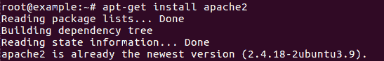

1.  在安装过程中，Apache 会将自己注册到 Ubuntu 的默认防火墙 UFW 中。这提供了可以用来启用或禁用通过防火墙访问 Apache 的配置文件。要列出这些配置文件，请输入以下命令：

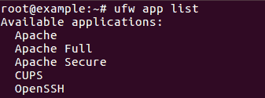

我们可以看到 Apache 有三个可用的配置文件。Apache 仅引用端口 `80`，而 Apache Full 引用端口 `80` 和 `443`，而 Apache Secure 仅引用端口 `443`。

1.  由于尚未配置 SSL，我们暂时只允许端口 `80` 的流量。为此，我们运行以下命令：

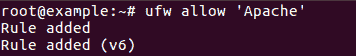

1.  现在，我们可以通过检查 UFW 的状态来验证是否已允许 HTTP 流量，如下所示：

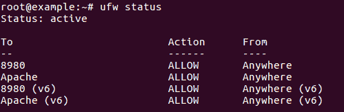

1.  当 Apache 安装完成后，Ubuntu 会自动启动它。可以通过运行以下命令来确认这一点：

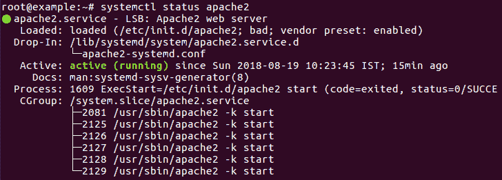

1.  Apache 启动并运行后，我们可以启用附加模块以获取扩展功能。

1.  要检查附加模块的列表，请查看 `/etc/apache2/mods-available` 目录。

1.  假设我们要安装 MySQL 认证模块；可以通过运行以下命令来完成：

```
apt-get install libapache2-mod-auth-mysql
```

1.  安装完成后，可以通过以下命令启用该模块：

```
a2enmod auth_mysql
```

1.  接下来，我们需要重启 Apache 以使更改生效：

```
systemctl restart apache2.service
```

1.  如果我们希望加密由 Apache 服务器发送和接收的流量，可以使用 `mod_ssl` 模块。由于该模块包含在 `apache2-common` 包中，我们可以直接通过以下命令启用它：

```
a2enmod ssl
```

1.  启用 SSL 模块后，需要进行手动配置才能使 SSL 正常工作。我们已经在之前的章节中讨论过这一点。

# 它是如何工作的...

Apache 是 Ubuntu 上最常用的 web 服务器。我们从 Ubuntu 的软件库中安装它。安装完成后，我们根据需求通过 UFW 防火墙允许访问。

一旦 Apache 启动并运行，我们可以通过安装附加模块并启用它们来定制其配置。

# 远程服务登录 – Telnet

**Telnet** 是最早的远程登录协议之一，至今仍在使用。它比今天的大多数系统管理员都要古老，因为它是在 1969 年开发的。Telnet 允许用户在计算机之间建立基于文本的连接。由于 Telnet 没有内建的安全措施，因此它存在各种安全问题。

# 准备就绪

为了演示 Telnet 的使用，我们将使用两台系统。在第一台系统上，Telnet 服务器将运行，而从第二台系统，我们将检查安全问题。

# 如何操作...

在本节中，我们将看到 Telnet 如何引发严重的安全问题：

1.  使用 Telnet 非常简单。只需打开终端窗口并输入以下命令：

```
telnet <IP Address> <Port>
```

这是一个示例：`telnet 192.168.43.100 23`

1.  当 Telnet 在服务器上运行时，攻击者可以利用它执行其他服务的横幅抓取。让我们使用它来查找服务器上运行的 SSH 版本。输入以下命令来实现这一点：

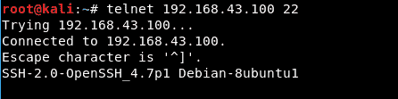

正如我们从前面的截图中看到的，SSH 的版本被清楚地显示出来。

1.  我们还可以通过 Telnet 执行 SMTP 横幅抓取。为此，我们运行以下命令：

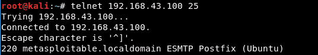

在前面的输出中，我们可以看到远程服务器使用的是 PostFix 邮件服务器，主机名为 `metasploitable.localdomain`。

1.  一旦攻击者获取了有关 SMTP 服务器的信息，他们可以尝试猜测有效的邮件账户。他们使用 `vrfy` 命令后跟邮件账户来进行猜测。根据结果，他们可以判断邮件账户是否有效：

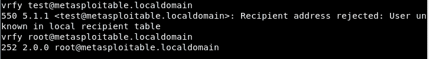

如果响应代码是 `550`，则表示猜测的邮件账户无效；如果响应代码是 `250`、`251` 或 `252`，则表示邮件账户有效。

1.  由于 Telnet 默认不加密任何通过连接发送的数据，攻击者可以轻松地窃听通信并捕获敏感数据，包括密码。

1.  假设某个用户正如图所示连接到 Telnet 服务器：

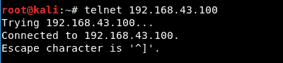

用户将被提示输入登录信息。一旦输入正确的细节，他们就能登录，如图所示：

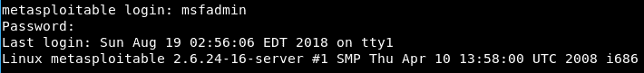

1.  与此同时，处于同一网络中的攻击者使用 Wireshark 工具嗅探网络流量。我们可以看到这里由 Wireshark 捕获的 Telnet 流量：

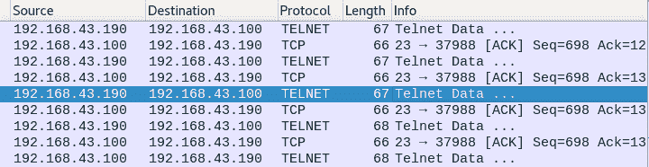

1.  当我们分析捕获的包时，可以看到登录信息是以明文显示的，如下所示：

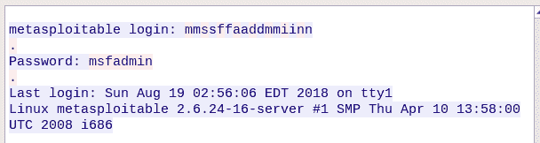

1.  这清楚地告诉我们 Telnet 是多么不安全。

# 它是如何工作的...

作为最古老的协议之一，Telnet 没有内置的安全措施。攻击者可以利用 Telnet 进行横幅抓取。

攻击者还可以嗅探通过 Telnet 连接发送的流量，并获得重要信息，因为 Telnet 使用明文通信。

# 安全远程登录 – SSH

随着互联网的发展，使用 SSH 相关的安全风险也逐渐显现。为了克服这些安全风险，开发人员发布了一种名为 Secure Shell 或 SSH 的新工具。

它提供与 Telnet 相同的功能，但在一个安全的加密隧道中。

# 准备就绪

对于 Linux 系统，我们可以使用 OpenSSH 来进行 SSH 连接。它是一个免费的 Linux 工具，可以通过 `apt` 安装。我们在前面的章节中讨论了 OpenSSH 的安装和配置。

# 如何操作…

在本节中，我们将看到如何使用 SSH 替代 Telnet 来保护我们的数据：

1.  一旦 SSH 安装并配置完成，我们可以尝试使用 SSH 连接到服务器，如下所示。在提示时输入密码：

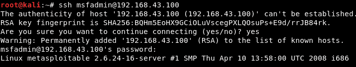

1.  同时，如果我们尝试使用 Wireshark 捕获流量，我们会得到以下详细信息：

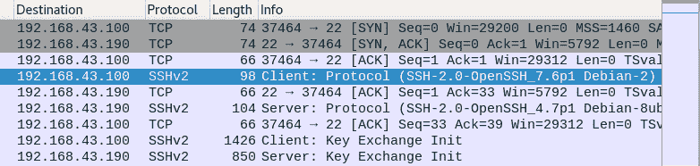

在前面的截图中，我们可以看到最后几行显示客户端和服务器之间已启动密钥交换。

1.  当我们查看捕获的包时，可以看到客户端和服务器之间交换的是加密的包，如下所示。在使用 Telnet 时并没有这种情况：

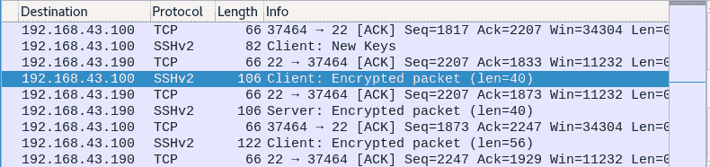

1.  即使我们尝试查看数据包的详细信息，我们也看不到任何明文数据。我们得到的是加密的输出，如下所示：

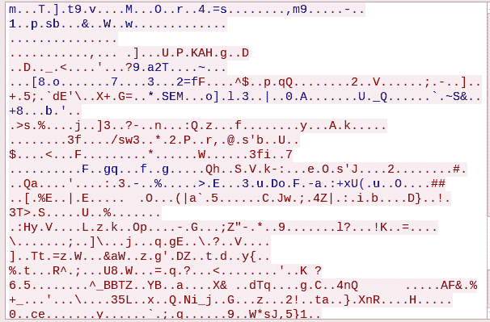

1.  因此，我们可以看到 SSH 如何帮助保护互联网上传输的数据。

# 文件传输安全 – FTP

文件传输安全（FTP）一直是最常用的文件传输协议。当我们谈论像 FTP 这样的文件传输协议时，意味着该协议用于发送以单个单位存储在特定文件系统中的比特流。然而，这个过程并不完全安全。

FTP 存在许多漏洞，并且不提供任何数据传输加密。

让我们讨论一些与使用 FTP 相关的安全风险：

+   **FTP 回显攻击**：当通过 FTP 协议进行文件传输时，源服务器将数据发送到客户端，然后客户端将数据传输到目标服务器。然而，在连接较慢的情况下，用户可能会使用 FTP 代理，这使得客户端直接在两个服务器之间传输数据。

+   在这种情况下，黑客可能使用 `PORT` 命令发起请求，通过成为该特定文件传输请求的中间人来访问端口。然后，黑客可以对主机进行端口扫描，并访问通过网络传输的数据。

+   **FTP 暴力破解攻击**：攻击者可以尝试对 FTP 服务器进行暴力破解攻击，猜测密码。管理员往往使用弱密码，并且在多个 FTP 服务器中重复使用相同的密码。在这种情况下，如果攻击者成功进行暴力破解攻击，所有数据将暴露。

+   **数据包捕获（或嗅探）**：由于 FTP 以明文方式传输数据，任何攻击者都可以通过网络数据包嗅探获取敏感信息，如用户名和密码。

+   **欺骗攻击**：假设管理员已根据网络地址限制对 FTP 服务器的访问。在这种情况下，攻击者可以使用外部计算机并伪造其地址为企业网络上的任何计算机。一旦发生这种情况，攻击者就能访问所有正在传输的数据。

我们已经看到与 FTP 相关的不同安全风险。现在，让我们讨论几种执行安全数据传输的方法：

+   **禁用标准 FTP**：许多 Linux 服务器预装了标准 FTP 服务器。作为最佳实践，建议禁用标准 FTP，因为它缺乏隐私性和完整性，使得攻击者更容易访问传输的数据。应使用更安全的替代方案，如 SFTP。

+   **使用强加密和哈希**：当使用 SFTP 或任何其他安全协议时，确保禁用过时的旧加密算法，如 Blowfish 和 DES，只使用强加密算法，如 AES 和 TDES。

FTP 是一个非常古老的协议，但我们仍然可以在许多网络中看到 FTP 的糟糕实现。作为一个古老的协议，它的安全特性较少，因此容易受到许多安全风险的威胁。

当我们使用如 SFTP 这样的安全协议而不是 FTP 时，攻击的可能性会大大降低。

# 邮件传输安全 – SMTP

**SMTP**或**简单邮件传输协议**是电子邮件服务器使用的协议。每封电子邮件都是通过 SMTP 协议由 SMTP 服务器发送和接收的。像 Postfix 这样的 MTA（邮件传输代理）可以配置为电子邮件服务器。

Postfix 可以在 Linux 系统上用于路由和传递邮件。

# 准备工作

要安装和配置 Postfix，我们将使用 Ubuntu 服务器。我们还需要在服务器上配置**完全限定域名**（**FQDN**）。

# 如何操作...

在本节中，我们将学习如何在 Ubuntu 服务器上安装和配置 Postfix，并根据我们的需求进行使用：

1.  由于 Postfix 包含在 Ubuntu 的默认软件库中，安装它变得非常简单。为了开始安装，我们将运行以下命令，并设置`DEBIAN_PRIORITY=low`环境变量，以便在安装过程中回答一些额外的提示：

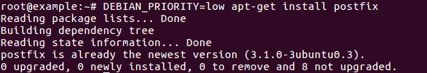

1.  一旦安装开始，首个窗口将询问邮件配置类型。我们将根据需求选择`Internet Site`，如下所示：

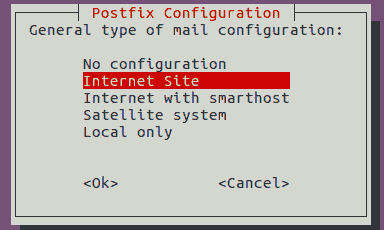

1.  在下一个窗口中，输入将用于`系统邮件名称`的主机名，如下所示：

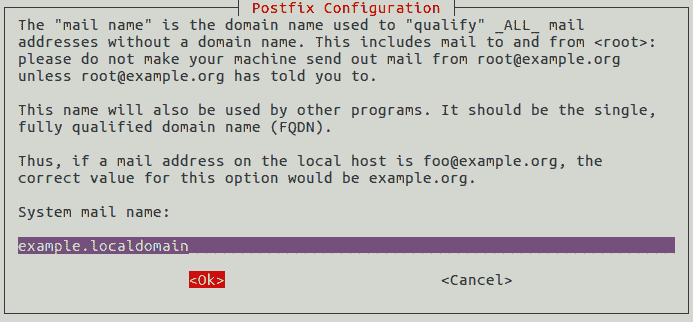

1.  接下来，输入将用于转发根账户和邮局管理员邮件的 Linux 用户账户，如下所示：

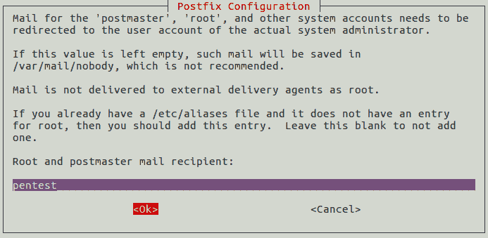

1.  下一个窗口定义了 Postfix 将接受的邮件目的地。确认现有的条目，并在需要时添加其他域：

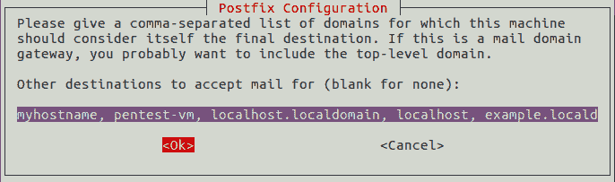

1.  在下一个窗口中，选择`否`并继续。

1.  下一个窗口指定了邮件服务器配置的转发消息的网络列表：

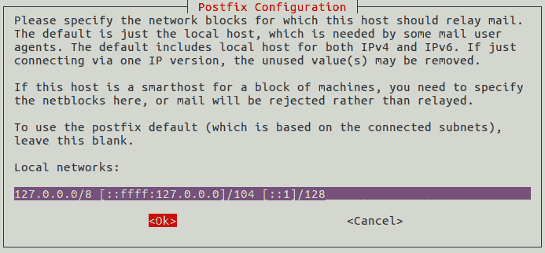

1.  在下一个窗口中，我们可以限制消息的大小。我们将设置为`0`，以禁用任何大小限制：

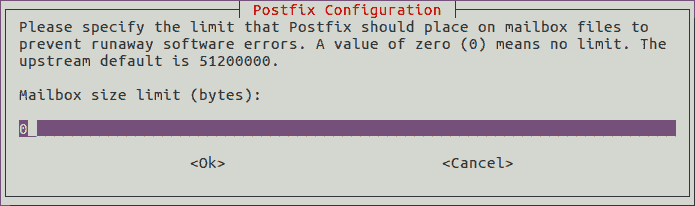

1.  在下一步中，选择 Postfix 应该支持的 IP 版本。在我们的例子中，我们将选择`all`：

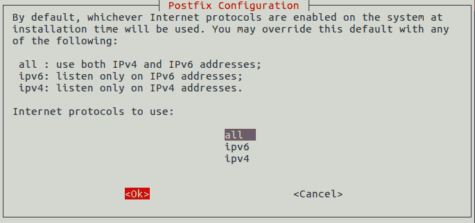

1.  完成前面的步骤后，安装将完成，如下所示：

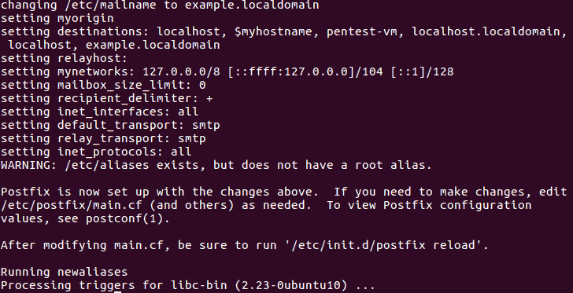

1.  现在，我们将开始设置邮箱。为此，我们将`home_mailbox`变量设置为`Maildir/`，如图所示：


这一步将会在用户的主目录下创建一个目录结构。

1.  然后，设置`virtual_alias_maps`表的位置。此表用于将 Linux 系统账户与电子邮件账户进行映射。我们将运行以下命令来执行此操作：

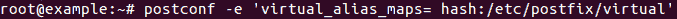

1.  现在，让我们编辑`etc/postfix/virtual`文件，将邮件地址映射到 Linux 账户，如下所示：

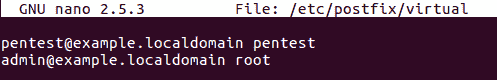

1.  完成后，运行以下命令应用映射：


1.  现在，我们将重启 Postfix 服务：

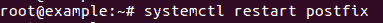

1.  我们的下一步是允许 Postfix 通过 UFW 防火墙：

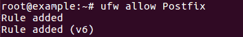

1.  现在 Postfix 应该已经配置好，可以发送邮件了。我们可以通过从任何用户账户向 root 邮件账户发送测试邮件来进行测试，如下所示：

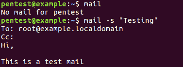

1.  接下来，我们通过输入`mail`命令来检查 root 账户的邮件。我们会看到有一封新邮件等待。当我们按下*Enter*，可以看到邮件内容，如下所示：

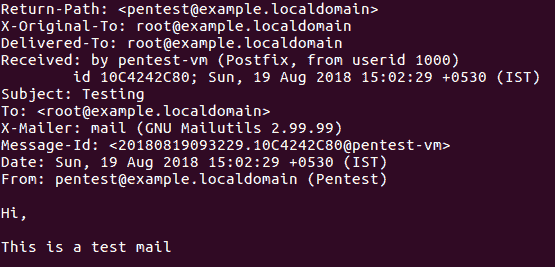

1.  在完成之前，我们将对 Postfix 进行加固。

1.  在之前的教程中，*远程服务登录 - Telnet*，我们看到攻击者如何使用`vrfy`命令猜测电子邮件账户，如下所示：

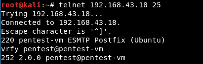

1.  为了防止此问题，我们需要禁用`vrfy`命令。为此，我们运行以下命令：

```
postconf -e disable_vrfy_command=yes
```

完成此操作后，我们重启 Postfix 服务以使更改生效。

1.  现在，如果攻击者尝试相同的步骤，他们将得到如下所示的输出：

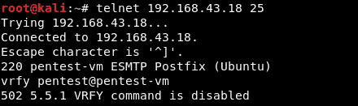

# 它是如何工作的...

Postfix 用于配置我们的 SMTP 服务器。在配置过程中，我们将邮箱账户与 Linux 系统账户进行映射。

为了提高 Postfix 的安全性，我们禁用了`vrfy`命令，从而防止攻击者猜测服务器上配置的邮箱账户。
