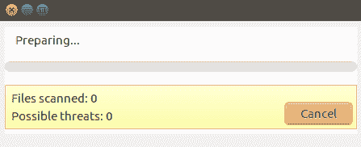

# 扫描和审计 Linux

在本章中，我们将讨论以下内容：

+   在 Linux 上安装杀毒软件

+   使用 ClamAV 扫描

+   查找 rootkit

+   使用 auditd 守护进程

+   使用 ausearch 和 aureport 阅读日志

+   使用 systemctl 审计系统服务

# 在 Linux 上安装杀毒软件

在今天的环境中，病毒和恶意威胁可以出现在任何系统中，包括 Linux。因此，作为系统管理员，我们可以在 Linux 服务器上使用杀毒软件。

**ClamAV** 是一种开源杀毒软件，用于检测和清除 Linux 系统上的病毒、木马、恶意软件和其他威胁。

# 准备工作

ClamAV 可以从 Ubuntu 的默认仓库中安装。不过，如果我们想从源代码安装，可以从以下网址下载官方源代码：[`www.clamav.net/download.html.`](http://www.clamav.net/download.html)

# 如何操作...

在本节中，我们将看到如何在 Ubuntu 服务器上安装 ClamAV 杀毒软件：

1.  在开始安装工具之前，我们将通过运行以下命令来更新仓库：


1.  接下来，我们将运行以下命令来安装 ClamAV 杀毒软件：


1.  我们也可以使用以下命令安装该工具的 GUI 版本：


1.  安装完成后，我们可以通过运行以下命令来检查安装的包版本：


1.  命令行版可以通过使用 `clamscan` 后接适当的选项来使用。

1.  要打开 ClamAV 的 GUI 版本，请进入主菜单，搜索该工具，如下所示：


1.  当我们打开 GUI 版本时，它将如图所示打开：


# 它是如何工作的...

ClamAV 可以轻松安装在 Linux 系统上，既可以使用 Linux 的默认仓库，也可以从其官方网站下载源代码。

ClamAV 可以通过命令行或 GUI 使用。

# 使用 ClamAV 扫描

**ClamAV** 是一个跨平台的杀毒软件，能够检测不同类型的恶意软件，包括病毒。它包含多种工具，如命令行扫描器、数据库更新程序和多线程守护进程，使其成为一个强大的工具。

# 准备工作

在我们运行系统扫描之前，必须先安装命令行版或 GUI 版的工具。可以按照前面部分讨论的方式进行安装。

# 如何操作...

在本节中，我们将看到如何根据我们的需求使用 ClamAV 执行扫描。

1.  作为第一步，我们将查看工具的帮助菜单，以查看 ClamAV 支持的不同选项，如下所示：


1.  如下截图所示，ClamAV 支持在扫描过程中使用的各种选项：


1.  我们现在将开始对`/home`目录进行扫描，如下所示：


1.  扫描完成后，它将显示以下扫描摘要：


1.  我们也可以使用 GUI 版本运行扫描。打开工具后，通过点击“设置”来更改扫描设置。这将打开如下所示的窗口：


在前面的窗口中，根据我们的需求选中或取消选中选项。

1.  接下来，点击“扫描文件”或“扫描目录”以开始相应的扫描：


1.  扫描将开始运行，如下所示：



1.  当扫描完成时，它将显示查找到的结果，或者如果没有发现威胁，则会显示以下消息：


1.  通过点击“更新”，我们可以检查是否有可用的签名更新：


# 它是如何工作的...

**ClamAV**是一个多功能工具，支持多种文件格式和多种签名语言，大多数病毒会利用这些漏洞来攻击系统。它可以执行多线程扫描。

# 查找 rootkit

现在的服务器面临着日益频繁的网络攻击，作为系统管理员，建议定期检查以确保没有攻击者进入系统。

通过使用不同的工具，我们可以防止恶意软件和 rootkit 被安装到我们的服务器上。

# 准备工作

在我们的 Linux 系统上使用扫描工具没有特定的要求。

# 如何操作...

在本节中，我们将看到如何安装和配置 Linux rootkit 扫描工具，并根据我们的需求进行使用：

1.  首先，我们将安装`chkrootkit`，这是一个经典的 Linux rootkit 扫描工具，如下所示：


1.  一旦软件安装完成，我们可以通过运行以下命令检查软件安装路径：


1.  接下来，我们查看帮助菜单，了解可以用来运行该工具的选项：


1.  如果我们想查看 chkrootkit 中可用的测试列表，可以运行以下命令：


1.  现在，让我们按照这里所示开始扫描：


1.  如我们在扫描输出中看到的，软件正在检查所有已知的 rootkit 签名：


1.  另一个可以用来扫描 rootkit 的知名工具是`rkhunter`。通过运行以下命令来安装该工具：


1.  接下来，检查帮助菜单，查看运行软件时可以使用的选项：


1.  现在，按照此处所示开始扫描：


1.  如输出所示，所有已知的 rootkit 签名都已经检查过，且没有找到任何：


1.  最后，当扫描完成时，该工具将显示一个扫描摘要，如此处所示：


# 它是如何工作的...

Chkrootkit 和 rkhunter 都是开源的基于 Linux 的 rootkit 扫描工具，有助于扫描 Linux 机器上可能存在的 rootkit。

这两个工具都使用基于签名的扫描来检查 Linux 系统上的 rootkit 和其他恶意软件。

# 使用 auditd 守护进程

当我们谈论保护系统时，这包括许多程序，而审计系统就是其中之一。Linux 系统预装了一个名为 **auditd** 的工具，它负责将审计记录写入磁盘。

# 准备就绪

在 Linux 系统上使用 auditd 没有任何特定要求。

# 如何操作...

在本节中，我们将看到如何使用 auditd 来进行审计：

1.  如果工具尚未安装在我们的 Linux 发行版上，可以通过运行以下命令来安装：

```
apt-get install auditd
```

1.  当安装该软件包时，它还会在安装过程中安装一些其他工具。其中一个安装的工具是 `auditctl`，它帮助控制软件的行为并添加规则。

1.  我们可以通过运行以下命令检查工具的版本：


1.  当第一次安装 auditd 时，它还没有任何规则可用。可以通过运行以下命令来检查：


1.  现在，让我们查看帮助菜单，检查可与该工具一起使用的其他选项：


1.  要开始使用 `auditd` 工具，必须有规则。我们可以添加规则来审计文件，如此处所示：


在前面的命令中，`-w` 选项告诉 auditd 监视指定的文件。`p` 选项指定 auditd 应该触发的权限。然后，`wxa` 分别表示读取、写入、执行和属性。

1.  我们还可以添加规则来监视目录，如此处所示：


1.  如果我们现在检查规则列表，我们会得到以下输出：


# 它是如何工作的...

`auditd` 帮助定义规则，根据这些规则，它会监视指定的文件和目录。如果这些文件和目录发生了变化，`auditd` 将根据已定义的规则触发。

# 使用 ausearch 和 aureport 阅读日志

在上一节中，我们了解了如何使用 auditd 工具定义规则并监视特定的文件和目录。

要从 auditd 日志文件中提取数据，我们可以使用`ausearch`工具，通过使用`aureport`，可以基于这些日志生成报告。

`ausearch`是一个命令行工具，用于根据事件和其他搜索条件搜索 auditd 守护进程的日志文件。

类似地，`aureport`也是一个命令行工具，帮助从 auditd 守护进程的日志文件中创建有用的汇总报告。

# 准备就绪

当我们安装 auditd 守护进程时，它也会一起安装 ausearch 和 aureport 工具。所以不需要额外安装这些工具。

# 如何操作...

本节将介绍如何使用 ausearch 和 aureport 工具来读取 auditd 守护进程的日志文件，并从中创建报告：

1.  auditd 日志的默认存储位置是`/var/log/audit/audit.log`。如果我们查看这个文件的内容，输出如下所示：


从输出中可以看到，日志包含大量数据，且由于内容较多，直接查看文件内容时很难获取到具体的信息。

1.  因此，我们将使用`ausearch`以更强大且高效的方式搜索日志。首先，我们查看工具的帮助文件，以了解可以使用的选项：


1.  假设我们想查看与某个正在运行的进程相关的日志，可以通过使用`-p`标志并传递进程 ID 给`ausearch`命令来实现，如下所示：


从输出中可以看到，现在只显示了特定进程 ID 的相关信息。

1.  如果我们想查看用户账户的登录失败尝试，可以通过运行以下命令来实现：


1.  要查找特定用户账户的活动记录，我们可以运行以下命令：


在前面的命令中，`pentest`是我们想查询的用户名。

1.  我们还可以使用`ausearch`查询特定时间段内某个用户执行的操作。在以下命令中，我们使用`-ts`表示开始日期/时间，`-te`表示结束日期/时间：


1.  如果我们想根据 auditd 守护进程添加的审计规则键创建报告，可以使用以下命令，并使用`-k`标志：


1.  如果我们想将数字实体转换为文本（例如将 UID 转换为账户名），在使用前面命令创建的报告中，我们可以添加`-i`标志，如下所示：


1.  要创建有关用户认证事件的报告，我们可以使用以下命令：


1.  要创建所有登录的报告，我们使用`-l`标志，如下所示：


1.  如果我们想查看失败的登录事件报告，可以使用以下命令：


1.  与`ausearch`类似，我们可以使用`aureport`为特定的时间段创建报告，如下所示：


# 它是如何工作的……

`ausearch`和`aureport`与`auditd`守护进程一起工作。通过使用`auditd`记录事件数据的日志文件，`ausearch`可以根据我们的需求帮助我们读取这些日志。类似地，通过使用`aureport`，我们可以根据`auditd`守护进程的日志文件创建有用的报告。

# 使用 systemctl 审核系统服务

**Systemd**是一个初始化系统，同时也是一个系统管理工具，已经成为 Linux 系统的新标准。为了控制该初始化系统，我们有一个中央管理工具，称为`systemctl`。通过使用`systemctl`，我们可以检查服务状态、管理服务、改变服务的状态，并与它们的配置文件进行操作。

# 准备工作

大多数 Linux 发行版都已实现`systemctl`，因此它是预安装的。

如果某个特定的 Linux 发行版没有预安装`systemctl`，则意味着该 Linux 发行版没有使用该初始化系统。

# 如何操作……

在本节中，我们将讨论如何使用`systemctl`命令对服务执行各种操作：

1.  要确认我们的 Linux 发行版是否支持`systemctl`，我们只需运行命令`systemctl`，如这里所示：


如果我们得到如图所示的输出，说明命令正在正常工作。如果收到错误信息`bash: systemctl is not installed`，则意味着系统不支持该命令，因为它使用了其他初始化系统。

1.  如果我们想检查某个特定服务的状态，例如 SSHD 服务，可以像这里展示的那样使用`systemctl`：


如图所示的输出清楚地告诉我们，SSHD 服务正在正常运行。

1.  要停止或启动任何服务，我们使用以下命令：


1.  我们可以使用`systemctl`重启正在运行的服务。此外，如果某个服务支持重新加载其配置文件（而不需要重启），我们可以使用`systemctl`命令的`reload`选项来实现，如这里所示：


1.  我们可以使用`systemctl`命令查看 systemd 已知的所有活动单元列表，如下所示：


1.  有时，我们可能希望查看某个特定服务的依赖树。这可以通过使用`systemctl`命令实现，如下所示：


# 它是如何工作的……

`systemctl`允许我们与`systemd`实例进行交互并控制它。我们使用`systemctl`工具来管理任何类型的服务和系统状态。

使用 `systemctl` 命令的不同选项，我们可以对服务执行不同的操作。
