# 第十三章：漏洞扫描与入侵检测

在本章中，我们将讨论以下内容：

+   使用 Security Onion 进行网络安全监控

+   使用 OpenVAS 查找漏洞

+   使用 Nikto 进行 Web 服务器扫描

+   使用 Lynis 进行强化

# 使用 Security Onion 进行网络安全监控

**Security Onion**是一个基于 Linux 的发行版，旨在用于网络安全监控。监控网络中的安全相关事件可以是主动的，若用于识别漏洞，或者是被动的，如在事件响应中。

Security Onion 通过提供网络流量的洞察和警报的背景信息来帮助我们。

# 准备就绪

我们在前面的章节中讨论了在系统上安装和配置 Security Onion 的过程。按照这些步骤，我们已经拥有了一个安装了 Security Onion 的正常运行系统。

使用 Security Onion 无需其他先决条件。

# 如何操作...

在本节中，我们将介绍 Security Onion 中一些可以帮助进行安全监控的工具：

1.  完成 Security Onion 中包含的安全工具的设置后，我们需要创建一个用户帐户来使用这些工具。打开终端并运行以下命令来为工具创建一个用户：

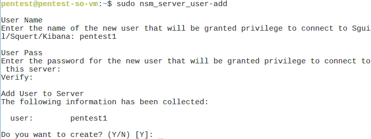

在前面的步骤中，我们创建了一个名为`pentest1`的用户，并为其配置了密码。

1.  一旦我们创建了用户帐户，就可以开始使用这些工具。

1.  在桌面上，我们可以找到 SGUIL 工具的图标。双击该图标以运行该工具。

1.  会出现一个登录界面，如下所示。输入在前一步中配置的用户详细信息，然后点击**确定**：

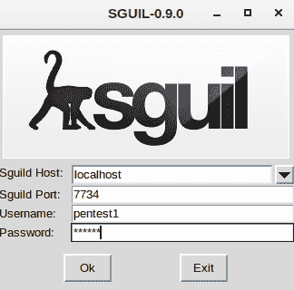

1.  一旦用户详细信息得到验证，下一窗口将要求选择要监控的网络。从可用选项中选择接口并点击**开始 SGUIL**以继续：

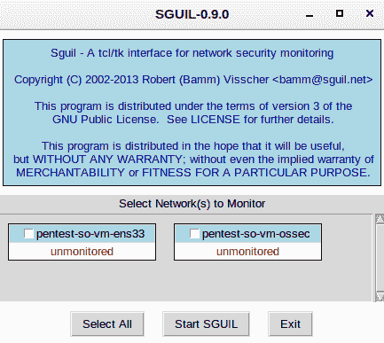

1.  我们将看到如下所示的窗口。这是 SGUIL 工具的主屏幕。在这里，我们可以监控在前一步中选择的网络上发生的实时事件，以及会话数据和原始数据包捕获：

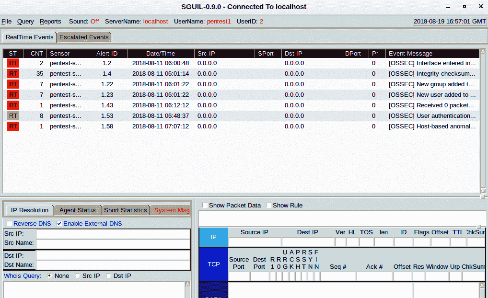

更多关于使用该工具的信息可以在[`bammv.github.io/sguil/index.html`](http://bammv.github.io/sguil/index.html)找到。

1.  Security Onion 中还包含其他工具，如 Kibana。要访问该工具，我们可以在桌面上找到快捷方式。双击快捷方式后，它会打开指向以下网址的浏览器：`https://localhost/app/kibana`。

1.  浏览器会显示有关**不安全连接/连接不安全**的警告，因为使用的是自签名 SSL 证书。忽略此错误，如下所示，点击高级并继续：

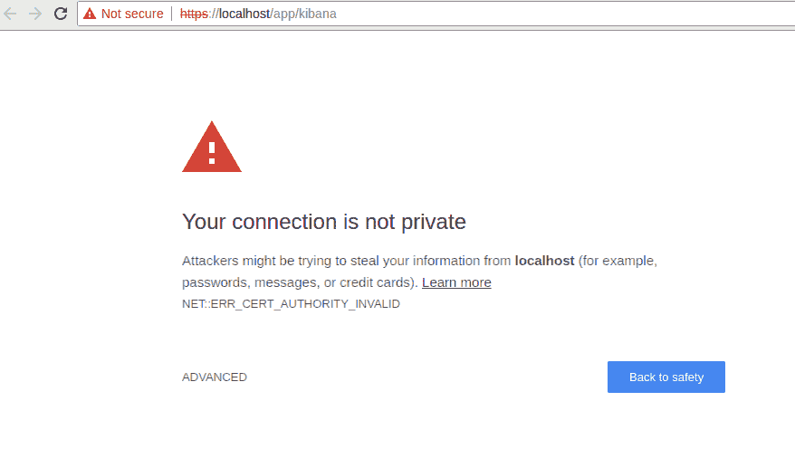

1.  接下来，Kibana 会要求输入用户详细信息以登录。使用第一步中配置的用户信息。成功登录后，我们将看到以下窗口：

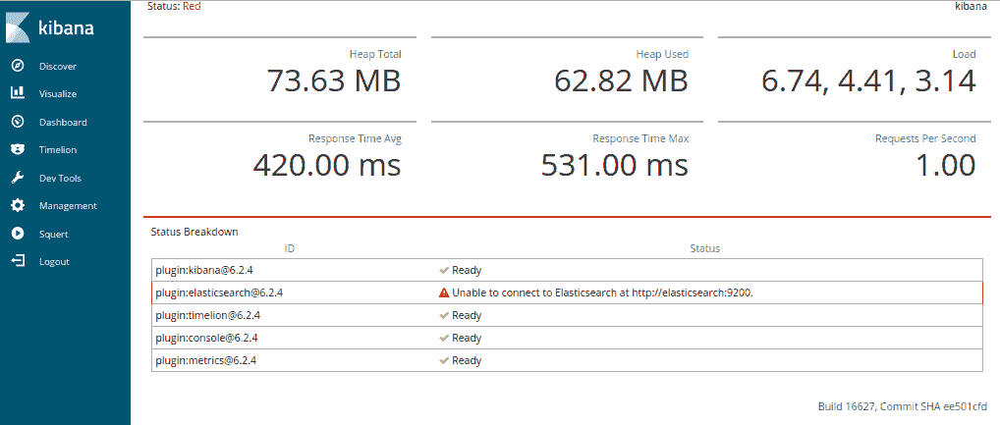

1.  Kibana 帮助可视化 Elasticsearch 数据，并且可以在 Elastic 堆栈中进行导航。

1.  Security Onion 还包含其他可用于监控网络中各种活动的工具。探索这些工具以获得更多的见解。

# 它是如何工作的...

Security Onion 是一个开源的 Linux 发行版，主要用于企业安全监控、入侵检测和日志管理。为了帮助管理员进行安全监控，它包含了多种安全工具，例如 Sguil、Kibana、Suricata、Snort、OSSEC、Squert、NetworkMiner 等。

# 使用 OpenVAS 查找漏洞

作为 Linux 管理员，我们希望跟踪系统中可能存在的漏洞。及时发现这些漏洞有助于在攻击者利用之前修复它们。

为了查找漏洞，我们可以使用像 **OpenVAS** 这样的漏洞扫描工具。它是最先进的开源漏洞扫描工具之一。

# 准备工作

要使用 OpenVAS，我们必须首先在系统上安装并配置它。有关安装和配置过程的更多信息，请参考 OpenVAS 的官方网站：[`www.openvas.org/`](http://www.openvas.org/)。

# 如何操作...

完成 OpenVAS 的安装和初步配置后，我们可以使用它来扫描网络中的服务器。在本节中，我们将了解如何配置并运行扫描：

1.  要访问 OpenVAS，请在浏览器中输入此 URL：`https://127.0.0.1:9392`。

1.  我们将看到如下所示的登录界面。请输入在安装 OpenVAS 时配置的用户详细信息：

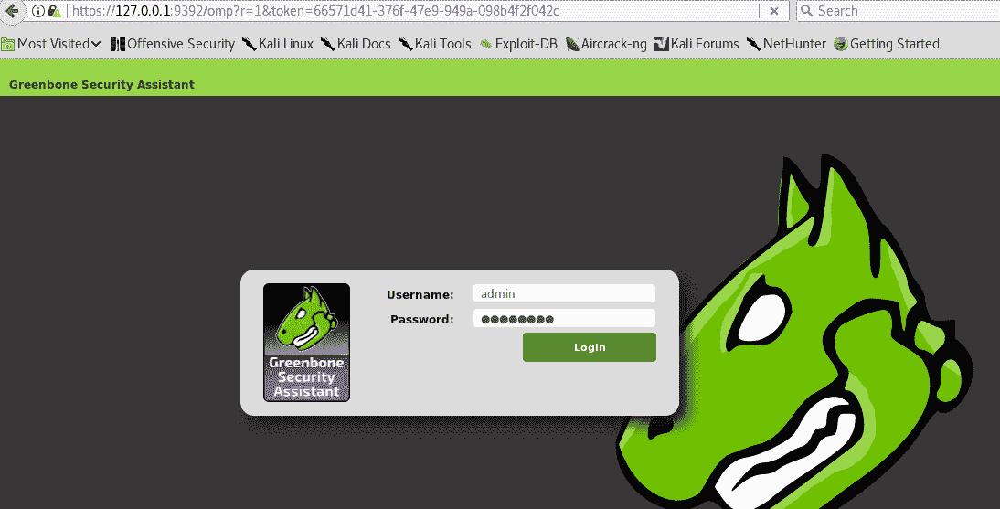

1.  登录后，我们会看到以下窗口。在顶部菜单中，我们可以找到不同的选项，如 **Scan**、**Assets** 和 **Configuration**：

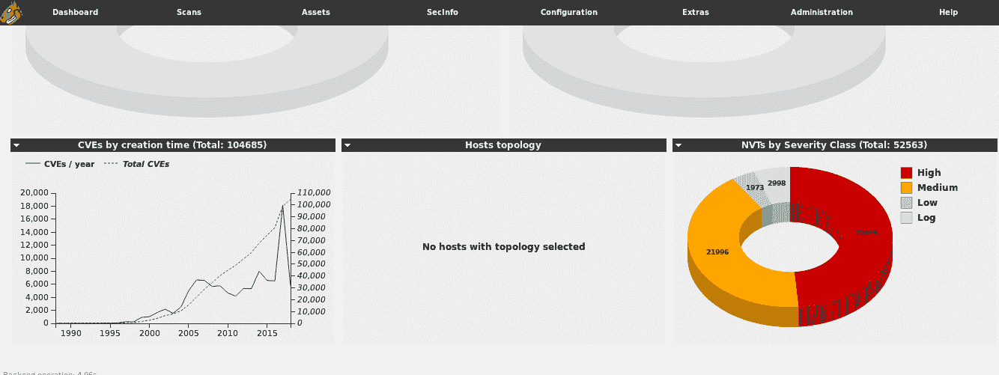

1.  要扫描服务器，我们首先需要将其添加为扫描目标。为此，请点击 **Configuration**，然后点击 **Target**，如下所示：

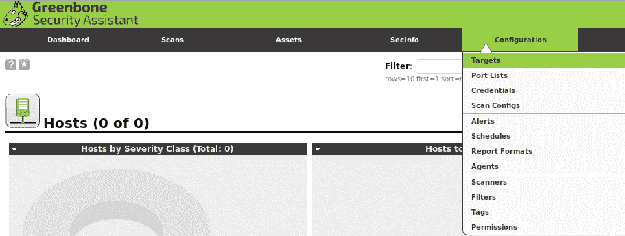

1.  我们将看到以下窗口。在左上角，我们可以看到一个星形图标。点击该图标后，它将打开一个新窗口以添加目标服务器：

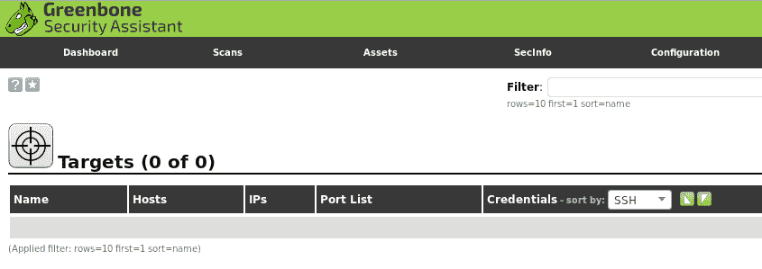

1.  在新窗口中，输入目标服务器的详细信息。为其命名以便于识别目标，然后输入 IP 地址，如下所示：

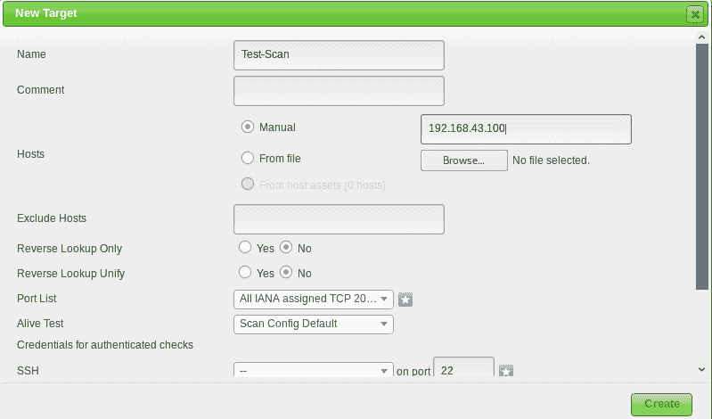

填写完细节后，点击“创建”以将目标保存到目标列表中。

1.  我们可以在目标列表中看到我们的目标服务器：

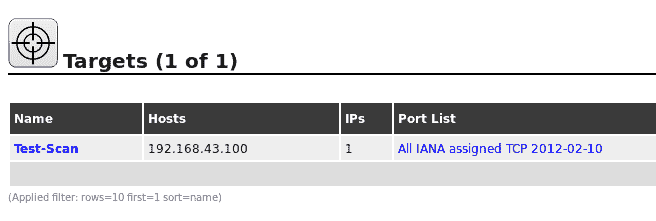

1.  接下来，我们点击 **Scan** 菜单，然后点击 **Tasks** 来开始创建扫描任务：

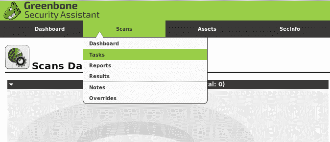

1.  在下一个窗口中，点击蓝色星形图标，然后点击**新任务**以继续：

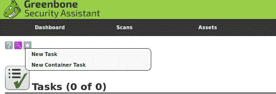

1.  现在，我们将为我们创建的扫描任务命名，然后通过**扫描目标**菜单下的列表选择我们的目标服务器，如下所示：

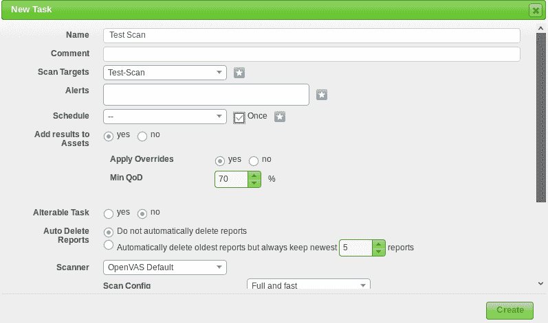

对于调度选项，勾选“仅一次”框以仅运行一次扫描。根据需求，我们可以安排扫描多次运行。接下来，点击“创建”。

1.  一旦我们点击“创建”，我们的扫描任务就已创建并可以在任务列表中看到，如下所示：

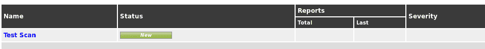

1.  在我们创建的扫描结果的最右侧，可以看到**操作**栏中的一些按钮，如下所示。在这里，我们可以启动或暂停之前创建的扫描任务：

1.  一旦我们点击前面截图中显示的开始或播放按钮，扫描将开始运行。根据网络速度和其他资源的不同，完成扫描的时间可能会有所不同。

1.  扫描完成后，它可以在**扫描任务**列表中看到，如下所示：

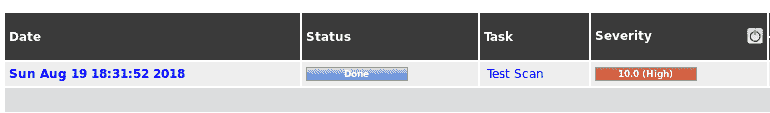

1.  **严重性**栏显示扫描的摘要。它根据严重性显示发现问题的数量。

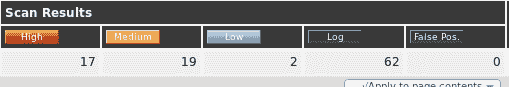

1.  要查看扫描仪发现的完整漏洞列表，我们可以点击**扫描名称**，然后我们将看到 OpenVAS 发现的漏洞列表，如下所示：

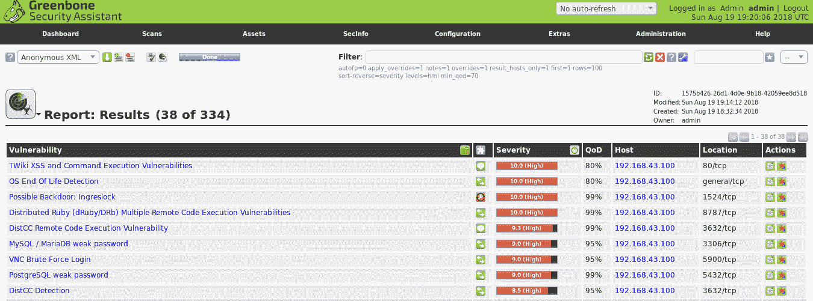

OpenVAS 找到的漏洞列表

# 它是如何工作的...

OpenVAS 允许我们使用**目标**选项添加我们希望扫描的服务器。添加服务器后，我们通过**扫描菜单**创建一个**扫描任务**。在**扫描任务**中，我们选择之前创建的目标，并对其进行扫描。

当**扫描任务**成功配置后，我们运行扫描。扫描完成后，我们可以看到 OpenVAS 发现的漏洞列表。

# 使用 Nikto 进行 Web 服务器扫描

如果我们的 Linux 服务器配置为 Web 服务器，Web 服务器和托管在 Web 服务器上的 Web 应用程序可能存在漏洞。在这种情况下，我们可以使用 Web 应用程序扫描工具来识别这些漏洞，Nikto 就是其中一个开源 Web 扫描器。

它可以与任何 Web 服务器配合使用，并且能够扫描大量项目以检测漏洞、配置错误、风险文件等。

# 准备工作

要使用 Nikto 扫描我们的 Web 服务器，首先需要在我们的系统上安装它，扫描将在该系统上进行。如果我们使用 Kali Linux，Nikto 已经预安装在其中。对于其他 Linux 发行版，我们可以使用以下命令安装该工具：

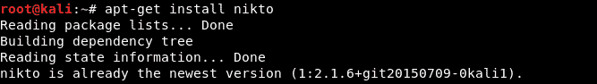

# 如何操作...

在本节中，我们将演示如何使用 Nikto 检查 Web 服务器并报告潜在的漏洞：

1.  要查看 Nikto 支持的选项的更多详细信息，我们运行以下命令：

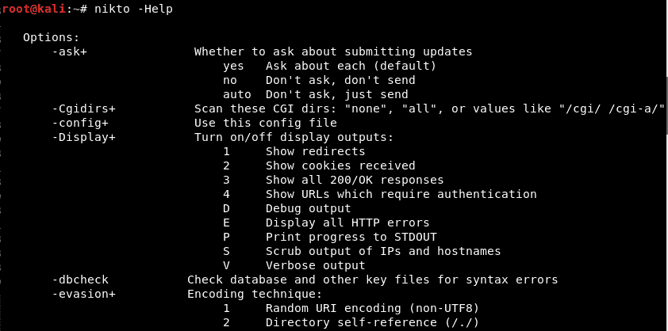

1.  Nikto 支持多种插件来查找不同的漏洞。如果我们想查看插件列表，可以使用以下命令：

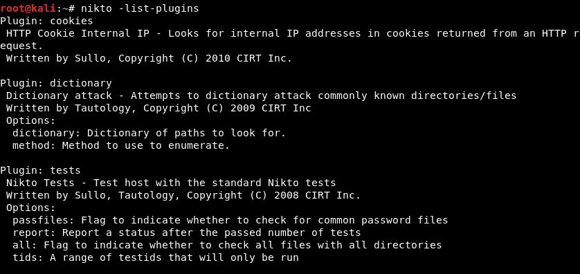

1.  现在，让我们使用 Nikto 对我们 IP 地址为 `192.168.43.100` 的 Web 服务器进行扫描。我们使用以下命令开始扫描：

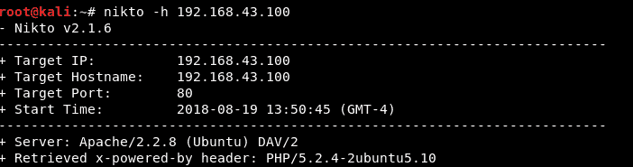

一旦我们运行命令，扫描将开始运行。根据网络速度和可能存在的漏洞数量，完成扫描的时间可能会有所不同。

1.  我们可以从下面的截图看到，Nikto 已经在我们的 Web 服务器上识别出了一些漏洞。它还告诉我们，Web 服务器正在运行 Apache 2.2.8，如之前所见：

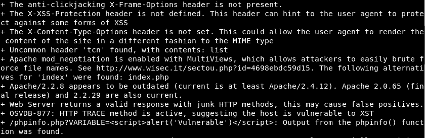

# 它是如何工作的...

Nikto 配备了超过 6,700 个插件，使用这些插件可以测试 Web 服务器中可能存在的安全问题。

一旦我们启动扫描，Nikto 使用这些插件检查所有漏洞，并在发现时报告它们。

# 使用 Lynis 进行系统硬化

**Lynis** 是一款开源安全工具，用于审计类 Unix 系统。它对系统进行全面扫描，并根据结果提供系统硬化和合规性测试的指导。

Lynis 可以用于多种目的，包括漏洞检测、渗透测试、安全审计、合规性测试和系统硬化。

# 准备工作

Lynis 支持几乎所有基于 Unix 的操作系统和版本。我们可以通过访问以下链接从官方网站获取 Lynis 的副本：

[`cisofy.com/documentation/lynis/get-started/`](https://cisofy.com/documentation/lynis/get-started/)

对于我们的示例，我们正在使用 Ubuntu 系统安装 Lynis。我们运行以下命令来安装该工具：

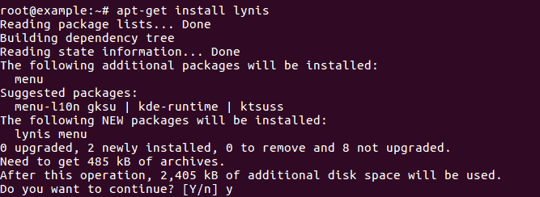

# 如何操作...

在本节中，我们将演示如何使用 Lynis 对系统的安全性和配置进行详细审计：

1.  一旦 Lynis 安装在我们的系统上，我们可以运行 `lynis` 命令，如下所示，以查看该工具支持的更多选项信息：

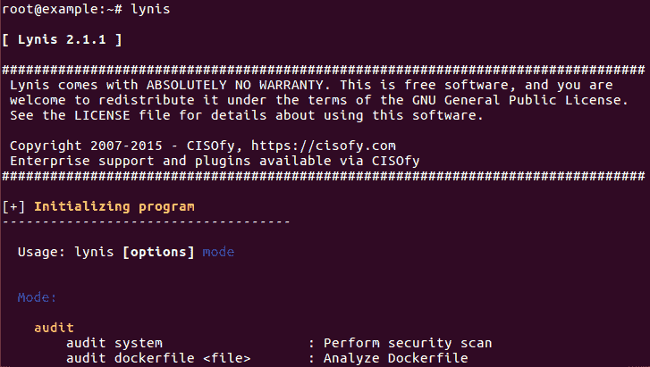

1.  我们可以通过运行以下命令来检查 Lynis 版本是否为最新版本：

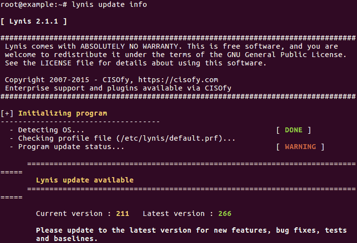

我们可以从输出中看到当前版本是 `211`，而最新版本是 `266`。如果我们希望更新版本，可以按照输出中显示的步骤继续操作。

1.  现在，我们将开始扫描，以审计我们的系统并通过运行以下命令识别其中的漏洞：

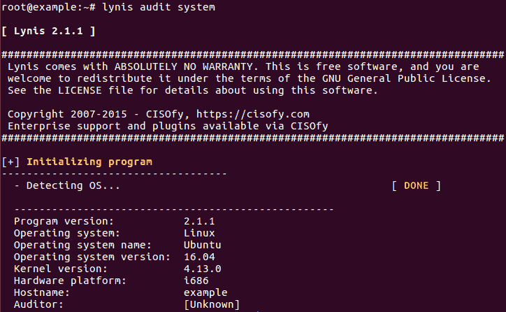

1.  随着扫描的进行，我们可以在这里看到扫描结果：

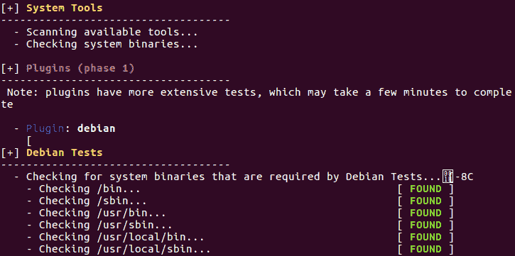

1.  在以下输出中，我们可以看到 Lynis 已经识别出服务器缺少的模块：

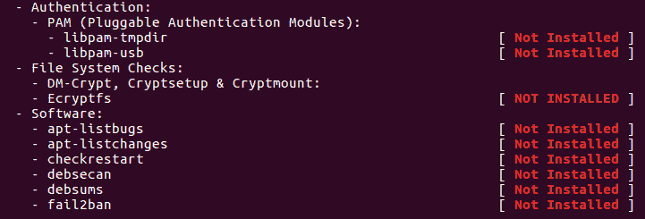

1.  扫描完成后，我们可以在这里看到扫描的总结：

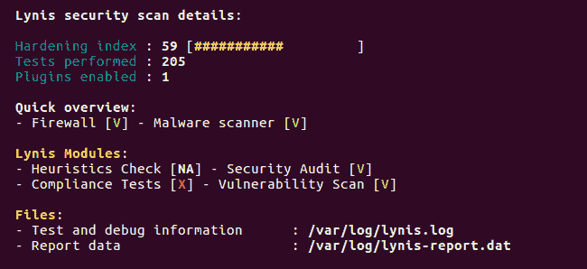

# 它是如何工作的...

当我们使用 Lynis 审计系统时，它首先初始化并执行基本检查，以确定操作系统和工具。随后，Lynis 会根据定义的类别运行启用的插件和安全测试。

Lynis 执行了数百个测试，这有助于确定系统的安全状态。

扫描完成后，Lynis 会报告扫描的状态。
