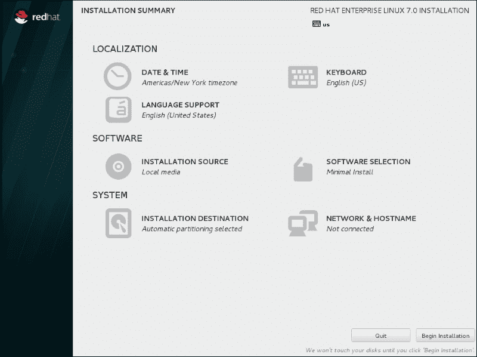
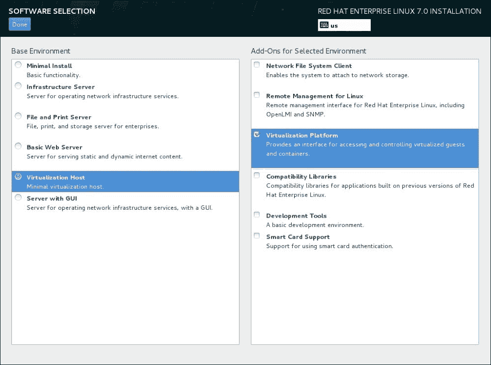

# 第一章：与 KVM 客户机的工作

本章将涵盖以下内容：

+   安装和配置 KVM

+   配置资源

+   构建虚拟机

+   动态添加 CPU

+   动态添加内存

+   动态添加磁盘

+   将磁盘移动到另一个存储

+   移动虚拟机

+   备份虚拟机元数据

# 简介

本书将尝试向你展示如何不费太多力气地部署 RHEL 7 系统。由于本书是以自动化为目标编写的，因此我将强调命令行工具，而不是详细讨论其图形界面版本，因为图形界面对于自动化没有什么帮助。

本章解释了如何使用 libvirt 接口和围绕它构建的各种工具来构建和管理 KVM 客户机。它将简要概述如何在 RHEL 上设置 KVM 并管理其资源。此概述中的设置远非企业级准备，因为它不提供通常在企业中所需的冗余。然而，提供的食谱对于企业设置仍然具有参考意义，因为界面保持不变。大多数情况下，你可能会使用一个管理层（如 RHEV 或 oVirt），这将使你在管理冗余时更加轻松。

### 注意

Libvirt 是用户与各种虚拟化和容器层之间的 API，例如 KVM、VMware、Hyper-V 和 Linux 容器。查看 [`libvirt.org/drivers.html`](https://libvirt.org/drivers.html) 了解完整的支持的虚拟化程序和容器解决方案列表。

由于大多数任务最终需要自动化，我倾向于不使用任何图形界面，因为这些界面无法轻松转换为脚本。因此，本章不会涉及任何图形界面的操作。这些内容将主要聚焦于 `virsh`，即 libvirt 管理用户界面，用于管理你的 KVM 主机及其虚拟机的各个方面。虽然很多人依赖 `virsh` 的编辑选项，但它不允许你实时编辑虚拟机的配置。通过这种方式编辑虚拟机的 XML 配置，需要你关机并重启虚拟机，才能使更改生效。重启虚拟机并不奏效，因为虚拟机实例需要完全重新读取 XML 配置文件才能应用更改。只有重新启动虚拟机才能做到这一点。

`virsh` 接口也是一个 shell，因此通过启动 `virsh` 而不带任何命令，你将进入 libvirt 管理 shell。一个非常有趣的命令是 `help`。此命令将按关键字输出所有可用的命令。每个命令都可以接受 `--help` 参数，显示可能的参数及其说明，供你使用。

# 安装和配置 KVM

本章介绍如何在 RHEL 7 上安装虚拟化工具和软件包。

默认情况下，RHEL 7 系统并未预安装 KVM 或 libvirt。可以通过以下三种方式安装：

+   通过系统设置过程中的图形化设置

+   通过 kickstart 安装

+   通过命令行进行手动安装

对于本教程，您应该知道如何使用 yum 安装软件包，并且您的系统应该配置为可以访问默认的 RHEL 7 仓库（有关更多信息，请参见 第八章，*Yum 和仓库*），这是我们将要使用的软件包所必需的。

或者，您可以使用 `rpm` 从安装介质中安装软件包，但您需要自己解决依赖问题。

使用以下命令检查 `rpm` 的依赖项：

```
~]# rpm -qpR <rpm file>

```

这将输出安装此软件包之前需要安装的二进制文件、库和文件的列表。

通过以下命令检查哪个软件包包含这些文件：

```
~]# rpm -qlp <rpm package>

```

如您所想，这是一项繁琐的工作，可能需要相当长的时间，因为您需要为每个要以这种方式安装的软件包找出每个依赖项。

## 准备工作

安装 KVM 时，您至少需要 6 GB 的空闲磁盘空间、2 GB 的 RAM，并且每个虚拟机需要额外的一个核心或线程。

检查您的 CPU 是否支持虚拟化标志（如 SVM 或 VMX）。某些硬件厂商在 BIOS 中禁用了该功能，因此您可能还需要检查您的 BIOS。请运行以下命令：

```
~]# grep -E 'svm|vmx' /proc/cpuinfo
flags    : ... vmx ...

```

或者，您可以运行以下命令：

```
~]# grep -E 'svm|vmx' /proc/cpuinfo
flags    : ... svm ...

```

使用以下命令检查硬件虚拟化模块（如 `kvm_intel` 和 `kvm`）是否已加载到内核中：

```
~]# lsmod | grep kvm
kvm_intel             155648  0
kvm                   495616  1 kvm_intel

```

## 如何操作……

我们将介绍将 KVM 安装到系统上的三种方式。

### 手动安装

这种安装 KVM 的方式通常是在使用其他方式安装基本系统后进行的。您需要执行以下步骤：

1.  使用以下命令安装提供虚拟化客机环境所需的软件：

    ```
    ~]# yum -y install qemu-kvm qemu-img libvirt

    ```

    这些软件包的安装将包含相当多的依赖项。

1.  运行此命令安装配置 `libvirt` 和安装虚拟机所需的附加实用工具：

    ```
    ~]# yum -y install virt-install libvirt-python python-virthost libvirt-client

    ```

1.  默认情况下，`libvirt` 守护进程会在每次启动时自动启动。通过执行以下命令检查它是否已启用：

    ```
    ~]# systemctl status libvirtd
    libvirtd.service - Virtualization daemon
     Loaded: loaded (/usr/lib/systemd/system/libvirtd.service; enabled)
     Active: inactive
     Docs: man:libvirtd(8)
     http://libvirt.org

    ```

1.  如果由于某些原因情况并非如此，请通过执行以下命令将其标记为自动启动：

    ```
    ~]# systemctl enable libvirtd

    ```

1.  要手动停止/启动/重启 `libvirt` 守护进程，您需要执行以下命令：

    ```
    ~]# systemctl stop libvirtd
    ~]# systemctl start libvirtd
    ~]# systemctl restart libvirtd

    ```

### Kickstart 安装

在 kickstart 过程中安装 KVM 提供了一种简单的方式来自动化 KVM 实例的安装。请按照以下步骤操作：

1.  在您的 kickstart 文件的 `%packages` 部分添加以下软件包组：

    ```
    @virtualization-hypervisor
    @virtualization-client
    @virtualization-platform
    @virtualization-tools
    ```

1.  使用此 kickstart 文件开始安装您的主机。

### 在系统设置过程中进行图形化设置

这可能是安装 KVM 最不常见的方式。我唯一使用这种方式的时间是在编写本教程时。以下是如何操作：

1.  从 RHEL 7 安装介质启动。

1.  完成除**软件选择**步骤之外的所有步骤。

1.  前往**软件选择**完成 KVM 软件选择。

1.  在**基础环境**中选择**虚拟化主机**单选按钮，在**为选定环境添加附加组件**中勾选**虚拟化平台**复选框：

1.  完成安装。

1.  在**安装总结**屏幕上，完成其他步骤并点击**开始安装**。

## 另请参见

要设置您的软件仓库，请查看第八章，*Yum 和仓库*。

要使用 kickstart 部署系统，请参考第二章，*大规模部署 RHEL*。

有关如何使用 libvirt 的更深入信息，请访问[`www.libvirt.org/`](http://www.libvirt.org/)。

RHEL 7 有某些支持限制，列在以下位置：

[`access.redhat.com/articles/rhel-kvm-limits`](https://access.redhat.com/articles/rhel-kvm-limits)

[`access.redhat.com/articles/rhel-limits`](https://access.redhat.com/articles/rhel-limits)

# 配置资源

虚拟机需要 CPU、内存、存储和网络访问，类似于物理机器。此食谱将向您展示如何通过 libvirt 设置基本的 KVM 环境，以便轻松管理资源。

存储池是一个虚拟容器，受到两个因素的限制：

+   `qemu-kvm`允许的最大大小

+   物理机器上磁盘的大小

存储池的大小不得超过主机磁盘的大小。最大值如下：

+   virtio-blk = 2⁶³ 字节或 8 艾字节（原始文件或磁盘）

+   EXT4 = ~16 TB（使用 4KB 块大小）

+   XFS = ~8 艾字节

## 准备工作

对于此食谱，您需要至少 2GB 的卷挂载在`/vm`，并且可以访问 NFS 服务器及其导出目录。

我们将使用`NetworkManager`创建一个桥接，因此请确保不要禁用`NetworkManager`，并且已安装`bridge-utils`。

## 如何操作…

让我们看看如何管理存储池和网络。

### 创建存储池

为了创建存储池，我们需要向 KVM 提供必要的详细信息，以便它能够创建存储池。您可以按以下方式进行操作：

1.  使用`virsh`在`/vm`上创建一个`localfs`存储池，如下所示：

    ```
    ~]# virsh pool-define-as --name localfs-vm --type 
    dir --target /vm

    ```

1.  通过以下命令创建存储池的目标：

    ```
    ~# mkdir -p /nfs/vm

    ```

1.  使用`virsh`在 NFS 服务器上创建一个 NFS 存储池：`/export/vm`，如下所示：

    ```
    ~]# virsh pool-define-as --name nfs-vm --type network --source-host nfsserver --source-path /export/vm –target /nfs/vm

    ```

1.  通过以下命令使存储池在重启后保持持久：

    ```
    ~]# virsh pool-autostart localfs-vm
    ~]# virsh pool-autostart nfs-vm

    ```

1.  启动存储池，如下所示：

    ```
    ~]# virsh pool-start localfs-vm
    ~]# virsh pool-start nfs-vm

    ```

1.  验证存储池是否已创建、启动并在重启后保持持久。为此，运行以下命令：

    ```
    ~]# virsh pool-list
     Name                 State      Autostart
    -------------------------------------------
     localfs-vm           active     yes
     nfs-vm               active     yes

    ```

### 查询存储池

在某些时刻，您需要知道存储池中剩余的空间。

执行以下命令获取存储池的信息：

```
~]# virsh pool-info --pool <pool name>
Name:           nfs-vm
UUID:           some UUID
State:          running
Persistent:     yes
Autostart:      yes
Capacity:       499.99 GiB
Allocation:     307.33 GiB
Available:      192.66 GiB

```

如您所见，该命令可以轻松地显示磁盘空间的分配和可用性。

### 提示

但请小心，如果使用支持稀疏文件的文件系统，这些数字很可能是错误的。您需要手动计算文件的大小！

要检测文件是否是稀疏文件，请运行`ls -lhs`命令查看文件。`-s`命令会显示一个额外的列（第一个），显示文件占用的确切空间，如下所示：

```
~]# ls -lhs myfile
121M -rw-------. 1 root root  30G Jun 10 10:27 myfile

```

### 删除存储池

有时，存储会被淘汰，因此需要从主机中移除。

在继续之前，您必须确保没有虚拟机正在使用存储池中的卷，并且需要移除存储池中所有剩余的卷。操作方法如下：

1.  按照以下方式删除存储卷：

    ```
    ~]# virsh vol-delete --pool <pool name> --vol <volume name>

    ```

1.  通过以下命令停止存储池：

    ```
    ~]# virsh pool-destroy --pool <pool name>

    ```

1.  使用以下命令删除存储池：

    ```
    ~]# virsh pool-delete --pool <pool name>

    ```

### 创建虚拟网络

在创建虚拟网络之前，我们需要在现有的网络接口上构建一个桥接。为了方便起见，这个 NIC 将被称为`eth0`。确保记录下您当前的网络配置，因为我们将销毁它并在桥接上重新创建它。

与存储池不同，我们需要创建 XML 配置文件来定义网络。没有类似于`pool-create-as`的命令用于网络。执行以下步骤：

1.  按照以下方式在您的网络接口上创建桥接接口：

    ```
    ~]# nmcli connection add type bridge autoconnect yes con-name bridge-eth0 ifname bridge-eth0

    ```

1.  使用以下命令移除您的 NIC 配置：

    ```
    ~]# nmcli connection delete eth0

    ```

1.  按照以下方式配置您的桥接：

    ```
    ~]# nmcli connection modify bridge-eth0 ipv4.addresses <ip address/cidr> ipv4.method manual
    ~# nmcli connection modify bridge-eth0 ipv4.gateway <gateway ip address>
    ~]# nmcli connection modify bridge-eth0 ipv4.dns <dns servers>

    ```

1.  最后，通过执行以下命令将您的网络接口卡（NIC）添加到桥接中：

    ```
    ~]# nmcli connection add type bridge-slave autoconnect yes con-name slave-eth0 ifname eth0 master bridge-eth0

    ```

首先，我们来看一下如何创建一个类似于默认配置并称为默认的 NAT 网络：

1.  创建网络 XML 配置文件`/tmp/net-nat.xml`，方法如下：

    ```
    <network>
      <name>NATted</name>
      <forward mode='nat'>
        <nat>
          <port start='1024' end='65535'/>
        </nat>
      </forward>
      <bridge name='virbr0' stp='on' delay='0'/>
      <ip address='192.168.0.1' netmask='255.255.255.0'>
        <dhcp>
          <range start='192.168.0.2' end='192.168.0.254'/>
        </dhcp>
      </ip>
    </network>
    ```

1.  使用前述 XML 配置文件在 KVM 中定义网络。执行以下命令：

    ```
    ~]# virsh net-define /tmp/net-nat.xml

    ```

现在，让我们通过以下步骤创建一个桥接网络，该网络可以通过该桥接使用绑定的网络：

1.  通过运行以下命令创建网络 XML 配置文件`/tmp/net-bridge-eth0.xml`：

    ```
    <network>
        <name>bridge-eth0</name>
        <forward mode="bridge" />
        <bridge name="bridge-eth0" />
    </network>
    ```

1.  使用前述文件在 KVM 中创建网络，方法如下：

    ```
    ~]# virsh net-define /tmp/net-bridge-eth0.xml

    ```

还有一种值得提及的网络类型：隔离网络。该网络只能供定义在该网络中的虚拟机访问，因为它与“真实”世界没有连接。

1.  使用以下代码创建网络 XML 配置文件`/tmp/net-local.xml`：

    ```
    <network>
      <name>isolated</name>
      <bridge name='virbr1' stp='on' delay='0'/>
      <domain name='isolated'/>
    </network>
    ```

1.  使用上述文件在 KVM 中创建网络：

    ```
    ~]# virsh net-define /tmp/net-local.xml

    ```

通过这种方式创建网络将使它们在 KVM 中注册，但不会激活它们或使其在重启后保持持久性。因此，这是您需要为每个网络执行的额外步骤。现在，执行以下步骤：

1.  使用以下命令使网络在重启后保持持久性：

    ```
    ~]# virsh net-autostart <network name>

    ```

1.  按照以下方式激活网络：

    ```
    ~]# virsh net-start <network name>

    ```

1.  通过执行以下命令来验证 KVM 网络是否存在：

    ```
    ~]# virsh net-list --all
     Name                 State      Autostart     Persistent
    ----------------------------------------------------------
     bridge-eth0          active     yes           yes
     default              inactive   no            yes
     isolated             active     yes           yes
     NATted               active     yes           yes

    ```

### 删除网络

在某些情况下，网络会被淘汰；在这种情况下，我们需要从设置中删除该网络。

在执行此操作之前，你需要确保没有虚拟机使用你想要删除的网络。请执行以下步骤删除网络：

1.  使用以下命令停止网络：

    ```
    ~# virsh net-destroy --network <network name>

    ```

1.  然后，使用以下命令删除网络：

    ```
    ~]# virsh net-undefine --network <network name>

    ```

## 它是如何工作的…

使用 `define-pool-as` 命令创建多个存储池非常简单，如你所见。每种类型的存储池需要的参数多或少。以 NFS 存储池为例，我们需要指定 NFS 服务器和导出路径。这通过分别指定 `--source-host` 和 `--source-path` 来完成。

创建网络稍微复杂一些，因为它需要你创建一个 XML 配置文件。当你想要一个网络透明地连接到你的物理网络时，你只能使用桥接网络，因为不可能将网络直接绑定到网络接口。

## 还有更多…

本食谱中创建的存储后端并不是限制。Libvirt 还支持以下后端池：

### 本地存储池

本地存储池直接连接到物理机器。它们包括本地目录、磁盘、分区和 LVM 卷组。由于本地存储池不支持实时迁移，因此不适合企业使用。

### 网络或共享存储池

网络存储池包括通过标准协议在网络上共享的存储。这在我们在物理主机之间迁移虚拟机时是必需的。支持的网络存储协议包括基于 Fibre Channel 的 LUN、iSCSI、NFS、GFS2 和 SCSI RDMA。

通过在 libvirt 中定义存储池和网络，你确保了虚拟机资源的可用性。如果由于某些原因资源不可用，KVM 将不会尝试启动使用这些资源的虚拟机。

当查看 *virsh (1)* 的手册页时，你会发现一个类似于 `net-define`、`pool-define` 的命令：`net-create` 和 `pool-create`（以及 `pool-create-as`）。`net-create` 命令类似于 `pool-create` 和 `pool-create-as`，它创建临时资源，这些资源在 libvirt 重启后将消失。另一方面，`net-define` 和 `pool-define`（以及 `pool-define-as`）创建持久性资源，这些资源在你重启 libvirt 后仍然存在。

## 另见

你可以在 [`libvirt.org/storage.html`](https://libvirt.org/storage.html) 上了解更多关于 libvirt 存储后端池的信息

更多关于 libvirt 网络的信息可以在 [`wiki.libvirt.org/page/Networking`](http://wiki.libvirt.org/page/Networking) 上找到

# 创建客户端

在宿主系统上安装并配置 KVM 后，你可以创建来宾操作系统。每个来宾由一组以 XML 格式存储的资源和参数定义。当你想要创建一个新来宾时，创建这样的 XML 文件是相当繁琐的。创建来宾有两种方法：

+   使用 `virt-manager`

+   使用 `virt-install`

本教程将采用后者，因为它非常适合脚本编写，而 `virt-manager` 是一个 GUI，不太适合自动化操作。

## 准备工作

在本教程中，我们将介绍如何使用 `bridge-eth0` 网络桥接来创建一个新的虚拟机，并在 `localfs-vm` 存储池上创建一个虚拟磁盘，格式为 QCOW2。QCOW2 格式是流行的虚拟磁盘格式，因为它允许薄配给和快照。我们将从位于 `localfs-iso` 存储池中的 RHEL 7 安装媒体（`rhel7-install.iso`）启动，开始安装一个新的 RHEL 7 系统。

## 如何操作…

让我们创建一些来宾并删除它们。

### 创建来宾

让我们先为来宾创建一个磁盘，然后在此磁盘上创建来宾，步骤如下：

1.  在 `localfs-vm` 存储池中创建一个 10 GB 的 QCOW2 格式磁盘，步骤如下：

    ```
    ~]# virsh vol-create-as --pool localfs-vm --name rhel7_guest-vda.qcows2 --format qcows2 –capacity 10G

    ```

1.  通过以下命令创建虚拟机并启动它：

    ```
    ~]# virt-install \
    --hvm \
    --name rhel7_guest \
    –-memory=2048,maxmemory=4096 \
    --vcpus=2,maxvcpus=4 \
    --os-type linux \
    --os-variant rhel7 \
    --boot hd,cdrom,network,menu=on \
    --controller type=scsi,model=virtio-scsi \
    --disk device=cdrom,vol=localfs-iso/rhel7-install.iso,readonly=on,bus=scsi \
    --disk device=disk,vol=localfs-vm/rhel7_guest-vda.qcow2,cache=none,bus=scsi \
    --network network=bridge-eth0,model=virtio \
    --graphics vnc \
    --graphics spice \
    --noautoconsole \
    --memballoon virtio

    ```

### 删除来宾

在某些情况下，你需要移除来宾。你可以按以下步骤进行：

1.  首先，确保通过运行以下命令让来宾关闭：

    ```
    ~]# virsh list –all
     Id    Name                           State
    ----------------------------------------------------
    -     rhel7_guest                     shut off

    ```

    如果状态不是 `shut off`，你可以强制关闭它：

    ```
    ~]# virsh destroy --domain <guest name>

    ```

1.  列出当前来宾正在使用的存储卷，并将其复制到某个地方：

    ```
    ~]# virsh domblklist <guest name>
    Type       Device     Target     Source
    ------------------------------------------------
    file       disk       vda        /vm/rhel7_guest-vda.qcow2
    file       cdrom      hda        /iso/rhel7-install.iso

    ```

1.  通过以下命令删除来宾：

    ```
    ~]# virsh undefine --domain <guest name> --storage vda

    ```

    在命令中添加 `--remove-all-storage` 将在删除存储池中的卷之前清除该来宾专用存储卷上的数据。

## 它是如何工作的…

`virt-install` 命令支持通过指定池、大小和格式来创建存储卷（磁盘）。但是，如果该存储卷已存在，应用程序将失败。根据 KVM 宿主机磁盘（本地或网络）的速度以及来宾磁盘的大小，创建新磁盘的过程可能需要一些时间才能完成。通过使用 `virt-install` 指定现有磁盘，如果需要重新安装来宾，你可以重用该磁盘。可以在第一次创建时只创建磁盘，并在此后相应地更改命令行。然而，事实是，使用 `virsh vol-create-as` 能让你对所做的操作有更精细的控制。

我们使用 QCOW2 格式来存储来宾的磁盘，因为它是存储 KVM 来宾磁盘时流行的格式。这是因为它支持薄配给和快照。

在创建虚拟机时，我们指定了`maxmemory`选项来配置内存，以及`maxvcpus`选项来配置虚拟 CPU。这将允许我们在虚拟机运行时增加 CPU 和内存。如果我们没有指定这些选项，我们将不得不先关闭系统，然后才能使用以下命令更改 XML 配置：

```
~# virsh edit <hostname>

```

如你所见，我们使用`virtio`驱动程序来支持任何硬件（网络、磁盘或气球设备），因为它是 KVM 的本地驱动，并且包含在 RHEL 7 内核中。

### 注意

如果由于某些原因，虚拟机操作系统不支持`virtio`驱动程序，你应该删除命令行中的`--controller`选项以及`--disk`选项中的总线规范。

有关`virtio`支持的更多信息，请访问 [`wiki.libvirt.org/page/Virtio`](http://wiki.libvirt.org/page/Virtio)。

`--memballoon`选项将确保我们在内存过度分配时不会遇到问题。当特定虚拟机需要更多内存时，气球驱动程序将确保“空闲”虚拟机的内存可以均匀地重新分配。

`graphics`选项将允许你通过宿主机连接到虚拟机，可以使用 VNC（这是一种常用的远程计算机控制客户端）或 spice（这是`virt-manager`的默认客户端）。不过，VNC 和 spice 的配置都是不安全的。你可以通过指定密码进行设置——在每个 graphics 配置块中添加`password=<password>`，或者通过编辑 KVM 宿主机上的`/etc/libvirt/qemu.conf`文件来进行设置，这样的设置将适用于所有虚拟机。

## 还有更多…

在本教程中，我们使用了“本地”安装介质，以 ISO 镜像的形式来安装系统。然而，也可以在没有 CD、DVD 或 ISO 镜像的情况下安装虚拟机。`--location`安装方法选项允许你指定一个 URI，URI 中包含启动安装所需的内核/initrd 文件对。

将`--location`与`--extra-args`结合使用将允许你指定内核命令行参数传递给安装程序。例如，可以用来传递 Anaconda kickstart 文件的位置，进行自动化安装和/或在安装过程中指定 IP 配置。

## 另见

查看*virt-install (1)*的手册页，了解更多如何充分利用它的信息。

# 动态添加 CPU

想象一下，一个企业必须从一开始就正确地为所有系统进行扩展。在我的经验中，这非常困难。你可能会低估需求，客户在某个时刻会抱怨性能，或者你会过度配置，导致机器空闲，这也不是最优的。这就是硬件供应商提出`hot-add`资源的原因。这样，系统可以在不需要停机的情况下升级或增加 CPU、内存和/或磁盘。KVM 为其客户机实现了类似的功能，允许你动态增加 CPU、内存和磁盘。

实际的操作非常简单，但需要满足一些前提条件。

## 准备工作

为了能够动态为客户机添加 CPU，客户机的配置必须支持该功能。

有两种方法可以实现这一点：

+   必须在创建时指定`max`选项，如下所示：

    ```
    --vcpus 2,maxvcpus=4
    ```

+   你可以通过以下命令使用`virsh`设置最大值（将在下次启动时应用）：

    ```
    ~]# virsh setvcpus --domain <guestname> --count <max cpu count> --config --maximum

    ```

+   你可以编辑客户机的 XML 文件，如下所示：

    ```
    ~]# virsh edit <guestname>

    ```

最后两种选项要求你关闭并启动（而不是重启）客户机，因为这些命令无法更改“实时”配置。

客户机的 XML 文件必须包含以下元素及其随后的属性：

```
<domain type='kvm'>
...
<vcpu current='2'>4</vcpu>
...
</domain>
```

这里，`current`表示正在使用的 CPU 数量，而节点内的数字表示可以分配的 vCPU 的最大数量。这个数字可以增加，但永远不能超过主机的核心数或线程数。

## 如何操作…

让我们给客户机增加一些 CPU。

### 在 KVM 主机上，执行以下步骤：

1.  获取可以分配的最大 vCPU 数量，如下所示：

    ```
    ~]# virsh dumpxml <guestname> |grep vcpu
    <vcpu placement='static' current='4'>8</vcpu>

    ```

1.  现在，通过以下命令设置新的 vCPU 数量：

    ```
    ~]# virsh setvcpus --domai
    n <guestname> --count <# of CPUs> --live

    ```

### 在 KVM 客户机上，执行以下操作：

1.  通过执行以下命令告诉客户机操作系统有更多的 CPU 可用：

    ```
    ~]# for i in $(grep -H 0 /sys/devices/system/cpu/cpu*/online | awk -F: '{print $1}'); do echo 1 > $i; done

    ```

# 动态添加 RAM

与 CPU 一样，动态添加内存在任务关键型环境中是一个附加价值，其中停机时间可能会给公司带来数百万欧元的损失。

这里介绍的操作非常简单，类似于 CPU 的操作。在这里，客户机也需要为使用此功能做好准备。

## 准备工作

如果你想能够动态为客户机添加内存，必须配置以支持此功能。与 CPU 一样，这必须被激活。实现这一点有三种方法：

+   客户机必须在创建时指定`maxmem`选项，如下所示：

    ```
    --memory 2G,maxmemory=4G
    ```

+   你可以使用`virsh`命令设置最大内存，如下所示：

    ```
    ~]# virsh setmaxmem --domain <guestname> --size <max mem> --live

    ```

+   你可以编辑客户机的 XML 文件：

    ```
    ~]# virsh edit <guestname>

    ```

当然，后两种选项要求你关闭客户机，这在生产环境中并不总是可能的。

确保客户机的 XML 配置文件包含以下元素及其随后的属性：

```
<domain type='kvm'>
...
    <memory unit='KiB'>4194304</memory>
    <currentMemory unit='KiB'>2097152</currentMemory>
...
</domain>
```

## 如何操作…

让我们增加客户机的内存。

在 KVM 主机上，执行以下步骤：

1.  获取来宾当前和最大内存分配，操作如下：

    ```
    ~]# virsh dumpxml srv00002 |grep -i memory
     <memory unit='KiB'>4194304</memory>
     <currentMemory unit='KiB'>4194304</currentMemory>

    ```

1.  通过执行以下命令来设置来宾的新内存量：

    ```
    ~]# virsh setmem --domain <guestname> --size <memory> --live

    ```

在 KVM 来宾上，执行以下操作：

1.  通过以下命令通知来宾操作系统内存增加：

    ```
    ~]# for i in $(grep -H offline /sys/devices/system/memory/memory*/state | awk -F: '{print $1}'); do echo online > $i; done

    ```

# 动态添加磁盘

本教程包括了如何创建不同类型的存储卷的说明。存储卷是为来宾专门划分的存储空间。

## 准备工作

向来宾添加磁盘所需的准备工作不多，这与添加 CPU 和内存的过程不同。

你只需要确保存储池有足够的空闲磁盘空间来容纳新磁盘。

## 如何操作……

类似于创建来宾的过程，你首先需要创建一个磁盘。可以按以下方式操作：

1.  通过以下命令，在`localfs-vm`存储池中创建一个`30`GB 的原始磁盘：

    ```
    ~]# virsh vol-create-as --pool localfs-vm --name rhel7_guest-vdb.raw --format raw --capacity 30G

    ```

1.  查找新创建卷的路径，操作如下：

    ```
    ~]# virsh vol-list --pool localfs-vm |awk '$1 ~ /^rhel7_guest-vdb.raw$/ {print $2}'

    ```

    这将显示你卷的路径；以下是一个示例：

    ```
    /vm/rhel7_guest-vdb.raw

    ```

1.  按以下方式将磁盘附加到来宾：

    ```
    ~]# virsh attach-disk --domain <guestname> --source <the above path> --target vdb --cache none --persistent –live

    ```

## 工作原理……

使用`vol-create-as`创建磁盘可能需要一些时间，这取决于主机磁盘的速度和来宾磁盘的大小。

我们将查找新创建卷的路径，因为这是将磁盘附加到来宾时所需的参数。在大多数情况下，你不需要这样做，因为你会知道主机的配置，但是当你编写脚本来实现此功能时，就需要这一步骤。

以这种方式添加磁盘将使用`virtio`驱动程序附加磁盘，正如前面所述，`virtio`驱动程序经过优化，适用于 KVM。

## 还有更多内容……

如果由于某种原因，原始来宾不支持`virtio`驱动程序，或者你没有`virtio`控制器，你可以自行创建此控制器。将 XML 配置文件保存为`/tmp/controller.xml`，并包含以下内容：

```
<controller type='scsi' model='virtio' />
```

你可以通过检查主机的 XML 文件中的前述语句来了解这一点。

然后，导入 XML 配置文件，操作如下：

```
~]# virsh attach-device –domain <guestname> /tmp/controller.xml

```

这将允许你使用`virtio`创建磁盘。

# 将磁盘移动到另一个存储位置

移动磁盘是来宾生命周期的一部分。存储池中的磁盘（无论是本地的还是网络上的）可能会因容量管理不当而发生故障或填满。另一个原因可能是涉及的磁盘的成本或速度。迟早这些事情会发生，届时你就需要将存储迁移到别的地方。

通常情况下，必须关闭来宾，复制存储卷文件到其他地方（如果它是一个文件），等待，更新机器的 XML 配置，并重新启动来宾。然而，在今天的关键任务企业中，这种操作可能并不总是可行。

## 准备工作

为了执行此复制，你需要磁盘的源路径和目标路径。你可以通过检查 XML 配置文件来获取源路径，或者更好的是，通过查询存储卷本身来获取。这确实要求你知道磁盘所在的存储池。

执行以下命令：

```
~]# virsh vol-list --pool <storage pool> |awk '$1 ~ /^<volume name>$/ {print $2}'

```

确保目标是现有的存储池；如果没有，请创建一个。

查看本章中的*配置资源*教程，以创建存储池。

如果你记不住池的路径位置，可以执行以下命令：

```
~]# virsh pool-dumpxml <poolname> |awk '/<path>.*<\/path>/ {print $1}'

```

## 如何操作…

移动磁盘可能需要一些时间，因此确保你有足够的时间。执行以下步骤：

1.  转储来宾的非活动 XML 配置文件，如下所示：

    ```
    ~]# virsh dumpxml --inactive <guestname> > /tmp/<guestname>.xml

    ```

    `–-inactive`文件将确保不会复制任何与来宾无关的临时信息。

1.  通过以下命令取消定义来宾：

    ```
    ~]# virsh undefine <guestname>

    ```

1.  执行以下命令将虚拟磁盘复制到另一个位置：

    ```
    ~]# virsh blockcopy --domain <guestname> --path <original path> --dest <destination path> --wait --verbose –-pivot

    ```

1.  现在，编辑来宾的 XML 配置文件，并将磁盘路径更改为新位置。

1.  重新定义来宾，如下所示：

    ```
    ~]# virsh define /tmp/<guestname>.xml

    ```

1.  在对结果满意后，移除源磁盘。执行以下命令：

    ```
    ~]# virsh vol-delete --pool <poolname> --vol <volname>

    ```

## 它的工作原理是…

磁盘移动只能在瞬态域中执行，这也是我们执行`virsh undefine`命令的原因。为了在迁移后能再次使其持久化，我们还需要转储 XML 配置文件并修改存储卷路径。

移动磁盘时会做两件事，分别是：

+   首先，它将源数据全部复制到目标位置

+   其次，当复制完成时，源和目标将保持镜像状态，直到通过执行`blockjob --pivot`命令切换到新目标，或者通过`blockjob --abort`取消任务。

上述`blockcopy`命令同时完成所有任务。`--wait`命令在命令失败或成功之前不会将控制权返回给用户。它本质上与以下命令相同：

```
~]# virsh blockcopy --domain <guestname> --path <source path> --dest <destination path>

```

通过执行以下命令监控复制进度：

```
~]# watch -n10 "virsh blockjob –domain <guestname> --path <source path> --info"

```

完成后，执行以下命令：

```
~]# virsh blockjob –domain <guestname> --path <source path> --pivot

```

## 还有更多…

还可以在迁移过程中改变磁盘格式，通过指定`--format`参数和目标格式。如果你想将其复制到块设备，可以指定`--blockdev`。

# 移动虚拟机

移动磁盘将减少磁盘故障的风险。当你的 CPU、内存和其他非磁盘相关组件开始出现故障时，你别无选择，只能将来宾迁移到其他主机。

本任务的过程相对简单，但正是前提条件决定了任务是否能够成功，或者彻底失败。

## 准备就绪

本教程的前提条件相当复杂。

对于主机，以下是要求：

+   你需要有访问共享数据的权限。源主机和目标主机上的 KVM 机器都需要能够访问相同的存储——例如 iSCSI、NFS 等。

+   两台主机需要使用相同类型的 CPU——即 Intel 或 AMD（不能将来宾从 Intel CPU 的主机迁移到 AMD CPU 的主机）。

+   两台主机需要安装相同版本和更新的 libvirt。

+   两台主机需要开放相同的网络端口。

+   两台主机必须具有相同的 KVM 网络配置，或者至少在来宾使用的接口上有相同的网络配置。

+   两台主机必须通过网络互通。

+   最好设置并连接一个管理网络，连接到两台主机，供数据传输使用。这会减少你“生产”网络上的流量，并提高整体速度。

+   `No execution` 位必须在两台主机上保持一致。

来宾的要求是：

+   所有以写模式打开的块设备必须指定 `cache=none`。

## 如何操作……

有多种方式迁移主机，但我们只会突出介绍两种最常见的方式。

### 默认网络上的实时本地迁移

迁移主机的过程幸运的是非常简单，可以通过一条命令来概括。

在源主机上执行以下操作：

```
~]# virsh migrate --domain <guestname> --live –-persistent --undefinesource --verbose --desturl qemu+ssh://<host 2>/system

```

### 专用网络上的实时本地迁移

可以通过专用网络进行迁移。默认情况下，它会使用找到的第一个适合的网络。你需要指定监听地址（在主机上）和协议。这个过程与之前的命令相同，只不过我们需要指定本地监听 IP 地址和协议，例如 TCP。

在源主机上执行以下操作：

```
~]# virsh migrate --domain <guestname> --live –-persistent --undefinesource --verbose --desturl qemu+ssh://<host 2>/system tcp://<local ip address on dedicated network>/

```

## 它是如何工作的……

这种类型的迁移被称为“虚拟化管理程序本地”传输。该类型迁移的最大优点是通过最小化涉及的数据复制次数，从而带来了最低的计算成本。

当我们迁移主机时，它会将来宾的内存复制到新主机。当复制成功时，它会在源主机上终止来宾并在新主机上启动它。由于内存是逐步复制的，所以中断时间非常短。

## 还有更多……

两台主机之间的通信通过 SSH，这已经相当安全。然而，通过指定 `--tunnelled` 选项，也可以通过一个更加加密的通道隧道化数据。这会在你的网络上增加更多流量，因为两台主机之间会有额外的数据通信。

如果你希望减少网络上的流量，`--compress` 选项可以帮助你，但这会增加主机的负载，因为它们需要进行数据的压缩/解压缩，这反过来可能会影响来宾的性能。如果时间不是关键，但流量需要减少，这是一个不错的解决方案。

## 参见：

关于这个过程有非常详细的文档可以参考：[`libvirt.org/migration.html`](https://libvirt.org/migration.html)。

# 备份你的虚拟机元数据

虽然 KVM 会将部分资源的配置以可读格式存储在磁盘上，但查询 libvirt 以获取资源的配置是一个不错的选择。

## 如何操作……

在这个步骤中，我们将通过以下步骤备份所有相关的 KVM 元数据：

这是网络配置：

```
~]# for i in $(virsh net-list --all | sed -e '1,2d' |awk '{print $1}'); do \
 virsh net-dumpxml --network $i --inactive > /tmp/net-$i.xml; \
done

```

这是存储配置：

```
~]# for i in $(virsh pool-list --all | sed -e '1,2d' |awk '{print $1}'); do \
 for j in $(virsh vol-list --pool $i |sed -e '1,2d') | awk '{print $1}'; do \
 virsh vol-dumpxml --pool $i --vol $j > /tmp/vol-$j.xml; \
 done \
 virsh pool-dumpxml --pool $i --inactive > /tmp/pool-$i.xml; \
done

```

这是来宾配置：

```
~]# for i in $(virsh list --all | sed -e '1,2d' |awk '{print $1}'); do \
 virsh dumpxml --domain $i --inactive > /tmp/domain-$i.xml; \
done

```

## 它是如何工作的……

`virsh net-dumpxml`命令允许你转储指定网络的精确配置。结合`virsh net-list`，你可以创建一个循环，列举所有网络并将其转储到文件中。通过指定`--all`，你将导出所有网络，包括那些不活跃的网络。如果你不希望备份非活动网络的配置，可以将`virsh net-list --all`替换为`virsh net-list`。

存储池可以像网络一样使用`virsh net-list`进行列举。不过，除了单个存储池配置外，我们还对单个存储卷的配置感兴趣。幸运的是，二者都实现了`list`和`dumpxml`命令！如果你不关心非活动存储池，可以在`virsh pool-list`中省略`--all`选项。

客户机也可以类似地进行列举，并使用`dumpxml`转储其 XML 配置。同样，如果你不关心非活动客户机，可以在`virsh list`中省略`--all`选项。

## 另请参阅

*virsh (1)*的手册页列出了前面章节中使用的所有命令选项。
