# 第二章：部署 RHEL "大规模"

在本章中，提供了以下教程：

+   创建一个 kickstart 文件

+   使用 `httpd` 发布你的 kickstart 文件

+   使用 `pxe` 部署系统

+   使用自定义引导 ISO 文件部署系统

# 简介

本章将解答如何部署多个系统，且它们具有相同的基本配置。我们将首先创建一个应答文件，即驱动无人值守安装的 kickstart 文件。然后，我们将探讨一种可能的方式，通过 Apache Web 服务器使这个 kickstart 文件可访问。最后，我们将讨论安装物理和虚拟机器的两种常见方法。

本章假设你已经具备系统网络配置组件的基本知识，例如 DNS、DNS 搜索、IP 地址等，以及 yum 仓库。

# 创建一个 kickstart 文件

kickstart 文件本质上是一个包含所有安装过程中会被询问的必要问题答案的文件。它是 Red Hat 针对自动化安装需求而创建的。通过使用 kickstart，管理员可以创建一个包含所有指令的文件或模板。

创建 kickstart 文件有三种方式：

+   手动方式

+   使用 GUI 的 `system-config-kickstart` 工具

+   使用标准的 Red Hat 安装程序 Anaconda

在这个教程中，我将介绍前两者的结合方式。

## 准备工作

在我们深入生成基础 kickstart 文件或模板的细节之前，需要安装 `system-config-kickstart`。运行以下命令：

```
~# yum install -y system-config-kickstart

```

## 如何操作…

首先，让我们通过以下步骤为我们的 kickstart 文件创建一个基础模板：

1.  首先，从菜单中启动 **Kickstart 配置器**。

1.  从 **Kickstart 配置器** GUI 中选择系统的基本配置。

    以下截图显示了你可以在 **基本配置** 视图中设置的选项：

    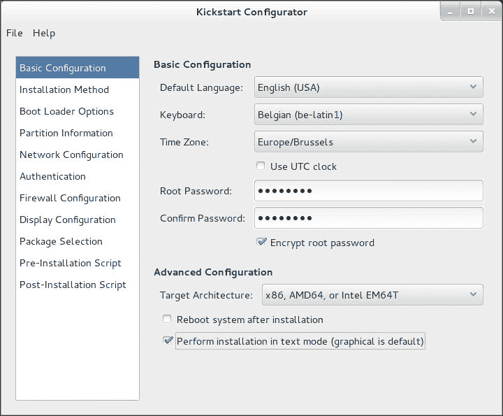

1.  现在，从 **Kickstart 配置器** GUI 中选择安装方法。

    以下截图显示了你可以在 **安装方法** 视图中设置的选项：

    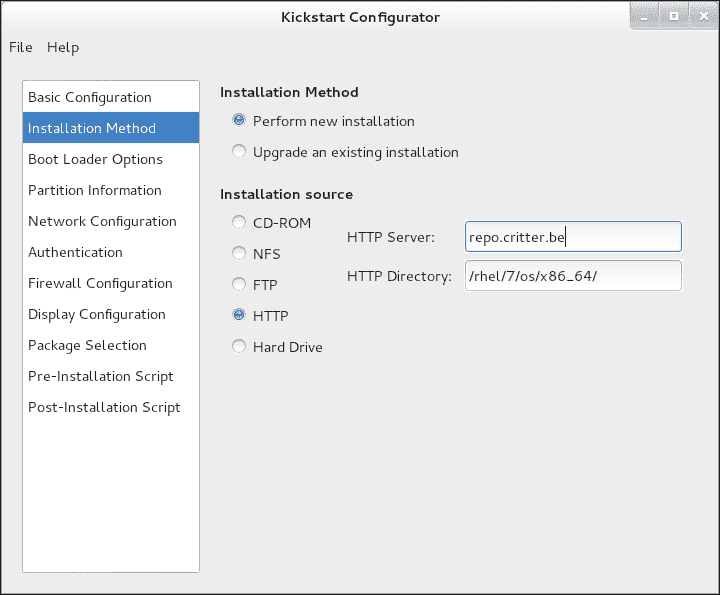

1.  接下来，将 **HTTP 服务器** 和 **HTTP 目录** 的值替换为你自己的仓库。

1.  确保为 **引导加载程序** 应用正确的设置。

    以下截图显示了你可以在 **引导加载程序选项** 视图中设置的选项：

    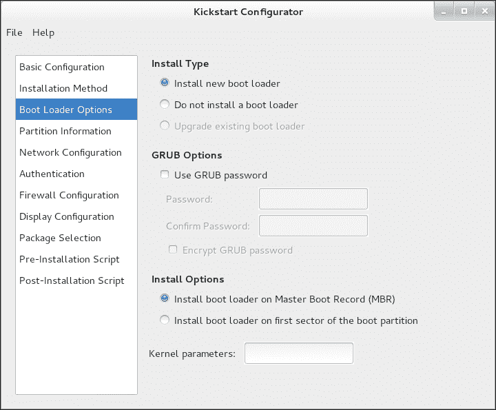

1.  配置你的磁盘和分区信息。只需创建一个 `/boot` 分区，搞定！我们将手动编辑文件以实现更好的定制。

    以下截图显示了在 **分区信息** 视图中可以设置的选项：

    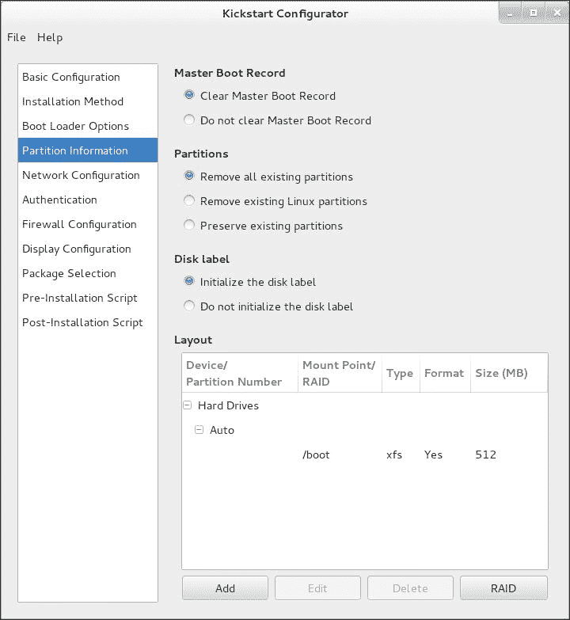

1.  配置你的网络。如果你想正确配置网络，你需要知道设备的名称。

    以下截图显示了你可以在 **网络配置** 视图中编辑的 **网络设备** 信息：

    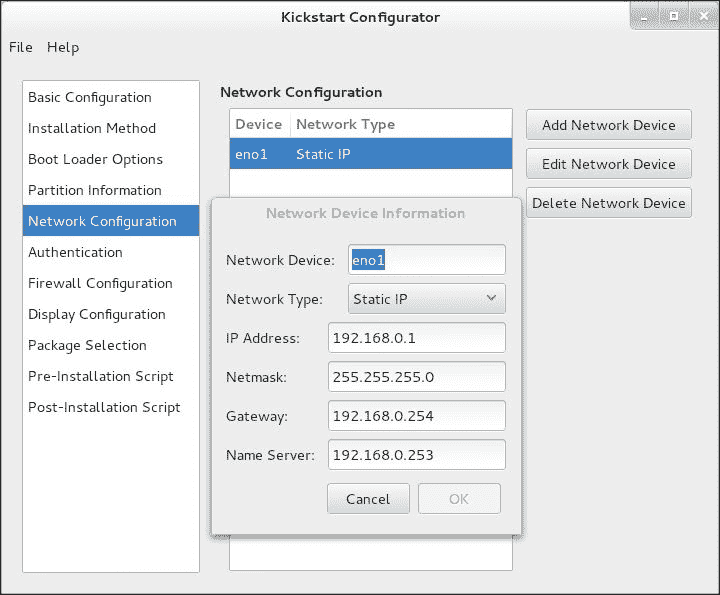

1.  现在，禁用 **安装图形环境**。

    我们希望安装尽可能少的软件包。以下截图展示了你可以在 **显示配置** 视图中设置的选项：

    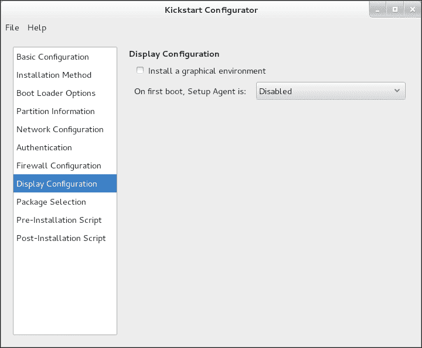

1.  接下来，执行你认为必要的任何预安装和/或后安装任务。我通常会通过 SSH 和密钥使 root 账户可访问。

    以下截图展示了你可以在 **后安装脚本** 视图中设置的选项：

    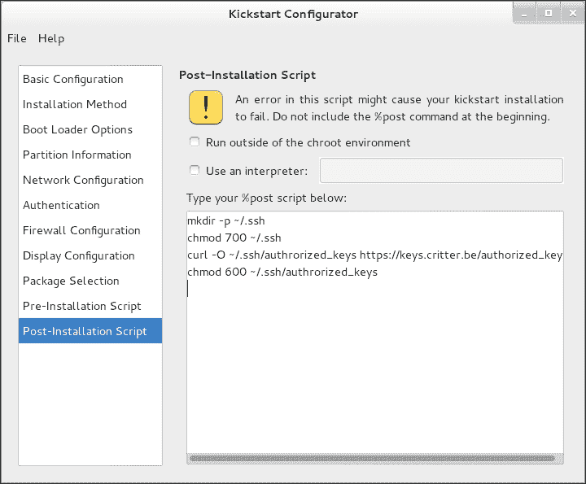

1.  保存 kickstart 文件。

1.  使用你喜欢的编辑器打开文件，并将以下内容添加到分区部分：

    ```
    part pv.01 --size=1 --ondisk=sda --grow
    volgroup vg1 pv.01
    logvol / --vgname=vg1 --size=2048 --name=root
    logvol /usr --vgname=vg1 --size=2048 --name=usr
    logvol /var --vgname=vg1 --size=2048 --name=var
    logvol /var/log --vgname=vg1 --size=1024 --name=var
    logvol /home --vgname=vg1 --size=512 --name=home
    logvol swap --vgname=vg1 --recommended --name=swap –fstype=swap
    ```

1.  现在，将以下脚本添加到你的网络行中：

    ```
    --hostname=rhel7
    ```

1.  在 `%post` 前添加以下脚本：

    ```
    %packages –nobase
    @core --nodefaults
    %end
    ```

1.  创建一个密码哈希，用于下一步，如下所示：

    ```
    ~]# openssl passwd -1 "MySuperSecretRootPassword"
    $1$mecIlXKN$6VRdaRkevjw9nngcMtRlO.

    ```

1.  保存生成的文件。你应该得到类似这样的内容：

    ```
    #platform=x86, AMD64, or Intel EM64T
    #version=DEVEL
    # Install OS instead of upgrade
    install
    # Keyboard layouts
    keyboard 'be-latin1'
    # Halt after installation
    halt
    # Root password
    rootpw --iscrypted $1$mecIlXKN$6VRdaRkevjw9nngcMtRlO.
    # System timezone
    timezone Europe/Brussels
    # Use network installation
    url –url="http://repo.example.com/rhel/7/os/x86_64/"
    # System language
    lang en_US
    # Firewall configuration
    firewall --disabled
    # Network information
    network  --bootproto=static --device=eno1 --gateway=192.168.0.254 --ip=192.168.0.1 --nameserver=192.168.0.253 --netmask=255.255.255.0 --hostname=rhel7# System authorization information
    auth  --useshadow  --passalgo=sha512
    # Use text mode install
    text
    # SELinux configuration
    selinux --enforcing
    # Do not configure the X Window System
    skipx
    # System bootloader configuration
    bootloader --location=none
    # Clear the Master Boot Record
    zerombr
    # Partition clearing information
    clearpart --all --initlabel
    # Disk partitioning information
    part /boot --fstype="xfs" --ondisk=sda --size=512
    part pv.01 --size=1 --ondisk=sda --grow
    volgroup vg1 pv.01
    logvol / --vgname=vg1 --size=2048 --name=root --fstype=xfs
    logvol /usr --vgname=vg1 --size=2048 --name=usr --fstype=xfs
    logvol /var --vgname=vg1 --size=2048 --name=var --fstype=xfs
    logvol /var/log --vgname=vg1 --size=1024 --name=var --fstype=xfs
    logvol /home --vgname=vg1 --size=512 --name=home --fstype=xfs
    logvol swap --vgname=vg1 --recommended --name=swap --fstype=swap

    %packages --nobase
    @core --nodefaults
    %end

    %post
    mkdir -p ~/.ssh
    chmod 700 ~/.ssh
    # Let's download my authorized keyfile from my key server...
    curl -O ~/.ssh/authrorized_keys https://keys.example.com/authorized_keys
    chmod 600 ~/.ssh/authrorized_keys
    %end
    ```

## 它是如何工作的……

`system-config-kickstart` 用于生成最小安装，因为任何添加都会比工具能处理的更复杂，我们需要能够在之后手动/动态地添加它们。软件包数量越少越好，因为每个安装的软件包都需要应用 bug 修复和安全更新。

虽然图形界面让我们可以配置大部分需要的选项，但我更喜欢手动调整其中一些部分，因为通过图形界面处理起来并不那么直观。

第 9 步添加必要的信息，将剩余磁盘用作 LVM 物理卷，并对其进行分区，以便 *大型* 文件系统在必要时可以轻松扩展。

SWAP 分区的 `--recommended` 参数根据 Red Hat 设置的交换大小建议创建一个交换分区。

第 10 步为你的主机添加一个主机名。如果你没有指定，系统会尝试解析 IP 地址并使用该主机名。如果无法确定主机名，它会将 `localhost.localdomain` 用作 `fqdn`。

第 11 步确保只安装核心系统，其他内容不安装，这样你可以从此基础上构建。

如果你想准确了解核心组中安装了哪些软件包，可以在 RHEL 7 系统上运行以下命令：

```
~# yum groupinfo core

```

## 还有更多……

我没有覆盖在 *准备工作* 部分中提到的一个选项，因为它会在你手动安装系统时自动生成。安装完成后，文件可以在 `/root/anaconda-ks.cfg` 找到。你可以使用此文件开始，而不是使用 `system-config-kickstart` 工具生成 kickstart 文件。

从 RHEL 7 开始，kickstart 部署支持附加组件。这些附加组件可以通过多种方式扩展标准的 kickstart 安装。要使用 kickstart 附加组件，只需像 `%pre` 和 `%post` 部分一样，添加 `%addon addon_name` 选项，后跟 `%end`。Anaconda 自带 `kdump` 附加组件，你可以在安装过程中通过在 kickstart 文件中提供以下部分来安装和配置 `kdump`：

```
%addon com_redhat_kdump --enable --reserve-mb=auto
%end
```

## 另见

有关 kickstart 文件的更多详细信息，请参考网站[`github.com/rhinstaller/pykickstart/blob/master/docs/kickstart-docs.rst`](https://github.com/rhinstaller/pykickstart/blob/master/docs/kickstart-docs.rst)。

关于一致的网络设备命名，请参考[`access.redhat.com/documentation/en-US/Red_Hat_Enterprise_Linux/7/html/Networking_Guide/ch-Consistent_Network_Device_Naming.html`](https://access.redhat.com/documentation/en-US/Red_Hat_Enterprise_Linux/7/html/Networking_Guide/ch-Consistent_Network_Device_Naming.html)。

# 使用 httpd 发布你的 kickstart 文件

你可以将 kickstart 文件保存到 USB 驱动器（或任何其他介质）中，但如果你需要在不同位置安装多个系统，这就变得有些麻烦。

在安装过程中，通过内核行从网络加载 kickstart 文件仅支持 NFS、HTTP 和 FTP。

在这个方法中，我选择了 HTTP，因为它是公司中常用的技术，且易于保证安全。

## 操作方法…

让我们先从安装 Apache `httpd`开始，步骤如下：

1.  通过以下命令安装 Apache `httpd`：

    ```
    ~]# yum install -y httpd

    ```

1.  启用并启动`httpd`守护进程，如下所示：

    ```
    ~]# systemctl enable httpd
    ln -s '/usr/lib/systemd/system/httpd.service' '/etc/systemd/system/multi-user.target.wants/httpd.service'
    ~]# systemctl start httpd

    ```

1.  通过运行以下命令创建一个目录来存放 kickstart 文件：

    ```
    ~]# mkdir -p /var/www/html/kickstart
    ~]# chown apache:apache /var/www/html/kickstart
    ~]# chmod 750 /var/www/html/kickstart

    ```

1.  将你的 kickstart 文件复制到此新位置：

    ```
    ~]# cp kickstart.ks /var/www/html/kickstart/

    ```

1.  在浏览器中，浏览到你的网站服务器上的 kickstart 目录，如下图所示：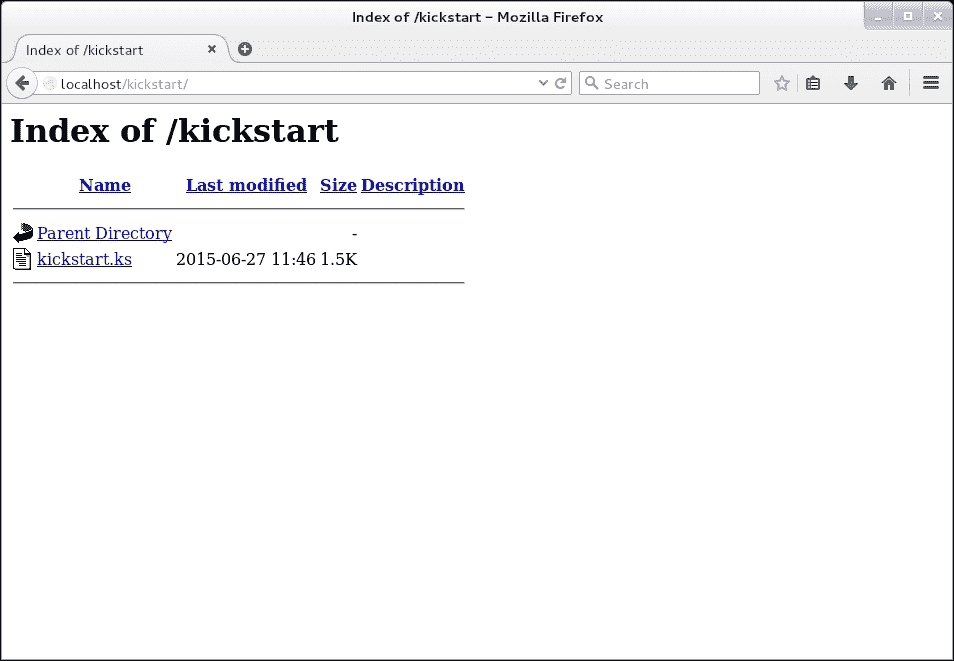

## 还有更多内容…

这样，你可以创建多个 kickstart 文件，并且它们将可以从你网络中的任何地方访问。

此外，你还可以使用 CGI-BIN、PHP 或任何其他具有 Apache 模块的技术，根据你在 URL 中指定的参数动态创建 kickstart 文件。

创建自己的动态 kickstart 文件解决方案的替代方法是 Cobbler。

## 另请参见

有关 Cobbler 的更多信息，请访问[`cobbler.github.io/`](http://cobbler.github.io/)。

# 使用 PXE 部署系统

PXE（Preboot eXecution Environment，预启动执行环境）允许你通过网络资源指示计算机启动。这样，你可以通过单一来源来控制安装服务器，而无需物理插入笨重的 DVD 或 USB 驱动器。

## 准备工作

对于此方法，你将需要一个完全可用的 RHEL 7 仓库。

## 操作方法…

使用此方法，我们将从 RHEL 7 安装介质安装并配置 PXE 引导，步骤如下：

1.  使用以下命令安装必要的软件包：

    ```
    ~]# yum install -y dnsmasq syslinux tftp-server

    ```

1.  通过编辑`/etc/dnsmasq.conf`来配置 DNSMASQ 服务器，具体如下：

    ```
    # interfaces to bind to
    interface=eno1,lo
    # the domain for this DNS server
    domain=rhel7.lan
    # DHCP lease range
    dhcp-range= eno1,192.168.0.3,192.168.0.103,255.255.255.0,1h
    # PXE – the address of the PXE server
    dhcp-boot=pxelinux.0,pxeserver,192.168.0.1
    # Gateway
    dhcp-option=3,192.168.0.254
    # DNS servers for DHCP clients(your internal DNS servers, and one of Google's DNS servers)
    dhcp-option=6,192.168.1.1, 8.8.8.8
    # DNS server to forward DNS queries to
    server=8.8.4.4
    # Broadcast Address
    dhcp-option=28,192.168.0.255
    pxe-prompt="Press F1 for menu.", 60
    pxe-service=x86_64PC, "Install RHEL 7 from network", pxelinux
    enable-tftp
    tftp-root=/var/lib/tftpboot
    ```

1.  使用以下命令启用并启动`dnsmasq`：

    ```
    ~]# systemctl enable dnsmasq
    ~]# systemctl start dnsmasq

    ```

1.  现在，通过运行以下命令启用并启动`xinet`守护进程：

    ```
    ~]# systemctl enable xinetd
    ~]# systemctl start xinetd

    ```

1.  启用`tftp`服务器的`xinet`守护进程，如下所示：

    ```
    ~]# sed -i '/disable/ s/yes/no/' /etc/xinetd.d/tftp

    ```

1.  通过执行以下命令，将`syslinux`引导加载程序复制到`tftp`服务器的引导目录：

    ```
    ~]# cp -r /usr/share/syslinux/* /var/lib/tftpboot

    ```

1.  接下来，使用以下命令创建 PXE 配置目录：

    ```
    ~]# mkdir /var/lib/tftpboot/pxelinux.cfg

    ```

1.  然后，创建 PXE 配置文件，路径如下：`/var/lib/tftpboot/pxelinux.cfg/default`。

    ```
    default menu.c32
    prompt 0
    timeout 300
    ONTIMEOUT local
    menu title PXE Boot Menu
    label 1
      menu label ¹ - Install RHEL 7 x64 with Local http Repo
      kernel rhel7/vmlinuz
      append initrd=rhel7/initrd.img method=http://repo.critter.be/rhel/7/os/x86_64/ devfs=nomount ks=http://kickstart.critter.be/kickstart.ks
    label 2
      menu label ² - Boot from local media
    ```

1.  将 `initrd` 和 `kernel` 从 RHEL 7 安装介质复制到 `/var/lib/tftpboot/rhel7/`，并运行以下命令：

    ```
    ~]# mkdir /var/lib/tftpboot/rhel7
    ~]# mount -o loop /dev/cdrom /mnt
    ~]# cp /mnt/images/pxeboot/{initrd.img,vmlinuz} /var/lib/tftpboot/rhel7/
    ~]# umount /mnt

    ```

1.  使用以下命令打开服务器上的防火墙（但这可能不是必需的）：

    ```
    ~]# firewall-cmd --add-service=dns --permanent
    ~]# firewall-cmd --add-service=dhcp --permanent
    ~]# firewall-cmd --add-service=tftp --permanent
    ~]# firewall-cmd --reload

    ```

1.  最后，启动客户端，配置其从网络引导，并选择下图中显示的第一个选项：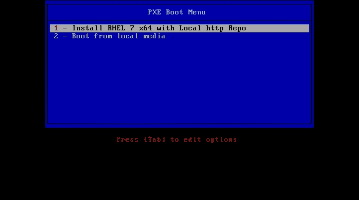

## 它是如何工作的…

DNSMASQ 通过在 `dnsmasq` 配置文件中提供 `enable-tftp` 选项，负责将启动系统指向 `tftp` 服务器。

需要 Syslinux 提供必要的二进制文件，以便通过网络启动。

`tftp` 服务器本身提供对 `syslinux` 文件、RHEL 7 内核和 `initrd` 的访问，以便系统从中引导。

PXE 配置文件提供必要的配置来启动系统，包括一个 kickstart 文件，自动安装你的系统。

## 还有更多内容…

本教程的基本前提是你没有安装 DHCP 服务器。在大多数公司，通常已经有 DHCP 服务。

如果你有 ISC-DHCP 服务器，那么这是你需要添加到想要允许 PXE 启动的子网定义中的内容：

```
  next-server <ip address of TFTP server>;
  filename "pxelinux.0";
```

## 另见

查看第八章，*Yum 和仓库*，以从安装介质设置 RHEL 7 仓库。

# 使用自定义引导 ISO 文件部署系统

PXE 是一种广泛使用的系统部署方式，ISO 也不例外。由于安全性、硬件可用性等原因，PXE 可能并不总是可用的。

许多硬件厂商提供远程访问其未安装操作系统的系统。HP 提供 iLO，Dell 提供 RIB。这些“远程”控制解决方案的优点是，它们还允许你以 ISO 的形式挂载“虚拟”媒体。

## 如何操作…

Red Hat 提供引导介质作为 ISO 映像，你可以使用它们来启动你的系统。我们将创建一个自定义 ISO 映像，这样可以以类似的方式引导系统。

让我们创建一个 ISO，你可以将其挂载为虚拟媒体，写入 CD-ROM，或通过以下步骤使用 `dd` 将其内容写入 USB 闪存盘/硬盘：

1.  安装创建 ISO9660 映像所需的包，如下所示：

    ```
    ~]# yum install -y genisoimage

    ```

1.  通过执行以下命令挂载 RHEL 7 DVD 的 ISO 映像：

    ```
    ~]# mount -o loop /path/to/rhel-server-7.0-x86_64-dvd.iso /mnt

    ```

1.  通过以下命令从 RHEL 7 安装介质复制所需文件以创建自定义 ISO：

    ```
    ~]# mkdir -p /root/iso
    ~]# cp -r /mnt/isolinux /root/iso
    ~]# umount /mnt

    ```

1.  现在，通过运行以下命令卸载 RHEL 7 DVD 的 ISO 映像：

    ```
    ~]# umount /mnt

    ```

1.  接下来，使用以下命令删除 `isolinux.cfg` 文件：

    ```
    ~]# rm -f /root/iso/isolinux/isolinux.cfg

    ```

1.  创建一个新的 `isolinux.cfg` 文件，如下所示：

    ```
    default vesamenu.c32
    timeout 600
    display boot.msg
    menu clear
    menu background splash.png
    menu title Red Hat Enterprise Linux 7.0
    menu vshift 8
    menu rows 18
    menu margin 8
    menu helpmsgrow 15
    menu tabmsgrow 13
    menu color sel 0 #ffffffff #00000000 none
    menu color title 0 #ffcc000000 #00000000 none
    menu color tabmsg 0 #84cc0000 #00000000 none
    menu color hotsel 0 #84cc0000 #00000000 none
    menu color hotkey 0 #ffffffff #00000000 none
    menu color cmdmark 0 #84b8ffff #00000000 none
    menu color cmdline 0 #ffffffff #00000000 none
    label linux
      menu label ^Install Red Hat Enterprise Linux 7.0
      kernel vmlinuz
      append initrd=initrd.img ks=http://kickstart.critter.be/kickstart.ks text

    label local
      menu label Boot from ^local drive
      localboot 0xffff

    menu end
    ```

1.  现在，通过执行以下命令创建 ISO：

    ```
    ~]# cd /root/iso
    ~/iso]# mkisofs -o ../boot.iso -b isolinux/isolinux.bin -c isolinux/boot.cat -no-emul-boot -boot-load-size 4 -boot-info-table -J -r .

    ```

    有关 `mkisofs` 命令所用选项的更多信息，可以在 *mkisofs(1)* 的手册页中找到。

    以下图像显示了创建自定义 ISO 的进度：

    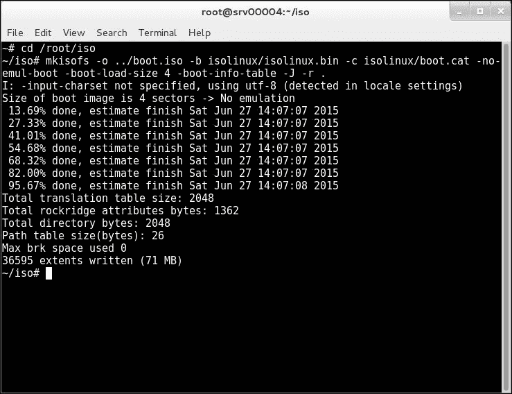

1.  然后，使用 ISO 在 KVM 服务器上安装来宾操作系统，如下所示：

    ```
    ~]# virsh vol-create-as --pool localfs-vm --name rhel7_guest-da.qcows2 --format qcows2 –capacity 10G
    ~]# virt-install \
    --hvm \
    --name rhel7_guest \
    –-memory 2G,maxmemory=4G \
    --vcpus 2,max=4 \
    --os-type linux \
    --os-variant rhel7 \
    --boot hd,cdrom,network,menu=on \
    --controller type=scsi,model=virtio-scsi \
    --disk device=cdrom,vol=iso/boot.iso,readonly=on,bus=scsi \
    --disk device=disk,vol=localfs-vm/rhel7_guest-vda.qcow2,cache=none,bus=scsi \
    --network network=bridge-eth0,model=virtio \
    --graphics vnc \
    --graphics spice \
    --noautoconsole \
    --memballoon virtio

    ```

    以下截图显示了使用自定义 ISO 镜像启动后的控制台：

    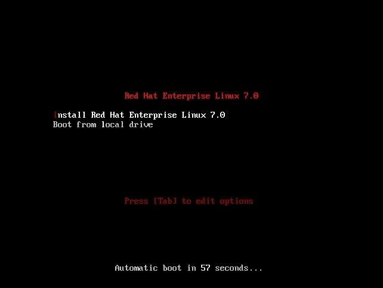

## 它是如何工作的……

使用 RHEL 7 安装介质，我们创建了一个新的启动 ISO，使我们能够安装新的系统。该 ISO 可以用来烧录 CD，使用`dd`工具复制到 USB 闪存驱动器，或者作为虚拟介质挂载。将此 ISO 作为虚拟介质挂载的方法在不同硬件平台上有所不同，因此本教程展示了如何使用 KVM 进行安装。
