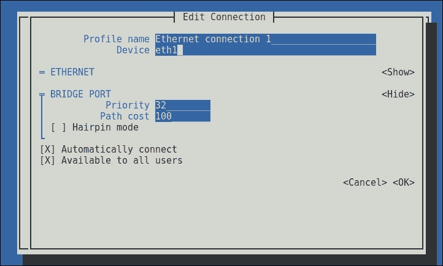

# 第三章. 配置你的网络

本章我们将涵盖以下配方：

+   创建 VLAN 接口

+   创建一个聚合接口

+   创建一个桥接

+   配置 IPv4 设置

+   配置你的 DNS 解析器

+   配置静态网络路由

# 介绍

本章将尝试解释如何使用 `NetworkManager`，它是 RHEL 7 中的默认网络配置工具和守护进程。这是一组工具，可以简化和直接地进行网络配置。

配置你的网络有时可能很困难，尤其是当你使用较为复杂的配置选项并结合著名的配置脚本时。`NetworkManager` 允许你轻松配置网络，而无需手动编辑配置文件。

### 提示

你仍然可以使用你喜欢的编辑器编辑位于 `/etc/sysconfig/network-scripts` 的网络配置文件；然而，默认情况下，`NetworkManager` 不会察觉你所做的任何更改。你需要在编辑完这些文件后执行以下命令：

```
~]# nmcli connection reload

```

这还不足以立即应用更改。你需要关闭并重新启动连接，或者重启系统。

另外，你可以编辑 `/etc/NetworkManager/NetworkManager.conf` 并在 `[main]` 部分添加 `monitor-connection-files=yes`。这将导致 `NetworkManager` 立即应用这些更改。

在这些配方中，你将了解如何使用 `NetworkManager` 工具（`nmcli` 和 `nmtui`）以及 Kickstart 文件来配置你的网络。

# 创建 VLAN 接口

VLAN 是在单个物理网络上运行的隔离广播域。它们允许你将本地网络分段，并且可以将 LAN 跨多个物理位置“扩展”。大多数企业在其网络交换环境中实现了这一点，但在某些情况下，标记的 VLAN 会到达你的服务器。

## 准备就绪

为了配置 VLAN，我们需要在本地网络接口上建立一个已连接的网络。

## 如何操作…

为了方便起见，我们的物理网络接口命名为 `eth0`。VLAN 的 ID 为 1，IPv4 地址为 `10.0.0.2`，子网掩码为 `255.0.0.0`，默认网关为 `10.0.0.1`。

### 使用 `nmcli` 创建 VLAN 连接

使用 `nmcli`，我们需要先创建连接，然后激活它。请执行以下步骤：

1.  使用以下命令创建 VLAN 接口：

    ```
    ~]# nmcli connection add type vlan dev eth0 id 1 ip4 10.0.0.2/8 gw4 10.0.0.1
    Connection 'vlan' (4473572d-26c0-49b8-a1a4-c20b485dad0d) successfully added.
    ~]#

    ```

1.  现在，通过此命令激活连接：

    ```
    ~]# nmcli connection up vlan
    Connection successfully activated (D-Bus active path: /org/freedesktop/NetworkManager/ActiveConnection/7)
    ~]#

    ```

1.  检查你的网络连接，如下所示：

    ```
    ~]# nmcli connection show
    ~]# nmcli device status
    ~]# nmcli device show eth0.1

    ```

    这是前述命令的示例输出：

    

### 使用 `nmtui` 创建 VLAN 连接

`nmtui` 工具是一个文本用户界面，用于操作 `NetworkManager`，可以通过在终端中执行以下命令启动：

```
~]# nmtui

```

这将打开以下基于文本的界面：


导航通过使用*Tab*键和箭头键来完成，选择则通过按*Enter*键来进行。现在，你需要做以下操作：

1.  转到**编辑连接**并选择**<OK>**。以下屏幕将会显示：

1.  接下来，选择**<Add>**并选择**VLAN**选项。确认选择**<Create>**：

1.  在以下表单中输入所请求的信息，并通过选择**<OK>**提交：

你的新**VLAN**接口现在将显示在连接列表中：


### 使用 kickstart 创建 VLAN 连接

让我们探索一下你需要在 `kickstart` 脚本中添加哪些内容，以便实现与前面章节相同的结果：

1.  使用以下命令在你的 `kickstart` 文件中查找配置参数：

    ```
    ...
    network --device=eth0
    ...
    ```

1.  用以下配置参数替换它：

    ```
    network --device=eth0 --vlanid=1 --bootproto=static --ip=10.0.0.2 --netmask=255.0.0.0 --gateway=10.0.0.1
    ```

## 还有更多……

使用 `nmcli` 创建 VLAN 的命令行非常基础，它会为缺失的每项信息使用默认值。为了确保所有内容都按你的要求创建，最好使用 `con-name` 和 `ifname`。这两个选项分别用于命名你的连接和你正在创建的设备。请看以下命令：

```
~]# nmcli connection add type vlan con-name vlan1 ifname eth0.1 dev eth0 id 1 ip4 10.0.0.2/8 gw4 10.0.0.1

```

这将创建 `vlan.1` 连接，`eth0` 作为父接口，`eth0.1` 作为目标设备。

和 `nmcli` 和 `nmtui` 一样，你可以在 `kickstart` 中为你的 VLAN 连接命名；只需要指定 `--interfacename` 选项。如果在你的 `kickstart` 文件中找不到任何之前的网络配置，只需将代码添加到你的 `kickstart` 文件中。

## 另见

`nmcli` 工具没有 man 页面，但可以执行以下命令以获得更多选项来创建 VLAN 连接：

```
~]# nmcli con add help

```

获取更多关于网络的 `kickstart` 信息，请查看以下网址：[`access.redhat.com/documentation/en-US/Red_Hat_Enterprise_Linux/7/html/Installation_Guide/sect-kickstart-syntax.html`](https://access.redhat.com/documentation/en-US/Red_Hat_Enterprise_Linux/7/html/Installation_Guide/sect-kickstart-syntax.html)。

# 创建一个团队接口

接口团队、接口绑定和链路聚合都是相同的。它已经通过 `bonding` 驱动程序在内核中实现。团队驱动程序提供了一种与绑定不同的机制，将多个网络接口合并为一个逻辑接口。

## 准备工作

要设置团队接口，我们需要多个网络接口。

## 如何操作…

为了简便起见，我们的物理网络接口分别称为 `eth1` 和 `eth2`。团队接口的 IPv4 地址为 `10.0.0.2`，子网掩码为 `255.0.0.0`，默认网关为 `10.0.0.1`。

### 使用 `nmcli` 创建团队接口

使用这种方法，我们需要创建团队连接和两个团队从接口，并激活该连接，具体步骤如下：

1.  使用以下命令行创建团队连接：

    ```
    ~]# nmcli connection add type team ip4 10.0.0.2/8 gw4 10.0.0.1
    Connection 'team' (cfa46865-deb0-49f2-9156-4ca5461971b4) successfully added.
    ~]#

    ```

1.  通过执行以下命令将 `eth1` 添加到团队中：

    ```
    ~]# nmcli connection add type team-slave ifname eth1 master team
    Connection 'team-slave-eth1' (01880e55-f9a5-477b-b194-73278ef3dce5) successfully added.
    ~]#

    ```

1.  现在，通过运行以下命令将 `eth2` 添加到团队中：

    ```
    ~]# nmcli connection add type team-slave ifname eth2 master team
    Connection 'team-slave-eth2' (f9efd19a-905f-4538-939c-3ea7516c3567) successfully added.
    ~]#

    ```

1.  按如下方式启用团队接口：

    ```
    ~]# nmcli connection up team
    Connection successfully activated (master waiting for slaves) (D-Bus active path: /org/freedesktop/NetworkManager/ActiveConnection/12)
    ~]#

    ```

1.  最后，通过以下命令检查您的网络连接：

    ```
    ~]# nmcli connection show
    ~]# nmcli device status
    ~]# nmcli device show nm-team

    ```

    以下是前面命令的示例输出：

    

### 使用 nmtui 创建聚合接口

让我们启动 `nmtui` 并通过以下步骤添加连接：

1.  首先，通过选择 **<Add>** 创建团队连接：

1.  在以下表单中输入所需的信息，并对每个接口点击 **<Add>** 以添加：

1.  接下来，在团队从属项中选择 **<Add>** 添加接口，填写表单并选择 **<OK>**。对每个物理接口重复此操作：

1.  现在，选择 **<OK>** 创建团队接口：

    您的新团队接口现在将在连接列表中列出，如下所示的截图所示：

    

### 使用 kickstart 创建聚合接口

使用您喜欢的编辑器打开 `kickstart` 文件，并执行以下步骤：

1.  通过运行以下命令，在您的 `kickstart` 文件中查找网络配置参数：

    ```
    ...
    network --device=eth0
    ...
    ```

1.  接下来，添加以下配置参数：

    ```
    network --device=team0 --teamslaves="eth1,eth2" --bootproto=static --ip=10.0.0.2 --netmask=255.0.0.0 --gateway=10.0.0.1
    ```

## 还有更多…

团队化包含运行器——一种负载共享备份方法，您可以将其分配给团队：

+   **active-backup**：在此模式中，使用一个物理接口，其他接口保持为备份

+   **broadcast**：在此模式中，数据通过所有物理接口的选择器进行传输

+   **LACP**：实现 `802.3ad` 链路聚合控制协议

+   **loadbalance**：执行主动的 Tx 负载均衡，并使用基于 BPF 的 Tx 端口

+   **round-robin**：数据依次通过所有物理接口传输

这些也可以在创建时通过这里提供的任一选项进行定义：

### nmcli

将 `team.config "{\"runner\":{\"name\": \"activebackup\"}}"` 添加到您的命令中以创建团队接口，并将 `activebackup` 替换为您希望使用的运行器。

### nmtui

填写团队接口的 JSON 配置字段 `{"runner": {"name": "activebackup"}}`，并将 `activebackup` 替换为您希望使用的运行器。


### kickstart

将 `--teamconfig="{\"runner\":{\"name\": \"activebackup\"}}"` 添加到您的团队设备行中，并将 `activebackup` 替换为您希望使用的运行器。

使用 `nmcli` 创建团队接口时，提供的选项是基础的。如果您希望添加连接和接口名称，可以分别使用 `con-name` 和 `ifname`，如下所示：

```
~]# nmcli connection add type team con-name team0 ifname team0 ip4 10.0.0.2/8 gw4 10.0.0.1
Connection 'team0' (e1856313-ecd4-420e-96d5-c76bc00794aa) successfully added.
~]#

```

添加团队从属设备时也需要类似的操作，唯一不同的是需要指定正确的接口名`ifname`：

```
~# nmcli connection add type team-slave con-name team0-slave0 ifname eth1 master team0
Connection 'team0-slave0' (3cb2f603-1f73-41a0-b476-7a356d4b6274) successfully added.
~# nmcli connection add type team-slave con-name team0-slave1 ifname eth2 master team0
Connection 'team0-slave1' (074e4dd3-8a3a-4997-b444-a781114c58c9) successfully added.
~#

```

## 另请参见

如需了解有关网络团队守护进程和“运行器”的更多信息，请参考以下网址：

[`access.redhat.com/documentation/en-US/Red_Hat_Enterprise_Linux/7/html/Networking_Guide/sec-Understanding_the_Network_Teaming_Daemon_and_the_Runners.html`](https://access.redhat.com/documentation/en-US/Red_Hat_Enterprise_Linux/7/html/Networking_Guide/sec-Understanding_the_Network_Teaming_Daemon_and_the_Runners.html)

如需了解更多关于使用`nmcli`创建团队接口的信息，请查看以下链接：

[`access.redhat.com/documentation/en-US/Red_Hat_Enterprise_Linux/7/html/Networking_Guide/sec-Configure_a_Network_Team_Using-the_Command_Line.html`](https://access.redhat.com/documentation/en-US/Red_Hat_Enterprise_Linux/7/html/Networking_Guide/sec-Configure_a_Network_Team_Using-the_Command_Line.html)

如需了解更多使用`nmtui`创建团队接口的信息，请访问以下链接：

[`access.redhat.com/documentation/en-US/Red_Hat_Enterprise_Linux/7/html/Networking_Guide/sec-Configure_a_Network_Team_Using_the_Text_User_Interface_nmtui.html`](https://access.redhat.com/documentation/en-US/Red_Hat_Enterprise_Linux/7/html/Networking_Guide/sec-Configure_a_Network_Team_Using_the_Text_User_Interface_nmtui.html)

有关在 kickstart 脚本中创建团队接口的更多信息，请参考以下链接：

[`access.redhat.com/documentation/en-US/Red_Hat_Enterprise_Linux/7/html/Installation_Guide/sect-kickstart-syntax.html`](https://access.redhat.com/documentation/en-US/Red_Hat_Enterprise_Linux/7/html/Installation_Guide/sect-kickstart-syntax.html)

# 创建桥接

网络桥接是一个逻辑设备，它根据 MAC 地址在连接的物理接口之间转发流量。这种桥接可以在虚拟化应用程序（如 KVM）中用来模拟硬件桥接，从而使多个虚拟网络接口共享网卡。

## 准备就绪

要桥接两个物理网络，我们需要两个网络接口。你的物理接口不应配置任何地址，因为桥接将配置 IP 地址。

## 如何做…

为了简便起见，我们将桥接的物理网络接口为`eth1`和`eth2`。IPv4 地址为`10.0.0.2`，子网掩码为`255.0.0.0`，默认网关为`10.0.0.1`。

### 使用 nmcli 创建桥接

配置桥接和接口后，确保激活桥接！以下是需要执行的步骤：

1.  首先，使用以下命令创建桥接连接：

    ```
    ~]# nmcli connection add type bridge ip4 10.0.0.2/8 gw4 10.0.0.1
    Connection 'bridge' (36e40910-cf6a-4a6c-ae28-c0d6fb90954d) successfully added.
    ~]#

    ```

1.  将`eth1`添加到桥接中，如下所示：

    ```
    ~]# nmcli connection add type bridge-slave ifname eth1 master bridge
    Connection 'bridge-slave-eth1' (6821a067-f25c-46f6-89d4-a318fc4db683) successfully added.
    ~]#

    ```

1.  接下来，使用以下命令将`eth2`添加到桥接中：

    ```
    ~]# nmcli connection add type bridge-slave ifname eth2 master bridge
    Connection 'bridge-slave-eth2' (f20d0a7b-da03-4338-8060-07a3775772f4) successfully added.
    ~]#

    ```

1.  通过执行以下命令来激活桥接：

    ```
    ~# nmcli connection up bridge
    Connection successfully activated (master waiting for slaves) (D-Bus active path: /org/freedesktop/NetworkManager/ActiveConnection/30)
    ~]#

    ```

1.  现在，通过运行以下命令检查你的网络连接：

    ```
    ~]# nmcli connection show
    ~]# nmcli device status
    ~]# nmcli device show bridge

    ```

    以下是前面命令的示例输出：

    

### 使用 nmtui 创建桥接

启动`nmtui`并选择**Edit a connection**。接下来，按照这些步骤使用`nmtui`创建桥接：

1.  通过从连接列表中选择**<Add>**和**Bridge**，然后点击**<Create>**来创建桥接连接：

1.  填写所呈现的表单并提供所需的信息：

1.  接下来，通过选择**<Add>**并为每个接口提供所需的信息，添加两个网络接口：

1.  最后，选择**<OK>**来创建桥接：

现在，您的新桥接将显示在连接列表中：


### 使用 kickstart 创建桥接

通过以下步骤使用您喜欢的编辑器编辑`kickstart`文件：

1.  使用以下命令行查找`kickstart`文件中的配置参数：

    ```
    ...
    network --device=eth0
    ...
    ```

1.  现在，添加以下配置参数：

    ```
    network --device=bridge0 --bridgeslaves="eth1,eth2" --bootproto=static --ip=10.0.0.2 --netmask=255.0.0.0 --gateway=10.0.0.1
    ```

## 还有更多……

使用`nmcli`创建桥接时，所提供的选项非常简单。如果您希望添加连接和接口名称，可以分别使用`con-name`和`ifname`，如以下方式：

```
~# nmcli connection add type bridge con-name bridge0 ifname bridge0 ip4 10.0.0.2/8 gw4 10.0.0.1
Connection 'bridge0' (d04180be-3e80-4bd4-a0fe-b26d79d71c7d) successfully added.
~#

```

添加桥接从属接口时也是一样的，唯一不同的是需要使用`ifname`来指定正确的接口：

```
~]# nmcli connection add type bridge-slave con-name bridge0-slave0 ifname eth1 master bridge0
Connection 'bridge0-slave0' (3a885ca5-6ffb-42a3-9044-83c6142f1967) successfully added.
~]# nmcli connection add type team-slave con-name team0-slave1 ifname eth2 master team0
Connection 'bridge0-slave1' (f79716f1-7b7f-4462-87d9-6801eee1952f) successfully added.
~]#

```

## 另请参见

有关使用`nmcli`创建网络桥接的更多信息，请访问以下 URL：

[`access.redhat.com/documentation/en-US/Red_Hat_Enterprise_Linux/7/html/Networking_Guide/sec-Network_Bridging_Using_the_NetworkManager_Command_Line_Tool_nmcli.html`](https://access.redhat.com/documentation/en-US/Red_Hat_Enterprise_Linux/7/html/Networking_Guide/sec-Network_Bridging_Using_the_NetworkManager_Command_Line_Tool_nmcli.html)

有关使用`nmtui`创建网络桥接的更多信息，请访问以下网站：

[`access.redhat.com/documentation/en-US/Red_Hat_Enterprise_Linux/7/html/Networking_Guide/ch-Configure_Network_Bridging.html`](https://access.redhat.com/documentation/en-US/Red_Hat_Enterprise_Linux/7/html/Networking_Guide/ch-Configure_Network_Briding.html)

有关 kickstart 和桥接的更多信息，请访问以下网站：

[`access.redhat.com/documentation/en-US/Red_Hat_Enterprise_Linux/7/html/Installation_Guide/sect-kickstart-syntax.html`](https://access.redhat.com/documentation/en-US/Red_Hat_Enterprise_Linux/7/html/Installation_Guide/sect-kickstart-syntax.html)

# 配置 IPv4 设置

在旧的`ifcfg`样式文件中更改 IP 地址非常直接，使用`NetworkManager`工具时也很简单。

由于 kickstart 仅用于设置系统，因此在本教程中不涉及深入讨论此问题。

## 如何操作…

现在，让我们将当前`eth1`的 IPv4 地址和网关更改为`10.0.0.3`/`8`，并将默认网关设置为`10.0.0.2`。

### 使用 nmcli 设置 IPv4 配置

执行以下步骤：

1.  通过执行以下命令行设置 ipv4 信息：

    ```
    ~]# nmcli connection modify eth0 ipv4.addresses 10.0.0.3/8 ipv4.gateway 10.0.0.2

    ```

1.  现在，运行以下命令来验证信息：

    ```
    ~]# nmcli connection show eth0

    ```

    这是前述命令的示例输出：

    

### 使用 nmtui 设置您的 IPv4 配置

`nmtui`工具需要更多工作，但最终结果仍然相同。执行以下步骤：

1.  启动`nmtui`，选择要修改的接口，然后单击**<编辑...>**：

1.  现在，根据您的喜好修改 IPv4 配置，然后单击**<OK>**。

## 还有更多...

管理 IPv6 IP 地址与配置 IPv4 对应项一样简单。

您需要在 kickstart 中使用的选项来设置您的 IP 地址和网关是：

+   `--ip`：用于设置系统的 IPv4 地址

+   `--netmask`：用于子网掩码

+   `--gateway`：用于设置 IPv4 网关

# 配置您的 DNS 解析器

DNS 服务器存储在`/etc/resolv.conf`中。您也可以使用`NetworkManager`管理此文件。

与之前的配方一样，出于同样的原因，本配方不会涉及`kickstart`选项。

## 如何做...

让我们将`eth1`的 DNS 解析器设置为指向 Google 的公共 DNS 服务器：`8.8.8.8`和`8.8.4.4`。

### 使用 nmcli 设置您的 DNS 解析器

执行以下步骤：

1.  通过以下命令设置 DNS 服务器：

    ```
    ~]# nmcli connection modify System\ eth1 ipv4.dns "8.8.8.8,8.8.4.4"

    ```

1.  现在，使用以下命令检查您的配置：

    ```
    ~]# nmcli connection show System\ eth1

    ```

    这是前述命令的示例输出：

    

### 使用 nmtui 设置您的 DNS 解析器

使用`nmtui`工具需要更多工作来设置 DNS 解析器，如下所示：

1.  启动`nmtui`，选择要修改的接口，然后单击**<编辑...>**：

## 还有更多...

`nmcli`工具支持通过分号分隔添加多个 DNS 服务器。使用空值（`""`）将删除此连接的所有 DNS 服务器。

类似地，您可以为您的环境设置 DNS 搜索域。使用`nmcli`时，您需要指定`ipv4.dns-search`属性。

Kickstart 允许您使用`--nameserver`选项为每个 DNS 服务器指定 DNS 服务器。如果您不希望指定任何 DNS 服务器，请使用`--nodns`。不幸的是，没有原生方法可以使用`kickstart`设置 DNS 域搜索。您将不得不在`kickstart`脚本的`%post`部分中使用`nmcli`，例如。

### 提示

在为多个网络接口设置 DNS 配置时要小心。`NetworkManager`将所有名称服务器添加到您的`resolv.conf`文件中，但 libc 可能不支持超过六个名称服务器。

# 配置静态网络路由

在某些情况下，需要在系统上设置静态路由。由于静态路由在`kickstart`中不受原生支持，因此本配方不涵盖此内容。

## 如何做...

通过`10.0.0.1`添加静态路由到`192.168.0.0`/`24`和`192.168.1.0`/`24`网络。

### 使用 nmcli 配置静态网络路由

以下是你需要做的：

1.  使用以下命令设置路由：

    ```
    ~]# nmcli connection modify eth0 ipv4.routes "192.168.0.0/24 10.0.0.1,192.168.1.0/24 10.0.0.1"

    ```

1.  现在，执行以下命令行来验证配置：

    ```
    ~]# nmcli connection show eth0

    ```

    下面是前述命令的示例输出：

    

### 使用 nmtui 配置网络路由

以下是此过程的步骤：

1.  启动`nmtui`，选择你希望修改静态路由的接口，然后点击**<编辑...>**：

1.  现在，选择**<编辑...>**，位于**IPv4 配置 - 路由**条目旁边，输入你的路由信息。选择**<确定>**确认：

1.  最后，点击**<确定>**以确认更改并保存。
