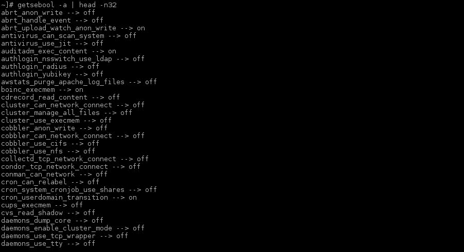

# 第五章 使用 SELinux

本章介绍的配方概览：

+   更改文件上下文

+   配置 SELinux 布尔值

+   配置 SELinux 端口定义

+   排错 SELinux

+   创建 SELinux 策略

+   应用 SELinux 策略

# 简介

SELinux 是一个 Linux 内核模块，支持 **强制访问控制**（MAC）安全策略。Red Hat 对 SELinux 的实现将 **基于角色的访问控制**（**RBAC**）与 **类型强制**（**TE**）相结合。可选地，**多级安全**（**MLS**）也可以使用，但它并不广泛应用，因为它实现的策略比默认的 Red Hat SELinux 策略少。

SELinux 在 RHEL 7 中默认启用，并且支持所有由 Red Hat 打包的软件。

本章中的配方不仅会为您提供一个坚实的基础，以便排查 SELinux 问题并解决它们，还将带您一窥如何创建您自己的 SELinux 策略。

# 更改文件上下文

文件和进程会被标记上 SELinux 上下文，其中包含有关 SELinux 用户、角色类型和级别的附加信息。这些信息由 SELinux 内核模块提供，用于做出访问控制决策。

SELinux 用户是一个在 SELinux 策略中已知的唯一身份，并且被授权担任多个角色。

如前所述，SELinux 角色是 SELinux 用户的属性，并且是 RBAC SELinux 策略的一部分。SELinux 角色被授权用于 SELinux 域。

SELinux 类型定义了文件的类型和进程的域。SELinux 策略定义了类型与其他文件和进程之间的访问。默认情况下，如果 SELinux 策略中没有特定规则，访问会被拒绝。

SELinux 级别仅在 SELinux 类型设置为 MLS 时使用，且应避免在除服务器之外的任何设备上使用。这套策略不覆盖与默认 Red Hat SELinux 策略中定义的相同的域。SELinux 级别是 MLS 和 **多类别安全**（**MCS**）的属性。

## 准备工作

系统上的所有文件和进程都被标记上用于表示安全相关信息的标签，这些信息被称为 SELinux 上下文。要查看文件（和目录）的上下文，请执行以下命令：

```
~# ls -Z
-rw-r--r--. root root unconfined_u:object_r:admin_home_t:s0 file
~#

```

## 如何操作……

您可以暂时更改文件（或多个文件）的上下文，也可以永久更改它们的上下文。第一个选项允许在需要确定更改上下文是否解决问题时进行轻松排错。持久性更改通常用于当您的应用程序引用不在标准位置的数据时——例如，如果您的 Web 服务器从 `/srv/www` 提供数据。

### 临时上下文更改

临时 SELinux 上下文更改将在文件或文件所在的文件系统重新标记时失效。

要更改文件的 SELinux 用户，请执行以下命令：

```
~# chcon --user <SELinux user> <filename>

```

要更改文件的 SELinux 角色，请执行以下命令：

```
~# chcon --role <SELinux role> <filename>

```

要更改文件的 SELinux 类型，请执行以下命令：

```
~# chcon --type <SELinux typs> <filename>

```

### 持久文件上下文更改

改变应用程序数据位置不会自动修改 SELinux 上下文，以允许你的应用程序访问这些数据。

要永久重新标记文件或目录，请执行以下操作：

1.  通过此命令更改文件或目录的 SELinux 用户：

    ```
    ~# semanage fcontext -a --seuser <SELinux user> <filename|dirname>

    ```

1.  通过运行以下命令更改文件或目录的 SELinux 类型：

    ```
    ~# semanage fcontext -a --type <SELinux type> <filename|dirname>

    ```

1.  使用此命令行并应用指令到 `files/directories`：

    ```
    ~# restorecon <filename|dirname>

    ```

## 还有更多内容…

要显示所有可用的 SELinux 用户，请执行以下命令：

```
~# semanage user -l

```


或者，你可以安装 `setools-console` 包并运行以下命令：

```
~# seinfo -u

```


要显示所有可用的 SELinux 类型，请安装 `setools-console` 包并运行以下命令：

```
~# seinfo -t

```


要显示可用的 SELinux 角色，请安装 `setools-console` 包并运行以下命令：

```
~# seinfo -r

```


`semanage` 工具没有包含所有文件递归操作的选项，但有一种解决方法。你指定的文件名或目录名实际上是一个正则表达式过滤器。例如，如果你想递归包含 `/srv/www` 中的所有文件，你可以指定 `"/srv/www(/.*)?"`。

### 提示

目前，无法通过 `semanage` 更改 SELinux 角色。解决方法是通过 `semanage` 更改 SELinux 用户或类型，然后进行编辑，方法如下：`/etc/selinux/targeted/contexts/files/file_contexts.local`。

以下是 `audit.log` 文件中找到的一个错误的 SELinux 上下文示例，涉及 AVC 拒绝报告：

```
type=AVC msg=audit(1438884962.645:86): avc:  denied  { open } for  pid=1283 comm="httpd" path="/var/www/html/index.html" dev="dm-5" ino=1089 scontext=system_u:system_r:httpd_t:s0 tcontext=system_u:object_r:user_home_t:s0 tclass=file
```

该命令可以解释如下：

| 命令 | 描述 |
| --- | --- |
| `type=AVC` | 这是日志类型 |
| `msg=audit(1438884962.645:86)` | 这是日志条目的时间戳 |
| `avc` | 这是日志类型的重复 |
| `denied` | 该字段表示是否启用了强制执行 |
| `{ open }` | 这是导致 AVC 拒绝的权限 |
| `for pid=1283` | 这是进程 ID |
| `comm="httpd"` | 这是进程命令 |
| `path="/var/www/html/index.html"` | 这是被访问的路径 |
| `dev="dm-5"` | 这是阻止前述文件所在设备的设备 |
| `ino=1089` | 这是前述文件的 inode |
| `scontext=system_u:system_r:httpd_t:s0` | 这是源 SELinux 上下文 |
| `tcontext=system_u:object_r:user_home_t:s0` | 这是目标 SELinux 上下文 |
| `tclass=file` | 这是目标 SELinux 类 |

## 另见

有关更多信息，请参考 *chcon (1)* 和 *semanage-fcontext (8)* 的手册页。

# 配置 SELinux 布尔值

SELinux 布尔值允许你在运行时更改 SELinux 策略，无需编写额外的策略。这使你可以在无需重新编译的情况下更改策略，例如允许服务访问 NFS 卷。

## 如何操作…

这是临时或永久更改 SELinux 布尔值的方法。

### 列出 SELinux 布尔值

要获取所有布尔值及其作用的列表，请执行以下命令：

```
~# semanage boolean -l

```


现在，让我们尝试获取特定 SELinux 布尔值的值。无需使用其他工具，如 **grep** 或 **awk**，即可获取单个 SELinux 布尔值的值。只需执行以下命令：

```
~# getsebool <SELinux boolean>

```

这将显示布尔值是否已设置。以下是一个示例：

```
~# getsebool virt_use_nfs
virt_use_nfs --> off
~#

```

### 更改 SELinux 布尔值

要将布尔值设置为特定值，请使用以下命令：

```
~# setsebool <SELinux boolean> <on|off>

```

以下是一个示例命令：

```
~# setsebool virt_use_nfs on

```

该命令允许您更改布尔值的值，但在重启后不会保留。如果希望保持更改，添加 `-P` 选项到命令行，如下所示：

```
~# setsebool -P virt_use_nfs on

```

## 还有更多…

如果您希望查看所有 SELinux 布尔值及其值的列表，`getsebool -a` 是一种替代方法，如下所示：

```
~# getsebool -a

```



管理 SELinux 布尔值可能相当复杂，因为有很多布尔值，并且它们的名称并不总是容易记住。因此，`setsebool`、`getsebool` 和 `semanage` 工具都支持 Tab 键自动补全。因此，每当您输入布尔值名称时，您可以使用 `tab` 键完成或显示可能的选项。

这是一个在 `audit.log` 文件中找到的 AVC 拒绝报告示例，通过启用布尔值可以解决该问题：

```
type=AVC msg=audit(1438884483.053:48): avc:  denied  { open } for  pid=1270 comm="httpd" path="/nfs/www/html/index.html" dev="0:38" ino=2717909250 scontext=system_u:system_r:httpd_t:s0 tcontext=system_u:object_r:nfs_t:s0 tclass=file
```

这是一个服务（此处为 `httpd`）访问位于 NFS 共享上的文件的示例，默认情况下此操作被禁用。

通过将 `httpd_use_nfs` 布尔值设置为 "`on`" 可以允许此操作。

# 配置 SELinux 端口定义

SELinux 还控制对 TCP/IP 端口的访问。如果您的应用程序受到 SELinux 限制，它在启动时也会拒绝访问您的端口。

本教程将展示如何检测特定 SELinux 类型使用的端口并进行更改。

## 如何操作…

让我们通过以下步骤允许 HTTP 守护进程在非标准端口 `82` 上监听：

1.  首先，通过以下命令查找 HTTP 访问的端口：

    ```
    ~# semanage port -l |grep http
    http_cache_port_t              tcp      8080, 8118, 8123, 10001-10010
    http_cache_port_t              udp      3130
    http_port_t                    tcp      80, 81, 443, 488, 8008, 8009, 8443, 9000
    pegasus_http_port_t            tcp      5988
    pegasus_https_port_t           tcp      5989
    ~#

    ```

    我们要查找的 SELinux 端口分配是 `http_port_t`。如您所见，只有显示的端口（`80`、`81`、`443`、`488`、`8008`、`8009`、`8443` 和 `9000`）被允许用于任何被允许使用 `http_port_t` 类型的进程进行监听。

1.  将端口 `82` 添加到允许的端口列表中，如下所示：

    ```
    ~# semanage port -a -t http_port_t -p tcp 82
    ~#

    ```

1.  接下来，验证端口分配，如下所示：

    ```
    ~# semanage port -l |grep ^http_port_t
    http_port_t                    tcp      82, 80, 81, 443, 488, 8008, 8009, 8443, 9000
    ~#

    ```

## 还有更多…

在这个示例中，提到 HTTP 守护进程，因为 SELinux 策略不仅适用于 Apache Web 服务器，还适用于 Nginx。因此，只要您使用的是 Red Hat 提供的包，SELinux 策略将被正确使用。

请查看以下在 `audit.log` 文件中找到的 AVC 拒绝报告示例，该报告表明由于域不被允许访问某个端口而导致问题：

```
type=AVC msg=audit(1225948455.061:294): avc: denied { name_bind } for pid=4997 comm="httpd" src=82 scontext=unconfined_u:system_r:httpd_t:s0 tcontext=system_u:object_r:port_t:s0 tclass=tcp_socket
```

该 AVC 拒绝显示 `httpd` 守护进程尝试在端口 `82` 上监听（`name_bind`），但被 SELinux 阻止。

# SELinux 故障排除

SELinux 故障排除并不像看起来那么简单，因为在撰写本书时，与 SELinux 的集成没有将 SELinux 相关事件返回给应用程序。通常情况下，您会发现拒绝访问，并且日志文件中没有进一步的描述。

## 准备工作

通过执行以下命令确保已安装`setroubleshoot-server`和`setools-console`：

```
~# yum install -y setroubleshoot-server setools-console

```

如果您的系统安装了 X 服务器，还可以安装 GUI，如下所示：

```
~# yum install -y setroubleshoot

```

在重现问题之前，请确保已安装并运行`auditd`、`rsyslog`和`setroubleshootd`。

## 如何操作…

有几种方法可以检测 SELinux 问题。

这是一个典型问题，文件的 SELinux 上下文不正确，导致尝试访问该文件的应用程序失败。

在这种情况下，`/var/www/html/index.html` 的上下文设置为`system_u:object_r:user_home_t:s0`而不是`system_u:object_r:httpd_sys_content_t:s0`，导致`httpd`报错`404`。查看以下命令：

```
# ls -Z /var/www/html/index.html
-rw-r--r--. apache apache system_u:object_r:user_home_t:s0 /var/www/html/index.html
~#

```

### 审计日志

使用以下命令查找审核日志中的拒绝或失败条目：

```
~# egrep 'avc.*denied' /var/log/audit/audit.log
ype=AVC msg=audit(1438884962.645:86): avc:  denied  { open } for  pid=1283 comm="httpd" path="/var/www/html/index.html" dev="dm-5" ino=1089 scontext=system_u:system_r:httpd_t:s0 tcontext=system_u:object_r:user_home_t:s0 tclass=file
~#

```

### 系统日志

您可以通过以下命令在`/var/log/messages`中查找 SELinux 消息：

```
~# grep 'SELinux is preventing' /var/log/messages
Aug  6 20:16:03 localhost setroubleshoot: SELinux is preventing /usr/sbin/httpd from read access on the file index.html. For complete SELinux messages., run sealert -l dc544bde-2d7e-4f3f-8826-224d9b0c71f6
Aug 6 20:16:03 localhost python: SELinux is preventing /usr/sbin/httpd from read access on the file index.html.
~#

```

### ausearch

使用审核搜索工具查找 SELinux 错误，如下所示：

```
~# ausearch -m avc
time->Thu Aug  6 20:16:02 2015
type=SYSCALL msg=audit(1438884962.645:86): arch=c000003e syscall=2 success=yes exit=25 a0=7f1bcfb65670 a1=80000 a2=0 a3=0 items=0 ppid=1186 pid=1283 auid=4294967295 uid=48 gid=48 euid=48 suid=48 fsuid=48 egid=48 sgid=48 fsgid=48 tty=(none) ses=4294967295 comm="httpd" exe="/usr/sbin/httpd" subj=system_u:system_r:httpd_t:s0 key=(null)
type=AVC msg=audit(1438884962.645:86): avc:  denied  { open } for  pid=1283 comm="httpd" path="/var/www/html/index.html" dev="dm-5" ino=1089 scontext=system_u:system_r:httpd_t:s0 tcontext=system_u:object_r:user_home_t:s0 tclass=file
type=AVC msg=audit(1438884962.645:86): avc:  denied  { read } for  pid=1283 comm="httpd" name="index.html" dev="dm-5" ino=1089 scontext=system_u:system_r:httpd_t:s0 tcontext=system_u:object_r:user_home_t:s0 tclass=file
~#

```

一旦我们将`/var/www/html/index.html`的上下文恢复到原始状态，文件将再次可访问。查看以下命令：

```
~# restorecon /var/www/html/index.html
~# ls -Z /var/www/html/index.html
-rw-r--r--. apache apache system_u:object_r:httpd_sys_content_t:s0 /var/www/html/index.html
~#

```

## 还有更多…

要确定文件是否具有正确的上下文并查看实际的 SELinux 上下文并与不修改任何内容的预期进行比较，执行以下命令：

```
~# matchpathcon -V index.html
index.html has context system_u:object_r:user_home_t:s0, should be system_u:object_r:httpd_sys_content_t:s0
~#

```

这告诉您当前的上下文是什么以及它应该是什么。

正如您在前述系统日志示例中所看到的那样，输出伴随以下命令而来：

```
... run sealert -l dc544bde-2d7e-4f3f-8826-224d9b0c71f6

```

此命令将为您提供更丰富的问题描述：

```
~# sealert -l dc544bde-2d7e-4f3f-8826-224d9b0c71f6
SELinux is preventing /usr/sbin/httpd from read access on the file index.html.

*****  Plugin catchall_boolean (89.3 confidence) suggests   ******************

If you want to allow httpd to read user content
Then you must tell SELinux about this by enabling the 'httpd_read_user_content' boolean.
You can read 'None' man page for more details.
Do
setsebool -P httpd_read_user_content 1

*****  Plugin catchall (11.6 confidence) suggests   **************************

If you believe that httpd should be allowed read access on the index.html file by default.
Then you should report this as a bug.
You can generate a local policy module to allow this access.
Do
allow this access for now by executing:
# grep httpd /var/log/audit/audit.log | audit2allow -M mypol
# semodule -i mypol.pp

Additional Information:
Source Context                system_u:system_r:httpd_t:s0
Target Context                system_u:object_r:user_home_t:s0
Target Objects                index.html [ file ]
Source                        httpd
Source Path                   /usr/sbin/httpd
Port                          <Unknown>
Host                          localhost.localdomain
Source RPM Packages           httpd-2.4.6-31.el7.rhel.x86_64
Target RPM Packages 
Policy RPM                    selinux-policy-3.13.1-23.el7_1.7.noarch
Selinux Enabled               True
Policy Type                   targeted
Enforcing Mode                Permissive
Host Name                     localhost.localdomain
Platform                      Linux localhost.localdomain
 3.10.0-229.4.2.el7.x86_64 #1 SMP Wed May 13
 10:06:09 UTC 2015 x86_64 x86_64
Alert Count                   1
First Seen                    2015-08-06 20:16:02 CEST
Last Seen                     2015-08-06 20:16:02 CEST
Local ID                      dc544bde-2d7e-4f3f-8826-224d9b0c71f6

Raw Audit Messages
type=AVC msg=audit(1438884962.645:86): avc:  denied  { read } for  pid=1283 comm="httpd" name="index.html" dev="dm-5" ino=1089 scontext=system_u:system_r:httpd_t:s0 tcontext=system_u:object_r:user_home_t:s0 tclass=file

type=AVC msg=audit(1438884962.645:86): avc:  denied  { open } for  pid=1283 comm="httpd" path="/var/www/html/index.html" dev="dm-5" ino=1089 scontext=system_u:system_r:httpd_t:s0 tcontext=system_u:object_r:user_home_t:s0 tclass=file

type=SYSCALL msg=audit(1438884962.645:86): arch=x86_64 syscall=open success=yes exit=ENOTTY a0=7f1bcfb65670 a1=80000 a2=0 a3=0 items=0 ppid=1186 pid=1283 auid=4294967295 uid=48 gid=48 euid=48 suid=48 fsuid=48 egid=48 sgid=48 fsgid=48 tty=(none) ses=4294967295 comm=httpd exe=/usr/sbin/httpd subj=system_u:system_r:httpd_t:s0 key=(null)

Hash: httpd,httpd_t,user_home_t,file,read
~#

```

这实际上将为您提供有关手头问题的更多详细信息，并提出一些建议。当然，在这种情况下，真正的解决方案是恢复文件的 SELinux 上下文。

如果您安装了图形桌面环境，每当系统遇到“AVC 拒绝”警报时，您将收到通知：


单击图标将呈现以下对话框：


点击**故障排除**按钮将为您提供额外信息和（一个或多个）可能的问题解决方案，如下截图所示：


在这种情况下，第一个选项（带有绿线标记的选项）是正确的解决方案。

当 SELinux 拒绝访问时，某些 AVC 拒绝消息可能不会被记录。应用程序和库经常会探测超出实际需要的更多访问权限。为了避免这些消息淹没审计日志，可以使用`dontaudit`规则使得没有权限的 AVC 拒绝不被记录。这样做的缺点是，可能会让故障排除 SELinux 拒绝变得更加困难。

要禁用`dontaudit`规则，请执行以下命令：

```
~# semanage dontaudit off

```

这将禁用`dontaudit`规则并重建 SELinux 策略。

在故障排除完成后，建议重新启用`dontaudit`规则，因为否则可能会导致磁盘空间被大量占用。您可以通过执行以下命令来实现：

```
~# semanage dontaudit on

```

要获取完整的`dontaudit`规则列表，请运行以下命令：

```
~# sesearch --dontaudit
Found 8361 semantic av rules:
 dontaudit user_ssh_agent_t user_ssh_agent_t : udp_socket listen ;
 dontaudit openshift_user_domain sshd_t : key view ;
 dontaudit user_seunshare_t user_seunshare_t : process setfscreate ;
 dontaudit ftpd_t selinux_config_t : dir { getattr search open } ;
 dontaudit user_seunshare_t user_seunshare_t : capability sys_module ;
 dontaudit xguest_dbusd_t xguest_dbusd_t : udp_socket listen ;
 dontaudit tuned_t tuned_t : process setfscreate ;
...
~#

```

如果您知道想要检查`dontaudit`规则的域，请添加`-s`参数并后跟该域，如下所示：

```
~# sesearch --dontaudit -s httpd_t
Found 182 semantic av rules:
 dontaudit httpd_t snmpd_var_lib_t : file { ioctl read write getattr lock open } ;
 dontaudit domain rpm_var_lib_t : file { ioctl read write getattr lock append } ;
 dontaudit httpd_t snmpd_var_lib_t : dir { ioctl read getattr lock search open } ;
 dontaudit domain rpm_var_lib_t : dir getattr ;
 dontaudit httpd_t snmpd_var_lib_t : lnk_file { read getattr } ;
...
~#

```

## 参见

查看*ausearch (8)*、*matchpathcon (8)*和*sealert (8)*的手册页以获取更多信息。

# 创建 SELinux 策略

在某些情况下，您可能需要创建新的 SELinux 策略——例如，安装来自源代码的软件。尽管我不建议在企业系统上从源代码安装软件，但在公司开发的软件中，有时这是唯一的选择。

然后是创建您自己的 SELinux 策略的时候。

## 准备工作

对于本食谱，您需要安装`policycoreutils-python`。

## 如何操作……

我们将使用`audit.log`日志文件中的`denied`条目，通过`audit2allow`构建我们的 SELinux 策略。

在本食谱中，我们将使用与前一个食谱相同的示例：将`/var/www/html/index.html`的 SELinux 上下文更改为`system_u:object_r:user_home_t:s0`。请执行以下步骤：

1.  首先，通过以下命令创建一个可供验证的人类可读的策略：

    ```
    ~# egrep 'avc.*denied' /var/log/audit/audit.log |audit2allow -m example_policy

    module example_policy 1.0;

    require {
     type httpd_t;
     type user_home_t;
     class file { read open };
    }

    #============= httpd_t ==============

    #!!!! This avc can be allowed using the boolean 'httpd_read_user_content'
    allow httpd_t user_home_t:file { read open };
    ~#

    ```

1.  当该策略经过验证后，您可以创建一个编译后的 SELinux 策略文件，如下所示：

    ```
    egrep 'avc.*denied' /var/log/audit/audit.log |audit2allow -M example_policy
    ******************** IMPORTANT ***********************
    To make this policy package active, execute:

    semodule -i example_policy.pp
    ~#

    ```

## 它是如何工作的……

当您生成模块包时，会创建两个文件：一个类型强制文件（`.te`）和一个策略包文件（`.pp`）。`te`文件是通过`audit2allow -m`生成的人类可读的策略。

`pp`文件是 SELinux 策略模块包，稍后将用于启用新策略。

## 还有更多……

如果您认为已发现现有 SELinux 策略中的漏洞，您需要生成一个类型强制和策略包文件，报告给 Red Hat Bugzilla。

确保只用`audit2allow`解析正确的`AVC 拒绝`条目非常重要，因为这可能导致过多的访问权限。建议将`AVC 拒绝`条目输出到临时文件中，删除不需要的部分，再使用`audit2allow`解析该文件。

如果通过这种方式生成的策略不完全符合您的需求，您可以随时编辑生成的`te`策略文件，完成后使用该`te`策略文件编译一个新的策略文件。您可以按如下方式操作：

1.  通过以下命令从策略文件构建二进制策略模块：

    ```
    ~# checkmodule -M -m -o example_policy.mod example_policy.te
    checkmodule:  loading policy configuration from example_policy.te
    checkmodule:  policy configuration loaded
    checkmodule:  writing binary representation (version 17) to example_policy.mod
    ~#

    ```

1.  通过执行以下命令创建 SELinux 策略模块包：

    ```
    ~# semodule_package -o example_policy.pp -m example_policy.mod
    ~#

    ```

## 另见

查看 *audit2allow(1)* 的手册页，了解有关创建策略的更多选项。

若要报告错误，请访问[`bugzilla.redhat.com/`](https://bugzilla.redhat.com/)。

# 应用 SELinux 策略

在之前的食谱中，我们学习了如何创建 SELinux 策略。本食谱将向您展示如何应用新创建的 SELinux 策略。

## 准备就绪

要应用策略，我们需要一个策略包文件（`pp`）。可以通过解析 AVC 拒绝记录到`audit2allow`，或者按照*创建 SELinux 策略*食谱中的说明编译自己的策略包文件来获取此文件。

## 如何操作...

按照以下步骤操作：

1.  通过运行以下命令激活策略（根据系统上应用的策略数量，这可能需要相当长的时间）：

    ```
    ~# semodule -i example_policy.pp
    ~#

    ```

1.  接下来，通过以下命令验证策略是否已被激活：

    ```
    ~# semodule -l |grep example_policy
    example_policy  1.0
    ~#

    ```

## 它是如何工作的…

执行`semodule`命令时，策略文件会被复制到`/etc/selinux/targeted/modules/active/modules/`，并且完整的 SELinux 策略将被重新编译并应用。

### 提示

在应用自定义策略时要小心，因为这些策略可能会允许比实际需求更多的访问权限！

## 还有更多…

要删除策略，请执行以下命令：

```
~# semodule -r example_policy
~#

```

这在您想要测试应用了策略和没有应用策略的效果时特别实用。

还有一种方法可以在不先删除模块的情况下升级它，具体如下：

```
~# semodule -u example_policy
~#

```

## 另见

请参阅 *semodule (8)* 的手册页以获取更多信息。
