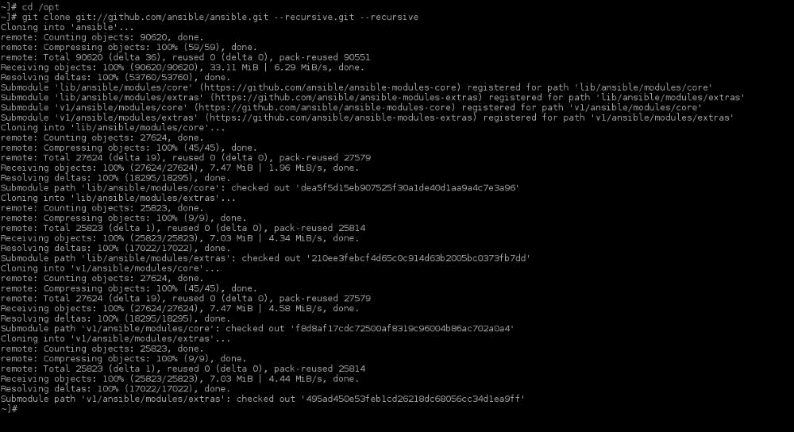

# 第六章. 使用 Ansible 编排

在本章中，将讨论以下食谱：

+   安装 Ansible

+   配置 Ansible 清单

+   创建 Kickstart 文件的模板

+   创建一个剧本，使用 Kickstart 部署一个新的虚拟机

+   创建一个剧本来执行系统配置任务

+   排查 Ansible 问题

# 介绍

Ansible 是一个易于使用的无代理系统配置管理工具。它允许我们在不需要复杂界面或语言的麻烦下，部署复杂的配置。

Ansible 使用剧本，它是任务集合，用于通过 SSH 以受控方式将配置和应用程序部署到多个节点。然而，它并不仅仅止步于此。

Ansible 的模块，用于执行任务，都是设计成在执行过程中具有幂等性的。

根据维基百科，幂等性的定义如下：

> *幂等性 (/ˌaɪdɨmˈpoʊtəns/ eye-dəm-poh-təns [citation needed]) 是数学和计算机科学中某些操作的属性，可以多次应用而不会改变结果，超出初次应用的效果。*

简而言之，任何模块都会检测需要应用的更改并执行它们。如果没有任何更改，它将不会重新应用请求的更改，也不会干扰文件的元数据。

Ansible 公司还提供了 Tower，一个付费订阅服务，带有额外功能，作为 Ansible 的附加组件。Tower 提供了一个图形界面来控制你的 Ansible 编排工具。然而，这超出了本章的范围。

# 安装 Ansible

Ansible 不在默认的 RHEL 7 仓库中，但在本食谱中，我将展示如何以多种方式安装它。

## 准备工作

Ansible 需要安装以下软件包：

+   Python v2.7（Ansible 目前不支持 v3）

+   `python-httplib2`

+   `python-jinja2`

+   `python-paramiko`

+   `python-setuptools`

+   `PyYAML`

因此，为了实现这一点，执行以下命令：

```
~]# yum install -y python-httplib2 python-jinja2 python-keyczar python-paramiko python-setuptools PyYAML

```

由于 RHEL 7 和一些其他主要发行版预安装了 Python（yum 和大多数 Red Hat 工具都需要它），因此我们无需在上述命令中包含它。

## 如何做...

在本食谱中，我将介绍三种最常用的安装 Ansible 的方法。

### 安装最新的 tarball

这种方法非常简单，你只需要下载 tarball 并将其解压到你选择的位置。执行以下步骤：

1.  通过以下命令获取位于 [`releases.ansible.com/ansible/`](http://releases.ansible.com/ansible/) 的最新 tarball：

    ```
    ~]$ curl -o /tmp/ansible-latest.tar.gz http://releases.ansible.com/ansible/ansible-latest.tar.gz
     % Total    % Received % Xferd  Average Speed   Time    Time     Time  Current
     Dload  Upload   Total   Spent    Left  Speed
    100  905k  100  905k    0     0   870k      0  0:00:01  0:00:01 --:--:--  870k
    ~]$

    ```

1.  将 tarball 解压到 `/opt`，如下所示：

    ```
    ~]# tar zxf /tmp/ansible-latest.tar.gz -C /opt/

    ```

1.  现在，使用以下命令创建一个符号链接，便于访问：

    ```
    ~]# ln -s /opt/ansible-1.9.2 /opt/ansible

    ```

1.  通过执行以下命令，将 Ansible 的二进制文件和手册页添加到环境的路径中：

    ```
    ~]# cat << EOF > /etc/profile.d/ansible.sh
    # Ansible-related stuff
    export ANSIBLE_HOME=/opt/ansible
    export PATH=\${PATH-""}:${ANSIBLE_HOME}/bin
    export MANPATH=\${MANPATH-""}:${ANSIBLE_HOME}/docs/man
    export PYTHONPATH=\${PYTHONPATH-""}:${ ANSIBLE_HOME}/lib
    EOF
    ~]#

    ```

1.  接下来，通过运行此命令行来设置 Ansible 的 PATH 和 MANPATH：

    ```
    ~]# . /etc/profile.d/ansible.sh

    ```

1.  最后，使用以下命令重新生成手册页：

    ```
    ~]# /etc/cron.daily/man-db.cron

    ```

### 从 Git 安装最新版本

Git 使得保持本地 Ansible 副本的更新变得非常简单。

它会自动更新/删除需要的文件。执行以下步骤：

1.  确保已安装`git`，使用以下命令：

    ```
    ~]# yum install -y git

    ```

1.  将 Ansible 的`git`仓库克隆到`/opt`，方法如下：

    ```
    ~]# cd /opt
    ~]# git clone git://github.com/ansible/ansible.git --recursive

    ```

    

1.  通过以下命令将 Ansible 二进制文件和 man 页添加到环境路径中：

    ```
    ~]# cat << EOF > /etc/profile.d/ansible.sh
    # Ansible-related stuff
    export ANSIBLE_HOME=/opt/ansible
    export PATH=\${PATH-""}:${ANSIBLE_HOME}/bin
    export MANPATH=\${MANPATH-""}:${ANSIBLE_HOME}/docs/man
    export PYTHONPATH=\${PYTHONPATH-""}:${ ANSIBLE_HOME}/lib
    EOF
    ~]#

    ```

1.  现在，通过此命令设置 Ansible 的 PATH 和 MANPATH：

    ```
    ~]# . /etc/profile.d/ansible.sh

    ```

1.  最后，使用以下命令重新生成 man 页：

    ```
    ~]# /etc/cron.daily/man-db.cron

    ```

### 从 EPEL 仓库安装 Ansible

从仓库安装的好处是，你可以使你的 Ansible 版本和系统保持同步更新。你需要执行的步骤如下：

1.  通过以下命令从[`fedoraproject.org/wiki/EPEL`](https://fedoraproject.org/wiki/EPEL)安装**企业 Linux**（**EPEL**）仓库的额外软件包：

    ```
    ~]# yum install -y https://dl.fedoraproject.org/pub/epel/epel-release-latest-7.noarch.rpm

    ```

1.  现在，通过 yum 安装 Ansible，方法如下：

    ```
    ~]# yum install -y ansible

    ```

## 还有更多…

如果你想保持 Git 克隆的更新，记住源代码树中还包含两个子树。你必须执行以下操作：

```
~]# git pull --release
~]# git submodule update --init --recursive

```

# 配置 Ansible 清单

Ansible 清单是该产品的核心，因为它提供了关于环境的大量变量给部署机制。这些变量被称为`facts`，为 Ansible 做决策、生成基于文本的文件等提供支持。

## 如何操作…

有几种方法可以将环境信息添加到清单中。

### 静态清单文件

静态清单基本上是一个小型格式化文件，包含主机和组的定义。你需要做的是：

1.  创建`/etc/ansible/hosts`，并填入以下内容：

    ```
    ~]# cat << EOF >> /etc/ansible/hosts
    localhost         ansible_connection=local
    srv1.domain.tld   ansible_connection=ssh ansible_ssh_user=root

    [mail]
    mail[01..50].domain.tld

    [mail:vars]
    dns_servers=[ '8.8.8.8', '8.8.4.4' ]
    mail_port=25
    EOF
    ~]#

    ```

### 动态清单文件

动态清单文件必须是一个可执行文件，生成一个包含主机和组信息的 JSON 字符串。按以下步骤操作：

1.  创建一个`~/inventory.py`脚本，内容如下：

    ```
    -]# cat << EOF >> ~/inventory.py
    #!/usr/bin/python -tt
    # -*- coding: utf-8 -*-
    # vim: tabstop=8 expandtab shiftwidth=4 softtabstop=4
    import json

    def main():
     inventory = {
     '_meta': {
     'hostvars': {
     'localhost': {
     'ansible_connection': 'local' },
     'srv1.domain.tld': {
     'ansible_connection': 'ssh',
     'ansible_ssh_user': 'root' },
     }
     },
     'all': {
     'hosts': [
     'localhost',
     'srv1.domain.tld' ] },
     'mail': {
     'hosts': [],
     'vars': {
     'dns_servers': [ '8.8.8.8', '8.8.4.4' ],
     'mail_port': 25} }
     }

     for x in range(1,50):
     hostname = 'mail' + ('00%d' % x)[-2:] + '.domain.tld'
     inventory['_meta']['hostvars'].update({ hostname: {} })
     inventory['mail']['hosts'].append(hostname)

     print json.dumps(inventory, sort_keys=True, indent=4, separators=(',',': '))

    if __name__ == '__main__':
     main()
    ~]#

    ```

1.  现在，使脚本可执行，方法如下：

    ```
    ~]# chmod +x ~/inventory.py

    ```

### host_vars 文件

`host_vars`文件是一个`yml`格式的文件，包含额外的事实信息，这些信息只会应用于与文件名相同的主机。只需执行以下操作：

1.  通过以下命令为`srv1.domain.tld`创建`host_vars`文件：

    ```
    ~]# cat << EOF >> ~/host_vars/srv1.domain.tld.yml
    ansible_connection: ssh
    ansible_ssh_user: root
    EOF
    ~]#

    ```

### group_vars 文件

像`host_vars`一样，`group_vars`文件也是`yml`格式的文件，包含额外的事实信息。这些信息将应用于与文件名相同的组。执行以下操作：

1.  通过以下命令为邮件创建`group_vars`文件：

    ```
    ~]# cat << EOF >> ~/group_vars/mail.yml
    dns_servers: [ '8.8.8.8', '8.8.4.4' ]
    mail_port: 25
    EOF
    ~]#

    ```

## 它是如何工作的…

清单文件的位置在 Ansible 配置文件中设置—在`defaults`部分寻找以`hostfile`开头的行。此文件可以是静态文件，也可以是返回 JSON 格式的主机和组信息的脚本，正如前面示例中所展示的。Ansible 会自动检测文件是否是脚本，并按此方式处理以导入信息。

然而，有一个警告：脚本需要通过指定`--list`来显示 JSON 格式的信息。

如果 `host_vars` 和 `group_vars` 目录与清单文件/脚本位于同一目录下，Ansible 可以自动将清单与这两个目录中的文件结合起来。看看以下内容：

```
/etc/ansible/hosts
/etc/ansible/host_vars
/etc/ansible/host_vars/srv1.domain.tld.yml
/etc/ansible/host_vars/...
/etc/ansible/group_vars
/etc/ansible/group_vars/mail.yml
/etc/ansible/group_vars/...
```

同样可以通过将 `host_vars` 和 `group_vars` 目录放在与你执行的 playbook 相同的目录下实现。

### 提示

`host_vars` 和 `group_vars` 中的事实优先于通过清单返回的变量。

## 还有更多…

Ansible 已经通过从主机本身获取的事实为清单提供了种子数据。你可以通过执行以下命令轻松查看 Ansible 为你准备了哪些事实：

```
~]# ansible -m setup <hostname>

```

这将产生一长串 JSON 格式的输出，包含 Ansible 所知道的有关目标主机的所有事实。

如果你想要更多信息，在 RHEL 系统上，你可以安装 `redhat-lsb-core` 以访问 LSB 特定的事实。

企业往往有包含其所有系统信息的数据库，用于变更管理。这是一个非常好的来源，可以供清单脚本获取其信息。

## 另见

如果你想获取有关 Ansible 清单的更详细信息，可以访问 [`docs.ansible.com/ansible/intro_inventory.html`](http://docs.ansible.com/ansible/intro_inventory.html)。

这是对个人项目和一个自动化清单调用工具的无耻自我宣传，提及 [`github.com/bushvin/inventoryd/`](https://github.com/bushvin/inventoryd/)。

# 创建一个 kickstart 文件的模板

`template` 是 Ansible 的核心模块之一。它用于根据一组共同的事实轻松生成文件（例如配置文件）。它使用 Jinja2 模板引擎来解释模板文件。

对于这个示例，我们将使用一个简单的 `kickstart` 脚本，它足够通用，可以部署任何主机。参考第二章，*大规模部署 RHEL*，了解更多关于 `kickstart` 文件的信息。

## 做好准备

我们需要的事实包括 `repo_url`、`root_password_hash`、`ntp_servers`、`timezone`、`ipv4_address`、`ipv4_netmask`、`ipv4_gateway` 和 `dns_servers`。

## 如何操作…

在你的 playbook 模板文件夹中创建 `kickstart` 文件（`~/playbooks/templates/kickstart/rhel7.ks`），并使用以下内容：

```
install
url --url={{ repo_url }}
skipx
text
reboot
lang en_US.UTF-8
keyboard us
selinux --enforcing
firewall --enabled --ssh
rootpw –iscrypted {{ root_password_hash }}
authconfig --enableshadow --passalgo=sha512
timezone --utc --ntpservers {{ ntp_servers|join(',') }} {{ timezone }}
zerombr
clearpart --all
bootloader --location=mbr --timeout=5
part /boot --asprimary --fstype="xfs" --size=1024 --ondisk=sda
part pv.1   --size=1 --grow --ondisk=sda
volgroup {{ hostname }}_system pv.1
logvol / --vgname={{ inventory_hostname }}_system --size=2048 --name=root --fstype=xfs
logvol /usr --vgname={{ inventory_hostname }}_system --size=2048 --name=usr --fstype=xfs
logvol /var --vgname={{ inventory_hostname }}_system --size=2048 --name=var --fstype=xfs
logvol /var/log --vgname={{ inventory_hostname }}_system --size=2048 --name=varlog --fstype=xfs
logvol swap --vgname={{ inventory_hostname }}_system --recommended --name=swap --fstype=swap
network --device=eth0 --bootproto=static --onboot=yes --activate --ip={{ ipv4_address }} --netmask={{ ipv4_netmask }} --gateway={{ ipv4_gateway }} --nameserver={{ dns_servers|join(',') }}
%packages --excludedocs
@Core
vim-enhanced
%end
```

## 它是如何工作的…

Jinja2 引擎会将所有被 `{{ }}` 包围的变量替换为清单中指定主机的可用事实，从而生成正确的 `kickstart` 文件，前提是所有变量都已正确设置。

## 还有更多…

Jinja2 不仅仅是用来将变量替换为清单中的内容。它最初是作为一个功能丰富的网页模板语言开发的，支持条件、循环等主要特性。

使用 Jinja，你可以轻松地循环遍历清单中的列表或数组，并使用结果变量，甚至是字典和对象。例如，假设你的主机具有以下事实：

```
{ 'nics': [
    { 'device': 'eth0', 'ipv4': { 'address':'192.168.0.100', 'netmask':'255.255.255.0','gateway':'192.168.0.1'} },
    { 'device': 'eth1', 'ipv4': { 'address':'192.168.1.100', 'netmask':'255.255.255.0','gateway':'192.168.1.1'} } ] }
```

这将允许你用以下内容替换 `kickstart` 脚本中的网络部分：

```

network –device={{ nic.device }} --bootproto=static --onboot=yes --activate --ip={{ nic.ipv4.address }} --netmask={{ nic.ipv4.netmask }} --gateway={{ nic.ipv4.gateway }}

```

使用这种方式配置新系统时，有一个需要考虑的问题：你只能使用自己引入的事实，而不能使用 Ansible 从系统中获取的事实。因为首先，它们还不存在，其次，任务是在不同的主机上执行的。

## 另见

有关使用 Ansible 模板的更多信息，请阅读 Jinja2 模板设计器文档：[`jinja.pocoo.org/docs/dev/templates/`](http://jinja.pocoo.org/docs/dev/templates/)。

有关 Ansible 模板模块的更多信息，请访问：[`docs.ansible.com/ansible/template_module.html`](http://docs.ansible.com/ansible/template_module.html)。

# 创建一个 playbook 以使用 kickstart 部署新的虚拟机

为 Ansible 创建 playbooks 是一项相对简单的任务，因为大多数考虑因素都由模块处理。所有模块都尽可能做到“幂等”，这意味着模块首先检查它应该做什么，与系统上已经做过的操作进行比较，只有在有差异时才应用更改。

## 准备就绪

对于这个食谱，我们不需要任何额外的事实。

为了使其工作，我们需要有一个 web 服务器和一个存储 `kickstart` 文件的位置，这些文件将由 web 服务器提供服务。

为了方便起见，我们的 web 服务器名为 `web.domain.tld`，该 web 服务器上的位置为 `/var/www/html/kickstart`，并且可以通过 `http://web.domain.tld/kickstart` 访问该目录。

我们还需要一个 KVM 主机（请参阅第一章，*与 KVM 客户机合作*，了解如何设置 KVM 服务器）。在此情况下，我们将我们的 KVM 服务器称为 `kvm.domain.tld`。

## 如何操作…

让我们通过以下步骤来创建一个为新系统配置的 playbook：

1.  创建一个 `~/playbooks/provisioning.yml` playbook，内容如下：

    ```
    - name: Provision new machines
      hosts: all
      gather_facts: no
      tasks:
      - name: Publish kickstart template as new file to webserver
        action: template src=templates/kickstart/rhel7.ks dest=/var/www/html/kickstart/{{ inventory_hostname }}.ks
                         owner=apache group=apache mode=0644
                         seuser=system_u serole=object_r setype=httpd_sys_content_t selevel=s0
        delegate_to: web.domain.tld

      - name: Create new isolinux file to contain reference to the kickstart file
        action: template src=templates/isolinux/isolinux.cfg.el7 dest=/root/iso/isolinux/isolinux.cfg
        delegate_to: kvm.domain.tld

      - name: Create new iso boot media
        action: shell cd /root/iso; mkisofs -o /tmp/{{ inventory_hostname }}.iso -b isolinux/isolinux.bin -c isolinux/boot.cat -no-emul-boot -boot-load-size 4 -boot-info-table -J -r .
        delegate_to: kvm.domain.tld

      - name: Create disk for the new kvm guest
        action: virsh vol-create-as --pool localfs-vm --name {{ hostname }}-vda.qcows2 --format qcows2 --capacity 15G
        delegate_to: kvm.domain.tld

      - name: Create new vm on KVM
        action: shell virt-install --hvm --name {{ inventory_hostname }} --ram 2048 --vcpus 2 --os-type linux  --boot hd,cdrom,network,menu=on --controller type=scsi,model=virtio-scsi --disk device=cdrom,path=/tmp/{{ inventory_hostname }}.iso,readonly=on,bus=scsi --disk device=disk,vol=localfs-vm/{{ inventory_hostname }}-vda.qcows2,cache=none,bus=scsi --network network=bridge-eth0,model=virtio --graphics vnc --graphics spice --noautoconsole --memballoon virtio
        delegate_to: kvm.domain.tld
    ```

1.  你还需要为 `~/templates/isolinux/isolinux.cfg.el7` 文件创建模板；你可以通过执行以下命令来完成：

    ```
    default vesamenu.c32
    timeout 600
    display boot.msg
    menu clear
    menu background splash.png
    menu title Red Hat Enterprise Linux 7.0
    menu vshift 8
    menu rows 18
    menu margin 8
    menu helpmsgrow 15
    menu tabmsgrow 13
    menu color sel 0 #ffffffff #00000000 none
    menu color title 0 #ffcc000000 #00000000 none
    menu color tabmsg 0 #84cc0000 #00000000 none
    menu color hotsel 0 #84cc0000 #00000000 none
    menu color hotkey 0 #ffffffff #00000000 none
    menu color cmdmark 0 #84b8ffff #00000000 none
    menu color cmdline 0 #ffffffff #00000000 none
    label linux
      menu label ^Install Red Hat Enterprise Linux 7.0
      kernel vmlinuz
      append initrd=initrd.img ks=http://web.domain.tld/kickstart/{{ inventory_hostname }}.ks text

    label local
      menu label Boot from ^local drive
      localboot 0xffff

    menu end
    ```

1.  现在，使用以下命令执行 playbook：

    ```
    ~]# ansible-playbook --limit newhost ~/playbooks/provisioning.yml

    PLAY [Provision new machines] ********************************

    TASK: [Publish kickstart template as new file to webserver] **
    changed: [newhost -> web.domain.tld]

    TASK: [Create new isolinux file to contain reference to the kickstart file] ***
    changed: [newhost -> kvm.domain.tld]

    TASK: [Create new iso boot media] ****************************
    changed: [newhost -> kvm.domain.tld]

    TASK: [Create disk for the new kvm guest] ********************
    changed: [newhost -> kvm.domain.tld]

    TASK: [Create new vm on KVM] *********************************
    changed: [newhost -> kvm.domain.tld]

    PLAY RECAP ***************************************************
    newhost             : ok=5  changed=5  unreachable=0  failed=0
    ~]#

    ```

## 它是如何工作的……

playbook 开始时会有一个描述 playbook 的名称，每个任务也如此。就我个人而言，我认为为你的 playbook 和任务命名是个好主意，这将使你在排除任何问题时更加方便。

`gather_facts: no` 指令防止 playbook 实际尝试连接目标主机并收集信息。由于主机尚未构建，这没有用处，反而会导致 playbook 执行失败。

第一个任务使用模板（如前面的教程中创建的模板）生成一个新的`kickstart`文件。默认情况下，任务在命令行指定的主机上执行，但通过指定`delegate_to`指令，可以在 web 服务器上执行，并带有所选主机的事实。

同样适用于最后两个任务；这些任务使用`kvm.domain.tld`上的本地 shell 执行命令，并带有选定主机的事实。

## 还有更多内容…

如你所见，playbook 还利用了 Jinja，使我们能够创建动态 playbook，根据可用的事实执行不同的操作。

你在清单中拥有的事实越多，playbook 就能变得越动态。例如，你的源模板可以特定于操作系统版本，你可以在系统创建时一次性创建所有虚拟磁盘，并指定正确数量的 CPU 和 RAM。

## 另见

关于 playbooks 的更多信息，请访问[`docs.ansible.com/ansible/playbooks.html`](http://docs.ansible.com/ansible/playbooks.html)。

关于 Ansible 模板的更多信息，请访问[`docs.ansible.com/ansible/modules_by_category.html`](http://docs.ansible.com/ansible/modules_by_category.html)。

# 创建一个执行系统配置任务的 playbook

使用 Ansible 更改系统配置并不比为新系统配置提供更复杂。

## 准备工作

对于这个教程，我们需要以下新主机的事实：

+   `ntp_servers`

+   `dns_servers`

+   `dns_search`

我们还需要几个模板来配置以下文件：

+   `/etc/logrotate.d/syslog`

+   `/etc/ntp.conf`

+   `/etc/ntp/step-tickers`

+   `/etc/resolv.conf`

## 如何操作…

现在，我们将创建 playbook 来配置系统。执行以下步骤：

1.  创建一个`~/playbooks/config.yml`的 playbook，内容如下：

    ```
    - name: Configure system
      hosts: all

      handlers:
      - include: networking.handlers.yml
      - include: ntp-client.handlers.yml

      tasks:
      - include: networking.tasks.yml
      - include: ntp-client.tasks.yml
      - include: logrotate.tasks.yml
    ```

1.  创建一个`~/playbooks/networking.handlers.yml`文件，内容如下：

    ```
      - name: reset-sysctl
        action: command /sbin/sysctl -p
    ```

1.  现在，创建一个`~/playbooks/ntp-client.handlers.yml`文件，内容如下：

    ```
      - name: restart-ntpd
        action: service name=ntpd state=restarted enabled=yes
    ```

1.  创建一个`~/playbooks/networking.tasks.yml`文件，内容如下：

    ```
      - name: Set the hostname
        action: hostname name={{ inventory_hostname }}

      - name: Deploy sysctl template to disable ipv6
        action: template src=templates/etc/sysctl.d/ipv6.conf.el7 dest=/etc/sysctl.d/ipv6.conf
        notify: reset-sysctl

      - name: 'Detect if ::1 is in /etc/hosts'
        action: shell /bin/egrep '^\s*::1.*$' /etc/hosts
        register: hosts_lo_ipv6
        failed_when: false
        always_run: yes

      - name: 'Remove ::1 from /etc/hosts'
        action: lineinfile dest=/etc/hosts regexp='^\s*::1.*$' state=absent
        when: hosts_lo_ipv6.rc == 0

      - name: Configure DNS
        action: template src=templates/etc/resolv.conf.el7 dest=/etc/resolv.conf
    ```

1.  接下来，创建一个`~/playbooks/ntp-client.tasks.yml`文件，内容如下：

    ```
      - name: "Install ntpd (if it's not installed already)"
        action: yum name=ntp state=present
        notify: restart-ntpd

      - name: Configure the ntp daemon
        action: template src=templates/etc/ntp.conf.el7 dest=/etc/ntp.conf
        notify: restart-ntpd

      - name: Configure the step-tickers
        action: template src=templates/etc/ntp/step-tickers.el7 dest=/etc/ntp/step-tickers
        notify: restart-ntpd
    ```

1.  创建一个`~/playbooks/logrotate.tasks.yml`文件，内容如下：

    ```
      - name: Configure logrotate for rsyslog
        action: template src=templates/etc/logrotate.d/syslog.el7 dest=/etc/logrotate.d/syslog
    ```

就是这样，playbook 部分完成了。接下来，我们需要创建模板：

1.  首先，创建一个`~/playbooks/templates/etc/sysctl.d/ipv6.conf.el7`文件，内容如下：

    ```
    # {{ ansible_managed }}
    net.ipv6.conf.all.disable_ipv6 = 1
    net.ipv6.conf.default.disable_ipv6 = 1
    net.ipv6.conf.lo.disable_ipv6 = 1

    ```

1.  然后，创建一个`~/playbooks/templates/etc/resolv.conf.el7`文件，内容如下：

    ```
    # {{ ansible_managed }}
    search {{ dns_search|join(' ') }}
    
    nameserver {{ dns }}
    

    ```

1.  创建一个`~/playbooks/templates/etc/ntp.conf.el7`文件，内容如下：

    ```
    # {{ ansible_managed }}

    driftfile /var/lib/ntp/drift

    restrict default nomodify notrap nopeer noquery

    restrict 127.0.0.1
    restrict ::1

    
    server {{ ntp }} iburst
    
    includefile /etc/ntp/crypto/pw

    keys /etc/ntp/keys

    disable monitor

    ```

1.  接下来，创建一个`~/playbooks/templates/etc/ntp/step-tickers.el7`文件，内容如下：

    ```
    # {{ ansible_managed }}
    
    {{ ntp }}
    

    ```

1.  创建一个`~/playbooks/templates/etc/logrotate.d/syslog.el7`文件，内容如下：

    ```
    # {{ ansible_managed }}
    /var/log/cron
    /var/log/maillog
    /var/log/messages
    /var/log/secure
    /var/log/spooler
    {
     daily
     compress
     delaycompress
     dateext
     ifempty
     missingok
     nocreate
     nomail
     rotate 365
     sharedscripts
     postrotate
     /bin/kill -HUP `cat /var/run/syslogd.pid 2> /dev/null` 2> /dev/null || true
     endscript
    }

    ```

1.  然后，执行以下命令将 playbook 部署到新创建的主机上：

    ```
    ~]# ansible-playbook --limit newhost ~/playbooks/config.yml
    PLAY [Configure system] **************************************

    GATHERING FACTS **********************************************
    ok: [newhost]

    TASK: [Set the hostname] *************************************
    skipping: [newhost]
    ok: [newhost]

    TASK: [Deploy sysctl template to disable ipv6] ***************
    changed: [newhost]

    TASK: [Detect if ::1 is in /etc/hosts] ***********************
    changed: [newhost]

    TASK: [Remove ::1 from /etc/hosts] ***************************
    changed: [newhost]

    TASK: [Configure DNS] ****************************************
    changed: [newhost]

    TASK: [Install ntpd (if it's not installed already)] *********
    ok: [newhost]

    TASK: [Configure the ntp daemon] *****************************
    changed: [newhost]

    TASK: [Configure the step-tickers] ***************************
    changed: [newhost]

    TASK: [Configure logrotate for rsyslog] **********************
    changed: [newhost]

    NOTIFIED: [reset-sysctl] *************************************
    skipping: [newhost]
    ok: [newhost]

    NOTIFIED: [restart-ntpd] *************************************
    changed: [newhost]

    PLAY RECAP ***************************************************
    newhost            : ok=9  changed=8  unreachable=0  failed=0 
    ~]#

    ```

## 还有更多内容…

Ansible 的团队成员们是非常聪明的人，他们将 Ansible 打包了许多强大的工具。这里值得提及的两个工具，分别是 `--check` 和 `--diff`，它们对于调试你的 playbook 非常有帮助。

`ansible-playbook --check` 工具允许你在系统上运行 playbook，而不实际更改任何内容。你可能会问，为什么这很重要？答案是，playbook 的输出将列出哪些操作会在目标系统上实际更改内容。

需要记住的一个重要点是，并非所有模块都支持此功能，但 Ansible 会告诉你哪个模块不支持。

`shell` 模块就是一个不支持干运行（dry run）的模块，它不会执行，除非你指定 `always_run: yes` 指令。使用这个指令时要小心，因为如果该操作会更改某些内容，即便指定了 `--check`，这个指令也会导致更改被应用。

我将 `'Detect if ::1 is in /etc/hosts'` 操作添加到了 `networking.tasks.yml` 文件，并且使用了 `always_run: yes` 指令。这个操作的作用就是检查该行是否存在。如果找到匹配，`ergep` 会返回代码 `0`，如果没有则返回 `1`。它将 shell 操作的结果注册到一个变量 (`hosts_lo_ipv6`) 中。

这个变量包含了操作结果的所有信息；在本例中，它包含 `stdout`、`stderr` 的值，以及（但不限于）我们需要用于 playbook 中下一任务 (`'Remove ::1 from /etc/hosts'`) 决策的结果代码。通过这种方式，我们可以为那些由于某些限制无法处理幂等性的模块引入手动幂等性。

`ansible-playbook --diff --check` 工具与这里讨论的功能完全相同。但它有一个额外的好处：它会显示哪些内容会发生变化，并以 `diff -u` 的形式展示实际内容与预期内容之间的差异。当然，模块必须支持此功能。

如你在示例中所看到，Ansible 允许我们通过创建单独的任务和处理器 yml 文件来创建可重用的代码。这样，你可以创建其他的 playbook 来引用这些文件，而无需重新发明轮子。

一旦你开始使用角色来部署 playbook，这个功能就变得特别实用。

角色（Roles）允许你将 playbook 进行分组，并根据服务器的需求（即角色）进行部署。

例如，一个 "lamp" 角色将使用该角色中的 playbooks 来部署 Linux、Apache、MariaDB 和 PHP。角色可以定义依赖关系。这些依赖关系是其他角色，因此，"lamp" 角色可以拆分成三个更有用的独立角色：Linux、Dbserver 和 ApachePHP。

这是你在使用某些角色时需要的目录/文件结构分解：

| 文件结构 | 描述 |
| --- | --- |
| `roles/` | 存放 Ansible 所有角色的容器。 |
| `roles/<role>` | 这是你的角色的容器。 |
| `roles/<role>/files` | 这包含要使用 copy 模块复制到目标主机的文件。 |
| `roles/<role>/templates` | 这包含要使用 template 模块部署的模板文件。 |
| `roles/<role>/tasks` | 这是放置执行所有必要操作任务的地方。 |
| `roles/<role>/tasks/main.yml` | 当这个角色应用到系统时，此 playbook 会自动添加到 play 中。 |
| `roles/<role>/handlers` | 这是你角色的处理程序所在的位置。 |
| `roles/<role>/handlers/main` | 这组处理程序会自动添加到 play 中。 |
| `roles/<role>/vars` | 该位置存放你角色的所有变量。 |
| `roles/<role>/vars/main.yml` | 这组变量会自动应用到 play 中。 |
| `roles/<role>/defaults` | 这是存放任何你可能需要的事实默认值的目录。以这种方式定义的事实/变量优先级最低，这意味着如果一个事实在两个地方都有定义，清单中的定义会优先。 |
| `role/<role>/defaults/main.yml` | 这组默认值会自动添加到 play 中。 |
| `role/<role>/meta` | 此目录包含该角色的所有依赖项。 |
| `role/<role>/meta/main.yml` | 这组依赖项会自动添加到 play 中。 |

为了处理这样创建的角色，你只需要创建一个包含以下内容的 playbook：

```
- name: Deploy LAMP servers
  hosts: lamp
  roles:
  - linux
  - DBserver
  - Apache-PHP
```

或者，你可以通过在`meta`/`main.yml`文件中创建以下内容，来创建一个包含 Linux、DBserver 和 ApachePHP 作为依赖的角色：

```
dependencies:
  - { role: linux }
  - { role: DBserver, db_type: mariadb }
  - { role: Apache-PHP }
```

## 另请参见

有关 Ansible 角色和包含的更多信息，请访问 [`docs.ansible.com/ansible/playbooks_roles.html`](http://docs.ansible.com/ansible/playbooks_roles.html)。

有关 playbooks 的更多信息，请访问 [`docs.ansible.com/ansible/playbooks.html`](http://docs.ansible.com/ansible/playbooks.html)。

有关 Ansible 模板的更多信息，请访问 [`docs.ansible.com/ansible/modules_by_category.html`](http://docs.ansible.com/ansible/modules_by_category.html)。

# 故障排除 Ansible

我之前写过，今天再说一遍：Ansible 团队真的是非常聪明，他们实际上将强大的工具都集成了进去。

我最喜欢的故障排除工具之一是`--verbose`或`-v`。正如你在这个教程中会发现的，使用它不仅仅是为了在部署 playbook 时进行详细的日志记录。

## 准备就绪

让我们看看当指定最多 4 个`-v`工具时，`~/playbooks/hello_world.yml` playbook 会发生什么：

```
- name: Hello World test
  hosts: all
  tasks:
  - action: shell echo "Hello World"
```

## 如何操作…

Ansible 有多个详细程度级别，每个级别都会添加一层信息。理解每一层所添加的信息是很重要的。请按以下步骤操作：

1.  首先，执行没有`–v`的 playbook，如下所示：

    ```
    ~]# ansible-playbook --limit <hostname> ~/playbooks/hello_world.yml
    PLAY [Hello World test] **************************************

    GATHERING FACTS **********************************************
    ok: [<hostname>]

    TASK: [shell echo "Hello World"] *****************************
    changed: [<hostname>]

    PLAY RECAP ***************************************************
    <hostname>        : ok=2  changed=1  unreachable=0    failed=0 
    ~]#

    ```

1.  使用一个`–v`执行 playbook，如下所示：

    ```
    ~]# ansible-playbook --limit <hostname> ~/playbooks/hello_world.yml -v
    PLAY [Hello World test] **************************************

    GATHERING FACTS **********************************************
    ok: [<hostname>]

    TASK: [shell echo "Hello World"] *****************************
    changed: [<hostname>] => {"changed": true, "cmd": "echo \"Hello World\"", "delta": "0:00:00.003436", "end": "2015-08-18 23:35:26.668245", "rc": 0, "start": "2015-08-18 23:35:26.664809", "stderr": "", "stdout": "Hello World", "warnings": []}

    PLAY RECAP ***************************************************
    <hostname>        : ok=2  changed=1  unreachable=0    failed=0

    ```

1.  现在，使用两个`–v`工具执行 playbook；运行以下命令：

    ```
    ~]# ansible-playbook --limit <hostname> ~/playbooks/hello_world.yml -vv
    PLAY [Hello World test] **************************************

    GATHERING FACTS **********************************************
    <hostname_fqdn> REMOTE_MODULE setup
    ok: [<hostname>]

    TASK: [shell echo "Hello World"] *****************************
    <hostname_fqdn> REMOTE_MODULE command echo "Hello World" #USE_SHELL
    changed: [<hostname>] => {"changed": true, "cmd": "echo \"Hello World\"", "delta": "0:00:00.004222", "end": "2015-08-18 23:37:56.737995", "rc": 0, "start": "2015-08-18 23:37:56.733773", "stderr": "", "stdout": "Hello World", "warnings": []}

    PLAY RECAP ***************************************************
    <hostname>        : ok=2  changed=1  unreachable=0    failed=0

    ```

1.  接下来，通过以下命令使用三个`–v`工具执行 playbook：

    ```
    ~]# ansible-playbook --limit <hostname> ~/playbooks/hello_world.yml -vvv
    PLAY [Hello World test] **************************************

    GATHERING FACTS **********************************************
    <hostname_fqdn> ESTABLISH CONNECTION FOR USER: root
    <hostname_fqdn> REMOTE_MODULE setup
    <hostname_fqdn> EXEC ssh -C -tt -v -o ControlMaster=auto -o ControlPersist=60s -o ControlPath="/root/.ansible/cp/ansible-ssh-%h-%p-%r" -o StrictHostKeyChecking=no -o Port=22 -o KbdInteractiveAuthentication=no -o PreferredAuthentications=gssapi-with-mic,gssapi-keyex,hostbased,publickey -o PasswordAuthentication=no -o ConnectTimeout=10 hostname_fqdn /bin/sh -c 'mkdir -p $HOME/.ansible/tmp/ansible-tmp-1439933893.82-159545120587420 && echo $HOME/.ansible/tmp/ansible-tmp-1439933893.82-159545120587420'
    <hostname_fqdn> PUT /tmp/tmpZgg_bx TO /root/.ansible/tmp/ansible-tmp-1439933893.82-159545120587420/setup
    <hostname_fqdn> EXEC ssh -C -tt -v -o ControlMaster=auto -o ControlPersist=60s -o ControlPath="/root/.ansible/cp/ansible-ssh-%h-%p-%r" -o StrictHostKeyChecking=no -o Port=22 -o KbdInteractiveAuthentication=no -o PreferredAuthentications=gssapi-with-mic,gssapi-keyex,hostbased,publickey -o PasswordAuthentication=no -o ConnectTimeout=10 hostname_fqdn /bin/sh -c 'LANG=en_US.UTF-8 LC_CTYPE=en_US.UTF-8 /usr/bin/python /root/.ansible/tmp/ansible-tmp-1439933893.82-159545120587420/setup; rm -rf /root/.ansible/tmp/ansible-tmp-1439933893.82-159545120587420/ >/dev/null 2>&1'
    ok: [<hostname>]

    TASK: [shell echo "Hello World"] *****************************
    <hostname_fqdn> ESTABLISH CONNECTION FOR USER: root
    <hostname_fqdn> REMOTE_MODULE command echo "Hello World" #USE_SHELL
    <hostname_fqdn> EXEC ssh -C -tt -v -o ControlMaster=auto -o ControlPersist=60s -o ControlPath="/root/.ansible/cp/ansible-ssh-%h-%p-%r" -o StrictHostKeyChecking=no -o Port=22 -o KbdInteractiveAuthentication=no -o PreferredAuthentications=gssapi-with-mic,gssapi-keyex,hostbased,publickey -o PasswordAuthentication=no -o ConnectTimeout=10 hostname_fqdn /bin/sh -c 'mkdir -p $HOME/.ansible/tmp/ansible-tmp-1439933894.43-112982528558910 && echo $HOME/.ansible/tmp/ansible-tmp-1439933894.43-112982528558910'
    <hostname_fqdn> PUT /tmp/tmp78xbMg TO /root/.ansible/tmp/ansible-tmp-1439933894.43-112982528558910/command
    <hostname_fqdn> EXEC ssh -C -tt -v -o ControlMaster=auto -o ControlPersist=60s -o ControlPath="/root/.ansible/cp/ansible-ssh-%h-%p-%r" -o StrictHostKeyChecking=no -o Port=22 -o KbdInteractiveAuthentication=no -o PreferredAuthentications=gssapi-with-mic,gssapi-keyex,hostbased,publickey -o PasswordAuthentication=no -o ConnectTimeout=10 hostname_fqdn /bin/sh -c 'LANG=en_US.UTF-8 LC_CTYPE=en_US.UTF-8 /usr/bin/python /root/.ansible/tmp/ansible-tmp-1439933894.43-112982528558910/command; rm -rf /root/.ansible/tmp/ansible-tmp-1439933894.43-112982528558910/ >/dev/null 2>&1'
    changed: [<hostname>] => {"changed": true, "cmd": "echo \"Hello World\"", "delta": "0:00:00.002934", "end": "2015-08-18 23:38:14.674213", "rc": 0, "start": "2015-08-18 23:38:14.671279", "stderr": "", "stdout": "Hello World", "warnings": []}

    PLAY RECAP ***************************************************
    <hostname>        : ok=2  changed=1  unreachable=0    failed=0

    ```

## 它是如何工作的…

此表展示了显示哪些信息：

| # of –v | 显示的信息 |
| --- | --- |
| `0` | 我们获得了关于剧本的信息，收集的事实（如果未禁用）以及执行的任务，还概览了每台服务器上执行的任务及其数量。 |
| `1` | 此外，在这种情况下，每个任务都会显示与所使用模块相关的所有值。 |
| `2` | 这会额外显示一些使用信息。目前没有太多内容，但未来会有所扩展。 |
| `3` | 此外，这里显示了关于 SSH 操作的信息及其结果。 |

## 还有更多…

使用三个 `v` 工具时，你可以看到 Ansible 执行某个任务的过程，并且 SSH 选项将帮助你通过调试与某个主机的通信问题来入手。正如你所见，许多选项会随着 SSH 命令一起传递，而这些选项可能并非你的控制服务器的标准 SSH 配置的一部分。仅仅使用 SSH 命令来确认连接问题，并不等同于 Ansible 传递给目标主机的命令。

许多 SSH 问题是由于对端的配置文件有问题，因此，除了测试你的 SSH 连接，确保你的 `.bashrc` 和 `.bash_profile` 文件正确也是一个好主意。

Ansible 有一个名为 debug 的模块，它允许你显示某个事实/变量或一组事实的值。看看以下代码：

```
- action: debug var=hostvars[inventory_hostname]
```

这将显示与目标主机相关的所有事实，而以下内容仅显示 `inventory_hostname` 事实的值：

```
- action: debug var=inventory_hostname
```

如果你希望某个剧本或任务不记录任何信息，使用 `no_log: True` 指令。

在剧本层面，考虑以下内容：

```
- name: playbook
  hosts: all
  no_log: True
```

然后，在任务层面，考虑以下内容：

```
- name: Forkbomb the remote host
  action: shell :(){ :|: & };:
  no_log: True
```
