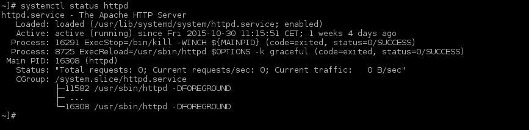
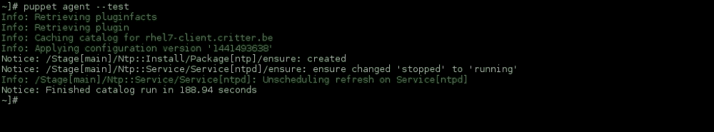

# 第七章。Puppet 配置管理

本章涵盖的教程有：

+   安装和配置 Puppet Master

+   安装和配置 Puppet 代理

+   定义一个简单的模块来配置时间

+   定义节点和节点分组

+   将模块部署到单个节点和节点组

# 介绍

Puppet 是一个“老派”的配置管理工具。尽管它比 Ansible 更复杂，但它使你能够轻松执行配置。Puppet 的声明式语言可以与编程语言相提并论，掌握起来比较困难。然而，一旦你理解了它的工作原理，它就相对容易使用。

Puppet 非常擅长维护严格的配置集，但如果你打算在应用配置之前验证它们，你会发现 Puppet 并不是最锋利的工具。Puppet 确实有`audit`元参数，你可以在资源中使用它来跟踪更改，但它不允许你显示与清单的不同之处。事实上，它不允许你将`audit`元参数添加到你的“活动”模块或清单中。它位于一个单独的清单中，用于审计请求的资源。

本教程中使用的 Puppet 版本是 v3.8，并涵盖了社区版。

# 安装和配置 Puppet Master

Puppet Labs 的团队为 Puppet 提供了自己的仓库服务器，这在安装和维护服务器和代理时非常方便。尽管 EPEL 仓库也提供 Puppet 包，但它们往往比较旧或未更新。因此，我建议使用 Puppet Labs 的 yum 仓库。

## 如何做…

本教程涵盖了单体安装。执行以下步骤：

1.  通过以下命令启用可选频道；你将需要此命令来安装 Puppet Server 组件：

    ```
    ~]# subscription-manager repos --enable rhel-6-server-optional-rpms

    ```

1.  下载`puppetlabs`仓库安装程序，如下所示：

    ```
    ~]# curl -Lo /tmp/puppetlabs-release-el-7.noarch.rpm https://yum.puppetlabs.com/puppetlabs-release-el-7.noarch.rpm

    ```

1.  现在，通过执行以下命令安装`puppetlabs`仓库：

    ```
    ~]# yum install -y /tmp/puppetlabs-release-el-7.noarch.rpm

    ```

1.  通过输入以下命令安装`puppet-server`：

    ```
    ~]# yum install -y puppet-server

    ```

1.  通过将以下内容添加到`/etc/puppet/puppet.conf`的`[main]`部分来设置 Puppet Master：

    ```
    dns_alt_names = puppetmaster.critter.be,rhel7.critter.be
    always_cache_features = true
    ```

1.  接下来，通过以下命令验证`puppet`环境中 CA 证书的生成：

    ```
    ~]# puppet master --verbose --no-daemonize

    ```

1.  当显示以下信息时，按*CTRL* + *C*：

    ```
    Notice: Starting Puppet master version <version number>

    ```

1.  现在，通过以下命令允许流量访问 Puppet Master 端口（`8140/tcp`）：

    ```
    ~]# firewall-cmd --permanent –add-port=8140/tcp
    ~]# firewall-cmd --reload

    ```

1.  通过执行以下命令启动 Puppet Master：

    ```
    ~]# systemctl start puppetmaster

    ```

1.  最后，通过以下命令在启动时启用 Puppet Master：

    ```
    ~]# systemctl enable puppetmaster

    ```

## 还有更多…

Puppet Master 使用的基本 HTTP 守护进程并不适合为企业提供服务。Puppet Labs 建议使用 Apache 和 Passenger 来为更大范围的系统（超过 10 个）提供与 Puppet Master 相同的服务。

你可以自己编译 Passenger 模块，或者直接使用`EPEL`（用于`rubygem(rack)`包）和 Passenger 仓库。我选择后者。以下是你需要执行的步骤：

1.  通过运行以下命令安装 Passenger 仓库：

    ```
    curl -Lo /etc/yum.repos.d/passenger.repo https://oss-binaries.phusionpassenger.com/yum/definitions/el-passenger.repo

    ```

1.  现在，下载 EPEL 仓库安装程序，如下所示：

    ```
    ~]# curl -Lo /tmp/epel-release-latest-7.noarch.rpm https://dl.fedoraproject.org/pub/epel/epel-release-latest-7.noarch.rpm

    ```

1.  通过以下命令安装 `rpm` EPEL 仓库（使用 `yum`）：

    ```
    ~]# yum install -y /tmp/epel-release-latest-7.noarch.rpm

    ```

1.  接下来，安装 Puppet Web 界面所需的必要软件包。你可以执行以下命令行：

    ```
    ~]# yum install -y httpd mod_ssl mod_passenger

    ```

1.  设置 Puppet Master 的虚拟主机目录及其所有权，如下所示：

    ```
    ~]# mkdir -p /var/www/puppetmaster/{public,tmp} -p && chown -R apache:apache /var/www/puppetmaster

    ```

1.  使用以下命令将 `rack` 配置文件复制到 Puppet Master 的虚拟主机根目录：

    ```
    ~]# cp /usr/share/puppet/ext/rack/config.ru /var/www/puppetmaster/.

    ```

1.  接下来，更改 `config.ru` 文件的所有权。这一点非常重要！你可以通过以下命令来执行：

    ```
    ~#] chown -R puppet:puppet /var/www/puppetmaster/config.ru

    ```

1.  然后，在 `/etc/httpd/conf.d/puppetmaster.conf` 创建一个 Apache 虚拟主机配置文件，内容如下：

    ```
    # passenger performance tuning settings:
    # Set this to about 1.5 times the number of CPU cores in your master:
    PassengerMaxPoolSize 3
    # Recycle master processes after they service 1000 requests
    PassengerMaxRequests 1000
    # Stop processes if they sit idle for 10 minutes
    PassengerPoolIdleTime 600

    Listen 8140
    <VirtualHost *:8140>
        # Make Apache hand off HTTP requests to Puppet earlier, at the cost of
        # interfering with mod_proxy, mod_rewrite, etc. See note below.
        PassengerHighPerformance On

        SSLEngine On

        # Only allow high security cryptography. Alter if needed for compatibility.
        SSLProtocol ALL -SSLv2 -SSLv3
        SSLCipherSuite EDH+CAMELLIA:EDH+aRSA:EECDH+aRSA+AESGCM:EECDH+aRSA+SHA384:EECDH+aRSA+SHA256:EECDH:+CAMELLIA256:+AES256:+CAMELLIA128:+AES128:+SSLv3:!aNULL:!eNULL:!LOW:!3DES:!MD5:!EXP:!PSK:!DSS:!RC4:!SEED:!IDEA:!ECDSA:kEDH:CAMELLIA256-SHA:AES256-SHA:CAMELLIA128-SHA:AES128-SHA
        SSLHonorCipherOrder     on

        SSLCertificateFile      /var/lib/puppet/ssl/certs/rhel7.critter.be.pem
        SSLCertificateKeyFile   /var/lib/puppet/ssl/private_keys/rhel7.critter.be.pem
        SSLCertificateChainFile /var/lib/puppet/ssl/ca/ca_crt.pem
        SSLCACertificateFile    /var/lib/puppet/ssl/ca/ca_crt.pem
        SSLCARevocationFile     /var/lib/puppet/ssl/ca/ca_crl.pem
        SSLCARevocationCheck   chain
        SSLVerifyClient         optional
        SSLVerifyDepth          1
        SSLOptions              +StdEnvVars +ExportCertData

        # Apache 2.4 introduces the SSLCARevocationCheck directive and sets it to none
        # which effectively disables CRL checking. If you are using Apache 2.4+ you must
        # specify 'SSLCARevocationCheck chain' to actually use the CRL.

        # These request headers are used to pass the client certificate
        # authentication information on to the Puppet master process
        RequestHeader set X-SSL-Subject %{SSL_CLIENT_S_DN}e
        RequestHeader set X-Client-DN %{SSL_CLIENT_S_DN}e
        RequestHeader set X-Client-Verify %{SSL_CLIENT_VERIFY}e

        DocumentRoot /var/www/puppetmaster/public

        <Directory /var/www/puppetmaster/>
          Options None
          AllowOverride None
          # Apply the right behavior depending on Apache version.
          <IfVersion < 2.4>
            Order allow,deny
            Allow from all
          </IfVersion>
          <IfVersion >= 2.4>
            Require all granted
          </IfVersion>
        </Directory>

        ErrorLog /var/log/httpd/puppetmaster_ssl_error.log
        CustomLog /var/log/httpd/puppetmaster_ssl_access.log combined
    </VirtualHost>
    ```

    ### 提示

    确保将证书指令替换为你自己系统中的证书文件路径。

1.  通过以下命令禁用 `puppetmaster` 服务：

    ```
    ~]# systemctl disable puppetmaster

    ```

1.  使用以下命令行停止 `puppetmaster` 服务：

    ```
    ~]# systemctl stop puppetmaster

    ```

1.  现在，启动 Apache，如下所示：

    ```
    ~]# systemctl start httpd

    ```

1.  通过以下命令行在启动时启用 Apache：

    ```
    ~]# systemctl enable httpd

    ```

1.  使用以下命令检查你的 HTTP 守护进程状态：

    ```
    ~]# systemctl status httpd

    ```

    这将导致以下（类似的）输出：

    

Puppet 也可以在无主模式下运行。在这种情况下，你不需要安装服务器，只需在所有希望以这种方式进行管理的系统上安装客户端。

## 另见

有关在 RHEL 上安装 Puppet 的更多深入信息，请参考以下页面：

[`docs.puppetlabs.com/guides/install_puppet/install_el.html`](https://docs.puppetlabs.com/guides/install_puppet/install_el.html)

# 安装和配置 Puppet agent

与 Ansible 不同，Puppet 需要一个代理来执行配置。本文将教你如何在系统上安装和配置 Puppet agent。大规模部署 Puppet agent 的唯一方法是通过自动化工具（如 Ansible）。

## 如何操作……

Puppet agent 可以使用与 Puppet 服务器相同的仓库进行安装和维护：Puppet Labs 仓库。请执行以下步骤：

1.  通过以下命令下载 Puppet Labs 仓库安装程序：

    ```
    ~]# curl -Lo /tmp/puppetlabs-release-el-7.noarch.rpm https://yum.puppetlabs.com/puppetlabs-release-el-7.noarch.rpm

    ```

1.  通过执行以下命令安装 Puppet Labs 仓库：

    ```
    ~]# yum install -y /tmp/puppetlabs-release-el-7.noarch.rpm

    ```

1.  使用以下命令下载 EPEL 仓库安装程序：

    ```
    ~]# curl -Lo /tmp/epel-release-latest-7.noarch.rpm https://dl.fedoraproject.org/pub/epel/epel-release-latest-7.noarch.rpm

    ```

1.  现在，通过以下命令行安装 `rpm` EPEL 仓库（使用 `yum`）：

    ```
    ~]# yum install -y /tmp/epel-release-latest-7.noarch.rpm

    ```

1.  安装 Puppet agent；你可以运行以下命令：

    ```
    ~]# yum install -y puppet

    ```

1.  接下来，配置代理，使其连接到你的 Puppet Master。

1.  将你的 Puppet Master 添加到 `/etc/puppet/puppet.conf` 的 `[main]` 部分，如下所示：

    ```
    server = rhel7.critter.be
    ```

1.  通过执行以下命令启动 Puppet agent：

    ```
    ~]# systemctl start puppet

    ```

1.  然后，通过运行以下命令启用 Puppet agent：

    ```
    ~]# systemctl enable puppet

    ```

1.  最后，在 Puppet Master 上签署新节点的证书，如下所示：

    ```
    ~]# puppet cert sign rhel7-client.critter.be

    ```

## 还有更多内容……

你可以通过执行以下命令，为所有已注册到 Puppet Master 的系统签署证书，而无需单独为每个证书签名：

```
~]# puppet cert sign –all

```

如果你开始在 `/lib/systemd/system` 目录中查找 Puppet 单元文件，你还会发现一个 `puppetagent.service` 单元文件。`puppetagent.service` 单元文件实际上是指向 `puppet.service` 单元文件的软链接。

如果你不想在 `/etc/puppet/puppet.conf` 文件中设置服务器属性，你可以通过在所有 DNS 域区中定义指向 Puppet Master 的 `puppet` DNS 条目来实现这一点。

已知 Puppet 代理会消耗内存。为了减轻这一问题，可以将 Puppet 代理作为定时任务运行。这样可以释放一些内存，但你将失去从 Master 推送新配置的灵活性。

这将创建一个定时任务，每 `30` 分钟启动一次 Puppet 代理，如下所示：

```
~]# puppet resource cron puppet-agent ensure=present user=root minute=30 command='/usr/bin/puppet agent --onetime --no-daemonize --splay'

```

Puppet 代理也可以配置为在 `Masterless` 模式下运行。这意味着你将负责自己分发 Puppet 模块和类，而不是由 Puppet 来处理。这意味着你需要同步所有模块和类，即使是那些系统没有使用的，这可能会带来安全风险。

# 定义一个简单的模块来配置时间

模块是由清单和文件组成的集合，用于定义如何安装和配置各种组件。清单包含应用于系统配置的指令。在本篇教程中，我们将创建一个简单的模块，用于安装和配置 NTP 守护进程。

## 准备工作

Puppet 有一套严格的模块组织方式。你的模块应始终存储在 `/etc/puppet/modules` 目录中。每个模块都是该目录下的一个子目录，其中包含必要的子目录，这些子目录分别包含清单、文件、模板等。

## 如何操作...

在本篇教程中，我们将创建必要的目录结构、清单和文件，用于配置系统的时间。请按照以下步骤操作：

1.  通过以下命令在 `/etc/puppet/modules` 目录中创建 `ntp/manifests`：

    ```
    ~]# mkdir -p /etc/puppet/modules/ntp/manifests

    ```

1.  通过以下方式在 `/etc/puppet/modules/ntp` 中创建 `ntp/templates` 目录，以存放所有由 Puppet 模块使用的模板：

    ```
    ~]# mkdir -p /etc/puppet/modules/ntp/templates

    ```

1.  现在，在 `/etc/puppet/modules/ntp/manifests` 目录中创建 `install.pp` 文件，内容如下：

    ```
    class ntp::install inherits ntp {
      package { 'ntp':
        ensure => installed,
      }
    }
    ```

1.  在 `/etc/puppet/modules/ntp/manifests` 目录中创建 `config.pp` 文件，内容如下：

    ```
    class ntp::config inherits ntp {
      file { '/etc/ntp.conf':
        ensure  => file,
        owner   => 'root',
        group   => 'root',
        mode    => 0644,
        content => template("ntp/ntp.conf.erb"),
      }
    }
    ```

1.  接下来，在 `/etc/puppet/modules/ntp/templates` 目录中创建 `ntp.conf.erb` 模板文件，内容如下：

    ```
    driftfile /var/lib/ntp/drift

    restrict default nomodify notrap nopeer noquery

    restrict 127.0.0.1
    restrict ::1

    server 0.be.pool.ntp.org iburst
    server 1.be.pool.ntp.org iburst
    server 2.be.pool.ntp.org iburst
    server 3.be.pool.ntp.org iburst

    includefile /etc/ntp/crypto/pw

    keys /etc/ntp/keys

    disable monitor
    ```

1.  在 `/etc/puppet/modules/ntp/manifests` 目录中创建 `service.pp` 文件，内容如下：

    ```
    class ntp::service inherits ntp {
      service { 'ntp':
        ensure     => running,
        enable     => true,
        hasstatus  => true,
        hasrestart => true,
        require => Package['ntp'],
      }
    }
    ```

1.  最后，在 `/etc/puppet/modules/ntp/manifests` 目录中创建 `init.pp` 文件，将它们全部绑定在一起，内容如下：

    ```
    class ntp {
        include ntp::install
        include ntp::config
        include ntp::service
    }
    ```

## 工作原理...

在将模块应用到系统时，它会应用模块 `init.pp` 清单中找到的指令。

如你所见，我们创建了一个模板文件，它会被“自动”分发到客户端。Puppet 会自动为 `templates` 和 `files` 目录创建文件共享。

如你在`config.pp`文件中看到的，模板引用了`ntp/ntp.conf.erb`。Puppet 会自动将其解析为正确的位置（`ntp/templates/ntp.conf.erb`）。

## 还有更多…

我创建了四个清单来安装和配置 Puppet。通过创建一个包含其他三个文件内容的单一`init.pp`清单，这可以轻松实现。当你开始创建复杂的清单时，你会很高兴将它们拆分开来。

如果你想将所有模块中使用的资产（模板和文件）存放在一个位置，你需要在`/etc/puppet/fileserver.conf`文件中为该位置定义一个单独的文件共享，具体如下：

```
[mount_point]
    path /path/to/files
    allow *
```

## 另请参见

通过链接[`docs.puppetlabs.com/puppet/3.8/reference/modules_fundamentals.html`](https://docs.puppetlabs.com/puppet/3.8/reference/modules_fundamentals.html)了解 Puppet 模块。

# 定义节点和节点分组

为了将清单、类和资产推送到系统，它们需要被 Puppet Master 所识别。分组非常实用，如果你希望将一个清单推送到多个主机而不需要修改每个配置节点。

## 如何做…

与标题想让你相信的不同，你不能创建一个组并将节点添加进去。然而，你可以将节点分组，并使它们的行为类似于组。

节点和节点组在`/etc/puppet/manifests/site.pp`或`/etc/puppet/manifests/site.pp`文件中定义。

### 创建配置节点

创建一个`/etc/puppet/manifests/site.pp/rhel7-client.pp`文件，内容如下：

```
node 'rhel7-client.critter.be' {
}
```

### 创建一个节点组

创建一个`/etc/puppet/manifests/site.pp/rhel7-clientgroup.pp`文件，内容如下：

```
node 'rhel7-client00.critter.be', 'rhel7-client01.critter.be', 'rhel7-client02.critter.be' {
}
```

## 还有更多…

如果你有严格的命名规范，你可以使用`regular expressions`来定义你的节点组。运行以下命令：

```
node /^www[0-9]+\.critter\.be$/ {
}
node /^repo[0-9]+\.critter\.be$/ {
}
```

默认情况下，节点名称由其证书名称定义，即我们用于在 Puppet Master 上注册的系统的**FQDN**（**完全限定域名**）。

如果你不记得所有节点的名称，你可以轻松地在`/var/lib/puppet/ssl/ca/signed/`中找到它们。

# 将模块部署到单个节点和节点组

一旦定义了模块和节点，你就可以开始将模块部署到你的节点。你可以在不同级别上执行此操作，接下来的食谱将展示这一点。

## 如何做…

为了将模块（或清单）部署到一个节点，你必须在该节点的条目中进行配置，或者在该节点所属的节点组中配置，或者你也可以在基础级别定义它，以便应用于每个节点。

### 配置以将模块或清单部署到单个客户端

编辑前面步骤中的客户端配置节点，并添加一个`include`语句，引用你希望应用于客户端块的清单。你可以执行以下命令来完成：

```
node 'rhel7-client.critter.be' {
  include ntp
}
```

### 配置以将模块或清单部署到节点组

以您编辑单节点文件的相同方式，编辑节点组配置文件，并在节点组块中添加一个包含语句，引用您希望应用的清单。请查看以下命令：

```
node 'rhel7-client0.critter.be', 'rhel7-client1.critter.be', 'rhel7-client2.critter.be' {
  include ntp
}
```

### 配置以部署到所有注册的系统

通常会在 `/etc/puppet/manifests/site.pp/` 内，或如果您使用一个单一的站点定义影响所有节点，`/etc/puppet/manifests/site.pp` 本身会有一个节点配置文件。编辑 `/etc/puppet/manifests/site.pp/default.pp`，并输入以下代码：

```
include ntp
```

### 部署到系统

在安装了 Puppet Agent 的系统上，执行以下操作：

```
~]# puppet agent –-test

```

执行时，以下内容将出现：



## 还有更多……

为了测试目的，定义节点和包含模块有一个替代方案。

将清单、文件和模板复制到您的测试机器（通常，您会在生产 Puppet Master 之外的地方进行开发），并以以下方式执行：

```
~]# puppet apply /path/to/manifest.pp

```

### 提示

默认情况下，Puppet 会应用 `/etc/puppet/manifests/site.pp` 中找到的所有清单。正如前一节所解释的，这不需要是一个包含所有指令的单一庞大文件。当作为一个目录使用时，它会使用该目录中找到的所有清单，或者如果某个子目录的名称以 `.pp` 结尾，它也会将该目录中的所有内容作为清单进行解析。它会按字母数字顺序解析所有文件。
