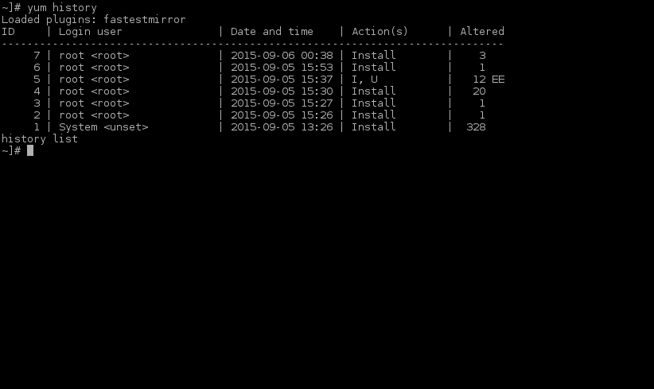
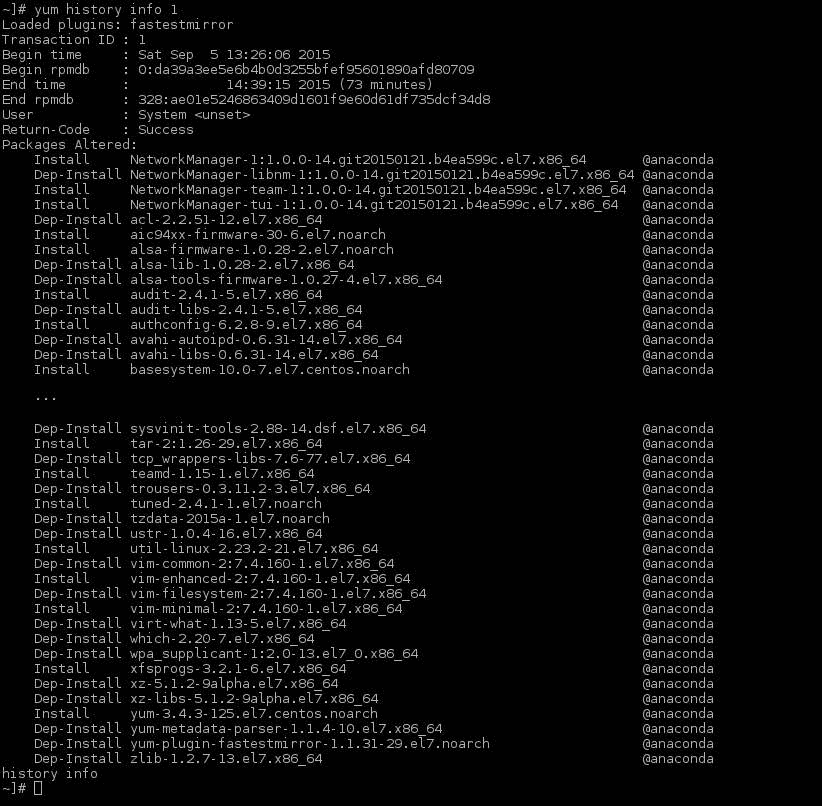
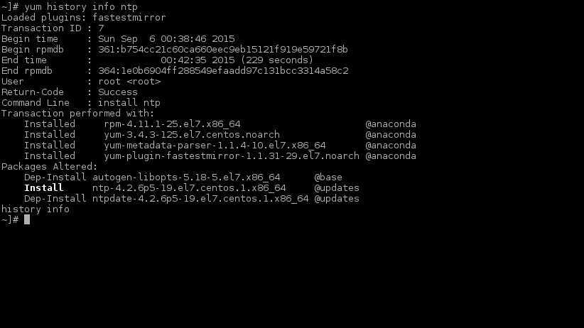
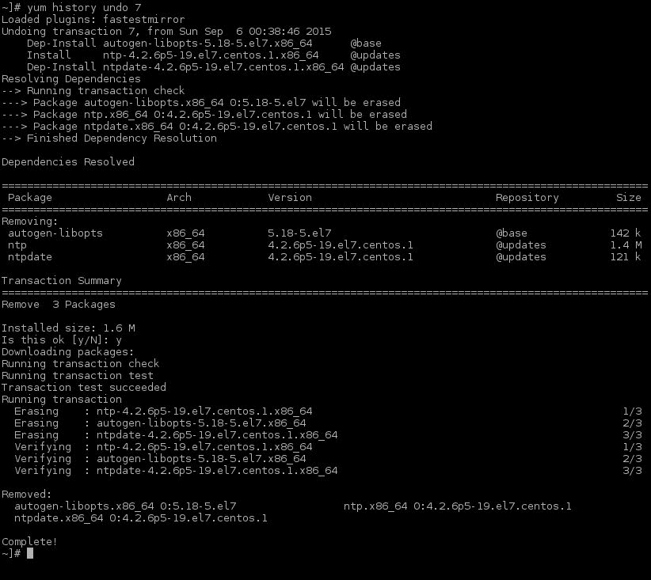
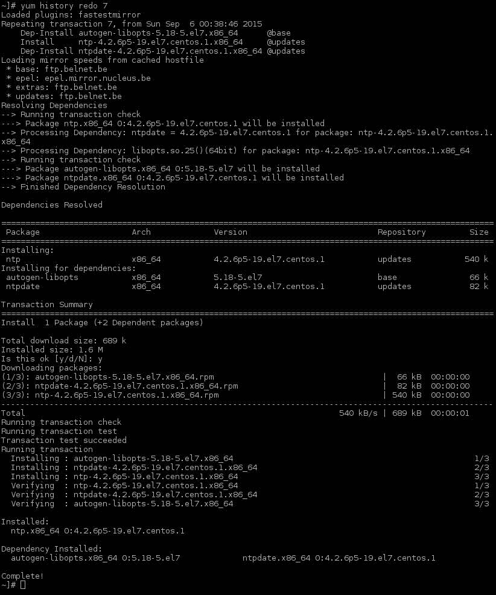
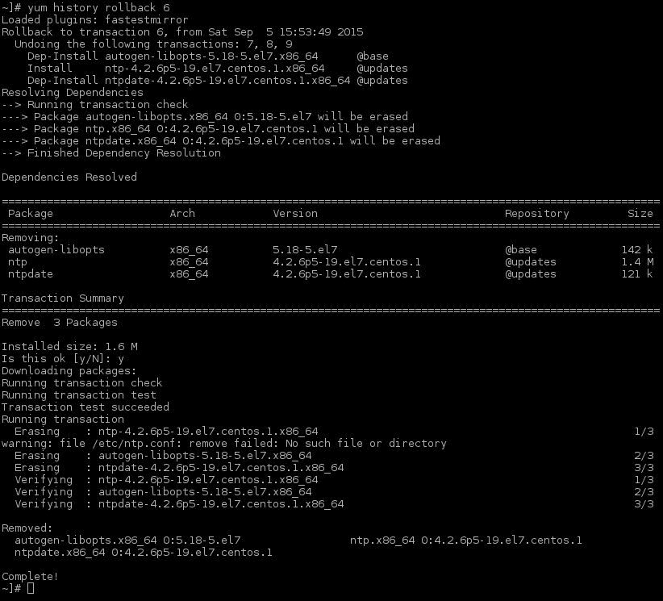
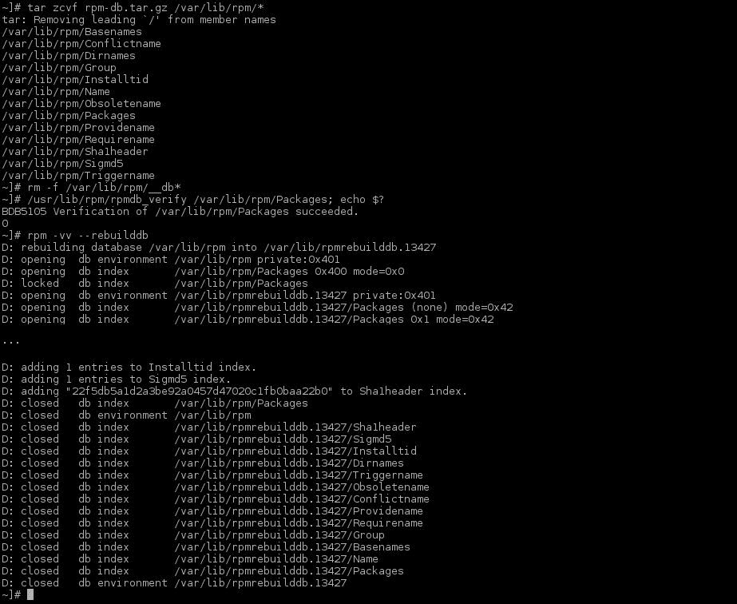

# 第八章. Yum 和仓库

在本章中，我们将介绍以下内容：

+   管理 yum 历史记录

+   创建任何（RHN）仓库的副本（镜像）

+   配置额外的仓库

+   设置 yum 自动更新

+   配置 `logrotate` 用于 yum

+   从损坏的 RPM 数据库恢复

# 介绍

最初，你需要从源代码手动编译 GNU/Linux 系统，这通常是耗时且麻烦的，尤其是当你无法正确处理依赖关系时。1998 年，红帽公司创建了**红帽包管理器**（**RPM**），旨在解决依赖问题并减少系统安装所需的时间（以及其他问题）。自那时以来，RPM 被开源社区不断改进，其中一个改进就是 yum。

**Yellowdog Updater, Modified**（**yum**）是一个使用 RPM 的包管理工具。它允许 RPM 访问远程的 RPM 文件仓库，并会根据 RPM 提供的依赖信息自动下载所需的 RPM 文件。

如果没有 Red Hat Network 订阅，你将无法访问更新。

除了 Red Hat Network，你还可以购买 Red Hat Satellite，如果你需要更多的控制权来管理你的 Red Hat 系统。

# 管理 yum 历史记录

yum 的一个常被忽视的特性是历史记录。它允许你执行许多额外的功能，这些功能在企业环境中可以为你省去不少麻烦。

它允许你将“时间倒回”，恢复到应用程序的最后正常状态，万一包更新出现问题，你也不必担心依赖关系等问题。

## 如何操作…

在这篇文章中，我将向你展示一些最常用的 yum 历史记录功能。

### 你的 yum 历史记录

使用以下命令显示你的 yum 历史记录：

```
~]# yum history list

```

上述命令将列出输出，内容如下：



### 关于 yum 事务或包的信息

执行以下命令显示 yum 事务的详细信息：

```
~]# yum history info 1

```

这将显示有关这个单个事务的所有信息：



使用以下命令显示通过 yum 安装的包的详细信息：

```
~]# yum history info ntp

```

这将显示所有以某种方式（安装/更新/删除）修改 `ntp` 包的事务信息：



### 撤销/重做某些 yum 事务

使用以下命令撤销特定的事务：

```
~]# yum history undo 7

```

这个命令撤销特定的事务（由 ID 定义），如下图所示：



现在，你可以使用以下命令重做特定的事务：

```
~]# yum history redo 7

```

这个命令将重新执行特定的事务（由事务 ID 定义），如下所示：



### 回滚到事务历史中的某个特定点

这允许你撤销直到指定事务 ID 之前的所有事务。运行以下命令：

```
~]# yum history rollback 6

```

这里，回滚到的事务 ID 是 `6`。你将得到以下输出：



## 还有更多…

使用历史选项，如撤销和回滚时需要小心。Yum 会尽力遵循这些操作，但它不能恢复配置，并且如果你已经编辑过配置文件，它不会恢复配置文件的先前版本。如果没有备份，这不是一个保险的选项。尽管这两个选项非常有用，但我建议你不要频繁使用它们。在使用时，尽量将事务的影响控制得越小越好。增量越小，撤销或回滚成功的机会就越大！

## 另见

请参考 *yum(8)* 手册页，了解更多关于 yum 历史选项的信息。

# 创建 RHN 仓库的副本

在本教程中，我将向你展示如何为基于 Red Hat Network 的 yum 仓库和“纯” yum 仓库进行设置。

## 准备工作

在你创建 RHN 仓库的副本之前，需要确保你已经拥有有效的订阅，以访问你想要复制的仓库。当这个前提条件满足时，你可以从使用该订阅的机器上执行本教程。

## 如何操作…

在能够创建 yum 仓库之前，我们需要通过以下步骤安装一些工具：

1.  使用以下命令安装 `createrepo` 和 `yum-utils` 包：

    ```
    ~]# yum install -y yum-utils createrepo

    ```

1.  现在，安装 Apache Web 服务器，如下所示：

    ```
    ~]# yum install -y httpd

    ```

### 同步 RHN 仓库

你只能同步你有权限访问的 RHN 订阅。执行以下步骤：

1.  创建一个目录来存放 RHN `rhel7` 仓库，如下所示：

    ```
    ~]# mkdir /var/www/html/repo/rhel/rhel-x86_64-server-7/packages

    ```

1.  现在，通过执行以下命令创建 `/mnt/iso` 目录：

    ```
    ~]# mkdir -p /mnt/iso

    ```

1.  通过以下方法挂载 RHEL 7 Server DVD：

    ```
    ~]# mount -o loop,ro /tmp/rhel-server-7.0-x86_64-dvd.iso /mnt/iso

    ```

1.  现在，将 `*-comps-Server.x86_64.xml` 文件从 RHEL Server DVD 复制到你的 `repo` 目录。以下命令可帮助完成此操作：

    ```
    ~]# cp /mnt/iso/repodata/*-comps-Server.x86_64.xml /var/www/html/repo/rhel/comps-Server.x86_64.xml

    ```

1.  卸载 RHEL Server DVD，如下所示：

    ```
    ~]# umount /mnt/iso

    ```

1.  通过运行以下命令同步 RHEL 7 操作系统仓库：（这可能需要一段时间…我建议你一边等待，一边喝一杯新磨制的阿拉比卡咖啡！）

    ```
    ~]# reposync --repoid=rhel-7-server-rpms --norepopath –download_path=/var/www/html/repo/rhel/rhel-x86_64-server-7/packages

    ```

1.  接下来，创建本地仓库（根据你的硬件配置，这可能需要很长时间），如下所示：

    ```
    ~]# cd /var/www/html/repo/rhel/rhel-x86_64-server-7/
    ~]# createrepo --groupfile=/var/www/html/repo/rhel/comps-Server.x86_64.xml .

    ```

1.  最后，通过以下方法测试你的仓库：

    ```
    ~]# curl http://localhost/repo/rhel/rhel-x86_64-server-7/repodata/repomd.xml

    ```

让我们通过以下步骤创建 EPEL 仓库的副本：

1.  首先，安装 EPEL 仓库，如下所示：

    ```
    ~]# yum install -y epel-release

    ```

1.  通过执行以下命令创建一个目录来存放 EPEL 仓库：

    ```
    ~]# mkdir -p /var/www/html/repo/epel/7/x86_64

    ```

1.  现在，将 `*-comps-epel7.xml` 文件下载到 `/repo` 目录并重命名为 `comps-epel7.xml`，如以下所示：

    ```
    ~]# curl -o /var/www/html/repo/epel/comps-epel7.xml http://mirror.kinamo.be/epel/7/x86_64/repodata/xxxxxxxxxxxxxxxxxxxx-comps-epel7.xml

    ```

你需要将多个 `x` 替换为 `repodata` 文件夹中找到的正确 MD5 哈希值。

1.  接下来，执行以下命令同步 EPEL 仓库（这可能需要非常长的时间，具体取决于你的硬件和网络速度）：

    ```
    ~]# reposync --repoid=epel --norepopath –download_path=/var/www/html/repo/epel/7/x86_64

    ```

1.  创建本地仓库（根据你的硬件配置，这可能需要很长时间），如下所示：

    ```
    ~]# cd /var/www/html/repo/epel/7/x86_64
    ~]# createrepo --groupfile=/var/www/html/repo/epel/comps-epel7.xml .

    ```

1.  最后，通过执行以下命令来测试您的仓库：

    ```
    ~]# curl http://localhost/repo/epel/7/x86_64/repodata/repomd.xml

    ```

## 还有更多……

在同步 RHEL 7 仓库时，您只能同步您有权限访问的仓库。要查看您在连接到 RHN 的系统上拥有的权限，请执行以下命令：

```
~]# cd /etc/yum/pluginconf.d/ && echo *.conf | sed "s/rhnplugin.conf//"|sed 's/\([0-9a-zA-Z\-]*\).conf/--disableplugin=\1/g'|xargs yum repolist && cd - >/dev/null

```

每次同步仓库时，尽量保持与原始仓库相同的目录结构。我发现，当你想重写 `/etc/yum.repos.d` 文件时，这会使生活更轻松。

在企业环境中，确保所有系统处于相同的 RPM 版本水平时，“冻结”您的 yum 仓库是非常有用的。默认情况下，任何仓库都是“活动”的，并会在添加新软件包时进行更新。这样做的好处是，您总是可以获得所有软件包的最新版本；但是缺点是，您的环境可能不统一，并且您可能会因同一软件包的不同版本而进行故障排除。

实现“冻结”仓库的最简单方法是创建一个中央位置，用于存放所有的 RPM 包，就像普通的 yum 镜像或副本一样。

每隔 `x` 时间（您预先定义的时间间隔），创建一个带有时间戳的新目录，在其中硬链接所有您镜像的 RPM 包。最后，创建该目录的硬链接，稍后将在您的 repo 配置中使用。

这是一个示例：

| 目录 | 描述 |
| --- | --- |
| `/rhel7/x86_64.all` | 此目录包含一个每天同步的镜像。RPM 包会被添加，但不会删除。 |
| `/rhel7/x86_64.20150701` | 此目录包含指向 `/rhel7/x86_64` 中 RPM 包的硬链接，所有这些包均于 2015 年 07 月 01 日同步，另外还包括 `/rhel6/x86_64.20150701` 目录的每月迭代版本。 |
| `/rhel7/x86_64` | 此目录包含指向每月迭代版本的硬链接，该版本被认为是生产中的版本。 |

当然，你需要确保为每次新的同步创建一个仓库！

## 另见

参考 *createrepo(8)* 手册页，获取更多有关创建仓库的信息。

另外，参考 *reposync(1)* 手册页，获取更多有关保持仓库最新的信息。

# 配置额外的仓库

无论是创建自己的镜像仓库，还是组织为您提供仓库中的软件，在 RHEL 系统上设置额外的仓库都非常简单。本教程将向您展示如何设置它们。许多仓库有自己的 repo 文件，甚至有自动安装仓库的 RPM。如果这些可用，不要犹豫，尽管使用它们！

## 准备工作

为了使其工作，您需要设置一个可以通过以下 URL 访问的仓库：`http://repo.example.com/myrepo/7/x86_64`。

## 如何操作……

为了创建一个额外的仓库，请在 `/etc/yum.repos.d` 中创建一个名为 `myrepo.repo` 的文件，其中包含以下信息：

```
[myrepo]
name=My Personal Repository
baseurl=http://repo.example.com/myrepo/$releasever/$basearch
gpgcheck=0
enabled=1
```

## 还有更多……

`gpgcheck=1` 选项仅在您或仓库提供者已签署仓库中的所有 RPM 时有效。这通常是一个好做法，并为您的仓库提供额外的安全性。

`$releasever` 和 `$basearch` 变量允许您创建一个可以在多个系统上使用的单一仓库文件，只要您有适当的 URL 仓库。`$releasever` 变量展开为操作系统的主要版本（在我们这里是 7），而 `$basearch` 会展开为 x86_64。在 i386 系统上（RHEL 7 仅提供 x86_64 架构），`$basearch` 会展开为 i386。

你可以在互联网上找到许多仓库，如 `epel` 和 `elrepo`，但使用它们并不总是个好主意。Red Hat 标准仓库提供的任何软件都会得到 Red Hat 的支持，如果你开始使用通过其他仓库提供的相同软件，他们将不再为你提供支持。所以，最好确保你不关心支持，或者有其他愿意为你提供支持的方。

## 另见

尽管我不建议在生产环境中使用这些方法而不采取适当的支持措施，但这里有一些流行的仓库列表，您可以使用：

ELRepo 仓库可以在以下位置找到：

[`elrepo.org/tiki/tiki-index.php`](http://elrepo.org/tiki/tiki-index.php)

EPEL 仓库位于：

[`fedoraproject.org/wiki/EPEL`](https://fedoraproject.org/wiki/EPEL)

Puppetlabs 的仓库可以在以下位置找到：

[`docs.puppetlabs.com/guides/puppetlabs_package_repositories.html`](https://docs.puppetlabs.com/guides/puppetlabs_package_repositories.html)

Zabbix 仓库位于以下链接：

[`www.zabbix.com/documentation/2.0/manual/installation/install_from_packages`](https://www.zabbix.com/documentation/2.0/manual/installation/install_from_packages)

对于 RepoForge 仓库，请参考以下网站：

[`repoforge.org/use/`](http://repoforge.org/use/)

Remi 的仓库可以在以下位置找到：

[`rpms.famillecollet.com/`](http://rpms.famillecollet.com/)

Webtatic 的仓库位于：

[`webtatic.com/projects/yum-repository/`](https://webtatic.com/projects/yum-repository/)

# 设置 yum 自动更新

在企业中，自动化更新 RHEL 系统非常重要。你希望走在黑客的前面，或者总的来说，避免那些通过利用你环境中的弱点来伤害你的人。

尽管我不推荐将此方案应用于企业中的所有系统，但它对于确保某些系统在 Red Hat（及其他）仓库中应用补丁和修复后能够保持最新非常有用。

## 准备工作

为了使此方案生效，您需要确保所使用的仓库已正确设置，并且您已正确配置邮件系统（例如使用 Postfix 或 Sendmail）。

## 如何操作…

我们将设置 yum 每周自动更新一次系统（在 03:00），如有必要，重启系统，步骤如下：

1.  按如下方式安装 yum cron 插件：

    ```
    ~]# yum install -y yum-cron

    ```

1.  然后，通过以下命令禁用每小时和每天的 yum cron 任务：

    ```
    ~]# echo > /etc/cron.dhourly/0yum-hourly.cron
    ~]# echo > /etc/cron.daily/0yum-daily.cron

    ```

1.  通过以下方式创建每周 yum 更新的 cron 任务配置文件：

    ```
    ~]# cp /etc/yum/yum-cron.conf /etc/yum/yum-cron-weekly.conf

    ```

1.  修改创建的配置文件，通过设置以下值来应用更新并通过电子邮件发送通知：

    ```
    apply_updates = yes
    emit_via = email
    email_to = <your email address>

    ```

1.  接下来，通过将以下内容添加到 `/etc/cron.weekly/yum-weekly.cron`，创建一个每周的 cron 任务：

    ```
    #!/bin/bash 

    # Only run if this flag is set. The flag is created by the yum-cron init
    # script when the service is started -- this allows one to use chkconfig and
    # the standard "service stop|start" commands to enable or disable yum-cron.
    if [[ ! -f /var/lock/subsys/yum-cron ]]; then
     exit 0
    fi

    # Action!
    exec /usr/sbin/yum-cron /etc/yum/yum-cron-weekly.conf
    if test "$(yum history info |egrep '\skernel'|wc -l)" != "0"; then

    /sbin/shutdown --reboot +5 "Kernel has been upgraded, rebooting the server in 5 minutes. Please save your work."
    fi

    ```

1.  最后，通过执行以下命令使 cron 任务可执行：

    ```
    ~]# chmod +x /etc/cron.weekly/yum-weekly.cron

    ```

## 它是如何工作的……

默认情况下，`yum-cron` 会设置一个 cron 任务，每小时运行一次（`/etc/cron.dhourly/0yum-hourly.cron`）和每天运行一次（`/etc/cron.daily/0yum-daily.cron`）。

## 还有更多内容……

这个步骤将升级你所有的包，当有更新时。如果你只想应用安全修复，请按以下方式修改你的 yum cron 配置文件中的 `update_cmd` 值：

```
update_cmd = security
```

或者，如果你只想应用关键修复，可以使用以下配置：

```
update_cmd = security-severity:Critical
```

## 另见：

查看 *yum cron(8)* 手册页或位于 `/etc/yum/yum-cron.conf` 的默认 `yum-cron.conf` 文件，了解更多信息。

# 配置 yum 的 logrotate

每次使用 yum 安装和/或更新包时，它都会记录到 `/var/log/yum.log`。很多人不希望频繁轮换该文件，因为他们错误地认为这是唯一的 yum 任务历史记录来源。他们甚至可能认为它提供了一种在 RPM 数据库损坏时恢复数据库的方式——实际上并不是。

我确实建议保留完整的 yum 历史记录，因为它的增长并不大，除非你经常重新安装包。

为了更好地管理你的 yum 历史记录，我建议你使用 yum history。

默认情况下，你的 yum 日志文件是按年轮换的，甚至只有在日志文件大小超过 30 KB 时才会轮换，而且日志只保留 4 年。通常，在物理环境中，这已经足够，因为物理服务器通常每 3-4 年就会被替换。然而，虚拟服务器有可能超过这 3-4 年仍然“存活”。

## 如何操作……

将 `/etc/logrotate.d/yum` 修改为如下内容：

```
/var/log/yum.log {
    missingok
    notifempty
    size 30k
    rotate 1000
    yearly
    create 0600 root root
}
```

## 它是如何工作的……

该配置只会在 yum 日志文件大小超过 30 KB 时每年轮换一次日志，并且会保留 1000 个已轮换的日志文件，相当于保留了 1000 年的日志！

## 另见：

如需了解更多关于如何使用和配置 logrotate 的信息，请参阅 *logrotate(8)* 手册页。

# 从损坏的 RPM 数据库恢复

尽管已做出一切确保你的 RPM 数据库完好无损，但你的 RPM 数据库可能会损坏并无法使用。这通常发生在 `rpm db` 所在的文件系统突然无法访问时（例如文件系统满、只读、重启等情况）。

这个步骤将向你展示恢复 RPM 数据库的两种方式。

## 准备工作：

确保你的系统已经以某种方式备份。

## 如何操作……

我们将从最简单且成功率最高的选项开始：

1.  首先创建一个损坏的 `rpm db` 的备份，步骤如下：

    ```
    ~]# cd; tar zcvf rpm-db.tar.gz /var/lib/rpm/*

    ```

1.  如果存在过时的锁文件，请通过以下命令将其删除：

    ```
    ~]# rm -f /var/lib/rpm/__db*

    ```

1.  现在，通过以下命令验证 `Packages` 数据库的完整性：

    ```
    ~]# /usr/lib/rpm/rpmdb_verify /var/lib/rpm/Packages; echo $?

    ```

    如果前一步输出 `0`，请继续进行第 7 步。

1.  重命名 `Packages` 文件（不要删除它，我们还需要它！），步骤如下：

    ```
    ~]# mv /var/lib/rpm/Packages  /var/lib/rpm/Packages.org

    ```

1.  接下来，执行以下命令从原始的 `Packages db` 中转储 `Packages db`：

    ```
    ~]# cd /usr/lib/rpm/rpmdb_dump Packages.org | /usr/lib/rpm/rpmdb_load Packages

    ```

1.  验证新创建的 `Packages` 数据库的完整性。执行以下操作：

    ```
    ~]# /usr/lib/rpm/rpmdb_verify /var/lib/rpm/Packages; echo $?

    ```

    如果退出代码不是 `0`，则需要从备份中恢复数据库。

1.  重新构建 `rpm` 索引，步骤如下：

    ```
    ~]# rpm -vv --rebuilddb

    ```

1.  接下来，使用以下命令通过 yum 检查 `rpm db` 是否存在其他问题（此操作可能需要较长时间）：

    ```
    ~]# yum check

    ```

1.  通过以下命令恢复 `rpm` 数据库的 SELinux 上下文：

    ```
    ~]# restorecon -R -v /var/lib/rpm

    ```

    

## 还有更多…

如果由于某种原因，你无法恢复 RPM 数据库，还有最后一个选择。企业通常有标准化的构建，许多服务器安装了相同的软件包，因此可以从另一台拥有相同软件包集的健康服务器复制 `/var/lib/rpm` 目录到损坏的服务器，并执行前面步骤中的操作，确保一切正常。

虽然你会找到一些额外的工具可以救急（例如 RPM cron），但通常拥有一个良好的备份更为实际。
