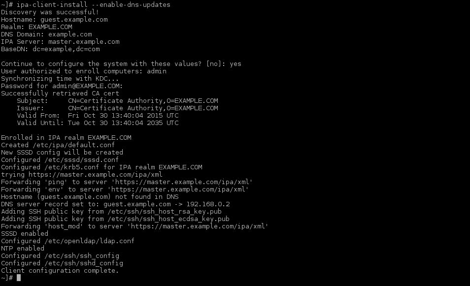
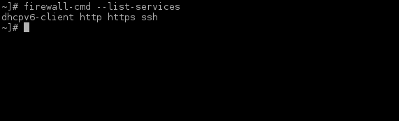
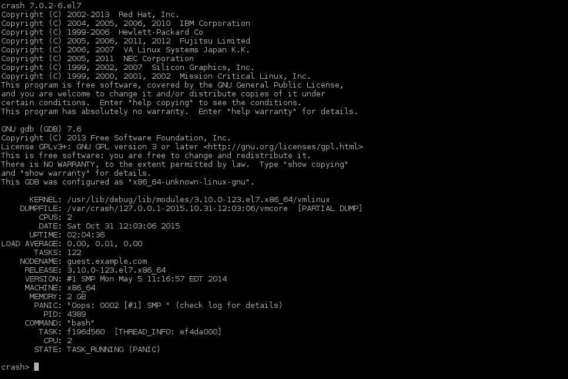
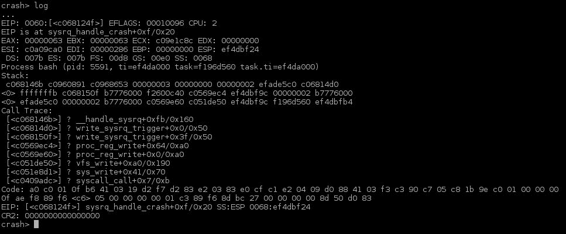
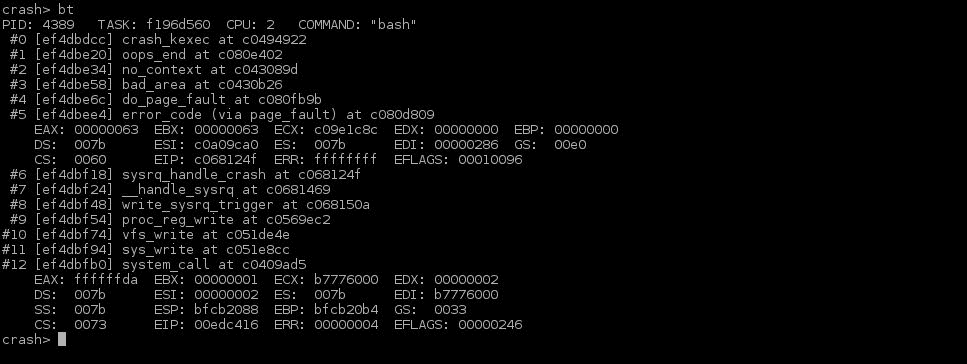
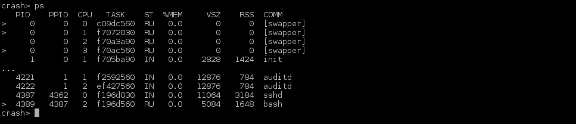
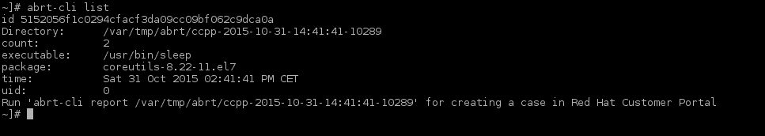
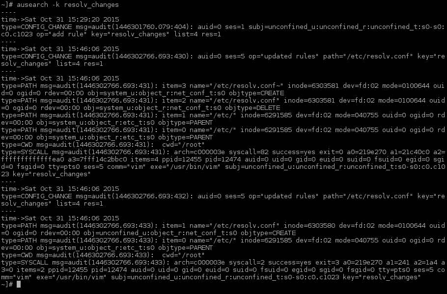
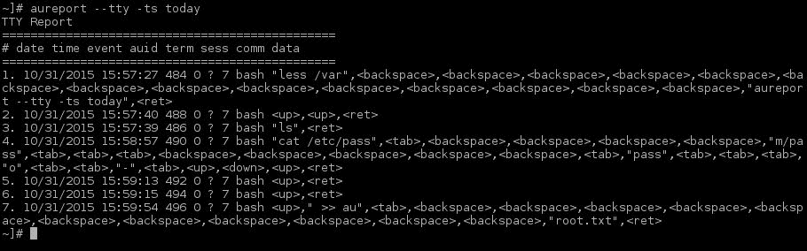

# 第九章：加固 RHEL 7

在本章中，您将学习以下内容：

+   安装和配置 IPA

+   加强系统登录安全

+   配置 sudo 提权

+   使用 `firewalld` 加强网络安全

+   使用 kdump 和 SysRq

+   使用 ABRT

+   审计系统

# 介绍

安全性是您环境中的一个重要方面。本章提供的示例并不是一套完整的操作指南，而是为环境中的安全性提供了一个起点，因为每个环境都不同。本章旨在让您了解如何使用 Red Hat Enterprise Server 7 中包含的简单工具来提升安全性。

在本章中，我不会尝试解释系统如何存储 syslog 消息以及它们的含义，因为这是一个相当复杂的话题。最重要的与安全相关的 syslog 消息可以在 `/var/log/secure` 和 `/var/log/audit/audit.log` 中找到。

# 安装和配置 IPA

**IPA**（**身份策略审计**）服务器允许您在一个中心位置管理您的 Kerberos、DNS、主机、用户、sudo 规则、密码策略和自动挂载。IPA 是一组软件包的组合，包括但不限于 `bind`、`ldap`、`pam` 等。它将这些功能结合起来，为您的环境提供身份管理。

## 准备工作

在本示例中，我将选择集成的 DNS 设置，尽管也可以使用现有的 DNS 基础设施。

## 如何操作……

首先，我们将安装服务器组件，然后进行 IPA 客户端的配置。

### 安装 IPA 服务器

按照以下说明安装 IPA 服务器：

1.  通过以下命令安装必要的软件包：

    ```
    ~]# yum install -y ipa-server bind bind-dyndb-ldap

    ```

1.  安装软件包后，按照如下方式调用 `ipa` 安装程序：

    ```
    ~]# ipa-server-install

    ```

在此阶段，您将被问及一些关于如何设置 IPA 服务器的问题。

1.  按如下方式配置集成的 DNS：

    ```
    Do you want to configure integrated DNS (BIND)? [no]: yes

    ```

1.  按如下方式覆盖现有的 `/etc/resolv.conf`：

    ```
    Existing BIND configuration detected, overwrite? [no]: yes

    ```

1.  提供 IPA 服务器的主机名，如下所示：

    ```
    Server host name [localhost.localdomain]: master.example.com

    ```

1.  现在，确认 IPA 服务器的 DNS 域名，如下所示：

    ```
    Please confirm the domain name [example.com]:

    ```

1.  提供 IPA 服务器的 IP 地址，如下所示：

    ```
    Please provide the IP address to be used for this host name: 192.168.0.1

    ```

1.  接下来，提供一个 Kerberos `realm` 名称，如下所示：

    ```
    Please provide a realm name [EXAMPLE.COM]:

    ```

1.  创建目录管理员的密码并确认，如下所示：

    ```
    Directory Manager password:

    ```

1.  创建 IPA 管理员的密码并确认，如下所示：

    ```
    IPA admin password:

    ```

1.  现在，按如下方式配置 DNS 转发器：

    ```
    Do you want to configure DNS forwarders? [yes]: no

    ```

1.  最后，按如下方式配置反向 DNS 区域：

    ```
    Do you want to configure the reverse zone? [yes]:
    Please specify the reverse zone name [0.168.192.in-addr.arpa.]:

    ```

    安装程序现在将提供类似于以下的概述：

    ```
    The IPA Master Server will be configured with:
    Hostname:      master.example.com
    IP address:    192.168.0.1
    Domain name:   example.com
    Realm name:    EXAMPLE.COM

    BIND DNS server will be configured to serve IPA domain with:
    Forwarders:    No forwarders
    Reverse zone:  0.168.192.in-addr.arpa.

    ```

1.  现在，通过输入 "yes" 来确认信息，如下所示：

    ```
    Continue to configure the system with these values? [no]: yes

    ```

此时，您将看到屏幕上滚动大量信息，指示安装程序正在执行的操作：安装或配置 NTP、LDAP、BIND、Kerberos、HTTP、证书服务器以及前面示例中的 IPA 相关修改。

安装和配置过程可能需要一些时间，请耐心等待。

### 安装 IPA 客户端

执行以下步骤以在系统上安装和配置 IPA 客户端：

### 提示

确保你的系统主机名不同于 `localhost.localdomain`。如果不是，客户端配置将失败。

1.  通过以下命令安装必要的软件包：

    ```
    ~]# yum install -y ipa-client

    ```

1.  确保通过以下方式将 IPA 服务器用作 DNS 服务器：

    ```
    ~]# cat /etc/resolv.conf
    search example.com
    nameserver 192.168.0.1

    ```

1.  通过运行此命令行来调用 IPA 客户端配置：

    ```
    ~]# ipa-client-install --enable-dns-updates

    ```

安装程序现在将显示检测到的 IPA 服务器概览，并要求提供一个用户（IPA 管理员）和密码来注册你的系统，如下图所示：



## 还有更多…

安装后，你可以使用命令行工具 IPA 或通过 Web 界面管理 IPA 环境，该界面可以通过在浏览器中访问你的 IPA 主服务器的 HTTPS 地址来访问。在这种情况下，URL 是 `https://master.example.com`。

默认情况下，IPA 客户端不会在用户第一次登录时为新用户创建 `homedirs`。如果你想启用此功能，可以使用 `--mkhomedir` 参数与 `ipa-client-install` 一起使用。如果你不小心忘记了这一步，没必要重新安装 IPA 客户端。你只需要执行以下命令重新配置它：

```
~]# authconfig --enablemkhomedir --update

```

## 另请参见

如需关于安装和配置 IPA 服务器的更深入信息，请访问 [`access.redhat.com/documentation/en-US/Red_Hat_Enterprise_Linux/7/html/Linux_Domain_Identity_Authentication_and_Policy_Guide/installing-ipa.html`](https://access.redhat.com/documentation/en-US/Red_Hat_Enterprise_Linux/7/html/Linux_Domain_Identity_Authentication_and_Policy_Guide/installing-ipa.html)。

如需了解通过命令行管理 IPA 环境的更多信息，请阅读 *ipa (1)* 手册页。

# 保护系统登录

应用到系统登录的默认设置是基于 Red Hat 认为的基本安全性。如果由于某种原因你想更改这些设置，本文将展示几个示例。Authconfig 有两个工具可用于配置身份验证：`authconfig` 和 `authconfig-tui`。

这两个工具会为你配置 `pam`，以确保在 rpm 更新中这些更改是一致的。

`authconfig-tui` 工具的功能不如计划中的 `authconfig` 工具丰富，我个人建议你使用 `authconfig`，因为它允许你做更多的操作。

如果你知道自己在做什么，你可以手动编辑位于 `/etc/pam.d` 中的文件，但不建议这样做。

## 如何操作…

执行以下步骤：

首先，将 `/etc/shadow` 中存储的密码哈希加密更改为 `sha512`，如下所示：

```
~]# authconfig --passalgo=sha512 --update

```

通过以下命令启用 NIS 身份验证：

```
~]# authconfig --enablenis –nisdomain=NISDOMAIN --nisserver=nisserver.example.com --update

```

现在，通过以下命令将密码的最小长度要求设置为 `16`：

```
~]# authconfig --passminlen=16 --update

```

密码中至少需要包含一个小写字母，你可以通过运行以下命令来设置此要求：

```
~]# authconfig --enablereqlower --update

```

此外，密码中至少需要包含一个大写字母，你可以运行以下命令来实现：

```
~]# authconfig --enablerequpper --update

```

现在，密码中要求至少包含一个数字。为此执行以下命令：

```
~]# authconfig --enablereqdigit --update

```

最后，用户的密码至少需要包含一个非字母数字字符，你可以通过以下命令设置：

```
~]# authconfig --enablereqother --update

```

## 工作原理…

`authconfig` 和 `authconfig-tui` 是用于修改多种文件的包装脚本，包括但不限于 `/etc/nsswitch.conf`、`/etc/pam.d/*`、`/etc/sssd.conf`、`/etc/openldap/ldap.conf` 和 `/etc/sysconfig/network`。

该工具的优点是它使用正确的语法，这有时可能有些棘手，尤其是对于 `/etc/pam.d` 中的文件。

## 还有更多…

该工具的一个有趣特点是备份和恢复功能。如果你没有使用任何集中式身份验证和认证基础设施（例如 IPA），你可以使用此功能备份正确配置的机器，并通过你选择的任何方式分发该备份。

要备份你的 `authconf` 配置，请执行以下命令：

```
~]# authconfig --savebackup=/tmp/auth.conf

```

这将创建一个 `/tmp/auth.conf` 目录，其中包含 `authconfig` 修改的所有文件。

将该目录复制到另一台服务器并通过执行以下命令恢复配置：

```
~]# authconfig –-restorebackup=/tmp/auth.conf

```

你通过 `authconfig` 应用的所有安全更改也可以通过 IPA 管理。

## 另见

有关更多信息和更多配置选项，请查看 *authconfig (8)* 手册页。

你也可以在 Red Hat 的认证页面找到更多信息：[`access.redhat.com/documentation/en-US/Red_Hat_Enterprise_Linux/7/html/System-Level_Authentication_Guide/Configuring_Authentication.html`](https://access.redhat.com/documentation/en-US/Red_Hat_Enterprise_Linux/7/html/System-Level_Authentication_Guide/Configuring_Authentication.html)。

# 使用 sudo 配置特权提升

Sudo 允许用户以其他用户的安全权限运行应用程序和脚本。

## 准备工作

在允许某人提高特定应用程序或脚本的安全上下文之前，你需要弄清楚要提升的用户或组、使用的应用程序/脚本以及在哪些系统上运行它们。

sudo 条目的默认语法如下：

```
who where = (as_whom) what

```

## 如何操作…

这五个简单的步骤将指导你完成特权提升的设置：

1.  通过以下命令在 `/etc/sudoers.d/` 中创建一个新的 `sudoers` 定义文件，命名为 clustering：

    ```
    ~]# visudo -f /etc/sudoers.d/clustering

    ```

1.  通过执行以下命令，为最常用的集群工具创建一个命令别名，命名为 `CLUSTERING`：

    ```
    Cmnd_Alias CLUSTERING = /sbin/ccs, /sbin/clustat, /sbin/clusvcadm
    ```

1.  现在，创建一个名为 `CLUSTERS` 的主机别名组，包含所有集群，如下所示：

    ```
    Host_Alias CLUSTERS = cluster1, cluster2
    ```

1.  接下来，通过执行以下命令，为所有集群管理员创建一个用户别名，命名为 `CLUSTERADMINS`：

    ```
    User_Alias CLUSTERADMINS = spalpatine, dvader, okenobi, qjinn
    ```

1.  现在，让我们创建一个 sudo 规则，允许 `CLUSTERADMINS` 中的用户在 `CLUSTERS` 组内的所有服务器上执行来自 `CLUSTERING` 的命令，如下所示：

    ```
    CLUSTERADMINS CLUSTERS = (root) CLUSTERING
    ```

## 还有更多…

要编辑 `sudoers` 文件，你可以使用文本编辑器编辑 `/etc/sudoers`，或者使用 `visudo` 工具，它会在退出时自动检查你的语法。

最好不要动原始的`/etc/sudoers`文件，而是修改位于`/etc/sudoers.d/`目录下的文件。这样可以在必要时由 sudo rpm 更新`sudoers`文件。

## 另请参阅

要了解有关 sudo 的更多信息，请查看*sudoers(5)*手册页面。

# 使用`firewalld`保护网络

`firewalld`是一组脚本和守护程序，用于管理您的 RHEL 系统上的`netfilter`。它旨在为系统上的防火墙创建一个简单的命令行界面。

## 如何做…

默认情况下，`firewalld`包含在“core”rpm 组中，但由于某些原因（如在 kickstart 中遗漏），可能未安装。执行以下步骤：

1.  通过以下命令行安装`firewalld`：

    ```
    ~]# yum install -y firewalld

    ```

1.  现在，通过以下步骤启用`firewalld`：

    ```
    ~]# systemctl enable firewalld

    ```

1.  最后，请执行以下命令行确保`firewalld`已启动：

    ```
    ~]# systemctl restart firewalld

    ```

### 显示当前在系统上允许的服务和端口

使用以下命令列出所有允许的服务：

```
~]# firewall-cmd –list-services

```

您可以查看以下输出，其中列出了所有允许的服务：



现在，使用以下命令显示防火墙允许的`tcp`/`udp`端口：

```
~]# firewall-cmd --list-ports

```

输出应如下所示：


### 允许 NFS(v4)的传入请求

执行以下步骤允许系统上的 NFSv4 流量：

1.  首先，通过此命令允许`nfs`流量：

    ```
    ~]# firewall-cmd --add-service nfs –-permanent
    success
    ~]#

    ```

1.  然后，按以下方式重新加载配置：

    ```
    ~]# firewall-cmd --reload
    success
    ~]#

    ```

1.  现在，通过执行以下命令行检查新应用的规则：

    ```
    ~]# firewall-cmd –-list-services
    nfs
    ~]#

    ```

### 允许任意端口的传入请求

执行以下步骤以允许通过`tcp`和`udp`上的`1234`端口的传入流量：

1.  首先，通过运行以下命令允许`tcp`和`udp`上的`1234`端口流量：

    ```
    ~]# firewall-cmd --add-port 1234/tcp --permanent
    success
    ~]# firewall-cmd --add-port 1234/udp --permanent
    success
    ~]#

    ```

1.  通过执行以下命令重新加载配置：

    ```
    ~]# firewall-cmd –-reload
    success
    ~]#

    ```

1.  通过以下命令检查新应用的规则：

    ```
    ~]# firewall-cmd –-list-ports
    1234/tcp 1234/udp
    ~]#

    ```

## 这里还有…

`firewalld`提供了一组预定义的端口配置，如 HTTP 和 HTTPS。您可以在`/lib/firewalld/services`中找到所有这些定义。当创建自己的端口定义或修改现有定义时，应在`/etc/firewalld/services`中创建新的端口定义文件。

当创建新的“规则”（如添加端口、服务等）时，需要添加`--permanent`选项，否则在系统重新启动或重新加载`firewalld`策略时，更改将会丢失。

## 另请参阅

要了解有关配置防火墙的更多信息，请查看*firewall-cmd(1)*的 man 页面。

# 使用 kdump 和 SysRq

kdump 机制是 Linux 内核的一个功能，允许您在内核崩溃时创建转储。它生成内存的精确副本，可用于分析崩溃的根本原因。

SysRq 是 Linux 内核支持的一项功能，允许您即使在系统无响应时也能向其发送键组合。

## 如何操作……

首先，我们将设置 kdump 和 SysRq，之后，我会向您展示如何使用它来调试转储。

### 安装和配置 kdump 和 SysRq

让我们看看如何安装和配置：

1.  通过执行以下命令安装 kdump 所需的包：

    ```
    ~]# yum install -y kexec-tools

    ```

1.  使用此命令确保`crashkernel=auto`出现在`/etc/sysconfig/grub`文件中的`GRUB_CMDLINE_LINUX`变量声明中：

    ```
    GRUB_CMDLINE_LINUX="rd.lvm.lv=system/usr rd.lvm.lv=system/swap vconsole.keymap=us rd.lvm.lv=system/root vconsole.font=latarcyrheb-sun16 crashkernel=auto"
    ```

1.  通过执行以下命令启动`kdump`：

    ```
    ~]# systemctl start kdump

    ```

1.  现在，启用`kdump`在启动时自动启动，如下所示：

    ```
    ~]# sysctl enable kdump

    ```

1.  通过以下命令配置 SysRq 接受所有命令：

    ```
    ~]# echo "kernel.sysrq = 1" >> /etc/sysctl.d/sysrq.conf
    ~]# systemctl -q -p /etc/sysctl.d/sysrq.conf

    ```

1.  通过执行以下命令，重新生成您的**intramfs**（**初始 RAM 文件系统**），以包含 kdump 所需的信息：

    ```
    ~]# dracut --force

    ```

1.  最后，通过以下命令重启：

    ```
    ~]# reboot

    ```

### 使用 kdump 工具分析转储

尽管您可以在`vmcore-dmesg.txt`文件中找到大部分所需的信息，有时查看`vmcore`转储中的位和字节也是有用的，即使这只是为了了解 Red Hat 的技术人员在让您发送`vmcore`转储时会做什么。执行以下步骤：

1.  通过以下命令安装调试`vmcore`转储所需的工具：

    ```
    ~]# yum install -y --enablerepo=\*debuginfo crash kernel-debuginfo

    ```

1.  通过执行以下命令找到您的`vmcore`：

    ```
    ~]# find /var/crash -name 'vmcore'
    /var/crash/127.0.0.1-2015.10.31-12:03:06/vmcore

    ```

    ### 注意

    如果您没有核心转储，可以通过执行以下命令手动触发：

    ```
    ~]# echo c > /proc/sysrq-trigger

    ```

1.  使用`crash`分析内容，如下所示：

    ```
    ~]# crash /var/crash/127.0.0.1-2015.10.31-12:03:06/vmcore /usr/lib/debug/lib/modules/<kernel>/vmlinux

    ```

    在这里，`<kernel>`必须与创建转储时使用的内核相同：

    

1.  通过执行以下命令显示内核消息缓冲区（这也可以在`vmcore-dmesg.txt`转储文件中找到）：

    ```
    crash> log

    ```

    输出应该是这样的：

    

1.  通过以下命令显示内核堆栈跟踪：

    ```
    crash> bt

    ```

    输出应该是这样的：

    

1.  现在，展示核心转储时的进程，如下所示：

    ```
    crash> ps

    ```

    输出应该是这样的：

    

## 还有更多内容……

默认的 kdump 配置使用`/var/crash`来转储内存。此路径必须位于根文件系统上。一些系统配置了单独的文件系统用于`/var`，因此您需要在`/etc/kdump.conf`中更改位置，或使用其他目标类型，如`raw`、`nfs`等。如果您的崩溃目录位于非根文件系统上，kdump 服务将失败！

虽然 crash 工具可以提供有关崩溃的很多详细信息，但通常您只需要查看位于与`vmcore`文件相同目录中的`vmcore-dmesg.txt`文件的内容。因此，我建议您在深入分析内存转储的细节之前，先解析这个文件。

如前所述，SysRq 允许您在系统处于无法执行任何操作的状态下，依然能够控制系统。然而，它需要您可以访问系统的控制台。

默认情况下，kdump 会创建一个转储并重启系统。如果这没有发生，并且你不想按下（虚拟）系统上的电源按钮，SysRq 允许你通过控制台向内核发送命令。

发送信息所需的按键组合在不同架构间略有不同。请参考下表：

| 架构 | 按键组合 |
| --- | --- |
| x86 | `<Alt><SysRq><command key>` |
| Sparc | `<Alt><Stop><command key>` |
| 串口控制台（仅 PC 风格） | 这会发送`BREAK`，并在 5 秒内发送命令键。发送两次`BREAK`会被解释为正常的`BREAK`。 |
| PowerPC | `<Alt><Print Screen>`（或`<F13>`）`<command key>` |

因此，在 x86 系统上，你可以通过执行以下命令尝试在重启系统之前同步磁盘：

```
<Alt><SysRq><s>
<Alt><SysRq><b>

```

或者，如果你仍然可以访问终端，可以通过将字符发送到`/proc/sysrq-trigger`来执行相同操作，如下所示：

```
~]# echo s > /proc/sysrq-trigger
~]# echo b > /proc/sysrq-trigger

```

以下是可用的按键命令：

| 命令键 | 功能 |
| --- | --- |
| `b` | 这会立即重启你的系统。它不会同步或卸载磁盘，这可能导致数据损坏！ |
| `c` | 这会通过`NULL`指针解引用执行系统崩溃。如果配置了 kdump，则会生成崩溃转储。 |
| `d` | 这会显示所有持有的锁。 |
| `e` | 这会向所有进程发送`SIGTERM`信号，`init`进程除外。 |
| `f` | 这会调用`oom_kill`来终止任何占用内存的进程。 |
| `g` | 这由**内核调试器**（**kgdb**）使用。 |
| `h` | 这会显示帮助信息。（记住这个选项！） |
| `i` | 这会向所有进程发送`SIGKILL`信号，`init`进程除外。 |
| `j` | 这会通过`FIFREEZE` ioctl 冻结你的文件系统。 |
| `k` | 这会终止当前虚拟控制台上的所有程序。它可以通过终止所有试图获取键盘输入的恶意软件，确保安全登录。 |
| `l` | 这会显示所有活动 CPU 的堆栈跟踪。 |
| `m` | 这会将当前内存信息转储到控制台。 |
| `n` | 你可以用这个命令将实时任务设置为可调度状态。 |
| `o` | 这会关闭你的系统并将其关机（如果已配置并且受支持）。 |
| `p` | 这会将当前寄存器和标志转储到你的控制台。 |
| `q` | 这会转储每个 CPU 上所有已激活的`hrtimers`（不包括`timer_list`计时器）的列表，并附带所有时钟事件设备的详细信息。 |
| `r` | 这会关闭键盘的原始模式并将其设置为`XLATE`。 |
| `s` | 这会尝试同步所有已挂载的文件系统，将未写入的数据提交到其中。 |
| `t` | 这会将当前任务及其信息转储到控制台。 |
| `u` | 这会尝试将所有文件系统重新挂载为只读卷。 |
| `v` | 这会导致 ETM 缓冲区转储（这是 ARM 特定的）。 |
| `w` | 这会转储所有处于不可中断（阻塞）状态的任务。 |
| `x` | 这用于 ppc/powerpc 平台上的 xmon。它显示 SPARC64 上的全局 PMU 寄存器。 |
| `y` | 显示全局 CPU 寄存器（这是 SPARC64 特有的）。 |
| `z` | 转储 `ftrace` 缓冲区。 |
| `0` - `9` | 设置控制台的日志级别，控制哪些消息会被打印。数字越高，输出越多。 |

## 另见…

关于 SysRq 和 systemd 的更多信息，请参阅以下页面：[`github.com/systemdaemon/systemd/blob/master/src/linux/Documentation/sysrq.txt`](https://github.com/systemdaemon/systemd/blob/master/src/linux/Documentation/sysrq.txt)

Red Hat 提供了完整的崩溃转储指南，参见 [`access.redhat.com/documentation/en-US/Red_Hat_Enterprise_Linux/7/html/Kernel_Crash_Dump_Guide/index.html`](https://access.redhat.com/documentation/en-US/Red_Hat_Enterprise_Linux/7/html/Kernel_Crash_Dump_Guide/index.html)。

# 使用 ABRT

**ABRT**（**自动错误报告工具**）是一套帮助用户检测和分析应用程序崩溃的工具。

## 如何操作…

首先，我们将安装必要的包，然后了解如何使用这些工具。

### 安装和配置 abrtd

让我们安装 `abrt` 并让它运行起来：

1.  通过以下命令行安装 `abrt` 守护进程和工具：

    ```
    ~]# yum install -y abrt-cli

    ```

1.  现在，通过以下命令启用并启动 `abrt` 守护进程：

    ```
    ~]# systemctl enable abrtd
    ~]# systemctl restart abrtdThere's more...

    ```

### 使用 abrt-cli

执行以下命令列出所有检测到的分段错误：

```
~]# abtr-cli list

```

以下是输出应呈现的样式：



显示的位置信息包含有关分段错误的所有信息。你可以使用这些信息分析出错原因，如果需要 Red Hat 的帮助，可以使用 `abrt-cli report` 向 Red Hat 支持团队报告。

## 还有更多内容…

当你的 RHEL 7 系统注册到卫星时，所有错误将自动报告到卫星系统。

你可以安装额外的插件，以自动报告以下方式的错误：

+   到 Bugzilla (`libreport-plugin-bugzilla`)

+   通过 FTP 上传 (`libreport-plugin-reportuploader`)

+   到 Red Hat 支持（`libreport-plugin-rhtsupport`）

+   到一个 `abrt` 服务器（`libreport-plugin-ureport`）

除了基本的错误报告外，你还可以通过安装 `abrt-java-connector` 包为 Java 创建自动错误报告。

## 另见

关于如何使用 abrt 工具的更多信息，请参阅 [`access.redhat.com/documentation/en-US/Red_Hat_Enterprise_Linux/7/html/System_Administrators_Guide/ch-abrt.html`](https://access.redhat.com/documentation/en-US/Red_Hat_Enterprise_Linux/7/html/System_Administrators_Guide/ch-abrt.html)。

# 审计系统

Linux 审计系统允许你跟踪系统的安全相关信息。它允许你监控安全事件、文件系统访问、网络访问、用户执行的命令和系统调用。

## 如何操作…

默认情况下，审计功能作为核心包的一部分安装。因此，无需单独安装。

### 配置一个集中式 syslog 服务器以接收审计日志

执行以下步骤以设置`syslog`服务器：

1.  在`syslog`服务器上，创建一个`/etc/rsyslog.d/audit_server.conf`文件，内容如下：

    ```
    # Receive syslog audit messages via TCP over port 65514
    $ModLoad imtcp
    $InputTCPServerRun 65514
    $AllowedSender TCP, 127.0.0.1, 192.168.1.0/24
    $template HostAudit, "/var/log/audit/%$YEAR%%$MONTH%%$DAY%-%HOSTNAME%/audit.log"
    $template auditFormat, "%msg%\n" local6.*  ?HostAudit;auditFormat
    ```

1.  在`syslog`服务器上，重新启动`rsyslog`，如下所示：

    ```
    ~]# systemctl restart rsyslog

    ```

1.  在客户端上，创建一个`/etc/rsyslog.d/audit_client.conf`文件，内容如下：

    ```
    $ModLoad imfile
    $InputFileName /var/log/audit/audit.log
    $InputFileTag tag_audit_log:
    $InputFileStateFile audit_log
    $InputFileFacility local6
    $InputFileSeverity info
    $InputRunFileMonitor local6.* @@logserver.example.com:65514
    ```

1.  接下来，在客户端上，重新启动`rsyslog`，如下所示：

    ```
    ~]# systemctl restart syslog

    ```

### 一些审计规则

你可以使用以下命令记录`/etc/resolv.conf`上的活动：

```
~]# auditctl -w /etc/resolv.conf -p w -k resolv_changes

```

你可以执行以下命令，记录 root 执行的所有命令：

```
~]# echo "session   required pam_tty_audit.so disable=* enable=root" >> /etc/pam.d/system-auth-ac
~]# echo "session   required pam_tty_audit.so disable=* enable=root" >> /etc/pam.d/password-auth-ac

```

### 显示前述规则的审计日志

你可以通过执行以下命令，搜索使用前述规则更改`/etc/resolv.conf`的审计事件：

```
~]# ausearch -k resolv_changes

```

下面是输出的示例：



若要检查今天由 root 执行的所有命令，可以运行以下命令：

```
~]# aureport --tty -ts today

```

下面是输出的示例：



## 另见

如需了解更多关于审计的深入信息，请参考[`access.redhat.com/documentation/en-US/Red_Hat_Enterprise_Linux/7/html/Security_Guide/chap-system_auditing.html`](https://access.redhat.com/documentation/en-US/Red_Hat_Enterprise_Linux/7/html/Security_Guide/chap-system_auditing.html)。
