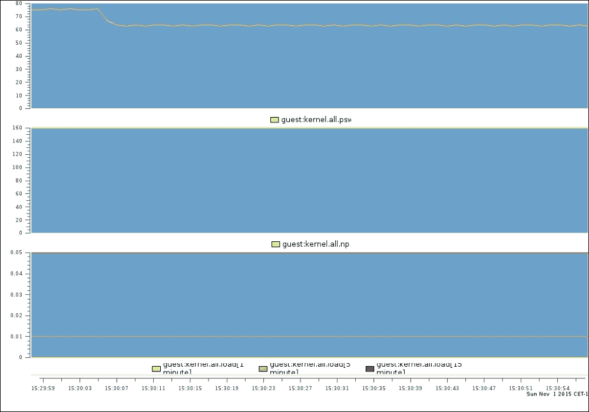
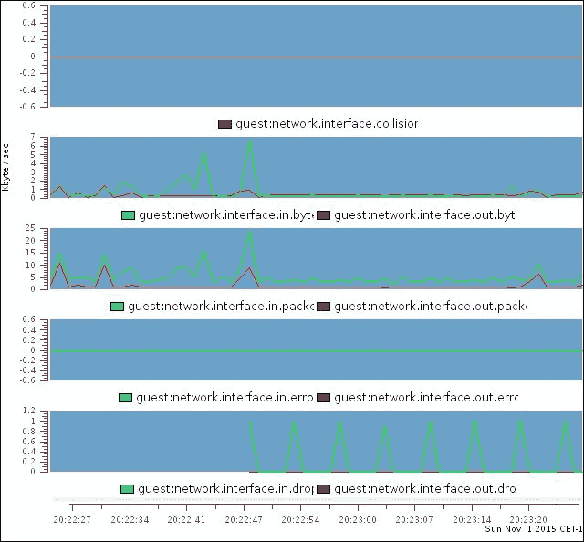

# 第十章 监控与性能调优

在本章中，我将探讨以下主题：

+   调优系统性能

+   设置 PCP – 性能共管程序

+   监控基础系统性能

+   监控 CPU 性能

+   监控 RAM 性能

+   监控存储性能

+   监控网络性能

# 引言

监控基础设施是环境中的一个重要方面，因为它能帮助你了解环境的行为。它会告诉你瓶颈所在以及哪些地方有改进空间。在本章中，我们将监控性能，而不是在某些指标超过特定值时触发警报。

# 调优系统性能

企业购买了他们能买到的最好的硬件，他们希望能够优化地使用每一部分。然而，提升应用运行速度的不仅仅是硬件。你的操作系统在特定情况下的表现也会不同。

Tuned 是一组工具和守护进程，它会根据系统的使用情况自动调整系统设置。它通过插件定期收集组件的数据，并根据当前使用情况调整系统设置。

## 如何实现…

在这个方案中，我们将询问 tuned 使用哪个配置文件，并通过以下步骤应用它：

1.  首先，运行以下命令安装所需的包：

    ```
    ~]# yum install -y tuned

    ```

1.  通过执行以下命令启用并启动 tuned：

    ```
    ~]# systemctl enable tuned
    ~]# systemctl restart tuned

    ```

1.  让 tuned 猜测使用哪个配置文件，方法如下：

    ```
    ~]# tuned-adm recommend
    virtual-guest

    ```

1.  最后，通过以下方式将推荐的配置文件应用到 tuned 中：

    ```
    ~]# tuned-adm profile virtual-guest

    ```

## 还有更多…

你可以在`/lib/tuned/`中找到系统使用的配置文件。当你创建自己的配置文件时，应该将它们创建在`/etc/tuned`中，并按照`/lib/tuned`中的组织方式进行。 我不建议在`/etc/tuned`中创建与`/lib/tuned`中同名的配置文件，但如果你这么做，`/etc/tuned`目录中的文件将被使用。最好是创建一个新的文件，使用不同的名称，包括你想要修改的配置文件，然后在新配置文件中进行必要的修改。

每个配置文件都有一个目录，里面包含一组控制系统行为的文件。如果你查看这些目录中的`tuned.conf`文件，你会看到这些文件定义了其他工具（如**cpufreq**）所需配置的精确设置，并且某些配置文件包含其他配置文件。例如，如果你为一台笔记本电脑创建了一个配置文件，通过应用`powersave` CPU 调度器来优化电池使用，你可以在`/etc/tuned/laptop/tuned.conf`中创建一个新文件，内容如下：

```
#
# laptop tuned configuration
#

[main]
include=desktop

[cpu]
replace=1
governor=powersave
```

当你知道系统的瓶颈时，你就可以通过以特定方式配置系统来减轻这些瓶颈。Tuned 可以帮助你根据组件的性能监控来创建和应用配置文件。

## 另见

有关调优系统的更多信息，请参阅[Red Hat 性能调优指南](https://access.redhat.com/documentation/en-US/Red_Hat_Enterprise_Linux/7/html/Performance_Tuning_Guide/index.html)。

查阅*tuned (8)*、*tuned-adm (8)*、*tuned-main.conf (5)* 和 *tuned.conf (5)*的手册页获取更多信息。

# 设置 PCP – 性能协同工具

多年来，已经创建了许多工具来排查系统性能问题，例如`top`、`sar`、`iotop`、`iostat`、`iftop`、`vmstat`、`dstat`等。然而，这些工具并未互相集成，有些是其他工具的扩展，等等。

PCP 似乎有几个优点：它监控系统的几乎所有方面，允许集中存储（重要的）性能数据，并允许您不仅使用实时数据，还可以使用保存的数据等。

## 如何操作…

在本指南中，我们将同时查看“默认”设置和“收集器”配置，后者允许您收集所需的所有性能数据。

### 默认安装

这是 PCP 的基本设置：

1.  让我们安装所需的软件包；运行以下命令：

    ```
    ~]# yum install -y pcp

    ```

1.  现在，启用并启动必要的守护进程，如下所示：

    ```
    ~]# systemctl enable pmcd
    ~]# systemctl enable pmlogger
    ~]# systemctl start pmcd
    ~]# systemctl start pmlogger

    ```

1.  如果您希望通过中央收集器监控系统，请执行以下操作：

    ```
    ~]# firewall-cmd --add-service pmcd --permanent

    ```

### 中央收集器

每个作为收集器的主机都需要额外的配置。以下是配置方法：

1.  每个系统添加一行，以便从`/etc/pcp/pmlogger/control`收集数据，如下所示：

    ```
    <hostname> n n PCP_LOG_DIR/pmlogger/<hostname> -r -T24h10m -c config.<hostname>
    ```

    这里，`<hostname>`是此主机的 FDQN。请查看以下示例：

    ```
    guest.example.com n n PCP_LOG_DIR/pmlogger/guest.example.com -r -T24h10m -c config.guest.example.com
    ```

1.  以这种方式添加主机后，您需要重启`pmlogger`守护进程。执行以下命令：

    ```
    ~]# systemctl restart pmlogger

    ```

## 还有更多…

默认情况下，PCP 每 60 秒记录一次信息。如果您希望增加此时间间隔并每 30 秒收集一次性能统计信息，则需要修改以`LOCALHOSTNAME`开头的行，并在末尾添加`-t 30s`。

修改您收集的统计信息稍微复杂一点。您可以在`/var/lib/pcp/config/pmlogconf/`中找到`pmlogger`的配置。该目录中的每个文件都包含有关要收集的指标的信息。语法并不难理解，但解释起来比较复杂。*pmlogconf (1)*手册页包含您需要了解的所有内容。

如果您希望在主机上可视化数据，您需要安装`pcp-gui`，如下所示：

```
~]# yum install -y pcp-gui dejavu-sans-fonts

```

该软件包附带一个名为`pmchart`的工具，允许您使用 PCP 收集的数据创建图形。字体是正确显示字符所必需的。

## 另见

有关 PCP 及其组件的更多信息，请参阅其在线手册，您可以在[`www.pcp.io/documentation.html`](http://www.pcp.io/documentation.html)找到。

# 监控基本系统性能

我们需要关注全局系统值。特别感兴趣的是以下内容：

+   `kernel.all.pswitch`

+   `kernel.all.nprocs`

+   `kernel.all.load`

## 如何做到…

我会向你展示一种同时显示文本和图形输出的方法。以下是步骤：

1.  通过执行以下命令为 `guest.example.com` 主机的指标显示 1 秒间隔的实时数据：

    ```
    ~]# pmdumptext -H -t 1 -i -l kernel.all.pswitch kernel.all.nprocs kernel.all.load -h guest.example.com

    ```

    

1.  创建一个名为 `system.conf` 的 `pmchart` 配置文件来显示以下内容的实时数据：

    ```
    #kmchart
    version 1

    chart style plot antialiasing off

    plot color #ffff00 metric kernel.all.pswitch
    chart style plot antialiasing off
     plot color #ffff00 metric kernel.all.nprocs
    chart style plot antialiasing off
     plot color #ffff00 metric kernel.all.load instance "1 minute"
     plot color #ff924a metric kernel.all.load instance "5 minute"
     plot color #ff0000 metric kernel.all.load instance "15 minute"

    ```

1.  接下来，使用以下命令通过 `pmchart` 为 `guest.example.com` 绘制实时图表：

    ```
    ~]# pmchart -h guest.example.com -c system.conf

    ```

    

## 还有更多内容…

上述示例基于“实时”数据；但您不限于实时数据。您可以增加 `pmlogger` 的间隔以获取有关问题系统的更多数据，然后查看生成的数据。使用其他工具，您需要通过 cronjob 等额外工具来执行，而 PCP 允许您同时执行这两种操作。

这里是如何做到的：

1.  通过以下命令显示 `guest.example.com` 的 2015 年 11 月 1 日的数据，时间段为 `15:30` 到 `16:30`，间隔为 5 分钟：

    ```
    ~]# pmdumptext -H -t 5m -i -l -S @15:30 -T @16:30 kernel.all.pswitch kernel.all.nprocs kernel.all.load -a /var/log/pcp/pmlogger/guest.example.com/20151101

    ```

    

1.  您也可以使用 `pmchart` 来完成同样的操作：

    ```
    ~]# pmchart -a /var/log/pcp/pmlogger/guest.example.com/20151101 -c system.conf -S @15:30 -T @16:30 -W -o output.png

    ```

    

# 监控 CPU 性能

本文将向您展示如何使用 `pmchart` 和命令行工具来监视 CPU 的性能。我们将查看以下指标：

+   `kernel.all.cpu.wait.total`

+   `kernel.all.cpu.irq.hard`

+   `kernel.all.cpu.irq.soft`

+   `kernel.all.cpu.steal`

+   `kernel.all.cpu.sys`

+   `kernel.all.cpu.user`

+   `kernel.all.cpu.nice`

+   `kernel.all.cpu.idle`

## 如何做到…

这将向您展示如何创建性能数据的文本和图形表示。执行以下步骤：

1.  通过以下命令为主机 `localhost` 的上述指标显示 1 秒间隔的实时数据：

    ```
    ~]# pmdumptext -H -t 1 -i -l kernel.all.cpu.wait.total kernel.all.cpu.irq.hard kernel.all.cpu.irq.soft kernel.all.cpu.steal kernel.all.cpu.sys kernel.all.cpu.user kernel.all.cpu.nice kernel.all.cpu.idle -h localhost

    ```

    

1.  创建一个名为 `cpu_stack.conf` 的 `pmchart` 配置文件来显示以下内容的实时数据：

    ```
    #kmchart
    version 1

    chart style stacking antialiasing off
     plot color #aaaa7f metric kernel.all.cpu.wait.total

    plot color #008000 metric kernel.all.cpu.irq.hard
     plot color #ee82ee metric kernel.all.cpu.irq.soft
     plot color #666666 metric kernel.all.cpu.steal
     plot color #aa00ff metric kernel.all.cpu.user
     plot color #aaff00 metric kernel.all.cpu.sys
     plot color #aa5500 metric kernel.all.cpu.nice
     plot color #0000ff metric kernel.all.cpu.idle

    ```

    您会注意到我在图表中没有使用所有指标，因为其中一些指标是彼此结合的。

1.  使用以下命令为 `guest.example.com` 绘制实时图表：

    ```
    ~]# pmchart -h guest.example.com -c cpu_stack.conf

    ```

    

# 监控 RAM 性能

为了监控 RAM 性能，我只关心几个指标，而不是所有与内存相关的指标。看看这个列表：

+   `mem.util.used`

+   `mem.util.free`

+   `mem.util.bufmem`

+   `mem.util.cached`

+   `swap.free`

+   `swap.used`

+   `swap.pagesin`

+   `swap.pagesout`

## 如何做到…

本文将解释如何创建文本和图形输出：

1.  首先，通过以下命令显示上述指标的实时数据：

    ```
    ~]# pmdumptext -H -t 1 -i -l mem.util.used mem.util.free mem.util.bufmem mem.util.cached swap.free swap.used swap.pagesin swap.pagesout -h guest.example.com

    ```

    

1.  创建一个名为 `memory.conf` 的 `pmchart` 配置文件来显示以下内容的实时数据：

    ```
    #kmchart
    version 1

    chart style stacking
     plot color #ffff00 metric mem.util.used
     plot color #ee82ee metric mem.util.free
    chart style stacking
     plot color #ffff00 metric swap.used
     plot color #0000ff metric swap.free
    chart style plot antialiasing off
     plot color #19ff00 metric swap.pagesin
     plot color #ff0004 metric swap.pagesout

    ```

1.  现在，使用`pmchart`通过执行以下命令行为`guest.example.com`绘制实时图表：

    ```
    ~]# pmchart -h guest.example.com -c memory.conf

    ```

    

我没有在这个图表中包含缓冲区和缓存内存，因为它是内存使用指标的一部分。

# 监控存储性能

在这个教程中，我们将查看以下指标：

+   `disk.all.read`

+   `disk.all.write`

+   `disk.all.read_bytes`

+   `disk.all.write_bytes`

## 如何操作…

让我们通过以下步骤创建性能数据的文本和图形表示：

1.  显示上述指标的实时数据；你可以使用以下命令来实现：

    ```
    ~]# pmdumptext -H -t 1 -i -l disk.all.read disk.all.write disk.all.read_bytes disk.all.write_bytes -h guest.example.com

    ```

    

1.  接下来，为`pmchart`创建一个名为`disk.conf`的配置文件，以显示实时数据，内容如下：

    ```
    #kmchart
    version 1

    chart style stacking
     plot color #ffff00 metric mem.util.used
     plot color #ee82ee metric mem.util.free
    chart style stacking

    plot color #ffff00 metric swap.used
     plot color #0000ff metric swap.free
    chart style plot antialiasing off
     plot color #19ff00 metric swap.pagesin
     plot color #ff0004 metric swap.pagesout

    ```

1.  现在，使用`pmchart`为`guest.example.com`绘制实时图表，方法如下：

    ```
    ~]# pmchart -h guest.example.com -c memory.conf

    ```

    

# 监控网络性能

在这个教程中，我们将查看以下网络指标：

+   `network.interface.collisions`

+   `network.interface.in.bytes`

+   `network.interface.in.packets`

+   `network.interface.in.errors`

+   `network.interface.in.drops`

+   `network.interface.out.bytes`

+   `network.interface.out.packets`

+   `network.interface.out.errors`

+   `network.interface.out.drops`

## 如何操作…

现在，我们最后一次来看看如何创建数据的文本和图形表示。请按照以下步骤操作：

1.  显示上述指标的实时数据；运行以下命令：

    ```
    ~]# pmdumptext -H -t 1 -i -l network.interface.collisions network.interface.in.bytes network.interface.in.packets network.interface.in.errors network.interface.in.drops network.interface.out.bytes network.interface.out.packets network.interface.out.errors network.interface.out.drops -h guest.example.com

    ```

    

1.  为`pmchart`创建一个名为`network.conf`的配置文件，以显示实时数据，内容如下：

    ```
    #kmchart
    version 1

    chart style plot antialiasing off
     plot color #ff0000 metric network.interface.collisions instance "eth0"
    chart style plot antialiasing off
     plot color #00ff00 metric network.interface.in.bytes instance "eth0"
     plot color #ff0000 metric network.interface.out.bytes instance "eth0"
    chart style plot antialiasing off

    plot color #00ff00 metric network.interface.in.packets instance "eth0"
     plot color #ff0000 metric network.interface.out.packets instance "eth0"
    chart style plot antialiasing off
     plot color #00ff00 metric network.interface.in.errors instance "eth0"
     plot color #ff0000 metric network.interface.out.errors instance "eth0"
    chart style plot antialiasing off
     plot color #00ff00 metric network.interface.in.drops instance "eth0"
     plot color #ff0000 metric network.interface.out.drops instance "eth0"

    ```

1.  接下来，使用`pmchart`通过以下命令行为`guest.example.com`绘制实时图表：

    ```
    ~]# pmchart -h guest.example.com -c network.conf

    ```

    
