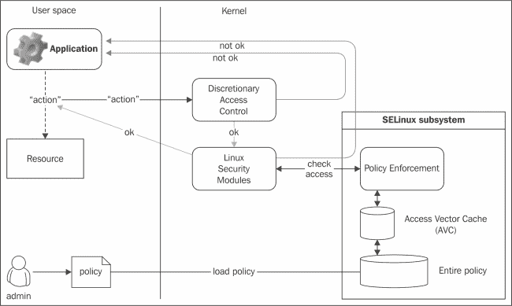

# 第一章：SELinux 开发环境

本章介绍 SELinux 策略开发环境的设置。我们将在本章讨论以下主题：

+   创建开发环境

+   构建一个简单的 SELinux 模块

+   调用 refpolicy 接口

+   创建我们自己的接口

+   使用 refpolicy 命名约定

+   分发 SELinux 策略模块

# 介绍

类似于其他任何软件开发，拥有一个良好的开发环境对成功创建和管理 SELinux 策略至关重要。这样的环境不仅应该支持版本控制，还应该能够快速搜索源代码或显示定义。

对于 SELinux，这意味着策略模块源（这些都是可读的文本文件）应以结构化的方式存储，提供 SELinux 策略的上游项目应该容易访问，并且查询和搜索策略所需的功能或脚本应该可用。

有冒险精神的用户可能想看看 Tresys Technology 提供的**SELinux Policy IDE**（**SLIDE**）（[`oss.tresys.com/projects/slide`](http://oss.tresys.com/projects/slide)）。在本书中，我们不专注于这个 IDE；相反，我们使用用户想要的任何文件编辑器（如 VIM、Emacs 或 Kate），并通过必要的 shell 功能和命令来增强环境。

在我们讨论开发环境的设置之前，先简单回顾一下 SELinux 是什么。

## 关于 SELinux

**Security Enhanced Linux**（**SELinux**）项目是由美国**国家安全局**（**NSA**）发起和支持的项目，诞生于 2000 年 12 月。它实现了一个安全系统架构，采用灵活的、基于策略的配置方法。该架构被称为**Flux 高级安全内核**（**Flask**），与其相关的资源仍然是每个与 SELinux 相关的人员需要阅读的重要资料。

大多数论文可以通过 Flask 网站链接访问，网址为[`www.cs.utah.edu/flux/fluke/html/flask.html`](http://www.cs.utah.edu/flux/fluke/html/flask.html)。以下是其中一些论文的示例：

+   论文《*失败的必然性：现代计算环境中安全性假设的缺陷*》仍然是关于为何操作系统需要强制访问控制的非常有话题性的论文。

+   NSA 发布的《*将 SELinux 作为 Linux 安全模块实现*》一文，详尽讲解了 SELinux 的实现过程，文献可在[`www.nsa.gov/research/_files/publications/implementing_selinux.pdf`](http://www.nsa.gov/research/_files/publications/implementing_selinux.pdf)获取。

如今，SELinux 最好被看作是现有 Linux 操作系统之上的一个额外安全层。它是主流 Linux 内核的一部分，并通过 **Linux 安全模块** (**LSM**) 接口与进程（用户空间）和资源之间的交互进行挂钩。它通过一种称为 **类型强制**（type enforcement）的强大方法，管理各种访问服务（如读取文件、获取目录属性、绑定域套接字、连接 TCP 套接字和获取额外的能力）。

以下图展示了 SELinux 子系统的高层次功能位置。当一个主体（图中为**应用程序**）想要对一个资源执行某个操作时，该操作首先会经过 Linux 内核提供的自愿访问控制机制的检查。如果该操作通过了 DAC 机制的检查并被允许，LSM 实现（SELinux 在其上注册）会调用 SELinux 子系统提供的钩子。随后，SELinux 会检查策略（通过缓存进行检查，如果访问尚未在缓存中注册，它会检查整个策略），并返回是否允许该访问。



SELinux 是一种强制访问控制系统，其中系统上的活动通过文档化的策略定义。这些策略适用于系统的所有进程，并通过 SELinux 子系统强制执行，而 SELinux 子系统是 Linux 内核的一部分。任何不被政策允许的操作将完全被拒绝——安全性并不依赖于用户的判断或应用程序的正确性。与 Linux 的 DAC（自愿访问控制）限制不同，SELinux 强制执行本身（即 SELinux 代码）与规则（即 SELinux 策略）是分开的。规则文档定义了系统上应当视为可接受行为的内容。任何不符合策略的操作都会被 SELinux 子系统拒绝。

在 SELinux 中，支持一套访问控制机制。最为显著的是其类型强制机制，其中主体（无论是内核还是 Linux 进程）对对象（如文件、设备、系统能力或安全控制）的权限授予，基于该主体当前的安全上下文。这种安全上下文通常通过可读字符串表示，如 `staff_u:staff_r:staff_t:s0:c0,c3`。该字符串表示 SELinux 用户（`staff_u`）、SELinux 角色（`staff_r`）、SELinux 类型/域（`staff_t`），并且可选地包括 SELinux 敏感度级别或安全许可，这提供了敏感度（`s0`）以及分配的类别（`c0,c3`）。

除了类型强制执行外，SELinux 还具有其他几个特性。例如，它通过将有效域（分配给运行进程的 SELinux 类型）分配给角色来提供基于角色的访问控制系统。如果未授予角色特定域，则该角色无法执行与该域相关的任务或应用程序。SELinux 还支持基于用户的访问控制，从而限制信息流和管理 SELinux 用户之间的数据共享。

SELinux 中的另一个支柱是其对敏感性的支持（SELinux 将其显示为整数，但这些整数可以很好地被解释为公开的、内部的、机密的等），以及访问类别。通过 SELinux 可以在其策略中施加的约束，系统可以大致遵守贝尔-拉帕杜拉模型（[`en.wikipedia.org/wiki/Bell-LaPadula_model`](https://en.wikipedia.org/wiki/Bell-LaPadula_model)）。此模型支持信息流限制，如无读取上行（低敏感性无法从高敏感性读取信息）和无写入下行（高敏感性无法向低敏感性泄漏信息）。

## SELinux 策略的角色

SELinux 策略本身是安全管理员（通常被称为系统上允许和不允许的所有者的角色）对可接受的、预期的和规范化行为的表示：

+   **可接受**：应用程序和用户行为将被认为是可接受的，因为它将在策略允许的系统上被允许。

+   **预期**：应用程序和用户行为将按预期进行，因为策略通常不包含系统不适用的访问向量（分配给主体对特定对象的权限），即使在环境中其他系统可能会接受这些访问向量也一样。

+   **规范化**：应用程序和用户行为将被规范化，不是指数据库规范化的意义上，而是指正常性——与进程最常见行为一致的东西。

策略代表这些行为，正确调整和开发策略非常重要。这就是为什么 *SELinux Cookbook* 将专注于策略开发和策略原则。

过于严格的策略将导致应用程序出现故障，通常以用户发现意料之外的方式。当然，对于安全管理员来说并不奇怪，因为他知道策略规定了允许什么，他应该（至少应该）完全了解策略的内容。

然而，过于宽泛的策略不会导致这种行为。相反，一切都会按预期工作。遗憾的是，当非标准或异常行为被触发时，定义过于宽泛的策略可能仍然允许这种非标准或异常行为的发生。当这种异常行为成为被利用的漏洞时，即便 SELinux 再强大，也无法阻止利用，因为策略本身已经授予了访问权限。这个原则的另一个例子是网络防火墙，其策略可能也过于宽松。

通过策略提供的打包方式（SELinux 策略就像可加载的内核模块，但它是针对 SELinux 子系统的），管理员可以将策略推送到一个或多个系统，通常通过包管理系统或首选的集中配置管理系统来进行。与 Linux 的 DAC 控制需要直接应用于文件本身不同，SELinux 策略更容易处理，甚至可以进行版本控制——这是大环境中管理员非常欣赏的特性。

## 示例

在本书中，我们将经常遇到一些可选的设置，或者这些设置的值依赖于系统管理员所做的选择。为了避免重复记录和解释当某个设置或值是可配置时的内容，我们将使用以下配置设置：

+   本书中的 SELinux 类型将是 MCS。它使用启用了 MLS 的单一敏感性策略定义。这意味着当显示时，所有上下文都会分配一个敏感性级别或安全许可，并且 SELinux 策略配置的位置将始终显示在`/etc/selinux/mcs/`中。如果您的环境中的策略存储路径不同，请确保将此路径替换为您自己的路径。例如，Red Hat 或 Fedora 安装的默认路径是`/etc/selinux/targeted/`。

+   操作将按照通过受限用户的方式记录，这些用户分别命名为`user`（代表分配了`user_r`角色的无特权最终用户）、`staff`（代表可能执行管理任务并分配了`staff_r`和`sysadm_r`角色的用户）和`root`（映射到`sysadm_r`角色）。某些发行版可能会将用户与`unconfined_r`角色相关联。每当某个步骤对于无限制用户是可以跳过的时，我们将明确指出。

# 创建开发环境

我们现在将创建一个开发环境，在这个环境中将存储 SELinux 策略、上游项目代码以及我们用来轻松查询 SELinux 策略的功能。这个环境将具有以下三个顶级位置：

+   `local/`：此位置包含本地系统的 SELinux 规则，而非合作开发的代码库的一部分（即其他开发人员工作的位置）

+   `centralized/`：此位置包含开发环境中使用的各种代码库的检出版本

+   `bin/`：此位置包含我们将用来查询策略源以及排查 SELinux 问题的支持脚本。

在本练习中，我们还将在`centralized/`位置填充一个检出项：当前系统使用的 SELinux 策略树。

## 准备工作

寻找一个合适的位置来存储开发环境。这个位置通常是用户主目录中的某个位置，比如 `/home/staff/dev/selinux/`。每当本书提到开发环境的位置时，它将使用 `${DEVROOT}` 变量来指代这个位置。

另一个我们需要的信息是托管当前系统 SELinux 策略的仓库位置。这个位置因发行版而异，因此请参考发行版网站以获取更多信息。在编写本书时，Gentoo Linux 和 Fedora 的策略可以在以下位置找到：

+   [`github.com/sjvermeu/hardened-refpolicy`](https://github.com/sjvermeu/hardened-refpolicy)

+   [`git.fedorahosted.org/git/selinux-policy.git`](https://git.fedorahosted.org/git/selinux-policy.git)

每当使用版本控制时，本书将使用`git`。当然，还有其他版本控制系统，但这些超出了本书的范围。

## 如何操作…

为了创建本书中使用的开发环境，请执行以下步骤：

1.  创建必要的目录：

    ```
    ~$ cd ${DEVROOT}
    ~$ mkdir local centralized bin

    ```

1.  创建发行版的 SELinux 策略树的检出（在这个例子中，基于 Gentoo Linux 仓库）：

    ```
    ~$ cd ${DEVROOT}/centralized
    ~$ git clone git://git.overlays.gentoo.org/proj/hardened-refpolicy.git

    ```

1.  为我们将在本书中开发的策略创建一个 `git` 仓库：

    ```
    ~$ cd ${DEVROOT}/local
    ~$ git init

    ```

1.  将 `functions.sh` 脚本（可通过本书的下载包获取）添加到 `${DEVROOT}/bin/` 位置。

1.  编辑 `.profile`、`.bashrc` 或其他在我们的 Linux 用户登录系统时加载的 shell 配置文件，并添加以下代码：

    ```
    # Substitute /home/staff/dev/selinux with your DEVROOT
    DEVROOT=/home/staff/dev/selinux
    # Substitute the next location with your distributions' policy checkout
    POLICY_LOCATION=${DEVROOT}/centralized/hardened-refpolicy/
    source ${DEVROOT}/bin/functions.sh
    ```

1.  注销并重新登录，然后通过请求 `files_read_etc_files` 接口的定义来验证环境是否正常工作：

    ```
    ~$ seshowif files_read_etc_files
    interface(`files_read_etc_files',`
     gen_require(`
     type etc_t;
     ')

     allow $1 etc_t:dir list_dir_perms;
     read_files_pattern($1, etc_t, etc_t)
     read_lnk_files_pattern($1, etc_t, etc_t)
    ')

    ```

## 它是如何工作的…

开发环境的设置帮助我们处理进一步配方的策略开发。发行版的 SELinux 策略树的检出用于在开发新策略时查询现有的策略规则。SELinux 不要求系统上必须有策略源（只有编译后的二进制 SELinux 策略模块和部分 SELinux 策略规则可以被其他策略模块使用）。因此，默认安装通常不会在系统上提供策略规则。

通过使用我们的检出版本，我们可以查看现有的 SELinux 策略文件，并高兴地将其中的示例用于自己的需求。此检出的一个主要用户是 `functions.sh` 脚本，它使用 `${POLICY_LOCATION}` 变量来知道检出版本的托管位置。这个脚本提供了我们在本书中将使用的几个函数，它们还将帮助查询源。

通过在登录时加载此 `functions.sh` 脚本，这些函数便可以在用户的 shell 中立即使用。其中一个函数是 `seshowif` 函数，它显示特定接口的规则。给出的示例显示了 `files_read_etc_files` 接口的定义，我们用它来验证我们的设置是否正常工作。

`functions.sh` 脚本还可以与通过 `/usr/share/selinux/devel/`（在 Fedora/Red Hat 系统中）提供的接口文件一起使用，这使得如果用户不需要访问完整的策略规则，则可以选择不检出策略库。然后定义的策略位置如下：

```
export POLICY_LOCATION=/usr/share/selinux/devel/
```

## 还有更多...

除了发行版的 SELinux 策略树外，还可以使用参考策略 SELinux 树。这是大多数（如果不是全部）Linux 发行版作为其策略来源所使用的上游项目。然而，必须指出的是，参考策略通常在个别发行版的策略库之后更新，因为它对策略增强有更严格的接受标准。

检查其他发行版的 SELinux 策略库也无妨。通常，Linux 发行版会先在自己的库中更新 SELinux 策略，然后再将更改推送到参考策略（在自由软件开发社区中称为上游）。通过查看其他发行版的库，开发人员可以轻松了解必要的更改是否已经做过（从而更有可能是正确的）。

## 另见

要了解本食谱中涉及的主题的更多信息，请参阅以下资源：

+   参考策略项目 ([`oss.tresys.com/projects/refpolicy/`](http://oss.tresys.com/projects/refpolicy/))

+   Git 教程 ([`git-scm.com/docs/gittutorial`](http://git-scm.com/docs/gittutorial))

# 构建一个简单的 SELinux 模块

现在我们已经有了开发环境，是时候创建我们的第一个 SELinux 策略模块了。由于此时其目的尚不重要，我们将专注于一个默认情况下不被允许（而且是合理的）但容易验证的特权，因为我们希望确保我们的策略开发方法有效。我们将授予的特权是允许系统日志记录器写入标记为 `named_conf_t` 的日志文件（这是用于 BIND DNS 服务器配置的类型，也称为 `named`）。

### 注意

构建 SELinux 策略模块是为了通过更多的规则扩展现有的策略，允许某些访问。不能创建一个减少域所允许权限的策略模块。如果需要这么做，策略模块需要重新创建并替代现有的策略（因此，分发提供的策略将需要从系统中移除）。

## 准备就绪

在开始之前，我们首先需要确保能够测试更改的结果。一种简单的方法是更改`/var/log/messages`文件（或系统日志记录器配置使用的另一个常规日志文件）的上下文，并通过`logger`命令通过系统日志记录器发送消息：

```
~$ logger "Just a simple log event"
~$ tail /var/log/messages

```

通过`tail`命令查看最后几行，验证消息是否已经发送。然后，改变上下文并重试。该事件不应显示，并且审核守护进程应记录拒绝事件：

```
~# chcon -t named_conf_t /var/log/messages
~$ logger "Another simple log event"
~$ tail /var/log/messages
~# ausearch -m avc -ts recent

```

完成这些步骤后，我们现在可以创建我们的第一个简单的 SELinux 模块。

## 如何做到这一点…

构建一个新的 SELinux 策略是经过以下步骤的过程：

1.  在`${DEVROOT}/local`中创建一个名为`mylogging.te`的文件，内容如下：

    ```
    policy_module(mylogging, 0.1)
    gen_require(`
      type syslogd_t;
      type named_conf_t;
     ')
    # Allow writing to named_conf_t files
    allow syslogd_t named_conf_t:file { getattr append lock ioctl open write };
    ```

1.  复制或链接`/usr/share/selinux/devel/`或`/usr/share/selinux/mcs/include/`（具体位置取决于发行版）中的`Makefile`文件到当前目录：

    ```
    ~$ ln –s /usr/share/selinux/devel/Makefile

    ```

1.  通过这个`Makefile`构建 SELinux 策略模块。目标是将（目标）策略模块命名为`.pp`后缀：

    ```
    ~$ make mylogging.pp

    ```

1.  切换到 root 用户，如果我们通过非特权 SELinux 域/角色登录，切换到`sysadm_r`或`secadm_r`角色（如果当前用户域已经是`sysadm_t`或`unconfined_t`，则不需要此操作）：

    ```
    ~$ sudo –r sysadm_r –t sysadm_t -s

    ```

1.  现在，加载 SELinux 策略模块（这将立即激活新定义的 SELinux 策略）：

    ```
    ~# semodule –i mylogging.pp

    ```

1.  通过生成一个新的日志事件并查看日志文件，验证新定义的 SELinux 策略是否已激活，并确认该事件是否已成功记录。

1.  将新创建的文件提交到版本库：

    ```
    ~$ cd ${DEVROOT}/local
    ~$ git add mylogging.te Makefile
    ~$ git commit –m 'Adding mylogging.te which allows the system logger to write to the named configuration file type named_conf_t'

    ```

    验证后，使用`restorecon /var/log/messages`重置日志文件的上下文，并使用`semodule -r mylogging`从子系统中删除策略模块。毕竟，我们不希望这个规则一直处于激活状态。

## 它是如何工作的…

在这个过程里，我们接触到 SELinux 策略开发的三个重要新方面：

+   创建了一个名为`mylogging.te`的策略源文件

+   构建了一个名为`mylogging.pp`的生成的二进制策略模块

+   二进制策略文件`mylogging.pp`已添加到系统的活动策略存储中

最后，我们将文件提交到本地仓库。建议对策略文件使用版本控制，以便跟踪跨时间的变更。一个好的提示是为策略的每个新版本打标签——如果用户报告与策略相关的问题，您可以要求他们提供 SELinux 策略模块的版本（通过 `semodule –l`），然后使用仓库中的标签轻松查找该特定策略模块的规则。

在本书的其余部分，我们将不再使用 `git add`/`commit`，以便专注于 SELinux 配方。

### 策略源文件

在该配方中，我们创建了一个名为 `mylogging.te` 的策略源文件，其中包含原始的 SELinux 策略规则。`mylogging` 这个名称并非随机选择；按照常见的最佳实践，自定义模块通常以 `my` 开头，后跟我们增强内容的 SELinux 策略模块的名称（在本例中，即提供系统日志相关 SELinux 策略的日志模块）。`.te` 后缀不仅仅是一个约定（指代 SELinux 的类型强制部分）；构建系统要求使用 `.te` 后缀。

策略模块规则以 `policy_module(…)` 调用开始，这告诉构建系统，该文件将成为一个可加载的 SELinux 策略模块，并指定其名称和版本。如果我们请求 `semodule` 命令列出当前加载的所有 SELinux 策略模块，该名称和版本会被显示出来：

```
~# semodule –l
aide  1.8.0
alsa  1.13.0
…
mylogging  0.1
…

```

最佳实践是将单一域的所有规则保留在一个策略模块中。如果需要多个不相关域的规则，建议创建多个模块，因为这可以将策略规则隔离开来，并使修改更易于管理。

在这个简单的示例中，我们没有遵循最佳实践（还没有）。相反，我们告诉 SELinux 子系统，策略将通过为 `syslogd_t` 提供一个访问向量来增强。这里的访问向量是允许该域对标记为 `named_conf_t` 的文件执行一组权限。

### 二进制策略模块

当我们调用 `Makefile` 文件时，底层脚本会构建一个可加载的二进制 SELinux 策略模块。这类文件的后缀为 `.pp`，并准备好被加载到策略存储中。这个 `Makefile` 文件可能默认没有安装；某些发行版需要安装特定的开发包（例如 Fedora 中的 `selinux-policy-devel`）。

如果我们只给定 `.pp` 文件，获取策略源代码的方式并不理想。当然，有诸如 `semodule_unpackage` 和 `sedismod` 这样的命令可以使用，但这些命令仅能提供规则的低级视图，而不是原始的 `.te` 代码。因此，确保做好备份，并且正如我们在示例中看到的，使用版本控制系统来管理跨时间的变更。

### 将策略加载到策略存储中

要将新创建的策略加载到策略存储中，我们调用`semodule`命令。此应用程序负责管理策略存储（即所有 SELinux 策略模块与基础策略模块的集合），并将模块链接或取消链接到最终策略中。

此最终策略（可在`/etc/selinux/mcs/policy`找到）然后加载到 SELinux 子系统本身并强制执行。

## 还有更多内容……

在本书中，使用的构建系统基于参考策略构建系统。这是一组 M4 宏和相关脚本，可使 SELinux 策略的开发更加简便。然而，这并非创建 SELinux 策略的唯一方法。

当访问在线资源时，您可能会遇到类似以下结构的 SELinux 策略模块：

```
module somename 1.0;
require {
  type some_type_t;
  type another_type_t;
}
allow some_type_t another_type_t:dir { read search };
```

### 小贴士

**下载示例代码**

您可以从您在[`www.packtpub.com`](http://www.packtpub.com)的帐户中下载所有 Packt 书籍的示例代码文件。如果您在其他地方购买了这本书，您可以访问[`www.packtpub.com/support`](http://www.packtpub.com/support)并注册，直接通过电子邮件获取文件。

这些是不使用参考策略构建系统的策略文件。要构建这样的文件，我们首先使用`checkmodule`创建一个中间模块文件，然后使用`semodule_package`将模块文件打包成可加载的二进制 SELinux 策略：

```
~$ checkmodule -M –m –o somename.mod somename.te
~$ semodule_package –m somename.mod –o somename.pp

```

为了保持简单，我们将坚持参考策略构建系统。

## 参见

此处涉及了许多主题和领域。更多信息可在以下资源找到：

+   大多数 Linux 发行版都有关于如何集成 SELinux 的特定于发行版的信息。对于 Red Hat，可以通过[`access.redhat.com`](https://access.redhat.com)访问这些资源。对于 Fedora，请使用[`docs.fedoraproject.org`](https://docs.fedoraproject.org)。Gentoo 的文档位于[`wiki.gentoo.org`](https://wiki.gentoo.org)。

+   要了解如何在系统上管理 SELinux 的更多信息，请参阅发行版提供的文档或阅读 Packt Publishing 出版的*SELinux 系统管理*书籍，网址为[`www.packtpub.com/selinux-system-administration/book`](http://www.packtpub.com/selinux-system-administration/book)。

+   SELinux 语言本身的广泛覆盖由在线可获得的 SELinux 笔记本提供，网址为[`www.freetechbooks.com/the-selinux-notebook-the-foundations-t785.html`](http://www.freetechbooks.com/the-selinux-notebook-the-foundations-t785.html)。

# 调用参考策略接口

完全使用 SELinux 提供的标准语言构造编写 SELinux 策略是可行的，但容易出错，且在长期使用中不易管理。为了支持更简单的语言构造，参考策略项目使用了一组 M4 宏，在策略构建时，底层的 SELinux 策略语句会扩展这些宏。

策略开发人员可以在线查阅 API，但大多数系统也会在`/usr/share/doc/selinux-*/`中提供此信息。然而，找到合适的接口需要一些实践，这就是为什么我们之前安装的其中一个函数（作为开发环境的一部分）简化了这一过程。

在这个步骤中，我们将编辑之前生成的`mylogging.te`文件，并使用正确的参考策略宏。

## 如何操作…

要在 SELinux 策略模块中使用参考策略接口，可以采取以下方法：

1.  使用`sefinddef`函数查找写入文件的权限组或模式：

    ```
    ~$ sefinddef 'file.*write'
    define(`write_files_pattern',`
     allow $1 $3:file write_file_perms;
    …
    define(`write_file_perms',`{ getattr write append lock ioctl open }')
    …

    ```

1.  使用`seshowdef`函数显示`write_files_pattern`定义的完整性质：

    ```
    ~$ seshowdef write_files_pattern
    define(`write_files_pattern',`
     allow $1 $2:dir search_dir_perms;
     allow $1 $3:file write_file_perms;
    ')

    ```

1.  使用`sefindif`函数查找允许写入`named_conf_t`的接口：

    ```
    ~$ sefindif 'write_files_pattern.*named_conf_t'
    contrib/bind.if: interface(`bind_write_config',`
    contrib/bind.if:   write_files_pattern($1, named_conf_t, named_conf_t)

    ```

1.  现在，更新`mylogging.te`文件以使用这个函数。文件现在应该如下所示：

    ```
    policy_module(mylogging, 0.2)
    gen_require(`
      type syslogd_t;
    ')
    bind_write_config(syslogd_t)
    ```

    ### 注意

    注意使用反引号（`` ` ``）和单引号（`'`）。每当使用定义时，它们需要以反引号开始并以单引号结束。

1.  重新构建并重新加载策略模块，然后重新运行我们之前做的测试，以验证这仍然允许我们写入`named_conf_t`标记的文件。

## 它是如何工作的…

参考策略的构建系统背后的原则之一是，SELinux 策略模块不应直接提及与该模块无关的 SELinux 类型。每当策略模块需要针对由其他模块定义的类型定义规则时，应使用该其他模块定义的接口。

在我们的例子中，我们需要使用 BIND SELinux 策略（它处理 BIND-named 守护进程的策略规则）所使用的接口；该接口允许我们写入 BIND DNS 服务器配置文件类型（`named_conf_t`）。我们可以查阅在线 API、`/usr/share/doc/selinux-*`中的 API 文档，或者直接猜测接口名称。然而，为了确保接口做我们需要的事情，我们需要查询接口定义本身。

这时`sefinddef`、`seshowdef`、`sefindif`和`seshowif`函数就派上用场了。这些函数不是 SELinux 用户空间的一部分，它们是通过我们之前安装的`functions.sh`文件提供的，并且是针对 SELinux 策略文件的简单`awk`/`grep`/`sed`组合。

使用`sefinddef`（SELinux 查找定义），我们可以通过支持的宏（与特定的 SELinux 政策模块无关）搜索任何与给定表达式匹配的定义。在这个方案中，我们给出了`file.*write`作为查找的表达式。`seshowdef`（SELinux 显示定义）函数会展示给定模式的完整定义。

`sefindif`（SELinux 查找接口）函数允许我们找到 SELinux 政策提供的接口。在这个方案中，我们用它来搜索允许一个域写入 BIND DNS 服务器配置文件的接口。还有一个`seshowif`（SELinux 显示接口）函数，能显示出接口的完整定义，如下所示：

```
~$ seshowif bind_write_config
interface(`bind_write_config',`
 gen_require(`
 type named_conf_t;
 ')
 write_files_pattern($1, named_conf_t, named_conf_t)
 allow $1 named_conf_t:file setattr_file_perms;
')

```

这个示例接口很好地展示了 SELinux 参考政策构建系统如何处理接口。每当调用此类接口时，都会向接口传递一个或多个参数。在我们的例子中，我们将`syslogd_t`作为第一个（也是唯一的）参数传递给它。

然后，构建系统会将接口中的每个`$1`替换为第一个参数，实际扩展调用为以下代码：

```
write_files_pattern(syslogd_t, named_conf_t, named_conf_t)
allow syslogd_t named_conf_t:file setattr_file_perms;
```

对`write_files_pattern`的调用随后会被我们之前看到的定义扩展。

对于政策开发者来说，这一切都由系统透明处理。SELinux 政策文件的源代码保持良好的格式化，并且只调用接口。界面扩展的工作在构建时完成。这允许开发者拥有整洁分隔、模块化的政策定义。

## 另见

+   参考政策项目可以在线找到，[`oss.tresys.com/projects/refpolicy/`](http://oss.tresys.com/projects/refpolicy/)

# 创建我们自己的接口

能够调用接口是很好的，但当我们开发 SELinux 政策时，会遇到需要为我们开发的 SELinux 模块创建自己的接口的情况。这是通过一个`.if`扩展名的文件来实现的。

在这个方案中，我们将通过一个接口扩展`mylogging`政策，允许其他域执行系统日志守护进程的二进制文件（但不会以系统日志记录器的权限运行该二进制文件；这在 SELinux 中称为域转换）。

## 如何实现……

1.  如果我们当前的上下文是一个无特权用户域（因为未受限的域具有高度特权，并且几乎可以执行任何操作），我们可以尝试直接执行系统日志守护进程（`syslog-ng`或`rsyslog`），并使其失败，如下所示：

    ```
    ~$ /usr/sbin/syslog-ng --help
    bash: /usr/sbin/syslog-ng: Permission denied

    ```

1.  现在，创建`mylogging.if`文件（与`mylogging.te`位于同一位置），其内容如下，授予执行该二进制文件所需的所有权限：

    ```
    ## <summary>Local adaptation to the system logging SELinux policy</summary>

    ##########################################
    ## <summary>
    ##    Execute the system logging daemon in the caller domain
    ## </summary>
    ## <desc>
    ##   <p>
    ##     This does not include a transition.
    ##   </p>
    ## </desc>
    ## <param name="domain">
    ##    <summary>
    ##      Domain allowed access.
    ##    </summary>
    ## </param>
    #
    interface(`logging_exec_syslog',`
      gen_require(`
        type syslogd_exec_t;
      ')
      can_exec($1, syslogd_exec_t)
    ')
    ```

1.  为用户域创建一个新的 SELinux 政策模块；该政策应能够直接执行系统日志记录器。例如，对于`sysadm_t`域，我们将创建一个`mysysadm.te`文件，其内容如下：

    ```
    policy_module(mysysadm, 0.1)
    gen_require(`
      type sysadm_t;
    ')
    logging_exec_syslog(sysadm_t)
    ```

1.  构建`mysysadm`策略模块并加载它。然后，测试是否现在可以直接执行守护进程二进制文件：

    ```
    ~$ /usr/sbin/syslog-ng --help

    ```

## 它是如何工作的……

首先，我们来看一下构建系统如何知道接口定义的位置。然后，我们将介绍示例中使用的内联注释系统。

### 接口定义的位置

每当构建一个 SELinux 策略模块时，构建系统会获取它在以下位置找到的所有接口文件：

+   `/usr/share/selinux/mcs/include/*`或`/usr/share/selinux/devel/include/*`（具体取决于 Linux 发行版）

+   当前工作目录

第一个位置是存储所有 Linux 发行版提供的 SELinux 模块的接口文件的地方。这些文件位于以特定类别命名的子目录中（参考策略将其称为层，但这仅用于在定义中创建一些结构，并无其他用途），例如`contrib/`、`system/`和`roles/`。

对于 SELinux 策略的本地开发，通常该位置不可写。如果我们开发自己的策略模块，那么这意味着本地管理的 SELinux 策略文件不能使用其他本地接口文件的接口。因此，`Makefile`文件也会获取当前工作目录中找到的所有接口文件。

### 内联文档

在创建的接口文件中，我们会注意到一些类似 XML 的结构作为注释。这些注释以双井号（`##`）为前缀，并被参考策略构建系统用于生成 API 文档（可以在`/usr/share/doc/selinux-*`中找到）。

对于本地策略，不使用这种内联文档，因此也不是强制性的。然而，即使是对于本地策略，编写文档有助于更好地记录规则。此外，如果我们以后想将更改推送到上游，这种内联文档仍然是必需的。

注释系统使用以下结构：

+   在接口定义之前，我们会遇到一个`<summary>`元素，它提供了接口的单句描述。

+   额外的信息可以通过`<desc>`元素提供，并可以在其中放置 HTML 代码以进一步记录接口。

+   每个接口的参数都通过`<param>`实体进行文档化，该实体包含一个`<summary>`行。

## 另见

+   参考策略 API 文档可以在线查看，网址是[`oss.tresys.com/docs/refpolicy/api/`](http://oss.tresys.com/docs/refpolicy/api/)

# 使用 refpolicy 命名约定

用于简化策略开发的接口名称可以自由选择。然而，参考策略本身使用命名约定，尝试构造所使用的名称，以便 SELinux 策略开发人员能够轻松找到他们需要的接口（如果存在），并为他们想要创建的接口提供一个明确的名称。

参考策略的命名约定可以在 [`oss.tresys.com/projects/refpolicy/wiki/InterfaceNaming`](http://oss.tresys.com/projects/refpolicy/wiki/InterfaceNaming) 上找到。

## 准备工作

在这个方案中，我们将进行一个笔头练习，看看命名约定如何工作。在示例中，我们将为三种情况创建接口名称：

+   读取所有日志文件

+   通过 TCP 连接到 HTTP 端口

+   不审计获取用户主目录的属性

## 如何操作……

1.  首先我们需要弄清楚在这些情况下涉及到的文件类型：

    +   通用日志文件是`var_log_t`（可以通过查询`/var/log/`本身的标签看到）：

        ```
        ~$ ls -dZ /var/log
        drwxr-xr-x. root root system_u:object_r:var_log_t:s0 /var/log

        ```

    +   当我们处理所有日志文件时，可以安全地假设这是由 SELinux 属性处理的。我们来看一下通用`var_log_t`类型的属性：

        ```
        ~$ seinfo –tvar_log_t –x
         var_log_t
         file_type
         non_security_file_type
         mountpoint
         non_auth_file_type
         logfile

        ```

    +   `logfile`属性看起来是一个有趣的命中。我们现在可以通过查询策略源，找出哪些 SELinux 策略模块处理`logfile`属性，或者使用`sefindif`（假设有定义接口来处理此属性）：

        ```
        ~$ sefindif 'attribute logfile'
        system/logging.if: interface(`logging_log_file',`
        …

        ```

    +   对于日志文件的例子，我们需要的模块叫做`logging`，可以通过`sefindif`的输出看到。同样，我们会发现对于 HTTP 端口，模块是`corenet`，而主目录是`userdom`。

1.  接下来，我们检查是否有修饰符。前两种情况没有特定的修饰符（所有的动作都是常规动词）。最后一个例子有一个修饰符：do not audit。在 SELinux 策略语言中，这被称为`dontaudit`语句。

1.  现在，让我们来看看涉及的动词。这主要基于经验，但这些情况表明，动词与最终选择的`refpolicy`名称（通常使用 SELinux 权限名称）之间有着很强的关联：

    +   在第一种情况下，这是`读取`

    +   第二种情况有`通过 TCP 连接`，因此翻译为`tcp_connect`

    +   最后一种情况涉及`获取属性`，因此翻译为`getattr`

1.  最后，我们来看一下被引用的对象：

    +   在第一种情况下，这是`所有日志文件`，我们将其命名为`all_logs`

    +   在第二种情况下，这是`HTTP 端口`，因此我们将命名为`http_port`

    +   第三种情况涉及`用户主目录`，因此我们将命名为`user_home_dirs`

1.  结合这些信息，我们得到了以下接口名称：

    +   **读取所有日志文件**：`logging_read_all_logs`

    +   **通过 TCP 连接到 HTTP 端口**：`corenet_tcp_connect_http_port`

    +   **不审计获取用户主目录的属性**：`userdom_dontaudit_getattr_user_home_dirs`

## 它是如何工作的……

参考策略使用的命名约定并没有在技术上强制要求。就像编程风格一样，命名约定的目的是为了让协作更容易（每个人使用相同的命名约定），并且能够更高效地搜索大量的接口。

使用适当的命名规范是一个练习过程。如果不确定，可以在`#selinux`频道或者在`irc://irc.freenode.net`上的参考策略邮件列表中询问。

## 还有更多...

花一些时间查看位于`/usr/share/selinux/devel/include/`的接口文件。接下来，对于更标准的基于权限的接口名称，还有用于模板和类型分配的接口名称。

例如，有一个名为`apache_content_template`的模板。通过它，可以一次性创建附加的 SELinux 类型和权限（用于 Web 应用程序）。类似地，还有一个接口叫做`apache_cgi_domain`，它将某个特定类型标记为可以通过 Web 服务器的 CGI 支持调用的域。

除了命名规范，参考策略还有一个风格指南，网址为[`oss.tresys.com/projects/refpolicy/wiki/StyleGuide`](http://oss.tresys.com/projects/refpolicy/wiki/StyleGuide)。和命名规范一样，这纯粹是为了改善协作的一个人为方面——违反编码风格不会带来其他后果，只是可能会导致更改未被上游仓库接受。

# 分发 SELinux 策略模块

本章的结束部分解释了如何将 SELinux 策略模块分布到多个系统中。

## 如何操作…

要分发 SELinux 策略，完成以下步骤：

1.  考虑需要分发 SELinux 策略的不同系统配置：

    +   如果多个系统有不同的 SELinux 策略版本需要激活，那么需要针对每个实现构建 SELinux 策略模块。这是高度依赖发行版的。例如，在 Gentoo 上，这是`sec-policy/selinux-base`包的版本。在 Red Hat 及其衍生发行版上，这是`selinux-policy`包的版本。

    +   如果多个 SELinux 策略类型处于激活状态（如`mcs`、`targeted`和`strict`），并且既有启用 MLS 的策略，也有禁用 MLS 的策略，那么需要同时针对启用和禁用 MLS 的策略构建 SELinux 策略模块。`sestatus`的输出将告诉我们是否在活动策略上启用了 MLS：

        ```
        ~$ sestatus | grep MLS
        Policy MLS status:    enabled

        ```

1.  将生成的`.pp`文件打包并分发到不同的系统上。一个常见的最佳实践是将`.pp`文件放置在`/usr/share/selinux/mcs/`目录下（这是针对名为`mcs`的 SELinux 策略存储，你可以根据需要进行调整）。

1.  在每个系统上，确保通过`semodule –I policyfile.pp`加载`.pp`文件。

## 它是如何工作的…

SELinux 策略模块（以`.pp`结尾的文件）包含了 SELinux 激活策略所需的一切内容。通过将这些文件分发到多个系统中（并通过`semodule`命令加载它们），这些系统将获得针对其当前 SELinux 策略的所需更新。

一旦加载（并且这只需要发生一次，因为加载的模块即使在系统重启后也会保留），实际上不再需要`.pp`文件了（加载的模块会被复制到`/etc/selinux`中）。然而，建议你保留这些策略文件，以便管理员可以根据需要重新加载策略；这可能有助于排查 SELinux 策略和系统权限问题。

但是，仍然有一些需要注意的事项：

+   接口变化

+   内核版本变化

+   启用 MLS 或禁用 MLS 的策略

### 接口变化

`.pp`文件包含 SELinux 执行附加策略规则所需的所有规则。这包括（扩展的）规则，它们是模块自身接口定义文件（`.if`文件）的一部分，以及策略模块引用的接口。

当接口发生更新时，所有可能受该变化影响的 SELinux 策略模块都需要重新构建。由于没有简单的方法可以判断模块是否需要重新构建，因此建议每当至少一个接口发生变化时，都重新构建所有策略模块。

发行版将处理策略的重建和重新分发，但对于自定义策略模块，我们需要自己执行此操作。

### 内核版本变化

新的内核版本可能会包括对 SELinux 子系统的更新。当这些更新提供附加功能时，策略的二进制表示可能会更新。这将反映在内核支持的策略二进制版本中。

二进制版本是向后兼容的，因此支持最大版本为`28`的系统（SELinux 的二进制版本是每次更改时递增的整数）也支持加载较低二进制版本的策略模块：

```
~# sestatus
SELinux status:      enabled
SELinuxfs mount:      /sys/fs/selinux
SELinux root directory:    /etc/selinux
Loaded policy name:    mcs
Current mode:      enforcing
Mode from config file:    enforcing
Policy MLS status:      enabled
Policy deny_unknown status:  denied
Max kernel policy version:  28

```

### 注意

当 SELinux 策略模块的二进制版本高于最大内核策略版本时，该 SELinux 策略模块将无法在目标系统上加载。较高版本意味着该策略使用了只有在支持该版本的内核中才能使用的功能，因此管理员需要更新这些系统上的内核，以支持较高版本，或更新 SELinux 策略模块，不使用这些功能，从而使重建的二进制 SELinux 策略模块为较低版本。

### 是否启用 MLS

SELinux 策略模块可能包含与敏感性相关的信息。当构建策略模块时，会添加信息以反映该模块是针对启用了 MLS 的系统构建的，还是未启用 MLS 的系统构建的。

因此，如果我们有多个主机，它们使用了不同的策略（一些策略存储启用了 MLS，而一些则禁用了 MLS），那么 SELinux 策略模块需要同时针对这两种情况进行构建，并分别分发。

通常，这是通过为每种特定的 SELinux 策略类型提供 SELinux 策略模块来实现的（无论是`mcs`、`strict`还是`targeted`）。
