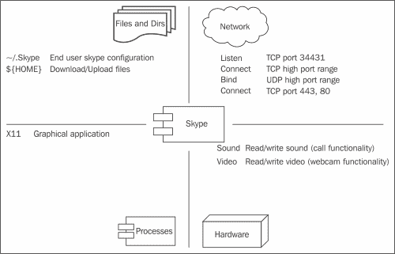

# 第四章 创建桌面应用程序策略

在本章中，我们将涵盖以下主题：

+   研究应用程序的逻辑设计

+   创建骨架策略

+   设置上下文定义

+   定义应用程序角色接口

+   测试和增强策略

+   忽略不需要的权限

+   创建应用程序资源接口

+   添加条件策略规则

+   添加构建时策略决策

# 引言

到目前为止，我们已经修改并增强了现有的策略，并通过可用的管理命令与 SELinux 子系统进行交互。但是，为了真正从 SELinux 提供的保护措施中受益，我们需要为那些本来会运行时拥有过多权限或根本无法运行的应用程序创建我们自己的策略。

桌面应用程序是一个很好的例子。终端用户域（`unconfined_t`用于支持未受限域的策略，`user_t`、`staff_t`等用于其他策略）已分配了许多权限，以允许通用应用程序在保持在用户域中的同时执行。

这有一个巨大的缺点：桌面应用程序中的漏洞或故障应用程序可能会对用户的文件和资源造成混乱，甚至可能暴露信息给恶意用户。如果所有的终端用户应用程序都在同一个域中运行，那么我们就无法谈论最小权限环境。毕竟，这个单一的用户域必须拥有各种应用程序所需的所有权限的总和。

在本章中，我们将为微软 Skype™创建一个桌面应用程序策略。Skype 是一款流行的文本消息、语音和视频通话应用程序，也可以在 Linux 系统上运行，但由于它是专有的，因此无法审查其代码以确定它可能做什么。限制此应用程序确保它只能执行我们允许它执行的操作。

# 研究应用程序的逻辑设计

在开始策略开发之前，我们需要查看应用程序的行为和逻辑设计。当我们开始将其建模到 SELinux 策略中时，我们将了解应用程序及其交互。

## 如何做……

为了为应用程序准备 SELinux 策略，我们首先需要了解应用程序的行为：

1.  查看应用程序将要交互的文件和目录，并记录下应用程序所需的权限。尝试根据应用程序的功能来结构化访问。

1.  弄清楚应用程序所需的网络资源，应用程序绑定（监听）的端口（如果有的话），以及它需要连接到哪些端口。

1.  如果应用程序需要与其他 SELinux 域（进程）进行交互，这种交互是什么样的（或它的目的是什么）？

1.  应用程序是否需要特定的硬件访问或其他内核提供的资源？

## 它是如何工作的……

收集至少以下四种资源的信息（文件、网络、应用程序和硬件/内核）有助于我们开始编写一个骨架策略文件。最终，我们可能会有这些资源的示意图，如下所示：



让我们看一下这个示例是如何实现的。

### 文件和目录

Skype™ 应用程序需要访问三种主要的文件。

第一个是其特定于用户的配置，存储在 `~/.Skype/` 中。这将包含应用程序的所有设置，包括联系人列表、聊天记录等。在 SELinux 中，特定于用户的配置条目标记为 `*_home_t`，并标记为用户的主目录内容，允许最终用户仍然管理这些资源。

第二种是通用的用户文件，应用程序需要访问这些文件来上传或下载文件。这可以是任何最终用户文件，尽管一些发行版为此创建了特定的支持（例如通过 `~/Downloads/` 位置）。

第三种包括应用程序可以访问的 Unix 系统的一般资源。这种访问是应用程序加载必要库所必需的。在应用程序策略开发过程中，这通常没有被提及，因为它是默认提供给所有应用程序的访问。

### 网络资源

应用程序需要通过其消息、语音和视频聊天功能与网络资源进行交互。

一般来说，我们知道应用程序需要连接到中央 Skype™ 基础设施，以支持所有集中管理的服务，如身份验证、目录搜索等。这个连接将通过 TCP 进行。

除了中央基础设施外，应用程序还将连接到其他用户的 Skype™ 实例，以进行直接通信。这个连接将通过 TCP 和 UDP（因为 UDP 更常用于视频和语音）进行。

### 进程

由于该应用程序是图形应用程序，我们知道它需要与工作站上运行的 X11 服务器交互。正如我们在本章的方案中将看到的那样，这自动需要为应用程序分配一组类型和权限。

除此之外，没有与其他领域的特定交互。

### 硬件和内核资源

最后，在硬件层面，应用程序将需要访问视频和声音设备（分别用于摄像头和语音通话功能）。

在出现错误时，应用程序还需要使用用户终端（以便显示错误信息）。

# 创建骨架策略

现在逻辑设置已经到位，我们可以起草一个骨架策略。这个策略将是我们遇到的逻辑设置到 SELinux 策略规则的转换。

整个策略都写在一个 `myskype.te` 文件中。这一系列方案的最终结果也可以通过本书的下载包作为参考。

## 如何操作…

我们从一个基本的骨架开始，之后可以进行增强。这个骨架的开发如下：

1.  我们从各种类型的声明开始。从设计中，我们可以推导出四种类型：

    +   `skype_t` 用作主进程域

    +   `skype_exec_t` 用作 Skype 可执行文件的标签

    +   `skype_home_t` 用于 `skype_t` 域的用户配置文件和目录

    +   `skype_tmpfs_t` 用于共享内存和 X11 交互

    推导这四种类型的代码如下：

    ```
    policy_module(myskype, 0.1)

    attribute_role skype_roles;

    type skype_t;
    type skype_exec_t;
    userdom_user_application_domain(skype_t, skype_exec_t)
    role skype_roles types skype_t;

    type skype_home_t;
    userdom_user_home_content(skype_home_t)

    type skype_tmpfs_t;
    userdom_user_tmpfs_file(skype_tmpfs_t);
    ```

1.  接下来，我们编写访问各种类型的策略规则，从管理 `~/.Skype/` 上的权限开始：

    ```
    # Allow manage rights on ~/.Skype
    manage_dirs_pattern(skype_t, skype_home_t, skype_home_t)
    manage_files_pattern(skype_t, skype_home_t, skype_home_t)
    userdom_user_home_dir_filetrans(skype_t, skype_home_t, dir, ".Skype")
    ```

1.  我们启用 `X11` 访问和共享内存。这是一组常见的权限，需要分配给启用了 X11 的应用程序：

    ```
    # Shared memory (also needed for X11)
    manage_files_pattern(skype_t, skype_tmpfs_t, skype_tmpfs_t)
    manage_lnk_files_pattern(skype_t, skype_tmpfs_t, skype_tmpfs_t)
    manage_fifo_files_pattern(skype_t, skype_tmpfs_t, skype_tmpfs_t)
    manage_sock_files_pattern(skype_t, skype_tmpfs_t, skype_tmpfs_t)
    fs_tmpfs_filetrans(skype_t, skype_tmpfs_t, { file lnk_file fifo_file sock_file })

    # Application is an X11 application
    xserver_user_x_domain_template(skype, skype_t, skype_tmpfs_t)
    ```

1.  接下来，我们编写网络访问规则，如下所示：

    ```
    # Network access
    corenet_tcp_bind_generic_node(skype_t)
    corenet_udp_bind_generic_node(skype_t)
    # Central skype services
    corenet_tcp_connect_http_port(skype_t)
    corenet_tcp_connect_all_unreserved_ports(skype_t)
    # Listen for incoming communication
    corenet_tcp_bind_all_unreserved_ports(skype_t)
    corenet_udp_bind_all_unreserved_ports(skype_t)
    ```

1.  最后，我们处理设备访问：

    ```
    # Voice and video calls
    dev_read_sound(skype_t)
    dev_read_video_dev(skype_t)
    dev_write_sound(skype_t)
    dev_write_video_dev(skype_t)
    # Terminal (tty) output
    userdom_use_user_terminals(skype_t)
    ```

## 它是如何工作的……

在骨架策略中，我们从我们知道必需的 SELinux 策略规则开始。如果我们对一个或多个规则有些不确定，完全可以先将其注释掉，然后在后续的*测试和增强策略*阶段启用这些规则。

骨架从类型声明开始，重点是应用程序的资源。然后，我们为这些资源增强应用程序域的适当权限。资源访问之后，我们查看 X11 权限，最后处理应用程序的网络交互。

### 类型声明

任何策略的第一部分都是类型和角色的声明。我们首先创建一个名为 `skype_roles` 的角色属性，并将其授予 `skype_t` SELinux 域。然后将此角色属性分配给允许调用该应用程序的用户。接下来，我们列出策略将提供的各种 SELinux 类型，并为这些类型赋予特定的含义。例如，`skype_t` 和 `skype_exec_t` 类型通过 `userdom_user_application_domain` 模板赋予适当的含义。该模板如下所示：

```
interface(`userdom_user_application_domain',`
        application_domain($1, $2)
        ubac_constrained($1)
')
```

`application_domain` 模板，从 `userdom_user_application_domain` 内部调用，具有以下定义：

```
interface(`application_domain',`
        application_type($1)
        application_executable_file($2)
        domain_entry_file($1, $2)
')
```

这导致 `skype_t` 域被标记为应用程序类型（真正的域），而 `skype_exec_t` 是一个可执行文件，可以作为进入 `skype_t` 域的入口点。最后，`skype_t` 被标记为 `ubac_constrained`，这用于**基于用户的访问控制**（**UBAC**），其中资源访问不仅通过类型及其访问向量来控制，还通过 SELinux 用户来控制。换句话说，如果 SELinux 用户 `userX_u` 以某种方式能够访问另一个 SELinux 用户（`userY_u`）的进程，那么 `skype_t` 域将无法访问，因为 UBAC 限制将发挥作用，阻止两者之间的任何交互。

所有`userdom_user_*`模板都将相关资源标记为 UBAC 受限，以及真实文件类型关联，因此`userdom_user_tmpfs_file`不仅将文件标记为`tmpfs_t`文件（用于共享内存的类型），还使其受到 UBAC 约束。

### 管理文件和目录

接下来，我们提供对文件和资源的访问权限。在示例中，我们仅限制对`~/.Skype/`的访问，并在它在用户主目录中创建时自动将其标记为`skype_home_t`（通过`userdom_user_home_dir_filetrans`），尽管我们确定需要管理用户内容文件。这是因为我们需要在这里做出策略设计决策 —— 我们是否希望应用程序完全访问所有用户资源，还是更愿意限制访问？反之，我们是否希望其他可以访问用户内容的应用程序访问 Skype™用户（配置）数据？

如果我们不希望应用程序访问任何用户内容，那么我们不需要添加任何规则：策略将仅允许通过用户主目录进行搜索权限（以定位`~/.Skype/`），并拒绝其他所有内容。

如果我们希望授予应用程序对用户内容的访问权限，可以添加以下调用：

```
userdom_manage_user_home_content_files(skype_t)
userdom_manage_user_home_content_dirs(skype_t)
```

这将授予`skype_t`域对用户文件和目录的完全管理权限。

在 Gentoo Linux 策略中，已提供额外的类型，以提供对用户文件更精细的访问控制。这些类型映射到由 Free Desktop 社区提供的**XDG 基本目录规范**（XDGBDS），包括`xdg_downloads_home_t`类型。最终用户可以将文件和目录标记为`xdg_downloads_home_t`，允许应用程序有选择地访问用户文件，而不会冒险使这些应用程序能够访问该用户更私密的文件。

在 Gentoo 中，这意味着可以将以下调用添加到策略中：

```
xdg_manage_downloads_home(skype_t)
```

### X11 和共享内存

当应用程序需要与 X11 服务器交互（作为客户端应用程序），大部分交互通过共享内存完成。在 Linux 中，共享内存可以被解释为 tmpfs 挂载上的文件（例如`/dev/shm/`），尽管还可以通过其他共享内存结构进行。

在 SELinux 中，策略开发人员希望确保此共享内存专门为该域标记。因此，他们创建了一个以`_tmpfs_t`作为后缀的类型。在我们的示例中，这是`skype_tmpfs_t`。当然，我们需要授予对共享内存的管理权限（对将使用的所有类别）给`skype_t`域。在 X11 交互的情况下，这些是文件、符号链接、FIFO 和套接字。

除了管理权限之外，我们还包括文件转换：每当`skype_t`在`tmpfs_t`标记的位置创建文件、符号链接、FIFO 或套接字时，这些资源应自动标记为`skype_tmpfs_t`。这通过`fs_tmpfs_filetrans`调用完成。

最后，我们使用`xserver_user_x_domain_template`，它包含了 X11 客户端和 X11 服务器之间交互所需的所有 SELinux 权限。此模板使用一个前缀参数（第一个参数，我们提供为`skype`），该参数将用于创建一个名为`skype_input_xevent_t`的 X11 资源类型。类似于我们在 Web 服务器中看到的（使用了`apache_content_template`调用），此模板提供了一种简单的方法，自动构建其他类型并启用 X11 支持。

除了前缀外，域本身（`skype_t`）和用于共享内存的标签（`skype_tmpfs_t`）也会传递，因为这些对于 X11 服务器的支持是必需的。

### 网络访问

对于网络访问，我们首先为`skype_t`域提供 TCP 套接字和其 IP 地址（由`node_t`表示）的绑定权限。

接下来，我们允许`skype_t`域连接到中央 Skype™ 服务，该服务通过 HTTPS 端口`443`（身份验证）以及多个看似随机的高 TCP 端口（网络节点）提供服务。HTTP 目标端口被识别为`http_port_t`类型，其他端口用于未保留端口。

最后，我们允许`skype_t`域监听传入的通信。默认情况下，这通过高 TCP 端口用于消息和状态信息，而语音和视频聊天则通过 UDP 进行。

识别所需类型的一个简单方法是查看`netstat`输出，因为它向我们显示了进程监听的端口、协议族（TCP 或 UDP）以及它连接的端口：

```
~$ netstat -naput | grep skype
tcp  0  0 0.0.0.0:34431  0.0.0.0:*  LISTEN  8160/skype
tcp  0  0 10.221.44.241:40650  111.221.77.150:40008  ESTABLISHED  8160/skype
…
udp  0  0 0.0.0.0:34302  0.0.0.0:*    8160/skype

```

## 还有更多内容……

对音频和视频设备的访问是简单的，但在设计过程中，很可能已经识别出了更多的访问（因为我们的只是一个示例）。随着策略的不断开发，编写骨架策略将变得更加简单。

学习更多关于策略的一个很好的来源是查找与我们正在编写策略的应用程序相似的现有策略，或者是具有与我们应用程序相似功能的应用程序。例如，对于 Skype™，我们可以查看 Gift（一个点对点文件共享应用程序）的策略，它是一个面向终端用户的图形应用程序，具有点对点通信流，支持上传和下载文件。

毕竟，SELinux 策略是域预期行为的书面记录。如果另一个应用程序具有相同或相似的行为，那么它的策略也会非常相似。

在前面的示例中，我们根据功能需求将权限进行了分组。然而，正如参考策略中提到的，SELinux 策略文件的编码风格使用了不同的分组方式，因此如果该策略要上报到上游，确保遵循这种编码风格。

## 另见

+   有关 XDGBDS 的更多信息，请参见 [`standards.freedesktop.org/basedir-spec/latest/`](http://standards.freedesktop.org/basedir-spec/latest/)

# 设置上下文定义

政策开发的下一步是使用正确的文件上下文标记其资源。这将正确标记应用程序的文件，确保 SELinux 政策做出正确的决策。

## 如何操作……

要更新文件上下文定义，请按照以下步骤操作：

1.  创建`myskype.fc`文件，并在其中添加`~/.Skype/`的定义：

    ```
    HOME_DIR/\.Skype(/.*)?  gen_context(system_u:object_r:skype_home_t,s0)
    ```

1.  接下来，添加`skype`二进制文件的定义：

    ```
    /opt/skype/skype  --  gen_context(system_u:object_r:skype_exec_t,s0)
    /opt/bin/skype  --  gen_context(system_u:object_r:skype_exec_t,s0)
    /usr/bin/skype  --  gen_context(system_u:object_r:skype_exec_t,s0)
    ```

## 它是如何工作的……

二进制文件的定义是标准的基于路径的上下文声明。然而，用户主目录的定义是特别的。

从示例中可以看到，路径以`HOME_DIR`开始。这是 SELinux 库使用的特殊变量，它会自动映射到所有 Linux 用户的主目录。与其直接创建一个`/home/[^/]*/\.Skype(/.*)?`上下文，这样会有设计问题，因为其他位置的主目录（例如`/export/home/user/`）将无法匹配，SELinux 库会检查所有真实用户的主目录（用户 ID 从`500`开始，尽管这是可以配置的），并且对于每个不同的主目录根目录（`/home/`是最常用的），它会生成适当的上下文。

该操作的结果存储在`/etc/selinux/mcs/contexts/files/`目录中的`file_contexts.homedirs`文件中，并在策略构建期间自动创建（通过`genhomedircon`命令）。

除了`HOME_DIR`之外，其他支持的变量包括`HOME_ROOT`（表示主目录根路径）和`ROLE`（表示与用户关联的第一个角色）。

# 定义应用程序角色接口

最后，在测试政策之前，我们需要创建一个角色接口，并将其分配给将用于测试（和运行）应用程序的用户域。如果我们没有创建角色接口并将其分配给用户域，则用户域要么根本没有权限执行该应用程序，要么应用程序将以用户上下文而不是新定义的`skype_t`域运行。如果用户域没有被解除限制，那么应用程序很可能会失败。

## 如何操作……

角色接口是政策的门户。它们确保域和 SELinux 用户能够与应用程序交互，并确保特定应用程序的权限集是一致的。

我们在`.if`文件中创建这样的接口，然后将这个接口分配给一个用户域，以便测试这个接口：

1.  创建`myskype.if`文件，并在其中加入以下接口：

    ```
    interface(`skype_role',`
      gen_require(`
        type skype_t, skype_exec_t, skype_tmp_t, skype_home_t;
      ')
      # Allow the skype_t domain for the user role
      roleattribute $1 skype_roles;
      # Allow domain transition for user domain to skype_t
      domtrans_pattern($2, skype_exec_t, skype_t)
      # Interact with skype process
      ps_process_pattern($2, skype_t)
      allow $2 skype_t:process { ptrace signal_perms };
      # Manage skype file resources
      manage_dirs_pattern($2, skype_home_t, skype_home_t)
      manage_files_pattern($2, skype_home_t, skype_home_t)
      manage_lnk_files_pattern($2, skype_home_t, skype_home_t)
      # Allow user to relabel the resources if needed
      relabel_dirs_pattern($2, skype_home_t, skype_home_t)
      relabel_files_pattern($2, skype_home_t, skype_home_t)
      relabel_lnk_files_pattern($2, skype_home_t, skype_home_t)
    ')
    ```

1.  为用户域创建一个策略（例如，`myunprivuser.te`），通过将`skype_role`调用分配给用户域，从而授予普通用户访问`skype_t`域的权限：

    ```
    policy_module(myunprivuser, 1.0)
    gen_require(`
      type user_t;
      role user_r;
    ')
    optional_policy(`
      skype_role(user_r, user_t)
    ')
    ```

1.  构建这两个政策并加载它们。然后，重新标记`skype`二进制文件（以及可能已存在的`~/.Skype/`位置）：

    ```
    ~# restorecon /opt/skype/bin/skype /opt/bin/skype /usr/bin/skype
    ~# restorecon -RF /home/user/.Skype

    ```

## 它是如何工作的…

虽然我们已经定义了认为需要的所有规则（在下一个示例中，策略将扩展直到真正起作用），但我们尚未定义允许用户域实际执行`skype_exec_t`二进制文件并使进程在`skype_t`域中运行的规则。

为了实现这一点，我们需要确保在用户执行`skype_exec_t`时，发生域过渡到`skype_t`域。这是通过`domtrans_pattern`调用来处理的。但在允许域过渡之前，我们首先需要允许用户角色使用`skype_t`域，这通过`roleattribute`调用来完成。

直到现在，我们主要关注的是类型强制规则（也就是说，根据目标资源的标签授予 SELinux 域特权）。为了允许某些用户运行应用程序，应用程序域本身需要被授予给用户角色。这是通过 SELinux 的**基于角色的访问控制**（**RBAC**）模型来支持的。该 RBAC 模型确保某个域（在我们的示例中是`skype_t`）只能由我们为其配置的角色使用（在我们的示例中是`user_r`）。其他角色，如 DBA 角色（`dbadm_r`），可能不需要运行 Skype™应用程序，因此不会被授予访问`skype_t`域的权限。

### 注意

不授予一个域并不一定会阻止应用程序在用户域内执行。为了实现这一点，我们需要确保其他角色无法执行该可执行文件类型。我们不会使用`userdom_user_application_domain`为`skype_t`和`skype_exec_t`类型分配一个通用的可执行属性，而是会使用类似以下的方式：

```
application_type(skype_t)
files_type(skype_exec_t)
allow skype_t skype_exec_t:file { entrypoint mmap_file_perms ioctl lock };
ubac_constrained(skype_t)
```

由于用户域需要能够执行 Skype™，还需要管理`skype_home_t`文件（例如，在需要手动干预`~/.Skype/`或进行备份时），因此我们授予它管理权限以及重新标记权限。当例如恢复备份时，重新标记权限是必需的。

对于用户域，我们将调用刚刚创建的`skype_role`接口。在这个示例中，我们使用了`optional_policy`语句。这允许即使某些调用无法解决或不被支持时，策略模块仍然能够被加载。

假设我们需要卸载`myskype`模块。如果没有`optional_policy`语句，则`myunprivuser`模块也需要被卸载，即使这个策略模块可能包含其他对用户域正常工作至关重要的规则（在示例中，我们只调用了`skype_role`接口，但过一段时间后，模块可能会调用许多其他接口）。如果我们不卸载该模块并且没有使用`optional_policy`语句，SELinux 将会警告管理员模块之间未解决的依赖关系。

使用`optional_policy`语句，SELinux 工具知道该调用可能无法解决，在这种情况下，整个块（`optional_policy`块中的所有内容）将被忽略，同时模块仍然保持加载状态。

## 还有更多...

在配方开始时，我们提到过非受限用户域能够在没有域转换的情况下执行应用程序。这是可以预期的，因为非受限域的整个理念就是它们没有被限制。

通常，将域转换从非受限域到受限域被认为是不好的做法。只有在非常特殊的情况下，从非受限域到受限域的域转换才有意义（例如，当目标域用于限制潜在易受攻击的应用程序时，例如沙箱域）。

从安全的角度来看，立即限制用户并在（受限）用户域和应用程序域之间使用适当的域转换更有意义。

# 测试和增强策略

策略准备就绪并加载后，开始从用户的角度测试应用程序，同时密切关注审计日志（以查找拒绝）和应用程序输出。

测试应用程序是策略开发中的一个重要阶段，也是最耗时的任务。在测试过程中，将尝试应用程序的几个功能特性，结果的权限（就 SELinux 而言）需要添加到策略中。

在之前的配方中，如*创建骨架策略*，我们根据其他策略和常识启用了一个权限集。然而，这些权限还没有被验证和测试过。在这个配方中，我们将断言这些权限确实是需要的，因为我们不想创建一个与其关联权限过多的策略。

## 如何操作…

测试策略是一个重复的任务。每次尝试意味着需要丢弃启动之前的 AVC 拒绝（因为我们不想包含与测试无关的权限），然后对应用程序进行测试，并记录结果。根据应用程序的表现，新的策略规则将被添加到策略中：

1.  写下当前时间戳或在审计日志中创建一个参考点（例如，通过重新加载 SELinux 策略），以便我们知道从审计日志的哪个点开始查看审计事件：

    ```
    ~# semodule -R

    ```

1.  作为最终用户，从终端窗口启动应用程序并观察发生的情况。

1.  写下显示的错误（如果有）：

    ```
    ~$ skype
    skype: error while loading shared libraries: cannot restore segment prot after reloc: Permission denied

    ```

1.  查看在审计日志中显示的拒绝信息：

    ```
    ~# ausearch -m avc -ts recent

    ```

1.  对于每个第一次拒绝或与之前显示的错误相关的拒绝，尝试使用适当的调用来增强策略并再次尝试。

## 它是如何工作的…

在这个阶段，我们正在一步步地增强策略。一些策略开发者喜欢在宽松模式下运行应用程序（要么是将整个系统运行在宽松模式下，要么是将某个特定领域标记为宽松领域），记录所有执行的访问（通过 AVC 拒绝）并根据这些信息增强策略。虽然这可能会使策略更快速地生效，但这些开发者也面临着将过多权限添加到策略中的风险，而这种情况后来很难被挑战或更改。

相反，我们让 SELinux 阻止访问，并观察应用程序如何反应。根据应用程序的错误日志或应用程序的行为以及通过日志看到的 AVC 拒绝，我们可以很好地了解真正需要哪些权限。

例如，在示例中出现的错误的同时，还发生了以下拒绝：

```
type=AVC msg=audit(1398930752.113:608): avc: denied { execmod } for pid=8943 comm="skype" path="/opt/bin/skype" dev="dm-2" ino=801 scontext=user_u:user_r:skype_t:s0 tcontext=user_u:user_r:skype_exec_t:s0 tclass=file
```

我们需要集中注意力在第一次出现的拒绝上，而不是所有显示的拒绝。很可能在第一次拒绝之后显示的拒绝是由错误处理程序引发的，不管是由应用程序还是系统引发的，如果为该领域授予适当权限，这些拒绝本来是不会被触发的。尝试授予这些权限会导致权限集定义过于宽泛。

上述拒绝将导致策略中添加以下内容：

```
# Error 'cannot restore segment prot after reloc'
allow skype_t skype_exec_t:file execmod;
```

# 忽略我们不需要的权限

经过反复测试，我们将获得一个可行的策略，即使审计日志中可能仍然会显示拒绝。为了避免让管理员产生警觉，我们可能希望禁用对这些特定拒绝的审计（同时，当然，确保关键访问向量仍由审计守护进程记录）。

## 如何操作…

为了禁用不影响应用程序行为的某些拒绝的日志记录，触发拒绝，然后按以下步骤注册 `dontaudit` 语句：

1.  对于审计日志中显示的每个拒绝，我们需要找到相应的 `dontaudit` 规则集。考虑以下实例：

    ```
    type=AVC msg=audit(1398936489.877:2464): avc: denied { search } for pid=8241 comm="skype" name="modules" dev="dm-0" ino=1322041 scontext=user_u:user_r:skype_t:s0 tcontext=user_u:object_r:user_home_t:s0 tclass=dir
    ```

1.  在 SELinux 策略中查找与此问题相关的 `dontaudit` 语句：

    ```
    ~$ sefindif dontaudit.*user_home_t.*search
    interface(`userdom_dontaudit_search_user_home_content',`
     dontaudit $1 user_home_t:dir search_dir_perms;

    ```

1.  将接口调用添加到策略中，重建策略，然后重新加载。重复此过程，直到所有外观上的拒绝不再显示。

## 它是如何工作的…

应用程序执行的许多操作可以视为外观性操作——虽然在示例中，应用程序确实通过用户文件执行搜索，但它们对于应用程序的正常运行并不是必需的。例如，它可能会搜索整个目录，直到找到自己的文件，而这些文件它是有权限访问的。

通过为这些操作添加 `dontaudit` 语句，我们确保审计日志保持干净。

如果出现问题，管理员仍然可以禁用策略中的`dontaudit`语句，显示所有 SELinux 触发的拒绝（即使是那些明确标记为`dontaudit`的拒绝）：

```
~# semodule -DB

```

要重新启用`dontaudit`语句，重新构建并重新加载策略：

```
~# semodule -B

```

在某些情况下，可能没有与`dontaudit`相关的接口可用。在这种情况下，可以创建一个新的接口（作为 SELinux 策略模块的一部分），并在其中定义`dontaudit`规则。例如，对于一个设置为忽略获取`mozilla_home_t`内容属性的`dontaudit`规则，我们将创建一个名为`mymozilla`的策略模块，并在其中声明`mozilla_dontaudit_getattr_home`接口。

# 创建应用程序资源接口

我们的应用程序策略几乎准备好部署了。然而，它目前主要面向最终用户，并且除了通过`skype_role`接口之外，没有任何与`skype_t`域（或`skype`模块管理的其他资源）交互的方式。

在这个过程中，我们将为读取`skype_home_t`添加一个接口。

## 如何执行……

除了我们在*定义应用程序角色接口*过程中创建的`skype_role`接口之外，我们还需要创建额外的资源接口，以便其他域能够轻松地与新创建的策略交互：

1.  打开`myskype.if`文件，并添加以下内容：

    ```
    interface(`skype_read_home',`
      gen_require(`
        type skype_home_t;
      ')
      userdom_search_user_home_dirs($1)
      allow $1 skype_home_t:dir list_dir_perms;
      allow $1 skype_home_t:file read_file_perms;
      allow $1 skype_home_t:lnk_file read_lnk_file_perms;
    ')
    ```

## 它是如何工作的……

这个过程本身很简单——对于每次与`skype`模块管理的资源的交互，我们需要创建一个可以被其他模块调用的接口。

每个接口应是完整的。例如，为了读取`skype_home_t`内容，域首先需要能够搜索用户的主目录（`user_home_dir_t`，这与`user_home_t`不同，前者是主目录的类型，而后者是其内容的类型）；因此，需要调用`userdom_search_user_home_dirs`。

然后，将必要的权限分配给域。由于我们在接口名称中没有提供任何类标识符，接口将授予对所有与`skype_home_t`类型相关的（重要的）类的读取访问权限。

如果我们只想授予对文件的读取访问权限（而不包括`directory`类），则接口将命名为`skype_read_home_files`。

# 添加条件策略规则

我们可以通过条件进一步微调我们的策略。之前识别的一些访问向量在所有情况下可能并不需要，因此通过 SELinux 布尔值将其设为可选并可配置是有意义的。

以下是两个可配置策略候选的访问向量：

+   访问视频和音频设备（为了减少恶意软件或漏洞使应用程序能够访问摄像头或音频设备并监视无防备用户的风险）

+   访问所有用户内容（而不仅仅是`skype_home_t`内容）

## 如何执行……

以下步骤集通过引入布尔值使策略对管理员更加灵活。这些布尔值修改策略的行为，并被添加到策略中。

1.  在 `myskype.te` 内，创建两个布尔值的定义。通常在类型声明之前完成此操作。

    ```
    gen_tunable(skype_use_audio, false)
    gen_tunable(skype_use_video, false)
    gen_tunable(skype_manage_user_content, false)
    ```

1.  在策略内部，将我们希望通过布尔值触发的语句进行分组：

    ```
    tunable_policy(`skype_use_audio',`
      dev_read_sound(skype_t)
      dev_write_sound(skype_t)
    ')
    tunable_policy(`skype_use_video',`
      dev_read_video_dev(skype_t)
      dev_write_video_dev(skype_t)
    ')
    tunable_policy(`skype_manage_user_content',`
      userdom_manage_user_home_content_dirs(skype_t)
      userdom_manage_user_home_content_files(skype_t)
    ')
    ```

## 它是如何工作的…

`gen_tunable` 声明将生成管理员可以在系统上切换的布尔值。每个声明的第一个参数是要创建的布尔值的名称，第二个参数设置布尔值的默认值。

一旦定义了布尔值，`tunable_policy` 语句允许将需要配置的语句调用进行分组。

即使布尔值被禁用，也有可能启用某些规则。例如，对于 `skype_manage_user_content`，可以使用以下代码：

```
tunable_policy(`skype_manage_user_content',`
  # boolean enabled
  userdom_manage_user_home_content_dirs(skype_t)
  userdom_manage_user_home_content_files(skype_t)
  ',`
  # boolean disabled
  userdom_dontaudit_manage_user_home_content_dirs(skype_t)
  userdom_dontaudit_read_user_home_content_files(skype_t)
  …
')
```

布尔值也可以组合，如以下代码所示：

```
tunable_policy(`use_nfs_home_dirs && skype_manage_user_content',` … ')
```

在这种情况下，策略组规则仅在两个布尔值都启用时才会生效。

也可以仅在布尔值未设置时启用规则，如以下代码行所示：

```
tunable_policy(`!use_nfs_home_dirs',` … ')
```

## 还有更多...

可调策略是 SELinux 的一个强大扩展。然而，这也有一些注意事项：

+   将 SELinux 布尔值的描述提供给管理员并不简单。描述是通过策略中的注释来定义的，但这对于自定义模块不起作用——需要完整的策略构建才能生成包含所有描述的 `policy.xml` 文件。

+   在 `tunable_policy` 组内无法分配属性。相反，策略开发人员需要使与属性相关的权限可配置（如果可能的话），或者根本不分配该属性。

+   在 `tunable_policy` 组内无法使用命名文件转换。通常情况下，这没什么大不了的——有一些情况下，命名文件转换会依赖于布尔值，但这些情况确实会发生。

+   在 `tunable_policy` 组内无法使用 `optional_policy` 语句。相反，首先用 `optional_policy` 语句包裹 `tunable_policy` 调用。如果一个布尔值会触发多个需要使用 `optional_policy` 块的策略调用，则可能需要创建多个块。

然而，目前正在努力从 SELinux 子系统中去除这些缺点。

# 添加构建时策略决策

我们可能想要关注的最后一个增强功能是构建时策略决策。与 SELinux 布尔值不同，这些是基于构建参数启用（或禁用）的策略块。我们过去已经遇到过其中一些，比如 `enable_mcs`、`enable_mls` 以及分发选择参数，如 `distro_gentoo` 或 `distro_redhat`。

在这个方案中，我们将启用`xdg_manage_downloads_home`调用，但仅在为 Gentoo 系统构建策略时启用。

## 如何执行…

构建时决策通过`ifdef`语句添加到策略中，正如下一个步骤所展示的：

1.  打开`myskype.te`并添加以下代码块：

    ```
    ifdef(`distro_gentoo',`
      xdg_manage_downloads_home(skype_t)
    ')
    ```

1.  重新构建策略。在 Gentoo 系统中，我们可以通过`sesearch`确认现在已授予访问权限，而其他发行版可能根本不知道`xdg_downloads_home_t`类型：

    ```
    ~$ sesearch -s skype_t -t xdg_downloads_home_t -A

    ```

## 它是如何工作的…

参考策略构建系统自动定义了一些可以被`ifdef`宏使用的参数。构建系统使用`/usr/share/selinux/mcs/include/`或`/usr/share/selinux/devel/include/`中的`build.conf`文件内的定义来生成这些参数。

例如，`build.conf`中的发行版参数设置如下：

```
DISTRO ?= gentoo
```

在`Makefile`中，这会转换为一个`M4PARAM`设置：

```
ifneq ($(DISTRO),)
        M4PARAM += -D distro_$(DISTRO)
endif
```

通过这些`M4`参数，我们可以使用`ifdef`语句来查询这些参数的存在并做出构建时的决策。

## 还有更多内容...

我们可以添加自己的一组参数。为此，我们在调用`make`命令（用于构建策略模块）之前设置`M4PARAM`环境变量。

例如，为了支持`debug`语句，我们可以在策略中设置如下：

```
ifdef(`debug',` … ')
```

在策略构建过程中，我们可以按如下方式启用这些语句：

```
~$ export M4PARAM="-D debug"
~$ make mypolicy.pp

```
