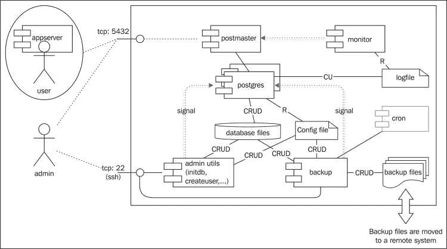
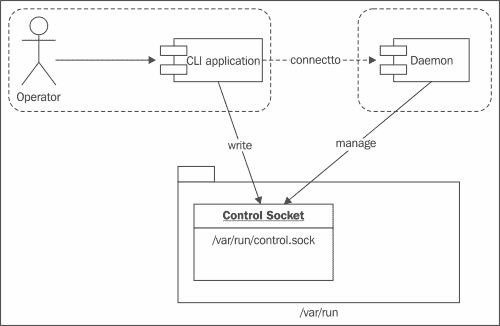

# 第五章：创建服务器策略

本章将介绍以下几个要点：

+   理解服务

+   明智地选择资源类型

+   基于使用案例区分策略

+   创建资源访问接口

+   创建 exec、run 和 transition 接口

+   创建流连接接口

+   创建管理接口

# 简介

桌面应用程序策略保护用户免受应用程序内部漏洞或应用程序所带来的不良行为的影响。然而，在服务器上，影响可能要大得多。服务器策略用于保护整个系统免受不良行为、用户的滥用访问或应用程序中的漏洞被利用。

服务通常有较长的生命周期。与桌面应用程序不同，桌面应用通常与用户的日常工作周期一起启动和关闭，而服务往往是持续运行的，24/7 全天候服务。这不仅提供了更大的时间窗口来尝试和利用这些服务，而且在管理员可能不会积极监视的情况下，服务通常在后台运行。

# 理解服务

设计服务器策略的第一个方面是了解当前的服务。每个服务都有自己的内部架构，理解各种进程和资源如何相互作用至关重要。

只有当我们完全理解内部架构时，才能创建一个正常运行的策略。否则，我们的策略可能会过于宽泛（过多的访问权限）或过于限制。与通常从最终用户角度容易测试的应用程序不同，服务常常有一些更难测试（甚至难以考虑）的活动。

## 如何做……

就像桌面应用程序一样，理解应用程序的行为对创建良好的 SELinux 策略至关重要。可以通过执行以下步骤进行行为研究和分析：

1.  通过查找在线架构图或架构文档，全面研究该服务。

1.  尝试在沙盒环境中探索该服务。

1.  跟随一些与该服务相关的教程，包括管理任务和最终用户任务。

1.  从结构上记录服务应如何使用。

## 如何运作……

理解服务意味着获得一定的服务管理经验。如果不了解某种数据库技术的工作原理，就几乎不可能为该技术创建服务器策略。

### 在线研究

大多数服务都有良好的在线架构文档。通过使用互联网搜索引擎，我们可以轻松找到特定服务的架构信息。

在开发服务策略时，最好将类型和域名命名为与所使用的功能服务相似。例如，在 Postfix 架构中，`pickup`、`cleanup`、`smtpd`、`qmgr`等功能服务是 Postfix 管理员必须处理的基本服务。在 SELinux 策略中，我们应尽量使域名标签保持一致（例如，`qmgr`服务的域标签为`postfix_qmgr_t`，`maildrop`队列的标签为`postfix_spool_maildrop_t`，以此类推）。

### 沙箱环境

能够在沙箱环境中玩转服务让我们可以看到其中的相互作用。它还允许我们通过在线教程或管理指南来了解服务的使用。

现在有许多技术可以用来玩转技术。虚拟化允许用户在隔离的环境中运行完整的系统，并促成了虚拟设备的创建。

虚拟设备是可以轻松安装在虚拟化环境中的虚拟镜像。然而，纯粹的虚拟化仍然要求用户安装操作系统、安装服务并进行配置，才能真正开始使用；虚拟设备提供了开箱即用的预配置系统，托管一个或多个服务。

除了虚拟化之外，容器也开始发挥重要作用。与虚拟化不同，运行在容器中的软件与其他软件隔离，但仍然是操作系统本身的一部分。

### 结构文档

在详细阅读应用程序的架构并可能玩转过软件后，我们可能需要进一步记录服务的架构，以推导出正确的 SELinux 类型和资源，以及与服务相关的接口和角色。

为了不忘记任何重要的内容，可以使用**FAMOUS**缩写来记录服务的逻辑架构：

+   **数据流**：它告诉我们哪些外部资源以批处理的方式为服务提供输入，以及服务与哪些外部资源进行交互。

+   **管理**：它向我们提供有关如何管理服务的信息（命令行界面、用户界面或其他应用程序）。

+   **监控**：它向我们提供关于使用的日志文件或支持的命令的信息，以验证服务的状态。

+   **操作**：它记录了所有进程的日常运行行为（以及使用 CRUD 方法——创建、读取、更新、删除的流程）。这通常是在在线研究阶段找到的架构信息。

+   **用户与权限**：它记录了服务中如何定义和管理用户。还记录了使用了哪些身份验证或授权后端，服务中不同角色的行为如何，等等。

+   **与安全相关的功能**：这些功能告诉我们有关安全相关的功能，如基于应用程序的访问控制、防火墙要求（在我们的案例中，这对策略网络规则非常重要）等。

有了这些信息，我们可以清楚地概览服务的行为。例如，PostgreSQL 数据库服务的高级视图如下所示：



这样的图示帮助我们后续识别类型，包括涉及的过程和资源。任何与第三方服务提供的服务的交互也会展示出来，因为这些交互会导致需要分配给其他过程的权限（即 SELinux 策略中的接口）。

如果不理解服务的具体工作方式，记录服务的工作流程并不容易。由于服务的复杂性，最好请服务的专家或开发人员一起指导我们理解服务。这些开发人员和工程师以后可以用来挑战正在编写的 SELinux 策略。

## 另见

开放源代码虚拟设备提供者的非详尽列表如下：

+   Artica ([`www.artica.fr`](http://www.artica.fr)) 用于代理、邮件和 NAS 设备。

+   Turnkey Linux ([`www.turnkeylinux.org/`](http://www.turnkeylinux.org/)) 提供超过一百个现成可用的解决方案。

+   Vagrant ([`www.vagrantup.com/`](http://www.vagrantup.com/)) 是一个虚拟系统管理平台，拥有大量的 Vagrant box，提供许多免费软件服务的虚拟设备设置。

+   Docker ([`www.docker.io/`](https://www.docker.io/)) 不是一个真正的虚拟化设置，而是一种基于容器的方法。从 Docker Index ([`index.docker.io/`](https://index.docker.io/))，可以自由下载许多容器。

许多商业技术也提供开发虚拟机来进行部署。像 VMware® 这样的虚拟化技术提供商有解决方案交换社区，其中各种技术的虚拟镜像可以自由获取。

# 明智地选择资源类型

服务与资源进行交互，我们为资源分配的标签被分配给这些资源的细粒度访问控制所使用。最终用户文件（对于系统中拥有 Linux 账户的用户）被标记为 `user_home_t`，这对于大多数用途来说已足够。然而，当我们处理服务时，资源标签的选择决定了其他应用程序是否以及如何访问这些资源，而且比我们目前为最终用户文件使用的标签更为细粒度。

在 SELinux 策略中有一些关于资源类型选择的最佳实践，我们现在将进行讨论。

## 如何进行……

服务资源类型需要谨慎选择。它们的命名隐含了资源的功能用途，这已经推动了策略在某种结构中的发展。可以通过完成以下步骤来开发这些类型及其相关权限：

1.  查找将在其特定域内运行的进程，并创建域类型。对于每个域，查找该域的入口文件并创建 `_exec_t` 类型。将该类型标记为初始化守护进程类型（当服务通过服务脚本启动时）或 D-Bus 守护进程（当服务通过 D-Bus 启动时）。例如，对于 BIND 服务：

    ```
    type named_t;
    type named_exec_t;
    init_daemon_domain(named_t, named_exec_t)
    ```

1.  查找应用程序使用的所有逻辑资源集合。这些通常是特定于服务架构的文件（例如，数据库服务的数据库文件），但不应仅限于文件。

1.  为这些资源创建特定的类型。例如，对于 Qemu 虚拟客户机镜像：

    ```
    type qemu_image_t;
    files_type(qemu_image_t)
    ```

1.  授予域对这些资源的适当访问权限。例如，`qemu` 进程（以 `qemu_t` 身份运行）将需要对镜像进行管理权限：

    ```
    manage_files_pattern(qemu_t, qemu_image_t, qemu_image_t)
    ```

1.  浏览基础设施资源（PID 文件、日志文件和配置文件）并相应地标记它们。例如，对于 `named` 变量，运行时数据将命名如下：

    ```
    type named_var_run_t;
    files_pid_file(named_var_run_t)
    ```

1.  授予域对这些资源的适当访问权限，并尽可能启用适当的文件过渡：

    ```
    allow named_t named_var_run_t:file manage_files_perms;
    allow named_t named_var_run_t:sock_file manage_sock_file_perms;
    files_pid_filetrans(named_t, named_var_run_t, { file sock_file });
    ```

## 它是如何工作的…

应用策略始终提供一组通用的权限。它从适当的域定义开始（展示策略将如何结构化），然后是资源访问模式。资源可以是功能性的（特定于正在调查的应用程序）或更多基础设施性的（如日志文件和配置文件）。

### 域定义

服务域用于识别具有相似功能范围的长期运行进程。例如，BIND named 进程（定义为 `named_t`）或 Apache `httpd` 进程（都以 `httpd_t` 身份运行）。

这些服务域通常由 `init` 脚本启动，这导致使用 `init_daemon_domain` 接口。如果服务通过 D-Bus 启动，则使用的接口是 `dbus_system_domain`。当然，可以使用多个接口：例如，PPP 守护进程支持 `init` 脚本和 D-Bus。

如果一个服务守护进程由另一个守护进程启动，则只需将进程域标记为域类型，并将可执行类型标记为入口点：

```
type postfix_bounce_t;
type postfix_bounce_exec_t;
domain_type(postfix_bounce_t)
domain_entry_file(postfix_bounce_t, postfix_bounce_exec_t)
```

在这种情况下，我们需要为父域（在我们的案例中是 `postfix_master_t`）提供执行（`postfix_bounce_exec_t`）和过渡（到 `postfix_bounce_t`）的权限：

```
domtrans_pattern(postfix_master_t, postfix_bounce_exec_t, postfix_bounce_t)
```

### 逻辑资源

逻辑资源是特定于应用程序功能设计的文件。例如，像 Qemu 这样的虚拟化层将为镜像文件提供逻辑资源（`qemu_image_t`）。有关 Web 服务器的逻辑资源已经在前面的章节中讨论过（例如，`httpd_sys_content_t`用于标准系统只读 Web 内容）。

这些资源被声明为常规文件资源，并为各个域授予适当的权限。稍后在文档中，当总结`qemu_t`域的权限时，可以添加`manage_files_pattern`行，以允许`qemu_t`域管理镜像。

通过为每个逻辑资源创建单独的标签，我们可以为其他可能需要与这些资源交互的进程创建接口，而不必授予这些应用程序过多的权限。

以备份应用程序为例，比如 Amanda。实际的备份数据本身（`amanda_data_t`）应该仅能由 Amanda 应用程序访问。系统上的其他服务管理员不应访问这些文件——备份可能包含敏感信息，因此只有备份工具本身才能访问这些数据。即使是备份管理员，尽管需要管理备份基础设施，也可能不需要直接访问这些数据。

### 基础设施资源

基础设施资源是经常为应用程序设置的文件类型。

日志文件通过`logging_log_file`接口标记，并通常以`_log_t`后缀结尾，例如`amanda_log_t`。通过将其标记为日志文件，分配给所有日志文件操作（如`logging_read_all_logs`）的域会自动获得这些权限。通常，会设置文件转换规则，使得在`/var/log/`中创建的文件自动获得正确的类型。这是通过`logging_log_filetrans`接口实现的：

```
type amanda_log_t;
logging_log_file(amanda_log_t)
# Directories created by amanda_t domain in /var/log (var_log_t) get the amanda_log_t type:
logging_log_filetrans(amanda_t, amanda_log_t, dir)
```

配置文件被标记为常规文件（通过`files_type`），并且以`_conf_t`或`_etc_t`结尾。一些策略开发人员喜欢使用`_conf_t`表示真实的配置文件，而使用`_etc_t`表示`/etc/`目录结构下的其他杂项文件，这些文件不是直接的配置文件。不过在大多数情况下，这仅仅是出于语义上的考虑，因为所有相关域在这两种类型上需要相同的权限。

临时文件通过`files_tmp_file`接口标记，并以`_tmp_t`后缀结尾。几乎总会设置文件转换规则，以确保临时文件被正确标记：

```
type amanda_tmp_t;
files_tmp_file(amanda_tmp_t)
# All files, directories and symbolic links created by amanda_t in a tmp_t location should get the amanda_tmp_t label:
files_tmp_filetrans(amanda_t, amanda_tmp_t, { dir lnk_file file })
```

PID 文件和其他通用的运行文件通常标记为以`_var_run_t`结尾，并通过`files_pid_file`接口标记为 PID 文件。与日志文件一样，通常也会设置文件转换规则：

```
type amanda_var_run_t;
files_pid_file(amanda_var_run_t)
# Files and sockets created in /var/run should become amanda_var_run_t:
files_pid_filetrans(amanda_t, amanda_var_run_t, { file sock_file })
```

其他没有给出逻辑资源名称的变量数据通常会以`_var_lib_t`结尾进行标注。这类文件被标记为常规文件（使用`file_type`），并可以通过`files_var_lib_filetrans`定义文件转换。

# 根据用例区分策略

随着服务的成熟，它们通常会获得更多的功能，但这些功能并不总是必要的。例如，能够根据配置可选连接到各种网络资源的守护进程，SELinux 策略不应允许其始终连接到各种网络资源。

为了管理这些功能，SELinux 策略开发者会包含布尔值，以便根据管理员的需求选择性地切换策略。

## 如何实现……

布尔值允许策略开发者创建仅在管理员选择使用时才参与访问控制的策略规则。特别是对于服务，这通常用于根据服务的用例有条件地允许权限，具体实现如下：

1.  根据配置识别应该标记为可选的策略块。例如，这可能是一组允许 PostgreSQL 连接到其他 PostgreSQL 数据库的策略规则：

    ```
    corenet_tcp_connect_postgresql_port(postgresql_t)
    corenet_sendrecv_postgresql_client_packets(postgresql_t)
    ```

1.  对于每个模块，创建一个合适的 SELinux 布尔值，管理员可以轻松识别它作为切换其特定用例的正确布尔值。例如，我们可以创建一个`postgresql_connect_db`布尔值：

    ```
    ## <desc>
    ##   <p>
    ##     Determine if the PostgreSQL daemons can connect to other databases.
    ##   </p>
    ## </desc>
    gen_tunable(postgresql_connect_db, false)
    ```

1.  用`tunable_policy`语句将需要切换的策略块围绕起来，针对选择的 SELinux 布尔值，如下所示：

    ```
    tunable_policy(`postgresql_connect_db',`
      corenet_tcp_connect_postgresql_port(postgresql_t)
      corenet_sendrecv_postgresql_client_packets(postgresql_t)
    ')
    ```

## 它是如何工作的……

虽然我们不应通过生成大量布尔值来过度调整策略，但将经常在漏洞利用中被滥用的功能进行隔离是一个良好的做法。

考虑一个数据库引擎。数据库可能具有允许它们连接到其他数据库的功能（例如，设置数据库链接或支持某种集群），但在许多情况下，这些功能是不需要的。如果一个数据库被攻破（例如通过 SQL 注入），最好确保该数据库不能访问其他数据库（以便攻击的数据库被有效隔离）。

在 PostgreSQL 设置中切换此行为的配置可能被命名为`postgresql_connect_db`（针对特定数据库的连接）或`postgresql_connect_all_ports`（针对任何目标连接），并按照之前的示例进行开发（该示例包括了内联注释文档，如果该策略旨在成为分发策略或参考策略项目的一部分，则会使用这些注释）。

访问网络上的其他资源是一个常见的功能，如果它不是应用程序的标准行为的一部分，应考虑将其设置为可选。

还有许多其他应该考虑的用例。以下是一个非详尽的列表：

+   可以选择性地执行系统脚本或用户提供脚本的应用程序应通过`_exec_scripts`或`_exec_user_scripts`布尔值进行管理。

+   由于某些功能导致允许的域转换到更高特权的域或增加特权，通常通过`_use_*`布尔值进行管理。例如，一个可选择支持 Java 的域可以具有`_use_java`布尔值。

+   对特定文件系统或设备的访问也通过`_use_*`布尔值进行管理，例如`_use_cifs`（用于 SMB-CIFS 文件系统）或`_use_nfs`。

+   功能支持（例如 Nginx 对各种协议的支持）可以通过`_enable_*`布尔值使其可选，例如`nginx_enable_imap_server`或`nginx_enable_pop3_server`。

# 创建资源访问接口

在定义了所有资源之后，我们现在需要确保其他域可以根据需要使用这些资源。正如我们所看到的，资源可以是功能性的（特定于某个服务）或更具基础设施性质的（如日志文件）。

资源访问是通过 SELinux 策略规则提供的，这些规则需要通过访问接口提供。这些接口随后被第三方 SELinux 策略模块使用，以记录并允许访问资源类型。如果没有访问接口，我们定义的资源类型将不容易被其他策略开发人员访问。

## 它是如何做到的…

要创建资源访问接口，在模块的`.if`文件中添加适当的接口定义。例如，要创建一组资源接口以访问 ClamAV 的配置文件，请按照以下步骤操作：

1.  对于每个资源，创建一个所需特权的概述。对于文件类资源，这些通常是搜索、读取、写入和管理特权。对于日志文件，一些应用程序只需要追加权限（这确保它们不能修改现有数据，只能向其中添加数据）。

1.  在模块的`.if`文件中创建接口，并确保正确文档化，如下代码所示：

    ```
    ##########################################
    ## <summary>
    ##   Read clamav configuration files
    ## </summary>
    ## <param name="domain">
    ##   <summary>
    ##   Domain allowed access
    ##   </summary>
    ## </param>
    #
    interface(`clamav_read_config','
      gen_require(`
        type clamd_etc_t;
      ')
      files_search_etc($1)
      allow $1 clamd_etc_t:file read_file_perms;
    ')
    ```

1.  考虑创建一个`dontaudit`接口，并将其分配给可能尝试执行此操作但不需要特权的 SELinux 域：

    ```
    ########################################
    ## <summary>
    ##   Do not audit attempts to read the clamd configuration files
    ## </summary>
    ## <param name="domain">
    ##   <summary>
    ##   Domain not to audit
    ##   </summary>
    ## </param>
    #
    interface(`clamav_dontaudit_read_config',`
      gen_require(`
        type clamd_etc_t;
      ')
      dontaudit $1 clamd_etc_t:file read;
    ')
    ```

## 它是如何工作的…

资源访问接口是允许与通过 SELinux 模块管理的 SELinux 类型进行交互所必需的。构建环境没有默认生成的特权接口集，因此我们需要自己创建这些接口。

人们可能会倾向于仅创建那些已知在短期内会使用的资源接口。然而，建议为所有资源及每个资源单独创建合适的接口，并配备一组连贯的支持特权。这是因为我们无法预测其他人如何使用这些资源，而不创建适当的资源接口会迫使其他开发人员创建自己的`my*`模块来提供接口。

通过覆盖大多数资源访问模式，我们提供了一套很好的接口，其他开发人员可以使用这些接口，同时保持所有接口都绑定到单一模块中。

即使是与`dontaudit`相关的接口，对于 SELinux 策略的用户来说也将发挥重要作用。当策略开发者将策略改进提交到代码库时，他们通常不会使用`dontaudit`，除非他们百分之百确信这些改动只是隐藏了外观上的拒绝，因此可以忽略。结果，默认的 SELinux 系统部署将会在审计日志中记录相当多的拒绝信息，这些信息需要由系统管理员进行审查。

如果管理员认为这些拒绝信息不需要启用，那么他们将需要能够`dontaudit`这些信息。尽管管理员可以自己创建适当的接口，但如果`dontaudit`接口定义已经提供，将会更容易一些。

# 创建 exec、run 和 transition 接口

服务域通常有一些二进制文件，这些文件由用户域或通过其他服务或应用程序域执行。每次执行都需要适当调查，以确定是否需要进行域转换（即，需要为该执行环境创建一个特定域）或该命令是否可以在调用者域的权限内运行。

从接口的角度来看，这是通过`_exec`、`_run`和`_domtrans`接口提供的。

## 它是如何实现的…

与执行相关的接口允许其他策略模块定义与此应用程序的交互。这个交互可以是常规执行，也可以包含一个域转换，将应用程序域切换到新定义的域。执行接口集创建如下：

1.  对于每次执行，其中应用程序本身需要在调用者域中运行（因此不需要进行域转换），创建一个`_exec`接口，如下所示：

    ```
    #######################################
    ## <summary>
    ##   Execute wm in the caller domain
    ## </summary>
    ## <param name="domain">
    ##   <summary>
    ##   Domain allowed access
    ##   </summary>
    ## </param>
    #
    interface(`wm_exec',`
      gen_require(`
        type wm_exec_t;
      ')
      corecmd_search_bin($1)
      can_exec($1, wm_exec_t)
    ')
    ```

1.  对于每次执行，其中域与服务具有相同角色（通常是`system_r`）且需要进行域转换的情况，创建一个`_domtrans`接口，如下所示：

    ```
    ##########################################
    ## <summary>
    ##   Execute vlock in the vlock domain
    ## </summary>
    ## <param name="domain">
    ##   <summary>
    ##   Domain allowed to transition
    ##   </summary>
    ## </param>
    #
    interface(`vlock_domtrans',`
      gen_require(`
        type vlock_t, vlock_exec_t;
      ')
      corecmd_search_bin($1)
      domtrans_pattern($1, vlock_exec_t, vlock_t)
    ')
    ```

1.  对于每次执行，其中域可能没有标准访问权限到应用程序域，并且需要进行域转换的情况，创建一个`_run`接口，如下所示：

    ```
    #########################################
    ## <summary>
    ##   Execute vlock in the vlock domain and allow the specific role the vlock domain
    ## </summary>
    ## <param name="domain">
    ##   <summary>
    ##   Domain allowed to transition
    ##   </summary>
    ## </param>
    ## <param name="role">
    ##   <summary>
    ##   Role allowed to access the vlock domain
    ##   </summary>
    ## </param>
    #
    interface(`vlock_run',`
      gen_require(`
        attribute_role vlock_roles;
      ')
      vlock_domtrans($1)
      roleattribute $2 vlock_roles;
    ')
    ```

## 它是如何工作的…

使用`_exec`、`_run`和`_domtrans`是策略开发中的标准接口模式。在桌面应用程序策略开发过程中，我们创建的`_role`接口不仅包括域转换和角色支持，还包括与用户域交互的桌面应用程序域相关的资源访问。

在 `_run` 接口中，提供的唯一权限集是转换到正确的域，并将该域分配到正确的角色（作为 SELinux 基于角色的访问控制的一部分）。通常的做法是，`_run` 接口的参数顺序是域在前，角色在后——这与 `_role` 接口不同，后者是先角色再域。

在 `_domtrans` 接口中，只启用了域转换。通常，`_run` 接口调用 `_domtrans` 接口，以便定义两个接口，并由调用者 SELinux 策略模块调用适合的接口。但与 `_run` 接口不同，`_domtrans` 接口不会扩展角色，通常由其他模块调用以进行服务域交互。

例如，`procmail_t` 域（用于 procmail 守护进程）可能会调用 `clamscan` 应用程序（ClamAV 安装的一部分），需要转换为 `clamscan_t`。它是通过 `clamav_domtrans_clamscan` 接口来实现的：

```
optional_policy(`
  clamav_domtrans_clamscan(procmail_t)
')
```

最后，`_exec` 接口允许一个域在没有任何转换的情况下执行二进制文件。当一个二进制文件被标记为特定的可执行类型（而不是 `bin_t` 或 `shell_exec_t`）时，这个接口就变得必要，因为大多数域没有权限访问这个文件，更不用说执行它了。例如，Postfix 的 `local` 守护进程可能会调用 `clamscan` 可执行文件，但不需要转换，导致如下调用：

```
optional_policy(`
  clamav_exec_clamscan(procmail_local_t)
')
```

## 另见

+   将新创建的接口分配给角色的过程已在 第六章，*设置单独角色* 中涵盖。

# 创建流连接接口

无论是通过特定的可执行类型还是通过通用的 `bin_t` 标记的命令，仍然保持在调用域中的执行可能需要向调用域分配额外的权限。这些额外的权限可能包括读取配置文件或通过 Unix 域套接字或 TCP/UDP 套接字与主域进行交互。

在本教程中，我们将设置一个流连接接口（因为其他权限增强已经通过常规的资源访问接口或网络访问接口覆盖）。

## 如何实现…

与应用程序套接字的交互可以通过套接字文件或命名的 Unix 域套接字来完成。这是特定于应用程序的，因此可能需要提前查阅应用程序文档。

### 对于带有套接字文件的 Unix 域套接字

如果流连接是通过带有套接字文件的 Unix 域套接字进行的，则与应用程序套接字的交互可以通过完成以下步骤来进行：

1.  在 `.te` 文件中识别并注册适当的类型。套接字文件通常以 `_var_run_t` 后缀结尾，因为它们位于 `/var/run/` 中。

1.  创建一个调用 `stream_connect_pattern` 的流连接接口，格式如下：

    ```
    interface(`ldap_stream_connect',`
      gen_require(`
        type slapd_t, slapd_var_run_t;
      ')
      files_search_pids($1)
      stream_connect_pattern($1, slapd_var_run_t, slapd_var_run_t, slapd_t)
    ')
    ```

### 对于抽象的 Unix 域套接字

如果流连接是通过抽象的 Unix 域套接字（因此不涉及套接字文件），则创建一个仅提供`connectto`特权的流连接接口，如下所示：

```
interface(`init_stream_connect',`
  gen_require(`
    type init_t;
  ')
  allow $1 init_t:unix_stream_connect connectto;
')
```

## 它是如何工作的……

守护进程通常提供与其交互的方法。许多服务支持基于 Unix 域套接字的客户端应用程序（通常在调用者域的特权下运行）与守护进程之间的通信。

在这种情况下，守护进程本身会创建一个套接字文件（通常位于`/var/run/`目录下），作为某种访问点（应用程序还可以使用抽象命名空间，这样就不再需要套接字文件），并且允许调用者域写入这个套接字，通过它连接到守护进程持有的 Unix 域套接字。特权集由`stream_connect_pattern`定义提供，并可以通过以下方式可视化表示：



这里最重要的特权是调用者域与守护进程域之间的`connectto`特权。如果是抽象的 Unix 域套接字，则根本不使用套接字文件，仅需要`connectto`特权。

这些特权随后会写入以下特定于域的接口，该接口调用`stream_connect_pattern`定义，并一次性提供适当的特权：

```
~$ seshowdef stream_connect_pattern
define(`stream_connect_pattern',`
  allow $1 $2:dir search_dir_perms;
  allow $1 $3:sock_file write_sock_file_perms;
  allow $1 $4:unix_stream_socket connectto;
')
```

如果使用的是面向流连接的应用程序，并且它们的二进制文件没有被标记为`bin_t`，那么通常会看到`_stream_connect`接口调用与`_exec`接口调用一起出现。

# 创建管理接口

为了结束 SELinux 模块的开发，我们需要创建适当的基于角色的接口。通常，`_role`接口用于非特权用户角色，而`_admin`接口则用于提供完全管理服务所需的所有特权。

## 如何操作……

我们可以稍后分配给用户和角色来管理环境的管理接口，通过以下步骤创建：

1.  为守护进程的`init`脚本创建一个特定的`init`脚本类型。例如，对于`virt.te`中的`virtd`守护进程，以下策略规则会创建适当的`init`脚本类型：

    ```
    type virtd_initrc_exec_t;
    init_script_file(virtd_initrc_exec_t)
    ```

1.  确保通过`.fc`文件正确标记这个`init`脚本：

    ```
    /etc/rc\.d/init\.d/libvirtd  --  gen_context(system_u:object_r:virtd_initrc_exec_t,s0)
    ```

1.  从一个框架 `_admin` 接口开始：

    ```
    ##########################################
    ## <summary>
    ##   All rules related to administer a virt environment
    ## </summary>
    ## <param name="domain">
    ##   <summary>
    ##   Domain allowed access
    ##   </summary>
    ## </param>
    ## <param name="role">
    ##   <summary>
    ##   Role allowed access
    ##   </summary>
    ## </param>
    #
    interface(`virt_admin',`
      gen_require(`
        …
    ')
    ```

1.  识别管理员需要访问的所有资源。请记住，管理员可能需要直接修改通过服务相关命令管理的文件——不要剥夺管理员的这个权限。这里常用的模式是`admin_pattern`。在接口中添加适当的权限（并且不要忘记更新开头的`gen_require`块）。考虑以下示例：

    ```
    files_search_tmp($1)
    admin_pattern($1, virt_tmp_t)
    ```

1.  查阅管理手册，了解管理员可能需要的与进程相关的其他操作。也许有某些信号可以允许发送到守护进程：

    ```
    # Allow the admin to run strace or other tracing tools against the daemons
    allow $1 virtd_t:process { ptrace signal_perms };
    # Allow admins to view all information related to the processes
    ps_process_pattern($1, virtd_t)
    ```

1.  允许管理员运行`init`脚本：

    ```
    init_labeled_script_domtrans($1, virtd_initrc_exec_t)
    domain_system_change_exemption($1)
    role_transition $2 virtd_initrc_exec_t system_r;
    allow $2 system_r;
    ```

## 它是如何工作的…

`_admin`接口旨在包含使得一个（否则）无特权的用户能够管理服务所需的所有权限。本质上，这个无特权用户将在这个特定服务中变得有特权，仅获得管理该服务所需的权限，但不会得到更多权限。

我们首先为该服务定义一个特定的`init`脚本类型。默认情况下，`init`脚本被标记为`initrc_exec_t`，只有系统管理员被允许执行它们。由于我们不想赋予特定服务管理员执行任何`init`脚本的权限，因此我们创建了一个特定的脚本类型（`_initrc_exec_t`），然后通过`_admin`接口允许用户执行该特定脚本类型。

然而，后者不仅仅是创建执行权限（这通过`init_labeled_script_domtrans`调用完成）。执行脚本还意味着该脚本本身必须以`system_r`角色运行。如果我们不强制执行这一点，那么脚本将（尝试）以调用者域（例如`virtadm_r`）的角色运行，并失败，因为`initrc_t`域（用于`init`脚本的类型）不允许`virtadm_r`角色使用。

执行文件时的角色转换是通过`role_transition`指令完成的。在我们的示例中，我们配置了用户角色（如`virtadm_r`）在执行`virtd_initrc_exec_t`时转换为`system_r`角色：

```
role_transition $2 virtd_initrc_exec_t system_r;
```

我们还需要允许给定用户角色使用`system_r`角色，这可以通过`allow $2 system_r`调用来完成。但即便如此，这还不够。

SELinux 有一个约束，防止转换到`system_r`角色，因为`system_r`角色用于所有系统服务，因此是一个高度特权的角色。该约束被定义为只有特定域能够触发到`system_r`角色的转换。通过`domain_system_change_exemption`调用，我们将用户域标记为这些特定域之一。

除了与`init`脚本相关的权限外，大多数`_admin`接口还提供对模块提供的几乎所有资源的管理权限。为了简化策略开发，使用了`admin_pattern`调用。这个模式不仅提供了资源的管理权限（读取、写入、执行、删除等），还提供了重新标记权限，允许管理员将文件和目录重新标记为模块中使用的资源类型（或者反过来，将这些类型重新标记为管理员拥有重新标记权限的其他类型）。

通过这些重新标记权限，管理员可以使用`restorecon`命令对文件进行标签修复（如果在 SELinux 策略中正确定义），或者使用`chcon`命令专门设置标签。

## 另见

+   创建新管理角色的内容请见第六章，*设置单独角色*。
