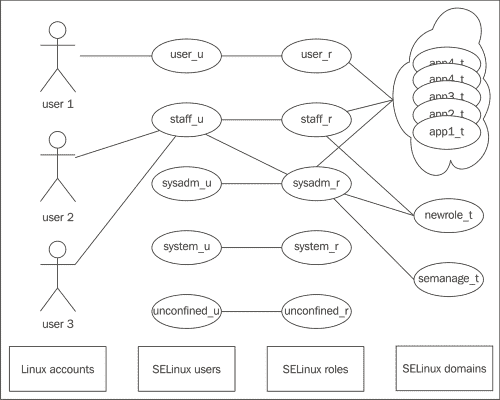
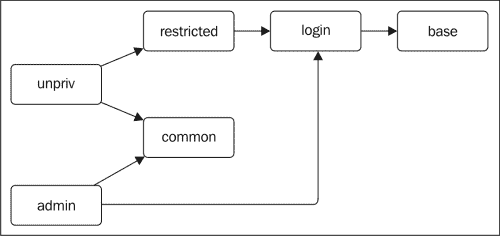
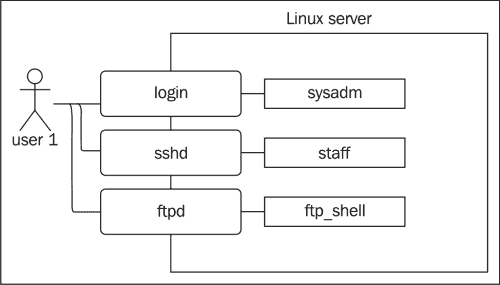

# 第六章：设置独立角色

在本章中，我们将介绍以下主题：

+   管理 SELinux 用户

+   将 Linux 用户映射到 SELinux 用户

+   使用 sudo 在指定角色中运行命令

+   使用 runcon 在指定角色中运行命令

+   切换角色

+   创建新角色

+   基于条目的初始角色

+   定义角色过渡

+   查看访问权限

# 介绍

角色提供了一种灵活且可管理的方式来授予多个用户适当的权限。与其将权限分配给单个用户，不如创建角色并将权限授予这些角色。然后，用户被授予该角色并继承与该角色相关联的权限。

在 SELinux 中，角色用于授予访问域的权限。用于管理系统证书的应用程序域被分配给一个或多个角色，从而允许具有该角色的用户可能会过渡到该应用程序域。如果用户角色没有此权限，则无法通过该应用程序域访问管理证书所需的权限。

以下图示显示了 Linux 登录（普通 Linux 帐户）、SELinux 用户、SELinux 角色和 SELinux 域之间的关系：



为了将角色分配给用户，首先将 Linux 帐户映射到 SELinux 用户。一个 SELinux 用户定义了哪些角色是可访问的（因为用户可以分配多个角色），以及该用户最多可以拥有的安全权限（尽管较低的安全权限也可以单独分配给用户）。

在 SELinux 主要用于限制面向网络的服务而非用户的系统中，本章的内容价值较小。这些系统上的所有用户都映射到`unconfined_u` SELinux 用户，具有默认的用户域`unconfined_t`，并且几乎不受限制——因此，称之为 unconfined。当这种情况适用时，大多数发行版将 SELinux 策略存储称为 **targeted**，以反映限制目标是特定应用程序，而不是整个系统。

# 管理 SELinux 用户

为了授予 Linux 登录正确的角色，我们首先需要创建一个具有这些角色的 SELinux 用户。现有的 SELinux 用户可以轻松修改，如果之前已添加 SELinux 用户，也可以将其从系统中移除。

## 如何操作…

SELinux 用户管理如下进行：

1.  使用`semanage user`列出当前可用的 SELinux 用户：

    ```
    ~# semanage user -l
     Labeling   MLS/       MLS/
    SELinux User    Prefix     MCS Level  MCS Range                      SELinux Roles

    git_shell_u     user       s0         s0                             git_shell_r
    guest_u         user       s0         s0                             guest_r
    root            user       s0         s0-s0:c0.c1023                 staff_r sysadm_r system_r unconfined_r
    staff_u         user       s0         s0-s0:c0.c1023                 staff_r sysadm_r system_r unconfined_r
    sysadm_u        user       s0         s0-s0:c0.c1023                 sysadm_r
    system_u        user       s0         s0-s0:c0.c1023                 system_r unconfined_r
    unconfined_u    user       s0         s0-s0:c0.c1023                 system_r unconfined_r
    user_u          user       s0         s0                             user_r
    xguest_u        user       s0         s0                             xguest_r

    ```

1.  如果尚未存在 SELinux 用户，在正确的角色设置下，可以使用`semanage user`创建它。例如，要创建一个数据库管理 SELinux 用户，运行以下命令：

    ```
    ~# semanage user -a -R "staff_r dbadm_r" dbadm_u

    ```

1.  现有用户可以按如下方式进行修改：

    ```
    ~# semanage user -m -R "staff_r dbadm_r" staff_u

    ```

1.  也可以将 SELinux 用户从系统中删除：

    ```
    ~# semanage user -d dbadm_u

    ```

## 它是如何工作的…

当创建一个 SELinux 用户时，SELinux 会更新其 `/etc/selinux/` 下的配置文件，以支持该 SELinux 用户。按照功能命名 SELinux 用户是一个常见的最佳实践，因此，**数据库管理员**（**DBA**）被命名为 `dbadm_u`，而网站管理员则被命名为 `webadm_u`。

可以使用 `seinfo` 获取管理员可用的角色集：

```
~# seinfo -r

```

现有的 SELinux 用户可以被修改。然而，重要的是在修改过程中，已登录的用户必须退出（并可能暂时被锁定）系统。否则，SELinux 策略可能会突然标记他们的会话为无效上下文，并中断这些用户的操作。

当一个 SELinux 用户从系统中删除时，还必须重新标记所有剩余文件，这些文件的上下文中包含该 SELinux 用户。否则，这些文件（以及其他资源）会被标记为无效上下文，使得其他人无法访问这些文件和资源。

一旦创建了 SELinux 用户，它就准备好分配给一个或多个 Linux 用户。

## 还有更多……

使用 SELinux 用户时，也可以提供 MLS 设置。例如，要设置特定的安全权限，可以使用以下命令：

```
~# semanage user -a -r s0-s0:c0.c110 dbadm_u

```

对于 SELinux 用户，这是用户上下文所能拥有的最高安全权限。当我们将用户分配给 SELinux 用户时，可以强制单独设置较低的安全权限，这样就无需为每个不同的安全权限创建单独的 SELinux 用户。

# 将 Linux 用户映射到 SELinux 用户

有了可用的 SELinux 用户后，我们现在可以将 Linux 用户映射到 SELinux 用户。这将确保用户在登录系统时，会被分配与该 SELinux 用户一致的默认上下文。

## 如何操作……

为了将 Linux 用户映射到 SELinux 用户，可以执行以下步骤：

1.  使用 `semanage login` 列出现有的映射：

    ```
    ~# semanage login -l
    Login Name           SELinux User              MLS/MCS Range

    __default__          user_u                    s0-s0:c0.c1023
    root                 root                      s0-s0:c0.c1023
    system_u             system_u                  s0-s0:c0.c1023
    %wheel               sysadm_u                  s0-s0:c0.c1023

    ```

1.  对于单个用户账户，通过 `semanage login` 将该账户映射到 SELinux 用户：

    ```
    ~# semanage login -a -s dbadm_u user1

    ```

1.  也可以通过主 Linux 组将一组用户分配给一个 SELinux 用户。例如，如果存在 `dba` 组，可以通过以下方式将其分配给一个 SELinux 用户：

    ```
    ~# semanage login -a -s dbadm_u %dba

    ```

1.  映射可以轻松修改：

    ```
    ~# semanage login -m -s webadm_u user1

    ```

1.  如果某个映射不再需要，也可以将其删除：

    ```
    ~# semanage login -d user1

    ```

## 它是如何工作的……

`semanage login` 应用程序管理 `/etc/selinux/` 下的 `seusers` 文件。此文件由 SELinux 的 `pam_selinux.so` 认证库使用，在用户登录系统时会被调用。调用时，SELinux 会检查 `seusers` 文件，以查看 Linux 账户映射到哪个 SELinux 用户。然后，SELinux 会执行一个 SELinux 上下文切换，使得后续的登录过程（包括启动的 shell 或图形环境）会被分配正确的 SELinux 上下文。

创建登录映射不会影响现有的会话，因此如果用户已经登录，最好先让用户注销。此外，用户过去创建的任何文件可能会关联错误的 SELinux 用户。如果 SELinux 中的用户基础访问控制功能启用，则这些文件将不再被该用户访问。在这种情况下，管理员需要强制重新标记这些文件（包括重置 SELinux 用户）：

```
~# restorecon -RF /home/user1

```

在用户映射和基于组的映射中，`seusers`文件中第一个提到的匹配特定登录的映射将被使用。

当用户登录并且没有映射与该登录本身匹配时（无论是直接匹配 Linux 帐户名称还是通过组成员身份），SELinux 将查看`__default__`用户的登录映射。这是一个特殊规则，充当回退规则。在具有无约束用户的系统上，`__default__`用户通常映射到`unconfined_u` SELinux 用户。在没有无约束用户的系统上，`__default__`通常映射到（无特权的）`user_u` SELinux 用户。

# 使用 sudo 在指定角色下运行命令

当一个用户被分配多个角色时，他们通常会使用其主要角色（例如`staff_r`），并仅有选择性地执行其他角色的命令。这可以通过`sudo`命令来完成，因为这些命令通常还需要不同的 Linux 用户（可以是`root`或用于 PostgreSQL 数据库服务器上的 DBA 任务的`postgresql`帐户）。

## 如何操作…

为了配置`sudo`以执行正确的角色和类型转换，请执行以下步骤：

1.  通过`visudo`打开`sudoers`文件：

    ```
    ~# visudo

    ```

1.  定义用户（们）可以执行的命令。例如，要允许`dba`组中的所有用户在`dbadm_r`角色中调用`initdb`，可以按如下方式定义命令：

    ```
    %dba ALL=(postgres) ROLE="dbadm_r" TYPE="dbadm_t" /usr/sbin/initdb
    ```

1.  现在，`dba`组中的用户可以调用`initdb`，并且当调用`initdb`时，`sudo`会自动切换到`dbadm_r`角色和`dbadm_t`用户域：

    ```
    ~$ sudo -u postgres initdb

    ```

## 它是如何工作的……

用户运行的常规用户域默认情况下没有那么高的特权。尽管可以直接扩展角色和用户域的特权，但通过不同角色提供最佳的隔离性。这样的方式允许无特权的用户域（例如`staff_t`）被多个不同的组织角色（因此，也可以是 SELinux 用户）使用。

一旦需要执行特权命令，用户将需要切换其活动角色。如果这仅仅是需要执行一小部分命令，并且这些命令还需要切换 Linux 用户（例如切换到`postgres`运行时帐户），那么通常使用`sudo`等权限委托工具。

`sudo`命令是一个支持 SELinux 的应用程序，可以配置为协助切换 SELinux 上下文。如果用户愿意，也可以直接通过命令行完成：

```
~$ sudo -u postgres -r dbadm_r -t dbadm_t initdb

```

然而，大多数管理员会希望在`sudoers`文件中配置此项。这种方式对用户更加友好，因为最终用户不需要不断地传递角色和类型部分的上下文信息来执行命令。

当然，这要求调用`sudo`的 SELinux 用户具备在`dbadm_r`角色中运行命令的权限。如果没有，那么即使`sudoers`文件中提到用户可以执行该命令，转换（因此，命令）仍然会失败，如下所示：

```
~$ sudo -u postgres initdb
sudo: webadm_u:dbadm_r:dbadm_t:s0-s0:c0.c1023 is not a valid context

```

## 另见

欲了解有关`sudo`和`sudoers`文件的更多信息，请查阅相关的手册页：

```
~$ man sudo
~$ man sudoers

```

`sudo`应用程序的主要项目网站位于[`www.sudo.ws`](https://www.sudo.ws)。

# 使用`runcon`在指定角色下运行命令

使用`sudo`并非强制性的。SELinux 还提供了一个名为`runcon`的命令，允许用户在不同的上下文中运行命令。当然，SELinux 的限制仍然适用——用户必须具备在不同上下文中执行命令的适当权限。

## 如何操作…

使用指定的角色和类型运行命令通过完成以下步骤来实现：

1.  确定命令应该在哪个域中运行，通常通过检查可执行文件的上下文并搜索`entrypoint`定义来完成：

    ```
    ~$ ls -Z auditctl
    system_u:object_r:auditctl_exec_t    auditctl
    ~$ sesearch -t auditctl_exec_t -c file -p entrypoint -A
    Found 1 semantic av rules:
     allow auditctl_t auditctl_exec_t : file { … entrypoint … };

    ```

1.  调用命令，传递角色和目标类型：

    ```
    ~$ runcon -r secadm_r -t auditctl_t auditctl -l

    ```

## 它是如何工作的…

`runcon`应用程序告诉 SELinux，命令的调用应该导致类型和角色转换，转向指定的类型（`auditctl_t`）和角色（`secadm_r`）。在实际成功之前，SELinux 会进行多个检查和验证。这些检查如下：

+   当前用户是否有权执行`auditctl`（在`auditctl_exec_t`上具有执行权限）？

+   是否允许从当前角色（比如`staff_r`）切换到新角色（`secadm_r`）？

+   是否有策略允许从当前类型（比如`staff_t`）转换到所选类型（`auditctl_t`）？

+   如果执行的文件是`auditctl_exec_t`（即`entrypoint`检查），`auditctl_t`是否是一个有效的目标域？

+   目标上下文（如`staff_u:secadm_r:auditctl_t`）是否是一个有效的上下文（这意味着当前 SELinux 用户对给定的角色有访问权限）？

当不需要发生 Linux 用户转换时，可以使用`runcon`应用程序（尽管这并不排除使用`sudo`）。以`auditctl`为例，这意味着 Linux 上的常规访问控制仍然适用——如果当前用户没有访问`auditctl`所用文件的权限，那么仅使用`runcon`是无法成功的。

# 切换角色

当角色转换需要不仅仅是几个命令时，就需要打开一个带有新角色的 shell。这样可以确保整个会话都以分配的新角色运行。从该会话中执行的每个活动都会使用目标角色。

## 如何操作…

使用`sudo`或`newrole`切换角色的步骤如下：

1.  如果`sudoers`文件允许，可以通过`sudo -i`或`sudo -s`来切换角色。如果设置了`ROLE`和`TYPE`属性，那么目标 shell 将会有正确的上下文分配：

    ```
    ~$ id -Z
    dbadm_u:staff_r:staff_t:s0
    ~$ sudo -u postgres -i
    Password: 
    ~$ id -Z
    dbadm_u:dbadm_r:dbadm_t:s0

    ```

1.  也可以使用`newrole`来切换角色：

    ```
    ~$ newrole -r dbadm_r

    ```

## 它是如何工作的…

切换角色后获取一个 shell 与执行命令没有太大区别。然而，SELinux 策略可能不允许在目标域中运行 shell 和常规二进制文件。例如，允许通过某个角色使用`puppetca_t`域的用户将无法在该域中运行 shell，因为`puppetca_t`不允许通过 shell 使用——它是一个特定命令集的域。

大多数用户角色都有一个默认的用户域。`dbadm_r`角色的默认用户域是`dbadm_t`；`webadm_r`角色的默认用户域是`webadm_t`。这些用户域具有通过 shell 使用的权限。

`newrole`命令只需要目标角色，因为它会检查角色的默认类型（该类型在`/etc/selinux/mcs/contexts/`内的`default_type`文件中有文档说明），并将其作为目标类型。

# 创建新角色

角色是 SELinux 策略的一部分。为了创建新角色，不能仅仅执行一些`semanage`命令。相反，需要创建一个 SELinux 策略模块。

## 如何操作…

为了创建一个新角色，需要更新 SELinux 策略。可以使用以下步骤来完成此任务：

1.  创建一个新的策略模块，以角色名称命名，如`pgsqladm`（用于 PostgreSQL 管理员角色）。

1.  在策略模块中，调用`userdom_login_user_template`接口：

    ```
    userdom_login_user_template(pgsqladm)
    ```

1.  为`pgsqladm_r`角色和`pgsqladm_t`类型分配适当的权限：

    ```
    postgresql_admin(pgsqladm_t, pgsqladm_r)
    ```

1.  编辑`/etc/selinux/mcs/contexts/`中的`default_type`文件，将`pgsqladm_t`设置为`pgsqladm_r`角色的默认类型：

    ```
    pgsqladm_r:pgsqladm_t
    ```

1.  编辑`/etc/selinux/mcs/contexts/`中的`default_contexts`文件，告知系统当应用程序触发用户切换时，应该转换到哪些类型。例如，对于本地登录会话，可以使用以下代码来实现这一目的：

    ```
    system_r:local_login_t  user_r:user_t … pgsqladm_r:pgsqladm_t …
    ```

1.  现在，构建并加载策略，并验证新角色是否可用：

    ```
    ~# seinfo -r | grep pgsqladm_r

    ```

## 它是如何工作的…

为 SELinux 系统创建新角色需要在多个层面上进行更改。更新 SELinux 策略只是其中之一。

### 在策略中定义角色

第一步是通过 SELinux 策略创建一个新的角色和用户域。在参考策略中有一些模板，可以轻松地构建新的角色。这些模板之间的关系可以通过以下图示表示：



图中的各个模块表示以下模板：

+   在 `userdom_base_user_template` 中，记录了角色和用户域的基本规则和权限，无论其未来的用途如何。如果需要声明一个具有最小权限的角色，建议使用此模板。

+   在 `userdom_login_user_template` 中，调用了 `userdom_base_user_template` 并扩展了与交互式登录相关的权限。当创建一个角色时，目标是直接登录（无需调用 `newrole` 或 `sudo`），此接口是必需的。

+   在 `userdom_restricted_user_template` 中，调用了 `userdom_login_user_template` 接口，但该用户域还与 `unpriv_userdomain` 属性相关联，该属性旨在为对系统安全性影响较小的最终用户域提供服务。

+   `userdom_common_user_template` 接口添加了适用于特权和非特权角色的共同权限和规则。

+   `userdom_unpriv_user_template` 接口同时调用了 `userdom_common_user_template` 和 `userdom_restricted_user_template`，用于声明具有交互式登录和一般系统访问权限的非特权角色和用户域。

+   `userdom_admin_user_template` 接口同时调用了 `userdom_common_user_template` 和 `userdom_login_user_template`，并创建了一个用于行政管理目的的角色和用户域。

每当调用此类适当的接口时，就会创建合适的角色和类型，并可以在其余的策略模块中使用。

### 扩展角色权限

在示例中，我们将 PostgreSQL 管理权限分配给 `pgsqladm_t` 用户域，并允许 `pgsqladm_r` 角色使用适当的 PostgreSQL 域（如果有的话）。

参考策略通常提供两种类型的接口，可以分配给新角色：

+   管理角色，其接口名称通常以 `_admin` 结尾

+   最终用户角色，其接口名称通常以 `_role` 或 `_run` 结尾

管理角色允许访问与特定域相关的所有资源。在 `postgresql_admin` 接口的情况下，角色和用户域（通过接口传递）可以向 PostgreSQL 服务发送信号，执行 `init` 脚本（启动或关闭服务），并管理域的各种资源（如数据库文件、配置文件和日志）。

服务几乎总是有一个 `_admin` 接口。这些接口的命名通常以域名为后缀，例如用于 Puppet 管理的 `puppet_admin` 和用于 Samba 管理的 `samba_admin`。有时，当涉及不同的域时，SELinux 策略模块可能有多个管理接口。例如，`logging_admin_audit` 和 `logging_admin_syslog` 接口，虽然它们都由同一个 SELinux 策略模块提供，但审计和系统日志服务的管理可以是分开的。

最终用户角色允许用户执行客户端应用程序或与服务交互。类似于 `puppet_run_puppetca`（允许用户域运行 `puppetca` 应用程序并过渡到它）和 `openvpn_run`（允许用户运行 OpenVPN 服务）这样的接口，虽然它们在某种程度上可能具有管理性质，但仍需验证接口的内容。然而，大多数情况下，这是由应用程序端控制的，而不是基础设施端——能够启动 VPN 服务并不意味着用户可以随意操作路由表，即使 VPN 服务域（`openvpn_t`）有这个权限。

在盲目授予新角色和用户这些接口之前，审查接口是非常重要的。例如，在 PostgreSQL 中，`postgresql_role` 角色并不允许用户与 PostgreSQL 服务交互；该接口用于支持 SEPostgreSQL（启用 SELinux 的 PostgreSQL），它基于 SELinux 策略为 PostgreSQL 提供额外的访问控制。当用户被分配 `postgresql_role` 角色时，他们将被授予 PostgreSQL 环境中的基本权限。

为了允许用户与 PostgreSQL 交互，可以使用 `postgresql_stream_connect` 和 `postgresql_tcp_connect` 接口。

### 默认类型和默认上下文

`default_types` 文件告诉 SELinux 如果没有指定上下文时默认的类型是什么，它被 `newrole` 等命令使用，以确定用户的默认类型。

`default_contexts` 文件（可以通过 `users/` 子目录下的 SELinux 用户特定文件进行覆盖）通知 SELinux 库和子系统在用户和角色切换后，应该切换到什么特定的 SELinux 类型。例如，`cron` 守护进程运行在 `system_r:crond_t` 上下文中，但当它执行用户的 `cron` 作业时，这些作业本身需要在不同的 SELinux 角色和类型下运行。以下 `default_contexts` 配置片段会使用户（其角色为 `pgsqladm_r`）的作业以 `cronjob_t` 类型（而不是 `pgsqladm_t`）运行：

```
system_r:crond_t  pgsqladm_r:cronjob_t
```

这些文件作为基础策略的一部分生成。遗憾的是，没有可以用于提供特定系统更改的`default_types.local`或`default_contexts.local`文件。因此，基础 SELinux 策略的更新可能会覆盖这些文件，具体取决于 Linux 发行版如何处理这些文件。如果这些文件被视为配置文件（例如 Gentoo Linux），那么它们不会被系统更新修改；相反，系统管理员会被通知这些文件可能需要更新，保留管理员之前手动所做的更改。

# 基于入口的初始角色

用户通常会有多个角色与之关联。根据他们与系统的交互方式，可能需要不同的初始角色（和用户域）。假设一个用户本地通过控制台、通过 SSH 远程（用于管理目的）以及通过 FTP（作为最终用户）与系统交互，如下图所示：



我们希望确保用户会话在系统上启动时的默认角色取决于系统的入口点。直接控制台登录可以在管理角色`sysadm_r`中进行，而远程登录则首先进入`staff_r`角色（以确保被窃取的 SSH 密钥不能在不知道用户系统密码的情况下用于执行系统管理任务）。使用 FTP 服务器时，应该使用非特权角色`ftp_shell_r`。

### 注意

`ftp_shell_r`角色是一个非默认角色，默认情况下不可用。在这种设置中使用 SELinux 与 FTP 服务器时，要求 FTP 服务器要么支持 SELinux（并支持上下文转换），要么使用 PAM 进行身份验证，而不是使用内部用户帐户。

## 如何操作…

要配置用户登录或开始会话时使用的角色，请执行以下步骤：

1.  首先，确保用户被分配了各种角色：

    ```
    ~# semanage user -m -R "staff_r sysadm_r ftp_shell_r" staff_u

    ```

1.  编辑`default_contexts`文件，通过重新排序上下文，确保正确的角色总是排在其他角色之前（或者其他角色根本不被提及）：

    ```
    system_r:local_login_t:s0  user_r:user_t:s0  sysadm_r:sysadm_t:s0 staff_r:staff_t:s0
    system_r:sshd_t:s0  user_r:user_t:s0  staff_r:staff_t:s0
    system_r:ftpd_t:s0  ftp_shell_r:ftp_shell_t:s0
    ```

1.  检查域是否支持特定的布尔值，明确启用或禁用过渡到特定的域。例如，考虑 SSH 守护进程：

    ```
    ~# setsebool -P ssh_sysadm_login off

    ```

## 它是如何工作的…

当应用程序调用 PAM 设置用户上下文时，PAM 配置将调用由`pam_selinux.so`文件提供的方法。这些方法将检查`default_contexts`文件，查看应该为用户设置什么上下文。例如，当`pam_selinux.so`通过`system_r:sshd_t`上下文在守护进程中加载时，特定守护进程的行会被解释：

```
system_r:sshd_t:s0  user_r:user_t:s0  staff_r:staff_t:s0
```

对于给定的用户，获取支持的角色集合。在我们的例子中，这是`staff_r sysadm_r ftp_shell_r`。然后逐一查看`default_contexts`文件中的条目，文件中提到的第一个，也是用户允许的角色，将被使用。

在给定的示例中，由于`user_r`不是允许的角色，`staff_r`是列表中的下一个角色。此角色是允许的，因此当用户通过 SSH 登录时，其默认角色将是`staff_r`角色（其关联的用户域将是`staff_t`）。

一些域也被配置为允许或禁止直接登录到管理角色。例如，SSH 策略使用一个名为`ssh_sysadm_login`的 SELinux 布尔值，该值允许过渡到任何用户（`ssh_sysadm_login=on`）或仅限于无特权用户（`ssh_sysadm_login=off`），策略方式如下所示：

```
tunable_policy(`ssh_sysadm_login',`
  userdom_spec_domtrans_all_users(sshd_t)
  userdom_signal_all_users(sshd_t)
',`
  userdom_spec_domtrans_unpriv_users(sshd_t)
  userdom_signal_all_users(sshd_t)
')
```

类似的方法可以很容易地构建到自定义策略中。请注意，使用`userdom_spec_domtrans_unpriv_users`只允许使用通过`userdom_unpriv_user_template`创建的守护进程角色和类型，因为此接口分配了`unpriv_userdomain`属性，该属性由`userdom_spec_domtrans_unpriv_users`接口使用。

# 定义角色转换

也可以让 SELinux 在执行某个特定应用时自动切换角色。通常的检查仍然适用（例如角色是否是用户有效的角色，当前用户域是否有执行权限，等等），但之后就不再需要调用`runcon`或`sudo`来切换角色。

## 如何做到这一点…

角色转换可以如下配置：

1.  确定需要发生角色转换的可执行文件类型：

    ```
    ~$ ls -Z puppetca
    system_u:object_r:puppetca_exec_t  puppetca

    ```

1.  在 SELinux 策略中，创建一个包含角色转换的接口：

    ```
    interface(`puppet_roletrans_puppetca',`
      gen_require(`
        role puppetadm_r;
        type puppetca_t, puppetca_exec_t;
      ')
      allow $1 puppetadm_r;
      role_transition $1 puppetca_exec_t puppetadm_r;
      domtrans_pattern($2, puppetca_exec_t, puppetca_t)
    ')
    ```

1.  将新创建的接口分配给用户：

    ```
    puppet_roletrans_puppetca(staff_r, staff_t)
    ```

## 它是如何工作的…

被激活的第一条规则是角色允许规则。这样的规则告诉 SELinux 哪些角色切换是允许的，以及切换的方向。允许的角色切换集合可以使用`sesearch`查询：

```
~# sesearch --role_allow

```

考虑以下`puppetadm_r`角色的角色允许规则：

```
  allow staff_r puppetadm_r
```

在这种情况下，*只有* `staff_r`角色被允许切换到`puppetadm_r`角色。不能从`puppetadm_r`角色切换回`staff_r`角色。

第二条规则告诉 SELinux，如果一个标记为`puppetca_exec_t`的文件由选定角色（在我们的例子中是`staff_r`）执行，那么该角色应该切换到`puppetadm_r`。当然，只有当 SELinux 用户被允许目标角色时，才会进行此操作。

第三条规则将在`staff_t`执行标记为`puppetca_exec_t`的文件时执行从`staff_t`到`puppetca_t`的域转换。

需要注意的是，在大多数情况下，强制角色转换（即通过 SELinux 策略）并不是首选方法，因为它不会为管理员提供任何灵活性。如果实现了这种方法，那么使用多个角色就会变得更加困难，因为一些域被硬编码为特定角色。

# 查看访问权限

最后，让我们来看一下如何验证分配给用户的访问权限。指定角色和权限使用户能够完成工作，但从安全角度来看，验证哪些用户能够操作某些资源也是非常重要的。审计员将希望了解谁能够，例如，操作 SELinux 策略或读取私钥。

## 如何操作……

要正确调查访问权限，以下方法可以帮助识别拥有我们希望了解的权限的用户（和进程）：

1.  验证与 SELinux 无关的文件权限。

1.  验证对资源的直接访问（例如读取私钥的权限）。

1.  查看谁（用户或应用程序）有权操作 SELinux 策略。

1.  检查被授予直接访问文件系统和原始设备的用户和域。

1.  查看何时可以直接访问内存。

1.  审查谁可以更新认证文件。

1.  分析谁可以启动系统。

## 它是如何工作的……

审查访问权限是一个漫长的过程。仅查看文件所有权（用户和组）以及文件的权限来找出谁实际上能够读取或修改文件（假设我们关注的是文件访问权限）是不够的。还需要检查权限委派工具，如 `sudo`（通过 `sudoers` 文件或 LDAP 服务器中的 `sudo` 配置），以及 `setuid` 应用程序访问、备份文件访问（当需要检查读取访问时）等。

通过 SELinux 提供的强制访问控制，检查访问权限的策略是这种评估的重要组成部分。`sesearch` 应用程序可以帮助完成这项任务。

### 直接访问检查

要检查直接访问权限，我们需要查询访问权限（如对资源的写权限）以及重新标记权限。毕竟，允许更改文件 SELinux 上下文的域理论上可以切换上下文、修改文件并重置上下文。

```
~# sesearch -t lvm_etc_t -c file -p write -ACST
Found 6 semantic av rules:
 allow sysadm_t non_auth_file_type : file { … };
 allow portage_t file_type : file { … };
...
~# sesearch -t lvm_etc_t -c file -p relabelfrom,relabelto -ACST
Found 5 semantic av rules:
 allow sysadm_t non_auth_file_type : file { … };
 allow restorecond_t non_auth_file_type : file { … };
 allow setfiles_t file_type : file { … };
…

```

这段代码不仅显示了拥有权限的用户域，还显示了应用程序域。在权限审查中，必须验证谁可以访问和操作在这些域中运行的进程。这可以通过检查转换权限来完成：

```
~# sesearch -t setfiles_t -c process -p transition -ACST

```

对于每个领域，研究谁可以操控这些过程是一个耗时的过程，并且需要对给定领域中运行的应用程序有深入的了解。例如，`restorecond` 守护进程仅会将文件上下文重置为 SELinux 工具已知的上下文（因此，无法通过 `restorecond` 临时修改上下文），并且仅限于 `restorecond` 配置文件中配置的位置。

### 策略操控

检查 SELinux 策略是不够的，因为策略也可能被操控。加载新策略由多种权限控制，其中包括 `load_policy` 权限：

```
~# sesearch -t security_t -c security -p load_policy -ACS
Found 2 semantic av rules:
EF allow kernel_t security_t : security load_policy  ; [ secure_mode_policyload ]
EF allow load_policy_t security_t : security load_policy ; [ secure_mode_policyload ]

```

同样，访问选定域（特别是 `load_policy_t` 域）也需要进行验证。

如输出所示，操控 SELinux 策略也可以通过一个叫做 `secure_mode_policyload` 的 SELinux 布尔值进行控制。当该布尔值启用时，加载新策略将不再可能。如果启用并保持该布尔值，即使重启系统也无法解决，除非系统以宽容模式启动。

同样，检查谁可以将系统置于宽容模式也可以进行验证：

```
~# sesearch -p setenforce -ACS

```

这一点也由相同的 SELinux 布尔值进行控制。

另一种操控 SELinux 策略的方式是将系统以宽容模式启动，甚至禁用 SELinux。这意味着审查启动文件的访问权限也非常重要（如 `boot_t` 类型）。

### 间接访问

也可以通过间接方式访问资源，例如，通过操控原始设备（如磁盘设备或内存）。在 Linux 系统上，访问设备文件本身已经是相当特权的操作。使用 SELinux 后，可能会添加额外的控制措施。

磁盘设备通常被标记为 `fixed_disk_device_t`。这些文件的访问应该仅限于应用程序域，尽管一些特权用户域可能能够重新标记这些设备节点或操控应用程序域以执行普通用户无法执行的操作。

```
~# sesearch -t fixed_disk_device_t -ACS

```

能够操控与系统认证相关的文件的用户，可以通过登录系统并作为不同的用户（该用户拥有所需权限）来授予自己不同的用户角色。这包括访问 `/etc/pam.d/`（通常标记为 `etc_t`）或认证库本身（通常标记为 `lib_t`）。
