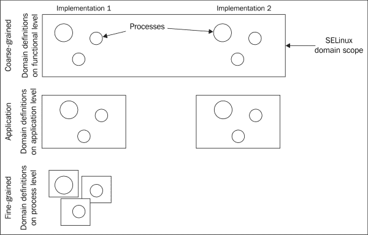
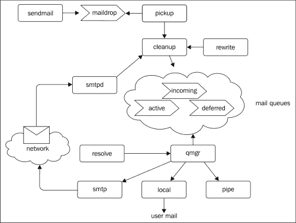

# 第七章 选择约束级别

在本章中，我们将介绍以下教程：

+   查找共享资源

+   定义公共辅助域

+   记录公共权限

+   授予所有客户端特权

+   创建通用应用程序域

+   使用模板构建应用程序特定的域

+   使用细粒度的应用程序域定义

# 介绍

在额外政策的开发过程中，开发人员可以选择使用非常细粒度的政策模型、每个应用程序一个域的模型，或者粗粒度的、基于功能的政策模型。这些约束模型之间的关系如下图所示：



在非常细粒度的政策中，定义了多个域，因此同一个应用程序中功能不同的进程都运行在各自的专门 SELinux 域中。而粗粒度的政策则允许具有相似功能的不同应用程序使用相同的上下文。应用程序级别的政策则介于两者之间：它们专注于一个域（或非常少量的域）来处理一个应用程序。

大多数政策采用**每个应用程序一个域**的原则进行开发。然而，政策开发中选择的开发模式反映了应用程序的约束级别，因为共享的粗粒度政策可能会导致应用程序与资源之间的互动超过预期，而细粒度的政策则更难开发和维护。

从功能层面来看，我们通常关注共享资源或那些无法与特定应用程序绑定的资源。一个例子是`mta` SELinux 政策，它管理与基础设施相关的共享内容，例如电子邮件别名（`etc_mail_t`）、用户邮箱（`mail_home_rw_t`）、电子邮件传送文件（`mail_spool_t`）等。

# 查找共享资源

在政策开发过程中，政策所使用的一些资源可能会与其他政策共享。若是这样，就会创建一个功能驱动的政策模块，将这些公共资源放在其中。这允许其他政策通过功能驱动政策中声明的接口使用这些资源并分配正确的权限。

## 如何执行……

本教程中的大部分工作是弄清楚哪些资源是共享的。通过完成以下步骤来实现：

1.  寻找可能与其他应用程序共享的公共文件和目录，这些文件和目录的所有权不是专门与某个应用程序绑定的，而是更具有功能性的。对于这些资源，将它们声明在功能驱动的政策中。

1.  检查是否有与政策功能相关但不特定于某个应用程序的设备。

1.  验证是否存在特定用户提供的内容，这些内容在功能上相关但不与特定应用程序绑定，并且在这些情况下最好不要使用默认的用户内容类型（例如 `user_home_t`）。这些资源需要在功能驱动的策略中声明，并可能需要可定制化：

    ```
    type public_content_t; # customizable
    files_type(public_content_t)
    ```

1.  创建适当的接口来处理或与这些共享资源交互：

    ```
    interface(`miscfiles_read_public_files',`
      gen_require(`
        type public_content_t;
      ')
      read_files_pattern($1, public_content_t, public_content_t)
    ')
    ```

## 它是如何工作的…

功能驱动的策略模块处理多个应用程序和策略的共享资源。处理多个应用程序功能资源的一些示例策略包括邮件传输代理策略（`mta`）和 Web 服务器策略（`apache`）。尽管 Web 服务器策略最初仅用于 Apache HTTPd，但它已经发展成一个更多功能驱动的策略，支持大量的 Web 服务器技术。

### 共享文件位置

找出哪些资源被认为是功能性的（而非应用特定的）一个有用的方法是设想将一个应用程序替换为另一个。如果我们将一个系统日志记录器（例如 `syslog-ng`）换成另一个（例如 `rsyslog`），或者将 Courier-IMAP 换成 Cyrus，哪些资源类型会保持不变？了解多个类似的应用程序有助于发现共享位置在哪里（或是什么）。

然而，具有相似功能需求并不一定意味着它们是共享的。位置也应保持一致（或至少保持一致并位于众所周知的位置）。考虑数据库文件：PostgreSQL 和 SQLite 数据库的数据库文件具有相同的功能目的，但将它们都标记为相同的标签是没有意义的。数据库文件是特定于某个数据库实现的，并需要特定的标签，因此在每个潜在的共享资源中，确保该资源本身可以在多个实现之间共享。

设备节点是一个很好的功能驱动策略示例。一个示例的设备类型定义可能如下所示：

```
type cachefiles_device_t;
dev_node(cachefiles_device_t)
```

设备通常在多个应用程序之间共享。大多数设备都在 `devices.te` 策略模块中定义，声明了适当的接口以允许访问设备（例如 `dev_rw_cachefiles` 用于对前面提到的 `cachefiles_device_t` 类型的读/写访问）。然而，`/dev/` 中并非所有文件都是这样的设备文件。

考虑 `/dev/log` 套接字，它用于将日志事件发送到系统日志记录器。无论使用哪种系统日志记录器，这个套接字都是可用的，它通过以下日志记录 SELinux 策略模块提供：

```
type devlog_t;
files_type(devlog_t)
mls_trusted_object(devlog_t)
```

`mls_trusted_object` 接口使设备（标记为 `devlog_t`）在启用 MLS 的策略中对所有安全级别可访问。

### 用户内容和可定制化类型

用户提供的内容也非常重要。例如，对于与电子邮件相关的守护进程，用户的 `.forward` 文件（指示系统将用户的电子邮件转发到哪里）通常位于其主目录中，并且绝对不会由特定应用程序拥有。因此，它的标签（`mail_home_t`）与功能驱动的策略（`mta`）相关联。

别忘了通过 `userdom_user_home_content` 接口将用户内容标记为用户内容；否则，最终用户将无法标记或操作这些文件：

```
type mail_home_t;
userdom_user_home_content(mail_home_t)
```

有些用户内容也最好标记为可定制类型。当可定制类型分配给资源时，在标准重标操作（通常由系统管理员执行）中会被忽略，因此该资源的标签不会恢复为 SELinux 配置文件中定义的标签。这对于路径不是固定位置的资源特别有用，这些资源通常不会成为 SELinux 文件上下文定义的一部分。

如果管理员执行强制重标操作，即使资源当前分配的类型是可定制类型，文件的上下文也会被重置：

```
~# restorecon -R -F /home/*

```

在模块化策略开发中，没有可用的符号标记类型为可定制类型。为此，类型需要添加到 `/etc/selinux/mcs/contexts/` 中的 `customizable_types` 文件。

将文件标记为可定制类型是一种解决方案，当资源的路径不是固定时。`.forward` 文件有一个固定的路径，因此无需可定制内容。然而，应公开访问的用户内容（标记为 `public_content_t` 或 `public_content_rw_t`）没有固定路径；因此，这些类型默认标记为可定制类型。

当完成完整的策略开发时（例如，通过 Linux 发行版策略或因为开发者控制整个策略而不仅仅是附加模块），则可以将 `# customizable` 注释放在类型声明后面，如以下 CVS 策略模块示例所示：

```
type cvs_data_t; # customizable
files_type(cvs_data_t)
```

参考策略构建系统将在构建过程中自动将类型添加到 `customizable_types` 文件中。

## 还有更多...

其他可以考虑的常见资源是 TCP 和 UDP 端口。事实上，面向网络的应用程序会绑定到一个或多个端口，这些端口通常在具有相同功能的应用程序中是相同的。

然而，TCP 和 UDP 端口不能在 SELinux 策略模块中声明；相反，它们需要作为基础策略的一部分进行标记。然而，更新基础策略只能由 Linux 发行版维护者或上游参考策略项目进行。基本规则是，端口名称通常以它们所使用的服务命名：

```
~$ getent services 6667
ircd    6667/tcp
~$ seinfo --portcon=6667
portcon tcp 6667 system_u:object_r:ircd_port_t

```

# 定义常见的辅助域

除了公共资源外，一些应用程序共享相同的一组辅助命令。`sendmail`命令就是一个很好的例子，它被许多域执行（通常是需要发送电子邮件但不使用 SMTP 协议的应用）。`sendmail`应用是众所周知的，大多数 MTA 应用都支持它进行命令行电子邮件发送操作。

支持这样的辅助域通常是通过功能驱动的策略来完成的。

## 如何做…

创建辅助域类似于创建常规应用程序域，但属性的使用使得策略非常灵活，并且可以通过进一步开发的应用程序特定策略模块来使用。让我们以 MTA 定义为例，看看如何完成这项工作：

1.  为命令类型定义一个属性：

    ```
    attribute mta_exec_type;
    ```

1.  为该命令创建一个适当的标签类型，并分配`mta_exec_type`属性：

    ```
    type sendmail_exec_t, mta_exec_type;
    application_executable_file(sendmail_exec_t);
    ```

1.  为该命令配置应用程序域：

    ```
    type system_mail_t;
    application_domain(system_mail_t, sendmail_exec_t)
    ```

1.  如果该应用程序用于系统目的，请将域分配给`system_r`角色：

    ```
    role system_r types system_mail_t
    ```

1.  如果该应用程序是为最终用户执行的，别忘了包括`_run`或`_role`接口。

1.  使接口可被第三方应用域调用，以允许它们与辅助应用进行交互：

    ```
    interface(`mta_send_mail',`
      gen_require(`
        attribute mta_exec_type;
        type system_mail_t;
      ')
      corecmd_search_bin($1)
      domtrans_pattern($1, mta_exec_type, system_mail_t)
    ')
    ```

1.  创建另一个接口，允许特定策略标记它们自己的辅助可执行文件，以便用于相同的目的（因为它们可能并不总是使用相同的类型）：

    ```
    interface(`mta_agent_executable',`
      gen_require(`
        attribute mta_exec_type;
      ')
      typeattribute $1 mta_exec_type;
      application_executable_file($1)
    ')
    ```

## 它是如何工作的…

辅助域旨在提供跨多个实现的可重用功能。为了支持多个实现的灵活性，通常会将属性分配给类型，以便可以轻松创建扩展。

再次考虑`sendmail`的例子。大多数实现会将命令行`sendmail`应用标记为`sendmail_exec_t`。然而，也有一些实现，其`sendmail`二进制文件具有更多功能，尤其是在从实现进程本身调用时。某些实现甚至将该文件作为符号链接指向一个更通用的电子邮件处理程序应用。

例如，Exim 实现使用`exim_exec_t`，而不是使用`sendmail_exec_t`。通过使用属性，Exim 策略模块只需调用适当的接口（在这种情况下是`mta_agent_executable`），这样第三方应用仍然可以执行该命令（即使它是`exim_exec_t`而不是`sendmail_exec_t`），并且表现如预期（即，按照 MTA 策略过渡到`user_mail_t`或`system_mail_t`域）：

```
type exim_exec_t;
mta_mailserver(exim_t, exim_exec_t)
mta_agent_executable(exim_exec_t)
```

属性允许其他域与新定义的类型进行交互，而无需更新定义这些域的策略模块。这是因为这些域被授予对所有具有 `mta_exec_type` 属性的类型的执行权限，并将在执行此类文件时触发域转换到 `system_mail_t` 助手域。这个权限通过 `mta_send_mail` 接口提供，这是一个很好的助手域接口示例，可以分配给其他域：

```
interface(`mta_send_mail',`
  gen_require(`
    type system_mail_t;
    attribute mta_exec_type;
  ')
  corecmd_search_bin($1)
  domtrans_pattern($1, mta_exec_type, system_mail_t)
  allow $1 mta_exec_type:lnk_file read_lnk_file_perms;
')
```

# 记录公共权限

在助手域旁边，大多数基于功能的策略也会将可以分配给域的权限进行分组。这些权限不仅可能用于管理公共资源，还可能用于扩展其他具有功能要求的域，这些扩展由公共策略进行管理。

所有电子邮件守护进程需要能够绑定到适当的 TCP 端口、处理用户邮箱等。通过在功能策略级别捆绑这些公共权限，任何与策略相关的演变都可以立即授予所有继承来自功能策略的权限的域，而不需要单独更新每个域。

## 如何做……

公共权限可以在多种不同的情况下找到。如何分配公共权限取决于使用案例。以下方法基于 MTA 策略中的电子邮件服务器定义，提供了一种灵活的解决方案：

1.  为功能域创建一个属性，以便授予公共权限：

    ```
    attribute mailserver_domain;
    ```

1.  定义一个接口，将属性分配给指定的域：

    ```
    interface(`mta_mailserver',`
      gen_require(`
        attribute mailserver_domain;
      ')
      typeattribute $1 mailserver_domain;
    ')
    ```

1.  构建一个接口，将与功能相关的公共权限分配给指定的参数。然而，它不应分配属性！这可以通过以下代码完成：

    ```
    interface(`mta_mailserver_privs,`
      gen_require(`
        type mail_home_t;
      ')
      allow $1 mail_home_t:file read_file_perms;
       …
    ')
    ```

1.  现在，使用新创建的接口为属性授予适当的权限：

    ```
    mta_mailserver_privs(mailserver_domain)
    ```

1.  如果特定应用程序始终需要继承权限，将该属性分配给它：

    ```
    mta_mailserver(exim_t)
    ```

1.  然而，如果某个特定应用程序选择性地继承了权限，则使用域接口：

    ```
    tunable_policy(`nginx_enable_mailproxy',`
      mta_mailserver_privs(nginx_t)
    ')
    ```

## 它是如何工作的……

在为域分配权限时，可以采取两种方法：要么将权限分配给属性（然后将其与域关联），要么将权限直接分配给域。选择哪种方法取决于策略的使用方式。由于策略开发的限制，不能选择性地（即通过 SELinux 布尔值触发）分配属性。任何尝试这样做的操作都会导致构建失败，具体如下：

```
~$ make mymodule.pp
Compiling mcs mymodule module
checkmodule: loading policy configuration from tmp/mymodule.tmp
mymodule.te:23:ERROR 'syntax error' at token 'typeattribute' on line 1309:
#line 23
 typeattribute $1 mta_exec_type;
checkmodule: error(s) encountered while parsing configuration

```

结果是，每当权限可以选择性地授予时（通过 SELinux 布尔值），策略开发者必须确保权限是直接授予的（而不是将属性分配给域）。

然而，在大多数情况下，使用属性来管理域是有意义的。政策本身的大小不会增加太多（因为规则仍然保持在属性级别），管理员可以轻松查询哪些域参与了该功能性方法：

```
~# seinfo -amailserver_domain -x
 mailserver_domain
 system_mail_t
 exim_t
 courier_smtpd_t

```

通过接口授予权限还可以帮助我们快速查看分配属性的影响，因为我们可以使用`seshowif`命令：

```
~$ seshowif mta_mailserver_privs

```

给出的示例使用的是服务器域方法，但同样的方法也可以应用于客户端。

# 授予所有客户端特权

使用接口来聚合特权的方法，不仅对具有相同功能目的的域有益，也对客户端有益。通过将特权结合起来，只需更新接口而无需更新所有客户端的策略模块，就能提升客户端的特权。

## 如何实现…

创建一个客户端接口，可以分配给具有特定功能目的的所有客户端。以下步骤扩展了一个带有反恶意软件支持的示例策略：

1.  在反恶意软件通用策略中，创建一个`avcheck_client`属性：

    ```
    attribute avcheck_client;
    ```

1.  创建一个将属性分配给客户端域的接口：

    ```
    interface(`av_check_client',`
      gen_require(`
        attribute avcheck_client;
      ')
      typeattribute $1 avcheck_client;
    ')
    ```

1.  创建分配给客户端域的公共特权的接口：

    ```
    interface(`av_check_client_privs',`
      …
    ')
    ```

1.  在创建的接口中，添加需要分配给所有客户端域的特权。例如，要启用 ClamAV `check`命令的域过渡，使用以下代码：

    ```
    optional_policy(`
      clamav_domtrans_check($1)
    ')
    ```

1.  所有充当客户端的域要么分配了`av_check_client`（如果可以分配该属性），要么分配了`av_check_client_privs`接口。

## 它是如何工作的…

假设为 ClamAV 开发了一个新的反恶意软件策略，我们希望客户端能够执行`clamav_check_exec_t`应用程序，并将它们过渡到`clamav_check_t`域。我们不必更新所有客户端以进行`clamav_domtrans_check`调用，而是只需在通用反恶意软件策略的`av_check_client_privs`接口中进行此操作，如下所示：

```
optional_policy(`
  clamav_domtrans_check($1)
')
```

这确保了所有适当的域——不仅仅是具有`avcheck_client`属性的域——都能获得必要的特权。

另一个使用该原理的示例是 PulseAudio 策略。提供了一个名为`pulseaudio_client_domain`的接口，应由 PulseAudio 客户端使用。每当需要更新 PulseAudio 客户端的权限时，策略开发人员只需更新`pulseaudio_client_domain`接口，而无需更新所有客户端策略模块。

这种方法使政策开发更加灵活高效，因为开发人员不需要更新所有可能的客户端域来添加特权。

# 创建通用应用程序域

在某些情况下，即使存在多个实现用于相同的功能，创建一个通用应用程序域也是有意义的。例子包括 Java 域（适用于所有流行的 Java™实现）和 init 域。当这种情况发生时，仔细考虑通用应用程序域是否总是足够，或者是否会在稍后需要特定的应用程序域。当这一点不明确时，确保所开发的策略足够灵活，能够兼顾这两种情况。

## 如何操作……

为了创建一个仍然灵活的通用应用程序策略，以应对未来可能开发的特定策略，请遵循以下步骤：

1.  确定（几乎）总是适用于功能域的权限，无论实现是什么。

1.  将这些权限分配给一个*基础*实现。例如，对于 Java™实现，将权限分配如下：

    ```
    attribute javadomain;
    # Minimal permissions
    java_base_runtime_domain(javadomain);

    type java_t;
    # Assigns javadomain attribute
    java_base_runtime(java_t);
    ```

1.  向标准类型添加适用于至少一个（或几个）实现的权限。在我们的例子中，这将是对`java_t`的权限。这确保了`java_t`对大多数 Java™实现是通用可用的。

1.  添加适当的文件上下文，以便大多数实现能够受益于通用应用程序策略：

    ```
    /usr/lib/bin/java[^/]*  --  gen_context(system_u:object_r:java_exec_t,s0)
    /opt/(.*/)?bin/java[^/]*  --  gen_context(system_u:object_r:java_exec_t,s0)
    ```

## 它是如何工作的……

在给定的实现下，大多数 Java™实现将在启用 SELinux 的系统上运行时，处于通用的`java_t`域：它们的可执行文件通过通用文件上下文表达式全部标记为`java_exec_t`，并且`java_t`域不仅包含 Java™域的最小权限集（这些权限通过`javadomain`属性从`java_base_runtime_privs`接口中获取），还包含一些对多个实现通用的权限。这意味着`java_t`域在大多数情况下具有比所需更多的权限，因为它需要支持广泛的 Java™实现。

然而，当需要创建一个具有与现有`java_t`域不同的策略配置文件的特定实现时，策略开发人员可以轻松地将此域标记为 Java 域，从而继承每个 Java™实现所需的权限（例如，因为这些权限是通过 Java™的规范要求的），同时避免与通用`java_t`域授予的其他权限冲突：

```
type icedtea_java_t;
java_base_runtime(icedtea_java_t)
```

通过创建一个更具体的文件上下文定义，新的类型的可执行文件将被分配此标签（因为其他表达式更为通用，SELinux 工具使用*最具体的定义优先*的方法）：

```
/opt/icedtea7/bin/java  --  gen_context(system_u:object_r:icedtea_java_exec_t,s0)
```

构建一个适当的最小权限规则集并不容易，需要有策略开发经验。如果不确定，使用 SELinux 布尔值可能是个好主意，正如（通用的）`cron`策略所使用的那样：

```
# Support extra rules for fcron
gen_tunable(fcron_crond, false)
…
tunable_policy(`fcron_crond',`
  allow admin_crontab_t self:process setfscreate;
')
```

通过这种方法，如果额外权限的数量较小，具体实现仍然可以从通用策略声明中受益。随着策略通过其他实现细节的增强，可能不再需要`tunable_policy`声明，或者可以单独开发适用于`fcron`的特定实现。

# 使用模板构建特定于应用程序的域

特定域的优势在于它们可以仅包含域所需的权限，不包含多余的权限。由于没有其他应用程序实现使用该特定域，权限可以根据应用程序的需求进行定制。

然而，在某些情况下，将类型与基本权限一起自动生成可能是有益的。生成类型是通过模板完成的（而不是接口，尽管接口和模板的底层实现非常相似）。这种方法和开发方式与接口定义保持一致，应该不难让开发人员理解。

一个考虑模板的示例是为各个应用程序自动创建系统`cron`作业域。通过模板，我们可以自动创建域、可执行类型和临时资源类型，并且正确地记录该域与主`cron`守护进程之间的交互（这对于传递作业失败或成功信息、处理输出、日志记录等是必要的）。

## 如何操作…

创建模板类似于创建接口。要创建模板，可以使用以下方法：

1.  从`.if`文件中的骨架模板开始，但将其命名为`template`而非`interface`：

    ```
    template(`cron_system_job_template',`
      …
    ')
    ```

1.  添加以下类型声明：

    ```
    type $1_cronjob_t;
    type $1_cronjob_exec_t;
    application_domain($1_cronjob_t, $1_cronjob_exec_t)

    type $1_cronjob_tmp_t;
    files_tmp_file($1_cronjob_tmp_t)
    ```

1.  授予主守护进程与新定义的类型之间正确的交互权限，这些类型仍在模板定义中：

    ```
    allow crond_t $1_cronjob_t:fd use;
    allow crond_t $1_cronjob_t:key manage_key_perms;
    domtrans_pattern(crond_t, $1_cronjob_exec_t, $1_cronjob_t)
    …
    ```

1.  在应用程序策略中，调用模板以创建新类型。例如，要为 Puppet 创建`cron`作业域，请将以下代码添加到`puppet.te`中：

    ```
    cron_system_job_template(puppet)
    ```

1.  使用所需的权限增强（现已可用的）`puppet_cronjob_t`域：

    ```
    allow puppet_cronjob_t …
    ```

## 它是如何工作的…

本章之前已讨论过模板的使用。事实上，`apache_content_template`定义也是一个模板，它创建了额外的类型，并记录了新创建的类型与（主）Web 服务器域之间的交互。

使用模板可以快速开发策略，并且能够正确地隔离权限管理。当主应用程序发生变化并且需要额外的权限时，或者某些权限不再需要时，只需要调整模板。应用更改所需的唯一操作是重新构建 SELinux 策略模块，无需更改它们的单独源文件。

最好的实践是使用前缀和/或后缀标记来表示模板提供的类型，并且模板的名称以`_template`结尾。从理论上讲，完全可以创建一个模板来生成指定的类型，而不使用任何前后缀表达式，而是要求一次性传递各种类型：

```
cron_system_job_template(puppet_cronjob_t, puppet_cronjob_exec_t, puppet_cronjob_tmp_t)
```

然而，在以下情况下，这种方法缺乏灵活性：

+   如果需要支持额外的类型，那么接口 API 本身（传递给它的参数数量及其含义）需要进行更改，这使得这些更改与早期版本不兼容。这一点很重要，因为可能会有一些策略开发人员正在使用这个接口，但他们的策略并未出现在我们正在开发的仓库中，因此我们无法自己重构这些代码。

+   如果某个类型不再需要，则需要更改接口 API 本身（使其与早期版本不兼容），或者使接口忽略特定类型（这很容易变成开发噩梦）。

+   开发人员将需要不断查看类型的顺序和含义，以避免错误地将可执行类型标记为域类型，反之亦然。

这种方法也可能导致创建混淆的类型定义：

```
cron_system_job_template(puppetjob_t, pj_exec_t, ptmp_t)
```

通过这种方法，开发人员和管理员可能会忽视类型之间的关系。

使用适当的前缀和后缀标记能够简化管理。使用像`cron_system_job_template`这样的模板可以清楚地告知开发人员，将会有多个类型匹配`*_cronjob_t`、`*_cronjob_exec_t`和`*_cronjob_tmp_t`。策略开发人员和系统管理员很容易理解这些类型之间的关系。

# 使用细粒度应用域定义

本章早期使用模板是支持更细粒度应用域定义的开始。与其在主应用程序的同一域内运行工作负载，不如创建专门的类型，旨在优化一个域与另一个域之间的交互，确保赋予特定域的权限保持小且可管理。

使用细粒度应用域向前迈出了一步，允许同一应用程序的进程在其各自的特定域内运行。这并非总是可能的（并非所有应用程序都使用多个独立的进程），但当可以做到时，使用细粒度域提供了一个更安全的环境，在这个环境中，每个任务仅使用该任务所需的权限，尽管整个应用程序通常需要更多权限。

细粒度应用域定义的一个示例实现是后缀策略，它将在本食谱中作为示例使用。Postfix 电子邮件服务器文档齐全，其架构相对稳定，因此成为细粒度策略开发方法的理想候选者。

然而，当使用细粒度应用程序域时，政策的制定和维护本身变得更加困难。进程之间的单独交互变化（例如应用程序的新版本可能会发生这种情况）需要比所有进程都在同一 SELinux 域中运行时更频繁地更新策略。

## 如何操作……

可以采取以下检查来判断是否使用细粒度的应用程序域是合理的：

1.  应用程序架构是否使用多个进程，每个进程都有不同的功能任务？如果没有，那么创建细粒度的应用程序域不会有太大帮助，因为每个域的权限仍然是相同的。

1.  是否存在具有不同访问向量的进程（因此它们可能会受到与其他进程不同的威胁）？例如，是否有些进程可以通过网络直接访问，而其他进程是本地的？如果是这样，那么使用细粒度的应用程序域可能有助于减少在漏洞被利用时的影响。

1.  是否存在某些进程与其他域（非同一应用程序管理）之间的交互，而其他进程不需要与这些域交互？如果是，那么使用细粒度的应用程序域可能有助于限制资源对其他应用程序的暴露。

1.  该应用程序是否支持不同的角色，这些角色可能需要与某些（但不是所有）进程进行交互？一个全权限的应用程序管理员可能仍然需要对所有进程和资源具有管理员权限，但其他角色可能没有这个要求。使用细粒度的应用程序域也能实现细粒度的角色管理。

## 它是如何工作的……

支持细粒度的应用程序域通常是为了风险缓解。但除了风险缓解外，它还在角色管理以及更高效的管理继承自域的类型方面提供了优势。

### 降低漏洞风险

考虑下图所示的部分 Postfix 架构：



**smtpd** 守护进程处理通过 **网络** 接收电子邮件，因此比本地运行的进程（如 **cleanup** 进程或甚至 **qmgr** 进程）更容易受到远程漏洞攻击。

通过将 **smtpd** 守护进程的资源访问限制为仅其需要的资源，可以防止试图访问队列的漏洞（这些队列通常不被 **smtpd** 访问，但被 **qmgr** 使用），因为 **smtpd** 域（`postfix_smtpd_t`）中使用的最小权限方法不允许访问 **maildrop** 队列（`postfix_spool_maildrop_t`）。

适当的风险降低只有在应用程序的资源（例如特定的队列）也被精细化定义的情况下才可能实现。如果应用程序有多个配置文件，并且这些配置文件由不同的功能进程读取，那么这些配置文件也应该被更具体地标注（例如，路由配置文件和网络设置配置文件）。

如果应用程序资源被通用方式标记，我们就有可能使所有精细化的域对通用资源拥有相同的权限，这使得一个存在漏洞的应用程序更容易被利用，进而对整个应用程序架构造成更大的后果。

### 角色管理

使用精细化的应用程序域不仅仅是为了减轻漏洞利用。通过单独的域，可以为用户授予角色访问权限，使他们能够执行特定操作，而无需完全的应用程序权限。

例如，可以创建操作员角色，允许操作 Postfix 延迟队列并信号`qmgr`进程，而不授予这些用户对其他进程的任何特定权限。假设该角色的用户域为`postoper_t`，则可以按以下方式实现：

```
postfix_signal_qmgr(postoper_t)
postfix_manage_maildrop(postoper_t)
```

### 类型继承与转换

当一个域创建新资源时，这些资源会根据域的标签以及 SELinux 策略中定义的转换来分配一个类型。默认情况下，由域启动的进程（即，在策略中未定义转换时）继承父域的标签，而默认情况下，在目录内创建的文件继承该父目录的类型。在标记网络支持的情况下，数据包会基于父套接字标签进行标记。

有时，资源的创建无法与父域或父资源绑定，这使得 SELinux 无法推断出应分配给该资源的标签。因此，**初始 SID**由 SELinux 策略提供。这些信息告诉 SELinux 子系统，如果无法推断出标签，该资源的默认标签是什么。

例如，（TCP/UDP）端口和文件的初始 SID 如下：

```
sid port gen_context(system_u:object_r:port_t,s0)
sid file gen_context(system_u:object_r:unlabeled_t,s0)
```

初始 SID 的定义是 SELinux 基础策略的一部分，不能通过 SELinux 策略模块进行更改。幸运的是，SELinux 开发人员几乎没有理由去更改初始 SID 的定义。

这些标签继承规则在精细化的应用程序域设计中非常重要。使用多个进程的应用程序也倾向于使用诸如共享内存等资源进行**进程间通信**（**IPC**）。当所有进程都使用相同的域时，共享内存的标签也会相同（例如，`postgresql_tmpfs_t`用于 PostgreSQL 管理的共享内存），并且会应用文件转换：

```
# /dev/shm/ shared memory
type postgresql_$1_tmpfs_t;
files_tmpfs_file(postgresql_$1_tmpfs_t)
…
fs_tmpfs_filetrans(postgresql_$1_t, postgresql_$1_tmpfs_t, file)
```

在使用多个域定义时，共享内存段也可能会被标记为不同的标签（当然，取决于哪个进程创建了共享内存段），因此即使是进程间通信（IPC）也能够得到正确的管理。根据创建共享内存段的域，可能会进行单独的文件过渡。

除了文件过渡外，策略开发人员还可以使用`domtrans_pattern`定义引入域过渡（它改变新创建进程的标签）。在 Postfix 策略中，这用于创建细粒度的进程架构：

```
domtrans_pattern(postfix_master_t, postfix_postqueue_exec_t, postfix_postqueue_t)
domtrans_pattern(postfix_master_t, postfix_showq_exec_t, postfix_showq_t)
```

这样的域过渡也可以通过接口来支持，正如我们在前面的章节中看到的，例如`postfix_domtrans_smtp`接口：

```
interface(`postfix_domtrans_smtp',`
  gen_require(`
    type postfix_smtp_t, postfix_smtp_exec_t;
  ')
  corecmd_search_bin($1)
  domtrans_pattern($1, postfix_smtp_exec_t, postfix_smtp_t)
')
```

SELinux 支持的第三种过渡类型是动态域过渡。这样的 SELinux 策略规则通知 SELinux 子系统，进程可以动态地改变其自身类型——无需执行文件。这要求应用程序具备 SELinux 感知能力（即能够与 SELinux 子系统交互）。例如，在 FTP 策略中，提供了以下接口来支持域动态过渡到`anon_sftpd_t`域：

```
interface(`ftp_dyntrans_anon_ftpd',`
  gen_require(`
    type anon_sftpd_t;
  ')
  dyntrans_pattern($1, anon_sftpd_t)
')
```

在我们的 Postfix 示例中，我们使用了`/dev/shm/`共享内存，但也有 POSIX 共享内存，它通过`shm`类进行管理。这个共享内存继承自域本身的标签，因此，如果两个应用程序（如`postfix_pickup_t`和`postfix_cleanup_t`）使用 POSIX 共享内存，那么目标标签将从创建共享内存区域的进程继承：

```
allow postfix_pickup_t postfix_cleanup_t:shm rw_shm_perms;
```

如果没有细粒度的访问控制，这一切将由单一域（例如`postfix_t`）处理，并且共享内存的访问控制将非常有限。
