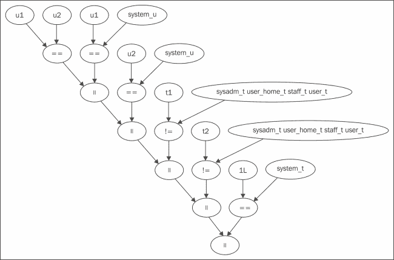

# 第八章 SELinux 调试

在本章中，我们将通过以下方法来查看 SELinux 调试：

+   确定是否是 SELinux 导致的问题

+   分析 SELINUX_ERR 消息

+   记录积极的策略决策

+   检查 SELinux 限制

+   确保 SELinux 规则永远不被允许

+   使用 strace 来澄清权限问题

+   对守护进程使用 strace

+   审计系统行为

# 引言

在启用 SELinux 的系统上，SELinux 策略定义了应用程序应如何行为。任何行为的改变可能会导致 SELinux 拒绝某些应用程序的操作。因此，最终用户可能会注意到意外的权限问题或异常的应用程序行为。

解决此类问题通常通过分析 AVC 事件来完成。许多资源已经详细讨论了 AVC 事件。基本前提是，AVC 事件使用一组键值对，如下所示：

```
type=AVC msg=audit(1369306885.125:4702304): avc: denied { append } for pid=1787 comm="syslog-ng" name="oracle_audit.log" dev=dm-18 ino=65 scontext=system_u:system_r:syslogd_t:s0 tcontext=system_u:object_r:usr_t:s0 tclass=file
```

在这个例子中，我们可以从 AVC 事件中推断出以下内容：

+   该事件是拒绝（`avc: denied`）

+   被拒绝的操作是追加到文件中（`{ append } … tclass=file`）

+   尝试追加到文件的进程的 PID 为 `1787`，名称为 `syslog-ng`（`pid=1787 comm="syslog-ng"`）

+   进程的上下文是 `syslogd_t`（`scontext=system_u:system_r:syslogd_t:s0`）

+   目标文件名为 `oracle_audit.log`，并且在文件系统中的 inode 号为 `65`，存储在 `/dev/dm-18` 逻辑设备中（`name="oracle_audit.log" dev=dm-18 ino=65`）

+   文件的上下文是 `usr_t`（`tcontext=system_u:object_r:usr_t:s0`）

然而，有时仅仅找到问题的所在是不够的。幸运的是，调试问题还有许多其他选项。

# 确定是否是 SELinux 导致的问题

在将问题归咎于 SELinux 子系统和策略之前，重要的是先验证 SELinux 是否真的导致了问题。过多时候，人们花费数小时分析 SELinux 策略和子系统，却最终发现当 SELinux 未启用时，问题依然存在。

## 如何操作…

为了确保 SELinux 是否（或不）是问题的根源，可以采取以下步骤：

1.  是否可以通过应用程序的内部调试系统获取更多信息？考虑以下示例：

    ```
    ~# puppet master
    Error: Could not find class puppet::agent for foo.bar on node foo.bar
    ~# puppet master --debug --no-daemonize --verbose
    ```

1.  AVC 拒绝是否与审计日志中显示的问题有关？如果没有，尝试禁用 `dontaudit` 规则并重新尝试：

    ```
    ~# semodule -DB

    ```

1.  引发问题的应用程序是否支持 SELinux？大多数支持 SELinux 的应用程序会链接 `libselinux.so` 库，因此我们可以使用 `ldd` 或 `scanelf` 来验证这是否为事实：

    ```
    ~# ldd /usr/bin/dbus-daemon
     linux-vdso.so.1 =>  (0x00007fff56df4000)
     libexpat.so.1 => /lib64/libexpat.so.1 (0x00007f55710ae000)
     libselinux.so.1 => /lib64/libselinux.so.1 (0x00007f5570e8f000)
     libaudit.so.1 => /lib64/libaudit.so.1 (0x00007f5570c72000)
     libcap-ng.so.0 => /lib64/libcap-ng.so.0 (0x00007f5570a6d000)
     libpthread.so.0 => /lib64/libpthread.so.0 (0x00007f5570850000)
     librt.so.1 => /lib64/librt.so.1 (0x00007f5570647000)
     libc.so.6 => /lib64/libc.so.6 (0x00007f55702b3000)
     libdl.so.2 => /lib64/libdl.so.2 (0x00007f55700af000)
     /lib64/ld-linux-x86-64.so.2 (0x0000003458000000)

    ```

1.  问题是否与登录相关？如果是，某些应用程序可能不支持 SELinux，但仍然会有所不同，因为它使用 PAM 底层库，该库调用 `pam_selinux.so` 库。

1.  如果将应用程序域设置为宽容模式，问题是否仍然存在？要检查这一点，可以执行以下命令：

    ```
    ~# semanage permissive -a portage_t

    ```

1.  如果应用程序域名未知，可以尝试将整个系统置于宽容模式（如果允许的话），看看问题是否仍然存在。如果仍然存在，那么 SELinux 可能并不是问题的根源：

    ```
    ~# setenforce 0

    ```

## 它的工作原理……

确保 SELinux 是问题根源的第一步是领悟真相。许多用于调查 SELinux 问题的小时数，最终都发现问题根本就不在 SELinux 上。

获取更多来自相关应用程序的信息是故障排除的第一步。许多应用程序都有命令行标志，可以增加日志的详细程度，许多守护进程也可以配置为记录更多的内部工作信息。由此产生的调试信息（或者如果应用程序支持，还可以是跟踪信息）将为管理员排查问题提供极大的帮助。

如果额外的日志信息没有帮助，那么需要检查审计日志中是否有 AVC 拒绝信息。由于一些 AVC 拒绝信息在常规操作中可能会被隐藏，因此可能需要临时禁用 `dontaudit` 规则。不过，不要盯着 AVC 拒绝信息不放，而是要广泛地查看日志文件和审计事件。例如，在下一章节（*分析 SELINUX_ERR 信息*）中，将讨论特定审计事件类型的更深入分析。

同时，检查系统上的各种日志文件也很重要。如果问题与内核、硬件或核心系统相关，`dmesg` 的输出非常关键。`messages` 日志文件（位于 `/var/log/` 中）通常会包含系统守护进程出现问题时的线索。

当没有拒绝信息显示，并且没有可以协助故障排除的特定日志时，下一步是确保我们所使用的应用程序不是 SELinux 感知的。

SELinux 感知的应用程序（知道它们运行在启用 SELinux 的系统上，并与 SELinux 子系统交互的应用程序）可以根据加载的 SELinux 策略表现得不同，而无需实际触发 SELinux 子系统中的任何 SELinux 决策。由于它们的感知，内核中的 SELinux 子系统访问控制可能不会被调用，因此即使问题与 SELinux 有关，也不会显示任何日志。

尽管没有 100% 确定的方法来检查应用程序是否是 SELinux 感知的，但最常用的两种方法如下：

+   检查应用程序的二进制文件是否与 `libselinux.so` 库链接

+   检查应用程序是否使用 PAM

如果一个应用程序链接了`libselinux.so`库，那么它就是 SELinux 感知的，并且能够查询 SELinux 策略，可能会在 SELinux 启用时表现不同，并且通常不管 SELinux 是否处于强制模式或宽容模式。

除了 `ldd` 命令，还可以使用 `pax-utils` 包提供的 `scanelf` 应用程序。该应用程序不需要对二进制文件具有执行权限（而 `ldd` 命令需要），但缺点是它只显示二进制文件的需求，而 `ldd` 还会显示库本身所链接的库：

```
~$ scanelf -n /usr/bin/dbus-daemon
 TYPE   NEEDED FILE
ET_DYN libexpat.so.1,libselinux.so.1,libaudit.so.1,libcap-ng.so.0,libpthread.so.0,librt.so.1,libc.so.6 /usr/bin/dbus-daemon

```

使用 PAM 的应用程序也可能受到 SELinux 的影响，因为它们的 PAM 配置可能调用 `pam_selinux.so` 库（或者不调用它，这同样会对应用程序功能产生影响，因为这样就不会发生转换，导致用户会话仍然以守护进程的上下文运行）。

如果应用程序没有与 SELinux 子系统交互以查询 SELinux 策略，并且它也没有直接处理 SELinux 标签（即它不知道 SELinux 标签并且没有在代码中主动与之交互），那么在宽容模式下运行应用程序应该能显示 SELinux 是否是罪魁祸首。在宽容模式下，SELinux 子系统的访问控制不会阻止任何操作。如果问题在宽容模式下仍然存在，那么很可能不是 SELinux 的问题。

## 另见

+   更多关于 SELinux 兼容应用程序的信息以及如何编写此类应用程序，详见 第十章，*处理 SELinux 兼容应用程序*

# 分析 SELINUX_ERR 消息

当 SELinux 子系统被要求执行一个无效的 SELinux 特定操作时，它会通过审计子系统记录此操作，使用 `SELINUX_ERR` 消息类型。

## 准备就绪

确保审计子系统已经启动并运行，因为我们将使用 `ausearch` 应用程序来（重新）查看审计事件：

```
~# service auditd start

```

## 如何操作…

分析 `SELINUX_ERR` 消息是通过查看审计日志中的条目并理解各个字段来完成的；可以按照以下步骤进行：

1.  记录当前的日期/时间，或者重新加载 SELinux 策略，以便在审计日志中清楚地标明从哪里开始查看：

    ```
    ~# semodule -R

    ```

1.  在应用程序中触发该行为。

1.  请求审计子系统显示最后的 `SELINUX_ERR` 和 `MAC_POLICY_LOAD` 类型的事件：

    ```
    ~# ausearch -m SELINUX_ERR,MAC_POLICY_LOAD -ts recent

    ```

1.  查看消息的开头，了解 SELinux 通知我们什么问题。

## 它是如何工作的…

SELinux 子系统会记录任何不正确的请求。如果是应用程序行为，通常会通过 AVC 类型记录；但当请求是 SELinux 特有且不正确时，会显示 `SELINUX_ERR` 消息类型。在此示例中，我们还查找了 `MAC_POLICY_LOAD` 类型，因此我们知道 SELinux 策略在何时重新加载，从而为调查提供了一个良好的起点。

以下是一些 `SELINUX_ERR` 消息的示例：

+   `security_compute_sid`: 无效的上下文

+   `security_validate_transition`: 拒绝

+   `security_bounded_transition`: 拒绝

还存在一些其他消息，尽管这些消息主要与 SELinux 内部问题有关（与 Linux 内核中的 SELinux 子系统相关，例如支持的 netlink 类型），这些问题需要由 SELinux 维护者自行解决，而不是由策略开发者解决。

### 无效上下文

在 RBAC 和 SELinux 用户规则不允许的情况下创建无效上下文时，会触发无效上下文。这通常发生在域转换期间，目标类型对于该角色不被允许的情况下：

```
time->Wed Aug 4 03:19:04 2014
type=SYSCALL msg=audit(10590262134.246:135): arch=c000003e syscall=59
success=no exit=-13 a0=187b190 a1=187b120 a2=187ac30 a3=7ffff2dc3ec0 items=0
ppid=14696 pid=15085 auid=0 uid=0 gid=0 euid=0 suid=0 fsuid=0
egid=0 sgid=0 fsgid=0 tty=(none) ses=21 comm="logwatch" exe="/usr/bin/perl"
subj=system_u:system_r:logwatch_t:s0-s0:c0.c1023 key=(null)
type=SELINUX_ERR msg=audit(10590262134.246:135): security_compute_sid:
invalid context system_u:system_r:logwatch_mail_t:s0-s0:c0.c1023 for
scontext=system_u:system_r:logwatch_t:s0-s0:c0.c1023
tcontext=system_u:object_r:sendmail_exec_t:s0 tclass=process
```

另一个无效上下文的原因可能是触发了角色转换，但此角色不允许 SELinux 用户：

```
type=SELINUX_ERR audit(1257378096.775:46): security_compute_sid: invalid context
dbadm_u:system_r:mysqld_safe_t:s0 for scontext=dbadm_u:dbadm_r:initrc_t:s0
tcontext=system_u:object_r:mysqld_safe_exec_t:s0 tclass=process
```

在这两种情况下，重要的是查看提供的上下文和`scontext`以及`tcontext`字段。这些字段显示了 SELinux 找到的无效上下文（提供的上下文），以及发起动作的源（启动动作的域）和对象上下文（决定新上下文的标签）。基于这些信息，应该很容易推断出错误的原因。

第一个例子展示了试图从允许`system_r`角色的`logwatch_t`域转换到不允许`system_r`角色的`logwatch_mail_t`域的尝试。要解决此问题，需要允许`logwatch_mail_t`角色给`system_r`角色：

```
allow system_r types logwatch_mail_t;
```

第二个例子是通过角色转换触发的。数据库管理员启动一个`init`脚本，导致`dbadm_u:dbadm_r:initrc_t`上下文。该域执行`mysqld_safe`应用程序（其文件标记为`mysqld_safe_exec_t`），通过 SELinux 策略尝试执行到`system_r`角色的角色转换。虽然`system_r:mysqld_safe_t`上下文是一个有效集合，但数据库管理用户本身不被允许`system_r`角色。

在第二个例子中的主要问题是不应该使用起始上下文（`dbadm_u:dbadm_r:initrc_t`）。`initrc_t`域应仅允许`system_r`角色。这本身要求`dbadm_u` SELinux 用户也被允许`system_r`角色。因此，即使允许`system_r`角色是正确的解决方案，但示例中采取的方法是错误的（从`initrc_t`到`mysqld_safe_t`的角色转换，而不是在实例化`initrc_t`时进行角色转换）。

### 拒绝转换验证

考虑以下错误消息，当一个`init`脚本尝试增加文件的敏感性时出现：

```
type=SELINUX_ERR audit(125482134923.234:25): security_validate_transition:
denied for oldcontext=system_u:object_r:selinux_config_t:s0
newcontext=system_u:object_r:selinux_config_t:s15:c0-c1023
taskcontext=system_u:system_r:initrc_t=s0-s16:c0.c1023 tclass=file
```

当执行文件转换但目标安全上下文不被允许时，会出现这样的消息。SELinux 验证其是否允许；如果不允许，则通过消息记录此情况。

AVC 类似的拒绝将在此处生效，但访问向量缓存系统仅能验证成对上下文（源和目标上下文），而转换验证需要在三个级别上进行（旧文件上下文、新文件上下文和进程上下文）。

解决此错误的方法是允许 `initrc_t` 提升文件的安全级别（通过 `mls_file_upgrade` 接口），或者干脆不让 `init` 脚本域尝试更新文件的 MLS 等级。

### 被拒绝的安全受限转换

一个发生安全受限转换的示例是当 `mod_selinux` 模块与 Apache 一起使用时（Apache 使用受限域和转换来处理单个请求）。当目标域没有受到源域的限制（即，SELinux 策略没有通过 `typebounds` 语句防止目标域执行源域未允许的操作）时，将显示以下错误：

```
type=SELINUX_ERR msg=audit(1245311998.599:17):
op=security_bounded_transition result=denied
oldcontext=system_u:system_r:httpd_t:s0
newcontext=system_u:system_r:guest_webapp_t:s0
```

当这种情况发生时，主应用程序域（例如当为线程进行转换时）请求受限转换，但目标域未标记为受限域。

请注意，这与给定受限域更多权限的情况不同——在这种情况下，当特定权限被调用时，SELinux 会拒绝这些权限，并显示 AVC 拒绝。

## 还有更多…

SELinux 日志记录和审计日志记录正在不断改进。当前正在进行的工作包括使审计日志更易于通过脚本解析，并提供更多信息。例如，在写作时，已接受一个补丁，旨在在 AVC 日志中添加宽松状态信息。

## 另请参见

对 AVC 消息的更深入分析和解释可以参考*SELinux 系统管理*，*Packt 出版社*。关于 SELinux 审计事件的更多资源可通过以下链接获取：

+   [`www.selinuxproject.org/page/NB_AL`](http://www.selinuxproject.org/page/NB_AL)（包括 AVC 事件中所有可能字段的概述）

+   [`wiki.gentoo.org/wiki/SELinux/Tutorials/Where_to_find_SELinux_permission_denial_details`](https://wiki.gentoo.org/wiki/SELinux/Tutorials/Where_to_find_SELinux_permission_denial_details)

# 记录正向策略决策

在某些情况下，系统执行的操作可能是管理员未预料到的，但这些操作是 SELinux 策略允许的，这使得调试潜在问题变得更加困难。某个应用程序可能是 SELinux-aware，导致其行为依赖于 SELinux 策略，而实际上并未使用 SELinux 子系统来强制执行访问。SELinux 策略也可能配置为与预期不同的行为。

在这种情况下，记录实际上被允许的活动而不是被拒绝的活动可能很重要；例如，记录域转换以确保转换确实发生。

## 如何做到这一点…

为了记录域转换，按照以下步骤创建 SELinux 策略：

1.  确定需要关注的源域和目标域。

1.  创建一个 SELinux 策略，在我们想要记录的访问向量上调用`auditallow`语句：

    ```
    auditallow initrc_t postgresql_t:process transition;
    ```

1.  构建并加载 SELinux 策略，尝试重现该情况。

1.  查看审计日志并检查是否显示了 AVC 授予消息：

    ```
    type=AVC msg=audit(1401379369.009:6171): avc:  granted  { transition } for pid=4237 comm="rc" path="/usr/lib64/postgresql-9.3/bin/pg_ctl" dev="dm-3" ino=821490 scontext=system_u:system_r:initrc_t:s0 tcontext=system_u:system_r:postgresql_t:s0 tclass=process 
    ```

## 它是如何工作的…

在 SELinux 支持的众多策略语句中，`auditallow`语句很有趣，并且不会改变 SELinux 做出的决策：拥有`auditallow`语句并不允许执行该操作，而是如果该操作被允许（通过另一个`allow`语句），则让 SELinux 子系统记录下来。

这使得 SELinux 策略开发人员和系统管理员可以明确要求 SELinux 子系统在做出授予而非拒绝决策时通知他们。

使用`auditallow`语句，我们可以跟踪 SELinux 策略决策，并帮助开发策略和调试应用程序行为，特别是当一个进程在非常短的时间内被调用时，因为这会使管理员难以查看进程的上下文是否正确（可以通过`ps -Z`或者检查`/proc/<pid>/`的上下文来查看）。

一些管理员可能希望在他们调用的脚本或命令中添加一些额外的日志记录（例如捕获`id -Z`的输出）。然而，SELinux 策略可能不允许脚本执行`id`命令，更不用说显示其输出或将输出定向到特定日志文件。

为 SELinux 策略增加额外的日志类型、启用终端输出、允许执行二进制文件等，会带来一定的开销，仅仅为了确定进程的上下文是否正确。使用`auditallow`语句是一个很好的解决方案。

当然，它不仅限于域转换。如果一个文件被更改，且管理员或工程师不确定是哪个进程或哪个上下文导致了更改，那么可以在文件标签上启用 SELinux 审计写入，如下所示：

```
auditallow domain postgresql_etc_t:file write;
```

借助 AVC 日志中的附加信息，我们可以看到在特定上下文（`scontext`）下运行的哪个进程（PID）负责向文件写入数据。

# 查看 SELinux 约束

一些拒绝是由 SELinux 约束引起的——这些是由 SELinux 策略施加的额外限制，不仅仅基于 SELinux 类型，还基于 SELinux 角色和 SELinux 用户。这通常在拒绝信息中并不明确。

`audit2why`应用程序有助于通知开发人员，拒绝是由于约束违规引起的：

```
~# ausearch -m avc -ts recent | grep type=AVC | audit2why
type=AVC msg=audit(1401134596.932:62843): avc:  denied  { search } for  pid=19384 comm="mount.nfs4" scontext=system_u:system_r:mount_t:s0 tcontext=system_u:object_r:nfs_t:s0 tclass=dir

 Was caused by:
 Policy constraint violation.

 May require adding a type attribute to the domain or type
 to satisfy the constraint.

 Constraints are defined in the policy sources in
 policy/constraints (general), policy/mcs (MCS), and
 policy/mls (MLS).

```

然而，这并非总是如此，因此我们需要找到一种方法来调查拒绝是否也来源于约束违规。

## 如何操作…

尽管 SELinux 约束可以很容易地查询，但目前它们仍然难以使用。以下方法有助于验证某个约束是否适用于正在调查的特定 AVC 拒绝：

1.  查看 SELinux 策略，查看被拒绝的访问是否有 AVC 允许规则：

    ```
    ~$ sesearch -s staff_t -t user_home_t -c file -p read -A
    Found 1 semantic av  rules:
     allow staff_t user_home_t : file { … read … };

    ```

1.  假设有一个允许规则，请查看是否有适用于该操作的约束。这考虑到类（在示例中为 `file`）和权限（在示例中为 `read`）：

    ```
    ~$ seinfo --constrain | grep 'constrain .* file .* read' -A 1

    ```

1.  如果可能存在约束，请查看源和目标上下文的属性，因为这通常是约束在策略中如何记录的方式：

    ```
    ~$ seinfo -tstaff_t -x
    ~$ seinfo -tuser_home_t -x

    ```

1.  在 SELinux 策略中，查看 `constraints` 文件（通常位于 `${POLICY_LOCATION}/policy/`），以及 `mcs` 或 `mls` 文件（如果策略使用了 MCS 或 MLS），并检查请求的类和权限上的约束，验证是否有涉及所述属性的表达式。

## 它是如何工作的…

目前验证约束比较困难。幸运的是，目前约束不多，但无法轻松验证和查看约束对开发人员来说仍然是一个麻烦。

随着 `seinfo --constrain` 输出的增加（这是查询约束的唯一可用方法，除非读取源代码），复杂性也随之增加，`seinfo --constrain` 输出有以下几个缺点：

+   目前尚未提供有关约束的任何名称（因此很难引用约束）

+   它使用 **逆波兰表示法** (**RPN**)，这对用户并不友好（尽管对于计算机非常强大，但人们通常不擅长流利地阅读 RPN）

+   它显示了扩展的属性，因此我们得到的是类型的大量列表，而不是有限的一组属性

`constraints`、`mcs` 和 `mls` 文件中的约束定义（这些文件仅通过策略源代码访问）更容易查看。以下示例来自 `constraints` 文件；`mcs` 和 `mls` 文件中的约束将使用 `mlsconstrain` 关键字：

```
constrain process { transition dyntransition noatsecure siginh rlimitinh }
(
..r1 == r2
..or ( t1 == can_change_process_role and t2 == process_user_target )
..or ( t1 == cron_source_domain and t2 == cron_job_domain )
..or ( t1 == can_system_change and r2 == system_r )
..or ( t1 == process_uncond_exempt )
);
```

所展示的控制使用属性，这些属性更容易与特定情况匹配。它还展示了约束的灵活性。除了纯粹的面向类型的规则（`t1` 和 `t2`）外，约束还可以与角色（`r1` 和 `r2`）一起使用，并且能够处理 SELinux 用户（`u1` 和 `u2`）。数字用于区分主体（`1`）和对象（`2`）。

例如，在约束语言中，如果 SELinux 用户相等，或者主题的 SELinux 用户是 `system_u`，则允许某些操作，文档中将如下记录：

```
(
  u1 == u2
  or ( u1 == system_u)
)
```

`seinfo --constrain` 命令的输出具有一个优点，即计算机程序容易解析。可以编写计算机程序或脚本，使用 `seinfo` 的输出以树状结构的方式可视化约束信息。

以下由 GraphViz 生成的图展示了适用于文件读取的 UBAC 约束，仅显示用户域和 `user_home_t` 类型（以免图表过于繁杂）：



该图展示了如何构建 UBAC 约束。文件读取是被禁止的（无论政策中制定了什么类型的强制规则），除非它们与图中显示的某一规则匹配，规则如下：

+   该主题（域）和对象（资源）的 SELinux 用户相同

+   该主题的 SELinux 用户是 `system_u`

+   该对象的 SELinux 用户是 `system_u`

+   该主题的 SELinux 类型与任何提到的类型不匹配（图示中仅显示了一个子集）

+   该对象的 SELinux 类型与任何提到的类型不匹配（图示中仅显示了一个子集）

+   该主题的 SELinux 类型是 `sysadm_t`

## 另见

更多关于 SELinux 约束的信息可以在以下资源中找到：

+   [`wiki.gentoo.org/wiki/SELinux/Constraints`](https://wiki.gentoo.org/wiki/SELinux/Constraints)

+   [`www.selinuxproject.org/page/ConstraintStatements`](http://www.selinuxproject.org/page/ConstraintStatements)

# 确保 SELinux 规则永远不被允许

可以在 SELinux 策略中包含一些声明，确保某个特定的访问向量无法被允许，即使以后通过增强 SELinux 策略也无法实现。这是通过 `neverallow` 声明来完成的。

## 如何操作…

要将 `neverallow` 声明包含到策略中并执行它们，请按照以下步骤操作：

1.  在 `/etc/selinux/semanage.conf` 中，通过将 `expand-check` 变量设置为 `1`，启用对 `neverallow` 声明的支持：

    ```
    expand-check=1
    ```

1.  创建一个 SELinux 策略，列出应显式禁止的访问向量。考虑以下实例：

    ```
    neverallow user_t system_mail_t:process transition;
    ```

1.  构建并加载策略。

1.  生成另一个策略，允许该声明并尝试加载它：

    ```
    ~$ semodule -i mytest.pp
    libsepol.check_assertion_helper:  neverallow violated by allow user_t system_mail_t:process { transition };
    libsemanage.semanage_expand_sandbox: Expand module failed
    semodule: Failed!

    ```

## 它是如何工作的…

并非所有发行版默认启用断言检查，因为它们在策略构建过程中会带来一些性能损失。有些发行版可能会因为此问题而存在策略不兼容性，因为如果禁用断言，则 `neverallow` 声明将永远不会被处理：`neverallow` 声明实际上不是一个策略决定，而更像是一个影响新策略加载的规则，它由策略链接器强制执行（策略链接器将不同的策略模块合并为最终的策略二进制文件）。从（失败的）输出可以推断出，`neverallow` 声明作为断言实现。

一些 `neverallow` 声明作为基础策略的一部分是可用的。例如，以下声明确保只有具有 `selinux_unconfined_type` 或 `can_load_policy` 属性的域才能实际加载 SELinux 策略：

```
neverallow ~{ selinux_unconfined_type can_load_policy } security_t:security load_policy;
```

本示例使用了否定运算符（`~`），表示 *除非提到的那些类型之外的所有类型*。

与约束（也可以用于实现限制）不同，`neverallow` 声明通过不接受任何违反规则的策略来提供帮助。通过模块也可以添加 `neverallow` 规则，这与约束不同，后者必须是基础 SELinux 策略的一部分（因此受 Linux 发行版、上游策略或管理完整策略的开发人员的控制，而不是单个 SELinux 策略模块）。

`/etc/selinux/semanage.conf` 中的 `expand-check` 变量告诉 SELinux 用户空间库需要检查该断言。如果该变量设置为 `0`，则 `neverallow` 语句将对策略及其加载没有任何影响。

# 使用 `strace` 来澄清权限问题

`strace` 应用程序是 Linux 系统上一个流行的调试工具。它允许开发人员和管理员查看应用程序发出的各种系统调用。由于 SELinux 通常对特定的系统调用有访问控制，使用 `strace` 在调试权限问题时会非常有用。

## 如何操作…

正确使用 `strace`，请按照以下步骤操作：

1.  启用 `allow_ptrace` 布尔值：

    ```
    ~# setsebool allow_ptrace on

    ```

1.  使用 `strace` 运行应用程序：

    ```
    ~$ strace -o strace.log -f -s 256 tmux

    ```

1.  在生成的日志文件中，查找需要调试的错误信息。

## 它是如何工作的…

需要切换 `allow_ptrace` 布尔值（在某些发行版中，也提供反向布尔值 `deny_ptrace`），使得调用 `strace` 的域可以对目标域使用 `ptrace`（`strace` 用于查看系统调用的方法）。由于 `ptrace` 方法可能会成为安全隐患（例如，它允许读取目标进程的内存），因此默认情况下是禁用的。

一旦应用程序通过 `strace` 启动，日志文件将包含所有相关的系统调用信息。当然，对于较大的应用程序或守护进程，日志文件可能会变得非常庞大，因此限制 `strace` 操作仅针对特定的系统调用子集是有意义的，如下命令所示：

```
~$ strace -e open,access -o strace.log -f -s 256 tmux

```

在此示例中，仅查看 `open` 和 `access` 系统调用。

在生成的日志文件中，SELinux 权限通常会导致系统调用失败，并显示 `EACCES (Permission denied)` 错误代码：

```
7313  stat("/", {st_mode=S_IFDIR|0755, st_size=4096, ...}) = 0
7313  stat("/home", {st_mode=S_IFDIR|0755, st_size=4096, ...}) = 0
7313  stat("/home/swift", {st_mode=S_IFDIR|0755, st_size=12288, ...}) = 0
7313  stat("/home/swift/.pki", {st_mode=S_IFDIR|0700, st_size=4096, ...}) = 0
7313  stat("/home/swift/.pki/nssdb", {st_mode=S_IFDIR|0700, st_size=4096, ...}) = 0
7313  statfs("/home/swift/.pki/nssdb", 0x3c3cab6fa50) = -1 EACCES (Permission denied)
```

尽管大多数访问会显示 AVC 拒绝，但这些拒绝通常无法全面说明拒绝发生的阶段。通过使用 `strace`，我们可以跟踪应用程序执行的逻辑。

有时，错误发生的原因并不明显。在这种情况下，可能需要分别在强制模式和宽松模式下运行应用程序，并查看 `strace` 日志中的差异。

# 使用 `strace` 调试守护进程

`strace` 应用程序不仅适用于命令行应用程序，也适用于守护进程。调试守护进程的一种常见方法是从命令行启动它们，可能带有特定的调试标志，这样守护进程就不会分离并在后台运行。然而，在 SELinux 上通常无法做到这一点：策略不允许守护进程作为命令行前台进程运行。

## 如何操作…

使用 `strace` 调试守护进程的方法与调试命令行相似，重点是进程 ID 而不是命令：

1.  查找守护进程的进程 ID：

    ```
    ~$ pidof postgres
    2557

    ```

1.  使用 `strace` 附加到正在运行的进程：

    ```
    ~$ strace -o strace.log -f -s 256 -p 2557

    ```

1.  指定要监视的系统调用。例如，绑定或连接端口或套接字时的权限问题可以按如下方式进行过滤：

    ```
    ~$ strace -e poll,select,connect,recvfrom,sendto -o strace.log -f -s 256 -p 2557

    ```

1.  按*Ctrl* + *C*中断`strace`会话；不用担心，守护进程会继续在后台运行，不会受到影响。

## 它是如何工作的……

一种常见的调试守护进程的方法是从命令行将守护进程启动到前台，但在 SELinux 系统上通常不起作用：

```
~$ postgres -D /etc/postgresql-9.3 --data-directory=/srv/pgsql/data
LOG:  could not bind IPv6 socket: Permission denied
WARNING: could not create listen socket for "localhost"
FATAL: could not create any TCP/IP sockets

```

如果用户有权直接执行守护进程二进制文件（这通常不是默认设置），则守护进程通常会以用户域的权限运行——而用户域通常没有执行守护进程所需的权限——因为没有从用户域到守护进程域的过渡。

通过使用`strace`对守护进程进行调试，可以更详细地调试它们。`strace`应用程序会绑定到进程（使用`ptrace`方法），并通知守护进程执行的每一个系统调用。`-f`选项还确保守护进程启动的新进程（例如，工作进程）也会被`strace`监控。

要结束`strace`会话，只需杀死`strace`会话或通过*Ctrl* + *C*中断它即可。守护进程本身不会受到影响。

## 还有更多...

还有许多其他系统分析工具，可以以类似的方式使用。例如，SystemTap 和 Sysdig，以及正在积极开发的 Linux 版本的 DTrace。

## 另见

以下资源更详细地介绍了`strace`、SystemTap 和 Sysdig 的使用：

+   [`www.dedoimedo.com/computers/strace.html`](http://www.dedoimedo.com/computers/strace.html)

+   [`www.thegeekstuff.com/2011/11/strace-examples/`](http://www.thegeekstuff.com/2011/11/strace-examples/)

+   [`www.sourceware.org/systemtap/`](http://www.sourceware.org/systemtap/)

+   [`www.sysdig.org/wiki/`](http://www.sysdig.org/wiki/)

# 审计系统行为

另一种调试应用程序行为的方法是通过 Linux 审计，尤其是在不清楚哪个进程负责执行特定操作时，因为这可能会使 SELinux 开发变得更加困难。当开发人员不知道需要为哪些域更新权限，或者不清楚如何创建资源时，Linux 审计子系统可以提供帮助。

通过 Linux 审计子系统，管理员可以启用规则来记录活动。在审计日志中，还会显示主题（进程）的 SELinux 上下文，从而使 SELinux 开发人员能够正确地识别需要操作的域。

## 如何做……

让我们来看一下如何通过以下步骤询问 Linux 审计子系统，哪个进程负责在用户的主目录中创建特定的目录：

1.  作为 root Linux 用户（并且在具有足够权限的 SELinux 角色下），告诉审计子系统记录所有写入和属性更改操作，尤其是在用户的主目录中：

    ```
    ~# auditctl -w /home/john/ -p wa -k policydev

    ```

1.  执行必要的操作来触发需要调试的行为。

1.  使用`policydev`键查询审计子系统中的最近审计事件：

    ```
    ~# ausearch -ts recent -k policydev

    ```

1.  后来，再次禁用审计规则，以防审计日志被与开发相关的事件弄得杂乱无章：

    ```
    ~# auditctl -W /home/john/ -p wa -k policydev

    ```

## 它是如何工作的……

Linux 审计子系统使用审计规则来识别哪些活动需要记录到审计日志中。可以使用`auditctl`命令（审计控制）来操作这些规则。

在我们的示例中，添加了一个针对`/home/john/`路径的规则（`-w /home/john`），用于记录写入和属性变化（`-p wa`）。事件会被标记，所谓的标记是一个名为`policydev`的键。管理员可以自由选择这个键，它的目的是构建审计事件并简化搜索查询。

当执行`auditctl`命令时，规则立即生效，因此在执行测试后，审计事件会显示如下：

```
time->Sun Jun  8 11:16:47 2014
type=PATH msg=audit(1402219007.623:80705): item=1 name=".dcinforc" inode=8364 dev=fd:0c mode=040755 ouid=475395 ogid=475395 rdev=00:00 obj=user_u:object_r:user_home_t:s0 nametype=CREATE
type=PATH msg=audit(1402219007.623:80705): item=0 name="/home/john" inode=229 dev=fd:0c mode=040700 ouid=475395 ogid=475395 rdev=00:00 obj=user_u:object_r:user_home_dir_t:s0 nametype=PARENT
type=CWD msg=audit(1402219007.623:80705):  cwd="/home/john"
type=SYSCALL msg=audit(1402219007.623:80705): arch=c000003e syscall=83 success=yes exit=0 a0=7fff33d50330 a1=1ff a2=7fff33d50330 a3=a items=2 ppid=23132 pid=23929 auid=475395 uid=475395 gid=475395 euid=475395 suid=475395 fsuid=475395 egid=475395 sgid=475395 fsgid=475395 tty=pts3 ses=11203 comm="java" exe="/usr/bin/java" subj=user_u:user_r:java_t:s0 key="policydev"
```

日志显示，负责在用户主目录下创建名为`.dcinforc/`的目录的是一个`java`进程。这里需要考虑的重要字段是`nametype=CREATE`（告诉我们创建了一个对象）和`syscall=83`（告诉我们审计子系统捕获到的系统调用——在这种情况下是`mkdir`系统调用）字段，当然，还有`subj=`和`obj=`参数。

从示例中，我们可以看到有两个不同的`obj=`参数：

+   第一个，`obj=user_u:object_r:user_home_t:s0`，是针对已创建目录提到的，它告诉我们新创建的目录接收到的标签是什么。

+   第二个，`obj=user_u:object_r:user_home_dir_t:s0`，是针对父目录（`nametype=PARENT`）提到的，告诉我们`.dcinforc/`目录所在的目录标签是什么。

现在，这只是创建目录的一个示例，但审计系统可以捕获许多类型的活动。这时，`syscall=`字段就变得非常重要。这个字段告诉我们审计子系统捕获并记录的具体系统调用是什么。

可以在相应的`C`头文件中找到系统调用及其关联的编号。例如，`/usr/include/asm/unistd_64.h`文件（通过`/usr/include/syscalls.h`间接引用）包含以下代码：

```
#define __NR_rename  82  __SYSCALL(__NR_rename, sys_rename)
#define __NR_mkdir  83  __SYSCALL(__NR_mkdir, sys_mkdir)
#define __NR_rmdir  84  __SYSCALL(__NR_rmdir, sys_rmdir)
```

通过这一点，我们知道该目录是通过`mkdir`系统调用创建的，而不是通过其他方式（例如，先创建一个不同的目录然后重命名）。

## 还有更多……

审计子系统在启动时接收需要跟踪的规则。大多数 Linux 发行版在`/etc/audit/`目录下提供一个名为`audit.rules`的文件，其中包含了需要被捕获和记录的各种命令、位置和系统调用。然后，审计守护进程的`init`脚本会在启动时读取这个文件。

如果我们需要自动加载某些规则——而不仅仅是进行短期测试的时间——那么建议将这些规则添加到`audit.rules`脚本中，并附上适当的注释说明为何需要进行跟踪。

现在，我们只是在示例中使用了基于路径的审计功能。然而，Linux 审计子系统可以做的远不止于此。例如，可以审计特定的系统调用。这使管理员能够密切关注可疑的系统调用使用，比如使用`unshare`（用于 Linux 命名空间）：

```
~# auditctl -a entry,always -S unshare -k namespace_suspect

```

## 另见

+   适合使用的一套默认审计规则已在《Red Hat 企业版 Linux 的 CIS 安全基准》中提到，详情请见[`benchmarks.cisecurity.org/`](https://benchmarks.cisecurity.org/)
