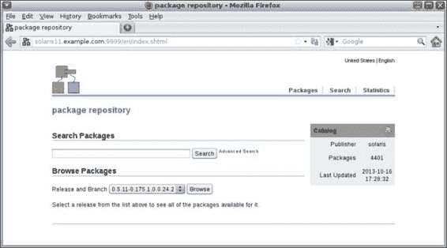

# 第一章：IPS 与引导环境

在本章中，我们将涵盖以下主题：

+   确定当前的包发布者

+   列出并收集包的信息和依赖项

+   安装包、验证其内容并修复包的损坏

+   管理 IPS 历史记录，并冻结和卸载包

+   发现 IPS 包管理器界面

+   创建、激活并销毁引导环境

+   列出并重命名引导环境

+   配置 IPS 本地仓库

+   配置次要 IPS 本地仓库

+   将包发布到仓库中

+   向仓库中添加大型应用程序

+   创建自己的包并发布它

+   在 Solaris 11 上管理 IPS 发布者

+   钉住发布者

+   更改 URI 并启用或禁用发布者

+   创建镜像仓库

+   删除仓库并更改搜索顺序

+   列出并创建引导环境

+   在非活动引导环境中挂载、卸载、安装和卸载包

+   激活引导环境

+   从现有的引导环境创建一个新的引导环境

# 介绍

正如你已经知道的，Oracle Solaris 11 已经经历了许多变化，并且现在提供了一个用于管理包的框架，称为 **映像包装系统**（**IPS**）。这个新框架使管理员在添加、删除、收集和管理任何软件包时更加轻松。默认情况下，Oracle 在网络上提供了一个仓库（一个大的包集合），地址为 [`pkg.oracle.com/solaris/release/`](http://pkg.oracle.com/solaris/release/)，这是 Oracle Solaris 11 的默认仓库。通过使用这个仓库，我们可以从互联网安装任何包，正如我们将很快学到的那样，完全可以在我们自己的 Oracle Solaris 11 安装上创建一个本地仓库（像默认的那个一样），以提高我们环境的安全性和性能。此外，我们还可以配置 Oracle Solaris 11，允许它拥有多个仓库作为包的来源。

超越 IPS，Oracle Solaris 11 使用 **引导环境**（**BEs**）帮助我们进行 Oracle Solaris 11 升级，而不会对当前数据造成任何风险，因为更新过程在执行包更新之前会创建一个新的 BE。这个新的 BE 会在下次重启时出现在 GRUB 菜单中，从那里我们可以选择新的 BE（更新后的 Solaris）或旧的 BE。引导环境在处理 Oracle Solaris 11 管理时会在其他领域派上用场。

# 确定当前的包发布者

在 Solaris 11 系统上管理 IPS 时，我们需要做的第一件事是找出当前的包发布者，因为最初它将是我们系统安装或更新包的来源。

## 准备工作

要执行这个过程，我们需要一台运行 Oracle Solaris 11 的机器（物理机或虚拟机）；我们需要以 root 用户身份登录该系统并打开终端。

## 如何操作……

要列出现有的发布者，我们执行以下命令：

```
root@solaris11:/# pkg publisher
PUBLISHER   TYPE    STATUS  P  LOCATION
solaris     origin  online  F  http://pkg.oracle.com/solaris/release/
```

根据输出，Oracle 软件包 URI 和仓库（[`pkg.oracle.com/solaris/release/`](http://pkg.oracle.com/solaris/release/)）是软件包和更新的来源（命名为`origin`），并且它没有被代理（当`P`等于`F`时，代理设置为 false）。

若要收集有关软件包发布者的更多信息，我们可以输入以下命令：

```
root@solaris11:~# pkg publisher solaris
Publisher: solaris
Alias:
Origin URI: http://pkg.oracle.com/solaris/release/
SSL Key: None
SSL Cert: None
Client UUID: f7cdfbf2-0292-11e2-831b-80144f013e20
Catalog Updated: September 12, 2013 04:22:26 PM
Enabled: Yes
```

### 配方概览

使用主命令`pkg`并加上`publisher`关键字，我们找到了发布者列表，`solaris`发布者是`online`，并且启用了一个指向仓库位置的 URI，即[`pkg.oracle.com/solaris/release/`](http://pkg.oracle.com/solaris/release/)。此外，`solaris`发布者没有与之关联的 SSL 数字证书。

# 列出并收集软件包的信息和依赖关系

为了演示管理软件包的简单性，让我们来看一个有用的例子，在 Oracle Solaris 11 上安装一个软件包。

## 如何操作……

首先，我们需要知道要安装哪个软件包。然而，在安装任何软件包之前，我们需要通过运行以下命令来确认该软件包是否已经安装在系统上：

```
root@solaris11:~# pkg list nmap
pkg list: no packages matching 'nmap' installed
```

如我们所见，`nmap`软件包（扫描工具）没有安装在 Oracle Solaris 11 上；我们可以确认这个工具来自官方源仓库（根据之前的发布者列表是`solaris`）。此外，在执行此步骤之前，建议重新构建仓库索引（主要是如果你不记得上次添加或删除软件包的时间），以加速后续查找过程：

```
root@solaris11:~# pkg rebuild-index
PHASE                                       ITEMS
Building new search index                   847/847
```

现在是时候搜索`nmap`软件包了。我们可以通过以下命令来实现：

```
root@solaris11:~# pkg search nmap
INDEX           ACTION  VALUE                                   
                                                    PACKAGE
pkg.description set    Nmap is useful for inventorying the network, managing service upgrade schedules, and monitoring host or service uptime. pkg:/diagnostic/nmap@5.51-0.175.1.0.0.24.0
basename        file    usr/bin/nmap                            
                                                    pkg:/diagnostic/nmap@5.51-0.175.1.0.0.24.0
pkg.fmri        set     solaris/diagnostic/nmap                 
                                                    pkg:/diagnostic/nmap@5.51-0.175.1.0.0.24.0
basename        dir     usr/share/nmap                          
                                                    pkg:/diagnostic/nmap@5.51-0.175.1.0.0.24.0
```

我们可以确认`nmap`是可用的，并且尚未安装在系统上，但多了解一些关于该软件包的信息总是有帮助的。判断`nmap`软件包是否已安装的一个简单方法是执行以下命令：

```
root@solaris11-1:~# pkg list -af nmap
NAME (PUBLISHER)              VERSION                    IFO
diagnostic/nmap               5.51-0.175.1.0.0.24.0      ---
```

如果最后一列（`IFO`）没有`i`标志，那么我们可以确认该软件包没有安装。我们还可以通过输入以下命令来获取关于`nmap`的更多信息：

```
root@solaris11:~# pkg info -r nmap
Name: diagnostic/nmap
Summary: Network exploration tool and security / port scanner.
Description: Nmap is useful for inventorying the network, managing service upgrade schedules, and monitoring host or service uptime.
Category: System/Administration and Configuration
 State: Not installed
 Publisher: solaris
 Version: 5.51
 Build Release: 5.11
Branch: 0.175.1.0.0.24.0
Packaging Date: September  4, 2012 05:17:49 PM 
Size: 12.28 MB
FMRI: pkg://solaris/diagnostic/nmap@5.51,5.11-0.175.1.0.0.24.0:20120904T171749Z
```

这个命令很重要，因为我们收集了关于`nmap`软件包的有价值属性，比如其状态（`未安装`）和大小（`12.28 MB`）。`-r`选项是必要的，因为它引用了来自注册发布者的仓库中的软件包。我们可以以相同的方式查看 Nmap 的许可证协议：

```
root@solaris11:~# pkg info -r --license nmap
Oracle elects to use only the GNU Lesser General Public License version
2.1 (LGPL)/GNU General Public License version 2 (GPL) for any software
where a choice of LGPL/GPL license versions are made available with the
language indicating that LGPLv2.1/GPLv2 or any later version may be
used, or where a choice of which version of the LGPL/GPL is applied is
unspecified. 
…..........
```

有时，在尝试安装特定软件包（如`nmap`）之前，了解安装该软件包所需的依赖包是非常有用的。我们可以通过执行以下命令来验证：

```
root@solaris11:~# pkg contents -r -o fmri,type -t depend nmap
FMRI                                                       TYPE
pkg:/library/pcre@8.21-0.175.1.0.0.23.0                             require
pkg:/library/python-2/pygobject-26@2.21.1-0.175.1.0.0.11.0   require
pkg:/library/python-2/pygtk2-26@2.17.0-0.175.1.0.0.19.0     require
pkg:/library/security/openssl@1.0.0.10-0.175.1.0.0.23.0      require
pkg:/runtime/lua@5.1.4-0.175.1.0.0.23.0                             require
pkg:/runtime/python-26@2.6.8-0.175.1.0.0.23.0                     require
pkg:/system/library/gcc-3-runtime@3.4.3-0.175.1.0.0.23.0         require
pkg:/system/library/libpcap@1.1.1-0.175.1.0.0.23.0                  require
pkg:/system/library/math@0.5.11-0.175.1.0.0.19.0                   require
pkg:/system/library@0.5.11-0.175.1.0.0.23.0                         require
```

我们还可以通过执行以下命令得到相同的结果：

```
root@solaris11:~# pkg contents -r -o action.raw -t depend nmap
ACTION.RAW
depend fmri=pkg:/library/python-2/pygobject-26@2.21.1-0.175.1.0.0.11.0 type=require
depend fmri=pkg:/system/library/gcc-3-runtime@3.4.3-0.175.1.0.0.23.0 type=require
depend fmri=pkg:/library/security/openssl@1.0.0.10-0.175.1.0.0.23.0 type=require
depend fmri=pkg:/runtime/lua@5.1.4-0.175.1.0.0.23.0 type=require
depend fmri=pkg:/system/library/math@0.5.11-0.175.1.0.0.19.0 type=require
depend fmri=pkg:/system/library@0.5.11-0.175.1.0.0.23.0 type=require
depend fmri=pkg:/runtime/python-26@2.6.8-0.175.1.0.0.23.0 type=require
depend fmri=pkg:/library/pcre@8.21-0.175.1.0.0.23.0 type=require
depend fmri=pkg:/system/library/libpcap@1.1.1-0.175.1.0.0.23.0 type=require
depend fmri=pkg:/library/python-2/pygtk2-26@2.17.0-0.175.1.0.0.19.0 type=require
```

`–t`选项指定`action.raw`，用于将搜索限制为特定属性，如`depend`。`–r`选项根据最新的可用版本匹配软件包并获取有关未安装软件包的信息，而`-o`选项限制输出中显示的列数。

我们有一个安装新软件包（如`nmap`）所需的包列表，所有软件包都显示为`require`；不过，如果我们管理的是另一个软件包，这条命令会显示为`optional`。

### 方案概览

之前的命令验证了如果一个特定的软件包已经安装（如`nmap`），它会重新索引软件包目录（以加快搜索速度），并收集关于软件包的详细信息。此外，我们列出了`nmap`软件包的依赖关系。我们会注意到被索引的软件包数量（847）非常高，这也是为什么这个操作需要一些时间的主要原因。

# 安装一个软件包、验证其内容并修复软件包损坏

这次，我们具备了足够的条件来安装软件包并验证其内容，如果发现任何软件包存在问题，我们也能进行修复。这是一个令人兴奋的部分，因为它将介绍许多有用的命令，所有这些命令都在日常的 Solaris 11 管理中使用。

## 准备工作

我们将使用`nmap`软件包学习下一步的操作，但同样的操作也可以使用其他任何 Solaris 11 软件包完成。

## 如何操作…

我们执行以下命令：

```
root@solaris11:~# pkg install -v nmap
           Packages to install:        1
         Estimated space available: 71.04 GB
     Estimated space to be consumed: 51.67 MB
       Create boot environment:       No
     Create backup boot environment:       No
           Services to change:        1
           Rebuild boot archive:       No

   Changed packages:
   solaris
   diagnostic/nmap
   None -> 5.51,5.11-0.175.1.0.0.24.0:20120904T171749Z
   Services:
   restart_fmri:
   svc:/application/desktop-cache/desktop-mime-cache:default
   DOWNLOAD                                PKGS         FILES    XFER (MB)   SPEED
   Completed                                1/1       523/523      3.3/3.3 24.1k/s

PHASE                                             ITEMS
Installing new actions                            581/581
Updating package state database         Done 
Updating image state                            Done 
Creating fast lookup database               Done 
```

根据输出，Solaris 11 没有创建 BE。当然，这只是一次非常简单的软件包安装。然而，如果我们安装的是 Solaris 补丁，情况就会大不相同。我们可以通过输入以下命令检查我们的安装：

```
root@solaris11:~# pkg list nmap
NAME (PUBLISHER)                       VERSION                    IFO
diagnostic/nmap                        5.51-0.175.1.0.0.24.0      i--
```

最后一列显示软件包已安装，因此要查看我们的安装内容，我们输入以下命令：

```
root@solaris11:~# pkg contents nmap
PATH
usr
usr/bin
usr/bin/ncat
usr/bin/ndiff
usr/bin/nmap
usr/bin/nmapfe
usr/bin/nping
usr/bin/xnmap
usr/bin/zenmap
usr/lib
usr/lib/python2.6
usr/lib/python2.6/vendor-packages
usr/lib/python2.6/vendor-packages/radialnet
usr/lib/python2.6/vendor-packages/radialnet/__init__.py
usr/lib/python2.6/vendor-packages/radialnet/__init__.pyc
…......................
```

我们可以通过运行以下命令，使用另一种形式并展示额外的信息：

```
root@solaris11:~# pkg contents -t file -o owner,mode,pkg.size,path nmap
OWNER   MODE   PKG.SIZE    PATH
root    0555   166228      usr/bin/ncat
root    0555   48418       usr/bin/ndiff
root    0555   1540872     usr/bin/nmap
root    0555   608972      usr/bin/nping
root    0555   6748        usr/bin/zenmap
…...................
```

此外，每个软件包都有一个名为`manifest`的文件，描述了如软件包内容、属性和依赖关系等详细信息。我们可以通过以下命令查看已安装软件包的`manifest`文件：

```
root@solaris11:~# pkg contents -m nmap | more
set name=pkg.fmri value=pkg://solaris/diagnostic/nmap@5.51,5.11-0.175.1.0.0.24.0:20120904T171749Z
set name=pkg.debug.depend.bypassed value=usr/lib/python2.6/vendor-packages/zenmapGUI/SearchWindow.py:.*
set name=variant.arch value=i386 value=sparc
set name=org.opensolaris.consolidation value=userland
set name=org.opensolaris.arc-caseid value=PSARC/2007/129
set name=info.upstream-url value=http://insecure.org/
set name=info.source-url value=http://nmap.org/dist/nmap-5.51.tgz
set name=pkg.summary value="Network exploration tool and security / port scanner."
set name=info.classification value="org.opensolaris.category.2008:System/Administration and Configuration"
  …................................................
  …...............................................
```

### 提示

你可能会想知道是否可以检查软件包安装是否保持了其完整性。是的，你可以使用以下命令来管理这个问题：

```
root@solaris11:~# pkg verify -v nmap
PACKAGE                                           STATUS
pkg://solaris/diagnostic/nmap                     OK
```

让我们创建一个简单的测试，破坏`nmap`软件包中的任何文件；然后，通过运行以下命令检查软件包状态：

```
root@solaris11:~# find / -name nmap
/usr/bin/nmap
```

我们继续执行以下命令：

```
root@solaris11:~# mkdir /backup
root@solaris11:~# cp /usr/bin/nmap /backup/
root@solaris11:~# echo GARBAGE  > /usr/bin/nmap
root@solaris11:~# pkg verify -v nmap
PACKAGE                                                      STATUS
pkg://solaris/diagnostic/nmap                                ERROR
 file: usr/bin/nmap
  Unexpected Exception: Request error: class file/memory     mismatch
```

哇！用于检测`nmap`软件包损坏的命令检测到了确切的问题。我们可以通过一种非常简单且快速的方法修复这个潜在的问题：

```
root@solaris11:~# pkg fix nmap
Verifying: pkg://solaris/diagnostic/nmap                        ERROR
  file: usr/bin/nmap
Unexpected Exception: Request error: class file/memory mismatch
Created ZFS snapshot: 2013-10-10-22:27:20
Repairing: pkg://solaris/diagnostic/nmap                     
Creating Plan (Evaluating mediators): \

DOWNLOAD                                PKGS         FILES    XFER (MB)   SPEED
Completed                                1/1           1/1      0.5/0.5 97.0k/s

PHASE                                            ITEMS
Updating modified actions                        1/1
Updating image state                             Done 
Creating fast lookup database                    Done 
```

### 方案概览

在安装`nmap`软件包时，我们发现安装后占用 51.67 MB 的空间，并且没有创建新的 BE。在接下来的命令中，我们发现了很多信息；例如，`nmap`软件包包含的文件，该软件包在 x86 或 SPARC 架构上运行，它来自 Solaris 软件仓库，由[`insecure.org`](http://insecure.org)开发，其源文件为`nmap-5.51.tgz`，并且仅在用户空间运行。之后，我们验证了`nmap`的完整性，损坏了它，并修复了它。

# 管理 IPS 历史记录以及冻结和卸载软件包

审计是公司当前的另一个关注点，通常情况下，了解最近发生了哪些软件包操作非常有帮助。此外，我们还将学习一种方法来删除 IPS 命令历史记录。

## 如何操作……

为了收集这些信息，我们执行以下命令：

```
root@solaris11:~# pkg history
START                    OPERATION               CLIENT              OUTCOME
2012-09-19T16:48:22      set-property             transfer module    Succeeded
2012-09-19T16:48:22      add-publisher           transfer module    Succeeded
2012-09-19T16:48:22      refresh-publishers    transfer module    Succeeded
2012-09-19T16:48:22      image-create            transfer module    Succeeded
2012-09-19T16:48:30      rebuild-image-catalogs   transfer module    Succeeded
2012-09-19T16:48:36      set-property             transfer module    Succeeded
2012-09-19T16:48:37      install                     transfer module    Succeeded
2012-09-19T17:30:12      update-publisher      transfer module    Succeeded
2012-09-19T17:30:12      refresh-publishers    transfer module    Succeeded
2012-09-19T17:30:16      rebuild-image-catalogs   transfer module    Succeeded
2013-10-05T20:58:30      uninstall                transfer module    Succeeded
2013-10-05T21:42:06      refresh-publishers       pkg                 Succeeded
2013-10-05T21:42:06      install                    pkg                Failed
2013-10-05T21:42:14      rebuild-image-catalogs   pkg           Succeeded
2013-10-07T17:40:53      install                  pkg                Succeeded
2013-10-07T18:31:03      uninstall                     pkg                Succeeded
2013-10-07T19:06:14      install                   pkg                Succeeded
```

我们并不总是需要或想要保留我们操作的历史记录；Oracle Solaris 11 允许我们通过运行一个简单的命令来清除历史记录：

```
root@solaris11:~# pkg purge-history
History purged.
```

不时地，Oracle Solaris 11 软件包会进行更新，我们知道，当有新版本可用时，最好更新软件包。可以使用以下命令检查是否有更新：

```
root@solaris11:~# pkg update nmap
No updates available for this image
```

然而，必须强调的是，如果我们执行`pkg update`，整个系统将会被更新。

在极少数情况下，我们可能需要冻结一个软件包以防止其更新。这种干预虽然非常不可能发生，但当我们必须保持一个非常特定的软件版本在系统中时，即使它在执行类似`pkg update`的更新命令来修改内容时，也需要冻结。用于冻结的软件包的命令如下：

```
root@solaris11:~# pkg freeze diagnostic/nmap
diagnostic/nmap was frozen at 5.51-0.175.1.0.0.24.0:20120904T171749Z
```

同样地，我们可以改变主意，通过执行以下命令解冻`nmap`软件包：

```
root@solaris11:~# pkg unfreeze diagnostic/nmap
diagnostic/nmap was unfrozen.
```

在继续之前，我们可以使用一个巧妙的技巧来再次更新 Nmap，而无需使用`pkg update nmap`命令。一个 facet 代表一个可选的软件组件，例如`locale`属性，而 variants 代表互斥的软件组件（例如 x86 组件与 SPARC 组件）。

一个软件包有一个关联的操作，而 facet 被定义为软件包操作的标签。所以，当`version.lock` facet 被设置为`true`值时（无论之前设置的值是什么），IPS 框架会检查软件仓库中是否有该软件包的新版本：

```
root@solaris11:~# pkg change-facet facet.version-lock.diagnostic/nmap=true
            Packages to update: 849
      Variants/Facets to change:   1
        Create boot environment:  No
Create backup boot environment: Yes

PHASE                                          ITEMS
Updating image state                           Done 
Creating fast lookup database                  Done 
```

### 注意

如果你想了解更多关于 variants 和 facets 的信息，请参考*控制可选组件的安装*，该部分内容可以在[`docs.oracle.com/cd/E26502_01/html/E28984/glmke.html#scrolltoc`](http://docs.oracle.com/cd/E26502_01/html/E28984/glmke.html#scrolltoc)的*添加和更新 Oracle Solaris 11.1 软件包*手册中找到。

最后，为了完成对 IPS 管理的复习，在管理软件包时一个重要的因素是知道如何卸载它们：

```
root@solaris11:~# pkg uninstall nmap
            Packages to remove:  1
       Create boot environment: No
Create backup boot environment: No
            Services to change:  1

PHASE                                           ITEMS
Removing old actions                            598/598
Updating package state database                 Done 
Updating package cache                          1/1 
Updating image state                            Done 
Creating fast lookup database                   Done 

root@solaris11:~# pkg list nmap
pkg list: no packages matching 'nmap' installed
```

### 操作步骤概述

使用 `pkg history` 命令，可以列出管理员在 IPS 框架上执行的所有操作，无论成功或失败，并且包括 `pkg` 命令执行的确切时间。如果我们需要进行审计，这无疑是一个很好的功能。有一个叫做 `pkg purge-history` 的命令，它会清除所有历史记录，且只能由 root 用户执行。我们还了解了 `pkg freeze`，它可以防止 Oracle Solaris 11 更新某个特定的软件包。最后，我们已经看到使用 `pkg uninstall` 卸载软件包是多么简单。

# 探索 IPS 软件包管理器界面

一些管理员更喜欢使用 GUI 来管理 Oracle Solaris 11 的某些区域。也许这也是你的偏好，为此，有一个叫做“软件包管理器 GUI”的工具，它是一个精心制作的界面，使得几乎可以完成所有的软件包管理工作。就个人而言，我认为它是一个非常整洁的工具，特别是当你想查看来自软件库的所有可用包时；当我需要一次安装多个软件包时，它使工作变得更轻松。

尽管软件包管理器 GUI 具有许多便捷的功能，但我们在这里不会讨论这些特点。如果你想了解更多关于图形界面的内容，我相信你可以自己探索并学习。

## 如何操作…

要启动软件包管理器界面，我们可以进入 **系统** | **管理员** | **软件包管理器**：


很好！我们已经对 IPS 管理做了一个基本回顾。现在，我们将继续进行另一个关于 BEs 的基本回顾。

### 配方概述

GUI 是在 Oracle Solaris 11 系统上管理 IPS 包的一个非常棒的方式，它能够最大限度地利用 IPS 管理任务以及 BE 管理任务。

# 创建、激活和销毁引导环境

我总是喜欢提出这样一个问题：在管理 Oracle Solaris 11 时，有哪些事实能使生活变得更加轻松？

也许答案并没有那么难；为了证明这一点，让我们设想一个场景。我们需要更新 Oracle Solaris 11，为此，我们需要重启系统，插入 Oracle Solaris 11 安装 DVD，并在启动时选择升级选项。升级完成了吗？没有其他问题了吗？不幸的是，这并非如此，因为存在一些潜在的权衡：

+   我们不得不停止应用程序并重启操作系统，用户也不得不停止工作。

+   如果在升级 Oracle Solaris 操作系统时遇到问题，我们将失去所有旧的安装，因为升级过程会覆盖掉先前的 Oracle Solaris 版本；因此，我们将无法重启系统并恢复到之前的版本

正如你所意识到的，这对管理员来说是一个重大威胁，因为在第一种情况下，我们拥有一个正常运行（但已过时）的系统，而在第二种情况下，如果出现问题，我们就有可能失去一切（以及我们宝贵的工作）。我们如何改进这种情况呢？

在 Oracle Solaris 11 中，当我们需要升级系统时，Oracle Solaris 11 会自动创建一个 BE 来帮助我们完成该过程。引导环境是一种克隆，它使我们能够保存之前的安装，如果升级过程中出现任何问题，Oracle Solaris 11 的引导环境可以让我们将操作系统恢复到旧的状态（安装）。这种操作的最大优势之一是管理员无需执行任何命令来创建 BE 以保护并保存之前的安装。Oracle Solaris 11 会管理整个过程。这有两个好处：升级过程可以在不重启操作系统的情况下完成，并且引导环境让我们在遇到问题时可以回滚环境。

你应该知道，BEs 不仅仅用于升级操作。事实上，我们可以使用它们来修补系统、安装应用程序或创建测试环境。在所有这些情况下，BE 使得将系统恢复到之前的状态成为可能。因此，在我们处理完这些基本内容后，就该开始实践了。

如今，专业人员大量使用 BE，这也是在管理 Oracle Solaris 11 时，创建、激活和销毁 BEs 最为重要的真正原因。你可以确信，这些知识对你理解 Oracle Solaris 11 高级管理至关重要。

## 准备工作

要跟随本配方，我们需要一台运行 Oracle Solaris 11 的机器（物理机或虚拟机）；我们以 root 用户身份登录系统并打开终端。此外，我们的系统必须能够连接到互联网。可能还需要一些额外的空闲空间。

## 如何操作…

毫不拖延地，执行以下命令：

```
root@solaris11:~# beadm create solaris-backup-1
root@solaris11:~# beadm list
BE                Active Mountpoint Space    Policy  Created  
-------------     ---------------------------------  ---------- 
solaris           NR     /          4.99G    static  2013-10-05 20:44
solaris-backup-1  -      -          163.0K   static  2013-10-10 19:57
solaris-backup-b  -      -          173.0K   static  2013-10-12 22:47
```

Oracle Solaris 11 会自动在 GRUB 列表中创建一个条目，并将其设置为默认选择。然而，需要注意的是，名为 `solaris-backup-b` 的另一个 BE 已经存在于系统中，这是之前测试时创建的，它将在后续的一些步骤中使用。

要启用 `solaris-backup-1` BE，请执行以下命令：

```
root@solaris11:~# beadm activate solaris-backup-1
root@solaris11:~# beadm list
BE                   Active Mountpoint Space    Policy     Created          
-----------------------          ------------------------------------   ----------              ------------------------     
solaris              N       /          4.99G      static     2013-10-05 20:44
solaris-backup-1   R         -          163.0K     static     2013-10-10 19:57 
solaris-backup-b    -           -          173.0K     static     2013-10-12 22:47
```

注意最后一条命令中的 `Active` 列。`solaris-backup-1` 的标记已经变为 `R`，这意味着它将在下一次启动时成为活动的引导环境。因此，现在是重启系统并列出所有 BE 的时候了。

```
root@solaris11:~# init 6
root@solaris11:~# beadm list
BE                   Active Mountpoint   Space     Policy    Created          

solaris              -         -              511.60M   static   2013-10-05 20:44 
solaris-backup-1    NR        /              4.74G    static   2013-10-10 19:57 
solaris-backup-b     -          -              173.0K    static   2013-10-12 22:47 
```

如果我们需要销毁一个引导环境（当然不是当前的那个），可以通过执行以下命令来实现：

```
root@solaris11:~# beadm destroy solaris-backup-b
Are you sure you want to destroy solaris-backup-b?  This action cannot be undone(y/[n]): y

root@solaris11:~# beadm list
BE                   Active Mountpoint Space   Policy     Created          

solaris              -             -          247.55M   static     2013-10-05 20:44 
solaris-backup-1   NR            /           4.90G    static     013-10-10 19:57 
```

那么，我们该如何看待 GRUB 呢？其实没有问题，因为 Oracle Solaris 11 会自动从现有的 GRUB 配置中移除 BE 条目。

### 配方概览

创建一个新的启动环境（BE）是一个非常好的方式，用来初步测试 Oracle 提供的新 Oracle Solaris 11 补丁或操作系统升级。如果出现问题，我们可以切换回旧的环境，而不会丢失任何数据。在创建 BE 后，我们需要记住在重启系统之前激活新的 BE。

# 列出和重命名启动环境

令人惊讶的是，一些小细节可以帮助我们进行日常管理。从本章开始，我们一直在使用一些仓库命令，现在是时候学习更多相关的命令了。

## 准备工作

为了按照这个步骤操作，我们需要一台运行 Oracle Solaris 11 的机器（物理机或虚拟机）；我们以 root 用户登录系统并打开终端。此外，我们的系统必须能够访问互联网并且有一些额外的磁盘空间。

## 如何操作…

列出现有启动环境非常简单；我们可以通过运行以下命令来实现：

```
root@solaris11:~# beadm list
BE                 Active Mountpoint Space    Policy     Created          
-----------------------          ------------------------------------   ----------              ------------------------     
solaris            NR       /          4.99G    static     2013-10-05 20:44
solaris-backup-1    -        -          163.0K   static     2013-10-10 19:57 
```

根据前面的输出，当前活动的 BE 是 `solaris`（标记 `N`），它将在下一次启动时使用（标记 `R`），其大小为 4.99 GB，`Mountpoint` 是 `/`。还有其他信息，但现在这些不太相关。在这个特定的示例中，还有另一个名为 `solaris-backup-1` 的 BE（如果读者没有一个名为此的 BE，也可以使用现有的 solaris BE 来测试），该 BE 目前仅占用了 163 KB。

Oracle Solaris 11 使得重命名非活动的启动环境变得简单，只需执行以下命令：

```
root@solaris11:~# beadm rename solaris-backup-1 solaris-backup-a
root@solaris11:~# beadm list
BE                   Active Mountpoint Space    Policy     Created          
-----------------------          ------------------------------------   ----------              ------------------------     
solaris              NR       /          4.99G      static     2013-10-05 20:44
solaris-backup-a    -        -          163.0K     static     2013-10-10 19:57 
```

### 配方概览

列出和重命名 BE 是管理和处理 BE 的基础。`beadm list` 命令可以显示每个 BE 挂载的目录以及它占用的空间。安装过程中，Oracle Solaris 11 会自动创建一个 BE（第一个 BE），我们可以通过它来了解操作系统的安装时间。重命名 BE 是一个补充步骤，帮助我们遵守命名规则，并使管理更加便捷。

# 配置 IPS 本地仓库

从官方 Oracle 仓库安装软件包很方便，但如果公司内安装了许多 Oracle Solaris 11 机器，并且这些机器重复执行相同的安装软件包操作，那么访问互联网可能会变得非常密集。在这种情况下，创建一个本地 IPS 仓库非常方便，仓库中包含与官方仓库相同的软件包，但它们可以在本地网络中使用。

## 准备工作

为了按照这个步骤操作，我们需要一台运行 Oracle Solaris 11 的机器（物理机或虚拟机）；我们以 root 用户登录系统并打开终端。此外，我们的系统必须能够访问互联网。还有其他要求，比如额外的磁盘（物理的或虚拟的），以创建 **Z 文件系统**（**ZFS**），并且我们需要下载仓库镜像。

要下载存储库镜像，请访问[`www.oracle.com/technetwork/server-storage/solaris11/downloads/index.html`](http://www.oracle.com/technetwork/server-storage/solaris11/downloads/index.html)，点击**创建本地存储库**，然后下载所有可用的部分（在撰写本文时，共有四个部分）。执行以下命令解压并连接它们：

```
root@solaris11:~#  cat *part1  part2  part3  part4* ...  > solaris-11-repo-full.iso

```

## 如何操作...

我们可以将存储库创建在一个独立的磁盘中，以获得一些性能和维护方面的优势。事实上，我们并不是必须这样做，但强烈推荐这么做。要列出可用的磁盘（`format`命令），我们在这个池中创建一个新的池，然后创建一个新的 ZFS 文件系统，并执行以下命令：

```
  root@solaris11:~# format
Searching for disks...done

AVAILABLE DISK SELECTIONS:
       0\. c8t0d0 <VBOX-HARDDISK-1.0-80.00GB>
          /pci@0,0/pci1000,8000@14/sd@0,0
       1\. c8t1d0 <VBOX-HARDDISK-1.0 cyl 2086 alt 2 hd 255 sec 63>
          /pci@0,0/pci1000,8000@14/sd@1,0
Specify disk (enter its number): 1
selecting c8t1d0
[disk formatted]
No Solaris fdisk partition found.
```

我们意识到，如果第二块磁盘（`c8t1d0`）没有任何分区，则以下命令序列将创建一个池（`zpool create`命令）。我们列出它（`zpool list`命令）并创建一个新的 ZFS 文件系统（`zfs create`命令），如下所示：

```
root@solaris11:~# zpool create repo_pool c8t1d0
root@solaris11:~# zpool status repo_pool
  pool: repo_pool
  state: ONLINE
  scan: none requested
  config:

    NAME      STATE     READ WRITE CKSUM
repo_pool  ONLINE       0     0     0
    c8t1d0  ONLINE       0     0     0

    errors: No known data errors

root@solaris11:~# zfs create repo_pool/repoimage
root@solaris11:~# zfs list repo_pool/repoimage
    NAME                 USED  AVAIL  REFER  MOUNTPOINT
    repo_pool/repoimage  31K   15.6G  31K    /repo_pool/repoimage
```

现在是时候使用存储库镜像（来自*准备工作*部分的`solaris-11-repo-full.iso`）来创建我们的本地存储库了，为此，我们需要挂载该镜像并将其所有内容（约 6.8 GB）复制到我们创建的存储库文件系统中。因此，在第一步中，我们创建一个挂载点：

```
root@solaris11:~# mkdir /software

```

现在，我们使用`lofiadm`命令创建一个指向存储库镜像的设备文件并挂载它：

```
root@solaris11:~# lofiadm -a sol-11-repo-full.iso
/dev/lofi/1
root@solaris11:~# mount -F hsfs /dev/lofi/1 /software

```

要将镜像内容复制到本地存储库，我们执行以下命令：

```
root@solaris11:~# rsync -aP  /software/repo  /repo_pool/repoimage
root@solaris11:/repo_pool/repoimage# ls -al
total 37
drwxr-xr-x   3 root     root           6 Oct 15 19:31 .
drwxr-xr-x   3 root     root           3 Oct 14 19:25 ..
-rw-r--r--   1 root     root        3247 Sep 20  2012 COPYRIGHT
-rwxr-xr-x   1 root     root        1343 Sep 20  2012 NOTICES
-rw-r--r--   1 root     root        7531 Sep 28  2012 README
drwxr-xr-x   3 root     root           4 Sep 19  2012 repo
```

在**服务管理设施**（**SMF**）中配置存储库服务器服务。如果你还不熟悉 SMF，我建议稍后阅读第五章，*玩转 Oracle Solaris 11 服务*。因此，使用`svcprop`命令可以验证某些服务属性。同样，如果你希望更改服务的特定属性，`svccfg`命令是合适的选择。

要验证当前的存储库目录，我们执行以下命令：

```
root@solaris11:~# svcprop -p pkg/inst_root application/pkg/server
/var/pkgrepo
```

我们通过运行以下命令更改存储库目录并将其设为只读：

```
root@solaris11:~# svccfg -s application/pkg/server setprop 
pkg/inst_root=/repo_pool/repoimage/repo
root@solaris11:~# svccfg -s application/pkg/server setprop pkg/readonly=true

```

我们通过运行以下命令快速检查我们的更改：

```
root@solaris11:~# svcprop -p pkg/inst_root application/pkg/server
/repo_pool/repoimage/repo
```

为了避免与任何已配置在端口`80`上的服务发生 TCP 端口冲突，我们将其更改为`9999`：

```
root@solaris11:~# svccfg -s application/pkg/server setprop pkg/port=9999

```

现在，我们重新加载存储库配置，启动它，然后对存储库目录进行索引，以提高软件包搜索操作的效率：

```
root@solaris11:~# svcadm refresh application/pkg/server
root@solaris11:~# svcadm enable application/pkg/server
root@solaris11:~# svcs | grep -i pkg/server
online         20:06:43 svc:/application/pkg/server:default
root@solaris11:~# pkgrepo refresh -s /repo_pool/repoimage/repo
Initiating repository refresh.
```

我们列出当前配置的发布者，并为 Oracle Solaris 11 配置一个新的发布者：

```
root@solaris11:~# pkg publisher
PUBLISHER                   TYPE     STATUS P LOCATION
solaris                     origin   online F http://pkg.oracle.com/solaris/release/
root@solaris11:~# pkg set-publisher -G '*' -g http://solaris11.example.com solaris

```

我们需要小心。在之前的命令中，`-G`选项移除了`solaris`发布者的任何现有源（存储库），而`-g`选项设置了一个新的 URI，指向同一发布者（`solaris`）的本地存储库。此外，`solaris.example.com` URL 指向存储库机器的本地系统地址（它可以是`127.0.0.1`）。

我们现在有机会测试我们的新存储库：

```
root@solaris11:~# pkg search nmap
INDEX           ACTION VALUE                                                                                                                   PACKAGE
pkg.description set    Nmap is useful for inventorying the network, managing service upgrade schedules, and monitoring host or service uptime. pkg:/diagnostic/nmap@5.51-0.175.1.0.0.24.0
basename        dir    usr/share/nmap                                                                                                          pkg:/diagnostic/nmap@5.51-0.175.1.0.0.24.0
basename        file   usr/bin/nmap                                                                                                            pkg:/diagnostic/nmap@5.51-0.175.1.0.0.24.0
pkg.fmri        set    solaris/diagnostic/nmap                                                                                                 pkg:/diagnostic/nmap@5.51-0.175.1.0.0.24.0

root@solaris11:~# pkg publisher
PUBLISHER                   TYPE     STATUS P LOCATION
solaris                     origin   online F http://solaris11.example.com/
root@solaris11:~# pkgrepo info -s /repo_pool/repoimage/repo
PUBLISHER PACKAGES STATUS           UPDATED
solaris   4401     online           2012-09-27T22:22:59.530981Z
```

哇！我们已经列出了已配置的发布者并更改了 `solaris` 发布者的 URI。此外，我们还可以通过运行以下命令收集更多关于本地仓库的信息：

```
root@solaris11:~# pkgrepo get -s /repo_pool/repoimage/repo
SECTION    PROPERTY    VALUE
publisher  prefix      solaris
repository description This\ repository\ serves\ a\ copy\ of\ the\ Oracle\ Solaris\ 11.1\ Build\ 24b\ Package\ Repository.
repository name        Oracle\ Solaris\ 11.1\ Build\ 24b\ Package\ Repository
repository version     4
```

我们可以更改仓库的任何属性，然后通过执行以下命令验证我们的更改：

```
root@solaris11:~# pkgrepo set -s /repo_pool/repoimage/repo
repository/description="My local Oracle Solaris 11 repository" repository/name="LOCAL SOLARIS 11 REPO" 

root@solaris11:~# pkgrepo get -s /repo_pool/repoimage/repo
SECTION    PROPERTY    VALUE
publisher  prefix      solaris
repository description My\ local\ Oracle\ Solaris\ 11\ repository
repository name        LOCAL\ SOLARIS\ 11\ REPO
repository version     4
```

有时，我们需要从可靠且更新的来源（如 Oracle）更新本地仓库。我们执行以下命令来完成此任务：

```
root@solaris11:~# pkgrecv -s http://pkg.oracle.com/solaris/release/ -d /repo_pool/repoimage/repo '*'
Processing packages for publisher solaris ...
Retrieving and evaluating 4401 package(s)...
PROCESS                                 ITEMS     GET (MB)    SEND (MB)
Completed                                 7/7  241.2/241.2  617.1/617.1
```

相比之下，最令人印象深刻的事实是，我们本可以在本食谱开始时使用相同的命令，从官方 Oracle 仓库复制整个仓库，而不是下载整个仓库、拼接各个部分、使用 `lofiadm` 命令创建设备、执行 `rsync` 命令等等。我曾有过一次个人经验，当时在使用这个特定命令时，由于某些原因，在获取软件包时发生了下载错误。为了继续之前中断的下载，我们执行以下命令：

```
root@solaris11:~# pkgrecv -c -s http://pkg.oracle.com/solaris/release/ -d /repo_pool/repoimage/repo '*'

```

这几乎是相同的命令，但我们这里使用了 `-c` 选项。

在某些情况下，我们希望通过另一种接口访问本地仓库以获取一些软件包。为了与自己的仓库进行交互，我们需要打开网页浏览器并导航到我们的本地仓库（在我的测试环境中，IP 地址是`192.168.1.133`—`solaris11.example.com`—端口是`9999`）：



在前面的截图中，我们搜索了 `nmap` 软件包，界面显示该软件包已经安装。如果是这种情况，我们会选择一个独立的文件系统来提高读写性能。

### 食谱概览

配置本地仓库是获得更多软件包管理控制权并加速 IPS 操作的合适方法。

# 配置二级 IPS 本地仓库

到目前为止，我们只配置了一个本地仓库，但我们可以拥有两个或更多本地仓库，分别用于不同的目标，这对于有独立生产和培训环境的公司非常有用。让我们看看下一部分的例子。

## 准备工作

要跟随本食谱，我们需要一台运行 Oracle Solaris 11 的机器（物理机或虚拟机）；我们以 root 用户身份登录系统并打开终端。此外，我们的 Solaris 11 系统需要能够访问互联网。还需要一些额外的磁盘空间，并且需要一个互联网浏览器。

## 如何操作…

首先，我们创建一个 ZFS 文件系统：

```
root@solaris11:~# zfs create repo_pool/training_repo
root@solaris11:~# zfs list
NAME                              USED  AVAIL  REFER  MOUNTPOINT
repo_pool                        7.24G  8.39G    35K  /repo_pool
repo_pool/repoimage              7.24G  8.39G  7.24G  /repo_pool/repoimage
repo_pool/training_repo            31K  8.39G    31K  /repo_pool/training_repo
rpool                            30.5G  47.8G  4.91M  /rpool
rpool/ROOT                       27.4G  47.8G    31K  legacy
rpool/ROOT/solaris               16.1G  47.8G  19.7G  /
rpool/ROOT/solaris-backup-a      11.2G  47.8G  10.6G  /
rpool/ROOT/solaris-backup-a/var   385M  47.8G   202M  /var
rpool/ROOT/solaris/var           79.9M  47.8G   213M  /var
rpool/VARSHARE                   54.5K  47.8G  54.5K  /var/share
rpool/dump                       2.06G  47.8G  2.00G  -
rpool/export                      805K  47.8G    32K  /export
rpool/export/home                 773K  47.8G    32K  /export/home
rpool/export/home/ale             741K  47.8G   741K  /export/home/ale
rpool/swap                       1.03G  47.8G  1.00G  -
```

一旦创建了 ZFS 文件系统，接下来的步骤是创建一个仓库（一个空的仓库——只有框架）。我们设置一个发布者，并使用以下命令验证一切顺利：

```
root@solaris11:~# pkgrepo create /repo_pool/training_repo
root@solaris11:~# pkgrepo info -s /repo_pool/training_repo
PUBLISHER  PACKAGES  STATUS           UPDATED

root@solaris11:~# pkgrepo set -s /repo_pool/training_repo publisher/prefix=alexandreborges.org
root@solaris11:~# pkgrepo info -s /repo_pool/training_repo
PUBLISHER            PACKAGES  STATUS     UPDATED
alexandreborges.org     0      online     2013-10-16T20:18:22.803927Z
```

接下来，我们添加一个名为`training`的 SMF `pkg/server`实例，并使用`addpg`参数添加两个属性组，这些属性组包含一些预定义的属性（关于服务的更多内容可以从[`docs.oracle.com/cd/E26502_01/html/E29003/docinfo.html#scrolltoc`](http://docs.oracle.com/cd/E26502_01/html/E29003/docinfo.html#scrolltoc)和它们各自的命令手册页面了解）。最后，我们启用 training 实例：

```
root@solaris11:~# svccfg -s pkg/server add training
root@solaris11:~# svccfg -s pkg/server:training addpg pkg application
root@solaris11:~# svccfg -s pkg/server:training addpg general framework
root@solaris11:~# svccfg -s pkg/server:training setprop general/complete=astring:\”\”
root@solaris11:~# svccfg -s pkg/server:training setprop general/enabled=boolean: true

```

如果你还记得，在我们配置的第一个仓库中，我们使用了端口`9999`。在第二个仓库中，我们配置了端口`8888`，接下来仓库路径将被设置：

```
root@solaris11:~# svccfg -s pkg/server:training setprop pkg/port=8888
root@solaris11:~# svccfg -s pkg/server:training setprop pkg/inst_root=/repo_pool/training_repo

```

和第一个仓库一样，我们需要更新第二个仓库的索引并启动新的仓库实例：

```
root@solaris11:~# svcadm refresh application/pkg/server:training
root@solaris11:~# svcadm restart application/pkg/server:training
root@solaris11:~# svcs -a | grep training
online         18:09:51 svc:/application/pkg/server:training
```

我们可以通过浏览器访问仓库，地址为`http://solaris11.example.com:8888`：


### 该配方概述

在这个配方中，我们学会了如何创建第二个仓库，这个仓库可以专门用于实现与第一个仓库不同的目标，而不是继承上一个配方中的目标。这个配方的主要命令是`pkgrepo`，它创建一个新的本地仓库来存储软件包。之后，我们配置 SMF 框架，使得这个新仓库能够自动提供，并在计划的 TCP 端口上运行。

# 将软件包发布到仓库

当然，将软件包插入到本地仓库并不是一个非常频繁的任务，但出人意料的是，这个操作节省了时间。而且，这个过程并不难，反而非常有趣，因为我们将学习如何处理像 Veritas Storage Foundations HA 这样的复杂程序。

## 准备工作

要遵循这个配方，我们需要一台运行 Oracle Solaris 11 的机器（无论是物理机还是虚拟机）；我们以 root 用户身份登录系统并打开终端。此外，最好我们的 Solaris 11 系统能够访问互联网。

## 如何操作…

我们可以将之前标记为`alexandreborges.org`的前缀更改为`training`，这样可以使我们的管理工作更加简便，并且与我们在为此仓库创建 SMF 服务条目时选择的实例服务名称一致：

```
root@solaris11:~# pkgrepo set -s /repo_pool/training_repo publisher/prefix=training

```

一个有趣的事实是，仓库通常会被创建为只读模式，要将其更改为读/写模式是非常简单的：

```
root@solaris11:~# svccfg -s application/pkg/server:training setprop pkg/readonly=false

```

通过运行以下命令，可以查看之前命令的结果：

```
root@solaris11:~# svcprop -p pkg/readonly application/pkg/server:training
false
```

现在，我们重新加载配置并重新启动仓库服务：

```
root@solaris11:~# svcadm refresh pkg/server:training
root@solaris11:~# svcadm restart pkg/server:training
root@solaris11:~# svcs pkg/server:training
STATE          STIME    FMRI
online         18:37:43 svc:/application/pkg/server:training
```

新的仓库（training）尚未出现在发布者列表中：

```
root@solaris11:~# pkg publisher
PUBLISHER      TYPE    STATUS  P  LOCATION
solaris        origin  online  F  http://pkg.oracle.com/solaris/release/
solarisstudio  origin  online  F  https://pkg.oracle.com/solarisstudio/release/
```

这个`solarisstudio`发布者是什么？这个发布者条目是从哪里来的？放松！我安装了 Oracle Solaris Studio 12.3 来执行一些测试（这里没有展示），但你可以忽略它。它与当前的说明无关，但如果你是开发者，可以从[`www.oracle.com/technetwork/server-storage/solarisstudio/downloads/index.html`](http://www.oracle.com/technetwork/server-storage/solarisstudio/downloads/index.html)试试看。

回到正题，我们需要通过运行以下命令，添加一个指向辅助仓库（`http://localhost:8888`）的发布者（`training`）：

```
root@solaris11:~# pkg set-publisher -O http://localhost:8888 training
root@solaris11:~# pkg publisher
PUBLISHER                   TYPE     STATUS P LOCATION
solaris                     origin   online F http://pkg.oracle.com/solaris/release/
solarisstudio               origin   online F https://pkg.oracle.com/solarisstudio/release/
training                    origin   online F http://localhost:8888/
```

最后，我们从`solaris`仓库中选择两个包（`wireshark` 和 `wireshark-common`），并将它们包含到辅助仓库中：

```
root@solaris11:~# pkgrecv -s http://pkg.oracle.com/solaris/release -d /repo_pool/training_repo/publisher/training wireshark
Processing packages for publisher solaris ...
Retrieving and evaluating 1 package(s)...
PROCESS                                     ITEMS    GET (MB)   SEND (MB)
Completed                                    1/1     2.1/2.1     6.0/6.0

root@solaris11:~# pkgrecv -s http://pkg.oracle.com/solaris/release -d /repo_pool/training_repo/publisher/training wireshark-common
Processing packages for publisher solaris ...
Retrieving and evaluating 1 package(s)...
PROCESS                                 ITEMS  GET (MB)   SEND (MB)
Completed                               1/1    33.5/33.5  125.5/125.5
```

我们可以通过执行以下命令来确认我们完成的任务：

```
root@solaris11:~# pkgrepo info -s /repo_pool/training_repo
PUBLISHER  PACKAGES  STATUS           UPDATED
training   2         online           2013-10-20T22:28:27.023984Z
```

使用另一种方法，我们能够通过执行以下命令，从 Apache Web 服务器获取相同结果的详细报告：

```
root@solaris11:~# svcadm refresh pkg/server:training
root@solaris11:~# svcadm restart pkg/server:training

```

现在，我们可以打开网页浏览器，访问网址`http://localhost:8888`：


太棒了！Wireshark 包现在可以从 Apache Web 服务器获取，并且随时可以下载和安装。

### 本步骤概述

将包插入到本地仓库是前面步骤的结果。此操作通常在技术团队需要在成员间共享一个新包时进行。关键命令是`pkgrecv`，它为我们完成了大部分工作。

# 将大型应用程序添加到仓库中

一些专业人员可能会好奇是否可以将复杂的应用程序插入到仓库中。答案是可以的！例如，让我们以**Storage Foundation 和** **Veritas Cluster Server 高可用解决方案**（在撰写本文时，两者都提供了 6.01 版本）为例。

## 准备工作

为了遵循这个步骤，我们需要一台运行 Oracle Solaris 11 的机器（可以是物理机或虚拟机）；我们以 root 用户身份登录系统并打开终端。此外，系统必须能够连接互联网，拥有一些额外的磁盘空间，并且安装有 Storage Foundation 和 Veritas Cluster Server 高可用解决方案的包，这些包可以从[`www.symantec.com/products-solutions/trialware/?pcid=recently_released#`](http://www.symantec.com/products-solutions/trialware/?pcid=recently_released#)下载。压缩包名为`VRTS_SF_HA_Solutions_6.0.1_Solaris_x64.tar.gz`，由 Veritas Storage Foundation 6.0.1 和 Veritas Cluster Server 6.0.1 组成。你可以在无密钥模式下安装它们，试用期为 60 天。

## 如何操作…

在将压缩包下载到主目录（`/root`）后，我们解压它：

```
root@solaris11:~# mkdir SFHA601
root@solaris11:~# mv VRTS_SF_HA_Solutions_6.0.1_Solaris_x64.tar.gz SFHA601
root@solaris11:~# cd SFHA601/
root@solaris11:~/SFHA601# ls
VRTS_SF_HA_Solutions_6.0.1_Solaris_x64.tar.gz
root@solaris11:~/SFHA601# tar zxvf VRTS_SF_HA_Solutions_6.0.1_Solaris_x64.tar.gz
root@solaris11:~/SFHA601# cd dvd2-sol_x64/sol11_x64/pkgs
root@solaris11:~/SFHA601/dvd2-sol_x64/sol11_x64/pkgs# ls
info          VRTSpkgs.p5p
```

在下一步中，我们将查找包含在 Storage Foundation HA 应用程序中的包。然后，为了列出其内容，我们执行以下命令：

```
root@solaris11:~# pkg list -g /root/SFHA601/dvd2-sol_x64/sol11_x64/pkgs/VRTSpkgs.p5p 
NAME (PUBLISHER)                       VERSION                    IFO
VRTSamf (Symantec)                     6.0.100.0                  ---
VRTSaslapm (Symantec)                  6.0.100.0                  ---
VRTScavf (Symantec)                    6.0.100.0                  ---
VRTScps (Symantec)                     6.0.100.0                  ---
VRTSdbac (Symantec)                    6.0.100.0                  ---
VRTSdbed (Symantec)                    6.0.100.0                  ---
VRTSfssdk (Symantec)                   6.0.100.0                  ---
VRTSgab (Symantec)                     6.0.100.0                  ---
VRTSglm (Symantec)                     6.0.100.0                  ---
VRTSgms (Symantec)                     6.0.100.0                  ---
VRTSllt (Symantec)                     6.0.100.0                  ---
VRTSodm (Symantec)                     6.0.100.0                  ---
VRTSperl (Symantec)                    5.14.2.5                   ---
VRTSsfcpi601 (Symantec)                6.0.100.0                  ---
VRTSsfmh (Symantec)                    5.0.196.0                  ---
VRTSspt (Symantec)                     6.0.100.0                  ---
VRTSsvs (Symantec)                     6.0.100.0                  ---
VRTSvbs (Symantec)                     6.0.100.0                  ---
VRTSvcs (Symantec)                     6.0.100.0                  ---
VRTSvcsag (Symantec)                   6.0.100.0                  ---
VRTSvcsea (Symantec)                   6.0.100.0                  ---
VRTSvlic (Symantec)                    3.2.61.4                   ---
VRTSvxfen (Symantec)                   6.0.100.0                  ---
VRTSvxfs (Symantec)                    6.0.100.0                  ---
VRTSvxvm (Symantec)                    6.0.100.0                  ---
```

我们已经了解了 SFHA 6.0.1 软件的内容，接下来，我们创建一个名为`Symantec`的发布者，并将`/root/SFHA601/dvd2-sol_x64/sol11_x64/pkgs/VRTSpkgs.p5p/`设置为仓库位置：

```
root@solaris11:~/SFHA601/dvd2-sol_x64/sol11_x64/pkgs# pkg set-publisher -p /root/SFHA601/dvd2-sol_x64/sol11_x64/pkgs/VRTSpkgs.p5p Symantec
pkg set-publisher:
  Added publisher(s): Symantec
```

在列出现有仓库时，我们能够看到新添加的仓库：

```
root@solaris11:~# pkg publisher
PUBLISHER                   TYPE     STATUS P LOCATION
solaris                     origin   online F http://pkg.oracle.com/solaris/release/
solarisstudio               origin   online F https://pkg.oracle.com/solarisstudio/release/
training                    origin   online F http://localhost:8888/
Symantec                    origin   online F file:///root/SFHA601/dvd2-sol_x64/sol11_x64/pkgs/VRTSpkgs.p5p/
```

此外，收集有关这个名为`Symantec`的新仓库的更多信息可能会派上用场：

```
root@solaris11:~# pkgrepo get -p  Symantec -s /root/SFHA601/dvd2-sol_x64/sol11_x64/pkgs/VRTSpkgs.p5p/
PUBLISHER   SECTION      PROPERTY           VALUE
Symantec    publisher    alias              
Symantec    publisher    prefix             Symantec
Symantec    repository   collection-type    core
Symantec    repository   description        ""
Symantec    repository   legal-uris         ()
Symantec    repository   mirrors            ()
Symantec    repository   name               ""
Symantec    repository   origins            ()
Symantec    repository   refresh-seconds    ""
Symantec    repository   registration-uri   ""
Symantec    repository   related-uris       ()
```

太棒了！一个名为`Symantec`的新发布者已经创建，它指向`/root/SFHA601/dvd2-sol_x64/sol11_x64/pkgs/VRTSpkgs.p5p/`。经过这些工作，我们可以安装 Veritas Volume Manager 和 Veritas Filesystem Packages。然而，这并不是安装 Symantec Storage Foundation HA 的常规方法，因为 Symantec 建议使用`installer`或`installsfha`脚本来进行安装，这些脚本包含在 DVD 中。顺便提一下，以下命令是启动安装所必需的：

```
root@solaris11:~# pkg install –accept VRTSvxvm VRTSvxfs

```

`--accept`关键字需要符合 Symantec 的许可证要求。

请注意，我们刚刚创建并配置的名为`Symantec`的发布者所关联的仓库（及其相关的包）无法进行网络访问，而且遗憾的是，这对于我们的目的来说还不够。然而，通过我们之前的`training`发布者，可以相对容易地使所有这些`Symantec`包可用；我们可以使用以下命令来实现：

```
root@solaris11:~# pkgrecv -s /root/SFHA601/dvd2-sol_x64/sol11_x64/pkgs/VRTSpkgs.p5p/ -d /repo_pool/training_repo/publisher/training/ '*'
Processing packages for publisher Symantec ...
Retrieving and evaluating 25 package(s)...
PROCESS                             ITEMS    GET (MB)      SEND (MB)
Completed                           25/25    353.4/353.4   1064/1064

root@solaris11:~# pkgrepo info -s /repo_pool/training_repo
PUBLISHER  PACKAGES  STATUS           UPDATED
training   27        online           2013-10-23T10:39:27.872059Z
root@solaris11:~# svcadm refresh pkg/server:training
root@solaris11:~# svcadm restart pkg/server:training

```

再次，我们可以通过访问 URL `http://localhost:8888/en/catalog.shtml` 来检查这些上传的包：


### 食谱概览

该过程几乎与之前的步骤相同，但我们试图使过程更具实用性。此外，Veritas Storage Foundation 和 Veritas Cluster Server 是知名的程序，其价值已经通过市场的反应得到证明。这个示例的另一个重要收获是，Symantec 提供了一个小型数据库包（`VRTSpkgs.p5p`），帮助我们创建包含所有包引用的合适仓库。

# 创建自己的包并发布它

到目前为止，我们一直在使用来自 Oracle 或其他地方提供的包，但如果我们能够创建并发布自己的包，那就太好了。本教程要求我们具备编译和安装自由软件的基础经验。

## 准备就绪

要跟随这个操作步骤，我们需要一台运行 Oracle Solaris 11 的机器（物理机或虚拟机）；我们以 root 用户身份登录系统并打开终端。例如，我们安装一些包，如`system/header`、`gcc-45`和`socat`。

## 如何操作…

我们需要做的第一件事是安装一些必要的 Oracle Solaris 11 包，这些包将在接下来的步骤中使用：

```
root@solaris11:~# pkg install system/header

```

`gcc-45`包可能已经安装在系统上，并且它将选择性地要求安装`gcc-3`包；如果是这种情况，我们必须通过执行以下两条命令来验证`gcc-45`软件是否已经安装并检查其依赖关系：

```
root@solaris11:~# pkg list gcc-45
NAME (PUBLISHER)                    VERSION                    IFO
developer/gcc-45                    4.5.2-0.175.1.0.0.24.0     i--

root@solaris11:~# pkg contents -r -o action.raw -t depend gcc-45
ACTION.RAW
depend fmri=pkg:/system/linker@0.5.11-0.175.1.0.0.23.0 type=require
depend fmri=pkg:/library/mpfr@2.4.2-0.175.1.0.0.23.0 type=require
depend fmri=pkg:/system/header type=require
depend fmri=pkg:/developer/gnu-binutils@2.21.1-0.175.1.0.0.23.0 type=require variant.arch=i386
depend fmri=pkg:/library/gmp@4.3.2-0.175.1.0.0.23.0 type=require
depend fmri=pkg:/system/library@0.5.11-0.175.1.0.0.23.0 type=require
depend fmri=pkg:/system/library/gcc-45-runtime@4.5.2-0.175.1.0.0.24.0 type=require
depend fmri=pkg:/shell/ksh93@93.21.0.20110208-0.175.1.0.0.23.0 type=require
depend fmri=pkg:/library/mpc@0.9-0.175.1.0.0.23.0 type=require
depend fmri=developer/gcc-3@3.4.3-0.175 type=optional
```

根据前一条命令输出的最后一行，`gcc-45`包可选择性地（`type=optional`）依赖于`gcc-3`，因此我们可以使用以下命令安装`gcc-3`：

```
root@solaris11:~# pkg install gcc-3
           Packages to install:  1
       Create boot environment: No
Create backup boot environment: No
            Services to change:  1

DOWNLOAD                                PKGS         FILES    XFER (MB)   SPEED
Completed                                1/1       317/317    29.6/29.6  368k/s

PHASE                                          ITEMS
Installing new actions                       393/393
Updating package state database                 Done 
Updating image state                            Done 
Creating fast lookup database                   Done 
```

我们通过执行以下命令来检查`gcc-3`包的依赖性：

```
root@solaris11:~# pkg contents -r -o action.raw -t depend gcc-3
ACTION.RAW
depend fmri=pkg:/system/library/gcc-3-runtime@3.4.3-0.175.1.0.0.24.0 type=require
depend fmri=pkg:/developer/gnu-binutils@2.21.1-0.175.1.0.0.23.0 type=require variant.arch=i386
depend fmri=pkg:/system/header type=require
depend fmri=pkg:/system/library@0.5.11-0.175.1.0.0.23.0 type=require
depend fmri=pkg:/shell/ksh93@93.21.0.20110208-0.175.1.0.0.23.0 type=require
depend fmri=pkg:/system/linker@0.5.11-0.175.1.0.0.23.0 type=require
```

我们通过执行以下命令列出`gcc-3`的状态及其详细信息：

```
root@solaris11:~# pkg list gcc-3
NAME (PUBLISHER)                                  VERSION                    IFO
developer/gcc-3                                   3.4.3-0.175.1.0.0.24.0     i--
root@solaris11:~# gcc –v
Using built-in specs.
COLLECT_GCC=gcc
COLLECT_LTO_WRAPPER=/usr/gcc/4.5/lib/gcc/i386-pc-solaris2.11/4.5.2/lto-wrapper
Target: i386-pc-solaris2.11
Configured with: /builds/hudson/workspace/nightly-update/build/i386/components/gcc45/gcc-4.5.2/configure CC=/ws/on11update-tools/SUNWspro/sunstudio12.1/bin/cc CXX=/ws/on11update-tools/SUNWspro/sunstudio12.1/bin/CC --prefix=/usr/gcc/4.5 --mandir=/usr/gcc/4.5/share/man --bindir=/usr/gcc/4.5/bin --libdir=/usr/gcc/4.5/lib --sbindir=/usr/gcc/4.5/sbin --infodir=/usr/gcc/4.5/share/info --libexecdir=/usr/gcc/4.5/lib --enable-languages=c,c++,fortran,objc --enable-shared --with-gmp-include=/usr/include/gmp --with-mpfr-include=/usr/include/mpfr --without-gnu-ld --with-ld=/usr/bin/ld --with-gnu-as --with-as=/usr/gnu/bin/as CFLAGS='-g -O2 '
Thread model: posix
gcc version 4.5.2 (GCC) 
```

为了让这个例子更加吸引人，我们可以从 [`www.dest-unreach.org/socat/`](http://www.dest-unreach.org/socat/) 下载 socat 的压缩包应用程序。Socat 是一个类似于 Netcat 工具的强大工具，但 socat 增加了许多附加功能，例如能够加密连接以规避 IPS 系统。下载 `socat` 工具后，我们将创建一个非常简单、持久的后门，并将其打包为 Oracle Solaris 11 格式，发布到二级仓库（`http://localhost:8888`）并安装到我们自己的系统上。完成所有这些步骤后，将展示一个使用这个后门的实际例子。

在编写此过程时，我已经下载了 socat 版本 2.0.0-b6（`socat-2.0.0-b6.tar.gz`），将其复制到 `/tmp` 目录，并打开了压缩包：

```
root@solaris11:~/Downloads# cp socat-2.0.0-b6.tar.gz /tmp
root@solaris11:/tmp# tar zxvf socat-2.0.0-b6.tar.gz

```

让我们创建 `socat` 二进制文件。通常的步骤是运行 `configure` 脚本以检查系统上所有 socat 的要求，所以我们来执行它：

```
root@solaris11:/tmp# cd  socat-2.0.0-b6
root@solaris11:/tmp/socat-2.0.0-b6# ./configure

```

在编译 socat 应用程序之前，我们需要编辑一些源文件并修改某些行，因为原始的 socat 文件无法在 Oracle Solaris 11 上编译。在相同的 socat 目录中，我们需要编辑 `xioopts.c` 文件，定位到第 3998 行和第 4001 行，并根据以下示例进行修改：

```
root@solaris11:/tmp/socat-2.0.0-b6# vi xioopts.c

```

以下是文件的原始内容：

```
if (Setsockopt(xfd->fd1, opt->desc->major, opt->desc->minor,
                              &ip4_mreqn.mreq, sizeof(ip4_mreqn.mreq)) < 0) {
                  Error7("setsockopt(%d, %d, %d, {0x%08x,0x%08x}, "F_Zu"): %s",
                         xfd->fd1, opt->desc->major, opt->desc->minor,
                         ip4_mreqn.mreq.imr_multiaddr,
                         ip4_mreqn.mreq.imr_interface,
                         sizeof(ip4_mreqn.mreq),
                         strerror(errno));
                  opt->desc = ODESC_ERROR; continue;
               }
```

修改后的内容如下所示：

```
if (Setsockopt(xfd->rfd, opt->desc->major, opt->desc->minor,
                              &ip4_mreqn.mreq, sizeof(ip4_mreqn.mreq)) < 0) {
                  Error7("setsockopt(%d, %d, %d, {0x%08x,0x%08x}, "F_Zu"): %s",
                         xfd->rfd, opt->desc->major, opt->desc->minor,
                         ip4_mreqn.mreq.imr_multiaddr,
                         ip4_mreqn.mreq.imr_interface,
                         sizeof(ip4_mreqn.mreq),
                         strerror(errno));
                  opt->desc = ODESC_ERROR; continue;
               }       
```

现在，方便的方法是这样做：

```
root@solaris11:/tmp/socat-2.0.0-b6# make
root@solaris11:/tmp/socat-2.0.0-b6# make install
mkdir -p /usr/local/bin
/usr/bin/ginstall -c -m 755 socat /usr/local/bin
/usr/bin/ginstall -c -m 755 procan /usr/local/bin
/usr/bin/ginstall -c -m 755 filan /usr/local/bin
mkdir -p /usr/local/share/man/man1
/usr/bin/ginstall -c -m 644 ./doc/socat.1 /usr/local/share/man/man1/
```

在下一步中，我们按以下方式修改 `/root/.bashrc` 配置文件：

```
root@solaris11:~# cd
root@solaris11:~# more .bashrc
#
# Define default prompt to <username>@<hostname>:<path><"($|#) ">
# and print '#' for user "root" and '$' for normal users.
#

typeset +x PS1="\u@\h:\w\\$ "

PATH=$PATH:/usr/local/bin
MANPATH=$MANPATH:/usr/local/share/man
export PATH MANPATH

```

到目前为止我们所做的所有更改使我们能够从任何地方执行 `socat` 工具并访问其手册页：

```
root@solaris11:~# . ./.bashrc
root@solaris11:~# socat –V
socat by Gerhard Rieger - see www.dest-unreach.org
socat version 2.0.0-b6 on Oct 26 2013 17:33:19
   running on SunOS version 11.1, release 5.11, machine i86pc
features:
  #define WITH_STDIO 1
  #define WITH_FDNUM 1
  #define WITH_FILE 1
  #define WITH_CREAT 1
  #define WITH_GOPEN 1
  #define WITH_TERMIOS 1
  #define WITH_PIPE 1
  #define WITH_UNIX 1
  #undef WITH_ABSTRACT_UNIXSOCKET
  #define WITH_IP4 1
  #define WITH_IP6 1
  #define WITH_RAWIP 1
  #define WITH_GENERICSOCKET 1
  #define WITH_INTERFACE 1
  #define WITH_TCP 1
  #define WITH_UDP 1
  #define WITH_SCTP 1
  #define WITH_LISTEN 1
  #define WITH_SOCKS4 1
  #define WITH_SOCKS4A 1
  #define WITH_PROXY 1
  #define WITH_SYSTEM 1
  #define WITH_EXEC 1
  #define WITH_READLINE 1
  #undef WITH_TUN
  #define WITH_PTY 1
  #define WITH_OPENSSL 1
  #undef WITH_FIPS
  #define WITH_LIBWRAP 1
  #define WITH_SYCLS 1
  #define WITH_FILAN 1
  #define WITH_RETRY 1
  #define WITH_MSGLEVEL 0 /*debug*/

root@solaris11:~# man socat
User Commands                                            socat(1)

NAME
     socat - Multipurpose relay (SOcket CAT)

SYNOPSIS
     socat [options] <address-chain> <address-chain>
     socat -V
     socat -h[h[h]] | -?[?[?]]
     filan
     procan
```

### 注意

Socat 是一个基于命令行的实用程序，建立两个双向字节流并在它们之间传输数据。

由于 socat 工具加密连接，我们需要创建一个数字证书：

```
root@solaris11:/tmp# mkdir backdoor
root@solaris11:/tmp# cd backdoor
root@solaris11:/tmp/backdoor# uname -a
SunOS solaris11 5.11 11.1 i86pc i386 i86pc

root@solaris11:/tmp/backdoor#  openssl genrsa -out solaris11.key 2048
Generating RSA private key, 2048 bit long modulus
...............................................................................................................................+++
........+++
e is 65537 (0x10001)

root@solaris11:/tmp/backdoor# ls
solaris11.key

root@solaris11:/tmp/backdoor# openssl req -new -key solaris11.key -x509 -days 9999 -out solaris11.crt
You are about to be asked to enter information that will be incorporated into your certificate request.
What you are about to enter is what is called a Distinguished Name or a DN.
There are quite a few fields but you can leave some blank
For some fields there will be a default value,
If you enter '.', the field will be left blank.
-----
Country Name (2 letter code) []: BR
State or Province Name (full name) []: Sao Paulo
Locality Name (eg, city) []: Sao Paulo
Organization Name (eg, company) []: http://alexandreborges.org
Organizational Unit Name (eg, section) []: Education
Common Name (e.g. server FQDN or YOUR name) []: solaris11
Email Address []: alexandreborges@alexandreborges.org

root@solaris11:/tmp/backdoor# ls
solaris11.crt  solaris11.key
root@solaris11:/tmp/backdoor# cat solaris11.key solaris11.crt > solaris11.pem
root@solaris11:/tmp/backdoor# ls
solaris11.crt  solaris11.key  solaris11.pem
```

在服务器端，我们已经完成了配置 socat 的步骤。在客户端，仍然需要创建一个密钥：

```
root@solaris11:/tmp/backdoor# openssl genrsa -out client.key 2048

```

为了说明和演示，我将使用服务器作为客户端，但在处理实际情况时，我们需要在客户端执行相同的命令（`openssl req -new -key solaris11.key -x509 -days 9999 -out solaris11.crt`）。

在同一台机器（客户端）上，我们创建一个脚本，在 `3333` 端口以持久监听模式启动 socat 工具：

```
root@solaris11:/tmp/backdoor# vi backdoor_exec.sh
#!/bin/bash
socat OPENSSL-LISTEN:3333,reuseaddr,fork,cert=solaris11.pem,cafile=solaris11.crt EXEC:/bin/bash
```

尽管前面的脚本非常简单，但我们需要注意以下已部署的选项：

+   **LISTEN:3333**: 这是 socat 监听的端口

+   **reuseaddr**: 这允许其他套接字绑定到一个地址，即使本地端口（`3333`）已经被 socat 使用

+   **fork**: 建立连接后，这将通过子进程处理其通道，并保持父进程尝试生成更多连接，无论是通过监听还是通过循环连接

+   **cert**: 这是我们制作的数字证书

+   **cafile**: 这指定了包含受信任（根）认证证书的文件

+   **EXEC**：这将被执行

执行以下命令使其可执行：

```
root@solaris11:/tmp/backdoor# chmod u+x backdoor_exec.sh

```

现在，socat 配置已经完成，接下来的任务是在 Oracle Solaris 域中执行。在第一步中，我们创建一个清单文件，该文件用于创建 IPS 包，因为这个清单文件包含了我们的后门 IPS 包所需的所有依赖项。后门清单文件将分部分创建：

```
root@solaris11:/tmp# pkgsend generate backdoor > /tmp/backdoor_manifest.level1
root@solaris11:/tmp# more /tmp/backdoor_manifest.level1
file solaris11.key group=bin mode=0644 owner=root path=solaris11.key
file solaris11.crt group=bin mode=0644 owner=root path=solaris11.crt
file solaris11.pem group=bin mode=0644 owner=root path=solaris11.pem
file backdoor_exec.sh group=bin mode=0744 owner=root path=backdoor_exec.sh
```

清单文件中的内容并不复杂，并且有一些关键词（操作）可能会很有趣。此外，语法也很简单：

```
<action_name> <attribute1=value1> <attribute2=value2> ...
```

以下是其中一些操作：

+   **file**：这指定了包安装的文件

+   **set**：这指定了诸如名称和描述等信息

+   **dir**：这是包安装的目录

+   **hardlink**：指向硬链接

+   **link**：这确定了符号链接

+   **license**：这确定了与包绑定的许可证类型

+   **depend**：列出了该包依赖的其他软件或工具

+   **legacy**：设置必须安装到遗留包数据库中的任何必要信息，以保持兼容性

当然，还有其他复杂的清单，但没有一个足够复杂到让我们担心。以下示例采用了 Netcat 包的现成清单：

```
root@solaris11:/tmp# pkg contents -m netcat > /tmp/netcat.p5m
root@solaris11:/tmp# more /tmp/netcat.p5m
set name=pkg.fmri value=pkg://solaris/network/netcat@0.5.11,5.11-0.175.1.0.0.24.2:20120919T184427Z

set name=pkg.summary value="Netcat command"
set name=pkg.description value="The nc(1) or netcat(1) utility can open TCP connections, send UDP packets, listen on arbitrary TCP and UDP ports and perform port scanning."
set name=info.classification value=org.opensolaris.category.2008:Applications/Internet
set name=org.opensolaris.consolidation value=osnet
set name=variant.opensolaris.zone value=global value=nonglobal
set name=variant.debug.osnet value=true value=false
set name=variant.arch value=sparc value=i386
depend fmri=consolidation/osnet/osnet-incorporation type=require
depend fmri=pkg:/system/library@0.5.11-0.175.1.0.0.24.2 type=require
dir group=sys mode=0755 owner=root path=usr
dir group=bin mode=0755 owner=root path=usr/bin
dir facet.doc.man=true facet.locale.ja_JP=true group=bin mode=0755 owner=root path=usr/share/man/ja_JP.UTF-8/man1
dir facet.doc.man=true group=bin mode=0755 owner=root path=usr/share/man/man1
…...
```

在下一步中，我们创建一个 MOG 文件（这是一种元数据文件）：

```
root@solaris11:/tmp# cat << EOF > /tmp/backdoor.mog

> set name=pkg.fmri value=backdoor@1.0,5.11.0
> set name=pkg.description value=”Backdoor using socat”
> set name=pkg.summary value=”This a backdoor package used for demonstrating package publishing”
> EOF

root@solaris11:/tmp# pkgmogrify /tmp/backdoor_manifest.level1 /tmp/backdoor.mog > /tmp/backdoor_manifest.level2
root@solaris11:/tmp# more /tmp/backdoor_manifest.level2
file solaris11.key group=bin mode=0644 owner=root path=solaris11.key
file solaris11.crt group=bin mode=0644 owner=root path=solaris11.crt
file solaris11.pem group=bin mode=0644 owner=root path=solaris11.pem
file backdoor_exec.sh group=bin mode=0744 owner=root path=backdoor_exec.sh

set name=pkg.fmri value=backdoor@1.0,5.11.0
set name=pkg.description value="Backdoor using socat"
set name=pkg.summary value="This a backdoor package used for demonstrating package publishing"
```

正如你所察觉的，`backdoor.mog` 文件中包含的所有元数据信息都添加到了 `manifest.level2` 文件的末尾。在第三步中，我们将依赖项添加到清单文件中，然后执行以下命令：

```
root@solaris11:/tmp# pkgdepend generate -md backdoor /tmp/backdoor_manifest.level2 > /tmp/backdoor_manifest.level3
root@solaris11:/tmp# more /tmp/backdoor_manifest.level3
file solaris11.key group=bin mode=0644 owner=root path=solaris11.key
file solaris11.crt group=bin mode=0644 owner=root path=solaris11.crt
file solaris11.pem group=bin mode=0644 owner=root path=solaris11.pem
file backdoor_exec.sh group=bin mode=0744 owner=root path=backdoor_exec.sh

set name=pkg.fmri value=backdoor@1.0,5.11.0
set name=pkg.description value="Backdoor using socat"
set name=pkg.summary value="This a backdoor package used for demonstrating package publishing"

depend fmri=__TBD pkg.debug.depend.file=bash pkg.debug.depend.path=usr/bin pkg.debug.depend.reason=backdoor_exec.sh pkg.debug.depend.type=script type=require
```

一旦生成依赖项列表，我们需要根据系统中已安装的包来解决依赖关系：

```
root@solaris11:/tmp# pkgdepend resolve -m /tmp/backdoor_manifest.level3
root@solaris11:/tmp# more /tmp/backdoor_manifest.level3.res
file solaris11.key group=bin mode=0644 owner=root path=solaris11.key
file solaris11.crt group=bin mode=0644 owner=root path=solaris11.crt
file solaris11.pem group=bin mode=0644 owner=root path=solaris11.pem
file backdoor_exec.sh group=bin mode=0744 owner=root path=backdoor_exec.sh
set name=pkg.fmri value=backdoor@1.0,5.11.0
set name=pkg.description value="Backdoor using socat"
set name=pkg.summary value="This a backdoor package used for demonstrating package publishing"
depend fmri=pkg:/shell/bash@4.1.9-0.175.1.0.0.24.0 type=require
```

在继续之前，我们需要修改先前的文件（`backdoor_manifest.level3.res`，位于 `/tmp` 目录下），以便将后门包安装到 `/backdoor` 目录中：

```
root@solaris11:/backup/backdoor2# more backdoor_manifest.level3.res
dir group=bin mode=0755 owner=root path=/backdoor
file solaris11.key group=bin mode=0644 owner=root path=/backdoor/solaris11.key
file solaris11.crt group=bin mode=0644 owner=root path=/backdoor/solaris11.crt
file solaris11.pem group=bin mode=0644 owner=root path=/backdoor/solaris11.pem
file backdoor_exec.sh group=bin mode=0744 owner=root path=/backdoor/backdoor_exec.sh
set name=pkg.fmri value=backdoor@1.0,5.11.0
set name=pkg.description value="Backdoor using socat"
set name=pkg.summary value="This a backdoor package used for demonstrating package publishing"
depend fmri=pkg:/shell/bash@4.1.9-0.175.1.0.0.24.0 type=require
```

我们快完成了。我们的最终目标是组装包并将其添加到仓库中：

```
root@solaris11:/tmp# pkgsend -s http://localhost:8888 publish -d /tmp/backdoor/ /tmp/backdoor_manifest.level3.res 
PUBLISHED
pkg://training/backdoor@1.0,5.11.0:20131027T004326Z

root@solaris11:/tmp# svcadm refresh application/pkg/server:training
root@solaris11:/tmp# svcadm restart application/pkg/server:training
root@solaris11:/tmp# svcs -a | grep application/pkg/server:training
online         22:44:16 svc:/application/pkg/server:training
root@solaris11:/tmp# pkg search -r backdoor
INDEX           ACTION VALUE                                                             PACKAGE
pkg.description set    Backdoor using socat                                          pkg:/backdoor@1.0
basename        file   backdoor                                                          pkg:/backdoor@1.0
pkg.fmri        set    training/backdoor                                                 pkg:/backdoor@1.0
pkg.summary     set    This a backdoor package used for demonstrating package publishing pkg:/backdoor@1.0
```

哇！我们做到了！一种测试方法是安装我们的后门包：

```
root@solaris11:/backup/backdoor2# pkg install backdoor
           Packages to install:  1
       Create boot environment: No
Create backup boot environment: No

DOWNLOAD                     PKGS         FILES    XFER (MB)   SPEED
Completed                    1/1          4/4      0.0/0.0     373k/s

PHASE                                          ITEMS
Installing new actions                           9/9
Updating package state database                 Done 
Updating image state                            Done 
Creating fast lookup database                   Done 

root@solaris11:/backup/backdoor2# pkg contents backdoor
PATH
backdoor
backdoor/backdoor_exec.sh
backdoor/solaris11.crt
backdoor/solaris11.key
backdoor/solaris11.pem
```

最后，我们测试后门的功能。在第一个终端中，我们输入以下内容：

```
root@solaris11:/backdoor# ls
backdoor_exec.sh  solaris11.crt     solaris11.key     solaris11.pem
root@solaris11:/backdoor# ./backdoor_exec.sh 
In the second terminal: 

root@solaris11:/backdoor# socat STDIO OPENSSL-CONNECT:localhost:3333,cert=solaris11.pem,cafile=solaris11.crt

ls
backdoor_exec.sh
solaris11.crt
solaris11.key
solaris11.pem

cat /etc/shadow
root:$5$xduDW1lC$I23.j8uPlFFYvxuH5Rc/JHEcAnZz5nK/h55zBKLyBwD:15984::::::3568
daemon:NP:6445::::::
bin:NP:6445::::::
sys:NP:6445::::::
adm:NP:6445::::::
lp:NP:6445::::::
uucp:NP:6445::::::
nuucp:NP:6445::::::
dladm:*LK*:::::::
netadm:*LK*:::::::
netcfg:*LK*:::::::
smmsp:NP:6445::::::
gdm:*LK*:::::::
zfssnap:NP:::::::
upnp:NP:::::::
xvm:*LK*:6445::::::
mysql:NP:::::::
openldap:*LK*:::::::
webservd:*LK*:::::::
postgres:NP:::::::
svctag:*LK*:6445::::::
unknown:*LK*:::::::
nobody:*LK*:6445::::::
noaccess:*LK*:6445::::::
nobody4:*LK*:6445::::::
aiuser:*LK*:15602::::::
pkg5srv:*LK*:15602::::::
ale:$5$58VTKuRg$CnJXk791Ni.ZGmtoHO3ueGVjiSWuXxxQXbut2X3Njy7:::::::
```

第二步应该在另一台 Oracle Solaris 11 机器上执行（我们的客户端）。但是为了测试目的，我使用了相同的主机。

### 配方概述

毫无疑问，这个配方非常有趣且复杂，因为我们使用加密连接创建了一个后门，并且使用了不同的程序来完成任务。此外，我们还了解到，包有一个清单，描述了关联包的属性和依赖项。可以毫不夸张地说，清单是包的灵魂。

# 在 Solaris 11 上管理 IPS 发布者

也许与其他活动相比，管理 IPS 发布者似乎并不那么重要，但它是一个基本的概念，可以用来解释其他复杂的过程。令人惊讶的是，这些小细节能帮助我们进行日常管理。因此，既然从本章开始我们就使用了一些仓库命令，现在是时候学习更多相关命令了。

## 准备工作

要按照本教程进行操作，必须有一台运行 Oracle Solaris 11 的系统（物理或虚拟），我们需要以 root 用户登录系统并打开终端。

## 如何操作…

要列出现有的发布者，我们执行以下命令：

```
root@solaris11:~# pkg publisher
PUBLISHER                   TYPE     STATUS P LOCATION
solaris                     origin   online F http://pkg.oracle.com/solaris/release/
solarisstudio               origin   online F https://pkg.oracle.com/solarisstudio/release/
training                    origin   online F http://localhost:8888/
Symantec     origin   online F file:///root/SFHA601/dvd2-sol_x64/sol11_x64/pkgs/VRTSpkgs.p5p/
```

如果我们需要更多关于某个特定发布者的信息，可以通过执行以下命令来获取：

```
root@solaris11:~# pkg publisher training
            Publisher: training
                Alias: 
           Origin URI: http://localhost:8888/
              SSL Key: None
             SSL Cert: None
          Client UUID: 8d121db2-39c7-11e3-8ae9-8800275685b8
      Catalog Updated: October 27, 2013 01:05:46 AM 
              Enabled: Yes
```

在所有这些发布者中，有一个是优先的。我们通过执行以下命令来显示哪个发布者是优先的：

```
root@solaris11:~# pkg publisher -P
PUBLISHER                   TYPE     STATUS P LOCATION
solaris                     origin   online F http://pkg.oracle.com/solaris/release/
```

不用多说，有时管理员可能需要更改首选发布者；这个任务可以通过执行以下命令来完成：

```
root@solaris11:~# pkg publisher –P
PUBLISHER                   TYPE     STATUS P LOCATION
solaris                     origin   online F http://pkg.oracle.com/solaris/release/
root@solaris11:~# pkg set-publisher -P training
root@solaris11:~# pkg publisher
PUBLISHER                   TYPE     STATUS P LOCATION
training                    origin   online F http://localhost:8888/
solaris                     origin   online F http://pkg.oracle.com/solaris/release/
solarisstudio               origin   online F https://pkg.oracle.com/solarisstudio/release/
Symantec                    origin   online F file:///root/SFHA601/dvd2-sol_x64/sol11_x64/pkgs/VRTSpkgs.p5p/
```

返回到旧的设置非常简单。可以使用以下命令来完成：

```
root@solaris11:~# pkg set-publisher -P solaris

```

### 本教程概述

本教程的主要思路是通过使用`set-publisher`命令来更改主发布者。有时，强制或提升此类仓库是一个可取的操作。

# 固定发布者

系统中配置了多个发布者时，可能会出现需要确保某个包只从一个发布者更新，而不是从另一个发布者更新的情况。

个人来说，我见过一些情况，其中一个非常可靠的仓库安装的包被另一个不那么可靠的仓库的更新破坏了。真有意思。相同的包存在，可以从两个不同的仓库中安装，但其中一个仓库的可靠性较差，最终可能会提供一个损坏的包。这就是固定发布者变得有用的地方。我保证，从某个源（仓库）安装的包将始终从同一仓库更新。让我们学习如何做到这一点。

## 准备工作

要按照本教程进行操作，必须有一台运行 Oracle Solaris 11 的系统（物理或虚拟），我们需要以 root 用户登录系统并打开终端。联网是可选的。

## 如何操作…

要固定发布者，我们输入以下命令：

```
root@solaris11:~# pkg set-publisher --sticky solaris

```

撤销配置是很简单的：

```
root@solaris11:~# pkg set-publisher --non-sticky solaris

```

### 注意

任何新的发布者默认都会被固定。

从现在开始，每个包将始终从其原始仓库更新，即使从另一个仓库提供了更新。

### 本教程概述

这是一个有趣的情况。通常，管理员需要一个由两个不同发布者提供的包，每个发布者都有不同的可靠性等级。在这种情况下，我们需要选择其中一个，并为其创建一个“固定通道”。

# 更改 URI 以及启用和禁用发布者

另一个要求可能是更改发布者的 URI，并将其指向一个新的仓库。例如，我们将所有的 Oracle Solaris 11 包复制到了 `/repo_pool/repoimage/` 下的 `repo` 目录中。

## 准备工作

为了遵循此配方，我们需要一台运行 Oracle Solaris 11 的系统（物理机或虚拟机）；我们以 root 用户登录系统并打开终端。建议能够访问互联网。

## 如何操作…

我们通过输入以下命令来更改发布者指向不同的 URI：

```
root@solaris11:~# pkg set-publisher -g http://localhost:9999 -G http://pkg.oracle.com/solaris/release/ solaris
root@solaris11:~# pkg publisher
PUBLISHER                   TYPE     STATUS P LOCATION
solaris                     origin   online F http://localhost:9999/
training                    origin   online F http://localhost:8888/
solarisstudio               origin   online F https://pkg.oracle.com/solarisstudio/release/
Symantec                    origin   online F file:///root/SFHA601/dvd2-sol_x64/sol11_x64/pkgs/VRTSpkgs.p5p/
```

请记住，URI `http://localhost:9999` 指向仓库 `/repo_pool/repoimage/repo`。要恢复它，我们执行以下命令：

```
root@solaris11:~# pkg set-publisher -g http://pkg.oracle.com/solaris/release/  -G http://localhost:9999 solaris

```

我们通过执行以下命令再次列出发布者：

```
root@solaris11:~# pkg publisher
PUBLISHER                   TYPE     STATUS P LOCATION
solaris                     origin   online F http://pkg.oracle.com/solaris/release/
training                    origin   online F http://localhost:8888/
solarisstudio               origin   online F https://pkg.oracle.com/solarisstudio/release/
Symantec                    origin   online F file:///root/SFHA601/dvd2-sol_x64/sol11_x64/pkgs/VRTSpkgs.p5p/
```

有时，我们可能需要禁用某个发布者；此任务可以按照以下示例执行：

```
root@solaris11:~# pkg set-publisher -d training
root@solaris11:~# pkg publisher
PUBLISHER                   TYPE     STATUS P LOCATION
solaris                     origin   online F http://pkg.oracle.com/solaris/release/
training       (disabled)   origin   online F http://localhost:8888/
solarisstudio               origin   online F https://pkg.oracle.com/solarisstudio/release/
Symantec                    origin   online F file:///root/SFHA601/dvd2-sol_x64/sol11_x64/pkgs/VRTSpkgs.p5p/
```

要重新启用它，我们执行以下命令：

```
root@solaris11:~# pkg set-publisher -e training

```

### 配方概览

在 Oracle Solaris 11 中，处理发布者是非常常见的任务，我们可能会经常使用 `pkg set-publisher` 命令启用和禁用发布者。

# 创建镜像仓库

如果你还记得，在本章开始时，我们创建了一个包含所有 Oracle Solaris 11 包的本地仓库，并将这个仓库索引为 `solaris` 发布者。因此，我们有两个仓库；第一个是通过 URI [`pkg.oracle.com/solaris/release/`](http://pkg.oracle.com/solaris/release/) 指向的 Oracle 网站，第二个—通过 URI `http//localhost:9999` 指向—存储在磁盘上（`/repo_pool/repoimage/repo`）。然而，发布者是相同的：`solaris`。所以，由于这两个仓库的内容相同，其中一个是另一个的镜像，可以按照接下来的步骤进行配置。

## 准备工作

为了遵循此配方，我们需要一台运行 Oracle Solaris 11 的机器（物理机或虚拟机）；我们以 root 用户登录系统并打开终端。需要能够访问互联网。

## 如何操作…

我们需要通过执行以下命令来设置镜像仓库：

```
root@solaris11:~# pkg set-publisher -m http://localhost:9999 solaris
root@solaris11:~# pkg publisher
PUBLISHER                   TYPE     STATUS P LOCATION
solaris                     origin   online F http://pkg.oracle.com/solaris/release/
solaris                     mirror   online F http://localhost:9999/
training                  origin   online F http://localhost:8888/
solarisstudio               origin   online F https://pkg.oracle.com/solarisstudio/release/
Symantec                    origin   online F file:///root/SFHA601/dvd2-sol_x64/sol11_x64/pkgs/VRTSpkgs.p5p/
```

这个输出非常有趣，因为现在有两个 `solaris` 发布者的条目；第一个是原始的（`origin`），包含元数据和包，第二个是镜像，只包含包的内容。安装包是必要的，因为 Oracle Solaris 11 更倾向于从镜像获取包的内容，但 IPS 也会从原始发布者下载元数据信息（发布者的目录）。

我们可以通过执行以下命令删除指向该镜像的 URI：

```
root@solaris11:~# pkg set-publisher -M http://localhost:9999 solaris
root@solaris11:~# pkg publisher
PUBLISHER                   TYPE     STATUS P LOCATION
solaris                     origin   online F http://pkg.oracle.com/solaris/release/
solarisstudio               origin   online F https://pkg.oracle.com/solarisstudio/release/
training                    origin   online F http://localhost:8888/
```

### 配方概览

镜像仓库是指如果主仓库不可用，仍然有一个备用位置可以下载软件包。换句话说，同一个发布者通过两个不同位置提供其软件包。此外，镜像还提供了一种替代方案，用于在不使原仓库过载的情况下下载软件包内容。

# 删除仓库并更改搜索顺序

有一些很好的管理命令可以维护仓库配置的一致性。然而，发布者并不总是保持其重要性和优先级，这为我们提供了灵活性，可以反转搜索的顺序。

## 准备工作

要遵循此操作步骤，我们需要一台运行 Oracle Solaris 11 的机器（物理机或虚拟机）；我们以 root 用户身份登录系统并打开终端。访问互联网是可选的。

## 如何操作…

我们使用以下命令删除一个发布者：

```
root@solaris11:~# pkg unset-publisher Symantec
root@solaris11:~# pkg publisher
PUBLISHER                   TYPE     STATUS P LOCATION
solaris                     origin   online F http://pkg.oracle.com/solaris/release/
solaris                     mirror   online F http://localhost:9999/
training                    origin   online F http://localhost:8888/
solarisstudio               origin   online F https://pkg.oracle.com/solarisstudio/release/
```

我们可能仍然希望搜索操作在查找另一个发布者之前先查找特定的发布者。此任务可以使用以下命令执行：

```
root@solaris11:~# pkg set-publisher --search-before training solarisstudio
root@solaris11:~# pkg publisher
PUBLISHER                   TYPE     STATUS P LOCATION
solaris                     origin   online F http://pkg.oracle.com/solaris/release/
solaris                     mirror   online F http://localhost:9999/
solarisstudio               origin   online F https://pkg.oracle.com/solarisstudio/release/
training                    origin   online F http://localhost:8888/
```

### 操作步骤概述

这个简短的操作步骤教我们如何根据最佳利益改变仓库的搜索顺序。

# 列出并创建引导环境

我们已经了解到，引导环境在 Oracle Solaris 11 中有着广泛的应用，例如修补系统。此部分将让我们稍微分析一下 BE 的管理和操作。

毫无疑问，列出和创建 BE 是管理引导环境时最基本的任务之一。然而，每次 BE 管理都从这一点开始。

## 准备工作

要遵循此操作步骤，我们需要一台运行 Oracle Solaris 11 的机器（物理机或虚拟机）；我们以 root 用户身份登录系统并打开终端。访问互联网是可选的，磁盘上有一些额外的空间很重要。

## 如何操作…

管理 BE 时最基本的命令是列出现有的引导环境：

```
root@solaris11:~# beadm list
BE               Active Mountpoint Space  Policy Created          
--               ------ ---------- -----  ------ -------          
solaris          NR     /          25.86G static 2013-10-05 20:44 
solaris-backup-1 -      -          303.0K static 2013-10-26 22:49 
solaris-backup-a -      -          7.26G  static 2013-10-10 19:57 
```

接下来的自然步骤是创建一个新的引导环境：

```
root@solaris11:~# beadm create solaris_test_1
root@solaris11:~# beadm list
BE               Active Mountpoint Space  Policy Created          
--               ------ ---------- -----  ------ -------          
solaris          NR     /          25.88G static 2013-10-05 20:44 
solaris-backup-1 -      -          303.0K static 2013-10-26 22:49 
solaris-backup-a -      -          7.26G  static 2013-10-10 19:57 
solaris_test_1   -      -          204.0K static 2013-11-05 22:38 
```

### 操作步骤概述

在本操作步骤中，我们快速回顾了如何创建引导环境。这个操作步骤将会在未来的流程中多次使用。

# 在非活动引导环境中挂载、卸载、安装和卸载软件包

很多时候，我们希望在一个非活动的引导环境（BE）中安装一个软件包，稍后（也许是在夜间）启动该 BE 并测试程序是否正常工作。此外，我们还可以保持所有 BE 之间的一致性，使它们包含相同的软件包，而不需要启动每个 BE 来安装新软件包。

## 准备工作

要遵循此操作步骤，我们需要一台运行 Oracle Solaris 11 的机器（物理机或虚拟机）；我们以 root 用户身份登录系统并打开终端。

## 如何操作…

我们使用以下命令将一个新软件包安装到新的 BE 中（`solaris_test_1`）：

```
root@solaris11:~# mkdir /solaris_test_1
root@solaris11:~# beadm mount solaris_test_1 /solaris_test_1
root@solaris11:~# beadm list
BE               Active Mountpoint      Space  Policy Created          
--               ------ ----------      -----  ------ -------          
solaris          NR     /               25.94G static 2013-10-05 20:44 
solaris-backup-1 -      -               303.0K static 2013-10-26 22:49 
solaris-backup-a -      -               7.26G  static 2013-10-10 19:57 
solaris_test_1   -      /solaris_test_1 27.37M static 2013-11-05 22:38 
```

我们通过运行以下命令在这个挂载的启动环境中安装包：

```
root@solaris11:~# pkg -R /solaris_test_1 install unrar
Packages to install: 1
DOWNLOAD                                PKGS         FILES    XFER (MB)   SPEED
Completed                                1/1           6/6      0.1/0.1  656k/s
PHASE                                          ITEMS
Installing new actions                         19/19
Updating package state database                 Done 
Updating image state                            Done 
Creating fast lookup database                   Done
```

`unrar` 包已安装到新的 BE（`solaris_test_1`）中，而不是当前的 BE（`solaris`）。证明这一点很简单：

```
root@solaris11:~# unrar
bash: unrar: command not found
root@solaris11:~#
```

### 注意

可以使用以下命令删除相同的包：

```
root@solaris11:~# pkg -R /solaris_test_1 uninstall unrar

```

一旦 `unrar` 包安装完成，我们可以通过运行以下命令卸载 BE：

```
root@solaris11:~# beadm umount solaris_test_1
root@solaris11:~# beadm list
BE               Active Mountpoint Space   Policy Created          
--               ------ ---------- -----   ------ -------          
solaris          NR     /          25.94G  static 2013-10-05 20:44 
solaris-backup-1 -      -          303.0K  static 2013-10-26 22:49 
solaris-backup-a -      -          7.26G   static 2013-10-10 19:57 
solaris_test_1   -      -          122.88M static 2013-11-05 22:38 
```

### 过程概述

这个简洁的过程教会了我们如何挂载一个非活动的启动环境，并通过使用 `-R` 选项指定挂载点，将一个包安装到这个非活动的 BE 中。

# 激活启动环境

在具有多个 BEs 的系统中，可能会出现需要激活一个 BE 来测试补丁或新包的情况，而不会有丢失生产环境的风险。因此，需要创建一个新的 BE，进行更改，并最终测试。然而，它必须先被激活。所以，在所有情况下，以下过程都是适用的。

## 准备工作

要跟随此过程，我们需要一台运行 Oracle Solaris 11 的机器（物理机或虚拟机）；我们以 root 用户身份登录系统并打开终端。可能需要一些额外的磁盘空间。

## 如何做……

首先，让我们激活最近创建的 BE：

```
root@solaris11:~# beadm activate solaris_test_1
root@solaris11:~# beadm list
BE               Active Mountpoint Space  Policy Created          
--               ------ ---------- -----  ------ -------          
solaris          N      /          37.96M static 2013-10-05 20:44 
solaris-backup-1 -      -          303.0K static 2013-10-26 22:49 
solaris-backup-a -      -          7.26G  static 2013-10-10 19:57 
solaris_test_1   R      -          26.06G static 2013-11-05 22:38 
```

现在，让我们重启它：

```
root@solaris11:~# init 6

```

重启后，让我们测试现有的 `unrar` 包和命令：

```
root@solaris11:~# beadm list
BE             Active Mountpoint Space  Policy Created          
--             ------ ---------- -----  ------ -------          
solaris        -      -          8.57M  static 2013-10-05 20:44 
solaris-backup-1 -      -          303.0K static 2013-10-26 22:49 
solaris-backup-a -      -          7.26G  static 2013-10-10 19:57 
solaris_test_1   NR      -          26.06G static 2013-11-05 22:38 

root@solaris11:~# pkg info unrar
          Name: archiver/unrar
       Summary: Rar archives extractor utility
      Category: Applications/System Utilities
         State: Installed
     Publisher: solaris
       Version: 4.1.4
 Build Release: 5.11
        Branch: 0.175.1.0.0.24.0
Packaging Date: September  4, 2012 05:05:49 PM 
          Size: 391.47 kB
          FMRI: pkg://solaris/archiver/unrar@4.1.4,5.11-0.175.1.0.0.24.0:20120904T170549Z
```

现在，让我们通过执行以下命令来测试我们的过程：

```
root@solaris11:~# unrar
UNRAR 4.10 freeware      Copyright (c) 1993-2012 Alexander Roshal

Usage:     unrar <command> -<switch 1> -<switch N> <archive> <files...>
               <@listfiles...> <path_to_extract\>

<Commands>
  e             Extract files to current directory
  l[t,b]        List archive [technical, bare]
  p             Print file to stdout
  t             Test archive files
  v[t,b]        Verbosely list archive [technical,bare]
  x             Extract files with full path

<Switches>
  -             Stop switches scanning
  @[+]          Disable [enable] file lists
```

太棒了！`unrar` 包已按我们计划的方式出现在系统中。

### 过程概述

激活并重启 BE 是在开始使用 BE 之前需要完成的最后步骤。很可能，在此阶段我们可以测试一个安装包、安装补丁，甚至是 Oracle Solaris 11 的升级，而不必担心丢失整个系统。

# 从现有的 BE 创建一个启动环境

现在，正是谈论从现有环境创建新环境的合适时机。

## 准备工作

要跟随此过程，我们需要一台运行 Oracle Solaris 11 的机器（物理机或虚拟机）；我们以 root 用户身份登录系统并打开终端。可能需要一些额外的磁盘空间。

## 如何做……

为了执行这个过程，我们必须从当前的 BE（`solaris_test_1`）创建一个备份，之后我们应该能够从这个备份创建一个新的 BE。整个过程使用快照。（在这种情况下，我们使用逻辑快照，它通过指针来保持原始镜像不变。）我们通过运行以下命令来创建一个快照：

```
root@solaris11:~# beadm create solaris_test_1@backup
root@solaris11:~# beadm list -a solaris_test_1
BE/Dataset/Snapshot                               Active Mountpoint Space   Policy Created          
-------------------                               ------ ---------- -----   ------ -------          
solaris_test_1
rpool/ROOT/solaris_test_1                         NR     /          26.06G static 2013-11-05 22:38 
rpool/ROOT/solaris_test_1/var                     -      /var       421.96M static 2013-11-08 04:06 
rpool/ROOT/solaris_test_1/var@2013-10-10-22:27:20 -      -          66.49M  static 2013-10-10 19:27 
rpool/ROOT/solaris_test_1/var@2013-11-08-06:06:01 -      -          62.48M  static 2013-11-08 04:06 
rpool/ROOT/solaris_test_1/var@backup              -      -          73.0K   static 2013-11-08 04:23 
rpool/ROOT/solaris_test_1/var@install             -      -          63.03M  static 2013-10-05 21:01 
rpool/ROOT/solaris_test_1@2013-10-10-22:27:20     -      -          132.81M static 2013-10-10 19:27 
rpool/ROOT/solaris_test_1@2013-11-08-06:06:01     -      -          65.78M  static 2013-11-08 04:06 
rpool/ROOT/solaris_test_1@backup                  -      -          0       static 2013-11-08 04:23 
rpool/ROOT/solaris_test_1@install                 -      -          105.95M static 2013-10-05 21:01 
```

我们现在准备从另一个 BE 创建一个新 BE：

```
root@solaris11:~# beadm create -e solaris_test_1@backup solaris_test_2
root@solaris11:~# beadm list
BE                 Active Mountpoint Space   Policy  Created        
--                 ------ ---------- -----   ------  -------          
solaris            -      -          8.57M   static  2013-10-05 20:44 
solaris-backup-1   -      -          303.0K  static  2013-10-26 22:49 
solaris-backup-a   -      -          7.26G   static  2013-10-10 19:57 
solaris_test_1     NR     -          26.06G  static  2013-11-05 22:38 
solaris_test_2     -      -          209.0K  static  2013-11-08 04:23 
```

此时，激活这个环境（`beadm activate solaris_test_2`）并启动它可能是合乎逻辑的。

最后，在结束本章之前，我们需要重新激活原始的 `solaris` 启动环境，重启系统，并删除所有剩余的 BEs：

```
root@solaris11:~# beadm activate solaris
root@solaris11:~# init 6
root@solaris11:~# beadm destroy solaris_test_2
Are you sure you want to destroy solaris_test_2?  This action cannot be undone(y/[n]): y

root@solaris11:~# beadm destroy solaris_test_1
Are you sure you want to destroy solaris_test_1?  This action cannot be undone(y/[n]): y

root@solaris11:~# beadm destroy solaris-backup-a
Are you sure you want to destroy solaris-backup-a?  This action cannot be undone(y/[n]): y

root@solaris11:~# beadm destroy solaris-backup-1
Are you sure you want to destroy solaris-backup-1?  This action cannot be undone(y/[n]): y

root@solaris11:~# beadm list
BE       Active  Mountpoint  Space   Policy  Created          
--       ------  ----------  -----   ------  -------          
solaris  NR      /           25.46G  static  2013-10-05 20:44
```

### 过程概述

本章的最后一个示例向我们展示了一种基于旧的启动环境（BE）快速创建新启动环境的方法。为此，我们首先需要进行备份。最后，我们销毁了现有的 BE，以清理系统。显然，销毁正在启动的 BE 是不合适的。

# 参考资料

+   *添加和更新 Oracle Solaris 11.1 软件包*（*Oracle Solaris 11.1 信息库*），详见[`docs.oracle.com/cd/E26502_01/html/E28984/docinfo.html#scrolltoc`](http://docs.oracle.com/cd/E26502_01/html/E28984/docinfo.html#scrolltoc)

+   *复制和创建* *Oracle Solaris 11.1 软件包仓库*，详见[`docs.oracle.com/cd/E26502_01/html/E28985/index.html`](http://docs.oracle.com/cd/E26502_01/html/E28985/index.html)

+   *发布 IPS 软件包 – 开发人员指南*（作者：Erick Reid 和 Brock Pytlik），详见[`www.oracle.com/technetwork/server-storage/solaris11/documentation/ips-packages-webinarseries-1666681.pdf`](http://www.oracle.com/technetwork/server-storage/solaris11/documentation/ips-packages-webinarseries-1666681.pdf)

+   *介绍 Oracle Solaris 11 的图像打包系统（IPS）基础*（作者：Glynn Foster），详见[`www.oracle.com/technetwork/articles/servers-storage-admin/o11-083-ips-basics-523756.html`](http://www.oracle.com/technetwork/articles/servers-storage-admin/o11-083-ips-basics-523756.html)

+   *命令汇总：在 Oracle Solaris 11 中使用图像包系统的基本操作*（作者：Ginny Henningsen），详见[`www.oracle.com/technetwork/articles/servers-storage-admin/command-summary-ips-1865035.html`](http://www.oracle.com/technetwork/articles/servers-storage-admin/command-summary-ips-1865035.html)*创建和管理 Oracle Solaris 11 启动环境*，详见[`docs.oracle.com/cd/E23824_01/html/E21801/administer.html#scrolltoc`](http://docs.oracle.com/cd/E23824_01/html/E21801/administer.html#scrolltoc)

+   *如何将软件包发布到成像打包系统*，详见[`www.oracle.com/technetwork/systems/hands-on-labs/introduction-to-ips-1534596.html`](http://www.oracle.com/technetwork/systems/hands-on-labs/introduction-to-ips-1534596.html)

+   *Solaris 11 REPO - 使用多个 Depot 服务器实例配置多个仓库*（作者：Steven ESSO），详见[`stivesso.blogspot.com.br/2012/11/solaris-11-repo-configuration-of.html`](http://stivesso.blogspot.com.br/2012/11/solaris-11-repo-configuration-of.html)

+   *如何创建 Solaris 11 IPS 仓库*（作者：Brad Hudson），详见[`bradhudsonjr.wordpress.com/2011/08/09/how-to-create-the-solaris-11-ips-repository/`](http://bradhudsonjr.wordpress.com/2011/08/09/how-to-create-the-solaris-11-ips-repository/)

+   *如何为 Oracle Solaris 11 创建多个内部仓库*（作者：Albert White），详见[`www.oracle.com/technetwork/articles/servers-storage-admin/int-s11-repositories-1632678.html`](http://www.oracle.com/technetwork/articles/servers-storage-admin/int-s11-repositories-1632678.html)

+   *如何在 Oracle Solaris 11 上创建和发布软件包到 IPS 仓库*（作者：Glynn Foster），请访问[`www.oracle.com/technetwork/articles/servers-storage-admin/o11-097-create-pkg-ips-524496.html`](http://www.oracle.com/technetwork/articles/servers-storage-admin/o11-097-create-pkg-ips-524496.html)

+   *Oracle Solaris 11 Image Packaging System（IPS）速查表*，请访问[`www.oracle.com/technetwork/server-storage/solaris11/documentation/ips-one-liners-032011-337775.pdf`](http://www.oracle.com/technetwork/server-storage/solaris11/documentation/ips-one-liners-032011-337775.pdf)

+   *Solaris 11：如何设置 IPS 仓库*（作者：Alessio Dini），请访问[`alessiodini.wordpress.com/2012/10/03/solaris-11-how-to-setup-ips-repository/`](http://alessiodini.wordpress.com/2012/10/03/solaris-11-how-to-setup-ips-repository/)
